# Обзор кабины F/A-18C

Оказавшись в кабине, лучше всего иметь представление, где и как расположены различные
элементы управления. Для этого кабина Хорнета была разделена на 8 главных секций. В
последующих разделах данного руководства раннего доступа мы будем ссылаться на эти секции.

!!! hint "Быстрая миссия"
    Hornet Cold and Dark

Вы можете использовать данную миссию для изучения кабины летчика. Для управления камерой
в кабине используйте следующие клавиши:

-  [[NumPad   8]] Вверх
-  [[NumPad   6]] Вправо
-  [[NumPad   2]] Вниз
-  [[NumPad   4]] Влево
-  [[NumPad   \*]] Приблизить
-  [[NumPad   /]] Отдалить

Нажатие комбинации [[LALT ]] + [[C]] выполняет переключение между режимом обзора мышью в
кабине и режимом кликабельности кабины.

Ниже приведено краткое описание функций кабины, включенных в данную версию раннего
доступа, которые, как правило, не описаны в другом месте этого документа.

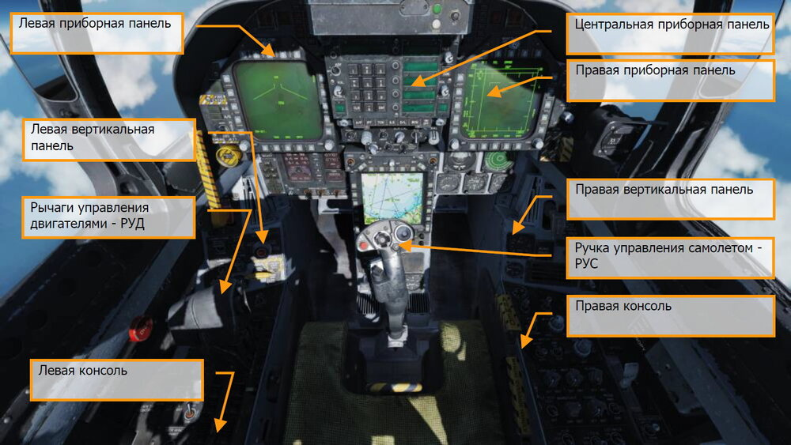

## Левая приборная панель

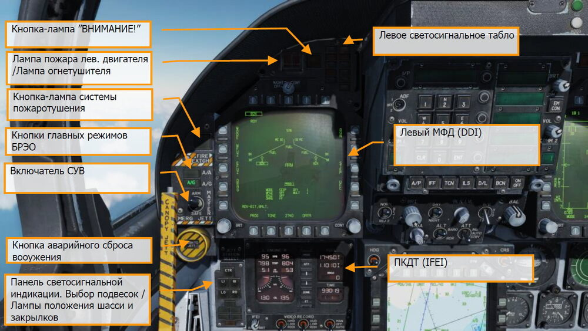

### Мультифункциональный дисплей - МФД (DDI)

Левый и правый МФД являются 3-х цветными дисплеями, которые обеспечивают отображение
информации и управление функциями бортового оборудования. Вокруг МФД находятся 20
функциональных кнопок, предназначенных для выбора функций и режимов текущего меню.

### Переключатель выбора уровня яркости

Данный переключатель в позиции OFF отключает МФД. В позиции NIGHT данный переключатель
обеспечивает режим пониженной яркости, позиция DAY обеспечивает более интенсивную
яркость дисплея.

### Регулятор яркости (BRT)

Этот регулятор изменяет интенсивность яркости символов и текста.

### Регулятор контрастности (CONT)

Регулятор изменяет контраст между символикой и тёмным фоном на любом уровне яркости.

### Кнопки главных режимов БРЭО

Существует 3 главных режима бортового радиоэлектронного оборудования (БРЭО):
навигационный (NAV), воздух-воздух (A/A) и воздух-поверхность (A/G). Кнопка A/A переводит
системы в режим Воздух-Воздух [[1]], кнопка A/G переводит системы в режим Воздух-Поверхность
[[2]]. Если ни одна из этих кнопок не нажата активируется режим навигации – NAV. Режим
навигации, также, активируется при выпущенных шасси; при активации режима вывода из
штопора (SPIN); когда самолёт находится на земле и угол дачи РУД составляет свыше 56°. Вход
в режим В-В осуществляется нажатием кнопки A/A или при выборе любого оружия типа В-В с
помощью переключателя выбора вооружения на РУС. Вход в режим В-З осуществляется
нажатием кнопки A/G.

### Включатель СУВ (Master Arm Switch)

Данный включатель переводит систему управления вооружением (СУВ) в боевое состояние [[M]].
Пуск\Сброс вооружения и авиационных средств поражения (АСП) может быть выполнен только
в случае, если данный переключатель находится в положении ARM.

### Кнопка аварийного сброса (EMERG JETT)

Кнопка с подписью EMERG выполняет аварийный (экстренный) сброс с 2/3/5/7/8 точек подвески.
При удержании кнопки более 375мс происходит сброс вооружения.

### Панель светосигнальной индикации

Данная панель состоит из трёх частей, верхняя часть используется для выбора точек подвески
при сбросе боеприпасов, две нижние части - для отображения статуса шасси и закрылков.
Данная панель служит для выбора точек подвески при выполнении аварийного сброса
вооружения, две нижние панели обеспечивают отображение состояния шасси и закрылков.

### Кнопки выборочного сброса вооружения

Выборочный сброс подвесок осуществляется с помощью галетного переключателя на левой
вертикальной панели в сочетании с кнопками выбора точек подвески. Сброс осуществляется с
помощью нажатия кнопки JETT. Кнопки предназначены для выбора точек подвески, которые
будут сброшены. Галетный переключатель JETT используется для выбора АСП на конкретном
пусковом устройстве. С помощью данных органов управления возможен сброс ракеты AIM-7,
подвешенной на правой или левой подфюзеляжной точке подвески. Работа механизма выбора
подвесок для сброса возможна только при условии, что шасси убраны и установлены на замки,
включатель СУВ находится в позиции ARM и галетный переключатель JETT находится в позиции
SAFE.

Кнопки выборочного сброса подписаны как CTR (центральная), LI (левая подфюзеляжная), RI
(правая подфюзеляжная), LO (Левая крыльевая), RO (Правая крыльевая). Нажатие подсвечивает
ее, выбирая пилон для сброса боеприпаса. Выбор АСП осуществляется при помощи поворотного
переключателя в сочетании с кнопками выбора точек подвески. Нажатие на кнопку подсвечивает
её и выбирает точку подвески для аварийного сброса подвесного вооружения. Аварийный сброс
подвесок также используется как резервное средство применения вооружения в режиме A/G.

### Индикаторы состояния шасси

На данной части панели размещены 3 зелёных табло NOSE, LEFT и RIGHT. Светосигнализаторы
индицируют выпуск и установку шасси на замки или ошибку установки шасси на замки.

### Индикаторы положения закрылков

Зеленые табло означают, что самолёт находится в пределах тех параметров полёта, при
выдерживании которых, возможен выпуск закрылков в положение, соответствующее позиции
переключателя.

-  HALF (выпущены наполовину). Переключатель закрылков FLAP находится в
положении HALF, скорость полёта не более 250 узлов.
-  FULL (выпущены полностью). Переключатель закрылков FLAP находится в
положении FULL, скорость полёта не более 250 узлов.
-  FLAPS. Переключатель FLAP находится в положении HALF/FULL, скорость полёта более
250 узлов; закрылки находятся в нештатном положении (отказ, отсутствие давления в
гидросистеме); при активированном режиме выхода из штопора (SPIN RECOVERY);
тумблер GAIN (панель FCS) находится в положении ORIDE.

### Прибор контроля топлива и двигателей - ПКДТ (IFEI)

Данный прибор состоит из двух жидкокристаллических экранов, отображающие: Обороты
двигателей (N2 в %), температуру газов за турбинами (EGT, градусы Цельсия), расход топлива
в двигателях (FF), положение сопел (NOZ, %), давление масла в двигателях (OIL, фунты/кв.
дюйм). При выполнении запуска двигателя дисплей запитан от батареи до полного
включения/раскрутки ВСУ (вспомогательная силовая установка) и показывает только обороты и
температуру газов. Все данные отображаются только при подключенном внешнем источнике
питания или после раскрутки ВСУ

**Обороты двигателя (RPM N2)**. Отображает обороты ротора высокого давления в диапазоне
от 0 до 100%. Индикация работы двигателей на режиме ФОРСАЖ не предусмотрена

**Температура газов (EGT TEMP)**. Отображает температуру выходящих газов турбины (EGT) в
диапазоне от 0°C до 1999°C.

**Расход топлива (FF)**. Отображает расход топлива на безфорсажном режиме (расход топлива
на форсажном режиме не отображается) в диапазоне от 300 до 15 000 фунтов/час с шагом в 100
фунтов. В случае, если расход топлива ниже 320, на дисплее отображается значение 0.

**Положение сопел (NOZ)**. Отображает положение сопел в диапазоне от 0 до 100% раскрытия
с шагом в 10%.

**Давление масла (OIL)**. Отображает давления масла в двигателях в диапазоне от 0 до 195
фунтов/кв. дюйм с шагом в 5.

Топливная панель FUEL содержит 3 цифровые экрана, обеспечивая динамическое отображение
количества топлива. Верхний экран индицирует общее количество топлива (с шагом 10 фунтов).
Средний экран индицирует общее количество топлива во внутренних баках. Символы T/I справа
от верхнего и среднего счётчиков обозначают Total (общее количество топлива во внешних и
внутренних баках) и Internal (общее количество топлива во внутренних баках).
Нижний счетчик BINGO отображает выбранное значение минимального остатка топлива, для
оповещения о необходимости возвращения на авиабазу (шаг счётчика - 100 фунтов).

**BINGO**. Значение аварийного остаток топлива может быть задано с помощью стрелок
вверх/вниз на IFEI. Установленное значение отображается в фунтах в специальной секции
совмещенного индикатора состояния двигателей/топлива и будет использовано для
срабатывания текстового и аудио предупреждения об низком остатке топлива Bingo.

**Кнопка MODE**. Двойное нажатие на данную кнопку предоставляет возможность ввода даты и
времени. Для переключения между редактированием часов (H), минут(M), даты (D) и года (Y)
используется кнопка QTY. После выбора желаемого параметра используйте стрелки вверх/вниз.

**Кнопка ZONE**. Нажатие кнопки ZONE на IFEI переключает отображение времени между
местным и всемирным ZULU (Z) временем.

**Кнопка ET**. Нажатие на кнопку ET запускает таймер (в секундах). Второе нажатие устанавливает
таймер на паузу. Третее нажатие возобновляет отсчет времени. Длинное нажатие на данную
кнопку выполняет сброс таймера на ноль.

**Регулятор яркости IFEI**. В левом углу данного индикатора находится регулятор яркости IFEI,
который используется для управления и настройки яркости символики IFEI и зависит от режима
внутрешнего освещения (NITE или NVG). Данный регулятор неэффективен в режиме DAY.

### Лампа-кнопка пожара левого двигателя / Лампа огнетушителя

При обнаружении пожара левого двигателя, загорается (постоянное свечение) красная лампа
кнопка FIRE и звучит предупредительное речевое сообщение «Engine Fire Left» (Пожар левого
двигателя). Для выполнения тушения пожара (впрыск огнегасящей смеси в двигатель/ главный
редуктор), пилот должен поднять защитную крышку лампы кнопки FIRE и нажать ее. Данная
кнопка имеет 2 функции. После первого нажатия происходит перекрытие клапана подачи
топлива в двигатель, выполняется зарядка огнетушителя и загорается зеленое табло READY
(готовность). Повторное нажатие лампы-кнопки FIRE возобновляет подачу топлива в двигатель
и табло READY гаснет.

### Кнопка-лампа “ВНИМАНИЕ!” (MASTER CAUTION)

Жёлтая лампа кнопка MASTER CAUTION в левой верхней части панели инструментов загорается
при    срабатывании   каких-либо     предупредительных    табло  или   при   появлении
предупредительных/аварийных сообщений на дисплеях. Предназначена для привлечения
Внимания пилота к произошедшему. После нажатия лампа кнопка гаснет. Звуковой сигнал
воспроизводится всякий раз, когда загорается лампа кнопка MASTER CAUTION. Данная кнопка
также служит для перегруппировки предупреждений и оповещений на левом МФД.

### Левое светосигнальное табло

Данная панель обеспечивает индикацию нормальных режимов эксплуатации самолёта (зеленые
индикаторы), предупреждений о сбоях или ситуациях, требующих внимания пилота (желтые) и
о возникновении аварийной ситуации (красные индикаторы). Желтое табло не всегда указывает
на неисправность в системе и не всегда требует немедленных действий для устранения
неисправности, но требуют обязательного внимания. После устранения неисправности,
предупредительные светосигнальные табло отключаются и сообщения на МФД исчезают.

**L BLEED**. Табло загорается, когда нажат и удерживается переключатель (FIRE Test A/B)
проверки системы обнаружения пожара двигателя и утечки воздуха или обнаружен пожар (>600
°F) в воздухозаборнике левого двигателя. После загорания табло происходит перекрытие левого
клапана подачи воздуха. Также будет воспроизведено речевое сообщение "Bleed Air Left, Bleed
Air Left". Предупреждение “ L BLD OFF” будет отображено на левом МФД.

**R BLEED**. Все тоже самое, только для правого двигателя. Происходит перекрытие правого
клапана подачи воздуха, и воспроизводиться речевое сообщение "Bleed Air Right, Bleed Air Right".
Предупреждение “ R BLD OFF” будет также отображено на левом МФД.

**SPD BRK**. Табло горит, когда тормозной щиток не полностью убран.

**STBY**. Табло загорается, когда переключатель режимов станции РЭБ ALQ-165 установлен в
положение STBY и постановщик помех находится в режиме прогрева. Процедура прогрева длится
5 минут, по истечению времени - табло отключается. Будет реализовано позже, в период раннего
доступа.

**L BAR (Красная)**. Табло индицирует неисправность механизма броскового зацепа (штанги)
предназначенного для сцепления с крюком челнока броскового устройства катапульты. При
неисправности бросковой штанги уборка шасси становиться невозможной. Бросковая штанга
может быть опущена только тогда, когда самолёт находится на земле (Weight on Wheels - стойки
шасси обжаты).

**L BAR (Зелёная)**. Индицирует нормальное опускание и работу механизации бросковой штанги.
Штанга может быть опущена только при нахождении самолёта на земле (стойки шасси обжаты,
Weight on Wheels). Табло гаснет, когда переключатель бросковой штанги находится в положении
UP (Специальный механизм удерживает штангу в опущенном состоянии до окончания момента
взлета с помощью броска паровой катапульты).

**REC**. Табло загорается, когда самолёт облучают радиоволнами радаров. Будет реализовано
позже, в период раннего доступа.

**XMIT**. Табло загорается, когда станция РЭБ выполняет постановку помех. Будет реализовано
позже, в период раннего доступа.

**GO**. Индикация успешного встроенного самотеста ALQ-165. Лампа будет подсвечена до тех пор,
пока режим BIT не будет отключен. Будет реализовано позже, в период раннего доступа.

**NO GO**. Индикатор сбоя встроенного самотеста ALQ-165. Табло будет гореть до тех пор, пока
режим тестирования ALQ-165 не будет отключен. Станция ALQ-165 не функционирует. Будет
реализовано позже, в период раннего доступа.

### Кнопка огнетушителя

Данная кнопка имеет два типа подсветки. Желтая подсветка с надписью READY (Готовность) и
Зеленая подсветка с надписью DISCH (Разряжено). Если горит табло READY - это значит, что
баллон с огнегасящей смесью заряжен. Табло READY загорается, когда загорается лампа кнопка
FIRE. Нажатие кнопки FIRE перекрывает подачу топлива из расходного бака. Нажатие кнопки
тушения двигателя выполняет впрыск огнегасящей смеси в двигатель, после разряда баллона со
смесью загорается табло DISCH.

## Центральная приборная панель

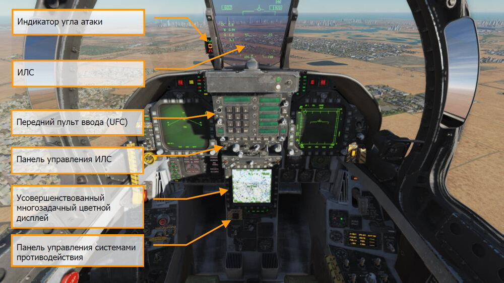

### Индикатор на Лобовом Стекле (HUD)

ИЛС используется как основной инструмент при выполнении полётов, отображая статус
вооружения и режимы применения вооружения в различных режимах отображения индикации.
ИЛС воспроизводит боевую, навигационную, тактическую информацию от левого и правого МФД
(под контролем вычислительного компьютера MC - mission computer) и проецирует символику на
комбинированном стекле для удобства чтения. Более подробно ИЛС описан в последующих
разделах данного документа.

### Индикатор угла атаки посадочный - ИУАП

Данный индикатор установлен слева от ИЛС и отображает посадочный угол атаки, подсвечивая
соответствующие символы. Индикация дублируется показаниями на ИЛС. Данный указатель
функционирует только при выпущенных шасси, при не обжатых стойках шасси (WoffW), при
наличии корректных данных ЭВМ воздушных параметров об угле атаки и корректной работе
самой ЭВМ. Символы на индикаторе угла атаки мигают, если тормозной гак поднят и
переключатель HOOK Bypass, который находится на левой вертикальной панели, установлен в
позицию CARRIER. Символы не мигают, если данный переключатель находится в позиции FIELD.
Переключатель удерживается соленоидом в позиции FIELD и автоматически переключается в
позицию CARRIER при выпуске тормозного гака или при отключении подачи питания на борт.

Регулятор AOA на панели управления индикацией ИЛС регулирует яркость символики указателя
УА.

При обжатии стоек шасси данный указатель не функционирует.

СИМВОЛ  | СКОРОСТЬ | УГОЛ АТАКИ
-------|-----------|----------
 | Слишком медленно    |9.3° до 90.00°
 | Пониженная          |8.8° до 9.3°
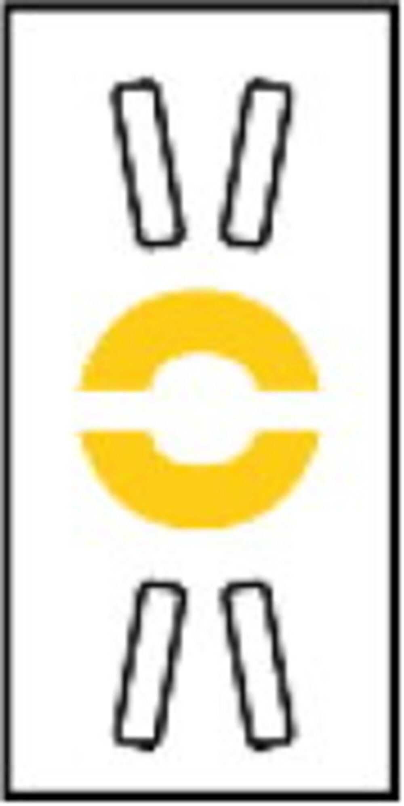 | На заданной скорости |7.4° до 8.8°
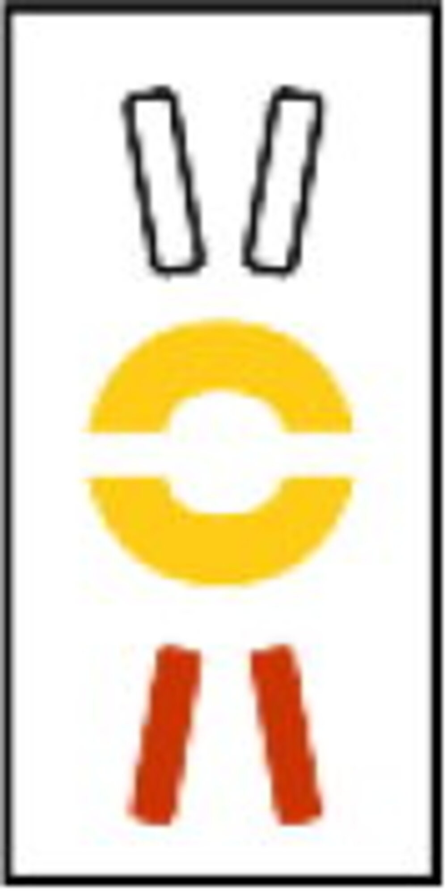 |Повышенная         | 6.9° до 7.4°
 |Слишком быстро     | 0° до 6.9°

### Пульт ввода и информации - ПВИ (UFC)

Пульт размещён на главной панели инструментов ниже ИЛС и используется для выбора режимов
автопилота, настройки системы инструментальной посадки, системы обмена данными (Datalink)
и управление радиостанциями. Данный пульт используется в сочетании с левым/правым и
центральным МФД для ввода навигационных, боевых данных, настройки сенсоров и данных
системы передачи информации.

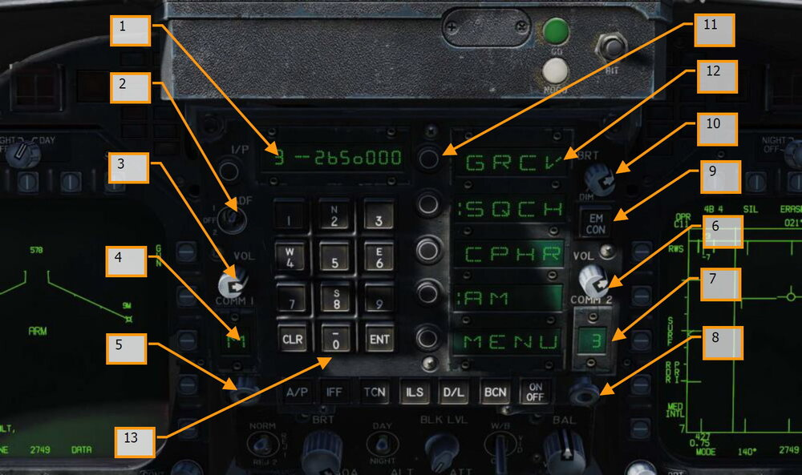

1.   **Дисплей данных**. На Дисплее данных отображаются вводимые буквенно-цифровые
символы в 9-тизначном формате. Первые 2 символа являются буквенно-цифровыми, а
остальные 7 являются цифровыми.
2.   **Автоматический радиокомпас (ADF)**. Данный тумблер включает режим
автоматического радиокомпаса на выбранный радиомаяк. В положении ADF 1 режим
автоматического радиокомпаса будет использовать радиостанцию COMM1,
соответственно ADF 2 будет использовать радиостанцию COMM2. Положение OFF
отключает режим АРК. Для более детальной информации обратитесь к разделу
«Навигация ADF» данного руководства.
3.   **Регулятор громкости радиостанции COMM 1**. Перевод регулятора громкости в
положение OFF отключает радиопередачу COMM 1. При выводе регулятора из
положения «OFF» изменяется громкость звука для соответствующей радиостанции
(COMM 1).
4.    **Дисплей каналов/режимов радиостанци COMM 1**. Данные на дисплее
отображают выбранный канал (1–20), а также G (Guard), M (Manual), C (Cue) и S
(Maritime).
5.    **Селектор выбора каналов/режимов COMM 1**. Вращение селектора (колесом
мыши) переключает каналы с 1 по 20, G (Guard), M (Manual), C (Cue) и S (Maritime).
Выбранный канал отображается на дисплее канала COMM 1. Вытягивание
подпружиненного селектора (правой кнопкой мыши) приводит к отображению
выбранного канала и его частоты на дисплее и позволяет изменить его частоту с
помощью клавиатуры ввода данных.
6.    **Регулятор громкости радиостанции COMM 2**. Перевод регулятора громкости в
положение OFF отключает радиопередачу COMM 2. При выводе регулятора из
положения «OFF» изменяется громкость звука для соответствующей радиостанции
(COMM 2).
7.    **Дисплей каналов/режимов радиостанции COMM 2**. Данные на дисплее
отображают выбранный канал (1–20), а также G (Guard), M (Manual), C (Cue) и S
(Maritime).
8.    **Селектор выбора каналов/режимов COMM 2**. Вращение селектора (колесом
мыши) переключает каналы с 1 по 20, G (Guard), M (Manual), C (Cue) и S (Maritime).
Выбранный канал отображается на дисплее канала COMM 2. Вытягивание
подпружиненного селектора (правой кнопкой мыши) приводит к отображению
выбранного канала и его частоты на дисплее и позволяет изменить его частоту с
помощью панели ввода данных.
9.    **Кнопка подавления излучений EMCON**. Нажатие кнопки блокирует излучение
БРЛС, радиовысотомера, Datalink, “Walleye“. При этом в пяти окнах Дисплея опций
отображаются вертикально символы E, M, C, O, N. Повторное нажатие кнопки
возобновляет излучение от этих систем.
10.   **Регулятор яркости UFC. Рукоятка имеет позиции BRT (ярко) и DIM**. Яркость
дисплеев UFC и панели ввода данных увеличивается при повороте рукоятки по часовой
стрелке в направлении позиции BRT.
11.   **Кнопки выбора опций**. Пять кнопок выбирают или отменяют выбор опции/режима
на Дисплее опций.
12.   **Дисплей опций**. Дисплей опций может отображать пять возможных опций/режимов,
четырьмя буквенно-цифровыми символами для каждого.
13.   **Кнопочная клавиатура**. Кнопочная клавиатура содержит буквенно-цифровые
кнопки, кнопку CLR (очистить) и кнопку ENT (ввод). Нажатие на буквенно-цифровую
кнопку вводит соответствующее буквенно-цифровое значение в блок управления
преобразователем. Символ (цифра или буква) нажатой кнопки отображается в правой
стороне дисплея. Индикация смещается влево при вводе следующего символа.
Значения десятичной точки или градусов/минут автоматически отображаются в
нужном положении при вводе соответствующей информации. Ввод завершающих
нулей в соответствующей информации обязателен.

Нажатие кнопки CLR очищает Дисплей данных и/или Дисплей опций. Первое нажатие
кнопки CLR очищает Дисплей данных, второе нажатие очищает Дисплей опций.
Нажатие кнопки ENT приводит к тому, что данные, введенные с клавиатуры и
отображаемые на дисплее, вводятся в блок управления преобразователем, для
изменения параметров работы соответствующих систем или сделать данные
доступными для бортовой ЭВМ (MC Mission Computer). Если введенные данные
соответствуют формату и верны, дисплей мигнет один раз. Если вводимые данные
неверны, индицируется значение ошибки (ERROR) и мигает на Дисплее данных до тех
пор, пока он не будет очищен.

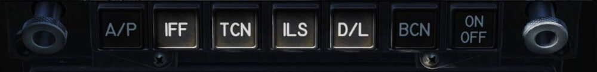

**Кнопки выбора функций**. Кнопки выбора функций, изображенные на рисунке выше, являются
переключающими между обозначенными функциями. При нажатии конкретной кнопки выбора
функции, параметры управления для этого оборудования отображаются на Дисплее опций (в
случае нажатия кнпоки A/P происходит включение автопилота).

Кнопка автопилота (A/P) отображает возможные режима автопилота на Дисплее опций, а
выбранный опции/режимы отмечены символом (:). Обратите внимание, что нажатие кнопки A/P
не включает автопилот!

Если опция/режим включены, значение ON отображается в первых двух буквенных позициях
Дисплея данных. Если первые две буквенно-цифровые позиции пусты - система/режим
отключены. Повторное нажатие кнопки выбора функции очищает дисплей UFC. Нажатие кнопки
выбора функции, вытягивание рукоятки селектора каналов или получение команды режима UFC
с бортового компьютера (MC) завершает все предыдущие действия, при этом все предыдущие
введенные данные сохраняются и доступны при новом вводе.

**Кнопка включения автопилота (A/P)**. Автоматическая система управления полётом
(автопилот, A/P) имеет два основных режима: помощь пилоту и Data link. Режим Помощь пилоту
включает удержания курса, выбора курса, стабилизации пространственного положения,
удержание барометрической высоты, удержание высоты по радиовысотомеру, воздействие на
РУС (CSS) и совмещенного управления. Режим Data link включает автоматическую систему
посадки на авианосец (ACL), высокоточного курсоуказателя и вектора подхода. Совмещенное
управление состоит из управления по Линии наведения по азимуту (ASL), управления углом
крена (BNK), управления по путевым точкам (WYPT), совмещенного управления по
автоматической (AUTO) последовательности (SEQ) и совмещенного управления TACAN (TCN).
Управление режимами A/P осуществляется с помощью переключателей на Переднем пульте
управления (UFC), задатчиками направления и курса на панели управления курсом и
направлением, а также кнопкой Отключения механизма разворота носовой стойки/отключение
автопилота (autopilot disengage/nosewheel steering) на РУС.

Для активации любого из режимов необходимо привести угол крена к значению, равному или
меньше 70 °, угол тангажа должен быть меньше или равен 45 °, нажата кнопка A/P. Нажатие
кнопки A/P отображает следующие варианты режимов автопилота: ATTH (Стабилизация
пространственного положения), HSEL (Выдерживание направления), BALT (Удержание
барометрической высоты), RALT (Удержание радиолокационной высоты) и режим CPL
(совмещенного управления) (если доступно) на Дисплее опций UFC.

После того как на UFC установлен режим работы A/P, перед выбранным режимом на дисплее
появляется символ (:), и индикация выбранного режима появляется на соответствующем
дисплее DDI. Если режим недоступен, он не отображается. Когда на UFC выбран режим CPL,
управление полётом будет происходить в режиме совмещенного управления (только по
азимуту). Ограничение по углу крена, опция BLIM, доступен на подстранице A/C DATA. NAV BLIM
ограничивает угол крена в 30 °. TAC BLIM ограничивает угол крена в 30 ° и 60 °, в зависимости
от скорости. Опция «Пролет» (OVFLY) доступна на дисплее WYPT DATA. OVFLY используется во
время управления полётом в автоматической (AUTO) последовательности (SEQ), если
необходимо пропустить путевую точку (WYPT), иначе система вернет самолёт к этой путевой
точки, чтобы только затем взять курс на следующую путевую точку.

#### Режимы автопилота

Нажатие кнопки A/P отображает режимы работы автопилота. Выбор производится нажатием
Кнопками выбора режима/опции рядом с нужным режимом. Выбранный режим отмечен символом
(:). Повторное нажатие кнопки A/P отключает отображение режимов автопилота.

**ATTH**: выбран режим Стабилизации пространственного положения. Выбирается нажатием
Кнопки выбора режима около Дисплея режимов, с индикацией ATTH. Выбранное состояние
отмечается символом (:) на Дисплее опций ATTH. Самолёт будет поддерживает текущие на
момент включения (ON) режима значения тангажа и крена.

**BALT**: выбран режим Удержания барометрической высоты. Для выбора нажмите Кнопку выбора
режима около Дисплея опций, с индикацией ATTH. В момент активации (ON) режима
фиксируется текущая барометрическая высота, которая будет поддерживаться. В зависимости
от того, какой режим был ранее включен, поддерживается выдерживание направления или
пространственного положения. Рабочий диапазон режима по высоте от 0 до 70 000 футов. ATTH,
CPL (бортовая ЭВМ MC OFP 13C и 15C) или HSEL могут быть активированы одновременно с BALT
для обеспечения горизонтального управления. CSS включает возврат к выдерживанию
направления или пространственного положения, в зависимости от того, какой из этих режимов
был активирован ранее.

**CPLD (еще не реализовано)**: Совмещенное управление, Автоматическая система посадки на
авианосец (ACL), Управление по Линии наведения по азимуту (ASL) или Управление углом крена
(BNK). Совмещенное управление имеет опции: WYPT, OAP, SEQ \# и TACAN.

Для выбора cовмещенного управления, необходимо выбрать нужную для него опцию на дисплее
HSІ, должен произойти обмен данными между бортовым компьютером MC1 (Mission Computer 1)
и FCS, а затем нажать Кнопку выбора режима около Дисплея опций на UFC, с индикацией CPL.

Выбранное состояние отмечается символом (:) на Дисплее опций рядом с CPL и дополнительной
индикацией CPLD на DDI.

Управление полётом совмещено (только по азимуту) с любой активной опцией Совмещенного
управления, которая обрамлена (boxed) на странице HSI. После активации Совмещенного
управления, режимы Стабилизации пространственного положения и Удержание направления A/P
недоступны. CSS доступен только для тангажа. Поперечное смещение РУС более 0,5 дюйма
заставляет автопилот отключать Совмещенное управление.

Ортодомический курс может выдерживаться в режиме «fly-to-point» или выбранным радиалом
(линию заданного пути) через «fly-to-point». Если ЛЗП установлена до начала «fly-to-point»,
система управления фиксирует выбранный радиал, самолёт пролетает «fly-to-point» и
продолжают движение по радиалу.

Опции ограничения по углу крена доступны на подстранице A/C Data и позволяет пилоту
выбирать опции TAC или NAV ограничений по углу крена. Опция NAV устанавливает ограничение
угла крена величиной не более 30 °. Опция TAC ограничивает угол крена величиной от 30 ° до
60 ° (в зависимости от скорости самолёта).
Обратитесь к Главе 24 за подробной информацией о навигации Waypoint/OAP, Auto Sequential и
TACAN Steering.

**HSEL**: выбран режим Удержание направления. Чтобы установить режим Удержание
направления, установите нужное направление на дисплее HSI, используя задатчик направления,
расположенный слева от центрального DDI. Нажмите на UFC Кнопку выбора режима около
Дисплея режимов, с индикацией HSEL. самолёт начнет изменять курс с текущего на заданный в
сторону наименьшего угла. Удержание направления устанавливается после выхода на заданный
курс. Сохраняется текущий угол тангажа. CSS доступен.

**RALT**: Выбран режим Удержание высоты по радиовысотомеру. Чтобы выбрать режим, нажмите
кнопку Кнопку выбора режима около Дисплея опций, с индикацией RALT. Выбранное состояние
отмечается символом (:) на Дисплее опций рядом с RALT. Текущая радиолокационная высота
выдерживается после активации режима (ON). Радарная высота выдерживается в пределах от 0
до 5000 футов. Если не выбран дополнительно другой режим, управление поперечными осями
удерживает текущее направление. В этой конфигурации можно использовать либо CSS, либо
управление триммерами для автоматического координированного разворота до 45 ° с
поддержанием высоты. ATTH, CPL (бортовая ЭВМ MC OFP 13C и 15C) или HSEL могут быть
выбраны одновременно с RALT для обеспечения горизонтального управления.

**Кнопка включения навигационной системы TACAN (TCN)**. Чтобы включить систему
TACAN, нажмите кнопку TCN. После нажатия отобразиться код станции TACAN и состояние
системы - ON/OFF на Дисплее данных UFC, а также опции работы TACAN на Дисплее опций UFC.
Они включают:

- T/R: Прием/передача.
- RCV: Прием.
- A/A: Air-to-Air. Работа с воздушной станцией
- X: Выбирает параметр Х канала.
- Y: Выбирает параметр Y канала.

Теперь вы можете активировать систему нажатием кнопки выбора ON/OFF, чтобы включить
систему TACAN. Номер канала TACAN можно изменить с помощью клавиатуры UFC. В режиме T/R
система TACAN вычисляет направление и замеряет наклонную дальность на выбранную станцию
TACAN. В режиме RCV вычисляется только направление на выбранную станцию TACAN. В режиме
A/A запрос и ответ - это только одиночные импульсы от одного самолёта к другому. TACAN с
информацией о направлении и дальности размещен на странице HSI. Если на странице HSI
индикация TACAN обрамлена (boxed), информация о дальности и направлении до станции
отображается на HSI и HUD. В режиме NAV и при заданном курсе информация о линии заданного
пути отображается на HUD, а дистанция до линии заданного пути (ЛЗП) отображается в нижнем
правом углу страницы HSI рядом с символом С. Например, в 15 милях от ЛЗП будет
индицироваться «15 C». Это очень полезно на участке «downwind leg», выполняя полёт курсом,
обратным посадочному (между 2 и 3 разворотом), схемы захода на посадку на авианосец.

Установите код TACAN авианосца, задайте курс для ЛЗП равным курсу авианосца, а затем
пролетайте на дальности 1,2 мили от ЛЗП на участке «downwind leg» параллельно линии хода
авианосца до начала поворота на 180°.

Более подробно см. Главу [«Навигация по TACAN»](08.nav-mode.md#tacan).

**Кнопка включения инструментальной системы посадки (ILS)**. Нажатие на кнопку
отображает номер канала Системы инструментальной посадки на авианосец (ICLS) и ее статус
ON/OFF на Дисплее данных UFC вместе с опцией CHNL, на Дисплее опций UFC. Теперь вы можете
нажать кнопку ON/OFF, чтобы включения ILS. Канал ILS можно изменить (от 1 до 20), используя
клавиатуру UFC. Номер канала ILS автоматически устанавливается, когда выбран режим ACL
Datalink. Для отображения данные системы ILS HUD, STBY GYRO, ADI, режим ILS должны быть
выбран и обрамлен (boxed) на странице HSI.
Подробнее см. Главу «Навигация ICLS».

**Кнопка ON/OFF**. Активирует или деактивирует выбранную функцию.

### Панель управления ИЛС (HUD)

Данная панель позволяет пилоту настраивать ИЛС и тип отображаемой информации.

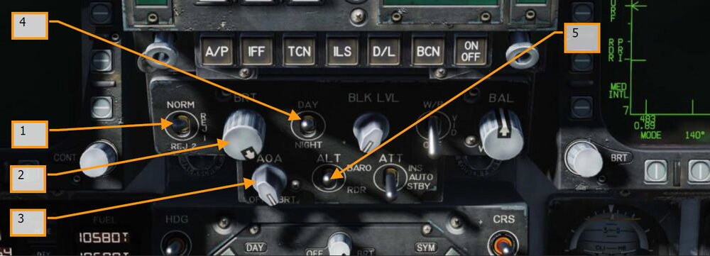

1.   **Переключатель отключения (фильтрации) символики ИЛС**. Данный
трехпозиционный переключатель имеет три положения NORM/REJ1/REJ2. В положении
NORM на ИЛС отображается штатное количество информации для всех ИЛС дисплеев.
Устанавливая в положение REJ1, на ИЛС отключается индикация числа М, текущая
перегрузка (G), планки крена и указатель крена, индикатор воздушной скорости,
высоты, индикатор максимальной положительной перегрузки и указатель требуемой
путевой скорости. Когда переключатель находится в положении REJ2, на ИЛС не
отображается вся индикация, отключаемая позицией REJ1, а также шкала
направления, указатель текущего направления, указатель требуемого направления,
блок навигационной информации (название маршрутной точки / код радиостанции
TACAN, дальность до маршрутной точки / радиостанции TACAN) и таймер ET
(Оставшееся время)/CD (Обратный отсчет).
2.   **Регулятор яркости символов ИЛС**. Данный регулятор используется для включения
ИЛС и регулировки яркости. Поворачивая данный регулятор по часовой стрелке –
увеличивается яркость ИЛС.
3.   **Регулятор яркости индикатора угла атаки**. Данный регулятор отвечает за
регулировку яркости табло индикатора угла атаки, расположенного слева от ИЛС.
4.   **Переключатель режимов яркости символов ИЛС**. Данный переключатель имеет
два положения - DAY и NIGHT. Положение DAY обеспечивает максимальную яркость
символики ИЛС в сочетании с регулятором яркости. Положение NIGHT снижает
максимальный уровень яркости символов ИЛС в сочетании с регулятором яркости
символов.
5.   **Переключатель отображения высоты**. Переключатель ALT используется для
переключения отображения на ИЛС барометрической высоты или значения высоты от
радиовысотомера и определяет приоритетное значение высоты для разных типов
расчетов бортовым компьютером. Когда переключатель установлен в положение RDR,
на ИЛС будет отображаться радиовысота и символ R. Если высота полёта выше 5000
футов над уровнем поверхности, в режиме RDR на ИЛС будет отображаться
барометрическая высота и мигающий символ B.

### Центральный цветной дисплей - ЦД (AMPCD)

Данный дисплей, в отличие от своих трехцветных братьев МФД является полноцветным, и также,
как и они адаптированным для работы в Очках Ночного Видения дисплеем, который способен
выводить все меню, отображаемые на других МФД, кроме страницы радара в режиме Воздух-
Поверхность. Четыре двухпозиционных переключателя и поворотная ручка, расположенная в
верхней части дисплея, контролируют включение/выключение дисплея, уровень яркости,
усиления и контраста, включение режимов отображения символики Day/Night.

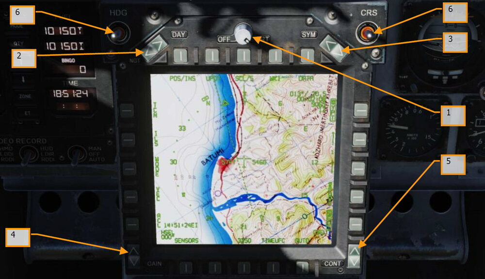

**Регулятор OFF/BRT**. Поворотный переключатель размещен в верхней части МФД и
используется для включения/выключения дисплея и регулировки яркости.

**Переключатель режимов NGT/DAY**. Данный переключатель расположен в верхнем левом
углу МФД и используется для выбора режима пониженной яркости, отключения автоматического
контраста (режим NITE) или включения режима повышенной яркости (режим DAY).

**Селектор SYM**. Однократные нажатия на верхнюю половину переключателя постепенно
уменьшают ширину символов, делая их более четкими и тусклыми. Однократные нажатия на
нижнюю половину переключателя постепенно увеличивают ширину символов, делая их ярче и
менее четкими.

**Регулятор усиления (GAIN)**. Данный регулятор отвечает за яркость фонового видеосигнала.

**Регулятор контраста**. Данный регулятор отвечает за настройку контраста дисплея.

**Задатчики Направления и Курса**. По обе стороны МФД находятся задатчики курса (CRS) и
направления (HDG) задача которых - ручная установка курса и направления на экране HSI
(Экране ПНП). Оба переключателя подпружинены, с возвратом в центральное положение и могут
быть нажаты вправо/влево для увеличения/уменьшения величины значения. Увеличение
значения направления [[LALT ]] + [[LSHIFT ]] + [[2]] и уменьшение [[LALT ]] + [[LSHIFT ]] + [[1]]. Увеличение
значения курса [[LALT ]] + [[LSHIFT ]] + [[4]] и уменьшение [[ALT ]] + [[LSHIFT ]] + [[3]].

### Панель управления системой противодействия

Помимо указателя давления в кабине (который разместился как то особняком), данная группа
приборов и органов управления относится к защитным системам самолёта, которые будут
описаны в разделе «Оборонительные системы» данного руководства.

## Правая приборная панель

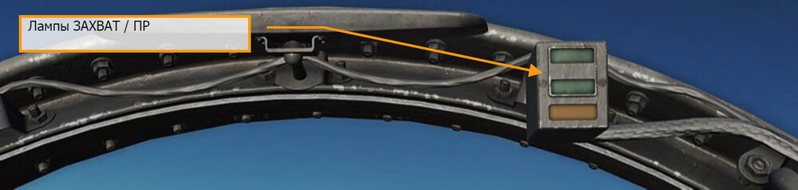

### Лампы Lock/Shoot (Захват/ПР)

Данные табло дублируют сигналы на ИЛС и очень помогают пилоту при ведении плотного
воздушного боя и маневрирования в режиме Воздух-Воздух для ракет AIM-9 Sidewinder, AIM-7
Sparrow и ВПУ когда голова пилота запрокинута вверх и времени на взгляд вниз у него нет.
Индикаторы обеспечивают визуальную сигнализацию захвата цели радаром (лампа LOCK) и
разрешение на применение вооружения (SHOOT light/SHOOT cue).

- Lock (Захват): Режим РНП – непрерывной пеленгации одиночной цели (STT - Single
Target Track) и цель находится на максимальной дальности огневого решения
(Rmax).
- Shoot (Огонь)/Постоянное свечение/Применение Ракеты: Цель захвачена и
находится на максимальной дальности огневого решения.
- Shoot (Огонь) / Мигание / Ракета: цель захвачена и на дальности гарантированного
поражения пуска.
- Shoot (Огонь)/ Постоянное свечение/ВПУ: Цель находится на дальности
разрешенной стрельбы.

Светосигнальное табло ниже индикатора SHOOT обладает сверх ярким стробоскопическим
эффектом и дублирует лампу ПР в условиях работы на солнце.

Табло SHOOT так же подсвечивается во время стрельбы НАРами в режиме Воздух-Поверхность,
при отсутствии активного профиля вооружения и выборе профиля стрельбы с ВПУ на левом
МФД. Табло LOCK не подсвечивается при работе в режиме Воздух-Поверхность

### Правое светосигнальное табло

Данная панель предоставляет набор визуальных индикаторов состояния бортового самописца и
системы предупреждения об угрозах TWS (Threat Warning System). Для более подробной
информации обратитесь к разделу “Оборонительные системы”.

- **DISP**. Табло загорается, когда активирована программа противодействия (выброс
ЛТЦ/ДО).
- **SAM**. Табло загорается, когда ЗРК типа Земля-Воздух “сопровождает” самолёт.
Лампа горит постоянным свечением, когда радар ПВО работает в режиме
сопровождения или мигает, если ПВО работает в режиме наведения ракеты.
- **AI**. Табло загорается, когда бортовая РЛС воздушного противника “захватывает”
самолёт.
- **AAA**. Табло загорается, когда радар Зенитной артиллерии “захватывает” самолёт.
Табло горит устойчиво, когда самолёт “захватывают” все типы зенитной
артиллерии, кроме ЗСУ-23-4 (табло мигает с частотой 3 Гц).
- **CW**. Табло загорается, когда система обнаруживает непрерывную волну
радиоизлучения (доплеровские радарные системы).
- **Лампа APU FIRE**. Табло загорается при обнаружении пожара в отсеке ВСУ
(Вспомогательная силовая установка).
- **Лампа FIRE/Extinguisher (пожар двигателя/огнетушитель)**. Табло загорается
при обнаружении пожара правого двигателя, температуры выше чем 1000 °F в
отсеке правого двигателя.

### Правый МФД (DDI)

Все функции правого многофункционального дисплея идентичны функциям левого МФД.
Переключатель IR Cool

Данный переключатель отвечает за ручное охлаждение ГСН ракеты AIM-9. Для более детальной
информации обратитесь в раздел AIM-9.

### Резервный авиагоризонт (SARI)

Это автономный инструмент, который индицирует угол крена, тангажа и скольжение.
Заарретировать и увеличить угол тангажа [[LALT ]] + [[LSHIFT ]] + [[V]] заарретировать и уменьшить угол
тангажа [[LALT ]] + [[LSHIFT ]] + [[X]].

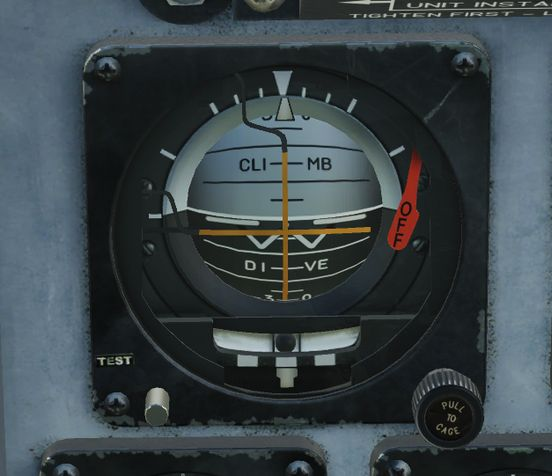

Это самостоятельный прибор гироскопического типа с электрическим приводом. Бленкер
(«флажок») OFF выпадает в случае отключения обоих источников питания, или если прибор
заарретирован. При арретировании, указатели прибора показывают 4 градуса по тангажу и 0
градусов по крену, независимо от положения самолёта. При значении крена более 5 градусов,
арретир отключает систему коррекции установки гироагрегата и гироскоп не устанавливается
правильно. На протяжении от 3-х до 5-и минут индикаторы крена и тангажа показывают 0°. Оба
указателя предполагают, что самолёт находится в прямолинейном полёте. Шкала тангажа имеет
механические ограничители примерно 90° на кабрировании и 80° на пикировании. Как только
самолёт практически выходит на вертикаль, поворотная шкала начинает совершать большие
обороты. В результате, при выходе на вертикаль, указатель крена относительно уровня
«крылышек» на шкале дает показания с большой погрешностью по крену, или тангажу, или по
обоим параметрам. Это нормально и не является показателем неисправности, или
свидетельством неправильной работы прибора. После завершения вертикального маневра,
прибор скорее всего потребуется заарретировать в горизонтальном полёте, чтобы устранить
погрешности. Вертикальные маневры с креном 7° и более, чаще всего не вызывают серьезных
погрешностей в работе гироагрегата. Стрелка и шарик расположены в нижней части прибора.
Разворот с угловой скоростью, соответствующей ширине стрелки прибора, составляет 90° в
минуту.

### Дисплей СПО (RWR)

Так же известен как приемник сигналов облучения (RWR - Radar Warning Receiver). Данный
инструмент описан в разделе “Оборонительные системы”.

### Резервный указатель воздушной скорости

Данный указатель отображает воздушную скорость в диапазоне от 60 до 850 узлов и
функционирует независимо от левого и правого приемника воздушного давления в штатном
режиме или использует правый ПВД в резервном режиме.

### Резервный высотомер

Инструмент отображает барометрическую высоту (в футах). Также, прибор имеет задатчик
атмосферного давления. Увеличить значение давления [[LALT ]] + [[LSHIFT ]] + [[S]] и уменьшить
величину значения давления [[LALT ]] + [[LSHIFT ]] + [[A]]. Данный прибор является стрелочно-
цифровым. Шкала проградуирована от 00 до 99 в тысячах футов. Длинная стрелка-указатель
отображает высоту с шагом в 50 футов. Поворотный регулятр используется для установки
желаемого атмосферного давления, которое отображается в специальном окне. Данные об
атмосферном давлении используются также ЭВМ системы воздушных сигналов.

### Резервный вариометр

Отображает скорость изменения высоты полёта самолёта.

### Регулятор яркости нашлемной системы целеуказания - НСЦ

Для включения нашлемной системы целеуказания нужно повернуть данный регулятор по
часовой стрелке. С помощью данного регулятора можно настроить яркость символики НСЦ. Для
получения более детальной информации обратитесь к разделу [Нашлемная система
целеуказания](10.a-a-mode.md#-hmd).

### Переключатель управления системой вывода из штопора

После активации системы вывода из штопора (SPIN) управляющие поверхности переходят в
режим SRM (Spin Recovery Mode). Данный режим, в отличии от режима CAS, дает пилоту
возможность полного управления элеронами, рулями направления и стабилизаторами без какоой
либо перекресной связи между управляющими поверхностями, а также, отключает обратную
связь по угловой скорости и перегрузке. Выпуск предкрылков в режиме SRM составляет 33° вниз,
выпуск закрылков составляет 0°.

-  Позиция NORM. Активация режима вывода из штопора происходит при наличии
следующих условий:
    -  Воздушная скорость составляет 120 +/- 15 knots.
    -  Устойчивая, неуправляемая угловая скорость рыскания.
    - РУС установлен в направлении, которое указанно на МФД в режиме Spin
Recovery.
    - Управляющие поверхности переходят в режим работы CAS в любой момент,
когда РУС установлен в неправильном направлении (РУС направлен в сторону
штопора), воздушная скорость выше чем 245 узлов, или угловая скорость по
рысканию уменьшается до менее чем 15°/сек.
- Позиция RCVY. Режим вывода из штопора включается, когда воздушная скорость
составляет 120 +/- 15 узлов. Управляющие поверхности переходят в режим работы CAS
в любой момент, когда воздушная скорость выше чем 245 узлов. Полный диапазон
отклонений органов управления в сторону штопора может применятся в случае, когда
переключатель находится в данной позиции и активирован режим выхода из штопора.

#### Переключатель Spin Recovery в позиции NORM

При скорости полёта в 120 +/- 15 узлов и устойчивом самопроизвольном вращении по рысканию
влево с положительной перегрузкой или устойчивом самопроизвольном вращению по рысканию
вправо с отрицательной перегрузкой:

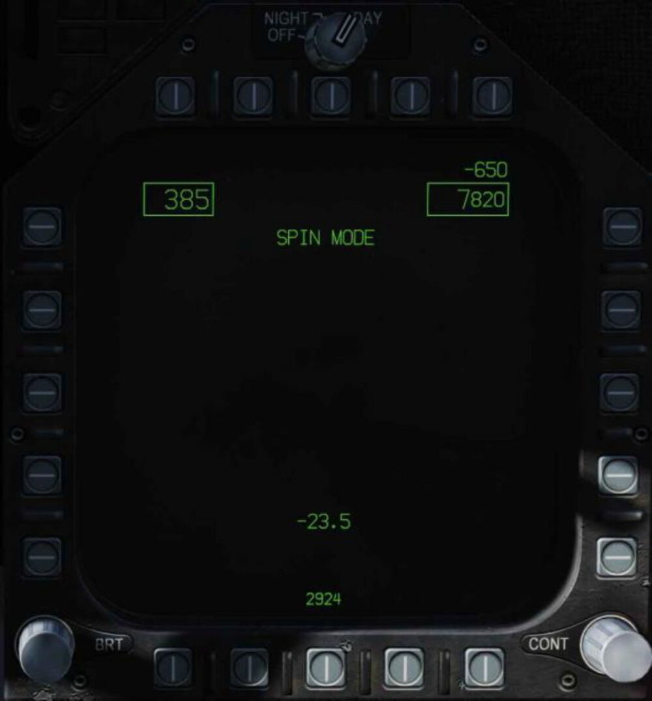

Данная индикация появляется на двух МФД после 15-секундной задержки с угловой скоростью
по рысканию в 15°/секунду до 5-секундной зарежки при угловой скорости вращения по рысканию
в 50°/сек.

При воздушной скорости в 120 ±15 узлов и вращением по рысканию вправо со скоростью в
15°/сек с положительной перегрузкой или вращением по рысканию влево со скоростью выше
15°/сек с отрицательной перегрузкой

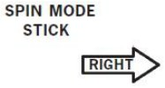

появляется на двух МФД после 15-секундной задержки со скоростью вращения 15°/сек с
уменьшением до 5-секундной задержки при скорости вращения 50°/секунду.

Когда РУС установлен в позицию, соответствующую указателям на МФД, надпись

**SPIN MODE**

изменяется на

**SPIN MODE 
ENGAGED**

Если скорость вращения по рысканию снижается ниже 15°/секунду или воздушная скорость
увеличивается до 245 узлов и выше, дисплей системы вывода из штопора заменяется
стандартным дисплеем MENU.

#### Переключатель Spin Recovery в позиции RCVY

**SPIN MODE**

Появляется на двух МФД.

Если скорость полёта снижается до 120 ±15 узлов, надпись

**SPIN MODE**

изменяется на

**SPIN MODE 
ENGAGED**

Скорость вращения по рысканию свыше 15°/секунду приводит к появлению надписей **STICK
RIGHT** (РУС ВПРАВО) или STICK LEFT (РУС ВЛЕВО) с соответствующими стрелками
указателями направления отклонения РУС на МФД.

При увеличении скорость свыше 245 узлов, надпись

**SPIN MODE**

Появляется на двух МФД и включается режим CAS.

Указатель воздушной скорости появляется в левом верхнем углу, указатель высоты появляется
в правом верхнем углу. В нижней части МФД по центру появляется указатель угла атаки.

## Левая вертикальная панель

### Рычаг сброса фонаря

Раскрашенный черно-желтыми полосками рычаг сброса фонаря находится слева в задней части
приборной панели около переплета фонаря. Для активации системы сброса фонаря потяните
ручку на себя.

### Рычаг управления шасси

Управление шасси осуществляется с помощью двухпозиционного, с ручкой в виде колеса рычага,
расположенного слева от передней панели инструментов. Для того, чтобы выполнить уборку
шасси: датчики обжатия шасси не должны ощущать присутствие веса на всех трех стойках шасси,
а бросковая штанга должна быть поднята. При соблюдении данных условий – уборка шасси
может быть выполнена с помощью перемещения данного рычага в верхнюю позицию. При
опущенной бросковой штанге, когда ручка управления шасси поднята в верхнее положение,
происходит уборка основных стоек шасси, носовая стойка остается в выпущенном состоянии.
Если датчики обжатия стоек фиксируют вес на любой из трех стоек шасси, на панели управления
шасси выдвигается механический стопор, который блокирует ручку управления шасси с позиции
DN в позицию UP. При установке рычага в нижнее положение происходит выпуск шасси.

На данном рычаге находится красная светосигнальная лампа. Данная лампа загорается всякий
раз, когда шасси находятся в переходном положении (в движении) и продолжает гореть до тех
пор, пока все три стойки не будут выпущены и установлены на замки (позицию DN) или все три
створки отсеков шасси будут закрыты (позиция UP). Лампа продолжает светиться при
выпущенных шасси, если левая или правая основная стойка шасси не установлена на замки.
Если длительность свечения лампы составляет 15 секунд и больше, произойдет срабатывание
тонального звукового сигнала.

Аварийный выпуск шасси осуществляется с помощью поворота рычага управления шасси на 90°
по часовой стрелке (нажатие ПКМ) и потянув ручку на себя до упора. Эта процедура не зависит
от положения рычага управления шасси. Однако, ручку нужно повернуть на 90° перед тем, как
потянуть. После данной операции происходит открытие клапанов аварийного управления шасси,
накопителя ВСУ и накопителя аварийного тормоза. Выпуск носовой стойки происходит путем
свободного падения/выпуска под влиянием набегающего потока, выпуск основных стоек шасси
происходит путем свободного падения/выпуска с помощью освобождения бокового фиксатора и
сжатости амортизатора. Если сигнализация указывает на небезопасный аварийный выпуск
шасси, это может быть результатом того, что предохранительный клапан ВСУ не открывается.
[[G]]

### Рычаг управления бросковой штангой (Launch Bar)

Выпуск броскового зацепа (штанги) происходит гидравлически, а возврат в поднятое положение
происходит под действием пружины. Фиксатор механически фиксирует бросковую штангу в
верхнем положении. Двухпозиционный рычаг-переключатель (позиции EXTEND и RETRACT)
Launch Bar управляет опусканием бросковой штанги. После опускания штанги загорается
зеленый транспарант L BAR. При полном выпуске, бросковая штанга лежит на уровне палубы и
прижимается с помощью пружины управления загрузкой, которая позволяет штанге совершать
вертикальные движения во время руления. самолёт подруливает к бросковому башмаку так,
чтобы зацеп на штанге прошел над крюком башмака и опустился, после этого штанга
самофиксируется на башмаке. Зеленый транспарант L BAR гаснет, когда переключатель
установлен в позицию RETRACT. Если переключатель находится в позиции RETRACT, загорается
красный транспарант L BAR, который указывает на неисправность в электрической системе
управления штангой, и как следствие, последующая уборка штанги после взлета невозможна. В
нормальных условиях, после завершения разгона при взлете с авианосца происходит отцепление
штанги из зацепа башмака, пружина подтягивает штангу вверх, разрешая выполнить уборку
шасси. На левой верхней панели находится предохранитель Launch Bar. Если потянуть данный
предохранитель на себя, произойдет обесточивание электрической системы пускового рычага.

### Переключатель управления механизацией крыла

Механизация крыла, его закрылки и предкрылки, определяют аэродинамическое качество крыла.
Этот переключатель активирует один из двух режимов компьютерного управления механизацией
(автоматическое управление или взлетно-посадочный режим).

- **AUTO**. При отсутствии веса на стойках шасси (Weight off Wheels), положение
предкрылков и закрылков зависит от значения угла атаки. При присутствии веса
на шасси (срабатывают датчики обжатия стоек шасси) происходит уборка
предкрылков и закрылков. [[F]]
- ** HALF**. На скорости ниже 250 узлов уровень выпуска предкрылков зависит от
значения угла атаки. Уровень выпуска закрылков и принижения элеронов зависит
от скорости полёта (до 30° на посадочных скоростях). На скоростях выше 250
узлов закрылки функционируют в режиме AUTO и загорается желтое табло FLAPS.
Пока самолёт находится на земле угол выхода предкрылков составляет 12
градусов. Угол выпуска элеронов и закрылков составляет 30°. При снятых с замков
консолях крыла, угол опускания элеронов составляет 0° градусов. [[LSHIFT ]] + [[F]]
- ** FULL**. На скоростях ниже 250 узлов угол выхода предкрылков зависит от значения
угла атаки. Угол выпуска закрылков и принижение элеронов зависит от скорости
полёта (в пределе до 45° у закрылков и до 42° у элеронов) на посадочных
скоростях. На скоростях выше 250 узлов закрылки функционируют в режиме AUTO
и загорается желтое табло FLAPS. Пока самолёт находится на земле, угол выхода
предкрылков составляет 12°. Угол выпуска закрылков равен 45°, а угол
принижения элеронов 42°. При снятых с замков консолях крыла, элероны
находятся в базовом положении. [[LCTRL ]] + [[F]]

### Переключатель режимов сброса подвесок

Поворотный переключатель имеет следующие положения: L FUS MSL, SAFE, R FUS MSL,
RACK/LCHR и STORES. Положения L/R FUS MSL отвечают за сброс ракет с подфюзеляжных точек
подвески. Положения RACK/LCHR и STORES предоставляют возможность ручного выбора точек
подвески с помощью кнопок выбора точек подвески. Центральная кнопка JETT активирует
электрические цепи сброса выбранного вооружения при условии, что шасси убраны и
Включатель СУВ находится в положении ARM. Положение SAFE предотвращает любой
выборочный сброс подвесного вооружения.

### Переключатель посадочной/рулежной фар

Данный переключатель управляет комбинацией посадочной/рулежной фары на носовой стойке
шасси.

- OFF. Фары отключены.
- ON. Фары включены, если рычаг выпуска шасси находится в положении выпуска
(DOWN, нижнее) и шасси выпущены.

### Переключатель включения антиюзового автомата

Данный переключатель блокирует применение тормозов при скорости движения на земле выше
50 узлов или на мокрой взлетно-посадочной полосе, препятствует вращению колес шасси на
время около трех секунд после касания. Система антиюза освобождает тормоза при 40% разнице
скоростей вращения колес основных стоек шасси. Система антиюза частично отключается на
скорости ниже 35 узлов. На скорости ниже 10 узлов происходит полное отключение антиюзового
автомата.

### Рычаг аварийного/стояночного тормоза

Данный рычаг является комбинацией аварийного и стояночного тормоза, находится в нижней
части левой вертикальной панели. Ручка имеет специальную форму. Когда рычаг находится в
аварийной позиции, пилоту видна надпись EMERG. Аналогично и с позицией стояночного
тормоза (PARK).

Система стояночного тормоза использует те же гидравлические линии, аккумуляторы и ручку,
что и система аварийного тормоза. Система может быть активирована следующим образом:
нужно повернуть рычаг на 90° против часовой стрелки из горизонтальной исходной позиции и
потянуть рычаг на себя в положение принудительной фиксации. Если активирована аварийная
тормозная система, необходимо переместить ручку в исходное положение, затем повернуть ее
на 90° против часовой стрелки и потянуть ручку в положение принудительной фиксации, чтобы
выбрать стояночный тормоз. Данное действие применяет нерегулируемое давление на дисковые
тормоза. С активированной ИНС, установленными стояночными тормозами и оба РУДа находятся
на режиме свыше 80% RPM, сработает предупреждение PARK BRK на МФД и активируется
Главный предупреждающий сигнал MASTER CAUTION. Для отключения стояночного тормоза
поверните рычаг на 45° против часовой стрелки из выдвинутого положения. Это действие
освобождает замок и позволяет ручке вернутся в горизонтальное исходное положение.

### Манометр давления тормозной системы

Данный прибор отображает давление в тормозной системе. Красная черта указывает на уровень
давления ниже 2000 фунтов на квадратный дюйм. Значение 3000 является нормальным
показателем давления.

### Переключатель Hook Bypass

При переключателе в положении CARRIER (авианосец), индикатор угла атаки будет мигать в
случае если тормозной гак в положении UP (убран) после выпуска шасси. В позиции FIELD
(аэродром) индикатор угла атаки не будет мигать, если при выпуске шасси тормозной гак
находится в положении “УБРАН (UP)”.

### Панель управления внешним освещением

Данная панель состоит из трех элементов управления освещением:

- БАНО. Данный набор включает в себя: белые лампы чуть ниже верхней законцовки
правого руля направления, 3 зеленые лампы по правому и 3 красные лампы по левому
бортам. Управление данным набором ламп осуществляется регулятором POSITION. Для
управления аэронавигационными огнями главный тумблер управления внешним
освещением должен находиться в положении ON.
- Строевые огни. Набор строевых огней состоит из 8 источников света: 2 на
законцовках крыльев, 2 на внешней стороне рулей направления, 2 в задней части
фюзеляжа ниже рулей направления и 2 по обе стороны передней части фюзеляжа
перед наплывами крыла, ниже их. Яркость строевых огней настраивается с помощью
регулятора FORMATION. Для осуществления управления яркостью строевых огней,
главный тумблер управления внешним освещением должен находиться в положении
ON.
- Проблесковые огни. Данные стробоскопы размещены по одному на каждом
хвостовом стабилизаторе на внешней стороне и управляются при помощи тумблера
STROBE. Для управления проблесковыми огнями главный тумблер управления
внешним освещением должен находиться в положении ON.
    -  OFF - Проблесковые огни отключены.
    -  BRT - Огни светятся с полной яркостью.
    -  DIM - Огни светятся с пониженной яркостью.

## Левая консоль

### Панель управления наземным электропитанием

Данная панель может быть использована после подключения внешнего источника питания
наземным персоналом для включения электрических систем без запуска двигателей или старта
самолёта без использования аккумуляторной батареи. При установке переключателя в
положение EXT PWR (внешний источник), можно выбрать любую из четырех групп приборов и
систем, на которые можно подать питание от сети А, или сети B.

### Переключатель проверки системы сигнализации о пожаре

Данный переключатель используется для проверки работоспособности электрических цепей и
сенсоров обнаружения пожара или утечки воздуха. В момент, когда переключатель установлен
в положение TEST A / TEST B, выполняется проверка обнаружения пожара, утечки воздуха и
системы голосовых предупреждений выбранного контура. В положении тестирования тумблер
должен удерживаться вручную.

Данный переключатель активирует предупредительные транспаранты L BLEED и R BLEED, а
также, вызывает появления предупреждений L BLD OFF И R BLD OFF на левом МФД.

Транспаранты L(R) BLEED гаснут в момент, когда переключатель установлен в позицию NORM.
- Позиция TEST A активирует три красные лампы пожара/пожаротушителя, голосовое
предупреждение ("Engine Fire Left, Engine Fire Left", "Engine Fire Right, Engine Fire Right",
"APU Fire, APU Fire", Bleed Air Left, Bleed Air Left", Bleed Air Right, Bleed Air Right"), два
транспаранта утечки воздуха Bleed Air и выводит 2 предупреждения на МФД,
отображая работу датчиков и схем обнаружения контура А.

- Позиция TEST B активирует три красные лампы пожара/пожаротушителя, голосовое
предупреждение ("Engine Fire Left, Engine Fire Left", "Engine Fire Right, Engine Fire Right",
"APU Fire, APU Fire", Bleed Air Left, Bleed Air Left", Bleed Air Right, Bleed Air Right"), два
транспаранта утечки воздуха Bleed Air и выводит 2 предупреждения на МФД,
отображая работу датчиков и схем обнаружения контура B.

Это подпружиненный переключатель, и если его отпустить – он вернется в центральное
положение и проверка контура будет прекращена.

### Панель управления ВСУ и запуском двигателя

Переключатель APU является двухпозиционным переключателем (ON и OFF). Позиция OFF
обеспечивает ручное отключение ВСУ. Позиция ON активирует цикл запуска ВСУ. Переключатель
электрически удерживается в позиции ON и автоматически возвращается в позицию OFF через
1 минуту после выхода второго генератора двигателя в сеть.

ВСУ (Вспомогательная Силовая Установка) – это небольшой газотурбинный двигатель, который
используется для генерации источника воздуха для питания воздушного турбостартера. ВСУ
расположена на нижней стороне фюзеляжа между двигателями с впускным и выпускным
отверстиями вниз. Гидравлический мотор, питаемый аккумулятором ВСУ, заряжается с помощью
контура гидросистемы HYD 2B и используется для запуска ВСУ. Для зарядки аккумулятора ВСУ
также может быть использован ручной насос. Бортовая батарея обеспечивает электропитание
для системы зажигания ВСУ и запускает схемы управления. ВСУ использует топливо самолёта.

Работа ВСУ – полностью автоматическая (запуск ВСУ осуществляется с помощью переключателя
APU в положении ON, на левой консоли). ВСУ может быть выключена в любой момент, установив
переключатель APU в позицию OFF. После выполнения всех процедур стартового цикла ВСУ,
загорается зеленая лампа READY.

Любой двигатель может быть запущен первым; тем не менее, запуск правого двигателя
обеспечивает штатное гидравлическое давление в тормозной системе. После загорания лампы
READY, установите переключатель ENG CRANK (удерживается электрически) в позицию R.
Данное действие открывает управляющий клапан правого воздушного турбостартера и воздух
ВСУ начинает питать турбостартеры. Турбостартер в свою очередь, начинает раскрутку
двигателя с помощью редуктора AMAD и вала трансмиссии. После подключения генератора в
сеть, переключатель ENG Crank автоматически переключается в позицию OFF. Запуск левого
двигателя происходит по той же схеме, что и правый. Через минуту, после раскрутки второго
двигателя и выхода его генератора в сеть происходит автоматическое выключение ВСУ.
Панель системы управления полётом
Поворот регулятора RUDDER TRIM (триммер рулей направления) на панели управления FCS
электрически смещает параметры ЭВМ управления полётом. При этом, педали не двигаются.

Кнопка T/O Trim находится в центре триммера рулей. При нахождении самолёта на земле,
длинное нажатие на данную кнопку выполняет триммирование управляющих поверхностей во
взлетную конфигурацию; триммеры по крену и скольжению переходят в нейтральную позицию,
триммер стабилизатора устанавливается на 12° (“нос” вверх) и обнуляет механическое
положение ручки управления. В то время, когда управляющие поверхности по крену и рысканию
оттриммированы в нейтральную позицию и стабилизаторы оттриммированы на 12° (“нос” вверх),
на левом МФД отображается оповещение TRIM, пока кнопка T/O не будет отпущена. В полёте с
рабочей системой CAS (Система Усиления Управляющих Сигналов), нажатие на кнопку T/O
только нейтрализирует механическую позицию ручки управления самолётом.

### Панель управления громкости шлемофона

Регуляторы (TCN, WPN, и RWR) на панели управлению громкостью обеспечивают управление
громкостью шлемофона.

- TCN. Громкость аудио сигнала TACAN (кода Морзе).
- RWR. Выходной аудиосигнал системы СПО.
- WPN. Аудио сигналы вооружения (т.е., ГСН AIM-9)

### Панель управления подачей кислорода

Данная панель состоит из переключателя управления бортовой системой генерирования
кислорода и регулятора уровня подачи кислорода.
Вдоль левой стенки находятся предохранители каналов FCS 1 и 2, предохранитель воздушного
тормоза (SPEED BRAKE) и пускового рычага (LAUNCH BAR). Большая красная кнопка отвечает за
сброс ЛТЦ/ДО.

## Правая вертикальная панель

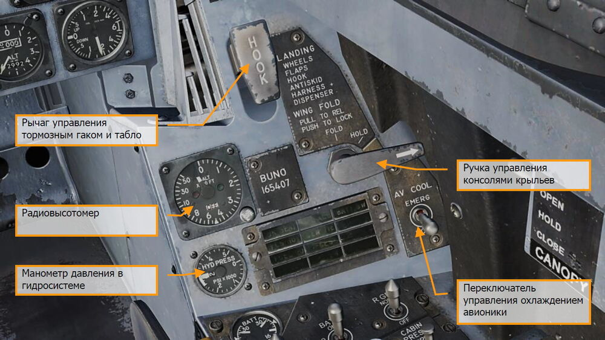

### Резервный магнитный компас

Стандартный магнитный компас установлен в правой части переплета фонаря.

### Рычаг выпуска тормозного гака и светосигнальное табло

Для выпуска тормозного гака установите рычаг в нижнее положение. Табло HOOK загорается,
когда гак находится в движении и гаснет при достижении положения выпуска/уборки. Табло
будет гореть до тех пор, пока тормозной гак находится в контакте с палубой и не может
достигнуть концевого выключателя. Также табло HOOK загорается, когда положение гака не
соответствует позиции рычага выпуска гака. Выпуск гака [[LCTRL ]] + [[H]] и уборка гака [[LCTRL ]] + [[H]]

### Рычаг управления консолями крыльев

Штатные процедуры раскладывания/складывания консолей крыла выполняются с помощью
ручки WING FOLD. Чтобы сложить консоли, потяните ручку WING FOLD на себя и поверните
против часовой стрелки, установив ручку в положение FOLD. При этом загорается главный
предупреждающий сигнал MASTER CAUTION. Чтобы разложить консоли крыла, поверните ручку
по часовой стрелке, установив ее в положение SPREAD. Для блокировки консолей после
раскладывания, утопите ручку до упора в панель. Консоли крыла могут быть зафиксированы в
любом    положении     установкой   ручки    WING     FOLD   в    позицию    HOLD    при
раскладывании/складывании.

### Радиовысотомер

Данный прибор отвечает за отображение высоты над землей или водой в диапазоне от 0 до
5,000 футов. Эксплуатация прибора основана на точном измерении времени, требуемого для
перемещения импульса электромагнитной энергии с самолёта к рельефу местности и обратно к
самолёту. Если самолёт находится на или ниже установленного уровня высоты, в кабине
срабатывают голосовые предупреждения или предупредительные аудио сигналы,
сопровождающиеся светосигнальной индикацией. В состав оборудования радиовысотомера
входит приемо-передатчик, отдельные антенны приема и передачи и указатель высоты. Приемо-
передатчик генерирует импульсы энергии, излучает энергию по направлению к земле,
принимает отраженный сигнал и обрабатывает его данные с помощью HUDU (блок ИЛС) и
отображает эти данные на указателе в виде высоты. Данный указатель состоит из калиброванной
шкалы (проградуированной в диапазоне от 0 до 5,000 футов), кнопки тестирования, указателя
опасной высоты, указателя высоты, флажка (бленкера) OFF, светосигнальной лампы опасной
высоты и лампы BIT-теста.

### Манометр давления в гидросистеме

Левая гидросистема (Гидросистема 1) питает исключительно приводы основных управляющих
поверхностей. Правая гидросистема (Гидросистема 2) также питает приводы основных
управляющих поверхностей, приводы тормозного щитка и других механических устройств.

### Правое светосигнальное табло

Все табло на данной панели являются светосигнализаторами с постоянной (не мигающей)
подсветкой.

**APU ACC**. Табло загорается, когда давление в аккумуляторе ВСУ (Ресивере) недостаточно для
запуска двигателя.

**FUEL LO**. Табло указывает на низкий уровень топлива (менее 800 фунтов) в расходных баках.
Табло будет подсвечиваться 1 минуту после каждого обнаружения низкого уровня топлива для
предотвращения множественных включений из-за колебания топлива в баках.

**L GEN**. Табло индицирует отказ левого генератора или левый генератор отключен.

**R GEN**. Табло индицирует отказ правого генератора или правый генератор отключен.

**BATT SW**. Табло загорается, когда тумблер аккумуляторной батареи установлен в положение
ON.

**FCS HOT**. Табло загорается, при обнаружении перегрева компьютера управления полётом (FCС)
и трансформатора/выпрямителя. Это связано с недостаточным охлаждением авионики в отсеке
оборудования по правому борту. В таком случае, переключатель FCS Cool должен быть
установлен в положении EMERG.

**FCES**. Табло загорается, при обнаружении отказа одного из восьми или более каналов системы
управления полётом.

**GEN TIE. Табло загорается, когда тумблер GEN TIE установлен в положение RESET**.

**CK SEAT**. Табло загорается, когда при запущенных двигателях система аварийного покидания
самолёта не приведена в готовность.

## Правая консоль

### Панель управления электросистемой

Данная панель (ELEC) состоит из тумблеров включения генераторов, аккумуляторной батареи и
вольтметра.

- ** Переключатель L GEN**. Переключатель используется для включения/выключения
левого генератора. Этот переключатель имеет два положения. NORM для включения и
OFF для отключения генератора.
- ** Переключатель R GEN**. Переключатель используется для включения/выключения
правого генератора. Этот переключатель имеет два положения. NORM для включения
и OFF для отключения генератора.
- ** Вольтметр аккумуляторных батарей**. Данный прибор состоит из двух вольтметров
- **Основного и Резервного аккумулятора**. Когда тумблер аккумуляторной батареи
находится в положении OFF, вольтметры находятся в отключенном состоянии и
указатели показывают 16В. Когда тумблер аккумуляторной батареи находится в
положении ORIDE, работает только резервный (E) вольтметр.
- ** Переключатель BATT**. Данный переключатель отвечает за работу обеих бортовых
аккумуляторных батарей и имеет три положения:
    - **OFF**. Батареи могут заряжаться, но контакторы батареи разомкнуты, и она не
подключена на бортовую сеть, находясь в условиях низкого потребления.
    - **ON**. Включает схемы управления обоих контакторов батареи так, чтобы
контактор батареи U автоматически срабатывал в случае падения
напряжения на левой шине сети постоянного тока напряжения 28 В, а
контактор батареи E срабатывал при падении выходного напряжения батареи
U и левой шины сети постоянного тока, напряжения 28 В.
    - **ORIDE**. Включает контактор батареи E, независимо от состояния заряда
батареи U, обеспечивая напряжение в левой шине постоянного тока сети 27
В. Это положение можно использовать для подключения батареи E к
основным шинам в случае, если контактор батареи U не включится в
положении ON

### Панель управления системой кондиционирования

Данная панель на стадии раннего доступа содержит следующие элементы:

- **Переключатель BLEED AIR**. Данный переключатель управляет отбором воздуха из
двигателей. При обнаружении утечки отбор воздуха из двигателей отключается
автоматически.
    - ** BOTH**. Отбор воздуха для системы кондиционирования из обоих двигателей.
    - ** R OFF**. Подача воздуха только от левого двигателя.
    - ** L OFF**. Подача воздуха только от правого двигателя.
    - ** OFF**. Отключение отбора воздуха из двигателей, прекращение охлаждения
авионики, герметизации кабины. Охлаждение будет выполняться с помощью
воздуха, сжатого за счет скоростного напора.
    - ** AUG**. Герметизация кабины при помощи отбора воздуха от ВСУ при условии,
что самолёт стоит на земле.
- **Переключатель        ENG     ANTI-ICE**.      Данный    переключатель   управляет
противообледенительной системой двигателей.
    - ** ON**. Активирует циркуляцию горячего воздуха по двигателю и его
компонентам.
    - ** OFF**. Отключает противообледенительную систему.
    - ** TEST**. Активирует предупреждение об обледенении.
- **Переключатель PITOT HEAT**. По обе стороны носовой части, перед нишей передней
стойки шасси находятся приемники воздушного давления. Каждый приемник состоит
из трубки ПИТО и приемника статического давления. Данный тумблер имеет два
положения.
    - ** AUTO**. Обогрев ПВД включается после взлета.
    - ** ON**. Обогрев ПВД включается при наличии переменного тока.

### Панель управления внутренним освещением

Данная панель содержит органы управления всеми регулировками внутреннего освещения
кабины.

- **Регулятор CONSOLES**. Регулировка встроенной подсветки, подсветки панелей левой
и правой консоли, подсветки индикатора давления в гидросистеме и подсветки
панелей предохранителей. При нахождении регулятора MODE в положении NVG
обеспечивается изменение ночного освещения консолей в пределах от OFF(ВЫКЛ.) до
BRT(ЯРК.).
- **Регулятор INST PNL**. Уровень встроенного освещения и подсветки панели приборов,
яркость фона переднего пульта ввода, яркость освещения правой и левой
вертикальной панели (за исключением манометра гидросистемы), и яркость
резервного магнитного компаса. При включенной подсветке панелей инструментов
табло SHOOT не подсвечивается. Регулятор INST PNL обеспечивает переменное
освещение в диапазоне между позициями OFF и BRT, и зависит от позиции
переключателя MODE (NORM или NVG).
- **Регулятор FLOOD**. 8 белых ламп заливающего света обеспечивают вторичное
освещение кабины. По 3 лампы размещены над каждой консолью, остальные две
подсвечивают левую и правую панели инструментов. Данный регулятор не активен,
если переключатель MODE находится в позиции NVG.
- **Регулятор CHART**. Регулятор отвечает за яркость лампы освещения наколенного
планшета. Лампа установлена на арке фонаря. Регулятор функционирует вне
зависимости от положения тумблера MODE.
- **Переключатель LT TEST**. Данный переключатель предназначен для выполнения
тестирования подсветки аварийной/предупредительной/консультативной световой
сигнализации, индикатора угла атаки и жидкокристаллического дисплея
интегрированного индикатора уровня топлива/состояния двигателей (IFEI).
- **Регулятор WARN/CAUT**. Данный регулятор отвечает за настройку яркости
Аварийных/Предупредительных светосигнальных табло, расположенных по обе
стороны переднего пульта UFC.
- **Переключатель MODE**. Переключатель имеет положения NVG, NITE и DAY.
Положение      DAY     обеспечивает     максимальный      уровень       подсветки
Аварийных/Предупредительных/Консультативных светосигнальных табло и яркости
подсветки передней консоли. Позиция NITE обеспечивает пониженную яркость
вышеперечисленных источников света/подсветки. Положение NVG обеспечивает
пониженную яркость Аварийных/Предупредительных светосигнальных табло,
отключает встроенную подсветку консолей и включает ночную подсветку консолей.

### Панель управления сенсорами

В раннем доступе функционал панели управления сенсорами состоит из поворотного
переключателя RADAR и INS. Для штатной работы навигационных функций установите
переключатель INS в позицию NAV.

- **Переключатель INS**. Данный восьмипозиционный поворотный переключатель управляет
Инерциальной Навигационной Системой. Реализованы следующие позиции:
    - **OFF**. Отключает питание ИНС.
    - **CV**. Переключает ИНС в режим согласования на авианосце.
    - ** GND**. Переключает ИНС в режим согласования на земле.
    - ** NAV**. Переключает ИНС в навигационный режим.
- **Переключатель RADAR**. Четырехпозиционный поворотный переключатель управляет
подачей электропитания к радару.
    - ** OFF**. Набор инструментов радара не запитан.
    - ** STBY**. Подает питание на все компоненты радара кроме источников высокого
напряжения. Выполняется прогрев радара перед применением высокого
напряжения или прекращается подача высокого напряжения, поддерживая работу
радара в режиме ожидания.
    - ** OPR**. Активирует радар в режим работы при условии, что пройден процесс
прогрева.
- **Переключатель FLIR**. Это 3-х позиционный переключатель, который отвечает за подачу
питания к прицельному контейнеру ATFLIR.
    - ** OFF**. Обесточивает прицельный контейнер.
    - ** STBY**. Включает резервное электропитание, активирует процедуру охлаждения
детектора.
    - ** ON**. Подает питание для контейнера ATFLIR.
- **Переключатель LTD/R**. Это двухпозиционный переключатель, который сперва должен
быть поднят, перед переключением в магнитно удерживающую позицию. Переключатель
LTD/R активирует лазер.
    - **SAFE**. Отключает излучение лазера.
    - **ARM**. Включает лазерное излучение. Магнитно удерживается в позиции.
- **Переключатель LST/N FLIR**. Это двухпозиционный переключатель, который отвечает за
управление системой поиска лазерного пятна и навигационным режимом FLIR.
    - **OFF**. Отключает основное питание от соединительной коробки.
    - **ON**. В данной позиции переключатель активирует реле первичного питания. 28В
постоянного тока подается на регуляторы (5В) и фильтруется.

Вдоль правой стенки расположены тумблер управления фонарем, тумблер теста системы FCS,
предохранители тормозного гака, шасси, 3 и 4 каналов FCS.

### Переключатель управления фонарем

Данный переключатель имеет 3 позиции:

- **Позиция OPEN**. Поднимает фонарь в максимальную позицию. Если переключатель
установить в данную позицию при полностью закрытом фонаре, фонарь сначала
отодвигается на 1,5 дюйма назад, перед поднятием. Если самолёт находится на земле
и стойки шасси обжаты, переключатель удерживается электромагнитом в позиции
OPEN до полного открытия фонаря и подъема в максимальную позицию, после чего
переключатель подпружинивается в позицию HOLD. Удержание электромагнитом
может быть переопределено в любое время переключением в позицию HOLD. Если
стойки шасси не обжаты, для открытия фонаря нужно установить данный
переключатель в позицию OPEN. Отражения царапин/грязи в зоне возле
переключателя управления фонарем могут непреднамеренно сдвигаться, вызывая
попытки нажатий на данный переключатель после взлета, что, как следствие, может
привести к потере фонаря.
- **HOLD**. Останавливает фонарь в любой точке при выполнении процедуры
открытия/закрытия фонаря.
- **Позиция CLOSE**. Опускает фонарь. При достижении максимальной нижней позиции
фонарь сдвигается вперед на 1.5 дюйма и происходит полное закрытие фонаря.
Закрытие фонаря можно определить по отсутствию предупреждения CANOPY и
Главного предупреждающего сигнала MASTER CAUTION. В позиции CLOSE
переключатель подпружинен в позицию HOLD.

## Ручка управления самолётом

Набор управляющих элементов РУС состоит из кнюппеля триммера, переключателя выбора
сенсоров, клавиши сброса/пуска боеприпасов в режиме A/G, гашетки применения ВПУ/Ракет,
переключателя вооружения В-В, кнопки сброса захвата/включения механизма разворота
носовой стойки. Переключатель отключения автопилота/системы разворота носовой стойки
находится ниже РУС. Позиционные сенсоры РУС передают электрический сигнал к компьютеру
управления полётом, пропорциональный смещению РУС из нейтрального положения.

Некоторые из переключателей имеют несколько функций, в зависимости от выбранного главного
режима. Эти функции мы рассмотрим в соответствующих разделах данного руководства
быстрого старта.

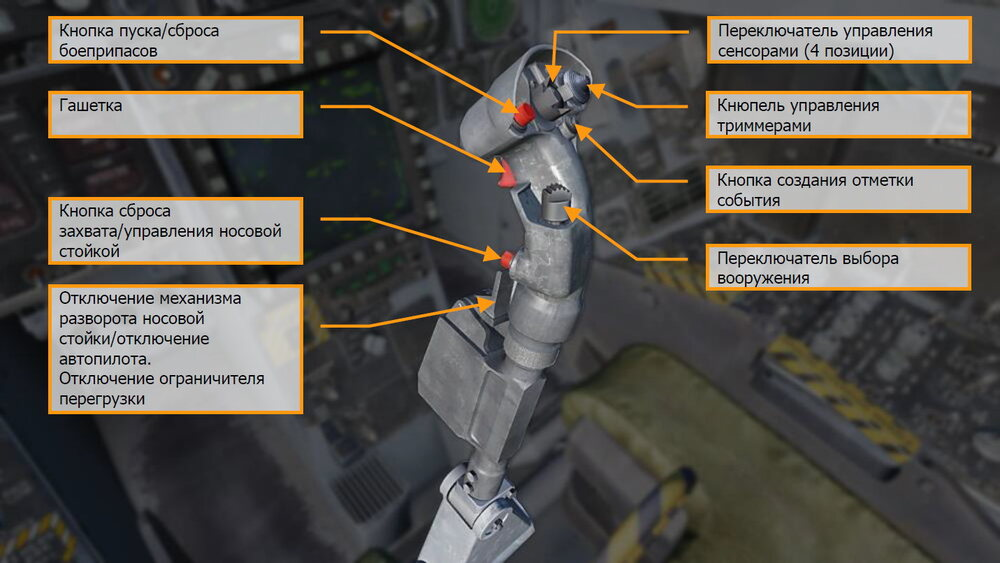

**Кнопка пуска/сброса боеприпасов**. Пуск/сброс выполняется нажатием и удерживанием
данной кнопки. С помощью данной кнопки можно выполнять пуск/сброс всех типов вооружения
В-З, включая бомбовое вооружение, неуправляемые и управляемые ракеты.

**Гашетка**. Нажмите данную клавишу для выполнения стрельбы или пуска ракеты типа В-В.

**Кнопка сброса захвата/управления носовой стойкой**. Данная кнопка имеет различные
функции, которые зависят от состояния самолёта:

- ** Управление носовой стойкой шасси**. Если стойки шасси обжаты, самолёт
находится на земле и ЭВМ управления полётом исправна, короткое нажатие на данную
кнопку включает и активирует механизм управления носовой стойкой, при этом на ИЛС
появляется надпись NWS.
- ** Сброс захвата**. Находясь вне режима управления носовой стойкой (стойки шасси не
обжаты), данная кнопка используется для сброса захвата цели или точки местности.
Даная кнопка выполняет команду возврата радара в режим поиска и сбрасывает захват
цели во всех режимах радара, за исключением режима СНП (TWS). В режиме TWS,
нажатие на данную кнопку выполняет переключение на следующую цель с более
низким приоритетом. При выполнении применения УР Maverick или бомбового снаряда
Walleye, нажатие на данную кнопку сбрасывает сопровождение цели.

**Кнопка отключения механизма разворота носовой стойки NWS**. Данный выключатель
имеет различные функции, которые зависят от состояния самолёта. Эти функции включают в
себя:

- **Управление носовым колесом**. Данный переключатель отключает механизм
управления носовой стойкой. В режиме A/A переключатель выполняет циклическое
переключение между целями в режиме AACQ. Если при рулении есть надобность
активировать режим высоких углов отклонения носовой стойки – нажмите и
удерживайте кнопку управления носовой стойкой. Если консоли крыльев сложены, и
активирован механизм NWS, вход в режим высоких углов отклонения носовой стойки
NWS HI осуществляется коротким нажатием кнопки управления носовой стойкой. При
отказе системы NWS и FCS на МФД появляются предупреждения, загорается лампа
MASTER CAUTION, надписи NWS или NWS HI на ИЛС исчезают, носовая стойка шасси
переходит в режим произвольного разворота.
- **Отключение автопилота**. Отключение автопилота и переход в режим ручного
управления полётом.
- **Переопределение ограничителя по перегрузке (G Limiter)**. Ограничитель по
перегрузке может быть переопределен с помощью мгновенного нажатия на данный
переключатель, когда РУС отклонен почти в крайней позиции на себя. Ограничение по
максимально допустимой перегрузке увеличивается на 33%. На МФД появляется
предупреждение G-LIM OVRD и загорается лампа MASTER CAUTION, в кабине
воспроизводится главный предупреждающий сигнал. Переопределение может быть
отключено, если вернуть РУС в позицию, близкую к нейтральной.

**Триммер**. В штатном режиме триммер смещает управляющие поверхности с помощью
электрических сигналов, при этом, РУС не двигается (в отличии от A-10C и Black Shark). В режиме
механизации AUTO происходит автоматическое триммирование на уровне ЭВМ управления
полётом. В режиме MECH триммер передвигает РУС вперед и назад, изменяя его нейтральную
позицию. Поперечного триммирования не существует в данном режиме.

Триммер изменяет создание перегрузки до 25 градусов угла атаки. Обычно, это 1G. Отключение
автопилота в горизонтальном полёте при перегрузке 2G при угле крена 60 градусов оставит РУС
оттриммированным на 2G. Поэтому, потребуется значительное усилие на РУС, чтобы удерживать
самолёт в горизонтальном полёте. Повторное включение режима удержания барометрической
высоты или пространственного положения в горизонтальном полёте должно выполнить сброс
триммера до 1G. Для улучшения игрового процесса, предполагается, что самолёт возвращается
на перегрузку 1G при отключении любого режима автопилота, независимо от условий.

При выпущенных закрылках, функции триммера по тангажу, как и другие триммеры,
удерживание триммера приводит к непрерывным линейным изменениям до тех пор, пока
переключатель не будет отпущен. Входные сигналы триммера при выпущенных закрылках
устанавливают ЭВМ управления полётом ориентироваться на угол атаки. С поднятыми
закрылками, сигналы триммера длительностью более 1 секунды - игнорируются. Сигналы
триммера при поднятых закрылках приводят к изменению сопровождаемой перегрузки.

**Кнопка создания отметки события**. В версии раннего доступа данная кнопка может быть
использована для гашения нашлемной системы целеуказания при нажатии.

**Переключатель выбора вооружения**. Это 4х позиционный переключатель, который
выполняет быстрый выбор вооружения типа В-В и выполняет переход в режим A/A.
Переключатель выполняет следующие функции:

- **Вперед**. Выбирает ракету AIM-7, отображает приоритетную ракету. Переключает
радар в режим 4х-полосного сканирования, устанавливает 140° ширину зоны
сканирования, 40-миль масштаб дальности и чередующуюся ЧПИ.
- **Нажатие вниз**. Выбирает ракету AIM-9 и отображает приоритетную ракету.
Переключает радар в режим 4х полосного сканирования, устанавливает 90° ширину
зоны сканирования, масштаб дальности в 10 миль для AIM-9P и AIM-9M / 20 миль для
AIM-9X, и чередующуюся ЧПИ (INTL).
- **Назад**. Выбирает и отображает индикацию ВПУ. Активирует режим GACQ в диапазоне
до 5 миль, 5-ти полосное сканирование по азимуту с высотой зоны сканирования в 20°
по углу места (вертикальное сканирование). Изменяет конфигурацию переключателя
управления сенсорами на конфигурацию управления режимами ACM.
- **Вправо**. Выбирает ракету AIM-120 и отображает приоритетную ракету. Переключает
радар в режим 4х-полосного сканирования по углу места, ширину зоны сканирования
устанавливает на 140°, 80 миль масштаб дальности для AIM-120B / 160 миль для AIM-
120C, и чередующуюся ЧПИ.

!!! note "Примечание"
    Если радар сопровождает цель в режиме STT или в режиме наведения и
    пуска (L&S), переключатель выбора вооружения изменяет лишь тип вооружения, не влияя
    на работу радара.

**Переключатель управления сенсорами**. Это 4х позиционный, кратковременный,
центрированный переключатель.

- **Вперед**. В режиме A/G предоставляет приоритет управления целеуказателем ИЛС. В
навигационном режиме (A/G или A/A неактивны) выполняет активацию режима ACM и
переход в режим визирования (BST). В режиме A/A переключает ИЛС в режим ACM и
выполняет переход радара в режим BST. Вне зависимости от главного режима быстрое
двойное нажатие (два нажатия за время меньше 1 секунды) активирует режим
радиомолчания EMCOM, следующее двойное нажатие выполняет отключение режима
EMCON.
- **Назад**. В режиме A/G предоставляет приоритет управления целеуказателем
центральному МФД. В режиме A/A предоставляет приоритет управления
целеуказателем странице SA на центральном МФД. Если самолёт находится в режиме
ACM, переключает радар в режим вертикального сканирования (VACQ). В
навигационном режиме выполняет циклическое переключение центрального МФД
между страницами HSI, SLEW и SA в таком же порядке.
- **Влево**. Предоставляет приоритет управления целеуказателем левому МФД. Если
приоритет уже предоставлен левому МФД, на котором открыта страница радара,
переключает радар в режим STT (режим сопровождения одиночной цели), если
целеуказатель (строб захвата) находится на отметке радара. Если радар сопровождает
цель, выполняет сброс сопровождения (но не целеуказания). В режиме ACM
переключает радар в режим широкоугольного сканирования (WACQ). Если на левом
МФД открыта страница прицельного контейнера ATFLIR, выполняет переключение
между режимами сопровождения A/A или A/G.
- **Вправо**. Предоставляет приоритет в управлении целеуказателем на правом МФД. Если
приоритет уже предоставлен правому МФД, на котором открыта страница радара,
выполняет переключение радара в режим сопровождения одиночной цели STT, если
строб захвата находится на отметке цели. Если на правом МФД открыта страница
прицельного контейнера ATFLIR, выполняет переключение между режимами
сопровождения A/A или A/G.

!!! note "Примечание"
    Все режимы ACM обеспечивают автоматический захват цели.

## Рычаги управления двигателями

Рукоятки РУД содержат разные переключатели, которые обеспечивают управление разными
системами, не снимая руки с РУД. Функции РУД, так же, как и РУС, зависят от состояния самолёта
и выбранного главного режима. Функции будут рассмотрены в специальном разделе данного
руководства.

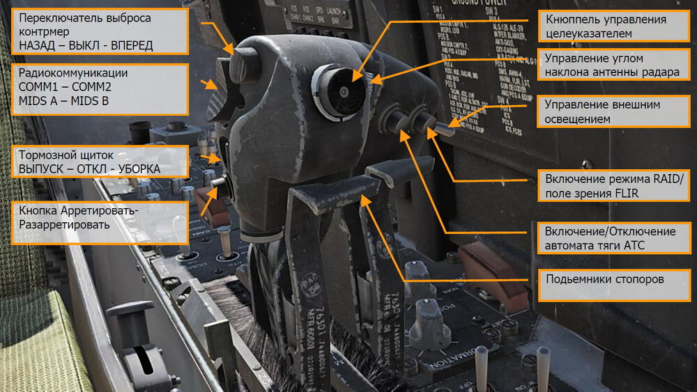

**Переключатель выброса контрмер, НАЗАД – ВЫКЛ – ВПЕРЕД**. Данный трехпозиционный
переключатель дает возможность применения системы отстрела контрмер ALE-47 в ручном и
полуавтоматическом режиме.

- **Позиция ВПЕРЕД**. Выполняет старт программы противодействия системы EW. Каждое
нажатие выполняет старт программы, выбранной на странице EW.
- **Позиция ОТКЛ**. Не задействована.
- **Позиция НАЗАД**. Выполняет одиночный отстрел ДО / ЛТЦ в ручном режиме.

**Радиокоммуникации, COMM1 – COMM2 и MIDS A – MIDS B**. Данный 4х позиционный
переключатель управляет радиопередачей четырех радиостанций. Для более детальной
информации обратитесь в раздел Системы Коммуникаций.

**Переключатель управления тормозным щитком (ВЫПУСК – ОТКЛ – УБОРКА)**.
Тормозной щиток расположен между двумя вертикальными стабилизаторами и управляется с
помощью переключателя, расположенного на РУД. Находясь в воздухе, при установленной
механизации в режим AUTO, происходит автоматическая уборка тормозного щитка при
перегрузке 6G или при угле атаки свыше 28° AOA и, если механизация находится не в режиме
AUTO, происходит автоматическая уборка щитка на скорости ниже 250 узлов. Уборка тормозного
щитка происходит автоматически при выпущенных закрылках, если переключатель управления
тормозным щитком не удерживается в позиции НАЗАД. Если механизация находится в режиме
HALF или FULL, выпуск тормозного щитка происходит до тех пор, пока удерживается
переключатель управления щитком в позиции ВЫПУСК. Тормозной щиток может быть выпущен
в любую желаемую позицию, но по нажатию переключателя в позицию УБОРКА происходит
полная уборка тормозного щитка. Тормозной щиток функционирует таким же способом и на
земле.

При выпущенных закрылках и обжатию стоек (например, после посадки или при рулении),
тормозной щиток остается выпущен, без нажатия и удерживания переключателя управления в
позиции НАЗАД.

- **Позиция НАЗАД**. Выполняет выпуск тормозного щитка до тех пор, пока удерживается
переключатель. Переключатель подпружинен в центральное положение.
- **Позиция Вперед**. Выполняет уборку тормозного щитка.
- **Позиция ОТКЛ**. Остановка выпуска тормозного щитка.

**Кнопка Арретировать/Разарретировать**. Данный переключатель имеет множество
функций, которые зависят от главного режима или выбранного типа вооружения.

- ** Навигационный режим**. Используется для арретирования/разарретирования
вектора суммарных скоростей на ИЛС.
- ** Режим A/A, AIM-9**. Управляет позицией ГСН ракеты. ГСН AIM-9 направлена вдоль
осевой линии ракеты до тех пор, пока цель не взята на сопровождения с помощью
радара. Нажатие данной кнопки выполняет переключение между наведением ГСН на
захваченную цель или установку ГСН вдоль осевой линии ГСН. При маневрировании и
наведении метки ГСН на цель можно выполнить нажатие данного переключателя для
захвата цели или источника теплового излучения головкой самонаведения ракеты в
пределах углов ее отклонения.
- ** Режим A/A, AIM-7**. В режиме A/A, если ракета Sparrow выбрана в качестве активного
АСП, данная кнопка дает команду на переход радара из режима сопровождения и
наведения в режим сопровождения одиночной цели.
- ** Режим A/G, Walleye и Maverick**. Управляет захватом ГСН, отвечает за функции
арретирования/разарретирования.

**Кнюппель управления целеуказателем (TDC)**. После определения приоритета управления
целеуказателем с помощью переключателя выбора сенсоров, кнюппель управления
используется для управления стробом захвата / сенсором.

-  Не нажат, с применением усилия влево или вправо: Выполняет перемещение курсора
влево или вправо со скоростью, пропорциональной усилию, которое применено на
кнюппель.
- Не нажат, с применением усилия вверх или вниз: Выполняет перемещение курсора
вверх или вниз со скоростью, пропорциональной усилию, которое применено на
кнюппель.
- Нажатие: Инициирует фазу захвата цели.
- Отпускание (строб захвата находится в тактической зоне дисплея): Выдает команду
радара на захват цели, создание целеуказания.

**Регулятор управления наклоном антенны радара**. С помощью данного регулятора
возможно управлять антенной радара AN/APG-73 по углу места для изменения диапазона
сканирования.

**Переключатель управления внешним освещением**. Это главный переключатель
управления внешним освещением, который находится слева на левом рычаге управления
двигателем и выполняет управление: строевыми, проблесковыми огнями, БАНО, подсветкой
тормозного гака и дозаправочной штангой.

- ВЫКЛ (НАЗАД) Отключение питания внешнего освещения.
- ВКЛ (ВПЕРЕД) Подача питания на все источники внешнего освещения.

**Кнопка выбора целей HARM / включения режима RAID / поля зрения FLIR**. Данная
кнопка имеет различные функции, которые зависят от выбранного сенсора или вооружения:

- Активирует режим RAID, когда радар находится в режиме СНП (TWS) или
сопровождения одиночной цели (STT).
- Когда ракета HARM выбрана в качестве приоритетного оружия, кнопка выполняет
переключение целей от центра дисплея HARM наружу.
- Если активным сенсором выбран ATFLIR, данная кнопка выполняет переключение
между электрооптической и FLIR (WHITE HOT) камерой.
- Если УР Maverick выбрана в качестве приоритетного вооружения, данная кнопка
выполняет переключение в режим стабилизации на земле.

**Кнопка включения/отключения автомата тяги (ATC)**. При нажатии данной кнопки, если
механизация работает в режиме HALF или FULL, происходит включение автомата тяги в режиме
APPROACH (снижение, подход), при этом угол выпуска предкрылок равен 27°. В это время,
система управления полётом модулирует тягу двигателей так, чтобы создать посадочный угол
атаки. ЭВМ, используя входные сигналы сенсоров угла атаки, нормальную составляющую
перегрузки, позиции стабилизаторов, угловую скорость по тангажу и угол крена, генерирует
сигналы управления. Эти сигналы приводят в действие установленные на двигателе блоки
управления дроссельной заслонкой, которые, в свою очередь, управляют элементами
управления подачей топлива в двигатель. Тем не менее, нормальная составляющая перегрузки
обеспечивает повышенную стабильность, позиция стабилизаторов обеспечивает повышенную
или пониженную тягу двигателей, угол крена обеспечивает дополнительную тягу при маневрах
с креном. Штатное отключение автомата тяги происходит при повторном нажатии данной кнопки
или применении усилия на РУДы. Автоматическое отключение автомата тяги происходит в
следствии следующих факторов:

-  Механизация находится в режиме AUTO
-  Отказ датчика УА
-  Два или больше отказа в предкрылках
-  Угол отклонения предкрылков меньше, чем 27°
-  Отказ кнопки управления системой автотяги
-  Отказ каналов 2 или 4 системы FCES
-  Обжатие стоек шасси
-  Реверсия системы управления полётом в режим MECH или DEL в любой из осей
-  Угол между левым или правым РУДами составляет больше, чем 10° на время больше,
чем 1 секунду
-  Угол крена выше, чем 70°
-  Отказ любой из бортовых систем
-  Включение переключателя Gain в позицию ORIDE на панели управления FCS.

**Автомат тяги ATC в режиме Cruise**. Данный режим включается с помощью кратковременного
нажатия кнопки включения автомата тяги, когда переключатель управления механизации
находится в позиции AUTO. В данном режиме ЭВМ управления полётом модулирует тягу
двигателя для выдерживания скорости на момент включения автомата тяги. Текущая скорость –
это скорость, переданная из ЭВМ расчета воздушных параметров в ЭВМ управления полётом с
помощью центральной бортовой ЭВМ. Отказ ЭВМ управления воздушными параметрами
отключает режим Cruise. Вычислитель системы управления полётом FCC использует истинную
воздушную скорость из ADC с помощью центральной бортовой ЭВМ во время включения данного
режима для генерирования управляющих сигналов. Этот сигнал затем используется в качестве
указателя для генерации сигнала ошибки, который при водит в действие, установленные на
двигателе блоки управления дросселем. Отключение данного режима возможно с помощью
повторного нажатия на кнопку активации автомата тяги или применения усилия на любой из
РУДов. Автоматическое отключение автомата тяги происходит в следствии следующих факторов:

- Механизация находится в режиме HALF или FULL
- Отказ кнопки управления системой автотяги
- Отказ каналов 2 или 4 системы FCES
- Реверсия системы управления полётом в режим MECH или DEL в любой из осей
- Угол между левым или правым РУДами составляет больше, чем 10° на время больше,
чем 1 секунду
- Отказ вычисления истинной воздушной скорости в ADC
- Отказ ADC
- Отказ любой из бортовых систем

## Аудио сигналы и сообщения

Хорнет обладает множеством аудио сигналов, таки как:

**Сигнал предупреждения о сваливании**. При угловой скорости рыскания в 25°/сек, если
вычислитель системы управления полётом FCC находится в режиме механизации AUTO, в кабине
слышен предупреждающий звук, информирующий о сваливании. Частота звукового сигнала
увеличивается с увеличением угловой скорости рыскания до 45°/сек. При угловой скорости
свыше 45°/сек, частота звукового сигнала сохраняется постоянно. На углах атаки выше 35° или
ниже -7° AOA, аудиосигнал звучит на постоянной высоте, при этом, аудио предупреждение о
высокой угловой скорости рыскания становится недоступным.

В момент, когда переключатель управления механизацией установлен в позицию FULL,
аудиосигнал предупреждения об сваливании активируется на угле атаки свыше 12° УА и
становится постоянным при углах атаки свыше 32°; когда переключатель управления
механизацией находится в позиции HALF, аудиосигнал воспроизводится на углах атаки свыше
15° и становится постоянным на углах атаки свыше 35°.

Сигнал предупреждения о сваливании не срабатывает, когда самолёт находится на земле.

**Главный предупреждающий сигнал**. Всякий раз, когда срабатывает главный
предупреждающий сигнал, происходит воспроизведение главного предупреждающего аудио
сигнала.

Аудио сигналы системы предупреждения об облучении. Существует 3 аудио сигнала,
связанные с СПО (RWR):

- Сигнал изменения статуса угрозы на СПО. Этот нисходящий тритон слышен, когда
изменяется статус угрозы на СПО (т.е., переход из режима поиска в режим захвата).
- Обнаружение нового источника сигнала на СПО. Это одиночный кратковременный
сигнал, который воспроизводится при обнаружении нового источника излучения.
- Сигнал предупреждения о пуске. При обнаружении пуска ракеты с радиолокационным
наведением, воспроизводится повторяющийся многотональный аудиосигнал.

**Аудиосообщения речевого информатора FCS**. Любое предупреждения ЭВМ управления
полётом FCS, за исключением CHECK TRIM, FCS, NWS, FC AIR DAT, G-LIM OVRD, или R-LIM OFF
сопровождается аудиосообщениями "flight controls, "flight controls". Пожар в двигателе
сопровождается аудиосообщениями "Engine Fire Left“ и/или "Engine Fire Right". Пожар ВСУ
сопровождается аудио сигналом "APU Fire". Отказ системы отбора воздуха сопровождается аудио
сигналами "Bleed Air Left" и/или "Bleed Air Right".

-  “flight controls, flight controls”
-  “Engine fire left, engine fire left”
-  “Engine fire right, engine fire right”
-  “APU fire, APU fire”
-  “Bleed air left, bleed air left”
-  “Bleed air right, bleed air right”
-  “Flight computer hot”
-  “Fuel low”
-  “Bingo”
-  “Altitude”

Все голосовые сообщения проигрываются дважды (например, "Engine Fire Left, Engine Fire Left")

**Первичное предупреждение опасной высоты**. Если шасси убраны и установлены на замки
и высота по радиовысотомеру меньше, чем указывает индикатор опасной высоты, происходит
воспроизведение предупреждающего тона “Whoop, Whoop”/голосового сообщения в
шлемофоне. Голосовое предупреждение или предупреждающий аудиосигнал срабатывают при
подаче питания на борт для ознакомления пилота с предупреждением. При первом включении
в полёте предупреждение постоянно повторяется до сброса или отключения. Предупреждение
сбрасывается, если установить указатель опасной высоты на значение, меньше текущей высоты.
Предупреждение также может быть отключено с помощью нажатия кнопки RALT на UFC или
переключения UFC в другой режим. После отключения предупреждение не срабатывает до тех
пор, пока оно не будет сброшено способом, описанным выше.

При отказе бортовой ЭВМ MC1, голосовое/аудио предупреждение не воспроизводится, если
самолёт снижается ниже заданной опасной высоты.

При выпущенных шасси предупреждение радиовысотомера воспроизводится всего лишь один
раз, если самолёт снижается на высоту, ниже заданной.

{!abbr.md!}
