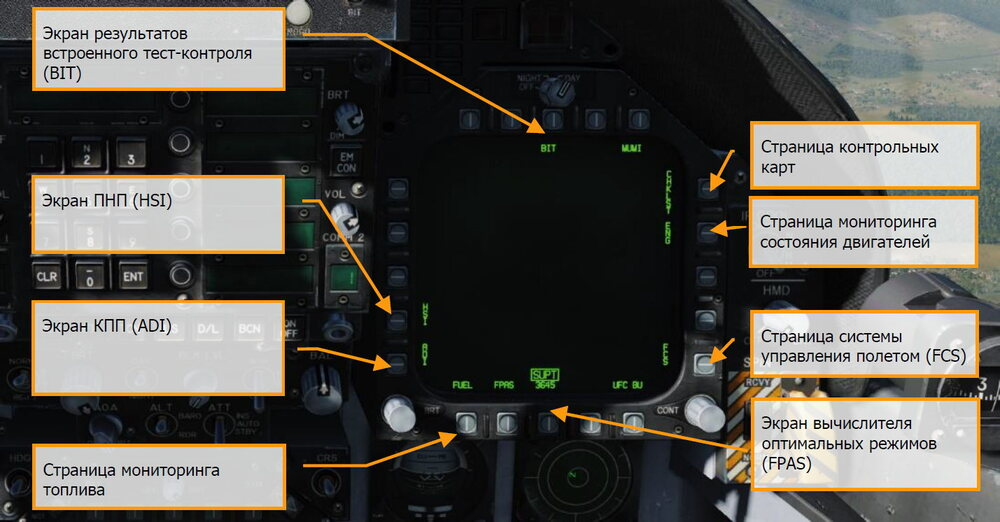
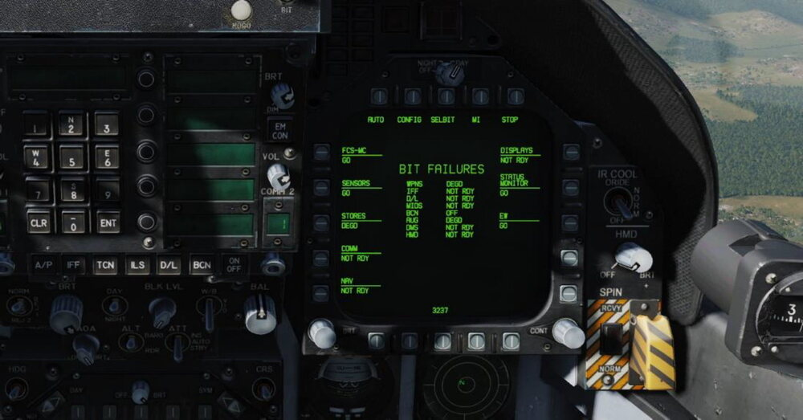
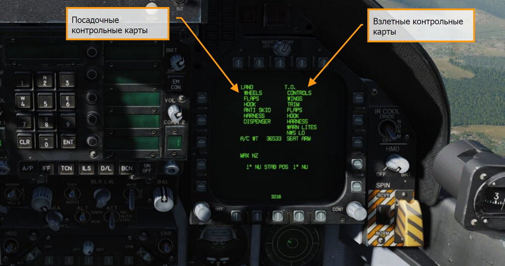
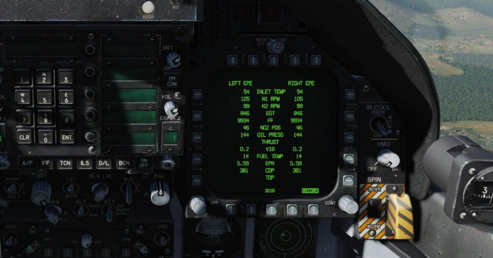
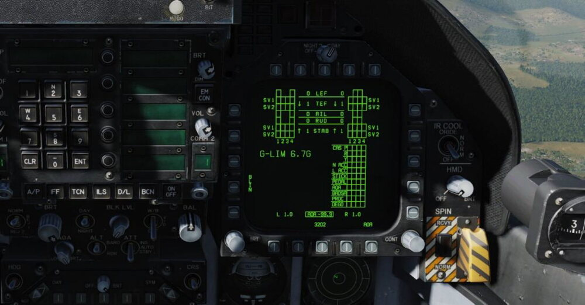
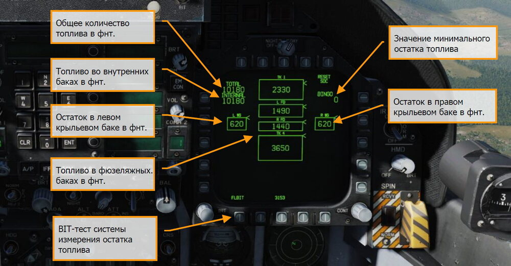
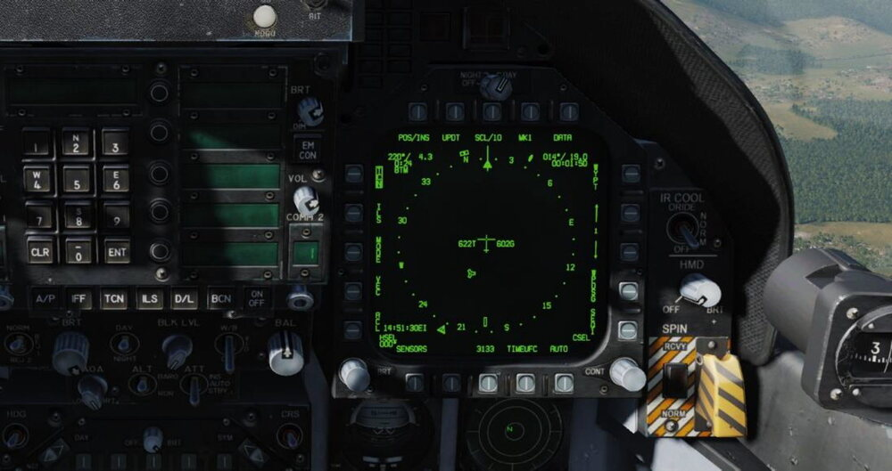
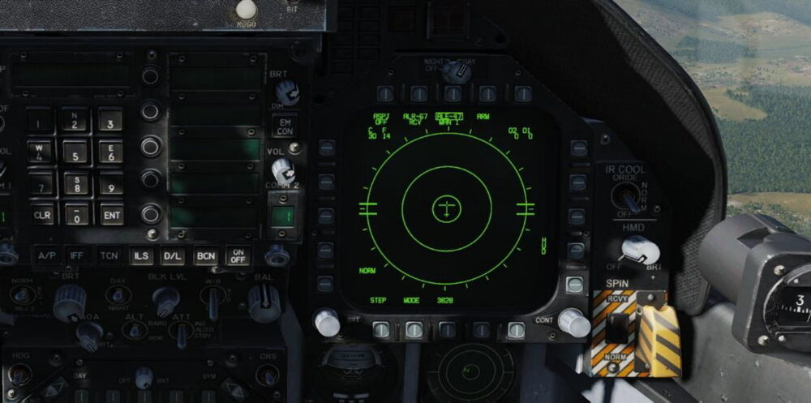
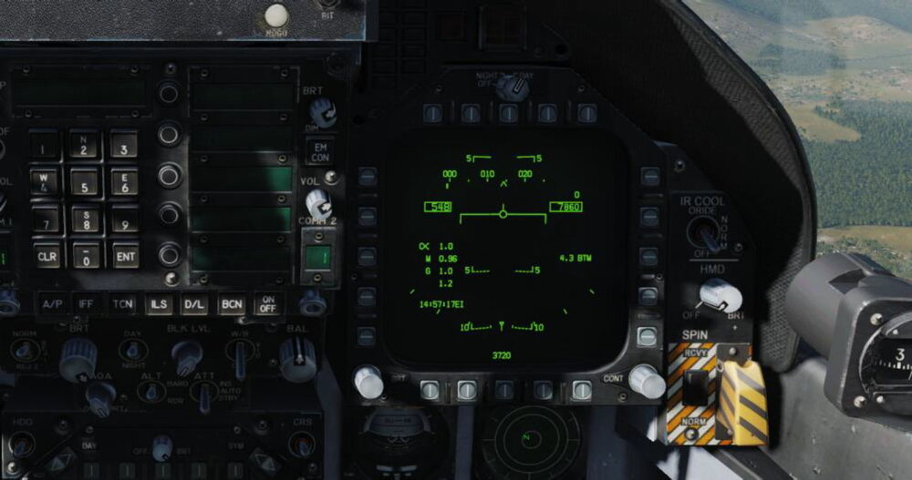
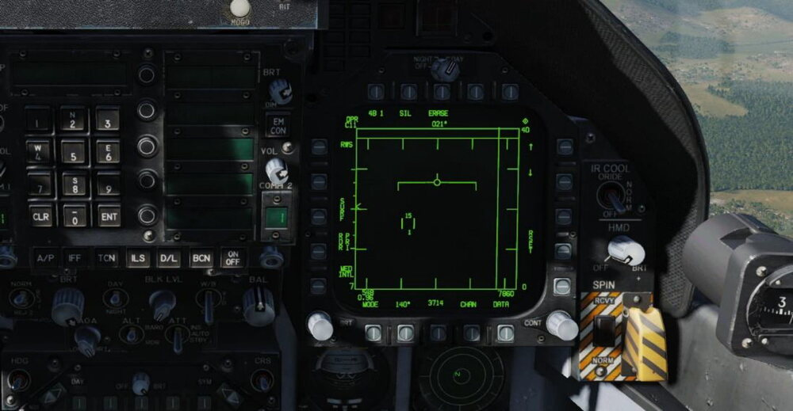

# Стуктура меню и функций на дисплеях

В дополнение к физическим органам управления в кабине Хорнета, большая часть
взаимодействия будет происходить через множество экранов, подстраниц главного меню (от
англ. Page) на левом и правом МФД (DDI) и Центральном дисплее – ЦД (AMPCD). В английской
документации AMPCD очень часто сокращают до MPCD.

!!! hint "Быстрая миссия"
    Hornet Ready on the Ramp

Перед тем, как обсудить штатные процедуры Хорнета, давайте рассмотрим некоторые важные
экраны настроек, подстраницы меню на МФД и ЦД (MPCD), которые пригодятся в будущем.
Работоспособность других экранов МФД будет добавлена в течение периода Раннего Доступа.

Существует два основных раздела, два вида настроек главного меню: Боевые настройки (TAC –
tactical) и Вспомогательные (SUPT - support). Переключение между разделами или возврат в
какой-либо осуществляется с помощью кнопки MENU. После взлета, кнопка MENU переключается
на таймер, но функционирует так же.

## Страницы вспомогательного раздела (SUPT)

### Экран встроенного контроля (BIT)

Хорнет состоит из множества подсистем, каждая из
которых имеет свою встроенную систему тестирования. Данная страница позволяет пилоту
тестировать эти системы и проверять их статус.

### Страница контрольных карт (CHKLST)

В дополнение к взлетным и посадочным
контрольным картам, данная страница отображает общую массу самолёта и положение
стабилизаторов.

- От 24° NU (нос вверх) до 10° ND (нос вниз). Триммирование управляющих
поверхностей при взлете с аэродрома составляет 12° NU STAB POS (16° и выше при
взлете с авианосца).
- Максимальная вертикальная G – максимальное вертикальное ускорение, наблюдаемое
во время последней посадки, округленное до ближайшего 0,01G.
- Масса самолёта – Общая масса самолёта, округленная до ближайшего фунта.

### Страница мониторинга состояния двигателей (ENG)

Предоставляет важную информацию
о состоянии двигателей. Некоторые данные дублируются на индикаторе состояния
двигателей/количества топлива (IFEI): обороты двигателей, температура исходящих газов за
турбиной, расход топлива и давление масла в двигателе. Чаще всего для контроля работы
силовой установки используется IFEI.

- INLET TEMP - Engine inlet temperature in °C.
- N1 RPM – Обороты турбины в % rpm.
- N2 RPM - Обороты компрессора в % rpm.
- EGT – Температура выхлопных газов в °C.
- FF – Расход топлива в фунтах/час.
- NOZ POS – Положение створок сопел в %.
- OIL PRESS – Давление масла в psi.
- THRUST – Тяга в %.
- VIB – Вибрация двигателя в дюйм/сек.
- FUEL TEMP – Температура топлива на входе в двигатель в °C.
- EPR – Коэффициент давления двигателя (отношение давления выхлопных газов к
входному атмосферному давлению). Данный коэффициент корректный только в
наземных статических условиях.
- CDP – Давление нагнетателя компрессора в psia.
- TDP - Давление в турбине в psia.

### Экран параметров автоматизированной системы управления полётом АСУП (FCS)

Отображает состояние управляющих поверхностей, таких как предкрылки, закрылки, элероны,
рули направления, стабилизаторы. Также, символами “X” отображаются все ошибки,
обнаруженные в четырех каналах системы управления полётом. На данной странице
отображается ограничение по перегрузке (G-LIM), которое зависит от массы самолёта.
Страница FCS может быть открыта на любом из МФД. В верхней части по центру дисплея
отображается индикаторы позиций левого и правого предкрылков (LEF), закрылков (TEF),
элеронов (AIL), рулей направления (RUD), и поверхностей ЦПГО (STAB) в градусах вместе со
стрелками-указателями, которые показывают направление выпуска относительно нейтральной
позиции. Например, позиции управляющих поверхностей, представленных на рисунке ниже,
следующие: левый предкрылок LEF 1° вниз, правый предкрылок LEF 1° вниз, левый закрылок
TEF 5° вниз, правый закрылок TEF 5° вверх, левый флапперон AIL 15° вниз, правый флапперон
AIL 15° вверх, оба руля направления RUD 0° (в нейтральной позиции), левый ЦП стабилизатор
STAB 3° вниз, правый ЦП стабилизатор STAB 4° вверх. Допуск по всем показаниям управляемых
поверхностей составляет 1°. Числа и стрелки изменяются по мере отклонения управляемых
поверхностей. При 0° (нейтраль), стрелки могут указывать в любом направлении. Если число
недостоверно, угол отклонения не отображается.

Символ X, зачеркивающий число LEF, TEF, AIL, или RUD, также называемый “жирный X”,
указывает на то, что данная поверхность больше не управляема.

По обе стороны индикаторов положения управляющих поверхностей находятся ячейки, которые
символизируют каналы системы АСУП (FCS). Читая слева на право, ячейки символизируют
каналы 1 и 4 предкрылков, элеронов, и рулей направления, а также, 1 2 3 4 каналы закрылков
и ЦПГО. Если символ Х находится внутри любой ячейки, это значит, что система FCS больше не
использует этот канал для управления приводом из-за наличия отказа. С правой стороны, читая
слева на право, ячейки отвечают за каналы 2 и 3 предкрылков, элеронов, и рулей направления,
и каналы 1 2 3 4 закрылков и стабилизаторов. В нижней части данной страницы находится блок
ячеек, которые отображают статусы (по каналам): системы усиления управляющих сигналов
(CAS) - тангаж (P), крен (R), и скольжение (Y); датчиков позиции РУС (STICK), датчиков усилия
на педали рулей направления (PEDAL); датчиков угла атаки (AOA); резервного блока датчиков
воздушных параметров (BADSA); процессора (PROC); датчика нормальных ускорений (N ACC) и
датчика поперечных ускорений (L ACC). Символ X напротив любого из данных компонентов
индицирует отказ канала. Символ X напротив DEGD индицирует отказ коммутатора или отказ
одного из запорнных клапанов закрылков и стабилизаторов. Данный отказ не влияет на
управляющие поверхности, но требует выполнить сброс системы FCS кнопкой RESET.

За исключением предкрылков, положение управляющей поверхности может не соответствовать
заданному положению без индикации летчику.

Символ X в каналах CH1 и CH3 в строке PROC указывают на то, что данные ИНС не поступают в
ЭВМ управления полётом (FCC), которые используются для расчетов скольжения и угла атаки.
При наличии данной ошибки не наблюдается существенного снижения летных качеств,
сопротивляемости самолёта к сваливаю или поперечной управляемости. (Свыше 30° УА, в
режиме механизации AUTO, бортовая ЭВМ управления полётом FCC использует данные ИНС по
углу скольжения и скорости изменения угла скольжения для обеспечения координации маневра
с креном (для устранения скольжения) и сопротивляемости к сваливанию. Если данные ИНС
недоступны, качество управления по рысканию, сопротивление к сваливанию и поперечное
управление могут немного ухудшиться). Отказы процессора PROC Xs в каналах CH 1/3 могут быть
вызваны: отказом ИНС, который сопровождается предупреждением INS ATT на МФД; установкой
переключателя ATT в позицию STBY; или если бортовая ЭВМ управления полётом FCC
обнаружила отказ.

### Страница Fuel (FUEL)

Данная страница отображает общее количество топлива во внутренних
баках, общее количество топлива во внутренних баках и ПТБ, и текущее установленное значение
минимального остатка топлива “BINGO”. Подвижный указатель справа от индикатора топливного
бака отображает текущий уровень топлива.

Страница FUEL доступна как на стоянке, так и в полёте, и отображает доступное количество
топлива в каждом баке, общее количество топлива во внутренних баках, общее количество
топлива во внутренних баках и ПТБ и текущее значение минимального остатка топлива “BINGO”,
которое можно изменить с помощью стрелок вверх/вниз на совмещенном индикаторе состояния
топлива/двигателей. Если данные об количестве топлива недействительны, значение топлива
будет отображено как 0 и INV (недействительные данные).

Причины недействительности данных:

- Система SDC (ЭВМ управления датчиками) обнаружила отказ всех датчиков в баке
(кроме левого и правого расходных баков).
- Отказ заднего датчика бака Tank 1 в то время, как передний датчик определил нулевой
остаток топлива.
- Отказ переднего и центрального датчиков бака Tank 4 в то время, когда задний датчик
определил нулевой остаток топлива.

Оценку количества топлива выполняет ЭВМ управления датчиками SDC и отображает данные
следующим образом:

- SDC использует только исправные датчики в баке для определения доступного
количества топлива.
- При отказе датчиков в левом и правом расходных баках:

    - На МФД отображается количество топлива как 0 фнт., при наличии
    предупреждения FUEL LO.
    - На МФД отображается количество топлива как 800 фнт., если предупреждение FUEL
    LO отсутствует.

### Страница электронного индикатора пространственного положения (ADI)

Данная
страница может быть открыта на левом или правом МФД в качестве альтернативы отображения
пространственного положения на ИЛС. Тангаж проградуирован с шагом в 10°. Индикатор
скольжения, который отображает скорость рыскания, отображается под кругом. Стандартная
скорость скольжения (3° в секунду) отображается, когда прямоугольник в нижнем ряду не
совмещен с центральным прямоугольником в верхнем ряду. Вход на данную страницу возможен
с раздела SUPT.

Выбирая опцию INS или STBY внизу дисплея – таким способом происходит определение
источника данных об пространственном положении, которые используются для генерации
индикации страницы ADI. При наличии питания, когда самолёт находится на земле, по
умолчанию на ADI выбрана опция STBY (надпись STBY обрамлена), поэтому, используется
резервный КПП для получения информации об пространственном положении.
При использовании опции STBY, нужно сравнивать показания резервного КПП. Если индикация
крена и тангажа не коррелирует на двух индикаторах, резервный КПП, скорее всего, неисправен
и требует техническое обслуживание. Выбирая опцию INS, индикация страницы ADI будет
использовать данные об пространственном положении, которые обеспечивает ИНС. Индикация
ИЛС не зависит от того, какая опция выбрана - INS или STBY.
На данной странице в верхнем левом углу отображается индикатор воздушной скорости, в
правом верхнем углу отображается индикатор высоты, над которым отображается индикатор
вертикальной скорости. Если выбран навигационный режим ILS на HSI, на странице ADI
отображаются планки отклонения от курсо-глиссады. Планки могут быть окрашены в желтый
цвет, если на странице RDR ATTK выбрана опция COLOR.

### Страница, экран ПНП (HSI)

В основном данная страница выводиться на центральный МФД и
индицирует планово- навигационную обстановку с символом самолёта в центре. Страница HSI
детально описана в разделе "Навигация" данного руководства.

### Страница вычислителя оптимальных режимов (FPAS)

Система FPAS рассчитывает
рекомендованную скорость и высоту полёта, соответствующую максимальной топливной
эффективности в полёте, исходя из текущих условий полёта. Дальность и оптимальная скорость,
рассчитанные с помощью алгоритмов системы FPAS выводятся на странице FPAS, раздела SUPT.
Данная страница разделена на 5 частей и 2 опции:

- Текущая дальность
- Текущая продолжительность полёта
- Оптимальная дальность
- Оптимальная продолжительность полёта
- Область навигационной информации (Waypoint/TACAN Навигация)
- Оптимальная вертикальная скорость
- Расчет предупреждения “Home Fuel”

Давайте поговорим о каждом из этих элементов страницы FPAS и рассмотрим изображение,
представленное ниже.

**Блок Current Range**. Данная область отображает данные об текущей максимальной дальности
полёта, при достижении которой остаток топлива составит 2,000 фнт. Эти данные основаны на
вашей текущей высоте и скорости полёта (число М). В нашем случае, на картинке ниже - это 329
морских миль. Если текущий остаток топлива меньше, чем 2,500 фнт., надпись TO 2000 LB
изменится на TO 0 LB, данные об дальности полёта будут рассчитаны до полной выработки
топлива. Если скорость полёта превышает 0.9М, данные об дальности полёта не будут
отображаться, поскольку система не может провести расчеты.

Ниже отображается оптимальная скорость, представленная числом М, для увеличения дальности
полёта на текущей высоте. В нашем случае, это .54 М.
Нижняя строка области CURRENT RANGE отображает расчетную дальность, если самолёт
выдерживает оптимальную скорость полёта на текущей высоте. В нашем случае, это 586 морских
миль.

**Блок Current Endurance**. В верхней строке данной области отображается время полёта
самолёта в формате часы:минуты на текущей высоте с текущей скоростью. В нашем случае, это
27 минут, на картинке, которая представленная ниже. Если текущий остаток топлива меньше,
чем 2,500 фнт., надпись TO 2000 LB изменится на TO 0 LB. Если путевая скорость выше, чем .9
Маха, индикатор времени изменится на LIM (лимит).
Ниже находится индикатор оптимальной скорости (представленный числом М), которая позволит
максимально увеличить время полёта на текущей высоте. В нашем случае, это .41М.
В нижней строке данной области отображается оптимальное время полёта, если самолёт летит
с оптимальной скоростью на текущей высоте. В нашем случае, это 1 час и 54 минуты.

**Блок Optimum Range**. В данном блоке отображается высота и скорость полёта, при
выдерживании которых достигается максимальная дальность полёта, на которой остаток
топлива составит 2,000 или 0 фунтов. На картинке выше это показано, как 37,900 футов, на
скорости .84М, на дальности в 1,012 морских миль остаток топлива будет равен 2,000 фунтов.

**Блок Optimum Endurance**. В данном блоке отображается высота и скорость полёта, при
которых достигается максимальная длительность полёта в формате часы:минуты до остатка
топлива в 2,000 или 0 фунтов. На картинке, представленной выше, эти данные представлены
следующим образом: полёт нужно выполнять на высоте в 33,001 футов, на скорости 0.71М, для
увеличения максимальной длительности полёта до 2 часов и 5 минут.
Опция Climb. При выборе данной опции (надпись CLIMB обрамляется) на ИЛС выше индикатора
скорости полёта отображается оптимальная вертикальная скорость. Для достижения
максимально эффективной вертикальной скорости установите тангаж и скорость полёта так,
чтобы значение текущей вертикальной скорости совпадало с рекомендованной вертикальной
скоростью.

**Опция Home**. С помощью кнопок выбора PB 16 и 17, вы можете обозначить любую путевую
точку, как точку возврата. В общем, это точка посадки. После выбора путевой точки и расчете
данных, если остаток топлива на точке возврата составит 2.000 фунтов, загорится кнопка-лампа
«ВНИМАНИЕ!» (Master Caution), и на левом МФД появится предупреждение HOME FUEL.

## Страницы основного раздела (TAC)

### Экран РЭБ (EW page)

Экран радио-электронной борьбы включает в себя индикацию
обнаруженных источников радиоизлучения, настройку системы противодействия (ECM), и
настройку отстрела ловушек: дипольных отражателей (ДО), ложных тепловых целей (ЛТЦ) и
запуск буксируемых ложных целей.

### Экран дублирования ИЛС (HUD page)

Страница дублирует информацию, отображаемую на
Индикаторе Лобового Стекла, который находится в верхней части панели инструментов. Чаще
всего используется при отказе или нечитаемости ИЛС из-за засветки. Полезна при активной
работе с кабинным оборудованием и позволяет быстро оценить данные ИЛС, не поднимая голову
вверх.

### Страница Attack RADAR (RDR)

В период раннего доступа эта страница индицирует данные
радара Воздух-Воздух (A/A). Для получения детальной информации, обратитесь в раздел "Радар"
данного руководства.

### Экран СУВ (SMS, STORES)

Экран системы управления вооружением предоставляет
информацию о подвешенном вооружении, а также позволяет настраивать профили применения
вооружения. Страница описана более детально в разделе "Применение вооружения" данного
руководства.

{!abbr.md!}
