# Процедуры

В данном разделе руководства, мы рассмотрим выполнение разных проверок и процедур,
которые предстоят вам при выполнении полётов на F/A-18C Хорнет.

!!! hint "Быстрая миссия"
    Hornet Cold and Dark and Carrier Cold and Dark

## Холодный старт

Существует два способа выполнения процедуры запуска Хорнета. Первый и самый легкий способ
— Автозапуск. После нажатия комбинации [[LEFT WIN ]] + [[HOME]], запуск самолёта будет выполнен
автоматически. Чтобы прекратить процедуру автозапуска, нажмите комбинацию [[LEFT WIN ]] + [[END]].

По-настоящему Хорнет раскрывается, когда вы пользуетесь детально смоделированными
системами, например, при ручном запуске летательного аппарата. В кратком руководстве мы
упустим предполётные проверки и сразу перейдем к запуску самолёта до готовности к
выруливанию.

1.   Установите тумблер BATTERY в положение ON и убедитесь, что тумблеры генераторов
левого и правого двигателя установлены в положение ON. (ПРАВАЯ КОНСОЛЬ).
2.   Тумблер FIRE TEST переключить и удерживать в положении A, прослушать все голосовые
предупреждения. После окончания, выждать 10 секунд и проделать то же самое для
положения B. Между тестами контура А и B можно выключить и заново включить тумблер
BATTERY для перемотки кассеты с записью голосовых предупреждений системы
обнаружения пожара. (ЛЕВАЯ КОНСОЛЬ)

    

3.   Установите тумблер APU в положение ON и дождитесь загорания зеленой лампы APU READY.
(ЛЕВАЯ КОНСОЛЬ)
4.   Переключите тумблер ENG CRANK в положение R для запуска правого двигателя. (ЛЕВАЯ
КОНСОЛЬ)
5.   Передвиньте правый РУД из позиции OFF в позицию IDLE при выходе оборотов двигателя
на уровень 25% и выше (см. IFEI). [[RSHIFT ]] + [[HOME]]
6.   После того, как обороты правого двигателя достигнут 60% и выше, поверните
переключатель BLEED AIR по часовой стрелке на 360 градусов, от NORM до NORM. (ПРАВАЯ
КОНСОЛЬ)

    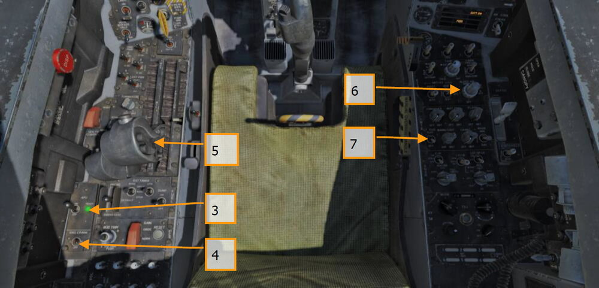

7.   Установите тумблер LT TEST в положении TEST для проверки светосигнальной индикации
кабины. (ПРАВАЯ КОНСОЛЬ)
8.   Включите оба МФД, ЦД и ИЛС. На левом МФД выберите экран FCS, а на правом — страницу
BIT. (INSTRUMENT PANEL)

    

9.   Выполните настройку радиостанций COMM 1/COMM 2 согласно требованиям миссии.

    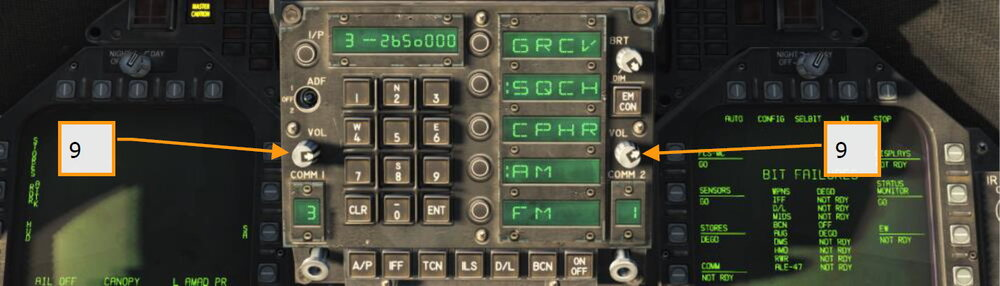

10. Убедившись, что правый двигатель вышел на обороты 63–70%, температура в пределах
190–590 градусов, расход топлива 420–900 фунтов/час, положение створок — 73–84% и
давление масла в пределах 45–110 psi, установите переключатель ENG CRANK в положение
L. (ЛЕВАЯ КОНСОЛЬ)

    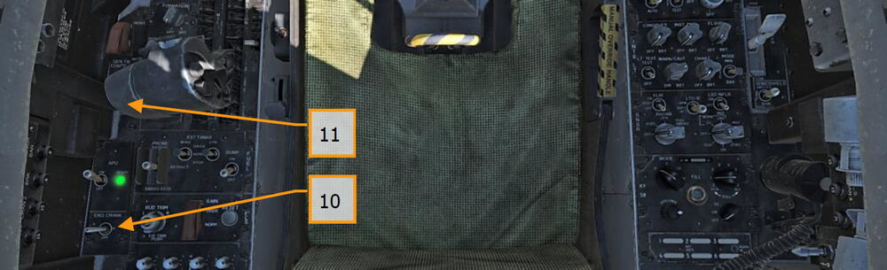

11. Передвиньте левый руд из положения OFF в IDLE при выходе оборотов двигателя на
уровень как минимум 25% нажатием комбинации клавиш [[RIGHT ALT + HOME]]. (РУДЫ)

    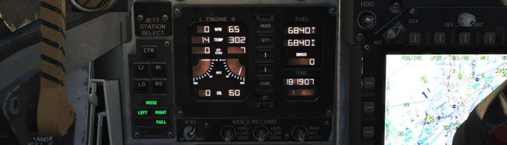

12. После выхода левого двигателя на обороты свыше 60%, переведите поворотный
переключатель INS в положение GND (земля) или CV (авианосец), в зависимости от места
нахождения самолёта. (ПРАВАЯ КОНСОЛЬ)
13. Установите переключатель RADAR в положение OPR (Работа). (ПРАВАЯ КОНСОЛЬ)

    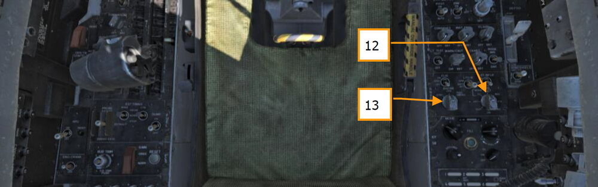

14. Установите переключатель OBOGS (система генерации кислорода) и регулятор подачи
кислорода FLOW в позицию ON. (ЛЕВАЯ КОНСОЛЬ)

    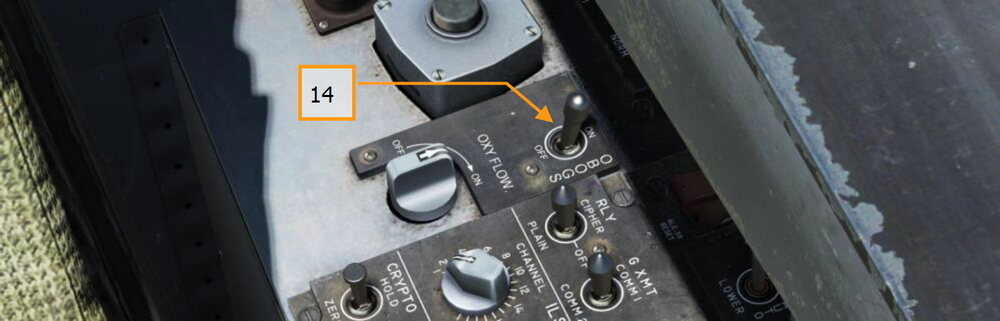

15. Нажмите кнопку FCS RESET и контролируйте страницу FCS на левом МФД(DDI) (символы “Х”
должны исчезнуть). (ЛЕВАЯ КОНСОЛЬ)
16. Установите тумблер FLAP в положение AUTO. (ЛЕВАЯ ВЕРТИКАЛЬНАЯ ПАНЕЛЬ)
17. Нажмите кнопку установки триммера во взлетное положение (T/O TRIM). (ЛЕВАЯ КОНСОЛЬ)

    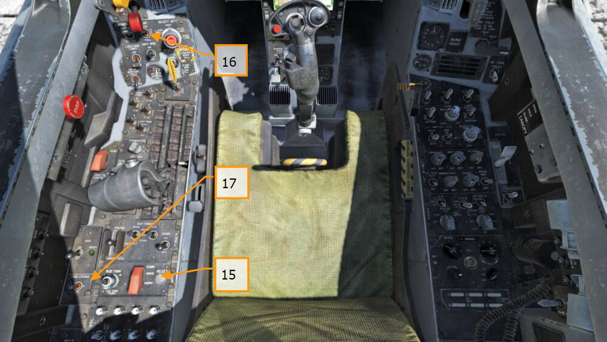

18. Удерживая тумблер FCS BIT [[Y]] на правой стенке, одновременно нажмите функциональную
кнопку FCS на правом МФД (страница BIT / FCS).

    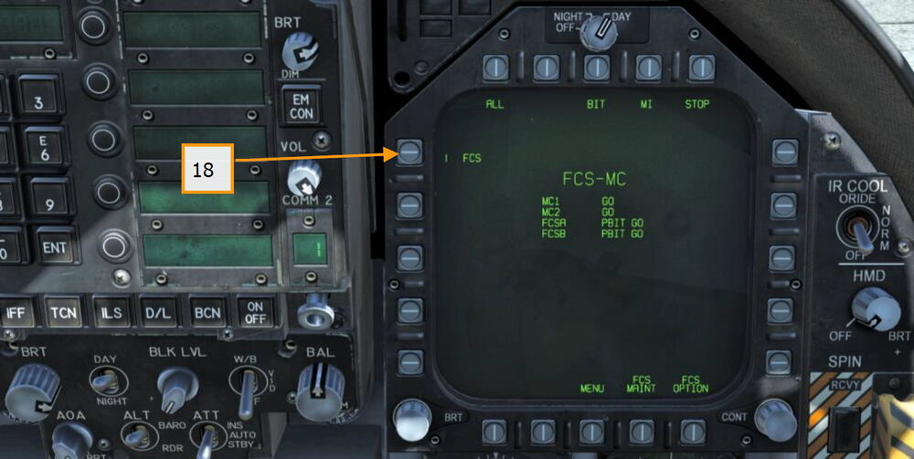

19. Выполните так называемый "Four down test". Выпустите штангу дозаправки, тормозной
щиток, бросковую штангу, тормозной гак, включите обогрев ПВД и установите закрылки в
положение HALF. (ЛЕВАЯ КОНСОЛЬ, РУДЫ, ЛЕВАЯ ВЕРТИКАЛЬНАЯ ПАНЕЛЬ, ПРАВАЯ
ВЕРТИКАЛЬНАЯ ПАНЕЛЬ и ПРАВАЯ КОНСОЛЬ)
20. Кликните по рукоятке стояночного тормоза левой кнопкой мыши для снятия тормоза.

    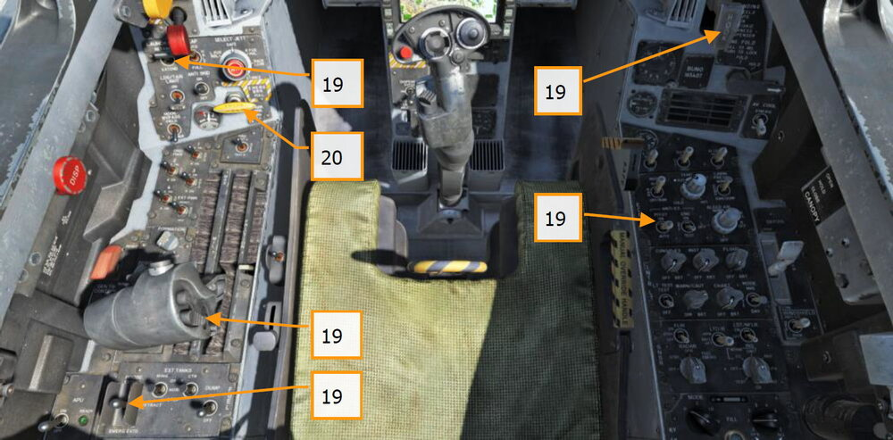

21. Установите значение минимального остатка топлива (BINGO), необходимого для возврата
на базу, нажатием стрелок вверх и вниз на ПКДТА (IFEI). (ЛЕВАЯ ПРИБОРНАЯ ПАНЕЛЬ)
22. Установите высоту превышения аэродрома на резервном барометрическом высотомере.
(ПРАВАЯ ПРИБОРНАЯ ПАНЕЛЬ)
23. Установите указатель опасной высоты на радиовысотомере на 200 футов для взлета с
аэродрома или 40 футов для влета с авианосца. (ПРАВАЯ ВЕРТИКАЛЬНАЯ ПАНЕЛЬ)
24. Разарретируйте резервный КПП. (ПРАВАЯ ПРИБОРНАЯ ПАНЕЛЬ)
25. Установите переключатель источника данных о пространственном положении в позицию
AUTO. (ЦЕНТРАЛЬНАЯ ПРИБОРНАЯ ПАНЕЛЬ)

    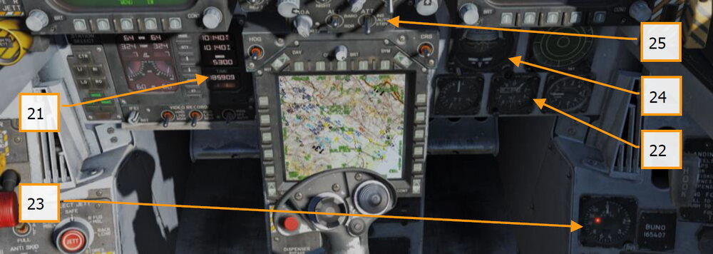

## Руление

1.   Неважно запустили ли вы самолёт следуя указанным выше шагам или начали миссию в уже
запущенном самолёте, вашим следующим шагом будет выруливание на полосу. Медленно
передвиньте РУДы вперед [[PAGE UP]] и начинайте руление, используя педали для
выполнения поворотов влево [[Z]] и вправо [[X]]. Для уменьшения тяги двигателя используйте
клавишу [[PAGE DOWN]]. При удержании кнопки управления носовым колесом (NWS),
активируется режим NWS HI, позволяющий осуществлять развороты с меньшим радиусом.
Для торможения используйте клавишу [[W]].
2.   Откройте страницу CHKLST на левом DDI и страницу FCS на правом DDI.
3.   При выруливании на рабочую полосу:

    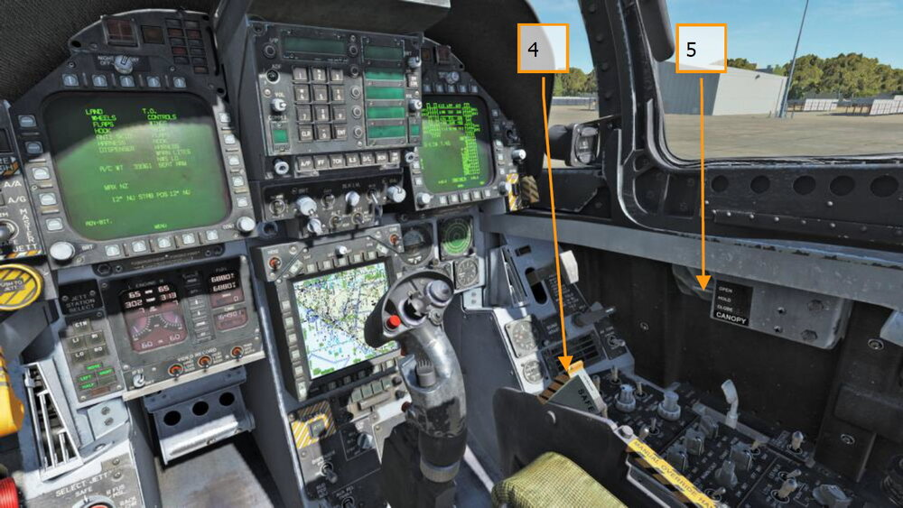

4.   Активируйте систему аварийного покидания самолёта. (ПРАВАЯ КОНСОЛЬ)
5.   Закройте фонарь (если вы ещё не сделали этого). [[LCTRL-C ]]
6.   На левом DDI откройте страницу HUD. (ЛЕВАЯ ПРИБОРНАЯ ПАНЕЛЬ)

## Взлет с аэродрома

!!! hint "Быстрая миссия"
    Hornet Takeoff

1.   Выровняйте самолёт по центру взлетно-посадочной полосы и проедьте вперед,
чтобы установить носовое колесо по направлению ВПП.
2.   Откройте страницу HUD на левом DDI.
3.   Передвиньте РУДы вперед в позицию полный форсаж.
4.   Используйте педали для управления носовой стойкой, удерживая самолёт вдоль
оси ВПП.

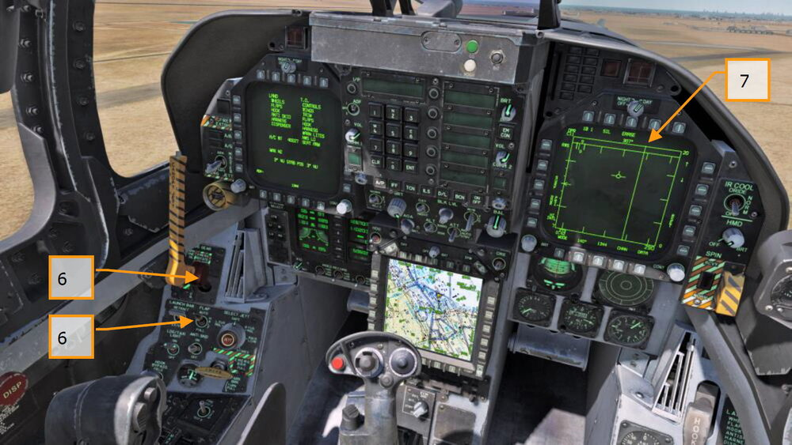

5.   На скорости отрыва передней стойки шасси, потяните РУС на себя, установив угол
тангажа 6–8 градусов (значок W выше линии горизонта на HUD).
6.   После достижения стабильного набора высоты выполните уборку шасси и
установите тумблер управления закрылками в положение AUTO.
7.   Откройте страницу RDR ATTK в режиме воздух-воздух на правом DDI.

## Посадка в простых метеоусловиях

Будучи самолётом, подготовленным для работы с авианосца, Хорнет может осуществлять
посадку как на корабль, так и на аэродром. Обе схемы захода практически одинаковы. В данном
мануале мы рассмотрим процедуру выполнения посадки на аэродром в простых метеоусловиях.

!!! hint "Быстрая миссия"
    Hornet Airfield VFR Landing

На правом МФД откройте страницу RDR ATTK в режиме воздух-воздух, а на левом — HUD.
Активируйте навигационный режим отображения индикации, установив переключатель MASTER
(главный включатель системы управления вооружением) в положение SAFE (ЛЕВАЯ
ПРИБОРНАЯ ПАНЕЛЬ) и подходите к полосе на скорости 350 узлов и высоте 800 футов над
уровнем земли. Выполните проход посадочным курсом немного в стороне от направления
первого разворота в схему захода на посадку.

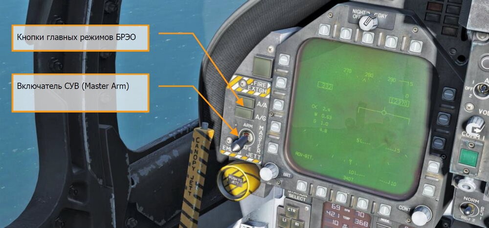

Через 5–10 секунд после того, как законцовка крыла прошла торец полосы (чем дольше, тем
больше времени нужно удерживать посадочный угол атаки (AOA) на курсе обратном
посадочному), выполните разворот на курс обратный посадочному. Удерживайте перегрузку
равной 1% от скорости полёта. Например, 350 узлов будет равняться перегрузке 3,5G. После
разворота, следуйте обратным курсом на высоте 600 футов над уровнем земли.
Боковое удаление от полосы должно составлять 1,2 мили.

На скорости меньше 250 узлов, выпустите шасси и полностью выпустите механизацию крыла,
установив тумблер управления в положение FULL. (ЛЕВАЯ ВЕРТИКАЛЬНАЯ ПАНЕЛЬ)

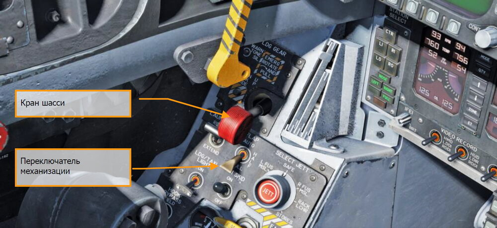

Уменьшайте скорость для достижения посадочного угла атаки, значение которого вы можете
наблюдать на индикаторе УА, размещенном слева от ИЛС. Значение посадочного угла атаки
равно 8,1° — желтый круг на ИУАП. Вектор суммарной скорости должен находиться по центру
скобки УА (на ИЛС). Установите посадочный угол атаки на высоте 600 футов над землей.
Оттриммируйте самолёт, чтобы снять усилие на РУС и комфортного поддержания УА в 8,1°.

Выполняйте доворот на посадочный курс как только законцовка крыла поравняется с торцом
полосы, удерживая посадочный УА. Крен должен быть равен 30°, вектор суммарной скорости на
ИЛС должен находиться ниже линии горизонта. Необходимо добавить тягу, чтобы удерживать
посадочный угол атаки. Продолжайте снижение и выход на посадочный курс, выдерживая
посадочный УА (для более точного выхода на посадочный курс, установите его с помощью
задатчика курса CSEL).

Удерживая угол атаки, установите вектор суммарной скорости в точку, находящуюся примерно
в 500 футах за торцом ВПП. Тягой двигателей удерживайте угол глиссады равным 3°.
В момент касания установите РУДы в позицию МГ (IDLE) и используйте небольшие
корректировки педалями для выполнения пробега вдоль осевой линии ВПП.

## Руление на палубе авианосца

!!! hint "Быстрая миссия"
    Carrier Cold and Dark

После выполнения процедуры запуска, вашей следующей задачей будет руление к бросковому
устройству катапульты авианосца. Главное отличие между процедурами запуска на аэродроме и
авианосце – это установка переключателя согласования ИНС (INS) в позицию CVN (в случае
запуска на авианосце).

Медленно передвиньте РУДы [[PAGE UP]] и выполняйте руление, используя кнопку [[Z]] для
поворота влево и [[X]] для поворота вправо. Уменьшайте тягу двигателей с помощью кнопки |PAGE
DOWN|. При сложенных консолях крыльев коротко нажмите кнопку Nose Wheel Steering (NWS)
для активации режима NWS HI [[S]], который позволяет увеличить угол разворота носовой стойки.
Нажатие кнопки [[W]] применяет колесные тормоза.

На левом МФД откройте страницу контрольных карт (CHKLST), на правом МФД откройте страницу
FCS.

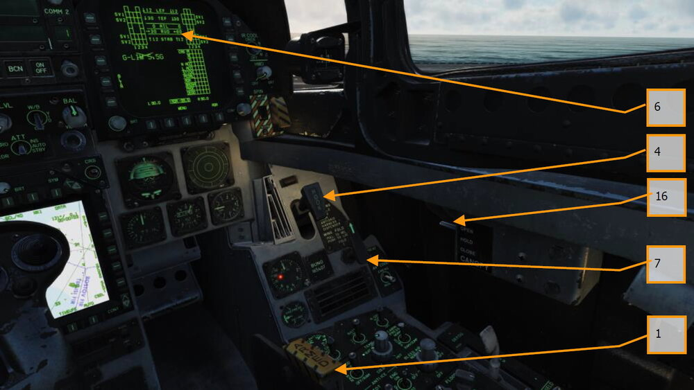

Перед рулением выполните проверку согласно контрольным картам:

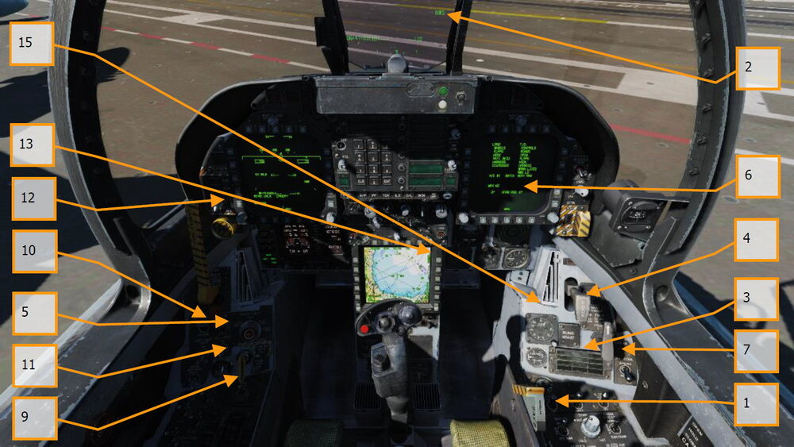

1.   Поставьте механизм аварийного катапультирования на боевой взвод (ПРАВАЯ
КОНСОЛЬ)
2.   Проверьте готовность системы управления передней стойкой NWS.
3.    Проверьте отсутствие каких-либо светосигнальных предупреждений.
4.    Убедитесь, что тормозной гак поднят.
5.    Установите механизацию в режим HALF.
6.    Оттриммируйте стабилизаторы согласно взлетной массе.
7.    Убедитесь в положении консолей крыльев согласно ручке управления консолями.
8.    Включите подачу кислорода.
9.    Проверьте отключение тормозов.
10.   Убедитесь в том, что бросковая штанга убран.
11.   Убедитесь в том, что антиюзовый автомат отключен.
12.   Убедитесь в том, что Включатель СУВ находится в позиции SAFE.
13.   С помощью центрального МФД выберите навигационную точку 1.
14.   Убедитесь в том, что станции постановки помех отключены.
15.   Установите предупреждение об опасной высоте на радиовысотомере на 40 футов.
16.   Закройте фонарь кабины, если вы этого ещё не сделали. |LCTRL-C|.
17.   Главный переключатель управления внешним освещением переведите вниз.

Выполняйте руление к свободной катапульте, используя малые обороты двигателя. Управляйте
носовой стойкой, активировав режим NWS HI [[S]]. После того, как вы окажетесь за
газоотбойником катапульты с которой будет происходить взлет, разложите консоли крыльев,
используя рычаг раскладывания консолей крыла на правой вертикальной панели. Для этого
нажмите ПКМ два раза, чтобы установить данный рычаг в позицию SPREAD. Затем покрутите
колесо мышки вперед чтобы вдавить\зафиксировать рычаг.

Медленно выполняйте руление вперед за газоотбойник и выровняйте носовую стойку вдоль
направляющей катапульты. Когда носовое колесо окажется за башмаком пускового челнока,
опустите бросковую штангу. Затем, нажмите кнопку [[U]] для выполнения процедуры
автоматического зацепления штанги с крючком башмака.

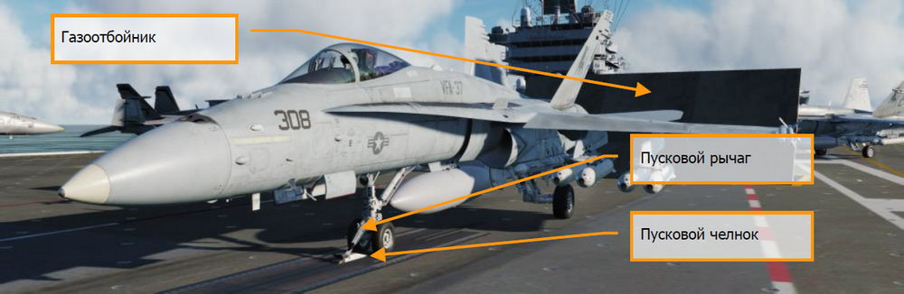

После подсоединения к челноку катапульты оттриммируйте ЦПГО (STAB) с помощью кнюппеля
триммера с учетом общего веса вашего самолёта. Общая масса самолёта отображается на
странице CHKLST. Используя кнюппель триммера, установите ЦПГО следующим образом:

-   Масса самолёта менее 44000 фунтов = угол триммирования 16° (взлет на
максимальном безфорсажном или форсажном режиме)
-   Масса самолёта в диапазоне от 45000 до 48000 фунтов = угол триммирования 17°
(взлет на максимальном безфорсажном или форсажном режиме)
-   Масса самолёта 49000 фунтов и более = угол триммирования 19° (взлет только на
режиме ФОРСАЖ)

После триммирования (углы триммирования вы можете наблюдать на странице FCS и CHKLST)
стабилизаторов, вы будете готовы к процедуре выполнения взлета.

## Взлет с авианосца

!!! hint "Быстрая миссия"
    Carrier Takeoff

1.   Выполните проверку работоспособности рулевых поверхностей, проведите РУС по кругу,
затем отклоните РУС вперед до упора, назад до упора и верните в нейтральное положение.
Выжмите педали полностью влево, затем вправо и верните в нейтраль.
2.   Выведите РУДы на режим 100% и снимите руку с РУС.
3.   Произойдет пуск катапульты и взлет самолёта.
4.   После достижения стабильного набора высоты, выполните уборку шасси [[G]] и установите
закрылки в режим AUTO [[F]].
5.   Если взлет происходит с катапульт №1 или №2 (носовые катапульты), после взлета
выполните маневр безопасности вправо и выполняйте отход от авианосца с курсовым углом
равным посадочному курсу авианосца на дальность 7 миль и на высоте не выше 500 футов
со скоростью 300 узлов. Если взлет происходит с катапульт №3 или №4 (угловая палуба),
маневр безопасности выполняется влево.

    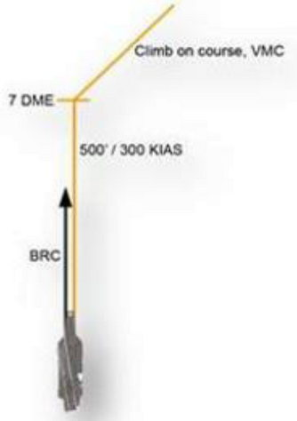

6.   На правом МФД откройте страницу радара А/А.

## Посадка на авианосец в простых метеоусловиях (Case I)

Посадка на авианосец по схеме Case I почти идентична посадке на аэродром в простых
метеоусловиях. Заход по схеме Case I определяется дальностью видимости как минимум 5
морских миль и высотой нижней кромки облачности как минимум 5000 футов. Другими словами
- хорошая погода, светлое время суток.

!!! hint "Быстрая миссия"
    Case I Carrier Landing

Откройте страницу радара на правом МФД (RDR ATTK) и страницу-дубль ИЛС (HUD) на левом
МФД.

Перейдите в режим навигации NAV (посредством отключения кнопок A/A или A/G) и установите
переключатель Master Arm (включатель СУВ) в позицию SAFE (ЛЕВАЯ ПРИБОРНАЯ ПАНЕЛЬ).
Выполните выпуск тормозного гака нажатием кнопки [[H]] и переключите тип отображаемой
высоты на ИЛС - RADAR.

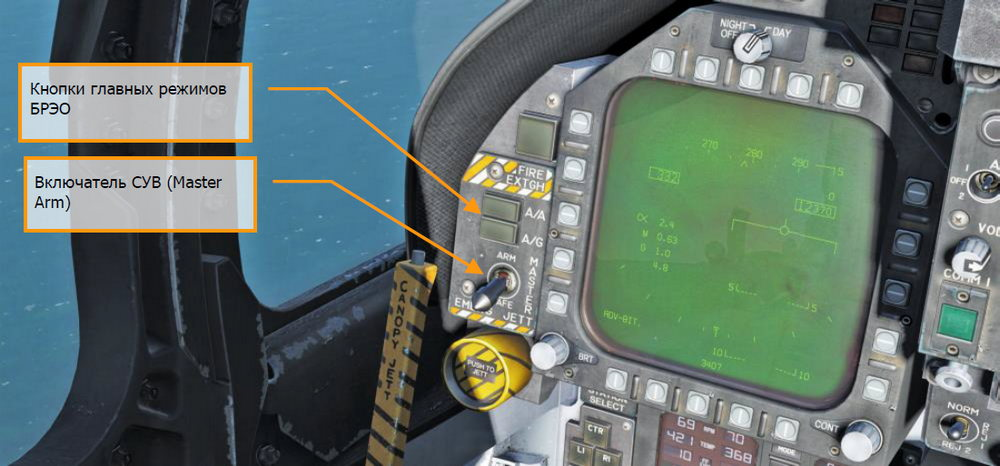

Вхождение в посадочный круг по схеме Case I выполняется из зоны ожидания (круговая зона
диаметром в 5 миль на высоте от 1500 до 5000 футов над авианосцем) или с прямой,
соответствующей базовому посадочному курсу. В данном руководстве мы рассмотрим заход
базовым посадочным курсом.

!!! note "Примечание"
    При выполнении захода по схеме Case I использование систем TACAN или ICLS не
    обязательно. Использование данных систем будет описано в разделах “Схемы захода Case II и
    Case III”.

Выполняйте подход к авианосцу с кормы на высоте 800 футов со скоростью 350 узлов. Проход
авианосца выполняйте по правому борту на дальности, достаточной для того, чтобы рассмотреть
палубу авианосца и убедиться в том, что посадочная палуба свободна.

После прохода носовой части авианосца, на дальности не больше 1,5 мили выполните разворот
на курс обратный посадочному (на 180° влево).

Для выполнения разворотов с минимальным и безопасным радиусом используйте «правило 1%».
Т.е. выполняйте разворот с перегрузкой, численно равной 1% от вашей скорости. Например, 350
узлов – перегрузка равна 3,5 G. Разворот заканчивайте на высоте 600 футов на курсе обратному
базовому посадочному. Если скорость при выполнении разворота выше чем 350 узлов, вы можете
выпустить тормозной щиток на время, пока скорость не снизиться до 250 узлов. На скорости не
выше 250 узлов, выпустите шасси [[G]] и установите механизацию в позицию FULL [[Left Ctrl ]] + [[F]].

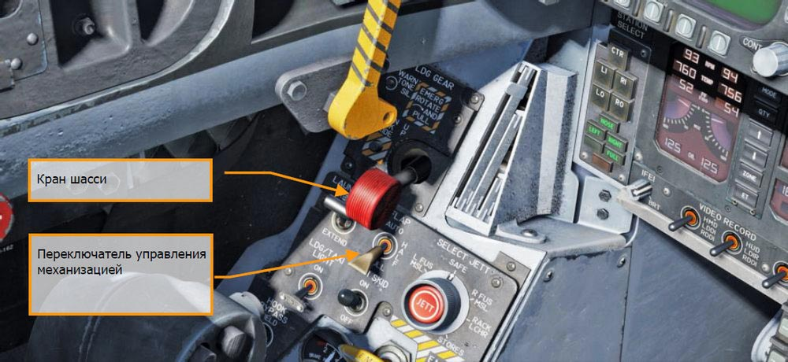

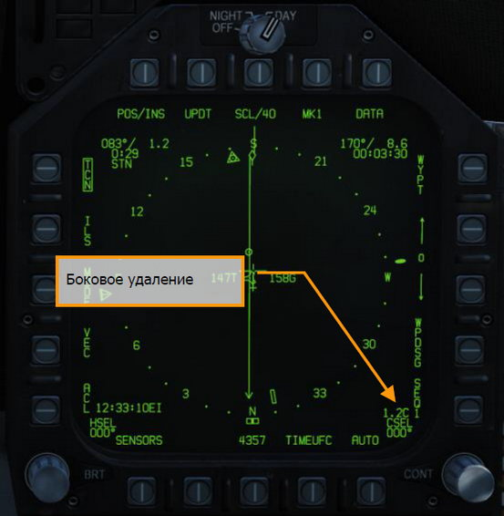

После снижения на высоту в 600 футов, снижайте скорость до 145 узлов и аккуратно увеличьте
тягу двигателей устанавливая требуемый посадочный угол атаки в 8,1°и совмещая E-скобу с
вектором суммарных скоростей на ИЛС. Контролируйте УА и скорость по ИУАП слева от ИЛС.

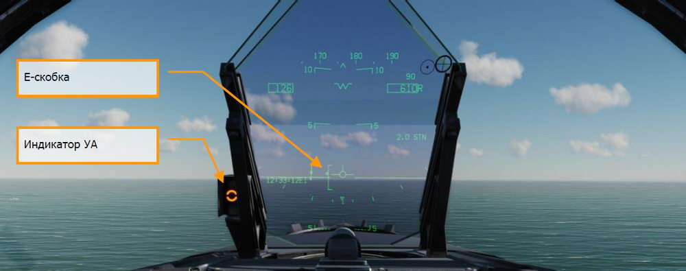

Выдерживайте посадочный УА и высоту в 600 футов до тех пор, пока визуально скругление на
корме авианосца не превратится в прямую линию.

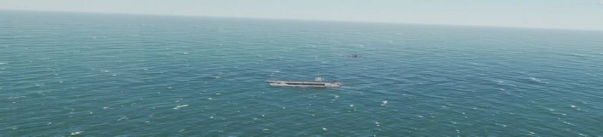

В первой половине разворота на посадочный курс используйте РУДы для удержания посадочного
УА и вертикальную скорость в диапазоне от 100 до 200 футов/мин с углом крена в 30°. Поместите
вектор суммарных скоростей ниже линии горизонта на ИЛС так, чтобы вертикальная “Е” и правое
“крыло” вектора суммарных скоростей касались линии горизонта.

На данном этапе разворота не смотрите на авианосец. Вместо этого выполняйте полёт по
приборам и индикации.

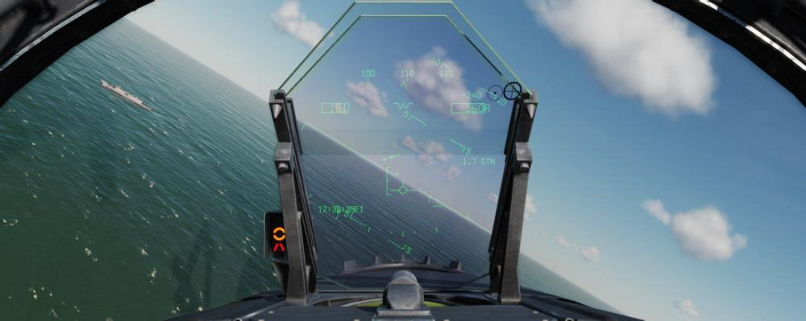

Во второй половине разворота на посадочный курс увеличьте вертикальную скорость до 400-500
футов в минуту и попытайтесь визуально обнаружить ОСП - оптическую систему посадки (IFLOLS,
англ).

После окончания разворота на посадочный курс все изменения в направлении полёта
выполняйте, основываясь на показаниях ОСП.

Оптическая система посадки предоставляет пилоту визуальную индикацию траектории снижения
на финальной стадии посадки на авианосец. Первые оптические системы были основаны на
гироскопически управляемых зеркальных линзах. Зеркало устанавливалось вертикально между
двумя горизонтальными наборами зеленых базовых (опорных) огней. Оранжевый источник
зеркала отображался в зеркале. Пилот видел яркий желто-оранжевый шар – указатель
правильной траектории. Мы и дальше для простоты будет применять к этому указателю термин
– шар.

Позиция шара относительно базовых огней отображает относительную позицию самолёта к
заданной траектории снижения. Если шар находится выше базовых огней (“шар высоко”),
самолёт находится выше глиссады; и наоборот, если шар находится ниже базовых огней, значит
самолёт находится ниже глиссады. Если шар находится на одном уровне с базовыми огнями –
самолёт “в глиссаде”.

В состав ОСП (IFLOS) входит оптический блок, лампы “cut” (огни сигнализации, для команды
начинать посадку), лампы “waveoff” (огни запрета посадки) и базовые огни (лампы “datum”).
ОСП имеет 3 режима стабилизации: линейная, инерциальная и точечная. Линейная
стабилизация компенсирует покачивания корабля по крену и дифференту. Инерциальная
стабилизация работает также, как и линейная стабилизация, но также компенсирует движения
полётной палубы вверх и вниз. Оба эти типа проецируют стабилизированную глиссаду в
бесконечность. Точечный режим стабилизирует глиссаду вокруг точки 2500 футов за линзами.
По умолчанию, система настроена на наклон глиссады в 3,5° нацеливая самолёт на третий трос
аэрофинишера. ОСП IFLOLS имеет как корабельный, так и наземный варианты.

- **Оптический блок**. Это коробка, состоящая из 12 вертикальных ячеек, через которые
проецируется оптоволоконный световой сигнал. Верхние ячейки имеют желтый цвет,
две нижние – красный. Позиция самолёта на глиссаде определяется ячейкой, которая
видна пилоту. Видимая ячейка относительно зеленых сигнальных огней указывает на
положения самолёта относительно глиссады (выше, на глиссаде или ниже глиссады).
Если появляется красная линза – самолёт находится на опасно низкой высоте.
- **Огни сигнализации “Cut”**.         Данные лампы (4 зеленых лампы) размещены
горизонтально по центру относительно оптического блока и используются офицером
визуальной посадки (LSO) для “общения” с пилотом без использования радио или в
режиме запрета излучений (EMCON). Как только самолёт выходит на финальную
стадию посадки, офицер визуальной посадки подсвечивает лампы, сигнализируя
летчику о разрешении выполнения посадки (“Roger ball”). Последующее включение
данных ламп оповещает летчика об необходимости увеличить тягу двигателей. Для
минимизации радиопередач все полёты по схеме Case I в дневное время суток
выполняются молча. Режим EMCON – это условия, в которых все радиопередачи и
излучения радаров минимизированы.
- **Огни запрета посадки “Waveoff”**. Данные красные лампы установлены вертикально
на каждой стороне оптического блока и контролируются офицером визуальной посадки
LSO. В момент, когда лампы загораются, самолёт должен немедленно прекратить
посадку. Офицер визуальной посадки может подать сигнал запрета посадки в любое
время, когда палуба занята (люди или оборудование находится в зоне посадки) или
самолёт не находится в пределах безопасных параметров захода на посадку. Сигнал
об докладе остатка топлива подается с помощью чередования ламп “waveoff” и “cut”.
- **Базовые огни**. Зеленые опорные огни (10 ламп) установлены горизонтально по обе
стороны оптического блока. Позиция шара в сочетании с базовыми огнями
сигнализирует пилоту о его местоположении относительно базы - глиссады. Если шар
находится выше или ниже базовых огней – самолёт выше или ниже глиссады
соответственно.

В момент касания выведите РУДы на максимальный безфорсажный или форсажный режим на
случай промаха (гак не зацепился за трос). Это позволит вам сохранить достаточно мощности
для повторного взлета.
В случае успешной посадки и снятия гака с аэрофинишера, установите РУДы на малый газ (IDLE),
поднимите тормозной гак [[H]], установите закрылки на режим AUTO [[F]] и выполняйте руление из
посадочной зоны.

{!abbr.md!}
