# РЕЖИМ ВОЗДУХ-ВОЗДУХ (A/A)

Первоначальное вооружение модуля DCS F/A-18C Hornet включает в себя встроенную 20 мм
пушку M61A2, ракеты ближнего радиуса действия с инфракрасной головкой самонаведения (ИК
ГСН) AIM-9L/M/P Sidewinder.

Для того, чтобы задействовать вооружение класса «воздух-воздух», вам необходимо взлететь,
убрать шасси, а переключатель Master на панели СУВ перевести в положение ARM и выбрать
режим A/A. Когда переключатель Master находится в положении SAFE, индикация выбранного
оружия на ИЛС и на странице RADAR МФД будет перечеркнута символом «Х».
Кроме этого, при установке переключателя в положение SAFE, становиться доступен учебный
режим SIM (симуляция).

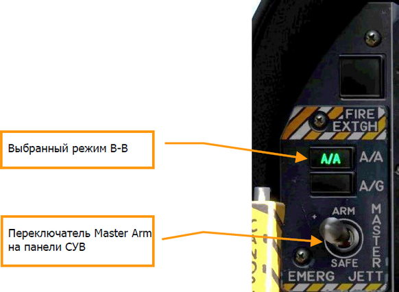

## Радар Хорнета

Вероятно, наиболее важным сенсором F/A-18C является бортовая радиолокационная станция
(БРЛС) AN/APG-73 (далее по тексту – радар). AN/APG-73 – это Х-диапазонный всепогодный
многорежимный радар когерентного излучения, использующий в качестве датчика (сенсора) для
поиска и сопровождения целей. Он, также, является многорежимным излучателем сигналов
радиолокационной подсветки, который управляется программируемым цифровым процессором,
обеспечивая прекрасную универсальность при выполнении задач «воздух-воздух.

В этом руководстве раннего доступа, прежде всего мы рассмотрим применение радара, которое
охватывает несколько режимов, а ниже рассмотрим те функции радара, которые характерны для
применения вооружения.

### Основная информация о радаре

AN/APG-73 является импульсной доплеровской РЛС с возможностью поиска и обнаружения целей
на фоне земной поверхности, а также применяется в режиме работы маневренного воздушного
боя (ACM), как за пределами визуальной видимости противника (BVR), так и в ближнем
воздушном бою. В версию раннего доступа Хорнета мы включили режимы определения
дальности во время поиска (RWS, аналогичен СНП), сопровождение одиночной цели (STT,
аналогичен РНП) и несколько режимов ближнего боя (ACM).

В индикации «воздух-воздух», на радаре используется стандартная растровая развертка
(азимут-дальность) на которой свой объект (ваш самолет) расположен в нижней части дисплея.
Таким образом, при растровой развертке индицируется РЛС ситуация впереди вашего самолета
по курсу. Цели на развертке отображаются по принципу: ближайшие внизу экрана, а более
удаленные - выше. Контакты левее и правее своего объекта представлены, как метки,
находящиеся слева и справа от центра дисплея для указания азимута.
Важными основными компонентами растровой развертки являются:

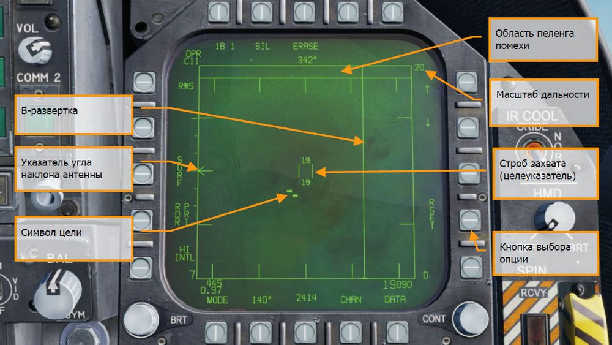

1. **В-развертка (растровая развертка)**. Вертикальная развертка на дисплее, которая
отображает мгновенное азимутальное положение антенны радара на момент
излучения.
2. **Символ угла наклона антенны**. Отображает угол установки антенны в
вертикальной плоскости относительно оси самолета. Символ стабилизирован по крену
и тангажу относительно горизонтальной плоскости своего объекта (вашего самолета).
В режимах поиска символ на экране перемещается соответственно положению
переключателя регулировки угла наклона антенны радара на РУД.
3. **Шкала дальности**. Правая сторона B-развертки отображает дальность радара. Шкала
отградуирована метками в ¼,1/2 , и ¾ от выбранного радиуса сканирования радара.
4. **Целеуказатель (TDC)**. Состоящий из двух параллельных вертикальных линий, этот
курсор перемещается в соответствии с движениями кнюппеля управления
целеуказанием на РУД (Target Designation Control, TDC). Когда радар работает в режиме
поиска, диапазон высот, покрываемый радарным лучом, отображается выше и ниже
указателя. При наведении указателя на символ цели, дальность до контакта
отобразиться слева от указателя, а его высота – справа.
5. **Символы (метки) цели**. Метки цели отображаются в виде сплошных
прямоугольников («кирпичиков»). Горизонтальная позиция метки цели означает ее
угловое расположение по отношению к своему объекту. Вертикальная позиция
указывает дистанцию до нее.
6. **Пеленг помехи (Angle of jam, AOJ) «Блиндаж»**. Цели, данные о дальности которых
радаром не распознаются, располагаются вверху над В-разверткой в углу направления
на помеху, или в т.н. «блиндаже». По данному классу целей отображается только
азимут на них.
7. **Кнопки выбора режимов**. По периметру экрана радара расположены 20 кнопок,
которые используются для управления режимами и параметрами радара. Нажатие
кнопки запускает, или отменяет действие, а при нажатии кнопок в определенной
последовательности, становятся доступными все варианты этого действия.

### Опорная точка А/А, данные Азимут/Дальность

Для получения более точной тактической информации о местоположении других самолетов на
экране радара возможен вывод индикаторов данных опорной точки и азимута/дальности. Это
особенно полезно при получении данных ДРЛО или других самолетов, и при передаче данных с
помощью голосовых сообщений товарищам по команде.

#### Опорная точка (Воздух-Воздух)

Данная точка совпадает с навигационной точкой из базы данных самолета. Для получения более
точной информации вы должны удостовериться, что опорная точка совпадает с опорной точкой,
заданной в редакторе миссии! Для того, чтобы определить навигационную точку, как опорную,
войдите на страницу DATA на экране HSI и выполните нажатие на кнопку PB2. Текущий ППМ
будет определен, как опорная точка.
После определения опорной точки вы можете изменять текущий ППМ, переключаться на
следующий, что никак не повлияет на опорную точку.

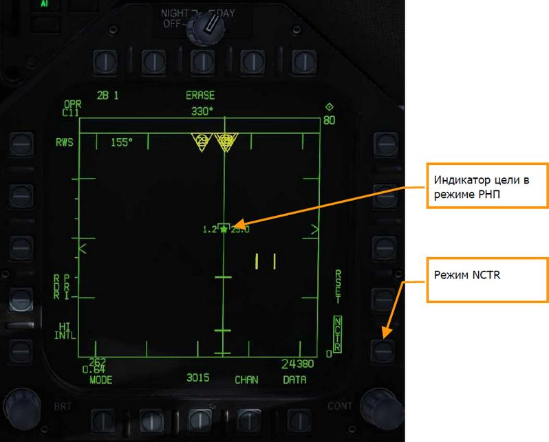

После определения опорной точки (A/A) на экране радара появится указатель (круг или ромб)
со стрелкой, которая указывает на магнитный север. Если номер текущего ППМ совпадает с
опорной точкой, указатель опорной точки будет отображен в виде ромба. В противном случае,
опорная точка будет представлена в виде круга.

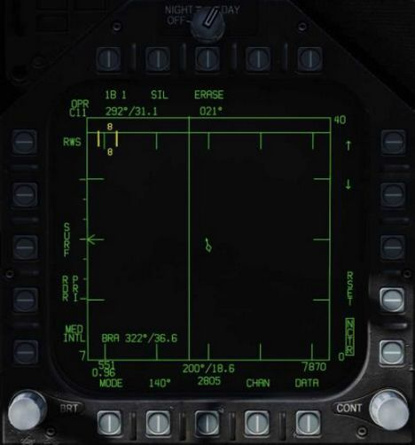

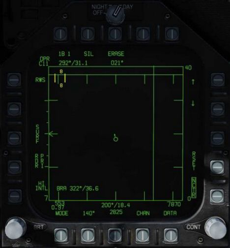

#### Индикация Азимут/Дальность

Опорная точка может быть использована для получения данных Азимута/Дальности:

- От опорной точки до строба захвата (TDC). В левом верхнем углу экрана радара в
режиме A/A отображается азимут/дальность текущей позиции строба захвата
относительно опорной точки.
- Собственного самолета относительно опорной точки (A/A WP). В нижней части экрана
радара по центру отображается индикатор азимута/дальности от опорной точки на
самолет пилота.

Дополнительно, если включить опцию BRA в режиме RWS в подменю DATA, в левом нижнем углу
экрана радара будет отображаться азимут/дальность от самолета к текущему местоположению
строба захвата.

### Режим определения дальности при поиске (RWS)

Определение дальности в режиме поиска (Range While Search, RWS), напоминает
функциональностью режим ОБЗ в российской терминологии, является режимом по умолчанию в
большинстве случаев при работе в режиме «воздух-воздух» или, когда ракеты «воздух-воздух»
выбраны в качестве активного АСП. Режим RWS обеспечивает всеракурсное (передняя и задняя
полусферы) обнаружение целей во всем диапазоне высот (верхняя и нижняя полусферы).
Дисплей отображает дистанцию до цели по вертикальной оси, а азимутальный угол – по
горизонтальной.

В режиме работы RWS, радар может обрабатывать до 10 целей.

!!! hint
    Быстрая миссия : Hornet A/A RADAR

    - "Как использовать радар за пределами визуальной видимости"
    1. Переключатель RADAR на панели управления сенсорами в позицию OPR (Работа).
    2. На панели СУВ включите режим в A/A или NAV (ни один режим не выбран).
    3. Откройте страницу радара (RDR ATTK) из раздела TAC на правом МФД.
    4. Используйте кнюппель управления целеуказателем (TDC) для перемещения и
    наведения строба захвата (TDC курсора) на цель на тактическом дисплее радара.
    5. Выполните захват цели с помощью нажатия кнюппеля целеуказателя TDC на РУД

Индикация режима RWS состоит из:

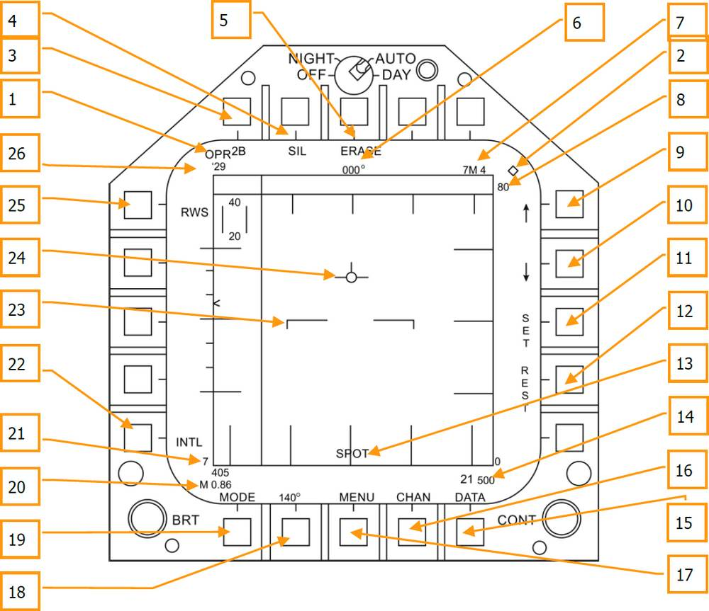

Основное управление радаром в режиме «воздух-воздух» осуществляется с TDC (управление
целеуказанием на РУД). Применяется для перемещения указателя управления целеуказанием и
приведения в действие нажатием.

1. **Оперативный (боевой) режим**. Когда радар работает в режиме излучения,
индицируется OPR. Когда радар находится в ждущем режиме, индикатор показывает
STBY.
2. **Индикатор управления стробом TDC**. Когда для управления дисплеем радара
выбран кнюппель (строб) TDC, в верхнем правом углу дисплея отображается символ
ромба. Выбор осуществляется нажатием переключателя управления сенсорами (Sensor
Control Switch) в право. Обратите внимание, что обычно индикация радара размещена
на правом МФД.
3. **Полоса сканирования по углу места**. В режиме предупреждения об облучении
последовательное циклическое нажатие 1, 2, 4 и 6 раз делит полосу растрового
(двухмерного) сканирования на соответствующее количество секторов. Чем больше
количество секторов, тем больше охват зоны сканирования по углу места. Однако, чем
больше количество секторов сканируется, тем больше времени требуется на
формирование полной «картинки». Пространство секторов, как правило, имеет охват
1,3 градуса, однако при выборе масштаба в 5 морских миль охват составляет 4,2
градуса.
4. **Бесшумный (SIL) режим**. Когда выбран режим SIL (символ в рамке), радар
прекращает сканирование и переходит в режим ожидания. Этот режим отображается
в виде Железного Креста, расположенного в левой нижней части дисплея. В режиме
SIL команда ACTIVE находится в левом верхнем углу дисплея (заменяет устаревшую
индикацию цели). При нажатии соответствующей кнопки, радар проведет одно полное
сканирование (зафиксирует «картинку») с учетом существующих настроек и установок.
После окончания сканирования радар автоматически вернется в режим SIL.
5. **Стирание (Erase)**. При нажатии кнопки Erase, вся история целей на радаре удаляется
до тех пор, пока они не будут обнаружены и отображены снова. Во время работы в
режиме SIL вся история также удаляется.
6. **Направление**. Направление вашего самолета в градусах. Обычно это магнитный курс,
но вы можете выбрать истинный курс из разделов HSI/DATA/A/C.
7. **Оружие и количество**. Наименование приоритетного оружия и количество
оставшегося.
8. **Масштаб дальности**. Выбранная дальность отображения радара. Возможна
настройка дальности в 5,10,20,40, 80 и 160 морских миль.
9. **Увеличение дальности**. Нажатие кнопки выбора этой функции увеличивает
дальность отображения радара. Когда достигнута максимальная дальность
отображения, стрелка увеличения дальности не отображается. Стрелка и функция
недоступны, если радар работает в режиме STT (отображение маршрута одиночной
цели).
10. **Уменьшение дальности**. Нажатие кнопки выбора этой функции уменьшает
дальность отображения радара. Когда достигнута минимальная дальность
отображения, стрелка уменьшения дальности не отображается. Стрелка и функция
недоступны, если радар работает в режиме STT (отображение маршрута одиночной
цели).
11. **Установить (SET)**. Нажатие кнопки SET позволяет сохранить настройки радара для
оружия в приоритетном порядке. Они включают в себя дальность отображения,
ограничение сканирования по углу места, азимут, частоту повторения импульсов (PRF),
длительность отображения метки цели на экране.
12. **Сброс (RESET)**. При нажатии этой кнопки установки радара сбрасываются на
установки по умолчанию для оружия в приоритетном порядке.
13. **Режим прожектора (Spot Light Mode)**. Когда кнюппель управления целеуказанием
TDC нажат и удерживается дольше одной секунды, радар проведет сканирование
полосы шириной 22 градуса в азимутальной плоскости от текущего местоположения с
применением текущих установок и настроек радара. Во время сканирования в центре
нижней части дисплея будет отображаться надпись «SPOT». В режиме прожектора,
TDC может передвигаться в диапазоне 60 градусов. Чтобы отключить режим
прожектора нажмите кнопку сброса целеуказания.
14. **Высота (Altitude)**. Высота своего объекта (вашего самолета).
15. **Данные (DATA)**. Нажмите эту кнопку для входа в подраздел «Данные».
16. **Канал (CHAN)**. Выбор частоты радиоканала, на котором радар будет излучать. Когда
    - MAN, а вместо варианта
DCLTR появится соответствующий канал. Последовательные нажатия кнопки AUTO
MAN переключают автоматический и ручной выбор канала.
17. **Меню (MENU)**. Выполняет возврат в раздел TAC.
18. **Ширина зоны сканирования по азимуту**. Радар имеет настройки сканирования по
азимуту с углами в 20, 40, 60, 80 и 140 градусов. Последовательное нажатие этой
кнопки выбора вариантов позволяет выбирать между этими настройками.
19. **Режим (MODE)**. Последовательное нажатие переключает радар в режимы RWS, VS,
или TWS.
20. **Воздушная скорость**. Воздушная скорость своего объекта, приборная и в числах
Маха.
21. **Индикатор чувствительности (Sensitivity Indicator)**. Отображает уровень
коэффициента усиления радара при обнаружении контакта. Высокие числа указывают
на высокую чувствительность, а низкие числа указывают на низкую чувствительность.
22. **Частота повторения импульсов (PRF)**. Выбор частоты повторения импульсов между
средней (MED), высокой (HI) и чередующейся (INTL). Средняя частота повторения
импульсов минимизирует «слепую зону», уменьшая ложные цели, улучшает
всеракурсное обнаружение, но имеет меньшую дистанцию обнаружения. Высокая
частота повторения импульсов имеет большую дистанцию обнаружения, но более
низкие характеристики среднего аспекта обнаружения. Чередующаяся частота
повторения импульсов попеременно меняет высокую и среднюю полосы охвата.
23. **Линия горизонта**. Отображает линию горизонта на ИЛС.
24. **Вектор скорости (Velocity Vector)**. Отображает вектор скорости на ИЛС, показан в
фиксированном положении и используется в сочетании с движущейся линией
горизонта для отображения направления полета, крена и тангажа.
25. **Режим радара**. Отображает выбранный режим радара.
26. **Канал радиочастоты (RF Channel)**. Канал радиочастоты радара, выбранный кнопкой
CHAN. (Будет реализовано в версии Open Beta)

### Режим LTWS (Скрытный СНП)

На экране радара в режиме RWS в подменю Data всегда отображается опция LTWS. Данный
режим по умолчанию активирован, надпись LTWS обрамлена. Данный подрежим возможно
включить только из режима RWS, в котором символы идентификации цели HAFU не
отображаются на экране радара. В данном режиме выводятся специальные MSI контакты,
которые обрабатываются только радаром. Контакт, обработанный только радаром в режиме
RWS, на дисплее отображается в виде символа “кирпич” (указатель цели, точки захвата).

После включения режима LTWS при наведении строба захвата на цель появляется символ
идентификации - HAFU. Если цель является одной из восьми приоритетных целей, при наведении
строба захвата на цель появится индикатор зоны допустимых пусков. Также, дополнительно на
символе HAFU отобразится высота (справа) и скорость полета (число М, слева) цели.

Захват цели в режиме LTWS определяет цель как первостепенную (символ HAFU со звездой
внутри - L&S). При попытке захватить вторую цель, бортовая ЭВМ определит вторую цель, как
второстепенная (символ HAFU с ромбом внутри - DT2). Таким образом можно выполнить
скрытное сопровождение 2х целей одновременно. В то время, с помощью наведения строба
захвата на контакт позволит вам получить дополнительные данные по 3й цели.

!!! note "Примечание"
    ПРИМЕНЕНИЕ ОРУЖИЯ В РЕЖИМЕ LTWS НЕВОЗМОЖНО. Для применения оружия
    радар должен находится в режиме РНП (STT) или СНП (TWS).

Повторное нажатие на обрамленную кнопку LTWS отключает режим LTWS и снимает
обрамление. Если режим LTWS отключен, MSI контакты с HAFU символом не отображаются при
наведении строба на цель.

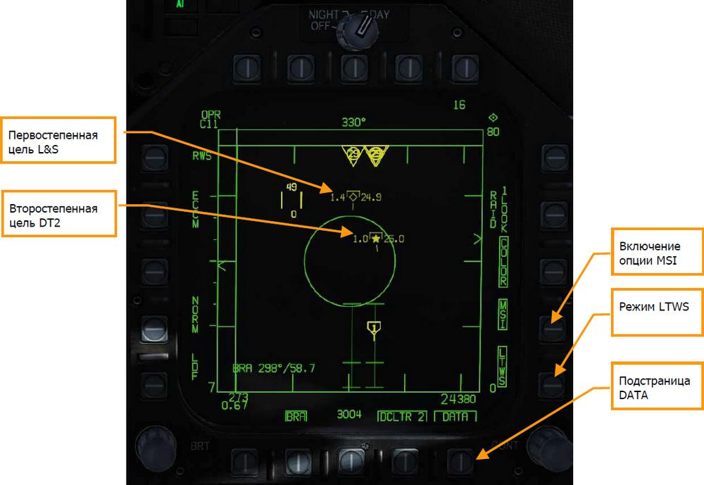

При выполнении захвата двух целей одновременно в режиме LTWS на ИЛС появится два
указателя. Первостепенная цель (L&S) на ИЛС отображается как квадрат, второстепенная (DT2)
– как символ “X”.

#### Интеграция данных нескольких платформ и сенсоров (MSI)

Опциональным компонентом режима LTWS является интеграция данных нескольких платформ и
сенсоров (MSI - Multi Sensor Integration), которая может быть включена на странице DATA с
помощью кнопки PB14. После включения данной опции на экране радара будет отображена
информация от доноров, представленная символами HAFU, даже если строб захвата не наведет
на контакт LTWS. Это дает возможность выводить расширенную ситуационную картину
воздушного пространства впереди самолета на экране радара, аналогично ситуационному
экрану (SA).

Контакты, обнаруженные с помощью БРЛС без участия доноров отображаются в виде
“кирпичей”, как в режиме RWS.

!!! info
    Контакты MSI в режиме RWS выводятся в случае, если включен режим LTWS.

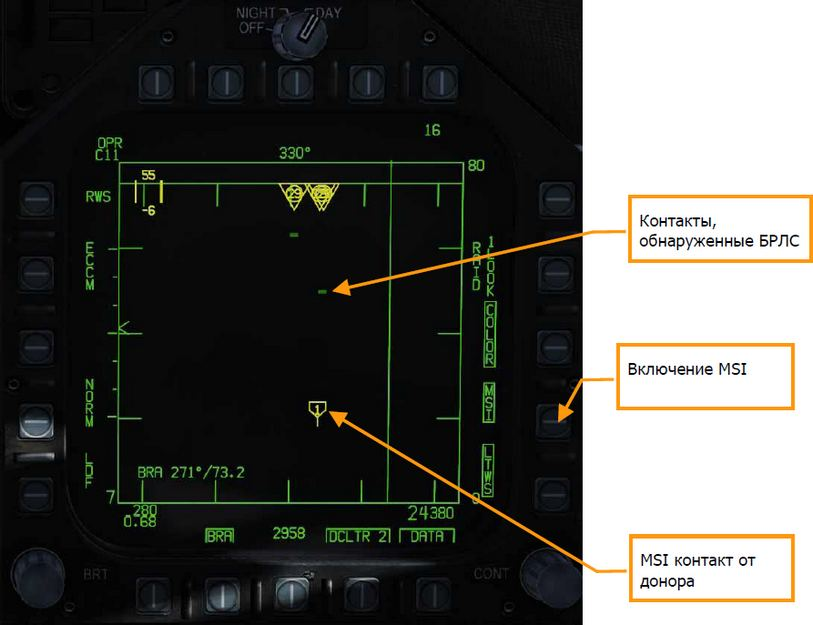

### Режим непрерывной пеленгации (STT)

Радар осуществляет переход в режим РНП (STT – Single Target Track) после завершения фазы
ручного или автоматического захвата цели:

- После нажатия кнюппеля TDC, когда строб захвата находится над контактом в режиме
RWS.
- После двойного нажатия кнюппеля TDC, когда строб захвата находится над контактом
в режиме LTWS.
- При использовании режима AACQ или режимов БВБ (ACM).

Режим РНП отображается на экране радара. Радар непрерывно отслеживает дальность и
местоположение сопровождаемой цели. Эти данные используются для генерирования огневого
решения для ракет или ВПУ. На экране выводится курс перехвата, разрешенная дальность
пуска/стрельбы, учитывая данные о цели. Режимы БВБ и РНП, а также их огневые решения не
доступны, если активен главный навигационный режим NAV. Пуск ракеты AIM-7 возможен только
из режима РНП. Исключениями являются режимы HOJ (сопровождение помехи) или FLOOD
(режим “прожектора”).

В режиме РНП происходит автоматическая настройка масштаба дальности экрана радара,
которая включается при переходе в режиме РНП или после нажатия кнопки RSET. Если
первостепенная (L&S) второстепенная цель (DT2) находится в пределах тактической зоны экрана
радара, настройка масштаба дальности происходит относительно этих целей.

!!! warning "Обратите внимание!"
    Когда активен режим РНП - радар сфокусирован на одной цели, на экране
    не выводятся другие контакты.

#### Режим автономного распознавания цели NCTR

Если цель сопровождается в режиме РНП – режим NCTR позволяет выполнить идентификацию
воздушной цели с помощью ряда параметров. Включение данного режима происходит на экране
радара в режиме RWS с помощью кнопки PB15.
Работа режима NCTR основана на принципе анализа данных лопаток двигателя, которые затем
соотносятся с типом самолета. Распознавание цели производится только в режиме РНП (STT) и
если:

- Дальность до цели составляет до 25 морских миль.
- Цель находится в пределах до 30 градусов относительно самолета носовой или
хвостовой частью фюзеляжа.

Результаты распознавания затем отображаются на ситуационном экране (SA) при наведении
строба на контакт. Тип цели выводится в блоке данных, который размещен в правой нижней
части экрана SA.

Режим NCTR может быть очень полезным при выполнении двухфакторного распознавания цели.

### Управление радаром в режиме A/A с помощью HOTAS

В воздушном бою очень полезно держать руки на органах управления и не убирать их с РУС и
РУД, отвлекаясь от управления самолетом. «Хорнет» имеет превосходную реализацию
концепции HOTAS. Ниже приведены некоторые из наиболее важных функций, реализованных по
концепции HOTAS для воздушного боя.

#### Ручка управления самолётом

Жизненно важными на ручке управления самолетом (РУС) являются: выбор источника
управления сенсорами (Sensor Control Switch) и кнопка сброса целеуказания (NWS/Undesignate)
и включения механизма разворота колеса (МРК). Когда включен режим BVR (за пределами
прямой видимости) нажатие переключателя управления сенсорами вправо устанавливает
управление прицельной маркой радара на правом МФД. Когда перемещение прицельной марки
производится на назначенном для этого дисплее, в его правом верхнем углу появится
изображение ромба с точкой в центре.

Нажатие переключателя управления сенсорами вправо, когда управление прицельной маркой
уже определено (назначено), переведет радар в режим автоматического захвата (AACQ). Если
прицельная марка находится над символом цели, а радар при этом работает в режиме AACQ, то
автоматически поступает команда на захват этой цели радаром. Если при нажатии
переключателя и включении режима AACQ прицельная марка не находится на отметке цели,
радар попытается захватить ближайшую цель, которая находится в пределах сканируемого
пространства.

**Кнюппель управления сенсорами (Sensor Control Switch)**. Помимо основной функции по
выбору экрана, с которого идет управление сенсором, имеет еще две функции в режиме Воздух-
Воздух.

При работе с радаром вне визуального обнаружения целей, функционал включает в себя:

- Вперед: выполняет переход в режим маневренного воздушного боя (ACM) с
активированным режимом визирования (BST - Boresight) по умолчанию.
- Назад: предоставляет приоритет в управлении целеуказателем центральному МФД
(MPCD)
- Влево: предоставляет приоритет в управлении целеуказателем левому МФД
- Вправо: предоставляет приоритет в управлении целеуказателем правому МФД или
    - Acquisition) если приоритет управления
целеуказателем уже предоставлен правому МФД

Находясь в режиме ближнего (маневренного) воздушного боя, переключатель управления
сенсорами обеспечивает следующий функционал:

- Вперед: переключает радар в режим визирования (BST)
- Назад: переключает радар в режиме вертикального сканирования (VACQ)
- Влево: переключает радар в режим широкоугольного сканирования (WACQ)

**Переключатель выбора вооружения (Weapon Select Switch)**. Переключатель выбора
вооружения. Этот пятипозиционный переключатель позволит вам быстро установить приоритет
применения оружия «воздух-воздух». При этом, он также установит настройки радара для
наилучшего применения оружия:

- Вперед: AIM-7 Sparrow
- Вниз: AIM-9 Sidewinder
- Назад: 20 мм пушка M61A2
- Вправо: AIM-120 AMRAAM
- Влево: не задействовано

**Гашетка**. Приводит в действие выбранное оружие, такое, как пушка и ракеты «воздух-воздух».

**Кнопка сброса захвата (NWS/Undesignate)**. В режиме «воздух-воздух» первоочередная
функция кнопки сброса захвата – снятие радарного захвата с цели. Она также может быть
использована для возвращения радара в режим поиска, когда радар находится в режиме БВБ.

### Рычаги Управления Двигателями

Для этой версии раннего доступа, двумя, наиболее важными элементами управления радаром
являются кнюппель управления целеуказателем и управление углом наклона антенны радара по
углу места.
Управление углом установки антенны радара по высоте осуществляется колесиком, которое при
повороте его назад увеличивает высоту сканирования, а при повороте вперед – уменьшает ее.

Кнюппель управления целеуказателем представляет из себя элемент управления указателем, с
функцией нажатия кнопки. Когда управление целеуказанием транслируется на правом МФД,
кнюппель управляет целеуказателем в пределах области тактического отображения радара.
Когда дисплей радара работает в режиме «воздух-воздух», цифры над и под прицельной маркой
указывают максимальную и минимальную высоту охвата радара в пределах дистанции действия
управления целеуказанием на дисплее.

Когда прицельная марка выведена за границу отображения, кнюппель управления
целеуказанием можно использовать для переключения режимов радара и изменения
параметров. Если прицельная марка выведена за границы в область выбора режима, на дисплее
появятся параметры режима. Если навести указатель на желаемый режим и нажать на кнюппель,
радар отобразит оптимальные параметры для выбранного режима. Остальными параметрами,
показанными вдоль периметра дисплея, также можно управлять.

### Страница DATA режима RWS

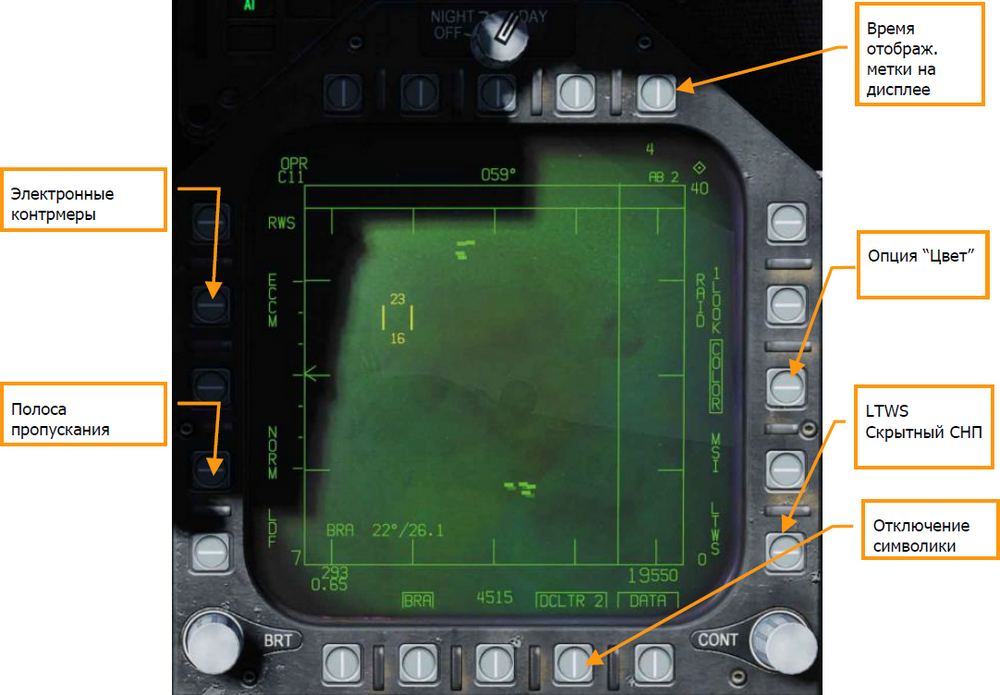

1. **Время жизни метки на экране**. Количество времени, в течении которого метка цели
отображается на экране после того, как радарный контакт с ней был утерян, можно
установить в 2, 4, 8, 16 и 32 секунды, последовательным нажатием.
2. **Цвет**. Выбор отображения картинки радара: монохромный, или трехцветный.
3. **Скрытое сопровождение в процессе сканирования (LTWS)**. LTWS обеспечивает
функцию сопровождения в процессе сканирования (Track While Scan, СНП в российской
терминологии) – когда радар работает в режиме определения дальности в процессе
поиска (RWS). Если при включенном режиме LTWS наложить прицельную марку на
метку цели, появится символ наведения и готовности к пуску. Однако, никаких
сигналов «Пуск» не отображается. В режиме LTWS справа от метки цели отображается
ее скорость в числах Маха и высота в тысячах футов. Кроме того, информация о
дальности и сближении отображается вдоль правой границы тактической обстановки.
4. **Данные**. Выход из раздела данных.
5. **Отбор изображений**. Позволяет выбирать из двух уровней вывода изображений на
дисплей радара. DLCTR1 убирает линию горизонта и вектор скорости. DLCTR2 убирает
то же, что и DLCTR1, плюс разницу высоты цели, ее курс, значение и символ дистанции,
если радар работает в режиме STT. Выбранный режим будет индицироваться в виде
надписи DCLTR1, или DLCTR2, заключенной в рамку.
6. **Полоса пропускания (Speed Gate)**. Позволяет выбрать между нормальной (NORM)
и широкой (WIDE) полосой стробирования по скорости, для определения ширины метки
доплеровской радиальной скорости. Не применяется для обнаружения/фильтрации
низкоскоростных целей, таких как автомобили или самолеты авиации общего
назначения. При работе в широкополосном (WIDE) режиме, полосно-заграждающий
фильтр увеличивает полосу пропускания, что позволяет обнаружить и отобразить
низкоскоростные цели. (Будет реализовано в версии Open Beta)
7. **Электронные контрмеры (ECCM)**. Включает, или отключает электронные
контрмеры. При включении, «забивающий» эффект от вражеского самолета
становиться менее выражен, но уменьшается чувствительность радара. (Будет
реализовано в версии Open Beta)

### Режимы маневренного воздушного боя (ACM)

Режимы БВБ (Air Combat Maneuvering, ACM) разработаны для маневренного воздушного боя с
автоматическим обнаружением целей. Режим ACM может быть выбран нажатием вперед
переключателя управления сенсорами при установленном режиме BVR, или нажатием назад
переключателя выбора вооружения, назначая ВПУ в качестве первоочередного вооружения для
применения в режиме «воздух-воздух».
Любая ракета «воздух-воздух» может применяться во всех режимах ACM, кроме режима GACQ
(захват ВПУ).

#### Применение радара в режиме маневренного воздушного боя (ACM)

1. Установить переключатель управления радаром на панели сенсоров в положение OPR
(Работа)
2. Перевести СУВ в режим A/A и включить, переведя главный включатель в полож. ARM.
3. Выбрать ATTK RDR на странице TAC правого МФД
4. Нажатием вперед переключателя управления сенсорами включить режим ACM.
5. Нажатием назад переключателя управления вооружением установить ВПУ в качестве
приоритетного оружия в режиме «воздух-воздух», установив радар в режим
автоматического захвата ВПУ (GACQ)
6. Находясь в режиме ACM, используйте переключатель управления сенсорами для
выбора режимов ACM: вперед для прицеливания (BST), назад для вертикального
захвата (VACQ), влево для широкоугольного захвата (WACQ)

Существует четыре режима маневренного воздушного боя:

- **Автоматическое наведение ВПУ (GACQ)**, режим, который автоматически
включается, когда ВПУ выбрана для применения «воздух-воздух». Этот режим
представлен на ИЛС в виде пунктирного круга с шагом в 20 градусов, который
охватывает все поле зрения ИЛС. В отличии от других ACM режимов, дальность
сканирования в режиме GACQ составляет 5 миль.
- **Прицеливание (BST)**. Включается нажатием вперед переключателя управлением
сенсорами. При выборе, на ИЛС появляется пунктирный круг с шагом в 3.3 градуса.
Этот круг отображает зону автоматического захвата радара. Зона охвата BST
составляет 10 миль.
- **Вертикальное сканирование (VACQ)**. Включается нажатием назад переключателя
управлением сенсорами. При этом, на ИЛС отобразятся две пунктирные линии. Этот
вертикальный шаблон автоматического поиска и захвата охватывает область от – 13
до +46 градусов. VACQ ищет цели на расстоянии до 5 миль.
- **Широкоугольное наведение (WACQ)**. Пространственно-стабилизированный режим,
выбирается нажатием переключателя управления сенсорами влево. При этом, в
нижнем правом углу ИЛС отображается прямоугольник. Этот прямоугольник
представляет собой шаблон автоматического поиска и захвата и может перемещаться
с помощью кнюппеля управления целеуказателем (TDC), если не заарретирован.
Прямоугольник размещен на сетке, которая представляет собой границы сканирования
радара. WACQ ищет цели на расстоянии до 10 миль. В версии раннего доступа режим
WACQ будет включать режим “Cage”, режим “Uncaged” будет реализован позже, в
период раннего доступа.
- **Режим автоматического захвата (AACQ)**. Включается из режима радара BVR так
же, как RWS. Из режима ACM выбрать нельзя. Если радар работает в режиме BVR, а
курсор управления целеуказателем не находится на метке цели, то при отклонении
влево переключателя управления сенсорами, радар автоматически попытается
захватить ближайшую цель в зоне сканирования. AACQ ищет цели за пределами
установок радара. Если радар находится в режиме ACM, то включение AACQ выведет
радар из этого режима и вернет его в режим BVR.

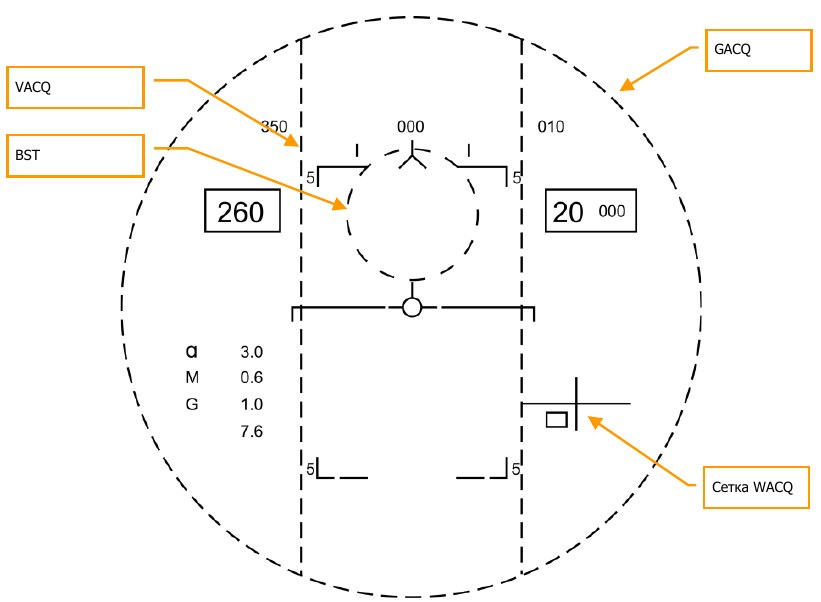

## Система обмена данными, Ситуационный экран и госопознавание

F/A-18C в нашем исполнении располагает двумя терминалами MIDS - Многофункциональной
Системы Распределения данных (Multifunction Information Distribution System), которые
обеспечивают прием и передачу данных по тактической сети (TDL - Tactical Data Link) Link-16.
    - и других
служб. В дополнение к этому, Link-16/MIDS также обеспечивает защищенную голосовую связь
(переключатели MIDS1 и MIDS2 на РУД).

Для работы терминалов MIDS могут использоваться обе радиоантенны (верхняя и нижняя).
Основная цель Link-16/MIDS - предоставление тактической информации вокруг пилотируемого
самолета в режиме реального времени. Она включает в себя сенсорные системы самого
самолета, данные с сенсоров других дружественных истребителей, подключенных к сети и иные
средства наблюдения, такие как самолеты дальнего радиолокационного обнаружения AWACS,
например.

Информация со всех этих источников (доноров) соотносится друг с другом и связывается, для
создания единой ситуационной картины. Это позволяет более координированное использование
средств и уменьшает риск дружественного огня. Система может выводить на бортовые экраны
до 16 отдельных треков.

MIDS может получать и отображать пилоту три типа треков с помощью терминалов MIDS Link-
16:

- **Истребитель-Истребитель (F/F)**. MIDS может получить треки от 7 доноров (другие
истребители, подключенные к Link-16) и каждый донор может предоставить до 8
треков. Все они соотносятся и связываются для предотвращения дублирования.
- **Точное местонахождение и идентификация (PPLI)**. Это данные о
месторасположении донора, работе его сенсоров и его текущую полезную нагрузку.
- **Треки от систем наблюдения (SURV)**. Это данные от других доноров (не
истребителей), таких как самолеты AWACS или наземные РЛС, подключенные к сети.

Треки от каждого из этих 3 источников (доноров) затем соотносятся с информацией от
собственных сенсоров самолета. Этот процесс называется Multi Sensor Integration (Интеграция
нескольких разведывательных платформ и датчиков). Внешние треки, соответствующие вашему
самолету, не отображаются.

Треки полученные от Link-16/MIDS могут выводиться на:

- экране радара в режиме A/A;
- ситуационном экране;
- нашлемной системе целеуказания.

Для обеспечений простоты использования и избегания чувствительных из-за секретности
областей, в симуляторе все параметры сети будут автоматически сконфигурированы.

### Управление терминалом MIDS Link-16 через ПВИ

Для входа в меню управления MIDS на ПВИ нажмите кнопку D/L. После этого ПВИ примет
следующий вид:

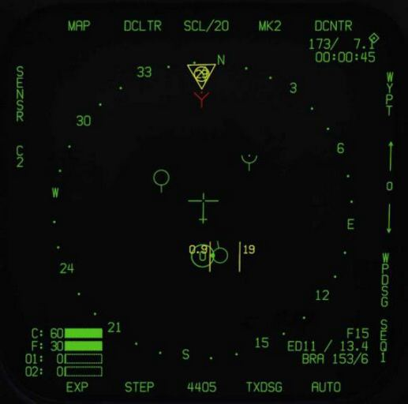

Для включения питания терминала MIDS нажмите кнопку ON/OFF на UFC. Если питание не
включено, то дисплей данных и все дисплеи опций UFC пусты. После включения питания на
дисплее данных отображается ON и на дисплеях опций по умолчанию отображаются:

- AIC
- F/F1
- F/F2
- VOCA
- VOCB

Выключение терминалов MIDS выполняется путем повторного нажатия кнопки ON/OFF на UFC.
Опции AIC, F/F1 и F/F2 не реализованы. Нажатие кнопки выбора опции для VOCA или VOCB
позволяет игроку войти в голосовой каналы MIDS A и MIDS B. После входа можно ввести номер
канала в диапазоне от 1 до 126. Введенный канал отображается на дисплее данных, а кнопка
ENT подтверждает и включает использование канала (номер) для выбранного голосового канала
MIDS (MIDS A или MIDS B)

Выбор 127 канала отключает VOCA и VOCB.

### Защищенная радиосвязь MIDS

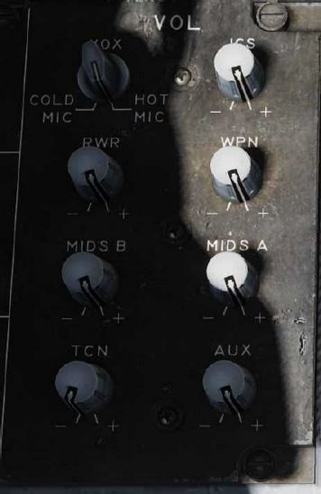

В дополнение к радиосвязи ARC-210 COMM1 и COMM2,
MIDS предоставляет два дополнительных защищенных
радиопередатчика: MIDS A (вперед) и MIDS B (назад).
Уровень громкости MIDS A и MIDS B контролируется
регуляторами на панели громкости на левой консоли.
    - всегда
должен быть в положении NORM.

Если на мгновение установить значение HOLD или ZERO,
настройки защищенной радиосвязи для MIDS A и MIDS B
будут удалены.
(Эта функция появится позже при раннем доступе).

### MSI-контакты

Контакты MSI это объекты (символы и данные),
полученные либо внешними источниками (донорами F/F и
SURV), либо собственными сенсорами (например,
обнаружением БРЛС). Это радиолокационные контакты, которые были классифицированы
бортовой ЭВМ и/или пилотом как “бортовые/собственные” и/или от внешних доноров как
“внешние”. Эти треки часто представлены на экране символом, известным как HAFU.

Когда БРЛС обнаруживает контакт на первом проходе, ему присваивается трек и ранг,
основанный на ряде основных факторов, и оценивается в соответствии с такими параметрами,
как дальность, скорость и аспект, для расстановки приоритетов с точки зрения потенциальной
тактической угрозы.

### Индикация ситуационного экрана SA (Situational Awareness)

Вход на ситуационный экран SA осуществляется с боевого раздела так при помощи кнопки PB13.
Данный экран во многом дублирует экран ПНП. Общий набор опций экрана ПНП состоит из:

- Опция MAP, кнопка PB 6.
- Опция SCL, кнопка PB 7.
- Опция MK (оперативная точка), кнопка PB 9.
- Опция DCNTR (смещение центра экрана), кнопка PB 10.
- Опция WYPT/OAP/TGT, кнопка PB 11.
- Стрелка вверх (увеличение номера ППМ), кнопка PB 12.
- Стрелка вниз (уменьшение номера ППМ), кнопка PB 13.
- Опция WPDSG (создание целевого ППМ), кнопка PB 14.
- Опция SEQ (1-3) (опция выбора маршрута), кнопка PB 15.
- Опция AUTO, кнопка PB 16.
- Опция MENU/TIME, кнопка PB 18.

Вышеперечисленные опции работают также, как и на экране ПНП. Изменения на экране ПНП
отображаются на ситуационном экране и наоборот.

Индикация ситуационного экрана имеет много общего с экраном ПНП, который включает в себя:

- Шкала компаса
- Линия курса
- Указатели направления на ППМ/Точку смешения/Цель (и “хвост”)
- Азимут/Дальность (BRA) строба относительно опорной точки (A/A).
- Азимут/Дальность (BRA) самолета относительно опорной точки (A/A)
- Символ самолета
- Указатель активного сенсора (приоритет управления сенсором, ромб)
- Индикатор опорной точки
- Индикатор заданного ППМ/Точки смещения/Цели, направление дальность и время до
(справа сверху)
- Выбранный привод TACAN, направление, дальность и время до (сверху слева)

Набор уникальных опций ситуационного экрана состоит из:

- **DCLTR (отключение символики), кнопка PB 7**. После нажатия на данную кнопку
появляется 5 доступных опций отключения символики ситуационного экрана с
помощью кнопок от PB 6 PB 10.
    - **OFF**. Отображение всех символов
    - **REJ1**. Отключение следующей индикации: шкала компаса, линии курса, и зон
действия ПВО (штрихпунктирные круги).
    - **REJ2**. Отключение следующей индикации: вся символика REJ1 и данных
ППМ/Выносных точек/Цели, данных привода TACAN, указателя направления
на ППМ, указатель направления на привод TACAN.
    - **MREJ1**. Отключение символики обозначения ПВО и зон действия ПВО.
    - **MREJ2**. Отключение символики обозначения наземных целей.

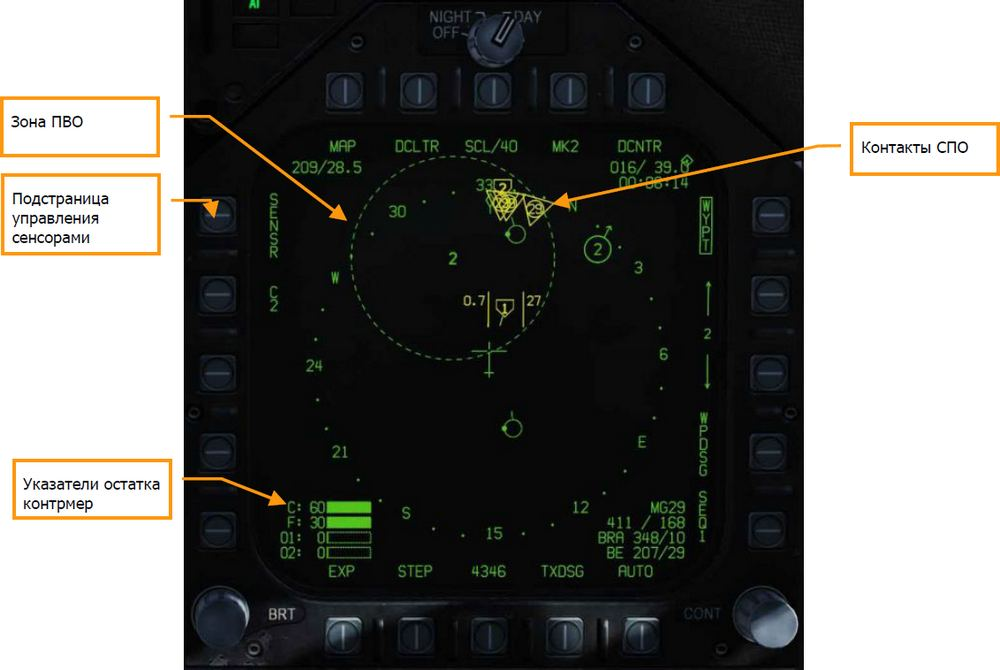

Набор уникальных функций в тактической зоне ситуационного экрана состоит из:

- Подстраница Sensor. С помощью кнопки PB 5 осуществляется вход на страницу выбора
    сенсоров.

- Блок данных контрмер. В левом нижнем углу ситуационного экрана находятся 4
    графических указателя (полосы), которые отображают остаток зарядов контрмер. Слева от
    каждого указателя, сверху вниз отображаются указатели:

    - C – остаток дипольных отражателей
    - F – остаток ложных тепловых целей
    - O1 – остаток радиолокационных ловушек GEN-X
    - O2 - остаток радиолокационных ловушки GEN-X

    Заполнение полосы каждого индикатора зависит от исходного количества загруженных
    контрмер. Например: если вначале миссии на самолете загружено 60 патронов ЛТЦ, то при
    остатке в 30 ЛТЦ полоса будет заполнена наполовину.

- Зоны действия ПВО. Если в редакторе миссий на карте установлены не скрытые объекты
    ПВО, то они отображаются на ситуационном экране в местах их географического
    местоположения. Юнит отображен в виду двухзначного кода (аналогично, как и на экране
    EW) со штрихпунктирным кругом, радиус которого равен радиусу зоны поражения объекта
    ПВО (аналогично, как и в редакторе миссий и на карте F10).
    
    Контакты СПО. Данные СПО не соотносятся с данными контактов MSI и основаны на
    результатах обнаружения собственных бортовых систем. На ситуационном экране
    отображаются 4 самые опасные воздушные цели, дружественные цели, или неопознанные
    источники радиолокационного излучения. Над контактом СПО на ситуационном экране
    отображены от 1 до 3 линий, индицирующие уровень угрозы:
    
    - Одна линия: безопасная цель
    - Две линии: смертельная угроза
    - Три линии (мигающие): Критическая угроза
    
    
    В центре контакта СПО отображается двухзначный цифровой код угрозы аналогично, как и
    на экране СПО и дисплее RWR.

    

### Индикация подстраницы Sensor ситуационного экрана

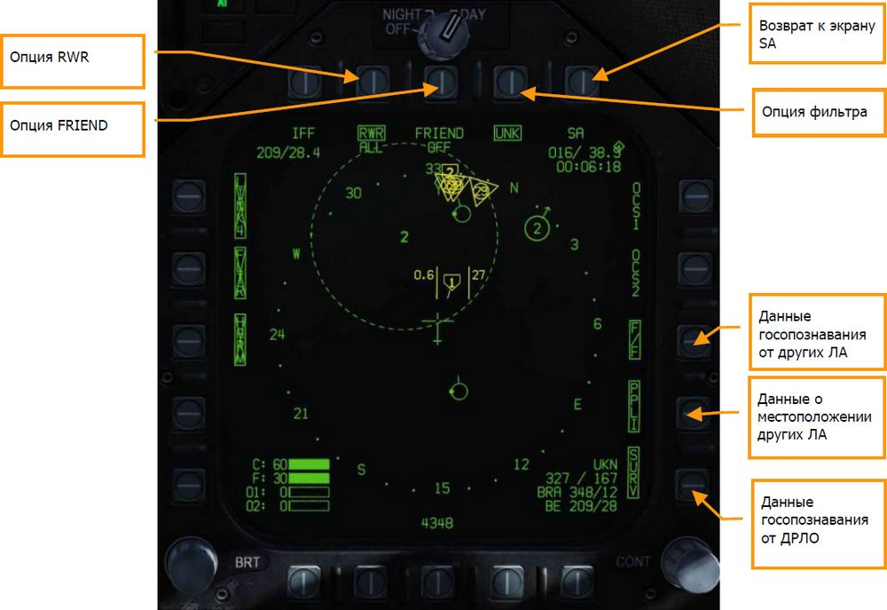

После нажатия на кнопку SENSOR на ситуационном экране происходит вход на страницу выбора
сенсоров, с помощью которых происходит построение тактической информации на экране SA.
Опция RWR. Кнопка PB 7. Циклическое нажатие на данную кнопку осуществляет переключение
типов отображаемых угроз на ситуационном экране. В дополнении к 3м значениям, при выборе
которых надпись обрамляется, существует 4е значение данной опции, при выборе которого
контакты СПО не выводятся на ситуационном экране, а надпись RWR не обрамляется.

- RWR ALL. Отображение всех типов контактов СПО, которые включают в себя
безопасные, смертельные и критичные угрозы.
- RWR CRIT LETH. Отображение только смертельных и критичных угроз на ситуационном
экране.
- RWR CRIT. Отображение только критичных угроз.

Опция FRIEND. Кнопка PB 8. Циклическое нажатие на данную кнопку осуществляет
переключение между опциями отображения дружественных контактов, обнаруженных СПО:

- FRIEND OFF
- FRIEND NO ID
- FRIEND RWR ID

Опция SA. Кнопка PB 10. Осуществляет возврат на главный ситуационный экран SA.

Фильтр Unknown (UNK). Кнопка PB9. Нажатие данной кнопки отключает отображение всех
неопознанных контактов HAFU на ситуационном экране.

Опция F/F. Кнопка PB12. При выборе данной опции на ситуационном экране будет выводится
информация JTIDS/MIDS терминалов по госопознаванию дружественных самолетов. Если опция
не выбрана – информация от доноров не отображается.

Опция PPLI. Кнопка PB13. При выборе данной опции на ситуационном экране будет отображена
информация о текущем местоположении членов звена и других дружественных ЛА, имеющие в
наличии терминалы передачи данных JTIDS/MIDS. Если данная опция не включена –
информация о местоположении дружественных ЛА и членов звена на ситуационном экране не
отображается.

Опция SURV (Surveillance Donors). Кнопка PB14. При включении данной опции на
ситуационном экране будут отображены данные местоположения и госопознавания целей от
самолетов ДРЛО.

### Символ HAFU

Контакты на ситуационном экране представлены в виде символа HAFU (H Hostile – Вражеская
цель, A Ambiguous – неоднозначная цель, F Friendly – дружественная цель, U Unknown –
неопознанная цель). Символ HAFU состоит из нескольких компонентов:

- Цвет: Зеленый – дружественный контакт, Желтый – неопознанный контакт, Красный –
вражеский контакт
- Верхняя половина символа: Верхняя половина отображает результат госопознавания
бортовыми сенсорами самолета
- Нижняя часть символа: В ниженей части символа отображается информация
госопознавания с помощью внешних доноров (других ЛА)
- Уровень опасности: если контакт определен как Неопознанный или Вражеский – в
центре символа HAFU отображается его уровень опасности, представленный в виде
числового значения
- Вектор: Символ HAFU имеет указатель направления полета контакта
- Форма контакта: Верхняя и нижняя часть символа HAFU могут иметь 3 различные
формы:
    - Полусфера: дружественный контакт
    - Скоба: неопознанный контакт
    - Символ ^: вражеский контакт

#### Индикация PPLI-контактов на ситуационном экране

Самолеты, оборудованы системой передачи данных Link-16 (терминалы MIDS или JTIDS), могут
выполнять передачу данных о собственном местоложении другим самолетам, подключенным к
той же сети. Контакты PPLI (Precise Participant Location and Identification - Точное
местонахождение и идентификация) на ситуационном экране отображают местоположение
дружественных ЛА. При наведении строба захвата на контакт дополнительная информация
отображается в правом нижнем углу экрана.

В зависимости от возможностей передачи данных с помощью сети, различают следующие типы
контактов PPLI:

Примечания:

- PPLI-контакты имеют небольшой стержень, индицирующий направление полета.
- Контакты PPLI с точной в центре – самолеты ДРЛО (E-2 или E-3).
- Все самолеты ИИ с наличием терминалов JTIDS или MIDS могут выступать донорами
информации местоположения и идентификации (отображаются как контакты PPLI с
точкой слева).
- Только звено игрока имеет символьные идентификаторы в центре контакта PPLI. Пилот
обозначен символом A, второй ведомый - B, третий ведомый - C, и четвертый
ведомый - D.
- Отключение контактов PPLI осуществляется на подстранице SENSOR (кнопка PB 14) и
может быть использовано для уменьшения и/или отключения символики
ситуационного экрана.

#### Контакты бортовых сенсоров на ситуационном экране

Верхняя половина символа отвечает за информацию о контакте, который был обнаружен с
помощью бортовых сенсоров (радара). Цвет и форма верхней половины символа отображает
“сторону” контакта. Существует 2 способа идентификации контакта с помощью бортовых средств
госопознавания:

- Режим Mode 4 системы IFF. Данная функция использует бортовую систему
госопознавания при опросе контакта с помощью кодированного радиосигнала. Если
контакт возвращает корректный ответ, он обозначается как дружественный (зеленая
полусфера). Если контакт возвращает некорректный ответ, он отображается как
неопознанный или вражеский (если система NCTR определяет контакт как вражеский).
- Автономное распознавание цели (NCTR). Если цель сопровождается радаром в
режиме РНП со включенной опцией NCTR в режиме RWS, РЛС отпечаток может быть
сделан, если цель находится на удалении в пределах до 25 морских миль и ракурс цели
не превышает 30 градусов ППС или ЗПС.

Цель определяется как Вражеская, если оба способа идентификации подтверждают статус
контакта, как Вражеский. Иначе, контакт будет определен как Неопознанный.

В центре символа HAFU отображается уровень угрозы, поскольку, идентификация контакта
выполнена с помощью средств обнаружение самолета. Уровень угрозы используется для
сортировки контактов и определения очереди сопровождения и захвата в режиме AACQ.

Для классификации контакта как Дружеский достаточно подтверждения идентификации в
режиме Mode 4. Идентификация не требует наличия активированного режима NCTR.

#### Символика идентификации дружественных ЛА на экране SA

Данные идентификации, полученные от дружественных самолетов ( F/F - Самолет/Самолет),
представлены на ситуационном экране в виде нижней половины символа HAFU и отображают
три типа контакта: вражеский, дружественный и неопознанный. Если идентификация контакта
происходила только с помощью системы госопознавания F/F, уровень угрозы в центре символа
HAFU не отображается. Также, символ HAFU имеет небольшой стержень - указатель
направления контакта.

#### Неоднозначные контакты, идентифицированные бортовыми сенсорами и внешними источниками идентификации (F/F и SURV)

Контакты, обнаруженные с помощью бортовых сенсоров и внешних источников (дружественных
истребителей F/F и ДРЛО SURV), на ситуационном экране представлены в виде символа HAFU с
верхней и нижней частью. Эти контакты называются Неоднозначными. Цвет контакта зависит от
результатов идентификации с помощью бортовых сенсоров. Контакт включает в себя уровень
угрозы, если контакт не определен как дружественный.

!!! note "Примечание"
    Если результат идентификации с помощью бортовых сенсоров отличается от
    данных идентификации внешними источниками (истребители и ДРЛО), на ситуационном экране
    выводится смешанный символ HAFU со статусом Неопределенный (желтый цвет). Например:
    если игрок обнаружил контакт на экране радара без идентификации с помощью системы IFF,
    контакт HAFU будет обозначен, как неопознанный.

Если внешний донор (истребители или ДРЛО) определил контакт, как вражеский, верхняя часть
символа HAFU будет представлена в виде скобы, а нижняя часть - треугольником. Таким образом,
существует множество потенциальных комбинаций символа идентификации HAFU.

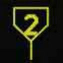

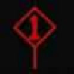

#### Отображение данных идентификации ДРЛО (SURV)

Дополнительно, на ситуационном экране возможен вывод информации идентификации, так
званные треки SURV, полученной от других объектов мониторинга (C2 объекты). Это контакты
(SURV), обнаруженные самолетами ДРЛО (не бортовыми сенсорами). Они особенно полезны в
условиях радиомолчания.

Контакты SURV на ситуационном экране могут отображаться как дружественные (зеленый круг)
или вражеские (красный ромб), с указателем/вектором направления. Размер этих символов
составляет ¾ размера других символов HAFU.

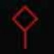

Примечания:

- Символы ЛА имеют небольшой указатель направления полета.
- Если контакты SURV сопоставляются с F/F контактами (самолет получает данные
идентификации от других истребителей и ДРЛО), на ситуационном экране будет
отображаться F/F контакт.
- Если SURV контакт сопоставляется с контактами, обнаруженными с помощью бортовых
сенсоров, на ситуационном экране отображается контакт F/F, индицируя
идентификацию целей бортовыми сенсорами и другими донорами.
- Контакты SURV отображаются лишь в том случае, когда не сопоставляются с
контактами PPLI или F/F (отображение данных контактов отключено) или с контактами,
обнаруженными с помощью бортовых сенсоров.
- При потере сопровождения SURV контакта – его символ начинает мигать 6 секунд на
ситуационном экране с частотой в 3Hz. При невозможности восстановления
сопровождения – контакт удаляется на ситуационном экране (SA).

#### Ранжирование целей

Каждый контакт HAFU ранжирован от 1 до 16, если сопровождение контакта происходит с
помощью бортовых сенсоров. Чем опаснее угроза – тем ниже номер ранга цели. Ниже
представлен список факторов, влияющий на ранжирование целей:

- Дальность
- Аспект
- Воздушная скорость

### Данные о контакте (TUC)

При наведении строба TDC на контакт в правом нижнем углу ситуационного экрана выводится
расширенная информация о цели, как показано на рисунке ниже.

Если контакт дружественный:

- Тип ЛА. На рисунке: F15
- Позывной юнита (первая и последняя буква имени, бортовой номер) / Остаток топлива
- Вектор направления ЛА и дистанция до самолета игрока

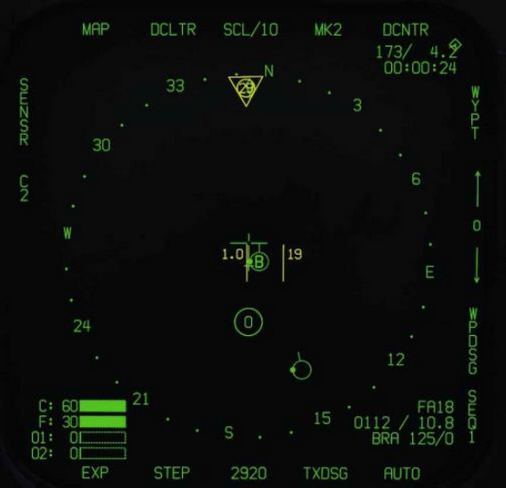

Если контакт вражеский:

- Тип контакта. Например: SU27. Требуется наличия захвата в режиме РНП или
включенной опции NCTR
- Путевая скорость / направление Юнита
- Азимут/Дальность контакта относительно самолет игрока

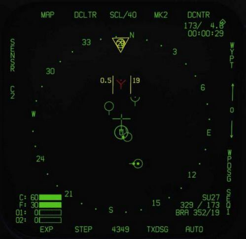

Если неопознанный контакт:

- Указатель UKN - неопознанный
- Путевая скорость / направление юнита
- Азимут/Дальность контакта относительно самолета игрока

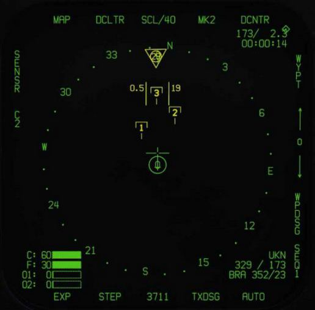

### Индикация данных опознавания на ИЛС

Когда контакт сопровождается в режиме РНП со включенным каналом передачи данных (D/L),
на ИЛС будет выводиться символ “^” над ромбом (целеуказатель) при наличии сопоставления
данных идентификации бортовыми сенсорами и данных от внешних источников.

## ВПУ М61А2 в режиме Воздух-Воздух

Автоматическая встроенная пушечная установка (ВПУ) A/A-49A1 M61A1/M61A2 20MM
предоставляет пилоту мощное оружие в воздушном бою. ВПУ имеет боезапас в 578 снарядов.
Переключатель скорострельности позволяет установить темп стрельбы в 4000, или 6000
выстрелов в минуту.

ВПУ используется для ближнего воздушного боя и может наводиться при помощи радара, или
без него.

Режим A/A GUNS включается нажатием назад переключателя выбора вооружения, или |LShift +
X|. Чтобы открыть огонь, нажмите гашетку на РУС |Space Bar|.

!!! hint
    Быстрая миссия : AA Gun and AIM-9 Sidewinder

### Как выполнять применение ВПУ по воздушным целям

1. Переключатель панели СУВ Master Arm установить в положение ARM
2. На экране СУВ выбрать ВПУ нажав GUN
3. Маневром поместите метку цели в круг на ИЛС, для захвата ее радаром на
дальности в 5 морских миль, или ближе
4. Маневром наложите точку в центре прицела ВПУ на цель и нажмите гашетку,
когда увидите на ИЛС надпись «SHOOT».

## Экран СУВ при использовании ВПУ в режиме A/A

Независимо от выбора режима ВПУ, индикация экрана СУВ (SMS) остается неизменной. Доступ
к экрану СУВ осуществляется через боевой раздел TAC на МФД, или его можно вызвать
автоматически, выбрав A/A GUNS с помощью кнюппеля выбора вооружения.

На экране СУВ вы можете настроить следующие параметры вооружения:

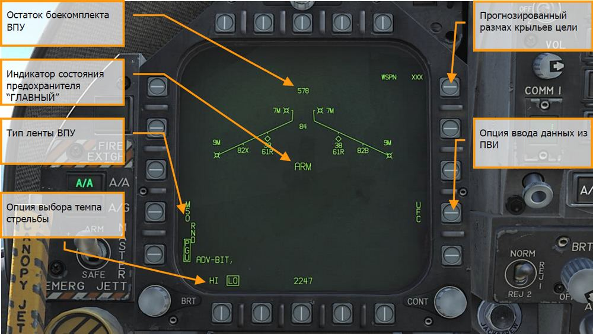

- **Остаток боезапаса ВПУ**. Отображается, когда доступен. Если боезапас исчерпан, то
отображается «XXX». Полный боекомплект составляет 578 снарядов.
- **Тип боеприпасов ВПУ (RND)**. Варианты RND M50/PGU предоставляют собой выбор
типа 20мм снарядов снаряженного боекомплекта. Выбранный тип боеприпаса
отображается в прямоугольнике. Вариант М50 предоставляет собой боеприпасы серии
МК-50, а вариант PGU представляет собой боеприпас PGU-28.
- **Темп стрельбы ВПУ**. При подаче питания на спусковой механизм ВПУ,
устанавливается высокий темп стрельбы (HI) нажатием кнопки выбора вариантов
выбирается пониженный темп стрельбы (LO). Обозначение выбранного темпа стрельбы
отображается в прямоугольнике. Высокий темп – 6000 выстрелов в минуту,
пониженный – 4000 выстрелов в минуту.
- **Индикация режима СУВ**. Отображает положение включателя СУВ (Master Arm)
(ARM, SAFE), или выбор учебного режима (SIM).
- **Ориентировочный размах крыльев**. Для задания предполагаемого размаха
крыльев цели применяется передний пульт. Это значение затем используется для
правильного формирования «прицельной воронки». Выбираемые значения размаха -
это целые числа от 10 до 150, по умолчанию установлено значение в 40 футов. Ввод
значения размаха крыльев осуществляется кнопкой 14 выбора вариантов на переднем
пульте, в разделе A/A GUNS на экране СУВ. Текущее значение размаха крыльев,
отображается, как «WSPN XXX». При индикации WSPN пилот набирает значение
размаха крыльев, используя клавиатуру и вводит его с помощью кнопки ENT.
- **Кнопка UFC**. Нажмите, чтобы ввести размах крыльев вручную с помощью переднего пульта
UFC.

## Индикация ИЛС при стрельбе с ВПУ в режиме A/A

У «Хорнета» есть три функциональных режима ВПУ «воздух-воздух»:

- Режим “прогноз-дорожки”
- Тренировочный режим (Будет доступен в версии Open Beta)
- Сопровождение цели радаром

### Режим прогноз-дорожка

Режим радара без сопровождения, еще называемый «режим воронки», включается сразу же
после выбора режима ВПУ «воздух-воздух», если радар уже не сопровождает цель, или если
слежение за целью прервано, или потеряно. Чтобы применить «воронку», маневрируя поместите
крылья самолета-цели между стенками «воронки» так, чтобы их законцовки касались стенок
«воронки».

Для расчетов угла поворота радара в режиме без сопровождения используется фиксированное
расстояние в 2000 футов. На ИЛС отображается метрическая сетчатая метка диаметром 12,5 мм,
соответствующая цели с размахом крыльев в 25 футов на этом расстоянии.

Специальные символы на ИЛС при применении ВПУ с радаром в режиме без сопровождения
включают в себя:

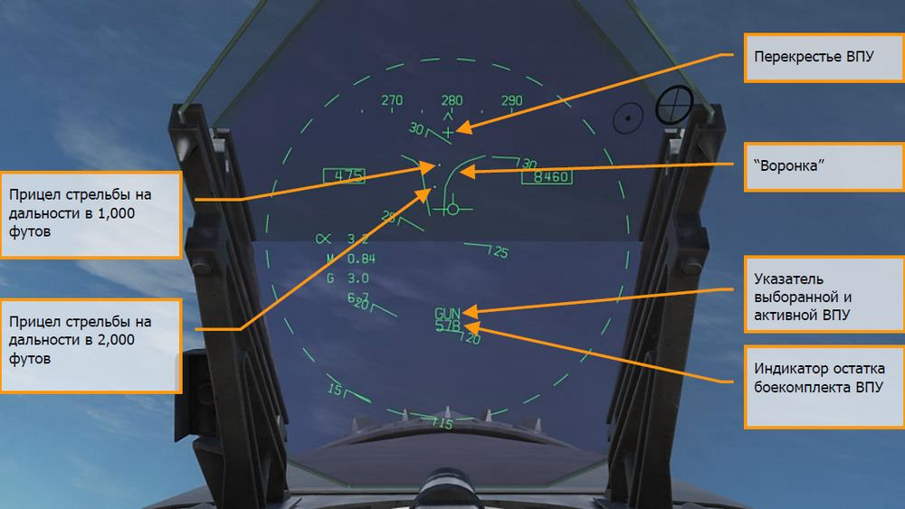

1. Перекрестье ВПУ. Отображается, корда выбран режим ВПУ «воздух-воздух».
Перекрестье ВПУ отцентрировано по азимуту и поднято на 2° относительно
строительной оси самолета для отображения линии прицеливания ВПУ.
2. «Воронка». Режим «воронки» отображается, если радар не находится в режиме
поиска и захвата цели, или если захват сброшен.
3. Отметка дальности в 1000 футов. Прицельная метка дистанции в 1000 футов.
4. Отметка дальности в 2000 футов. Прицельная метка дистанции в 2000 футов.
5. Индикация выбора и готовности ВПУ. Указывает на то, что в качестве оружия
выбрана ВПУ.
6. Индикация остатка боекомплекта. Количество оставшихся снарядов.

При выборе режима A/A GUNS во время работы радара, он автоматически перейдет в режим
автоматического наведения ВПУ (GACQ). Это пятиполосное вертикальное сканирование по углу
в 20 градусов с центром, расположенным на 4 градуса ниже радарной линии прицеливания. Это
сканирование охватывает все поле зрения ИЛС. Также, этот режим устанавливает на радаре
дистанцию в 5 миль. Любая воздушная цель, пролетающая в пределах этой области
сканирования будет захвачена в режиме сопровождения одиночной цели (STT).

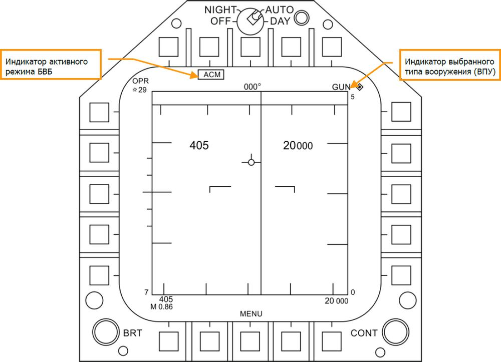

В любой момент вы также можете выбрать один из подрежимов БВБ радара. Подрежимы БВБ
выбираются нажатием вперед переключателя управления сенсорами. В режиме БВБ,
переключателем управления сенсорами можно выбрать три подрежима БВБ.

- Прицеливание (BST) - переключатель управления сенсорами вперед
- Вертикальное наведение (VACQ) - переключатель управления сенсорами назад
- Широкоугольное наведение (WACQ) - переключатель управления сенсорами влево

!!! note "ПРИМЕЧАНИЕ 1"
    Когда на радаре установлена дистанция в 5 морских миль, скорость и высота
    вашего самолета отображаются на экране радара.

!!! note "ПРИМЕЧАНИЕ 2"
    При маневрировании на вертикали, подрежим VACQ может стать хорошим
    решением для того, чтобы взять в захват цель, которая находится выше вас.
    Чтобы вернуться в подрежим GACQ, выберете ВПУ переключателем выбора вооружения.

### Применение ВПУ в режиме сопровождения цели радаром

Режим сопровождения цели с помощью радара является основным видом работы ВПУ в режиме
«воздух-воздух». Режим включается сразу же при выборе ВПУ, если радар в этот момент
сопровождает воздушную цель. Для работы радара в режиме сопровождения требуются
действительная дистанция, скорость сближения и путевой угол цели.
После захвата цели радаром, метка цели (Target Designator, TD) укажет положение
сопровождаемой цели, а дистанция до нее отобразиться на аналоговой шкале прицельной марки
ВПУ диаметром 50 мм, вместе с указателем максимальной дистанции поражения. Максимальная
дистанция открытия огня соответствует максимальному времени полета снаряда 1,5 сек. при
минимальной скорости ударного ускорения (снаряда Vс) 500 фт/сек, или минимальной скорости
ударного ускорения снаряда (Vb) 1000 фт/сек., в зависимости от того, какая величина меньше.
Максимальная дистанция открытия огня на встречных курсах гораздо выше, чем на догонных.

Преимуществом радара в режиме сопровождения является использование радаром данных о
траектории цели. Использование данных о траектории цели позволяет вычислить угол
упреждения, зависящий только от движения цели и геометрии сближения с ней. Вычисленный
угол упреждения не зависит от положения самолета. Режим радара на сопровождение быстро
формирует огневое решение, поскольку из-за быстрой смены пространственного положения
рассчитанный угол упреждения эффективен лишь короткое время. В результате, задача пилота
состоит только в том, чтобы наложить прицельную марку на цель, так как функция слежения за
целью выполняется радаром.

В качестве дополнительной помощи пилоту так же, как и при работе в режиме пуска ракет,
появиться команда SHOOT – пуск разрешен (ПР), если цель находится в пределах максимальной
дистанции поражения и спрогнозированная дистанция меньше 20 футов. Если предполагаемая
дистанция промаха менее 20 футов, но все другие ограничения (такие, как, кнопка-лампа
«Master Arm» не горит, стойки не обжаты) на открытие огня соблюдаются, включится
сигнализация «SHOOT» («ПР»). Сигнализация «SHOOT» включается с задержкой в 0,5 сек. с
учетом времени на реакцию пилота и времени на подготовку ВПУ к стрельбе. Сигнализация
«SHOOT» остается включенной до тех пор, пока предполагаемая дистанция промаха не превысит
30 футов.
Работа радара в режиме сопровождения включается автоматически, если выбрать ВПУ в режиме
«воздух-воздух» при радарном захвате. Если захвата нет, радар включиться в режим без
сопровождения.
Элементы индикации работы радара в режиме сопровождения ВПУ «воздух-воздух» на ИЛС
включают в себя:
Неподвижный прицел
1G Foresight Cue
ВПУ

Прицельная марка

Целеуказатель

Скорость сближения и
дальность до цели

Остаток боекомплекта
ВПУ 9G Foresight Cue

Рисунок 147. Индикация захвата цели ИЛС при стрельбе в режиме GACQ

Прицельная марка. Эта окружность указывает на предполагаемую область попадания
снарядов ВПУ с учетом маневрирования самолета. Радарный захват предоставляет данные о
дальности до цели, которые являются частью прицельной марки. Сигнализация максимальной
дистанции открытия огня отображается на прицельной марке ВПУ. Она отображает
максимальную дистанцию, на которой огонь ВПУ будет эффективен. Аналоговая шкала
дальности до цели, вписана в подвижную прицельную марку, указывающую текущую дальность
до цели, определенную радаром, представлена в виде дуги окружности вокруг прицельной марки
ВПУ, длина которой представляет собой увеличение дистанции по часовой стрелке. Когда длина
дуги по часовой стрелке меньше, чем положение указателя максимальной дистанции открытия
огня ВПУ, цель находится в пределах дистанции поражения ВПУ.

Указатели прогнозируемого маневра от 1G до 9G. Это подвижное всеракурсное
прицельное приспособление FORESIGHT («Мушка»). Сигнализация FORESIGHT отображает
маневренный потенциал цели. Она представляет собой две горизонтальные линии с отметками
в центре. Верхняя или более длинная линия представляет область маневра цели влево, или
вправо с перегрузкой 9G, при собственной перегрузке вашего самолета 1G. Нижняя или более
короткая линия представляет область маневра цели влево, или вправо с перегрузкой 9G при
собственной перегрузке вашего самолета 9G. Пространство между двумя сигнальными линиями
FORESIGHT представляет собой маневренный потенциал цели при перегрузках от 1G до 9G.
Разрыв между линиями потенциального маневрирования от 1G до 9G не ограничивается Rmax
(сигнализация максимальной дальности применения ВПУ). Линия потенциального
маневрирования с перегрузкой 1G ограничивается полем зрения ИЛС на таком же расстоянии,
что и сетка прицела от центра ИЛС. Когда линия потенциального маневрирования с перегрузкой
1G выходит за пределы ИЛС, она мигает.

Снаряд на дистанции цели (BATR). Отметка BATR отображает положение снаряда на
дистанции цели в режиме реально времени. Отметка BATR служит для оценки эффективности
огня в виде отметок гипотетических попаданий снарядов. Отметка обновляется при каждом
выстреле, как только снаряд достигает применяемой дистанции поражения. Отметка
отображается на ИЛС, когда из ВПУ ведется огонь, или в режиме SIM при нажатом курке. Отметка
формируется с учетом отклонения канала ствола ВПУ от линии прицеливания на цель. (Будет
доступно в Open Beta)

Перекрестье ВПУ. Перекрестье ВПУ отцентрировано по азимуту и приподнято на 2°
относительно строительной горизонтали самолета для отображения линии визирования ВПУ.

Линия направления на цель. В дополнение к перекрестью ВПУ, эта стрелка укажет в
направлении окошка целеуказателя, когда это окошко окажется за пределами видимой области
ИЛС. Рядом со стрелкой также будет указано цифровое значение направления на цель в
градусах.

Целеуказатель (TD). Это указатель местоположения цели. Если цель классифицирована, как
враждебная, окошко целеуказателя развернуто под углом в 45 градусов, формируя ромб и
символ перевернутого «V», расположенного над ним.

Скорость сближения и дальность до цели. Когда слежение за целью в режиме одиночного
сопровождения устойчиво установлено, отобразятся дальность до нее в морских милях и
скорость сближения с целью в футах в секунду. Эти данные отображаются в том же месте, когда
в качестве оружия выбраны ракеты. Когда цель окажется на дистанции одной морской мили,
отображение дистанции до цели переключится на отсчет в сотнях футов.

Остаток боекомплекта ВПУ. Под обозначением ВПУ отображается остаток боеприпасов.
Когда бортовая ЭВМ получает от системы управления вооружением сигнал о последнем
оставшимся боеприпасе, на счетчике отобразиться символ «ХХХ».

Сигнализация SHOOT («ПР») (на рисунке не показана). Сигнализация о разрешении
пуска\стрельбы отображается до тех пор, пока дистанция вероятного отклонения выстрелов от
цели не превысит 30 футов. Сигнализация о стрельбе включается при соблюдении следующих
критериев:

- Выбран режим ВПУ «воздух-воздух»
- Все ограничения по открытию огня сняты
- Радар наведен в режиме сопровождения одиночной цели
- Цель в пределах максимальной дальности действия выбранного типа боеприпасов
(MK-50, или PGU-28)
- Центр цели находится в пределах 20 футов от воображаемой линии, соединяющей
метки 1G и 9G прицельной марки на линии визирования (дистанция отклонения –
максимум 20 футов)

При захвате цели радаром, находящемся в режиме сопровождения одиночной цели, а ВПУ - в
режиме «воздух-воздух, картинка на экране радара будет выглядеть так, как показано на
рисунке ниже. Обратите внимание, что индикация GACQ, отображается слева от выбранного
режима радара, а ваша воздушная скорость и высота прямо на растровой (азимут-дальность)
развертке.
Когда радар находится в режиме сопровождения одиночной цели, изменение масштаба на
основе дистанции до захваченной цели происходит автоматически.

Индикация режима БВБ

ВПУ как активн. АСП
Индикатор возврата к
поиску (GACQ)
Высота полета

Скорость полета

Символ цели

Линия наведения на цель

Дальность до цели и
скорость сближения

Рисунок 148. Индикация страницы радара в режиме GACQ при наличии захвата цели

Индикация подрежима ACM (БВБ). Сигнализация того, что в случае получения команды RTS
(вернуться к работе) будет включен последний режим БВБ.

Индикатор активного режима ВПУ. При выборе ВПУ в качестве активного АСП, сигнализация
GUN располагается в правом верхнем поле дисплея.

Индикация «возврат к поиску» (RTS). При работе радара в режиме сопровождения
одиночной цели, в случае сброса захвата, отобразиться режим поиска.
Собственная воздушная скорость. Отображается, когда на радаре установлен масштаб в 5
морских миль.

Собственная высота. Отображается, когда на радаре установлен масштаб в 5 морских миль.

Символ наведения и пуска по цели (L&S Target). В случае, когда в режиме сопровождения
одиночной цели она находится в захвате и определена как цель для наведения и пуска, ее
скорость в числах Маха отображается слева от символа «звездочка», а высота в тысячах футов
- справа. При отслеживании в режиме сопровождения одиночной цели, указатель ракурса цели
отображается в виде стрелки, идущей от метки цели.

Дистанция до цели и скорость сближения. Скорость сближения с целью и дистанция до нее
отображаются справа от шкалы дальности.

Вертикаль отклонения от цели по азимуту (ASL). При работе в режиме наведения и пуска
вы увидите вертикальную линию отклонения по азимуту, которая будет проходить через марку
цели.

Сигнал, разрешающий стрельбу (SHOOT). Этот сигнал будет отображаться до тех пор, пока
прогнозируемая дистанция промаха не превысит 30 футов. Сигнализация, разрешающая
стрельбу, включается при соблюдении следующих критериев:

- Выбран режим ВПУ «воздух-воздух»
- Соблюдены все условия по открытию огня сняты
- Радар наведен в режиме сопровождения одиночной цели
- Цель в пределах максимальной дальности действия выбранного типа боеприпасов
(MK-50, или PGU-28)
- Центр цели находится в пределах 20 футов от воображаемой линии, соединяющей
метки 1G и 9G прицельной марки на линии визирования (дистанция отклонения –
максимум 20 футов)

Тренировочный режим с прогноз-дорожкой
После установки главного предохранителя Master в позицию SAFE и активации тренировочного
режима SIM на экране СУВ для ВПУ (GUN), на экране выведется специальный индикатор FEDS,
который обеспечивает летчика индикацией попаданий снарядов на ИЛС при использовании
прогноз-дорожки.

Система визуальной оценки стрельбы (Firing Evaluation Display System FEDS).
Индикация FEDS состоит из 2х электронных траекторий снарядов, расстояние между которыми
равно размаху крыльев цели. Траектории снарядов отображаются после нажатия второй позиции
гашетки на РУС и выводится до тех пор, пока удерживается гашетка.
Индикация системы
визуальной оценки
стрельбы

Рисунок 149. Индикация тренировочного режима и прогноз-дорожки на ИЛС
Ракета типа A/A – AIM-9 Sidewinder
AIM-9 - ракета ближнего радиуса с ИК ГСН и используется в БВБ. Данная ракета является ракетой
типа “пустил-забыл”, которая может применяться с помощью наведения через сенсоры самолёта
или через захват собственной ГСН. Главным индикатором захвата цели с помощью ГСН ракеты
является звук более высокой частоты и индикация SHOOT. Чтобы убедиться, что ГСН ракеты
сопровождает цель после наведения с помощью сенсора, ракета может быть разарретирована.
Обратите внимание, захват ГСН AIM-9 может быть сброшен с помощью ЛТЦ, поэтому, нужно
убедиться в стабильном захвате цели перед пуском, если вспышки ЛТЦ находятся в поле зрения
ГСН.
Чтобы выбрать ракету AIM-9, нажмите переключатель Weapon Select Вниз на РУС |Left Shift + S|.
Данное действие автоматически активирует Главный режим A/A. Для пуска ракеты - зажмите
гашетку на РУС |Space Bar|.

Быстрая миссия : Hornet AIM-9 Sidewinder

Процедура применения ракеты AIM-9
1. Переключатель СУВ MASTER ARM установите в положение ARM
2. Выполните нажатие переключателя Weapon Select на РУС в положение AIM-9 при
этом СУВ самолета автоматически перейдет в режим A/A.
3. Выберите один из ACM режимов радара
4. В зависимости от режима ACM, выполняйте поиск цели в радиусе до 5 миль до
тех пор, пока радар не захватит цель в автоматическом режиме
5. Маневром самолета выполняйте доворот в сторону цели, как показывает
индикатор доворота на ИЛС, поместив его в круг ASE/NIRD и зажмите гашетку в
момент, когда увидите индикацию SHOOT над целеуказателем (ромб/квадрат) на
ИЛС

Индикация AIM-9 на экране СУВ
Вне зависимости от выбора типа AIM-9, индикация на экране СУВ (странице STORES) не
изменяется. Доступ к экрану СУВ можно получить с помощью меню TAC на МФД. Экран СУВ также
автоматически открывается при нажатии Weapon Select переключателя в положение AIM-9
(Вниз). Надпись SEL под индикацией AIM-9 на дисплее точек подвески (силуэт самолета) на
странице STORES значит, что данная AIM-9 выбрана для применения. В случае парной пусковой
установки, перед надписью SEL будет отображаться символ L или R.
Например, надпись L SEL значит, что выбрана ракета, подвешенная на левой направляющей.
В версии раннего доступа реализовано 4 типа AIM-9, каждый из которых имеет свой уникальный
символьно-цифровой код на экране.

- AIM-9L = 9L.
- AIM-9M = 9M.
- AIM-9Х = 9Х
- AIM-9P = 9P.

Вы можете выполнять циклический перебор между всеми точками подвески с помощью
переключателя Weapon Select Вниз на РУС.
В отличии от других типов ракет Воздух-Воздух, на экране СУВ нет уникальных функций для AIM-
9.
Экран содержит следующую индикацию:

Индикатор выбранной
точки подвески Индикатор не
выбранной точки
подвески
Тип вооружения

Символ ракеты

Статус предохранителя
“ГЛАВНЫЙ”

Блок DATA Freeze

Рисунок 150. Индикация данных AIM-9 на странице STORES (СУВ)

1. Символ ракеты
2. Индикация выбранной ракеты (SEL)
3. Индикация не выбранной ракеты
4. Индикация режима работы СУВ (SAFE / ARM)
5. Блок Data Freeze
6. Обозначение типа ракеты
Индикация AIM-9 на ИЛС
Существует 3 типа индикации AIM-9 на ИЛС:

- Захват цели с помощью режимов ближнего боя ACM.
- Захват цели с помощью радара.
- Захват цели с помощью ГСН ракеты.

Захват цели с помощью ГСН (режим Boresight)
На ИЛС отображается прицельная марка ГСН AIM-9, если ракета выбрана для выполнения
стрельбы с захватом через собственную ГСН или без автозахвата цели с помощью режимов ACM.
С помощью маневра самолёта пилот наводит ПМ на воздушную цель до тех пор, пока частота
аудиосигнала ГСН не увеличится, при этом цель должна находиться в пределах 15 градусов
относительно линии прицеливания самолёта, а ракета AIM-9 должна быть разарретирована.
Захватывать в режиме Boresight – заарретированый режим собственной ГСН нуже для того,
чтобы убедиться, что ракета нацелена именно на самолет, а не на ложные цели. Дело в том, что
при захвате цели в разарретирвоанном режиме ГСН ракеты находится в свободном положении
и захватывает самую горячую цель в поле зрения, при этом это вполне может быть ложная цель.
Итак, после того как вы маневром самолета поместите цель в круг, отображающий поле зрения
в 3° и ГСН захватит цель, аудиосигнал ракеты изменится на аудиосигнал более высокой частоты.
С помощью курка на РУС можно выполнить пуск ракеты. После того, как ГСН ракеты выполнит
захват цели, ГСН может быть разарретирована с помощью нажатия кнопки Cage/Uncage на РУД
для сопровождения цели в пределах поля зрения ракеты. Это позволяет удостовериться в том,
что ГСН сопровождает желаемую цель.

Прицельная марка и
поле зрения
арретированной ГСН
AIM-9

Остаток ракет AIM-9

Выбранный тип
вооружения и статус
готовности
Рисунок 151. AIM-9 HUD, Seeker Boresight

1. Прицельная марка ГСН AIM-9
2. Индикация выбранной активной ракеты AIM-9
3. Количество остатка ракет AIM-9

Данный способ позволяет выполнить скрытую атаку с помощью AIM-9, поскольку данная ракета
может применяться без использования радара.
Захват цели с помощью режимов ближнего боя ACM
При применении AIM-9 в ближнем воздушном бою, пуск ракеты может осуществляться с
помощью одного из режимов автоматического захвата (ACM Air Combat Maneuvering) для
наведения ГСН ракеты на цель. Для выбора одного из режимов ближнего боя выполните нажатие
переключателя Sensor Control вперед коротко. После входа в режимы БВБ, вам доступно 3
режима радара:

- Режим прожектора (BST), переключатель Sensor Select вперед.
- Режим вертикального сканирования (VACQ), переключатель Sensor Select назад.
- Режим широкоугольного сканирования (WACQ), переключатель Sensor Select влево.

Данные режимы вы можете изучить более детально в разделе «Режимы радара Воздух-Воздух»
данного руководства.
На странице радара будут отображаться надпись ACM и название режима БВБ после выбора
одного из ACM режимов.
Если цель находится в пределах зоны сканирования выбранного режима БВБ, радар выполнит
захват цели и переход в режим сопровождения одиночной цели, индикация ИЛС изменится на
индикацию захвата цели с помощью сенсора. Используйте наиболее подходящий режим БВБ для
поражения цели в зависимости от боевой обстановки.
Для получения более детальной информации об режимах БВБ обратитесь в специальный раздел
“Радар Хорнета”.

Захват цели с помощью радара
При выполнении захвата цели с помощью AIM-9 в качестве приоритетного оружия, индикация
изменится, чтобы предоставить лётчику полезную информацию о местоположении цели,
дальности пуска ракеты и другие данные, нужные для успешного поражения противника. Если
радар находится в режиме сопровождения одиночной цели (STT), диапазон шкалы дальности
будет автоматически изменяться в зависимости от дальности до захваченной цели.
Символика AIM-9 на ИЛС в режиме захвата радаром включает в себя:

14
12

3
1

4
8

9 13

2

11
7

5
6

10

Рисунок 152. Индикация ИЛС при наличии захвата цели радаром (AIM-9)

1. Нормализованный индикатор дальностей (NIRD) / Кольцо предельных
ошибок наведения (ASE). По-простому, - Кольцевая шкала. Кольцевая шкала
размещена на уровне воображаемой ватерлинии самолёта, на котором отображаются
метки относительных дальностей внутри и снаружи круга. Отсчёт относительной
дальности начинается из позиции «12 часов» и увеличивается по часовой стрелке.
2. Относительная дальность к цели. Данная метка отображает относительную
дальность к цели на кольцевой шкале, в отношении к указателям дальности пуска
ракеты.
3. Минимальная дальность пуска. Расчётная минимальная дальностью пуска ракеты
AIM-9.
4. Максимальная дальность стрельбы ВПУ. Указатель максимальной дальности
стрельбы из ВПУ и более чем 12000 футов.
5. Дальность гарантированного поражения (Rne). Это расчетная дальность, на
которой цель будет находиться в максимальном диапазоне, даже если цель выполняет
энергичный разворот на 180 градусов.
6. Максимальная дальность пуска (Rmax). Максимальная расчетная дальность пуска
ракеты по захваченной цели.
7. Максимальный аэродинамический диапазон (Raero). Максимальный
аэродинамический диапазон отображается, когда скорость самолёта-носителя больше,
чем скорость ракеты, но при этом, ракета может выполнить маневр с перегрузкой в 5G.
8. Указатель угла направления на цель. Данный указатель индицирует направление
на цель.
9. Маркер наведения. Маркер наведения в сочетании с кольцевой шкалой (NIRD/ASE)
индицируют угол упреждения захваченной цели. Лётчик должен маневром самолёта
поместить маркер наведения внутрь кольцевой шкалы для выдерживания расчетного
угла упреждения. Маркер наведения на цель будет мигать, когда превышены
ограничения радара в 15 градусов по азимуту и 5 градусов по углу места.
10. Индикатор времени полёта AIM-9 TOF. Отображает расчетное время полета
ракеты до захваченной цели перед пуском. После пуска, на ИЛС появится индикатор
времени до попадания (TTG) и суффикс SW.
11. Маркер под-режима ACM (БВБ). Маркер ACM отображается, когда система работает
в подрежиме ACM (БВБ).
12. Целеуказатель. Данный индикатор отображает линию визирования между самолётом
и захваченной целью. Если цель находится вне поля зрения ИЛС, целеуказатель будет
мигать. Если цель определена как вражеская, целеуказатель повернется на 45 градусов
(превратится в ромб) и сверху появится перевернутый символ “V”.
13. Индикатор ГСН AIM-9. Данный круг символизирует позицию ГСН AIM-9. Если ГСН
направлена вне поля зрения ИЛС, круг мигает. Если ГСН AIM-9 направлена на цель,
захваченную с помощью радара, целеуказатель и индикатор ГСН AIM-9 будут
наложены друг на друга.
Индикатор «SHOOT» - Пуск разрешен. Слово “SHOOT” - ПР отображается над
целеуказателем TD (ромбом) при условии, что разрешен пуск ракеты AIM-9. Если цель
находится в зоне гарантированного поражения (Rne), индикатор “SHOOT” мигает.

После захвата цели радаром на странице радара отображается несколько важных элементов
индикации. Большинство информации дублируется на ИЛС.
Обратите внимание, если цель находится вне поля зрения ИЛС, на круге допустимых ошибок на
ИЛС появится указатель угла направления на цель. Дополнительно, на ИЛС также будет
отображаться курсовой угол цели возле стрелки указателя направления на цель.
1 2

3 6

11
8

12

7
4
10
9

5

Рисунок 153. Индикация страницы радара в режиме сопровождения цели (AIM-9)

1. Возврат к поиску (RTS) и индикация режима, к которому будет выполнен возврат.
2. Выбранный тип вооружения и остаток данного типа
3. Максимальная дальность пуска
4. Дальность гарантированного поражения
5. Минимальная дальность пуска
6. Круг предельных ошибок наведения
7. Маркер наведения
8. Скорость сближения и дальность к цели
9. Символ запрета огневого решения
10. Индикатор “ПР” (“SHOOT”)
11. Символ захваченной цели в режиме STT вместе с индикацией воздушной скорости
(число М) слева и высотой цели в тысячах футов справа и линией направления. Символ
“Звезда” отображает захват и готовность к пуску по цели.
12. Превышение/принижение цели
Обратите внимание, что индикаторы дальности на ИЛС и странице радара отображают одну и ту
же информацию, но в то же время, представлены в различных форматах:

Рисунок 154. Индикаторы дальностей на ИЛС и странице радара
Ракета AIM-7 Sparrow
Ракета AIM-7 Sparrow является ракетой с полуактивной головкой самонаведения (ПАГСН) и
требует радарного сопровождения цели в режиме STT (РНП – в режиме непрерывной
пеленгации) на всем участке полета ракеты за исключением наведения на источник помех
(режим HOJ). AIM-7 имеет большую боевую часть и может применяться как по целям вне
визуальной видимости, так и по находящимся поблизости. AIM-7 может быть смертельно
опасным оружием, особенно, когда применяется с использованием радара, который работает в
режимах маневренного воздушного боя (ACM).
Кроме того, AIM-7 имеет режим FLOOD, который позволяет производить наведение и пуск по
цели, без предварительного захвата, а также имеет возможность использовать режим LOFT
(дополнительной кривизны псевдо-баллистической траектории) для увеличения дальности
применения.

Чтобы выбрать ракеты AIM-7, нажмите вперед переключатель выбора вооружения на РУС |Left
Shift + W|. При выборе AIM-7, главный переключатель режимов (Master Mode) автоматически
переключаеться в режим A/A («воздух-воздух»).

Чтобы обеспечить наведение AIM-7, радар должен находиться в режиме РНП – непрерывной
пеленгации, - сопровождения одиночной цели (STT). Это можно сделать нажатием кнопки
Cage/Uncage менее 0,8 сек. при наведении перед пуском. Есть и другой способ: когда индикация
радара выведена на правый МФД, поместите курсор целеуказателя на метку цели на радаре и
нажмите переключатель управления сенсорами вправо.

ПРИМЕЧАНИЕ: Режим HOJ недоступен в версии раннего доступа и будет реализован позже.
Быстрая миссия : Hornet AIM-7 Sparrow

Процедура применения ракеты AIM-7
1. Переключатель СУВ Master Arm перевести в положение ARM.
2. Кнюппель выбора вооружения на РУС в положение AIM-7.
3. Предоставить приоритет управления целеуказателем МФД, на котором открыта
страница радара. Использовать для этого кнюппель управления сенсором.
4. Назначить цель на радаре для сопровождения в режиме STT, или выбрать
подрежим радара ACM и маневром своего самолета поместить цель в область
сканирования радара, отображенной на ИЛС, чтобы радар захватил цель на
дистанции в 5 морских миль, или ближе.
5. Маневром своего самолета поместите точку линии визирования (Steering Dot) в
круг допустимого отклонения от линии визирования (ASE Circle) и зажмите
гашетку, когда увидите индикацию SHOOT над целеуказателем на ИЛС.
Индикация AIM-7 на экране СУВ
Когда ракета выбрана в качестве вооружения к применению, страница STORES (экран СУВ)
включает в себя следующую информацию и варианты для применения AIM-7:

Размер цели

Режимы ракеты по
вертолетам

Тип АСП
Тест ракеты AIM-7

Символ ракеты

Рисунок 155. Индикация данных AIM-7 на странице STORES

1. Символ ракеты. Схематические изображения ракеты отображают их размещение на
самолете.
2. Тип АСП. Буквенно-цифровое обозначение AIM-7 на конкретной подвеске, которое
отображается, как 7F, либо 7M. Под символом ракеты, выбранной для применения,
появляется надпись SEL.
3. Выбор размера цели. Позволяет выбрать тип подрыва ракеты на основе
предполагаемого размера цели. Могут быть выбраны следующие типы: SML (малый),
MED (средний) и LRG (большой). При нажатии этой кнопки, каждый вариант
отображается, как отдельная кнопка выбора опций в верхней части страницы. (Будет
доступен в OpenBeta версии)
4. Режим работы по низкоскоростным целям (HELO). Этот режим используется
только для применения по вертолетам. При его включении под кнопкой выбора
    - перечеркивается
крестом (Х). (Будет доступен в OpenBeta версии)
5. Тест Sparrow (TEST SP). Все ракеты Sparrow должны быть настроены перед
применением. Предварительная настройка происходит на конечном этапе теста
работоспособности радара и примерно через три минуты после того, как система
управления вооружением подала питание на ракеты. Трехминутный прогрев
начинается после завершения теста встроенного контроля системы управления
вооружением и проверки номенклатуры подвешенного вооружения. После начала
процесса настройки, в окошке появятся опция этапов проверки ракет Sparrow. Радар
обеспечивает совместимость с ГСН ракеты при подсвете цели радаром. Система
управления вооружением получает сигнал о готовности от каждой ракеты, которая
была успешно настроена. Успешная настройка Sparrow отображается путем
исчезновения символа «Х» с обозначения ракет 7F, или 7М на странице системы
управления вооружением. (Будет доступен в OpenBeta версии)

Применение AIM-7 Sparrow без сопровождения радаром
Если AIM-7 выбрана в качестве вооружения к применению, а цель сенсорами не определена, на
ИЛС, в дополнение к стандартной индикации режима «воздух-воздух» добавляются следующие
символы:

Поле зрения ГСН
AIM-7

Индикатор режима
FLOOD

Тип ракеты и
остаток

Рисунок 156. Индикация AIM-7 на ИЛС без сопровождения цели

1. Окружность поля зрения ГСН AIM-7. Отображается, когда выбрана AIM-7, но цель
не определена. Также очерчивает границы поля охвата антенны в режиме FLOOD.
2. Тип и количество ракет AIM-7. Отображает последовательность типов ракеты AIM-
7 (7М, или 7F), и оставшееся количество ракет каждого типа.
    - radar lock, the radar and missile will
automatically enter FLOOD mode as indicated on the HUD. Note that this indication is only
    - radar lock.
Режим FLOOD
После пуска ракеты AIM-7 без наличия захвата цели, радар перейдет в режим FLOOD, в котором
рупорный излучатель радара будет «подсвечивать» воздушное пространство, индикация
которого представлена на ИЛС в виде круга AIM-7 ASE. ГСН ракеты попытается выполнить захват
и сопровождение ближайшей цели, которая находится в данном круге. Эффективная дальность
применения данного режима составляет 10 морских миль.
Режим FLOOD принудительно переводит AIM-7 в так званный режим наведения по кривой погони
и не эффективен против целей на пересекающихся курсах. Режим FLOOD лучше всего
использовать против целей на встречных или догонных. Также режим FLOOD эффективен при
ведении БВБ, когда невозможно выполнить захват цели радаром.
Для выхода из режима FLOOD достаточно нажать кнопку Сброс цели/Включение МРК
(Undesignate).

Стандартные параметры радара при выборе AIM-7
Когда AIM-7 выбрана в качестве вооружения к применению, радар по умолчанию установит
следующие настройки, если только предварительно не был создан отдельный профиль настроек
(опция SET):

- Ширина зоны сканирования – 140 градусов.
- 4-х полосное сканирование.
- Масштаб дальности – 40 морских миль.
- Время отображения метки цели на дисплее – 8 сек.
- Чередующаяся частота повторения импульса.

Когда AIM-7 выбрана в качестве вооружения к применению, но при этом цель для нее не
определена, на экране радара отображается следующая информация:
Режим дальности во Указатель выбора AIM-7
время поиска (RWS) (на предохранителе)

Рисунок 157. Индикация страницы радара при выбранной AIM-7 без наличия захвата

Применение AIM-7 Sparrow в режиме сопровождения радаром
При получении огневого решения на цель, ИЛС и дисплей радара отображает дополнительную
информация по применению ракеты. Так же, как и в режиме обнаружения и захвата цели при
работе с ракетой AIM-9, эта дополнительная информация включает в себя необходимые
сведения по дистанции применения оружия, сближению и ракурсу цели, дистанции до цели и
другой информации, которая поможет обеспечить успешное применение ракет AIM-7.
Если цель отслеживается, но не в режиме сопровождения одиночной цели (STT), на ИЛС
    - STT», напоминающая пилоту о необходимости выполнить захват
в режиме STT, перед пуском ракеты.
Индикация на ИЛС применения AIM-7 с радарным захватом цели включает в себя:
2
7

3
1

12

13
10

6

4
8

5
11

9

Рисунок 158. Индикация ИЛС при стрельбе AIM-7 и наличии захвата цели

1. Круговая шкала. Окружность круговой шкалы (NIRD) расположена по центру
строительной горизонтали фюзеляжа и соответствующие отметки отображаются
внутри и снаружи нее. Относительная дистанция отсчитывается от 12-часовой отметки
и возрастает по часовой стрелке. Вместо изменения размера окружности NIRD/ASE, в
случае изменений точки перехвата, регулируется коэффициент изменения точки
визирования.
2. Относительная дальность до цели. Относительная дистанция до цели на
окружности круговой шкалы по отношению к меткам дальности ракет.
3. Минимальная дальность пуска. Вычисленная минимальная дистанция пуска для
выбранных к применению ракет AIM-7.
4. Дальность гарантированного поражения (Rne). Вычисленная дистанция, на
которой цель останется в пределах максимальной дальности поражения, даже если
мгновенно развернется на 180 градусов.
5. Максимальная дальность пуска. Вычисленная максимальная дистанция для пуска
ракеты по взятой в захват и не маневрирующей цели.
6. Аэродинамическая дальность (Raero). Максимальная аэродинамическая
дистанция, которая отображается, когда обстреливаемый самолет имеет скорость
больше, чем ракета, но при этом ракета все еще способна выполнять маневр с
перегрузкой 5G.
7. Указатель местоположения цели. Показывает относительное направление на
цель.
8. Точка визирования. Точка визирования, в сочетании с круговой шкалой отображает
угол маневра упреждения на захваченную цель. Маневром самолета поместите точку
визирования внутрь окружности для того, чтобы обеспечить вычисление угла
упреждения. Точка визирования начнет мигать, когда радар выйдет за ограничения в
15 градусов по азимуту и в 5 градусов по углу места.
9. Время полета AIM-7. Отображает вычисленное время в секундах, через которое
ракета достигнет захваченную цель. После пуска, значение подлетного времени
ракеты (SPTTG) отображается, как расчетное время до ее попадания.
10. Целеуказатель (TD). Эта рамка/ромб показывает линию видимости с вашего
самолета на первоочередную захваченную цель. Рамка мигает, если цель в захвате
находится за пределами поля зрения ИЛС. Ниже целеуказателя отображается
    - STT», если радар не отслеживает цель в режиме сопровождения
одиночной цели (STT). Если радар потерял сопровождаемую цель, рамка
целеуказателя станет пунктирной, означающей, что радар находится в режиме работы
с памятью (MEM) и экстраполирует местоположение цели, чтобы снова взять ее в
захват. Если цель классифицирована, как враждебная, рамка разворачивается на 45
градусов, образуя ромб, а сверху него появляется символ перевернутой «V».
11. Символ “Отворота” (Х). Отображается, если дистанция до цели меньше, чем
минимальная дальность пуска.
12. Максимальная дальность ВПУ. Показывает максимальную дальность, на которой
стрельба из ВПУ эффективна и превышает 12000 футов.
13. Сигнализация «SHOOT». Если все условия для пуска AIM-7 выполнены, над
целеуказателем появится слово SHOOT («ПР»).

Учтите, что, если цель выйдет за пределы поля видимости ИЛС, появится линия указателя
местоположения цели, а стрелка на ее конце укажет направление на цель.
Кроме того, рядом со стрелкой будет указано значение доворота на цель в градусах.

Наведение и пуск AIM-7 по цели
Если вы используете AIM-7 в качестве приоритетного оружия по цели, захваченной радаром в
режиме сопровождения одиночной цели, в таком случае радар обеспечит вас следующей
информацией, которая будет полезна при применении AIM-7:
17 20

18 2

1 3

10
16
9
13
15

22 4

11 12

8
14

21
19

5
7

23
6

Рисунок 159. Индикация страницы радара в режиме сопровождения цели (AIM-7)

1. Индикация возврата к поиску (RTS). Индикация возврата к поиску (RTS) в режиме
сопровождения одиночной цели (STT).
2. Индикация FLOOD. В этом поле отображается режим FLOOD, когда AIM-7
применяется в этом режиме. (Будет доступно в OpenBeta версии)
3. Применяемое вооружение и остаток боекомплекта. Отображается выбранное к
применению вооружение (AIM-7) и количество его оставшихся единиц.
4. Дальность до цели и индикация сближения. Дистанция до цели отображается в
соответствии со шкалой дальности и выбранными на радаре установками
масштабирования. Слева от метки указателя отображается скорость сближения Vс.
5. Индикация режима работы с памятью и время трека в памяти. Если радар
теряет вектор на цель, автоматически включается режим работы с запоминающим
устройством радара (MEM). На протяжении этого времени радар будет пытаться
восстановить контакт с целью, а значение времени, индицируемое в секундах, пока
радар находится в режиме работы с памятью, будет отображаться справа от
сигнализации MEM. (Будет доступно в OpenBeta версии)
6. Сигнализация SHOOT («ПР») и LOST («Потерян»). Когда цель находится в
пределах максимальной дистанции пуска Rmax, сигнализация SHOOT отображается
непрерывно. Если цель находится на дистанции гарантированного поражения,
сигнализация SHOOT начинает мигать.
7. Подлетное время ракеты. Отображает предполагаемое подлетное время
подготовленной к пуску, но незапущенной ракеты по взятой в захват цели. Сразу после
пуска, индикация вылетевшей ракеты смениться на ее подлетное время.
8. Rmin. Расчетная минимальная дистанция пуска.
9. Rne. Расчетная дистанция гарантированного поражения.
10. Rmax. Расчетная максимальная дальность пуска.
11. Индикация схода AIM-7 и ее подлетное время. Графически отображает сход
ракеты AIM-7 с держателя и ее предполагаемое подлетное время до перехвата цели
    - Go, TTG).
12. Сигнализация максимальной дальности захвата ГСН. Этот небольшой круг
появляется на линии визирования по азимуту, когда выбран режим LOFT при работе
радара в режиме сопровождения одиночной цели. Сигнализация отображает
дистанцию, на которой полуактивная система наведения ГСН AIM-7 (SARH) может
использовать радиолокационный «подсвет» взятой в захват цели. Если режим LOFT не
выбран, сигнализация появляется только тогда, когда дальность действия ГСН меньше,
чем дистанция до цели, а цель находится в пределах между Rmin и Rmax. (Будет
доступно в OpenBeta версии)
13. Символ захвата цели. Вокруг «звездочки», символизирующей цель, по которой
производиться наведение и пуск, отображается информация о цели, которая включает
в себя: вектор ускорения, указатель курсового угла цели, индикатор направления на
цель, высота цели в тысячах футов, скорость цели в числах Маха. Вектор ускорения
отображается в направлении ускорения, перпендикулярном вектору направления
движения цели, если цель маневрирует с перегрузкой, превышающей 3G. Чем больше
перегрузка цели, тем длиннее индикатор вектора ускорения.
14. Кольцо допустимых отклонений при наведении. Неподвижный круг,
отображающий область допусков при наведении AIM-7.
15. Точка визирования. В дополнение к кольцу допустимых отклонений при наведении,
точка визирования отображает направление угла визирования на цель, взятую в
захват. Точка визирования начинает мигать, если превышаются ограничения радара в
15 градусов по азимуту и в 5 градусов по углу места.
16. Воздушный ППМ с указателем на север. Отображается только в том случае, когда
на HSI выбран вариант A/AWP, а ППМ находится в пределах поля зрения. (Будет
доступно в OpenBeta версии)
17. Пеленг на и дистанция до целевого воздушного ППМ. В этом поле отображается
пеленг и дальность до воздушного ППМ, если он был создан в разделе HSI/DATA/A/C.
(Будет доступно в OpenBeta версии)
18. Курс цели. Направление полета цели, по которой производиться наведение и захват.
19. Автономное опознавание цели (NCTR). При включении этого режима радар, на
основе отраженных сигналов, пытается классифицировать цель, по которой
производиться наведение и захват. (Будет доступно в OpenBeta версии)
20. Rlof. Максимальная дальность пуска в режиме LOFT. (Будет доступно в OpenBeta
версии)
21. Индикация импульсно-допплеровской подсветки (ИДП) цели. После пуска AIM-
7, необходимо осуществлять ИДП цели. Индикация «PDI» появляется при включении
подсвета. (Будет доступно в OpenBeta версии)
22. Перепад высоты цели. Отображает разницу высот между целью и вашим самолетом
в сотнях футов.
23. Сигнализация наилучшего ракурса. Эта сигнализация, откалиброванная от 1 до
18, отображает результативность пуска. Чем больше отображенное число, тем выше
вероятность попадания ракетой по цели. (Будет доступно в OpenBeta версии)

Усовершенствованная ракета AIM-120 AMRAAM
AIM-120 AMRAAM - это управляемая ракета с активной радиолокационной головкой
самонаведения УР АРГСН (ARH), которая может самостоятельно наводиться на цель, используя
миниатюрный радар в своем носовом обтекателе.
Ракета также может наводиться радаром F/A-18C в режимах непрерывной пеленгации - РНП
Single Target Track (STT) и Сопровождение на Проходе СНП - Designated Track While Scan (DTWS).
Благодаря АРГСН ракеты AIM-120 пилот F/A-18C может атаковать сразу несколько целей и не
ограничен необходимостью сопровождать цель БРЛС в течение всего времени полета УР.
AIM-120 - ракета среднего радиуса действия и может применяться по целям на дальности свыше
20 морских миль. Однако дальность весьма зависит от углового аспекта цели, высоты
применения, скорости носителя при пуске и маневров как носителя от цели после пуска, так и
маневров уклонения самой цели. Таким образом, дальность пуска AIM-120 может быть менее
10нм в некоторых ситуациях.
В ближнем воздушном бою AIM-120 также можно запустить в режиме «VISUAL» без
необходимости захвата и сопровождения цели радаром F/A-18C. После пуска в этом режиме,
АРГСН AIM-120 будет пытаться захватить любую цель, которая попадает в Окружность поля
зрения AIM-120 на ИЛС (HUD). Будьте осторожны, возможен захват и дружеских целей!

Для выбора AIM-120, нажмите переключатель Weapon Select на РУС коротко вправо | Left Shift
+ D |. Выбор AIM-120 автоматически установит режим Master в состояние «A / A» (Воздух-
Воздух).
Быстрая миссия : AIM-120B/C Practice

Порядок применения AIM-120
1. Переключатель MASTER ARM на панели СУВ установите в положение ARM
2. Кнюппель Weapon Select на РУС в положение AIM-120
3. Предоставить приоритет управления целеуказателем МФД, на котором
открыта страница радара используя кнюппель Sensor Control.
4. Выбрать цель на странице RDR ATTK для сопровождения в режиме STT, или
выбрать подрежим радара ACM и маневром своего самолета поместить цель
в область сканирования радара, отображенной на ИЛС, чтобы радар
захватил цель на дистанции в 5 морских миль, или ближе
5. Маневром своего самолета поместите точку линии визирования (Steering
Dot) в круг допустимого отклонения от линии визирования (ASE Circle) и
нажмите кнопку пуска, когда увидите индикацию SHOOT над целеуказателем
на ИЛС.
Данные AIM-120 на экране СУВ
Когда ракета выбрана в качестве применяемого вооружения, страница Stores включает в себя
следующую информацию и варианты для применения AIM-120:

Размер цели

ЭПР цели

Выбор точек
подвески

Тип ракеты

Указатель
выбранной точки
подвески

Рисунок 160. Индикация параметров AIM-120 на экране СУВ (STORES)

Символ УР. Схематические изображения ракеты отображают их размещение на точках
подвески. До 2шт. УР AIM-120 можно подвешивать с помощью пусковых устройств (ПУ) к 2, 3, 7
и 8 точке подвески. Ниже символа AIM-120 отображается ее тип - AB для AIM-120B и AC для AIM-
120C.

Выбранная точка подвески. AIM-120 выбранная для применения обозначается надписью
«SEL», отображаемой под ее буквенно-цифровым обозначением. Если выбрана ПУ с 2
направляющими, то индикация выбора отображается «R SEL» для выбранной УР на правой
направляющей или «L SEL» для УР на левой направляющей.

Переключение между точками подвески. Последовательное нажатие PB13 на DDI c
открытой страницей STORES циклически выбирает следующую точку подвески с подвешенной
УР AIM-120. По достижении последней точки подвески с AIM-120 будет опять выбрана исходная
точка подвески.
Выбор размера цели. Позволяет выбрать тип подрыва БЧ УР на основе предполагаемого
размера цели. Могут быть циклически выбраны следующие типы: SML (малый), MED (средний) и
LRG (большой). При нажатии этой кнопки, каждый вариант отображается, как отдельная кнопка
выбора опций в верхней части страницы.

Выбор предпочтительной ЭПР цели . Позволяет указать приоритетную цель для захвата
АРГСН УР с помощью выбора на основе ЭПР предполагаемой цели. Могут быть циклически
выбраны следующие варианты: SML (малая), MED (средняя) и LRG (большая). При нажатии этой
кнопки, каждый вариант отображается, как отдельная кнопка выбора опций в верхней части
страницы.

В дополнение к переключению между точками подвески AIM-120 нажатием PB13 на DDI
возможен так же их циклический перебор с помощью нажатия переключателя Weapon Select на
РУС в положение «AIM-120».
Индикация AIM-120 на ИЛС без наличия захвата РЛС
Если AIM-120 выбрана в качестве применяемого вооружения, и при этом нет захвата через БРЛС
самолета (сенсор), то на ИЛС, в дополнение к стандартной индикации режима «воздух-воздух»
добавляются следующие символы:

Зона обзора ГСН
AIM-120

Тип и количество
ракет AIM-120

Индикатор
визуального
режима AIM-120
Visual

Рисунок 161. Индикация для AIM-120 на ИЛС без целеуказания

Кольцо зоны обзора АРГСН AIM-120. Отображается, когда выбрана AIM-120, но цель для
нее не указана. Также очерчивает границы поля охвата АРГСН УР в режиме VISUAL.

Тип и количество ракет AIM-120. Отображает типа УР AIM-120 («AB» для типов А и В, или
«AC» для типа С) на выбранной ПУ, и оставшееся количество УР каждого типа.

Индикация AIM-120 в режиме VISUAL. При отсутствии сопровождения цели с помощью
сенсора, который может выполнять наведение AIM-120, ракета может применяться в режиме
VISUAL, индикация которого выводится в нижней части ИЛС. При пуске в этом режиме AIM-120
будет захватывать первую цель, обнаруженную ее АРГСН, после схода ее с направляющей
ПУ.Если AIM-120 выбрана в качестве применяемого вооружения, радар по умолчанию установит
следующие настройки, если только предварительно не был создан отдельный профиль настроек
(опция SET):

- Ширина зоны сканирования – 140 градусов
- 2-х полосное сканирование по углу места
- Масштаб дальности – 40 морских миль
- Время отображения метки цели на дисплее - 4 сек
- Чередующаяся частота повторения импульса
Когда AIM-120 выбрана в качестве применяемого вооружения, но при этом цель для нее не
указана, на странице RDR ATTK отображается информация, представленная на картинке ниже.
Единственным уникальным элементом является индикация типа вооружения и его количества.

Тип и количество
ракет AIM-120

Рисунок 162. Страница RDR ATTK для AIM-120 без захвата цели

Индикация AIM-120 при наличии сопровождения РЛС перед
пуском
Для отметки цели, созданной для сопровождаемой цели, на ИЛС и странице RDR ATTK выводится
дополнительная информация для обеспечения пуска AIM-120. Так же, как и в режиме захвата и
сопровождения радаром цели при работе с ракетой AIM-7, эта дополнительная информация
включает в себя многочисленную информацию по дистанции применения УР, сближению и
ракурсу цели, дистанции до цели и другой информации, которая поможет обеспечить успешное
применение УР AIM-120.
Основное отличие заключается в том, что применение AIM-120 не требует перехода в режим
сопровождения одиночной цели (STT) в течение всего времени полета УР до перехвата цели.
Вместо этого, как только АРГСН AIM-120 активируется, пилоту больше не нужно поддерживать
сопровождение цели радаром.
Давайте взглянем на ИЛС и страницу RDR ATTK, когда цель сопровождается радаром при
выбранной AIM-120.

6
1

3
2
4
5
7

9

8

Рисунок 163. Индикация ИЛС до пуска AIM-120 и наличии захвата цели

1. Кольцевая шкала дальностей. Окружность кольцевой шкалы (NIRD) отцентрирована по
строительной оси фюзеляжа и соответствующие отметки отображаются внутри и снаружи
нее. Относительная дистанция отсчитывается от 12-часовой отметки и увеличивается по
часовой стрелке. Вместо изменения размера кольца NIRD/ASE, в случае изменений точки
перехвата, регулируется коэффициент скорости перемещения подвижной точки
визирования (Steering Dot).
2. Относительная дальность до цели. Относительная дистанция до цели на окружности
NIRD по отношению к меткам расчетных дальностей пуска УР.
3. Минимальная дальность пуска (Rmin). Расчетная минимальная дистанция пуска для
выбранных УР AIM-120.
4. Дальность гарантированного поражения (Rne). Расчетная дистанция, на которой
цель останется в пределах максимальной дальности поражения, даже если мгновенно
развернется на 180 градусов.
5. Максимальная дальность пуска (Rmax). Расчетная максимальная дистанция для пуска
УР по захваченной и не маневрирующей цели.
6. Указатель углового положения цели. Расположен на внешней стороне кольца
допустимой
ошибки прицеливания. Показывает угловое расстояние между продольной осью цели
и линией визирования на цель. Если она расположена в верхней точке кольца, значит
цель находится на попутном курсе. Если же она расположена в нижней точке кольца,
значит цель движется прямо на нас.
7. Точка визирования (Steering Dot). Точка визирования, в сочетании с кольцевой шкалой
отображает угол маневра упреждения на захваченную цель. Маневром самолета поместите
точку визирования внутрь круга NIRD/ASE для того, чтобы соответствовать расчетному углу
упреждения. Точка визирования начнет мигать, если радар выйдет за ограничения в 15
градусов по азимуту и в 5 градусов по углу места.
    - Go
(TTG). Отображает расчетное время в секундах, до момента сближения УР с целью на
расстояние, достаточное для захвата цели АРГСН УР AIM-120. При достижении ACT эта
индикация сменятся на TTG, отображающем время до поражения цели УР AIM-120.
9. Маркер цели (TD). Эта рамка/ромб показывает линию видимости с вашего самолета на
захваченную цель. Рамка/ромб мигает, если цель в захвате находится за пределами поля
зрения ИЛС.
- а. Если захват цели радаром потерян, рамка/ромб TD станет пунктирной, означающей,
что радар находится в режиме работы с памятью (MEM) и экстраполирует
местоположение цели, чтобы снова взять ее в захват.
- б. Если цель классифицирована как враждебная, рамка разворачивается на 45
градусов, образуя ромб.

Не изображено:

- Аэродинамическая дальность (Raero). Максимальная аэродинамическая дистанция,
которая отображается, когда запускающий самолет имеет скорость больше, чем ракета, но
при этом ракета все еще способна выполнять маневр с перегрузкой 5G.
- Символ “Отворота” (Х). Отображается, если дистанция до цели меньше, чем
минимальная дальность пуска.
- Сигнализация «SHOOT». Если все условия для пуска AIM-120 выполнены, над маркером
цели появится слово SHOOT («ПР»).
- Указатель направления на цель. Учтите, что, если цель выйдет за пределы поля
видимости ИЛС, появится линия указателя местоположения цели, а стрелка на ее конце
укажет направление на цель. Кроме того, рядом со стрелкой будет указано значение
доворота на цель в градусах.
Круг допустимых
ошибок
прицеливания

Захваченая цель
Максимальная
дальность пуска

Дальность и
скорость
Индикатор сближения с
превышения цели целью

Визирная метка
Дальность
гарантированного
поражения

Минимальная
дальность пуска
Время полета AIM-
120

Лучший угол пуска

Рисунок 164. Индикация страницы RDR ATTK до пуска AIM-120 при наличии захвата
цели

Дальность до цели и индикация сближения. Дистанция до цели отображается в
соответствии со шкалой дальности и выбранными на радаре установками масштабирования.
Слева от метки указателя отображается скорость сближения Vс.
Минимальная дальность пуска AIM-120 (Rmin). Расчетная минимальная дистанция пуска.
Дальность гарантированного поражения AIM-120 (Rne). Расчетная дистанция
гарантированного поражения цели.
Максимальная дальность пуска (Rmax). Расчетная максимальная дистанция пуска УР.
Символ захвата цели. Вокруг метки цели в виде «звездочки», по которой производиться
наведение и пуск, отображается информация о цели, которая включает в себя: вектор
ускорения, указатель курсового угла цели, индикатор направления на цель, высота цели в
тысячах футов, скорость цели в числах Маха.
Вектор ускорения отображается в направлении ускорения, перпендикулярном вектору
направления движения цели, если цель маневрирует с перегрузкой, превышающей 3G. Чем
больше перегрузка цели, тем длиннее индикатор вектора ускорения.
Кольцо допустимой ошибки прицеливания (ASE). Неподвижный круг, отображающий
область допусков при наведении AIM-120.
Перепад высоты цели. Отображает разницу высот между целью и вашим самолетом в сотнях
футов.
Лучший угол пуска. Эта индикация, откалиброванная от 1 до 18, отображает вероятную
результативность пуска. Чем больше отображенное число, тем выше вероятность попадания УР
по цели.
Время полета AIM-120. Отображает расчетное время полета для выбранной, но незапущенной
УР до поражения захваченной цели. После пуска выбранной УР отображается расчетное время
ее полета до поражения цели.
Точка визирования (Steering Dot). Эта небольшая сплошная точка указывает на маневр,
необходимый для вывода самолета на захваченную цель на основе перемещения точки
визирования внутрь круга ASE. Маневрирование с целью размещения точки визирования внутри
круга ASE позволяет при пуске AIM-120 выходить УР на меньшие перегрузки и тем самым иметь
больше энергии для перехвата цели.

Не изображено
Индикация SHOOT («ПР») и LOST («Потерян»). Когда цель находится в пределах
максимальной дистанции пуска Rmax, индикация SHOOT отображается непрерывно. Если
цель находится на дистанции гарантированного поражения Rne, индикация SHOOT
начинает мигать.

Индикация AIM-120 в режиме захвата РЛС после пуска
После пуска AIM-120 по захваченной цели на ИЛС и странице RDR ATTK отображается следующая
дополнительная информация, как описано ниже.

Время до
попадания

Рисунок 165. Индикация ИЛС после пуска AIM-120 по захваченной цели
AIM-120 Время до активации ГСН (ACT) /время до попадания (TTG). Отображает
расчетное время в секундах, до момента сближения УР с целью на расстояние, достаточное для
захвата цели АРГСН УР AIM-120. При достижении ACT эта индикация сменятся на TTG,
отображающем время до поражения цели УР AIM-120.

Кнопка возврата в
режим RWS

Символ ракеты и
время до
попадания

Рисунок 166. Индикация RDR ATTK после пуска AIM-120 по захваченной цели

Индикация схода AIM-120 и ее подлетное время. Графически отображает сход ракеты AIM-
    - Go, TTG).
Представлена как пирамидка на вертикали отклонения от цели по азимуту. До активации АРГСН
AIM-120 отображается время в секундах до начала перехода АРГСН в активный режим, после
перехода отображается символ «А»

Возврат в Режим поиска (RWS). Нажатие RWS (PB5) прекращает работу радара в режиме
непрерывной пеленгации цели - Сопровождения Одиночной Цели (STT) и возвращает радар в
режим RWS. Вы также можете сбросить захват цели, нажав кнопку сброса захвата
(NWS/Undesignate) [S].

Не изображено:
Индикация режима работы с памятью и время трека в памяти. Если радар теряет
вектор на цель, автоматически включается режим работы с запоминающим устройством
радара (MEM). На протяжении этого времени радар будет пытаться восстановить контакт с
целью, а значение времени, индицируемое в секундах, пока радар находится в режиме
работы с памятью, будет отображаться справа от сигнализации MEM.
Нашлемная система целеуказания - НСЦ (HMD)
НСЦ (JHCMS, англ.) – комплект, который крепится к шлему летчика и позволяет
необходимую информацию о наведении и целеуказании при любом повороте
головы. Это особенно эффективно во время применения ракеты AIM-9X на больших
углах визирования в ближнем бою. Шлем может выполнять наведение вооружения
до 80 градусов относительно оси самолета.

Питание нашлемного дисплея
Подача питания к нашлемному дисплею осуществляется с помощью поворотного
переключателя HMD в правой части центральной приборной панели. Для подачи
питания нужно повернуть переключатель HMD из позиции OFF в позицию BRT
(яркость). Поворот по часовой стрелке увеличивает яркость дисплея.

Встроенный тест нашлемного дисплея
Встроенный тест нашлемного дисплея можно выполнить на странице BIT/DISPLAYS
с помощью нажатия функциональной кнопки PB 11.

После запуска теста нашлемного дисплея, напротив надписи HMD в центре страницы DISPLAYS
появится надпись IN TEST. При выполнении BIT теста на дисплее будет показано 4 тестовые
шаблоны до тех пор, пока не будет нажата кнопка STOP.

- Если кнопка STOP нажата до окончания отображения всех тестовых шаблонов, статус
теста изменится на DEGD (ухудшение работы).
- Если кнопка STOP нажата после отображения всех тестовых шаблонов, статус теста
    - (штатная работа).

Обратите внимание на то, что тест нашлемного дисплея не обязателен. После включения
дисплей работает в штатном режиме.
BIT тест
нашлемного
дисплея

Рисунок 167. BIT-тест нашлемного целеуказателя

Индикация страницы HMD на МФД
Вход на данную страницу осуществляется с раздела SUPT нажатием кнопки PB 13 - HMD. Экран
HMD содержит следующий функционал:

Фильтр символики Управление
дисплея яркостью дисплея

Автоматическое
гашение дисплея

Рисунок 168. Индикация страницы HMD
Управление яркостью дисплея. Кнопка PB 11 отвечает за режимы яркости дисплея (в
сочетании с регулятором HMD). Нажатие на данную кнопку выполняет циклическое
переключение между следующими режимами:
- DAY. Режим полной яркости
- NIGHT: Половина яркости
- AUTO: Автоматическая настройка яркости для достижения наилучшей видимости

Фильтр количества символики дисплея. Аналогично, как и с ИЛС, пилот может отключать
определенную символику на дисплее с помощью нажатия кнопки PB 7. Данная кнопка выполняет
циклическое переключение между режимами NORM, REJ 1, и REJ 2. Выбранный режим
отображения символики отображается под кнопкой PB 7.

Переключение в положение NORM устанавливает обычное отображение символов в количестве
и в порядке, принятом для отображения на ИЛС. Переключение в положение REJ1 убирает
значение числа М самолета, значение перегрузки, величину и указатель угла крена, окошко
значения воздушной скорости, окошко значения высоты, величину пика положительной
перегрузки и указатель скорости относительно земли с ИЛС. Переключение в положение REJ2
убирает всю символику, предусмотренную режимом REJ1 плюс шкалу и указатель курса,
указатель направления полета, величину дальности NAV/TACAN и значение таймера ET/CD.

Настройки отключения символики могут быть изменены в подразделе Reject Setup.

Автоматическое «гашение» нашлемного дисплея. Предусмотрено включение автоматического
«гашения» символики при отображении в НСЦ. Это можно сделать нажатием кнопки 12,
расположенной рядом с обрамленной надписью BLNK.

Во избежание дублирования символики на нашлемном целеуказателе, когда игрок смотрит
сквозь него на ИЛС, в такой ситуации большинство символов на нем отключаются. Это
называется автоматическим «гашением».

- Когда активирован режим «А/А», отображается следующее:
    - визирная метка AIM-9
    - визирное кольцо радара
    - перекрестье прицела
    - превышение линии нашлемного целеуказателя над линией визирования
    - целеуказатель
    - линия направления на цель

В результате иногда появляются дубликаты меток (т.н. «метки-призраки»). Их можно
устранить вручную.

- В режиме «A/G» вся символика в НСЦ отключается за исключением перекрестья
прицела превышения линии нашлемного целеуказателя над линией визирования.
- В навигационном режиме в НСЦ отображается только перекрестье прицела.
Кром того, ручное «гашение» может быть переключено нажатием кнопки RECCE на РУС. При
включении вся символика в НСЦ скрывается.

Настройка отображаемой символики (REJECT). При нажатии кнопки PB19 пилот может
далее отфильтровать отображенную информацию, основываясь на выбранном уровне
фильтрации (reject). Стрелки «вверх» и «вниз» на кнопках 4 и 5 позволяют выбирать символику
НСЦ. Выбранный для редактирования элемент обрамляется (выделяется прямоугольником).
Первое нажатие кнопки 2 вызывает появление возможности активировать отключение REJ2,
повторное нажатие кнопки 2 активирует отключение REJ2, а нажатие кнопки 3 делает видимым
символику на всех уровнях отключения.

Рисунок 169. Подраздел установок отключения символики нашлемного дисплея
Символика НСЦ
На картинке ниже представлена символика и отображаемая информация в НСЦ при отсутствии
целеуказания.

1
3

2

4
5

7

6

Рисунок 170. Стандартная индикация нашлемного целеуказания

1. Направление взгляда. Цифровая индикация того направления (ХХХ) на которое
смотрит через шлем пилот. Так же, как и на ИЛС командные указатели курса и
направления располагаются вдоль шкалы направления.
2. Направление полета самолета. Отражает курс самолета.
3. Превышение линии визирования. Отображает превышение линии визирования
над горизонтом в градусах, индикация + и - указывается перед значением.
4. Высота и вертикальная скорость. Дублирует с ИЛС барометрическую, или высоту
с радиовысотомера, а также вертикальную скорость с указаниенм значения над ней.
5. Приборную воздушную скорость. Дублируется с ИЛС.
6. Угол атаки, число Маха, и перегрузка. Дублирует угол атаки, число Маха и
текущее и пиковое значение вертикальной перегрузки.
7. Динамическое перекрестье прицела. Находясь в режиме «А/А», перекрестье
прицела в НСЦ может находится в одном из трех положений на нашлемном
целеуказателе, исходя из его угла зрения.
- Когда линия визирования на нашлемном целеуказателе находится в положении
равном положению стабилизированного горизонта, перекрестье прицела
располагается по центру нашлемного целеуказателя.
- Когда линия визирования на нашлемном целеуказателе находится в пределах от
0 до 30 градусов выше стабилизированного горизонта, перекрестье прицела
располагается по центру от указателей воздушной скорости и высоты на
нашлемном целеуказателе.
- Когда линия визирования на нашлемном целеуказателе находится в положении
значительно больше 30 градусов выше стабилизированного горизонта,
перекрестье прицела располагается по центру от шкалы курса на нашлемном
целеуказателе.

Индикация AIM-9 в режиме A/A без целеуказания
При выборе ракет типа воздух-воздух в режиме А/А символика выглядит следующим образом:

1

2

3

Рисунок 171. Нашлемный целеуказатель в режиме A/A, отсутствует целеуказание

1. Поле зрения ГСН. Это штрихпунктирная окружность с шагом в 5 градусов, отображет поле
зрения поиска цели разарретированной ГСН.
2. Динамическое перекрестье прицела.
3. Оружие и его количество. Кодировка со страницы управления подвесным вооружением,
отображающая выбранное оружие и количество его боезапаса.

Собственное сопровождение ГСН AIM-9 в режиме A/A
Чтобы визуально определить цель для захвата ее ГСН AIM9, взглядом поместите окружность
поля зрения ГСН нацель и нажмите УДЕРЖИВАЯ кнопку Cage/Uncage на РУД (кнопка «с» на
клавиатуре). Как только ГСН AIM9 начнет слежение за целью, а ГСН разарретируется,
окружность поля зрения ГСН начнет следовать за целью самостоятельно. Это будет
сопровождаться появлением окружности меньшего диаметра, и более высоким тональным
сигналом захвата от ГСН AIM9.

AIM-120 и AIM-7 без наличия целеуказания
Так же, как и на ИЛС, поле зрения ГСН AIM-120 и AIM-7 отобразятся на нашлемном
целеуказателе, когда это оружие будет выбрано к применению. Используется в режимах FLOOD
(AIM-7) и VISUAL (AIM-120). Ни в том, ни в другом случае, ГСН не может быть привязана к линии
визирования нашлемного целеуказателя.

Режимы ближнего боя НСЦ
В режиме БВБ при включенном НСЦ радар может работать в двух режимах: HACQ (захват цели
с помощью НСЦ) или LACQ (Захват цели с помощью НСЦ на больших дистанциях). Для начала
работы с боевыми режимами НСЦ нужно войти в режим визирования - BST. Выбор режимов
работы НСЦ:
- HACQ: Переключатель управления сенсорами вперед коротко (800ms)
- LACQ: Переключатель управления сенсорами вперед долгое нажатие (больше 800мс)

Прицел HACQ /
LACQ

Индикатор
выбранного
режима HACQ /
LACQ

Рисунок 1. Индикация НСЦ в режиме ACM

С помощью линии визирования НСЦ вы можете выполнять наведение РЛС на желаемые участки
пространства. Изменения направления РЛС с помощью НСЦ также отображаются на экране
радара, изменяется угол наклона антенны радара и положение B-развертки (относительно линии
горизонта, а не самолета игрока).
- HACQ: Автоматический захват цели с помощью прицела на дальности до 10 морских
миль используя среднюю ЧПИ.
- LACQ: Автоматический захват цели с помощью прицела на дальности до 40 морских
миль с использованием средней ЧПИ.

При достижении предельного угла отклонения РЛС, прицел в режиме HACQ/LACQ будет мигать.
Для сброса захвата выполните нажатие кнопки МРК/Сброс захвата на РУС.

Индикация захвата цели с помощью НСЦ на ИЛС
После захвата цели с помощью НСЦ на ИЛС выводится следующее:

1

4

3

2

5

Рисунок 2. Индикация НСЦ. Захват цели (вне поля зрения НСЦ)

1. Целеуказатель (TD). Отображает линию визирования на местоположения захваченной
цели. Если цель находится вне поля зрения НСЦ, целеуказатель будет прижат к концу
ближайшего края поля зрения к центральному перекрестию.
2. Указатели скорости сближения и дальности цели. Скорость сближения отображается
как Vc (XXX), значение может быть и отрицательным. Ниже находится индикатор дальности до
цели в морских милях (X.X RNG).
3. Указатель положения цели. Когда захваченная цель находится за пределами поля зрения
НСЦ, указатель положения цели будет отображен от перекрестия по направлению на цель, при
этом над перекрестием будет отображен курсовой угол цели. Длинна указателя положения цели
пропорциональна углу между местоположением цели и линией визирования НСЦ (угол,
указанный над прицельным перекрестием). Чем больше угол, тем длинней указатель положения.
Указатель положения не выводится, если курсовой угол составляет меньше 10 градусов.
4. Сенсор. Это индикация сенсора, который был использован для захвата цели. В данном случае,
это РЛС (RADAR).
5. Нормализованный дисплей дальностей (NIRD). В центре НСЦ находится круг диаметром
6 градусов. На внешней стороне круга находится шкала дальности. Если сопровождаемая цель
находится в пределах максимальной дальности сканирования РЛС - NIRD мигает. Если цель
находится на дистанции меньше чем the Rmin – на NIRD будет показан мигающий символ “X”.
Это та же NIRD, что и на ИЛС, включая указатель углового положения цели.

Когда цель находится в пределах поля зрения НСЦ:

1

Рисунок 3. Индикация НСЦ в режиме A/A. Захват цели (в пределах НСЦ)

1. Линия визирования ГСН. Прицельная марка ГСН будет наведена на целеуказатель,
указывая на то, что ГСН привязана к той же цели, что и радар.
Указатель ПР (SHOOT - стреляй). Если цель находится в пределах корректных параметров
пуска – над указателем линии визирования ГСН будет отображен индикатор SHOOT (ПР – пуск
разрешен). Та же логика, что и на ИЛС (не показано на рисунке выше).
