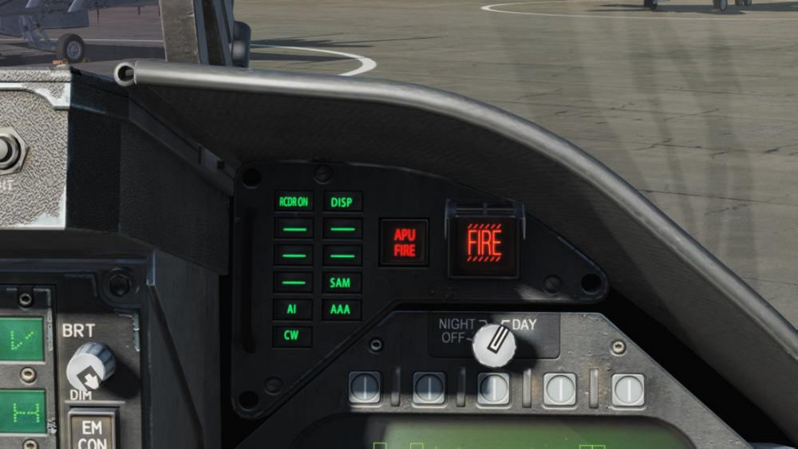
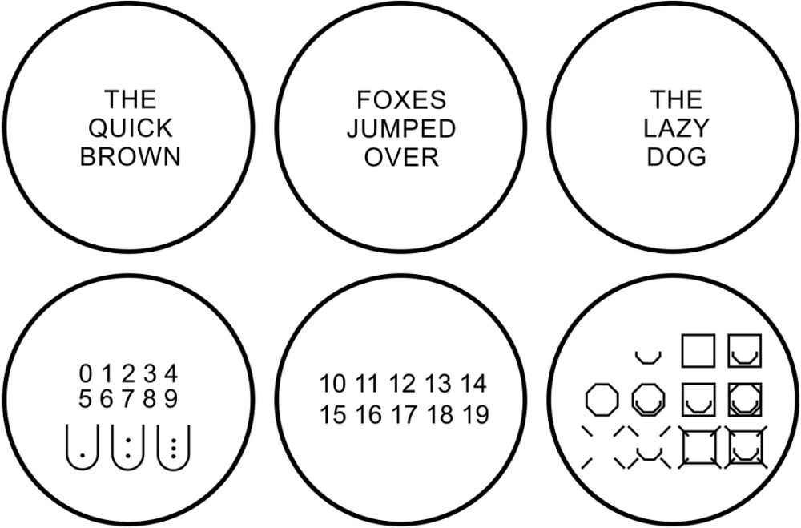
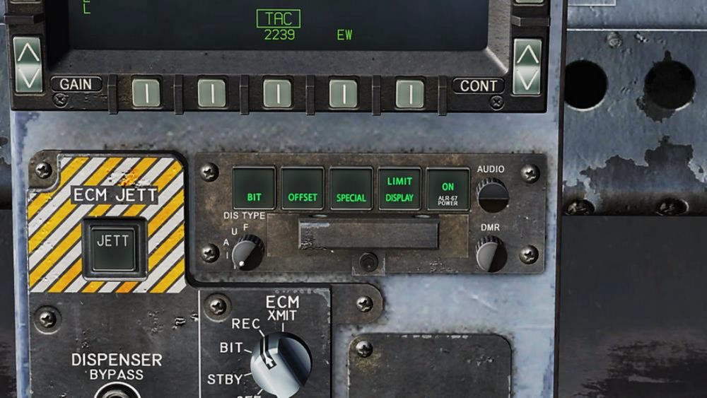

# Дисплей СПО

Обнаруженные с помощью ALR-67(v) источники радиоизлучения отображаются на индикаторе
азимута (RWR) и на ИЛС (если включена опция HUD на странице EW).

При обнаружении источника радиолокационного излучения СПО ALR-67(v) визуально
отображает источник радиосигнала на дисплее RWR в виде двухзначного символьного кода. Код
индицирует тип источника радиосигнала, позиция данного символа на RWR индицирует
относительное направление на источник радиоизлучения. СПО ALR-67(v) может обнаруживать
множество источников радиоизлучения и обеспечивает отображение всех типов на RWR,
отображая относительное направление на каждый из источников. СПО воспроизводит звуковые
сигналы для оповещения об обнаружении нового источника радиоизлучения или при изменении
BIT-статуса системы. RWR дублирует EW на МФД.

После подачи питания на ALR-67(v), на RWR могут отображаться источники излучения и статус
системы. После обнаружения и анализа источника излучения с помощью ALR-67(v) на RWR
выводиться буквенно-цифровой символ. Определенным типам источников излучения при
обнаружении назначаются уникальные буквенно-цифровые символы.
Позиция источника излучения на RWR представляет собой направление на источник
относительно носа самолёта. Например, изображение, приведенное выше, показывает
надводную угрозу (символ лодки) на 40 градусов.

Область RWR разделена на 4 уникальные области:

- Полоса   критических угроз
- Полоса   смертельно-опасных угроз
- Полоса   не опасных угроз
- Полоса   системных статусов

Полоса критических угроз — это самая внешняя полоса, в которой отображаются конкретные
угрозы или режимы смертельных угроз. Отметки направлений отображаются во внешней части
полосы критических угроз с шагом в 30 градусов.
Полоса смертельно-опасных целей является второй полосой от внешней части дисплея.
Источники излучения, отображаемые в полосе смертельных угроз, представляют собой угрозы,
которые, как было установлено СПО, являются смертельными.
Полоса не опасных угроз является самой внутренней полосой дисплея. Символы источников
радиоизлучения в полосе неопасных целей представляют собой неопознанные и дружественные
источники излучения. Известные источники, которые были определены как не опасные, также
отображаются в полосе не опасных угроз.

Полоса статусов является центральной частью дисплея RWR и отображает системные статусы
ALR-67(v). Данная полоса разделена на 3 части:

- Левый верхний квадрант круга (Зона I). В зоне I отображается опция приоритета режима EW, установленного на странице EW
 (N, I, A, U или F).
- Правый верхний квадрант круга (Зона II). В зоне II отображается символ L если ALR-67(v) работает в режиме ограничения
 символики, или является пустой, если система ALR-67(v) работает в режиме полного
 отображения символики.
- Нижняя половина круга (Зона III). В зоне III отображается текущий статус BIT-теста ALR-67(v) или пустая, в случае
 отсутствия отказов. Символ B отображается в случае обнаружения отказов. Символ T
 отображается в случае обнаружения перегрева ЭВМ системы контрмер или
 радиолокационного приемника.

В момент появления нового символа угрозы на RWR или символ угрозы переходит из менее
опасной в более опасную полосу, система ALR-67(v) воспроизводит аудио сигнал изменения
статуса. Система также генерирует специальные звуковые сигналы для конкретных угроз или
угроз критической полосы. После потери источника радиосигналов или переходе угрозы из более
опасной полосы     в   менее   опасную,   звуковой   сигнал   изменения   статуса   угрозы   не
воспроизводится.

## Правое светосигнальное табло

Данная панель является частью системы ALR-67(v), зеленые светосигнальные лампы
предупреждают пилота об различных типах облучения самолета:

**AI**: облучение вражескими воздушными перехватчиками в режиме захвата (смертельная полоса)

**CW**: Вражеский радар в режиме непрерывного излучения и возможно, сопровождающий ракету
(полоса опасных угроз)

**SAM**: Радар типа Земля-Воздух, который выполнил захват цели (полоса опасных угроз)

**AAA**: Радиолокационная зенитная артиллерия.

**DISP**: Система ALE-47 готова к противодействию согласно обнаруженной угрозе и ожидает
старта программы. Дополнительно, на ИЛС будет отображаться надпись DISPENSE. (Будет
доступно в Open Beta версии)

**GO/NO GO**: Результат BIT теста, когда переключатель автомата отстрела установлен в позицию
ON или BYPASS. Длительность BIT-теста составляет 5 секунд. (Будет доступно в Open Beta
версии)

## BIT-тест СПО

При проведении BIT теста системы EW происходит тестирование графической и аудио систем.
На странице EW и на RWR (каждые 3 секунды) отображаются следующие тестовые изображения:

Параллельно, система ALR-67 воспроизводит следующие звуковые сигналы:

- Обнаружение нового контакта (“Водопад”)
- AAA – захват радиолокационной зенитной артиллерией
- Пуск ракеты
- Захват вражеским радаром
- Подача питания

### Панель управления индикацией СПО ALR-67(v)

В верхней части панели управления системой противодействия находится панель управления
ALR-67(v). Данная панель дублирует функции страницы EW и включает в себя следующие
функции:

- **Кнопка POWER**. Данная кнопка выполняет включение/отключение питания системы
    ALR-67(v). При включении питания загораются табло POWER, DISPLAY, SPECIAL,
    OFFSET и BIT.
- **Кнопка DISPLAY**. После нажатия на данную кнопку загорается табло LIMIT над
    кнопкой DISPLAY и дисплей СПО будет отображать до 6 угроз высокого приоритета. В
    зоне 2 на RWR будет отображаться символ “L”. Повторное нажатие отменяет выбор
    опции ограничения количества источников угроз.
- **Кнопка OFFSET**. При нажатии на данную кнопку загорается табло ENABLE,
    перекрывающиеся символы на RWR разделяются для увеличения читаемости.
    Повторное нажатие данной кнопки отключает опцию разделения символов.
- **Кнопка BIT**. При нажатии на данную кнопку на RWR отображается BIT-статус системы
    ALR-67(v). Табло FAIL загорается, когда при периодическом BIT-тесте система
    обнаруживает какую-либо неисправность. Повторное нажатие отключает отображения
    статуса BIT-теста.
- **Регулятор DMR**. Данный регулятор отвечает за настройку яркости табло на панели
    управления ALR-67(v). Поворот по часовой стрелке увеличивает яркость, поворот
    против часовой стрелки уменьшает яркость табло.
- **Поворотный переключатель DIS TYPE**. Данный переключатель выбирает
    приоритет выбранного типа источника радиоизлучения. Выбранная опция (N -
    обычный, I - вражеский, A - AAA, U - неопознанный, F - дружественный) также
    отображается в зоне I на индикаторе азимута (RWR).

## HOTAS

На РУД находится трехпозиционный переключатель системы противодействия.

- Центральное положение — это позиция ВЫКЛ, в данной позиции система
        противодействия не предпринимает никаких действий.
- Назад - в режиме “обхода” (BYPASS), автомат отстрела выполняет одиночный сброс
        ЛТЦ. В других режимах (AUTO, S/A или MAN), кроме OFF, переключатель инициирует
        программу противодействия.
- Вперед - в режиме “обхода” (BYPASS), автомат отстрела выполняет одиночный сброс
        пачки ДО. Если автомат отстрела находится не в режиме обхода и включен - данная
        позиция инициирует исполнение ручной программы (MAN) 5.

{!abbr.md!}
