# FW-190 A8 от Eagle Dynamics

## ВВЕДЕНИЕ
Focke-Wulf FW 190 не только один из лучших истребителей Германии, это - один из самых
известных самолетов Второй Мировой Войны. В его конструкции было много нововведений,
которые существенно облегчали работу летчика и расширяли область применения самолета.
После своего появления на Западном фронте в 1941 году, FW 190 стал неприятным сюрпризом
для союзников, так как заметно превосходил лучший британский истребитель того периода
Spitfire Mk.V. В небе над Францией он не имел себе равных в течение многих месяцев, пока
британцы почти год спустя не создали Spitfire Mk.IX.
Было создано почти 40 модификаций этого универсального самолета, начиная от высотного
разведчика и заканчивая штурмовиком и ночным истребителем. В конце войны FW 190
использовался в одной из самых необычных ролей - компонента составного ударного
комплекса Mistel, в котором FW 190 был установлен над специально переоборудованным
двухмоторным бомбардировщиком, загруженным взрывчаткой, который направлялся на цель,
после чего пилот FW 190 отсоединял истребитель от самолета-снаряда.
Первым вариантом, запущенным в массовое производство, стал FW 190 A, оснащенный звездо-
образным двигателем BMW. Это был истребитель завоевания превосходства в воздухе,
истребитель-бомбардировщик и штурмовик, который полюбили пилоты и возненавидели враги.

## ИСТОРИЯ САМОЛЕТА
Проектирование самолета Фокке-Вульф 190 началось летом 1938 г. Курт Танк, возглавляющий
группу авиаконструкторов, предложил два варианта: один самолет был оснащен двигателем
Даймлер-Бенц (Daimler-Benz) DB 601 с жидкостным охлаждением, второй – новым по тем
временам звездообразным двигателем BMW 139 с воздушным охлаждением.

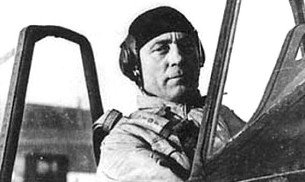

Опытный самолет Fw 190 V-1 был свободнонесущим низкопланом с крылом с работающей
обшивкой. Его первый полет состоялся 1 июля 1939г. Второй самолет, Fw 190 V-2, поднялся
в воздух в октябре 1939 года. Он был вооружен двумя 13-мм (0,51 дюйма) пулеметами MG 131
и двумя пулеметами MG 17 калибра 7,92 мм (0,31 дюйма).
Обе машины были оснащены большими обтекателями втулки воздушного винта, которые позже
были заменены на обтекатели NACA.
Перед тем, как второй опытный самолет совершил свой первый полет, было принято решение
заменить двигатель BMW 139 на более мощный, но при этом более длинный и тяжелый мотор
BMW 801.

Замена потребовала большого количества серьезных изменений, включая прочностное
усиление конструкции и перенос кабины ближе к хвостовой части фюзеляжа. Последнее
изменение решало проблемы центровки и устраняло дискомфорт экипажа от шума и перегрева
кабины вследствие близкого расположения двигателя. Третий и четвертый опытные самолеты
не были завершены, а самолет Fw 190 V5 с новым двигателем был построен в начале 1940г.
В конце 1940 года самолет получил новое крыло. Первоначальный его размах был увеличен
на 1 м (3 фута 3,5 дюйма). Хотя скорость Fw 190 V5g стала на 10 км/час (6 миль/час) ниже,
он был более маневренным и превосходил вариант с крылом меньшего размаха, получивший
обозначение Fw 190 V5k.

Из партии предсерийных Fw 190 A-0 первые семь машин имели крыло, как у первоначальной
модели, остальные - крыло большего размаха. Первое боевое подразделение было
укомплектовано этими самолетами в августе 1941 года.
Fw 190 A-1: Первые истребители Fw 190 A-1 покинули сборочный цех завода фирмы “Фокке-
Вульф” в Мариенбурге в июне 1941 года. В августе ежемесячный выпуск достиг 30 машин.
В этом же месяце начался лицензионный выпуск самолетов фирмой “Арадо” в Варнемюнде,
в октябре выпуск наладила фирма “АОГ” в Ошерслебене. Поэтому уже к концу сентября
в распоряжении люфтваффе имелось 82 самолета, а до конца октября удалось выполнить весь
контракт, выпустив 102 самолета. На одном из первых истребителей, получившим
обозначение Fw 190 A-1/U1 в качестве эксперимента установили двигатель BMW 801D-2.
Некоторые машины серии А-1 кроме радиостанции FUG 7а получили устройство определения
“свой-чужой” FuG 25. На всех серийных машинах имелось бронирование кабины, а также
бронированные топливный и масляный баки. Вооружение состояло из четырех пулеметов
MG 17 калибра 7,92 мм (0,31 дюйма).
Основной проблемой самолета, отмечаемой в рапортах технических офицеров, был перегрев
двигателя, становившийся причиной частых пожаров.
Было заказано 100 машин, оснащенных звездообразным двигателем BMW 801C-1 мощностью
1238 кВт (1660 л.с.), крылом большого размаха и рацией FuG 7a.
Серия Fw 190 A-2 была оснащена двигателем BMW 801С-2. Только тогда удалось устранить
перегрев задней звезды двигателя с помощью вентиляционных отверстий по бортам фюзеляжа
за двигателем. Такие же вентиляционные отверстия организовали и на всех самолетах серии
А-1, остававшихся в строю. Появились новые синхронизаторы, что позволило усилить
вооружение самолета, установив 20-мм пушки “Маузер” MG 151/20E у основания крыла вместо
пулеметов MG 17. При этом пришлось изменить форму крышек над пушечным отсеком
у основания крыла. Масса самолета увеличилась до 3850 кг. Вместо прицела Revi C/12C
на самолеты начали ставить прицелы Revi C/12D. Значительной доработке подвергся электро-
механический привод стоек шасси.
Fw 190 A-3: Весной 1942 года начался выпуск форсированного двигателя BMW 801D-2.
Самолеты получившие этот двигатель, получили наименование Fw 190 A-3. Новый мотор
развивал мощность до 1730 л.с., добиться этого удалось благодаря повышению степени сжатия
в цилиндрах и повышения оборотов обеих передач наддува. В свою очередь, это привело
к тому, что для мотора вместо бензина В4 (октановое число 87) потребовался бензин С3
(октановое число 96).
Вооружение стандартных А-3 осталось прежним, но на некоторых самолетах обкатывались
новые конфигурации. Преследовалась цель не только расширить оперативные возмож-
ности Fw 190 как истребителя, но и адаптировать его для решения новых задач. Некоторые
модификации не были систематизированы и известны только по фотографиям. Наиболее
известен вариант Fw 190 A-3, оснащенный бомбодержателем ETC 501, способный нести до 500
кг бомб (1x500 кг, 2x250 кг или 4x50 кг через переходник ER 4) или 300-литровый подвесной
бензобак. У некоторых истребителей снимали пару пушек MGFF в консолях крыльев, но это
не обозначалось каким-либо кодом. Кроме того, выпустили 72 Fw 190 Aa-3 (auslaendisch -
заграничный), их в октябре 1942 - марте 1943 года отправляли в Турцию. Большинство
экспортных Fw 190 несли вооружение, как на А-1, 4xMG 17 + 2xMGFF.
Поставки варианта Fw 190A-4 начались летом 1942 г. На нем устанавливалась радиостанция
FuG 16Z и закрепленная на киле радиоантенна. Серия А-4 оснащалась двигателем BMW 801D-2
адаптированным под систему впрыска водно-метаноловой смеси MW-50 для кратковременного
увеличения мощности до 1566 кВт (2100 л.с.), что давало увеличение скорости до 670 км/час
(416 миль/час) на высоте 6400 м (21000 футов). Самолет Fw 190A-4/Троп (Trop) имел фильтры,
позволявшие эксплуатировать его на Средиземноморье. Под фюзеляжем он нес бомбу весом
250 кг (551 фунтов). Впрыск смеси MW-50 на модели Fw 190 A-4/R6 отсутствовал. Этот вариант
самолета мог нести под крыльями две 210-мм (8,27 дюйма) ракетные пусковые установки
WGr.21. В случае установки только двух пушек MG 151 на Fw 190A-4/U8 можно было подвесить
сбрасываемые баки емкостью 300 л под каждым крылом и 500-кг бомбу (1102 фунта) под
фюзеляж.
Fw 190 A-5 вышел в серию в начале 1943г.; был оснащен новой моторамой, которая позволила
передвинуть двигатель почти на 15 см (6 дюймов) вперед. Вариантами Fw 190 A-5 были ночной
истребитель Fw 190 A-5/U2 с оборудованием для гашения пламени выхлопа, двумя пушками
MG 151/20, подфюзеляжным бомбодержателем ЕТС 501 и двумя сбрасываемыми баками
емкостью 300 л; подобный ему вариант Fw 190 A-5/U3 мог нести 500-кг (1102 фунта) бомбу под
фюзеляжем и две 115-кг (254 фунта) бомбы под крыльями; для выполнения разведывательных
операций на модели Fw 190 A-5/U4 были установлены две фотокамеры Rb 12. Истребительно-
бомбардировочными вариантами были самолет Fw 190 A-5/U6 и модель с большой дальностью
полета Fw 190 A-5/U8; самолет Fw 190 A-5/U11 для поддержки наземных войск, на котором
были установлены 30-мм пушки MK 103 под каждым крылом; самолет Fw 190 A-5/U12 имел
несъемное вооружение из двух пушек MG 151/20 и двух пулеметов MG 17, а также два
контейнера WB 151A, каждый с пушкой MG 151/20. Торпедоносцы были способны брать на борт
торпеду LTF5b или LT 950 и получили обозначение соответственно Fw 190 A-5/U14 и Fw 190
A-5/U15. 30-мм пушка MK 108 в консоли крыла была принята в качестве стандартной для
модели Fw 190 A-5/U16.
Fw 190 A-6, разработанный на базе экспериментальной модели Fw 190 A-5/U10 и построенный
в июне 1943г., отличался тем, что вместо пушек MGFF самолеты несли пушки MG 151/20E
калибра 20 мм. Чтобы провести эту замену, следовало приспособить крыло под размещение
более тяжелой пушки и разместить более вместительный контейнер с боекомплектом.
Конструкцию крыла изменили так, что оно стало подготовленным для установки пушек калибра
20 и 30 мм с боекомплектом. Кроме того, самолеты А-6 стандартно оснащались
радиостанцией FuG 16ZE с дополнительной кольцевой антенной радиопеленгатора. Такую же
радиостанцию имело несколько машин серии А-5. Серийный выпуск серии А-6 начался в июле
1943 года и продолжался до ноября. Стандартным вооружением самолетов Fw 190 A-6 было
два MG 14 и четыре MG 151/20E. Некоторые машины несли бомбодержатель ETC 501, который
использовался обычно для подвески 300-литрового бака. У самолетов серии А-6 модификации
отмечались кодом Ruestsatz. Было собрано 569 машин.
С ноября 1943 года начался выпуск самолетов Fw 190 A-7, представлявший собой серийный
вариант самолета А-5/ U9, у которого под капотом вместо двух MG 17 стояли два 13-мм
пулемета MG 131. В связи с этим на верхней части капота появились характерные выпуклости,
объясняемые большим размером крупнокалиберных пулеметов. Прицел Revi C/13D заменили
новым прицелом Revi 16B. У колес шасси установили усиленные ободы, которые до того
использовались только на самолетах серии F.
Как правило, самолеты оснащались бомбодержателем ETC 501, позволявшим брать или бомбы
или 300-литровый бак. Небольшое число самолетов вместо бомбодержателя получило только
легкий держатель для бензобака. У некоторых самолетов вооружение уменьшили до
двух MG 131 и двух MG 151/20E. Данные самолеты предназначались для ведения маневренных
боев с истребителями противника. Для стандартной конфигурации предусматривались
комплекты Ruestsatz (R1, R2, R6).
Один самолет А-7 (W.Nr. 380394) использовался для испытаний новых подвесных бензобаков
“Doppelreiter”, имевших усовершенствованную аэродинамику. Каждый из двух баков вмещал по
270 л топлива. Их подвешивали к верхней стороне крыла, что должно было уменьшить
аэродинамическое сопротивление и лишь немного уменьшить скорость самолета. Вооружение
самолета состояло всего из двух пушек МG 151 /20Е. Работы над новыми баками велись
в исследовательском центре FGZ (ForschungsanstaltGrafZeppelin) под руководством инженера
Иземанна. Хотя результаты испытаний оказались благоприятными, в серию новые баки
не пошли, так как их внедрение привело бы к временному падению производства.
В январе 1944 года, после выпуска всего 80 экземпляров Fw 190 A-7, их производство свернули
в пользу новой серии А-8.
Модификация Fw 190 A-8 отличалась от предыдущей прежде всего комплектацией. Планер
самолета был приспособлен для установки устройства GM-1. Бак объемом 85 л монтировался
в хвостовой части фюзеляжа. При необходимости этот бак заменялся на 115 л топливный. Бак
сместил центр тяжести самолета к хвосту, чтобы скомпенсировать этот недостаток
бомбодержатель ETC 501 сместили на 20 см вперед. Сам же бомбодержатель, начиная с серии
А-8, стал стандартной деталью, устанавливаемой на все самолеты. На самолеты установили
радиостанцию FuG 16ZY, поэтому кроме кольцеобразной антенны радиопеленгатора под левым
крылом появилась антенна типа “Моран”. Характерная деталь самолета, позволяющая
отличить А-8 от А-7 – трубка Пито, которую перенесли со средней части передней кромки
правого крыла на его законцовку. На Fw 190 A-8 устанавливалось вооружение в составе двух
пулеметов MG 131 и четырех пушек MG 151.

Всего было построено около 20000 самолетов Focke-Wulf 190 A.

## КОНСТРУКЦИЯ САМОЛЕТА

### Описание
Focke-Wulf FW 190 A-8 - одноместный истребитель-моноплан, оснащенный 2-рядным
14-цилиндровым двигателем BMW 801D-2 с двухскоростным нагнетателем, понижающим
редуктором и 12-лопастным вентилятором охлаждения, имеет высокую скорость и хорошую
маневренность. Может также применяться в роли истребителя-бомбардировщика, оснащенного
авиабомбами или в роли истребителя дальнего радиуса действия, несущего подфюзеляжный
топливный бак.
Силовая установка – двигатель BMW 801D-2, развивает мощность 1500 л.с. при 2400 об/мин.
Экстренная боевая мощность в горизонтальном полете достигает 1705 л.с. при 2700 об/мин.
Самолет оборудован трехлопастным воздушным винтом постоянных оборотов.
Диаметр винта – 3.3 м.

Блок Kommandogerät – центральный пост управления – контролирует и автоматически
регулирует обороты воздушного винта, наддув, качество топливной смеси, опережение
зажигания, переключает скорости нагнетателя.

Фюзеляж состоит из дюралевой обшивки, покрывающей раму-монокок. Между передней
секцией и задней частью кабины расположены четыре лонжерона и горизонтальная
перегородка, отделяющая кабину от топливных баков.
Задняя секция фюзеляжа – монокок с каркасом из легкого сплава.

Радиооборудование: FuG 25a – блок опознавания свой-чужой, FuG 16ZY – VHF установка для
коммуникаций и наведения.
Крыло низкорасположенное, представляет собой цельнометаллическую конструкцию. Главный
лонжерон - сплошной, задний разделен фюзеляжем.
Горизонтальное и вертикальное хвостовое оперение расположено симметрично на хвостовой
секции, элероны на внешних консолях задней части крыла. Посадочные щитки размещены
между элеронами на задней нижней поверхности крыльев.
Руль высоты и элероны приводятся в движение ручкой управления самолетом, руль
направления - ножными педалями. Привод горизонтального стабилизатора и щитков
электрический. Согласованное движение электроприводов щитков достигается синхронными
переключателями.
Вооружение состоит из двух синхронных 13-мм пулеметов MG 131, двух синхронных пушек
Mauser MG 151/20Е, установленных в корневой части крыла и двух пушек Mauser MG 151/20Е,
расположенных в консолях крыла.

Массогабаритные характеристики FW 190 A-8:

- Размах крыла - 10,5 м.
- Площадь крыла - 18,3 м2.
- Длина самолета - 8,95 м.
- Высота самолета - 3,95 м.
- Вес пустого - 3490 кг.
- Взлетный вес - 4909 кг.

### Общая компоновка самолета Fw 190 A-8

### Фюзеляж
Фюзеляж FW 190 A-8 представляется собой монокок с цельнометаллической дюралевой
обшивкой. В передней части фюзеляжа находится моторама, повторяющая контуры двигателя,
сзади завершается овальной переборкой, к которой крепится хвостовой узел. Конструктивно
фюзеляж разделен на две основные части – переднюю, от противопожарного до восьмого
шпангоута, и заднюю, от восьмого до четырнадцатого.
Моторама крепится к противопожарному шпангоуту. Кабина пилота и основные топливные
баки размещены в передней части фюзеляжа.
Отсек для оборудования размещен в задней части фюзеляжа. Там же расположена тканевая
перегородка, препятствующая попаданию выхлопных газов двигателя в кабину пилота.
Передняя часть кабины имеет четыре лонжерона между носовой противопожарной
перегородкой и задним шпангоутом; задняя часть кабины имеет горизонтальную переборку,
отделяющую ее от топливных баков; задняя секция фюзеляжа - монокок, состоит из элементов
набора, заканчивается шпангоутом, к которому крепится хвостовая секция.

### Фонарь
Кабина Fw 190 A-8 имеет продольно скользящий выпуклый фонарь из плексигласа
на роликовых подшипниках. Блок лобового остекления состоит из трех пуленепробиваемых
стеклянных панелей. Переплет также служит как панель крепления вооружения, прицела
и инструментов, также является узлом крепления люка фюзеляжного вооружения. Лобовое
стекло смонтировано в металлическом каркасе.
Фонарь оборудован бронеспинкой, защищающей пилота от обстрела сзади.
Открытие и закрытие фонаря производится рукояткой-штурвалом, расположенной на правом
борту кабины. При необходимости фонарь может быть сброшен при помощи специального
рычага.

К середине войны технологические достижения в термоформовке позволили придавать
панелям из оргстекла сложные формы, что привело к возможности создавать "чистые" фонари
без переплетов, которые давали улучшенный обзор.

Пилот FW 190 сидел выше, чем пилоты многих других современных самолетов и только
металлический каркас передней части фонаря ограничивал его обзор. Дальнейшие работы
в этой области привели к созданию более удачного варианта, впервые примененного
на штурмовом варианте FW 190F-2 и быстро адаптированного к другим вариантам, таким как
А-8 и F-8. Удобный при атаке наземных целей, он давал преимущества и в воздушном бою.
Иногда называемый "каплевидным", новый фонарь больше походил на фонарь Малколма,
использовавшийся на поздних вариантах Spitfire и Р-51В и С.

На Fw 190 A-8 на протяжении всего периода экслуатации использовались оба типа фонарей.
Первые серийные образцы выпускались с ранним типом фонаря.

### Броня

Бронирование обеспечивает летчику всестороннюю защиту, которая включает
бронезаголовник, бронеспинку сиденья, а также структурные металлические стенки кабины.

Броневым кольцом защищена передняя часть капота двигателя и масляный бак
с маслорадиатором.

### Крыло
Крыло Fw 190 A-8 представляет собой цельнометаллическое двухлонжеронное крыло-монокок.
Главный лонжерон неразрывный, проходит через фюзеляж и соединяет обе секции крыла.

Задний лонжерон состоит из двух частей, каждая из которых крепится к фюзеляжу. Каждое
крыло горизонтально разделено на верхнюю и нижнюю панели.

На нижней панели расположен главный лонжерон, а на верхней - задний лонжерон. В крыле
размещены пушки, шасси, механизмы управления элеронами, щитками и электроприводы.
На главном лонжероне также расположены узлы крепления крыльевых пушек и шасси.

### Шасси

Шасси трехстоечное, состоит из двух амортизированных стоек с двухзвенным шарнирным
механизмом, соединяющим среднюю и нижнюю части стойки, гасящим разворачивающий
момент колеса, и хвостового колеса.
Передние стойки шасси крепятся непосредственно к главному лонжерону.
Каждая стойка шасси приводится в действие индивидуальным электромотором, установленным
на главном лонжероне.

Шасси убираются внутрь крыла, в убранном положении стойки и колеса располагаются
в нишах перед главным и закрываются обтекателями.
Основные стойки фиксируются в убранном положении мощными замками.
Хвостовое колесо частично убираемое, может вращаться на 360 градусов, либо фиксироваться
взятием ручки управления самолетом на себя.
Правая стойка шасси имеет тросовое соединение с хвостовым колесом, которое убирает его
синхронно с основными.
При уборке шасси хвостовое колесо фиксируется в верхнем положении тросом, соединенным
с правой основной стойкой. После уборки нижняя часть хвостового колеса остается снаружи,
и в аварийной ситуации может использоваться в качестве костыля и предотвратить
повреждение хвостовой части.
В случае отказа электромоторов шасси может быть выпущено с помощью аварийной рукоятки.
Она разблокирует стойки, которые опустятся под действием силы тяжести и газовых пружин.
Положение основных стоек шасси контролируется по прибору в кабине и визуально,
по штыревому индикатору.

На каждом колесе основных стоек шасси Fw 190 A-8 установлены гидравлические тормозные
системы, с собственными гидроцилиндрами и тормозными магистралями. Каждым колесом
можно тормозить индивидуально.
Емкость бака гидравлической жидкости для блока управления – 5.6 литра.

Торможение традиционно управляется педалями руля направления.

### Система управления полетом

Fw 190 A-8 имеет традиционную схему управления, включающую киль и стабилизатор, руль
направления, руль высоты, элероны и щитки.
Машина очень устойчива в полете, поэтому в воздухе триммируется только стабилизатор.
Остальные поверхности управления не имеют приводов триммера, оборудованы пластинами,
регулируемыми на земле.
Рулевые поверхности – легкосплавные, с тканевой обшивкой, за исключением передних
кромок, сконструированы, чтобы давать аэродинамическую и весовую компенсацию.
Металлическая работающая обшивка хвостового оперения интегрирована в конструкцию
фюзеляжа.
Вертикальное оперение состоит из киля и руля направления.
Киль – цельнометаллический, крепится к хвостовой секции фюзеляжа, внутри размещен
диагональный лонжерон, к которому крепятся стабилизатор и блок хвостового колеса.
Горизонтальное оперение – симметричное, трапециевидной формы со скругленными
законцовками.

Стабилизатор может быть отрегулирован в полете, чтобы сбалансировать самолет на разных
режимах полета. Перестановка производится электромотором, размещенным внутри киля.
Может устанавливаться в пределах от +4 до -1 ° во время полета.
Переключатель положения стабилизатора расположен на левой панели кабины. Включение
электропривода осуществляется нажатием и удержанием переключателя до поворота
стабилизатора на нужный угол. Положение стабилизатора отражается на соответствующем
индикаторе.
Руль высоты состоит из взаимозаменяемых половин, прикрепленных к стабилизатору
на шарнирах, и имеет аэродинамическую и весовую компенсацию. Отклоняется до 30° ± 2°
вверх и до 25°±1° вниз.
Руль направления имеет конструкцию, сходную с рулем высоты, и подвижно крепится на киле
в трех точках.
Руль направления имеет металлический каркас с лонжероном и семью нервюрами
и полотняную обшивку. Вследствие хорошей продольной устойчивости самолета в полете,
также триммируется на земле путем регулировки пластины. Отклоняется в пределах
от 30° ± 2° вправо до 30° ± 2° влево.
Элероны конструктивно не отличаются от других рулевых поверхностей – легкосплавный
каркас с полотняной обшивкой. Они также имеют весовую компенсацию и настраиваемые
на земле триммеры. Отклоняются в пределах от 17° ± 2° вверх до 17° ± 2° вниз.
Посадочные щитки раздельные, имеют идентичную конструкцию и полностью взаимоза-
меняемы, управляются электроприводом и имеют три фиксированных положения: полетное,
взлетное и посадочное. Стандартное взлетное положение щитков - отклонены вниз
на 13° ± 2°; посадочное положение - полностью отклонены вниз на 58° ± 3°.
В промежуточные положения щитки устанавливаться не могут.
В системе управления используются дифференциальные двойные рычаги (качалки), которые
преобразуют управляющее движение у центра в более эффективный поворот рулевой
поверхности.
Ручка управления перемещается вперед и назад для обычного управления рулями высоты.
Пределы хода ручки: 20,5° вперед и 21,5° назад.
Ручка управления также перемещается в стороны для управления элеронами. Отклонение
элеронов имеет механическое ограничение на основании ручки. Управление положением
щитков осуществляется кнопками на левой панели кабины.

### Двигатель
Fw 190 A-8 оснащен 14-цилиндровым двухрядным радиальным двигателем BMW 801D-2
с двухскоростным нагнетателем, редуктором и 12-лопастным вентилятором охлаждения.
Двигатель вращает трехлопастный винт постоянных оборотов.

Как большинство немецких авиационных двигателей, BMW 801D-2 был оборудован системой
непосредственного впрыска топлива.

#### Система зажигания
Инерционный стартер, используемый для запуска двигателя, может раскручиваться вручную
или электроприводом.
Вал стартера расположен на левой стороне двигателя, в отсеке оборудования. Электрический
переключатель стартера расположен на правой панели кабины.
В случае ручного запуска щетки стартера отводятся ручкой, которая находится на левой
нижней части приборной панели.
Зажигание обеспечивается системой двойного магнето производства Bosch, смонтированной
в носовой части двигательного отсека.
Обе электроцепи изолированы друг от друга; одна обслуживает свечи зажигания
расположенные около впускных, другая - около выпускных клапанов.
Каждая свеча работает индивидуально, задержки зажигания контролируются прибором
управления.

#### Нагнетатель
Двигатель BMW 801D-2 оборудован приводным одноступенчатым двухскоростным
нагнетателем.
Поступающий воздух, подаваемый вентилятором, расположенным перед двигателем, через
два канала на обеих сторонах обтекателя идет в два воздухозаборника, внутри которых
установлены воздушные фильтры.

#### Kommandogerät - центральный пост управления
Центральный пост управления — это гидромеханическое многофункциональное устройство,
которое существенно упрощает управление двигателем, снимая с летчика необходимость
постоянного прямого воздействия на такие подсистемы, как автомат наддува,
автоматический переключатель скоростей нагнетателя, регуляторы постоянных оборотов,
смеси и опережения зажигания. Пилоту нужно лишь передвинуть рычаг управления
двигателем (РУД), чтобы установить по прибору нужное давление наддува, а центральный пост
управления установит остальные параметры двигателя так, чтобы он оптимально работал при
заданном давлении наддува в текущих условия полета.
Также устройство обеспечивает запуск и работу двигателя на холостом ходу.
Объединение устройств автоматики в компактный блок позволило существенно уменьшить
количество необходимых органов системы управления, и повысить ее надежность и живучесть.

#### Воздушный винт
FW 190 A-8 оснащен трехлопастным винтом постоянных оборотов VDM 9-12153 В
с металлическими лопастями. Диаметр винта 3300 мм (10’10’’).
Угол поворота лопастей в полете регулируется автоматически с помощью центрального поста
управления.
В случае отказа автоматики или при необходимости угол может также регулироваться вручную
при помощи независимого электропривода.
Устройство управления изменением угла поворота лопастей, сопряженное с приводящим
двигателем и регулятором оборотов, расположено в левой передней части двигателя.

### Топливная система
На Fw 190 A-8 установлено два основных топливных бака: передний (Vorn) и задний (Hinten),
расположенных под полом кабины.

Баки самозатягивающиеся, общей емкостью 524 литра (388 кг): 232 литра (172 кг) передний
и 292 литра (216 кг) задний.

Бак заливающего насоса емкостью 3 литра встроен в задний топливный бак.

Сбрасываемый бак емкостью 300 литров может быть установлен под фюзеляжем на держатель
ETC 501.
Бензонасос с приводом от двигателя питает его топливом при нормальном давлении 1-2 кг/см^2^.
Для предотвращения образования пробок из паров бензина на высоте, и обеспечения
устойчивой подачи топлива в каждом баке установлен электрический подкачивающий насос.
Подкачивающие насосы также являются резервными в случае отказа основного насоса.
За восьмой переборкой может устанавливаться топливный бак емкостью 115 литров, либо бак
для смеси GM-1 на 85 литров.

1. Двигатель BMW 801D-2 
1. Заливные горловины                
1. Передний бак (232 л.)             
1. Задний бак (292 л.)               
1. Дополнительный бак (115 л.)       
1. Подвесной бак                     
1. Подкачивающий насос переднего бака
1. Подкачивающий насос заднего бака  
1. Подкачивающий насос подвесногo бака  
1. Подкачивающий насос дополнительного бака              
1. Ограничительный клапан вспомогательной топливной магистрали (открыт при остатке в заднем баке 240 л.)
1. Топливный селектор и перекрывные клапаны переднего и заднего топливных баков
1. Топливные фильтры
1. Насос двигателя
1. Топливный пароотделитель
1. Топливно-масляной манометр
1. Кран кольцевания топливной магистрали
1. Бак заливочного топлива (3 л.)

### Система предварительной заливки

Система предварительной заливки предназначена для подготовки запуска двигателя путем
распыления топлива из отдельного бака во впускной коллектор ко всем 14 цилиндрам для
обогащения смеси.

Система состоит из насоса AP 20 SUM и бака емкостью 3 литра, с подводными шлангами.

### Система смазки
Система смазки интегрирована с двигателем и не входит в конструкцию планера,
за исключением указателей давления и температуры масла. Радиатор и маслобак объемом
58 л (рабочий объем 55 м) имеют кольцеобразную форму и располагаются в передней части
двигателя под бронированным кожухом.
Все элементы соединяются с маслофильтром системой трубопроводов с кранами. Масляная
система допускает возможность заправки горячего масла или масла, разведенного бензином,
что облегчало холодный пуск двигателя. Циркуляция масла принудительная, обеспечивается
маслонасосом, температура масла поддерживается автоматически с помощью термостата.
Давление масла ограничивается двухрежимным (по температуре масла) регулятором давления.

### Система электропитания

### Кислородная система
Система кислородного питания состоит из 9 двухлитровых сферических кислородных
баллонов, расположенных в хвостовой части фюзеляжа самолета, магистралей высокого
давления с манометром, крана с индикатором подачи кислорода, регулятора со шлангом
и маски. В целях безопасности баллоны разделены на три отдельные группы.

При открытии крана начинается подача кислорода из баллонов к регулятору. Индикатор
подачи кислорода и манометр, расположенные справа на передней приборной панели,
отображают состояние системы.

### Радиооборудование
Самолет оборудован радиостанцией FuG 16ZY - бортовым УКВ приемопередатчиком. FuG 16ZY
используется для радиосвязи в полете, в системе госопознавания "свой-чужой" (в сопряжении
с изделием FuG 25a), а также для радионавигации. Система работает в диапазоне частот
38,5 - 42,3 МГц.
FuG 16ZY может работать в режиме "Leitjäger" или лидера группы истребителей, который
позволяет использовать систему "Y-Verfahren"- коррекцию направления полета
по направленному радиолучу через обычные наушники.
Компонент AFN-2, являющийся частью радиооборудования самолета, обеспечивает навигацию
для возвращения на аэродром по наземным радиомаякам, указывая направление и дальность
(условно) на простом индикаторе, установленном в кабине пилота.

Изделие FuG 25а "Erstling" (Дебют) - одна из первых в мире систем опознавания "свой-чужой",
которая позволяет наземным РЛС идентифицировать самолет как дружественный. Система
настроена на импульсы немецких радарных станций ПВО типа "Freya" или "Würzburg". РЛС
посылает кодовое слово, FuG 25а отвечает условным сигналом, по которому наземная станция
идентифицирует самолет как дружественный. FuG 25а работает на частоте 125+/-1,8 МГц на
дальности до 100 км.

### Вооружение
Базовое вооружение FW 190 A-8 состоит из двух 13-мм пулеметов MG 131 Rheinemetall-Borsig
с боекомплектом в 475 патронов на ствол, установленных под обтекателем над двигателем,
двух синхронных пушек Mauser MG 151/20Е с боекомплектом в 250 снарядов на ствол,
установленных в корневой части крыла и двух пушек Mauser MG 151/20Е с боекомплектом
в 125 снарядов на ствол, расположенных в консолях крыла.
Оружие, размещенное над двигателем и в корне консолей крыла, синхронизировано для
ведения огня через лопасти пропеллера; MG 151/20E, установленные в консолях крыла
синхронизаторами не оборудован.
Пулеметы стандартно настраивались параллельно, пушки в корнях и консолях крыла на
сведение 600м и 400м, соответственно.

Fw 190 A-8 комплектуется подфюзеляжным бомбодержателем ETC 501 и может дополнительно
нести бомбу SC500 весом 500кг, либо ракеты WG 21 на подкрыльевых подвесках.

### Прицельное оборудование
Наведение на цель при стрельбе на Fw 190 A-8 обеспечивается прицелом Revi 16B,
получившим на тот момент широкое распространение в самолетах Люфтваффе.

Revi 16B представляет собой прицел, сконструированный для применения с установленным
авиационным вооружением, оборудованный встроенным реостатом для регулировки яркости
сетки и ночным фильтром.

Коллиматорные прицелы используют принцип проецирования изображения прицельной
сетки на стекле отражателя в бесконечность, и обеспечивают неподвижную точку
прицеливания относительно линии огня оружия самолета.

При использовании Revi 16B в бою летчик должен самостоятельно вносить поправки
на упреждение цели, перегрузку, расстояние до цели и другие параметры, необходимые
для точной стрельбы.

### Фотофиксирующее оборудование
На истребители Fockewulf устанавливается фотокинопулемет “Ballistische Schußmeßkammer”
BSK 16. Оборудование монтируется на регулируемой платформе в передней кромке панели
левого крыла и подключается к электроцепи самолета. Объектив камеры находится в передней
кромке крыла и прикрыт обтекателем со стеклянным окном. Прозрачная стеклянная панель
может заменяться цветным фотофильтром.

BSK16 – это 16-миллиметровая кинокамера. Длина ленты 15 метров, лента приводится
в движение электромотором в камере. Мотор оснащен переключателем, который ограничивает
движение ленты отрезками 3,75 м., что позволяет сделать 4 фрагмента от 43 до 57 секунд
каждый. Нажатие на гашетку запускает работу камеры, также камера запускается нажатием
кнопки на ручке управления двигателем, что позволяет вести съемку без открытия огня.

## КАБИНА

Оснащение кабины FW 190 A-8 имеет дизайн, обеспечивающий эргономичное размещение
и доступность пилоту всех органов управления. Такой подход в значительной степени
является прообразом кабин современных истребителей с реализованной концепцией HOTAS.
В этом отношении FW 190 выгодно отличался от своего основного конкурента Bf 109.

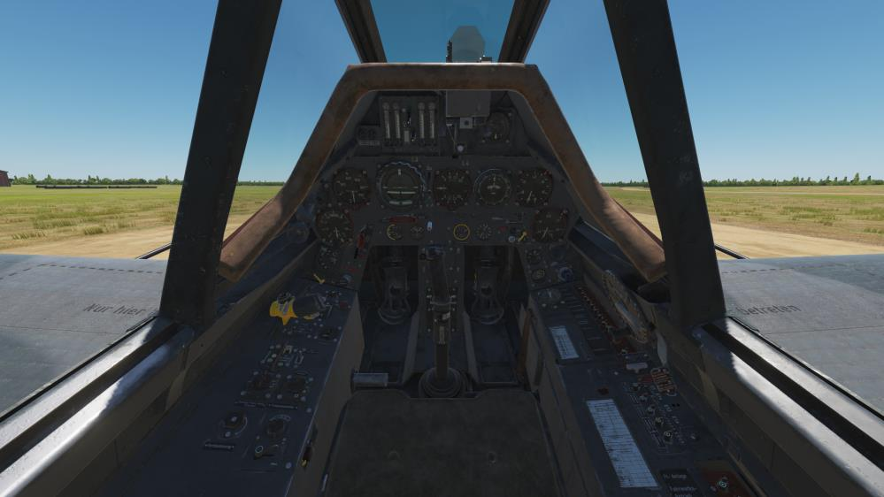
Кабина условно разделена на три основных части: переднюю панель, которая включает
приборную доску, управление топливными баками, створками радиатора и прицел; левую
панель со средствами управления двигателем, шасси и радиостанцией, и правую панель,
на которой расположено управление фонарем, кислородным обеспечением и переключатели
электросистемы самолета.

### Передняя панель
Передняя панель кабины включает в себя приборную доску и прицел REVI 16B.

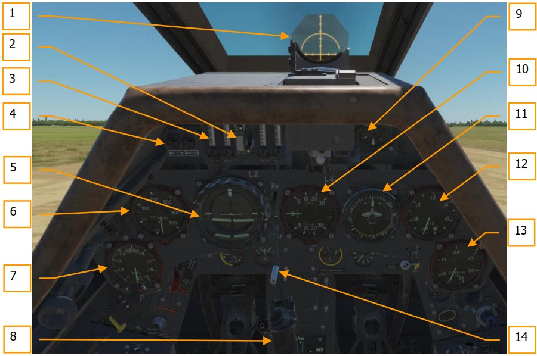
1.  Прицел Revi 16B
2.  Тумблеры включения пулеметно-пушечного вооружения
3.  Счетчик боеприпасов SZKK 4
4.  Лампы индикации пулеметов
5.  Авиагоризонт/Указатель поворота и крена
6.  Указатель скорости
7.  Высотомер
8.  Ручка управления самолетом (РУС)
9.  Табло системы радионавигации AFN-2
10. Вариометр
11. Репитер магнитного компаса
12. Индикатор давления нагнетателя (индикатор наддува)
13. Тахометр (индикатор оборотов двигателя)
14. Кран ручного управления створками радиатора

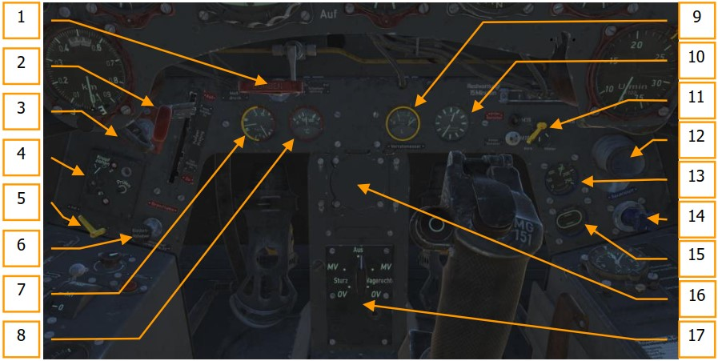

1.  Рукоятка аварийного сброса подфюзеляжной подвески
2.  Рычаг селектора топливных баков
3.  Рукоятка аварийного выпуска шасси
4.  Ответчик свой/чужой
5.  Кран кольцевания топливной системы
6.  Рукоятка уборки щеток стартера
7.  Топливно-масляный манометр
8.  Индикатор температуры масла
9.  Топливомер
10. Индикатор шага винта
11. Переключатель топливомера
12. Держатель ракетницы
13. Манометр кислородной системы
14. Кран кислородной системы
15. Индикатор работы кислородной системы
16. Блок управления 21-см ракетами
17. Блок переключения режимов взрывателей бомб

### Передняя панель: приборы и органы управления
В этом разделе подробно рассматриваются все приборы и органы управления, расположенные
на передней панели.

#### Прицел Revi 16B

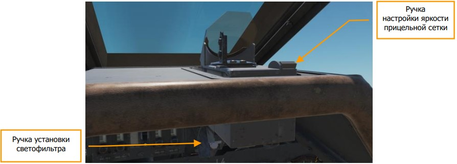

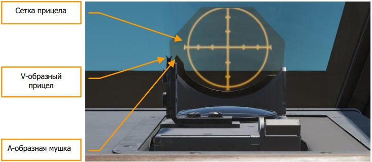

Прицел Revi 16B имеет два элемента управления: регулятор яркости и светофильтр.

Регулятор яркости расположен сверху справа на корпусе прицела. Передвигая регулятор
вперед-назад, можно настраивать яркость прицельной сетки в зависимости от текущих условий
освещенности. Крайнее заднее положение соответствует максимальной яркости, в крайнем
переднем положении лампа прицела отключена.
Светофильтр прицела – это дополнительное затемненное стекло, которое можно установить
перед стеклом отражателя. Светофильтр используется при ярком дневном свете, когда
максимальной яркости прицела недостаточно.

Прицельная сетка Revi 16B имеет следующую разметку:

- Перекрестие со шкалами, имеющими цену деления 1 градус
- Прицельный круг радиуса 50 миллирадиан (диаметр, соответственно, 100 миллирадиан).

1 миллирадиан соответствует приблизительно угловому размеру цели в 1 метр на дистанции
1000 метров. Угловой размер прицельного круга составляет 100 миллирадиан (5.73°), что
соответствует цели с линейным размером 10 м на дистанции 100 м, таким образом диаметр
прицельного круга составляет 1/10 дальности.

Прицельная сетка Revi 16B позволяет определять приблизительную дистанцию до цели по ее
базе - размаху крыла. При расчете дистанции необходимо ориентироваться на степень
заполнения целью прицельного круга. Дистанция до цели рассчитывается как база цели,
умноженная на десять. Формула справедлива только при полном заполнении прицельного
круга целью; если цель заполняет половину круга, итоговое значение необходимо умножить
на два, и так далее.

Например, размах крыльев самолета-цели составляет 20 метров, цель заполняет прицельный
круг, не выступая за его границы, соответственно, дистанция составит 10 х 20 = 200 м. Если
самолет заполняет половину круга, дальность до него составляет 400 метров.

Кроме основного коллиматорного прицела, на самолете имеется резервный механический
прицел-дублер, расположенный на левой стороне корпуса Revi 16B. Линия прицеливания
строится путем совмещения концов V-образного прицела на вертикальной планке с кончиком
A-образной мушки на левой стороне рамки отражателя.

### Приборная панель
#### Счетчики боеприпасов
Счетчик SZKK 4 показывает остаток боеприпасов для MG 151. Четыре вертикальных шкалы
отражают состояние магазинов, соответственно, пушки МG 151, размещенной в консоли
левого крыла, МG 151 в корне левого крыла, МG 151 в корне правого крыла и МG 151
в консоли левого крыла.
Счетчики боеприпасов связаны с затворами и устанавливаются в полное (верхнее) положение
при зарядке оружия на земле, затем уровень шкалы индикатора понижается при каждом
выстреле.
Над SZKK 4 установлена панель с лампами-индикаторами, связанными с затворами орудий
При открытом затворе лампа-индикатор загорается, при закрытом гаснет. Индикация
положения затвора левой пушки MG 151 обеспечивается механическим индикатором над
соответствующим счетчиком боеприпасов. При стрельбе индикаторы мигают, что
свидетельствует о нормальной работе орудий.
Полная часть шкалы показывает оставшиеся боеприпасы, пустая - израсходованные.
Если при нажатой гашетке отсутствует световая индикация или, наоборот, горит непрерывно,
значит оружие неисправно.

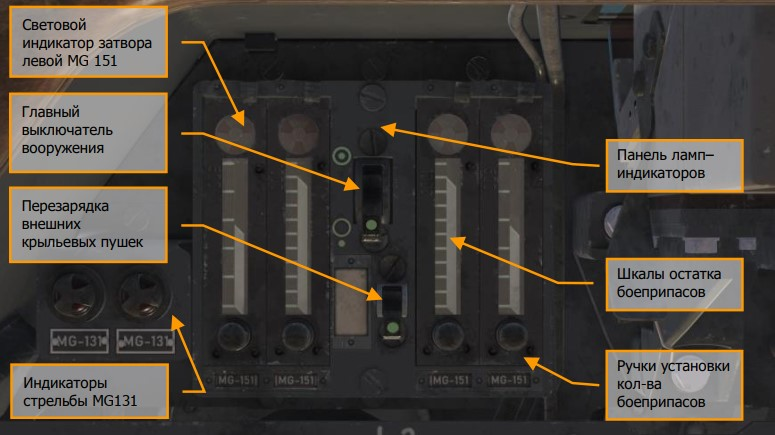

#### Табло радионавигатора AFN-2
На Fw 190 A-8 радионавигатор AFN-2 является частью комплекта оборудования радиостанции
FuG 16ZY.

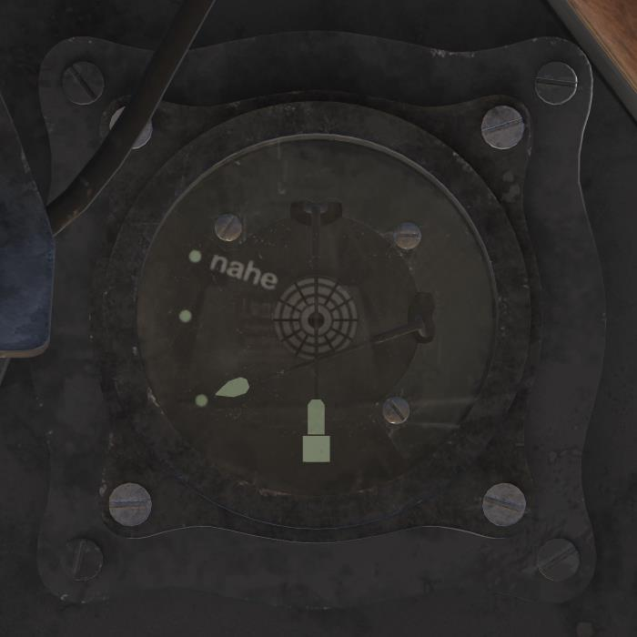

AFN-2 обеспечивает навигацию при возвращении на базу по сигналам наземных радиомаяков.
Устройство имеет две качающиеся стрелки VOR (вертикальная стрелка)
и DME (Distancemeasuringequipment) (горизонтальная стрелка) подобно
современному УКВ оборудованию всенаправленного диапазона.
Вертикальная стрелка указывает направление на радиомаяк.
Горизонтальная стрелка указывает расстояние до радиомаяка.
Поскольку AFN-2 – виброчувствительный прибор, для его корректной работы на борту
требуются особые условия, снижающие вибрационное воздействие. Монтаж на отдельном
алюминиевом листе и крепление к приборной панели резиновыми винтами обеспечивает
необходимую точность работы. Сильная вибрация или сотрясения могут привести к сбоям.

#### Альтиметр (высотомер)
Альтиметр показывает высоту, на которой летит самолет, измеряя атмосферное давление.
Прибор имеет 3 шкалы: на основной указывается высота в десятках метров, в нижнем окне
указывается высота в километрах, в верхнем окне показывается атмосферное давление
в миллибарах.

На основном табло размечена высота 1 километр, разбитая на деления по 10 метров. Диск
в нижнем окне показывает высоту в километрах, округленную в меньшую сторону, разбит
на десять делений от 0 до 9.
Высота, показываемая стрелкой на основном табло, должна быть прибавлена к показаниям
нижнего окна. Например, если на диске в нижнем окне показывается 3, а стрелка на основном
табло показывает 0,4, то фактическая высота составляет 3400 метров (3 + 0,4 км).

#### Указатель скорости
Табло индикатора указателя воздушной скорости (IAS) градуировано от 0 до 700 км/ч, кроме
того, имеются дополнительные отметки скорости до 900 км/ч.

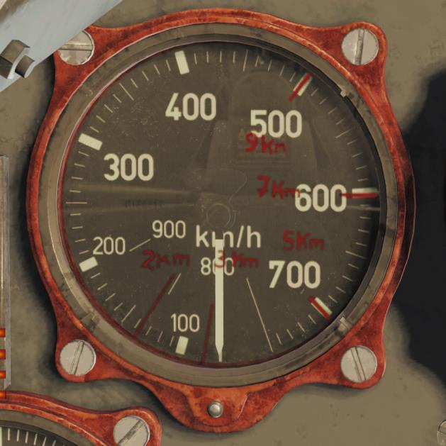

Шаг деления в диапазоне от 100 до 750 км/ч составляет 10 км/ч, а далее - 50 км/ч.
Обратите внимание, что начало шкалы в диапазоне 0 - 180 км/ч и ее конечный отрезок
750 - 900 км/ч перекрывают друг друга.

#### Авиагоризонт/указатель поворота и скольжения
Авиагоризонт, комбинированный с указателями поворота и скольжения производства
берлинской фирмы "Askania".

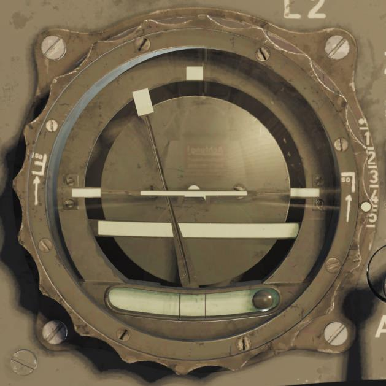

Части прибора, показывающие поворот и скольжение, состоят из гироскопического указателя
поворота и индикатора скольжения. Индикатор скольжения или инклинометр - заполненная
жидкостью изогнутая стеклянная трубка, в которой свободно двигающийся шарик меняет
положение в зависимости от воздействующих на него гравитации и центробежной силы.
Индикатор позволяет минимизировать скольжение, удерживая шарик по центру трубки
между метками. Пределы индикатора скольжения +/- 35°.
Метка искусственного горизонта указывает тангаж в пределах 60° и крен в пределах 110°.
Верхняя стрелка прибора показывает угол крена.

    Авиагоризонт должен быть заблокирован при выполнении высшего пилотажа!

Внешняя поворотная рамка-кольцо предназначена для арретирования/разарретирования
подвижной части прибора: "Fest" - арретировать (зафиксировать), "Los" - разарретировать
(освободить).

#### Вариометр
Вариометр или указатель вертикальной скорости показывает скорость подъема или снижения
самолета. Прибор градуирован от 0 до 30 в обоих направлениях и показывает вертикальную
скорость в метрах в секунду. Шаг делений от 0 до 5 м/сек составляет 1 м/сек, далее - 5 м/сек.

Вариометр позволяет контролировать вертикальную скорость и поддерживать постоянную
высоту при разворотах и нужную скороподъемность или скорость снижения при полетах
по приборам.

#### Репитер компаса
Репитер компаса состоит из поворотной картушки, поворотного указателя магнитного курса
и фиксированного указателя заданного курса.

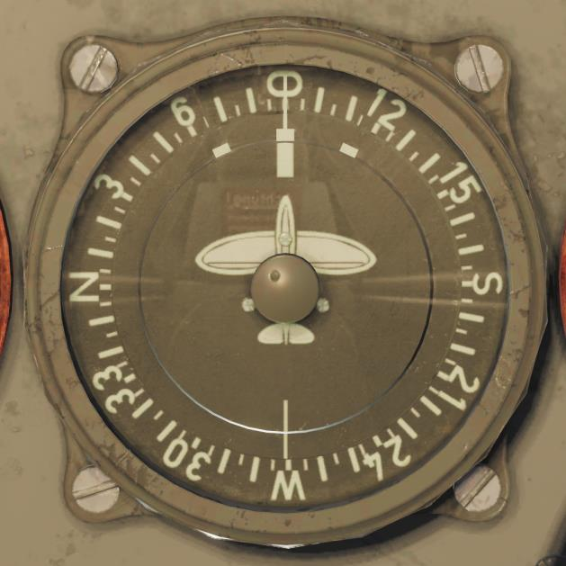

Стрелка-указатель курса, выполненная в виде "самолетика", показывает текущий магнитный
курс. Картушку компаса можно повернуть вместе с рамкой прибора для установки нужного
курса.

#### Индикатор давления нагнетателя (наддува)
Служит для контроля давления в нагнетателе двигателя.
Прибор градуирован от 0,6 до 1,8 абс. атмосфер. Шаг большого деления -0,1 атм.

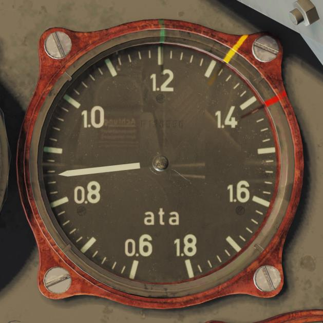

Один из основных контрольных приборов работы двигателя.
Стандартный прибор производства берлинской фирмы "R. Fuess", использовался почти во всех
немецких поршневых авиационных двигателях.

#### Тахометр
Тахометр показывает скорость работы двигателя.
Прибор градуирован от 0 до 3600 об/мин. Шаг деления 100 об/мин.

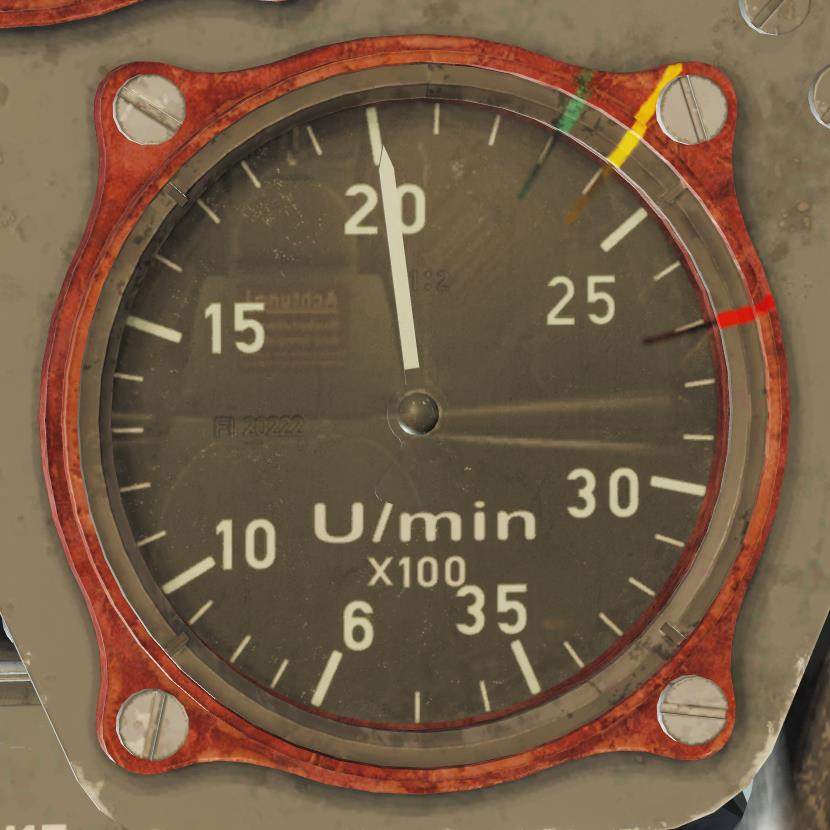

#### Ручное управление створками радиатора
Ручное управление створками радиатора используется для регулировки его обдува.
Рукоятка расположена на приборной панели между авиагоризонтом и вариометром, и
оборудована индикатором положения створок.

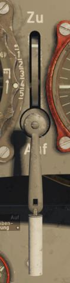

Вращение рукоятки по часовой стрелке к положению "Auf" механически открывает створки
радиатора, а против часовой стрелки к положению "Zu" закрывает.

#### Использование радиатора
При выполнении полетов в Европе створки радиатора должны использоваться только
в ходе взлета и/или длительного набора высоты.

Температура | Установка створок радиатора
------------|------------------
 Ниже -5°С  | “Zu”
 До +15°С   |  20°
 Выше +15°С | 30°С

Для всех горизонтальных полетов, полетов со снижением и посадки положение “Zu”.

При выполнении полетов в тропиках в ходе полета на малых высотах положение 20°,
в горизонтальном полете на других высотах, в снижении и на посадке положение “Zu”

Температура | Установка створок радиатора
------------|------------------
Выше 16°С | 40° на высоте от 5 км
Выше 16°С | 40° на высоте от 0 км

#### Ответчик свой-чужой
Изделие FuG 25a “Erstling” (Дебют) – одна из первых в мире систем опознавания “свой-чужой”,
которая позволяет наземным РЛС идентифицировать самолет как дружественный.
Система настроена на импульсы немецких радарных станций ПВО типа “Фрея” или “Вюрц-бург”.
РЛС посылает кодовое слово, FuG 25a отвечает условным сигналом, по которому наземная
станция идентифицирует самолет как дружественный.

FuG 25a работает на частоте 125+/-1,8 МГц на дальности до 100 км.

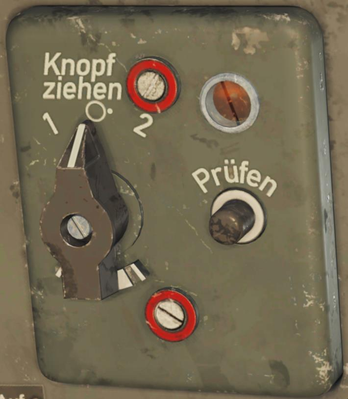

#### Кран кольцевания топливной системы

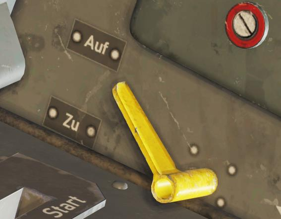

Рабочее положение "Auf", пробная прокачка "Zu".
Кран подпружинен в открытом положении, при проверке работы насосов должен
удерживаться в положении пробной прокачки.

#### Рукоятка уборки щеток стартера
Устройство используется при ручном запуске двигателя без применения электрического
стартера.

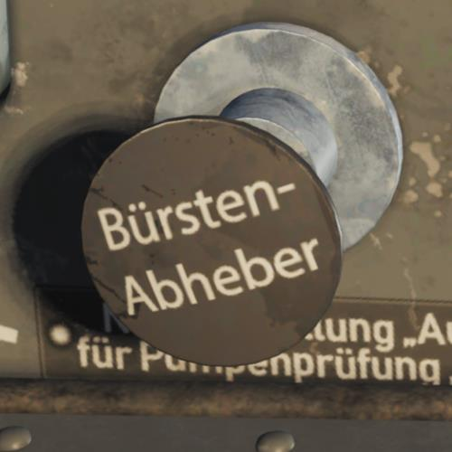

#### Аварийный выпуск шасси
В аварийной ситуации, когда кнопки выпуска шасси не работают, требуется использовать
ручную систему выпуска. Необходимо вытянуть аварийную рукоятку, которая разблокирует
механические замки. Это позволит стойкам шасси опуститься под собственным весом.
Чтобы шасси вышли самолет должен быть в нормальном горизонтальном положении.

#### Рычаг селектора топливных баков
Этот рычаг используется для открытия или закрытия питания двигателя из переднего или
заднего топливных баков в зависимости от условий полета. Имеет четыре положения:

- “Auf” – Открыто
- “VordererBehälterzu” – передний бак закрыт
- “HintererBehälterzu” – Задний бак закрыт
- “Zu” – Закрыто

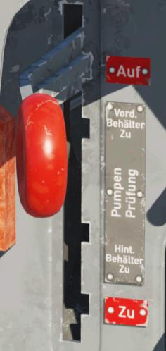

При установке топливного селектора в позицию "Auf", производится открытие перекрывных
клапанов магистралей обоих фюзеляжных баков, что обеспечивает ток топлива к насосу
двигателя. Насос двигателя перекачивает больше топлива, чем требуется для нормальной
работы. Лишнее топливо возвращается в передний бак по магистрали слива, таким образом
обеспечивается расход топлива только из заднего бака до его полной выработки. При начале
голодания насоса двигателя, открывается клапан переднего бака.
При наличии дополнительных топливных баков (вспомогательного фюзеляжного и/или
подвесного бака), топливо из них по двум магистралям поступает в задний топливный бак.
Магистрали дополнительных баков через Т-образное соединение объединяются
во вспомогательную топливную магистраль. Перед Т-образным соединением установлены
возвратные клапаны, предотвращающие перетекания топлива из одного дополнительного бака
в другой. Также, при отсутствии топлива в дополнительных баках, данные клапаны
предотвращают утечку топлива из основных баков.

Перекачка топлива из дополнительных баков производится только при остатке топлива
в заднем баке 240 л. Ограничительный клапан вспомогательной магистрали связан
с датчиком уровня топлива в заднем баке.
При остатке в заднем баке более 240 л., топливо из него подается на насос двигателя. В тоже
время, ограничительный клапан вспомогательной магистрали блокирует поступление топлива
из дополнительных баков.
При остатке в заднем баке 240 л. ограничительный клапан открывает вспомогательную
магистраль. Дополнительные баки питают задний бак вплоть до полной выработки топлива.
Дополнительные баки не оснащены топливомерными датчиками, определить выработку
топлива из них можно по уменьшению остатка топлива в заднем баке менее 240 л.
В полете должно сначала расходоваться топливо подвесного бака, после чего его бензонасос
должен быть выключен.

#### Аварийный сброс подфюзеляжных подвесок
Чтобы быстро избавиться от подвесок под фюзеляжем, необходимо вытянуть рукоятку.

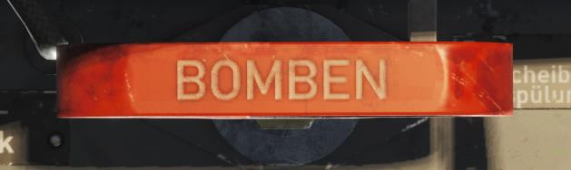

#### Рычаг холодного запуска / омывателя лобового стекла (не реализовано)

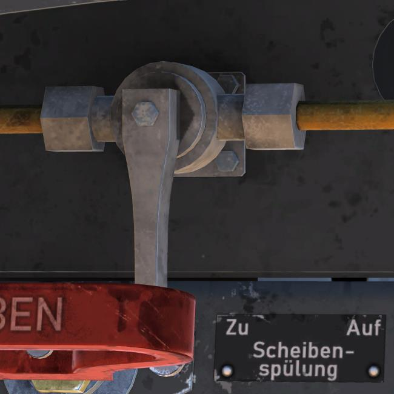

#### Топливно-масляный манометр
Пневматический двойной манометр для топлива и масла с двумя независимо работающими
измерительными шкалами. Производитель - "Maximall-Apparatus company, Paul Willmanо Berlin".

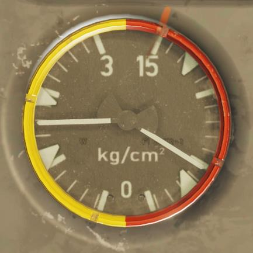

Табло прибора разделено на две половины. С левой стороны стрелка показывает давление
топлива в кг/см^2^, с правой - давление масла в кг/см^2^.

Топливный манометр градуирован от 0 до 3 кг/см^2^. Шаг деления 0,2 кг/см^2^.

Две треугольные метки показывают диапазон нормального рабочего давления 1-2 кг/см^2^.

Нижняя метка показывает минимально допустимое давление 1,3 кг/см 2, верхняя - максимально
допустимое 1,7 кг/см^2^.

Масляный манометр градуирован от 0 до 15 кг/см^2^. Шаг деления 1 кг/см^2^.

Две треугольные метки показывают диапазон нормального рабочего давление.

Нижняя метка показывает минимально допустимое давление 3 кг/см^2^, верхняя - максимально
допустимое 12 кг/см^2^.

#### Индикатор температуры масла
Индикатор температуры масла показывает температуру в градусах Цельсия (°С) и градуирован
от 0° до 130°С. Шаг деления 10°С. Диапазон нормальной рабочей температуры 25 - 85°С.

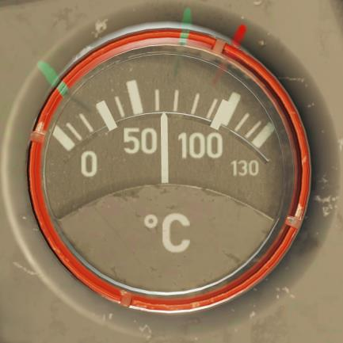

#### Топливомер
Топливомер показывает остаток топлива в переднем или заднем баках в зависимости
от позиции переключателя датчиков топливомера, расположенного справа от прибора.

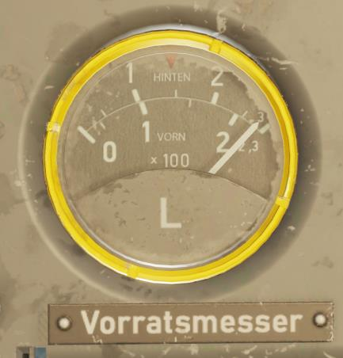

Поскольку баки имеют разную емкость, на табло топливомера нанесена двойная шкала.
Верхняя часть шкалы показывает остаток топлива в заднем баке (отмечена "Hinten"), а нижняя
часть - остаток топлива в переднем баке (отмечена "Vorn").
Индикации остатка топлива в подвесном баке нет. Если используется подвесной топливный
бак, его бензонасос качает топливо в задний бак. При его использовании селекторный
переключатель топливомера должен быть установлен в положение "Hinten".
Топливомер будет показывать, что задний бак полон до тех пор, пока поступает топливо из
подвесного бака. Как только он опустеет, уровень топлива в заднем баке начнет снижаться.
Для каждого бака предусмотрена световая сигнализация аварийного остатка топлива. Верхняя
лампа с надписью "vom" загорается при остатке в переднем баке около 80 литров. Нижняя
лампа с надписью "hinten" загорается при остатке в заднем баке около 10 литров.

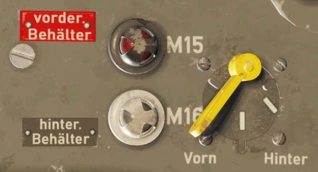

Поставьте ручку переключателя в положение "Vom", чтобы посмотреть остаток бензина
в переднем топливном баке или в положение "Hinten", чтобы посмотреть остаток бензина
в заднем топливном баке.
При использовании подвесного топливного бака переключатель должен стоять в положении
"Hinten".
Когда топливомер начнет показывать расход топлива из заднего бака - подвесной бак пуст
и может быть сброшен.

#### Индикатор шага винта
Прибор показывает положение лопастей воздушного винта, выполнен в виде циферблата
с часовой и минутной стрелками.

Один час соответствует повороту лопастей на 6 градусов.

Один градус поворота лопастей равен 10 минутам.
Рабочий диапазон по прибору – от 8:10 до 12:35.

Положение 8:10 соответствует 51,5°, 12:35 – 25°.

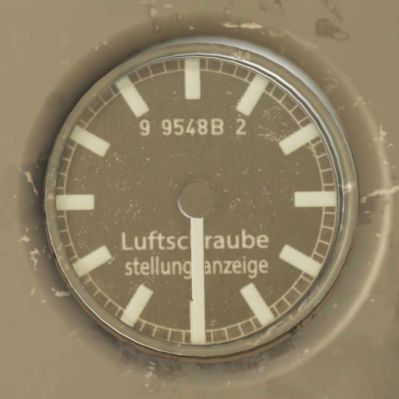

#### Индикатор подачи кислорода
Индикатор подачи кислорода расположен в нижнем правом углу приборной панели и работает
в соответствии с дыханием пилота. При вдохе кислород подается в систему и шоры на приборе
открываются. При выдохе кислород прекращает поступать и шоры закрываются.

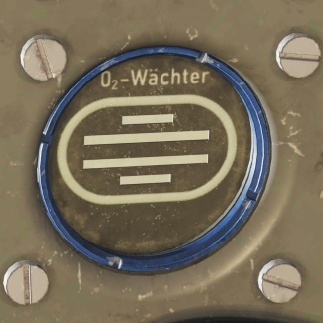

#### Кислородный манометр
Кислородный манометр расположен в нижнем правом углу приборной панели и показывает
давление в кислородной системе.

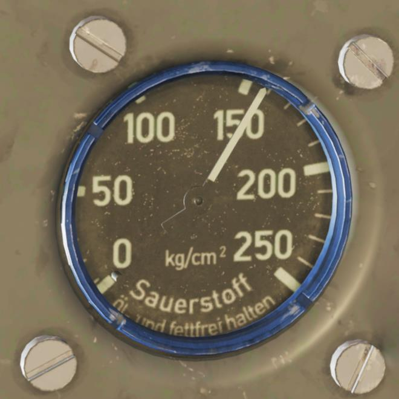

Прибор измеряет давление в килограммах за квадратный сантиметр (кг/см 2). Инструмент
градуирован от 0 до 250 кг/см^2^ с шагом деления 10 кг/см^2^. Нормальное давление в системе -
150 кг/см^2^. В обычных условиях после 20 минут работы давление кислорода должно снизиться
не более, чем на 10 кг/см^2^.
При увеличении высоты полета давление кислорода может снизиться из-за охлаждения
кислородных баллонов. И, наоборот - при уменьшении высоты может повыситься вследствие
нагрева баллонов. Быстрое падение кислородного давления в горизонтальном полете или на
снижении указывает на утечку кислорода или неисправность в системе.

#### Кислородный кран
Кислородный кран используется пилотом для открытия кислородного клапана и включения
системы кислородного питания.

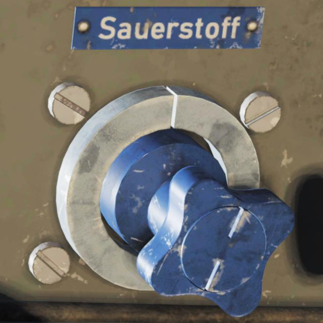

При открытии крана кислород поступает в кислородный регулятор, расположенный по правому
борту кабины за сиденьем пилота. В регуляторе кислород смешивается с воздухом
в пропорции, соответствующей атмосферному давлению.

#### Кнопка аварийной кислородной системы
В определенных условиях полета, особенно выше 4000 метров, кислородное голодание может
наступить незаметно.
При появлении первых же ощущений удушья или сопротивления току воздуха на вдохе,
необходимо немедленно подключить аварийную кислородную систему.

Для этого локтем правой руки требуется несколько раз нажать кнопку включения аварийной
кислородной системы, расположенную справа по борту.

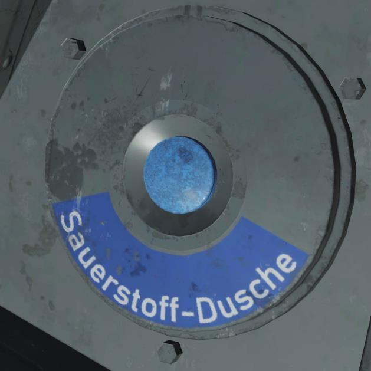

#### Панель вооружения
Пульт управления оружием Zünderschaltkasten 244, установленный на Fw 190 A-8, является
стандартным устройством, использовавшимся на многих самолетах Люфтваффе.
Прибор установки режимов взрывателей бомб управляет мощностью электрического заряда,
передаваемого с аккумулятора на взрыватель бомбы. Поворотом переключателя настраивается
нужный режим срабатывания взрывателя.
Для безопасного сброса бомб переключатель должен быть в верхнем положении "Aus".
Настройки в секторе "Sturz" слева используются для бомбометания с пикирования.

Настройки в секторе "Wagerecht" справа используются для бомбометания с горизонтального
полета.

- "OV" (Ohne Verzug) означает "без задержки" - бомба взрывается при контакте с землей.
- "MV" (Mit Verzug) означает "с задержкой" - взрыв бомбы происходит с короткой задержкой
    после падения.
    
Переключатель должен быть заранее установлен в положение, соответствующее профилю
атаки.

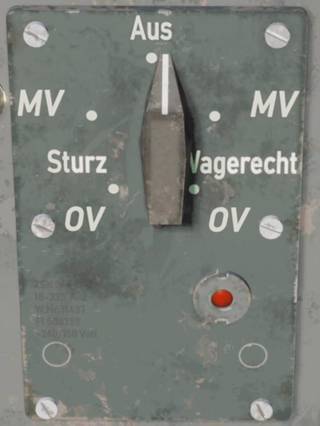

### Левая панель
На левой панели кабины сосредоточены органы управления двигателем и основными
системами.

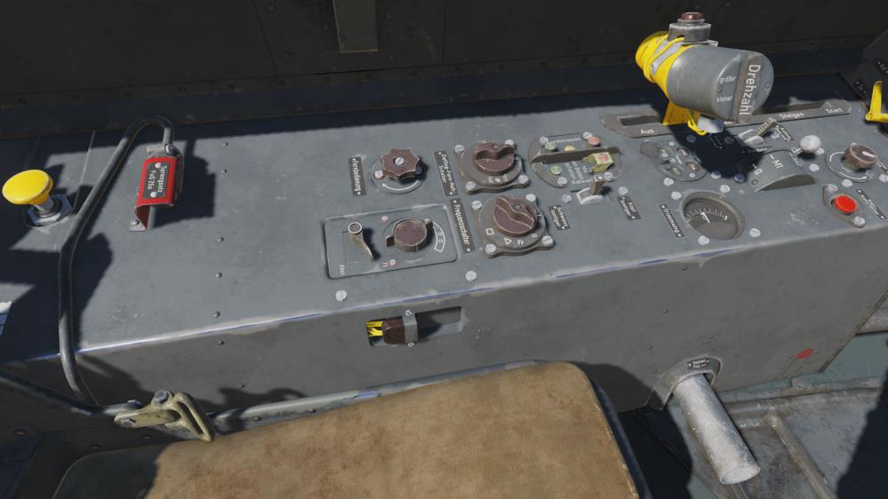

1. Рукоятка заливочного насоса
1. Разъем подключения пилотской гарнитуры к радиостанции
1. Точная настройка приемника радиостанции FuG 16ZY
1. Переключатель диапазонов FuG 16ZY
1. Пульт управления шасси и щитками
1. Индикаторы положения шасси
1. Кнопка тангенты радиопередачи
1. Ручка управления двигателем (РУД)
1. Переключатель управления шагом винта автоматическое / ручное
1. Переключатель режимов радиостанции FuG 16ZY
1. Регулятор громкости звука в наушниках
1. Переключатель частот радиостанции FuG 16ZY
1. Переключатель перестановки стабилизатора
1. Индикатор отклонения стабилизатора
1. Переключатель зажигания (магнето)
1. Стопор РУД
1. Кнопка аварийного выключения электросистемы
1. Регулятор яркости освещения приборной панели

#### Ручка управления двигателем
Двигатель Fw 190 A-8 оборудован центральным постом управления, существенно снижающим
нагрузку на пилота тем, что сам устанавливает оптимальные комбинации наддува
и оборотов винта, и объединяет всю автоматику двигателя в одном довольно компактном
корпусе.
Таким образом, перемещение рычага управления двигателем (РУД) на Fw 190 А-8 влияет сразу
на всю винтомоторную группу.

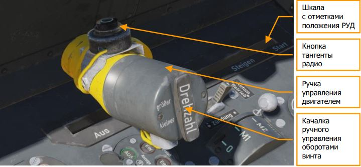

РУД имеет четыре стандартных положения:

- "Aus" (Закрыто)
- "Anlassen" (Запуск двигателя)
- "Steigen" (Набор высоты)
- "Start" (Взлет)

Для установки нужного давления наддува РУД нужно переместить вперед (индикатор давления
нагнетателя расположен справа на передней панели и маркирован в АТА).
Чтобы поддерживать требуемый режим работы двигателя, РУД может быть зафиксирован при
помощи стопора, расположенного ниже над полом кабины.
Круглая кнопка на ручке сверху - тангента радиопередачи.
Качалка на торце ручки управляет оборотами при ручном управлении шагом винта. “Größer”
увеличивает, “Kleiner” уменьшает обороты.

#### Включение зажигания
Переключатель зажигания управляет магнето, используемыми для питания свечей в цилиндрах
двигателя и имеет четыре положения: "0" (выключено), "М1 (правое магнето), "М2" (левое
магнето) и "М1+2" (оба магнето).

- "0". Магнето выключены.
- "M1". Правое магнето используется для запуска двигателя.
- "M2". Левое магнето используется для запуска двигателя.
- "M1+2". Оба магнето используются для запуска двигателя.

Рабочее положение - М1+2. Промежуточные положения используются при проверке работы
системы зажигания.

#### Переключатель режима управления шагом винта
Переключатель переводит управление шагом винта либо в автоматический режим
с гидроприводом, либо в ручной с автономным приводом от электромотора. Последний
позволяет зафлюгировать винт, остановив неисправный мотор и снизив сопротивление винта
до минимума. Гидравлический привод не может до конца зафлюгировать винт, так как при
снижении оборотов падает давление масла и дальнейшее увеличение шага винта становится
невозможным.
Кроме этого, ручной электропривод шага винта используется при проведении технического
обслуживания на земле без запуска двигателя.

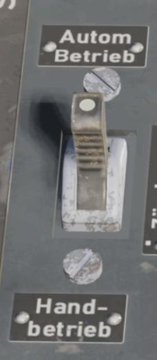

#### Триммирование стабилизатора
Переключатель перестановки стабилизатора позволяет изменять угол установки стабилизатора
с помощью электропривода.

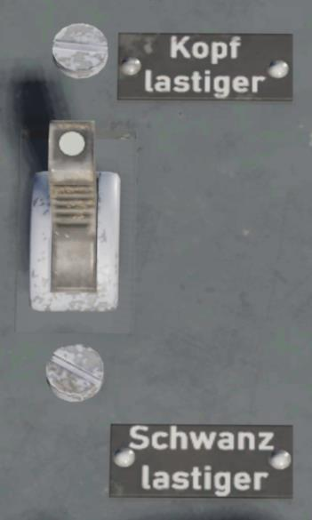

Переключатель подпружинен в нейтральном положении и имеет два рабочих - "Kopf lastiger"
(на пикирование) и "Schwanz lastiger" (на кабрирование).
Чтобы изменить угол установки стабилизатора нажмите и удерживайте кнопку переключателя.

Электропривод переставляет стабилизатор при удержании переключателя в одном
из положении вплоть до крайнего значения.

#### Индикатор положения стабилизатора
Индикатор показывает текущее положение стабилизатора.

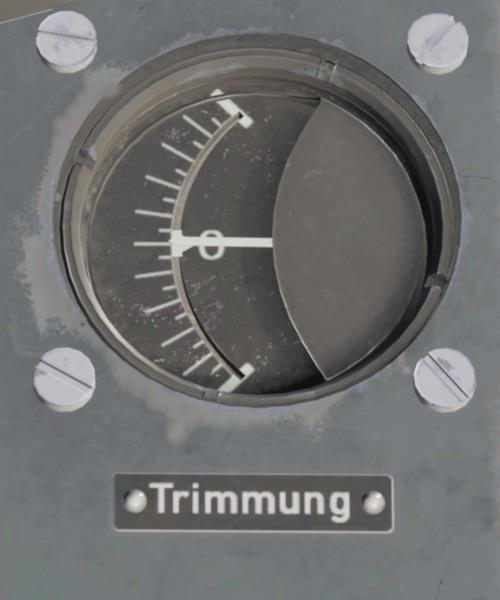

Прибор градуирован от -5° до +5°, шаг деления 0,5°.

Рабочий диапазон отклонения стабилизатора составляет от +4° до -1° относительно
продольной оси фюзеляжа.

Нейтральное положение стабилизатора 0° по прибору соответствует фактическому
положению +2°.

#### Управление шасси и посадочными щитками
На пульте расположены кнопки управления шасси и щитками.
На правой половине "Rollwerk" расположены две кнопки, служащие для выпуска и уборки
шасси - "Ein" (убрано) и "Aus" (выпущено).

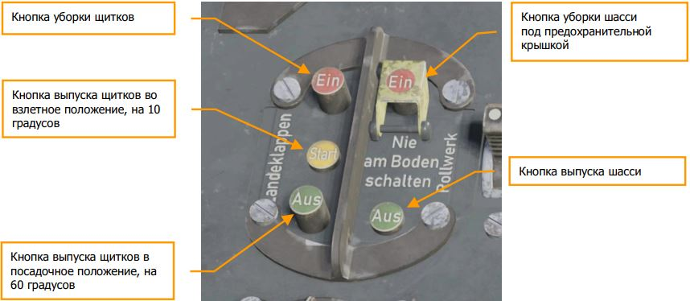

Чтобы поднять шасси необходимо откинуть предохранительную крышку с кнопки "Ein",
нажать кнопку и дождаться завершения процесса. Шасси будет поднято и поставлено
на замки. На индикаторе загорятся красные лампы.
Чтобы выпустить шасси нужно нажать кнопку "Aus"и дождаться завершения процесса.
Шасси будет выпущено и поставлено на замки. На индикаторе загорятся зеленые лампы.
Кнопки на левой половине "Landeklappen" используются для управления щитками.
Три кнопки соответствуют трем положениям щитков: "Ein" (убраны), "Start" (взлет)
и "Aus" (посадка).
Чтобы поднять щитки нужно нажать кнопку "Ein".

Чтобы установить щитки во взлетное положение нужно нажать кнопку "Start". Щитки займут
взлетное положение 10°.
Чтобы полностью выпустить щитки, нужно нажать кнопку "Aus". Щитки выйдут полностью на
угол 60°.

#### Индикаторы шасси
Индикатор показывает положение главных стоек шасси (левая и правая лампы) в состоянии
убраны и выпущены.

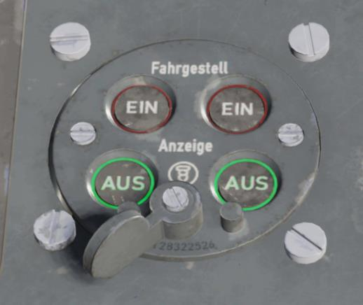

- Шасси убрано – включаются красные лампы.
- Шасси выпущено – включаются зеленые лампы.

Индикатор оборудован флажком проверки исправности ламп индикатора шасси. Рабочее
положение - см. рис. 64. Для проверки исправности ламп повернуть флажок вправо, если
все четыре лампы включены – индикатор исправен. После применения необходимо вернуть
флажок в рабочее положение.

В дополнение к сигнальным лампам в кабине пилота, на самолете также присутствуют внешние
механические индикаторы, установленные в консолях обоих крыльев.
В передней части крыла расположены индикаторы положения шасси: при уборке основных
стоек шасси индикаторы опускаются, при выпуске, соответственно, поднимаются.
В задней части крыла расположено окошко с сектором диска, индицирующим положение
щитков в градусах.

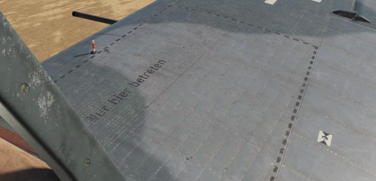

#### Управление радиостанцией
Пульт управления радиостанцией имеет пять элемента:

1. Переключатель диапазонов
1. Переключатель частот
1. Регулятор громкости звука в наушниках
1. Переключатель режимов
1. Регулятор точной настройки приемника

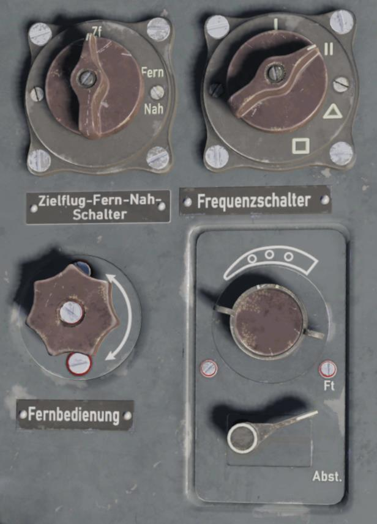

##### Переключение частот
Переключатель частот радиостанции FuG 16ZY имеет четыре позиции, обозначенные
символами I, II, ∆ и □. Все четыре позиции перед вылетом привязываются к определенным
частотам. Пилот не может вручную изменить привязку частот. Частоты могут быть настроены
только на земле (по специальной таблице в редакторе миссий) в диапазоне 38,4 - 42,4 МГц.
Эти четыре частоты предназначены для связи с более крупными авиационными
подразделениями.

Частота "I" или "Y-Führungsfrequenz" - это управляющая частота, используется для связи
в эскадрилье.

Частота "II" или "Gruppenbefehlsfrequenz" – это частота истребительной группы, используется
для связи между несколькими пилотами из разных эскадрилий.

Частота "∆" или "Nah-Flugsicherungsfrequenz" – это частота наземной службы, используется для
связи с авиадиспетчером.

Частота "□" или "Reichsjägerfrequenz" – это частота истребителей ПВО Рейха, используется для
координации общих усилий системы ПВО в крупномасштабных операциях.

##### Регулировка громкости звука в наушниках
Громкость звука в наушниках регулируется вращением рукоятки: по часовой стрелке
увеличивает громкость, против часовой стрелки - уменьшает.

##### Переключение режимов
Переключатель режимов имеет два положения: "Ft" ("Funktelefonie"- радиотелефония) и "Abst"
("Abstimmen" - настройка (на сигнал системы радионавигации)).

Он функционирует в комбинации с переключателем частот и устанавливает режим работы
радиостанции. Комбинации приведены в таблице ниже

 Режим    |   Частота    | Тангента не нажата | Тангента нажата |  Передатчик   |    Приемник
 ---------|--------------|--------------------|-----------------|---------------|-------------
   "Ft"   |     I        |   Слушать          |    Говорить     |        I      |      II
  "Abst"  |  I | Прием сигнала СРН Слушать | Прием сигнала СРН Слушать +Говорить | I |   II
   "Ft"   | II, ∆ или □  |     Слушать        |     Говорить    | II, ∆ or □    |  II, ∆ or □
  "Abst"  | II, ∆ или □  |  Listen to loop antenna Targeting | Говорить | II, ∆ or □ |  II, ∆ or □

    В первой позиции переключателя частот (I) прием и передача производятся на разных
    частотах, она не используется в этом симуляторе.

    Для связи используйте II, ∆ или □ позиции в режиме "Ft".

Частоты для всех четырех позиций должны быть предварительно назначены по таблице
в редакторе миссий.

##### Точная настройка приемника
Устройство дистанционного управления FBG 16 "Fernbediengerät" используется для точной
настройки предварительно назначенной частоты.

#### Кнопка отключения электросети самолета

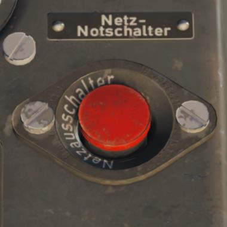

Используется для экстренного обесточивания бортовой сети Fw 190 A-8.

#### Регулятор яркости освещения приборной панели

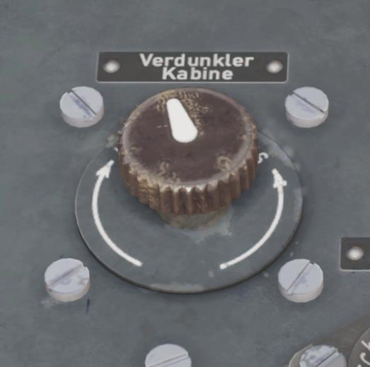

Используется для настройки комфортной яркости подсветки приборной панели.

Поворот ручки регулятора против часовой стрелки уменьшает яркость подсветки, поворот
по часовой стрелке – увеличивает яркость.

### Правая панель
На правой панели кабины размещены АЗС, ручки закрытия/открытия и сброса фонаря,
бортовые часы.

 1             2             3           4          5

  6                 7                8              9

              Правая панель кабины Fw 190 A-8
      1.   Передняя панель АЗС (крышка открыта)
      2.   Выключатель и поднятая крышка стартера
      3.   Ручка закрытия/открытия фонаря
      4.   Рычаг аварийного сброса фонаря
      5.   Задняя панель АЗС (крышка открыта)
      6.   Бортовые часы
      7.   Таблица магнитных склонений компаса
      8.   Панель АЗС топливной системы
      9.   Панель АЗС вооружения
Рукоятка фонаря кабины
Штурвальная рукоятка используется для открытия/закрытия фонаря кабины: вращение
по часовой стрелке открывает фонарь, а против часовой стрелки закрывает.
Сзади от рукоятки находится рычаг аварийного отстрела фонаря посредством пиропатрона.

                                                                            Рукоятка фонаря
                                                                            кабины

                                                                            Рычаг сброса
                                                                            фонаря кабины

            Рукоятка фонаря кабины и рукоятка сброса фонаря кабины

Cтартер
Переключатель стартера используется для раскрутки маховика и запуска двигателя.
Подпружиненную рукоятку нужно нажать вниз, чтобы раскрутить маховик, затем вытянуть ее
вверх для запуска двигателя.

                                                                           Открытая крышка
                                                                           стартера

                                                                           Рукоятка стартера

            Рукоятка стартера с открытой защитной крышкой
Бортовые часы
Часы "Junghans Borduhr Bo-UK1" использовались на всех немецких самолетах периода Второй
мировой войны. На Fw 190 A-8 они расположены в передней части правой панели.
Завод часов осуществляется при помощи головки под циферблатом.
Расположенная под ним кнопка управляет секундомером: запускает, останавливает и обнуляет
его. Каждая минута, отсчитанная секундомером, отражается на маленьком циферблате,
градуированном на 15 минут.
С помощью головки и язычковой кнопки "пуск-стоп" справа можно переводить стрелки часов.

                                                                         Поворотная шкала

                                                                        15-минутный малый
                                                                            циферблат

                                                                           Головка завода
                                                                          и перевода часов

                                                                         Кнопка управления
                                                                           секундомером

                                                                        Кнопка "Пуск - Стоп"

              Бортовые часы
Перевод часов:

    •   Нажмите кнопку Пуск - Стоп.
    •   Установите нужное время головкой.

    •   Отожмите кнопку Пуск - Стоп.
Секундомер:

    •   Повторное нажатие кнопки запускает секундомер.
    •   Второе нажатие кнопки останавливает секундомер.
    •   Третье нажатие кнопки обнуляет секундомер.
Автоматы защиты сети
Автоматы защиты сети (АЗС) используются для управления многочисленными электрическими
системами на борту самолета. Каждый участок цепи имеет две кнопки: черная кнопка
включает схему, красная - выключает.
На правой панели кабины Fw 190 A-8 размещены четыре панели АЗС.
Передняя и задняя панели АЗС укомплектованы одиннадцатью АЗС каждая и закрываются
откидными крышками.
Панели АЗС вооружения и топливной системы содержат 3 и 5 АЗС, соответственно

            Крышка блоков АЗС закрыта, крышка блоков АЗС открыта
Особенностью электросхемы самолета является то, что управляющие и силовые цепи приводов
шага винта и шасси запистаны через отдельные АЗС.

Обозначения АЗС нанесены рядом с ними, а на панели рядом - названия защищаемых цепей.
                               Abwurf-Waffe
                               Панель СУВ

                               Bildgerät/Zielgerät
                               Прицел и фотокинооборудование

                               ЯЯЯЯЯЯЯЯ

                               Meßanlage überwachg
                               Приборная панель

                               Kennlichter
                               БАНО

                               Gerätebrettbel.
                               Освещение кабины

                               Heizbekleidg.
                               Подогрев комбинезона

                               Staurohr-Heizung
                               Обогрев ПВД

                               Zündung - Anlasser
                               Магнето

                               FuG 25a
                               СРО “Свой-чужой”

                               Generator
                               Генератор

                               Sammler
                               Аккумулятор

Описание АЗС передней панели
                             Ft- Anlage
                             Fug 16 ZY Радио

                             Fahrwerks-Antrieb
                             Привод шасси

                             Landenklappen- Betätigung
                             Посадочные щитки

                             Verstell-Schraube
                             Привод шага винта

                             Verstell-Schraube
                             Автомат шага винта

                             Höhen- Trimm
                             Триммер стабилизатора

                             Wende-Horizont
                             Авиагоризонт

                             Drehstrom-Umformer
                             Мотор-генератор

                             Kompaß-Anlage
                             Компас

                             Fahrwerks - Betätigung
                             Управление приводом шасси

                             FuG 25 a Sprengung
                             Самоуничтожение блока “cвой-чужой”
                             (не реализовано)

Описание АЗС задней панели
Наземное         Насос       Насос     Насос        Насос
электропитание   переднего   заднего   подвесного   вспомогательного
                 бака        бака      бака         бака

 Переключатели панели АЗС топливной системы

                                                    Пушки
                                                    в консолях крыла

                                                    Пулеметы
                                                    над мотором

                                                    Пушки
                                                    в корне крыла

 Переключатели панели АЗС вооружения
Ручка управления самолетом
Ручка управления самолетом, сокращенно – РУС, предназначена для управления самолетом
по крену и тангажу.

Движение РУС назад, “на себя”, отклоняет руль высоты вверх, в горизонтальном полете
самолет переводится в набор высоты – кабрирование. Движение РУС вперед, “от себя”,
соответственно, отклоняет руль высоты вниз, что переводит самолет в пикирование.

Движение РУС вправо или влево, соответственно, отклоняет элероны и обеспечивает
увеличение крена самолета в сторону, в которую сдвинута РУС.

          Резкие движения РУС могут привести к катастрофическим последствиям!

На РУС также размещены кнопки, управляющие спусковыми механизмами вооружения,
фотокинопулеметом, и скоба предохранителя.

                                    Скоба предохранителя
                                    в закрытом
                                    положении, кнопки
                                    стрельбы недоступны

                                    Скоба предохранителя
                                    в боевом положении,
                                    доступна стрельба из
                                    пулеметов и пушек в
                                    корне крыла

                                    Кнопка стрельбы
                                    MG 151 в консолях
                                    крыла доступна

                                    Кнопка сброса бомб,
                                    пуска ракет

                                    Кнопка управления
                                    фотокинопулеметом

            РУС, расположение управления вооружением и фотокинопулеметом,
          предохранитель закрыт (слева), предохранитель открыт (справа)
Наколенный планшет
Для помощи игроку в навигации в игре есть наколенный планшет. Его можно открыть в любой
момент: кратко - нажать и удерживать клавишу [К], включить постоянно - сочетание клавиш
[RShift + K]. На карте показан участок полетного плана; изначально карта центрирована
на стартовой точке. Листание страниц карты возможно клавишами [[] (открытая скобка) и []]
(закрытая скобка), на них последовательно показаны этапы полета, контрольные точки и
расположенные на пути аэродромы.

Кроме того, команда [RCtrl + K] может использоваться, чтобы разместить отметки на карте.
Отметка показывает положение самолета на карте в настоящее время (как отметка
карандашом на бумажной карте).
Наколенный планшет можно разместить на левой ноге пилота, если включен режим "пилот
в кабине" [RShift + P].

             Наколенный планшет
## СТАНДАРТНЫЕ ПРОЦЕДУРЫ
Предполетные процедуры
В кабине пилота нужно проделать следующие операции:

•   Выбрать наиболее удобное положение в кабине, используя комбинации клавиш
    [RightCtrl + RightShift + Numpad8] и [RightCtrl + RightShift + Numpad2].
•   Проверить отклик руля направления на движение педалей и соответствие его центрального
    положения центральному положению педалей.
•   Открыть кислородный кран, расположенный справа внизу на передней панели.

                                                                      Кислородный
                                                                       манометр

                                                                    Кислородный кран

                                                                    Индикатор подачи
                                                                       кислорода

•   На пульте управления шасси и щитками левой панели должна быть нажата кнопка ”шасси
    выпущено” (зеленая кнопка ”Aus”), иначе при включении электросистемы шасси может
    подняться.

                                                                   Нажатая кнопка ”AUS”
Запуск двигателя
   Электрический стартер использовать с подключенным внешним электропитанием!
         Бортовой аккумулятор применять только в чрезвычайных ситуациях!

  •   Магнето установить на “0”.
  •   Подать сигнал наземному персоналу на подключение аэродромного электропитания.
  •   Включить АЗС Аэродромного электропитания, Зажигания, Стартера, Управления
      шагом винта, Генератора. АЗС аккумулятора не включать!
  •   Управление шагом винта перевести в ручной режим. Установить шаг винта на 12:35,
      затем – в положение 12:00.

                                                                        Увеличить шаг
                                                                            винта

                                                                        Уменьшить шаг
                                                                            винта

  •   Рычаг селектора топливных баков в верхнее положение "Auf" (открыто).
      Вверх [T], вниз [RShift + T].
                                                        Селектор топливных
                                                         баков в положении
                                                                 Auf

•   Проверить работу подкачивающих насосов топливных баков; включать на панели
    переключателей топливной системы по одному АЗС каждого насоса и контролировать
    давление топлива (0,3-0,4 atü) по прибору. Выключить насосы.
•   Включить бензонасосы:
    o    E14   Бензонасос переднего бака
    o    E13   Бензонасос заднего бака
    o    E16   Бензонасос подвесного бака, если он используется
    o    E96   Насос системы дополнительного бака, если необходимо

          Внешнее        Насос        Насос         Насос           Насос
          соединение     переднего    заднего       подвесного      дополнительного
                         бака         бака          бака            бака

Переключатели АЗС топливной системы
•   Поставить РУД в положение ¼ газа. “Anlassen-Aus”. [RAlt + Home]

•   Закрыть фонарь кабины. Нажать и удерживать [LCtrl + C].
•   Подкачать топливо заливающим насосом, сделав несколько коротких энергичных
    движений рукояткой на левой панели, от 1 до 15 раз, в зависимости
    от температуры окружающего воздуха. [LAlt + P]

•   Нажать рукоятку стартера и удерживать 10 секунд (в холодную погоду до 20 секунд)
    для раскрутки маховика. Нажмите и удерживайте [Home].
•   Переключатель зажигания (магнето) перевести в положение M1+М2.
    Вперед [End], назад [RShift + End].
                                                                      Рукоятка
                                                                   переключателя
                                                                     зажигания

•   После раскрутки маховика вытянуть рукоятку стартера вверх для запуска двигателя.
    Нажмите и удерживайте [RCtrl + Home].

•   Если двигатель работает с перебоями, повторно подкачать топливо заливающим
    насосом, при необходимости добавить обороты.
•   После запуска держите работу двигателя в режиме 500-600 об/мин до того, как
    стрелка указателя давления масла начнет движение, после этого незамедлительно
    увеличьте обороты до 1200 об/мин.
    Если в течение 15 секунд стрелка указателя давления масла не придет в движение,
    заглушите двигатель и вызовите персонал для ремонта.
    Если возникла неисправность бортовой сети электропитания, двигатель
    не запустится.
•   Подать сигнал наземному персоналу на отключение аэродромного электропитания.

В экстренном случае или при невозможности использования внешнего электропитания
               возможен запуск двигателя от бортового аккумулятора.
    Для выполнения запуска вместо подключения АЗС внешнего питания и вызова
       наземного персонала включите АЗС аккумулятора и выполняйте запуск.
Прогрев двигателя на старте
•   Включить автомат управления шагом винта. Практика показывает, что прогрев
    с включенной автоматикой способствует правильному распределению масла в системе,
    и предотвращает неполадки в ходе выполнения полета.
•   Увеличить обороты до 1200 об/мин незамедлительно после начала индикации давления
    масла и прогревать двигатель до как минимум +25°С (по указателю на приборной
    панели). Работы двигателя в режиме 600-1100 об/мин следует всеми средствами избегать,
    чтобы исключить вибрационные повреждения крыльчатки вентилятора.
•   Увеличивать обороты выше 1200 допускается исключительно после прогрева масла до
    30°С. Дальнейший прогрев проводить на 1400-1500 об/мин.
    Контролировать давление масла! При температуре масла в диапазоне 40 - 45°С, давление
    до 15 atü. При температуре выше 40 - 45°С давление снижается терморегулятором
    автоматически до 8-9 atü.
•   Проверка топливных насосов

Установить и держать кран кольцевания топливной магистрали в положение "Zu" -
подпружинен, при отпускании возвращается в положение "Auf". Переключать кран селектора
топливных баков с переднего бака на задний и наблюдать за указателем давления топлива.
Контроль: при работе двигателя на 1200 об/мин оставить краны в выбранном положении
не менее, чем на 1 минуту. Давление топлива не должно заметно упасть.

После проверки установить все краны в положение "Auf".

           Избегайте длительной работы двигателя в диапазоне 600-1000 об/мин!

    •    Включить АЗС основной панели
             o    Внешняя подвеска

             o    Прицел и фотокинооборудование
             o    Приборы
             o    Обогрев костюма
             o    Обогрев трубки Пито

             o    FuG 25a
Опробование двигателя
Опробование двигателя должно выполняться только после прогрева масла до 30°С.
Щитки установить во взлетное положение, РУС взять на себя.

1.     Установить шаг винта на 12:00, отключить автоматическое управление шагом винта.
2.     Выполнять прогон без задержек. Контролируйте параметры работы по таблице:

           Шаг            Обороты,      Наддув,      Давление      Давление            Температура
          винта            об/мин         ata        топлива,       масла,                масла,
                                                        atü           atü                   °С

         12:00 часов                                     От 1,25          15              до 45
     (Базовая настройка   2430 ± 40       1,42
       12:35 при 25°)                                    До 1,75          8-9            выше 45

       Проверка магнето и свечей зажигания на 2400 об/мин – последовательно переключать
       магнето в положения М1 и М2.
       Обороты двигателя не должны упасть более, чем на 50 об/мин.

3.     Проверка автомата управления шагом винта. Контролировать соответствие параметров
       “Наддув – Обороты” по таблице:

       Наддув, ata        0,85   0,9     1,0      1,05      1,10   1,14         1,28    1,32      1,42

        Связанные
                          1600   1700   1900      2000     2100    2250         2350    2400      2700
     обороты, об/мин

       При включении автомата шага винта показатели приборов не должны отличаться
       от табличных значений более, чем на ±80 оборотов. Причина расхождений: инертность
       центрального поста управления и неточность индикации тахометра.

4.     Избегайте длительной работы двигателя на малых/холостых оборотах по причине
       недостаточной смазки клапанов и, если требуется более длительное время ожидания,
       установите обороты 1200 об/мин.
Руление
1.   Руление и взлет допускаются только с полностью открытыми створками радиатора.
     Рукоятка управления створками расположена под верхней приборной панелью. Нажмите
     и удерживайте [LeftAlt + A] для полного открытия створок. Избегайте активной работы
     створками, особенно возле крайних положений.
2.   Старайтесь удерживать обороты не ниже 1200 об/мин. Длительное руление может вызвать
     повреждения пневматиков от сильного нагрева тормозов.
3.   Перед началом движения разблокируйте хвостовое колесо, отдав РУС вперед примерно
     на 3 сантиметра, иначе не сможете поворачивать.
4.   После разблокирования хвостового колеса проверьте раздельные тормоза основных колес,
     избегайте чрезмерно интенсивного воздействия.
5.   Если хвостовое колесо не разблокируется, попробуйте освободить его переменным
     торможением и одновременной отдачей РУС вперед.
6.   При построении на полосе перед взлетом дайте самолету проехать немного вперед, чтобы
     выровнять хвостовое колесо.
7.   При рулении старайтесь сократить использование тормозов; короткие нажатия на тормоз
     предпочтительнее длительного торможения.

Проверка перед взлетом
Перед взлетом необходимо выполнить следующие проверки:
1. Органы управления:
    1.1. Проверьте ход ручки управления и педалей, убедитесь, что они двигаются без
          помех. При этих манипуляциях осмотрите рулевые поверхности на предмет
          правильного отклика.
2. Топливная система:
    2.1. Рычаг селектора топливных баков в верхнем положении "Auf" (открыто).
    2.2. Переключатели бензонасосов включены.
    2.3. Уровень топлива в обоих баках. Выбор бака – переключателем топливомера. Правое
          положение [RAlt + T], левое положение [RCtrl + T]

          Топливомер                 Передний бак                     Задний бак
3.   Щитки:

     3.1.   Щитки во взлетном положении – нажата кнопка "Start".

          Кнопка
         взлетного
        положения
        посадочных
          щитков

4.   Стабилизатор в положение 0° (переключатель и индикатор на левой панели).

       Переключатель
         триммера
       стабилизатора

          Индикатор
          положения
           триммера
        стабилизатора

5.   Приборы и переключатели:
     5.1. Обнулите альтиметр.
             Рукоятка
            установки
        барометрического
            давления
           аэродрома

5.2.   Установите на компасе нужный курс.

5.3.   Разарретируйте авиагоризонт.
        Разарретировать
        горизонт

5.4.   Показания всех приборов должны быть в норме.
5.5.   Все переключатели и органы управления в правильном положении.
Взлет
Для выполнения нормального взлета придерживайтесь следующих инструкций:
1.  В условиях высокой влажности и при температурах ниже 0°С включите обогрев трубки
    Пито и лобового стекла.
2. Включите оба бензонасоса и переключите топливомер на задний бак.
3. В случае, если полет проводится с подвесным топливным баком, включите бензонасосы
    только заднего и подвесного баков.
4. Установите щитки во взлетное положение на пульте на левой панели.
5. Проверьте постановку щитков во взлетное положение.
6. Отдача ручки управления от себя разблокирует хвостовое колесо, затрудняя управление.
    На разбеге рекомендуется удерживать хвост на земле взятием РУС на себя до достижения
    скорости, достаточной для эффективного применения руля направления, и затем, плавно
    возвратив РУС в центральное положение, позволить хвосту подняться. Во время разбега,
    особенно в его начале, требуется постоянная работа педалями для поддержания
    направления.
7. Переместите РУД во взлетное положение. Держите РУС в центре и не двигайте вперед.
8. Взлет выполняется с двух точек.
9. Отрыв на приборной скорости 150-160 км/ч.
10. Длина разбега в безветренную погоду приблизительно 350-400 метров, в зависимости от
    взлетного веса.
11. На разбеге выдерживайте направление взлета.
    Самолет не имеет тенденции к неконтролируемому уводу в сторону.

Работайте с РУД плавно! Не допускайте резкого увеличения мощности во время взлета!

Уборка шасси и щитков
Уборка шасси производится на скоростях по прибору до 250 км/ч. После отрыва слегка
нажмите тормоза, чтобы остановить вращение колес, после чего можете убрать шасси.
Для уборки шасси нажмите красную кнопку "Ein" на пульте левой панели (кнопка под
крышкой), [G].
Шасси имеет электрический световой индикатор на левой панели и механические индикаторы
на крыльях (красно-белые штыри). При уборке шасси штыри опускаются в крыло.
Когда главные стойки и хвостовое колесо убраны, на световом индикаторе включатся красные
лампы. Проверьте также положение штырей на крыльях.
Щитки можно убирать только после уборки шасси – красная кнопка "Ein" для щитков,
[LShift + F].
Проверьте также положение щитков по механическому индикатору на крыле – круглому окну с
градуированной шкалой.

              Самолет имеет тенденцию немного проседать при уборке щитков
Набор высоты
После взлета выполните следующие действия:
•        По достижении безопасной высоты отведите РУД назад, снизив обороты до 2400 об/мин.
         Оттриммируйте самолет для набора высоты.
•        Оптимальная скорость в наборе высоты – 280-290 км/ч по прибору.
•        Проверьте температуру и давление масла.
•        Проверьте работу всех приборов.
В случае необходимости при наборе высоты допускается использовать взлетный режим 2700
об/мин, и 1.42 ata, не превышая температуру масла 85°С, и не дольше 3 минут.

             Положение РУД может быть зафиксировано с помощью стопора слева внизу.

                     На высоте 3300 +/-200 метров происходит автоматическое
                 переключение скорости нагнетателя с низкой на высокую и обратно.
                Старайтесь не летать и часто не менять высоту в районе этого порога.

    Наддув и обороты двигателя в зависимости от положения РУД
                 Ручка                        Наддув                        Обороты
    Градус                          ata                            Об/мин
    22                              0.8                            1500
    26                              0.85                           1600
    31                              0.9                            1700
    36                              0.95                           1800
    42                              1                              1900
    48                              1.05                           2000
    54                              1.1A                           2100
    60                              1.1R                           2200
    64                              1.15                           2260
    66                              1.2                            2300
    68                              1.25                           2330
    71                              1.3                            2375
    76                              1.35                           2460
    79                              1.37                           2530
    84-90                           1.42                           2700
Параметры работы двигателя на первой скорости нагнетателя

       Режим             Время          Высота        Мощность   Обороты    Наддув
                          мин          м      ft         лс       об/мин   ata  psi
 Взлетная или              3          600     1790      1705      2700     1,4   20.2
 экстренная
 Боевой и набор            30         700     2300      1500      2400     1,3   18.7
 высоты
 Макс.                Постоянный      1200    3940      1350      2300     1,2       17
 продолжительность
 Макс                 Постоянный      1800    5900      1045      2100     1,1   15.6
 экономичность

Параметры работы двигателя на второй скорости нагнетателя

       Режим             Время          Высота        Мощность   Обороты    Наддув
                          мин          м      ft         лс      об/мин    ata  psi
 Взлетная или              3          5700    18700     1420      2700     1,4   20,2
 экстренная                                                                       0
 Боевой и набор            30         5300    17400     1300      2400     1,3   18,7
 высоты                                                                           0
 Макс.                Постоянный      5500    18000     1165      2300     1,2   17,0
 продолжительность                                                                0
 Макс                 Постоянный      5400    17700     970       2100     1,1   15,6
 экономичность                                                                    0

 Температура масла:
 - Предпочтительная в течение полета – 60°С
 - Максимально допустимая в течение длительного времени – 70°С
 - Краткосрочно – 85°С, до 15 минут
 Если превышена максимально допустимая температура масла, необходимо прибрать газ.
Использование радиатора
При запуске, опробовании и рулении положение “Auf”.
При выполнении полетов в Европе радиатор должен использоваться только в ходе взлета
и длительного набора высоты.

    Температура               Установка створок радиатора
 Ниже -5°С                                 “Zu”
 До +15°С                                   20°
 Выше +15°С                                30°С
Для всех горизонтальных полетов, при снижении и на посадке положение “Zu”.
При выполнении полетов в тропиках в ходе полета на малых высотах положение 20°,
в горизонтальном полете на других высотах, в снижении и на посадке положение “Zu”.
При длительном наборе высоты руководствоваться следующей таблицей:

    Температура               Установка створок радиатора
 Выше 16°С                         40° на высоте от 5 км
 Выше 16°С                         40° на высоте от 0 км

            Нарушение этих инструкций может привести к неисправность двигателя

Крейсерский режим и управление топливной системой
При полете с дополнительными баками (ПТБ и/или наличие бензина в фюзеляжном
вспомогательном баке), необходимо следовать нижеприведенной процедуре:
•    Установите топливный селектор в положение "Auf" (открыто).
•    Установите переключатель датчиков топливомера в положение “Hinten” (задний бак).
•    Включите подкачивающий насос заднего бака, нажав на белую кнопку АЗС E13 (“Hinten”).
•    При наличии ПТБ, необходимо задействовать подкачивающий насос ПТБ, включив АЗС
     E16 (“Abwurf-behälter”). Топливо из ПТБ выдавливается воздухом, отбираемым от
     нагнетателя двигателя, что вкупе с работой подкачивающего насоса создает высокое
     давление топлива в магистрали ПТБ. Если давление воздуха от нагнетателя меньше
     атмосферного, работы подкачивающего насоса достаточно для нормальной перекачки
     топлива в задний бак.
•    Топливо ПТБ расходуется в первую очередь, так как данный бак может быть сброшен.
•    После выработки топлива из ПТБ (стрелка топливомера показывает менее 240 л.),
     необходимо выключить подкачивающий насос ПТБ, нажав на красную кнопку АЗС E16
     (“Abwurf-behälter”), затем сбросить бак, потянув соответствующую рукоятку.
•    При отсутствии ПТБ АЗС E16 (“Abwurf-behälter”) должен находиться в положении “Выкл”
•    При наличии бензина во вспомогательном фюзеляжного баке включить подкачивающий
     насос бака, однако, так как топливо из вспомогательного фюзеляжного бака также
     выдавливается воздухом от нагнетателя, это действие не является обязательным.
При включении сигнальной лампы аварийного остатка в заднем баке (лампа загорается при
остатке 10 литров), выполните следующие действия:
•    Включите подкачивающий насос переднего бака, нажав белую кнопку АЗС E14 (“Vorn”).
•    Установите топливный селектор в положение “Hinterer Behälter zu” (задний бак
     перекрыт), чтобы предотвратить засасывание воздуха из бака насосом двигателя.
•    Выключите подкачивающий насос заднего бака, нажав на красную кнопку АЗС E13
     (“Hinten”).
•    Переведите переключатель датчиков топливомера в положение “Vorn” (передний бак).
Сигнальная лампа аварийного остатка топлива переднего баке загорается при остатке
примерно 90 л., что соответствует приблизительно 25 минутам полета.
Отрегулируйте положение РУД так, чтобы мощность двигателя не превышала допустимую
постоянную 2300 об/мин. На высотах свыше 7500 м допустима постоянная мощность 2300
об/мин.
Для достижения большей дальности полета и сбережения ресурса двигателя выбирайте
экономические режимы ниже 2100 об/мин.

В случае превышения максимальной температуры мощность двигателя должна быть снижена.
Определение остатка топлива. Электрический топливомер с переключателем на передний/
задний бак расположен на нижней приборной панели. Индикация остатка топлива в подвесном
баке отсутствует. Топливо из подвесного бака поступает в задний бак. Если топливомер
показывает в заднем баке уровень 240 литров и он продолжает снижаться – значит подвесной
бак уже пуст.
Предупреждение о переключении заднего бака выдается, когда в нем остается около
10 литров топлива - загорается белая сигнальная лампа.
Предупреждение об аварийном остатке топлива в переднем баке выдается, когда в нем
остается 90-100 литров - загорается красная сигнальная лампа. В баке остается топлива
примерно на 25 минут полета в экономичном режиме.

Переключение топливных баков
Без подвесного и дополнительного баков, перед запуском двигателя:
•    Рычаг селектора топливных баков в положение "Auf"(открыто).
•    Включите бензонасосы обоих баков.
•    Переключите топливомер на задний бак.
В полете:
•    Рычаг селектора топливных баков в положение "Auf"(открыто).
•    Подача топлива управляется включением и отключением насосов топливных баков.
•    Контролируйте остаток топлива по переключаемому топливомеру.
•    Первым опустеет задний бак с отключенным бензонасосом. Если красная лампа
     загорается раньше белой, отключите передний бак на топливном селекторе.
     Переключите топливомер на задний бак.
•    Когда загорится белая лампа, включите бензонасосы обоих баков. Рычаг топливного
     селектора остается в положении "Auf" (открыто).
•    Переключите топливомер на передний бак.
•    Если загорелась красная лампа, то бензина осталось на 25 минут полета
     в экономичном режиме.
С подвесным подфюзеляжным баком:
•    Рычаг селектора топливных баков в положение "Auf"(открыто).
•    Включите бензонасосы подвесного и заднего баков. Отключите бензонасос переднего
     бака.
•    На высотах свыше 8000 м может потребоваться включение бензонасоса переднего бака.
•    Переключите топливомер на задний бак.
•    Когда топливомер начинает показывать в заднем баке меньше 240 литров, значит
     подвесной бак пуст.
•    Отключите бензонасос подвесного бака.
•    Чтобы сбросить подвесной бак вытяните рукоятку сброса подфюзеляжных подвесок.
С дополнительным баком в фюзеляже:
•    Рычаг селектора топливных баков в положение "Auf"(открыто).
•    Включите бензонасос заднего бака. Отключите бензонасос переднего бака.
•    Включите бензонасос дополнительного бака.
•    Переключите топливомер на задний бак.
•    Когда топливомерначинает показывать в заднем баке меньше 240 литров, значит
     дополнительный бак пуст.
•    Отключите насос дополнительного бака.
С подвесным и дополнительным баками:

•    Рычаг селектора топливных баков в положение "Auf" (открыто).
•    Включите бензонасосы подвесного, дополнительного и заднего топливных баков.
     Отключите бензонасос переднего бака.
•    Переключите топливомер на задний бак.
•    Когда топливомер начинает показывать в заднем баке меньше 240 литров, значит под-
     весной и дополнительный баки пусты.
•    Отключите бензонасосы подвесного и дополнительного баков.

                В боевой обстановке подвесной бак должен быть сброшен,
             непротектированный дополнительный бак в фюзеляже опорожнен

Полет на большой высоте
При полете на большой высоте регулярно проверяйте подачу кислорода. Кислородный
манометр расположен справа внизу на передней панели рядом с индикатором подачи.
Одевайте кислородную маску на высоте 4000 м.

Полет ночью
Если приборы и сигнальные лампы светятся слишком ярко, уменьшите яркость с помощью
регулятора освещения на левой панели.

Перед взлетом очень важно установить стабилизатор на 0°.
Специфические режимы полета
Планирование
Установить обороты двигателя на 1200 +/- 50 об/мин.
При длительном планировании периодически давайте газ для прожига свечей.

Пикирование
Скорости пикирования для истребителей и истребителей-бомбардировщиков:

•   на высоте 9 км приборная скорость = 500 км/ч
•   на высоте 7 км приборная скорость = 600 км/ч
•   на высоте 5 км приборная скорость = 700 км/ч
•   на высоте 3 км приборная скорость = 800 км/ч
•   на высоте 2-0 км приборная скорость = 850 км/ч

               Не превышайте максимально допустимые обороты 2700 об/мин!

Перевернутый полет
Длительный перевернутый полет крайне нежелателен - возможны сбои в работе системы
смазки. Однако допускается выполнение любых маневров, в том числе и таких, при которых
самолет кратковременно находится в перевернутом положении.

Посадка
•   Снизьте скорость приблизительно до 300 км/ч.
•   Выпустите шасси. Для включения механизма нажмите кнопку "Aus" на пульте левой
    панели. При отказе механизма вытяните рукоятку аварийного выпуска шасси слева
    под приборной панелью.
•   Штыри механической индикации поднимаются при выпуске.
•   Выпустите щитки на скорости от 300 до 220 км/ч.
•   Проверьте выпуск по индикаторам. С выпущенными щитками не превышайте скорость 300
    км/ч.
•   При необходимости триммируйте стабилизатор на кабрирование (переключатель
    отклонения стабилизатора расположен рядом с пультом управления шасси и щитками на
    левой панели).
•   Скорость на подходе 220-200 км/ч.
•   Касание, в зависимости от веса самолета, на скорости от 160 до 180 км/ч.
•   После приземления возьмите РУС на себя.
•   В конце пробега уберите щитки.
•   Если намереваетесь маневрировать на рулении, отдайте РУС вперед, чтобы
    разблокировать хвостовое колесо.

Уход на второй круг
•    Уходите на второй круг с полностью выпущенными щитками.
•    Уберите шасси.
•    При наборе достаточной высоты и скорости поставьте щитки во взлетное положение.
•    Выполняйте стандартные посадочные операции.

              Самолет имеет тенденцию немного проседать при уборке щитков

Остановка двигателя
На режиме 1200 об/мин дайте двигателю остыть примерно 2 минуты.

При теплой погоде полностью открывайте створки радиатора уже на выравнивании перед
посадкой, а в холодную погоду во время руления.
Поставьте РУД в крайнее заднее положение с помощью клавиш
[RAlt + End], выключите зажигание, перекройте подачу топлива, передвинув рычаг селектора
баков в нижнее положение "Zu", бензонасосы, перекройте все баки и нажмите кнопку
отключения электросистемы самолета.

     Выключение недостаточно охлажденного двигателя может привести к термическим
            повреждениям, поломкам и невозможности последующего запуска
Справочные данные
Расстояния и скорости разбега и пробега в зависимости от веса и типа покрытия ВПП

     Вес,          Длина разбега,     Скороподъемность    Длина пробега,   Время пробега,
      кг                 м            после взлета, м/с         м                с
                                         (щитки 10°)
  Покрытие         Бетон   Трава                          Бетон    Трава   Бетон       Трава
    ВПП

    4000            640     660               11          380       400    14,5        15,5

    4500            780     820               9           520       560     18         19,5

    5000            960     1110              7           680       730     22          24

    5500           1200     1280              5           880       960    26,5        29,5

Посадочная скорость в зависимости от веса

            Вес                    Скорость               Вес               Скорость

             кг                     Км/ч                  Lbs                    Mph

            3500                     159                  7600                    98

            3600                     161                  7800                   100

            3700                     163                  8000                   101

            3800                     165                  8200                   102

            3900                     167                  8400                   103

            4000                     169                  8600                   105

            4100                     171                  8800                   106

            4200                     173                  9000                   107

            4300                     175                  9200                   108

            4400                     177                  9400                   109

            4500                     179                  9600                   111

            5000                     180                  9800                   112
Параметры полета без бомбовой нагрузки, замеры и вычисления при условиях:

Взлетный вес: 4365 кг (9625 фунтов)
Количество топлива: 640л (141 галлон)
Вооружение 2 MG 131 (по 475 снарядов), 2 MG 151 (по 250 снарядов), 2 MG 151
(по 140 патронов)
Топливо 500 кг (1102 фунта)

   Высота      Обороты        Давление     Потребление    Средняя    Время    Дистанция
   полета       двига-        нагнета-       топлива      скорость   полета    полета
                 теля           теля

 км      ft     Об/мин        ata   psi    Кг/    lb/    Км/   mph    часов   км     mile
                 (rpm)                     час     h      ч                           s

                 2300      1,20     17,0   360    795    515   320     1,2    615    382

 0,3    984      2100      1,10     15,6   225    496    465   289    1,91    885    550

                 2000      1,05     14,9   205    452    440   273    2,10    920    572

                 2300      1,20     17,0   370    816    550   342    1,28    635    394

 2,0   6562      2100      1,10     15,6   240    529    505   314    1,82    890    554

                 2000      1,05     14,9   215    474    480   298    2,01    945    587

                 2300      1,20     17,0   350    772    540   335    1,30    665    413

 3,0   9843      2100      1,10     15,6   240    529    505   314    1,82    885    575

                 2000      1,05     14,9   215    474    490   304    2,01    955    612

                 2300      1,20     17,0   360    795    575   357    1,32    695    431

 5,0   16405     2100      1,10     15,6   240    529    535   332    1,84    925    575

                 2000      1,05     14,9   215    474    510   317    2,02    985    612

                 2300      1,20     17,0   325    716    580   360    1,48    775    481

 7,0   22967     2100      1,10     15,6   220    485    530   329    1,98    990    616

                 2000      1,05     14,9   195    430    495   308    2,18    1035   644
Параметры полета с подвесным топливным баком, замеры и вычисления при условиях:

Взлетный вес: 4682 кг (10326 фунтов)
Бомбодержатель: ETC 501
Нагрузка: Сбрасываемый бак 300 литров (66,2 галлона)
Количество топлива: 940л (207 галлон)
Вооружение: 2 MG 131 (по 475 снарядов) 2 MG 151 (по 250 снарядов) 2 MG 151 (по 140
патронов)
Топливо 734 кг (1618 фунтов)

   Высота      Обороты     Давление      Потребление    Средняя      Время     Дистанция
   полета       двига-     нагнета-        топлива      скорость     полета     полета
                 теля        теля

 км      ft     Об/мин     ata    psi    Кг/    lb/    Км/    mph     часов    км     m
                 (rpm)                   час     h      ч

                 2300      1,20   17,0   360    795    490    304     1,85     915   569

 0,3    984      2100      1,10   15,6   225    496    440    273     2,95    1310   816

                 2000      1,05   14,9   205    452    415    258     3,24    1370   852

                 2300      1,20   17,0   370    816    520    323     1,86     950   590

 2,0   6562      2100      1,10   15,6   240    529    475    295     2,79    1325   825

                 2000      1,05   14,9   215    474    455    282     3,10    1415   880

                 2300      1,20   17,0   350    772    515    320     1,98     990   616

 3,0   9843      2100      1,10   15,6   240    529    480    298     2,80    1325   825

                 2000      1,05   14,9   215    474    460    286     3,10    1420   884

                 2300      1,20   17,0   360    795    545    338     1,97     630   637

 5,0   16405     2100      1,10   15,6   240    529    505    314     2,79     830   856

                 2000      1,05   14,9   215    474    485    301     3,10     875   915
Параметры полета с бомбовой нагрузкой, замеры и вычисления при условиях:

Взлетный вес: 4923 кг (10855 фунтов)
Бомбодержатель: ETC 501
Бомбовая нагрузка: SC500
Количество топлива: 640л (141 галлон)
Вооружение: 2 MG 131 (по 475 снарядов) 2 MG 151 (по 250 снарядов) 2 MG 151 (по 140
патронов)
Топливо 500 кг (1102 фунта)

   Высота      Обороты        Давление     Потребление    Средняя    Время     Дистанция
   полета       двига-        нагнета-       топлива      скорость   полета     полета
                 теля           теля

 км      ft     Об/мин        ata   psi    Кг/    lb/    Км/   mph   часов     км    miles
                 (rpm)                     час     h      ч

                 2300      1,20     17,0   360    795    485   301     1,2    575    357

 0,3    984      2100      1,10     15,6   225    496    430   267    1,91    825    513

                 2000      1,05     14,9   205    452    410   255    2,10    860    535

                 2300      1,20     17,0   370    816    515   320    1,21    590    366

 2,0   6562      2100      1,10     15,6   240    529    470   292    1,79    815    506

                 2000      1,05     14,9   215    474    450   280    2,00    870    546

                 2300      1,20     17,0   350    772    510   317    1,28    610    379

 3,0   9843      2100      1,10     15,6   240    529    470   292    1,78    805    500

                 2000      1,05     14,9   215    474    455   282    1,96    860    535

                 2300      1,20     17,0   360    795    540   335    1,29    630    391

 5,0   16405     2100      1,10     15,6   240    529    500   311    1,77    830    516

                 2000      1,05     14,9   215    474    475   295    1,94    875    544
АВАРИЙНЫЕ
ПРОЦЕДУРЫ
АВАРИЙНЫЕ ПРОЦЕДУРЫ
Ситуация, при которой в результате отказа систем или боевых повреждений невозможно
поддерживать необходимую скорость в горизонтальном полете, считается аварийной.
В аварийной ситуации можно попытаться совершить посадку или выпрыгнуть с парашютом.
Далее рассмотрены некоторые из них.

Перегрев двигателя
Перегрев двигателя можно распознать по превышению максимально допустимой температуры
масла.

Вероятные причины перегрева двигателя в полете могут быть следующие:
•   Набор высоты производился при большой мощности двигателя, но на недостаточной
    скорости. Для решения этой проблемы переведите самолет в горизонтальный полет,
    уменьшите мощность и увеличьте скорость.

•   Утечка масла. Ее можно обнаружить по показаниям масляного манометра. Двигатель
    продолжает перегреваться даже при полностью открытых створках радиатора. Утечку
    масла устранить в полете невозможно, поэтому выдерживайте минимальные обороты
    и мощность двигателя и попытайтесь как можно скорее совершить аварийную посадку,
    либо прыгайте с парашютом.

•   Превышены предельно допустимые режимы работы двигателя / боевые повреждения.
    Проблему устранить невозможно, незамедлительно совершайте аварийную посадку или
    прыгайте с парашютом.

Отказ двигателя
Отказы двигателя делятся на две основные категории: те, которые происходят внезапно и те,
которым предшествуют характерные признаки.

Внезапные отказы достаточно редки и обычно являются следствием боевых повреждений,
выхода из строя системы зажигания или прекращения подачи топлива. Большинство отказов
двигателя происходят постепенно и позволяют летчику по характерным признакам заранее
определить неисправность. Признаками возможного отказа двигателя являются перебои в его
работе, падение давления масла, падение давления наддува и нестабильные обороты.

При появлении в полете этих признаков необходимо немедленно осуществить аварийную
посадку.

Запуск двигателя в воздухе
Запуск двигателя в воздухе:
•   Установить РУД на малый газ
•   Применить стартер согласно процедуре запуска двигателя.
Отказ двигателя при взлете
Вероятность отказов двигателя при взлете можно существенно снизить, запуская двигатель
согласно установленным инструкциям, а также внимательно проверяя его работу перед
взлетом. Если двигатель отказал во время разбега, когда самолет не успел оторваться от ВПП,
выполните следующие действия:
•   Полностью уберите газ.
•   Используйте тормоза для остановки самолета, но не допустите капотирования.
•   Если вы не успеваете остановиться на ВПП, то поставьте переключатель зажигания в
    положение “0”, а рычаг топливного селектора в положение “Zu”.
•   Если есть риск выкатиться за пределы ВПП и столкнуться с препятствиями, сбросьте все
    наружные подвески и уберите шасси, откинув защитную крышку и нажав кнопку “Ein”
    (поднять).
•   Откройте фонарь кабины или аварийно сбросьте его.
•   После остановки как можно быстрее покиньте кабину и отбегите от самолета
    на безопасное расстояние.

Отказ двигателя после взлета
Если отказ двигателя произошел вскоре после отрыва от ВПП, необходимо быстро
сориентироваться и совершить аварийную посадку, до того, как потеряете скорость. Выполните
следующие действия:
•   Тангажом поддерживайте скорость планирования 260-270 км/ч. Контролируйте высоту
    полета.
•   Отключите автомат шага винта.
•   Установите малые обороты винта, используя ручной регулятор оборотов на РУД.
•   Сбросьте внешние подвески: бомбы или ПТБ.
•   Сбросьте фонарь кабины, потянув ручку аварийного сброса.
•   Если вы сомневаетесь в успешном приземлении, уберите шасси и совершайте посадку
    на фюзеляж.
•   При наличии запаса времени, полностью выпустите щитки.
•   Поставьте переключатель зажигания в положение “0” (выключено).
•   Поставьте рычаг топливного крана в положение “Zu” (закрыто).
•   Затяните привязные ремни.
•   Старайтесь совершить посадку прямо по курсу полета самолета.
•   После посадки покиньте кабину и отбегите от самолета на безопасное расстояние.

Отказ двигателя в полете
При обнаружении признаков отказа двигателя в полете, следует либо совершить аварийную
посадку, либо покинуть самолет при наличии достаточного запаса высоты и отсутствии
уверенности в благополучном исходе аварийной посадки. Для совершения посадки с
отказавшим двигателем, выполните следующие действия:
•   Немедленно опустите нос самолета, чтобы не допустить падение скорости ниже скорости
    сваливания. Выдерживайте приборную скорость выше скорости сваливания.
•   Если самолет несет бомбы или ПТБ, сбросьте их по возможности над малонаселенным
    районом.
•   Поставьте рычаг топливного крана в положение “Zu” (закрыто).
•   Выберите место для посадки. Если поблизости есть аэродром, свяжитесь с его УВД
    и сообщите о посадке. Выполняйте заход аккуратно и постарайтесь осуществить посадку
    против ветра.
•   Нагните голову и сбросьте фонарь кабины, потянув ручку аварийного сброса.
•   Если есть возможность посадки на длинную ВПП, а времени и высоты достаточно, чтобы
    выполнить заход, то выпустите шасси. При любых других условиях посадки не выпускайте
    шасси.
•   Опустите щитки на взлетное положение. Когда самолет выйдет на глиссаду, опустите
    щитки полностью.
•   После посадки покиньте кабину и отбегите от самолета на безопасное расстояние.

Пожар
При возникновении пожара не открывайте фонарь кабины. В противном случае кабина быстро
наполнится дымом. Не выпускайте шасси, так как через открытые ниши пламя может
проникнуть внутрь самолета и усугубить положение.
При возгорании двигателя, попытайтесь локализовать пожар следующими действиями:

•   Перекройте топливный кран, отведя его рычаг в положение “Zu”.
•   Полностью уберите газ.
•   Поставьте переключатель зажигания в положение “0”.
Находясь в кабине во время пожара, прикройте все открытые участки тела, включая глаза.
Если пожар вынуждает вас выпрыгнуть с парашютом, открывайте фонарь непосредственно
перед покиданием самолета. Не сбрасывайте фонарь, пока не расстегнуты привязные ремни,
не сбалансирован самолет и вы не изготовились к прыжку. Затем потяните ручку аварийного
сброса фонаря и переваливайтесь через правый борт. Если пиропатрон сброса фонаря
не сработал, попытайтесь вытолкнуть фонарь головой и плечами.

Отказ систем
Если аварийный полет затягивается, запрещается превышать 2400 об/мин.
В случае падения давления масла немедленно приземляйтесь, если это возможно.
Если в кабину проникают пары бензина, отключите топливные насосы, оденьте кислородную
маску и немного приоткройте фонарь.
В случае отказа одного из бензонасосов можно долететь до ближайшего аэродрома на малых
оборотах с использованием обоих насосов бака.
При отказе центрального поста управления, в том числе потере давления масла, летчик может
регулировать наддув при помощи механической связи РУД с дроссельной заслонкой, а обороты
- прямым ручным управлением шагом винта.
Неисправность пневматиков
Если один из пневматиков плохо накачан или спущен, то совершайте посадку на три точки.
Не пользуйтесь тормозами без особой необходимости. При возникновении подобной
необходимости, воспользуйтесь противоположной педалью и тормозом, чтобы выровнять
самолет.
Если спущен правый пневматик, приземляйтесь на левую сторону ВПП; если спущен левый –
на правую.
Если пневматик отсутствует, не пытайтесь приземлиться на металлический обод колеса,
совершайте посадку на фюзеляж.
Возможна посадка и на одно колесо - приземляйтесь как обычно, но удерживайте самолет
элеронами от крена как можно дольше.

При такой посадке воздушный винт и законцовки крыла обычно получают повреждения.

Отказ привода шасси
В случае отказа электропривода шасси используйте рукоятку аварийного выпуска, далее
выполняйте стандартные посадочные операции.
Если шасси не выходит, опустите нос самолета и затем резко поднимите. Следите
за механическими индикаторами.
Если шасси все еще не опустилось, проверьте, нажата ли кнопка "Aus" (выпуск) на пульте
шасси, если нажата, то потяните рукоятку аварийного выпуска еще раз.
Если это не помогло:
•   Отключите электропереключатель привода шасси и еще раз потяните рукоятку
    аварийного выпуска.

•   Выполните боковые скольжения, чтобы выпустить шасси,
•   Проверьте, видна ли белая маркировка на штырях механической индикации выпуска.
Если перечисленные действия не дали результата, уберите шасси и выполните посадку
на фюзеляж.
Отказ электросистемы
Бортовая электросистема самолета управляется группой АЗС, установленной на отдельной
панели по правому борту.
При перегрузке или коротком замыкании одного из участков электросети самолета,
срабатывает АЗС соответствующего участка, обесточивая проблемную систему. При этом
на сработавшем АЗС “выбивает” белую кнопку. Перед повторным включением отказавшей
системы необходимо выждать несколько секунд для охлаждения элементов АЗС.
Если не удается включить АЗС после нескольких попыток, значит данный участок цепи вышел
из строя. Возможно в сети произошло короткое замыкание, исправить которое в полете
не представляется возможным.

    При отключенном генераторе необходимо экономно пользоваться радиостанцией, так как она
                                быстро разряжает аккумулятор

Посадка в сложных метеоусловиях
Посадка при боковом ветре
Посадка при боковом ветре выполняется следующим образом:
•      На заходе выдерживайте скорость выше чем обычно.

•      Компенсируйте снос самолета креном против ветра, выдерживая направление на ВПП.

•      Перед касанием выровняйте самолет.

•      При сильном или порывистом боковом ветре или при невозможности оценить его силу,
       приземляйтесь на две точки с поднятым хвостом. Щитки выпускайте на половину хода.

Не допускайте сноса самолета в момент касания, так как при этом можно повредить шасси.

Посадка при порывистом ветре
При посадке в условиях порывистого ветра выдерживайте скорость немного выше, чем обычно,
чтобы минимизировать резкую потерю подъемной силы в промежутках между порывами.
Контролируйте реакцию самолета. При порыве самолет обычно взмывает, а затем, когда порыв
стихает, проваливается из-за снижения подъемной силы, что может привести к удару о землю.
При посадке в условиях порывистого ветра, выпускайте щитки на половину хода.
Посадка на мокрую ВПП
При посадке на мокрую ВПП следует проявить осторожность при использовании тормозов.

Не допускайте полной блокировки колес при торможении, иначе может возникнуть
неуправляемый занос.
Если обзор через лобовое стекло недостаточный, используйте боковое остекление в передней
части фонаря.

Вынужденная посадка
При возникновении аварийной ситуации попробуйте отыскать подходящее место для посадки,
руководствуясь данными из таблицы:

                      БЕЗОПАСНО       Аэродром

                                      Пустое поле

                                      Луг

                      ВНИМАНИЕ        Песок

                                      Водная поверхность, штиль

                                      Лед

                                      Молодой лес

                                      Водная поверхность, волнение

                                      Вспаханное поле

                        ОПАСНО        Густой лес

                                      Холмы

                                      Горы

                                      Водная поверхность, шторм

Если обнаружить безопасное для посадки место не удается, летчику рекомендуется покинуть
самолет с парашютом.
Если аварийная ситуация возникла на высоте менее 1000 метров, обычно рекомендуется
приземляться на фюзеляж, не выпуская шасси.

Если в процессе аварийной посадки внезапно заглох двигатель, немедленно направьте нос
самолета вниз, чтобы компенсировать падение скорости.
При работающем двигателе выдерживайте скорость 200–210 км/ч, при неработающем –
220–230 км/ч.

Определите оптимальную скорость снижения, принимая в расчет состояние двигателя, высоту
и расстояние до места посадки.
Придерживайтесь выбранного места посадки, даже если обнаружите более подходящую
площадку.

В зависимости от места посадки примите во внимание следующие факторы:

Поле или луг: на засаженном поле приземляйтесь параллельно рядам растений если имеется
достаточное место для посадки. Небольшие кусты и другие растения обычно не представляют
опасности.

Песок: если имеется достаточно широкий и ровный песчаный берег, то посадка на нем почти
так же безопасна, как на ВПП. Не используйте тормоза.

Лед: приземляйтесь параллельно береговой линии, чтобы избежать часто встречающихся
трещин. У берега лед как правило тоньше.
Молодой лес: можно не обращать внимания на низкорослые деревца, однако остерегайтесь
участков с плотными скоплениями растительности.
Вспаханное поле: не обращайте внимания на направление пашни – выбирайте наиболее
длинный участок поля.
Густой лес: посадка на него не рекомендуется. Если покинуть самолет с парашютом уже
невозможно, то небольшой шанс приземлиться все же есть. Выровняйте самолет и дайте
тонким верхушкам деревьев затормозить его.

Если необходимо довернуть при отсутствующей или ограниченной тяге двигателя, необходимо
увеличить скорость до 250 км/ч для доворота, или до 280 км/ч для поворота.

Вынужденная посадка на воду
Посадки на воду нужно избегать как можно дольше, так как после 2-3 ударов о воду самолет
погрузится носом. Перед приводнением фонарь кабины обязательно должен быть сброшен.

Посадка без щитков
В случае отказа привода щитков придется садиться c более высокой скоростью, при этом
элероны будут более чувствительными.
Посадочная скорость возрастет приблизительно на 35 км/ч. – параметр существенно
отличается на разных самолетах. При достаточной высоте рекомендуется убрать газ
и снизить скорость до минимума, близкого к скорости сваливания – примерно 195 км/ч.
Пробег в этом случае увеличится с 600 до 850 метров.

Вынужденная посадка при отказе двигателя
При отказе на малой высоте:
•   Срочно кабрированием сбросьте скорость до 300 км/ч.

•   Отведите РУД в положение быстрой остановки.
•   Выключите зажигание.
•   Рычаг топливного селектора в положение "Zu" (закрыто)

•   Полностью откройте фонарь кабины. Зафиксируйте рычаг, чтобы фонарь не отлетел
    в полете. Выпустите шасси только перед самым аэродромом - иначе есть риск
    перевернуться. Полностью выпустите щитки, триммируйте стабилизатор на кабрирование.
•   Отключите электросистему самолета.
На неблагоприятной местности садитесь на фюзеляж, не выпуская шасси.
Дистанция скольжения при посадке на фюзеляж приблизительно 150-200 м. Если есть
достаточное пространство для посадки, не выпускайте щитки, поскольку возможные
последующие маневры могут привести к повреждению винта. Выполняйте посадку как
на планере.
Посадка на фюзеляж достаточно безопасна.
Если отказ двигателя произошел на большой высоте у вас есть возможность планировать
и покрыть большое расстояние. В этом случае не выпускайте шасси и щитки до тех пор, пока
не убедитесь, что гарантированно долетите до ближайшего аэродрома.

Аварийный сброс подвесок
Используйте рукоятки аварийного сброса подвесок, расположенные на нижней приборной
панели. После сброса пружина возвращает рукоятки в прежнее положение.

Покидание самолета
Если самолет управляем и позволяет высота, постарайтесь погасить скорость.
Если возможно:
•   Отключите электросистему
•   Отключите зажигание
•   Перекройте подачу топлива
Используйте рычаг аварийного сброса фонаря кабины. Фонарь будет отстрелен пиропатроном.
Для этого фонарь должен быть закрыт или открыт не более чем на 300 мм
Фонарь можно открыть и вручную (до упора штурвальной рукояткой). Этот способ
предпочтителен, когда есть время, а скорость не превышает 300 км/ч.
# БОЕВОЕ ПРИМЕНЕНИЕ
В этом разделе рассматриваются методы применения вооружения Fw 190 A-8.
Основным вооружением самолета является пулеметно-пушечное, дополнительно
на подфюзеляжном бомбодержателе Fw 190 A-8 может нести бомбовую нагрузку
до 500 кг и ракеты Werfer-Granate 21 (WG 21) на подкрыльевых подвесках.

Пушки и пулеметы
•   Включите систему вооружения.
    Пулеметы MG 131, размещенные в фюзеляже, и пушки MG 151, установленные в корнях
    крыльев, управляются главным выключателем вооружения.
    Пушки MG 151, размещенные в консолях крыльев, управляются вторым выключателем
    системы вооружения.
    Между включением первого и второго переключателей необходимо выдержать паузу как
    минимум 3 секунды – это гарантирует завершение зарядки вооружения, размещенного
    в фюзеляже и в корнях крыльев. Бортовая электросистема самолета может обслуживать
    только четыре единицы вооружения одновременно, трехсекундная задержка позволяет
    избежать перегрузки электроцепи.

                                                                          Главный
                                                                          выключатель
                                                                          вооружения

                                                                          Перезарядка
                                                                          пушек в консолях
                                                                          крыла

•   Маневрируйте самолетом таким образом, чтобы совместить прицельную сетку с целью.

                                                                          Прицеливание
                                                                          с использованием
                                                                          механического
                                                                          дублера

                                                                          Прицеливание
                                                                          с использованием
                                                                          сетки оптического
                                                                          прицела

•   Выполнив прицеливание, открывайте огонь с помощью кнопок [Space] и/или [RAlt + Space]
Бомбы
Бомбометание
Стандартный способ бомбометания:
•   Переключателем режимов взрывателей бомб установить тип атаки и режим работы
    взрывателя. Влево [LShift + B], вправо [LCtrl + B].

                                                                               Поворотный
                                                                         переключатель настроек
                                                                          бомбовых взрывателей

•   Нажать на кнопку В2 (сброс бомб/пуск ракет) [RAlt + Space], расположенную на ручке
    управления, чтобы сбросить бомбы.

    Бомбы могут сбрасываться при любом положении самолета, от 30-градусного
    кабрирования до пикирования.

     Запрещается сбрасывать бомбы при наличии бокового скольжения более 5 градусов
           в вертикальном пике. Бомба может столкнуться с воздушным винтом.

Аварийный сброс бомб и подвесного бака
Бомбы или подвесной бак можно сбросить специальной рукояткой, расположенной ниже
главной приборной панели.

"Bomben" – Рукоятка аварийного сброса фюзеляжных подвесок. [LCtrl + R]
Ракеты
Направляющие для неуправляемых авиационных ракет (НАР) типа Werfer-Granate 21 (WG 21)
устанавливаются под крыло самолета.

WG 21 представляет собой тяжелую НАР диаметром 210 мм, предназначенную для поражения
воздушных целей. Вес – 110 кг, боевая часть весом 40 кг содержит 10 кг взрывчатого
вещества.
Ракета оснащена временным взрывателем, осуществляющим подрыв боевой части
на определенном расстоянии от носителя.
Благодаря мощной БЧ ракета способна поражать самолеты, находящиеся на удалении
до 15 метров от точки подрыва. К Fw 190 -8 могут подвешиваться 2 НАР WG 21.

Пуск НАР
       Главный выключатель                                        Защитная крышка
               НАР                                                выключателя аварийного
                                                                  сброса НАР

                                                                  Выключатель аварийного
                                                                  пуска НАР

•   Включить главный выключатель НАР [LShift+O], находящийся на панели управления
    вооружением.
•   Нажать кнопку В2 (сброс бомб/пуск ракет) [RAlt + Space] на ручке управления для пуска
    ракет.
При стрельбе НАР WG 21, после каждого нажатия на кнопку В2, происходит сход одной ракеты.

Аварийный сброс НАР
Ракеты могут быть сброшены аварийно с помощью выключателя аварийного пуска НАР,
расположенного справа от главного выключателя НАР [LShift+I] .
РАДИОПЕРЕГОВОРЫ
РАДИОПЕРЕГОВОРЫ
РАДИОПЕРЕГОВОРЫ
Игроку предлагаются на выбор два режима связи в зависимости от выбора параметра
"Упрощенные переговоры" в закладке ИГРОВЫЕ меню НАСТРОЕК. Данный параметр определяет
клавиши, которые будут использоваться для доступа в меню радиокоманд в игре. Поскольку
радиостанция Fug 1бZY ограничена 4 каналами, вы сможете держать связь только с теми
абонентами, на частоты которых она настроена. Радиочастоты задает создатель миссии
в Редакторе и указывает их в брифинге.

Режим "Упрощенных переговоров" включен
Вызов меню радиокоманд производится клавишей [\]. После выбора команды радиостанция
будет автоматически настроена (при необходимости). Закрытие меню радиокоманд также
производится клавишей [\].
В меню радиокоманд все абоненты имеют цветную маркировку:
Абоненты, на которых настроена хотя бы одна радиостанция, обозначены белым цветом.
Абоненты, на которых настроена хотя бы одна радиостанция, но которые в настоящее время
недоступны, обозначены серым цветом.
Абоненты, которые находятся вне зоны связи из-за большого удаления или рельефа местности,
обозначены черным цветом.
Каждый из них имеет свою модуляцию и частоту. Когда вы выберите абонента, ваша
радиостанция будет автоматически настроена на него.
В режиме "Упрощенных переговоров" доступны следующие "быстрые" клавишные команды:
[LWin - U] Запрос у системы ДРЛО вектора на базу.

[LWin - Q] Атаковать мою цель.
[LWin - G] Атаковать наземные цели.
[LWin - D] Атаковать средства ПВО.
[LWin - W] Прикрой меня.

[LWin - Е] Продолжить выполнение миссии и вернуться на точку.
[LWin - R] Продолжить выполнение миссии и собраться.
[LWin - Т] Разомкнуть/сомкнуть строй.
[LWin - Y] Присоединиться к боевому порядку.
Режим "Упрощенных переговоров" выключен
Когда режим Упрощенной связи отключен, для доступа в меню радиокоманд и выхода из него
используется кнопка "ТАНГЕНТА" [RALТ + \], расположенная на РУД.
В этом режиме абоненты не имеют цветной маркировки и указания модуляции и частоты. Это
более реалистичный игровой режим - вы должны знать модуляцию и частоту каждого абонента
и вручную настроить на него свою радиостанцию.

Меню Радио переговоров
Верхний уровень меню радиопереговоров

В режиме "Упрощенных переговоров" абоненты, не представленные в миссии, отсутствуют
в списке.
F1. Ведомый...
F2. Звено...
F3. Вторая пара...
F4. JTAC...
F5. РП...
F8. Наземный персонал...
F10. Другие...
F12. Выход
Клавиатурные "быстрые" команды также работают. Их можно посмотреть в списке ОПЦИИ -
УПРАВЛЕНИЕ.
Для выхода из меню радио нажмите SC.

F1 Ведомый
При выборе пункта F1 Ведомый в главном окне радиопереговоров появляется возможность
выбрать тип сообщения, которое можно послать ведомому номер 2.

Список типов сообщений:
F1. Навигация...
F2. Атаковать...
F3. Атаковать с...
F4. Маневр...
F5. Возврат в строй
F11. Возврат к предыдущему меню

F12. Выход

F1 Навигация...
Опции под меню навигация позволяют Вам давать указания по маршруту ведомому.
F1 Оставайся здесь. Ведомый прекращает выполнение текущей задачи и выполняет полет
по кругу над местом своего нахождения до поступления новой команды.
F2 Возврат на точку. Ведомый прекращает выполнение текущей задачи и выполняет возврат
на аэродром посадки.
F11. Возврат к предыдущему меню
F12. Выход

F2 Атаковать...
Это меню позволяет Вам дать указание ведомому атаковать конкретную цель. После получения
команды, ведомый подтверждает визуальный контакт указанной цели и начинает работу
по ней.
F1 Наземные цели. Ведомый атакует все наземные вражеские цели в месте нахождения.
F2 Бронетехнику. Ведомый атакует танки, БМП и БТР в зоне нахождения.
F3 Артиллерию. Ведомый атакует любую артиллерию и пусковые ракетные установки
противника в зоне нахождения.
F4 Объекты ПВО. Ведомый атакует комплексы ПВО противника.

F5 Технику. Ведомый атакует инженерную технику противника: транспорт, заправщики,
электрогенераторы, командные и контрольные центры в зоне нахождения.
F6 Пехоту. Ведомый атакует пехоту противника. Примите во внимание, что пехоту сложно
обнаружить если нет ее передвижения или ведения ею огня.

F7 Корабли. Ведомый атакует вражеские корабли. Примите во внимание, что большинство
воюющих сторон хорошо вооружены и -10C не совсем подходит для подавления таких целей.
F8 Воздушные цели. Ведомый атакует любые воздушные цели противника в зоне
расположения. Примите во внимание, -10C не совсем подходит для работы по воздушным
целям и этот приказ должен быть отдан только в крайнем случае.
F11. Возврат к предыдущему меню
F12. Выход

F3 Атаковать с...
При выборе пункта F2 подается команда ведущему на атаку конкретного типа цели, а F3
позволяет не только выбрать конкретную цель для ведомого, но и дать указание, каким типом
вооружения работать. Это меню выполнено в виде многоуровневого меню. Изначально
предлагается выбрать тип цели, потом тип применяемого оружия и потом дать команду
атаковать. Ведущий, после получения команды, должен подтвердить обнаружение цели,
выбрать указанное оружие и произвести атаку. В то время, как меню F2 позволяет дать более
быстрое указание, меню F3 требует большего контроля ситуации.
Тип цели. Эта опция похожа на выбор меню по F2 Атаковать, но позволяет указать ведомому
не только атакуемую цель, но и применяемое оружие.
F1 Наземные цели. Ведомый атакует все наземные вражеские цели в месте нахождения.
F2 Броне технику. Ведомый атакует танки, БМП и БТР в зоне нахождения.

F3 Артиллерию. Ведомый атакует любую артиллерию и пусковые ракетные установки
противника в зоне нахождения.
F4 Объекты ПВО. Ведомый атакует комплексы ПВО противника.
F5 Технику. Ведомый атакует инженерную технику противника: транспорт, заправщики,
электрогенераторы, командные и контрольные центры в зоне нахождения.
F6 Пехоту. Ведомый атакует пехоту противника. Примите во внимание, что пехоту сложно
обнаружить если нет ее передвижения или ведения ею огня.
F7 Корабли. Ведомый атакует вражеские корабли. Примите во внимание, что большинство
корабли хорошо вооружены и Ваш самолет может не подходить для подавления таких сложных
целей.
Тип применяемого оружия. Раз уж Вы выбрали тип цели, необходимо выбрать тип
применяемого оружия при наличии такового у ведомого. Меню содержит:
    •    F2 Свободнопадающими бомбами...

    •    F4 НАР...
    •    F6 Пушкой...

F4 Маневр...
Хоть Ваш ведомый хорошо понимает и знает, когда и как делать маневр, может появиться
необходимость, когда Вы захотите дать ему определенный приказ маневрирования. Это может
быть в ответ на угрозу пуска ракет, или для определенного планирования атаки.
F1 Отворот вправо. После получения команды ведомый выполняет отворот вправо
с максимальной перегрузкой.
F2 Отворот влево. После получения команды ведомый выполняет отворот влево
с максимальной перегрузкой.
F3 Отворот вверх. После получения команды ведомый выполняет отворот вверх
с максимальной перегрузкой.
F4 Отворот вниз. После получения команды ведомый выполняет отворот вниз
с максимальной перегрузкой.
F7 Осмотр ЗПС разворотом вправо. Ведомый должен выполнить установившийся разворот
вправо на 360 о при этом провести осмотр пространства на выявление противника.
F8 Осмотр ЗПС разворотом влево. Ведомый должен выполнить установившийся разворот
влево на 360о при этом провести осмотр пространства на выявление противника.
F9 Отворот. После подачи этой команды ведомых отворачивает на 180 о и летит 10 миль
обратным курсом. По достижению данной дистанции ведомый разворачивается на 180 о и идет
прямым курсом.
F11. Возврат к предыдущему меню
F12. Выход

F5 Возврат в строй
Подача этой команды прикажет Вашему ведомому прекратить его текущую задачу и вернуться
к Вам в строй

F2 Звено
При выборе пункта F2 Звено в главном окне радиопереговоров появляется возможность
выбрать тип сообщения, которое можно послать звену. Список типов сообщений:
F1. Навигация...
F2. Атаковать...
F3. Атаковать с...

F4. Маневр...
F5. Возврат в строй
F11. Возврат к предыдущему меню
F12. Выход

F1 Навигация...
Опции под меню навигация позволяют Вам давать указания по маршруту всем членам звена.
F1 Оставайся здесь.

F2 Возврат на точку.
F11. Возврат к предыдущему меню
F12. Выход

F2 Атаковать...
Эта опция позволяет Вам дать указание звену атаковать конкретную цель. После получения
команды, пилоты звена подтверждают визуальный контакт с указанной целью и начинают
работу по ней.
F1 Наземные цели.
F2 Броне технику.
F3 Артиллерию.
F4 Объекты ПВО.
F5 Технику.
F6 Пехоту.

F7 Корабли.
F8 Воздушные цели.
F11. Возврат к предыдущему меню
F12. Выход

F3 Атаковать с...
Эти команды совпадают с командами "Атаковать" ведомому, но применяются ко всему звену.
Работа этих команд описана выше.

F4 Маневр...
F1 Отворот вправо.
F2 Отворот влево.
F3 Отворот вверх.
F4 Отворот вниз.

F7 Осмотр ЗПС разворотом вправо.
F8 Осмотр ЗПС разворотом влево.
F9 Отворот.
F5 Возврат в строй
F11. Возврат к предыдущему меню
F12. Выход
Подача этой команды прикажет Вашему ведомому прекратить его текущую задачу и вернуться
к Вам в строй.
F5 Боевой порядок
В меню боевого порядка Вы выбираете боевой порядок, которым должна построиться Ваша
группа относительно ведущего.
F1 Порядок фронт
F2 Порядок колонна
F3 Порядок клин
F4 Правый порядок
F5 Левый порядок

F6 Порядок клин
F7 Фронт пар
F8 Увеличить строй
F9 Сомкнуть строй
F11 Возврат к предыдущему меню

F12 Выход
F1 Порядок Фронт
            F2 Порядок Колонна

Позиции могут меняться в пределах 4000-12000 футов на усмотрение ведущего.
F3 Порядок Клин
F4 Правый порядок

F5 Левый порядок
             F6 Порядок Клин

Позиции могут меняться в пределах 4000-12,000' на усмотрение ведущего.

             F7 Фронт пар
Позиции могут меняться в пределах 4000-12,000' на усмотрение ведущего.
F8. Увеличить строй. Увеличить расстояние между каждым самолетом в текущем
формировании.
F9. Сомкнуть строй. Уменьшите расстояние между каждым самолетом в текущем
формировании.

F6 Возврат в строй
Подача этой команды прикажет звену прекратить текущую задачу и вернуться к Вам в строй.

Ответы членов группы
После того, как Вы послали сообщение любому члену Вашего звена Вы можете получить два
варианта ответа:
Номер борта отвечающего (2, 3, или 4). Когда член отряда может выполнить приказ - он
ответит номером борта и работаю.
(Номер борта отвечающего) выполнить не могу. Когда член отряда не может выполнить
приказ - он ответит, например: “2й, выполнить не могу”.

F5 РП
Служба руководства полетов (ATC) в этом симуляторе контекстно-зависимая
от местоположения Вашего самолета: на стоянке, рулежке или в воздухе.
Поскольку радиостанция FuG16 вашего FW 190 A-8 ограничена 4 каналами, вы сможете
держать связь только с теми юнитами, частоты которых загружены в вашу радиостанцию.
Радиочастоты устанавливаются в редакторе создателем миссии и должны быть доступны
в брифинге.

Диспетчерская башня каждого аэродрома имеет несколько радиостанций, работающих
в разных диапазонах, для связи с самолетами различных классов.
Частоты РП для Fw 190 A-8:
Анапа-Витязево: 38.40 MHz
Батуми: 40.40 MHz
Геленджик: 39.40 MHz
Гудаута: 40.20 MHz
Кобулети: 40.80 MHz
Кутаиси (Kopitnari): 41.0 MHz
Краснодар-Центральный: 38.60 MHz
Краснодар-Пашковский: 39.80 MHz
Крымск: 39.0 MHz
Майкоп-Ханская: 39.20 MHz
Минеральные Воды: 41.20 MHz
Моздок: 41.60 MHz
Нальчик: 41.40 MHz
Новороссийск: 38.80 MHz
Сенаки-Колхи: 40.60 MHz
Сочи-Адлер: 39.60 MHz
Соганлуг: 42.0 MHz
Сухуми-Бабушара: 40.0 MHz
Тбилиси-Лочини: 41.80 MHz
Вазиани: 42.20 MHz
Беслан: 42.40 MHz

Старт со стоянки
Прежде всего включите радиостанцию.
После включения радиостанции нажмите [\] или [RAlt + \] для вызова меню радиосвязи
и выберите F1 "Разрешите запуск".
Если у вас есть ведомые, они тоже запустят двигатели.

После запуска и проверки систем самолета выберите F1 "Разрешите руление". Получив
разрешение, можете начать движение по рулежным дорожкам, но не выезжайте на ВПП.
Ведомые будут рулить за вами к ВПП.

Когда подрулите к основной ВПП, нажмите [\] или [RAlt + \] и запросите F1 "Разрешите взлет".
После получения разрешения можете выруливать на ВПП и взлетать.
Старт в воздухе и посадка
Если вы стартовали в воздухе, можете также связаться с диспетчером через меню радиосвязи,
выбрав пункт F5 РП.
Если вы используете режим "Упрощенная связь", то в списке авиадиспетчеров вы найдете и их
частоты. Просто выберите диспетчера того аэродрома, с которым хотите связаться.
Если режим "Упрощенная связь" не используется, вам необходимо нажать на кнопку канала,
назначенного на частоту диспетчера с которым вы хотите связаться.
Когда вы выберете "Прибытие" диспетчер даст вам следующую информацию:
курс на точку начала посадки;
дальность до нее;
атмосферное давление, высоту аэродрома над уровнем моря;
указание, на какую взлетно-посадочную полосу приземляться.
Далее вы можете радировать:
"Разрешите посадку" - если вы хотите приземлиться на указанной взлетно-посадочной полосе.
"Отмена посадки" - если вы не будете приземляться на указанной взлетно-посадочной полосе.

"Я потерял ориентировку" - запрос помощи в навигации для выхода на аэродром.
Если вы выбрали посадку и находитесь на глиссаде, сделайте повторный запрос посадки - если
взлетно-посадочная полоса будет свободна, контрольная башня даст разрешение и сообщит
направление и скорость ветра.
После приземления заруливайте на стоянку и останавливайте самолет.

F6 Наземный персонал
После приземления на дружественном аэродроме и рулежки на стоянку, Вы можете общаться с
наземной командой для перевооружения и дозаправки.
F1 Перезарядка и заправка
F2 Наземное электропитание…
F3 Запрашиваю ремонт
ПРИЛОЖЕНИЯ

СПИСОК ТЕРМИНОВ И СОКРАЩЕНИЙ
%Q       Percent Torque
AC       Alternating Current
ACB      Automatic Circuit Breaker
ADF      Automatic Direction Finder
AGL      Above Ground Level
Ah       Amper x hour
AI       Artificial Intelligence
ALT      Alternator
ALT      Altitude/Altimeter
ALTM     Altimeter
AM       Amplitude Modulation
AMP      Ampere
ANT      Antenna
ATTD     Attitude
AUTO     Automatic
AUX      Auxiliary
AVGAS    Aviation Gasoline
BAT      Battery
BDHI     Bearing Distance Heading Indicator
BFO      Beat Frequency Oscillator
BL       Butt Line
BRIL     Brilliance
BRT      Bright
C         Celsius
CARR      Carrier
CAS       Callibrated airspeed
CCW       Counter Clockwise
CDI       Course Deviation Indicator
CG        Center of Gravity
CL        Centerline
CMPS      Compass
CNVTR     Converter
COLL      Collision
COMM      Communication
COMPT     Compartment
CONT      Control
CONT      Continuous
CONV      Converter
CW        Clockwise
DC        Direct Current
DCP       Dispenser Control Panel
DECR      Decrease
deg       degree
DELTA A   Incremental Change
DET       Detector
DF        Direction Finding

DG        Directional Gyro
DIS       Disable
DISP      Dispense
DSCRM     Discriminator
ECM       Electronic Countermeasures
EGT       Exhaust Gas Temperature
ELEC      Electrical
EMER      Emergency
END      Endurance
ENG      Engine
ESS      Essential
EXH      Exhaust
EXT      Extend
EXT      Exterior
F        Fahrenheit
FAT      Free Air Temperature
FCU      Fuel Control Unit
FITG     Fitting
FM       Frequency Modulation
FOD      Foreign Object Damage
fpm      feet per minutes
FPS      Feet per Second, or Frame per Second
FREQ     Frequency
FS       Fuselage Station
ft       feet
ft/min   Feet per Minute
ft-in    feet&inch
FUS      Fuselage
FWD      Forward
G        Gravity
gal      Gallon
GD       Guard
GEN      Generator
GND      Ground
GOV      Governor
GPU      Ground Power Unit
GRWT     Gross Weight
GW       Gross Weight
HDG      Heading
HF      High Frequency
HIT     Health Indicator Test
HTR     Heater
HVAR    High Velocity Aircraft Rocket
HYD     Hydraulic
Hz      Herz

IAS     Indicated Airspeed
ICS     Interphone Control Station
IDENT   Identification
IFF     Identification Friend or Foe
IGE     In Ground Effect
in      Inch
INCR    Increase
IND     Indication/Indicator
INHG    Inches of Mercury
INOP    Inoperative
INST    Instrument
INT     Internal
INT     Interphone

INV     Inverter
INVTR   Inverter
IR      Infrared
IRT     Indicator Receiver Transmitter
ISA     International Standard Atmosphere
KCAS    Knots Calibrated Airspeed
kHz     Kilohertz
KIAS    Knots Indicated Airspeed
km      Kilometer
kN      Kilonewton
knots   Nautical Miles per Hour
kp      Kilogram-force
KTAS     Knots True Airspeed
kVA      Kilovolt-Ampere
kW       kiloWatt
kW       Kilowatt
L        Left
LABS     Low-altitude Bombing System
lbf      pound-force
lbs      Pounds
LClick   Left (button) Click Mouse
LDG      Landing
LH       Left Hand
LSB      Lower Sideband
LT       Lights
LTG      Lighting
LTS      Lights
MAG      Magnetic
MAN      Manual
MAX      Maximum
MED      Medium
MHF      Medium-High Frequency
MHz      Megahertz
MIC      Microphone
mil      millirad, 1\6400 part of a circle
MIN      Minimum
MIN      Minute
MISC     Miscellaneous
mm       Millimeter
MON      Monitor
MPC      Manual Pip Control
MWO      Modification Work Order
N1       Gas Turbine Speed
N2        Power Turbine Speed
NAV       Navigation

NET       Network
NM        Nautical Mile
nm        Nautical Mile
NO        Number
NON-ESS   Non-Essential
NON-SEC   Non-Secure
NORM      Normal
NR        Gas Turbine Speed
NVG       Night Vision Goggles
OGE       Out of Ground Effect
PED       Pedestal
PLT       Pilot
pph       Pounds per Hour
PRESS     Pressure
PRGM      Program
psi       Pounds per Square Inch
PVT       Private
PWR       Power
QTY       Quantity
R         Right
R/C       Rate of Climb
R/D       Rate of Descent
RClick    Right (button) Click Mouse
RCVR      Receiver
RDR       Radar
RDS       Rounds
REL       Release
REM       Remote
RETR      Retract
RETRAN   Retransmission
RF       Radio Frequency
RH       Right Hand
RI       Remote Height Indicator
RPM      Revolutions per Minute
SAM      Surface to Air Missile

SEC      Secondary
SEC      Secure
SEL      Select
SENS     Sensitivity
SL       Searchlight
SOL      Solenoid
SQ       Squelch
SQFT     Square Feet
SSB      Single Sideband
STA      Station
STBY     Standby
T/R      Transmit-Receive
TAS      True Airspeed
TEMP     Temperature
TGT      Turbine Gas Temperature
TRANS    Transfer
TRANS    Transformer
TRANS    Transmitter
TRQ      Torque
UHF      Ultra-High Frequency
USB      Upper Sideband
V        Volt
VAC      Volts, Alternating Current
VDC      Volts, Direct Current
VHF      Very High Frequency
VM         Volt Meter
VNE        Velocity, Never Exceed (Airspeed)
VOL        Volume
VOR        VHF Omni Directional Range
WL         Water line
WPN        Weapon
XCVR       Transceiver
XMIT       Transmit

XMSN       Transmission
XMTR       Transmitter
ΔF         Increment of Equivalent Flat Plate Drag Area

 IAS       Приборная воздушная скорость
 CAS       Истинная воздушная скорость
 GPS       Global Positioning System – среднеорбитальная спутниковая
           радионавигационная система НАВСТАР, разработанная в США

 knots     узлы (морские мили в час); морская миля равна 1,852м

 NAVSTAR   NAVigation Satellites for Timing And Ranging (навигационные
           спутники для определения времени и расстояний) – название
           системы GPS в англоговорящих странах, отсюда русское НАВСТАР
 NDB       Nondirectional Radio-beacon (отдельная приводная радиостанция
           ОПРС)
 PSI       фунты на квадратный дюйм
 VOR       Very-high-frequency Omnidirectional Range (всенаправленный
           курсовой радиомаяк УKB-диапазона)

 АВСК      Аппаратура внутренней связи и коммутации
 АГ        Авиагоризонт
 АЗС       Автомат защиты сети
 АНО       Аэронавигационные огни
 АРК       Автоматический радиокомпас
 АРП       Автоматический радиопеленгатор
АСП      Авиационные средства поражения
АЦП      Аналогово-цифровой преобразователь
АЭР      Аэродром
БАНО     Бортовые аэронавигационные огни. Красный – левый, зелёный –
         правый.
БВ       Бомбардировочное вооружение
БПРМ     Ближняя приводная радиостанция с маркёром
БПРС     Ближняя приводная радиостанция (1000 м от торца ВПП)

БЧ       Боевая часть
ВВ       Взрывчатое вещество
ВМГ      Винтомоторная группа
ВПП      Взлётно-посадочная полоса
ВС       Воздушное судно
ВСУ      Вспомогательная силовая установка
ГВ       Главный выключатель
ГПК      Гирополукомпас
ДБГС     Дублирующая бустерная гидросистема
ДПРМ     Дальняя приводная радиостанция с маркёром
ДПРС     Дальняя приводная радиостанция (4000 м от торца ВПП)

ЗПУ      Заданный путевой угол
ИВС      Истинная воздушная скорость
ИГ       Искусственный горизонт
ИК ГСН   Ифракрасная головка самонаведения (ракеты)
ИПМ      Исходный пункт маршрута
КМГУ     Контейнер мелких грузов универсальный
КПМ      Конечный пункт маршрута
КУР      Курсовой угол радиостанции
КУЦ      Курсовой угол цели
ЛА       Летательный аппарат
МГ       Малый газ
МК       Магнитный курс
МПР     Магнитный пеленг радиостанции
МСА     Международная стандартная атмосфера
НАР     Неуправляемая авиационная ракета
НВ      Несущий винт
НОП     Наземный обслуживающий персонал
НППУ    Несъёмная подвижная пушечная установка
НУРВ    Неуправляемое ракетное вооружение
ОБГС    Основная бустерная гидросистема
ОПРС    Отдельная приводная радиостанция (NDB)
ОПС     Оптическая прицельная система
ОСП     Оборудование системы посадки. Система посадки по дальней и
        ближней приводным радиостанциям (ICAO 2NDB Approach)

ОУ      Органы управления

ОШ      Общий шаг винтов
ПВД     Приёмник воздушного давления
ПВО     Противовоздушная оборона
ПВР     Пульт выбора режимов
ПЗУ     Пылезащитное устройство
ПМВ     Предельно малая высота
ПНК     Пилотажно-навигационный комплекс
ПНП     Планово-навигационный прибор
ПОС     Противообледенительная система
ППД     Приёмник полного давления
ППМ     Промежуточный пункт маршрута
ППУ     Продольно-поперечное управление (ручка)
ПрПНК   Прицельно-пилотажно-навигационный комплекс
ПРС     Приводная радиостанция
ПТБ     Подвесной топливный бак
ПУ      Путевой угол
ПУИ     Пульт управления и индикации
ПУР     Пульт управления режимами
РН           Руль направления
РОШ          Рычаг общего шага
РППУ         Ручка продольно-поперечного управления
РРУ (РРУД)   Рычаги раздельного управления (двигателями)
РСНВ         Режим самовращения несущего винта
РУ           Расчётный угол
РУД          Рычаг управления двигателем
РУС          Ручка управления самолётом
САР          Система автоматического регулирования
СГФ          Строительная горизонталь фюзеляжа
СПВ          Стрелково-пулемётное (стрелково-пушечное) вооружение

СПО          Стрелково-пушечное оружие
СПУ          Самолётное переговорное устройство
СРО          Самолётный радиолокационный ответчик госопознавания

СТ           Свободная турбина
СУО          Система управления оружием
ТК           Турбина компрессора, турбокомпрессор
ТТХ          Тактико-технические характеристики
ТЩ           Тормозные щитки
УВД          Управление воздушным движением
УРВ          Управляемое ракетное вооружение
ФПУ          Фактический путевой угол
ХС           Хвостовой сигнал
ЦАП          Цифро-аналоговый преобразователь
ЦСО          Центральный сигнальный огонь
ЭВУ          Экранно-выхлопное устройство
ЭРД          Электронный регулятор двигателя
КОНВЕРТИРОВАНИЕ ВЕЛИЧИН, КОЭФФИЦИЕНТЫ
Конвертирование величин метрической
системы в имперскую
Linear Measure
1   centimeter = 10 millimeters = .39 inch
1   decimeter = 10 centimeters = 3.94 in
1   meter = 10 decimeters = 39.37 in
1   dekameter = 10 meters = 32.8 ft
1   hectometer = 10 dekameters = 328.08 ft
1   kilometer = 10 hectometers = 3,280.8 ft
Weights
1   centigram = 10 milligrams = .15 grain
1   decigram = 10 centigrams = 1.54 grains
1   gram = 10 decigram = .035 ounce
1   decagram = 10 grams = .35 ounce
1   hectogram = 10 decagrams = 3.52 ounces
1   kilogram = 10 hectograms = 2.2 pounds
1   quintal = 100 kilograms = 220.46 pounds
1   metric ton = 10 quintals = 1.1 short tons
Liquid Measure
1   centiliter = 10 milliters = .34 fl. ounce
1   deciliter = 10 centiliters = 3.38 fl. ounces
1   liter = 10 deciliters = 33.81 fl. ounces
1   dekaliter = 10 liters = 2.64 gallons
1   hectoliter = 10 dekaliters = 26.42 gallons
1   kiloliter = 10 hectoliters = 264.18 gallons
Square Measure
1   sq.   centimeter = 100 sq. millimeters = .155 sq. inch
1   sq.   decimeter = 100 sq. centimeters = 15.5 sq. in
1   sq.   meter (centare) = 100 sq. decimeters = 10.76 sq. ft
1   sq.   dekameter (are) = 100 sq. meters = 1,076.4 sq. ft
1   sq.   hectometer (hectare) = 100 sq. dekameters = 2.47 acres
1   sq.   kilometer = 100 sq. hectometers = .386 sq. mile
Cubic Measure
1 cu. centimeter = 1000 cu. millimeters = .06 cu. inch
1 cu. decimeter = 1000 cu. centimeters = 61.02 cu. in
1 cu. meter = 1000 cu. decimeters = 35.31 cu. ft
Приблизительные коэффициенты для
конвертации величин
    Какая величина
                         К какой величине
    подлежит                                  Коэфф.умножения
                         приводится
    конвертированию
    imperial             Metric               K
    in                   centimeters          2.540
    ft                   meters               .305
    yards                meters               .914
    miles                kilometers           1.609
    knots                km/h                 1.852
    square in            square centimeters   6.451
    square ft            square meters        .093
    square yards         square meters        .836
    square miles         square kilometers    2.590
    acres                square hectometers   .405
    cubic ft             cubic meters         .028
    cubic yards          cubic meters         .765
    fluid ounces         milliliters          29,573
    pints                liters               .473
    quarts               liters               .946
    gallons              liters               3.785
    ounces               grams                28.349
    pounds               kilograms            .454
    short tons           metric tons          .907
    pound-ft             Newton-meters        1.356
    pound-in             Newton-meters        .11296
    ounce-in             Newton-meters        .007062
    Metric               Imperial             K
    centimeters          in                   .394
    meters               ft                   3.280
    meters               yards                1.094
    kilometers           miles                .621
    km/h                 knots                0.54
    square centimeters   square in            .155
    square meters        square ft            10.764
    square meters        square yards         1.196
    square kilometers    square miles         .386
    square hectometers   acres                2.471
    cubic meters         cubic ft             35.315
    cubic meters         cubic yards          1.308
        Какая величина
                                    К какой величине
        подлежит                                                Коэфф.умножения
                                    приводится
        конвертированию
        milliliters                 fluid ounces                .034
        liters                      pints                       2.113
        liters                      quarts                      1.057
        liters                      gallons                     .264
        grams                       ounces                      .035
        kilograms                   pounds                      2.205
        metric tons                 short tons                  1.102

Характеристики аэродромов
Аэродром                 ВПП      Канал       Радионавигационная          Частоты РП
                                  TACAN       система посадки ILS
UG23 Гудаута - Бамбора   15-33,                                         130.0/40.20/209.00
(Абхазия)                2500m

UG24 Тбилиси -           14-32,                                         139.0/42.0/218.0
Согалунг (Грузия)        2400m

UG27 Вазиани (Грузия)    14-32,   22X (VAS)   108.75                    140.0/42.20/219.0
                         2500m

UG5X Кобулети (Грузия)   07-25,   67X (KBL)   07 ILS - 111.5            133.0/40.80/212.0
                         2400m

UGKO Кутаиси -           08-26,   44X (KTS)   08 ILS - 109.75           134.0/41.0/213.0
Копитнари (Грузия)       2500m

UGKS Сенаки - Колхи      09-27,   31X (TSK)   09 ILS - 108.9            132.0/40.60/211.0
(Грузия)                 2400m

UGSB Батуми (Грузия)     13-31,   16X         13 ILS - 110.3            131.0/40.40/210.0
                         2400m    (BTM)

UGSS Сухуми -            12-30,                                         129.0/40.0/208.0
Бабушара (Абхазия)       2500m

UGTB Тбилиси - Лочини    13-31,               13 ILS - 110.3            138.0/41.80/217.0
(Грузия)                 3000m                31 ILS - 108.9

URKA Анапа - Витязево    04-22,                                         121.0/38.40/200.0
(Россия)                 2900m

URKG Геленжик            04-22,                                         126.0/39.40/205.0
(Россия)                 1800m
URKH Майкоп - Ханская    04-22,                                     125.0/39.20/204.0
(Россия)                 3200m

URKI Краснодар - Центр   09-27,                                     122.0/38.60/201.0
(Россия)                 2500m

URKK Краснодар -         05-23,                                     128.0/39.80/207.0
Пашковский (Россия)      3100m

URKN Новороссийск        04-22,                                     123.0/38.80/202.0
(Россия)                 1780m

URKW Крымск (Россия)     04-22,                                     124.0/39.0/203.0
                         2600m

URMM Минеральные         12-30,              12 ILS - 111.7         135.0/41.20/214.0
Воды (Россия)            3900m               30 ILS - 109.3

URMN Нальчик (Россия)    06-24,              24 ILS - 110.5         136.0/41.40/215.0
                         2300m

URMO Беслан (Россия)     10-28,              10 ILS - 110.5         141.0/42.40/220.0
                         3000m

URSS Сочи - Адлер        06-24,              06 ILS - 111.1         127.0/39.60/206.0
(Россия)                 3100m

XRMF Моздок (Россия)     08-27,                                     137.0/41.60/216.0
                         3100m

      Аэродром               ВПП      Каналы                  ILS     Частота РП
                                      TACAN
KXTA Groom Lake AFB        14L-32R   18X (GRL)   32 ILS - 109.30    252.0/123.0/38.8
(США)                      3500 м                (GLRI)
KINS Creech FB (США)       13-31     87X (INS)   13 ILS - 108.5     251.0/122.0/38.6
                           1500 м,               (ICRS)
                           08-27
                           2700 м
K SV Nellis FB (США)       03L-21R   12X (LSV)                      254.0/125.0/39.2
                           3000 м,
                           03R-21L
                           3000 м
KLAS Mc Carran             07К-25Д   116X        25 ILS – 111.75    253.0/124.0/39.0
International (США)        3100 мб   (LAS)       (IRLE)
                           07Д-25К
                           3300 мб
                           01К-19Д
                           2500 мб
                           01Д-19К
                           2500 м
РАЗРАБОТЧИКИ EAGLE DYNAMICS
Руководство
Nick Grey                       Директор проекта, директор «The Fighter Collection»

Игорь Тишин                     Директор «Eagle Dynamics» (Россия)
Екатерина Передерко             Директор «Eagle Dynamics» (Россия)
Сергей Герасев                  Менеджер проекта
Андрей Чиж                      Ассистент по разработке & QA менеджер, продюсер,
                                техническая документация
Matt "Wags" Wagner              Продюсер, игровая и техническая документация,
                                гейм-дизайн
Matthias "Groove" Techmanski    Руководство локализацией

Программисты
Александр Ойкин                 Старший программист
Роман "Made Dragon" Денискин    Настройка ЛА, авиасистемы, ФМ
Дмитрий "Yo-Yo" Москаленко      Математическая модель динамики, cистем, баллистики
Максим Зеленский                Самолеты, ИИ самолеты, ФМ, ДМ
Дмитрий Байков                  Система, мультиплеер, звуковой движок

Дизайнеры
Павел "DGambo" Сидоров          Ведущий дизайнер

Евгений "GK" Хижняк             Самолеты, техника
Александр "Skylark" Дранников   Графический интерфейс, графика, самолеты
Евгений "-Shai-" Хорис          Написание и верстка мануала

Звук
Константин "btd" Кузнецов             Звукорежиссер, композитор
Отдел QA
Валерий "USSR_Rik" Хоменок            Ведущий тестер
Александр "BillyCrusher" Билиевский   Тестер

Отдел локализации
Jzan Lo                               Перевод мануала на английский язык

IT и Клиентская поддержка
Константин "Const" Боровик            Системный и сетевой администратор,
                                      WEB, форум
Андрей Филин                          Системный и сетевой администратор,
                                      Клиентская поддержка
Константин "MotorEAST" Харин          Клиентская поддержка

Дополнительные раскраски самолета
Greg “Reflected” Gale
Latart
C-TE-B

Dominic “CHSubZero” Wirth
Mike “MJDixon” Dixon
Oliver “golani79” Hoelzl
Anthony “JG13~Wulf” Francois
Marc “Laz” Lloyd

DaveyWaveyBoo
Mibburo

Отдельная благодарность за бесценные консультации по самолету Эриху Брунотте,
        бывшему пилоту Люфтваффе (Bf 109 G, K, FW 190 A-6, A-8, D-9)
                           Большое спасибо всем бета-тестерам
