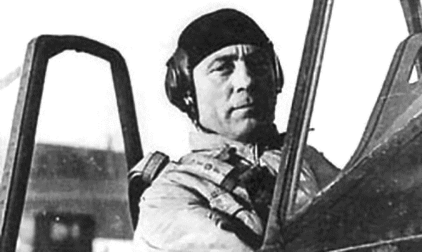
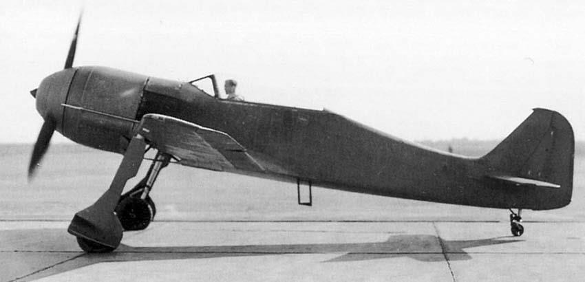
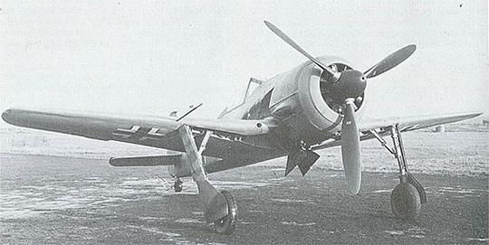

---
tags:
  - WWII
  - warbirds
  - Third Reich
  - Germany
  - FW190A8
---

# ИСТОРИЯ САМОЛЕТА
Проектирование самолета Фокке-Вульф 190 началось летом 1938 г. Курт Танк, возглавляющий
группу авиаконструкторов, предложил два варианта: один самолет был оснащен двигателем
Даймлер-Бенц (Daimler-Benz) DB 601 с жидкостным охлаждением, второй – новым по тем
временам звездообразным двигателем BMW 139 с воздушным охлаждением.

Опытный самолет Fw 190 V-1 был свободнонесущим низкопланом с крылом с работающей
обшивкой. Его первый полет состоялся 1 июля 1939г. Второй самолет, Fw 190 V-2, поднялся
в воздух в октябре 1939 года. Он был вооружен двумя 13-мм (0,51 дюйма) пулеметами MG 131
и двумя пулеметами MG 17 калибра 7,92 мм (0,31 дюйма).
Обе машины были оснащены большими обтекателями втулки воздушного винта, которые позже
были заменены на обтекатели NACA.
Перед тем, как второй опытный самолет совершил свой первый полет, было принято решение
заменить двигатель BMW 139 на более мощный, но при этом более длинный и тяжелый мотор
BMW 801.

Замена потребовала большого количества серьезных изменений, включая прочностное
усиление конструкции и перенос кабины ближе к хвостовой части фюзеляжа. Последнее
изменение решало проблемы центровки и устраняло дискомфорт экипажа от шума и перегрева
кабины вследствие близкого расположения двигателя. Третий и четвертый опытные самолеты
не были завершены, а самолет Fw 190 V5 с новым двигателем был построен в начале 1940г.
В конце 1940 года самолет получил новое крыло. Первоначальный его размах был увеличен
на 1 м (3 фута 3,5 дюйма). Хотя скорость Fw 190 V5g стала на 10 км/час (6 миль/час) ниже,
он был более маневренным и превосходил вариант с крылом меньшего размаха, получивший
обозначение Fw 190 V5k.

Из партии предсерийных Fw 190 A-0 первые семь машин имели крыло, как у первоначальной
модели, остальные - крыло большего размаха. Первое боевое подразделение было
укомплектовано этими самолетами в августе 1941 года.
Fw 190 A-1: Первые истребители Fw 190 A-1 покинули сборочный цех завода фирмы “Фокке-
Вульф” в Мариенбурге в июне 1941 года. В августе ежемесячный выпуск достиг 30 машин.
В этом же месяце начался лицензионный выпуск самолетов фирмой “Арадо” в Варнемюнде,
в октябре выпуск наладила фирма “АОГ” в Ошерслебене. Поэтому уже к концу сентября
в распоряжении люфтваффе имелось 82 самолета, а до конца октября удалось выполнить весь
контракт, выпустив 102 самолета. На одном из первых истребителей, получившим
обозначение Fw 190 A-1/U1 в качестве эксперимента установили двигатель BMW 801D-2.
Некоторые машины серии А-1 кроме радиостанции FUG 7а получили устройство определения
“свой-чужой” FuG 25. На всех серийных машинах имелось бронирование кабины, а также
бронированные топливный и масляный баки. Вооружение состояло из четырех пулеметов
MG 17 калибра 7,92 мм (0,31 дюйма).
Основной проблемой самолета, отмечаемой в рапортах технических офицеров, был перегрев
двигателя, становившийся причиной частых пожаров.
Было заказано 100 машин, оснащенных звездообразным двигателем BMW 801C-1 мощностью
1238 кВт (1660 л.с.), крылом большого размаха и рацией FuG 7a.
Серия Fw 190 A-2 была оснащена двигателем BMW 801С-2. Только тогда удалось устранить
перегрев задней звезды двигателя с помощью вентиляционных отверстий по бортам фюзеляжа
за двигателем. Такие же вентиляционные отверстия организовали и на всех самолетах серии
А-1, остававшихся в строю. Появились новые синхронизаторы, что позволило усилить
вооружение самолета, установив 20-мм пушки “Маузер” MG 151/20E у основания крыла вместо
пулеметов MG 17. При этом пришлось изменить форму крышек над пушечным отсеком
у основания крыла. Масса самолета увеличилась до 3850 кг. Вместо прицела Revi C/12C
на самолеты начали ставить прицелы Revi C/12D. Значительной доработке подвергся электро-
механический привод стоек шасси.
Fw 190 A-3: Весной 1942 года начался выпуск форсированного двигателя BMW 801D-2.
Самолеты получившие этот двигатель, получили наименование Fw 190 A-3. Новый мотор
развивал мощность до 1730 л.с., добиться этого удалось благодаря повышению степени сжатия
в цилиндрах и повышения оборотов обеих передач наддува. В свою очередь, это привело
к тому, что для мотора вместо бензина В4 (октановое число 87) потребовался бензин С3
(октановое число 96).
Вооружение стандартных А-3 осталось прежним, но на некоторых самолетах обкатывались
новые конфигурации. Преследовалась цель не только расширить оперативные возмож-
ности Fw 190 как истребителя, но и адаптировать его для решения новых задач. Некоторые
модификации не были систематизированы и известны только по фотографиям. Наиболее
известен вариант Fw 190 A-3, оснащенный бомбодержателем ETC 501, способный нести до 500
кг бомб (1x500 кг, 2x250 кг или 4x50 кг через переходник ER 4) или 300-литровый подвесной
бензобак. У некоторых истребителей снимали пару пушек MGFF в консолях крыльев, но это
не обозначалось каким-либо кодом. Кроме того, выпустили 72 Fw 190 Aa-3 (auslaendisch -
заграничный), их в октябре 1942 - марте 1943 года отправляли в Турцию. Большинство
экспортных Fw 190 несли вооружение, как на А-1, 4xMG 17 + 2xMGFF.
Поставки варианта Fw 190A-4 начались летом 1942 г. На нем устанавливалась радиостанция
FuG 16Z и закрепленная на киле радиоантенна. Серия А-4 оснащалась двигателем BMW 801D-2
адаптированным под систему впрыска водно-метаноловой смеси MW-50 для кратковременного
увеличения мощности до 1566 кВт (2100 л.с.), что давало увеличение скорости до 670 км/час
(416 миль/час) на высоте 6400 м (21000 футов). Самолет Fw 190A-4/Троп (Trop) имел фильтры,
позволявшие эксплуатировать его на Средиземноморье. Под фюзеляжем он нес бомбу весом
250 кг (551 фунтов). Впрыск смеси MW-50 на модели Fw 190 A-4/R6 отсутствовал. Этот вариант
самолета мог нести под крыльями две 210-мм (8,27 дюйма) ракетные пусковые установки
WGr.21. В случае установки только двух пушек MG 151 на Fw 190A-4/U8 можно было подвесить
сбрасываемые баки емкостью 300 л под каждым крылом и 500-кг бомбу (1102 фунта) под
фюзеляж.
Fw 190 A-5 вышел в серию в начале 1943г.; был оснащен новой моторамой, которая позволила
передвинуть двигатель почти на 15 см (6 дюймов) вперед. Вариантами Fw 190 A-5 были ночной
истребитель Fw 190 A-5/U2 с оборудованием для гашения пламени выхлопа, двумя пушками
MG 151/20, подфюзеляжным бомбодержателем ЕТС 501 и двумя сбрасываемыми баками
емкостью 300 л; подобный ему вариант Fw 190 A-5/U3 мог нести 500-кг (1102 фунта) бомбу под
фюзеляжем и две 115-кг (254 фунта) бомбы под крыльями; для выполнения разведывательных
операций на модели Fw 190 A-5/U4 были установлены две фотокамеры Rb 12. Истребительно-
бомбардировочными вариантами были самолет Fw 190 A-5/U6 и модель с большой дальностью
полета Fw 190 A-5/U8; самолет Fw 190 A-5/U11 для поддержки наземных войск, на котором
были установлены 30-мм пушки MK 103 под каждым крылом; самолет Fw 190 A-5/U12 имел
несъемное вооружение из двух пушек MG 151/20 и двух пулеметов MG 17, а также два
контейнера WB 151A, каждый с пушкой MG 151/20. Торпедоносцы были способны брать на борт
торпеду LTF5b или LT 950 и получили обозначение соответственно Fw 190 A-5/U14 и Fw 190
A-5/U15. 30-мм пушка MK 108 в консоли крыла была принята в качестве стандартной для
модели Fw 190 A-5/U16.
Fw 190 A-6, разработанный на базе экспериментальной модели Fw 190 A-5/U10 и построенный
в июне 1943г., отличался тем, что вместо пушек MGFF самолеты несли пушки MG 151/20E
калибра 20 мм. Чтобы провести эту замену, следовало приспособить крыло под размещение
более тяжелой пушки и разместить более вместительный контейнер с боекомплектом.
Конструкцию крыла изменили так, что оно стало подготовленным для установки пушек калибра
20 и 30 мм с боекомплектом. Кроме того, самолеты А-6 стандартно оснащались
радиостанцией FuG 16ZE с дополнительной кольцевой антенной радиопеленгатора. Такую же
радиостанцию имело несколько машин серии А-5. Серийный выпуск серии А-6 начался в июле
1943 года и продолжался до ноября. Стандартным вооружением самолетов Fw 190 A-6 было
два MG 14 и четыре MG 151/20E. Некоторые машины несли бомбодержатель ETC 501, который
использовался обычно для подвески 300-литрового бака. У самолетов серии А-6 модификации
отмечались кодом Ruestsatz. Было собрано 569 машин.
С ноября 1943 года начался выпуск самолетов Fw 190 A-7, представлявший собой серийный
вариант самолета А-5/ U9, у которого под капотом вместо двух MG 17 стояли два 13-мм
пулемета MG 131. В связи с этим на верхней части капота появились характерные выпуклости,
объясняемые большим размером крупнокалиберных пулеметов. Прицел Revi C/13D заменили
новым прицелом Revi 16B. У колес шасси установили усиленные ободы, которые до того
использовались только на самолетах серии F.
Как правило, самолеты оснащались бомбодержателем ETC 501, позволявшим брать или бомбы
или 300-литровый бак. Небольшое число самолетов вместо бомбодержателя получило только
легкий держатель для бензобака. У некоторых самолетов вооружение уменьшили до
двух MG 131 и двух MG 151/20E. Данные самолеты предназначались для ведения маневренных
боев с истребителями противника. Для стандартной конфигурации предусматривались
комплекты Ruestsatz (R1, R2, R6).
Один самолет А-7 (W.Nr. 380394) использовался для испытаний новых подвесных бензобаков
“Doppelreiter”, имевших усовершенствованную аэродинамику. Каждый из двух баков вмещал по
270 л топлива. Их подвешивали к верхней стороне крыла, что должно было уменьшить
аэродинамическое сопротивление и лишь немного уменьшить скорость самолета. Вооружение
самолета состояло всего из двух пушек МG 151 /20Е. Работы над новыми баками велись
в исследовательском центре FGZ (ForschungsanstaltGrafZeppelin) под руководством инженера
Иземанна. Хотя результаты испытаний оказались благоприятными, в серию новые баки
не пошли, так как их внедрение привело бы к временному падению производства.
В январе 1944 года, после выпуска всего 80 экземпляров Fw 190 A-7, их производство свернули
в пользу новой серии А-8.
Модификация Fw 190 A-8 отличалась от предыдущей прежде всего комплектацией. Планер
самолета был приспособлен для установки устройства GM-1. Бак объемом 85 л монтировался
в хвостовой части фюзеляжа. При необходимости этот бак заменялся на 115 л топливный. Бак
сместил центр тяжести самолета к хвосту, чтобы скомпенсировать этот недостаток
бомбодержатель ETC 501 сместили на 20 см вперед. Сам же бомбодержатель, начиная с серии
А-8, стал стандартной деталью, устанавливаемой на все самолеты. На самолеты установили
радиостанцию FuG 16ZY, поэтому кроме кольцеобразной антенны радиопеленгатора под левым
крылом появилась антенна типа “Моран”. Характерная деталь самолета, позволяющая
отличить А-8 от А-7 – трубка Пито, которую перенесли со средней части передней кромки
правого крыла на его законцовку. На Fw 190 A-8 устанавливалось вооружение в составе двух
пулеметов MG 131 и четырех пушек MG 151.

Всего было построено около 20000 самолетов Focke-Wulf 190 A.
