---
tags:
  - WWII
  - warbirds
  - Third Reich
  - Germany
  - FW190A8
---

# КОНСТРУКЦИЯ САМОЛЕТА

## Описание
Focke-Wulf FW 190 A-8 - одноместный истребитель-моноплан, оснащенный 2-рядным
14-цилиндровым двигателем BMW 801D-2 с двухскоростным нагнетателем, понижающим
редуктором и 12-лопастным вентилятором охлаждения, имеет высокую скорость и хорошую
маневренность. Может также применяться в роли истребителя-бомбардировщика, оснащенного
авиабомбами или в роли истребителя дальнего радиуса действия, несущего подфюзеляжный
топливный бак.
Силовая установка – двигатель BMW 801D-2, развивает мощность 1500 л.с. при 2400 об/мин.
Экстренная боевая мощность в горизонтальном полете достигает 1705 л.с. при 2700 об/мин.
Самолет оборудован трехлопастным воздушным винтом постоянных оборотов.
Диаметр винта – 3.3 м.

Блок Kommandogerät – центральный пост управления – контролирует и автоматически
регулирует обороты воздушного винта, наддув, качество топливной смеси, опережение
зажигания, переключает скорости нагнетателя.

Фюзеляж состоит из дюралевой обшивки, покрывающей раму-монокок. Между передней
секцией и задней частью кабины расположены четыре лонжерона и горизонтальная
перегородка, отделяющая кабину от топливных баков.
Задняя секция фюзеляжа – монокок с каркасом из легкого сплава.

Радиооборудование: FuG 25a – блок опознавания свой-чужой, FuG 16ZY – VHF установка для
коммуникаций и наведения.
Крыло низкорасположенное, представляет собой цельнометаллическую конструкцию. Главный
лонжерон - сплошной, задний разделен фюзеляжем.
Горизонтальное и вертикальное хвостовое оперение расположено симметрично на хвостовой
секции, элероны на внешних консолях задней части крыла. Посадочные щитки размещены
между элеронами на задней нижней поверхности крыльев.
Руль высоты и элероны приводятся в движение ручкой управления самолетом, руль
направления - ножными педалями. Привод горизонтального стабилизатора и щитков
электрический. Согласованное движение электроприводов щитков достигается синхронными
переключателями.
Вооружение состоит из двух синхронных 13-мм пулеметов MG 131, двух синхронных пушек
Mauser MG 151/20Е, установленных в корневой части крыла и двух пушек Mauser MG 151/20Е,
расположенных в консолях крыла.

Массогабаритные характеристики FW 190 A-8:

- Размах крыла - 10,5 м.
- Площадь крыла - 18,3 м2.
- Длина самолета - 8,95 м.
- Высота самолета - 3,95 м.
- Вес пустого - 3490 кг.
- Взлетный вес - 4909 кг.

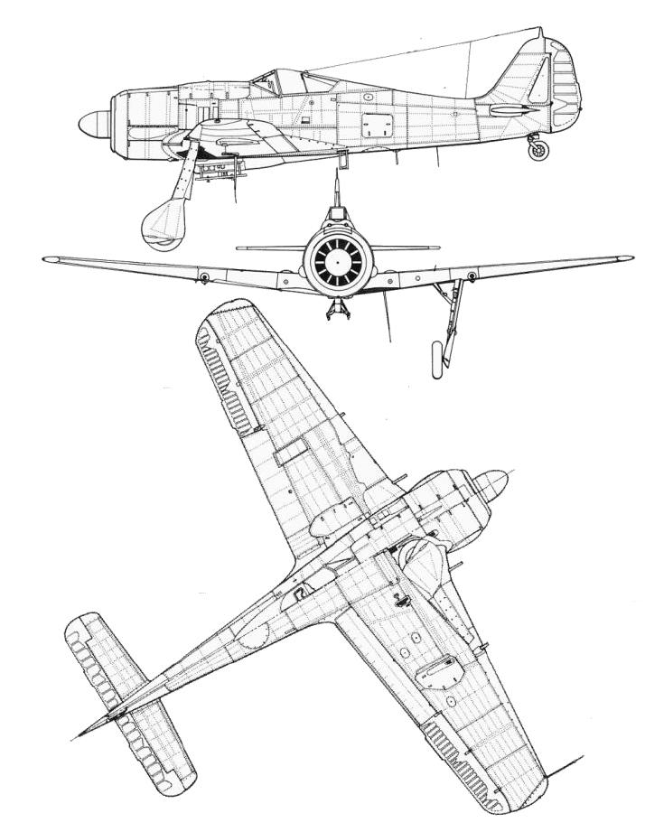

## Общая компоновка самолета Fw 190 A-8

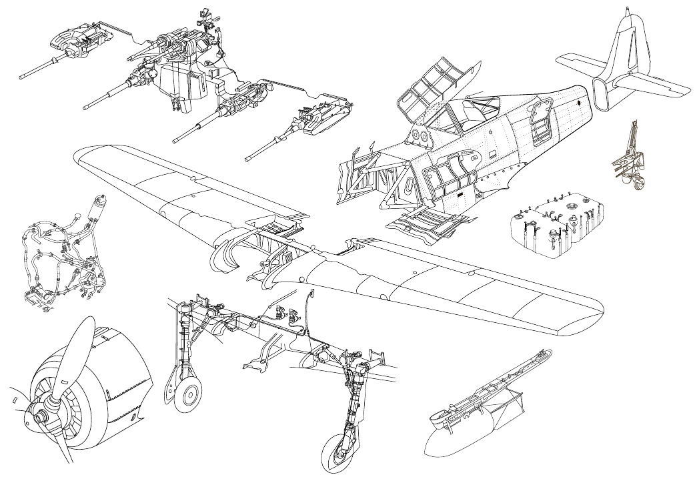

## Фюзеляж
Фюзеляж FW 190 A-8 представляется собой монокок с цельнометаллической дюралевой
обшивкой. В передней части фюзеляжа находится моторама, повторяющая контуры двигателя,
сзади завершается овальной переборкой, к которой крепится хвостовой узел. Конструктивно
фюзеляж разделен на две основные части – переднюю, от противопожарного до восьмого
шпангоута, и заднюю, от восьмого до четырнадцатого.
Моторама крепится к противопожарному шпангоуту. Кабина пилота и основные топливные
баки размещены в передней части фюзеляжа.
Отсек для оборудования размещен в задней части фюзеляжа. Там же расположена тканевая
перегородка, препятствующая попаданию выхлопных газов двигателя в кабину пилота.
Передняя часть кабины имеет четыре лонжерона между носовой противопожарной
перегородкой и задним шпангоутом; задняя часть кабины имеет горизонтальную переборку,
отделяющую ее от топливных баков; задняя секция фюзеляжа - монокок, состоит из элементов
набора, заканчивается шпангоутом, к которому крепится хвостовая секция.

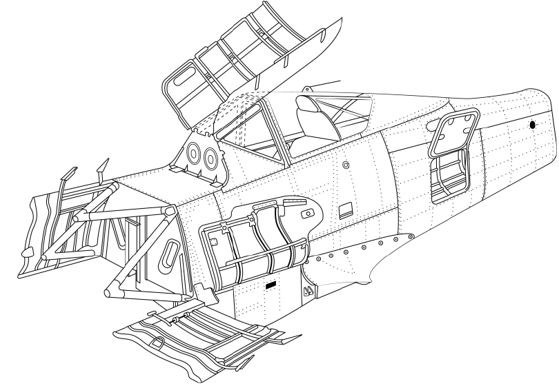

## Фонарь
Кабина Fw 190 A-8 имеет продольно скользящий выпуклый фонарь из плексигласа
на роликовых подшипниках. Блок лобового остекления состоит из трех пуленепробиваемых
стеклянных панелей. Переплет также служит как панель крепления вооружения, прицела
и инструментов, также является узлом крепления люка фюзеляжного вооружения. Лобовое
стекло смонтировано в металлическом каркасе.
Фонарь оборудован бронеспинкой, защищающей пилота от обстрела сзади.
Открытие и закрытие фонаря производится рукояткой-штурвалом, расположенной на правом
борту кабины. При необходимости фонарь может быть сброшен при помощи специального
рычага.

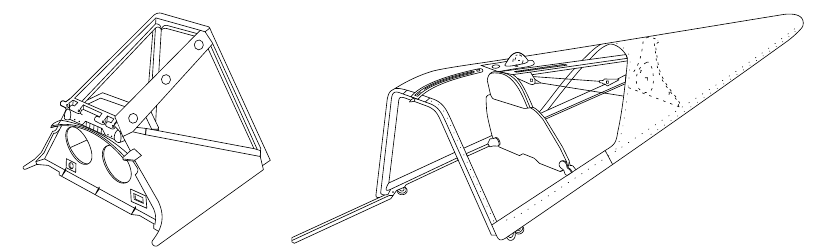
К середине войны технологические достижения в термоформовке позволили придавать
панелям из оргстекла сложные формы, что привело к возможности создавать "чистые" фонари
без переплетов, которые давали улучшенный обзор.

Пилот FW 190 сидел выше, чем пилоты многих других современных самолетов и только
металлический каркас передней части фонаря ограничивал его обзор. Дальнейшие работы
в этой области привели к созданию более удачного варианта, впервые примененного
на штурмовом варианте FW 190F-2 и быстро адаптированного к другим вариантам, таким как
А-8 и F-8. Удобный при атаке наземных целей, он давал преимущества и в воздушном бою.
Иногда называемый "каплевидным", новый фонарь больше походил на фонарь Малколма,
использовавшийся на поздних вариантах Spitfire и Р-51В и С.

На Fw 190 A-8 на протяжении всего периода экслуатации использовались оба типа фонарей.
Первые серийные образцы выпускались с ранним типом фонаря.

## Броня

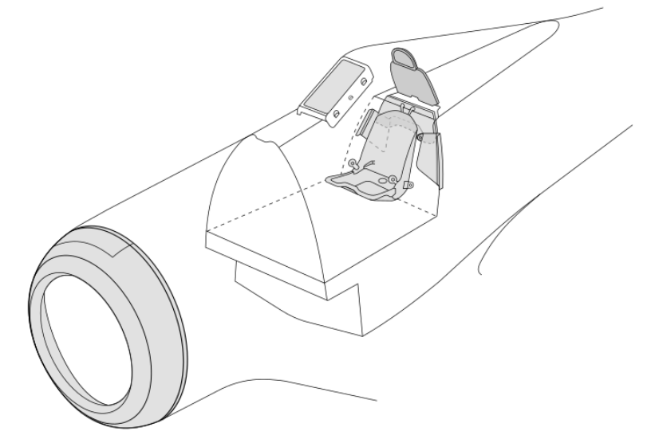
Бронирование обеспечивает летчику всестороннюю защиту, которая включает
бронезаголовник, бронеспинку сиденья, а также структурные металлические стенки кабины.

Броневым кольцом защищена передняя часть капота двигателя и масляный бак
с маслорадиатором.

## Крыло
Крыло Fw 190 A-8 представляет собой цельнометаллическое двухлонжеронное крыло-монокок.
Главный лонжерон неразрывный, проходит через фюзеляж и соединяет обе секции крыла.

Задний лонжерон состоит из двух частей, каждая из которых крепится к фюзеляжу. Каждое
крыло горизонтально разделено на верхнюю и нижнюю панели.

На нижней панели расположен главный лонжерон, а на верхней - задний лонжерон. В крыле
размещены пушки, шасси, механизмы управления элеронами, щитками и электроприводы.
На главном лонжероне также расположены узлы крепления крыльевых пушек и шасси.

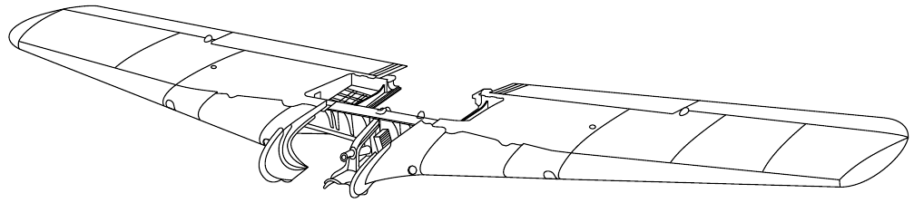

## Шасси

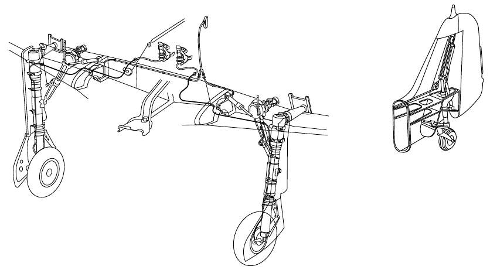
Шасси трехстоечное, состоит из двух амортизированных стоек с двухзвенным шарнирным
механизмом, соединяющим среднюю и нижнюю части стойки, гасящим разворачивающий
момент колеса, и хвостового колеса.
Передние стойки шасси крепятся непосредственно к главному лонжерону.
Каждая стойка шасси приводится в действие индивидуальным электромотором, установленным
на главном лонжероне.

Шасси убираются внутрь крыла, в убранном положении стойки и колеса располагаются
в нишах перед главным и закрываются обтекателями.
Основные стойки фиксируются в убранном положении мощными замками.
Хвостовое колесо частично убираемое, может вращаться на 360 градусов, либо фиксироваться
взятием ручки управления самолетом на себя.
Правая стойка шасси имеет тросовое соединение с хвостовым колесом, которое убирает его
синхронно с основными.
При уборке шасси хвостовое колесо фиксируется в верхнем положении тросом, соединенным
с правой основной стойкой. После уборки нижняя часть хвостового колеса остается снаружи,
и в аварийной ситуации может использоваться в качестве костыля и предотвратить
повреждение хвостовой части.
В случае отказа электромоторов шасси может быть выпущено с помощью аварийной рукоятки.
Она разблокирует стойки, которые опустятся под действием силы тяжести и газовых пружин.
Положение основных стоек шасси контролируется по прибору в кабине и визуально,
по штыревому индикатору.

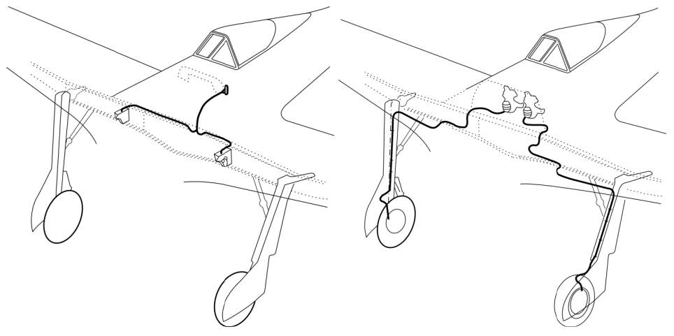
На каждом колесе основных стоек шасси Fw 190 A-8 установлены гидравлические тормозные
системы, с собственными гидроцилиндрами и тормозными магистралями. Каждым колесом
можно тормозить индивидуально.
Емкость бака гидравлической жидкости для блока управления – 5.6 литра.

Торможение традиционно управляется педалями руля направления.

## Система управления полетом

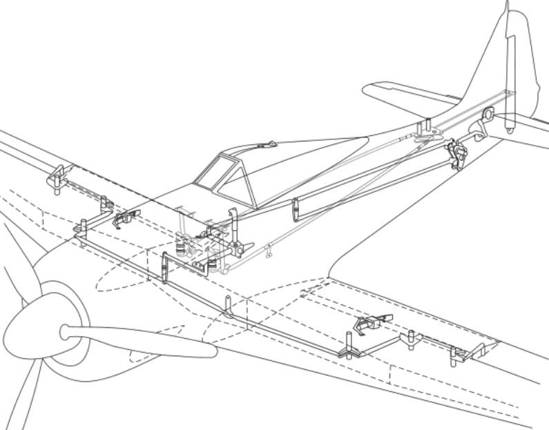
Fw 190 A-8 имеет традиционную схему управления, включающую киль и стабилизатор, руль
направления, руль высоты, элероны и щитки.
Машина очень устойчива в полете, поэтому в воздухе триммируется только стабилизатор.
Остальные поверхности управления не имеют приводов триммера, оборудованы пластинами,
регулируемыми на земле.
Рулевые поверхности – легкосплавные, с тканевой обшивкой, за исключением передних
кромок, сконструированы, чтобы давать аэродинамическую и весовую компенсацию.
Металлическая работающая обшивка хвостового оперения интегрирована в конструкцию
фюзеляжа.
Вертикальное оперение состоит из киля и руля направления.
Киль – цельнометаллический, крепится к хвостовой секции фюзеляжа, внутри размещен
диагональный лонжерон, к которому крепятся стабилизатор и блок хвостового колеса.
Горизонтальное оперение – симметричное, трапециевидной формы со скругленными
законцовками.

Стабилизатор может быть отрегулирован в полете, чтобы сбалансировать самолет на разных
режимах полета. Перестановка производится электромотором, размещенным внутри киля.
Может устанавливаться в пределах от +4 до -1 ° во время полета.
Переключатель положения стабилизатора расположен на левой панели кабины. Включение
электропривода осуществляется нажатием и удержанием переключателя до поворота
стабилизатора на нужный угол. Положение стабилизатора отражается на соответствующем
индикаторе.
Руль высоты состоит из взаимозаменяемых половин, прикрепленных к стабилизатору
на шарнирах, и имеет аэродинамическую и весовую компенсацию. Отклоняется до 30° ± 2°
вверх и до 25°±1° вниз.
Руль направления имеет конструкцию, сходную с рулем высоты, и подвижно крепится на киле
в трех точках.
Руль направления имеет металлический каркас с лонжероном и семью нервюрами
и полотняную обшивку. Вследствие хорошей продольной устойчивости самолета в полете,
также триммируется на земле путем регулировки пластины. Отклоняется в пределах
от 30° ± 2° вправо до 30° ± 2° влево.
Элероны конструктивно не отличаются от других рулевых поверхностей – легкосплавный
каркас с полотняной обшивкой. Они также имеют весовую компенсацию и настраиваемые
на земле триммеры. Отклоняются в пределах от 17° ± 2° вверх до 17° ± 2° вниз.
Посадочные щитки раздельные, имеют идентичную конструкцию и полностью взаимоза-
меняемы, управляются электроприводом и имеют три фиксированных положения: полетное,
взлетное и посадочное. Стандартное взлетное положение щитков - отклонены вниз
на 13° ± 2°; посадочное положение - полностью отклонены вниз на 58° ± 3°.
В промежуточные положения щитки устанавливаться не могут.
В системе управления используются дифференциальные двойные рычаги (качалки), которые
преобразуют управляющее движение у центра в более эффективный поворот рулевой
поверхности.
Ручка управления перемещается вперед и назад для обычного управления рулями высоты.
Пределы хода ручки: 20,5° вперед и 21,5° назад.
Ручка управления также перемещается в стороны для управления элеронами. Отклонение
элеронов имеет механическое ограничение на основании ручки. Управление положением
щитков осуществляется кнопками на левой панели кабины.

## Двигатель
Fw 190 A-8 оснащен 14-цилиндровым двухрядным радиальным двигателем BMW 801D-2
с двухскоростным нагнетателем, редуктором и 12-лопастным вентилятором охлаждения.
Двигатель вращает трехлопастный винт постоянных оборотов.

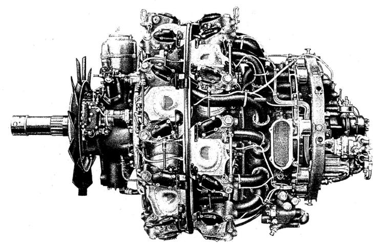
Как большинство немецких авиационных двигателей, BMW 801D-2 был оборудован системой
непосредственного впрыска топлива.

## Система зажигания
Инерционный стартер, используемый для запуска двигателя, может раскручиваться вручную
или электроприводом.
Вал стартера расположен на левой стороне двигателя, в отсеке оборудования. Электрический
переключатель стартера расположен на правой панели кабины.
В случае ручного запуска щетки стартера отводятся ручкой, которая находится на левой
нижней части приборной панели.
Зажигание обеспечивается системой двойного магнето производства Bosch, смонтированной
в носовой части двигательного отсека.
Обе электроцепи изолированы друг от друга; одна обслуживает свечи зажигания
расположенные около впускных, другая - около выпускных клапанов.
Каждая свеча работает индивидуально, задержки зажигания контролируются прибором
управления.

## Нагнетатель
Двигатель BMW 801D-2 оборудован приводным одноступенчатым двухскоростным
нагнетателем.
Поступающий воздух, подаваемый вентилятором, расположенным перед двигателем, через
два канала на обеих сторонах обтекателя идет в два воздухозаборника, внутри которых
установлены воздушные фильтры.

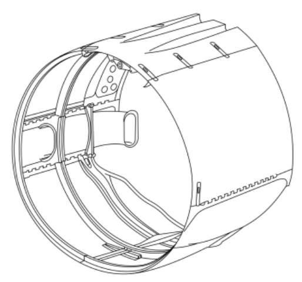

## Kommandogerät - центральный пост управления
Центральный пост управления — это гидромеханическое многофункциональное устройство,
которое существенно упрощает управление двигателем, снимая с летчика необходимость
постоянного прямого воздействия на такие подсистемы, как автомат наддува,
автоматический переключатель скоростей нагнетателя, регуляторы постоянных оборотов,
смеси и опережения зажигания. Пилоту нужно лишь передвинуть рычаг управления
двигателем (РУД), чтобы установить по прибору нужное давление наддува, а центральный пост
управления установит остальные параметры двигателя так, чтобы он оптимально работал при
заданном давлении наддува в текущих условия полета.
Также устройство обеспечивает запуск и работу двигателя на холостом ходу.
Объединение устройств автоматики в компактный блок позволило существенно уменьшить
количество необходимых органов системы управления, и повысить ее надежность и живучесть.

## Воздушный винт
FW 190 A-8 оснащен трехлопастным винтом постоянных оборотов VDM 9-12153 В
с металлическими лопастями. Диаметр винта 3300 мм (10’10’’).
Угол поворота лопастей в полете регулируется автоматически с помощью центрального поста
управления.
В случае отказа автоматики или при необходимости угол может также регулироваться вручную
при помощи независимого электропривода.
Устройство управления изменением угла поворота лопастей, сопряженное с приводящим
двигателем и регулятором оборотов, расположено в левой передней части двигателя.

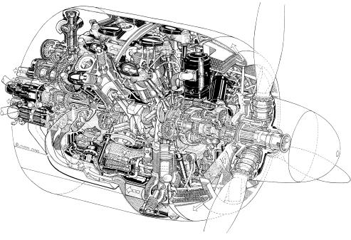

## Топливная система
На Fw 190 A-8 установлено два основных топливных бака: передний (Vorn) и задний (Hinten),
расположенных под полом кабины.

Баки самозатягивающиеся, общей емкостью 524 литра (388 кг): 232 литра (172 кг) передний
и 292 литра (216 кг) задний.

Бак заливающего насоса емкостью 3 литра встроен в задний топливный бак.

Сбрасываемый бак емкостью 300 литров может быть установлен под фюзеляжем на держатель
ETC 501.
Бензонасос с приводом от двигателя питает его топливом при нормальном давлении 1-2 кг/см^2^.
Для предотвращения образования пробок из паров бензина на высоте, и обеспечения
устойчивой подачи топлива в каждом баке установлен электрический подкачивающий насос.
Подкачивающие насосы также являются резервными в случае отказа основного насоса.
За восьмой переборкой может устанавливаться топливный бак емкостью 115 литров, либо бак
для смеси GM-1 на 85 литров.

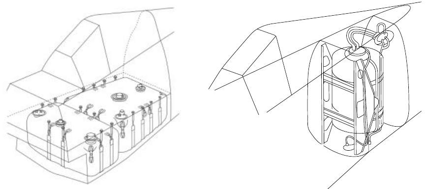

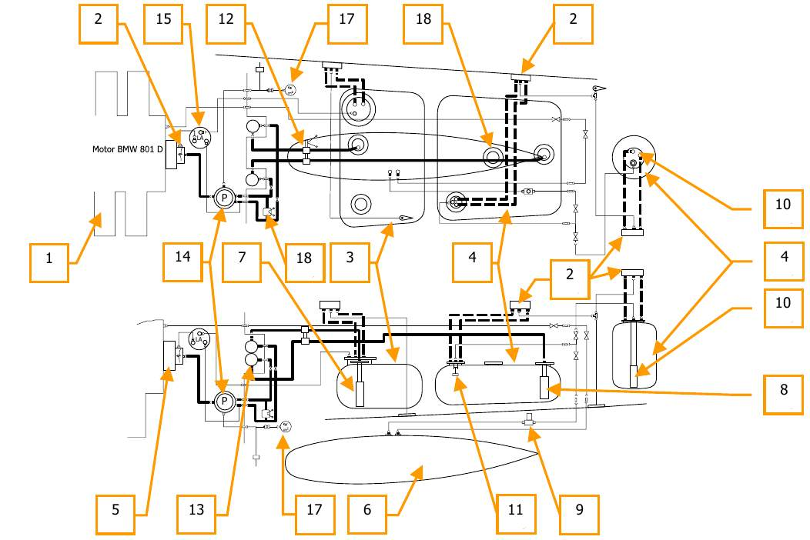

1. Двигатель BMW 801D-2 
1. Заливные горловины                
1. Передний бак (232 л.)             
1. Задний бак (292 л.)               
1. Дополнительный бак (115 л.)       
1. Подвесной бак                     
1. Подкачивающий насос переднего бака
1. Подкачивающий насос заднего бака  
1. Подкачивающий насос подвесногo бака  
1. Подкачивающий насос дополнительного бака              
1. Ограничительный клапан вспомогательной топливной магистрали (открыт при остатке в заднем баке 240 л.)
1. Топливный селектор и перекрывные клапаны переднего и заднего топливных баков
1. Топливные фильтры
1. Насос двигателя
1. Топливный пароотделитель
1. Топливно-масляной манометр
1. Кран кольцевания топливной магистрали
1. Бак заливочного топлива (3 л.)

## Система предварительной заливки

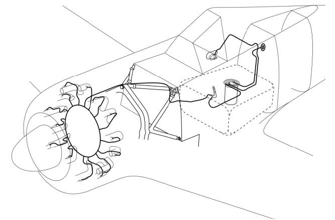
Система предварительной заливки предназначена для подготовки запуска двигателя путем
распыления топлива из отдельного бака во впускной коллектор ко всем 14 цилиндрам для
обогащения смеси.

Система состоит из насоса AP 20 SUM и бака емкостью 3 литра, с подводными шлангами.

## Система смазки
Система смазки интегрирована с двигателем и не входит в конструкцию планера,
за исключением указателей давления и температуры масла. Радиатор и маслобак объемом
58 л (рабочий объем 55 м) имеют кольцеобразную форму и располагаются в передней части
двигателя под бронированным кожухом.
Все элементы соединяются с маслофильтром системой трубопроводов с кранами. Масляная
система допускает возможность заправки горячего масла или масла, разведенного бензином,
что облегчало холодный пуск двигателя. Циркуляция масла принудительная, обеспечивается
маслонасосом, температура масла поддерживается автоматически с помощью термостата.
Давление масла ограничивается двухрежимным (по температуре масла) регулятором давления.

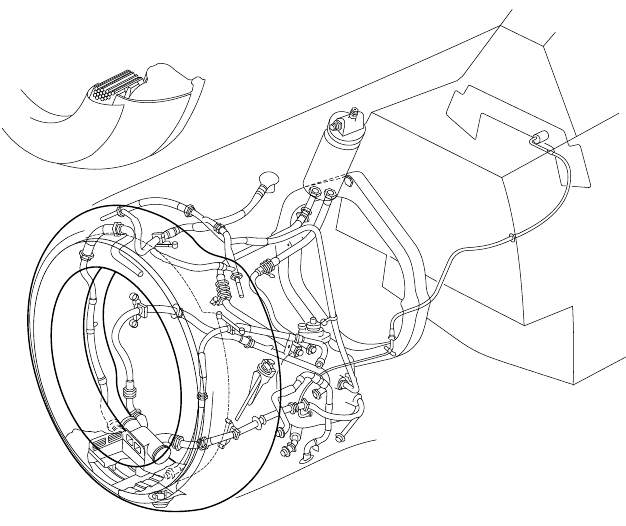

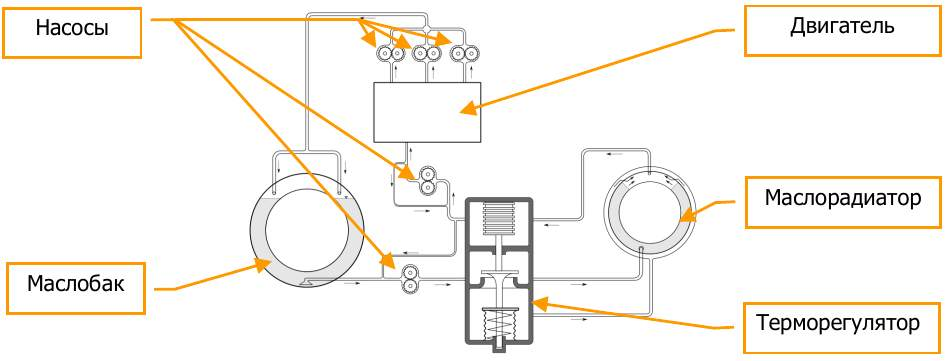

## Система электропитания

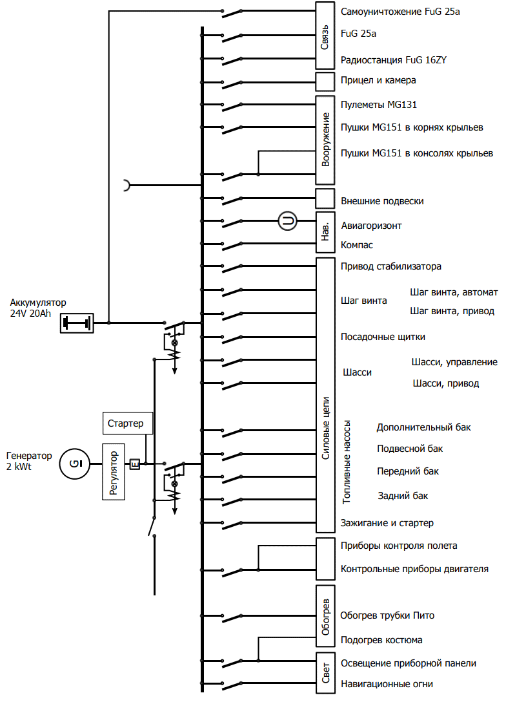

## Кислородная система
Система кислородного питания состоит из 9 двухлитровых сферических кислородных
баллонов, расположенных в хвостовой части фюзеляжа самолета, магистралей высокого
давления с манометром, крана с индикатором подачи кислорода, регулятора со шлангом
и маски. В целях безопасности баллоны разделены на три отдельные группы.

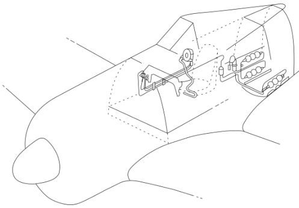
При открытии крана начинается подача кислорода из баллонов к регулятору. Индикатор
подачи кислорода и манометр, расположенные справа на передней приборной панели,
отображают состояние системы.

## Радиооборудование
Самолет оборудован радиостанцией FuG 16ZY - бортовым УКВ приемопередатчиком. FuG 16ZY
используется для радиосвязи в полете, в системе госопознавания "свой-чужой" (в сопряжении
с изделием FuG 25a), а также для радионавигации. Система работает в диапазоне частот
38,5 - 42,3 МГц.
FuG 16ZY может работать в режиме "Leitjäger" или лидера группы истребителей, который
позволяет использовать систему "Y-Verfahren"- коррекцию направления полета
по направленному радиолучу через обычные наушники.
Компонент AFN-2, являющийся частью радиооборудования самолета, обеспечивает навигацию
для возвращения на аэродром по наземным радиомаякам, указывая направление и дальность
(условно) на простом индикаторе, установленном в кабине пилота.
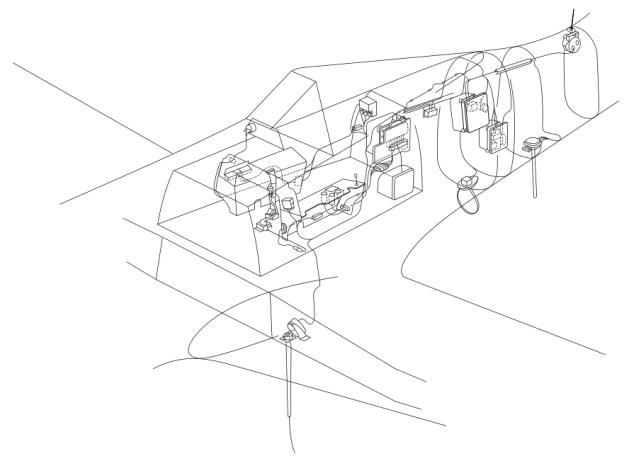
Изделие FuG 25а "Erstling" (Дебют) - одна из первых в мире систем опознавания "свой-чужой",
которая позволяет наземным РЛС идентифицировать самолет как дружественный. Система
настроена на импульсы немецких радарных станций ПВО типа "Freya" или "Würzburg". РЛС
посылает кодовое слово, FuG 25а отвечает условным сигналом, по которому наземная станция
идентифицирует самолет как дружественный. FuG 25а работает на частоте 125±1,8 МГц на
дальности до 100 км.

## Вооружение
Базовое вооружение FW 190 A-8 состоит из двух 13-мм пулеметов MG 131 Rheinemetall-Borsig
с боекомплектом в 475 патронов на ствол, установленных под обтекателем над двигателем,
двух синхронных пушек Mauser MG 151/20Е с боекомплектом в 250 снарядов на ствол,
установленных в корневой части крыла и двух пушек Mauser MG 151/20Е с боекомплектом
в 125 снарядов на ствол, расположенных в консолях крыла.
Оружие, размещенное над двигателем и в корне консолей крыла, синхронизировано для
ведения огня через лопасти пропеллера; MG 151/20E, установленные в консолях крыла
синхронизаторами не оборудован.
Пулеметы стандартно настраивались параллельно, пушки в корнях и консолях крыла на
сведение 600м и 400м, соответственно.

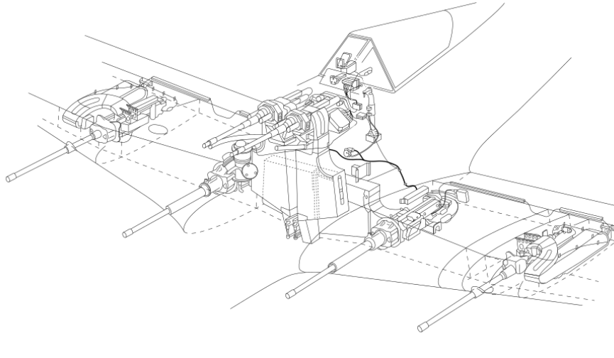

Fw 190 A-8 комплектуется подфюзеляжным бомбодержателем ETC 501 и может дополнительно
нести бомбу SC500 весом 500кг, либо ракеты WG 21 на подкрыльевых подвесках.

## Прицельное оборудование
Наведение на цель при стрельбе на Fw 190 A-8 обеспечивается прицелом Revi 16B,
получившим на тот момент широкое распространение в самолетах Люфтваффе.

Revi 16B представляет собой прицел, сконструированный для применения с установленным
авиационным вооружением, оборудованный встроенным реостатом для регулировки яркости
сетки и ночным фильтром.

Коллиматорные прицелы используют принцип проецирования изображения прицельной
сетки на стекле отражателя в бесконечность, и обеспечивают неподвижную точку
прицеливания относительно линии огня оружия самолета.

При использовании Revi 16B в бою летчик должен самостоятельно вносить поправки
на упреждение цели, перегрузку, расстояние до цели и другие параметры, необходимые
для точной стрельбы.
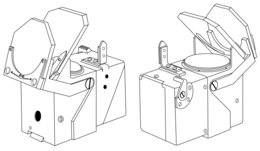

## Фотофиксирующее оборудование
На истребители Fockewulf устанавливается фотокинопулемет “Ballistische Schußmeßkammer”
BSK 16. Оборудование монтируется на регулируемой платформе в передней кромке панели
левого крыла и подключается к электроцепи самолета. Объектив камеры находится в передней
кромке крыла и прикрыт обтекателем со стеклянным окном. Прозрачная стеклянная панель
может заменяться цветным фотофильтром.

BSK16 – это 16-миллиметровая кинокамера. Длина ленты 15 метров, лента приводится
в движение электромотором в камере. Мотор оснащен переключателем, который ограничивает
движение ленты отрезками 3,75 м., что позволяет сделать 4 фрагмента от 43 до 57 секунд
каждый. Нажатие на гашетку запускает работу камеры, также камера запускается нажатием
кнопки на ручке управления двигателем, что позволяет вести съемку без открытия огня.

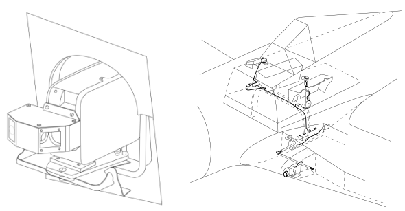

{!abbr.md!}
