---
tags:
  - WWII
  - warbirds
  - Third Reich
  - Germany
  - FW190A8
---

# КАБИНА

Оснащение кабины FW 190 A-8 имеет дизайн, обеспечивающий эргономичное размещение
и доступность пилоту всех органов управления. Такой подход в значительной степени
является прообразом кабин современных истребителей с реализованной концепцией HOTAS.
В этом отношении FW 190 выгодно отличался от своего основного конкурента Bf 109.

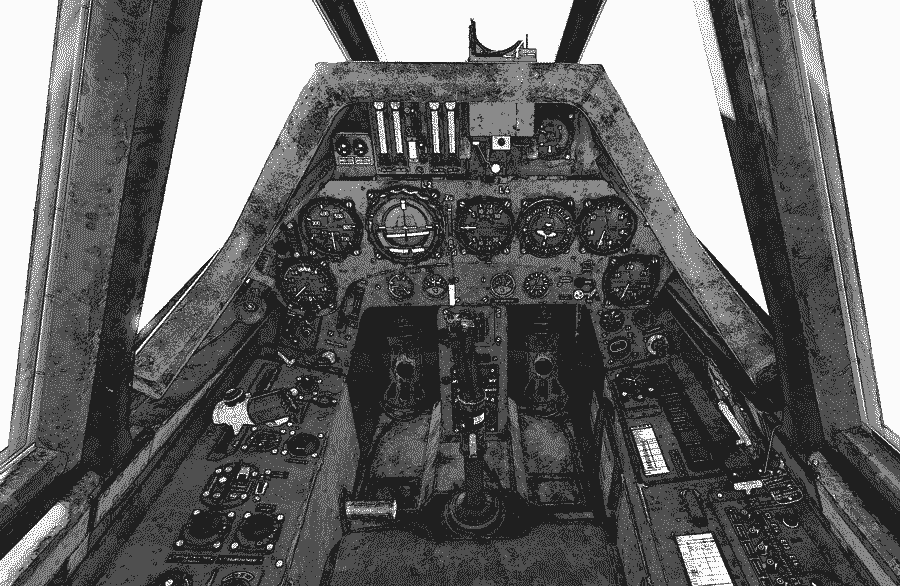
Кабина условно разделена на три основных части: переднюю панель, которая включает
приборную доску, управление топливными баками, створками радиатора и прицел; левую
панель со средствами управления двигателем, шасси и радиостанцией, и правую панель,
на которой расположено управление фонарем, кислородным обеспечением и переключатели
электросистемы самолета.

## Передняя панель
Передняя панель кабины включает в себя приборную доску и прицел REVI 16B.

1.  Прицел Revi 16B
2.  Тумблеры включения пулеметно-пушечного вооружения
3.  Счетчик боеприпасов SZKK 4
4.  Лампы индикации пулеметов
5.  Авиагоризонт/Указатель поворота и крена
6.  Указатель скорости
7.  Высотомер
8.  Ручка управления самолетом (РУС)
9.  Табло системы радионавигации AFN-2
10. Вариометр
11. Репитер магнитного компаса
12. Индикатор давления нагнетателя (индикатор наддува)
13. Тахометр (индикатор оборотов двигателя)
14. Кран ручного управления створками радиатора

1.  Рукоятка аварийного сброса подфюзеляжной подвески
2.  Рычаг селектора топливных баков
3.  Рукоятка аварийного выпуска шасси
4.  Ответчик свой/чужой
5.  Кран кольцевания топливной системы
6.  Рукоятка уборки щеток стартера
7.  Топливно-масляный манометр
8.  Индикатор температуры масла
9.  Топливомер
10. Индикатор шага винта
11. Переключатель топливомера
12. Держатель ракетницы
13. Манометр кислородной системы
14. Кран кислородной системы
15. Индикатор работы кислородной системы
16. Блок управления 21-см ракетами
17. Блок переключения режимов взрывателей бомб

## Передняя панель: приборы и органы управления
В этом разделе подробно рассматриваются все приборы и органы управления, расположенные
на передней панели.

### Прицел Revi 16B

Прицел Revi 16B имеет два элемента управления: регулятор яркости и светофильтр.

Регулятор яркости расположен сверху справа на корпусе прицела. Передвигая регулятор
вперед-назад, можно настраивать яркость прицельной сетки в зависимости от текущих условий
освещенности. Крайнее заднее положение соответствует максимальной яркости, в крайнем
переднем положении лампа прицела отключена.
Светофильтр прицела – это дополнительное затемненное стекло, которое можно установить
перед стеклом отражателя. Светофильтр используется при ярком дневном свете, когда
максимальной яркости прицела недостаточно.

Прицельная сетка Revi 16B имеет следующую разметку:

- Перекрестие со шкалами, имеющими цену деления 1 градус
- Прицельный круг радиуса 50 миллирадиан (диаметр, соответственно, 100 миллирадиан).

1 миллирадиан соответствует приблизительно угловому размеру цели в 1 метр на дистанции
1000 метров. Угловой размер прицельного круга составляет 100 миллирадиан (5.73°), что
соответствует цели с линейным размером 10 м на дистанции 100 м, таким образом диаметр
прицельного круга составляет 1/10 дальности.

Прицельная сетка Revi 16B позволяет определять приблизительную дистанцию до цели по ее
базе - размаху крыла. При расчете дистанции необходимо ориентироваться на степень
заполнения целью прицельного круга. Дистанция до цели рассчитывается как база цели,
умноженная на десять. Формула справедлива только при полном заполнении прицельного
круга целью; если цель заполняет половину круга, итоговое значение необходимо умножить
на два, и так далее.

Например, размах крыльев самолета-цели составляет 20 метров, цель заполняет прицельный
круг, не выступая за его границы, соответственно, дистанция составит 10 х 20 = 200 м. Если
самолет заполняет половину круга, дальность до него составляет 400 метров.

Кроме основного коллиматорного прицела, на самолете имеется резервный механический
прицел-дублер, расположенный на левой стороне корпуса Revi 16B. Линия прицеливания
строится путем совмещения концов V-образного прицела на вертикальной планке с кончиком
A-образной мушки на левой стороне рамки отражателя.

### Приборная панель
#### Счетчики боеприпасов
Счетчик SZKK 4 показывает остаток боеприпасов для MG 151. Четыре вертикальных шкалы
отражают состояние магазинов, соответственно, пушки МG 151, размещенной в консоли
левого крыла, МG 151 в корне левого крыла, МG 151 в корне правого крыла и МG 151
в консоли левого крыла.
Счетчики боеприпасов связаны с затворами и устанавливаются в полное (верхнее) положение
при зарядке оружия на земле, затем уровень шкалы индикатора понижается при каждом
выстреле.
Над SZKK 4 установлена панель с лампами-индикаторами, связанными с затворами орудий
При открытом затворе лампа-индикатор загорается, при закрытом гаснет. Индикация
положения затвора левой пушки MG 151 обеспечивается механическим индикатором над
соответствующим счетчиком боеприпасов. При стрельбе индикаторы мигают, что
свидетельствует о нормальной работе орудий.
Полная часть шкалы показывает оставшиеся боеприпасы, пустая - израсходованные.
Если при нажатой гашетке отсутствует световая индикация или, наоборот, горит непрерывно,
значит оружие неисправно.

#### Табло радионавигатора AFN-2
На Fw 190 A-8 радионавигатор AFN-2 является частью комплекта оборудования радиостанции
FuG 16ZY.

AFN-2 обеспечивает навигацию при возвращении на базу по сигналам наземных радиомаяков.
Устройство имеет две качающиеся стрелки VOR (вертикальная стрелка)
и DME (Distancemeasuringequipment) (горизонтальная стрелка) подобно
современному УКВ оборудованию всенаправленного диапазона.
Вертикальная стрелка указывает направление на радиомаяк.
Горизонтальная стрелка указывает расстояние до радиомаяка.
Поскольку AFN-2 – виброчувствительный прибор, для его корректной работы на борту
требуются особые условия, снижающие вибрационное воздействие. Монтаж на отдельном
алюминиевом листе и крепление к приборной панели резиновыми винтами обеспечивает
необходимую точность работы. Сильная вибрация или сотрясения могут привести к сбоям.

#### Альтиметр (высотомер)
Альтиметр показывает высоту, на которой летит самолет, измеряя атмосферное давление.
Прибор имеет 3 шкалы: на основной указывается высота в десятках метров, в нижнем окне
указывается высота в километрах, в верхнем окне показывается атмосферное давление
в миллибарах.

На основном табло размечена высота 1 километр, разбитая на деления по 10 метров. Диск
в нижнем окне показывает высоту в километрах, округленную в меньшую сторону, разбит
на десять делений от 0 до 9.
Высота, показываемая стрелкой на основном табло, должна быть прибавлена к показаниям
нижнего окна. Например, если на диске в нижнем окне показывается 3, а стрелка на основном
табло показывает 0,4, то фактическая высота составляет 3400 метров (3 + 0,4 км).

#### Указатель скорости
Табло индикатора указателя воздушной скорости (IAS) градуировано от 0 до 700 км/ч, кроме
того, имеются дополнительные отметки скорости до 900 км/ч.

Шаг деления в диапазоне от 100 до 750 км/ч составляет 10 км/ч, а далее - 50 км/ч.
Обратите внимание, что начало шкалы в диапазоне 0 - 180 км/ч и ее конечный отрезок
750 - 900 км/ч перекрывают друг друга.

#### Авиагоризонт/указатель поворота и скольжения
Авиагоризонт, комбинированный с указателями поворота и скольжения производства
берлинской фирмы "Askania".

Части прибора, показывающие поворот и скольжение, состоят из гироскопического указателя
поворота и индикатора скольжения. Индикатор скольжения или инклинометр - заполненная
жидкостью изогнутая стеклянная трубка, в которой свободно двигающийся шарик меняет
положение в зависимости от воздействующих на него гравитации и центробежной силы.
Индикатор позволяет минимизировать скольжение, удерживая шарик по центру трубки
между метками. Пределы индикатора скольжения ±35°.
Метка искусственного горизонта указывает тангаж в пределах 60° и крен в пределах 110°.
Верхняя стрелка прибора показывает угол крена.

!!! warning
    Авиагоризонт должен быть заблокирован при выполнении высшего пилотажа!

Внешняя поворотная рамка-кольцо предназначена для арретирования/разарретирования
подвижной части прибора: "Fest" - арретировать (зафиксировать), "Los" - разарретировать
(освободить).

#### Вариометр
Вариометр или указатель вертикальной скорости показывает скорость подъема или снижения
самолета. Прибор градуирован от 0 до 30 в обоих направлениях и показывает вертикальную
скорость в метрах в секунду. Шаг делений от 0 до 5 м/сек составляет 1 м/сек, далее - 5 м/сек.

Вариометр позволяет контролировать вертикальную скорость и поддерживать постоянную
высоту при разворотах и нужную скороподъемность или скорость снижения при полетах
по приборам.

#### Репитер компаса
Репитер компаса состоит из поворотной картушки, поворотного указателя магнитного курса
и фиксированного указателя заданного курса.

Стрелка-указатель курса, выполненная в виде "самолетика", показывает текущий магнитный
курс. Картушку компаса можно повернуть вместе с рамкой прибора для установки нужного
курса.

#### Индикатор давления нагнетателя (наддува)
Служит для контроля давления в нагнетателе двигателя.
Прибор градуирован от 0,6 до 1,8 абс. атмосфер. Шаг большого деления -0,1 атм.

Один из основных контрольных приборов работы двигателя.
Стандартный прибор производства берлинской фирмы "R. Fuess", использовался почти во всех
немецких поршневых авиационных двигателях.

#### Тахометр
Тахометр показывает скорость работы двигателя.
Прибор градуирован от 0 до 3600 об/мин. Шаг деления 100 об/мин.

#### Ручное управление створками радиатора
Ручное управление створками радиатора используется для регулировки его обдува.
Рукоятка расположена на приборной панели между авиагоризонтом и вариометром, и
оборудована индикатором положения створок.

Вращение рукоятки по часовой стрелке к положению "Auf" механически открывает створки
радиатора, а против часовой стрелки к положению "Zu" закрывает.

#### Использование радиатора
При выполнении полетов в Европе створки радиатора должны использоваться только
в ходе взлета и/или длительного набора высоты.

Температура | Установка створок радиатора
------------|------------------
 Ниже -5°С  | “Zu”
 До +15°С   |  20°
 Выше +15°С | 30°С

Для всех горизонтальных полетов, полетов со снижением и посадки положение “Zu”.

При выполнении полетов в тропиках в ходе полета на малых высотах положение 20°,
в горизонтальном полете на других высотах, в снижении и на посадке положение “Zu”

Температура | Установка створок радиатора
------------|------------------
Выше 16°С | 40° на высоте от 5 км
Выше 16°С | 40° на высоте от 0 км

#### Ответчик свой-чужой
Изделие FuG 25a “Erstling” (Дебют) – одна из первых в мире систем опознавания “свой-чужой”,
которая позволяет наземным РЛС идентифицировать самолет как дружественный.
Система настроена на импульсы немецких радарных станций ПВО типа “Фрея” или “Вюрц-бург”.
РЛС посылает кодовое слово, FuG 25a отвечает условным сигналом, по которому наземная
станция идентифицирует самолет как дружественный.

FuG 25a работает на частоте 125±1,8 МГц на дальности до 100 км.

#### Кран кольцевания топливной системы

Рабочее положение "Auf", пробная прокачка "Zu".
Кран подпружинен в открытом положении, при проверке работы насосов должен
удерживаться в положении пробной прокачки.

#### Рукоятка уборки щеток стартера
Устройство используется при ручном запуске двигателя без применения электрического
стартера.

#### Аварийный выпуск шасси
В аварийной ситуации, когда кнопки выпуска шасси не работают, требуется использовать
ручную систему выпуска. Необходимо вытянуть аварийную рукоятку, которая разблокирует
механические замки. Это позволит стойкам шасси опуститься под собственным весом.
Чтобы шасси вышли самолет должен быть в нормальном горизонтальном положении.

#### Рычаг селектора топливных баков
Этот рычаг используется для открытия или закрытия питания двигателя из переднего или
заднего топливных баков в зависимости от условий полета. Имеет четыре положения:

- “Auf” – Открыто
- “VordererBehälterzu” – передний бак закрыт
- “HintererBehälterzu” – Задний бак закрыт
- “Zu” – Закрыто

При установке топливного селектора в позицию "Auf", производится открытие перекрывных
клапанов магистралей обоих фюзеляжных баков, что обеспечивает ток топлива к насосу
двигателя. Насос двигателя перекачивает больше топлива, чем требуется для нормальной
работы. Лишнее топливо возвращается в передний бак по магистрали слива, таким образом
обеспечивается расход топлива только из заднего бака до его полной выработки. При начале
голодания насоса двигателя, открывается клапан переднего бака.
При наличии дополнительных топливных баков (вспомогательного фюзеляжного и/или
подвесного бака), топливо из них по двум магистралям поступает в задний топливный бак.
Магистрали дополнительных баков через Т-образное соединение объединяются
во вспомогательную топливную магистраль. Перед Т-образным соединением установлены
возвратные клапаны, предотвращающие перетекания топлива из одного дополнительного бака
в другой. Также, при отсутствии топлива в дополнительных баках, данные клапаны
предотвращают утечку топлива из основных баков.

Перекачка топлива из дополнительных баков производится только при остатке топлива
в заднем баке 240 л. Ограничительный клапан вспомогательной магистрали связан
с датчиком уровня топлива в заднем баке.
При остатке в заднем баке более 240 л., топливо из него подается на насос двигателя. В тоже
время, ограничительный клапан вспомогательной магистрали блокирует поступление топлива
из дополнительных баков.
При остатке в заднем баке 240 л. ограничительный клапан открывает вспомогательную
магистраль. Дополнительные баки питают задний бак вплоть до полной выработки топлива.
Дополнительные баки не оснащены топливомерными датчиками, определить выработку
топлива из них можно по уменьшению остатка топлива в заднем баке менее 240 л.
В полете должно сначала расходоваться топливо подвесного бака, после чего его бензонасос
должен быть выключен.

#### Аварийный сброс подфюзеляжных подвесок
Чтобы быстро избавиться от подвесок под фюзеляжем, необходимо вытянуть рукоятку.

#### Рычаг холодного запуска / омывателя лобового стекла (не реализовано)

#### Топливно-масляный манометр
Пневматический двойной манометр для топлива и масла с двумя независимо работающими
измерительными шкалами. Производитель - "Maximall-Apparatus company, Paul Willmanо Berlin".

Табло прибора разделено на две половины. С левой стороны стрелка показывает давление
топлива в кг/см^2^, с правой - давление масла в кг/см^2^.

Топливный манометр градуирован от 0 до 3 кг/см^2^. Шаг деления 0,2 кг/см^2^.

Две треугольные метки показывают диапазон нормального рабочего давления 1-2 кг/см^2^.

Нижняя метка показывает минимально допустимое давление 1,3 кг/см 2, верхняя - максимально
допустимое 1,7 кг/см^2^.

Масляный манометр градуирован от 0 до 15 кг/см^2^. Шаг деления 1 кг/см^2^.

Две треугольные метки показывают диапазон нормального рабочего давление.

Нижняя метка показывает минимально допустимое давление 3 кг/см^2^, верхняя - максимально
допустимое 12 кг/см^2^.

#### Индикатор температуры масла
Индикатор температуры масла показывает температуру в градусах Цельсия (°С) и градуирован
от 0° до 130°С. Шаг деления 10°С. Диапазон нормальной рабочей температуры 25 - 85°С.

#### Топливомер
Топливомер показывает остаток топлива в переднем или заднем баках в зависимости
от позиции переключателя датчиков топливомера, расположенного справа от прибора.

Поскольку баки имеют разную емкость, на табло топливомера нанесена двойная шкала.
Верхняя часть шкалы показывает остаток топлива в заднем баке (отмечена "Hinten"), а нижняя
часть - остаток топлива в переднем баке (отмечена "Vorn").
Индикации остатка топлива в подвесном баке нет. Если используется подвесной топливный
бак, его бензонасос качает топливо в задний бак. При его использовании селекторный
переключатель топливомера должен быть установлен в положение "Hinten".
Топливомер будет показывать, что задний бак полон до тех пор, пока поступает топливо из
подвесного бака. Как только он опустеет, уровень топлива в заднем баке начнет снижаться.
Для каждого бака предусмотрена световая сигнализация аварийного остатка топлива. Верхняя
лампа с надписью "vom" загорается при остатке в переднем баке около 80 литров. Нижняя
лампа с надписью "hinten" загорается при остатке в заднем баке около 10 литров.

Поставьте ручку переключателя в положение "Vom", чтобы посмотреть остаток бензина
в переднем топливном баке или в положение "Hinten", чтобы посмотреть остаток бензина
в заднем топливном баке.
При использовании подвесного топливного бака переключатель должен стоять в положении
"Hinten".
Когда топливомер начнет показывать расход топлива из заднего бака - подвесной бак пуст
и может быть сброшен.

#### Индикатор шага винта
Прибор показывает положение лопастей воздушного винта, выполнен в виде циферблата
с часовой и минутной стрелками.

Один час соответствует повороту лопастей на 6 градусов.

Один градус поворота лопастей равен 10 минутам.
Рабочий диапазон по прибору – от 8:10 до 12:35.

Положение 8:10 соответствует 51,5°, 12:35 – 25°.

#### Индикатор подачи кислорода
Индикатор подачи кислорода расположен в нижнем правом углу приборной панели и работает
в соответствии с дыханием пилота. При вдохе кислород подается в систему и шоры на приборе
открываются. При выдохе кислород прекращает поступать и шоры закрываются.

#### Кислородный манометр
Кислородный манометр расположен в нижнем правом углу приборной панели и показывает
давление в кислородной системе.

Прибор измеряет давление в килограммах за квадратный сантиметр (кг/см 2). Инструмент
градуирован от 0 до 250 кг/см^2^ с шагом деления 10 кг/см^2^. Нормальное давление в системе -
150 кг/см^2^. В обычных условиях после 20 минут работы давление кислорода должно снизиться
не более, чем на 10 кг/см^2^.
При увеличении высоты полета давление кислорода может снизиться из-за охлаждения
кислородных баллонов. И, наоборот - при уменьшении высоты может повыситься вследствие
нагрева баллонов. Быстрое падение кислородного давления в горизонтальном полете или на
снижении указывает на утечку кислорода или неисправность в системе.

#### Кислородный кран
Кислородный кран используется пилотом для открытия кислородного клапана и включения
системы кислородного питания.

При открытии крана кислород поступает в кислородный регулятор, расположенный по правому
борту кабины за сиденьем пилота. В регуляторе кислород смешивается с воздухом
в пропорции, соответствующей атмосферному давлению.

#### Кнопка аварийной кислородной системы
В определенных условиях полета, особенно выше 4000 метров, кислородное голодание может
наступить незаметно.
При появлении первых же ощущений удушья или сопротивления току воздуха на вдохе,
необходимо немедленно подключить аварийную кислородную систему.

Для этого локтем правой руки требуется несколько раз нажать кнопку включения аварийной
кислородной системы, расположенную справа по борту.

#### Панель вооружения
Пульт управления оружием Zünderschaltkasten 244, установленный на Fw 190 A-8, является
стандартным устройством, использовавшимся на многих самолетах Люфтваффе.
Прибор установки режимов взрывателей бомб управляет мощностью электрического заряда,
передаваемого с аккумулятора на взрыватель бомбы. Поворотом переключателя настраивается
нужный режим срабатывания взрывателя.
Для безопасного сброса бомб переключатель должен быть в верхнем положении "Aus".
Настройки в секторе "Sturz" слева используются для бомбометания с пикирования.

Настройки в секторе "Wagerecht" справа используются для бомбометания с горизонтального
полета.

- "OV" (Ohne Verzug) означает "без задержки" - бомба взрывается при контакте с землей.
- "MV" (Mit Verzug) означает "с задержкой" - взрыв бомбы происходит с короткой задержкой
    после падения.
    
Переключатель должен быть заранее установлен в положение, соответствующее профилю
атаки.

### Левая панель
На левой панели кабины сосредоточены органы управления двигателем и основными
системами.

1. Рукоятка заливочного насоса
1. Разъем подключения пилотской гарнитуры к радиостанции
1. Точная настройка приемника радиостанции FuG 16ZY
1. Переключатель диапазонов FuG 16ZY
1. Пульт управления шасси и щитками
1. Индикаторы положения шасси
1. Кнопка тангенты радиопередачи
1. Ручка управления двигателем (РУД)
1. Переключатель управления шагом винта автоматическое / ручное
1. Переключатель режимов радиостанции FuG 16ZY
1. Регулятор громкости звука в наушниках
1. Переключатель частот радиостанции FuG 16ZY
1. Переключатель перестановки стабилизатора
1. Индикатор отклонения стабилизатора
1. Переключатель зажигания (магнето)
1. Стопор РУД
1. Кнопка аварийного выключения электросистемы
1. Регулятор яркости освещения приборной панели

#### Ручка управления двигателем
Двигатель Fw 190 A-8 оборудован центральным постом управления, существенно снижающим
нагрузку на пилота тем, что сам устанавливает оптимальные комбинации наддува
и оборотов винта, и объединяет всю автоматику двигателя в одном довольно компактном
корпусе.
Таким образом, перемещение рычага управления двигателем (РУД) на Fw 190 А-8 влияет сразу
на всю винтомоторную группу.

РУД имеет четыре стандартных положения:

- "Aus" (Закрыто)
- "Anlassen" (Запуск двигателя)
- "Steigen" (Набор высоты)
- "Start" (Взлет)

Для установки нужного давления наддува РУД нужно переместить вперед (индикатор давления
нагнетателя расположен справа на передней панели и маркирован в АТА).
Чтобы поддерживать требуемый режим работы двигателя, РУД может быть зафиксирован при
помощи стопора, расположенного ниже над полом кабины.
Круглая кнопка на ручке сверху - тангента радиопередачи.
Качалка на торце ручки управляет оборотами при ручном управлении шагом винта. “Größer”
увеличивает, “Kleiner” уменьшает обороты.

#### Включение зажигания
Переключатель зажигания управляет магнето, используемыми для питания свечей в цилиндрах
двигателя и имеет четыре положения: "0" (выключено), "М1 (правое магнето), "М2" (левое
магнето) и "М1+2" (оба магнето).

- "0". Магнето выключены.
- "M1". Правое магнето используется для запуска двигателя.
- "M2". Левое магнето используется для запуска двигателя.
- "M1+2". Оба магнето используются для запуска двигателя.

Рабочее положение - М1+2. Промежуточные положения используются при проверке работы
системы зажигания.

#### Переключатель режима управления шагом винта
Переключатель переводит управление шагом винта либо в автоматический режим
с гидроприводом, либо в ручной с автономным приводом от электромотора. Последний
позволяет зафлюгировать винт, остановив неисправный мотор и снизив сопротивление винта
до минимума. Гидравлический привод не может до конца зафлюгировать винт, так как при
снижении оборотов падает давление масла и дальнейшее увеличение шага винта становится
невозможным.
Кроме этого, ручной электропривод шага винта используется при проведении технического
обслуживания на земле без запуска двигателя.

#### Триммирование стабилизатора
Переключатель перестановки стабилизатора позволяет изменять угол установки стабилизатора
с помощью электропривода.

Переключатель подпружинен в нейтральном положении и имеет два рабочих - "Kopf lastiger"
(на пикирование) и "Schwanz lastiger" (на кабрирование).
Чтобы изменить угол установки стабилизатора нажмите и удерживайте кнопку переключателя.

Электропривод переставляет стабилизатор при удержании переключателя в одном
из положении вплоть до крайнего значения.

#### Индикатор положения стабилизатора
Индикатор показывает текущее положение стабилизатора.

Прибор градуирован от -5° до +5°, шаг деления 0,5°.

Рабочий диапазон отклонения стабилизатора составляет от +4° до -1° относительно
продольной оси фюзеляжа.

Нейтральное положение стабилизатора 0° по прибору соответствует фактическому
положению +2°.

#### Управление шасси и посадочными щитками
На пульте расположены кнопки управления шасси и щитками.
На правой половине "Rollwerk" расположены две кнопки, служащие для выпуска и уборки
шасси - "Ein" (убрано) и "Aus" (выпущено).

Чтобы поднять шасси необходимо откинуть предохранительную крышку с кнопки "Ein",
нажать кнопку и дождаться завершения процесса. Шасси будет поднято и поставлено
на замки. На индикаторе загорятся красные лампы.
Чтобы выпустить шасси нужно нажать кнопку "Aus"и дождаться завершения процесса.
Шасси будет выпущено и поставлено на замки. На индикаторе загорятся зеленые лампы.
Кнопки на левой половине "Landeklappen" используются для управления щитками.
Три кнопки соответствуют трем положениям щитков: "Ein" (убраны), "Start" (взлет)
и "Aus" (посадка).
Чтобы поднять щитки нужно нажать кнопку "Ein".

Чтобы установить щитки во взлетное положение нужно нажать кнопку "Start". Щитки займут
взлетное положение 10°.
Чтобы полностью выпустить щитки, нужно нажать кнопку "Aus". Щитки выйдут полностью на
угол 60°.

#### Индикаторы шасси
Индикатор показывает положение главных стоек шасси (левая и правая лампы) в состоянии
убраны и выпущены.

- Шасси убрано – включаются красные лампы.
- Шасси выпущено – включаются зеленые лампы.

Индикатор оборудован флажком проверки исправности ламп индикатора шасси. Рабочее
положение - см. рис. 64. Для проверки исправности ламп повернуть флажок вправо, если
все четыре лампы включены – индикатор исправен. После применения необходимо вернуть
флажок в рабочее положение.

В дополнение к сигнальным лампам в кабине пилота, на самолете также присутствуют внешние
механические индикаторы, установленные в консолях обоих крыльев.
В передней части крыла расположены индикаторы положения шасси: при уборке основных
стоек шасси индикаторы опускаются, при выпуске, соответственно, поднимаются.
В задней части крыла расположено окошко с сектором диска, индицирующим положение
щитков в градусах.

#### Управление радиостанцией
Пульт управления радиостанцией имеет пять элемента:

1. Переключатель диапазонов
1. Переключатель частот
1. Регулятор громкости звука в наушниках
1. Переключатель режимов
1. Регулятор точной настройки приемника

##### Переключение частот
Переключатель частот радиостанции FuG 16ZY имеет четыре позиции, обозначенные
символами I, II, ∆ и □. Все четыре позиции перед вылетом привязываются к определенным
частотам. Пилот не может вручную изменить привязку частот. Частоты могут быть настроены
только на земле (по специальной таблице в редакторе миссий) в диапазоне 38,4 - 42,4 МГц.
Эти четыре частоты предназначены для связи с более крупными авиационными
подразделениями.

Частота "I" или "Y-Führungsfrequenz" - это управляющая частота, используется для связи
в эскадрилье.

Частота "II" или "Gruppenbefehlsfrequenz" – это частота истребительной группы, используется
для связи между несколькими пилотами из разных эскадрилий.

Частота "∆" или "Nah-Flugsicherungsfrequenz" – это частота наземной службы, используется для
связи с авиадиспетчером.

Частота "□" или "Reichsjägerfrequenz" – это частота истребителей ПВО Рейха, используется для
координации общих усилий системы ПВО в крупномасштабных операциях.

##### Регулировка громкости звука в наушниках
Громкость звука в наушниках регулируется вращением рукоятки: по часовой стрелке
увеличивает громкость, против часовой стрелки - уменьшает.

##### Переключение режимов
Переключатель режимов имеет два положения: "Ft" ("Funktelefonie"- радиотелефония) и "Abst"
("Abstimmen" - настройка (на сигнал системы радионавигации)).

Он функционирует в комбинации с переключателем частот и устанавливает режим работы
радиостанции. Комбинации приведены в таблице ниже

 Режим    |   Частота    | Тангента не нажата | Тангента нажата |  Передатчик   |    Приемник
 ---------|--------------|--------------------|-----------------|---------------|-------------
   "Ft"   |     I        |   Слушать          |    Говорить     |        I      |      II
  "Abst"  |  I | Прием сигнала СРН Слушать | Прием сигнала СРН Слушать +Говорить | I |   II
   "Ft"   | II, ∆ или □  |     Слушать        |     Говорить    | II, ∆ or □    |  II, ∆ or □
  "Abst"  | II, ∆ или □  |  Listen to loop antenna Targeting | Говорить | II, ∆ or □ |  II, ∆ or □

!!! info
    В первой позиции переключателя частот (I) прием и передача производятся на разных
    частотах, она не используется в этом симуляторе.

    Для связи используйте II, ∆ или □ позиции в режиме "Ft".

Частоты для всех четырех позиций должны быть предварительно назначены по таблице
в редакторе миссий.

##### Точная настройка приемника
Устройство дистанционного управления FBG 16 "Fernbediengerät" используется для точной
настройки предварительно назначенной частоты.

#### Кнопка отключения электросети самолета

Используется для экстренного обесточивания бортовой сети Fw 190 A-8.

#### Регулятор яркости освещения приборной панели

Используется для настройки комфортной яркости подсветки приборной панели.

Поворот ручки регулятора против часовой стрелки уменьшает яркость подсветки, поворот
по часовой стрелке – увеличивает яркость.

### Правая панель
На правой панели кабины размещены АЗС, ручки закрытия/открытия и сброса фонаря,
бортовые часы.

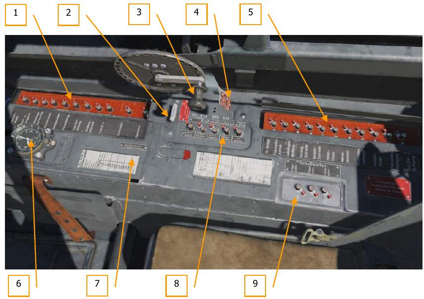

1.   Передняя панель АЗС (крышка открыта)
2.   Выключатель и поднятая крышка стартера
3.   Ручка закрытия/открытия фонаря
4.   Рычаг аварийного сброса фонаря
5.   Задняя панель АЗС (крышка открыта)
6.   Бортовые часы
7.   Таблица магнитных склонений компаса
8.   Панель АЗС топливной системы
9.   Панель АЗС вооружения

#### Рукоятка фонаря кабины
Штурвальная рукоятка используется для открытия/закрытия фонаря кабины: вращение
по часовой стрелке открывает фонарь, а против часовой стрелки закрывает.
Сзади от рукоятки находится рычаг аварийного отстрела фонаря посредством пиропатрона.

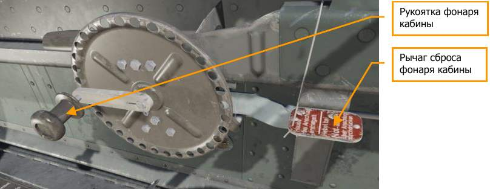

#### Cтартер
Переключатель стартера используется для раскрутки маховика и запуска двигателя.
Подпружиненную рукоятку нужно нажать вниз, чтобы раскрутить маховик, затем вытянуть ее
вверх для запуска двигателя.
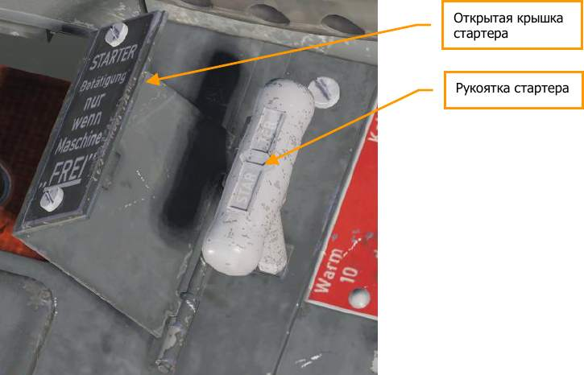

#### Бортовые часы
Часы "Junghans Borduhr Bo-UK1" использовались на всех немецких самолетах периода Второй
мировой войны. На Fw 190 A-8 они расположены в передней части правой панели.
Завод часов осуществляется при помощи головки под циферблатом.
Расположенная под ним кнопка управляет секундомером: запускает, останавливает и обнуляет
его. Каждая минута, отсчитанная секундомером, отражается на маленьком циферблате,
градуированном на 15 минут.
С помощью головки и язычковой кнопки "пуск-стоп" справа можно переводить стрелки часов.

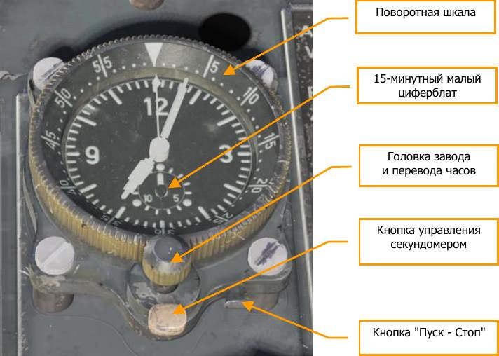

Перевод часов:

- Нажмите кнопку Пуск - Стоп.
- Установите нужное время головкой.
- Отожмите кнопку Пуск - Стоп.

Секундомер:

- Повторное нажатие кнопки запускает секундомер.
- Второе нажатие кнопки останавливает секундомер.
- Третье нажатие кнопки обнуляет секундомер.

#### Автоматы защиты сети
Автоматы защиты сети (АЗС) используются для управления многочисленными электрическими
системами на борту самолета. Каждый участок цепи имеет две кнопки: черная кнопка
включает схему, красная - выключает.
На правой панели кабины Fw 190 A-8 размещены четыре панели АЗС.
Передняя и задняя панели АЗС укомплектованы одиннадцатью АЗС каждая и закрываются
откидными крышками.
Панели АЗС вооружения и топливной системы содержат 3 и 5 АЗС, соответственно

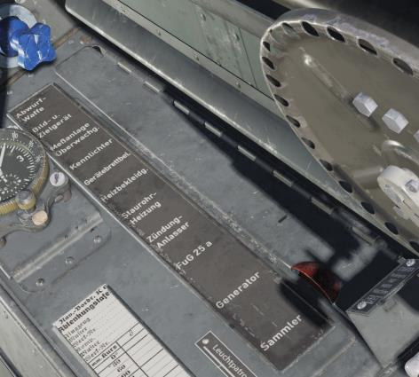
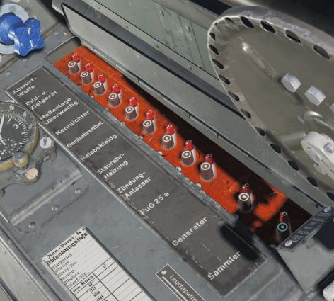

Особенностью электросхемы самолета является то, что управляющие и силовые цепи приводов
шага винта и шасси запистаны через отдельные АЗС.

Обозначения АЗС нанесены рядом с ними, а на панели рядом - названия защищаемых цепей.

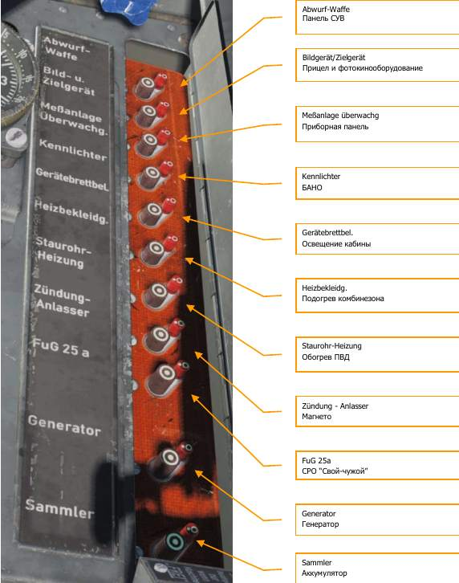

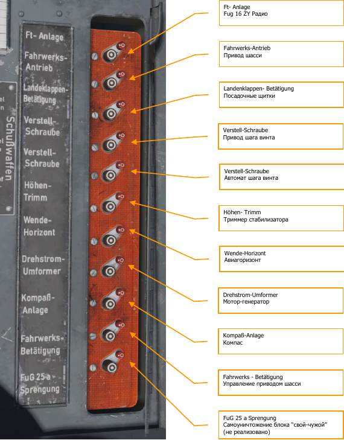

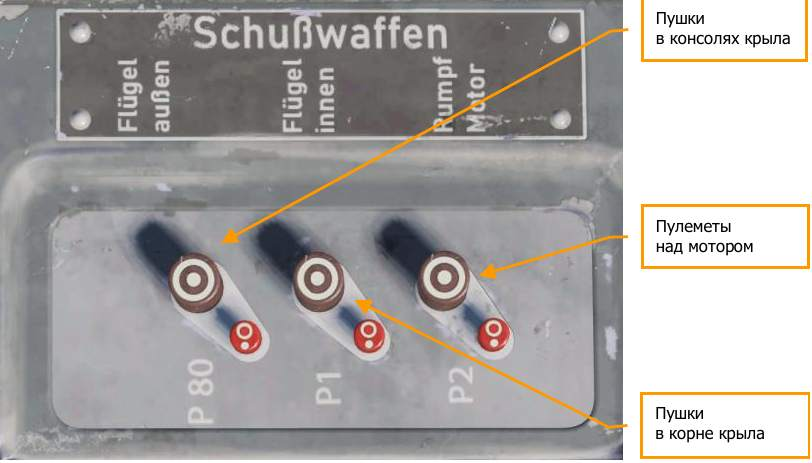

#### Ручка управления самолетом

Ручка управления самолетом, сокращенно – РУС, предназначена для управления самолетом
по крену и тангажу.

Движение РУС назад, “на себя”, отклоняет руль высоты вверх, в горизонтальном полете
самолет переводится в набор высоты – кабрирование. Движение РУС вперед, “от себя”,
соответственно, отклоняет руль высоты вниз, что переводит самолет в пикирование.

Движение РУС вправо или влево, соответственно, отклоняет элероны и обеспечивает
увеличение крена самолета в сторону, в которую сдвинута РУС.

!!! warning
    Резкие движения РУС могут привести к катастрофическим последствиям!

На РУС также размещены кнопки, управляющие спусковыми механизмами вооружения,
фотокинопулеметом, и скоба предохранителя.
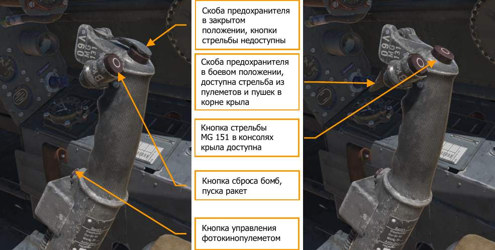

#### Наколенный планшет
Для помощи игроку в навигации в игре есть наколенный планшет. Его можно открыть в любой
момент: кратко - нажать и удерживать клавишу [К], включить постоянно - сочетание клавиш
[RShift + K]. На карте показан участок полетного плана; изначально карта центрирована
на стартовой точке. Листание страниц карты возможно клавишами [[] (открытая скобка) и []]
(закрытая скобка), на них последовательно показаны этапы полета, контрольные точки и
расположенные на пути аэродромы.

Кроме того, команда [RCtrl + K] может использоваться, чтобы разместить отметки на карте.
Отметка показывает положение самолета на карте в настоящее время (как отметка
карандашом на бумажной карте).
Наколенный планшет можно разместить на левой ноге пилота, если включен режим "пилот
в кабине" [RShift + P].

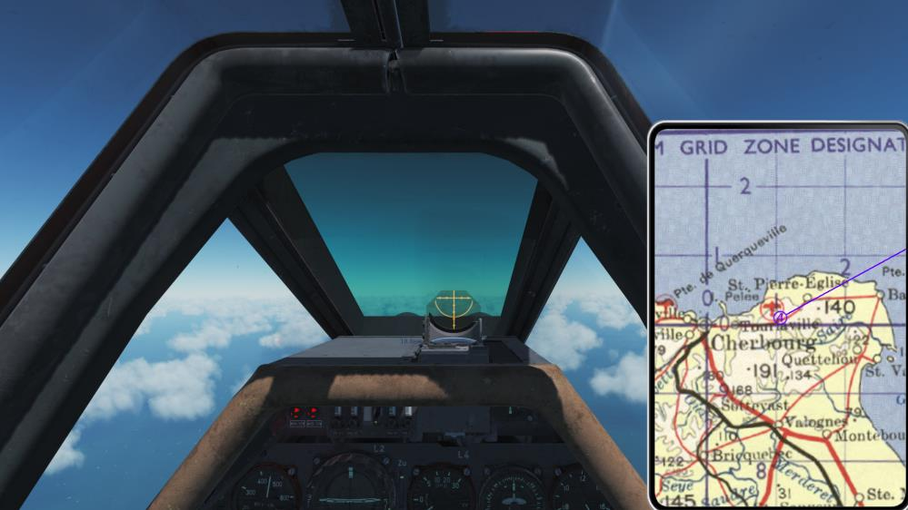
