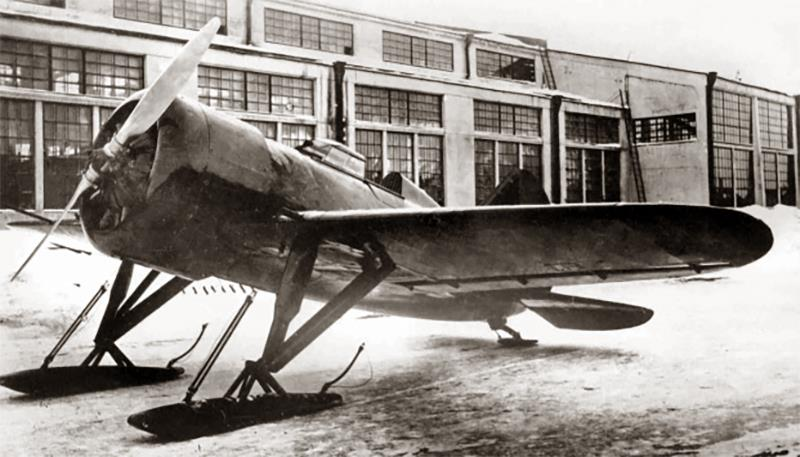
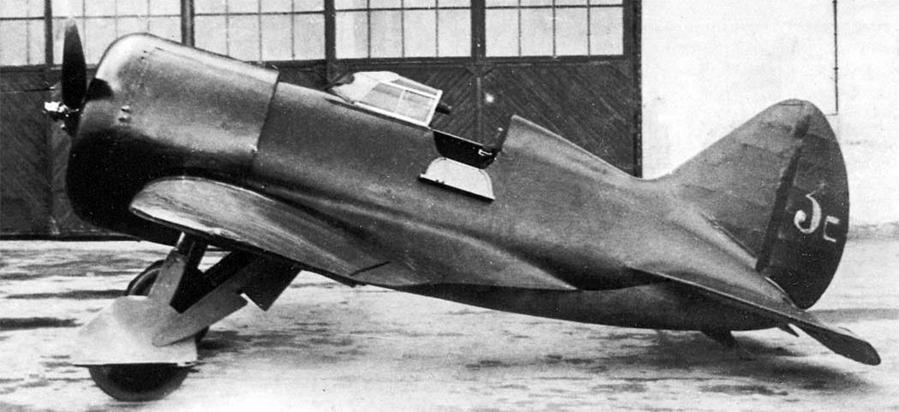
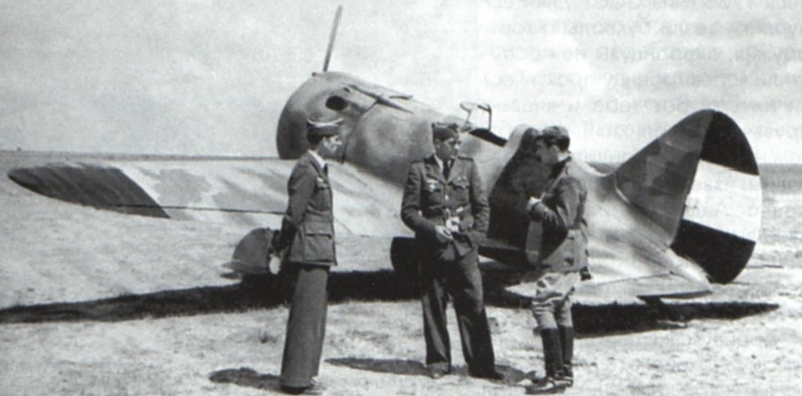

# История самолёта

И-16 (ЦКБ-12) «истребитель шестнадцатый» (получивший среди
летчиков прозвище «Ишак», «Ишачок») — советский одномоторный
истребитель монопланной схемы, созданный в 1933 году в опытном
конструкторском бюро Николая Поликарпова. Это один из первых в мире
истребителей-монопланов с убирающимся в полете шасси.

В 1932 году конструкторам КБ Сухого было выдано задание разработать для
ВВС РККА истребитель новейшей на то время монопланной схемы. Примерно в это
же время Николаю Поликарпову поручается создать биплан, который планировали
принять на вооружение в случае неудачи Сухого. Биплан был создан и
впоследствии поступил на вооружение под обозначением И-15.

Однако, одновременно, Поликарпов в инициативном порядке начал работать
и над созданием собственного истребителя-моноплана, будущего И-16.

В начале 1933 года руководство военно-воздушных сил, ознакомившись с
проектом Поликарпова, выдало конструктору официальное задание на разработку
истребителя. А в ноябре, увидев макет самолета, приняло решение о запуске этой
машины в серию.

Первый полёт на прототипе был выполнен 30 декабря 1933 года лётчиком-
испытателем Государственного авиационного завода № 39 (ГАЗ №39) Валерием
Чкаловым. Для проведения испытаний были созданы два самолета: на одном из
них был установлен двигатель Wright Cyclone мощностью 700л.с., на втором -
серийный отечественный мотор воздушного охлаждения М-22 (480л.с.).

На испытаниях, как и рассчитывали конструкторы, И-16 показал прекрасные
скоростные характеристики: ЦКБ-12 (двигатель М-22) разогнал самолет до 303 км/ч
на высоте 1 тыс. метров, а ЦКБ-12бис (Wright Cyclone) – до 361 км/ч. При этом нужно
учитывать, что оба самолета были оснащены неубирающимся лыжным шасси, и
это значительно снижало их скорость.

Но не все было так гладко. По сравнению с тихоходными бипланами, новый
истребитель отличался неустойчивостью в полете и был весьма сложен для
пилотирования. Дело в том, что Поликарпов для улучшения маневренности
истребителя намеренно ухудшил его устойчивость, сместив центр тяжести назад.
Справиться с этой машиной мог лишь умелый летчик. Также не слишком
удовлетворительными оказались взлетно-посадочные характеристики новой
машины и обзор задней полусферы.

И-16 вообще хотели снять с испытаний и закрыть проект, но, к счастью,
самолет очень понравился Чкалову. Лишь благодаря авторитету всенародно
известного летчика, машину удалось отстоять. В феврале 1934 года начались
государственные испытания истребителя, а в конце марта – эксплуатационные,
которые проходили под Севастополем. 1 мая новейший самолет был показан во
время парада на Красной площади.

Впоследствии, сложность освоения самолета рядовыми летчиками и высокая
аварийность привели к запрету выполнения фигур высшего пилотажа в строевых
полках. К пилотированию И-16 допускались только опытные летчики.

Основная история истребителя началась после усовершенствования
варианта ЦКБ-12бис. При этом мотор Wright Cyclone был заменен на его
лицензионную копию М-25.

1934-1938 годы были расцветом карьеры И-16. Претерпев ряд модернизаций
и усовершенствований от типа 4 до типа 17, «Ишачок» стал по праву считаться
одним из лучших истребителей мира.

Впервые И-16 использовался в боевых действиях в Испании осенью 1936 г. на
стороне республиканцев. Противостояли советским самолетам главным образом
немецкие и итальянские машины: Fiat CR.32, He-51, He-70, Ju-52 и другие. Высокие
скорость и маневренность И-16 вкупе с замечательной боевой живучестью
позволяли советским и республиканским летчикам уверенно чувствовать себя в
воздушных боях.

Однако, прибывшие в 1938-м году для поддержки франкистов первые модели
«мессершмитов»    Bf-109    продемонстрировали   явное   превосходство   и
ознаменовали начало заката карьеры И-16.

После окончания гражданской войны в Испании, Поликарпов предпринял ряд
модернизаций самолета, стараясь сохранить если не преимущество, то хотя бы
паритет боевых возможностей И-16 перед современными зарубежными
истребителями.

С 1937 по 1940-й год И-16 разных модификаций успел принять участие в
боевых действиях в Китае, который противостоял японской агрессии, а также
советско-японском конфликте у реки Халхин-Гол в Монголии. Кроме того, активное
участие И-16 принимал в боевых действиях Советского Союза против Финляндии в
Зимней войне.

К 1939 году уже мало кто сомневался в окончании эпохи И-16. Даже установка
более мощных двигателей М-62 и М-63 не позволила серийному истребителю
превзойти рубеж скорости в 500 км/час. Какое-то время считалось, что добиться
более высоких характеристик можно с новым двигателем М-64, обладавшим
взлетной мощностью 1200-1300л.с. Конструкторы ожидали появление М-64 (был
еще и М-65) вплоть до 1941 года, однако этот двигатель, являющийся последней
однорядной девятицилиндровой звездой, так и не был доведен.

Николай Поликарпов пытался улучшить аэродинамику самолета, заменив
полотняную обшивку крыльев фанерной. Летом 1939 года был испытан самолет
No.1721103, у которого верхняя часть крыла была обшита фанерой толщиной
2,5мм, тогда же на госиспытания в НИИ ВВС был предъявлен И-16 тип 24 с
фанерным покрытием крыла. Последний аппарат летал со скоростью 489 км/ч, что
было несколько выше показателей других машин. Однако, данный результат
приписали двигателю М-63. И, хотя деревянная обшивка была рекомендована для
производства, в серийных образцах она своего применения не нашла.

Тип 24 являлся дальнейшей модификацией типа 18 в соответствии с нормами
прочности 1937 года. Основные внесенные изменения:

1. Установлен винт изменяемого шага АВ-1 и новый кок-обтекатель.
2. Мотор оборудован регулятором постоянства оборотов "Р-2", дающим
возможность пилоту держать нужное число оборотов.
3. Поставлена амортизационная стойка шасси с двузвенником вместо ранее
применявшегося      шлицевого    соединения.    Одновременно      увеличена
эффективность амортизации, ход амортизатора увеличен до 96 мм по сравнению
с 30-36 мм у предыдущего варианта.
4. Костыль на типе 24 обрел небольшое колесо и масляно-пневматическую
амортизацию.
5. Введены посадочные щитки с механическим управлением. Рукоятка
располагалась слева за сиденьем пилота.
6. Установлен второй откидной борт кабины пилота с правой стороны. Хотя
откидной борт на правой стороне официально вводился на типе 24, встречалось
подобное усовершенствование и на других типах.
7. Самолет оборудован системой ручного запуска от рукоятки стартера "РИ".
Ручка в походном положении, хранящаяся в кабине пилота, при запуске
вставлялась справа в специальное отверстие фюзеляжа.
8. На правом борту фюзеляжа между шпангоутами No.7 и No.8 прорезан люк
для рации.

Наиболее известным военным конфликтом, в котором принял участие И-16,
безусловно, является Вторая мировая война. Именно на И-16 летчики-истребители
ВВС РККА встретили первые удары Люфтваффе в 1941-м году. В самый тяжелый
для Советского Союза начальный период войны «ишачки», взлетая по несколько
раз в день, выполняли самые разнообразные задачи: перехваты, сопровождение
бомбардировщиков, разведку, штурмовку. Несмотря на явную устарелость, И-16,
пользуясь своей феноменальной маневренностью все еще мог создать серьезные
проблемы более современным самолетам, иногда выходя победителем даже из
схваток с «мессершмитами».

По мере насыщения истребительных полков более современными
самолетами, И-16 переводился в учебные полки и полки ПВО, уступая дорогу
«Лавочкиным», Якам, МиГам. Тем не менее, согласно официальным данным, И-16
состоял на боевой службе до 1944 года, а на Дальнем востоке оставался в строю
до 1945 года. В ВВС Испании после войны осталось около 50 трофейных
самолетов, которые были сняты с вооружения только в 1953-м году, уже в эпоху
реактивной авиации!

