# Конструкция самолёта

## Описание

Истребитель И-16 - свободнонесущий моноплан с нижним расположением
крыла, классической схемы, имеет смешанную конструкцию, основными
материалами которой являются сталь, алюминий и дерево.

Фюзеляж - типа полумонокок, состоящий из двух половин. В качестве каркаса
используется набор деревянных лонжеронов, стрингеров и шпангоутов, сверху
обклеенных березовым шпоном. Каркас усилен стальными уголками, обшивка
обтягивается тканью, шпаклюется, окрашивается и полируется.

Крыло двухлонжеронное, состоит из центроплана и двух консолей. Лонжероны
изготовлены из стальных труб, нервюры – из дюралюминиевых профилей. В
передней части обшивка центроплана выполнена из фанеры, сзади – из
дюралюминия. Элероны занимают практически всю заднюю кромку консолей
крыла.

Хвостовое оперение однокилевое, с металлическим силовым набором и
полотняной обшивкой.

Самолет оснащен трехопорным убирающимся шасси с двумя главными
стойками и хвостовым костылем с небольшим колесом.

Колеса оборудованы тормозами колодочного типа с приводом от педалей.
Амортизация шасси – жидкостно-газовая. Уборка и выпуск шасси производятся
вручную, с помощью лебедки. Система уборки шасси уникальна и включает
большое количество элементов, что сказывается на ее надежности не в лучшую
сторону. Чтобы выпустить или убрать шасси, необходимо вручную выполнить 43
оборота рычагом лебедки подъемного механизма.

Кабина пилота – открытая, с козырьком. Подобное решение было
вынужденным: конструкция фонаря первых модификаций И-16 была неудачной.
Так, ранний закрывающийся фонарь существенно ограничивал обзор, а кроме того,
имел склонность к заклиниванию на высоких скоростях. Летчики опасались летать
с закрытым фонарем, закономерно полагая, что не успеют открыть его в экстренной
ситуации.

За    сиденьем   летчика     находится   бронеспинка,     обеспечивающая
противопульную защиту от огня с задней полусферы.

!!! info "ОСНОВНЫЕ ЛЕТНО-ТЕХНИЧЕСКИЕ ХАРАКТЕРИСТИКИ"
    ```
    Размах крыла                   9.00 м<br>
    Длина                          6.13 м<br>
    Высота                         2.25 м<br>
    Площадь крыла                  14.54 м2<br>
    Масса:<br>
      пустого                       1383 кг<br>
      взлетная                      1882 кг<br>
    Тип двигателя                  М-63<br>
    Мощность                       900 л.с.<br>
    Максимальная скорость:<br>
      у земли                       410 км/ч<br>
      на высоте                     462 км/ч<br>
    Скороподъемность               882 м/мин<br>
    Скорость сваливания            143-164 км/ч<br>
    Скорость отрыва                145-175 км/ч<br>
    Посадочная скорость            135-145 км/ч<br>
    Предельная скорость            610 км/ч<br>
    Практическая дальность         440 км<br>
    Практический потолок           9700 м<br>
    Экипаж                         1 человек<br>
    Вооружение:                    4 пулемета ШКАС 7.62-мм<br>
    ```


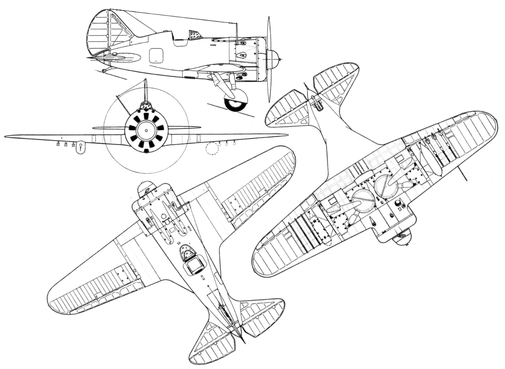

## ОБЩАЯ КОМПОНОВКА САМОЛЕТА И-16 ТИП 24


1. Жалюзи капота                            
2. Винт АВ-1                                
3. Мотор М-63                               
4. Газоотводная трубка пулемета             
5. Маслорадиатор                            
6. Дополнительный маслобак (12л)            
7. Основной маслобак (23л)                  
8. Патронная коробка фюзеляжного пулемета   
9. Пулемет ШКАС                             
10. Патронная коробка центропланного пулемета                                
11. Дюралевые ленты крепления бензобака     
12. Бензобак (260л)                         
13. Заливной бачок (4л)                     
14. Приемник РСИ-3 «Сокол»                  
15. Кислородный прибор КПА-3                
16. Прицел ПАК-1                            
17. Сектор управления заслонкой      маслорадиатора и жалюзи (правый борт)   
18. Сектор управления форсажем и   шагом винта (левый борт)
19. Сектор управления нормальным    газом (левый борт)
20. Винтовой механизм управления     закрылками
21. Передатчик РСИ-3 «Орел»
22. Бронеспинка летчика
23. Эксплуатационный люк
24. Тяга управления рулем высоты
25. Тросовая проводка управления   рулем направления
26. Масляно-пневматический    амортизатор костыля
27. Подпружиненные шторки узлов  навески руля направления
28. Костыль с дюралевым колесом
29. Хвостовой аэронавигационный  огонь


## ФЮЗЕЛЯЖ

Фюзеляж И-16 представляет собой деревянный монокок овального сечения,
основой которого является каркас, покрытый скорлупой из березового шпона.

{ width="400" }

1. Нижний лонжерон                   
2. Верхний лонжерон                  
3. Стрингер                          
4. Подкос между 1-й и 4-й рамами     
5. Передний узел крепления киля      
6. Труба костыля                     
7. Отверстие для прицела ПАК-1        
8. Желоба для пулеметов              
9. Верхний узел крепления моторамы
10. Окно освещения доски приборов
11. Нижний узел креплении моторамы и  стыка с центропланом
12. Лючок для снятия стартера    «Эклипс»
13. Задний узел крепления киля
14. I-XI. Рамы фюзеляжа

Силовой каркас состоит из одиннадцати поперечных рам (шпангоутов),
четырех лонжеронов и восьми стрингеров. В передней части фюзеляжа от 1-й до
4-й рамы имеется вырез для установки центроплана.

Наиболее нагруженными и, вследствие этого, усиленными являются 1, 4 и
11-я рамы.

На 1-й располагаются узлы крепления мотора и противопожарная
перегородка, на 4-й раме укреплены задние узлы центроплана, 11-я рама усилена
с целью обеспечения достаточной жесткости хвостовому оперению самолета.

Обшивка фюзеляжа представляет собой скорлупу, выклеенную из нескольких
слоев березового шпона толщиной 0.5 мм. Общая толщина обшивки переменная:
от 1-й до 5 рамы – 2.5 мм, от 5-й до 11-й – 2 мм. Между 5-й и 6-й рамами обшивка
имеет вырезы с откидывающимися бортами кабины летчика. Также в обшивке
имеются различные технологические вырезы для доступа к внутренним
механизмам, стока воды, вентиляции.


В        целях         уменьшения
интерференции      –   аэродинамически
вредного взаимного влияния крыла и
фюзеляжа – в местах их стыка поставлены
переходы (феринги или зализы) с
оптимальными     в   аэродинамическом
отношении радиусами кривизны.

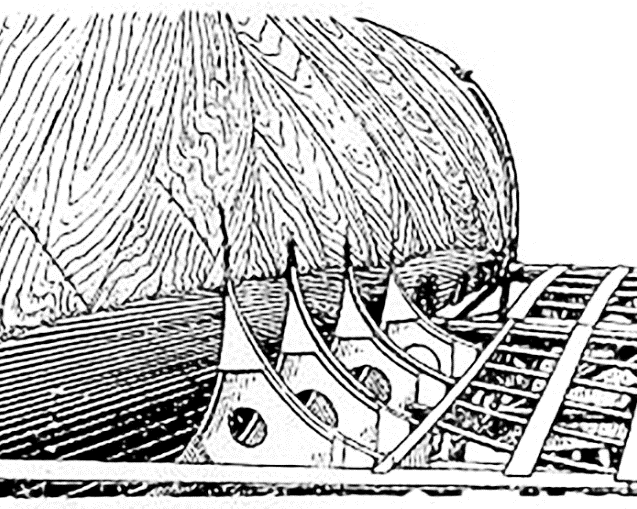{ width="300" }

Снаружи    фюзеляж    покрывается
нитроклеем, обрабатывается шпаклевкой
АШ-22,    после    чего   обклеивается
миткалевым полотном на нитроклее и
снова шпаклюется. Далее следует окраска
и лакировка.


### КОЗЫРЕК И КАБИНА ПИЛОТА

Кабина И-16 тип 24 – открытого типа,
располагается между 4-й и 6-й рамами
фюзеляжа.

Для удобства попадания в кабину с
двух сторон предусмотрены откидные
борта, фиксирующиеся в закрытом
положении с помощью задвижек.

В передней части кабины на обшивке
фюзеляжа установлен козырек. Он
представляет     собой      прозрачный
плексигласовый обтекатель, заключенный
в металлический каркас. Стекло крепится к каркасу пистонами из нержавеющей
стали.

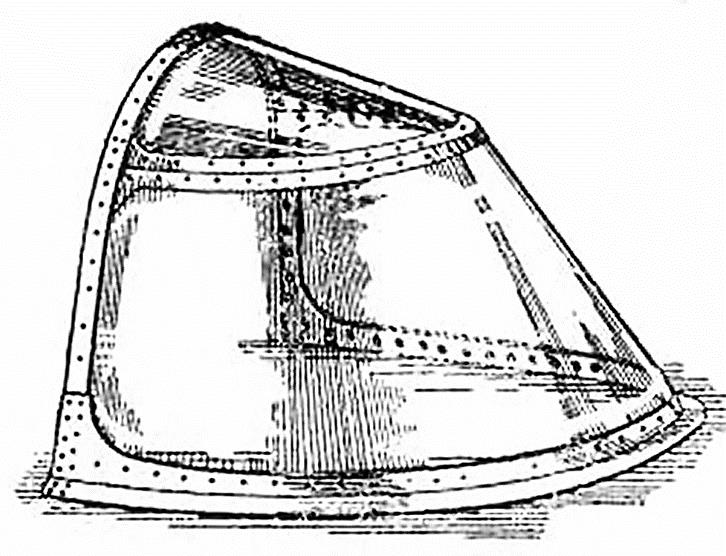{ width="300" }

Большинство органов управления винтомоторной группой, радиаторами,
шасси, размещаются на бортах кабины и закреплены на элементах силового
набора фюзеляжа. Педали ножного управления, а также ручка управления
самолетом смонтированы на полу кабины, представляющем собой цельный
дюралюминиевый лист с отбортовками. Пол крепится к нулевой нервюре
центроплана, заднему лонжерону центроплана и к 5-й раме фюзеляжа.

Летчик располагается в сиденье, изготовленном из листового дюралюминия и
имеющем углубление для парашюта «чашку».

В верхней части спинки сиденья имеется мягкая подушка из кожзаменителя.
Для регулировки кресла под рост летчика предусмотрена специальная рычажная
система, позволяющая изменять высоту сиденья по вертикали в пределах 110 мм.


{ height=400 }

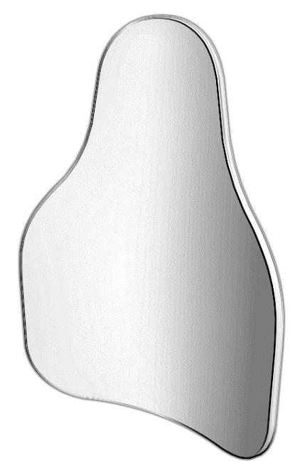{ height=400 }

Элементов бронирования на самолете И-16 тип 24 не предусмотрено, за
исключением   опционально    устанавливаемой     бронеспинки. Бронеспинка
представляет собой стальной щит толщиной 8.5 мм, по своей форме
соответствующий контуру головы и туловища летчика. В случае оборудования
самолета бронещитом, стандартная спинка сиденья не ставится.

## КРЫЛО 

### ЦЕНТРОПЛАН

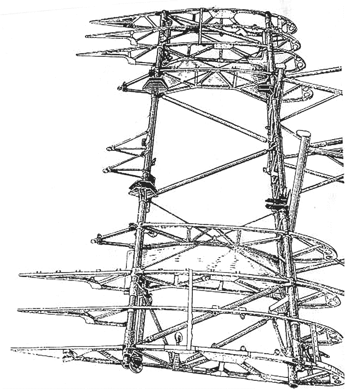{ height=400 }

Центроплан       является
основным элементом силовой
конструкции самолета, к нему
крепятся     консоли     крыла,
фюзеляж,      шасси,     фермы
пулеметов, закрылок и т.д.

Силовая              часть
центроплана      состоит     из
переднего и заднего лонжеронов
ферменного      типа,    девяти
нервюр, десяти раскосов, двух
крестовин из лент-расчалок и
двух листов для повышения
жесткости каркаса. Центроплан
крепится к фюзеляжу четырьмя
узлами, расположенными на
переднем и заднем лонжеронах.

Обшивка центроплана на его верхней стороне сделана фанерной, на нижней
– преимущественно дюралевая. Для обеспечения доступа к пулеметам,
механизмам их перезаряжания и управления огнем, к другим внутренним
механизмам в обшивке предусмотрены лючки.

### ЗАКРЫЛОК

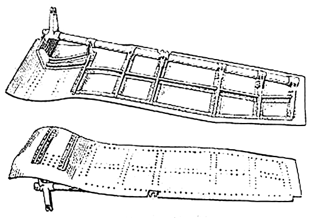


Закрылок расположен по всему
размаху центроплана и симметрично
разделен на правую и левую части
относительно оси самолета. По своей
форме закрылок представляет собой
контур нижней хвостовой обшивки
центроплана и по мере приближения к
оси самолета – контур феринга
фюзеляжа. Закрылок закреплен в
шести точках – по три на каждую
половину.   Управление    закрылком      
осуществляется вручную, при помощи       
винтового механизма.                     

При вращении рукоятки механизма приобретает поступательное движение
шток, который соединен с рычагом на лонжероне закрылка. Выпуская или убирая
шток, открывают или закрывают закрылок. Винтовой механизм монтируется с левой
стороны сиденья летчика у 5-й рамы фюзеляжа.

Максимальный угол отклонения закрылка составляет 53°±2°

### КОНСОЛЬ КРЫЛА

Консоль крыла в плане имеет трапециевидную форму с закругленным концом.
Угол установки крыла по размаху постоянный и равен 2°04'.

Конструкция консоли металлическая, обшитая полотном. Каркас консоли
крыла состоит из двух лонжеронов, двенадцати нервюр, лент-расчалок, обода
крыла и одиннадцати дополнительных полочек, установленных между нервюрами
сверху. Усиленные нервюры вместе с лонжеронами и лентами-расчалками
образуют основной силовой каркас крыла. На усиленных нервюрах установлены
кронштейны, при помощи которых шарнирно крепится элерон.

Присоединение консоли к центроплану осуществляется специальными
стыковыми узлами.

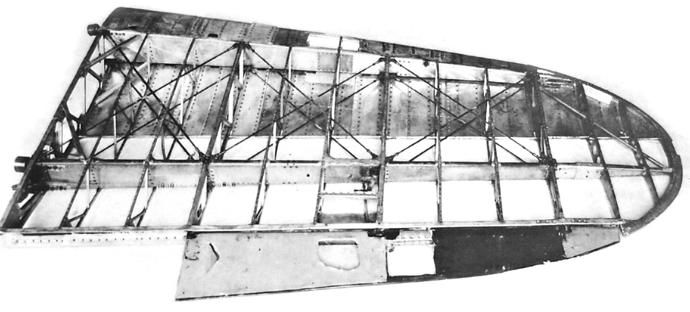


Обшивка консоли полотняная. Вследствие больших нагрузок на обшивку носок
консоли сверху на 44.5% и снизу на 14.5% хорды обшит листовым дюралюминием
толщиной 0.6 мм.

### ЭЛЕРОН

Элерон состоит з двух отсеков: корневого и концевого, и крепится к усиленным
нервюрам консоли крыла на четырех шарнирах.

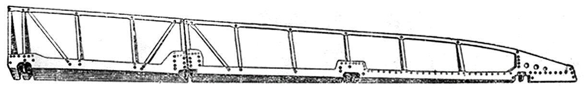

Каркас элерона образуется из дюралевых нервюр и лонжерона. Обшивка
элеронов изготовлена из листового дюралюминия толщиной 0.5мм. Управление
элеронами осуществляется посредством тросовой проводки от РУС.

## ХВОСТОВОЕ ОПЕРЕНИЕ

Хвостовой оперение самолета         –    монопланное,    свободнонесущее,
металлическое, с полотняной обшивкой.


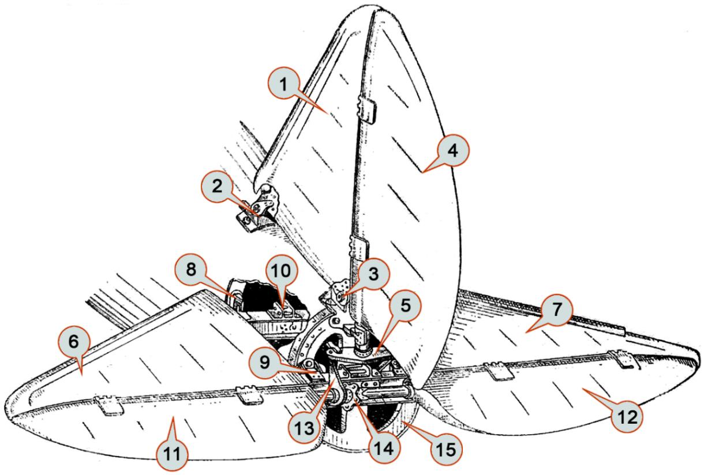

1. Киль                                
2. Передний узел крепления киля        
3. Задний узел крепления киля          
4. Руль направления                    
5. Двуплечий рычаг управления рулем      направления                        
6. Стабилизатор (левая часть)                             
7. Стабилизатор (правая     часть)                             
8. Передний (регулируемый) узел      крепления стабилизатора
9. Задний узел крепления стабилизатора
10. Узел разъема лонжеронов правой и   левой части стабилизатора
11. Руль высоты (левая  часть)
12. Руль высоты (правая    часть)
13. Качалка управления рулем высоты
14. Узел разъема лонжеронов правой и левой частей руля высоты
15. XI усиленная рама фюзеляжа

###    КИЛЬ

Киль неподвижно укреплен на фюзеляже и повернут на 2° влево по полету для
погашения силы сопротивления, вызванной реактивным моментом винта на крыле.
Для этого передний узел крепления киля снесен на 30 мм влево от оси самолета.

По конструкции киль металлический; его силовой набор состоит из двух
лонжеронов, шести нервюр, носка переднего обтекателя, раскоса и узлов
крепления. На заднем лонжероне киля установлены кронштейны для крепления
руля направления.


###    РУЛЬ НАПРАВЛЕНИЯ

Руль направления подвешен на заднем лонжероне киля и крепится в трех
точках, из которых две сверху находятся на киле и одна, нижняя, на 11-й раме
фюзеляжа. Кроме этих узлов, на нижнем конце лонжерона установлен двуплечий
рычаг управления рулем поворота. Отклонение руля направления осуществляется
ножными педалями посредством тросовой проводки.

Каркас руля направления образуют лонжерон, нервюры, хвостовой профиль.


###    СТАБИЛИЗАТОР

Стабилизатор — разъемный, состоит из двух симметричных половин,
стыкуемых на лонжеронах. Каркас каждой половины стабилизатора включает в
себя передний и задний лонжероны, соединенные нервюрами. Передняя кромка
стабилизатора обшита листовым дюралюминием, образующим обтекатель.

Стабилизатор монтируется на 10-й и 11-й рамах фюзеляжа в четырех точках,
причем передние узлы крепления стабилизатора сделаны регулируемыми по
вертикали. Изменение высоты передней точки крепления стабилизатора позволяет
настраивать его угол атаки, добиваясь оптимальной балансировки самолета
(минимальных усилий на ручке при расчетной скорости горизонтального полета).

Конструктивно основными элементами регулируемого узла являются опорная
скоба и болт, взаимное положение которых может настраиваться в определенных
пределах.

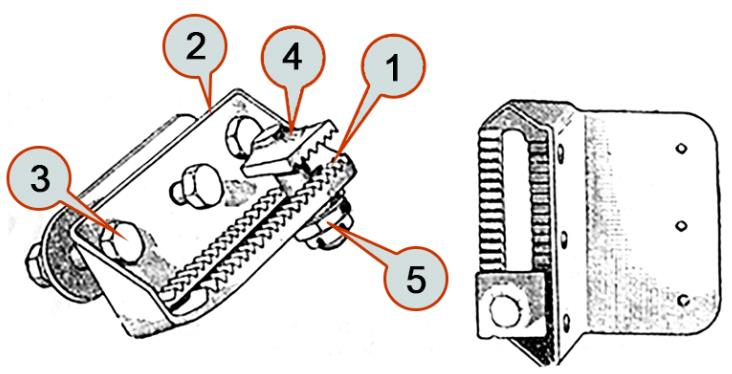

1. Гребенка
2. Опорная скоба
3. Болт крепления
4. Гребенчатый болт
5. Гайка болта

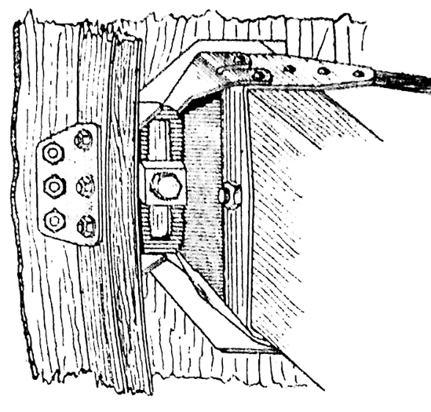

На поверхности опорной скобы фрезерована зубчатая гребенка. Крепление
стабилизатора осуществляется болтом с головкой, имеющей зубчатую
поверхность, соответствующую зубьям гребенки.

При установке стабилизатора на необходимый угол атаки болт
переставляется в прорези гребенки и затягивается. При этом зубцы болта входят
между зубцами гребенки и закрепляют стабилизатор в этом положении.
Перемещение гребенки на один зуб соответствует изменению угла установки
стабилизатора на 0°24'. Регулировка производится наземным персоналом.

###    РУЛЬ ВЫСОТЫ

Руль высоты состоит из двух половин и подвешен на заднем лонжероне
стабилизатора. Каркас каждой половины руля состоит из лонжерона и семи
нервюр, соединенных по носкам и по хвостовикам дюралевым профилем.

Руль крепится к кронштейнам стабилизатора в пяти точках: против нервюр №
3 и 6 руля и на узле разъема. Все узлы, за исключением среднего, конструктивно
аналогичны узлам руля направления.

Управление рулем высоты осуществляется с помощью жестких трубчатых тяг,
механически связывающих качалку руля высоты с ручкой управления самолетом.


##  ШАССИ

Шасси самолета И-16 составляют две убирающиеся основные стойки и
неубирающийся хвостовой костыль с небольшим дюралевым колесом. Основные
стойки представляют собой две трехстержневые пирамиды, образованные двумя
подкосами и амортизационной стойкой, шарнирно прикрепленными к лонжеронам
и торцовым нервюрам центроплана. В вершине каждой пирамиды имеется
тормозное колесо с пневматиком 700х150.


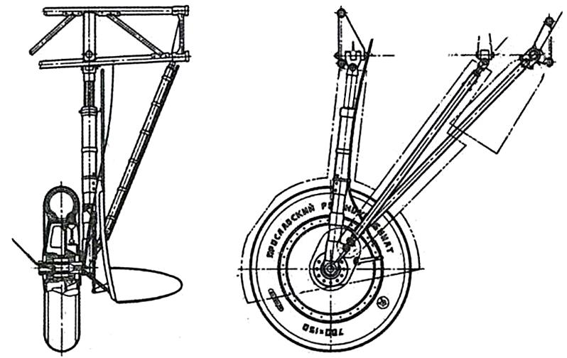

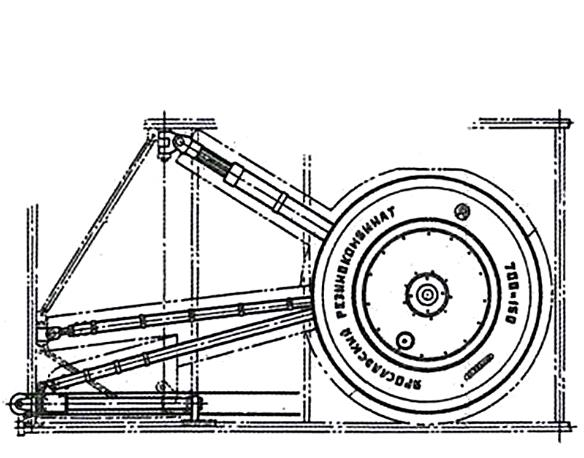

Амортизация основных стоек шасси обеспечивается шлицевыми масляно-
пневматическими амортизаторами.

Система торможения – механическая. Усилие с правой и левой тормозных
педалей через тросовую проводку передается непосредственно на тормозные
колодки соответствующего колеса.

Выпуск и уборка стоек шасси осуществляются от механического привода,
источником энергии в котором служат мускульные усилия летчика (вращение
рукоятки подъемного механизма). Сам принцип подобного подхода, несмотря на
внешнюю простоту, требует наличия ряда уникальных устройств, не присущих
самолетам с традиционной гидравлической или пневмо- системой выпуска шасси.
В частности, учитывая наличие единого привода, необходимо обеспечить
равномерные усилия всем элементам обоих стоек шасси (складывание подкосов,
подтягивание колес, т.д.) на протяжении всего процесса выпуска или уборки. Кроме
того, полностью механический привод требует гарантированно надежной работы
системы передачи усилий (тросовой проводки), а также ряда дополнительных
обеспечивающих механизмов (торможения барабанов, блокировки, т.п.).

Таким образом, для более полного понимания и правильной эксплуатации
механизма подъема шасси необходимо подробно рассмотреть его конструкцию.

### ЗАМОК ШАССИ

В процессе выпуска и уборки шасси узел крепления заднего подкоса
посредством специальной ползушки перемещается вдоль цилиндрической
направляющей, закрепленной на лонжероне центроплана.


1. Ползушка
2. Направляющая
3. Задний подкос шасси

Недотягивание ползушки при выпуске
шасси может вызвать при посадке его
самопроизвольное      складывание,    что
повлечет за собой неизбежную аварию. Этот
недостаток устраняется запором ползушки
специальным замком, конструкция которого
заключается в следующем.

В верхней части ползуна приварена
гребенка с тремя фрезерованными зубьями.
В кронштейн крепления направляющей к
заднему лонжерону центроплана ввернут
вильчатый болт. Крючок запора ползушки
входит в вилку и крепится шарнирно болтом
диаметром 6 мм. При сцеплении зубьев
ползушки     с     крючком    исключается
возможность ее обратного перемещения.

Крючок замка шасси посредством
тросовой проводки связан с рычагом
переключения собачки храпового колеса на
подъёмном механизме в кабине. Управление замком осуществляется совместно с
переключением собачки на выпуск или на уборку шасси.

Срабатывание замка и номер зуба, на котором произошло запирание
ползушки, контролируется летчиком по механическому указателю шасси.

### ПРИНЦИП ДЕЙСТВИЯ ПОДЪЕМНОГО МЕХАНИЗМА ШАССИ

Подъем шасси производится все время принудительно.

Первая часть процесса подъема происходит за счет перемещения ползушки
заднего подкоса вдоль лонжерона. Поскольку длина подкосов остается все время
постоянной, при перемещении ползушки нижний узел шасси вместе с колесом
отходит назад и поднимается. Во второй части процесса подъем осуществляется
преимущественно за счет подтягивания шасси тросами, идущими от подъемника в
кабине летчика к колесам самолета.

Опускание шасси происходит в обратном порядке.

На первом этапе стойки шасси «повисают» на тросах и выпускаются под
действием собственного веса. Летчик, вращая рукоятку, лишь удерживает шасси от
очень быстрого опускания.

Вторая часть процесса выполняется принудительно. Раскладывание шасси
происходит за счет движения ползушек по направляющим с дальнейшей
фиксацией в замках верхних узлов крепления задних подкосов.

### КОНСТРУКЦИЯ ПОДЪЕМНИКА

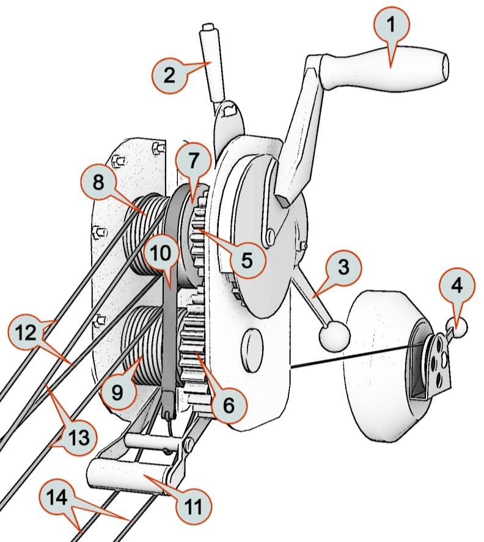

1. Рукоятка                                   подъема/выпуска шасси
2. Ручка аварийного                                стопора
3. Ручка переключения            собачки храпового колеса
4. Ручка регулировки        натяжения ленты     автоматического тормоза
5. Ведущая шестерня
6. Зубчатое колесо нижнего            барабана
7. Комбинированный                    барабан
8. Верхний барабан
9. Нижний барабан
10. Тормозная лента
11. Тормозной валик
12. Трос к правому подкосу
13. Трос к левому подкосу
14. Тросы к колесам


Подъем и опускание шасси самолета производят вращением рукоятки
подъемника, находящегося в кабине летчика. При подъеме рукоятку нужно вращать
43 оборота против часовой стрелки, при опускании - по часовой стрелке. Вращение
рукоятки подъемника через набор шестерен передается двум барабанам: на один
из них наматываются тросы от верхних скользящих креплений задних подкосов
шасси, а на другой — тросы, идущие к колесам самолета.
Надежный выпуск шасси требует дополнительного автоматического тормоза.
С этой целью в конструкцию подъемного механизма введена тормозная лента
«феродо»    (композитный    фрикционный     материал).    Лента  охватывает
комбинированный барабан и крепится к тормозному валику. Валик ложится сверху
на тросы колес и оттягивается пружиной так, что тросы нижнего барабана
постоянно находятся под некоторым натяжением. Так как действие тормозов
необходимо только при выпуске шасси, то на подъеме тормоз ослабляют при
помощи ручки, установленной с правой стороны в кабине летчика.


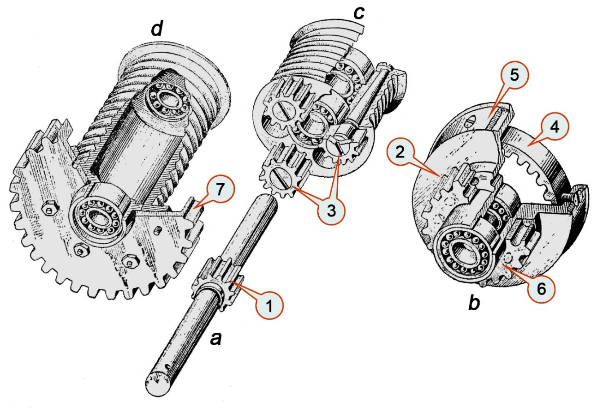

1. Ведущая шестеренка
2. Комбинированный барабан
3. Шестеренки – сателлиты (3 шт.)
4. Зубчатое колесо внутреннего зацепления
5. Стальная лента
6. Шестерня
7. Зубчатое колесо.

Чтобы шасси в полете не выпадало, рукоятка подъемного механизма
закрепляется при помощи храпового колеса и собачки. Собачка сделана
двустороннего действия, т. е. работает при подъеме и выпуске шасси.

Рукоятка подъема с храповым колесом насажена на валик ведущей
шестеренки 1. На этот же валик насажен комбинированный барабан 2 и с другой
стороны — верхний барабан.

Связь верхнего барабана с ведущей шестеренкой 1 осуществляется при
помощи трех свободно вращающихся шестеренок 3.

Насаженный на ведущий валик комбинированный барабан 2 выточен из
дюралюминия; в него впрессованы два шарикоподшипника. В кольцевую выточку
барабана вставлена шестеренка 4 внутреннего зацепления. По внешнему
диаметру на барабан наложена стальная лента 5, привернутая утопленными
винтами к кожуху барабана. Эти винты фиксируют одновременно шестеренку 4,
которая в собранном механизме охватывает три шестеренки 3.

Связь нижнего барабана с ведущей шестеренкой валика 1 имеет следующие
звенья: шестеренка 1 сцеплена с шестеренками 3 и через них с шестеренкой 4 с
внутренним зубом, шестеренка 4 связана с барабаном 2; к этому барабану
приклепана шестерня 6; шестерня 6 приводит в движение шестерню 7 нижнего
барабана, жестко связанную с ним болтами.

Таким образом, передаточный механизм представляет собой дифференциал,
позволяющий сообщать крутящий момент наименее нагруженному барабану, тем
самым равномерно распределяя усилия между подтягиванием колес и движением
подкосов.


###  КОСТЫЛЬ

Хвостовая стойка шасси представляет собой неубираемый стальной костыль
эллиптического сечения с дюралюминиевым колесом. Амортизация костыля
обеспечивается масляно-пневматическим амортизатором.

Управление костылем осуществляется совместно с рулем направления
посредством педалей. Поскольку костыль связан с органами управления
пружинными тягами, на стоянке либо очень низких скоростях руления
эффективность управления костылем может быть снижена.


1. Руль направления
2. Ось поворота руля направления
3. Двуплечий рычаг управления рулем направления
4. Тросовые тяги от педалей летчика
5. Хвостовой костыль с колесом
6. Амортизатор костыля
7. Ось поворота костыля
8. Качалка костыля
9. Пружинные тяги

##  ВИНТОМОТОРНАЯ ГРУППА

###    МОТОР

На самолете И-16      тип 24 установлен звездообразный мотор М-63 с
номинальной мощностью    у земли 930 л. с. Мотор М-63 — девятицилиндровый,
воздушного охлаждения,    имеет двухскоростной центробежный нагнетатель с
механическим приводом,   позволяющий поддерживать мощность с подъемом до
расчетной высоты.


!!! note "ОСНОВНЫЕ ХАРАКТЕРИСТИКИ МОТОРА"
    Степень сжатия                    7.2<br>
    Рабочий объем, л.                 29.87<br>
    Масса мотора, кг.                 515<br>
    Мощность на форсаже, л.с.         1100<br>
    Мощность у земли, л.с.            930<br>
    Мощность на 4500м., л.с.          900<br>
    Частота вращения ном, об/мин      2200<br>

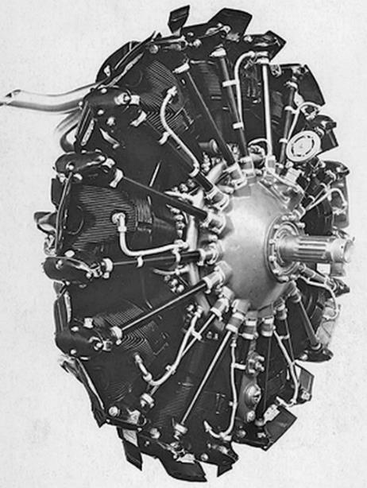


###  ВИНТ

Самолет снабжен воздушным винтом АВ-1 изменяемого              шага,   с
автоматическим поддержанием постоянного числа оборотов.

**ОСНОВНЫЕ ДАННЫЕ ВИНТА АВ-1**

1. Винт тянущий, правого вращения.
2. Число лопастей - 2.
3. Диаметр винта: D = 2,8м или D = 2,7м с уширенной лопастью
4. Диапазон изменения угла установки лопастей 30°.
5. Полный вес винта — 73кг


Постоянное число оборотов обеспечивается автоматическим регулятором
типа Р-2, гидравлически связанным с винтом. Кроме того, с помощью регулятора
винт можно принудительно поставить в положение минимального или
максимального шага. Управление регулятором осуществляется из кабины летчика.
РЕГУЛЯТОР ПОСТОЯННОГО ДАВЛЕНИЯ
Мотор М-63 снабжен регулятором постоянного давления РПД-1,
автоматически ограничивающим давление за нагнетателем в определенных
пределах, равных 915±10 мм рт.ст.
Регулятор ограничивает две степени наддува: при взлете и номинальной
мощности. Переключение с одного положения на другое производится при помощи
рычага.
На корпусе РПД-1 расположен рычаг форсажа, который дает возможность
форсировать мощность мотора при взлете. Управление форсажем производится
при помощи тяги и сектора из кабины летчика.


АВТОМАТИЧЕСКИЙ ВЫСОТНЫЙ КОРРЕКТОР
Карбюратор на моторе М-63 оснащен автоматическим высотным корректором
непосредственного действия и механизмом останова мотора.
С подъемом самолета на высоту сохранение постоянства соотношения
количества воздуха и горючего осуществляется автоматически при наличии
высотного корректора. Управление высотным корректором может осуществляться
и вручную из кабины в случае отказа автоматики.


ТОПЛИВНАЯ СИСТЕМА
Самолет снабжен одним фюзеляжным топливным баком. Бак емкостью 260 л,
обтянут протектором установлен между рамами № 1 и 4 фюзеляжа (за приборной
доской летчика).
В случае необходимости могут быть подвешены два крыльевых ПТБ емкостью
по 93 л каждый. При этом горючее сначала расходуется из подвесных бензиновых
баков, потом - из центрального. Переключение баков осуществляется вручную из
кабины.

ЗАЛИВНАЯ СИСТЕМА
При запуске мотора горючее подается под давлением из специального
заливного бачка емкостью 4 л, который расположен в верхней части фюзеляжа за
бензиновым баком. Давление в бачке создается вручную воздушным насосом,
расположенным на правой стороне доски приборов. Созданное насосом давление
в бачке дает возможность через трехходовой кран производить заливку
карбюратора и мотора перед пуском.
Рисунок 25: Схема бензопровода.
1. Центральный топливный бак;            19. Бензопровод подачи топлива из
2. Подвесные баки;                          заливного бачка к трехходовому
3. Коллектор;                               крану;
4. Гибкая тяга управления коллектором;   20. Трехходовый кран;
5-7. Бензопроводы, сообщающие            21. Бензопровод, сообщающий заливной
топливные баки с коллектором;          бачок с карбюратором;
8. Бензопровод из коллектора в           22. Бензопровод, сообщающий заливной
топливный фильтр;                      бачок с мотором;
9. Топливный фильтр;                     23. Гибкая тяга управления пожарным
10. Пожарный кран;                          краном;
11 Трубопровод между пожарным краном     24. Карбюратор;
и бензонасосом;                     25. Топливный насос (помпа);
12. Трубопровод из бензонасоса в         26. Соединения топливной магистрали
карбюратор;                            самолета с бензопроводом ПТБ
13. Кран слива топлива из центрального   27. Трубка слива топлива из
бака;                                  карбюратора;
14. Трубопровод слива топлива из         28. Трубка слива топлива из бензонасоса;
центрального бака;                  29. Дренажная трубка картера;
15. Трубопровод топливного манометра;    30. Дренажная трубка центрального
16. Заливной бачок;                         бака;
17. Воздушный насос для нагнетания       31. Указатель остатка топлива
давления в заливном бачке;             (бензомер);
18. Трубка, соединяющая воздушный        32. Указатель давления топлива
насос с заливным бачком;               (трехстрелочный индикатор).
СИСТЕМА СМАЗКИ
Для смазки мотора используется минеральное масло. Самолет оборудован
двумя масляными баками: центральным и дополнительным.
Центральный масляный бак емкостью 23 л расположен между мотором и
рамой №1. Дополнительный бак емкостью 12 л установлен перед передним
лонжероном центроплана с левой стороны. Масло поступает в мотор из
дополнительного бака под давлением 4,5- 5.5 кг/см3.


Рисунок 26: Схема маслопровода
1. Центральный масляный бак;                   9. Маслопровод заправки
2. Дополнительный бак;                            дополнительного бака;
3. Трубопровод для подачи масла в мотор;       10. Трубопровод, сообщающий
4. Трубопровод, отводящий масло в радиатор;       центральный маслобак с
5. Тяга управления заслонкой маслорадиатора;      дополнительным;
6. Сектор управления заслонкой                 11. Трехстрелочный индикатор;
маслорадиатора;                             12. Трубопровод масляного
7. Трубопровод, отводящий охлажденное             манометра;
масло из радиатора;                         13. Проводка датчика
8. Трубопровод заправки центрального              температуры входящего масла;
маслобака;                                  14. Маслоотстойник;
15. Слив из маслоотстойника.

Для охлаждения нагретого масла используется восьмидюймовый сотовый
радиатор с термостатом, автоматически поддерживающим температуру масла в
пределах 60-75°С Воздухозаборник маслорадиатора расположен в нижней части
переднего кольца капота. Кроме термостата, регулировка охлаждения масла
производится при помощи заслонки, установленной в патрубке, отводящем воздух
из радиатора. Управление заслонкой осуществляется из кабины летчика, для
предотвращения чрезмерного переохлаждения масла в зимних условиях или на
больших высотах.
СИСТЕМА ЭЛЕКТРОПИТАНИЯ


Рисунок 27: Принципиальная схема электрооборудования
1. Аккумулятор 12А-5;                 18. Тумблер;
2. Распределительная коробка;         19. Розетка стартера;
3. Правый бортовой огонь;             20. Магнето;
4. Левый бортовой огонь;              21. Розетка обогрева спецустановки;
5. Хвостовой огонь;                   22. Обогреватель;
6. Обогрев трубки Пито;               23. Кнопка включения;
7. Электрощиток летчика;
8. Кабинная лампа;                    А – одинарная кнопка ракет;
9. Реостат кабинных ламп;             Б – выключатель обогрева Пито;
10. Лампа освещения прицела;          В – выключатель АНО;
11. Реостат освещения прицела;        Г – одинарная кнопка сигнального АНО;
12. Розетка переносной лампы;         Д – контактная колодка;
13. Розетка хвостового огня;          СА-189 – электроинерционный стартер;
14. Вилка хвостового огня;            КП-1717 – пусковая катушка;
15. Двухклеммная разъемная коробка;   РА-176 – реле храповика;
16. Трехклеммная разъемная коробка;   ВМ-177 – магнитный включатель;
17. Обогрев часов;                    КС-3 – кнопка стартера.
КИСЛОРОДНАЯ СИСТЕМА
Для выполнения полетов на высотах от 4 км самолет оборудован прибором
КПА-3, автоматически дозирующим подачу кислорода. Кислородный прибор,
включающий в себя редуктор, манометр и индикатор кислородного потока,
смонтирован в кабине на правом борту фюзеляжа. Кислород поступает для
дыхания летчика через специальный шланг в маску открытого типа.
Запас сжатого кислорода содержится в баллоне емкостью 4 л.


РАДИООБОРУДОВАНИЕ
Самолет             оборудован
радиостанцией      типа      РСИ-3,
являющейся      приемо-передающей
симплексной         коротковолновой
станцией.        В         комплект
радиооборудования входят приемник
РСИ-3 «Сокол» и передатчик РСИ-3
«Орел».
Приемник типа РСИ-3 «Сокол»
устанавливается на полу кабины
Рисунок 28: Фото приемника РСИ-3   пилота,   под  приборной  доской.
«Сокол» в кабине И-16        Станция рассчитана на прием пяти
фиксированных   волн    и  имеет
возможность плавной подстройки в пределах одной фиксированной волны.
Питание приемника автономное, от
двух сухих батарей типа БАС-60 и
щелочного аккумулятора типа 2-НКН-
10,   независимое     от   бортовых
источников    электроэнергии.    Это
позволяет исключить помехи приема,
присущие бортовой сети самолета.
Кроме приемной радиостанции
самолет      может       оснащаться
передатчиком РСИ-3 «Орел». Для
питания передатчика дополнительно
устанавливается            радийный  Рисунок 29: Фото передающей
электрогенератор          ГС-10-350.  радиостанции РСИ-3 «Орел»
Передатчик    устанавливается    вне
кабины – в фюзеляже за сиденьем летчика. Дистанционным управлением
передатчик не снабжен, соответственно установка волны и настройка передатчика
производятся перед вылетом на земле, причем ввиду недоступности для летчика
органов управления передатчиком, смена волн в полете не производится. Во
время полета передатчик остается настроенным на одну волну, органы настройки
неподвижно закреплены фиксаторами.
В фюзеляже за сиденьем летчика располагается также упаковка питания
приемника, причем принимаются меры к облегчению снятия и установки упаковки.
Прием и передача радиосигнала осуществляется с помощью антенного
провода, протянутого между съемной радиомачтой и верхней частью киля.


ВООРУЖЕНИЕ
ВСТРОЕННОЕ ВООРУЖЕНИЕ
Основное стрелковое вооружение самолета И-16 тип 24 составляют четыре
пулемета ШКАС (два фюзеляжных и два крыльевых).


Рисунок 30: Фото синхронного варианта пулемета ШКАС
Основные характеристики пулемета ШКАС
Крыльевой             Синхронный
Калибр                                            7,62 мм
Патрон                                         7,62×54 мм R
Вид боепитания                           разъемно-звеньевая лента
Масса                                  9,8 кг                 11,1 кг
Скорострельность                  1800 выстр./мин        1650 выстр./мин
Начальная скорость пули              775-825 м/с           800-850 м/с


Два синхронных фюзеляжных пулемета установлены перед летчиком над
мотором. Стрельба из них ведется через винт. Боезапас составляет 900 патронов
на каждый пулемет. Крыльевые пулеметы смонтированы в центроплане,
синхронизаторами не оборудованы. Боезапас – 500 патронов на пулемет.
Управление огнем осуществляется посредством тросовых тяг от гашетки на
ручке управления самолетом.
Все стрелковое вооружение на самолете сведено и пристреляно на дистанцию
400 м.


ПОДВЕСНОЕ ВООРУЖЕНИЕ
И-16 тип 24 оборудован встроенными в консоли крыла узлами подвески,
которые используются для установки направляющих для реактивных снарядов (РС)
и держателей для бомбового вооружения.
Самолет может нести до шести РС-82 и до 200 кг бомбовой нагрузки.
Применение подвесного вооружения осуществляется по электрическому
сигналу с боевой кнопки на РУС посредством электросбрасывателя ЭСБР-3.
РАКЕТНОЕ ВООРУЖЕНИЕ


Рисунок 31: Общий вид реактивного снаряда РС-82

Основные характеристики реактивного наряда РС-82

Калибр, мм                                                          82
Длина снаряда, мм                                                  600
Вес ВВ, кг                                                         0,36
Вес ракетного топлива, кг                                           1,1
Полный вес снаряда, кг                                              6,8
Максимальная скорость снаряда
340
(без учёта скорости самолета), м/с
Максимальная дальность, км                                          6,2
Радиус сплошного осколочного поражения, м                           6-7
Рассеивание при стрельбе по наземным целям,
14-16
тысячные доли дальности
БОМБОВОЕ ВООРУЖЕНИЕ


Рисунок 32: Общий вид авиабомбы ФАБ-100св

Основные характеристики ФАБ-100св
Общая длина                                        1034...1050 мм
Диаметр корпуса                                       280 мм;
Размах оперения                                        310 мм
Расстояние от центра тяжести                          320 мм;
до головного среза
Масса
- авиабомбы без взрывателя                           103,30 кг
- взрывчатого вещества                                36,02 кг;
Используемые взрыватели                        АПУВ, АПУВ-1, АПУВ-М


ПРИЦЕЛЬНЫЕ ПРИСПОСОБЛЕНИЯ
На самолете установлен авиационный коллиматорный прицел ПАК-1,
позволяющий применять как пулеметное вооружение, так и ракетно-бомбовое (из
пикирования с учетом выноса точки прицеливания). Благодаря тому, что лучи от
коллиматора выходят параллельным пучком, летчик наблюдает одновременно
сетку и цель не напрягая глаз, линия прицеливания не смещается при повороте или
сдвиге головы летчика. Подсветка сетки прицела обеспечивается встроенной
лампой. На случай отказа в конструкции ПАК-1 предусмотрены дублирующие
механические прицельные приспособления.


ФОТО-КИНО-ПУЛЕМЕТ
На самолете предусмотрена возможность установки фото-кино-пулемета
(ФКП) ПАУ-22 для контроля и фиксации результатов воздушной стрельбы. ФКП
заключен в обтекатель цилиндрической формы и устанавливается посредством
кронштейна на гаргроте самолета позади кабины летчика. Электропитание ФКП
осуществляется от бортовой сети самолета, включение происходит при нажатии на
гашетки пулеметов.
Конструкция кабины И-16 характерна для самолетов довоенного периода,
середины и конца 30-х годов. Основными требованиями к боевой авиации в это
время выступали доступность и технологичность производства, а также надежность
функционирования узлов и агрегатов. Удобство работы летчика на первый план не
выносилось, понятие эргономичности пришло в авиацию несколько позднее.
Тем не    менее    кабина   И-16   оснащена    достаточным набором
аэронавигационных приборов, приборов контроля работы винтомоторной группы,
электрооборудования.


Рисунок 33: Общий вид кабины самолета И-16 тип 24


Кабину И-16 можно условно разделить на три основные части:
1. Передняя панель, включающая приборы контроля и запуска мотора,
аэронавигационные приборы, приборы электрооборудования, органы управления
вооружением и приемник радиостанции.
2. Левый борт, на котором смонтированы органы управления работой
винтомоторной группы.
3. Правый борт, на котором размещено кислородное оборудование, секторы
управления заслонками охлаждения, подъемный механизм шасси.
ПЕРЕДНЯЯ ПАНЕЛЬ
ПРИБОРНАЯ ДОСКА


Рисунок 34: Общий вид панели приборов самолета
1. Переключатель обогрева часов;    13. Двухстрелочный высотомер;
2. Часы АЧО;                        14. Термопара;
3. Стопкран;                        15. Переключатель магнето;
4. Три выключателя (аккумулятор,    16. Трехстрелочный индикатор;
шунт и рация);                   17. Мановакуумметр (наддув);
5. Электрощиток;                    18. Указатель поворота;
6. Кнопка реле храповика;           19. Вариометр;
7. Амперметр;                       20. Реостат кабинных ламп;
8. Реостат прицела;
21. Бензиномер;
9. Рукоятка стартера;               22. Трехходовой кран;
10. Тахометр;                       23. Заливной насос запуска мотора;
11. Указатель скорости;             24. Указатель отклонения закрылков;
12. Компас;                         25. Щиток электросбрасывателя ЭСБР-3.
ПРИЦЕЛ ПАК-1


Рисунок 35: Внешний вид прицела           Рисунок 36: Прицельная сетка
(светофильтр поднят)
Прицел ПАК-1 на самолете И-16 имеет три элемента управления:
1. Регулировка яркости подсвета сетки прицела осуществляется с помощью
реостата на приборной доске.
2. Поднятие дымчатого светофильтра позволяет улучшить видимость прицельной
сетки на фоне светлого неба, снежного покрова, т.п.
3. Раскладывание механических прицельных приспособлений позволяет вести
огонь при отказе или повреждении основной коллиматорной системы.
Прицельная сетка ПАК-1 имеет следующую разметку:
1. Радиус малого (внутреннего) круга сетки прицела составляет угловой размер 70
тысячных дальности (т.д.). Это значит, что на расстоянии 1000 м окружность
прицела охватывает область пространства радиусом 70 м.
2. Радиус большого (внешнего) кольца прицела составляет 140 т.д.
3. Угловой размер промежутка между делениями на перекрестье прицела
составляет 8 т.д.
Таким образом, с помощью сетки прицела возможно приблизительно оценить
расстояние до цели. К примеру, Bf.109K-4 с размахом крыла около 10 м заполнит
внутреннюю окружность прицела на дистанции 70 м.
ТАХОМЕТР
Тахометр      служит      для
измерения числа оборотов в минуту
вала мотора.
На     И-16      используется
механический              тахометр
центробежного типа. Вращение
вала двигателя передается гибким
валом в прибор, где, вращаясь, под
действием    центробежных      сил
расходятся два грузика, вызывая
отклонение стрелки.
Шкала прибора имеет деления
от 400 до 3000 об/мин, нанесенные
через     50    об/мин.    Цифры
Рисунок 37: Общий вид тахометра,   соответствуют сотням оборотов в
установленного на приборной доске   минуту главного вала двигателя.


ТЕРМОПАРА


Термопара дает возможность
замерить температуру под свечой
первого   цилиндра   мотора    и
представляет   собой  пирометр,
действующий                  на
термоэлектрическом     принципе.
Пределы измеряемой температуры
0 - 350° С. Цена деления шкалы
прибора 10° С.
Диапазоны        температур,
опасных      для      нормальной
эксплуатации двигателя, отмечены
на шкале красными линиями.

Рисунок 38: Указатель температуры
головок цилиндров мотора М-63
ТРЕХСТРЕЛОЧНЫЙ ИНДИКАТОР


Рисунок 39: Общий вид трехстрелочного индикатора
1. Указатель температуры масла;
2. Манометр масла;
3. Манометр топлива.


Трехстрелочный индикатор     обеспечивает   контроль   работы   мотора и
объединяет в себе три прибора:
1. Аэротермометр со шкалой от 0 до 125° С, служит для измерения
температуры масла, предназначенного для смазки мотора;
2. Манометр масла от 0 до 15 ат, определяющий давление, под которым масло
поступает в мотор;
3. Манометр бензина от 0 до 0,8 ат, измеряющий давление бензина,
поступающего из бензопомпы в карбюратор мотора.


Шкалы расположены таким образом, что при нормальных значениях
измеряемых величин стрелки образуют фигуру в виде опрокинутой буквы Т. Это
значительно облегчает наблюдение за прибором, летчику не нужно всматриваться
в показания каждой стрелки, а достаточно общим взглядом оценить правильность
взаимного расположения стрелок.
МАНОВАКУУММЕТР


Рисунок 40: Общий вид мановакуумметра


Мановакуумметр работает по принципу металлического барометра с
анероидной коробкой. Герметичный корпус прибора сообщается со всасывающей
трубой двигателя и предназначен для измерения давления (разряжения) за
нагнетателем.


Таким образом, мановакуумметр позволяет контролировать степень наддува
горючей смеси в цилиндры мотора, что необходимо для поддержания полного
сгорания топлива (чрезмерный наддув может вызвать избыточное давление в
цилиндрах и тем самым перегрузку и повреждение мотора).


Прибор определяет разность между давлением смеси или воздуха за
нагнетателем и начальным давлением на земле, т.е. определяет фактическое
давление за нагнетателем.
Диапазон измерений прибора 300 - 1200 мм рт.ст. Цена деления шкалы
мановакуумметра 20 мм рт.ст.
БЕНЗИНОМЕР


Бензиномер     служит     для
определения в воздухе и на земле
количества             горючего,
находящегося      в      главном
бензиновом баке самолета.


Рисунок 41: Общий вид указателя
остатка топлива


ЗАЛИВНОЙ НАСОС
Заливной             насос
предназначен    для    создания
давления      в     специальном
заливном бачке емкостью 4 л,
топливо из которого посредством
трехходового крана направляется
для заливки карбюратора и
камеры импеллера мотора при
запуске.
При использовании насоса
необходимо      отвернуть     его
рукоятку против часовой стрелки,
выполнить     несколько    подач,
создавая давление в бачке. После
применения       насос     нужно
Рисунок 42: Заливной насос запуска   законтрить, повернув рукоятку по
мотора                 часовой стрелке до упора.
РУКОЯТКА ПЕРЕКЛЮЧЕНИЯ ТРЕХХОДОВОГО КРАНА
Ручка трехходового крана дает
возможность производить заливку
топливом карбюратора и мотора
перед    пуском.     Переключение
топливных магистралей при заливке
осуществляется поворотом рукоятки:
1) при совпадении ручки крана с
позицией «КАРБЮР» - производится
заливка карбюратора;
2) cовпадение ручки крана с
надписью «МОТОР» означает, что
производится заливка мотора.
После выполнения заливки ручку
Рисунок 43: Внешний вид рукоятки  крана необходимо поставить в
переключателя заливки (в положении положение «ЗАКРЫТО».
«Закрыто»)


ПЕРЕКЛЮЧАТЕЛЬ МАГНЕТО
Переключатель           магнето
предназначен   для       управления
зажиганием.
Зажигание в двигателе М-63
осуществляется при помощи двух
магнето типа БСМ-9. Правое магнето
работает на передние свечи, а левое -
на задние. К левому магнето
подключена пусковая катушка; это
нужно учитывать при запуске мотора и
при проверке работы магнето.
Переключатель          магнето
позволяет шунтировать первичные
обмотки обоих магнето «на массу»
Рисунок 44: Общий вид         (положение ручки на 0), либо только
переключателя магнето ЭС-9      одного (положение 1), либо не
шунтировать оба (положение 1+2).
РУЧКА СТАРТЕРА
Ручка стартера используется
при электрическом запуске двигателя
и совмещает в себе функции
выключателя      мотора     Эклипса
(маховика), а также выключателя
реле храповика и пусковой катушки.
При запуске двигателя ручка
берется «на себя» (при этом
включается мотор Эклипса) и в таком
положении       удерживается      до
раскрутки маховика мотора до 10000-
12000 об/мин. После раскрутки
маховика ручка отдается «от себя» до
упора, при этом мотор Эклипса
Рисунок 45: Внешний вид ручки
выключается и происходит включение
стартера
реле храповика и пусковой катушки. В
таком положении надо удерживать
ручку до запуска мотора.


КНОПКА РЕЛЕ ХРАПОВИКА


Кнопка    используется      при
электромеханическом          запуске
двигателя. В этом случае раскрутку
маховика производят вручную, при
помощи рукоятки. После того, как
маховик мотора Эклипса наберет
достаточное число оборотов (12000 —
14000), нажатием кнопки «Реле
храповика» включают реле храповика
и пусковую катушку от самолетного
аккумулятора.
Рисунок 46: Кнопка включения реле
храповика на приборной доске
самолета
РУЧКА УПРАВЛЕНИЯ «СТОП-КРАНОМ»


Рисунок 47: Внешний вид ручки включения «Стоп-крана» двигателя


Ручка предназначена для активации механизма останова мотора посредством
управления «стоп-краном». Движение ручки «на себя» передается «стоп-крану»
двигателя через тросовую тягу. Ручка подпружинена, обратный ее ход совершается
под действием пружины, смонтированной в механизме останова мотора.


Включение механизма создает отсос воздуха из поплавковой камеры и,
вследствие увеличения разности давлений над топливом в колодце главного
жиклера и в поплавковой камере, колодец опорожняется, тем самым прекращается
подача топлива через выходное отверстие форсунки малого газа, что вызывает
моментальную остановку мотора.


Остановку мотора «стоп-краном» необходимо производить на малых
оборотах.
УКАЗАТЕЛЬ СКОРОСТИ


Рисунок 48: Общий вид указателя воздушной скорости самолета


Указатель предназначен для замера и показаний воздушной скорости
самолета в каждый данный момент полета. Это необходимо, во-первых, для
сохранения заданного режима полета и, во-вторых, для определения истинной
воздушной скорости. На основании показаний прибора определяется также и
путевая скорость самолета.
В основе работы указателя лежит метод измерения давления воздушного
потока в трубке Пито, расположенной на правой консоли крыла самолета.
Необходимо помнить, что обледенение трубки значительно снижает точность
показаний прибора, и своевременно включать ее обогрев.
Шкала указателя скорости имеет диапазон измерений 100 - 600 км/ч, цена
деления составляет 10 км/ч.
УКАЗАТЕЛЬ ПОВОРОТА


Рисунок 49: Общий вид указателя поворота
Прибор указывает летчику наличие вращения самолета вокруг вертикальной
оси и наличие поперечного скольжения.
На шкале прибора нанесены три индекса: нулевой индекс посредине шкалы и
два по бокам под углом 30°. Стрелка указателя поворота находится против
нулевого индекса при прямолинейном полете и отклоняется вправо или влево при
соответственном повороте самолета; при этом отклонение стрелки тем больше,
чем больше угловая скорость поворота самолета.
Указатель поворота в сочетании с магнитным компасом повышает точность
пилотирования по прямой, поскольку стрелка указателя поворота быстрее и точнее
реагирует на отклонения самолета от прямой, чем магнитный компас.
Также, на приборе смонтирован указатель скольжения, индикатором которого
является шарик, перемещающийся внутри стеклянной трубки. Отклонение шарика
вправо или влево от середины трубки указывает на наличие скольжения самолета.
Комбинация указателя поворота с указателем скольжения позволяет
выполнять правильный вираж с определенной скоростью разворота.
Для работы указателя поворота используется гироскоп. Раскрутка маховика
гироскопа обеспечивается путем воздействия на него воздушной струи,
возникающей вследствие перепада давления внутри и снаружи корпуса прибора. В
качестве источника вакуумного питания на И-16 применяется трубка Вентури,
смонтированная на правом борту самолета.
ДВУХСТРЕЛОЧНЫЙ ВЫСОТОМЕР
Двухстрелочный         высотомер
предназначен      для     определения
барометрической высоты относительно
места взлета или посадки самолета. В
качестве   чувствительного   элемента
высотомера     используется   двойная
анероидная коробка с изолированными
внутренними полостями.
Прибор имеет большую и малую
стрелки: первая делает один оборот за
1000 м высоты; вторая - один оборот за
10    000     м.    Прибор    снабжен
барометрической шкалой для внесения
поправок в показания прибора в связи с
изменениями           барометрического
давления      на     земле.     Шкала
Рисунок 50: Общий вид        барометрического             давления
высотомера              устанавливается     кремальерой     на
давление, наблюдаемое на земле в
момент отсчета по прибору.

КОМПАС
Компас КИ-11 является путевым
магнитным компасом. Лимб прибора
разбит на деления по 5° с оцифровкой
через    30°.   Курс    отсчитывается
непосредственно по картушке против
курсовой черты, установленной между
стеклом и картушкой.
Для демпфирования колебаний
картушки корпус компаса заполнен
жидкостью.
В      приборе     предусмотрена
возможность       подсветки     лимба
Рисунок 51: Общий вид компаса   встроенной лампой, рассчитанной на
КИ-11              питание от бортовой сети самолета.
ЧАСЫ
Часы АЧО предназначены для
определения текущего времени
суток. Кроме основного часы имеют
дополнительный          секундный
циферблат. Часы механические, с
ручным подзаводом, запас хода
составляет 30 часов.
Часы     АЧО      снабжены
электроподогревом,
обеспечивающим стабильную и
точную работу механизма в
условиях    низких   температур.
Питание         электроподогрева
обеспечивается от бортовой сети
самолета, включается тумблером,
Рисунок 52: Часы АЧО, установленные   расположенным       слева     на
на приборной доске самолета       приборной доске.


УКАЗАТЕЛЬ ОТКЛОНЕНИЯ ЗАКРЫЛКОВ
Указатель        отклонения
закрылков служит для контроля
правильности         применения
закрылков.     Шкала     прибора
указывает      угол     текущего
отклонения      закрылков,    от
убранного положения (0°) до
максимально выпущенных (60°).
Цена деления шкалы 5°.


Прибор         существенно
повышает     информированность
летчика, учитывая невозможность
определения состояния закрылков
Рисунок 53: Внешний вид указателя    по положению рукоятки их выпуска.
положения закрылков
ВАРИОМЕТР


Рисунок 54: Общий вид вариометра


Вариометр указывает скорость изменения высоты полета.
Шкала прибора имеет затухающую градуировку (с ценой деления 1 м/с в
начале шкалы, 2 м/с – в конце) и позволяет оценивать скорость снижения или
набора высоты в диапазоне 0-30 м/с. В случае превышения вертикальной скорости
более 30 м/с стрелка прибора становится на упор.


Будучи весьма чувствительным прибором, вариометр реагирует на
незначительную скорость изменения высоты и тем самым дает возможность вести
самолет горизонтально. Это качество вариометра делает его особенно ценным для
слепого полета. Кроме того, вариометр позволяет быстро установить нужный
режим полета при планировании, пикировании и наборе высоты.
ЭЛЕКТРОЩИТОК ЛЕТЧИКА


Рисунок 55: Электрощиток типа ЭЛ-35
1. Кнопка поджига левого осветительного факела;
2. Кнопка сбрасывания осветительных факелов;
3. Кнопка поджига правого осветительного факела;
4. Переключатель обогрева трубки Пито;
5. Одинарная кнопка сигнализации АНО;
6. Переключатель аэронавигационных огней.


АМПЕРМЕТР


Амперметр информирует летчика
о силе тока в бортовой электросети
самолета.
Пределы измерений прибора 10-
0-30А.


Рисунок 56: Амперметр
ПРИЕМНАЯ РАДИОСТАНЦИЯ РСИ-3 «СОКОЛ»


Рисунок 57: Панель управления приемника РСИ-3


1. Тумблер «вкл-выкл» для включения и выключения накала ламп
приемника.
2.   Ручка «переключатель волн» для установки одной из пяти
фиксированных волн по нанесенным на шкале отметкам с номерами.
3. Ручка «подстройка» для точной подстройки на волну корреспондента.
Ручка имеет плавный двухсторонний ход вправо и влево от среднего
положения, обозначенного цифрой 0 на шкале. При вращении происходит
изменение емкости подстроечного конденсатора.
4. Ручка «регулятор громкости». Посредством этой ручки летчик имеет
возможность установить в некоторых пределах нужную ему громкость
приема корреспондента и изменять эту громкость, в зависимости от
изменения силы приходящих сигналов.
УКАЗАТЕЛЬ ПОЛОЖЕНИЯ ШАССИ


Рисунок 58: Шкала указателя положения шасси


На самолете установлен механический указатель, позволяющий летчику
определять все промежуточные положения шасси в процессе его опускания или
подъема. Конструктивно указатель шасси представляет собой градуированную
дугообразную пластину (шкалу), к которой приклепана трубка с вырезами. Внутри
трубки помещается трос: один конец троса соединен с ползушкой шасси, а другой
– имеет напаянную шарообразную головку и перемещается по трубке указателя.
При подъеме шасси ползушка по направляющей тянет за собой трос
указателя, соответственно информируя летчика о текущем положении шасси.
Механический указатель при полном выпуске шасси в рабочее положение
дает возможность судить, на каком зубе гребенки замка произошло запирание
ползушки. Для этого на шкале указателя с левой и правой сторон нанесены деления
с нумерацией зубьев гребенки замка.
ЛЕВЫЙ БОРТ КАБИНЫ


Рисунок 59: Органы управления на левом борту кабины
1. Секторы управления мотором;
2. Секторы управления форсажем и шагом винта;
3. Ручка выпуска закрылка;
4. Ручка управления пожарным краном;
5. Рычаги перезарядки крыльевых пулеметов;
6. Органы управления подвесными топливными баками
СЕКТОР УПРАВЛЕНИЯ МОТОРОМ


1. Рычаг нормального газа;
2. Кнопка дополнительного хода
сектора нормального газа;
3. Рычаг управления скоростями
нагнетателя;
4. Рычаг высотного газа;
5. Гайка - фиксатор рычагов.

Рисунок 60: Рычаги управления мотором
Рычаг нормального газа предназначен для управления наддувом двигателя.
Рычаг имеет два диапазона хода: основной и дополнительный. В пределах
основного хода давление за нагнетателем (наддув) поддерживается автоматически
регулятором РПД-1. При перемещении рычага за пределы основного, в область
дополнительного хода, РПД-1 выключается. Давление наддува в этом случае
устанавливается летчиком и контролируется по вакуумметру. Для перевода рычага
в область дополнительного хода необходимо зажать кнопку на вершине ручки
комбинацией [LAlt+E] и передвинуть рычаг за ограничитель.
Рычаг    высотного    газа   используется для регулировки          работы
автоматического высотного корректора, либо в случае его отказа. При нормальной
работе автокорректора рычаг должен находиться в положении «Нормально» (ручка
по центру). В центральном положении рычаг фиксируется подпружиненным
выступом, перемещающимся вдоль фигурной прорези, находящейся в пластине
сбоку от рукоятки.
При отказе автокорректора его игла может становиться в «земное
положение», в этом случае по мере роста высоты полета рычаг нужно переводить
в положение «Бедно» - от себя. Иногда (низкая температура окружающей среды,
взлет) сектором высотного газа можно подрегулировать иглу на некоторое
обогащение смеси, опустив ее постановкой рычага в положение «Богато» (ручка на
себя). Для смещения рукоятки от центрального (фиксированного) положения нужно
нажать на шарик вверху рукоятки.
Рычаг управления скоростями нагнетателя               предназначен для
переключения регулятора РПД-1 между первой и второй степенью наддува. Первая
скорость используется при запуске на земле, взлете и полетах до высоты 2500 м.
При полетах выше 2500 м нагнетатель необходимо рычагом переключить на
вторую скорость.
СЕКТОРЫ УПРАВЛЕНИЯ ФОРСАЖЕМ И ВИНТОМ


Рычаг управления форсажем
позволяет посредством регулятора
РПД-1 повысить давление за
нагнетателем до 1065 мм рт.ст.
вместо 915 мм рт.ст. в нормальных
условиях.   Включение     форсажа
производится        перемещением
рычага от себя.


Сектор управления винтом
позволяет менять шаг винта,
управляя регулятором постоянного
числа оборотов Р-2. При постановке
рычага «на себя» винт переводится
на большой шаг, «от себя» - на
Рисунок 61: Секторы управления    малый шаг.
форсажем и винтом
1. Рычаг управления форсажем
2. Рычаг управления шагом винта


РУЧКА УПРАВЛЕНИЯ ПОЖАРНЫМ КРАНОМ
Ручка     пожарного   крана
позволяет в случае необходимости
быстро прекращать поступление
топлива и отключать топливную
систему от двигателя.
Пожарный кран в топливной
магистрали               самолета
располагается между бензиновым
фильтром и бензонасосом. Ручка
Рисунок 62: Ручка управления     связана   с   пожарным     краном
пожарным краном             посредством тросовой тяги.
РУКОЯТКА ВЫПУСКА ЩИТКОВ
Рукоятка предназначена для
механического            управления
отклонением закрылков. При выпуске
закрылков рукоятку вращают по
часовой стрелке, при уборке – против.
Текущий угол отклонения закрылков
контролируют по указателю на
приборной доске.


Рисунок 63: Рукоятка выпуска
закрылка

ОРГАНЫ УПРАВЛЕНИЯ ПОДВЕСНЫМИ ТОПЛИВНЫМИ БАКАМИ


Рисунок 64: Общий вид расположения ручек контроля подвесных баков
1. Рычаг сброса подвесных баков;
2. Ручка переключения топливных баков.
Представленные органы управления используются в случае оснащения
самолета внешними подвесными топливными баками. Ручка 2 позволяет
переключать топливную магистраль самолета на питание от центрального бака
(ручка утоплена), либо от подвесных топливных баков (при этом ручку необходимо
вытянуть «на себя»). Рычаг 1 предназначен для сброса баков в случае
необходимости.
Сброс подвесных баков можно производить только после переключения
топливного коллектора на центральный бак.
ПРАВЫЙ БОРТ КАБИНЫ


Рисунок 65: Органы управления на правом борту кабины
1. Рычаг управления жалюзи капота;
2. Рычаг управления заслонкой маслорадиатора;
3. Кислородный прибор КПА-3 бис;
4. Рукоятка ручного сцепления маховика на запуск двигателя;
5. Подъемный механизм шасси.
СЕКТОРЫ УПРАВЛЕНИЯ ОХЛАЖДЕНИЕМ


1. Сектор управления жалюзи капота
двигателя;
2. Сектор управления заслонкой
маслорадиатора.
Рычаги    секторов    позволяют
контролировать     уровень    обдува
встречным       потоком      воздуха
маслорадиатора и цилиндров мотора.
В положении рычагов «на себя»
воздухозаборники закрыты, «от себя» -
открыты.
Следует учитывать также, что
открытые     створки      ухудшают
Рисунок 66: Секторы управления    аэродинамику    самолета,    снижая
охлаждением              максимальную скорость.


РУЧКА МЕХАНИЧЕСКОГО ВКЛЮЧЕНИЯ РЕЛЕ ХРАПОВИКА


Ручка используется при
механическом (ручном) запуске
двигателя.
В этом случае источников
электроэнергии не требуется.
Раскрутку маховика Эклипса
производят      вручную,     а
включение            храповика
осуществляется при помощи
ручки через тросовую проводку.
Рисунок 67: Рукоятка механического    Для этого необходимо вытянуть
включения храповика             шарик с тросовой тягой «на
себя».
ПОДЪЕМНЫЙ МЕХАНИЗМ ШАССИ


1. Аварийный стопор шасси
2. Ручка подъема/опускания
шасси
3. Ручка собачки храпового
колеса шасси
4. Пружина тормоза шасси.


Рисунок 68: Подъемный механизм шасси


РУКОЯТКА РЕГУЛИРОВКИ ВЫСОТЫ СИДЕНЬЯ


Рисунок 70: Рычаг регулировки высоты сиденья


Рукоятка расположена с правой стороны сиденья летчика и позволяет
регулировать его высоту в пределах 110 мм. Для регулировки ручку необходимо
потянуть вверх.
КИСЛОРОДНЫЙ ПРИБОР КПА-3 БИС


1. Индикатор кислородного потока;
2. Манометр кислородного баллона;
3. Маховичок анероидной коробки
подачи кислорода;
4. Запорный вентиль подачи
кислорода;
5. Аварийный вентиль подачи
кислорода.
Назначение       кислородного
прибора типа КПА-З бис - дополнять
недостающее количество кислорода
для дыхания человека в условиях
полета на высотах от 4500 до 10000
м.    Прибор    дозирует     подачу
кислорода        по        высотам
Рисунок 69: Кислородный прибор
автоматически,   что    достигается
применением               анероида,
регулирующего рабочее давление в
редукторе.
Технология работы с кислородным прибором КПА-3 бис описана в главе
«Эксплуатация кислородной системы», стр. 84 раздела «Стандартные процедуры».
ОРГАНЫ УПРАВЛЕНИЯ ВООРУЖЕНИЕМ

РЫЧАГИ ПЕРЕЗАРЯДКИ ФЮЗЕЛЯЖНЫХ ПУЛЕМЕТОВ


Рисунок 71: Рычаги перезарядки фюзеляжных пулеметов
Рычаги перезарядки используются на земле при заряжании пулеметов, а
также в полете - для устранения задержек, возникающих при стрельбе.

РЫЧАГИ ПЕРЕЗАРЯДКИ КРЫЛЬЕВЫХ ПУЛЕМЕТОВ.


Рисунок 72: Рычаги перезарядки крыльевых пулеметов
Рычаги перезарядки используются при наземном заряжании крыльевых
пулеметов, а также для перезарядки в случае возникновения задержек при
стрельбе. Движение ручек передается крыльевым пулеметам через тросовую
проводку. Правый пулемет управляется правой ручкой, левый, соответственно -
левой.
Система перезаряжания также служит для постановки крыльевых пулеметов
на предохранитель. При отводе и удержании подвижных частей пулемета ручкой
перезаряжания в заднем крайнем положении исключается возможность
произвольных выстрелов. Для установки на предохранитель внутри ручек
перезаряжания смонтирован стопор, автоматически фиксирующий ручку в крайнем
заднем положении. При переходе к стрельбе следует нажать в верхней части ручки
кнопку и перевести ручку в крайнее переднее положение.
РУЧКА УПРАВЛЕНИЯ САМОЛЕТОМ (РУС)


Рисунок 73: Баранка ручки управления самолетом
1. Гашетка синхронных пулеметов;
2. Гашетка крыльевых пулеметов;
3. Боевая кнопка подвесного вооружения.


Ручка управления самолетом состоит из нижнего шарнирного узла, рычага и
баранки с гашетками. Изготовлена ручка преимущественно из дюралюминия, за
исключением стального нижнего узла. Связь с элеронами обеспечивается
тросовыми тягами, с рулем высоты – жесткой трубчатой тягой. Отклонения ручки
по тангажу составляют ±15°, по крену ±19°.
На баранке размещены органы управления встроенным и подвесным
вооружением. Гашетки связаны с пулеметами механически при помощи тросовой
проводки. Боевая кнопка обеспечивает замыкание электрических цепей
электросбрасывателя.
ЭЛЕКТРОСБРАСЫВАТЕЛЬ ЭСБР-3П


1. Лимб установки
количества
авиационных средств
поражения (АСП) в
залпе;
2. Выключатель
питания ЭСБР;
3. Отметка «0» -
постановка ЭСБР на
предохранитель;
4-6. Индексы
количества АСП в
залпе;
Рисунок 74: Панель управления                7-9. Счетчик
электросбрасывателя (ЭСБР)                    сброшенных АСП
(номера пилонов).
ЭСБР-Зп (электросбрасыватель, тип 3 с подогревом) служит для управления
подвесным вооружением самолета. Прибор позволяет формировать электрические
управляющие импульсы и распределять их по узлам подвески. Сигналы
электросбрасывателя могут инициировать включение двигателя реактивных
снарядов или открытие замков бомбодержателя.
Сбрасыватель позволяет применять подвесное вооружение И-16 с одного
узла подвески, с двух одновременно, с четырех узлов одновременно.
На передней панели прибора располагаются лимб установки количества АСП
в залпе и выключатель. Вокруг лимба нанесена шкала, разбитая на три группы
римских цифр (I, II, IV), указывающих количество бомб в залпе.
Для применения вооружения необходимо включить питание ЭСБР и
установить маркер лимба на желаемое количество бомб в залпе. В процессе
сброса вооружения с внешней подвески лимб будет автоматически переключаться
последовательно по ряду арабских цифр, отсчитывая расход боеприпасов и
указывая, с какого держателя был произведен пуск.
При этом имеется возможность выбрать узел подвески, с которого будет
применено оружие. Пусковые направляющие для РС устанавливаются на узлы 1 -
6, бомбодержатели – на узлы 7 - 8. Соответственно, при необходимости
применения бомб перед пуском РС необходимо перевести лимб в позицию «6»,
произвести сброс с 7-го и 8-го узлов, далее вернуть лимб в позицию «I» (либо «II»
или «IV») и штатно выполнить пуск РС.
ЭКСПЛУАТАЦИЯ МОТОРА

ЗАПУСК


1.   Во   избежание    неконтролируемого
движения самолета, запуск и опробование
двигателя производят после установки
колесных колодок. Для этого необходимо
через меню радиокоманд отдать приказ
наземному персоналу «Колесные колодки» -
«Подключить».

2. Если запуск мотора производится штатно,
на оборудованном аэродроме, для раскрутки
стартера необходимо подключить внешний
источник питания.
Для подключения аэродромного питания
нужно подать наземному персоналу команду
«Наземное электропитание» - «Подключить»


3. Включить три выключателя на приборной
доске:
 Аккумулятор;
 Шунт;
 Радио.

4. Установить пожарный кран в положение
«ОТКРЫТ» («от себя», ручка утоплена).


5. С помощью рукоятки заливного насоса
создать давление в заливном бачке.
Для этого отвернуть ручку насоса против
часовой стрелки, выполнить 5 - 6 подач.
После    использования    насоса    ручку
завернуть по часовой стрелке до упора.
6. Краном заливной системы произвести
последовательно:
 Заливку карбюратора (2 – 3 с);
 Заливку мотора (2 – 3 с).
После заливки вернуть кран
в положение «ЗАКР.».

7.       По    показаниям     трехстрелочного
индикатора проконтролировать давление
топлива, которое должно составлять около
1 атм.


8. Включить магнето в позицию «1+2».


9. Ручку высотного газа установить           в
положение «НОРМ.» (в центр).


10. Регулятор оборотов (шаг винта)
установить в положение «НОМИНАЛ».


11. Жалюзи капота открыть (перевести ручку
в положение «от себя»).
12.1  При    использовании       наземного
источника электропитания:
Ручкой     стартера    произвести    запуск
двигателя:
 Вытянуть ручку «на себя»;
 Удерживая,     дождаться     раскрутки
маховика (8 – 10 с - летом, 10 – 12 с -
зимой);
 Утопить ручку, удерживая ее до запуска
мотора.
12.2 При электромеханическом запуске:
 Раскрутить маховик стартера вручную;
 Нажатием кнопки «Реле храповика»
соединить храповик стартера с валом
двигателя и подключить пусковую
катушку.


12.3 При механическом способе запуска:
 Раскрутить маховик стартера вручную;
 Вытянуть на себя рукоятку ручного
сцепления храповика.
Внимание: В этом случае, вследствие
отсутствия бортового или наземного
электропитания,     не   происходит
усиления искры, запуск двигателя
усложняется,   особенно  в   зимних
условиях.
ПРОГРЕВ МОТОРА
Установить режим работы мотора 1100 - 1200 об/мин и, удерживая самолет на
тормозах, выполнять прогрев до температуры масла не ниже 50ºС, не допуская
перегрева головок цилиндров (в этом случае начать движение).

ВЫКЛЮЧЕНИЕ МОТОРА

1. Рычаг нормального газа установить в
положение «МАЛЫЙ ГАЗ».


2. Рычаг регулятора оборотов установить на
«МАЛЫЙ ШАГ» (от себя).


3. Включить «Стоп-кран» двигателя, вытянув
его рукоятку на себя.


4.     Выключить оба   магнето, переведя
соответствующий   переключатель   в
положение «0».


5. Выключить три тумблера на приборной
доске:
 Аккумулятор;
 Шунт;
 Радио.
6. Жалюзи капота – закрыть (перевести ручку
в положение «на себя»).


7. Пожарный кран – закрыть (вытянуть ручку
«на себя»).


8.     Ручку высотного газа перевести в
положение «БОГАТО» (на себя). Для
снятия   рукоятки    с  фиксированного
центрального положения нужно нажать на
шарик вверху рычага.


9. Вентиль кислородного аппарата – закрыть.
ОГРАНИЧЕНИЯ ПРИ ЭКСПЛУАТАЦИИ МОТОРА

 Не допускать при выполнении полетов падения температуры головок
цилиндров ниже 120° С. Это приводит к ухудшению приемистости мотора
и перебоям в его работе.
 Не допускать перегрева цилиндров: 235° С на взлетном не более 5 минут,
на остальных режимах - не более 15 минут.
 Не допускать перегрева масла, 85° С не более 3 минут (норма 60 - 75°С).
 Не допускать раскрутки мотора, 2350 об/мин не более 30 секунд, 2300
об/мин не более 4минут.
 Время работы форсажа (по наддуву) не более 5 минут.
 Форсаж: наддув более 910 мм рт.ст. и обороты 2300 об/мин.
 На высотах 3000 м и выше включить вторую скорость наддува.
ЭКСПЛУАТАЦИЯ
ПОДЪЕМНОГО МЕХАНИЗМА ШАССИ

ПОДЪЕМ ШАССИ

1. Выключить аварийный стопор (ручку «от
себя»).


2. Ослабить пружину автоматического тормоза,
передвинув ее в переднее положение.


3. Поставить рычаг переключателя собачки
храпового колеса в положение «ПОДЪЕМ»
(вверх).


4. Выполнить около 43 оборотов рукояткой
подъемного    механизма,   контролируя
процесс подъема шасси по механическому
указателю.


5.      После   подъема    затянуть   пружину
автоматического тормоза поворотом рычага
в заднее положение.
ВЫПУСК ШАССИ

1.       Проверить    натяжение      пружины
автоматического      тормоза,        при
необходимости переместить рычаг в заднее
положение.


2. Поставить рычаг переключателя собачки
храпового колеса в положение «СПУСК»
(вниз).


3. Выполнить 43 оборота рукоятки подъемного
механизма, контролируя процесс выпуска
шасси по механическому указателю.


4. Включить аварийный стопор (ручку на себя).


Внимание! Если при вращении рукоятки шасси на спуск наблюдается
провисание тросов нижнего барабана, это может свидетельствовать об отказе
пружины автоматического тормоза. Шасси в таком случае остаются в
промежуточном положении, а тросы будут выматываться, пока не размотаются
полностью и не начнут наматываться на барабан в обратном направлении.
Для продолжения выпуска шасси необходимо первым делом убедиться, что
автоматический тормоз включен. Далее следует воспользоваться аварийным
стопором, который жестко блокирует вращение нижнего барабана и позволяет
дифференциалу передавать все вращение рукоятки верхнему барабану, т.е.
ползушкам задних подкосов. Как только тросы колес натянутся, нужно выключить
стопор, вращением рукоятки несколько вымотать нижние тросы и растянуть их с
включенным стопором. Повторять процедуру до полного выпуска шасси.

Клавиша G позволяет поочередно переключать состояния системы
подъема/опускания шасси:
ВЫПОЛНЕНИЕ ПОЛЕТОВ

РУЛЕНИЕ
Перед началом руления не забудьте подать команду наземному персоналу
убрать колодки и отключить аэродромное электропитание. Руление выполняется
при оборотах двигателя 600 - 700 об/мин. Необходимо внимательно следить за
стремлением самолета к разворотам и своевременно парировать их тормозами.
При эксплуатации с бетонной ВПП для уменьшения нагрузки на костыль на
рулежке РУС можно отдать немного за нейтральное положение от себя. На
грунтовых аэродромах ручку следует держать в нейтральном положении. При
увеличении числа оборотов мотора свыше 1000 об/мин ручку необходимо
выбирать на себя соответственно увеличению оборотов мотора.
Вследствие ограниченного обзора вперед рулежку целесообразно
производить змейкой, т.е. менять направление до 30 - 35°. При длительном рулении
для лучшего обзора можно откинуть борта кабины и поднять сиденье летчика.


ВЗЛЕТ
Перед взлетом необходимо убедиться в том, что:
 Пожарный кран открыт;
 Нагнетатель включен на первую скорость;
 Рычаг высотного газа – в положении «Норм.»;
 Рычаг шага винта – в положении «Номинал»;
 Температура головок цилиндров – не ниже 120° С;
 Температура масла – не ниже 50° С.
Также важно проконтролировать закрытие бортов кабины – после взлета
открытые борта «прижмет» набегающим потоком, и закрыть их будет
затруднительно.
Для взлета необходимо плавно передвинуть сектор нормального газа до
оборотов 940 об/мин и, по мере роста скорости, плавно давать ручку от себя. Хвост
самолета надо поднимать в течение первой половины разбега до положения
горизонтального полета.
Отрыв самолета производить на скорости 145 - 175 км/ч. После отрыва
следует выдержать самолет над землей до достижения скорости 180 км/ч.
НАБОР ВЫСОТЫ
После выдерживания до скорости 180 км/час самолет переводить в режим
набора высоты.
Оптимальная скорость набора высоты до 1000 м с выпущенным шасси - 200
км/час, с убранным – 210 км/час.
Подъем шасси начинать после набора примерно 200 м не превышая скорости
250 км/ч до полной его уборки во избежание срыва щитков.


ГОРИЗОНТАЛЬНЫЙ ПОЛЕТ
В горизонтальном полете на крейсерских режимах самолет имеет
незначительную тенденцию к опусканию носа. В условиях отсутствия на самолете
И-16 тип 24 триммеров для обеспечения прямолинейного полета летчику
необходимо постоянно контролировать тенденции самолета к изменению угла
атаки, крена, скольжения.
Горизонтальный полет на максимальной скорости необходимо производить
при n = 2100 об/мин, pk = 900 мм рт. ст.
При полетах на крейсерских скоростях (меньших максимальной скорости) и
патрулировании, когда требуется получить наибольшее время полета, обороты
мотора необходимо уменьшить, пользуясь управлением винта до 1800 - 1900
об/мин. После установления 1800 - 1900 об/мин сбавить газ до требуемых
скоростей.
Уменьшение оборотов мотора на крейсерских             скоростях   и   при
патрулировании уменьшит расход горючего и износ мотора.
При использовании посадочных факелов максимальная скорость самолета не
должна превышать 370 км/ч.


ВИРАЖИ
При выполнении глубокого виража нога и ручка одновременно даются в
сторону виража, по мере увеличения крена прибавляется газ. Максимально
допустимый крен без потери высоты – не более 60 - 65°.
В установившемся режиме виража ручка незначительно подтягивается на
себя. Дальнейшее подтягивание ручки приводит к потере устойчивости, самолет
прекращает вращение, теряет скорость, выходит из крена. При передаче ноги и
перетягивании ручки самолет легко входит в штопор.
Самолет выводится из виража ногой и элеронами с одновременной дачей
ручки от себя и сбавлением газа.
ПЛАНИРОВАНИЕ
Нормальная скорость планирования И-16 по прямой при ветре до 5 м/с – 160
км/ч. При порывистом ветре свыше 5м/с скорость планирования необходимо
держать на 10 — 20 км/ч больше, в зависимости от силы ветра. На всех скоростях
планирования начиная от 160 км/ч и выше самолет устойчив.
При продолжительном планировании с больших высот, особенно зимой,
мотор стынет. Необходимо использовать жалюзи, а в случае необходимости
делать площадки для прогрева мотора.

ПОСАДКА
Расчет на посадку необходимо производить перед разворотом на глиссаду,
предварительно хорошо осмотрев посадочное поле, поскольку при выходе на
прямую оно закрывается капотами мотора. При работе с коротких взлетно-
посадочных полос для сокращения пробега самолета можно выпускать посадочные
щитки. Необходимо учитывать, что использование щитков допускается только на
скоростях ниже 350 км/ч.
Посадку производить на скорости 135 – 145 км/ч. Начинать выравнивание
следует с высоты 5 – 8 м, чтобы самолет был подведен к земле плавным
движением ручки. Посадку на три точки выполнять плавным движением, не
добирая ручки до отказа. Учитывая тенденцию самолета к резкому сваливанию на
крыло при незначительном перетягивании ручки, выдерживание над землей перед
приземлением должно быть не выше 0.5 м.
По ходу всего пробега самолета необходимо внимательно следить за
сохранением прямолинейного движения, тенденцию самолета к развороту
своевременно парировать короткими энергичными движениями педалей.

ОШИБКИ ПИЛОТИРОВАНИЯ,
ПРИВОДЯЩИЕ К СРЫВУ САМОЛЕТА В ШТОПОР
Самолет И-16 вследствие задней центровки и недостаточной продольной
устойчивости весьма склонен к срыву в штопор. Это необходимо учитывать при
пилотировании и не допускать возникновения следующих условий.
Самолет легко срывается в штопор:
   При резких энергичных движениях педалями в сочетании со взятием РУС на
себя.
   При перетягивании ручки на себя в условиях потери скорости.
   На вираже и спирали на скоростях 180 км/ч и менее при перетягивании РУС
на себя.
   С одинарного переворота, если выбрать РУС на себя и дать ногу до отказа.
   С бочек на скорости 220 – 200 км/ч при перетягивании РУС.
Средства, позволяющие избежать срыва в штопор:
 Не давать самолету самопроизвольно терять скорость;
 Не производить резких и больших движений ручки на себя;
 Не уменьшать скорость ниже 160 км/ч на прямой;
 Не держать скорость на развороте и вираже менее 180 км/ч и не перетягивать
ручку.
Для вывода из штопора следует: дать ногу до отказа против
направления штопора, РУС - от себя, плавным движением за нейтральное
положение. Самолет быстро прекратит вращение, после чего — выводить из
пикирования.


ЭКСПЛУАТАЦИЯ КИСЛОРОДНОЙ СИСТЕМЫ
Для использования кислородной системы, необходимо полностью открыть
запорный вентиль (против часов стрелки). При этом, следует сверить показания
Индикатора кислородного потока (ИКП) с высотомером. Если высота ИКП не
соответствует высоте полета, необходимо отрегулировать высоту ИКП с помощью
маховичка анероидной коробки.

В случае неисправности анероидной коробки (ИКП не выдает нужного
значения) необходимо использовать аварийный вентиль, ориентируясь на
показания ИКП. Наличие кислорода в системе контролируется по манометру.


Манометр бортового
кислородного баллона
Индикатор
кислородного потока.
Высота на ИКП
должна соответствовать
показаниям высотомера

Запорный вентиль.
Открыть против
часовой стрелки для
использования системы.

Маховичок
анероидной коробки.
Использовать для
коррекции высоты ИКП.

Аварийный вентиль.
Использовать в случае
отказа анероидной
коробки.


Рисунок 75: Основные операции при использовании кислородного
БОЕВОЕ ПРИМЕНЕНИЕ
Перед началом воздушного боя или атаки наземных целей нужно установить
комфортный уровень яркости прицельной сетки коллиматорного прицела ПАК-1.
При необходимости можно поднять светофильтр.


Светофильтр

Механические
прицельные
приспособления


Переключатель
светофильтра


Регулятор яркости
прицельной сетки


Рисунок 76: Основные функциональные элементы прицела ПАК-1
В случае выхода из строя прицела или электросистемы самолета можно
использовать механические прицельные приспособления – раскладные мушку и
целик.

Рычаги
перезарядки
фюзеляжных
пулеметов
Рычаги
перезарядки
крыльевых
пулеметов
Боевая
кнопка
Подвесного
вооружения
Гашетки ШКАС
фюзеляжных
(правая)
крыльевых
(левая)


Рисунок 77: Органы управления стрелковым вооружением
Стрелковое вооружение самолета составляют 4 пулемета ШКАС, при этом
ведение огня возможно как залпом, так и отдельно из фюзеляжных либо крыльевых
точек. Все пулеметы пристреляны и сведены на дистанцию 400 м, что необходимо
учитывать во время ведения огня при расчете выноса точки прицеливания.
Органы управления стрелковым вооружением представлены                 двумя
гашетками на баранке РУС и рычагами перезарядки пулеметов.
Работа с подвесным вооружением самолета (реактивные снаряды, бомбы)
осуществляется посредством электросбрасывателя. Пусковые направляющие для
РС всегда устанавливаются на узлы подвески №1 - 6, бомбодержатели – на узлы
№7 - 8.


ПОРЯДОК РАБОТЫ С ПАНЕЛЬЮ УПРАВЛЕНИЯ
ЭЛЕКТРОСБРАСЫВАТЕЛЯ ЭСБР-3П


1. Лимб установки
количества
авиационных средств
поражения (АСП) в
залпе;
2. Выключатель
питания ЭСБР;
3. Отметка «0» -
постановка ЭСБР на
предохранитель;
4, 5, 6. Индексы
количества АСП в
залпе;
Рисунок 78: Панель управления               7, 8, 9. Счетчик
электросбрасывателя (ЭСБР)                    сброшенных АСП
(номера пилонов).


Электробрасыватель позволяет применять подвесное вооружение И-16 как с
одного узла подвески, так и залпом - с двух либо с четырех узлов одновременно.
На передней панели прибора располагаются лимб установки количества АСП
в залпе и выключатель. Вокруг лимба нанесена цифровая шкала, разделенная на
три группы римскими цифрами (I, II, IV), указывающими количество точек подвески,
с которых будет произведен залп.
Для применения вооружения необходимо включить питание ЭСБР и
установить маркер лимба на желаемое количество АСП в залпе. В процессе
применения     вооружения     лимб    будет    автоматически переключаться
последовательно по ряду арабских цифр, отсчитывая расход боеприпасов и
указывая, с какого держателя произведен пуск. При этом имеется возможность
выбрать узел подвески, с которого будет применено оружие.


Например, при необходимости применения          бомб   перед   пуском   РС
последовательность действий будет следующей:
поскольку бомбовые держатели установлены на узлах подвески №7, 8,
необходимо перевести лимб в позицию «6», произвести сброс с 7-го и 8-го узлов,
далее вернуть лимб в позицию «I» (либо «II» или «IV») и выполнить пуски РС.


АТАКА НАЗЕМНЫХ ЦЕЛЕЙ
Для выполнения атак наземных целей истребитель И-16 тип 24 кроме
встроенного стрелкового вооружения может нести на внешних узлах подвески до 6
неуправляемых ракет РС-82 и до 200 кг бомбовой нагрузки. Самолет не оборудован
специализированным бомбовым прицелом, поэтому точность нанесения ракетно-
бомбовых ударов может представлять определенную сложность для
неподготовленных летчиков.


Рисунок 79: И-16 выполняет атаку реактивными снарядами РС-82


Атаку наземной цели пулеметным и ракетным вооружением наиболее
целесообразно выполнять с пологого пикирования под углом 15° - 30°. Огонь
рекомендуется открывать с дистанции 300 - 400 м до цели, прекращение стрельбы
и вывод из пикирования – на высоте 100 м. При прицеливании и выборе упреждения
необходимо учитывать, что перекрестие прицела указывает точку попадания
пулеметных очередей на дистанции 400 м.


Бомбовое вооружение, представленное двумя фугасными авиабомбами ФАБ-
100СВ, может применяться как с горизонтального полета, так и с пикирования.
Однако,   учитывая    отсутствие   специального    прицела,    эффективность
бомбометания с горизонтального полета крайне низка. Наибольшая точность
достигается при крутом пикировании в пределах 40° - 70°. Большие углы
пикирования также позволяют меньше находиться в зоне зенитного огня цели. Ввод
в пикирование при бомбометании осуществляется с высоты 1500 – 2000 м, высота
сброса бомб и вывода из пикирования 600 - 1000 м.


ОБЩИЕ РЕКОМЕНДАЦИИ ПРИ РАБОТЕ ПО НАЗЕМНЫМ ЦЕЛЯМ


 Нужно принимать во внимание, что оснащенный подвесным вооружением
самолет становится менее маневренным вследствие возросшей массы и
лобового сопротивления.
 Начинать атаку рекомендуется с применения бомбового вооружения,
ракетное и стрелковое оружие использовать в последующих заходах.
 Перед пикированием нужно убрать газ до минимума и закрыть жалюзи капота
для предотвращения переохлаждения мотора.
 В процессе пикирования учитывать быстрый разгон самолета и
контролировать приборную скорость, не допуская превышения 570 км/ч во
избежание флаттера.
 Во время атаки необходимо удерживать в центре шарик на индикаторе
скольжения, поскольку скольжение приводит к промаху.
 При выводе из пикирования установить газ на максимум, вывод выполнять
плавно, не перетягивая РУС, контролируя перегрузку.
 Отход от цели производить маневрируя, пользуясь особенностями рельефа
для защиты от зенитного огня.

