# Оборудование кабины

Конструкция кабины И-16 характерна для самолётов довоенного периода,
середины и конца 30-х годов. Основными требованиями к боевой авиации в это
время выступали доступность и технологичность производства, а также надежность
функционирования узлов и агрегатов. Удобство работы летчика на первый план не
выносилось, понятие эргономичности пришло в авиацию несколько позднее.

Тем не    менее    кабина   И-16   оснащена    достаточным набором
аэронавигационных приборов, приборов контроля работы винтомоторной группы,
электрооборудования.

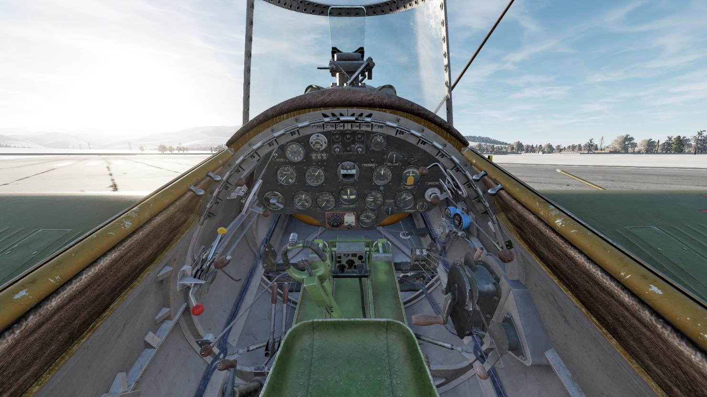

Кабину И-16 можно условно разделить на три основные части:

1. Передняя панель, включающая приборы контроля и запуска мотора,
аэронавигационные приборы, приборы электрооборудования, органы управления
вооружением и приемник радиостанции.
2. Левый борт, на котором смонтированы органы управления работой
винтомоторной группы.
3. Правый борт, на котором размещено кислородное оборудование, секторы
управления заслонками охлаждения, подъемный механизм шасси.

## Передняя панель

### Прицел ПАК-1

Прицел ПАК-1 на самолёте И-16 имеет три элемента управления:

1. Регулировка яркости подсвета сетки прицела осуществляется с помощью
реостата на приборной доске.
2. Поднятие дымчатого светофильтра позволяет улучшить видимость прицельной
сетки на фоне светлого неба, снежного покрова, т.п.
3. Раскладывание механических прицельных приспособлений позволяет вести
огонь при отказе или повреждении основной коллиматорной системы.

Прицельная сетка ПАК-1 имеет следующую разметку:

1. Радиус малого (внутреннего) круга сетки прицела составляет угловой размер 70
тысячных дальности (т.д.). Это значит, что на расстоянии 1000 м окружность
прицела охватывает область пространства радиусом 70 м.
2. Радиус большого (внешнего) кольца прицела составляет 140 т.д.
3. Угловой размер промежутка между делениями на перекрестье прицела
составляет 8 т.д.

Таким образом, с помощью сетки прицела возможно приблизительно оценить
расстояние до цели. К примеру, Bf.109K-4 с размахом крыла около 10 м заполнит
внутреннюю окружность прицела на дистанции 70 м.

### Приборная доска

1. Переключатель обогрева часов    
2. Часы АЧО                        
3. Стопкран                        
4. Три выключателя (аккумулятор,    
шунт и рация)                      
5. Электрощиток                    
6. Кнопка реле храповика           
7. Амперметр                       
8. Реостат прицела
9. Рукоятка стартера               
10. Тахометр                       
11. Указатель скорости             
12. Компас                         
13. Двухстрелочный высотомер
14. Термопара
15. Переключатель магнето
16. Трехстрелочный индикатор
17. Мановакуумметр (наддув)
18. Указатель поворота
19. Вариометр
20. Реостат кабинных ламп
21. Бензиномер
22. Трехходовой кран
23. Заливной насос запуска мотора
24. Указатель отклонения закрылков
25. Щиток электросбрасывателя ЭСБР-3

#### Тахометр

Тахометр      служит      для
измерения числа оборотов в минуту
вала мотора.

На     И-16      используется
механический              тахометр
центробежного типа. Вращение
вала двигателя передается гибким
валом в прибор, где, вращаясь, под
действием    центробежных      сил
расходятся два грузика, вызывая
отклонение стрелки.

Шкала прибора имеет деления
от 400 до 3000 об/мин, нанесенные
через     50    об/мин.    Цифры
соответствуют сотням оборотов в минуту главного вала двигателя.

#### Термопара

Термопара дает возможность
замерить температуру под свечой
первого   цилиндра   мотора    и
представляет   собой  пирометр,
действующий                  на
термоэлектрическом     принципе.
Пределы измеряемой температуры
0 - 350° С. Цена деления шкалы
прибора 10° С.
Диапазоны        температур,
опасных      для      нормальной
эксплуатации двигателя, отмечены
на шкале красными линиями.

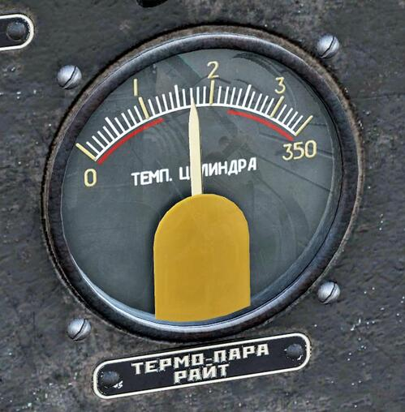

#### Трехстрелочный индикатор

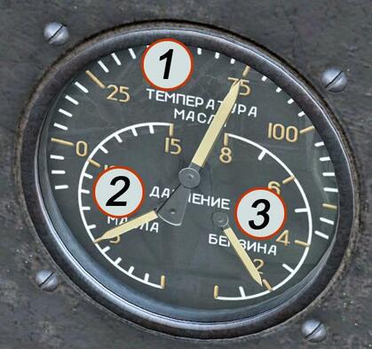

1. Указатель температуры масла
2. Манометр масла
3. Манометр топлива

Трехстрелочный индикатор     обеспечивает   контроль   работы   мотора и
объединяет в себе три прибора:

1. Аэротермометр со шкалой от 0 до 125° С, служит для измерения
температуры масла, предназначенного для смазки мотора;
2. Манометр масла от 0 до 15 ат, определяющий давление, под которым масло
поступает в мотор;
3. Манометр бензина от 0 до 0,8 ат, измеряющий давление бензина,
поступающего из бензопомпы в карбюратор мотора.

Шкалы расположены таким образом, что при нормальных значениях
измеряемых величин стрелки образуют фигуру в виде опрокинутой буквы Т. Это
значительно облегчает наблюдение за прибором, летчику не нужно всматриваться
в показания каждой стрелки, а достаточно общим взглядом оценить правильность
взаимного расположения стрелок.

#### Мановакуумметр

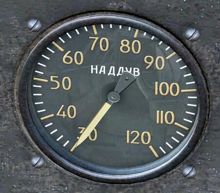

Мановакуумметр работает по принципу металлического барометра с
анероидной коробкой. Герметичный корпус прибора сообщается со всасывающей
трубой двигателя и предназначен для измерения давления (разряжения) за
нагнетателем.

Таким образом, мановакуумметр позволяет контролировать степень наддува
горючей смеси в цилиндры мотора, что необходимо для поддержания полного
сгорания топлива (чрезмерный наддув может вызвать избыточное давление в
цилиндрах и тем самым перегрузку и повреждение мотора).

Прибор определяет разность между давлением смеси или воздуха за
нагнетателем и начальным давлением на земле, т.е. определяет фактическое
давление за нагнетателем.

Диапазон измерений прибора 300 - 1200 мм рт.ст. Цена деления шкалы
мановакуумметра 20 мм рт.ст.

#### Бензиномер

Бензиномер     служит     для
определения в воздухе и на земле
количества             горючего,
находящегося      в      главном
бензиновом баке самолёта.

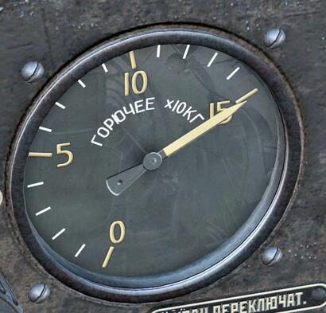

#### Заливной насос

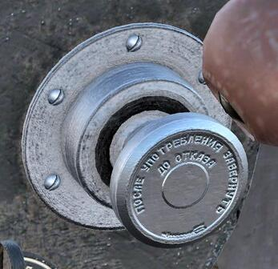

Заливной             насос
предназначен    для    создания
давления      в     специальном
заливном бачке емкостью 4 л,
топливо из которого посредством
трехходового крана направляется
для заливки карбюратора и
камеры импеллера мотора при
запуске.

При использовании насоса
необходимо      отвернуть     его
рукоятку против часовой стрелки,
выполнить     несколько    подач,
создавая давление в бачке. После
применения       насос     нужно
законтрить, повернув рукоятку по
часовой стрелке до упора.

#### Рукоятка переключения трехходового крана

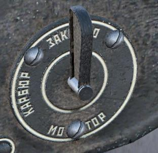

Ручка трехходового крана дает
возможность производить заливку
топливом карбюратора и мотора
перед    пуском.     Переключение
топливных магистралей при заливке
осуществляется поворотом рукоятки:

1) при совпадении ручки крана с
позицией «КАРБЮР» - производится
заливка карбюратора;

2) cовпадение ручки крана с
надписью «МОТОР» означает, что
производится заливка мотора.

После выполнения заливки ручку
крана необходимо поставить в
(в положении положение «ЗАКРЫТО».
«Закрыто»)

#### Переключатель магнето

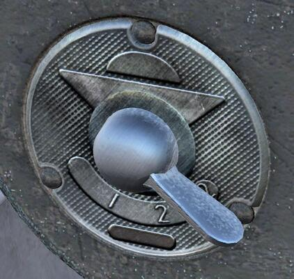

Переключатель           магнето
предназначен   для       управления
зажиганием.

Зажигание в двигателе М-63
осуществляется при помощи двух
магнето типа БСМ-9. Правое магнето
работает на передние свечи, а левое -
на задние. К левому магнето
подключена пусковая катушка; это
нужно учитывать при запуске мотора и
при проверке работы магнето.

Переключатель          магнето
позволяет шунтировать первичные
обмотки обоих магнето «на массу»
(положение ручки на 0), либо только
одного (положение 1), либо не
шунтировать оба (положение 1+2).

#### Ручка стартера

Ручка стартера используется
при электрическом запуске двигателя
и совмещает в себе функции
выключателя      мотора     Эклипса
(маховика), а также выключателя
реле храповика и пусковой катушки.

При запуске двигателя ручка
берется «на себя» (при этом
включается мотор Эклипса) и в таком
положении       удерживается      до
раскрутки маховика мотора до 10000-
12000 об/мин. После раскрутки
маховика ручка отдается «от себя» до
упора, при этом мотор Эклипса
выключается и происходит включение
реле храповика и пусковой катушки. В
таком положении надо удерживать
ручку до запуска мотора.

#### Кнопка реле храповика

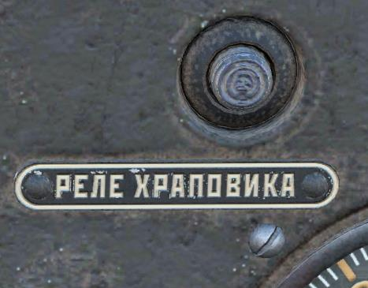

Кнопка    используется      при
электромеханическом          запуске
двигателя. В этом случае раскрутку
маховика производят вручную, при
помощи рукоятки. После того, как
маховик мотора Эклипса наберет
достаточное число оборотов (12000 —
14000), нажатием кнопки «Реле
храповика» включают реле храповика
и пусковую катушку от самолётного
аккумулятора.

#### Ручка управления «стоп-краном»

Ручка предназначена для активации механизма останова мотора посредством
управления «стоп-краном». Движение ручки «на себя» передается «стоп-крану»
двигателя через тросовую тягу. Ручка подпружинена, обратный ее ход совершается
под действием пружины, смонтированной в механизме останова мотора.

Включение механизма создает отсос воздуха из поплавковой камеры и,
вследствие увеличения разности давлений над топливом в колодце главного
жиклера и в поплавковой камере, колодец опорожняется, тем самым прекращается
подача топлива через выходное отверстие форсунки малого газа, что вызывает
моментальную остановку мотора.

Остановку мотора «стоп-краном» необходимо производить на малых
оборотах.

#### Указатель скорости

Указатель предназначен для замера и показаний воздушной скорости
самолёта в каждый данный момент полета. Это необходимо, во-первых, для
сохранения заданного режима полета и, во-вторых, для определения истинной
воздушной скорости. На основании показаний прибора определяется также и
путевая скорость самолёта.

В основе работы указателя лежит метод измерения давления воздушного
потока в трубке Пито, расположенной на правой консоли крыла самолёта.
Необходимо помнить, что обледенение трубки значительно снижает точность
показаний прибора, и своевременно включать ее обогрев.

Шкала указателя скорости имеет диапазон измерений 100 - 600 км/ч, цена
деления составляет 10 км/ч.

#### Указатель поворота

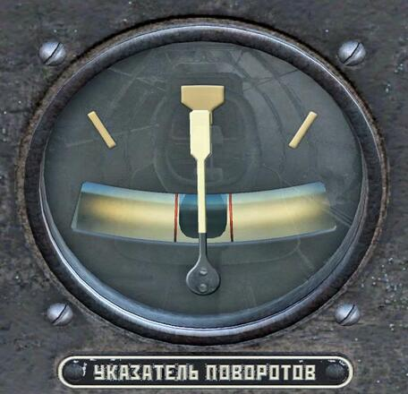

Прибор указывает летчику наличие вращения самолёта вокруг вертикальной
оси и наличие поперечного скольжения.

На шкале прибора нанесены три индекса: нулевой индекс посредине шкалы и
два по бокам под углом 30°. Стрелка указателя поворота находится против
нулевого индекса при прямолинейном полете и отклоняется вправо или влево при
соответственном повороте самолёта; при этом отклонение стрелки тем больше,
чем больше угловая скорость поворота самолёта.

Указатель поворота в сочетании с магнитным компасом повышает точность
пилотирования по прямой, поскольку стрелка указателя поворота быстрее и точнее
реагирует на отклонения самолёта от прямой, чем магнитный компас.

Также, на приборе смонтирован указатель скольжения, индикатором которого
является шарик, перемещающийся внутри стеклянной трубки. Отклонение шарика
вправо или влево от середины трубки указывает на наличие скольжения самолёта.
Комбинация указателя поворота с указателем скольжения позволяет
выполнять правильный вираж с определенной скоростью разворота.

Для работы указателя поворота используется гироскоп. Раскрутка маховика
гироскопа обеспечивается путем воздействия на него воздушной струи,
возникающей вследствие перепада давления внутри и снаружи корпуса прибора. В
качестве источника вакуумного питания на И-16 применяется трубка Вентури,
смонтированная на правом борту самолёта.

#### Двухстрелочный высотомер

Двухстрелочный         высотомер
предназначен      для     определения
барометрической высоты относительно
места взлета или посадки самолёта. В
качестве   чувствительного   элемента
высотомера     используется   двойная
анероидная коробка с изолированными
внутренними полостями.

Прибор имеет большую и малую
стрелки: первая делает один оборот за
1000 м высоты; вторая - один оборот за
10    000     м.    Прибор    снабжен
барометрической шкалой для внесения
поправок в показания прибора в связи с
изменениями           барометрического
давления      на     земле.     Шкала
барометрического             давления
устанавливается     кремальерой     на
давление, наблюдаемое на земле в
момент отсчета по прибору.

#### Компас

Компас КИ-11 является путевым
магнитным компасом. Лимб прибора
разбит на деления по 5° с оцифровкой
через    30°.   Курс    отсчитывается
непосредственно по картушке против
курсовой черты, установленной между
стеклом и картушкой.

Для демпфирования колебаний
картушки корпус компаса заполнен
жидкостью.

В      приборе     предусмотрена
возможность       подсветки     лимба
встроенной лампой, рассчитанной на
питание от бортовой сети самолёта.

#### Часы

Часы АЧО предназначены для
определения текущего времени
суток. Кроме основного часы имеют
дополнительный          секундный
циферблат. Часы механические, с
ручным подзаводом, запас хода
составляет 30 часов.

Часы     АЧО      снабжены
электроподогревом,
обеспечивающим стабильную и
точную работу механизма в
условиях    низких   температур.

Питание         электроподогрева
обеспечивается от бортовой сети
самолёта, включается тумблером,
расположенным       слева     на
приборной доске.

#### Указатель отклонения закрылков

Указатель        отклонения
закрылков служит для контроля
правильности         применения
закрылков.     Шкала     прибора
указывает      угол     текущего
отклонения      закрылков,    от
убранного положения (0°) до
максимально выпущенных (60°).
Цена деления шкалы 5°.

Прибор         существенно
повышает     информированность
летчика, учитывая невозможность
определения состояния закрылков
по положению рукоятки их выпуска.

#### Вариометр

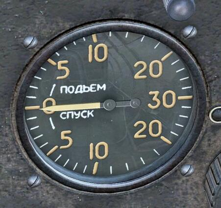

Вариометр указывает скорость изменения высоты полета.
Шкала прибора имеет затухающую градуировку (с ценой деления 1 м/с в
начале шкалы, 2 м/с – в конце) и позволяет оценивать скорость снижения или
набора высоты в диапазоне 0-30 м/с. В случае превышения вертикальной скорости
более 30 м/с стрелка прибора становится на упор.

Будучи весьма чувствительным прибором, вариометр реагирует на
незначительную скорость изменения высоты и тем самым дает возможность вести
самолёт горизонтально. Это качество вариометра делает его особенно ценным для
слепого полета. Кроме того, вариометр позволяет быстро установить нужный
режим полета при планировании, пикировании и наборе высоты.

#### Электрощиток летчика

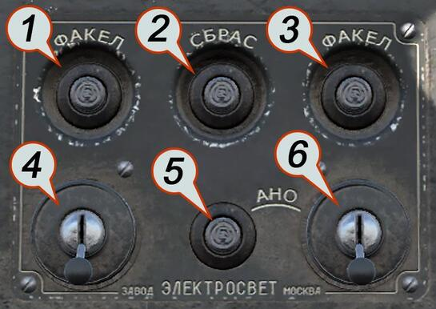

1. Кнопка поджига левого осветительного факела
2. Кнопка сбрасывания осветительных факелов
3. Кнопка поджига правого осветительного факела
4. Переключатель обогрева трубки Пито
5. Одинарная кнопка сигнализации АНО
6. Переключатель аэронавигационных огней

#### Амперметр

Амперметр информирует летчика
о силе тока в бортовой электросети
самолёта.

Пределы измерений прибора 10-
0-30А.

### Приемная радиостанция РСИ-3 «сокол»

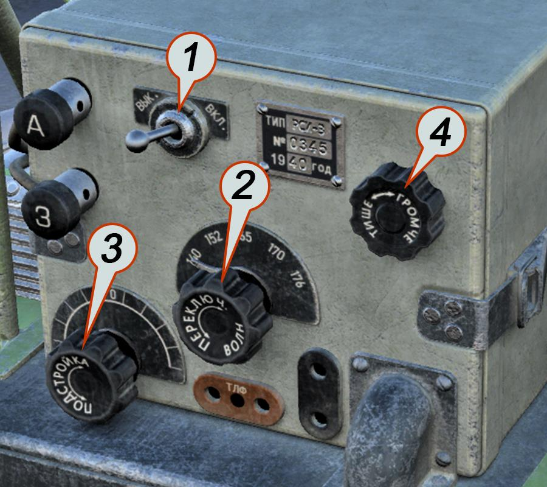

1. Тумблер «вкл-выкл» для включения и выключения накала ламп
приемника.
2.   Ручка «переключатель волн» для установки одной из пяти
фиксированных волн по нанесенным на шкале отметкам с номерами.
3. Ручка «подстройка» для точной подстройки на волну корреспондента.
Ручка имеет плавный двухсторонний ход вправо и влево от среднего
положения, обозначенного цифрой 0 на шкале. При вращении происходит
изменение емкости подстроечного конденсатора.
4. Ручка «регулятор громкости». Посредством этой ручки летчик имеет
возможность установить в некоторых пределах нужную ему громкость
приема корреспондента и изменять эту громкость, в зависимости от
изменения силы приходящих сигналов.

### Указатель положения шасси

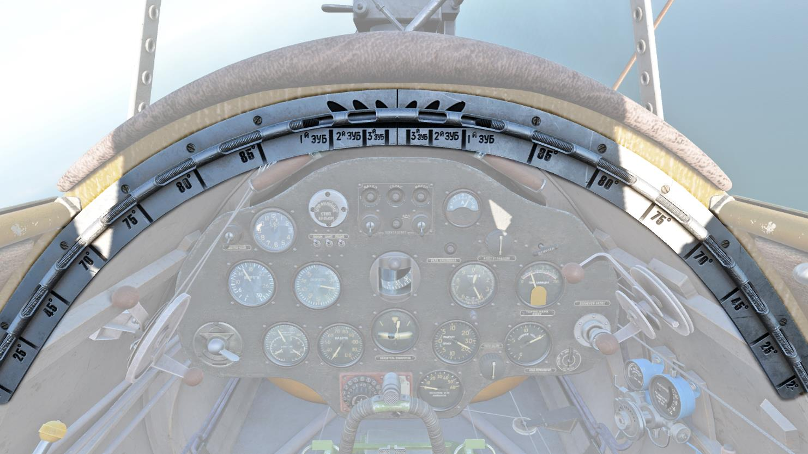

На самолёте установлен механический указатель, позволяющий летчику
определять все промежуточные положения шасси в процессе его опускания или
подъема. Конструктивно указатель шасси представляет собой градуированную
дугообразную пластину (шкалу), к которой приклепана трубка с вырезами. Внутри
трубки помещается трос: один конец троса соединен с ползушкой шасси, а другой
– имеет напаянную шарообразную головку и перемещается по трубке указателя.

При подъеме шасси ползушка по направляющей тянет за собой трос
указателя, соответственно информируя летчика о текущем положении шасси.

Механический указатель при полном выпуске шасси в рабочее положение
дает возможность судить, на каком зубе гребенки замка произошло запирание
ползушки. Для этого на шкале указателя с левой и правой сторон нанесены деления
с нумерацией зубьев гребенки замка.

## Левый борт кабины

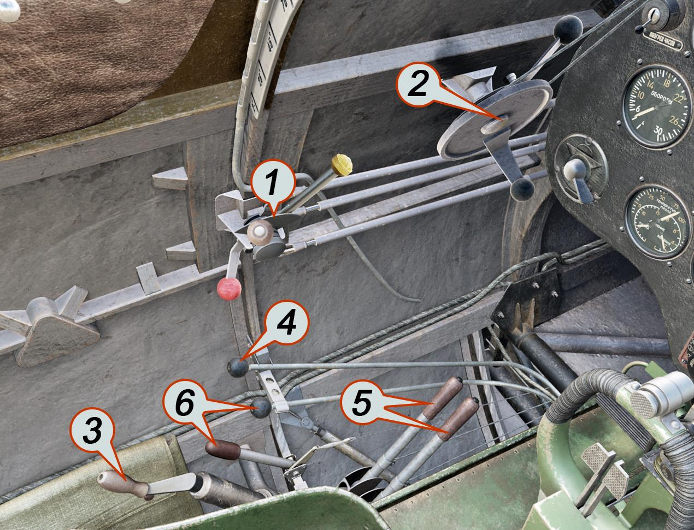

1. Секторы управления мотором
2. Секторы управления форсажем и шагом винта
3. Ручка выпуска закрылка
4. Ручка управления пожарным краном
5. Рычаги перезарядки крыльевых пулемётов
6. Органы управления подвесными топливными баками

### Сектор управления мотором

1. Рычаг нормального газа
2. Кнопка дополнительного хода
сектора нормального газа
3. Рычаг управления скоростями
нагнетателя
4. Рычаг высотного газа
5. Гайка - фиксатор рычагов

Рычаг нормального газа предназначен для управления наддувом двигателя.
Рычаг имеет два диапазона хода: основной и дополнительный. В пределах
основного хода давление за нагнетателем (наддув) поддерживается автоматически
регулятором РПД-1. При перемещении рычага за пределы основного, в область
дополнительного хода, РПД-1 выключается. Давление наддува в этом случае
устанавливается летчиком и контролируется по вакуумметру. Для перевода рычага
в область дополнительного хода необходимо зажать кнопку на вершине ручки
комбинацией [[LAlt+E]] и передвинуть рычаг за ограничитель.

Рычаг    высотного    газа   используется для регулировки          работы
автоматического высотного корректора, либо в случае его отказа. При нормальной
работе автокорректора рычаг должен находиться в положении «Нормально» (ручка
по центру). В центральном положении рычаг фиксируется подпружиненным
выступом, перемещающимся вдоль фигурной прорези, находящейся в пластине
сбоку от рукоятки.
При отказе автокорректора его игла может становиться в «земное
положение», в этом случае по мере роста высоты полета рычаг нужно переводить
в положение «Бедно» - от себя. Иногда (низкая температура окружающей среды,
взлет) сектором высотного газа можно подрегулировать иглу на некоторое
обогащение смеси, опустив ее постановкой рычага в положение «Богато» (ручка на
себя). Для смещения рукоятки от центрального (фиксированного) положения нужно
нажать на шарик вверху рукоятки.

Рычаг управления скоростями нагнетателя               предназначен для
переключения регулятора РПД-1 между первой и второй степенью наддува. Первая
скорость используется при запуске на земле, взлете и полетах до высоты 2500 м.
При полетах выше 2500 м нагнетатель необходимо рычагом переключить на
вторую скорость.

### Секторы управления форсажем и винтом

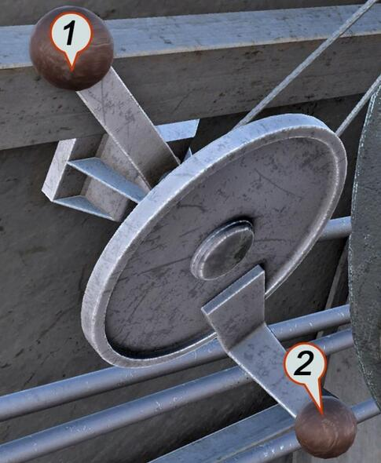

1. Рычаг управления форсажем
2. Рычаг управления шагом винта

Рычаг управления форсажем
позволяет посредством регулятора
РПД-1 повысить давление за
нагнетателем до 1065 мм рт.ст.
вместо 915 мм рт.ст. в нормальных
условиях.   Включение     форсажа
производится        перемещением
рычага от себя.

Сектор управления винтом
позволяет менять шаг винта,
управляя регулятором постоянного
числа оборотов Р-2. При постановке
рычага «на себя» винт переводится
на большой шаг, «от себя» - на
малый шаг.

### Ручка управления пожарным краном

Ручка     пожарного   крана
позволяет в случае необходимости
быстро прекращать поступление
топлива и отключать топливную
систему от двигателя.

Пожарный кран в топливной
магистрали               самолёта
располагается между бензиновым
фильтром и бензонасосом. Ручка
связана   с   пожарным     краном
посредством тросовой тяги.

### Рукоятка выпуска щитков

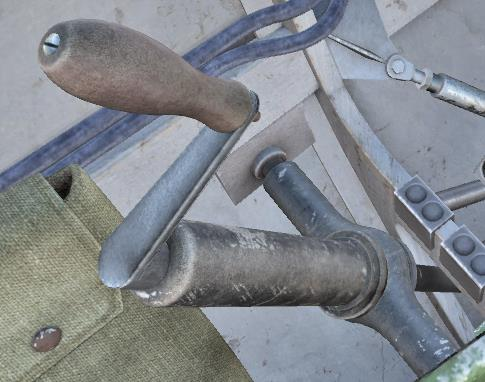

Рукоятка предназначена для
механического            управления
отклонением закрылков. При выпуске
закрылков рукоятку вращают по
часовой стрелке, при уборке – против.

Текущий угол отклонения закрылков
контролируют по указателю на
приборной доске.

### Органы управления подвесными топливными баками

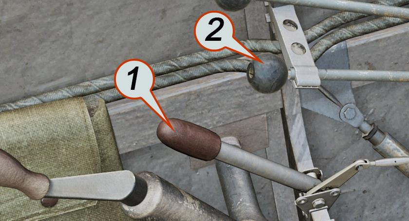

1. Рычаг сброса подвесных баков
2. Ручка переключения топливных баков

Представленные органы управления используются в случае оснащения
самолёта внешними подвесными топливными баками. Ручка 2 позволяет
переключать топливную магистраль самолёта на питание от центрального бака
(ручка утоплена), либо от подвесных топливных баков (при этом ручку необходимо
вытянуть «на себя»). Рычаг 1 предназначен для сброса баков в случае
необходимости.

Сброс подвесных баков можно производить только после переключения
топливного коллектора на центральный бак.

## Правый борт кабины

1. Рычаг управления жалюзи капота
2. Рычаг управления заслонкой маслорадиатора
3. Кислородный прибор КПА-3 бис
4. Рукоятка ручного сцепления маховика на запуск двигателя
5. Подъемный механизм шасси

### Секторы управления охлаждением

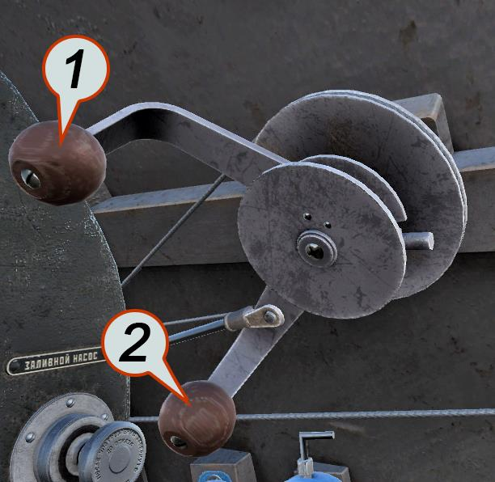

1. Сектор управления жалюзи капота
двигателя
2. Сектор управления заслонкой
маслорадиатора

Рычаги    секторов    позволяют
контролировать     уровень    обдува
встречным       потоком      воздуха
маслорадиатора и цилиндров мотора.

В положении рычагов «на себя»
воздухозаборники закрыты, «от себя» -
открыты.

Следует учитывать также, что
открытые     створки      ухудшают
аэродинамику    самолёта,    снижая
максимальную скорость.

### Ручка механического включения реле храповика

Ручка используется при
механическом (ручном) запуске
двигателя.

В этом случае источников
электроэнергии не требуется.
Раскрутку маховика Эклипса
производят      вручную,     а
включение            храповика
осуществляется при помощи
ручки через тросовую проводку.

Для этого необходимо вытянуть
шарик с тросовой тягой «на
себя».

### Подъемный механизм шасси

1. Аварийный стопор шасси
2. Ручка подъема/опускания
шасси
3. Ручка собачки храпового
колеса шасси
4. Пружина тормоза шасси.

### Рукоятка регулировки высоты сиденья

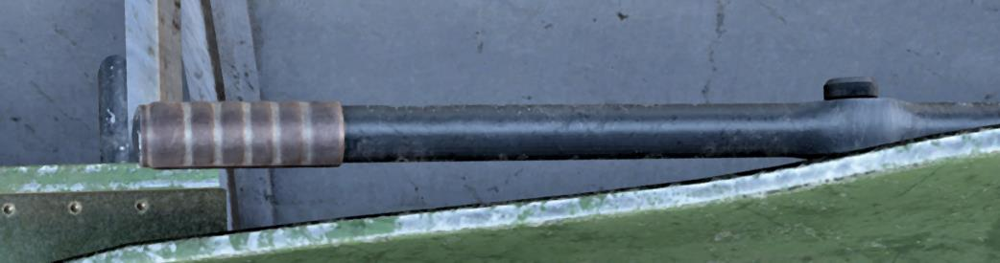

Рукоятка расположена с правой стороны сиденья летчика и позволяет
регулировать его высоту в пределах 110 мм. Для регулировки ручку необходимо
потянуть вверх.

### Кислородный прибор КПА-3 бис

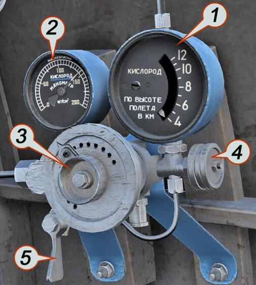

1. Индикатор кислородного потока
2. Манометр кислородного баллона
3. Маховичок анероидной коробки
подачи кислорода
4. Запорный вентиль подачи
кислорода
5. Аварийный вентиль подачи
кислорода

Назначение       кислородного
прибора типа КПА-З бис - дополнять
недостающее количество кислорода
для дыхания человека в условиях
полета на высотах от 4500 до 10000
м.    Прибор    дозирует     подачу
кислорода        по        высотам
автоматически,   что    достигается
применением               анероида,
регулирующего рабочее давление в
редукторе.

Технология работы с кислородным прибором КПА-3 бис описана в главе
[«Эксплуатация кислородной системы»](04.procedures.md#_19).

## Органы управления вооружением

### Рычаги перезарядки фюзеляжных пулемётов

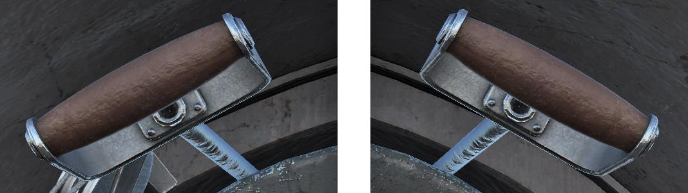

Рычаги перезарядки используются на земле при заряжании пулемётов, а
также в полете - для устранения задержек, возникающих при стрельбе.

### Рычаги перезарядки крыльевых пулемётов.

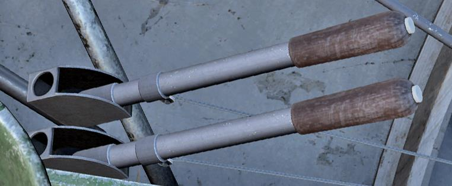

Рычаги перезарядки используются при наземном заряжании крыльевых
пулемётов, а также для перезарядки в случае возникновения задержек при
стрельбе. Движение ручек передается крыльевым пулемётам через тросовую
проводку. Правый пулемёт управляется правой ручкой, левый, соответственно -
левой.

Система перезаряжания также служит для постановки крыльевых пулемётов
на предохранитель. При отводе и удержании подвижных частей пулемёта ручкой
перезаряжания в заднем крайнем положении исключается возможность
произвольных выстрелов. Для установки на предохранитель внутри ручек
перезаряжания смонтирован стопор, автоматически фиксирующий ручку в крайнем
заднем положении. При переходе к стрельбе следует нажать в верхней части ручки
кнопку и перевести ручку в крайнее переднее положение.

### Ручка управления самолётом (РУС)

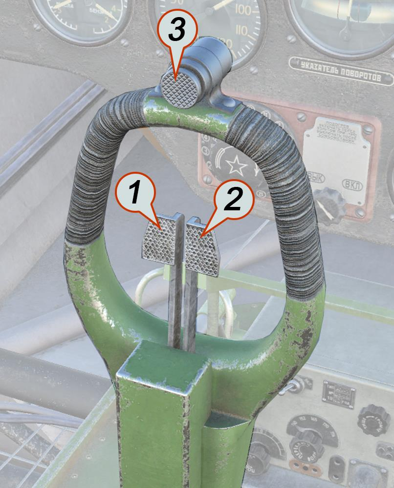

1. Гашетка синхронных пулемётов
2. Гашетка крыльевых пулемётов
3. Боевая кнопка подвесного вооружения

Ручка управления самолётом состоит из нижнего шарнирного узла, рычага и
баранки с гашетками. Изготовлена ручка преимущественно из дюралюминия, за
исключением стального нижнего узла. Связь с элеронами обеспечивается
тросовыми тягами, с рулем высоты – жесткой трубчатой тягой. Отклонения ручки
по тангажу составляют ±15°, по крену ±19°.

На баранке размещены органы управления встроенным и подвесным
вооружением. Гашетки связаны с пулемётами механически при помощи тросовой
проводки. Боевая кнопка обеспечивает замыкание электрических цепей
электросбрасывателя.

### Электросбрасыватель ЭСБР-3П

1. Лимб установки
количества
авиационных средств
поражения (АСП) в
залпе
2. Выключатель
питания ЭСБР
3. Отметка «0» -
постановка ЭСБР на
предохранитель
4. Индексы
количества АСП в
залпе
5. ------^^
6. ------^^
7. Счетчик
сброшенных АСП
(номера пилонов)

ЭСБР-Зп (электросбрасыватель, тип 3 с подогревом) служит для управления
подвесным вооружением самолёта. Прибор позволяет формировать электрические
управляющие импульсы и распределять их по узлам подвески. Сигналы
электросбрасывателя могут инициировать включение двигателя реактивных
снарядов или открытие замков бомбодержателя.

Сбрасыватель позволяет применять подвесное вооружение И-16 с одного
узла подвески, с двух одновременно, с четырех узлов одновременно.
На передней панели прибора располагаются лимб установки количества АСП
в залпе и выключатель. Вокруг лимба нанесена шкала, разбитая на три группы
римских цифр (I, II, IV), указывающих количество бомб в залпе.

Для применения вооружения необходимо включить питание ЭСБР и
установить маркер лимба на желаемое количество бомб в залпе. В процессе
сброса вооружения с внешней подвески лимб будет автоматически переключаться
последовательно по ряду арабских цифр, отсчитывая расход боеприпасов и
указывая, с какого держателя был произведен пуск.

При этом имеется возможность выбрать узел подвески, с которого будет
применено оружие. Пусковые направляющие для РС устанавливаются на узлы 1 -
6, бомбодержатели – на узлы 7 - 8. Соответственно, при необходимости
применения бомб перед пуском РС необходимо перевести лимб в позицию «6»,
произвести сброс с 7-го и 8-го узлов, далее вернуть лимб в позицию «I» (либо «II»
или «IV») и штатно выполнить пуск РС.

{!abbr.md!}
