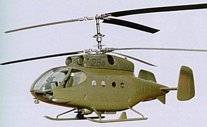
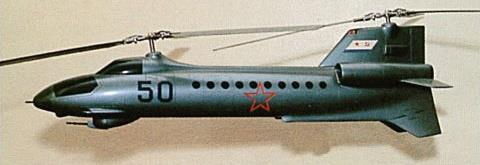
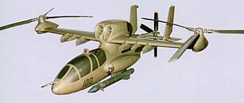
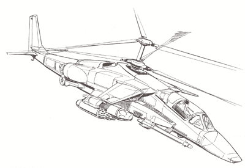
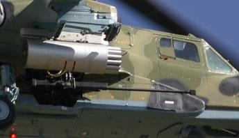
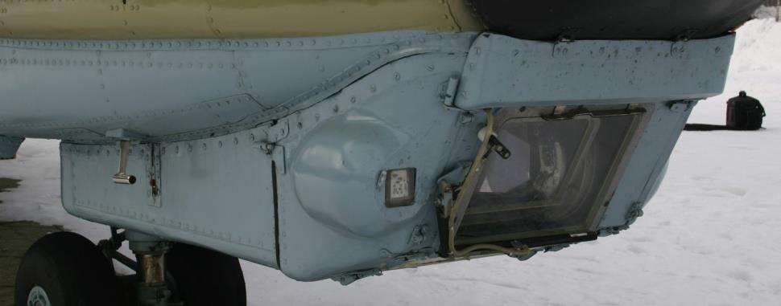
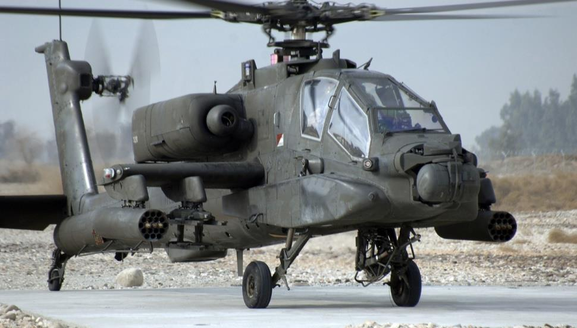
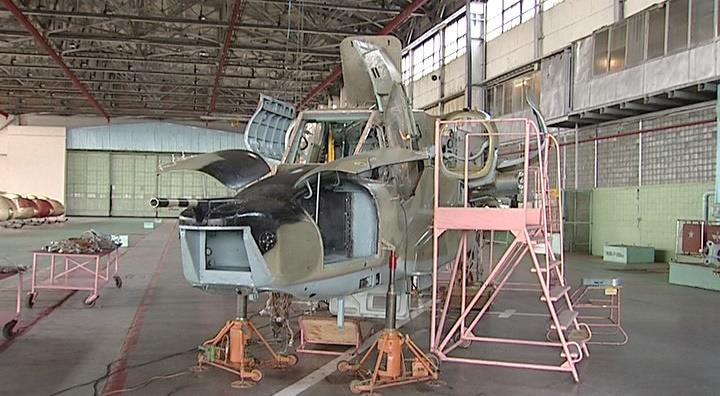
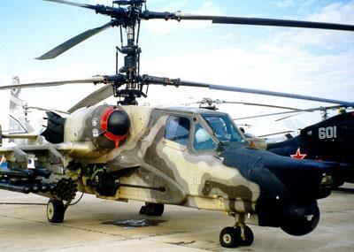
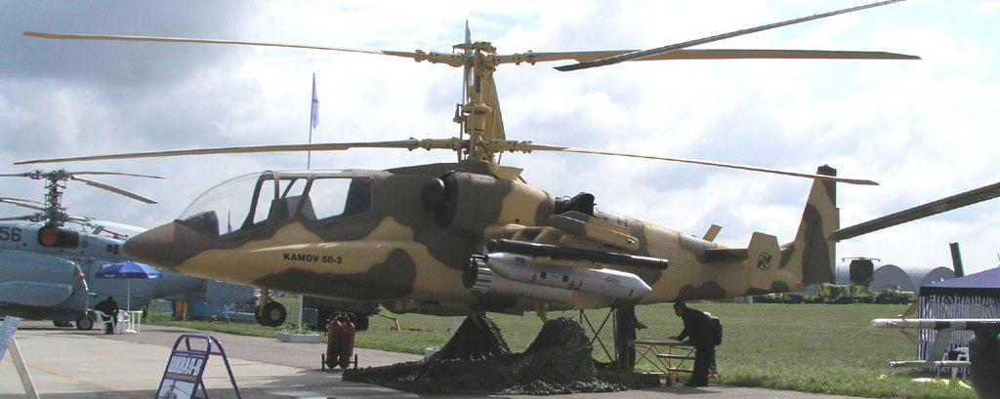

# История вертолёта Ка-50

В середине 70-х годов прошлого столетия руководство Министерства обороны СССР
пришло к мнению, что основной советский ударный вертолёт Ми-24 не удовлетво
ряет требованиям армии. Попытки создать многоцелевой вертолёт в ограниченных
размерностях и массе, с заданными летными характеристиками, привели к уменьше
нию боевой эффективности. Кроме того, в конце 1972 года в США началась про
грамма, результатом которой стало создание перспективных ударных вертолётов
Bell YAH-63 и Hughes YAH-64. Позднее вертолёт AH-64 Apache был принят для мас
сового производства и начал поставляться в армию США как основной боевой вер
толёт.

16 декабря 1976 года ЦК КПСС и Совет Министров СССР издали постановление о
начале разработки боевого вертолёта нового поколения, который должен был по
ступить на вооружение Советской Армии в 80-х годах прошлого столетия. Основным
назначением нового вертолёта должно было стать уничтожение бронетехники на
поле боя близко к линии боевого соприкосновения. Постановление инициировало
конкурентную разработку программы в КБ Камова и КБ Миля, чтобы в дальнейшем,
на основании испытаний, принять на вооружение наиболее удачный образец верто
лёта. В КБ Миля начали разработку вертолёта под обозначением Ми-28, который
внешне сильно напоминал американский проект AH-64 Apache.

В КБ Камова начали разработку нового вертолёта для армии, имея богатый опыт со
здания флотских машин с соосными винтами. Эта схема была уже надежно отрабо
тана и сулила выигрыш в летных характеристиках по сравнению с классической
компоновкой, к тому же КБ уже имело определенный опыт разработки вертолёта
для армии. В 1966 году на конкурсной основе в КБ был создан транспортно-боевой
вертолёт на базе корабельного Ка-25 – Ка-25Ф (Ф – фронтовой), вооруженный спа
ренной 23-мм пушкой в турели под фюзеляжем, шестью противотанковыми управ
ляемыми ракетами «Фаланга» и свободнопадающими бомбами. Ка-25Ф имел экипаж
из двух человек и мог брать на борт до восьми десантников. Однако предпочтение
было отдано вертолёту Ми-24, который использовал перспективные двигатели, при
цельную систему и новые противотанковые ракеты «Штурм».

В 1969 году на последнем этапе конкурса КБ Камова предложило радикально новую
концепцию дизайна боевого вертолёта В-50. На вертолёте предполагалось
продольное расположение двух роторов с синхронизированным вращением винтов
во избежание перехлеста лопастей. Предполагаемая максимальная скорость В-50
должна была составлять около 400 км/ч. Также в 1975-1976 годах КБ Камова был
предложен проект В-100, в котором предполагалось использовать поперечное рас
положение винтов на концах крыла и дополнительный толкающий пропеллер. Оба
проекта - и В-50, и В-100, были чрезвычайно смелыми и остались нереализован
ными.

Новый армейский вертолёт под обозначением В-80 (в серии Ка-50) начал разраба
тываться на УВЗ им. Камова в январе 1977 года. Ведущим конструктором программы
был назначен Сергей Михеев, впоследствии ставший Генеральным Конструктором.

При проектировании исследовались различные компоновки и конфигурации для бу
дущего вертолёта, однако выбор был остановлен на традиционной для КБ соосной
схеме, которая давала неоспоримые преимущества. Значительное уменьшение по
терь мощности соосной схемы по сравнению с классической схемой (с одним несу
щим и одним рулевым винтом) позволяло увеличить статический потолок вертолёта
при той же мощности двигателей. Аэродинамическая симметрия и отсутствие пере
крестных связей в управлении значительно упрощали управление вертолётом. Та
кой вертолёт имел меньшие ограничения по углам скольжения, угловым скоростям
и ускорениям в полном диапазоне скоростей полета. Относительно низкий момент
инерции, обусловленный меньшими размерами соосного вертолёта, позволял реа
лизовать более эффективное управление.

Другим фундаментальным отличием нового вертолёта было отсутствие оператора
вооружения, из-за чего пришлось ввести высокоавтоматизированные обзорные и
навигационные системы.

Конструкторы КБ Камова считали, что один человек может выполнять функции пи
лота и оператора, так как поиск и сопровождение цели автоматизированы, и это не
должно привести к чрезмерному повышению психофизических нагрузок на летчика.

В конце семидесятых годов уровень национального вертолётостроения позволил со
здавать такие автоматизированные системы, и Ка-25, а также Ка-27 могли вести ав
томатизированный поиск подводных лодок, имели автоматические режимы навига
ции и возможность обмена данными. Одноместный вертолёт позволял снизить вес и
повысить летные характеристики, уменьшить затраты на обучение летного состава,
уменьшить людские потери в военное время, в целом снизить затраты на содержа
ние армейской авиации.

В качестве основной системы вооружения была выбрана противотанковая ракета
9А4172 «Вихрь», созданная в Тульском КБ приборостроения (Генеральный Кон
структор Аркадий Шипунов). Это же оружие было выбрано для противотанкового
штурмовика КБ Сухого – Су-25Т. Отличительной особенностью ракеты была ла
зерно-лучевая система наведения с системой автоматического слежения за целью,
реализованная в прицельном комплексе «Шквал» и дающая высокую точность неза
висимо от расстояния до цели. Дальность ракеты позволяла применять ее, находясь
вне зоны поражения широко распространенных западных ЗРК «Чапаррел», «Ро
ланд», «Рапира», а наличие как контактного, так и неконтактного взрывателя
позволяло поражать как подвижные бронированные наземные цели, так и неманев
ренные воздушные.

При разработке вертолёта особое внимание было уделено выбору пушечного воору
жения. Конструкторы установили 30-мм одноствольную пушку 2А42, разработанную
в Тульском КБ приборостроения под руководством В.П. Грязева, которая изна
чально предназначалась для вооружения боевых машин пехоты. При установке
пушки конструкторы вертолёта столкнулись с проблемой ее размещения - необхо
димо было сохранить высокую точность и минимизировать потери, связанные с
большим весом 2А42 по сравнению с авиационными пушками. В результате было
решено разместить пушку на подвижном лафете с правого борта, близко к центру
масс, в наиболее жесткой части вертолёта. Такая конфигурация позволила умень
шить возмущения, вызванные значительной отдачей, и сохранить точность при не
которой потере горизонтальной подвижности.

Кроме противотанковых ракет и пушки, по требованию заказчика В-80 получил воз
можность применять неуправляемые авиационные ракеты (НАР), подвесные пушеч
ные контейнеры УПК-23, бомбы, контейнеры мелких грузов (КМГУ), а также возмож
ность в будущем применять другие управляемые ракеты класса воздух-земля и воз
дух-воздух.

Установленный на В-80 автоматический прицельный комплекс И-251В «Шквал» был
создан на красногорском оптико-механическом заводе «Зенит». «Шквал» разраба
тывался в двух вариантах – И-251 авиационный вариант, которым оборудовали
штурмовик Су-25Т, и И-251В – вертолётный вариант, для оборудования вертолёта
В-80. Ленинградское НПО «Электроавтоматика» разработало для вертолёта при
цельный пилотажно-навигационный комплекс (ПрПНК) К-041 «Рубикон».

Одним из приоритетных направлений при создании вертолёта было увеличение его
живучести в условиях современного боя. Для этого была тщательно продумана ком
поновка вертолёта и его систем, велись исследования конструкционных материа
лов. Отсутствие рулевого винта, трансмиссии и редукторов заметно повышало жи
вучесть вертолёта, одноместная кабина позволила увеличить массу брони в расчете
на одного человека, по сравнению с двухместными машинами. Заметно повышали
боевую живучесть вертолёта следующие конструктивные и технологические реше
ния:

- расположение двигателей по сторонам фюзеляжа, что исключает их одно
временное повреждение от одного попадания;

- возможность продолжать полет на одном двигателе;

- бронирование кабины разнесенной стальной, алюминиевой и прозрачной
броней;

- бронирование и экранирование части гидросистемы управления;

- экранирование жизненно важных агрегатов менее важными;

- использование протектированных топливных баков с заполнителем из по
лиуретана;

- применение в конструкции композитов, сохраняющих работоспособность
нагруженных элементов конструкции при повреждениях;

- использование двухконтурного лонжерона лопасти винта;

- размещение внутри бронекабины рулевых тяг увеличенного диаметра;

- оснащение двигателей и отсеков топливных баков противопожарной защи
той;

- способность трансмиссии сохранять работоспособность в течение 30 минут
после поражения маслосистемы;

- дублирование и разнесение по бортам системы энергопитания, цепей
управления и др.;

- возможность применения средств индивидуальной защиты летчика.

Катапультное кресло летчика, приборное оборудование, часть проводки управления
и элементы прицельно-пилотажно-навигационного комплекса размещены в полно
стью бронированной кабине. Металлическая броня, представляющая собой разне
сенные алюминиевые плиты общей массой более 300 кг, была интегрирована в кон
струкцию фюзеляжа, что несколько снизило общую массу машины. Впоследствии,
испытания в ГосНИИАС подтвердили, что защита летчика гарантируется при попа
дании в борт серии пуль калибра 12,7 мм и осколков снарядов калибра до 20 мм.

Уникальной особенностью вертолёта В-80 является катапультная система спасения
летчика – катапультное кресло К-37-800, первая в мире вертолётная катапультная
система, созданная под руководством Гая Северина в НПО «Звезда». Кроме ката
пультной системы защиту и выживание пилота обеспечивает также сама конструк
ция вертолёта, которая при грубой посадке с большими вертикальными скоростями
поглощает энергию удара. При этом кабина вертолёта деформируется с уменьше
нием внутреннего объема не более чем на 10-15 %. Также продумана конструкция
топливной системы, исключающая возможность возникновения пожара после гру
бого приземления.

Как известно, эффективность боевых действий вертолётных подразделений во мно
гом зависит от эксплуатационных показателей вертолётов и средств наземного об
служивания. При создании В-80 этому уделялось внимание уже на ранних этапах
проектирования. Активное участие в работе принимали специалисты НИИ Эксплуа
тации и Ремонта Авиационной Техники (НИИЭРАТ) Министерства обороны. При со
здании системы технического обслуживания вертолёта особое внимание было уде
лено возможности его автономного базирования на неподготовленных полевых пло
щадках.

Таким образом, в конце 70-х годов в КБ Камова была выработана концепция нового
боевого вертолёта В-80: одноместный, соосный, высокоманевренный вертолёт с
мощным и разнообразным вооружением, дальность стрельбы которого должна пре
восходить дальность стрельбы противодействующих систем потенциального против
ника. Предполагалось оснащение вертолёта комплексом функционально связанного
оборудования с высоким уровнем автоматизации решаемых задач, обеспечение вы
сокой боевой живучести и наличие средств спасения летчика в аварийной ситуации,
а также наличие возможности длительного базирования на неподготовленных пло
щадках. Вертолёт должен был стать частью разведывательно-ударного комплекса,
включающего авиационные и наземные средства разведки и целеуказания. Основ
ным соперником нового вертолёта считался американский вертолёт AH-64A Apache,
материалы по созданию которого тщательно изучались. Составить ему конкуренцию
было весьма непростой задачей.

В августе 1980 года окончательно решалось, быть или не быть одноместному верто
лёту в металле. Комиссия Президиума Совета Министров СССР по военно-промыш
ленным вопросам приняла постановление о постройке экспериментальных вертолё
тов: двух В-80 и двух Ми-28 с целью проведения их сравнительных испытаний. В
тот год Министерство Обороны выдало техническое задание на оба типа вертолё
тов.

Первый опытный образец В-80 (бортовой номер 010) вышел из цехов Ухтомского
вертолётного завода (УВЗ) в июне 1982 года. 17 июня летчик-испытатель Н.П. Без
детнов впервые выполнил на нем висение, а 23 июля – совершил первый полет по
кругу.

В-80 №01 предназначался для оценки летно-технических характеристик и отра
ботки вертолётных систем. В частности, выполнялись полеты с хвостовым опере
нием различной формы, без крыльев и т.д.

В августе 1983 года был выпущен второй опытный образец, В-80 №02 (бортовой но
мер 011), который предназначался для отработки систем авиационного
оборудования и вооружения; на вертолёте были установлены двигатели ТВ3
117ВМА вместо ТВ3-117В. Впервые были смонтированы ПрПНК «Рубикон» К-041,
несъемная подвижная пушечная установка НППУ-80 и система кондиционирования
воздуха. Первый полет «двойки» состоялся 16 августа 1983 года.

В конце 1984 года были подведены первые итоги конкурса. Отмечалось, что по мно
гим характеристикам В-80 превосходит Ми-28. Начались полеты по программе пер
вого этапа Государственных сравнительных летных испытаний для более глубокой
оценки летно-технических характеристик вертолётов В-80 и Ми-28. Для завершения
программы оценки летно-технических характеристик вертолёта в декабре 1985 года
был выпущен третий опытный В-80 (бортовой номер 012) со смонтированным в носу
макетом ночной низкоуровневой прицельной станции «Меркурий».

После окончания летно-конструкторских испытаний В-80 №02, в сентябре 1985 года
на Гороховецком полигоне Главного Ракетно-артиллерийского управления начались
Государственные сравнительные летные испытания для оценки боевой эффективно
сти вертолётов В-80 и Ми-28.

Испытания завершились в августе 1986 года. Их результаты показали, что В-80 пре
восходит вертолёт Ми-28 по критерию «эффективность-стоимость», благодаря бо
лее высокой боевой живучести, лучшим летно-техническим характеристикам (осо
бенно на больших высотах и при высоких температурах), а также более широким
возможностям вооружения. Несмотря на то, что во время полетов уровень психофи
зических нагрузок на летчика приближался к аналогичному показателю в истреби
тельно-бомбардировочной авиации, была доказана принципиальная возможность
совмещения функций пилота и штурмана-оператора. В НИИ Министерства обороны
были сделаны выводы, что вертолёт КБ Камова является более перспективным.

В то же самое время у вертолёта было несколько неприятных недостатков. Самым
существенным была признана невозможность ведения боевых действий ночью из-за
низких характеристик телевизионной системы ночного видения «Меркурий». По
итогам сравнительных испытаний заказчиком было рекомендовано завершить до
водку ночной системы, оснастить В-80 бортовым комплексом обороны, обеспечить
уменьшение количества операций, выполняемых летчиком при поиске и атаке це
лей, выполнить сопряжение бортовой аппаратуры с аппаратурой наземных и авиа
ционных разведывательных средств. По результатам конкурса 14 декабря 1987 года
было принято постановление ЦК КПСС и Совета Министров СССР о победе КБ Ка
мова, проведении Государственных испытаний и запуске В-80 в серию.

Подготовка к серийному производству В-80 началась на Арсеньевском авиационном
заводе (находящемся в 278 км от Владивостока), известном ныне как Арсеньевская
авиационная кампания «Прогресс». В соответствии с упомянутым постановлением,
на Ухтомском вертолётном заводе в марте 1989 года был выпущен В-80 №04 (бор
товой номер 014), а в апреле 1990 года – В-80 №05 (бортовой номер 015), который
стал эталоном для серийного производства.

С 1988 года по 1990 год четыре вертолёта В-80 приняли участие в летно-конструк
торских испытаниях. В мае 1991 года Арсеньевским авиационным заводом был вы
пущен головной серийный вертолёт В-80 №08 (бортовой номер 018). Первый полет
на нем выполнил летчик-испытатель Н. Довгань 22 мая 1991 года.

Первый этап государственных испытаний (оценка летно-технических характеристик)
вертолёта В-80 начался в середине 1991 года. В них участвовали вертолёты В-80
№04 и №05. В январе 1992 года В-80 №08 был передан в Научно-испытательный
институт ВВС, ныне – Государственный летно-испытательный центр (ГЛИЦ), где с
февраля приступили к полетам по программе второго этапа Государственных испы
таний (оценка боевой эффективности).

Вскоре Ка-50 был впервые представлен мировой публике. В марте 1992 года, Гене
ральный Конструктор С. Михеев выступил с докладом о вертолёте В-80 на междуна
родном симпозиуме в Великобритании. Здесь и прозвучало впервые новое название
вертолёта - Ка-50. В августе 1992 года В-80 №03 принял участие в показательных
полетах на «Мосаэрошоу-92» в подмосковном Жуковском.

В сентябре того же года второй серийный Ка-50 был показан на международном
авиасалоне в Фарнборо (Великобритания), где стал гвоздем программы. К этому
времени выкрашенный в черный цвет В-80 №05 успел сняться в художественном
фильме «Черная акула», и в дальнейшем это имя стало прочно ассоциироваться с
вертолётом Ка-50. С 1992 года вертолёты этого типа стали неизменными участни
ками всех важных мировых авиавыставок.

В середине 1993 года начались войсковые испытания серийных Ка-50 в Центре бое
вого применения (ЦБП) армейской авиации в Торжке. Летчики и инженеры Центра,
в первую очередь генерал-майор Б.А. Воробьев, полковник В.В. Ханыков, подпол
ковник С.П. Золотов, а также летчики армейской авиации В.Н. Овчинников, А.И. Но
виков, А.В. Рудых, внесли большой вклад в отработку тактики боевого применения
Ка-50. 28 августа 1995 года вертолёт Ка-50 был принят на вооружение российской
армии на основании указа Президента Российской Федерации.

Одноместный боевой вертолёт Ка-50 стал прародителем целой серии модификаций
армейских вертолётов. Первые машины могли применяться только в дневное время,
однако конструкторы считали своим долгом сделать Ка-50 круглосуточным вертолё
том. Ночная версия, получившая обозначение Ка-50Ш, была разработана в 1997
году. В состав оборудования была включена новая ночная оптоэлектронная система
«Самшит-50», разработанная на Уральском оптико-механическом заводе (УОМЗ);
данный комплекс оборудования имел набор обзорных и прицельных подсистем (ИК
станция, лазерный дальномер-целеуказатель, лазерная система управления проти
вотанковыми ракетами), и был смонтирован на гиростабилизированной платформе
в сферической турели, которая располагалась в носовой части фюзеляжа. Для опе
раций в дневное время применялся комплекс «Шквал».

Первый полет на Ка-50Ш 5 марта 1997 года выполнил летчик О. Кривошеин, а уже
через 10 дней вертолёт отбыл на международную выставку вооружений IDEX’97,
проводившуюся в Абу-Даби (ОАЭ). Позднее вертолёт подвергся некоторым модер
низациям, в основном касавшимся взаимного расположения «Шквала» и «Сам
шита». Работы по модернизации были закончены к июню 1999 года, когда вертолёт
был показан на выставке вооружений в Нижнем Тагиле и на авиашоу МАКС’99. В
дальнейшем развитии вертолёта авионика претерпела ряд изменений - в частности,
он был оборудован многофункциональными дисплеями производства Раменского
приборостроительного конструкторского бюро (РПКБ). Этот борт был также проде
монстрирован на МАКС’99. В отличие от первоначального варианта Ка-50Ш, эта ма
шина была оборудована уже двумя шарообразными платформами для оптоэлек
тронных сенсоров разработки УОМЗ: верхнего - полетного и нижнего - обзорного.
Для обеспечения безопасности полетов в ночное время КБ Камова и НПО «Орион»
предложили обеспечить экипаж вертолёта очками ночного видения ОВН-1 «Ско
сок», которые испытывались на вертолёте летом 1999 года и были показаны на
МАКС 99.

Модульная конструкция Ка-50 позволила создать разительно отличающийся вари
ант боевого вертолёта. Эффективность действий подразделения вертолётов очень
сильно зависит от слаженности и руководства, которое должно осуществляться с
командирского вертолёта. Он должен быть оснащен более мощным обзорным и при
цельным оборудованием, позволяющим производить поиск и распределение целей
на поле боя, управление своей группой, а также координациию с наземными си
лами. Таким вертолётом стал Ка-52 «Аллигатор» - многоцелевой, всепогодный,
двухместный боевой вертолёт с поперечным расположением летчиков.

Ка-52 сохранил все возможности боевого Ка-50 в части применения номенклатуры
вооружений. Его обзорные и прицельные системы позволяют производить поиск и
атаковать цели в любых метеоусловиях днем и ночью. Разработка Ка-52 не подразу
мевает замену им одноместного Ка-50. Наиболее эффективно эти вертолёты
должны действовать в команде, где один командирский Ка-52 руководит группой
Ка-50. Прототип Ка-52 был построен в ноябре 1996 года и совершил первый полет
25 июня 1997 года.

С 1997 года данная двухместная модификация Ка-50 была предложена на тендер,
объявленный турецкой армией. Новый вертолёт сконструировали двухместным с
тандемным расположением летчиков, пойдя навстречу пожеланиям потенциального
заказчика, и обозначили как Ка-50-2. Машина была оборудована западной авиони
кой и адаптирована под использование западных систем вооружения.

Сейчас КБ Камова продолжает работы по совершенствованию своей машины, в ос
новном направленные на повышение боевой эффективности при сохранении высо
ких летно-технических характеристик, улучшение защищенности и надежности, рас
ширение возможностей всепогодного применения. Все эти качества, воплощенные в
Ка-50, основаны на уникальных решениях, надежность и полезность которых дока
заны теоретическими исследованиями, сравнительными испытаниями и опытом бое
вой эксплуатации в местах вооруженных конфликтов.

{!docs/ka50/abbr.md!}
{!dev-docs/ka50/abbr.md!}
