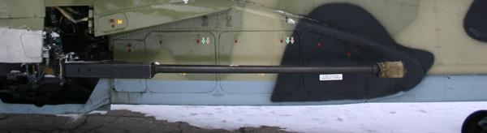
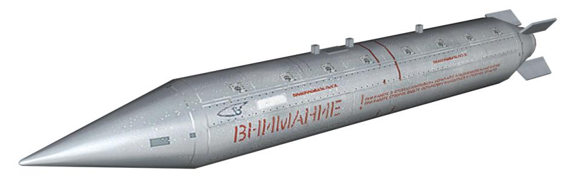
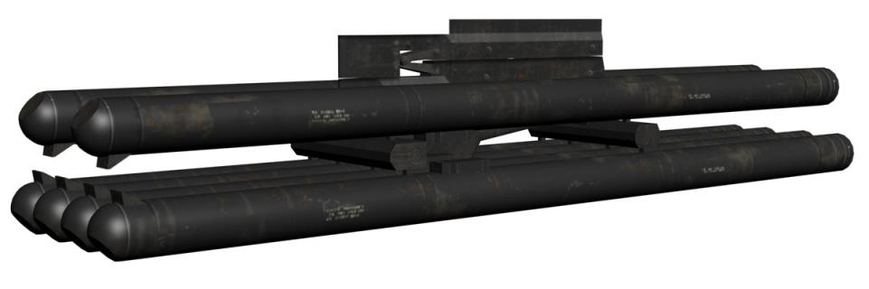
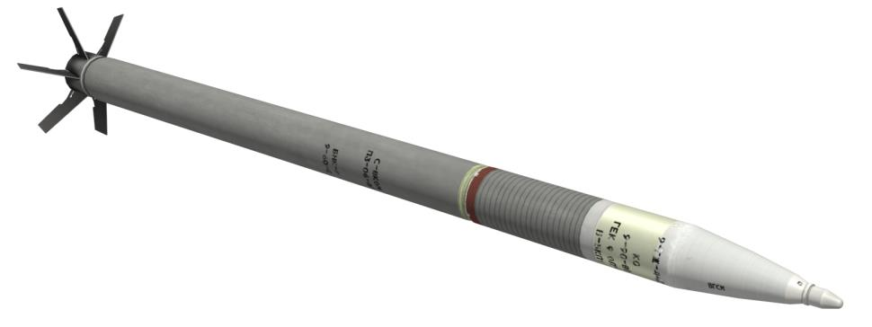
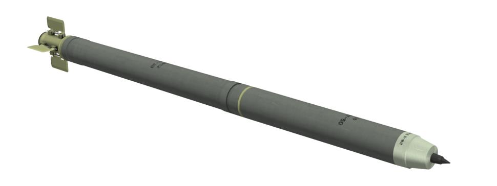
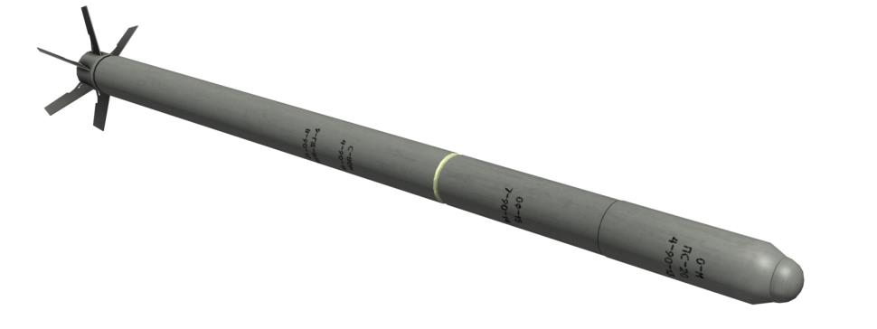
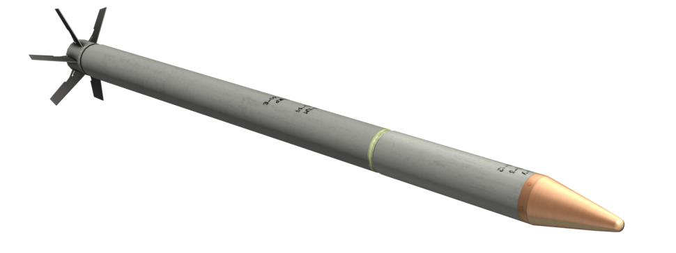
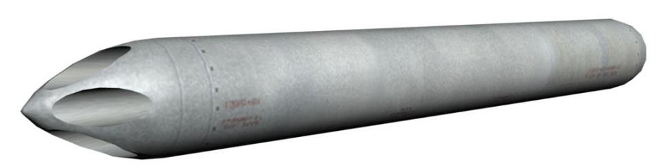

# Вооружение вертолёта Ка-50

Комплекс вооружения вертолёта включает системы управляемого и неуправляемого
ракетного, стрелково-пушечного и бомбардировочного вооружения.

## Стрелково-пушечное вооружение

Стрелково-пушечное вооружение представляет собой несъемную подвижную установку НППУ-80, обеспечивающую ведение огня из 30-мм автоматической пушки
2А42 по воздушным, наземным и надводным целям. Максимальные углы отклонения
пушки по горизонтали -2°30´ … +9°, по вертикали +3°30´ … -37°. Стрельбу можно
вести как из подвижной пушки (прицеливание – с помощью комплекса «Шквал-В»),
так и из неподвижной (прицеливание по индикатору на лобовом стекле).

Боекомплект укладывается в два патронных ящика: передний на 220 патронов, для
бронебойно-трассирующих снарядов, и задний на 240 патронов, для осколочно-фугасно-зажигательных снарядов, что облегчает выбор необходимого боеприпаса. Системой управления регулируются темпы ведения огня: высокий (550 выстр./мин)
или низкий (200...300 выстр./мин) с автоматической отсечкой длины очереди (по 20
или по 10 снарядов). На внутренние крыльевые держатели могут быть подвешены
контейнеры УПК-23-250, в каждом из которых размещается неподвижная 23-мм
пушка ГШ-23Л с боекомплектом 250 снарядов.

### Пушка 2А42

В начале 70-х годов прошлого века советские конструкторы получили задание увеличить эффективность боевых машин пехоты. Была разработана малокалиберная
автоматическая нарезная пушка.

Пушка была разработана в Тульском КБ приборостроения (ныне НПО «Точность»)
под руководством В. Грязева. Она была рассчитана под 30-мм патрон АО-18. Длинный ствол и короткая казенная часть облегчали размещение пушки внутри башни и
позволяли достигать больших углов возвышения. Пушка обладала коротким откатом, электроспуск обеспечивал автоматический и одиночный огонь. Кроме того, автоматический огонь мог производиться с высоким и низким темпом стрельбы. Все
эти факторы увеличивали боевую эффективность.

Интенсивные тесты показали новые возможности боевых машин пехоты с этим ору
жием. Была значительно увеличена дальность и точность стрельбы (до 1500 м). Положительно сказывался большой боезапас пушки – 500 снарядов против 38 на старой пушке «Зарница». Пушка также могла применяться против различных типов целей.

В 1980 году на вооружение поступила новая БМП-2 с 30-мм пушкой, получившей индекс 2А42.

БМП-2 показала высокую боевую эффективность в период войны в Афганистане как
на равнине, так и в условиях гор. Заметным недостатком был большой объем пороховых газов, производимых при стрельбе, особенно в высоком темпе. Газы запол
няли даже боевое отделение. В дополнение ко всему, пушка оказалась неэффективной против окопавшихся духов-гранатометчиков. Боевой опыт также показал, что
низкий темп стрельбы является наиболее приемлемым в бою.

30-мм пушка 2А42 на БМП-2 может поражать легкобронированные цели на дальности до 1500 м, противотанковые установки, небронированные автомобили и пехоту
на дальности до 2000 м, а также воздушные цели. Она может стрелять как одиночными выстрелами, так и очередью до полного расхода боекомплекта.
Автоматика пушки работает на отводе газов. Затвор закрывается после поворота.
Питание ленточное, две металлические патронные ленты содержат раздельные звенья «Краб», соединенные с гильзами. Ленты подаются в оружие в зависимости от
положения переключателя в тыльной стороне казенной части. Патрон подается с
ленты в казенник. Гильзы выбрасываются вперед по стволу.

Пушка имеет блокиратор, который останавливает стрельбу, когда последний патрон
одной из лент поступает в казенник. При этом затвор остается взведенным. После
этого, в случае поступления следующей команды на стрельбу с другой ленты,
стрельба продолжается без перезарядки.
Высокая боевая эффективность этой пушки привлекла внимание вертолётных КБ в
процессе работы над программой перспективного армейского вертолёта (Ка-50 и
Ми-28). В результате, мощное автоматическое оружие появилось на борту Ка-50.
Этот шаг значительно увеличил огневую мощь вертолёта и сделал его очень опасным для бронированных машин противника.

**ТТХ пушки 2А42**

Характеристика                                      | Значение
----------------------------------------------------|-----------------
Калибр, мм                                          |  30
Темп стрельбы, выстр./мин                           |  500-600 / 200-300
Вес пушки, кг                                       |  115
Начальная скорость снаряда, м/с:
Осколочно-фугасный                                  |  950
Бронебойно-зажигательный                            |  980
Количество нарезов ствола, шт.                      |  16
Количество снарядов в боекомплекте, шт.             |  460 (220 бронебойные; 240 осколочнофугасные)

**Характеристики боеприпасов для пушки 2А42**

Характеристика патрона                              | Бронебойно-трассирующий|Осколочно-фугасно-зажигательный
----------------------------------------------------|------------------------|--------------------
Калибр патрона, мм                                  |      30                |   30
Вес патрона, кг                                     |    0,853               | 0,837
Длина патрона, мм                                   |     291                |  291
Вес взрывчатого вещества, кг                        |    0,127               | 0,123
Вес снаряда, кг                                     |    0,400               | 0,389
Начальная скорость снаряда, м/с                     |   960 - 980            |950 - 970
Возможное отклонение начальной скорости снаряда, м/с|       5                |   5
Время горения трассера, с                           |  Не менее 3,5          |  \- 

## Бомбардировочное вооружение

Бомбардировочное вооружение устанавливается на четыре балочных держателях
БД3-УВ на крыльевых пилонах. Ка-50 может нести как обычные свободнопадающие
бомбы, так и контейнеры мелких грузов (КМГУ), предназначенные для размещения
и серийного выбрасывания восьми блоков БКФ с осколочными, фугасными, зажигательными или противотанковыми бомбами малого калибра или авиационными минами.

Свободнопадающие бомбы не имеют никаких систем наведения и управления, падают по баллистической кривой, параметры которой зависят от скорости полета и
угла наклона траектории ЛА во время сброса.

### ФАБ-250 - бомбы общего назначения

Семейство фугасных авиабомб различной мощности. Цифра в названии бомбы определяет калибр бомбы (приблизительный вес). Фугасные авиабомбы эффективны
против техники, оборонительных сооружений, мостов, укреплений и иных наземных
объектов. Диапазон условий сброса: скорость 500-1000 км/ч и высота 300 – 5000 м.

### КМГУ (контейнер мелких грузов унифицированный)

Контейнеры мелких грузов КМГУ (КМГУ-2) предназначены для боевого применения
авиабомб малых калибров, не имеющих подвесных проушин, и мин. Бомбы и мины
укладываются в контейнер в специальных блоках - БКФ (блоках контейнерных для
фронтовой авиации). КМГУ состоит из корпуса цилиндрической формы с передним и
задним обтекателями и содержит 8 блоков БКФ с авиабомбами или минами, устанавливаемых в отсеки. Отсеки закрываются створками, управляемыми пневмосистемой.

Электросистема КМГУ обеспечивает тактический сброс боеприпасов поблочно, серией с интервалами между блоками 0.05, 0.2, 1.0 и 1.5 с. На самолетах семейства
Су-25 блоки БКФ обычно снаряжаются 12 осколочными авиабомбами АО-2,5РТ калибра 2.5 кг, или 12 противотанковыми минами ПТМ-1 массой 1.6 кг, или 156 фугасными минами ПФМ-1С массой 80 г. Контейнеры КМГУ (КМГУ-2) подвешиваются по
одному на универсальные балочные держатели типа БД3-У. Бомбометание производится на высотах 50-150 м.

## Управляемое ракетное оружие

Управляемое ракетное оружие включает в себя до 12 ПТУР 9А4172 «Вихрь» с лазерно-лучевой системой наведения. Управляемая ракета «Вихрь» запускается с подвижных пусковых установок УПП-800, которые крепятся на крайние точки подвески, на каждую устанавливается по 6 ПТУР. Для обеспечения пуска ракет и
«встреливания» ПТУР в поле зрения ОПС без изменения высоты полета предусмотрено отклонение УПП вниз на угол до 12°.

### Противотанковый комплекс 9К121 «Вихрь»

Авиационный противотанковый ракетный комплекс «Вихрь» предназначен для поражения бронированной техники, в том числе оснащенной реактивной броней, и
воздушных целей, летящих на скоростях до 800 км/ч. Разработка комплекса начата
в 1980 году в КБ приборостроения (НПО «Точность») под руководством главного
конструктора А.Г.Шипунова. Принят на вооружение в 1992 году. К началу 2000 года
комплекс используется на противотанковом штурмовике Су-25Т (подвешивается до
16 ракет на двух пусковых установках АПУ-8) и боевом вертолёте Ка-50 «Черная
Акула» (подвешивается до 12 ракет на двух АПУ-6). На западе комплекс «Вихрь»
получил обозначение AТ-12 (АТ-9). В состав комплекса ракетного оружия «Вихрь»
входят:

- сверхзвуковая управляемая по лучу лазера ракета 9А4172;
- круглосуточная обзорно-прицельная система И-251 (Су-25Т) и И-251В (Ка         50) «Шквал»;
- авиационная пусковая установка АПУ-8 (Су-25Т) или АПУ-6 (Ка-50).

Комплекс позволяет вести стрельбу одиночными ракетами и залпом из двух ракет.

Высокая сверхзвуковая скорость ракеты (до 610 м/c) способствует снижению уязвимости самолета во время атаки и позволяет в одном заходе поразить несколько целей. Дистанцию 4 км ракета преодолевает за 9 с.
Ракета выполнена по аэродинамической схеме «утка» со складным крылом. Ее наведение осуществляется при помощи автоматического прицельного комплекса
«Шквал». Обнаружив изображение цели на телевизионном экране, пилот обрамляет
цель сеткой прицела и нажимает кнопку захвата. Прицел переходит на автоматическое сопровождение цели. После достижения разрешенной дальности пуска выдается команда ПР, разрешающая пуск.

Тип старта - из транспортно-пускового контейнера вышибным зарядом.

Лазерно-лучевая система наведения в сочетании с автоматической системой сопровождения цели гарантирует достаточно высокую точность стрельбы, практически не
зависящую от дальности. Кроме того, лазерно-лучевая система обеспечивает значительную защищенность канала наведения от естественных (пыль, дым) и искусственных (дымовая завеса) помех.

На вертолёте Ка-50, как и на самолете Су-25Т, лазерный дальномер-целеуказатель
«Причал» сопряжен с прицельным комплексом «Шквал» и ночной низкоуровневой
станцией «Меркурий». «Шквал» автоматически сопровождает цели и подсвечивает
их лазерным целеуказателем. Ракета захватывает луч лазера и летит к цели, стараясь отслеживать его датчиками в хвостовой части. Так как на ракете установлена
только одна рулевая машинка, то для управления по тангажу и направлению ракета
вынуждена вращаться вокруг своей продольной оси. Вращаясь вокруг продольной
оси и следуя за постоянно перемещающимся лучом лазера, ракета описывает в воздухе характерную спиральную траекторию.

Хранение, транспортировка и применение ракеты осуществляются с использованием транспортно-пускового контейнера, обеспечивающего безрегламентное складирование ПТУР в течение 10 лет.

ТТХ ПТРК «Вихрь»

Характеристика                                     | Значение
---------------------------------------------------|-----------------------
**Дальность стрельбы, км:**
днем                                               |     0,5-8 (10)
ночью                                              |     до 5 (6)
Высота пуска, м                                    |    5-4000
**Время полета, с:**
на максимальную дальность                          |    28
на дальность 8000 м                                |    23
на дальность 6000 м                                |    14
Средняя скорость полета на дальность 8000 м, м/с   |    350
**Боевая часть**
Тип                                                | Тандемная кумулятивно-осколочно-фугасная
вес, кг                                            |     8
вес взрывчатого вещества, кг                       |     4
тип взрывателя                                     | контактный и не контактный
радиус действия неконтактного взрывателя, м        |  2,5-3,0
**Ракета 9А4172**
Число ступеней                                     |    2
Длина, мм                                          |   2750
Максимальный диаметр корпуса, мм                   |    125
Размах крыла, мм                                   |    240
Размах стабилизаторов, мм                          |    380
Стартовый вес, кг                                  |   40-45
Длина ТПК, мм                                      |   2870
Диаметр ТПК, мм                                    |    140
температура применения, C°                         | от -50 до +50
**Аппаратура управления И-251В "Шквал"**
Дневной канал                                      | телевизионный
Система сопровождения цели                         | автоматическая
**Авиационная пусковая установка АПУ-6**
Число ракет на ПУ                                  |      6
Вес пустой ПУ, кг                                  |     60
Длина ПУ, мм                                       |    1524
Ширина ПУ, мм                                      |     720
Высота ПУ, мм                                      |     436
Угол наведения в вертикальной плоскости, град      |     10

### Неуправляемые авиационные ракеты

Система неуправляемого ракетного вооружения состоит из четырех блоков НАР Б8В20А или Б-13Л5; в каждый блок Б-8В20А может быть заряжено по двадцать 80-мм
неуправляемых ракет С-8, а в Б-13Л5 – по пять 122-мм неуправляемых ракет С-13.

Пуски НАР из Б-8 ведутся по 1, 5 или 10 ракет из каждого блока. Из блоков Б-13
возможен пуск по 1, 2 или 5 ракет.

#### НАР С-8

В конце 60-х годов для повышения огневой мощи стрелково-пушечного вооружения
самолетов фронтовой бомбардировочной и истребительно-бомбардировочной авиации КБ "Точмаш" поручили создать 80-мм авиационные неуправляемые реактивные
снаряды. Это сопровождалось новыми требованиями к оружию, сформулированными на основе опыта эксплуатации в войсках авиационных реактивных систем калибра 57 мм. Заказчик требовал надежно защитить боеприпасы от аэродинамического нагрева, уменьшить влияние стрельбы ими на работу двигателя самолета-носителя, сократить временные интервалы между выстрелами, а также увеличить
дальность стрельбы и снизить минимальную высоту применения.

Появление широкой номенклатуры снарядов этого семейства обусловили два фактора. Во-первых, НАР нескольких марок составили комбинации ряда однотипных БЧ,
оснащенных различными ракетными двигателями. Во-вторых, на основе наиболее
удачных двигателей было создано большое количество типов боевых НАР и
снарядов вспомогательного назначения. На сегодня известны около 25 серийных
НАР калибра 80 мм и более 10 опытных моделей.

На основе базовой конструкции С-8 с универсальной кумулятивно-осколочной боевой частью было разработано несколько модификаций ракеты: С-8М и С-8КОМ с модернизированной боевой частью усиленного осколочного действия и твердотопливным двигателем, имеющим увеличенное время работы. С-8КОМ может пробивать
броню толщиной до 400 мм.

Кроме того, имеется еще несколько вариантов ракет, из которых следующие смоделированы в игре Черная Акула:
С-8М (С-8ОФП) - модернизированная. Отличается БЧ усиленного осколочного действия и двигателем с увеличенным временем работы.

С-8О и С-8ОМ - осветительные. Горючий состав весом 1,0 кг дает силу света порядка
2 млн. свечей в течение 35 секунд.

С-8ЦМ – целеуказательная, маркерная. При падении на землю образуют хорошо заметное облако оранжевого дыма, маркируя цель или точку поверхности.

Для пуска С-8 используются двадцатизарядные блоки Б-8, модернизированные Б-8М
и M1, а также Б-8-0 с теплозащитой. Вертолётное исполнение блока Б-8В20А отличается удлиненными пусковыми трубами и упрощенной конструкцией без носового
обтекателя (при небольших скоростях полета вертолётов прирост аэродинамического сопротивления незначителен).

По эффективности применения и мощности БЧ С-8 значительно превосходят С-5.

Так, залп 80-мм ракет из одного 20-зарядного блока Б-8 по поражающему действию
сопоставим с одновременным пуском С-5 из трех 32-зарядных блоков УБ-32, а по
дальности и точности превосходит их. Преимущества C8 привели к тому, что в
настоящее время боевые самолеты и вертолёты комплектуются в основном 80-мм
блоками НАР.

**ТТХ НАР С-8КОМ**

Характеристика                                     | Значение
---------------------------------------------------|-----------------------
Калибр, мм                                         |             80
Длина, мм                                          |            1570
Масса ракеты, кг                                   |            11,3
Масса БЧ, кг                                       |             3,6
Масса ВВ, кг                                       |             0,9
Дальность пуска, м                                 |         1300-4000
Максимальная скорость ракеты, м/с                  |             610

#### НАР С-13

В первой половине 70-х годов ирано-иракские вооруженные столкновения и арабоизраильская война продемонстрировали всему миру, что прежние подходы к вопросам базирования и маскировки самолетов на военных аэродромах устарели. Стоянка
машин в длинном ряду, как на параде, чревата тем, что их всех можно разом лишиться, «благодаря» одному случайно преодолевшему систему ПВО самолету противника. Обваловка открытых стоянок также перестала выполнять свои защитные
функции - сказывалась возросшая эффективность авиационного вооружения.

На основе чужого боевого опыта командование объединенных вооруженных сил
НАТО в Европе оперативно начало рассредоточивать свои самолеты на военных
авиабазах по индивидуальным укрытиям различного типа. Достаточно хорошо замаскированные укрытия выполняли из легкоразборных конструкций. На открытой
местности, где невозможно было спрятать эллинги, укрытия отливали из бетона
сплошным методом, используя стальную арматуру и внутреннюю гофрированную
противооткольную облицовку толщиной 5 мм. Затем все это засыпали толстым
слоем грунта, и получалось довольно солидное фортификационное сооружение, выдерживающее прямое попадание нескольких осколочных или осколочно-фугасных
авиабомб.

Руководство Советского Союза с целью адекватного ответа на возможную агрессию
со стороны НАТО считало крайне необходимым иметь на вооружении отечественных ВВС НАР, способные пробивать аэродромные укрытия арочного типа и эффективно поражать технику, размещенную в них. Эту задачу были способны успешно
решать НАР крупного калибра - С-25-ОФ. Однако теоретически для уничтожения одной авиабазы противника с самолетами, рассредоточенными по ЖБУ, при условии
необходимости преодоления противодействия ПВО, а также, учитывая вероятность
попадания в цель одной ракетой и наличие на аэродроме ложных целей, требовался просто гигантский наряд сил и средств. Существующие же авиационные средства поражения для выполнения задач такого рода невозможно было оптимизировать.

В то же время на основании анализа, проведенного в 1969 году, было предложено
уделить внимание калибру 127 мм (аналог американской НАР Zuni), способному занять промежуточное положение между 57-мм и 240-мм НАР. Эти доводы в дальнейшем использовали в Новосибирском институте прикладной физики (ИПФ) в работах
над 122-мм НАР семейства С-13 под руководством В.Ф. Минина.

Разработкой первых своих ракет сибиряки занялись в 1973 году. К 1979 году. ракета С-13 «Тулумбас» поступила на государственные испытания с универсальным
шестиствольным блоком орудий УБ-13.

Типовой целью на испытаниях, естественно, были несколько специально выстроенных ЖБУ арочного типа - цели достаточно габаритные, и вероятность попадания в
них была большой. Засыпанные пятиметровым слоем грунта железобетонные стены
одной из наиболее внушительных конструкций толщиной 1 м С-13 пробивали
насквозь и взрывались в земляном полу. После снятия грунта с ЖБУ открылись
входные отверстия в бетоне с диаметром воронок 1-2 м и глубиной 0,2-0,4 м.

Внутри укрытия вокруг выходных отверстий отколы бетона представляли собой воронки диаметром 1,5 м и глубиной 0,4 м. В 1983 году. НАР приняли на вооружение.

Однако С-13 был присущ один недостаток. При отстреле по типовому ЖБУ NATO бетонная крошка воронки выходного отверстия надежно удерживалась противооткольной стальной облицовкой и не выполняла функции вторичных осколков. НАР
прошивала грунт и бетонные стены укрытия, а также бетонный пол, после чего
взрывалась глубоко под землей, не нанося никакого ущерба самолету, если проходила рядом с планером. Изменять время срабатывания взрывателя не имело
смысла, поскольку толщина грунтовой засыпки купола ЖБУ была неравномерной. В
зависимости от того, в какую часть укрытия попадала НАР, постоянно требовалось
варьировать время замедления на доли секунды.

Еще не закончились испытания С-13, как в 1982 году ИПФ приступил к разработке
улучшенного образца бетонобойной НАР С-13Т с двумя модулями БЧ, расположенными тандемно. На новой НАР для сведения к минимуму отрицательных качеств
прототипа каждый из модулей БЧ имел индивидуальный взрыватель донного типа.
После встречи с преградой первый и второй модули БЧ подрывались в точках, разнесенных в пространстве. Таким образом, оба модуля как бы резервировали друг
друга - если первый сработает под полом ЖБУ, то второй - неизбежно внутри укрытия. И наоборот, если первый взорвется внутри ЖБУ, то второй - снаружи. Идеальным вариантом был подрыв обоих модулей внутри укрытия.
В 1984 году в НИИ ВВС прошли государственные испытания С-13Т на истребителебомбардировщике Су-17М4. Ведущим инженером на них назначили подполковника
А. Шерстюка, ведущим летчиком - подполковника А. Бородая. При этом выполнили
31 полет и отстреляли 99 НАР. 31 ракета, попавшая в ЖБУ с метровой бетонной
стенкой и грунтовой засыпкой от двух до шести метров толщиной, сработала внутри
укрытия.

Оружие обкатали и в стрельбе по ВПП. НАР не рикошетировали, разрушая железобетон толщиной 0,25 м на площади 15-17,5 м2. В залпе разброс ракет у цели не превышал 10 м. По результатам испытаний НИИ ВВС гарантировал на каждую ракету
двадцать взлетов и посадок в пределах срока хранения без ущерба для надежности
ее работы.

Учитывая калибр новой ракетной системы, разработчики предложили создать на ее
основе для борьбы с легкобронированной и легкоуязвимой техникой вне укрытий
более эффективную, чем С-8, осколочно-фугасную НАР с максимально стандартизированными узлами и деталями.

Имитация стрельбы по БМП-1 с комбинированной лобовой броней толщиной 20-25
мм продемонстрировала, что на дистанции 5 м осколки БЧ С-13ОФ легко пробивают
броню. Каждый такой подрыв дает 10-15 пробоин, а осколки обладают зажигательным действием. На расстоянии 10 м осколки рикошетируют от некоторых броневых
плоскостей, оставляя вмятины глубиной 5-10 мм. Таким образом, легкобронированная техника на расстоянии 25 м и легкоуязвимая - на 60 м гарантированно выходит
из строя. Степень нанесенного ущерба такова, что восстановить ее боеспособность
возможно не менее чем через два часа.
При попадании С-13-ОФ между осями БРДМ у борта в машине обнаружили 60 пробоин. Взрывом оторвало верхнюю половину кузова по шву, машину опрокинуло, а
также оторвало колесо со ступицей. Средняя площадь пробоин в броне достигала 58 см2, в дюрале - 8-10 см2. В результате прямого попадания у тяжелого танка ИС-3
вырвало направляющий каток и два опорных, а также 1,5 м гусеницы. Бронеплита
толщиной 50 мм, закрывающая моторный отсек, прогнулась на 25-30 мм. Пушка с
толщиной стенки ствола 20-30 мм из высококачественной орудийной стали была
пробита тремя осколками. Кроме того, на ней насчитали двенадцать вмятин и каверн глубиной 8-15 мм.
Летные испытания подтвердили, что осколочность С-13ОФ при воздушном подрыве
в полтора раза выше по легкоуязвимым целям и в два-три раза - по укрытым. В
начале 1986 года НАР приняли на вооружение ВВС.

**ТТХ НАР С-13ОФ**

Характеристика                                     | Значение
---------------------------------------------------|-----------------------
Калибр, мм                                         |              122
Длина, мм                                          |             2898
Масса ракеты, кг                                   |              69
Масса БЧ, кг                                       |              33
Масса ВВ, кг                                       |               7
Дальность пуска, м                                 |          1600-3000
Максимальная скорость ракеты, м/с                  |              530

## Управляемые ракеты воздух-воздух

Для борьбы с воздушными целями предусмотрена установка ракет типа «Игла-В»
класса «воздух-воздух» с ИК-головкой самонаведения с командно-аппаратными модулями - пусковыми установками «Стрелец». На дополнительных узлах подвески
Ка-50 возможно установить по два контейнера с УР (суммарно до 4 ракет).

### Пусковой модуль 9С846 «Стрелец»

Комплект аппаратуры управления и пусковых модулей (КАМ) 9С846 «Стрелец»
предназначен для обеспечения автоматизированного дистанционного одиночного
пуска ракет типа «Игла» с различных носителей наземного, воздушного и морского
базирования.

В состав комплекта «Стрелец» входят:

-   модуль универсальный пусковой для размещения двух ракет и обеспече        ния их включения, подготовки к пуску и пуска;
-   аппаратура управления и связи для связи с системой управления огнем
носителя;
-   комплект соединителей для обеспечения механического и электрического
соединения составных частей с элементами носителя;
-   контрольно-проверочная аппаратура для периодического контроля элек        трических параметров аппаратуры комплекта.

Управляемая инфракрасная ракета 9М342 «Игла» является легкой ракетой класса
«воздух-воздух» малой дальности. Эта ракета разработана на базе ПЗРК 9К338
«Игла» и является модификацией с пусковым модулем для вооружения вертолетов
и наземной техники.

Предназначена для поражения дозвуковых воздушных целей. Разработчик – НПК
«КБ Машиностроения» в Коломне, один из ведущих российских конструкторских и
научно-производственных центров в области военной техники. Ракета выполнена
по аэродинамической схеме «утка» со складными крыльями и стабилизаторами. Вес
ракеты равен 11,3кг. Скорость полета достигает 570-600 метров в секунду. Дальность применения ограничена шестью километрами. Игла оснащается боевой частью весом 1,25 кг. Способна развивать большие перегрузки и имеет средние характеристики помехозащищенности.

**ТТХ УРВВ «Игла»**

Характеристика                                     | Значение
---------------------------------------------------|-----------------------
**Дальность стрельбы, км:**
Высота поражения цели, м                           |   10-3500
Дальность поражения цели, м                        | 500-6000
Скорость поражаемой цели, м/с
- навстречу                                        | до 400
- вдогон                                           | до 320
**Боевая часть**
Тип                                                |   Осколочно-фугасная
Вес, кг                                            |     1,25
Тип взрывателя                                     |   Контактный и неконтактный
**Ракета 9М342 «Игла»**
Маршевый двигатель                                 |    Твердотопливный
Длина, мм                                          |     1690
Максимальный диаметр корпуса, мм                   |     72,2
Управление полетом                                 |    Аэродинамические поверхности
Стартовый вес, кг                                  |     11,3
Вес ТПК 9К338 «Игла» в боевом положении, кг        |      19
Время прицеливания (боевой цикл), с                |     55
Тип ГСН                                            |     Оптическая, двухспектральная, следящая
Система управления                                 |     Одноканальная
Температура применения, C°                         |     от -50 до +50
**Пусковой модуль 9С846 "Стрелец"**
Число ракет на ПМ                                  |  2
Количество включений ракеты на одном ПМ            |  2
Режим стрельбы                                     |     Одиночный
Вес пустого ПМ, кг                                 |  41
Вес аппаратуры управления ПМ, кг                   |  4,5

{!docs/ka50/abbr.md!}
