# Приборное оборудование кабины

## Схемы приборных досок и пультов управления в кабине летчика

В кабине размещены приборные доски, пульты и панели для установки приборов,
индицирующих информацию о параметрах полета, работе оборудования вертолёта
и его двигателей, а также органов управления и сигнализации систем вертолёта.

Основные пилотажные приборы размещены на приборных досках, которые имеют
противобликовые козырьки.

## Ручка продольно-поперечного управления

1.   Блок гашеток ОГОНЬ РС – ВПУ.
2.   Рычаг колесного тормоза [[W]]. Парковочный тормоз - [[LShift + W]].
3.   Кнопка ВИСЕНИЕ – включение режима автопилота ВИСЕНИЕ [[LAlt + T]].
4.   Кнопка РАДИО – включение радиостанции на передачу (не реализовано).
5.   Кнопка ОСВ ПУЛЬТ – освещение пультов и приборов кабины [[LShift + K]].
6.     Кнопка ЦЕЛЬ УКАЗ – целеуказание для К-041 [[O]].
7.     Кнюппель МЕТКА – перемещение метки линии визирования И-251
[[;]], [[.]], [[,]], [[/]].
8.     Кнопка ТРИММЕР – снятие усилий с ручки триммерным механизмом. При
отпускании кнопки автопилот запоминает и удерживает текущее угловое
положение вертолёта [[T]].
9.     Кнопка ОТКЛ АП – аварийное отключение каналов автопилота [[LAlt + A]].

### Блок гашеток РС – ВПУ

Блок гашеток располагается на обратной от летчика стороне ручки ППУ и предназначен для подачи сигналов стрельбы на соответствующие системы оружия.

По умолчанию гашетка встроенной пушечной установки (ВПУ) блокирована большой гашеткой РС. Гашетка РС предназначена для подачи сигналов об открытии огня
выбранным типом подвесного оружия (ПТУР, НАР, бомбовое вооружение, подвесные пушечные контейнеры).

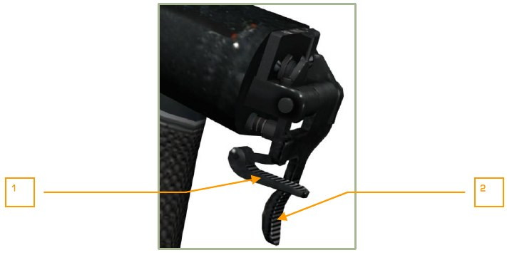

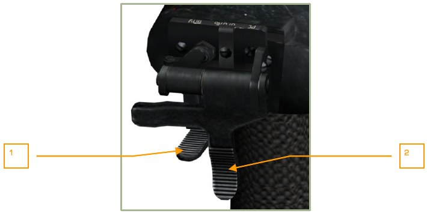

1.     ВПУ – стрельба из встроенной пушечной установки [[Space]]. Гашетка блокирована.
2.     РС – стрельба из подвесного оружия [[RAlt + Space]]. Гашетка в рабочем положении.
Для стрельбы из ВПУ необходимо откинуть вверх большую гашетку РС [[C]], в результате чего в СУВ подается сигнал о применении ВПУ и разблокируется малая гашетка
ВПУ.

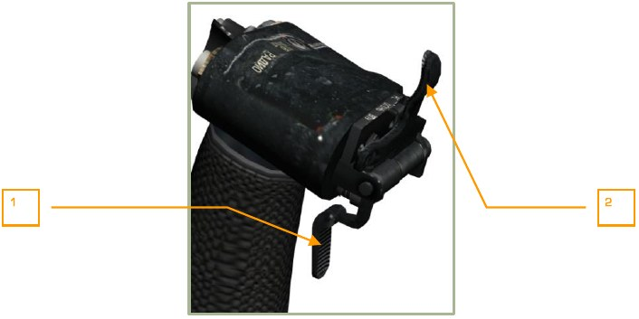

1.     ВПУ – стрельба из встроенной пушечной установки [[Space]]. Гашетка разблокирована.
2.     РС – стрельба из подвесного оружия [[RAlt + Space]]. Гашетка откинута
вверх.

## Рычаг общего шага

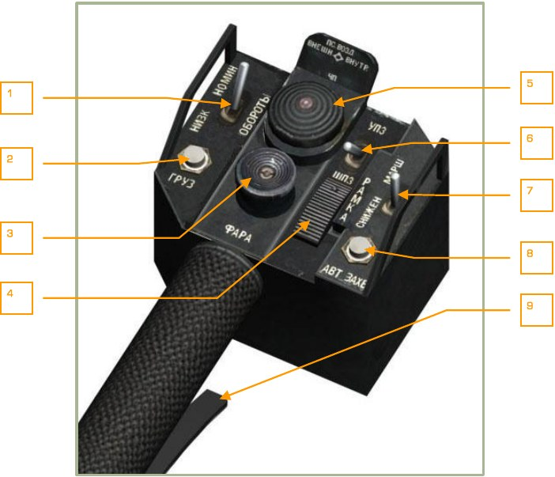

1.   Переключатель управления перенастройкой оборотов свободной турбины
(оборотов винта). Низкие обороты [[RAlt + Num-]]. Номинальные обороты
[[RAlt + Num+]].
2.   Кнопка ГРУЗ (не используется).
3.   Кнюппель ФАРА. Управление поисково-посадочными фарами
[[RCtrl + ;]], [[RCtrl + .]], [[RCtrl + ,]], [[RCtrl + /]].
4.   Переключатель РАМКА – переключатель размера рамки цели для И-251В
Шквал [[[]], [[]]].
5.   Кнюппель выбора подвесок:
    - ВНЕШН – внешние подвески [[Y]].
    - ВНУТР – внутренние подвески [[I]].
    - 4П – все подвески [[U]].
    - ПС ВОЗД – подвески ракет воздух-воздух [[LCtrl + U]].
6.   Переключатель УПЗ-ШПЗ. Узкое поле зрения – широкое поле зрения И251В Шквал [[-]], [[=]].
7.   Переключатель СНИЖЕН – МАРШ. Переключатель режимов автопилота
СНИЖЕНИЕ – МАРШРУТ [[D]], [[R]].
8.   Кнопка АВТ ЗАХВ. Захват цели автоматом И-251В Шквал [[Enter]].
9.   Гашетка стопора рычага общего шага [[F]]. Гашетка выполняет две функции:
    - Отжимает тормоз РОШ. Тормоз нужен для предотвращения
сдвига рычага под действием вибрации или случайного сдвига.
    - При отпускании гашетки подается сигнал в ПрПНК для фиксации
нового значения высоты при полете в режиме стабилизации высоты.

## Рычаги раздельного управления двигателями

Рычаги раздельного управления двигателями (РРУД) расположены на пульте управления двигателями под левой рукой летчика. Рычаги имеют общую ось вращения и
перемещаются в вертикальной плоскости.

Рычаги за счет своих пружинящих свойств могут быть зафиксированы в положениях
МАЛ ГАЗ, ОТКАЗ РО, АВТОМАТ, МАКСИМАЛ. Для фиксации их в положениях
АВТОМАТ и ОТКАЗ РО на рычагах имеются фиксирующие сухари, а на корпусе пластины с пазами под сухари. Кроме того, на пластинах в районе пазов ОТКАЗ РО
нанесена красная полоса облегчающая установку соответсвующего рычага в положение ОТКАЗ РО при отказе регулятора оборотов двигателя.

Для фиксации рычагов в положения МАЛ ГАЗ и МАКСИМАЛ на сухарях и кромках
пластин имеются треугольные шлицы.

Для удобства установки рычагов в положение АВТОМАТ на пульте имеется откидной упор, фиксирующийся пружиной.
На пластинах нанесены следующие надписи, соответствующие положениям рычагов:

- На левой пластине белой краской МАЛ ГАЗ и АВТОМАТ.
- На правой пластине красной краской – ОТКАЗ РО (напротив красной полосы).
- На верхней накладке нанесена надпись УРАВЛЕНИЕ ДВИГАТЕЛЯМИ,
надпись развернута на 180 градусов (вниз головой) для удобства чтения
летчика.

Четыре фиксированных положения РРУД:

1.   Малый газ.
2.   Отказ РО.
3.   Автомат.
4.   Максимал.

В игре перемещение рычагов РУД выполняется двумя возможными способами:

1.   Кнопками [[Page Up]], [[Page Down]] для обоих двигателей сразу.
Правый двигатель [[RShift + Page Up]], [[RShift + Page Down]].
Левый двигатель [[RAlt + Page Up]], [[RAlt + Page Down]].
Каждое нажатие кнопок перемещает рычаги на одну позицию вверх или
вниз соответственно.
2.   Аналоговыми осями назначаемыми в опциях УПРАВЛЕНИЕ.

В режиме МАЛЫЙ ГАЗ выполняются все стартовые процедуры и большинство контрольно-проверочных операций.

Режим ОТКАЗ РО необходим в случае отказа регулятора оборотов двигателей, при
их повреждении или выходе из строя, во избежание перераскрутки двигателей.

Режим АВТОМАТ основной полетный режим при штатной работе силовой установки.
Все полеты должны выполнятся в этом режиме, кроме отдельных случаев нештатых
ситуаций.

Режим МАКСИМАЛ предназначен для выведения на максимальный режим работы
одного двигателя в случае отказа второго.

## Приборная доска левая

1.   Центральный сигнальный огонь [[M]].
2.   Табло светосигнальное.
3.   Вариометр ВАР-30ПВ.
4.   Индикатор командный пилотажный ИКП-81.
5.   Высотомер механический ВМ-15ПВ.
6.   Прибор навигационный плановый ПНП-72-16.
7.   Переключатель автоматического или ручного введения ЗК и ЗПУ.
8.   Переключатель режима работы лазера. Лазерный дaльномер – лазерный
целеуказатель.
9.   Сброс подсвета лазерного целеуказателя.
10. Индикатор шага винта ИШ1-15.
11. Авиационные часы АЧС-1.
12. Щиток управления шасси.
13. Индикатор частоты вращения винта.
14. Указатель радиовысотомера.
15. Указатель скорости УСВИ-400.
16. Табло-кнопка сигнализации выхода за допустимые пределы частоты вращения винта (зебра) [[B]].
17. Переключатель режима работы оборонного комплекса.
18. Кнопка контроля светосигнальных табло [[LShift + L]].
19. Акселерометр дистанционный АДП-1.

!!! note "ПРИМЕЧАНИЕ"
    На рисунке положение подвижных шкал, индексов и стрелок на приборах не привязано к конкретной летной ситуации.

## Приборная доска правая

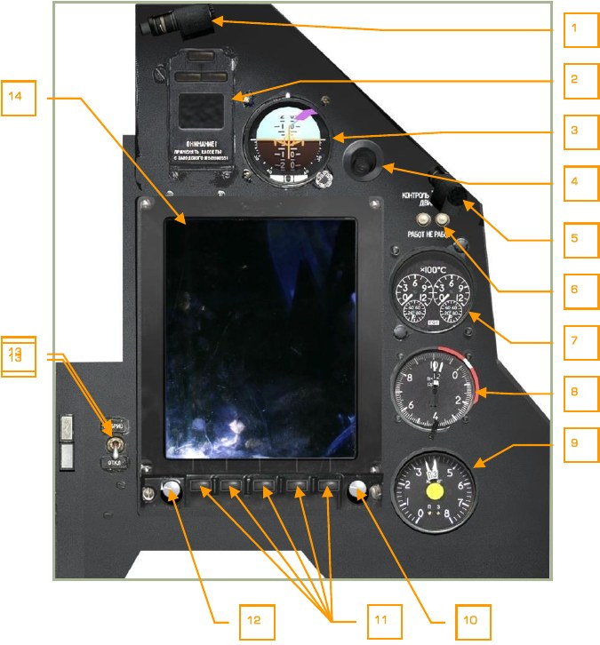

1.   Светильник ночной подсветки.
2.   Табло системы «Экран».
3.   Авиагоризонт АГР-81.
4.   Сопловой насадок системы кондиционирования кабины.
5.   Светильник ночной подсветки.
6.   Кнопки встроенного контроля указателя температуры газов двигателей.

    При работающих двигателях используется РАБОТ [[LCtrl + P]].

    При неработающих двигателях используется НЕ РАБОТ [[LAlt + P]].

7.   Указатель температуры выходящих газов двигателей.
8.   Сдвоенный указатель частоты вращения двигателей.
9.   Индикатор топливомера.
10. Манипулятор курсора системы АБРИС.
11. Кнопки управления системы АБРИС.
12. Ручка регулировки яркости дисплея АБРИС.
13. Выключатель системы АБРИС.
14. Дисплей системы АБРИС.

### Индикатор командный пилотажный ИКП-81

Индикатор командный пилотажный (ИКП) предназначен для индикации пространственного положения вертолёта и его отклонения от заданной траектории полета в
горизонтальной и вертикальной плоскостях.

Индицирует:

- Угловое положение вертолёта относительно горизонтальной плоскости (по
крену и тангажу).
- Команды директорного управления (по крену и тангажу).
- Отклонение скорости вертолёта от заданной.
- Отклонение высоты полета от заданной.
- Боковое отклонение вертолёта от линии заданного пути или точки висения.
- Скольжение вертолёта.
- Неисправности директорного управления, датчика авиагоризонта.

1.   Планка отклонения от линии заданного пути.
2.   Бленкер отказа директорных планок по крену и тангажу.
3.   Планка отклонения от заданной скорости.
4.   Символ силуэта самолета.
5.   Бленкер отказа авиагоризонта.
6.   Кнопка ТЕСТ. Первое нажатие открывает крышку [[LCtrl + LAlt + A]], второе
нажатие включает тестовый режим [[LAlt + LShift + A]].
7.   Шкала углов тангажа.
8.   Планка команды по крену.
9.   Стрелка отклонения от заданного значения высоты.
10. Планка команды по тангажу.
11. Кремальера установки нулевого тангажа. Для установки тангажа кремальеру необходимо вращать влево [[LAlt + LShift + ,]] или вправо [[LAlt + LShift + .]].
12. Указатель скольжения («шарик»).

### Прибор навигационный плановый ПНП-72-16

Прибор навигационный плановый (ПНП) предназначен для индикации курса вертолёта, навигационных параметров, контроля положения вертолёта в горизонтальной
плоскости при полете по маршруту и заходе на посадку относительно линии заданного пути и навигационных точек: поворотных пунктов маршрута (ППМ), оперативных точек (ОТ), аэродромов (АЭР).

Прибор индицирует следующие параметры:

- Текущий курс (ТК) вертолёта. Шкала имеет отметки через 5°.
- Заданный курс (ЗК), задаваемый индексом ЗК автоматически от ПНК или
вручную.
- Заданный путевой угол (ЗПУ), задаваемый стрелкой ЗПУ автоматически от
ПНК или вручную. Кроме того, ЗПУ на текущую навигационную точку индицируется на счетчике ЗПУ.
- Дальность до ППМ из ПНК. Индицируется на счетчике дальности.
- Курсовой угол радиостанции (КУР) от АРК-22, индицируемый стрелкой по
шкале КУР.
- Боковое отклонение от линии заданного пути (ЛЗП) или точки висения.
- Продольное отклонение от точки висения.

1.   Флаг отказа инерциальной курсо-вертикали (ИКВ). Бленкер КС.
2.   Счетчик дальности до ППМ.
3.   Индекс заданного курса (ЗК).
4.   Флажок отказа ЦВМ-Н. Бленкер К.
5.   Стрелка заданного путевого угла (ЗПУ).
6.   Планка отклонения от точки висения в продольном направлении.
7.   Кнопка ТЕСТ [[LCtrl + LAlt + H]].
8.   Кремальера ЗК. Для задания курса необхлодимо вращать кремальеру
влево [[LCtrl + LShift + ,]] или вправо [[LCtrl + LShift + .]].
9.   Индекс отсчета текущего курса.
10. Счетчик ЗПУ. Цифровое значение заданного путевого угла в градусах.
11. Шкала текущего курса.
12. Планка отклонения от точки висения в поперечном направлении.
13. Переключатель ЗПУ-ЗК РУЧН – АВТ [[LCtrl + H]]. Задает режим работы
стрелки ЗПУ и индекса ЗК на ПНП. В автоматическом режиме ЗПУ и ЗК работают от навигационных данных ПНК. В ручном режиме летчик имеет
возможность выставить ЗПУ и ЗК вручную с помощью соответствующих
кремальер на ПНП.
14. Флажок отказа ЦВМ-Н. Бленкер Г.
15. Стрелка курсового угла радиостанции (КУР).
16. Неподвижная (внешняя) шкала КУР.
17. Кремальера ЗПУ. Для задания путевого угла необходимо вращать кремальеру влево [[LCtrl + LAlt + ,]] или вправо [[LCtrl + LAlt + .]].

### Панель режимов работы лазерного дальномера - целеуказателя

1.   Кнопка СБРОС ЛДП – сброс лазерного подсвета цели [[LAlt + LShift + O]].
2.   Переключатель ЛД-ЛДП [[LShift + O]]. Выбор режима работы лазера: лазерный дальномер (ЛД) – лазерный подсвет (ЛДП). В нормальном режиме –
ЛД. ЛДП используется при лазерном подсвете цели для авиационных тактических ракет типа Х-25МЛ, Х-29Л или управляемых авиабомб с лазерными головками самонаведения. Подсвет осуществляется в координации с
носителем соответствующих АСП в течение 20 секунд по нажатию кнопки
АВТ ЗАХВ.

    Положение переключателя не влияет на работу автоматической системы
наведения ПТУР Вихрь.

### Индикатор шага винта ИШ1-15

Индикатор шага винта предназначен для контроля общего шага несущих винтов.

При отклонении рычага общего шага (РОШ) вверх до упора стрелка указателя отклоняется полностью вправо до деления 15°.

### Высотомер механический ВМ-15ПВ

Высотомер предназначен для измерения высоты полета вертолёта. Высотомер
имеет две стрелки: большую, один оборот которой соответствует 10 000 м, и малую,
один оборот которой соответствует 1 000 м. Оцифровка шкалы прибора – через
1 000 м, цена одного деления – 100 м (по большой стрелке).

Высотомер имеет кремальеру для изменения начала отсчета высоты – установки
высоты аэродрома (QFE); механически связанная с ней шкала (в нижней части прибора) проградуирована в мм. ртутного столба. При установке кремальерой стрелок
высотомера на ноль на шкале прибора должно индицироваться атмосферное давление аэродрома вылета.

На высотомере также имеется индекс заданной высоты (маленький желтый треугольный индекс на краю шкалы), облегчающий выдерживание в полете заданной
высоты.

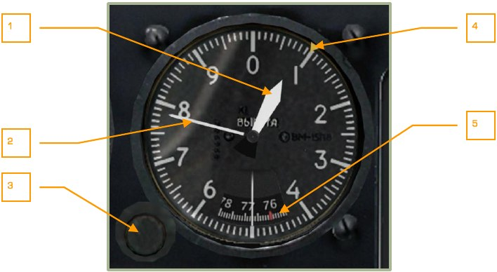

1.   Большая стрелка (тысячи метров).
2.   Малая стрелка (метры).
3.   Кремальера установки высоты аэродрома (QFE). Для задания высоты
необходимо вращать кремальеру влево [[RShift + -]] или вправо [[RShift + =]].
4.   Индекс заданной высоты (устанавливается вручную).
5.   Шкала установки высоты аэродрома в мм ртутного столба. Красная риска
– нормальное давление 760 мм.

### Вариометр ВАР-30ПВ

Вариометр ВАР-30ПВ предназначен для измерения вертикальной скорости подъема
(снижения) вертолёта и ее индикации, а также для контроля выполнения горизонтального полета.

Указывает измеренную вертикальную скорость. Единицы измерения: м/с. Пределы
измерения: ±30 м/с.

### Индикатор частоты вращения винтов

Индикатор частоты вращения несущих винтов индицирует частоту вращения несущих винтов в процентах, измеренную тахометром несущих винтов.

Для сигнализации летчику о падении частоты вращения несущих винтов ниже допустимого предела 85 % или превышении 98 % на левой приборной доске высвечивается в проблесковом режиме табло-кнопка «НВ» (зебра), а в телефоны летчика выдается звуковой сигнал.

1.   Максимально допустимое значение частоты вращения несущих винтов в
полете – 98 %.
2.   Минимально допустимое значение частоты вращения несущих винтов в
полете – 83 %.

### Указатель скорости

Указатель скорости предназначен для измерения и индикации приборной скорости
полёта вертолёта. Пределы измерения — от 20 до 350 км/ч. Для значений приборной скорости от 20 до 50 км/ч используется шкала с увеличенными промежутками
между делениями. Шаг делений по всему диапазону 10 км/ч. Указатель скорости однако не способен показывать приборную скорость для значений ниже 50-70 км/ч
или при движении хвостом вперёд.

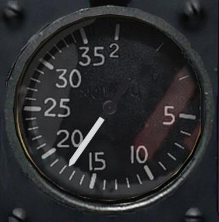

### Акселерометр дистанционный

Акселерометр предназначен для индикации замеренного значения нормальной перегрузки вертолёта (белая стрелка), а также для фиксации значений максимальной
и минимальной достигнутых перегрузок в полете (красные стрелки).

Отсчет показаний значения перегрузки производится от цифры 1 (сила тяжести на
земле). Максимальное индицируемое значение положительной перегрузки – 4 g.

Максимальное индицируемое значение отрицательной перегрузки – минус 2 g.

Для сброса зафиксированных значений перегрузок используется кнопка, находящаяся справа - внизу шкалы прибора.

1.   Достигнутая минимальная перегрузка.
2.   Текущая нормальная перегрузка.
3.   Достигнутая максимальная перегрузка.
4.   Кнопка сброса зафиксированных значений перегрузок [[LShift + -]].

### Указатель радиовысотомера

Радиовысотомер (РВ) предназначен для измерения и индикации истинной (геометрической) высоты полета в диапазоне от 0 до 300 м и представляет собой радиолокационную станцию непрерывного излучения с частотной модуляцией излучаемого
сигнала.

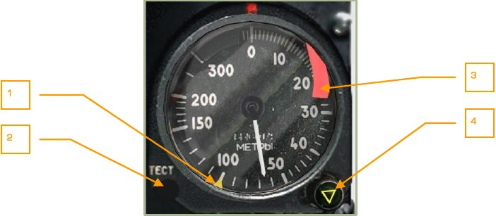

1.   Индекс установки опасной высоты желтого цвета.
2.   Кнопка ТЕСТ для проверки РВ [[LAlt + LShift + R]]. На исправном радиовысотомере, при нажатии кнопки ТЕСТ стрелка указывает значение высоты
15 метров.
3.   Бленкер. Выпадает при нерабочем состоянии указателя.
4.   Совмещенная ручка-сигнальная лампа ОПАСНАЯ ВЫСОТА для установки и
индикации опасной высоты. Желтая сигнальная лампа в виде треугольника загорается при достижении значения опасной высоты при снижении.

Для установки значения используется вращение влево [[LShift + ,]] или
вправо [[LShift + .]].

Указатель имеет стрелку и шкалу от 0 до 300 м, с разбивкой в диапазонах:

- От 0 до 20 м – через 1 м.
- От 20 до 50 м – через 2 м.
- От 50 до 200 м – через 10 м.
- От 200 до 300 м – через 50 м.

При полете на истинной высоте более 300 м стрелка указателя уходит в сектор
выше 300 м с выпадением бленкера, сигнализирующего нерабочее состояние указателя.

Включение РВ происходит при включении ПрПНК (К-041), при этом примерно через
10 секунд стрелка указателя переместится из нуля в максимальное значение и обратно, исчезнет бленкер. Во время перемещения стрелки с максимального значения
высоты до нуля, при прохождении индекса опасной высоты сработает сигнализация
опасной высоты, загорится сигнальная лампа на ручке ОПАСНАЯ ВЫСОТА и раздастся предупреждающий звуковой сигнал.

### Авиационные часы АЧС-1

Часы АЧС-1 предназначены для показания текущего времени в часах, минутах и секундах; измерения времени полета в часах и минутах; измерения в минутах и секундах коротких промежутков времени до одного часа.

1.   Циферблат времени полета для показания времени нахождения ЛА в полете.
2.   Циферблат обычных часов для отсчета текущего времени суток.
3.   Секундомер для замера и отсчета коротких промежутков времени.
4.   Сигнальный индикатор.
5.   Правая головка часов.
6.   Левая головка часов.

Механизм суточных часов работает непрерывно. Механизм времени полета может
включаться и выключаться с помощью нажатия левой головки [[RAlt + RCtrl + RShift+ C]]. Механизм секундомера может включаться и выключаться с помощью нажатия
правой головки [[RAlt + RShift + C]].

Для установки стрелок на точное время необходимо в момент прохождения секундной стрелкой цифры 12 повернуть правую головку по часовой стрелке [[RCtrl + RShift + .]], при этом стрелки часов остановятся. Затем вытянуть левую головку на
себя до упора правой кнопкой мыши [[RShift + M]], и вращая ее, перевести стрелки
на текущее время [[LAlt + ,]], [[LAlt + .]].

При подаче сигнала точного времени необходимо правую головку повернуть против
часовой стрелки [[RCtrl + RShift + ,]].

Показания времени полета отсчитываются на верхней шкале циферблата часов. Работа механизма времени полета определяется тремя положениями сигнального
индикатора, покрытого красным и белым покрытием. Пуск механизма времени полета осуществляется нажатием на левую головку [[RAlt + RCtrl + RShift + C]]; на индикаторе появится красный цвет, и стрелки часов начнут перемещаться. Остановка
механизма времени полета производится вторым нажатием левой головки; на индикаторе появится сочетание красного и белого цветов. Возврат стрелок в нулевое
положение осуществляется третьим нажатием левой головки.

Показания секундомера отсчитываются на нижней шкале циферблата часов, механизм которого управляется правой головкой. При первом нажатии на правую головку механизм секундомера приходит в действие, остановка механизма производится вторичным нажатием на ту же головку. Возврат стрелок в нулевое положение, когда они остановлены, осуществляется третьим нажатием на правую головку.

Заводят часы вращением левой головки против хода часовой стрелки до отказа.
Полный завод пружины обеспечивает работу механизма в течение двух суток.

### Система ЭКРАН

Обобщенная система встроенного контроля и предупреждения экипажа ЭКРАН-3203.

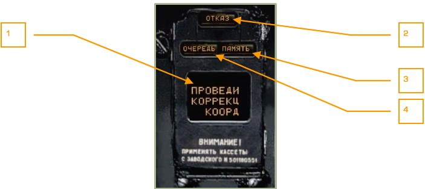

1.    Сигнальное табло.
2.    Транспарант ОТКАЗ.
3.    Транспарант ПАМЯТЬ.
4.    Транспарант ОЧЕРЕДЬ.

Обобщенная система встроенного контроля и предупреждения экипажа ЭКРАН-3203 (в дальнейшем ЭКРАН) входит в состав единой системы внутрикабинной сигнализации и предназначена для:

-  Контроля работы всех систем и агрегатов вертолёта и выдачи летчику информации об отказах в них или отклонений их параметров от нормы при
выполнении полета с их документированием.
- Проверки оборудования встроенными средствами контроля, выдачи информации экипажу и документирования результатов контроля при наземной подготовке.

В состав ЭКРАНа входит универсальное сигнальное табло (УСТ), установленное на
правой приборной доске.

Включение ЭКРАНа производится установкой выключателя ВМГ ГИДРО ЭКРАН [[LCtrl + LShift + N]] на нижней панели пульта контроля в нижнее положение, электроснабжение при аварийном режиме производится от аккумулятора.

ЭКРАН работает в двух режимах:

- ПК – полетный контроль.
- НК – наземный контроль (не реализован в симуляторе).

Режим ПК начинается с момента включения ЭКРАНа, заканчивается с обесточиванием вертолёта и обеспечивает:

- Выдачу на УСТ текстовой информации об отказах и аварийных режимах
работы агрегатов и систем или рекомендаций летчику (например
ПРОВЕДИ КОРРЕКЦ КООРДИНАТ), при этом для привлечения внимания
летчика единая система внутрикабинной сигнализации включает центральный сигнальный огонь (ЦСО) в проблесковом режиме, а также речевое сообщение.
- Запоминание поступающей информации для последующей выдачи ее в порядке очередности (приоритетности) на УСТ по вызову летчика или при
распечатке.
- Документирование на специальную пленку поступающей на УСТ информации с отображением времени ее поступления, исчисляемого с момента
включения ЭКРАНа.
- Автоматическую распечатку на пленку в виде цифровых кодов последних
64-х сигналов, возникших в полете с момента отрыва и до приземления
вертолёта.

Режим ПК по объему контролируемых параметров можно условно подразделить на 4
этапа:

1.   От момента включения ЭКРАНа и до запуска двигателей.
2.   После запуска двигателей и до взлета, а также после приземления и до
обесточивания вертолёта.
3.   Полет.
4.   Распечатка на пленку последних возникших в полете 64-х сигналов через
8 секунд после посадки вертолёта.

Для включения голосового воспроизведения всех сигналов, которые в штатном режиме отображаются только на панели УСТ, необходимо включить выключатель
РЕЧЕВОЙ ИНФОРМАТОР на панели управления реечевым информатором в нижней
части центрального пульта.

#### Первый этап

На первом этапе от момента включения ЭКРАНа и установки одного из стоп-кранов
двигателей в положение ОТКРЫТО и до установки любого из РУД в положение
АВТОМАТ во избежание преждевременного появления сигналов в процессе запуска
двигателей задействованы только цепи следующих параметров двигателей и редукторов:

- ДАВЛЕНИЕ МАСЛА ПРИВОДОВ;
- ДАВЛЕНИЕ МАСЛА ЛЕВ/ПРАВ РЕД;
- ВИБРАЦИЯ ПРЕДЕЛЬН ЛЕВ/ПРАВ ДВ;
- ТЕМПЕР МАСЛА РЕД ЛЕВ/ПРАВ;
- СТРУЖКА ЛЕВ/ПРАВ ДВ;
- ДАВЛЕНИЕ МАСЛА ЛЕВ/ПРАВ ДВ;
- ДАВЛЕНИЕ МАСЛА ГЛАВ РЕД;
- ТЕМПЕР МАСЛА ГЛАВ РЕД;
- СТРУЖКА ГЛАВ РЕД.

#### Второй этап

На втором этапе от момента установки любого из РУД в положение АВТОМАТ и до
взлета (срабатывания концевого выключателя на шасси) задействуются все цепи
контролируемых систем, агрегатов и режимов, кроме включаемых при взлете. После
посадки (выполнения распечатки и появления на УСТ кадра ДОКУМЕНТ) второй
этап работы ЭКРАН продолжается до обесточивания вертолёта.

#### Третий этап

Третий этап ПОЛЕТ начинается при отрыве вертолёта (срабатывании концевого выключателя шасси) регистрацией времени взлета, исчисляемого от момента включения ЭКРАНа и появления на УСТ кадра РЕЙС. На этапе ПОЛЕТ к ЭКРАНу подключаются и документируются цепи всех контролируемых систем агрегатов и режимов,
при этом на УСТ индицируется только часть информации; другая часть документируется в памяти системы ЭКРАН, а 11 аварийных сигналов, высвечиваемых на красных табло системы САС, без отображения на УСТ сопровождаются звуковыми сообщениями, повторяемыми дважды.

Сигналы, выдаваемые на УСТ со сменой кадра, сопровождаются речевыми сообщениями «СМОТРИ ЭКРАН», а при установке переключателя ВКЛ – АВАР на панели
управления речевым информатором в положение АВАР – речевыми сообщениями,
соответствующими поступившим сигналам.
Заканчивается этап через 8 секунд после посадки (обжатии шасси).

#### Четвертый этап

Четвертый этап – автоматическая распечатка из памяти на пленку цифровым кодом
последних 64-х сигналов, возникших на этапе ПОЛЕТ. Начинается этап через 8 секунд после посадки с появлением на УСТ кадра ДОКУМЕНТ. Распечатка длится
около 20-и секунд, на этом четвертый этап заканчивается и продолжается второй
этап до обесточивания вертолёта.

Документирование сигналов на пленку и в память производится на всех этапах работы, а распечатка сигналов из памяти возможна только для сигналов, возникших
на этапе ПОЛЕТ.

#### Очередность

Сигналы на УСТ подаются с приоритетной очередностью. В случае поступления
сразу нескольких сигналов высвечивается сигнал с наибольшим приоритетом и
транспарант ОЧЕРЕДЬ.

Каждое новое появление в памяти очередного сигнала также сопровождается высвечиванием ЦСО в проблесковом режиме. Просмотр сигналов в очереди осуществляется последовательными нажатиями на центральный сигнальный огонь (ЦСО).
После первого нажатия на ЦСО исчезает его проблесковый режим свечения, после
второго нажатия – сигнал, высветившийся на УСТ, уходит в память; при этом высвечивается транспарант ПАМЯТЬ, а на УСТ выводится следующий сигнал. После просмотра сигналов в памяти, транспарант ПАМЯТЬ отключается, а на УСТ остается последний сигнал.

#### Цифровые коды сигналов

Цифровые сигналы выводятся на распечатку последовательно в формате: код сигнала (трехзначное число) – время поступления сигнала (четырехзначное число).

В примере ниже первый сигнал имеет код 132, время поступления 00 мин, 17 секунд с момента включения ЭКРАНа, второй сигнал имеет код 066, время поступления 03 минуты, 20 секунд.

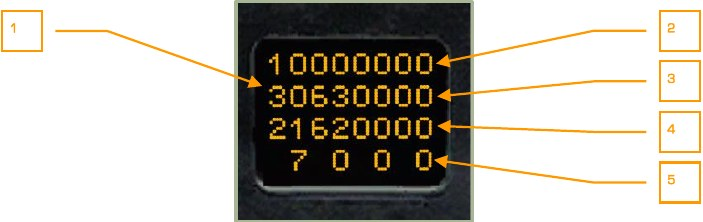

1.   Цифровой код сигнала.
2.   Время – десятки минут.
3.   Время – единицы минут.
4.   Время – десятки секунд.
5.   Время – единицы секунд.

#### Служебные сообщения на УСТ в режиме ПК

Сообщение         | Описание
------------------| -----------------------------------------------
САМОКОНТ          | Начало встроенного контроля
ЭКРАН ГОДЕН       | Окончание встроенного контроля – ЭКРАН исправен
ЭКРАН ОТКАЗ       | Окончание встроенного контроля – обнаружен отказ
РЕЙС              | Начало этапа ПОЛЕТ
ДОКУМЕНТ          | Начало режима ДОКУМЕНТ

#### Таблица сигналов на УСТ в режиме ПК

Номер в каталоге | Приоритет | Сообщение | Описание
---------|--------|------------------------------|-------------------------------------------
1        | 1      | ПРИНЯТЬ ЦУ                   | Информация о наличии новой цели от системы внешнего целеуказания.
2        | 2      | ОСНОВНАЯ ГИДРО               | Отказ основной гидросистемы.
3        | 3      | ОБЩАЯ ГИДРО                  | Отказ общей гидросистемы.
4        | 4      | ВЫПУСТИ ШАССИ                | Стойки шасси не вышли (не встали на упоры). Полет происходит на предельно малой высоте со снижением и Vпр < 30.0 км/ч.
5        | 5      | ДАВЛЕНИЕ МАСЛА ГЛАВ РЕД      | Минимальное давление масла главного редуктора.
6        | 6      | ТЕМП МАСЛА ГЛАВ РЕД          | Перегрев масла главного редуктора.
7        | 7      | СТРУЖКА ГЛАВ РЕД             | Стружка в масле главного редуктора.
10       | 8      | ВКЛЮЧИ ЗАП КОД ОТВЕТЧИК      | Включи запасной код СРО.
11       | 9      | СЕТЬ НА АККУМУЛ              | Бортсеть на аккумуляторе.
30       | 24     | РАБОТАЙ С ИТ                 | Отказ К-041, канал ИТ «Шквала» работает.
31       | 25     | ВКЛЮЧИ РУ РАБОТАЙ С КИ-ИТ    | Отказ ЦВМ-Б или УВВ при пуске ПТУР.
34       | 28     | ВКЛЮЧИ РЗН                   | Отказ ЦВМ-Н или УВВ. Включи резервирование навигационных задач.
14       | 12     | ОТКАЗ СУО-РС                 | Отказ СУО РС.
247, 250 | 13     | ОТКАЗ ППУ                    | Отказ привода НППУ. Отказ СУО НППУ.
16       | 14     | ПЕРЕДНИЙ БАК 110             | Мало топлива в переднем баке.
17       | 15     | ЗАДНИЙ БАК 110               | Мало топлива в заднем баке.
20       | 16     | ОБЛЕДЕН ВКЛЮЧИ ПОС ВИНТ      | Обледенение.
21       | 17     | РАДИО ВЫСОТОМ                | Отказ радиовысотомера.
22       | 18     | КУРСОВЕРТИК                  | Отказ инерциального комплекса курсо-вертикали.
23       | 19     | ОТКАЗ ЭЗУ-Ц                  | Отказ ЭЗУ ЦВМ-Ц.
24       | 20     | ВКЛЮЧИ СЕТКУ РАБОТАЙ С НПУ   | Отказ блока связи К-041 при подвижной пушке.
25       | 21     | РАБОТАЙ                      | Отказ канала управления подвижной пушкой КС НПУ      041.
26       | 22     | ОТКАЗ ТЕЛЕКОДА               | Отказ телекода ВЦУ.
40       | 31     | ВКЛЮЧИ ПРЕОБРАЗ              | Включи преобразователь вручную.
44       | 35     | ОТКАЗ ЛР-РЭП                 | Отказ всех каналов системы предупреждения об облучении.
45       | 36     | ДАВЛЕНИЕ МАСЛА ЛЕВ РЕД       | Минимальное давление масла левого редуктора.
46       | 37     | ТЕМПЕР МАСЛА ЛЕВ РЕД         | Перегрев масла левого редуктора.
47       | 38     | СТРУЖКА ЛЕВ РЕД              | Стружка в левом редукторе.
50       | 39     | ДАВЛЕНИЕ МАСЛА ПРАВ РЕД      | Минимальное давление масла правого редуктора.
51       | 40     | ТЕМПЕР МАСЛА ПРАВ РЕД        | Перегрев масла правого редуктора.
52       | 41     | СТРУЖКА ПРАВ РЕД             | Стружка в правом редукторе.
53       | 42     | ДАВЛЕНИЕ МАСЛА ПРИВОДОВ      | Минимальное давление масла коробки приводов.
54       | 43     | ВКЛЮЧИ БЛОКИР СУО            | Потребители СУО отключены.
55       | 44     | РЕЗЕРВ АВИА ГОРИЗОНТ         | Отказ резервного авиагоризонта.
56       | 44     | ОТКАЗ ОБОГРЕВА ПВД ЛЕВ       | Отказ обогрева ПВД левого.
57       | 44     | ОТКАЗ ОБОГРЕВА ПВД ПРАВ      | Отказ обогрева ПВД правого.
60       | 45     | ИК-ВСП                       | Отказ комплекса высотно-скоростных параметров.
61       | 46     | ДИСС                         | Отказ ДИСС.
41       | 32     | НЕСХОД ИЗДЕЛИЯ               | Несход боеприпаса.
42       | 33     | ОТКЛЮЧИ СОЭП-РЭП             | Выключить Л-140.
62       | 47     | КАНАЛ КУРСА                  | Отказ канала курса.
63       | 48     | НЕТ СЧИСЛЕН КООРД            | Отсутствие счисления координат.
64       | 49     | СБОЙ РАСЧЕТА МАРШРУТА        | Сбой расчета параметров полета по маршруту.
65       | 50     | ЭЗУ-Н                        | Отказ ЭЗУ-Н.
66       | 51     | ПРОВЕДИ КОРРЕКЦ КООРД        | Вход в зону ориентира коррекции координат (R~18 км от ОР).
67       | 52     | ЛЕВ ГЕНЕР                    | Отказ левого генератора.
70       | 53     | ПРАВ ГЕНЕР                   | Отказ правого генератора.
71       | 54     | ЛЕВ ВЫПРЯМИТ                 | Отказ левого выпрямителя.
72       | 55     | ПРАВ ВЫПРЯМИТ                | Отказ правого выпрямителя.
73       | 56     | ЭЛЕКТРОН РЕГУЛЯТ ЛЕВ ДВ      | Отказ электронного регулятора левого двигателя.
74       | 57     | ЭЛЕКТРОН РЕГУЛЯТ ПРАВ ДВ     | Отказ электронного регулятора правого двигателя.
43       | 34     | ОТКАЗ ЛТЦ-РЭП                | Отказ УВ-26.
35       | 29     | РАЗГЕРМ КАБИНЫ               | Разгерметизация кабины.
76       | 59     | НЕТ НАДДУВА ГИДРО            | Нет давления наддува гидросистемы.
36       | 29     | ОТКАЗ СКВ                    | Отказ кондиционирования и вентиляции кабины.
37       | 30     | ОТКАЗ ПОС ВИНТОВ             | Отказ ПОС винтов.
77       | 60     | ПРЕДЕЛ ВИБРАЦИЯ ЛЕВ ДВ       | Предельная вибрация левого двигателя.
100      | 61     | ПРЕДЕЛ ВИБРАЦИЯ ПРАВ ДВ      | Предельная вибрация правого двигателя.
142      | 62     |     ОТКАЗ РЕГИСТР            | Отказ регистратора.
102      | 63     |     ЭЗУ-Б                    | Включи резервирование боевых задач.
103      | 64     |     СТРУЖКА ЛЕВ ДВ           | Стружка в масле левого двигателя.
104      | 65     |     СТРУЖКА ПРАВ ДВ          | Стружка в масле правого двигателя.
105      | 66     |     ДАВЛЕНИЕ МАСЛА ЛЕВ ДВ    | Минимальное давление масла левого двигателя.
106      | 67     |     ДАВЛЕНИЕ МАСЛА ПРАВ ДВ   | Минимальное давление масла правого двигателя.
107      | 68     |     НЕТ СТОПОРА ППУ          | Отказ стопора подвижной пушечной установки.

### Авиагоризонт АГР-81

Авиагоризонт предназначен для индикации пространственного положения вертолёта по крену и тангажу, бокового скольжения и выдачи сигналов крена и тангажа
в регистрирующую аппаратуру. Установлен на вертолёт в качестве резервного.

1.   Шкала тангажа.
2.   Подвижный силуэт самолета.
3.   Шкала крена.
4.   Индикатор скольжения (шарик).
5.   Бленкер АГ.
6.   Ручка арретира/тест контроля.

Крен индицируется вращением подвижного силуэта самолета относительно неподвижной шкалы крена. При повороте силуэта по часовой стрелке индицируется правый крен, а при повороте силуэта против часовой стрелки индицируется левый
крен. Отсчет углов крена производится по шкале, которая имеет отметки через 5° в
диапазоне углов 0…30°, далее через каждые 15°. Отметки 30° и 60° оцифрованы.

Тангаж индицируется подвижной шкалой тангажа относительно центра силуэта самолета. При перемещении шкалы вниз от нулевого положения индицируется кабрирование, вверх - пикирование. Шкала имеет отметки 5-10-15-20 и далее через каждые 5°. Отметки 10-20-30-40-50-60-70 оцифрованы.

Скольжение индицируется шариком, перемещающимся в трубке. Смещение шарика
влево от центра (обозначенного рисками) индицирует правое скольжение и наоборот.
После включения питания выключателем РЕЗЕРВ АГ, следует разарретировать авиагоризонт по истечении 60 секунд. Время приведения оси в вертикальное положение
– до 30 секунд.

Функции ручки арретира/тест контроля:

- Для проведения теста нажать ручку арретира/тест контроля.
- Арретирование. Вытянуть ручку арретира/тест контроля на себя. При
необходимости, зафиксировать в вытянутом положением поворотом ручки
по часовой стрелке.
- Установка шкалы тангажа. Поворот ручки арретира/тест контроля.

Курсовая/глиссадная планки не задействованы и уходят из поля зрения прибора после включения питания.
Бленкер АГ выпадает при отказе прибора, проведении тест-контроля и в случае,
если авиагоризонт заарретирован.

Увод авиагоризонта обусловлен следующими составляющими:

- Собственным постоянным и случайным дрейфом.
- Суточным вращением Земли.
- Перемещением вертолёта относительно Земли.
- Дрейфами, возникающими из-за небаланса массы (зависят от ускорений
объекта).

Радиальная коррекция выставляет ось гироскопа по кажущейся вертикали. Кажущаяся вертикаль – векторная сумма гравитационного ускорения и собственных ускорений объекта.

Радиальная коррекция отключается при действии на объект ускорений, эквивалентных отклонению вектора кажущейся вертикали от оси гироскопа на угол 8 или более градусов.

Увод гироскопа – от 0 до 5 градусов в минуту.

### Указатель температуры выходящих газов двигателей

Указатель температуры выходящих газов двигателей предназначен для индикации
температуры газов двигателей перед турбинами.

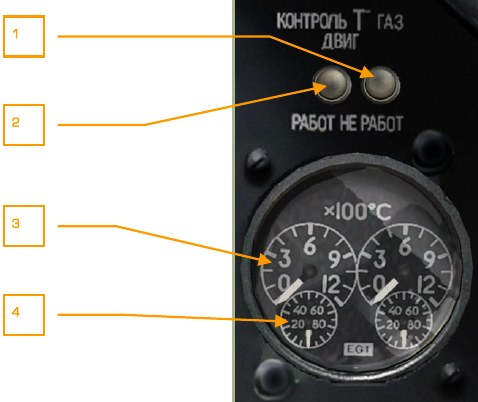

1.   Кнопка контроля указателя температуры газов двигателей при неработающих двигателях – НЕ РАБОТ [[LAlt + P]]. При нажатии кнопки стрелки указателя температуры должны установиться на отметках шкал более 800°C.
2.   Кнопка контроля указателя температуры газов двигателей при работающих двигателях – РАБОТ [[LCtrl + P]]. При нажатии кнопки стрелки указателя температуры должны установиться на отметках шкал не более 150°C.
3.   Большая шкала указателя температуры газов двигателей. Шкала проградуирована в сотнях градусов Цельсия.
4.   Малая шкала указателя температуры газов двигателей. Шкала проградуирована в десятках градусов Цельсия.

Считывать показания температуры следует последовательно: сотни градусов с
больших шкал, десятки градусов с малых шкал.

### Сдвоенный указатель частоты вращения двигателей

Указатель частоты вращения двигателей предназначен для индикации частоты вращения турбокомпрессоров двигателей. Шкала прибора проградуирована в процентах. 100 % по указателю соответствуют 19 537 об/мин двигателя.

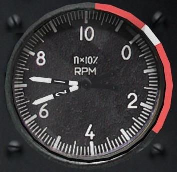

Взлетный режим – 97 %.

Номинальный режим – 95 %.

1-й крейсерский – 93 %.

2-й крейсерский – 92 %.

Малый газ – 72…78 %.

### Индикатор топливомера

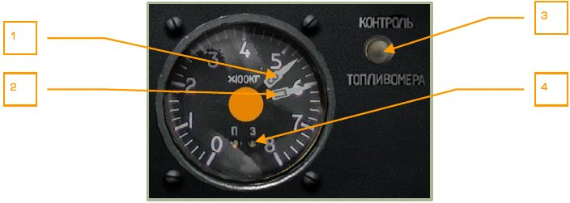

1.   Стрелка указателя остатка топлива в заднем баке.
2.   Стрелка указателя остатка топлива в переднем баке.
3.   Кнопка КОНТРОЛЬ ТОПЛИВОМЕРА [[LCtrl + LAlt + LShift + P]].
4.   Сигнальные лампы переднего и заднего баков, П и З.

Индикатор топливомера предназначен для индикации остатка топлива в переднем и
заднем баках вертолёта. Шкала прибора проградуирована от 0 до 800 кг.
Максимальный вес топлива, заправляемого в передний бак составляет 705 кг, в задний – 745 кг.
При минимальном аварийном остатке топлива в одном из основных баков (110 кг)
мигает лампа ЦСО, на УСТ системы ЭКРАН высвечивается информация ПЕРЕДНИЙ
БАК 110 КГ или ЗАДНИЙ БАК 110 КГ.

При нажатии на кнопку КОНТРОЛЬ ТОПЛИВОМЕРА происходит отклонение стрелок
на заданную величину относительно текущего остатка топлива и зажигаются сигнальные лампы П или З.

### Табло светосигнальное

**Перечень уведомляющих сообщений на табло системы САС левой приборной доски**

Сообщение               |    Описание
------------------------|------------------------------------------------
n ст ПРЕД ЛЕВ ДВИГ      |   Превышение оборотов левого двигателя.
n ст ПРЕД ПРАВ ДВИГ     |   Превышение оборотов правого двигателя.
n~y~                    |     Максимально допустимая перегрузка.
ВИБРАЦИЯ ЛЕВ ДВИГ       |   Превышение предельной вибрации левого двигателя.
ВИБРАЦИЯ ПРАВ ДВИГ      |      Превышение предельной вибрации правого двигателя.
V~max~ доп              |        Превышение допустимой приборной скорости полета.
ГЛАВ РЕД                |      Минимальное давление масла главного редуктора. Перегрев масла главного редуктора. Стружка в масле главного редуктора.
ПОЖАР                   |      Пожар в левом двигателе. Пожар в правом двигателе. Пожар во вспомогательной силовой установке. Пожар в отсеке гидравлики. Пожар в редукторном отсеке.
ОТКАЗ СРО               |      Отказ ответчика.
АТАКА БЕРЕГИСЬ          |      Облучение вертолёта лазерными средствами наведения.
ВЫПУСТИ ШАССИ           |      Невыпуск или неустановка шасси на замки.

### Щиток управления шасси

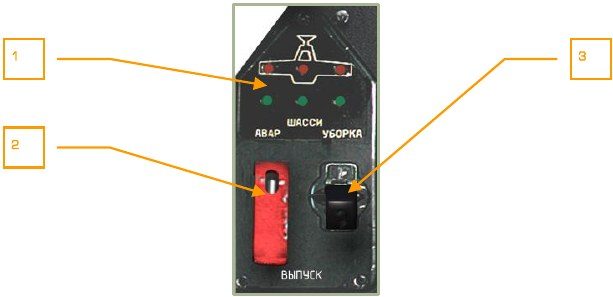

1.       Индикаторы положения шасси.
Верхние (красные) светоиндикаторы индицируют убранное положение
шасси. Нижние (зеленые) светоиндикаторы индицируют выпущенное положение шасси.
2.   Переключатель гидравлической системы шасси АВАР. В верхнем нормальном положении выпуск и уборка шасси осуществляется от общей гидросистемы. В случае повреждения общей гидросистемы для выпуска шасси
необходимо подключить основную гидросистему; для этого открыть красную крышку [[LCtrl + G]] и переключить переключатель в нижнее положение [[LAlt + G]].
3.   Кран шасси УБОРКА – ВЫПУСК [[G]].

## Верхний пульт

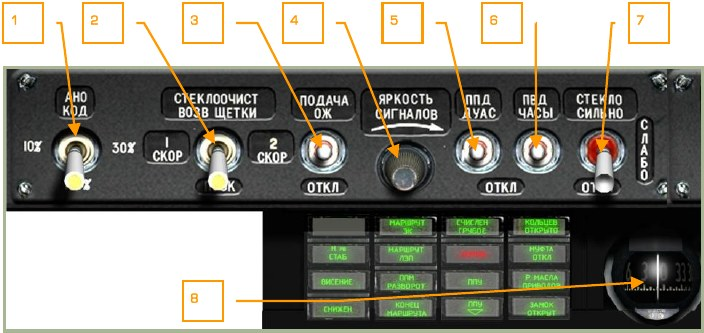

1.   Переключатель регулировки яркости свечения БАНО [[RAlt + L]] (левый –
красного цвета, правый – зеленого цвета и ХС белого цвета) и подачи кодированных сигналов с помощью БАНО и ХС [[LAlt + L]].
2.   Переключатель стеклоочистителя лобового стекла кабины [[ LCtrl + LAlt + W]].
3.   Выключатель подачи омывающей жидкости.
4.   Регулятор яркости подсветки сигналов табло.
5.   Выключатель подогрева приемника полного давления и датчиков угла
атаки и сноса [[LAlt + LShift + S]].
6.   Выключатель подогрева приемника воздушного давления и часов [[LCtrl + LShift + S]].
7.   Переключатель мощности обогрева лобового стекла.
8.   Магнитный компас.

** Перечень уведомляющих сообщений на табло системы САС левой части верхнего пульта**

Сообщение               |    Описание
------------------------|------------------------------------------------
H рв СТАБ               |   Включение стабилизации геометрической высоты.
ВИСЕНИЕ                 |   Включение режима висения.
СНИЖЕН                  |   Включение режима вертикального снижения.
МАРШРУТ ЗК              |   Включение путевого способа выхода в НТ.
МАРШРУТ ЛЗП             |   Включение маршрутного способа выхода в НТ.
ППМ РАЗВОРОТ            |   Сигнализация о пролете ППМ и развороте на очередной участок маршрута.
КОНЕЦ МАРШРУТА          |   Пролет заключительного по программе ППМ (НТ).
СЧИСЛЕНИЕ ГРУБОЕ        |   Индикация о счислении координат вертолёта в курсо-воздушном режиме.
ВЗРЫВ (красный)         |   Переключатель ВЗРЫВ-НЕВЗРЫВ при аварийном сбросе на ПУИ-800 установлен в положение ВЗРЫВ.
ППУ                     |   Сигнализация о расстопоренном положении пушечной установки.
КОЛЬЦЕВ ОТКРЫТО         |   Открытое положение крана кольцевания топливной системы.
МУФТА ОТКЛ              |   Отключение коробки приводов от главного редуктора.
P масла ПРИВОДОВ        |   Нормальное давление масла в коробке приводов при закрытых стоп-кранах.
ЗАМОК ОТКРЫТ            |   Открытое положение грузового замка транспортировки грузов на внешней подвеске.

1.     Выключатель противообледенительной системы винтов [[LCtrl + LAlt + LShift + S]].
2.     Выключатель противообледенительной системы двигателей [[LAlt + I]],
[[LCtrl + LAlt + I]].
3.     Лампа контроля обогрева ПВД (левая и правая).
4.     Кнопка контроля обогрева ПВД.
5.     Переключатель вентиляторов системы кондиционирования кабины.

**Перечень уведомляющих сообщений на табло системы САС правой части верхнего пульта**

Сообщение               |    Описание
------------------------|------------------------------------------------
БОЕВАЯ СЕТЬ ВКЛ          |  Выключатель главный на ПУИ-800 включен.
ТРЕНАЖ                   |  Включение режима ТРЕНАЖ на ПВР (для управляемого оружия).
ОБЗОР (желт.)            |  Отказ изделия ОБЗОР-800М (нашлемная система целуказания).
РАНЕТ (желт.)            |  Отказ изделия РАНЕТ.
К-ЦВМ                    |  Высвечивается по окончании режима контроля ЦВМ. Выключается свечение при отключении режима контроля ЦВМ на ППК.
ЦВС (желт.)              |  Отказ одной и более ЦВМ.
ПРЕОБРАЗ                 |  Включение преобразователя ПОС-500Б.
И-251В (желт.)           |  Отказ изделия ШКВАЛ.
ПОС ЛЕВ ДВИГ             |  Включение противообледенительной системы левого двигателя.
ПЗУ ЛЕВ ДВИГ             |  Включение пылезащитного устройства левого двигателя.
ОГРАН РЕЖ ЛЕВ (желт.)    |  Достижение предельно допустимой величины оборотов турбокомпрессора или температуры газов левого двигателя.
ПОС ВИНТ                 |  Включение противообледенительной системы винтов.
ПОС ПРАВ ДВИГ            |  Включение противообледенительной системы правого двигателя.
ПЗУ ПРАВ ДВИГ            |  Включение пылезащитного устройства правого двигателя.
ОГРАН РЕЖ ПРАВ (желт.)   |  Достижение предельно допустимой величины оборотов турбокомпрессора или температуры газов правого двигателя.
ОБОГРЕВ ВУО              |Включен обогрев визуального указателя обледенения.
БАК ПЕРЕДНИЙ             |Наличие давления за насосом переднего бака.
КРАН ЛЕВ ЗАКРЫТ          |Закрытое положение перекрывного крана левого двигателя.
БАК ЛЕВ ВНЕШН            |Наличие давления за насосом левого внешнего бака.
БАК ЛЕВ ВНУТР            |Наличие давления за насосом левого внутреннего бака.
БАК ЗАДНИЙ               |Наличие давления за насосом заднего бака.
КРАН ПРАВ ЗАКРЫТ (желт.) |Закрытое положение перекрывного крана правого двигателя.
БАК ПРАВ ВНЕШН           |Наличие давления за насосом правого внешнего бака.
БАК ПРАВ ВНУТР           |Наличие давления за насосом правого внутреннего бака.

### Пульт режимов целеуказания ПРЦ

Пульт ПРЦ располагается с левой стороны верхнего пульта. Пульт входит в состав
аппаратуры внешнего целеуказания, которая входит в состав ПрПНК и предназначена для обеспечения передачи и приема информации об обнаруженных целях.

Пульт ПРЦ предназначен для выбора типа цели, приема-передачи целей адресатам
и управления внешним целеуказанием.

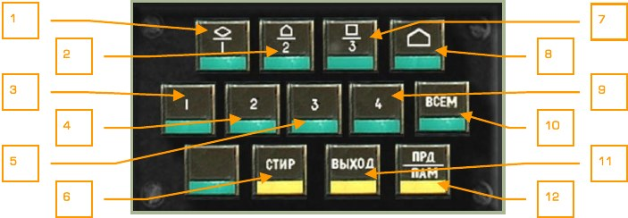

1.       Кнопка-табло «Бронетехника»/1 [[LShift + 1]]. Ввод и стирание типа/номера
цели. Тип - подвижная малоразмерная цель, бронетехника.
2.       Кнопка-табло «ПВО»/2 [[LShift + 2]]. Ввод и стирание типа/номера цели.
Тип – средства ПВО.
3.       Кнопка-табло 1 [[LCtrl + 1]]. Адресация информации первому вертолёту.
4.       Кнопка-табло 2 [[LCtrl + 2]]. Адресация информации второму вертолёту.
5.       Кнопка-табло 3 [[LCtrl + 3]]. Адресация информации третьему вертолёту.
6.       Кнопка-табло СТИР [[LShift + T]]. Стирание введенной информации.
7.       Кнопка-табло «Прочая цель»/3 [[LShift + 3]]. Ввод и стирание типа/номера
цели. Тип – прочие объекты.
8.       Кнопка-табло «Точка выхода» [[LShift + 4]]. Ввод и стирание точки выхода
к цели.
9.       Кнопка-табло 4 [[LCtrl + 4]]. Адресация информации четвертому вертолёту.
10. Кнопка-табло ВСЕМ [[LCtrl + 5]]. Адресация информации всем вертолётам.
11. Кнопка-табло ВЫХОД [[LShift + Y]] . Включение режима ВЫХОД на цель.
12. Кнопка-табло ПРД/ПАМ [[LShift + U]]. Включение режимов передачи или запоминания информации.

### Индикаторное устройство аппаратуры Л-140

Индикаторное устройство аппаратуры лазерной разведки Л-140 располагается под
пультом ПРЦ.

Индикаторное устройство предназначено для индикации направления лазерного облучения по азимуту и по углу места (нижняя – верхняя полусфера), а также индикации режима работы облучающего лазера.

1.   Светосигнальные лампы информации о направлении, откуда производится
облучение.
2.   Светосигнальное табло оповещения об облучении со стороны верхней или
нижней полусфер.
3.   Светосигнальное табло оповещения об облучении лазерным дальномером.
4.   Кнопка обнуления индикации [[L]].
5.   Светосигнальное табло оповещения об облучении средствами наведения.

### Пульт управления УВ-26

Пульт управления УВ-26 располагается с правой стороны верхнего пульта. Пульт
предназначен для управления системой постановки пассивных помех путем выброса
тепловых ИК патронов с целью защиты от ракет с тепловой головкой самонаведения (Игла, «Стингер», AIM-9, Р-60, Р-73 и т.д.).

1.   Индикационное табло. Индицирует цифровые индексы параметров выброса ловушек или остаток ловушек.

    В случае если переключатель НАЛИЧ-ПРОГР находится в положении
НАЛИЧ – индицируется остаток ловушек. Максимальное количество ловушек - 128. В случае если переключатель НАЛИЧ-ПРОГР находится в положении ПРОГР – первый числовой индикатор показывает кодовое число
СЕРИЯ, второй числовой индикатор показывает кодовое число ЗАЛП и третий числовой индикатор показывает кодовое число ИНТЕРВАЛ.

2.   Лампа - индикатор выбора блоков выброса ловушек левого борта.
3.   Трехпозиционный переключатель БОРТ для выбора к работе блоков ловушек левого, правого или обоих бортов [[RAlt + Delete]], [[Rshift + Delete]].
4.   Кнопка СЕРИЯ [[RShift + Insert]]. Устанавливает количество серий залпов.

    Количество устанавливается кодовым числом из ряда 1…4,5(12),6,7(15),8.

    Для всех кодовых чисел, кроме 0, 5 и 7 количество серий равно кодовому
числу. Для кодового числа 5 - количество серий 12, для кодового числа 7 количество серий 15.

    При установке кодового числа 0 происходит непрерывный выброс всего
комплекта ловушек.

5.   Кнопка ЗАЛП [[RCtrl + Insert]]. Устанавливает количество патронов в залпе.

    Количество устанавливается кодовым числом из ряда 1…8. Для всех кодовых чисел количество патронов в залпе равно кодовому числу.

6.   Кнопка СТОП [[Delete]]. Останавливает работу системы выброса ловушек.
7.   Лампа - индикатор выбора блоков выброса ловушек правого борта.
8.   Переключатель НАЛИЧИЕ – ПРОГР [[RCtrl + ]]. В положении НАЛИЧИЕ на
индикационное табло выводится количество оставшихся ловушек, в положении ПРОГР индицируются кодовые числа параметров выброса ловушек.
9.   Кнопка ИНТЕРВАЛ [[RAlt + Insert]]. Устанавливает интервал между залпами.

    Значение интервала устанавливается кодовым числом из ряда:
1…6,7(0,25),8,9(0,5). Для всех кодовых чисел, кроме 0, 7 и 9 значение интервала в секундах равно кодовому числу. Для кодового числа 7 – значение интервала 0,25 с, для кодового числа 9 – значение интервала 0,5 с.
    
    При выборе кодового числа 0 значение интервала равно 0,125 с.

10. Кнопка СБРОС ПРОГР [[RCtrl + Delete]]. Сбрасывает параметры набранной
программы выброса ловушек в значения по умолчанию 110.
11. Кнопка ПУСК [[Insert]]. Запускает заданную программу выброса ловушек.

Примеры кодовых чисел:

110 – серия 1, в залпе 1, интервал 0. При однократном нажатии на кнопку «Пуск»
будет произведен выброс одной ловушки в зависимости от положения трехпозиционного переключателя БОРТ. Если переключатель БОРТ находится в среднем положении, будет произведен выброс по одной ловушке с каждого борта. Это - программа по умолчанию в системе постановки помех.

622 – серия 6, в залпе 2, интервал 2. При однократном нажатии на кнопку «Пуск»
будет производиться залп из 2-х ловушек, через каждые 2 секунды, 6 раз. Если переключатель БОРТ находится в среднем положении, будет произведен выброс ловушек по этой программе с обоих бортов.

529 – серия 12 (смотри подсказку на кнопке), в залпе 2, интервал 0,5 (смотри подсказку на кнопке). При однократном нажатии на кнопку «Пуск» будет производиться залп из 2-х ловушек, через каждые 0,5 секунды, 12 раз. Если переключатель
БОРТ находится в среднем положении, будет произведен выброс ловушек по этой
программе с обоих бортов.

Параметры скрипта панели УВ-26:
\Scripts\Aircrafts\Ka-50\Cockpit\Devices_specs\UV_26.lua

### Компас магнитный жидкостный КИ-13

Компас магнитный жидкостный КИ-13 предназначен для определения компасного
курса вертолёта и применяется в качестве автономного дублирующего прибора.

Принцип действия основан на взаимодействии постоянных магнитов компаса с магнитным полем земли.
Шкала имеет разбивку через 5 градусов с оцифровкой через 30 градусов.

Краткие технические данные:

- Инструментально-шкаловая погрешность компаса ±1°.
- Застой картушки – не более 1°.
- Увлечение картушки на разворотах – не более 35°.
- Время полного успокоения картушки – не более 17 с.
- Рабочий диапазон температур ±60 °С.

!!! note "Примечание"
    Т.к. магнитный компас индицирует не истинный курс ЛА, а компасный, для вычисления истинного курса необходимо вводить поправку магнитного склонения в данном регионе, а также поправку девиации компаса.

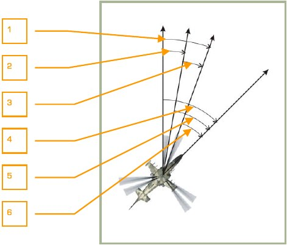

1.    Полная поправка (вариация).
2.    Поправка магнитного склонения.
3.    Поправка девиации компаса.
4.    Истинный курс.
5.    Магнитный курс.
6.    Компасный курс.

На черноморском побережье Кавказа поправка магнитного склонения составляет в
среднем 5 градусов.

Девиация компаса вызывается действием на стрелку компаса магнитного поля вертолёта.

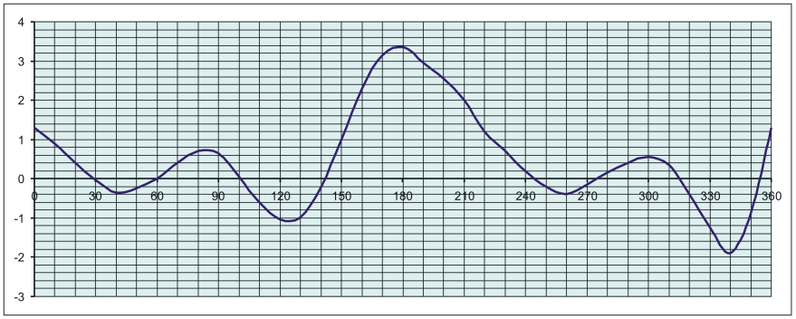

Данная таблица описывает величину девиации магнитного компаса КИ-13 в кабине
вертолёта Ка-50 применительно к симулятору.

Вертикальная ось – значение поправки девиации магнитного компаса в градусах.

Горизонтальная ось – компасный курс вертолёта.

Для того чтобы вычислить поправку, необходимо по горизонтальной оси найти текущее значение компасного курса и провести вертикаль до соприкосновения с кривой. Значение точки соприкосновения, отчитываемой по вертикальной оси, и будет
являться величиной поправки.

## Центральный пульт

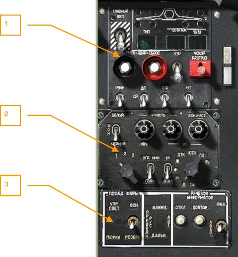

1.   Пульт ПУИ-800М управления и индикации системы управления оружием.
2.   Пульт управления режимами ПУР.
3.   Панель управления освещением и речевым информатором.

### Пульт управления и индикации ПУИ

Пульт управления и индикации (ПУИ) обеспечивает приведение в готовность к применению, выбор режимов применения, а также контроль наличия на борту вооружения и остатка боеприпасов (боекомплекта). Расположен в верхней части центрального пульта.

1.   Индикатор типа оружия, выбранного к применению. Индицирует символы
типа выбранного оружия или подвесных топливных баков: НР – неуправляемые ракеты, ПС – противотанковые снаряды (ПТУР), АБ – авиабомбы,
ПБ – подвесные топливные баки, ПП – подвесные пушечные контейнеры.
2.   Главный выключатель системы СУО [[LAlt + W]]. Предназначен для включения цепей боевых систем.
3.   Кнопка управления сбросом оружия [[LAlt + R]].
4.   Кнопка управления аварийным пуском изделия «72» (не используется).
5.   Переключатель выбора типа патронной ленты для пушки [[LCtrl + C]]. Имеется два вида снарядов: осколочно-фугасные ОФ и бронебойно-зажигательные БР.
6.   Переключатель выбора режима применения оружия [[S]], [[LShift + S]]. Применительно к пушке имеет три положения: длинная очередь ДЛ, средняя
очередь СР и короткая очередь КОР.
7.   Переключатель выбора режима работы СУО [[A]]. Имеет два положения:
ручной РУЧН и автоматический АВТ.
8.   Индикаторы готовности оружия к применению. Четыре штуки, зеленого
цвета.
9.   Индикаторы наличия подвешенного оружия и топливных баков. Четыре
штуки, желтого цвета.
10. Индикатор остатка боекомплекта изделия НАР Б8В20А и ПС (ПТУР).
11. Индикатор остатка боекомплекта пушки.
12. Включатель ускоренной разгрузки УПП (ПТУР) [[RCtrl + W]].
13. Переключатель выбора аварийного сброса ВЗРЫВ – НЕ ВЗРЫВ [LAlt +
LShift + W]. При включении ВЗРЫВ, взводится контактный взрыватель АСП
для подрыва боеприпасов при падении на землю. При включении НЕ
ВЗРЫВ, взрыватели не взводятся.
14. Переключатель изменения темпа стрельбы пушки. Имеется два режима:
малый темп МТ и большой темп БТ [[LShift + C]].

### Пульт управления режимами ПУР

Пульт управления режимами (ПУР) обеспечивает регулировку качества и объема
отображения информации на индикаторе на лобовом стекле (ИЛС), индикаторе телевизионном ИТ-23В и нашлемном визирном устройстве. Пульт расположен в центральной части центрального пульта.

1.   Потенциометр регулировки яркости нашлемного визирного устройства
НВУ. Увеличение яркости [[RAlt + RCtrl + RShift + ] ]], уменьшение - [[RAlt + RCtrl + RShift + [ ]].
2.   Переключатель выбора цвета символов на телевизионном индикаторе ИТ23В [[RCtrl + RShift + B]]. Возможен выбор белого или черного цвета индикации в зависимости от условий освещения.
3.   Переключатель объема информации на ИЛС и ИТ-23В [[RCtrl + S]]. С его помощью можно ограничить объем выводимой информации на индикаторах
в случае необходимости.
4.   Галетный переключатель ЛИТ. 1, 2, 3 – установка литеры для КАПК. Влево - [[RAlt + RCtrl + RShift + I]], вправо - [[RAlt + RCtrl + RShift + O]].
5.   Потенциометр регулировки яркости экрана ИТ-23В. Влево - [[RAlt + RCtrl + [ ]], вправо - [[RAlt + RCtrl + ] ]].
6.   Потенциометр регулировки контраста экрана ИТ-23В. Влево - [[RCtrl + RShift + [ ]], вправо - [[RCtrl + RShift + ] ]].
7.   Переключатель включения трассера. ТР – ОТКЛ. Не реализовано.
8.   Галетный переключатель СФ. К,         ,     ,   ‫٭‬   - переключение светофильтров в КАПК. ДТК, ЮТА, ЛД, ЛУ – переключение каналов КАПК в режиме ВПС (юстировка каналов прицельного комплекса). Не реализовано.

### Панель управления освещением, переключением каналов АРК и речевым информатором

Пульт управления освещением, задачей курса на приводные маяки и речевым информатором расположен в нижней части центрального пульта и состоит из трех
блоков: управления внешним освещением, переключения каналов АРК и управления речевым информатором.

1.   Переключатель основной и резервной фары [[RCtrl + L]].
2.   Выключатель света фар [[RShift + L]], [[RCtrl + RAlt + L]].
3.   АРК. Переключатель маяков ДАЛЬН – АВТ – БЛИЖН [[LAlt + =]] для АРК.
4.   Речевой информатор. Система «АЛМАЗ». Кнопка ОТКЛ. Отключение речевых сообщений текущих отказов [[LShift + LAlt + V]].
5.   Речевой информатор. Система «АЛМАЗ». Кнопка ПОВТОР [[LAlt + V]]. Повтор сообщений текущих отказов.
6.   Речевой информатор. Система «АЛМАЗ». Аварийный режим работы с голосовым воспроизведенем всех сообщений, выводимых на УСТ системы
ЭКРАН [[LCtrl + V]].

Блок управления внешним освещением состоит из двух переключателей.

Фары предназначены для поиска и освещения места посадки вертолёта при отсутствии осветительных средств ночью. Установлены внизу фюзеляжа. Свет фар включается переключателем УПР СВЕТ-ОТКЛ-УБОРКА.

Основная фара включается при установке переключателя ОСН-РЕЗЕРВ в положение
ОСН, резервная – при положении РЕЗЕРВ.

Управление выпуском, уборкой и поворотом обеих фар осуществляется кнопкой
ФАРА на рычаге общего шага, независимо от положения переключателя ПОСАД
ФАРЫ ОСН-РЕЗЕРВ.

Блок переключения каналов АРК имеет один трехпозиционный переключатель.

Переключатель ДАЛЬН-АВТ-БЛИЖН предназначен для переключения АРК на дальний или на ближний приводной радиомаяк. Автоматический режим переключения
маяков не функционирует.

Блок управления речевым информатором состоит из двух кнопок и переключателя:

- Кнопка ОТКЛ предназначена для отключения речевых сообщений информатора
- Кнопка ПОВТОР служит для повторения сообщений обо всех текущих отказах.
- Переключатель ВКЛ-АВАР переключает цепь питания речевого информатора с основной (ВКЛ) на аварийную (АВАР).

### Правый пульт, передняя панель

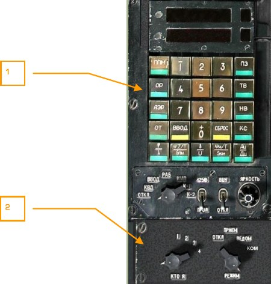

1.   Пульт ПВИ-800 из комплекта К-041
2.   Пульт ПВЦ-800 из комплекта К-041

### Пульт ввода и индикации ПВИ

1.   Верхнее индикационное табло (ВИТ).
2.   Нижнее индикационное табло (НИТ).
3.   Кнопки набора числовой информации, 0…9 и знаков «+», «-» [[RAlt + 0 – 9]].
4.   Кнопка-табло ППМ [[RAlt + Q]]. Выбор ППМ для навигации или ввод координат нового ППМ. Всего до 6 ППМ.

    

5.   Кнопка-табло ОР [[RAlt + V]]. Выбор ориентира коррекции или ввод координат нового ориентира коррекции. Всего до 4-х ориентиров коррекции.

    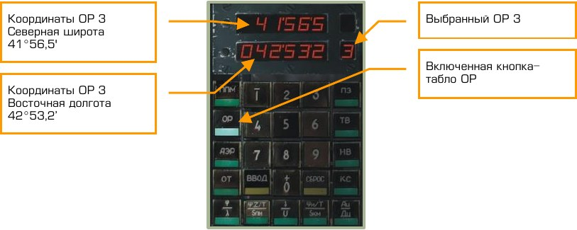

6.   Кнопка-табло АЭР [[RAlt + T]]. Выбор аэродрома для возврата и ввод координат нового аэродрома. Всего до 2-х аэродромов.

    

7.   Кнопка-табло ОТ [[RAlt + U]]. Выбор оперативной точки или ввод координат
новой оперативной точки. Всего до 10 оперативных точек (0…9).

    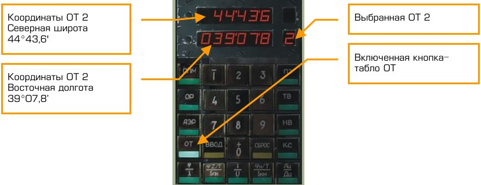

8.   Кнопка-табло ВВОД [[RAlt + I]]. Выполнение ввода набранной информации
в ЦВМ.
9.   Кнопка-табло φ/λ [[RAlt + A]]. Индикация текущих координат вертолёта и
ввод координат начала карты во всех режимах.

    

10. Кнопка-табло Ψ:Z/T / S пм [[RAlt + S]]. Индикация текущего заданного путевого угла на ППМ (подрежим – заданный курс), бокового уклонения от линии заданного пути (подрежим – линия заданного пути), времени полета и
расстояния до очередного ППМ в режимах МАРШРУТ, ВОЗВРАТ, ВЫХОД.

    Индикация при включенном подрежиме ЗК:

    

    Индикация при включенном подрежиме ЛЗП:

    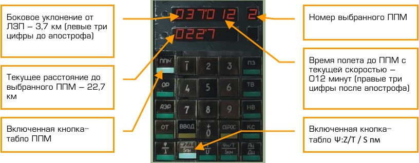

11. Галетный переключатель. Переключение влево - [[RAlt + V]], вправо - [[RAlt + B]].

    -  ОТКЛ – отключение всех режимов.
    -  КВД – включение режима контроля введенных данных.
    -  ВВОД – включение режима ввода информации в ЦВМ-Н, ЦВМ-Б.
    -  РАБ – основное рабочее положение переключателя в полете.
    -  ИМП – включение режима ИМИТАЦИЯ МАРШРУТА ПОЛЕТА.
    -  К-1 – включение режима ОПЕРАТИВНЫЙ КОНТРОЛЬ 1.
    -  К-2 – включение режима ОПЕРАТИВНЫЙ КОНТРОЛЬ 2.

12. Одиночное индикационное табло номера ППМ.
13. Одиночное индикационное табло (НОТ), индикация номер аэродрома, ориентира коррекции, оперативной точки, цели.
14. Кнопка-табло ПЗ [[RAlt + O]]. Повторный запуск инерциальной курсо-вертикали (ИКВ).
15. Кнопка-табло ТВ [[RAlt + R]]. Включение режима точной выставки. Выставка ИКВ с гирокомпасированием.
16. Кнопка-табло НВ [[RAlt + Y]]. Включение нормальной выставки ИКВ.
17. Кнопка СБРОС [[RAlt + O]]. Сброс набранных значений.
18. Кнопка-табло КС [[RAlt + P]]. Индикация или ввод координат точки старта.

    По умолчанию координаты точки старта автоматически берутся из миссии.

    В этом случае в момент старта миссии координаты точки старта (КС) и текущие координаты вертолёта (φ/λ) будут равны.

    

19. Кнопка-табло Ψи/T / S км [[RAlt + F]]. Индикация текущего истинного курса,
времени полета и расстояния до конечного пункта маршрута в режимах
МАРШРУТ, ВОЗВРАТ, ВЫХОД.

    

20. Кнопка-табло Ац/Дц [[RAlt + G]]. Индикация курсового угла и дальности до
цели (ОТ) в режиме ВЫХОД.

    

21. Кнопка-табло δ/V [[D + RAlt]]. Индикация направления и скорости ветра.
Индицируется метеорологическое направление ветра (откуда дует), отличается от навигационного (куда дует) на 180°.

    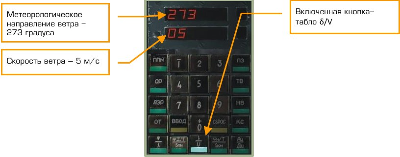

22. Переключатель И-251В – ПРОЛ [[RCtrl + V]]. Выбор способа коррекции координат места вертолёта и определения координат цели. В случае выбора
И-251В, коррекция координат вертолёта и определение координат цели
производится с помощью системы И-251В «Шквал». В случае выбора
ПРОЛ – методом пролета над точкой или целью.

23. Ручка ЯРКОСТЬ. Регулировка подсвета.
24. Переключатель ВЦУ-ОТКЛ [[RCtrl + B]]. Включение режима внешнего целеуказания.

#### Индикация навигационных параметров на ПВИ

### Пульт включения целеуказания ПВЦ

Пульт располагается под пультом ПВИ.

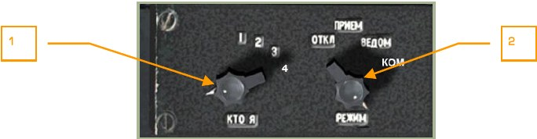

1.   Галетный переключатель КТО Я [[LCtrl + I]]. Предназначен для установки
назначенного номера вертолёта: 1, 2, 3 или 4.
2.   Галетный переключатель РЕЖИМ включения внешнего целеуказания
(ВЦУ) [[LCtrl + M]], [[LShift + M]]:

    - ОТКЛ – отключение режима ВЦУ.
    - ПРИЕМ – режим приема команд ВЦУ.
    - ВЕДОМ – режим прием-передача команд ВЦУ. Режим
    ведомого.
    - КОМ – режим прием-передача команд ВЦУ. Режим командира группы.

## Правый пульт, центральная панель

Пульт располагается под правой рукой летчика.

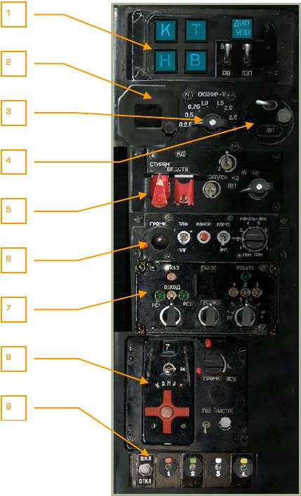

1.   Пульт пилотажных режимов ППР.
2.   Задатчик магнитного склонения.
3.   Переключатель скорости сканирования линии визирования КАПК И-251В
ШКВАЛ, [[LCtrl + LShift + M]] , [[LCtrl + LAlt + M]].
4.   Пульт широтной коррекции.
5.   Пульт управления ответчиком опознавания. Не реализован.
6.   Пульт управления радиокомпаса АРК.
7.   Пульт управления аппаратурой специальной связи. Не реализован.
8.   Пульт управления радиостанцией Р-828.
9.   Пульт управления сигнальными ракетами.

### Пульт пилотажных режимов ППР-800

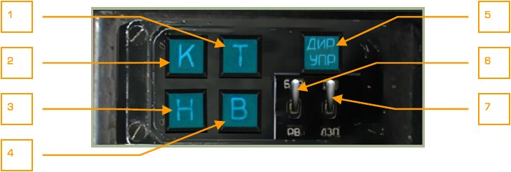

1.   **Т** – Канал тангажа [[LShift + P]].
2.   **К** – Канал крена [[LShift + B]].
3.   **Н** – Канал направления [[LShift + H]].
4.   **В** – Канал высоты [[LShift + A]].
5.   **ДИР УПР** – Канал директорного управления [[LCtrl + A]].
6.   Переключатель подрежимов стабилизации высоты [[LCtrl + X]], [[LShift + X]]:

    **БАР** – барометрический;

    **РВ** – радиовысоты (геометрической высоты);

    **Нейтрально** – отключение подрежимов.

7.   Переключатель подрежимов автоматизированного полета по маршруту
[[LAlt + X]], [[LCtrl + LAlt + X]]:

    **ЗК** – стабилизация заданного курса;

    **ЛЗП** – стабилизация линии заданного пути;

    **Нейтрально** – отключение подрежимов.

### Пульт управления радиокомпаса АРК-22

1.   Кнопка встроенного контроля [[LCtrl + LAlt + T]]. При нажатии на кнопку
стрелка КУР на ПНП отклоняется в заданное положение. При включении
режима АНТ – раздается непрерывный звуковой сигнал.
2.   Переключатель ТЛГ-ТЛФ (телеграф-телефон) [[LCtrl + LAlt + ]]. Прослушивание радиостанций, работающих в соответствующем режиме.
3.   Ручка громкости звукового сигнала. Влево - [[LCtrl + LAlt + = ]], вправо [[LCtrl + LAlt + - ]].
4.   Переключатель АНТ-КОМП (выбор режима работы АНТЕННА – КОМПАС) [[LCtrl + LAlt + [ ]].
5.   Переключатель каналов АРК. Влево - [[LCtrl + =]], вправо - [[LCtrl + -]].

    Имеет 10 положений, 8 из которых позволяют включить фиксированную
настройку на пару приводных радиостанций (ДАЛЬНИЙ – БЛИЖНИЙ). Два
служебных положения используются при подключении пульта предварительной настройки (ППН) наземными специалистами.
АРК совместно с наземной приводной радиостанцией представляет собой угломерную радиотехническую систему, предназначенную для автоматического определения и индикации направления на работающую радиостанцию в среднем диапазоне
частот с возможностью звукового приема ее позывных или команд, передаваемых
на ее рабочей частоте.

Радиокомпас обеспечивает решение следующих навигационных задач:

- Полет на радиостанцию с визуальной индикацией курсового угла радиостанции (КУР).
- Заход на посадку по системе ОСП (приводных радиостанций) в комплексе
с другими приборами.
- Непрерывное автоматическое определение и индикацию КУР.
- Звуковой прием позывных сигналов радиостанции.

Индикация КУР производится на ПНП и на странице ПНП АБРИС по положению
стрелки КУР.

Для вывода индикации КУР на странице ПНП АБРИС необходимо в опциях для РМИ1 или РМИ-2 указать источник сигнала АРК. Для этого на странице МЕНЮ необходимо нажать кнопку ОПЦИИ, выбрать РМИ-1(2) и с помощью кнопки СМЕНА
установить источник - АРК. После этого на странице ПНП АБРИС соответствующая
стрелка РМИ-1(2) будет указывать КУР подобно стрелке КУР на ПНП.

Принцип работы АРК построен по классической схеме автоматического радиопеленгатора, основанной на одновременном приеме сигнала работающей радиостанции
на ненаправленную и направленную неподвижные рамочные антенны. Сигналы с
выхода этих антенн обрабатываются (частотная селекция, усиление, детектирование), сравниваются по фазе, в результате чего формируется сигнал курсового рассогласования. Этот сигнал поступает на двигатель-редуктор, поворачивающий диаграмму направленности неподвижной рамочной антенны до согласованного положения, при котором ее диаграмма направленности своим минимумом приема направлена на пеленгуемую радиостанцию. Вращение диаграммы направленности электрически передается на вращение стрелки КУР на ПНП и в АБРИС.

Режимы работы АРК:

- КОМПАС – режим автоматической пеленгации.
- АНТЕННА – режим приема для прослушивания звуковых сигналов на ненаправленную антенну.
- КОНТРОЛЬ – режим проверки исправности АРК.

Основные параметры АРК.

- Рабочий диапазон частот от 150 до 1750 кГц.
- Количество фиксированных каналов настройки – 16.
- Дискретность настройки – 0,5 кГц.
- Погрешность определения курсового угла ±1,5°.
- Скорость индикации не менее 30 град/сек.
- Время перестройки с одного канала на другой не более 2,5 с.

Настройка АРК на 16 каналов осуществляется наземными специалистами с пульта
предварительной настройки (ППН), расположенного в задней части фюзеляжа. В
игре предварительную настройку всех каналов на частоты радиостанций можно
произвести в файле BS\Scripts\Plane\Cockpit\Ka-50\ARK\ARK.lua

Управление АРК летчиком осуществляется с пульта управления. Включение АРК
происходит одновременно с включением выключателя К-041 на ПВР или от выключателя ПНК (пульт правый боковой) при подготовке и проверке.

В полете использовать АРК в соответствии с планом полета или как резервное средство навигации при отказе АБРИС. Переключение каналов используемых по маршруту радиостанций производить переключателем КАНАЛЫ АРК и ДАЛЬН-БЛИЖН на
центральном пульте (панель управления освещением и речевым информатором).

Для прослушивания звукового сигнала от радиостанции необходимо установить переключатель КОМП-АНТ в положение АНТ. Уровень звука регулируется ручкой
громкости звукового сигнала.

Для контроля выбора радиостанции можно использовать информацию из БД АБРИС.

Для этого необходимо переключиться из страницы КАРТА в режим ИНФО, навести
курсор на выбранную радиостанцию и нажать ИНФО. При этом на экран будет
выведена информация о радиостанции: тип, название, частота, позывной, телеграфный код Морзе, координаты и магнитное склонение. Звуковой сигнал маяка
должен соответствовать телеграфному коду Морзе.

**Список преднастроенных каналов АРК**

Канал   |   Положение переключателя ПРИВОД РС |  Объект         | Тип РС     | Позывной          |  Частота, кГц
--------|-------------------------|-----------------------------|------------|-------------------|--------------
1       |   ДАЛЬН                 |  Краснодар-Центр            |     ДПРМ   |     МБ; ОЧ        |   625.0
1       |   БЛИЖН                 |  Краснодар-Центр            |     БПРМ   |     М; О          |   303.0
2       |   ДАЛЬН                 |  Майкоп-Ханская             |     ДПРМ   |     ДГ; РК        |   288.0
2       |   БЛИЖН                 |  Майкоп-Ханская             |     БПРМ   |     Д; Р          |   591.0
3       |   ДАЛЬН                 |  Крымск                     |     ДПРМ   |     ЮО; КВ        |   408.0
3       |   БЛИЖН                 |  Крымск                     |     БПРМ   |     О; К          |   830.0
4       |   ДАЛЬН                 |  Анапа-Витязево             |     ДПРМ   |     АН; АП        |   443.0
4       |   БЛИЖН                 |  Анапа-Витязево             |     БПРМ   |     Н; П          |   215.0
5       |   ДАЛЬН                 |  Моздок                     |     ДПРМ   |     ДО; РМ        |   525.0
5       |   БЛИЖН                 |  Моздок                     |     БПРМ   |     Д; Р          |   1064.0
6       |   ДАЛЬН                 |  Нальчик                    |     ДПРМ   |     НЛ            |   718.0
6       |   БЛИЖН                 |  Нальчик                    |     БПРМ   |     Н             |   350.0
7       |   ДАЛЬН                 |  Минеральные Воды           |     ДПРМ   |     МД; НР        |   583.0
7       |   БЛИЖН                 |  Минеральные Воды           |     БПРМ   |     М; Н          |   283.0
8       |   ДАЛЬН                 |  Кисловодск                 |     ОПРС   |     КВ            |   995.0
8       |   БЛИЖН                 |  Передовая                  |     ОПРС   |     ПР            |   1210.0

Список частот по каналам для АРК располагается в файле \\Scripts\Aircrafts\Ka-50\Cockpit\ARK\ARK.lua

Список ОПРС \\Bazar\Terrain\Beacons.lua

При отсутствии пеленгования радиостанции:

Если позывные РС (телеграфный код), на которую настроен АРК, прослушиваются,
проверить положение переключателя КОМП-АНТ и установить его в положение
КОМП (звуковой сигнал пропадет).

Если позывные РС не прослушиваются, проверить положение ручки ГРОМК, установку переключателя каналов и положение переключателя ДАЛЬН-БЛИЖН. При
правильной их установке возможной причиной может быть выход за пределы дальности действия РС, в этом случае переключить АРК на канал другой радиостанции в
районе полета.

### Пульт управления радиостанцией Р-828

Радиостанция Р-828 предназначена для связи в режиме частотной модуляции (ЧМ) с
пунктами управления и отдельными объектами сухопутных войск. Радиостанция
обеспечивает беспоисковую и бесподстроечную радиосвязь в пределах прямой видимости. Диапазон рабочих частот 20 - 60 МГц.

Пульт управления обеспечивает:

- Выбор одного из 10 предварительно настроенных каналов связи;
- Регулировку громкости.
- Подавление шумов при включенной системе подавления шумов «ПШ».

Радиостанция включается выключателем УКВ-1 на правом боковом пульте. Требуемый канал радиосвязи устанавливается переключателем каналов запоминающего
устройства. Ведение передачи производится установкой галетного переключателя
выбора режима работы на левом пульте в положение УКВ-1.

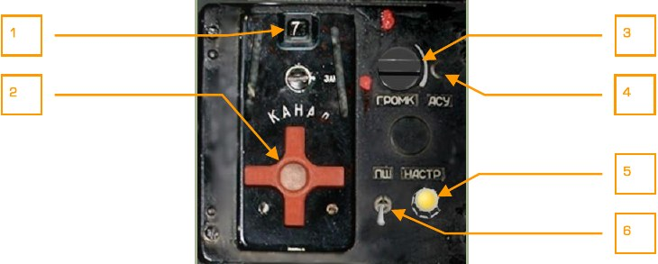

1.   Окно индикатора выбранного канала связи.
2.   КАНАЛ - переключатель каналов запоминающего устройства радиостанции. Влево - [[RAlt + RCtrl + M]], вправо - [[RAlt + RCtrl + N]].
3.   ГРОМК - регулятор громкости. Влево - [[LCtrl + LShift + ] ]], вправо - [[LCtrl + LShift + [ ]].
4.   АСУ - кнопка автоматического согласующего устройства [[RCtrl + RShift + T]].
5.   НАСТР - сигнальная лампа настройки канала.
6.   ПШ – выключатель системы подавления шумов [[RAlt + RShift + R]].

После установки необходимого канала связи нажать кнопку АСУ, при этом загорится
сигнальная лампа настройки канала. После того, как лампа погаснет, канал связи
настроен.

### Пульт управления сигнальными ракетами

Пульт управления сигнальными ракетами служит для подачи питания и выброса
сигнальных ракет четырех цветов: красного, зеленого, белого и желтого. Кассета с
четырьмя ракетами располагается на законцовке левого крыла вертолёта.

Сигнальные ракеты применяются для подачи сигналов в случае отказа радиосредств или соблюдения режима радиомолчания.

1.   Кнопка выброса красной ракеты [[LAlt + 1]].
2.   Выключатель питания системы выброса сигнальных ракет [[RCtrl + 0]].
3.   Кнопка выброса зеленой ракеты [[LAlt + 2]].
4.   Кнопка выброса белой ракеты [[LAlt + 3]].
5.   Кнопка выброса желтой ракеты [[LAlt + 4]].

**Пульт управления ответчиком опознавания, пульт управления аппаратурой специальной связи не реализованы в данной версии.**

## Правый боковой пульт

Расположен на правой стороне кабины.

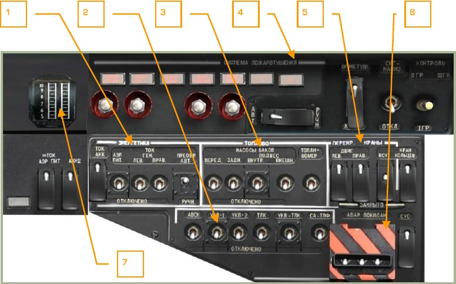

1.   Панель ЭНЕРГЕТИКА.
2.   Панель управления радиооборудованием.
3.   ТОПЛИВО. Панель управления топливными насосами.
4.   СИСТЕМА ПОЖАРОТУШЕНИЯ. Панель управления системами пожаротушения.
5.   ПЕРЕКР. КРАНЫ. Панель управления перекрывными кранами.
6.   АВАР. ПОКИДАН. Панель управления системами аварийного покидания.
7.   Индикатор режимов работы двигателей.

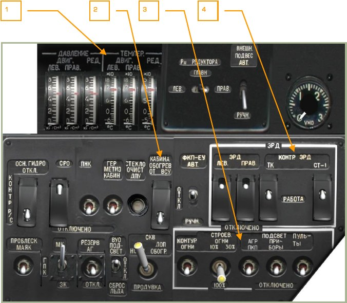

1.   Панель индикаторов давления, температуры масла двигателей и редуктора.
2.   Панель оборудования.
3.   Панель управления освещением.
4.   Панель управления электронными регуляторами двигателей.

### Панель ЭНЕРГЕТИКА

1.   Выключатель ТОК АКК. Подключает первый бортовой аккумулятор.
Крышка - [[LCtrl + LAlt + LShift + E]], выключатель - [[LCtrl + LShift + E]].
2.   Выключатель =ТОК АКК2. Подключает второй бортовой аккумулятор.
Крышка - [[LCtrl + LAlt + LShift + W]], выключатель - [[LCtrl + LShift + W]].
3.   Выключатель =ТОК АЭР ПИТ. Подключает систему аэродромного питания
постоянным током. Крышка - [[LCtrl + LAlt + LShift + Q]], выключатель [[LCtrl + LShift + Q]].
4.   Лампа-сигнализатор подключения аэродромного источника постоянного
тока.
5.   Выключатель АЭР ПИТ [[LCtrl + LShift + R]]. Подключает систему аэродромного питания переменным током.
6.   Выключатель ТОК ГЕН. ЛЕВ [[LCtrl + LShift + Y]]. Включает левый генератор.
7.   Трехпозиционный выключатель ПРЕОБР. АВТ. – РУЧН [[LCtrl + LShift + I]].
Включает режим работы преобразователя автоматический или ручной.
Среднее положение – отключено.
8.   Выключатель ТОК ГЕН. ПРАВ [[LCtrl + LShift + U]]. Включает правый генератор.

### Панель управления радиооборудованием

1.   Выключатель АВСК [[LCtrl + LAlt + Z]]. Самолетное переговорное устройство
СПУ-9 обеспечивает одновременное подключение к телефонам летчика
радиостанций Р-800, Р-828, абонентского аппарата наземного персонала,
аппаратуры речевых сообщений, системы аварийной сигнализации.
2.   Выключатель УКВ-1 [[RAlt + RCtrl + P]]. Ультракоротковолновая радиостанция Р-828.
3.   Выключатель УКВ-2 [[LCtrl + LAlt + P]]. Ультракоротковолновая радиостанция Р-800.
4.   Выключатель ТЛК [[LCtrl + LShift + O]]. Аппаратура телекодовой связи
внешнего целеуказания.
5.   Выключатель СА-ТЛФ. Система не реализована.
6.   Выключатель УКВ-ТЛК [[LCtrl + LShift + P]]. Аппаратура телекодовой связи.

Аппаратура обеспечивает открытую и закрытую телекодовую связь по УКВ
каналу для аппаратуры внешнего целеуказания.

### Панель управления топливными насосами

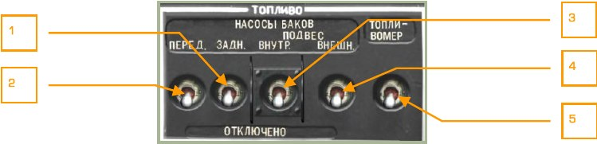

1.   Выключатель НАСОСЫ БАКОВ ЗАДН [[LCtrl + LShift + D]]. Включение насоса
заднего бака.
2.   Выключатель НАСОСЫ БАКОВ ПЕРЕД [[LCtrl + LShift + A]]. Включение
насоса переднего бака.
3.       Выключатель НАСОСЫ БАКОВ ПОДВЕС ВНУТР [[LCtrl + LShift + F]]. Включение насоса подвесных баков внутренних узлов подвески.
4.       Выключатель НАСОСЫ БАКОВ ПОДВЕС ВНЕШН [[LCtrl + LShift + G]]. Включение насоса подвесных баков внешних узлов подвески.
5.       Выключатель ТОПЛИВОМЕР. Включение топливомера [[LCtrl + LShift + H]].

### Панель управления системами пожаротушения

1.       Светосигнальное табло ПОЖАР ЛЕВ ДВИГАТЕЛЯ.
2.       Светосигнальное табло ПОЖАР ВСУ.
3.       Светосигнальное табло ПОЖАР ПРАВ. ДВИГАТЕЛЯ.
4.       Светосигнальное табло ПОЖАР ВЕНТИЛ. Пожар в отсеке масляных радиаторов.
5.       Светосигнальное табло «1». Срабатывание системы пожаротушения первой очереди.
6.       Светосигнальное табло «2». Срабатывание ручной системы пожаротушения второй очереди.
7.       Кнопка системы пожаротушения левого двигателя [[LShift + F]].
8.       Кнопка системы пожаротушения ВСУ [[LAlt + LShift + F]].
9.       Кнопка системы пожаротушения правого двигателя [[RShift + F]].
10. Кнопка системы пожаротушения в отсеке вентиляции [[ALT + LCtrl + LShift + F]].
11. Переключатель БАЛЛОНЫ. Выбор первого (АВТО) или второго (РУЧН) баллона. Крышка - [[RAlt + RCtrl + RShift + Z]], переключатель - [[RCtrl + RShift + Z]].
12. Переключатель ОГНЕТУШ – ОТКЛ - КОНТР. Переключатель рабочего режима ОГНЕТУШ, выключения ОТКЛ и контрольного режима КОНТР. Крышка - [[LCtrl + LAlt + LShift + Z]], переключатель - [[LCtrl + LShift + Z]].
13. Выключатель СИГНАЛИЗ [[RAlt + RShift + Z]]. Включает систему пожарной
сигнализации.
14. Переключатель КОНТРОЛЬ ДАТЧИКОВ I ГР, II ГР, III ГР [[RShift + Z]].

### Панель управления перекрывными кранами

1.   Выключатель ДВИГ. ЛЕВ. – ЗАКРЫТО. Крышка - [[RAlt + RCtrl + RShift + J]],
выключатель - [[RCtrl + RShift + J]].
2.   Выключатель ДВИГ. ПРАВ. – ЗАКРЫТО. Крышка - [[RAlt + RCtrl + RShift + K]], выключатель - [[RCtrl + RShift + K]].
3.   Выключатель ВСУ – ЗАКРЫТО. Крышка - [[RAlt + RCtrl + RShift + L]], выключатель - [[RCtrl + RShift + L]].
4.   Выключатель КРАН КОЛЬЦЕВ. – ЗАКРЫТО. Крышка - [[RAlt + RCtrl + RShift + ;]], выключатель - [[RCtrl + RShift + ;]].

### Панель индикаторов давления, температуры масла двигателей и редуктора

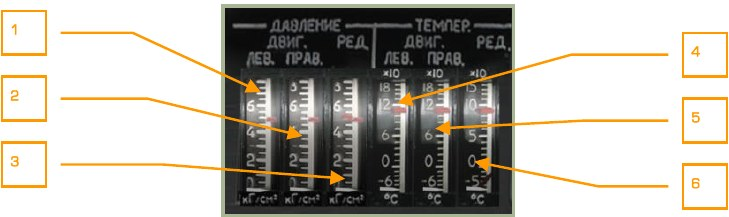

1.   Индикатор давления масла левого двигателя.
2.   Индикатор давления масла правого двигателя.
3.   Индикатор давления масла редуктора.
4.   Индикатор температуры масла левого двигателя.
5.   Индикатор температуры масла правого двигателя.
6.   Индикатор температуры масла редуктора.

### Панель оборудования

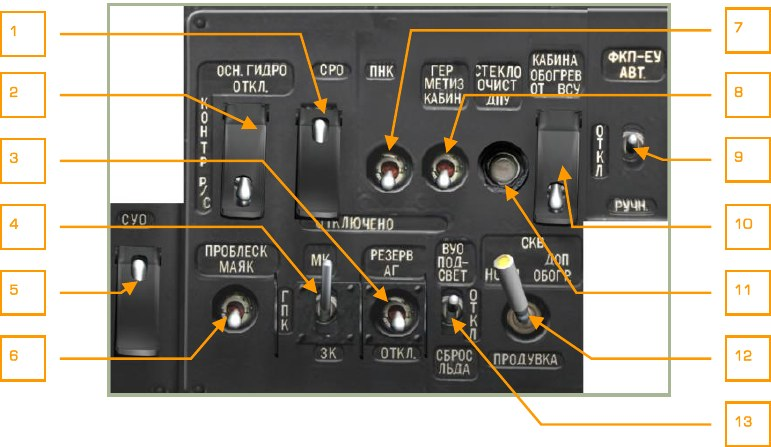

1.    Выключатель СРО - ОТКЛ. Самолетный радиолокационный ответчик.
Крышка - [[LCtrl + LAlt + LShift + I]], выключатель - [[LAlt + LShift + I]]. Не
реализовано.
2.    Панель КОНТР Р/С. Выключатель ОСН ГИДРО – ОТКЛ. Крышка - [[LCtrl + LAlt + LShift + H]], выключатель - [[LAlt + LShift + H]].
3.    Выключатель РЕЗЕРВ АГ – ОТКЛ [[RShift + N]]. Включение резервного авиагоризонта.
4.    Переключатель МК – ГПК – ЗК [[LAlt + LShift + G]], [[LCtrl + LAlt + G]]. Магнитный курс – гирополукомпас - заданный курс. Используется при выполнении коррекции курса ИКВ.
5.    Выключатель СУО – ОТКЛЮЧЕНО. Включение питания системы управления оружием. Крышка - [[LCtrl + LAlt + LShift + D]], выключатель - [[LAlt + LShift + D]].
6.    Выключатель ПРОБЛЕСК МАЯК [[RShift + J]].
7.    Выключатель ПНК ВКЛ – ОТКЛ [[LShift + N]]. Включение ПНК при наземных
проверках без задействования прицельной системы.
8.    Выключатель ГЕРМЕТИЗ КАБИН – ОТКЛЮЧЕНО. Не реализовано.
9.    Переключатель ФКП-ЕУ АВТ – ОТКЛ – РУЧН. Не реализовано.
10. Выключатель КАБИНА ОБОГРЕВ ОТ ВСУ – ОТКЛ. Не реализовано.
11. Кнопка СТЕКЛООЧИСТ ДПУ. Включение стеклоочистителя оптики И-251В
Шквал.
12. Переключатель СКВ НОРМ – ДОП ОБОГР – ПРОДУВКА. Среднее положение
– ОТКЛ. Не реализовано.
13. Переключатель ВУО ПОДСВЕТ – ОТКЛ – СБРОС ЛЬДА. Не реализовано.

### Панель управления освещением

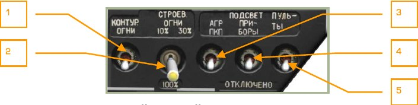

1.    Выключатель КОНТУР. ОГНИ [[RAlt + J]]. Включает контурные огни на нижнем винте.
2.    Переключатель СТРОЕВ. ОГНИ 10 % - 30 % - 100 % [[RCtrl + J]]. Переключается яркость свечения строевых огней.
3.   Выключатель ПОДСВЕТ АГР ПКП [[RAlt + RShift + K]]. Включение ночной
подсветки пилотажных приборов.
4.   Выключатель ПОДСВЕТ ПРИБОРЫ [[RShift + K]].
5.   Выключатель ПОДСВЕТ ПУЛЬТЫ [[RCtrl + K]].

### Панель управления электронными регуляторами двигателей

На вертолёте установлено два электронных регулятора двигателей ЭРД-3ВМА.
Каждый электронный регулятор двигателя (ЭРД) входит в состав электронной части
системы регулирования двигателя, предназначен для регулировки расхода топлива
при превышении частоты вращения турбокомпрессора и останова двигателя при
превышении предельной частоты вращения свободной турбины.

Каждый регулятор функционально состоит из контура ограничения частоты вращения турбокомпрессора и автомата защиты свободной турбины, выполняет следующие функции.

По контуру турбокомпрессора:

- Ограничение максимальной частоты вращения ротора турбокомпрессора
двигателя в зависимости от температуры воздуха и барометрического давления, с целью поддержания постоянной мощности взлетного режима.
- Ограничение максимального физического значения частоты вращения 101
% ротора турбокомпрессора.
ЭРД при достижении максимальной частоты вращения ротора турбокомпрессора
при данной температуре и давлении уменьшает подачу топлива в двигатель через
исполнительный механизм. Одновременно загорается светосигнальное табло желтого цвета на верхнем пульте ОГРАН РЕЖ ЛЕВ или ОГРАН РЕЖ ПРАВ.

По контуру свободной турбины:

- Выдача сигнала на останов двигателя и на включение в проблесковом режиме ЦСО и светосигнального табло красного цвета «n ст ПРЕД ЛЕВ
ДВИГ» и «n ст ПРЕД ПРАВ ДВИГ» с одновременной выдачей звукового сообщения «Раскрутка турбины левого двигателя» или «Раскрутка турбины
правого двигателя».

Пульт включения и контроля ЭРД размещен в кабине на правом боковом пульте. На
этом пульте размещены выключатели ЭРД левого и правого двигателей, выключатель контроля контура турбокомпрессора (ТК) и переключатель контроля контуров
свободной турбины (СТ).

При включении выключателей ЭРД ЛЕВ. и ЭРД ПРАВ. и установке переключателей
КОНТР. ЭРД в положение РАБОТА электронные регуляторы двигателей включаются
в работу.

Оба контура свободной турбины СТ-1 и СТ-2 работают независимо; для выдачи сигнала на останов двигателя требуется, чтобы оба контура зафиксировали превышение предельной частоты вращения свободной турбины с разницей по времени не
более 0,2 секунды. Выдача сигнала превышения оборотов только одним контуром
или обоими, но с интервалом более 0,2 секунды считается ложным срабатыванием.

Если в режиме контроля при горящем табло и оборотах несущего винта 86,5 %
быстро перебросить переключатель в другое крайнее положение (СТ-1 – СТ-2), не
задерживаясь в положении РАБОТА, проверяемый двигатель выключится.

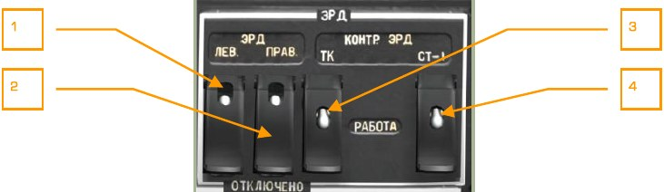

1.   Выключатель ЭРД ЛЕВ. Выключатель электронного регулятора левого двигателя. Крышка - [[RAlt + RCtrl + Home]], выключатель - [[RCtrl + Home]].
2.   Выключатель ЭРД ПРАВ. Выключатель электронного регулятора правого
двигателя. Крышка - [[RAlt + RCtrl + End]], выключатель - [[RCtrl + End]].
3.   Выключатель КОНТР. ЭРД ТК – РАБОТА. Крышка - [[RCtrl + RShift + End]],
выключатель - [[RAlt + RShift + End]].
4.   Трехпозиционный переключатель КОНТР. ЭРД СТ-1 – РАБОТА – СТ-2.
Крышка - [[LCtrl + LShift + End]], переключатель - [[LCtrl + LAlt + End]].

### Индикатор режимов работы двигателей

Индикатор связан с измерителем, который предназначен для контроля режимов работы двигателей.

Контроль режимов работы основан на измерении давления воздуха за компрессором, значение которого индицируется боковыми индексами желтого цвета, и сравнения с режимами, указанными на центральном индексе красного цвета, положение
которого пропорционально атмосферному давлению и температуре воздуха.

На центральном индексе указателя режимов нанесены три отметки В, Н, К, соответствующие давлению за компрессором на взлетном, номинальном и крейсерском режимах.

Для контроля режима работы двигателей необходимо сравнить положение крайних
желтых индексов с обозначением режима (В, Н, К) на средним красном индексе.

1.   Шкала давления воздуха за компрессором. Проградуирована от 5 до 10
кгс/см2. Цена деления 0,5 кгс/см2.
2.   Индекс левого двигателя.
3.   Центральный индекс с метками:

    В – взлетный режим,

    Н – номинальный режим,
    
    К – крейсерский режим.

4.   Индекс правого двигателя.

## Пульт контроля

Пульт расположен на задней стенке кабины за правым плечом летчика.

1.    Панель контроля противообледенительной системы.
2.    Панель контроля приборов двигателей.
3.    Панель контроля каналов САП (система аварийного покидания).
4.    Панель контроля АВСК.
5.   Кнопка проверки речевого информатора.
6.   Панель контроля системы «ЭКРАН».
7.   Индикаторы давления и температуры в гидросистемах.
8.   Пульт ППК-800.
9.   Пульт контроля аппаратуры Л-140, СУО и УВ-26
10. Нижняя панель пульта контроля.
11. Выключатель плафонов отсеков.
12. Панель регулировки яркости подсвета.

### Панель контроля приборов двигателей

1.   Кнопка РТ-12-6 ЛЕВ [[RAlt + RShift + G]].
2.   Кнопка РТ-12-6 ПРАВ [[RCtrl + RShift + G]].
3.   Кнопка контроля вибрации ИВ [[RAlt + RCtrl + RShift + V]].

Кнопки РТ-12-6 ЛЕВ и ПРАВ снижают порог контроля регуляторов температуры для
проверки работоспособности работы ЭРД. При нажатии автоматически отключаются
контуры ТК ЭРД, при этом, если температура газов была не менее 850 °С, а частота
вращения составляла не менее 87 %, то температура газов снизится на 30 °С или
более, а частота вращения турбокомпрессора упадет до 84 % от максимального
значения.

### Панель контроля каналов САП

1.   Светосигнальное табло контроля системы автоматического покидания.
2.   Кнопка контроля [[RCtrl + RShift + E]].
3.   Галетный переключатель ИСХОД – ПИТАНИЕ – ОТДЕЛЕНИЕ ЛОПАСТЕЙ.

### Панель контроля АВСК

Пульт контроля АВСК служит для проведения проверок вертолётного переговорного
устройства СПУ-9 и скоммутированного магнитофона.

1.   Светосигнальное табло магнитофона МС.
2.   Выключатель наземной проверки магнитофона.

### Панель контроля системы ЭКРАН

Слева располагается кнопка проверки речевого информатора. Панель контроля системы ЭКРАН в центре. Выключатель плафонов отсеков справа.

1.   Кнопка проверки речевого информатора, система АЛМАЗ [[RAlt + RCtrl + V]].
2.   Кнопка НАЗЕМН КОНТРОЛЬ системы ЭКРАН.
3.   Кнопка ИНДИКАЦИЯ системы ЭКРАН.
4.   Выключатель ПЛАФОНЫ ОТСЕКОВ – ОТКЛ.

### Индикаторы давления и температуры в гидросистемах

1.    Светосигнальное табло КЛАПАН I ГИДРО.
2.    Светосигнальное табло КЛАПАН II ГИДРО.
3.    Индикатор давления в общей гидросистеме.
4.    Индикатор давления в основной гидросистеме.
5.    Индикатор давления в гидроаккумуляторе.
6.    Индикатор давления в тормозной системе.
7.    Индикатор температуры в общей гидросистеме.
8.    Индикатор температуры в основной гидросистеме.

### Пульт ППК

Пульт ППК предназначен для проведения предполетной подготовки и контроля ЦВМ
ПрПНК, включения ИКВ и выставки баллистических коэффициентов для подвесного
оружия.

1.   Светосигнальные табло отказа ЦВМ-Б, ЦВМ-Н, ЦВМ-И, ЦВМ-Ц, УВВ, БРП.
2.   Галетный переключатель ББ/ТЗ. Ввод температуры заряда ПТУР. Не реализовано.
3.   Галетный переключатель НР/АКС. Ввод баллистических характеристик НАР
и подвесных пушек.

    0 – НАР С-8КОМ.

    1 – НАР С-8ЦМ.

    2 – НАР С-13.

    3 – НАР С-24.

    4 – НАР С-8ОФП2.

    5 – УПК-23.

    6 – ФАБ-100.

    7 – ФАБ-250.

    8 – ФАБ-500.

    9 – КМГУ АО-2,5РТ.

    10 – КМГУ ПТАБ-2,5КО.
    
    Баллистические характеристики используются при вычислении положения
    прицельной марки на ИЛС. Положение переключателя должно совпадать с
    типом применяемых НАР.
    
    В случае применения НАР при некорректно выставленном положении переключателя, прицельная марка будет показывать неверную точку прицеливания.
    
    При старте миссии переключатель установлен в положение типа НАР, выбранных в редакторе миссий. В случае подвески разнотипных НАР переключатель автоматически устанавливается в положение, соответствующее
    первому типу НАР по нумерации пилонов (первый пилон – внешний на левом крыле, четвертый – внешний на правом крыле).
    
    Перед применением другого типа НАР или пушечных контейнеров необходимо вручную установить переключатель в положение соответствующее
    выбранному типу НАР или УПК-23.
    
    Эту же операцию следует произвести после перевооружения вертолёта в
    ходе миссии.

4.   Галетный переключатель РНП. Выбор режима проверок. Не реализовано.
5.   Выключатель К-ЦВМ – ОТКЛ. Включение режима тест контроля ЦВМ. Не
реализовано.
6.   Выключатель ИКВ – ОТКЛ. Включение инерциальной курсо-вертикали.
7.   Выключатель ОБОГРЕВ ИКВ – ОТКЛ. Включение обогрева инерциальной
курсо-вертикали.
8.   Кнопка-табло АКС. Подключение галетного переключателя НР/АКС для
выбора подсистем ПНК для автономного контроля. Не реализовано.
9.   Выключатель Вн.К – ОТКЛ. Не реализовано.
10. Выключатель ТРОС – ОТКЛ. Включение режима стабилизации и индикации
положения троса внешней подвески. Не реализовано.
11. Выключатель ФКП – ОТКЛ. Включение фотоконтрольного прибора. Не реализовано.

### Пульт контроля аппаратуры Л-140, СУО и УВ-26

1.   Выключатель Л-140 – ОТКЛ аппаратуры лазерной разведки Л-140 [[LCtrl + N]].
2.   Лампа-сигнализатор ИСПР исправности аппаратуры Л-140.
3.   Кнопка контроля КОНТР аппаратуры Л-140 [[LCtrl + LAlt + N]].
4.   Лампа контроля ВСК-СУО.
5.   Выключатель ВСК-СУО - ОТКЛ. Встроенный контроль СУО.
6.   Выключатель УВ-26 ВКЛ – ОТКЛ аппаратуры УВ-26. Крышка - [[LAlt + LShift + C]], выключатель - [[LCtrl + LShift + C]].
7.   Выключить УВ-26 КОНТР – ОТКЛ. Встроенный контроль УВ-26. Крышка [[LCtrl + LAlt + LShift + C]], выключатель - [[LCtrl + LAlt + C]].

### Нижняя панель пульта контроля

1.   Амперметр.
2.   Вольтметр системы переменного тока.
3.   Галетный переключатель точек индикации постоянного напряжения.
4.   Галетный переключатель точек индикации переменного тока.
5.   Галетный переключатель точек индикации переменного напряжения.
6.   Регулятор яркости подсвета пульта контроля.
7.   Выключатель подсвета пульта контроля [[RAlt + RShift + L]].
8.   Выключатель электроснабжения систем ВМГ, ГИДРО и ЭКРАН. Крышка [[LCtrl + LAlt + LShift + N]], выключатель - [[LCtrl + LShift + N]].
9.   Кнопочные автоматы защиты цепей подсвета приборов и пультов.

### Панель регулировки яркости подсвета

1.   Регулятор яркости подсвета ПРИБОРЫ. Регулятор синей ночной подсветки,
[[LCtrl + LShift + K]], [[LCtrl + LAlt + K]].
2.   Регулятор яркости подсвета АГР ПКП, [[LCtrl + LShift + J]], [[LCtrl + LAlt + J]].
3.   Регулятор яркости подсвета ПУЛЬТЫ ЛЕВ. ПРАВ, [[LCtrl + LShift + L]], [[LCtrl + LAlt + L]].

## Левый пульт

1.   Блок командной радиостанции Р-800Л1.
2.   Пульт выбора режимов ПВР из комплекта К-041.
3.   Панель управления запуском двигателей.
4.   Панель радио.

### Блок командной радиостанции Р-800Л1

1.   Лампа КОНТРОЛЬ.
2.   Переключатель амплитудное модулирование – частотное модулирование,
АМ-ЧМ [[LShift + LCtrl + LAlt + M]].
3.   Выключатель аварийного приемника с фиксированной частотой – АП [[LCtrl + LAlt + E]], для приема сигналов бедствия. Происходит перенастройка на
аварийную частоту 121,5 МГц, передатчик отключается.
4.   Выключатель АРК [[LCtrl + LAlt + A]]. Радиостанция подключается к радиокомпасу. При этом выходы антенн АРК подключаются к приемнику Р800Л1, обратная связь управления положением направленной антенны
(катушки АРК) и, соответственно, стрелки на ПНП осуществляется через
него. Стрелка на ПНП указывает на радиостанцию с частотой, которая выставлена в Р-800Л1.
5.   Задатчик частот. 4 маховика. Частота задается с шагом 25 кГц. Два левых
маховика задают целые значения МГц, два правых – тысячные МГц.

    1-й маховик вверх - [[LCtrl + LShift + 1]], вниз - [[LCtrl + LAlt + 1]].
    
    2-й маховик вверх - [[LCtrl + LShift + 2]], вниз - [[LCtrl + LAlt + 2]].
    
    3-й маховик вверх - [[LCtrl + LShift + 3]], вниз - [[LCtrl + LAlt + 3]].
    
    4-й маховик вверх - [[LCtrl + LShift + 4]], вниз - [[LCtrl + LAlt + 4]].

6.   Переключатель 100-50. Изменяет скорость передачи данных (не реализован).
7.   Кнопка КОНТРОЛЬ [[LCtrl + LShift + T]]. Производит самотестирование радиостанции. При исправности загорается зеленая лампа КОНТРОЛЬ.
8.   Выключатель системы подавления шумов – ПШ [[LCtrl + LAlt + R]]. Уменьшает громкость, если не обнаружен сигнал несущей частоты.
9.   Барабаны с индикацией значения набранной частоты.

### Пульт выбора режимов ПВР

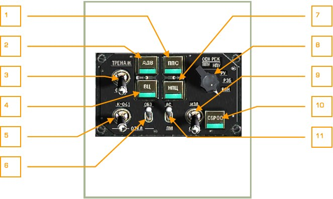

1.   Кнопка-табло ППС [[LAlt + S]]. Задание признака передней полусферы воздушной цели. Настройка дистанционного взрывателя ПТУР.
2.   Кнопка-табло АДВ [[Q]]. Включение автоматического доворота вертолёта.
3.   Выключатель ТРЕНАЖ – ОТКЛ. Включение режима «Тренаж».
4.   Кнопка-табло ВЦ [[V]]. Задание признака воздушной цели. Включение дистанционного взрывателя ПТУР.
5.   Выключатель К-041 – ОТКЛ [[LShift + D]]. Включение комплекса ПрПНК.
6.   Выключатель ОБЗ – ОТКЛ [[H]]. Включение работы с нашлемной системой
целеуказания.
7.   Кнопка-табло НПЦ [[N]]. Задание признака наземной подвижной цели.
8.   Галетный переключатель режимов СУО. Влево - [[LCtrl + F]], вправо - [[LAlt + F]].

    - ППУ – положение при пусках ПТУР (подвижная ПУ), НАР и
стрельбе из подвижной пушки. Основной автоматический режим.
    - НПУ – положение при пусках ПТУР, НАР и стрельбе из неподвижной пушки. Резервный режим.
    - РУ – включение режима ручного резервного управления ПТУР.
    - РЗБ – включение резервирования боевых задач в ЦВМ-Н.
    - РЗН – включение резервирования навигационных задач в ЦВМ-Б.

9.   Переключатель ИЗЛ. – ОТКЛ [[RShift + O]]. Включение готовности лазерного дальномера.
10. Кнопка-табло СБРОС [[Backspace]]. Сброс задачи.
11. Переключатель АС – ПМ [[P]]. Выбор способа прицеливания при стрельбе:
АС – автосопровождение цели, ПМ – прицельная марка (с учетом прицельных данных, ручное измерение дальности).

### Панель управления запуском двигателей

1.     Кнопка ЗАПУСК [[Home]]. Используется для старта ВСУ и двигателей.
2.     Переключатель режима работы [[LAlt + Home]], [[LCtrl + Home]]. Переключатель режимов запуска: ЗАПУСК, ПРОКРУТКА, ЛОЖНЫЙ ЗАПУСК.
3.     Светосигнальное табло КЛАПАН ЗАПУСКА. Сигнализирует о наличии давления пускового воздуха в левом или правом двигателях
4.     Кнопка СТОП ЗАПУСК [[RAlt + Home]]. Используется для прекращения запуска двигателей.
5.     Кнопка ОСТАНОВ ВСУ [[End]]. Используется для останова ВСУ.
6.     Переключатель двигателей [[E]]. Предназначен для выбора ВСУ или двигателя для проведения запуска.

### Панель радио

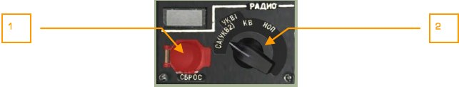

1.        Кнопка СБРОС. Сброс кодов закрытой связи. Не реализовано.
2.        Галетный переключатель [[LAlt + LCtrl + /]]. Выбор типа связи вертолётного
переговорного устройства СПУ-9. Имеет положения УКВ-2, УКВ-1, КВ, НОП.

    -   (СА) УКВ-2 – командная радиостанция Р-800Л1.
    -   УКВ-1 – радиостанция для связи с сухопутными войсками Р-828.
    -   КВ – коротковолновый диапазон. Не используется.
    -   НОП – используется при переговорах с наземным персоналом через абонентский аппарат персонала, подключенный к СПУ соединительным шнуром.

### Панель ВСУ

Панель ВСУ (вспомогательной силовой установки) находится около левой руки летчика.

1.     Светосигнальное табло КРАН ВСУ ОТКРЫТ.
2.     Светосигнальное табло ОСТАНОВ ВСУ по n. Останов ВСУ по превышению
оборотов.
3.     Светосигнальное табло P масла ВСУ. Давление масла ВСУ в норме.
4.     Светосигнальное табло ВСУ ВКЛЮЧЕНА.
5.     Указатель температуры газов ВСУ.

{!docs/ka50/abbr.md!}
{!dev-docs/ka50/abbr.md!}
