# Авиационная бортовая радиотехническая интегрированная система АБРИС

## Назначение

Изделие АБРИС предназначено для решения задач самолетовождения, в том числе
для подготовки и планирования маршрута, картографического обеспечения на всех
этапах полета, обработки информации от навигационных датчиков, выдачи информации в сопрягаемые системы, выполнения штурманских расчетов.

Изделие в составе борта Ка-50 предназначено для вывода индикации о тактической
обстановке и внешнего целеуказания.

Изделие АБРИС обеспечивает:

-   хранение, отображение электронных карт местности на цветном дисплее;
-   непрерывное определение координат местоположения вертолёта, отображение положения вертолёта на электронной карте (в масштабе, удобном
для оператора);
-   формирование, отображение аэронавигационной информации и данных
полетного задания, необходимых для решения задач самолетовождения
на различных этапах полета;
-   формирование плана полета, запись его в базу данных изделия и загрузку
из базы данных изделия;
-   оперативное изменение плана полета в процессе полета;
-   прием и отображение на дисплее информации от сопрягаемых систем, а
также выдачу информации в сопрягаемые системы.

Изделие АБРИС выдает, формирует и отображает предупреждения (появляется соответствующая надпись) о следующих событиях:

-   подход к ППМ (зеленый цвет сообщения), выдается за установленное
время до момента пролета ППМ;
-   подход к точке начала снижения (зеленый цвет сообщения), выдается за
установленное время до момента пролета точки начала снижения;
-   подход к точке начала разворота (зеленый цвет сообщения), выдается за
установленное время до момента пролета точки начала разворота;
-   ЛБУ больше, чем установленное значение (зеленый цвет сообщения), выдается при ЛБУ большем, чем установленное значение.

## Органы управления

Органы управления АБРИС размещены на лицевой панели пульта управления. К органам управления относятся:

-   Кнопки, 5 штук, [[1]], [[2]], [[3]], [[4]], [[5]], их назначение меняется в зависимости от текущего режима работы системы.
-   Ручка регулятора яркости изображения на дисплее и подсвета кнопок
(расположена слева от кнопок). Ярче - [[0]], темнее - [[9]].
-   Манипулятор курсора, обеспечивает перемещение курсора (метки на
экране) в любую точку рабочего поля дисплея, ввод алфавитно-цифровой
информации, выбор пунктов меню и ввода заданного путевого угла/заданного курса (расположен справа от кнопок). Влево - [[7]], вправо - [[8]],
нажим - [[6]].

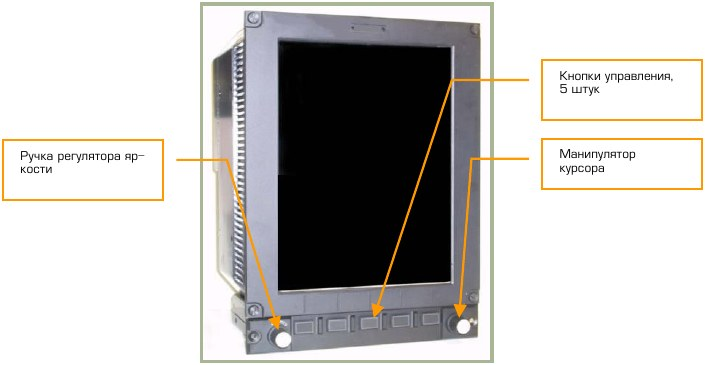

Манипулятор курсора обеспечивает независимое перемещение курсора по направлениям "влево - вправо" и "вверх - вниз" путем вращения колесика мыши. Переключение направления перемещения курсора производится осевым нажатием ручки манипулятора (правая кнопка мыши).

В режиме ввода буквенно-цифровой информации вращением ручки манипулятора
(вращение колесика мыши) производится перебор возможных символов, а осевым
нажатием и отпусканием ручки манипулятора (нажатие правой кнопки мыши) производится переход к позиции очередного символа.

В симуляторе вращение ручек можно осуществлять также с помощью левой кнопки
мыши, для этого необходимо навести курсор на манипулятор, зажать левую кнопку
мыши и двигать ее в радиальном направлении от манипулятора.

## Отображение и ввод информации в изделие АБРИС

Цифровая и графическая информация отображается различными цветами, в зависимости от ее назначения.

Использование цветов для отображения сообщений различного назначения:

Вид сообщений                         | Цвет отображения
--------------------------------------|-----------------------------
Предупреждения опасные                |                 Желтый
Предупреждения неопасные              |                 Зеленый
Шкалы                                 |                 Белый
Текущие измеренные параметры          |                 Белый
Режимы                                |                 Зеленый
Активизированный маршрут              |                 Синий

Ввод информации предусматривается во всех режимах работы изделия.

Перемещение по пунктам меню обеспечивается манипулятором курсора (правой
ручкой на пульте управления) или с клавиатуры стрелками '↑' и '↓'. При вращении
манипулятора курсора по часовой стрелке – переход к нижнему пункту меню, при
вращении манипулятора курсора против часовой стрелки переход к верхнему
пункту меню. При использовании манипулятора курсора в качестве средства выбора
из меню обеспечивается плавный переход от одного пункта к другому с обязательной фиксацией на каждом пункте меню. При использовании стрелок '↑' и '↓' для выбора из меню одно нажатие соответствует одному переходу от пункта к пункту.

Ввод буквенно-цифровых значений обеспечивается манипулятором курсора:

- вращением манипулятора курсора по часовой стрелке производится увеличение цифрового значения и листание буквенных (по алфавиту) и доступных специальных символов, а при вращении манипулятора курсора
против часовой стрелки - уменьшение значения;
- переход от одного символа к другому обеспечивается осевым нажатием
манипулятора курсора.

## Включение системы АБРИС

После включения выключателя, подающего питание на изделие, происходит автоматическая подготовка изделия АБРИС к работе (подготовка длится до 120 сек). Индикация процесса осуществляется равномерным миганием ламп подсвета кнопок
пульта управления. Завершение автоматической подготовки изделия к работе индицируется постоянным свечением ламп подсвета кнопок ПУ и отображением на дисплее страницы режима МЕНЮ. Выключение изделия АБРИС производится
выключением соответствующего выключателя [[RShift + 0]]. Выключение возможно в
любой момент работы изделия, при этом дисплей и лампы подсвета кнопок пульта
управления гаснут.

## Представление информации в АБРИС

Пространство дисплея базового блока, для удобства описания отображаемой информации, условно поделено на части:

-   системная строка;
-   основное поле;
-   поле карты;
-   поле полетной информации;
-   поле меняющихся функциональных кнопок;
-   всплывающее меню.

### Системная строка

Системная строка предназначена для индикации текущего времени, состояния приемоизмерителя СНС и выбранного режима работы. Системная строка отображается
на верхней части дисплея (независимо от выбранного режима работы). Системная
строка состоит из трех основных полей:

-   поле текущего режима;
-   поле режима работы навигационного приемоизмерителя СНС;
-   поле отображения текущего времени.

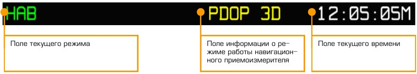

Для режимов, имеющих несколько подрежимов, текущий подрежим индицируется в
левом верхнем углу экрана (под полем режима).

Сообщения, отображаемые в полях системной строки, и их основное содержание
представлены в таблице ниже.

Сообщения о режиме работы навигационного приемоизмерителя

Сообщение               |         Значение сообщения
------------------------|-----------------------------------------------
3D                      | 3D навигация от встроенного датчика.
ИСКЛ 3D                 | 3D навигация, один спутник созвездия отключен вручную.
HDOP 3D                 | Плохой геометрический фактор.
PDOP 3D                 | Плохой спутниковый фактор.
RAIM 3D                 | Ошибка автономного контроля целостности данных и работоспособности в приемнике СНС.
2D                      | 2D навигация (определяются координаты ЛА, данных для вычисления высоты относительно эллипсоида недостаточно).
ADSB 3D                 | 3D навигация от транспондера.
ADSB                    | Транспондер, режим 2D или неизвестен.
СЧСЛ                    | Расчет параметров движения ЛА при отказе СНС с использованием последних данных о путевой скорости и фактическом путевом угле. Изделие использует данный режим в течение 1 минуты после отказа СНС, после чего выдается сообщение НЕТ НАВ.
НЕТ НАВ                 | Невозможно определение координат ЛА.
ПОРОГ                   | Если введенное вручную пороговое значение превышает значение, соответствующее участку маршрута: неточный заход (0.3 nm), подход (1 nm), иначе - 1 nm.

В поле текущего времени возможно использование двух форматов:

HH:MM:SS Z и HH:MM:SS М.

В данных форматах НН - часы, ММ – минуты, SS – секунды. Если не введено значение часового пояса, то отображается значение времени по Гринвичу, при этом
после времени ставится индикатор Z (Zulu time); если введено значение часового
пояса, то отображается локальное время и после значения времени ставится индикатор М.

## Режимы работы

В изделии АБРИС имеются четыре основных режима: МЕНЮ, НАВИГАЦИЯ, ОБЗОР,
ПНП. В каждом режиме возможен переход в подрежимы. При включении изделия на
дисплей выводится страница режима МЕНЮ. При последовательном нажатии пятой
кнопки основные режимы переключаются по приведенной ниже схеме.

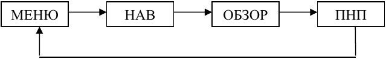

Индикация текущего режима осуществляется в системной строке. Навигационные
вычисления, прием и передача информации производятся постоянно и независимо
от текущего режима индикации.

### Вид страницы МЕНЮ

Страница меню появляется после включения питания системы АБРИС.

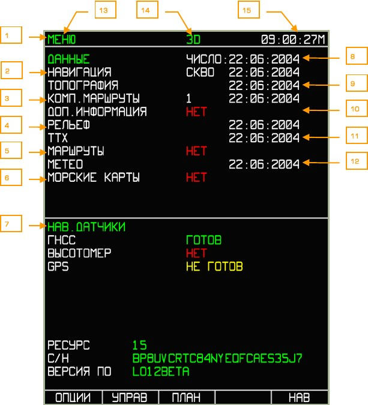

1.   Системная строка.
2.   Дата окончания действия аэронавигационной базы данных.
3.   Количество загруженных из миссии маршрутов.
4.   Дата создания базы данных по рельефу.
5.   Отображается количество пользовательских маршрутов и дата создания последнего.
6.   Дата создания морских карт.
7.   Информация о состоянии подключенных навигационных датчиков:

    - ГНСС – глобальная навигационная спутниковая система;
    - высотомер.

8.   Текущая дата.
9.   Дата создания топографической базы данных.
10. База данных пользовательских объектов.
11. Дата создания базы данных с тактико-техническими характеристикам ЛА.
12. База данных МЕТЕО (отображается дата создания).
13. Системная строка. Название режима.
14. Состояние определения координат ГНСС.
15. Текущее время.

### Вид страницы НАВИГАЦИЯ

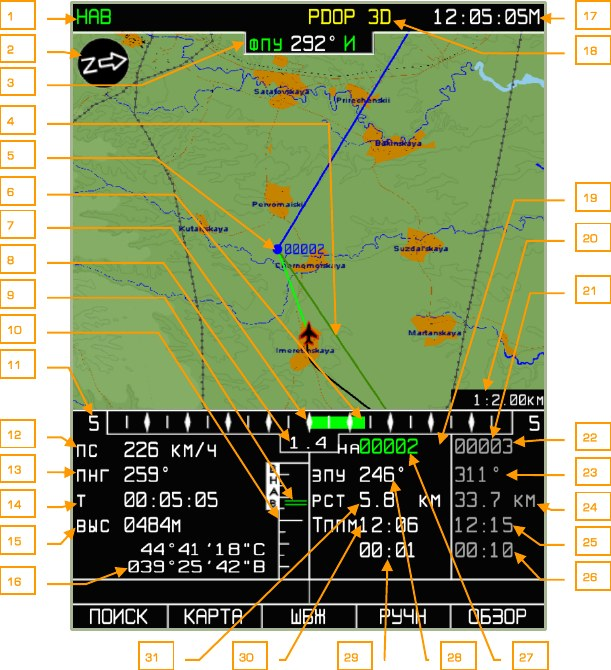

1.   Системная строка. Название режима.
2.   Индикация направления на север.
3.   Фактический путевой угол. И – истинный. М – магнитный.
4.   ЛЗП. Линия заданного пути.
5.   ППМ. Поворотный пункт маршрута.
6.   Графическое представление величины бокового уклонения от ЛЗП.
7.   Шкала линейного бокового уклонения (ЛБУ).
8.   Цифровое представление ЛБУ.
9.   Индикатор отклонения от заданной высоты полета.
10. Шкала вертикальной навигации.
11. Масштаб шкалы ЛБУ.
12. Путевая скорость.
13. Пеленг (азимут) на ППМ.
14. Время полета.
15. Высота полета.
16. Текущие географические координаты.
17. Текущее время.
18. Состояние определения координат ГНСС.
19. Комплексное информационное поле о текущем участке маршрута.
20. Масштаб карты.
21. Комплексное информационное поле о следующем участке маршрута.
22. Название следующего ППМ.
23. Заданный путевой угол (ЗПУ) на следующий ППМ.
24. Длина следующего участка маршрута.
25. Время пролета следующего ППМ.
26. Время полета до следующего пункта маршрута.
27. Название текущего ППМ.
28. Заданный путевой угол (ЗПУ) на текущий ППМ.
29. Оставшееся время полета до текущего ППМ.
30. Время пролета текущего ППМ.
31. Оставшееся расстояние до текущего ППМ.

### Вид страницы ОБЗОР

1.   Системная строка. Название режима.
2.   Фактический путевой угол. И – истинный. М – магнитный.
3.   Метка текущего курса.
4.   Заданный путевой угол (ЗПУ).
5.   РМИ-1. Азимут на ППМ.
6.   РМИ-2. Курсовой угол радиостанции, АРК.
7.   Графическое представление отклонения от ЛЗП.
8.   Шкала линейного бокового уклонения (ЛБУ).
9.   Цифровое представление ЛБУ.
10. Цифровой указатель РМИ-1 (азимут на ППМ).
11. Цифровой указатель РМИ-2 (курсовой угол радиостанции, АРК).
12. Масштаб шкалы ЛБУ.
13. Путевая скорость.
14. Пеленг (азимут) на ППМ.
15. Время полета.
16. Высота полета.
17. Текущие географические координаты.
18. Текущее время.
19. Состояние определения координат ГНСС.
20. Шкала курса.
21. Индикатор отклонения от заданной высоты полета.
22. Шкала вертикальной навигации.
23. Комплексное информационное поле о текущем участке маршрута.
24. Масштаб карты.
25. Комплексное информационное поле о следующем участке маршрута.
26. Название следующего ППМ.
27. Заданный путевой угол (ЗПУ) на следующий ППМ.
28. Длина следующего участка маршрута.
29. Время пролета следующего ППМ.
30. Время полета на следующем участке маршрута.
31. Название текущего ППМ.
32. Заданный путевой угол (ЗПУ) на текущий ППМ.
33. Оставшееся время полета до текущего ППМ.
34. Время пролета текущего ППМ.
35. Оставшееся расстояние до текущего ППМ.

### Вид страницы ПНП

1.   Системная строка. Название режима.
2.   Фактический путевой угол. И – истинный. М – магнитный.
3.   Метка текущего курса.
4.   Заданный путевой угол (ЗПУ).
5.   РМИ-1. Азимут на ППМ.
6.   РМИ-2. Истинный пеленг радиостанции.
7.   Графическое представление отклонения от ЛЗП.
8.   Шкала линейного бокового уклонения (ЛБУ).
9.   Цифровое представление ЛБУ.
10. Цифровой указатель РМИ-1 (азимут на ППМ).
11. Цифровой указатель РМИ-2 (истинный пеленг радиостанции, АРК).
12. Масштаб шкалы ЛБУ.
13. Путевая скорость.
14. Пеленг (азимут) на ППМ.
15. Время полета.
16. Высота полета.
17. Текущие географические координаты.
18. Текущее время.
19. Состояние определения координат ГНСС.
20. Шкала курса.
21. Графическое представление положения ЛА относительно ЛЗП.
22. Индекс заданного курса (ЗК).
23. Индикатор отклонения от заданной высоты полета.
24. Шкала вертикальной навигации.
25. Комплексное информационное поле о текущем участке маршрута.
26. Комплексное информационное поле о следующем участке маршрута.
27. Название следующего ППМ.
28. Заданный путевой угол (ЗПУ) на следующий ППМ.
29. Длина следующего участка маршрута.
30. Время пролета следующего ППМ.
31. Время полета на следующем участке маршрута.
32. Название текущего ППМ.
33. Заданный путевой угол (ЗПУ) на текущий ППМ.
34. Оставшееся время полета до текущего ППМ.
35. Время пролета текущего ППМ.
36. Оставшееся расстояние до текущего ППМ.

На страницах дисплея в основных режимах работы (НАВИГАЦИЯ, ОБЗОР, ПНП) отображаются следующие параметры.

Фактический путевой угол/курс (цифровое и графическое представление). Значение изменяется в пределах от 0 до 359 градусов и индицируется с точностью до
градуса. Отображается над шкалой компаса и снабжается признаком магнитный (M)
или истинный (И). Отображение значения осуществляется при наличии информации
от навигационного датчика. Если от источника информации о курсе ЛА не поступает
данных, отображается значение путевого угла, получаемое от ПИ СНС, либо значение курса обводится желтой рамкой. Формат числа: DDD°. Например: 023° – значение курса 23 градуса.

Истинный пеленг радиостанции (цифровое и графическое представление). Значение изменяется в пределах от 0 до 359 градусов и индицируется с точностью до
одного градуса. Значение азимута отображается при установке в основных настройках (подрежим ОПЦИИ) РМИ-1 (РМИ-2) в значение АРК. При отсутствии информации
от навигационного датчика графическое представление не выводится.

Заданный путевой угол (цифровое и графическое представление). Значение изменяется в пределах от 0 до 359 градусов и индицируется с точностью до одного
градуса. Отображается в поле полетной информации, а также на шкале компаса.
Формат числа: DDD°. Например: 043° – значение курса 43 градуса.

Путевая скорость (цифровое представление). Значение путевой скорости индицируется с точностью до выбранной единицы измерения. При отрицательном значении путевой скорости индицируется знак отрицательной величины «-». Путевая скорость может индицироваться в км/ч - КЧ или в узлах – УЗ. Единицы измерения выбираются при настройке параметров изделия (подрежим ОПЦИИ). Отображается в
поле полетной информации. Формат числа: DDDD. Например: 0123 – значение путевой скорости 123.

Линейное боковое уклонение (ЛБУ) - цифровое и графическое представление.
Значение ЛБУ может изменяться от 0 до 999. Отсчет осуществляется в единицах измерения, выбранных при настройке параметров изделия (подрежим ОПЦИИ). Если
ЛБУ составляет менее 10 единиц измерения, то значение отображается с десятыми
долями (формат D.D), если более или равно 10, то целым числом (формат DDD).
Например: 3.4 (12) – ЛБУ составляет 3.4(12) км (морские мили). Отображается в
поле полетной информации.

Масштаб шкалы ЛБУ. Шкала ЛБУ обеспечивает графическую индикацию до 20
единиц измерения, с точностью до единицы измерения. Может индицироваться в
километрах или морских милях. Масштаб шкалы индикатора ЛБУ изменяется автоматически в зависимости от участка полета. В настройках системы задаются две величины масштаба – для полета по маршруту и для полета в районе аэродрома (подрежим ОПЦИИ).

Высота (цифровое представление). Высота индицируется в метрах – м(m) или футах – фт(ft). Единицы измерения выбираются при настройке параметров изделия
(подрежим ОПЦИИ).

Комплексное информационное поле о текущем участке маршрута (цифровое и текстовое представление) располагается в нижней части дисплея и отображается в режимах НАВИГАЦИЯ, ОБЗОР и ПНП. Содержит ряд информационных полей:

- на ППМ (обозначение ППМ);
- заданный путевой угол (заданный курс), изменяется в пределах от 0 до
359 градусов, отображается с точностью до одного градуса;
- оставшееся расстояние до ППМ от текущего местоположения ЛА – изменяется в пределах от 0 до 9999, отображается в километрах – км, или в морских милях – nm. Единицы измерения выбираются при настройке параметров изделия (подрежим ОПЦИИ);
- расчетное время прибытия на данный ППМ, может изменяться от 00:00 до
23:59. Если значение времени по каким либо причинам вычислить не удается, то в поле времени отображается символ «--:--»;
- время, оставшееся до пролета ППМ, изменяется от 00:00 до 23:59.

Комплексное информационное поле о следующем участке маршрута аналогично описанному выше полю информации о текущем участке. Отличие – в значении поля РСТ, в данном поле указывается расстояние между ППМ.

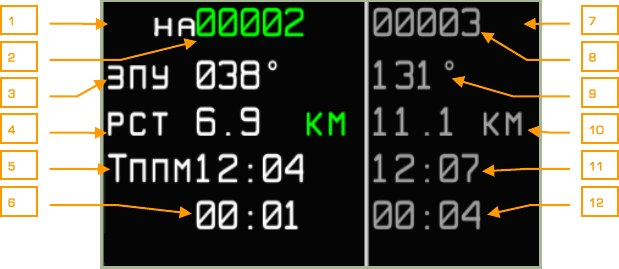

1.   Поле информации о текущем участке маршрута.
2.   Позывной текущего ППМ.
3.   Заданный путевой угол (И – истинный, М – магнитный).
4.   Расстояние, оставшееся до пролета ППМ.
5.   Расчетное время пролета ППМ.
6.   Время, оставшееся до пролета ППМ.
7.   Поле информации о следующем участке маршрута.
8.   Позывной следующего ППМ.
9.   Заданный путевой угол (И – истинный, М – магнитный).
10. Длина следующего участка маршрута.
11. Расчетное время прибытия на ППМ.
12. Время, оставшееся до пролета ППМ.

Текущие географические координаты (графическое и цифровое представление) - широта и долгота. Формат отображения:

широты: DD°MM’SS’’ С;

долготы: DDD°MM’SS’’ В.

Здесь DDD – градусы, MM – минуты, SS – секунды и С, В – признаки полушария (северное, восточное). Параметры располагаются так, чтобы значения градусов долготы были под значениями градусов широты, значения минут долготы были под
значениями минут широты, и признак полушария долготы был под признаком полушария широты.

Карта - отображается в поле карты. Отображаемый состав объектов на карте зависит от используемого масштаба карты.

Масштаб карты отображается в поле карты. Способ отображения масштаба – соотношение между сантиметром и километром / сантиметром и милей. Используемые
масштабы: 1:100км; 1:50км; 1:40км; 1:30км; 1:25км; 1:20км; 1:15км; 1:12,5км;
1:10км; 1:7,5км; 1:6км; 1:5км; 1:4км; 1:3км; 1:2,5км; 1:2км; 1:1,5км; 1:1,25км;
1:1км; 1:0,75км; 1:0,6км; 1:0,5км; 1:0,3км; 1:0,25км; 1:0,2км; 1:0,15км.

Индикация направления на север (для карты, графическое представление) - стрелка с указанием направления на север для карты и значок N (на черном
фоне серая стрелка и символ N).

Шкала компаса (графическое представление - схематическое отображение шкалы
компаса с цифровым указанием значений через 30 градусов и метками градусов с
интервалом не более 5). Отображается в режимах ПНП и ОБЗОР.

Активный маршрут (графическое представление) отображается в виде линии синего цвета и символов ППМ.

Форматы отображения величин в АБРИС:

Параметр    | Формат / Символ |    Цвет |             Примечание
------------|-----------------|---------|----------------------------------
ФПУ         |DDD              | Зеленый |  Фактический путевой угол
ЗПУ         |DDD              | Белый   |  Заданный путевой угол
КРС         |DDD              | Белый   |  Истинный/магнитный курс
ПС          |DDDD             | Белый   |  Путевая скорость
ИВС         |DDDD             | Белый   |  Истинная воздушная скорость
ЛБУ         |D.D или DDD      | Белый   |  Линейное боковое уклонение
ШКАЛА ЛБУ   |DD               | Белый   |  Масштаб шкалы ЛБУ
ВЫС         |DDDDD M(FT)      | Белый   |  Высота
Название ППМ|  CCCCC          | Зеленый |  Пятисимвольное обозначение
РСТ         |DD.D или DDDD    | Белый   |  Оставшееся расстояние до ППМ
T~ппм~      |  HH:MM:SS       | Белый   |  Расчетное время прибытия на ППМ
HH:MM:SS    |                 | Белый   |  Время, оставшееся до пролета ППМ
ШИР         |DD°MM’SS’’ N(S)  | Белый   |  Широта места ЛА
ДОЛ         |DDD°MM’SS’’E(W)  | Белый   |  Долгота места ЛА
НАВ, ПНП. ОБЗОР |             | Зеленый |  Индикация режима работы
НЕТ НАВ 2D, 3D PDOP |         | Желтый  |  Индикация состояния СНС
            |       |         | Белый   |  Индикация масштаба карты

### Вид страницы БКО

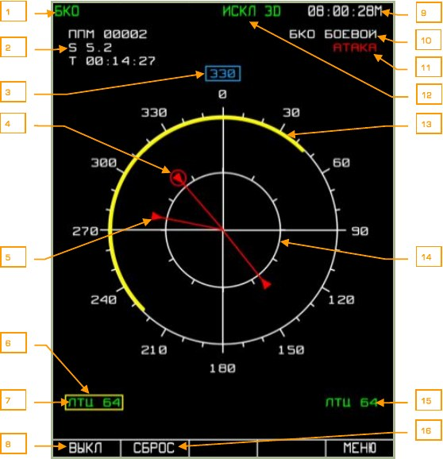

1.   Системная строка. Название режима.
2.   Блок навигационной информации:

    - Текущий ППМ
    - Дальность до ППМ
    - Расчетное время до ППМ

3.   Текущее значение курса.
4.   Кольцо – индикатор главной атакующей угрозы.
5.   Обнаруженная угроза - ракета.
6.   Желтая рамка. Индикатор применения ловушек с левого борта.
7.   Тип и количество ловушек на левом борту.
8.   Кнопка включения и выключения БКО.
9.   Текущее время.
10. Статус БКО. Система может быть в трех статусах: ОТКЛ, ДЕЖУРНЫЙ,
БОЕВОЙ.
11. Индикация обнаружения атаки вертолета.
12. Состояние определения координат ГНСС.
13. Индикация лазерного облучения. 4 сектора по 90 градусов. Солидная желтая дуга - лазер в режиме измерения дальности. Мигающая желтая дуга лазер в режиме подсвета средствам поражения.
14. Окружности дальности с азимутальными метками.
15. Тип и количество ловушек на правом борту
16. Кнопка СБРОС используется для сброса индикации лазерного облучения.

### Режим МЕНЮ

Экран страницы МЕНЮ содержит следующую информацию:

-   Системную строку (название страницы, индикация состояния СНС и текущего времени).
-   Текущая дата.
-   НАВИГАЦИЯ – навигационная база данных, отображается срок окончания
действия базы данных.
-   ТОПОГРАФИЯ – топографическая база данных, отображается дата создания.
-   МАРШРУТЫ КОМП – маршрут полетного задания.
-   ДОП ИНФО – внесенная пользователем информация, отображается дата
последнего внесенного изменения.
-   РЕЛЬЕФ – информация о рельефе, отображается дата создания данных.
-   ТТХ – информация о ТТХ ЛА.
-   МАРШРУТЫ – отображается количество маршрутов, дата создания последнего по времени маршрута.
-   МЕТЕО – метеоинформация, отображается дата создания данных.
-   МОРСКИЕ КАРТЫ – отображается дата создания данных (не используется).
-   НАВ ДАТЧИКИ – информация о состоянии подключенных навигационных
датчиков (ГНСС и ВЫСОТОМЕР).
-   Серийный номер базового блока.
-   Версия основного программного обеспечения.
-   Информация о состоянии баз данных.

Из страницы МЕНЮ возможен выбор режимов ОПЦИИ, УПРАВ, ПЛАН, НАВ.

### Режим УПРАВЛЕНИЕ

Режим УПРАВЛЕНИЕ индицируется в строке системных сообщений надписью
УПРАВЛЕНИЕ.

Из режима УПРАВЛЕНИЕ возможен переход в подрежимы: СООБЩЕН - сообщение,
К-041 – установки ПрПНК, БЗД - бортовой загрузчик данных.

Индикация выбранного подрежима осуществляется выводом сокращенного названия ниже системной строки под позицией отображения текущего режима.

#### Подрежим СООБЩЕНИЕ

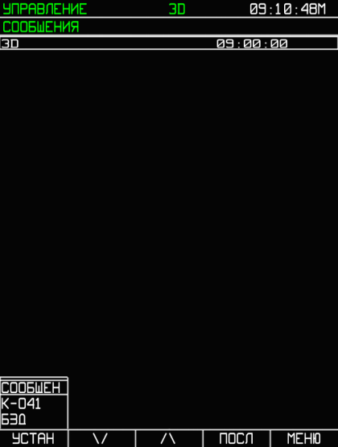

Переход в подрежим СООБЩЕНИЕ происходит при выборе в подменю строки
СООБЩЕН. На эту страницу выводятся двадцать последних сообщений, сгенерированных системой или полученных по линии передачи данных. Для перехода в другой подрежим необходимо нажать кнопку УСТАН, после чего появляется всплывающее меню. Выбор необходимого подрежима осуществляется кнопками с символами
стрелок (:octicons-triangle-up-24:, :octicons-triangle-down-24:) или вращением ручки манипулятора курсора; активизация выбранного подрежима осуществляется нажатием кнопки УСТАН.

#### Подрежим К-041

Страница состояния работы и проверки комплекса К-041. В подрежиме Работа отображается обратный счетчик времени в секундах (TIME OUT) до проведения следующей коррекции инерциальной системы от датчиков СНС. Кроме того отображаются
текущие навигационные параметры.

В подрежиме Контроль отображаются фиксированные параметры для контроля системы.

#### Подрежим БЗД

Информация о состоянии баз данных изделия аналогична индикации на странице
МЕНЮ. Индикация о состоянии/наличии информации в бортовом накопителе построена по такому же принципу.

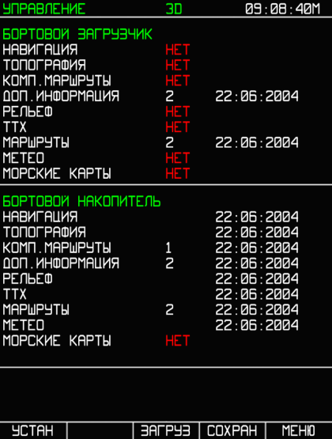

Для сохранения данных на жестком диске компьютера (в файлах скриптов lua) доступны пункты:

НАВИГАЦИЯ – навигационная база данных, навигационные точки и объекты карты,
другая навигационная информация.

ДОП. ИНФОРМАЦИЯ – линейные объекты карты, введенные пользователем.

МАРШРУТЫ – маршруты, введенные пользователем.

### Режим ПЛАН

В подрежиме ПЛАН осуществляется планирование и корректировка маршрута. Вызов подрежима ПЛАН осуществляется из страницы МЕНЮ нажатием кнопки ПЛАН.

Если план маршрута загружен, дисплей изделия имеет вид:

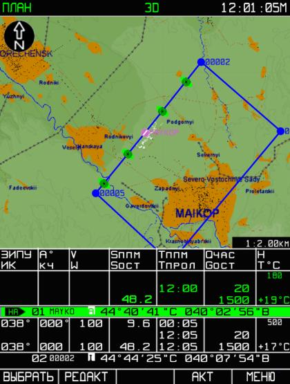

Порядок подготовки плана полета и работа с ним изложены в главе РАБОТА С
ПЛАНОМ ПОЛЕТА.

### Режим НАВИГАЦИЯ

{ width=420 }

В режиме НАВИГАЦИЯ отображается карта, а также навигационная информация:

- Системная строка, отображающая выбранный режим, состояние СНС, текущее время (по Гринвичу или поясное).
- Направление на север (для электронной карты).
- Текущий путевой угол/курс (цифровое и графическое представление).
- Заданный путевой угол.
- Путевая скорость (цифровое представление).
- Линейное боковое уклонение – ЛБУ (цифровое и графическое представление).
- Масштаб шкалы ЛБУ.
- Азимут на активный ППМ.
- Время полета.
- Высота ЛА.
- Информация о текущем и следующем участках маршрута: название ППМ,
оставшееся расстояние до ППМ (в поле информации о текущем участке
маршрута), заданный путевой угол, расчетное время прибытия на данный
ППМ, время до пролета ППМ; для следующего участка полета - расчетное
время полета от текущего места до пролета ППМ.
- Текущие географические координаты ЛА.
- Индикация масштаба электронной карты.
- Выбранный для навигации маршрут (графическое представление).

При переходе в режим НАВИГАЦИЯ кнопки имеют значение:

1.   ПОИСК – переход в режим ПОИСК.
2.   КАРТА – переход в режим КАРТА с возможностью изменения масштаба.
3.   ШБЖ – переход в режим ШБЖ.
4.   РУЧН – ручное переключение ППМ.
5.   ОБЗОР – переход в режим ОБЗОР.

### Режим ОБЗОР

{ width=420 }

В режиме ОБЗОР отображается системная строка, а также навигационная информация в текстовой и графической форме:

-   Фактический путевой угол/курс (цифровое и графическое представление).
-   Шкала компаса (не менее 90°).
-   Выбранный для навигации маршрут (графическое представление).
-   Аэронавигационная информация.
-   Заданный путевой угол.
-   Путевая скорость (цифровое представление).
-   Линейное боковое уклонение - ЛБУ (цифровое и графическое представление).
-   Масштаб шкалы ЛБУ.
-   Разница между текущим и заданным значениями курса (графическое представление).
-   Высота ЛА.
-   Информация о текущем и следующем участках маршрута: название ППМ,
оставшееся расстояние до ППМ (в поле информации о текущем участке
маршрута), заданный путевой угол, расчетное время прибытия на данный
ППМ, время до пролета ППМ; для следующего участка полета - расчетное
время полета от текущего места до пролета ППМ.
- Текущие географические координаты ЛА.
- Индикация масштаба карты.
- РМИ-1 (цифровое и графическое представление).
- РМИ-2 (цифровое и графическое представление).

В этом режиме не отображается топографическая информация.

При переходе в режим ОБЗОР кнопки имеют значение:

1.   ПОИСК – переход в режим ПОИСК.
2.   КАРТА – переход в режим КАРТА.
3.   ШБЖ – переход в режим ШБЖ.
4.   РУЧН – ручное переключение активного ППМ.
5.   ПНП – переход в режим ПНП.

### Режим ПНП

{ width=420 }

В режиме ПНП отображается системная строка, навигационная информация, имитируется стандартный планово-навигационный прибор и выводится информация о
маршруте полета:

- Фактический путевой угол/курс (цифровое и графическое представление).
- Заданный путевой угол (цифровое и графическое представление).
- Заданный курс/путевой угол.
- Шкала компаса (360°).
- Шкала вертикальной навигации.
- Путевая скорость (цифровое представление).
- Линейное боковое уклонение - ЛБУ (цифровое и графическое представление).
- Разница между текущим и заданным значениями курса (графическое представление).
- Высота ЛА.
- Информация о текущем и следующем участках маршрута: название ППМ,
оставшееся расстояние до ППМ (в поле информации о текущем участке
маршрута), заданный путевой угол, расчетное время прибытия на данный
ППМ, время до пролета ППМ; для следующего участка полета - расчетное
время полета от текущего места до пролета ППМ.
- Текущие географические координаты.
- РМИ-1 (цифровое и графическое представление).
- РМИ-2 (цифровое и графическое представление).

При переходе в режим ПНП кнопки имеют значение:

1.   ПОИСК – переход в режим ПОИСК.
2.   КАРТА – переход в режим КАРТА.
3.   ШБЖ – переход в режим ШБЖ.
4.   РУЧН – ручное переключение активного ППМ.
5.   МЕНЮ – переход в режим МЕНЮ.

### Режим БКО

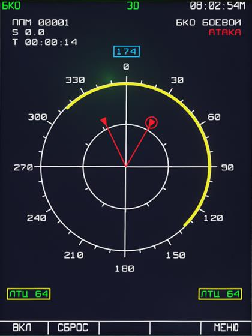

После включения БКО, система на 3 минуты переходит в режим встроенного контроля ВСК. После завершения цикла контроля система переходит в режим выбранный с помощью переключателя РЕЖИМ БКО [[LCtrl + L]] расположенного в левой части приборной панели.

Работа БКО возможна в двух режимах – боевом и дежурном:

-   В боевом режиме, при обнаружении облучения или пуска ракеты, автоматически открывается страница БКО на дисплее АБРИС. Об облучении летчик узнает из голосового предупреждения и индикации на окружности
дальности с азимутальными метками. При обнаружении пуска ракеты звучит звуковое предупреждение и происходит автоматический запуск программы выброса ЛТЦ.
-   В дежурном режиме страница БКО откроется только при обнаружении
пуска. Выброс ЛТЦ выполняется вручную лётчиком.

Программа выброса ЛТЦ зависит от параметров заданных с помощью пульта управления системой УВ-26 (расположен с правой стороны верхнего пульта).

!!! attention
    Выполняя боевое задание, при входе в зону боевых действий, переключателем режима работы оборонного комплекса на левой приборной панели включить РЕЖИМ БКО – БОЕВОЙ.

В боевом режиме БКО, при обнаружении пуска ракеты, автоматический выброс ЛТЦ
выполняется в зависимости от положения переключателя БОРТ.

Если переключатель борта пульта УВ-26 установлен в центральном положении, то
БКО будет самостоятельно выбирать борт для выброса. При подлете ракеты с передней или задней полусферы, в диапазоне углов ±30 градусов от оси вертолета происходит выброс ловушек с обоих бортов.

Если переключатель установлен в положение левого или правого борта, то выброс
ЛТЦ будет выполнятся с выбранного борта.

Оверлей с информацией БКО также отображается и на странице НАВ.

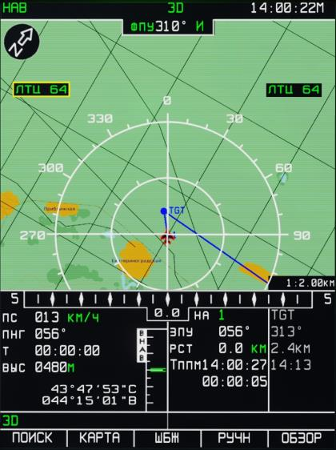

### Подрежим КАРТА

Подрежим доступен из режимов НАВ, ОБЗОР, ПНП. Состав информации в нижней
текстовой части дисплея соответствует режиму НАВИГАЦИЯ. В подрежиме КАРТА
имеется возможность выполнения следующих операций:

- Функция МЕРИТЬ - измерение расстояний и пеленгов между нанесенными
на карту объектами, произвольными точками, текущим местоположением
ЛА и объектом карты или произвольной точкой.
- Подрежим ИНФО – выбор и получение информации об объекте, отображенном в составе карты. Для этого в подрежиме ИНФО необходимо указать курсором объект на карте и нажать кнопку ИНФО. Нажатие кнопки
ИНФО на объекте открывает доступ к функции НА.
- Функция НА – активизация данных для выполнения полета в направлении
выбранного объекта (произвольной точки на карте). Функция доступна
только после использования подрежима ИНФО. 
!!! attention "Внимание!"
	При выборе
этого режима активный план полета отменяется!

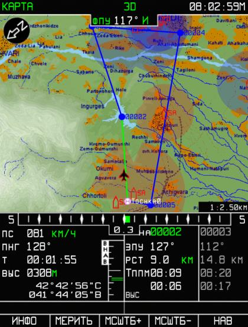

С целью расширения возможностей работы с цифровой картографической информацией в подрежиме КАРТА доступны функции масштабирования изображения - МСШТБ+, МСШТБ-.

В исходном состоянии в подрежиме КАРТА кнопки изделия имеют следующее значение:

1.   ИНФО – информация об объекте.
2.   МЕРИТЬ – измерение пеленга и расстояния от ЛА до объекта.
3.   МСШТБ+ - увеличение масштаба.
4.   МСШТБ– - уменьшение масштаба.
5.   НАВ - переход в режим НАВИГАЦИЯ.

#### Подрежим ИНФО

Подрежим ИНФО обеспечивает доступ к объектам базы данных цифровой картографической и аэронавигационной информации, при ее выполнении доступны функции
МЕРИТЬ, НА, МСШТБ+, МСШТБ-.

Активизация подрежима осуществляется кнопкой ИНФО.
На дисплее изменяется состав отображаемой информации в нижней части. Отображаются:

- Карта в режиме «север вверху».
- Поле полетной информации с дополнительной строкой – значение текущего курса ЛА.
- Маркер активного курсора (квадрат красного цвета -  :material-square-outline:{ .emoji-red } ).
- Текущие координаты курсора в правой верхней части поля полетной информации (обозначено сокращением MRK – marker).

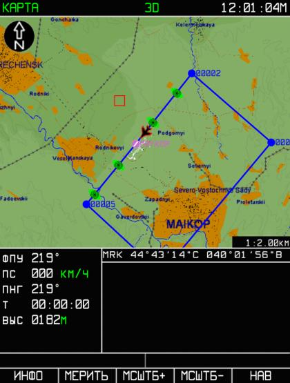

Также, в функции ИНФО, добавлена возможность просмотра высоты, магнитного
склонения любой точки карты, дальности и курса от вертолёта до точки.

##### Получение информации об объектах карты

Для получения информации об объекте карты следует, используя манипулятор курсора (:material-square-outline:{ .emoji-red }), переместить активный маркер на интересующий объект карты (маршрутные точки, аэродромы, маяки).

Сведения об объекте выводятся в правой части поля информации о полете при
нажатии кнопки ИНФО. В этом случае вместо координат маркера в поле полетной
информации отображаются прямой и обратный пеленг и расстояние от текущего
местоположения ЛА до объекта. Если в рамке активного маркера нет отображаемого объекта, информационное поле не обновляется, то есть в нем сохраняется то
же содержание, что и до нажатия на кнопку ИНФО, например, информация о последнем найденном объекте, либо пустое поле.

При нажатии кнопки ИНФО кнопка вызова функции МЕРИТЬ изменяет значение на
выбор функции НА. Возврат значения МЕРИТЬ осуществляется при любом перемещении маркера, вместо прямого/обратного пеленга и расстояния до объекта отображаются координаты маркера.

Выход из функции – выбор режима НАВИГАЦИЯ (кнопка НАВ), или вызов функций
МЕРИТЬ (НА).

#### Функция МЕРИТЬ

Функция МЕРИТЬ обеспечивает измерение расстояний между двумя точками.
Начало измеряемого отрезка может совпадать с текущим местоположением ЛА,
объектом карты или произвольной точкой карты. Участок измерения может заканчиваться произвольной точкой карты или совпадать с объектом. При ее выполнении
доступны функции ИНФО, НА, МСШТБ+, МСШТБ-.

Активизация функции осуществляется кнопкой МЕРИТЬ.

На дисплее отображается:

-   Карта в режиме «север вверху».
-   Поле полетной информации с дополнительной строкой – значение фактического путевого угла ЛА.
-   Маркер активного курсора (перекрестье красного цвета ).
-   Текущие координаты маркера в правой верхней части поля полетной информации (ERB – широта и долгота маркера; BRG – прямой и обратный
азимуты на точку начала отрезка измерения, в исходном положении - на
местоположение воздушного судна; DST – расстояние от начала отрезка
до текущего положения маркера).

Поле информации о маршруте, значение текущего курса (над картой) и значение
истинной скорости в данном режиме не отображаются. Значение кнопки МЕРИТЬ
изменяется на МАРКЕР.

Для использования функции необходимо переместить маркер         на объект (в
точку) от которого (которой) необходимо произвести измерение. Активный маркер
перемещается правой ручкой пульта управления. Индикация отрезка измерения
осуществляется линией красного цвета от начала отрезка измерения (местоположения ЛА) до текущего положения маркера. При перемещении маркера за границу
отображаемого участка карты происходит автоматическая перерисовка с учетом
направления движения маркера.

Для измерения расстояния от выбранного объекта (произвольной точки) до другого
объекта (произвольной точки) необходимо установить на начальный объект (точку)
маркер и нажать кнопку МАРКЕР. При этом на дисплее:

-   Значение кнопки МАРКЕР изменяется на МЕРИТЬ.
-   Появляется дополнительная строка MRK, содержащая координаты начала
отрезка измерения (объекта или произвольной точки);
-   Поля ERB, BRG, DST перемещаются на строку ниже и содержат информацию о соответствующих параметрах, измеренных относительно установленного маркера.

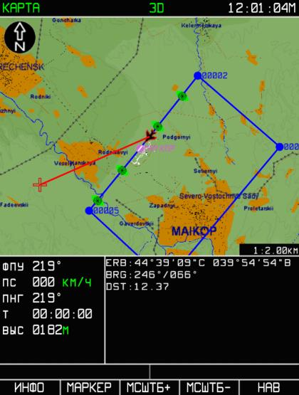

Измерение параметров (координат, пеленгов и расстояния) осуществляется переме
щением маркера.

Функции МСШТБ+, МСШТБ- обеспечивают изменение масштаба отображения цифровой картографической информации.

### Подрежим ШБЖ

Подрежим ШБЖ (штурманский бортовой журнал) доступен из режимов НАВ, ОБЗОР,
ПНП и служит для отображения и корректировки информации о плане полета в табличной форме при наличии активного плана полета. Кроме просмотра плана полета, подрежим обеспечивает возможность перенацеливания ЛА на требуемый
ППМ. На страницу ШБЖ выводится следующая информация:

-   Название ППМ.
-   Координаты ППМ.
-   ЗПУ/ЗМПУ участка маршрута.
-   Длина участка маршрута.
-   Высота пролета ППМ.
-   Расчетное время пролета ППМ.
-   Расчетное время полета на данном участке.

Кнопки в подрежиме ШБЖ имеют значение:

-   ВНАВ – переход в режим ВНАВ (вертикальной навигации).
-   НА – ручной выбор ППМ из имеющихся в ШБЖ для выполнения полета на
выбранную точку. Значение кнопки НА появляется только при перемещении активного маркера на следующие ППМ маршрута.
-   ППМ – ручной выбор ППМ из имеющихся в ШБЖ для выполнения полета
на выбранную точку с индикацией ЛБУ относительно участка маршрута:
ППМ предшествующий выбранному ППМ – выбранный ППМ.
-   НАВ – переход в режим НАВ.

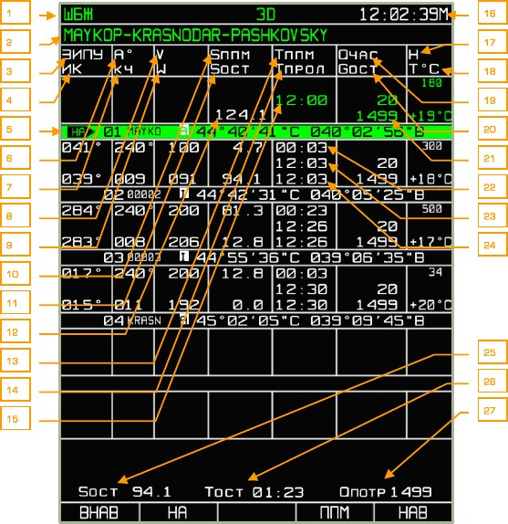

1.   Системная строка.
2.   Имя маршрута.
3.   Заданный истинный путевой угол ЗИПУ.
4.   Истинный курс, рассчитанный по введенным метеоданным.
5. Активный участок полета (поле окрашено в зеленый цвет). Информация о ППМ:
признак «НА» или «ОТ»; номер ППМ в плане полета; имя ППМ; признак ППМ; широта и долгота ППМ.
6.   Направление ветра.
7.   Скорость ветра.
8.   Истинная скорость.
9.   Путевая скорость.
10. Расстояние между ППМ.
11. Оставшееся расстояние до конечного пункта маршрута.
12. Расстояние от начального до конечного пункта маршрута (длина маршрута).
13. Время полета на участке маршрута, рассчитанное по предварительно введенным значениям истинной скорости и метеоданным.
14. Время пролета ППМ.
15. Время вылета (планируемое).
16. Текущее время.
17. Высота полета.
18. Температура наружного воздуха на высоте полета.
19. Расход топлива, введенный вручную.
20. Расчетный остаток топлива.
21. Общая заправка топливом.
22. Время полета на участке маршрута, рассчитанное по предварительно введенным значениям истинной скорости и метеоданным.
23. Время пролета ППМ, рассчитанное предварительно по введенному времени вылета.
24. Время пролета ППМ, рассчитанное в полете по текущей путевой скорости.
25. Расстояние от текущего местоположения до конечного пункта маршрута, рассчитанное по текущей путевой скорости.
26. Время полета от текущего местоположения до конечного пункта маршрута, рассчитанное по текущей путевой скорости.
27. Потребное количество топлива от текущего местоположения до конечного
пункта маршрута, рассчитанное по текущей путевой скорости и введенному вручную расходу топлива.

### Подрежим СНС

Подрежим предназначен для оценки состояния спутниковой навигационной системы
(числа сопровождаемых и обрабатываемых спутников, геометрического фактора,
отношения сигнал/шум по каждому обрабатываемому спутнику и т. д.). На дисплее
в данном подрежиме отображаются:

-   Текущее время;
-   Тип и серийный номер датчика GPS/ГЛОНАСС;
-   Значение времени, принятое от спутниковой группировки;
-   Географические координаты;
-   Высота над эллипсоидом Земли;
-     Путевая скорость;
-     Фактический путевой угол;
-     Прогнозируемая абсолютная точность определения позиции ЛА по горизонтальной и вертикальной составляющим;
-     Вероятностные характеристики точности определения позиции ЛА;
-     Информация о спутниковой группировке и текущий режим использования
спутников;
-     Положение спутников над горизонтом в графическом виде и графическое
представление соотношения сигнал/шум от используемых спутников.
-     Состояние RAIM, включающее:

    - качественную оценку точности определения местоположения и результаты оценки состояния спутниковой группировки встроенной системой
контроля ПИ СНС;
    - пороговое значение, используемое для проведения расчетов вероятностной оценки точности определения местоположения;
    - текущий этап полета, для которого выполняется оценка RAIM.

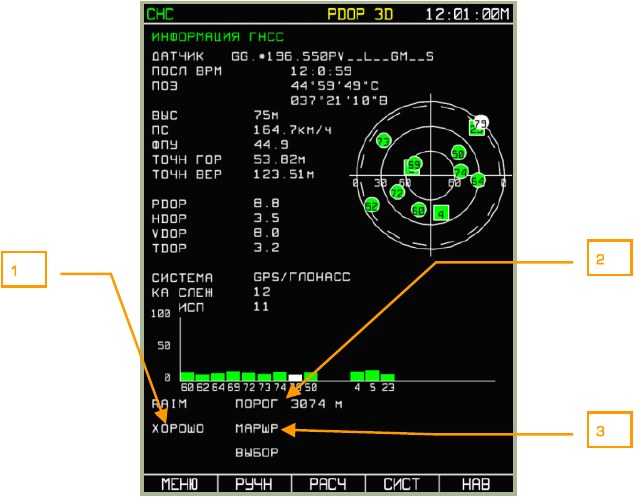

1.       Качественная оценка точности определения местоположения и результаты
оценки состояния спутниковой группировки встроенной системой контроля ПИ СНС.
2.       Пороговое значение, используемое для проведения расчетов вероятностной оценки точности определения местоположения.
3.    Текущий этап полета, для которого выполняется оценка RAIM.

В составе созвездия отображение спутников группировки ГЛОНАСС осуществляется
символом :green_square:, NAVSTAR - :green_circle:. Используемые для проведения расчетов спутники
имеют зеленый цвет, исключенные по каким-либо причинам – серым. Номер в символе соответствует номеру спутника в составе созвездия.

Пороговое значение, используемое для проведения расчетов при автоматическом
выборе, принимает следующие значения:

-  в районе аэродрома (заход на посадку, взлет) – 370 м (0,3 nm);
-  на маршруте – 3704 м (2 nm).

Установить требуемое пороговое значение самостоятельно можно на странице
ОПЦИИ → ОСНОВНОЙ в строке ПОРОГ RAIM. Оно будет использоваться только для
ручного режима. Для перехода на определенное оператором значение ПОРОГА
RAIM необходимо нажать кнопку РУЧН, для возврата в режим автоматического
определения порога – кнопку АВТО. Эту же операцию можно выполнить со страницы ОПЦИИ → ОСНОВНОЙ, изменяя значение строки ВЫБОР ПОРОГА: АВТО/РУЧН.

1.    Кнопка переключения между режимами выбора порога RAIM.
2.    Значение порога RAIM.
3.    Индикация ручного выбора порога RAIM.

Один из спутников созвездия может быть исключен из расчетов.

!!! attention "ВНИМАНИЕ!"
    Изменение стандартных установок параметров порта RS-232C может привести к рассогласованию протокола взаимодействия встроенного СНС (к модели вертолёта в симуляторе не относится)!

Перечень стандартных установок приведен в таблице.

**Заводские установки порта RS-232C для взаимодействия со встроенным СНС**

Параметр                         |   Значение
---------------------------------|----------------------------------
ДАТЧИК                           |      ASHTECH GG12
ПОРТ                             |      ВСТРОЕН
СКОРОСТЬ                         |      19200
БИТ ДАННЫХ                       |      8
ЧЕТНОСТЬ                         |      НЕТ
СТОП БИТ                         |      1
КОНТРОЛЬ                         |      АППАРАТНО
ИСП GPS                          |      GPS/ГЛОНАСС
МАСКА PDOP                       |      4,0
МАСКА ВОЗВ                       |      50
ИСКЛЮЧИТЬ КА                     |      0

Порядок исключения (включения) спутников в состав используемой группировки:

-  Перейти в подрежим СИСТЕМА, нажав клавишу СИСТ. На дисплее отобразится страница состояния системы.

    

-   Войти в подрежим УСТАНОВКИ, нажав кнопку УСТ. В левом нижнем углу
дисплея появится меню работы с УСТАНОВКАМИ изделия.
-   Правой ручкой управления курсором выбрать функцию работы со встроенным приемоизмерителем СНС – ВСТРОЕН и нажать кнопку ВЫБОР. На
дисплее отображается страница режима СИСТЕМА с индикацией под системной строкой функции установки параметров встроенного приемоизмерителя СНС – УСТ ВСТРОЕН ДАТЧИКОВ.
-   Рамкой подсветки, используя ручку управления курсора, выбрать строку
ИСКЛЮЧИТЬ КА. В этой строке отображается номер выключенного из используемой группировки спутника. Если значение равно 0, используются
все видимые в текущий момент спутники.
-   Нажать кнопку СМЕНА и манипулятором курсора выбрать номер исключаемого из использования при расчетах спутника (номер должен соответствовать одному из видимых в созвездии спутников). Для исключения
спутника из использования в расчетах нажать кнопку ВВОД.

    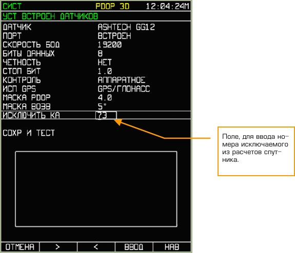

-   Исключение спутников из расчетов произойдет только после сохранения значений установок, для этого необходимо выбрать манипулятором курсора строку СОХР И ТЕСТ. Значение кнопки ВВОД изменяется на
ТЕСТ. Нажать кнопку ТЕСТ и наблюдать в нижней части дисплея команды
обмена изделия с приемоизмерителем СНС. Индикация исключения из расчетов спутника отображается в основных режимах символом ИСКЛ.

    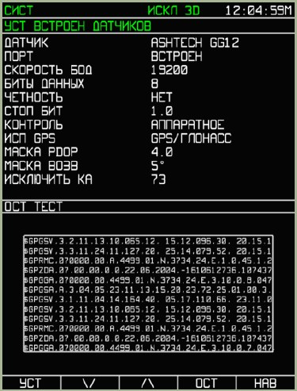

    

Серым цветом отображаются спутники, находящиеся ниже угла маски возвышения
спутников, которая отображается на схеме спутниковой группировки белой пунктирной линией.

Порядок настройки маски возвышения:

-   Вызвать через меню ВСТРОЕН страницу УСТ ВСТРОЕН ДАТЧИКОВ.
-   Выбрать активным маркером строку установки маски возвышения –
МАСК ВОЗВ (значение по умолчанию 50).
-   Нажать кнопку СМЕНА и манипулятором курсора установить необходимый
угол маски возвышения.
-   СОХР И ТЕСТ. Установленное значение будет использоваться в расчетах
только после выполнения пункта «сохранить и тестировать».
-   Индикация изменения значения угла маски возвышения осуществляется в
подрежиме СИСТЕМА при нажатии кнопки ГНСС.

    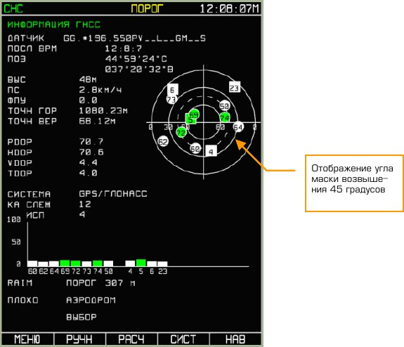

В подрежиме СНС имеется возможность проведения прогнозных расчетов состояния
RAIM.

В подрежиме СНС кнопки имеют значение:

-   МЕНЮ – переход в режим МЕНЮ.
-   АВТО/РУЧН – изменение режима выбора порога RAIM.
-   РАСЧ – просмотр альманаха созвездия в текущей точке и проведение расчета прогноза RAIM в аэропорту прибытия или любой навигационной
точке.
-   СИСТ – переход в режим СИСТ.
-   НАВ – переход в режим НАВ.

### Подрежим РАСЧ

Подрежим РАСЧЕТ (РАСЧ) предназначен для проведения прогнозных расчетов состояния RAIM в навигационных точках, имеющихся в составе базы данных изделия
АБРИС и просмотра созвездия спутников, которое должно находиться над точкой с
текущими координатами из альманаха изделия.

Проведение прогнозных расчетов состояния RAIM в навигационных точках, имеющихся в составе базы данных изделия АБРИС, и просмотр альманаха спутниковой
группировки предусмотрены:

- В точке нахождения ЛА на текущее время (только просмотр альманаха
спутниковой группировки).
- На аэропорт прибытия с выполнением прогноза состояния RAIM с учетом
введенных параметров полета.
- На любой аэропорт (навигационную точку с признаком А), имеющейся в
составе базы данных изделия АБРИС, на любое время текущих суток с расчетом прогноза RAIM.

Вызов подрежима осуществляется нажатием кнопки РАСЧ на странице СНС. В подрежиме РАСЧЕТ на дисплей выводятся информационные поля режима СНС:

- АЭРОДРОМ НАЗНАЧЕНИЯ – навигационная точка, для которой будет выполнен расчет прогноза RAIM.
- ВРЕМЯ ПРИБЫТИЯ – поле ввода времени, на которое необходимо выполнить расчет альманаха и прогноза RAIM, UTC – признак времени по Гринвичу.
- ПОЗ – поле отображения географических координат позиции ЛА, на которую выполняется расчет альманаха и прогноза RAIM (заполняется после
обнаружения в составе базы данных изделия навигационной точки).
- PRAIM ETA – поле отображения времени, на которое выполнен расчет альманаха и прогноза RAIM (заполняется после выполнения расчетов), а
также отображения качественной оценки прогноза RAIM (ДА/НЕТ).

Надпись «± 15 мин» относится к расположенной ниже таблице прогноза RAIM. При
проведении расчетов оценивается состояние спутниковой группировки на момент
прибытия в аэропорт и от этого момента ±15 минут, с градацией в 5 минут. Данные
выводятся в виде таблицы. Поля таблицы заполняются либо символом + (плюс) зеленого цвета, при благоприятном прогнозе, либо символом – (минус) желтого цвета
при неблагоприятном прогнозе RAIM.

Просмотр альманаха на текущую позицию ЛА осуществляется при отсутствии активного плана полета. Для просмотра нажать кнопку РАСЧ. На дисплей будут выведены
следующие сведения:

- признак просмотра альманаха в информационном поле ДАТЧИК.
- графическое представление прогнозируемого размещения спутников группировки по данным альманаха.

Просмотр альманаха на аэропорт прибытия с выполнением прогноза состояния
RAIM с учетом введенных параметров полета осуществляется при:

-   Наличии активного плана полета.
-   Наличии в составе параметров активного плана полета прогнозируемого
времени вылета и прогнозируемой истинной воздушной скорости на участках плана полета.

При выполнении указанных выше требований после нажатия кнопки РАСЧ на дисплей будет выведено окно просмотра альманаха и проведения расчетов с заполненными полями. Для выполнения расчетов необходимо нажать кнопку ВВОД. Окончание расчетов индицируется появлением в нижней части окна надписи РАСЧЕТ
ПРОИЗВЕДЕН.

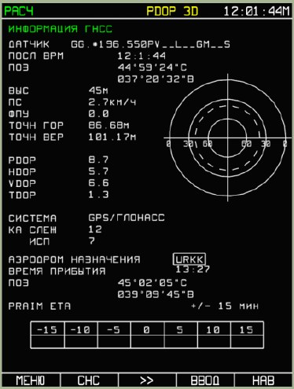

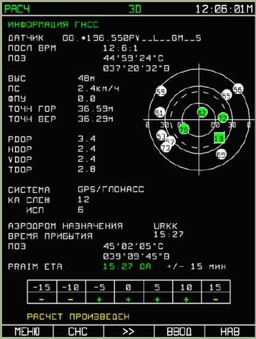

Для изменения времени проведения расчетов нажать кнопку ►►, в поле редактирования уточнить время (учитываются только текущие сутки) и нажать ВВОД.

Просмотр альманаха и расчет прогноза RAIM на любой аэропорт, имеющейся в составе базы данных изделия АБРИС, может быть выполнен в режиме прогноза RAIM
на текущую позицию ЛА или при прогнозе RAIM на аэропорт прибытия.

Для выполнения расчетов необходимо нажать кнопку ►► и перейти в окно ввода
позывного. Используя манипулятор курсора, следует ввести позывной навигационной точки, для которой необходимо выполнить прогноз. Для выбора времени проведения расчетов следует нажать кнопку ►►, в поле редактирования уточнить время
(учитываются только текущие сутки). Пример подготовки данных и выполнения расчетов на аэропорт Анапа (позывной URKA) представлен ниже. В примере прогнозируемое время прибытия - 9 часов 03 мин. Расчет выполняется после нажатия
кнопки ВВОД. При корректных исходных данных (позывных навигационной точки)
на дисплей будут выведены результаты расчетов прогноза RAIM. Если навигационная точка не будет обнаружена в базе данных (на рисунке позывной несуществующего аэропорта RRRR) на дисплей будет выведено сообщение желтого цвета - НЕТ
В БАЗЕ.

Кнопки в подрежиме РАСЧЕТ имеют значение:

-   МЕНЮ, СНС, НАВ – переход в соответствующие режимы, при этом автоматически выключается режим использования альманаха и приемоизмеритель переходит в рабочий режим.
-   ВВОД – режим расчета прогноза RAIM на выбранный аэропорт прибытия.
-   ►► – переключение между полями ввода аэродрома назначения и временем прибытия.

## Изменение текущих настроек (режим ОПЦИИ)

### Общие принципы установки ОПЦИЙ

Значения опций влияют на все режимы работы системы и хранятся в энергонезависимой памяти. Опции могут иметь значения, выбираемые из списка или из некоторого числового диапазона.

!!! attention "ВНИМАНИЕ!"
    НЕ РЕКОМЕНДУЕТСЯ изменять значения опций, если Вы НЕ УВЕРЕНЫ
в однозначности последствий для функционирования системы!

Выбор режима изменения настроек осуществляется из страницы МЕНЮ нажатием
кнопки ОПЦИИ.

Сохранение выбранных значений ОПЦИЙ осуществляется при выходе из режима
нажатием кнопки МЕНЮ.

### Порядок изменения настроек изделия в различных режимах

В режиме ОПЦИИ имеется пять подрежимов.

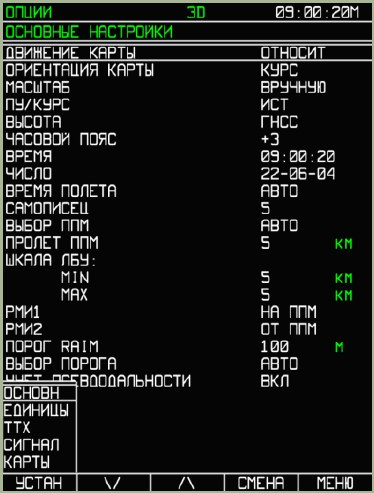

ОСНОВН - основные опции.

ЕДИНИЦЫ - настройка единиц измерения, используемых для расчетов.

ТТХ – ввод летных параметров (тактико-технических характеристик) ЛА.

СИГНАЛ - настройка временных интервалов формирования предупредительной сигнализации.

КАРТЫ - настройка параметров отображения карты.

Подрежимы доступны в режиме ОПЦИИ из меню, появляющегося при нажатии
кнопки УСТАН.

### Подрежим ОСНОВНЫЕ НАСТРОЙКИ

Выбор осуществляется из подменю. В таблице представлен перечень опций, возможные значения (величины или форматы) опций и их влияние на функционирование изделия.

Переключение между предопределенными значениями опций осуществляется кнопкой СМЕНА, переход между опциями – использованием кнопок с символами :octicons-triangle-up-24:, :octicons-triangle-down-24: или ручкой управления курсора. Выбранная опция подсвечивается рамкой.

!!! info "Перечень опций, возможные значения (величины или форматы) опций и их влияние на функционирование изделия в подрежиме ОСНОВНЫЕ НАСТРОЙКИ"
    - ДВИЖЕНИЕ КАРТЫ:
        - ОТНОСИТ: Символ ЛА всегда расположен в 20% от нижнего края карты по высоте
        - ИСТИННОЕ: Символ ЛА движется по КАРТЕ, обновление вида КАРТЫ осуществляется автоматически
    - ОРИЕНТАЦИЯ КАРТЫ:
        - КУРС: Ориентация карты по курсу ЛА
        - ПУ: Ориентация карты по путевому углу
        - СЕВЕР: Ориентация карты на Север
    - МАСШТАБ:
        - АВТО: Масштаб отображения КАРТЫ зависит от высоты полета ЛА
        - ВРУЧНУЮ: Масштаб отображения КАРТЫ выбирается оператором
    - КУРС/ПУ:
        - ИСТ: Отсчет от истинного меридиана
        - МАГ: Отсчет от магнитного меридиана
    - ВЫСОТА:
        - ГНСС: От встроенного ПИ СНС
        - БАРО: От барометрического датчика
        - РАДИО: От радиовысотомера
    - ЧАСОВОЙ ПОЯС:
        - +12/-12: Смещение местного времени
    - ВРЕМЯ (HH:MM:SS): Текущее время
    - ЧИСЛО (DD-MON-YY): Текущая дата
    - ВРЕМЯ ПОЛЕТА:
        - АВТО: Отсчет времени полета начинается со скорости 25 км/ч
        - ВРУЧНУЮ: Отсчет времени начинается с момента установки опции
    - САМОПИСЕЦ (Сек):
        - 1-60: Временной интервал записывающего устройства пройденной траектории
    - ВЫБОР ППМ:
        - АВТО: Автоматическое переключение ППМ при выполнении маршрута
        - РУЧНОЙ: Переключение ППМ осуществляется оператором
    - ПРОЛЕТ ППМ (км):
        - 1-20: Радиус окружности с центром в ППМ, при пересечении границы отображается сообщение ПРОЛЕТ ППМ (по умолчанию = 5)
    - ШКАЛА ЛБУ (км):
        - 1,2,5,10,20: Минимальный и максимальный масштаб шкалы ЛБУ в зависимости от отклонения от ЛБУ.
    - РМИ1 Символьная и цифровая индикация (желтого цвета) направления:
        - на ППМ: от ЛА на ППМ
        - от ППМ: от ППМ на ЛА
        - VOR: на маяк VOR
        - AРK: на приводную радиостанцию
        - ВЫКЛ: не отображать
    - РМИ2 Символьная и цифровая индикация (красного цвета) направления:
        - на ППМ: от ЛА на ППМ
        - от ППМ: от ППМ на ЛА
        - VOR: на маяк VOR
        - AРK: на приводную радиостанцию
        - ВЫКЛ: не отображать
    - ПОРОГ RAIM (М):
        - 0-9999: Радиус круга, центром которого являются координаты, полученные после обработки данных ПИ СНС. Применяется для вычисления вероятности нахождения реальных координат ЛА в данном круге.
    - ВЫБОР ПОРОГА:
        - АВТО/РУЧН: Опция выбора порогового значения для расчета RAIM
    - УЧЕТ ПСЕВДОДАЛЬНОСТИ:
        - ВКЛ/ВЫКЛ: Учет (игнорирование) передаваемых спутниками значений псевдодальности при проведении расчетов RAIM

### Настройка используемых для расчетов единиц измерения и формата их отображения (подрежим – ЕДИНИЦЫ)

Выбор осуществляется из подменю.

Влияние значений опций и их допустимые величины представлены в таблице ниже.

**Перечень опций, возможные значения (величины) опций и их влияние на
функционирование изделия (подрежим ЕДИНИЦЫ)**

Опция          |     Варианты, размерность, форматы   |  Влияние на функционирование изделия
---------------|----------------------------------------------------------------|--------------------------
ШИРОТА/ДОЛГОТА | ГГГ*ММ,ММ ГГГ°ММ СС                                         | Отображение топографических координат
СКОРОСТЬ       | KМ/Ч (километры в час) М/С (метры в секунду) УЗЛ (узлы)  | Использование единиц измерения для проведения расчетов
РАССТОЯНИЕ     | KM (километры) MИЛ (морские мили)                           | Использование единиц измерения для проведения расчетов
ВЫСОТА         | M (метры) ФT (футы)                                         | Использование единиц измерения для проведения расчетов
ВЕС            | KГ (килограммы) ФНТ (фунты)                                 | Использование единиц измерения для проведения расчетов
ЭЛЛИПСОИД      | WGS-84/Красовский                                              | Использование модели эллипсоида для проведения расчетов

### Настройка характеристик летательного аппарата (подрежим ТТХ)

Выбор осуществляется из подменю.

Влияние значений опций и их допустимые величины представлены в таблице.
МД – максимальная дальность (наиболее экономичный режим).

Перечень опций, возможные значения (величины) опций и их влияние на
функционирование изделия (подрежим ТТХ)

СКОРОСТИ И КРЕНЫ

Опция           | Размерность (формат)  | Варианты 
--------------------------------------------|-------|--------------
V1                                          | км/ч  | 0–350
V2                                          | км/ч  | 0–350
V4                                          | км/ч  | 0–350
V НАБОРА НОРМАЛЬНАЯ                         | км/ч  | 0–350
V НАБОРА МД (условие максимальной дальности)| км/ч  | 0–350
V КРЕЙСЕРСКАЯ НОРМАЛЬНАЯ                    | км/ч  | 0–350
V КРЕЙСЕРСКАЯ МД                            | км/ч  | 0–350
V СНИЖЕНИЯ НОРМАЛЬНАЯ                       | км/ч  | 0–350
V СНИЖЕНИЯ МД                               | км/ч  | 0–350
Vу НАБОР                                    | м/с   | 0–50
Vу СНИЖЕНИЕ                                 | м/с   | 0–50
КРЕН НА МАРШРУТЕ                            | град  | 0–60
КРЕН В РА (районе аэродрома)                | град  | 0–60

ТОПЛИВО

Опция           | Размерность (формат)  | Варианты 
------------------------------|-------|--------------
РУЛЕНИЕ                       | кг    | 0-100
ВЗЛЕТ                         | кг    | 0-100
ЭШЕЛОН РАСХОД НОРМАЛЬНЫЙ      | кг    | 0-1500
ЭШЕЛОН РАСХОД МД              | кг    | 0-1500

### Опции параметров формирования предупредительных сигналов (подрежим СИГНАЛ)

Выбор осуществляется из подменю.

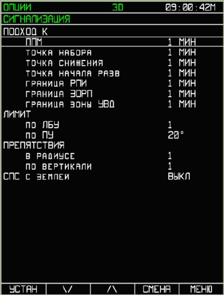

Влияние значений опций и их допустимые величины представлены в таблице.

**Перечень опций, возможные значения (величины) опций и их влияние на
функционирование изделия (подрежим СИГНАЛ)**

Параметр          | Размерность    |  Варианты    
------------------|----------------|------------------
ПОДХОД:           |                |              
ПММ               |      мин       |        0-10  
ТОЧКА НАБОРА      |      мин       |        0-10  
ТОЧКА СНИЖЕНИЯ    |      мин       |        0-10
ТОЧКА НАЧАЛА РАЗВ |      мин       |        0-10
ГРАНИЦА РПИ       |      мин       |        0-10
ГРАНИЦА ЗОРП      |      мин       |        0-10
ГРАНИЦА ЗОНЫ УВД  |      мин       |        0-10
ЛИМИТ:            |                |              
По ЛБУ            |      км        |        0-20
По ПУ             |      град      |        0-99
ПРЕПЯТСТВИЯ:      |                |              
В РАДИУСЕ         |                |        1
ПО ВЕРТИКАЛИ      |                |        1
СПС С ЗЕМЛЕЙ      |                |        ВЫКЛ  

### Опции отображения объектов в составе карты

Выбор осуществляется из подменю.

Влияние значений опций и их допустимые величины представлены в таблице ниже.

Сохранение выбранных значений ОПЦИЙ осуществляется при выходе из режима
нажатием кнопки МЕНЮ.

## Работа с планом полета

Работа с планами полета в изделии АБРИС предусматривает следующие операции:

-  Создание плана полета с использованием позывных ППМ.
-  Хранение планов полета в базе данных изделия с возможностью выполнения операций сохранения, загрузки и удаления из состава базы.
-  Автоматизацию расчетов плана полета на основании введенных параметров: истинной воздушной скорости, высоты, метеоинформации на участках полета между ППМ, сведений о заправке и расходе топлива.

Повышение возможностей изделия обеспечивается реализацией ряда дополнительных функций:

-  Ручной ввод ППМ, отсутствующих в текущей базе данных изделия.
-  Ручной ввод линейных объектов: рубежей, контуров площадных объектов
и т.д.

### Формирование плана полета

План полета, формируемый в изделии АБРИС, состоит из аэродрома вылета, совокупности ППМ и аэродрома назначения. Для проведения расчетов в составе ШБЖ в
план полета может быть включена информация о ИВС, высоте полета, метеоинформации, заправке и расходе топлива на участках полета.

Работа с планом полета обеспечивается при вызове подрежима ПЛАН со страницы
МЕНЮ.

После нажатия на кнопку ПЛАН появляется страница ПЛАН с текущим активным
планом полета.

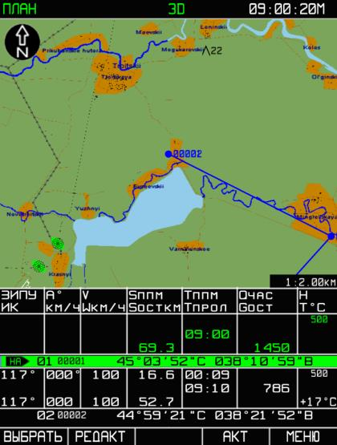

Для выгрузки текущего плана и начала составления нового необходимо нажать
кнопку ВЫБОР, с помощью манипулятора курсора выбрать пункт ОЧИСТ и еще раз
нажать кнопку ВЫБОР. Текущий план полета сбрасывается и появляется кнопка
РИСОВ, при нажатии на которую появляется инструмент рисования нового плана
полета.

### Ввод ППМ в ручном режиме

Процедура ввода ППМ:

1. Ввод ППМ начинается с выбора функции РИСОВАНИЕ – кнопка РИСОВ.
На дисплее отображается карта местности, на поле которой расположен активный
маркер, имеющий форму квадратной рамки зеленого цвета - :material-square-outline:{ .emoji-green }, на поле полетной
информации индицируется поле серого цвета с информацией.

    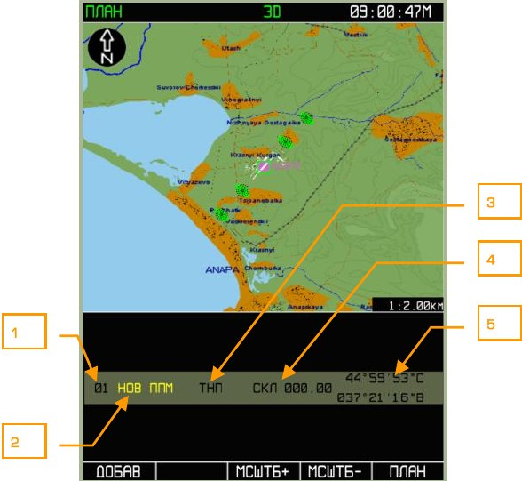

    Содержание информационного поля нового ППМ:

    1.   01 – порядковый номер ППМ в плане полета (присваивается включенному
    в план полета ППМ автоматически).
    2.   НОВ ППМ – условное обозначение добавляемого ППМ в состав плана полета; желтый цвет означает, что при включении в план полета значение
    поля необходимо изменить (или оно будет изменено автоматически).
    3.   Способ пролета ППМ.
    4.   СКЛ – значение магнитного склонения для региона, в котором находится
    активный маркер.
    5.   Текущие координаты активного маркера.

2. Включение ППМ в состав плана полета осуществляется нажатием
кнопки ДОБАВ – ДОБАВИТЬ.
Как правило, до выполнения этой операции необходимо изменить координаты вводимого ППМ – установить маркер в месте предполагаемой новой точки. В случае
необходимости следует изменить масштаб индицируемой карты путем
последовательного нажатия кнопки «МСШТБ+» или «МСШТБ-» необходимое количество раз. Контроль значения текущего масштаба карты осуществляется по индикации в правом нижнем углу карты. При получении требуемого масштаба отображения, с помощью манипулятора пульта управления необходимо переместить активный маркер в точку карты, координаты которой приблизительно соответствуют исходному пункту маршрута (ИПМ). Контроль координат маркера осуществляется по
индикации в правой части поля полетной информации. При использовании нанесенных на карту объектов необходимо совместить символ маркера  :material-square-outline:{ .emoji-green }   с символом используемого объекта карты (ППМ, аэродромы, маяки). Точного совпадения не требуется – доступный объект будет внесен в поле ввода ППМ при нажатии кнопки
ДОБАВ – ДОБАВИТЬ, но центр маркера должен находиться над объектом карты.
3. После включения выбранного ППМ в состав маршрута возможны следующие варианты:

    Под активным маркером нет аэронавигационной точки. Условный номер ППМ в
плане полета присвоен автоматически и недоступен для изменения. Активный маркер – рамка белого цвета выделяет редактируемое поле, по умолчанию – поле позывного ППМ. Значения информационных полей могут быть изменены. Переход
между полями осуществляется кнопкой ►►:

    -   Поле позывного ППМ – изменение осуществляется манипулятором пульта
    управления, переход между позициями символов – продольным нажатием,
    допустимо любое наименование.
    -   Способ пролета ППМ – определяет порядок пролета.

        Значения информационного поля СПОСОБ ПРОЛЕТА ППМ
    
        - ТНП: Проход ППМ с линейным упреждением разворота
        - ТОП: Обязательный проход над ППМ по линии пути предыдущего участка маршрута
        - ТЗП: Обязательный проход над ППМ по линии пути последующего участка маршрута

    -   Поле магнитного склонения – изменение значения осуществляется манипулятором курсора, допустимое значение – 180.

        

        1.     Позывной ППМ (наименование).
        2.     Способ пролета ППМ.
        3.     Магнитное склонение в регионе.
        4.     Координаты ППМ, введенные активным маркером.
    
    Под активным маркером есть аэронавигационная точка. Информационные
    поля имеют значения, аналогичные приведенным выше, отличие заключается в
    следующем.
    
    Появляется дополнительное поле ПРИЗНАК АЭРОНАВИГАЦИОННОЙ ТОЧКИ, отражающее тип объекта, хранящегося в базе данных изделия - черный символ на сером
    фоне. Допустимые значения поля и их характеристика представлены в таблице
    ниже.
    
    Значения информационного поля ПРИЗНАК АЭРОНАВИГАЦИОННОЙ ТОЧКИ
    
    - А: Аэродром
    - N: Приводная радиостанция
    - V: Маяк VOR
    - I: Немаркированная аэронавигационная точка

    

    Для редактирования доступны только поля СПОСОБ ПРОЛЕТА ППМ и МАГНИТНОЕ
СКЛОНЕНИЕ. Значение остальных полей определяются значениями, хранящимися в
аэронавигационной базе данных: КОД ППМ, ПРИЗНАК АЭРОНАВИГАЦИОННОЙ
ТОЧКИ, ГЕОГРАФИЧЕСКИЕ КООРДИНАТЫ.

4. Для завершения процедуры включения ППМ в план полета необходимо
нажать кнопку ВВОД. При этом на дисплее в поле карты появится обозначение
ППМ (крупная точка синего цвета - :blue_circle:). Отказаться от ввода в план полета выбранного ППМ можно, используя кнопку ОТМЕНА; при этом на дисплее будет отображаться информационное поле нового ППМ.

### Ввод ППМ с использованием позывных

В системе хранится база данных о навигационных точках, доступ к которым в режиме ПЛАН осуществляется с использованием кнопки ПОИСК. Поиск навигационных точек в базе данных осуществляется по позывным. Ввод позывного для поиска
производится в поле ПОЗЫВНОЙ ППМ (НАИМЕНОВАНИЕ). При изменении первого
символа позывного ППМ (по умолчанию в качестве позывного используется строка
символов 00001) поле очищается и переход к позиции следующего символа обеспечивается нажатием оси манипулятора курсора. 

!!! attention "Внимание!"
    Для правильного выбора ППМ из базы данных необходимо ввести ВСЕ символы ПОЗЫВНОГО!

При переходе из позиции первого символа без его изменения, редактируемое поле
сохраняет свое значение. В составе информации, полученной из базы данных ППМ,
для изменения доступно только поле СПОСОБ ПРОЛЕТА ППМ.

Процедура ввода ППМ с использованием позывных:

1. Выбрать функцию РИСОВАНИЕ – кнопка РИСОВ. На дисплее отображается карта
местности, на которой расположен активный маркер, имеющий форму квадратной
рамки зеленого цвета -   :material-square-outline:{ .emoji-green }, на поле полетной информации появится поле с информацией.
2. Нажать кнопку ДОБАВ. Если под маркером будет находиться навигационная
точка, она автоматически будет включена в план полета. При случайном вводе
навигационной точки нажмите кнопку ОТМЕНА, сдвиньте маркер в сторону от объекта карты и нажмите кнопку ДОБАВ.

    

3. Нажать кнопку ПОИСК. В активном поле ПОЗЫВНОЙ ППМ (НАИМЕНОВАНИЕ) введите полный позывной с учетом регистра.

    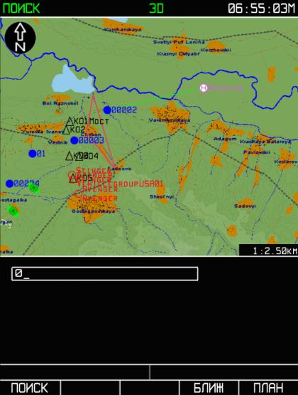

4. Нажать кнопку ПОИСК снова. Возможны два исхода процедуры:

    -   Найдена навигационная точка. Будьте внимательны! В базе данных может
    быть несколько точек с одинаковым позывным, отличающихся географическими координатами. В этом случае, необходимо повторно нажать
    кнопку ПОИСК и попытаться найти требуемую навигационную точку.
    
        
    
    -   Не найдена навигационная точка. В этом случае на дисплее отображается
    надпись желтого цвета НЕТ В БАЗЕ. Причинами появления надписи могут
    быть отсутствие навигационной точки или ошибка при наборе позывного.
    
        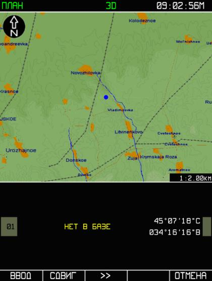

5. Для завершения процедуры включения ППМ в состав плана полета нажать
кнопку ВВОД.

    
    
    1.   Истинный курс ЛА на участке маршрута – ИК.
    2.   Истинный путевой угол – ИПУ.
    3.   Расстояние между ППМ – РСТ.
    
    Далее необходимо ввести необходимое количество ППМ, используя ручной ввод
    или позывные навигационных точек. Маршрут между ППМ, включенными в состав
    плана полета, отображается в поле карты линиями синего цвета. Очередной ППМ
    вводится в средней части поля полетной информации, предыдущий сдвигается
    вверх. Между ними появляется дополнительная информационная строка, содержащая:
    
    - Истинный путевой угол – ИПУ.
    - Истинный курс ЛА на участке маршрута – ИК.
    - Расстояние между ППМ – РСТ.

### Ввод данных для расчета плана полета

Дополнительная информация для расчетов плана полета включает:

- Время вылета из ИПМ и истинную воздушную скорость ЛА на участках
маршрута.
- Высоты полета на участках маршрута (высота полета на участке маршрута
и расстояние от (до) ППМ, на (от) котором (-го) выбранная высота должна
быть занята).
- Метеоинформацию по участкам маршрута (скорость и направление ветра,
температура воздуха на планируемой высоте полета).
- Данные по заправке и расходу топлива по участкам маршрута.

### Ввод времени вылета из ИПМ и истинной воздушной скорости

Для подготовленных участков маршрута в режиме ПЛАН нажать кнопку РЕДАКТ, из
всплывающего списка выбрать подменю СКОРОСТЬ и нажать кнопку РЕДАКТ. На
дисплее появятся информационные поля, содержащие информацию об участках полета:

- Для ИПМ – время вылета.
- Для остальных ППМ – планируемое время пролета.
- Истинная воздушная скорость на участке полета.
- Длина участка маршрута.
- Время полета на участке маршрута.

В данном подрежиме обеспечивается отображение, ввод и автоматический расчет
следующих величин:

- Отображение: порядковый номер ППМ, позывной ППМ, длина участка
полета.
-   Ввод: истинной воздушной скорости и времени вылета из ИПМ.
-   Автоматический расчет: времени полета на участке маршрута, прогнозируемого времени пролета ППМ.

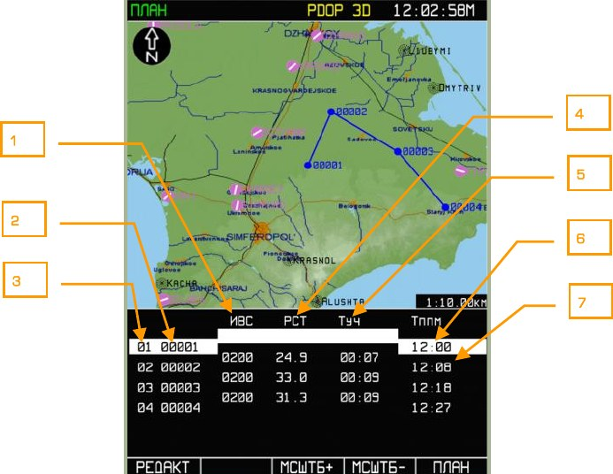

1.     Истинная воздушная скорость.
2.   Позывной ППМ.
3.   Порядковый номер ППМ в плане маршрута.
4.   Расстояние (длина) участка полета.
5.   Время полета на участке.
6.   Время вылета из ИПМ.
7.   Планируемое время пролета ППМ.

Изменение значений времени вылета из ИПМ, ИВС на участках маршрута осуществляется с использованием манипулятора курсора (выбор параметра - продольное
нажатие манипулятора или нажатие кнопки РЕДАКТ), переход к очередному параметру осуществляется нажатием кнопки ВВОД, выход из режима - по нажатию
кнопки ПЛАН.

Пересчет автоматически вычисляемых значений осуществляется после каждого их
изменения. При изменении ИВС на одном из участков маршрута, для всех остальных
участков, следующих за этим, значение ИВС изменяется на введенное.

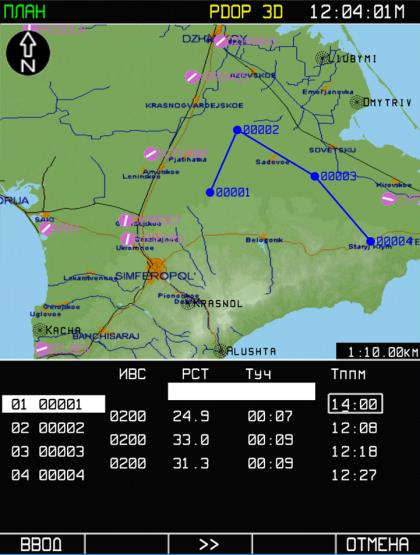

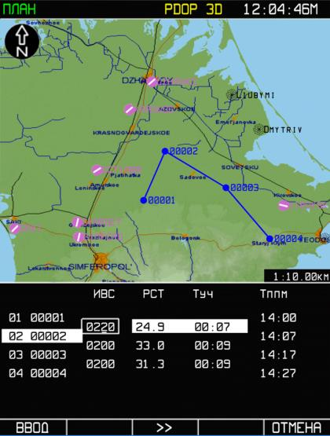

### Ввод высоты полета

Данный подрежим обеспечивает автоматический расчет вертикальной скорости ЛА
(в метрах в секунду - V~y~ м/с) для занятия заданной высоты полета на участке маршрута (в метрах - H~м~) с учетом расстояния от (до) ППМ (в километрах - S~км~).

В режиме ПЛАН необъодимо последовательно: нажать РЕДАКТ, манипулятором
курсора из всплывающего подменю выбрать ВНАВ, нажать РЕДАКТ. На дисплее в
нижней части появятся информационные поля для ввода высот полета и удалений
от ППМ, на которых высоты должны быть заняты.

1.   Планируемая высота полета на участке маршрута.
2.   Расстояние от (до) ППМ, на котором планируется занять высоту.
3.   Позывной ППМ.
4.   Порядковый номер ППМ.
5.   Вертикальная скорость (рассчитывается системой).

В информационном поле отображаются поля:

Информационные – порядковый номер и позывной ППМ;

Вводимые оператором – удаление от ППМ и высота на участке маршрута;

Рассчитываемые по заданным значениям – вертикальная скорость ЛА.

При вводе значений прокладывается прямолинейный профиль набора или снижения из ППМ начала участка в конечный ППМ участка. Начальная точка – исходный
ППМ участка, на котором задана высота полета (H~м~). Конечная точка – конечный
ППМ участка с учетом расстояния от (до) него (S~км~) и знака этого расстояния (- занять высоту за S км до ППМ, + занять высоту через S км после пролета ППМ). От
начальной точки до конечной прокладывается профиль с постоянным углом
наклона. В расчетном поле ВЕРТИКАЛЬНАЯ СКОРОСТЬ ЛА - V~y~ м/с после нажатия
кнопки ВВОД отображается рассчитанная вертикальная скорость – белым цветом,
если значение не превышает нормы, заданной в ТТХ ЛА (раздел 5.2.3), и желтым,
если данная норма превышена.

Введенная информация в полете используется в подрежиме ВЕРТИКАЛЬНАЯ
НАВИГАЦИЯ для расчета точек НАБОРА и СНИЖЕНИЯ. Подрежим доступен в процессе полета из режима ШБЖ.

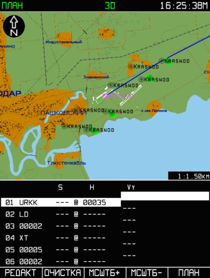

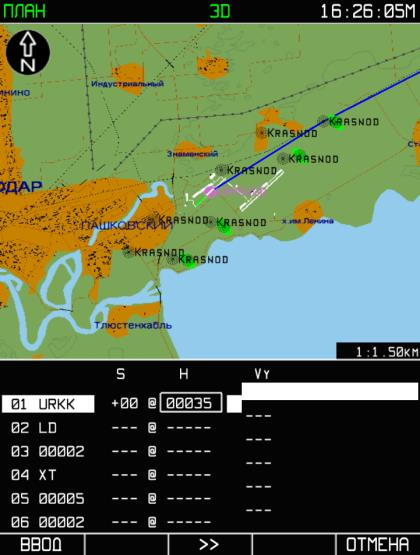

Процедура ввода значений:

Ввод значений S~км~ и H~м~ осуществляется с использованием манипулятора курсора,
выбор строки для изменения - либо продольным нажатием, либо нажатием кнопки
РЕДАКТ. Переход к следующему символу осуществляется продольным нажатием оси
манипулятора, к редакции следующего поля – нажатием кнопки ►►. Запись значения в план осуществляется по нажатию кнопки ВВОД, при этом автоматически заполняются поля высоты полета от текущего поля до КПМ.

В данном режиме обеспечивается планирование бесступенчатого (с постоянной
вертикальной скоростью) занятия высоты между несколькими ППМ по запланированному маршруту. Для выполнения процедуры планирования занятия высоты с постоянной вертикальной скоростью необходимо выполнить следующие операции:

1. Ввести требуемое значение в позицию Hм участка маршрута, от которого необходимо начать планирование занятия высоты.
2. Манипулятором курсора перевести активный маркер на следующий участок и
нажать кнопку ОЧИСТКА. Выполнить эту операцию последовательно для всех промежуточных участков маршрута, при пролете которых планируется занять требуемую высоту.
3. Для участка маршрута, на котором заданная высота должна быть достигнута,
ввести ее значение.
4. Нажать кнопку ВВОД – на дисплее будет отображены рассчитанные высоты пролета участков маршрута и вертикальные скорости.

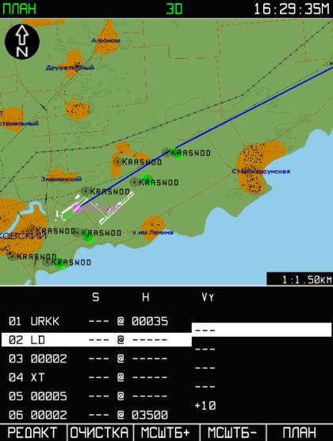

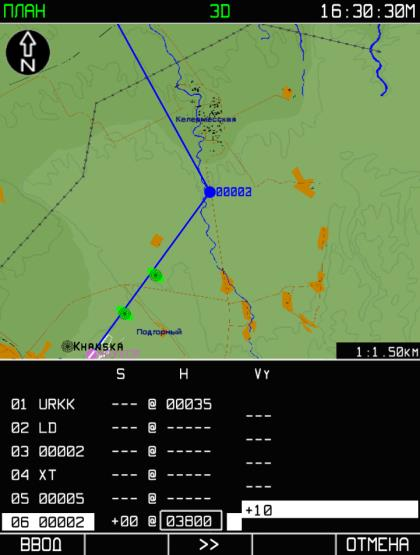

Результаты автоматического расчета вертикальной скорости бесступенчатого (с постоянной вертикальной скоростью) занятия высоты отображаются желтым цветом,
если превышены значения ТТХ ЛА.

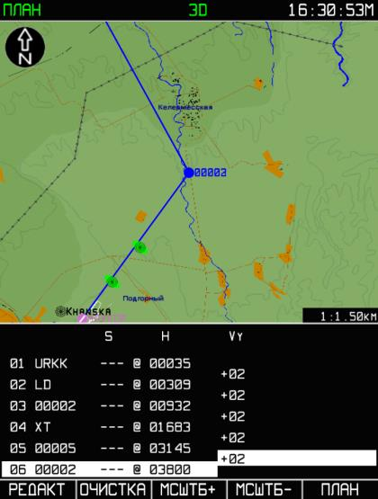

### Ввод метеоинформации

Данная функция предназначена для ввода данных о состоянии атмосферы по планируемому маршруту полета. Введенные значения используются при проведении
расчетов прогнозируемой путевой скорости ЛА, времени движения на участках
маршрута. Вызов функции осуществляется из режима ПЛАН последовательным
нажатием РЕДАКТ, выбором манипулятором курсора из всплывающего меню
МЕТЕО, нажатием кнопки РЕДАКТ.

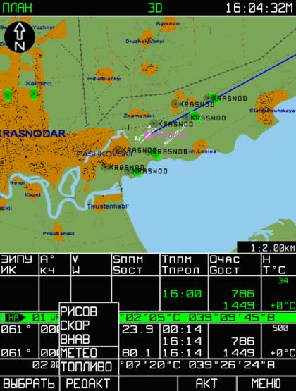

1.   Позывной ППМ.
2.   Порядковый номер ППМ.
3.   Направление и скорость ветра.
4.   Температура наружного воздуха.

В информационном поле необходимо ввести направление в градусах, скорость
ветра в м/с (поле ВЕТЕР – направление/скорость), температуру наружного воздуха
(поле - Т0С) на планируемой высоте полета.

Выбор строки осуществляется манипулятором курсора, ввод значений в строки нажатием кнопки РЕДАКТ (осевом нажатии манипулятора курсора), изменение значений - манипулятором курсора, переход между полями – осевым нажатием, запоминание значения – нажатием кнопки ВВОД. При этом будет произведен перерасчет скорости ветра из м/с в км/ч.

Выход из функции происходит по нажатию кнопки ПЛАН.

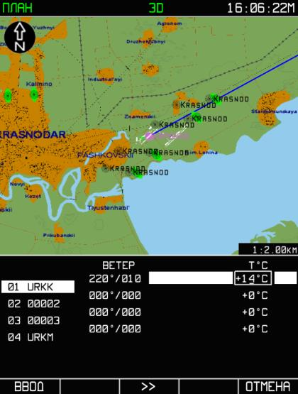

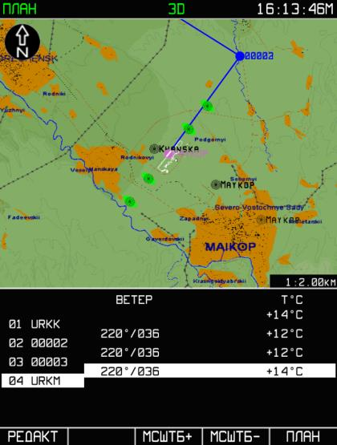

### Ввод заправки и расхода топлива

Данная функция предназначена для ввода данных о наличии и расходе топлива при
выполнении полета по планируемому маршруту. Введенные значения используются
при проведении расчетов остатка топлива при пролете участка маршрута. Вызов
функции из режима ПЛАН производится последовательно: нажатием РЕДАКТ, выбором манипулятором курсора из всплывающего меню ТОПЛИВО, нажатием кнопки
РЕДАКТ (осевым нажатием манипулятора курсора).

В поле информации о полете отображаются строки, содержащие поля:
Информационные: порядковый номер и позывной ППМ, время полета на участке
маршрута.

Редактируемые: запас топлива в ИПМ (Gост к/г - килограмм), прогнозируемый расход топлива на участках маршрута (Qчас к/г - килограммы в час).

Рассчитываемые: прогнозируемый остаток топлива при пролете ППМ (Gост
к/г - килограмм).

После ввода данных о наличии топлива в ИПМ и прогнозируемом расходе топлива
на первом участке автоматически выполняется:

-   Автоматическое заполнение введенной величиной расхода всех полей
Qчас к/г участков маршрута;
-   Расчет остатка топлива при пролете ППМ.

При необходимости следует уточнить прогнозируемый расход топлива по участкам
маршрута, учитывая, что остаток топлива по ППМ для редактирования недоступен.
Желтым цветом отображаются нулевые расчетные значения остатка топлива. Выбор
строки производится манипулятором курсора, ввод значений в строки - нажатием
кнопки РЕДАКТ (осевом нажатии манипулятора курсора), изменение значений –
манипулятором курсора, переход между полями – осевым нажатием, запоминание
значения – нажатием кнопки ВВОД.

Результаты расчетов после ввода значений показаны на рисунке ниже. Выход из
функции произходит по нажатию кнопки ПЛАН.

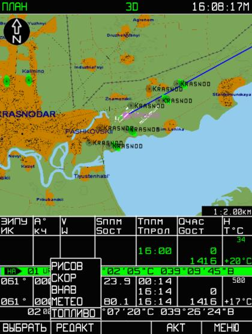

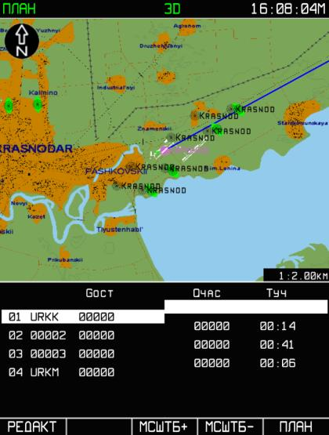

1.   Запас топлива в ИПМ.
2.   Позывной ППМ.
3.   Порядковый номер ППМ.
4.   Остаток топлива при пролете ППМ.
5.   Прогнозируемый расход топлива на участке маршрута.
6.   Время полета на участке маршрута.

### Запись плана полета в базу данных

В базе данных системы сохраняется план полета в составе:

- Поворотных пунктов маршрута (ИПМ, ППМ, КПМ);
- Значений истинной воздушной скорости, высот полета, метеоинформации,
сведений о заправке топливом и расходе топлива на участках маршрута.

Процедура сохранения плана полета:

1. В режиме ПЛАН, при необходимости сохранить план полета, нажать кнопку
ВЫБРАТЬ. При этом на дисплее над транспарантом кнопки "ВЫБРАТЬ" выводится
всплывающее меню с перечнем возможных операций над планом полета.
2. Перевести курсор путем вращения ручки манипулятора на строку ЗАПИСЬ и
нажать кнопку ВЫБРАТЬ.
3. На дисплее отобразится сформированное ИМЯ МАРШРУТА.
4. Используя манипулятор курсора или кнопки :octicons-triangle-up-24:, :octicons-triangle-down-24: и :octicons-triangle-right-24:, откорректировать при необходимости ИМЯ МАРШРУТА.
5. Нажать кнопку ЗАПИСЬ. На дисплей выводится страница ПЛАН, в которой появляется таблица сохраненного плана, активный маркер на ИПМ.

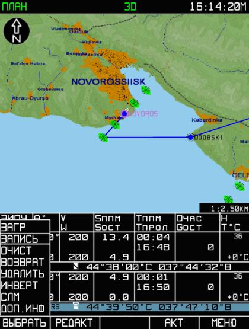

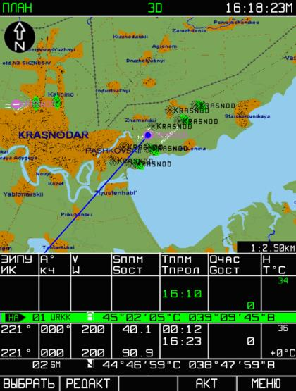

Вышеописанная процедура сохраняет план полета в оперативную память системы
АБРИС. Для сохранения плана полета на жестком диске с возможностью его вызова
и использования в будущих полетах необходимо произвести следующие действия:

1.   Перейти в главное меню, нажав кнопку МЕНЮ.
2.   Нажать кнопку УПРАВ и перейти на страницу УПРАВЛЕНИЕ.
3.   Нажать кнопку УСТАН. При этом появится выпадающий список. Используя
кнопки :octicons-triangle-up-24:, :octicons-triangle-down-24: или манипулятор курсора, выбрать команду БЗД (БАЗА
ДАННЫХ) и нажать кнопку УСТАН.
4.   На странице УПРАВЛЕНИЕ нажать кнопку СОХРАН, при этом появляется
строка-курсор в разделе БОРТОВОЙ НАКОПИТЕЛЬ.
5.   Перевести строку-курсор на строку НАВИГАЦИЯ и нажать кнопку СОХРАН.
При этом сохраняются навигационные данные.
6.   Перевести строку-курсор на строку МАРШРУТЫ и нажать кнопку СОХРАН.
При этом сохраняются маршруты.
7.   После выполнения процедуры сохранения нажать кнопку МЕНЮ.

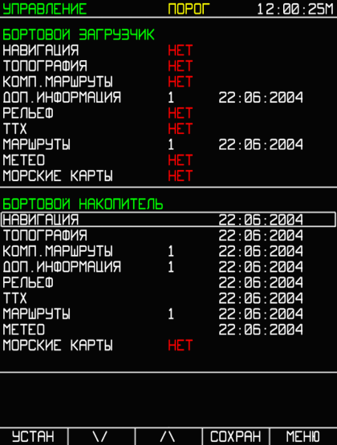

Все существующие маршруты будут записаны в виде скрипта и ассоциированы с
файлом текущей миссии.

В дальнейшем при загрузке этой миссии все маршруты с пользовательский дополнительной информацией можно будет использовать через процедуру загрузки на странице ПЛАН.

### Активизация плана полета

Созданный (откорректированный) или загруженный из базы данных план полета
должен быть АКТИВИЗИРОВАН для использования в текущих навигационных
расчетах.

Для перевода изделия АБРИС в полетный режим (режим расчета и вывода на дисплей текущей навигационной информации и выдачи этой информации в сопрягаемые системы) после подготовки или загрузки плана полета необходимо:

1. В режиме ПЛАН нажать кнопку АКТ. При этом изделие переходит в режим
НАВИГАЦИЯ, на дисплее отображается страница НАВ.
2. Проконтролировать на странице НАВ отображение значений:

- Заданного маршрута на карте местности (начальный участок с ИПМ).
- Текущих значений навигационных параметров в левой части поля полетной информации.

    **Текущие параметры ЛА**
    
    №     |  Параметр                  |  Обозначение на дисплее    |   Единицы измерения
    ------|----------------------------|----------------------------|------------------
    1     |  Скорость ЛА               |           W                |   км/ч
    2     |  Азимут на ИПМ             |           А                |   градус
    3     |  Время полета              |           Тп               |   00:00
    4     |  Высота ЛА (места стоянки) |           H                |   метры
    5     |  Широта ЛА (места стоянки) |                            |   00°00’00”
    6     |  Долгота ЛА (места стоянки)|                            |   00°00’00”

- В средней части поля полетной информации - параметров исходного
участка маршрута.

    **Параметры исходного участка плана полета**

    №     |  Параметр                  |  Обозначение на дисплее   |   Единицы измерения
    ------|----------------------------|---------------------------|------------------
    1     |  Позывной ИПМ                    |     На              | 
    2     |  Заданный путевой угол           |     ЗПУ             |    градусы, минуты, секунды
    3     |  Оставшееся расстояние до ИПМ    |     S               |    км
    4     |  Расчетное время пролета ППМ     |     Тппм            |    часов : минут

- В правой части поля полетной информации - параметров первого участка
маршрута.

    **Параметры первого участка маршрута**
    
    №     |  Параметр                  |  Обозначение на дисплее   |   Единицы измерения
    ------|----------------------------|---------------------------|------------------
    1     |   Позывной первого ППМ                             |  На    |
    2     |   Заданный путевой угол на первом участке маршрута |  ЗПУ   |
    3     |   Расстояние от ИПМ до первого ППМ                 |  S     |  км
    4     |   Время пролета ППМ                                |  Тппм  |  часов : минут
    5     |   Время полета на участке маршрута                 |        |  минут : секунд

С момента начала движения ЛА на дисплее наблюдается непрерывное перемещение метки ЛА по неподвижной карте (или перемещение карты относительно неподвижной метки ЛА, в зависимости от выбранной ОПЦИИ движения карты), а также
оперативное обновление отображаемых навигационных параметров.

### Загрузка плана полета

В составе базы данных системы могут храниться заранее подготовленные планы полетов

Процедура загрузки плана полета:

1.    Вызвать режим МЕНЮ нажатием кнопки МЕНЮ, на странице выбрать режим ПЛАН нажатием кнопки ПЛАН. На дисплее появится страница ПЛАН.
2.    Нажать кнопку ВЫБРАТЬ, над транспарантом кнопки появится всплывающее меню доступных операций с планом полета. Подсветить, используя
манипулятор курсора, строку ЗАГР и нажать кнопку.

    !!! attention "Внимание!"
        При выполнении данной операции с активным планом полета (в процессе выполнения полета по маршруту) необходимо выбрать строку ОЧИСТ – ОЧИСТИТЬ ПЛАН ПОЛЕТА и нажать кнопку ВЫБРАТЬ!
    
3.   На дисплей будет выведен перечень имеющихся в базе данных планов полета.
4.   Подсветить активным маркером, используя манипулятор курсора, строку с
именем плана полета для загрузки.
5.   Нажать кнопку ЗАГР – ЗАГРУЗИТЬ, из базы данных изделия будет загружен план полета.
6.   При загрузке плана полета для просмотра в центре индицируемой электронной карты местности будет находиться ИПМ, а в таблице плана полета, расположенной ниже поля карты, будет подсвечена строка, соответствующая ИПМ и первому участку маршрута. При вращении манипулятора
курсора в центр индицируемой карты будет перемещаться очередной
ППМ, а в таблице плана полета – подсвечиваться строка, соответствующая очередному участку маршрута, и т.д. до КПМ.

!!! attention "Внимание!"
    Для использования плана полета в качестве рабочего необходимо выполнить процедуру активизации!

### Просмотр плана полета

Подготовленный или загруженный план полета доступен для просмотра. Для этого
необходимо выполнить следующие действия.

1.   Нажать кнопку ПЛАН в режиме МЕНЮ. Если просмотр осуществляется в
процессе навигации (т.е. когда имеется активный план полета), то
при входе в режим ПЛАН активный план автоматически загружается для
просмотра.
2.   Просмотр ППМ, включенных в план полета, осуществляется переводом активного маркера ручкой манипулятора курсора. Имеется возможность просмотреть последовательно все пункты маршрута (от ИПМ до КПМ), контролируя для каждого пункта (участка) маршрута:

-   Расположение пункта на карте местности.
-   Топографические и аэронавигационные особенности местности
по маршруту.
-   Текстовые (числовые) параметры пунктов и участков маршрута.

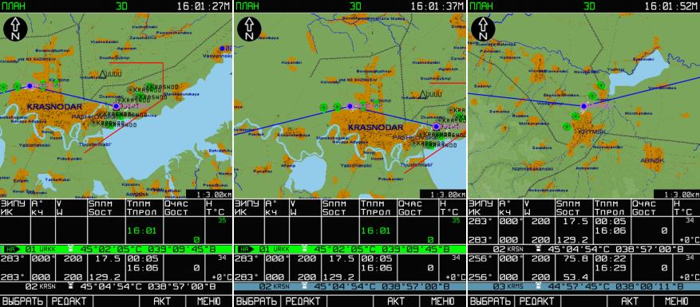

В данном режиме существует возможность редактировать план полета. Если просматриваемый план полета был отредактирован, рекомендуется записать новую
версию плана полета в базу данных системы.

Выход из режима ПЛАН происходит по нажатию кнопки МЕНЮ.

## Редактирование плана полета

Вход в режим работы с планом полета производится из страницы МЕНЮ нажатием
кнопки ПЛАН.

!!! attention "Внимание!"
	Нижеописанные функции работают только для планов полетов, созданных игроком в системе АБРИС. План полета (маршрут), загруженный из миссии, является нередактируемым.

### Изменение параметров ППМ и участков маршрута без изменения их количества

Нажать кнопку РЕДАКТ, подсветить манипулятором курсора строку РИСОВ и
нажать кнопку РЕДАКТ.

С помощью манипулятора курсора выбрать пункт маршрута, параметры которого
необходимо изменить. Нажать кнопку РЕДАКТ и в выпадающем меню выбрать
пункт РЕДАКТ. В поле полетной информации появляется активный маркер, параметры ППМ становятся доступными для изменения.

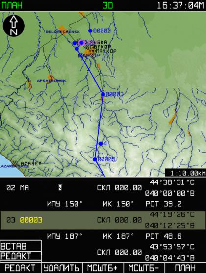

Откорректировать параметры ППМ маршрута, последовательно выполняя операции,
указанные выше.

Если корректировка параметров ППМ заключается только в изменении координат
пункта маршрута, то ее можно произвести методом сдвига, для чего нужно выполнить операции, описанные выше, а затем:

-   Нажать кнопку СДВИГ. При этом на поле карты появляется курсор, имеющий форму квадратной рамки зеленого цвета - :green_square:.
-   С помощью манипулятора курсора переместить курсор ППМ в требуемое
место на карте.
-   Нажать кнопку ВВОД. При этом выбранный ППМ перемещается в точку,
указанную курсором.

Координаты нового положения ППМ и расстояния участков маршрута пересчитываются автоматически.

При необходимости откорректировать параметры другого пункта (участка) маршрута - следует повторить операции, указанные выше.

!!! attention "Внимание!"
	Изменение координат ППМ возможно только для немаркированных аэронавигационных точек, а именно: для тех точек, которые не соотносятся с аэродромами и маяками.

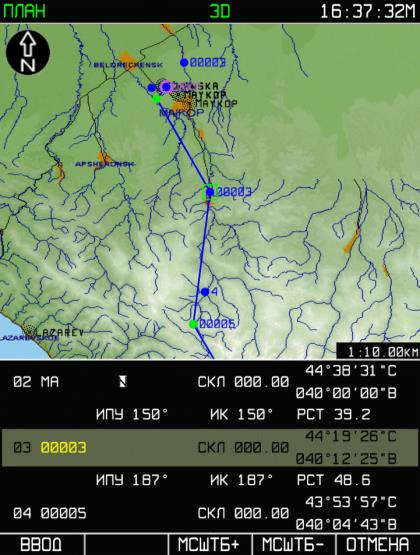

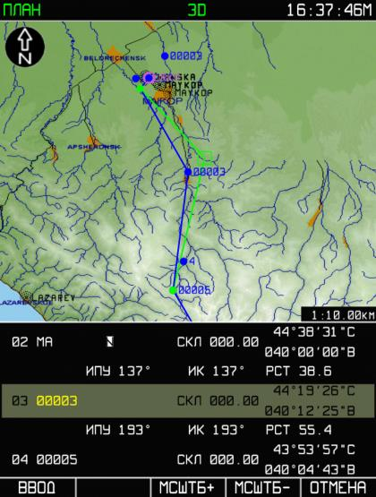

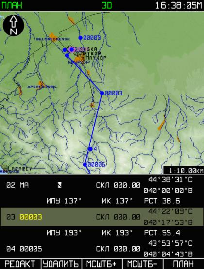

### Удаление пунктов (участков) маршрута

Нажать кнопку РЕДАКТ, подсветить манипулятором курсора строку РИСОВ и
нажать кнопку РЕДАКТ.

С помощью ручки манипулятора курсора прокручиванием списка ППМ выбрать
пункт маршрута, который необходимо удалить, нажать кнопку УДАЛИТЬ.

При этом выбранный пункт маршрута будет удален из загруженного плана полета,
на дисплее пропадет его графическое изображение, а графическое изображение
маршрута изменится с учетом новой последовательности ППМ - произойдет спрямление маршрута.

При необходимости удаления нескольких пунктов маршрута повторить описанные
операции.

### Увеличение количества ППМ (участков) маршрута

В состав редактируемого плана полета может быть включен ППМ в качестве КПМ
или ППМ любого участка плана полета.

Нажать кнопку РЕДАКТ, подсветить манипулятором курсора строку РИСОВ и повторно нажать кнопку РЕДАКТ. С помощью ручки манипулятора курсора прокручиванием списка ППМ выбрать пункт маршрута, после которого необходимо вставить
новый пункт маршрута.

#### Добавление ППМ в конец имеющегося маршрута (продление маршрута)

Манипулятором курсора выбрать КПМ маршрута (КПМ подсвечен в списке серым
фоном и находится в центре видимой области карты). Далее выполнить процедуру
ввода ППМ. Нажать кнопку РЕДАКТ, подсветить манипулятором курсора строку
ВСТАВ и повторно нажать кнопку РЕДАКТ. При этом на поле карты появится курсор, имеющий форму квадратной рамки зеленого цвета - :green_square:. С помощью манипулятора курсора переместить активный маркер в требуемую точку карты. В поле полетной информации позывной нового ППМ высвечивается желтым цветом – ППМ еще
не включен в состав маршрута.

Нажать кнопку ДОБАВ. При этом на графическом обозначении участка маршрута
появляется изображение нового ППМ. Ввести параметры ППМ и нажать кнопку
ВВОД. В поле графической информации произойдет отрисовка маршрута с новым
ППМ, включенным в состав маршрута.

#### Добавление ППМ между ППМ имеющегося маршрута

Манипулятором курсора выбрать ППМ маршрута, после которого необходимо добавить новый ППМ (ППМ подсвечен в списке серым фоном и находится в центре видимой области карты). Далее повторить вставку нового ППМ аналогично вышеописанной процедуре добавления ППМ в конец маршрута.

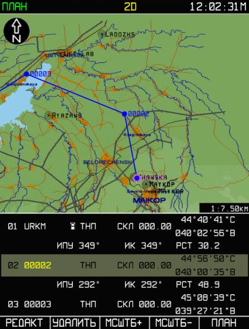

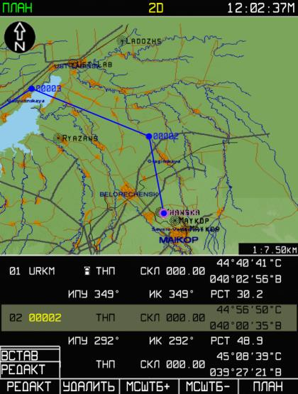

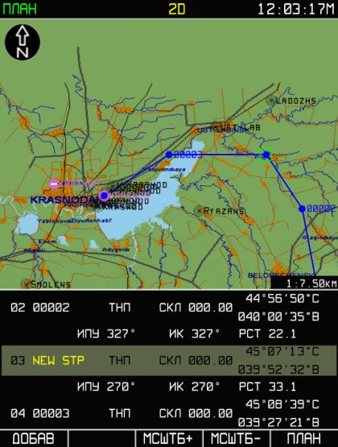

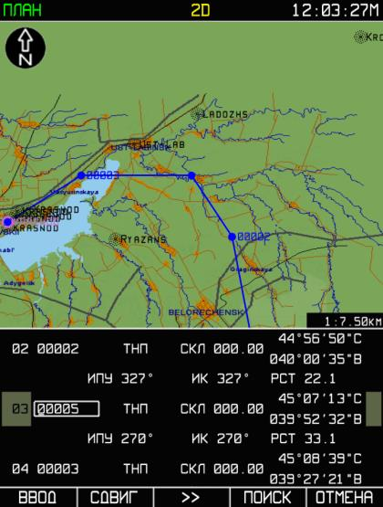

После корректировки параметров всех необходимых пунктов маршрута нажать
кнопку ПЛАН.

### Возврат к начальному плану полета

Если в процессе полета был изменен план полета (произведена корректировка
маршрута или была замена маршрута на новый), но при этом возникла необходимость возврата на начальный маршрут, спланированный в редакторе миссий, требуется сделать следующее:

- Войти в режим ПЛАН, нажать кнопку ВЫБРАТЬ, при этом над кнопкой
ВЫБРАТЬ появится перечень возможных операций с планом полета.
- Вращая ручку манипулятора курсора, подсветить строку ВОЗВРАТ, нажать
кнопку ВЫБРАТЬ, затем нажать кнопку АКТ.

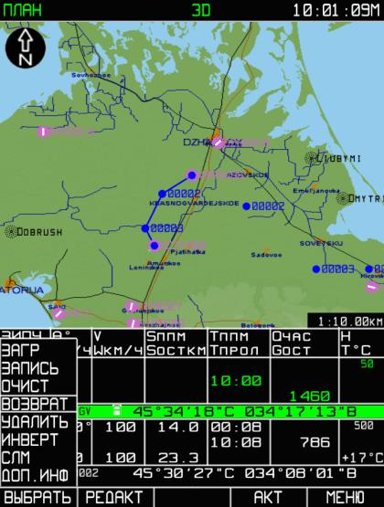

## Работа с планом маршрута при выполнении полета по маршруту

Оперативное изменение активного плана полета предусматривает следующие варианты действий:

-   Загрузка плана полета из базы данных системы и его активизация;
-   Коррекция элементов активного плана полета и вычисление характеристик вертикальной навигации ЛА в подрежиме ШТУРМАНСКИЙ БОРТОВОЙ ЖУРНАЛ.

### Функции подрежима ШТУРМАНСКИЙ БОРТОВОЙ ЖУРНАЛ – ШБЖ

Подрежим ШТУРМАНСКИЙ БОРТОВОЙ ЖУРНАЛ (ШБЖ) предназначен для работы с
активным планом полета при выполнении полета. В составе подрежима реализованы следующие функции:
-   Вертикальная навигация на участке полета ВНАВ – расчет точек набора
(снижения) при занятии заданного эшелона полета.
-   Перенацеливание курса ЛА на произвольный ППМ маршрута или оперативно выбранный ППМ.

### Расчет точек начала набора (снижения) высоты (функция ВНАВ)

Вертикальная навигация в полете ВНАВ вызывается из режима ШБЖ.

После нажатия кнопки ВНАВ НА система остается в режиме вертикальной навигации ВНАВ. В таблице отображаются рассчитанные высоты и вертикальные скорости.

Если вертикальные скорости превышают пределы ТТХ, они отображаются желтым
цветом.

Кнопка ЗАД VY прокладывает профиль, состоящий из горизонтального полета и
набора (снижения) с заданной вертикальной скоростью в выбранный ППМ. Начальная точка профиля – текущая позиция и высота ЛА. Конечная точка отстоит от выбранного ППМ на заданную в нем «дельту» S и имеет заданную в этом ППМ высоту.
Рубеж начала набора (снижения) рассчитывается так, чтобы при заданной вертикальной скорости ЛА попал точно в конечную точку профиля. В промежуточных
ППМ, находящихся на этом профиле, высоты заполняются расчетными значениями,
«дельты» S обнуляются.

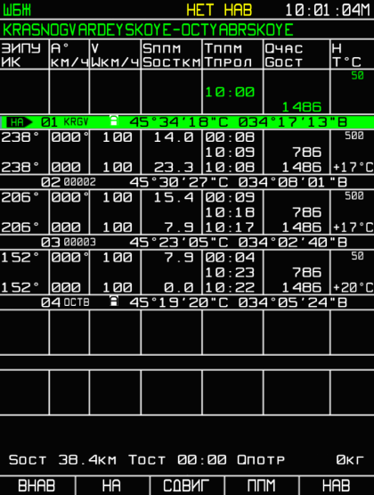

После нажатия кнопки ЗАД VY открывается поле ввода вертикальной скорости. После нажатия на кнопку ВВОД в этом поле система возвращается в режим ВНАВ. В
таблице отображаются рассчитанные высоты и вертикальная скорость, равная заданной. Если вертикальная скорость превышает пределы ТТХ, она отображается
желтым цветом. Если при заданной вертикальной скорости невозможно попасть в
требуемую точку, кнопка ВВОД не срабатывает.

Расстояние от точки начала маневра (для режима ВНАВ НА – от текущей позиции)
до следующего за этой точкой ППМ записывается в поле «рубеж» этого ППМ. Это
расстояние используется для выдачи предупреждения и для работы индикатора
вертикальной навигации между этой точкой и ППМ.

Рассчитанные точки набора (снижения) отображаются в составе графического
плана полета в виде точек синего цвета с символами Н – набор :material-alpha-h-circle-outline:, С – снижение :material-alpha-c-circle-outline:.

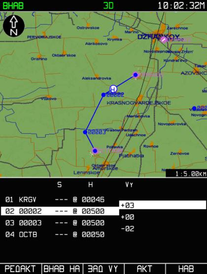

### Перенацеливание курса ЛА на произвольный ППМ маршрута

Загрузить требуемый план и активизировать его.

#### Переключение на требуемый ППМ вручную

1.   Нажать кнопку ШБЖ. На дисплей будет выведена страница подрежима
ШБЖ.
2.   Активным маркером, используя манипулятор курсора, подсветить строку с
требуемым ППМ, нажать кнопку ППМ.
3.   Курс ЛА будет перенацелен на выбранный ППМ, боковое уклонение будет
индицироваться от участка “предшествующий ППМ из плана полета” →
“выбранный ППМ”.

При нажатии кнопки НА произойдет переключение на выбранный ППМ, при этом
боковое уклонение будет индицироваться от участка «текущее место ЛА» → «выбранный ППМ». При этом ранее загруженный маршрут выгружается из системы.

#### Подготовка данных для полета по кратчайшему маршруту (полет «НА ТОЧКУ»)

При выполнении полета из режима НАВ необходимо выбрать подрежим КАРТА, при
этом на дисплей будет выведена топографическая информация района полета. При
необходимости, изменение масштаба отображаемой карты следует произвести
нажатием кнопки МСШТБ+ или МСШТБ- необходимое количество раз (контроль
значения текущего масштаба карты осуществляется в правом нижнем углу карты).

Нажать кнопку ИНФО. При этом на дисплее в поле карты появится курсор красного
цвета, имеющий форму квадратной рамки.

С помощью манипулятора переместить курсор на топографическое изображение
желаемой конечной точки полета. Контроль координат курсора осуществляется по
отображению в верхней части поля полетной информации.

Нажать кнопку НА. При этом ранее загруженный маршрут выгружается из системы,
а активным становится маршрут, состоящий из двух пунктов:

- ИПМ – точка текущего местоположения ЛА.
- КПМ – выбранная конечная точка полета.

Выход из режима происходит по нажатию кнопки НАВ (на дисплее отображается
страница режима НАВИГАЦИЯ).

### Инвертирование плана полета

Под инвертированием понимается изменение маршрута для полета из КПМ в ИПМ
подготовленного плана полета. Инвертирование маршрута применяется только для
неактивизированного плана полета.

Порядок выполнения процедуры:

1.   Войти в режим ПЛАН и загрузить требуемый план полета.
2.   Нажать кнопу ВЫБРАТЬ, при этом над кнопкой ВЫБРАТЬ появится перечень возможных операций с планом полета. Используя манипулятор курсора, подсветить строку ИНВЕРТ, нажать кнопку ВЫБРАТЬ.
3.   На дисплее будет отображен инвертированный маршрут.

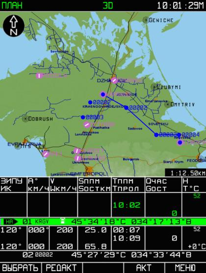

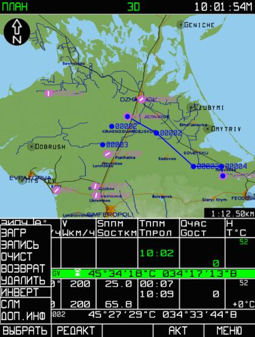

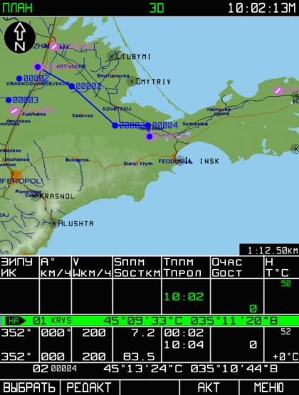

С инвертированным маршрутом могут быть выполнены все операции по редактированию и сохранению маршрута в базе данных изделия.

### Удаление плана полета

Планы полетов, использование которых по каким-либо причинам в дальнейшем не
предусматривается, могут быть удалены из базы данных изделия.

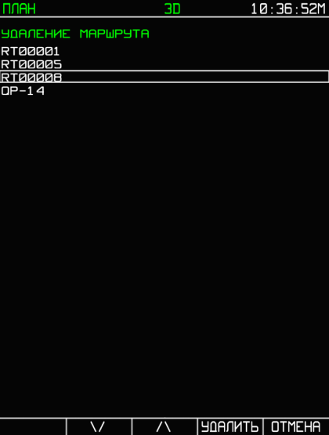

Порядок выполнения процедуры:

1.   Войти в режим ПЛАН, нажать кнопку ВЫБРАТЬ, из всплывающего меню
возможных операций с планом полета манипулятором курсора выбрать
строку УДАЛИТЬ.
2.   Нажать кнопку ВЫБРАТЬ, затем кнопками :octicons-triangle-down-24:, :octicons-triangle-up-24: или ручкой манипулятора
курсора активным маркером выбрать удаляемый маршрут и нажать кнопку
УДАЛИТЬ. Если нет необходимости в удалении маршрута, следует, не
нажимая на кнопку УДАЛИТЬ, нажать кнопку ОТМЕНА.
3.   Для выхода из функции - нажать кнопку ОТМЕНА.

### Нанесение дополнительной информации на поле карты

В системе Абрис предусмотрено дополнение базы данных информацией, необходимой оператору при подготовке и выполнении полетов. В состав базы данных, редактируемой оператором, могут быть включены:

- Навигационные точки;
- Линейные объекты.

Нанесение и удаление дополнительной информации на поле карты осуществляется
при вызове функции ДОП ИНФ. Вызов функции осуществляется из режима ПЛАН
нажатием кнопки ВЫБРАТЬ. Используя манипулятор курсора, необходимо подсветить строку ДОП ИНФ и нажать кнопку ВЫБРАТЬ. На дисплее появится страница
подрежима ДОП ИНФ, в которой на поле карты появится курсор в виде квадратной
рамки черного цвета, а на поле полетной информации - его координаты. Подрежим
ДОП ИНФ позволяет нанести и обозначить на карте:

-   Навигационную точку с указанием типа.
-   Линию или геометрическую фигуру, образованную отрезками прямой.

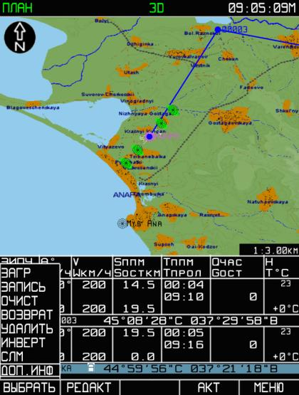

Типы навигационных точек

ПАРАМЕТР           | VOR    |     АП   |     NDB    |     ГЕОТОЧКА | ПРЕПЯТСТВИЕ | ОРИЕНТИР
-------------------|--------|----------|------------|--------------|-------------|-------------
Имя                |  +     |     +    |     +      |         +    |   +
Широта             |  +     |     +    |     +      |         +    |   +         | +
Долгота            |  +     |     +    |     +      |         +    |   +         | +
Позывной           |  +     |          |     +      |              |             | +
Частотный канал    |  +     |          |     +      |              |             |         
Высота             |  +     |     +    |     +      |              |   +
Символ отображения |  V     |     А    |     N      |              |             | I

!!! note "Примечание"
    Знаком плюс (+) отмечены параметры, характеризующие конкретные типы точек.

### Ввод точек в базу данных изделия

Навигационные точки в базу данных изделия могут быть введены следующими способами:

-   По известным координатам;
-   По известным азимуту и дальности от известной точки;

### Ввод точки по известным координатам

Нажать кнопку ДОБ.ТЧК. Используя манипулятор курсора, следует подсветить
строку НАПРЯМУЮ, нажать кнопку ДОБ.ТЧК, на дисплее появится страница подрежима ТОЧКА.

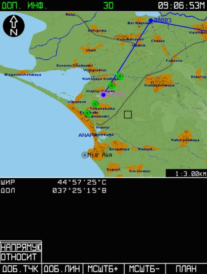

Для нанесения точки на поле карты необходимо манипулятором курсора переместить активный маркер в место на карте, куда нужно добавить точку. Выбор типа
навигационной точки осуществляется нажатием кнопки ТИП необходимое число раз
по циклу. На дисплее на поле карты появитсятся символ, обозначающий тип точки
(на том месте, где находился курсор), а на поле полетной информации – координаты точки и название параметров, характеризующих данную точку, которые при
необходимости можно ввести (операция ввода аналогична вводу параметров ППМ).

Используя манипулятор курсора, слудет ввести (уточнить) первый параметр точки,
затем,нажав кнопку ►►, перейти к следующему параметру, ручкой манипулятора
курсора ввести (уточнить) значение параметра и т.д.

После уточнения всех параметров нажать кнопку ВВОД.

### Ввод точки по известным азимуту и дальности

Данный режим используется в тех случаях, когда известны азимут и дальность от
навигационной точки, имеющейся в базе данных.

В функции ДОП ИНФ нажать кнопку ДОБ. ТЧК. Используя манипулятор курсора,
подсветить строку ОТНОСИТ, нажать кнопку ДОБ. ТЧК, на дисплее будет отображено поле полетной информации, разделенной на верхнюю и нижнюю части. В
верхней части отображается информация о новой (вводимой) в состав базы навигационной точке, в нижней – об имеющейся в базе изделия.

При помощи кнопки ТИП - выбрать требуемый тип вводимой точки. С помощью манипулятора курсора - заполнить требуемые активные поля для выбранной точки в
верхней части поля полетной информации. Переключение между активными полями
производится при помощи кнопки ►►.

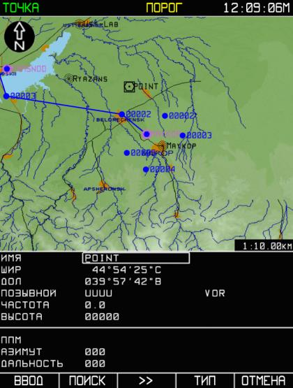

Используя кнопку ►►, перейти к строке ППМ и ввести имя ППМ, от которого будут
заданы АЗИМУТ и ДАЛЬНОСТЬ для расчета координат точки. При помощи кнопки
►► и манипулятора курсора ввести в поля АЗИМУТ и ДАЛЬНОСТЬ значения азимута и дальности от выбранной навигационной точки. Обратите особое внимание
при вводе Азимута и Дальности на единицы измерения величин (т.е. АЗИМУТ – истинный или магнитный; ДАЛЬНОСТЬ – километры или мили).

1.   Имя вводимой геоточки.
2.     Позывной навигационной точки, от которой будет откладываться азимут и
дальность для новой точки.
3.     Азимут для вводимой точки.
4.     Дальность для вводимой точки.
5.     Координаты активного курсора.

Нажмите кнопку ПОИСК (результат поиска необходимого ППМ контролируйте по
карте). Если в процессе поиска обнаружен не тот ППМ, продолжайте нажимать
кнопку ПОИСК до обнаружения требуемого ППМ.

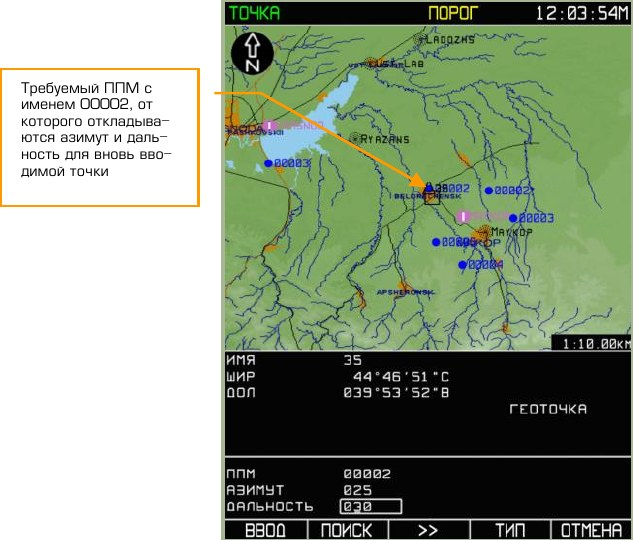

Текущий маркер вводимой точки будет располагаться на найденном ППМ из базы
данных.

Нажмите кнопку ВВОД. Маркер вводимой точки переместится в рассчитанную точку
по введенным азимуту и дальности.

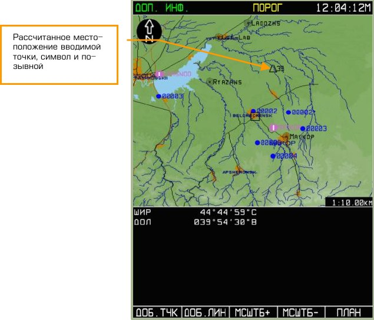

### Редактирование и сдвиг навигационных точек

В случае необходимости можно отредактировать тип или параметры навигационной
точки, а также произвести сдвиг координат.

Для редактирования параметров навигационной точки необходимо выполнить шаги,
указанные ниже, из режима ДОП. ИНФО

Навести курсор на навигационную точку, после чего автоматически включится подрежим ТОЧКА и значения кнопок изменятся; кнопка ДОБ. ТЧК сменится на
РЕДАКТ., а кнопка ДОБ. ЛИН сменится на УДАЛИТЬ.

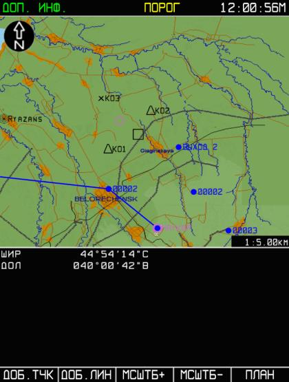

Нажать кнопку РЕДАКТ и войти в подрежим редактирования.

Смену типа точки выполнить циклическим нажатием на кнопку ТИП.
Выбор параметра для редактирования произвести с помощью кнопки ►►. Редактирование выбранного параметра производить с помощью манипулятора курсора.

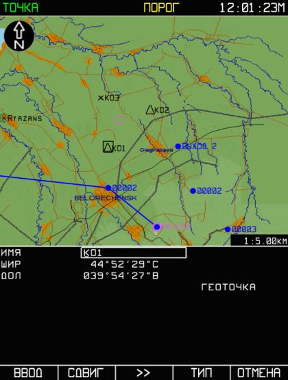

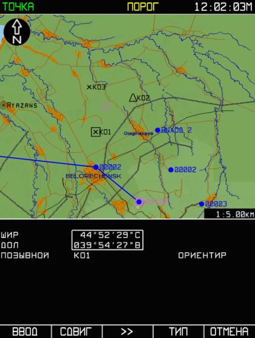

Для смены координат точки нажать кнопку СДВИГ и переместить точку в желаемое
место с помощью манипулятора курсора, контролируя положение точки по карте и
текущим координатам.

После завершения редактирования нажать кнопку ВВОД.

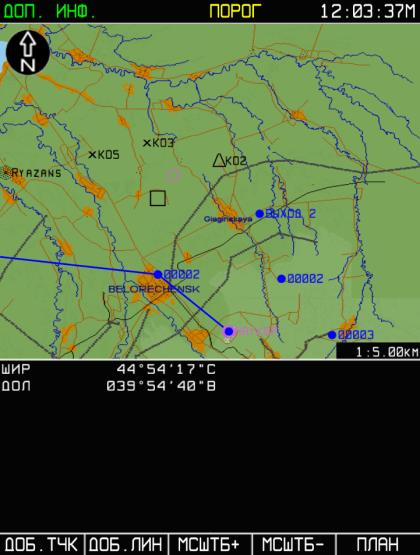

### Сохранение навигационных точек

Для того чтобы сохранить на жестком диске введенные или измененные навигационные точки из режима дополнительной информации, необходимо проделать следующие действия:

1.   Перейти в главное меню, нажав кнопку МЕНЮ.
2.   Нажать кнопку УПРАВ и перейти на страницу УПРАВЛЕНИЕ.
3.   Нажать кнопку УСТАН. При этом появится выпадающий список. Используя
кнопки :octicons-triangle-up-24:, :octicons-triangle-down-24: или манипулятор курсора выбрать команду БЗД (БАЗА
ДАННЫХ) и нажать кнопку УСТАН.
4.   Далее на странице УПРАВЛЕНИЕ нажать кнопку СОХРАН, при этом появится строка-курсор в разделе БОРТОВОЙ НАКОПИТЕЛЬ.
5.   Перевести строку-курсор на строку НАВИГАЦИЯ и нажать кнопку
СОХРАНИТЬ. При этом сохраняются все навигационные точки и данные.
6.   После выполнения процедуры сохранения нажать кнопку МЕНЮ.

Все навигационные точки будут записаны в виде скрипта и ассоциированы с файлом текущей миссии.

### Нанесение линейных объектов

Нанесенные на поле карты линейные объекты могут использоваться оператором
для обозначения характерных линейных и площадных рубежей и объектов (зон, полигонов, переднего края и т.д.).

Для нанесения на поле карты линии или геометрической фигуры, образованной отрезками прямой, ручкой манипулятора курсора следует переместить курсор в то место на карте, координаты которого совпадают с координатами начала линии и
нажать кнопку ДОБ. ЛИН. На дисплей будет выведена страница ЛИНИЯ, на поле
полетной информации появятся координаты начала линии и название параметров,
характеризующих наносимую линию, а также шкала выбора цвета линии. Нажимая
на кнопку ЦВЕТ, можно выбрать цвет линии. При перемещении курсора в точку
окончания линии и нажатии кнопки ВВОД линия будет добавлена в состав базы
данных. Если необходимо выйти из режима без ввода линии в состав базы данных - нажать кнопку ОТМЕНА до нажатия кнопки ВВОД. Выход из функции – окончание рисования линии, нажатие кнопки ОТМЕНА.

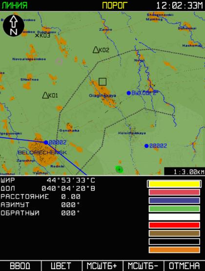

Рисование производится линией красного цвета, после нажатия кнопки ВВОД линия
приобретает выбранный цвет.

При необходимости нанести на карту геометрическую фигуру, состоящую из нескольких соединенных между собой прямых сегментов, следует прокладывать каждый сегмент через нажатие кнопки ВВОД. После построения линии необходимо
нажать кнопку ОТМЕНА.

При необходимости нанести на карту несколько не соединенных между собой линий
\- выполнить операции для нанесения одной линии, нажать кнопку ОТМЕНА и снова
повторить операции для второй линии и нажать кнопку ОТМЕНА (и т.д.).

### Сохранение линейных объектов

Для сохранения на жестком диске введенных линейных объектов из режима дополнительной информации, необходимо произвести следующие действия:

1.   Перейти в главное меню, нажав кнопку МЕНЮ.
2.   Нажать кнопку УПРАВ и перейти на страницу УПРАВЛЕНИЕ.
3.   Нажать кнопку УСТАН. При этом появится выпадающий список. Используя
кнопки :octicons-triangle-up-24:, :octicons-triangle-down-24: или манипулятор курсора, выбрать команду БЗД (БАЗА
ДАННЫХ) и нажать кнопку УСТАН.
4.   На странице УПРАВЛЕНИЕ нажать кнопку СОХРАН, при этом появляется
строка-курсор в разделе БОРТОВОЙ НАКОПИТЕЛЬ.
5.   Перевести строку-курсор на строку ДОП. ИНФОРМАЦИЯ и нажать кнопку
СОХРАНИТЬ. При этом сохраняются все линейные объекты.
6.   После выполнения процедуры сохранения нажать кнопку МЕНЮ.

Все линейные объекты будут записаны в виде скрипта и ассоциированы с файлом
текущей миссии.

### Поиск навигационных точек и объектов в базе данных

Этот режим предназначен для использования в экстренных ситуациях. Режим позволяет найти АЭРОДРОМ, VOR, ОПРС, ППМ (ориентир, геоточку, препятствие), определенные оператором. В этом режиме обеспечивается поиск вышеперечисленных
объектов по имени.

Вызов функции доступен из режимов НАВИГАЦИЯ, ОБЗОР, ПНП. Для вызова
нажмите кнопку ПОИСК, во всплывающем меню с помощью манипулятора курсора
выберите категорию поиска (АЭРОДРОМ, VOR, ОПРС или ППМ) и нажмите кнопку
ПОИСК еще раз, при этом будет активирован режим поиска выбранной категории.
На дисплей выводится список ближайших объектов выбранной категории.

Далее поиск желаемого объекта можно вести путем просмотра всего списка объектов данной категории c использованием манипулятора курсора.

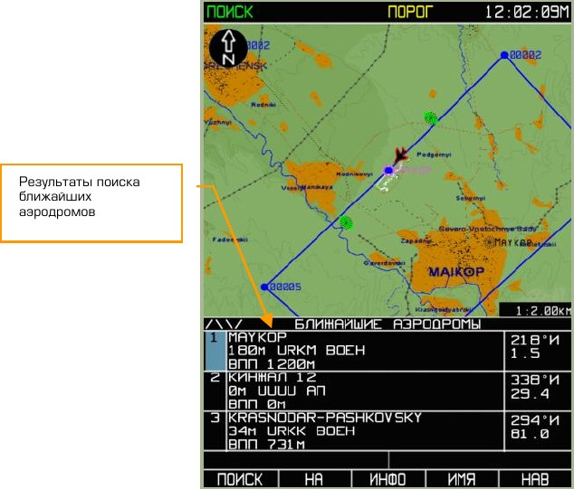

Альтернативный способ – поиск по имени объекта. Для этого, находясь в режиме
ПОИСК, необходимо нажать кнопку ИМЯ и ввести имя точки, используя манипулятор курсора. В процессе ввода имени точки происходит поиск по введенным символам.

По окончании поиска на экране появится таблица объектов, которые отсортированы
по следующим признакам:

-   Первыми по списку идут объекты, имена которых строго соответствуют запросу, т.е., если выполнялся поиск по имени URK в категории АЭРОДРОМ,
то в начале списка будет аэродром с именем URKA;
-   Далее будут следовать объекты категории АЭРОДРОМ, названия которых
начинаются с URK, например URKK, URKM.

Просмотреть размещение найденных объектов на карте можно, используя манипулятор курсора. При подсвечивании имени объекта карта на дисплее будет перемещаться в район объекта.

После нахождения объекта может быть просмотрена информация о нем. Для этого
необходимо нажать кнопку ИНФО. На экране отображаются: координаты объекта, а
также азимут и расстояние до него от текущего положения ЛА.

1.   Расчетное время пролета точки (по текущей путевой скорости).
2.   Расчетное время полета до точки (по текущей путевой скорости).
3.   Расчетный остаток топлива в точке с текущими координатами.
4.   Пеленг на/от текущего расположения ЛА до выбранной точки.
5.   Расстояние от текущего расположения ЛА до выбранной точки.
6.   Тип объекта, имя, высота над уровнем моря, позывной и длина ВПП.

Для активизации навигационных расчетов при выполнении полета на выбранную
точку нажать кнопку НА. При этом активный план полета отменится, а активным
станет только один участок полета – с текущего местоположения ЛА на выбранную
точку.

Для возврата в навигационный режим нажать кнопку НАВ.

## Тактическая информация

Индикация тактической информации о вертолётах звена, целях и угрозах производится в режиме КАРТА. Для включения и выключения режима отображения тактической информации служит фильтр ТАКТИКА в подрежиме опций НАСТРОЙКА
КАРТЫ (по умолчанию включена).

В рамках индикации тактической информации могут отображаться:

1.   Четыре вертолёта звена с соответствующими выбранными номерами.
2.   Три типа целей:

    - подвижная малоразмерная цель, бронетехника;
    - средства ПВО;
    - прочие объекты, сооружения.

3.   Точки подхода к цели.
4.   Опасные зоны обнаружения разведанных средств ПВО.

Также в рамках тактической информации отображается линия визирования комплекса Шквал. Длина линии соответствует замеренной лазерным дальномером
дальности.

1.   Цель, класс «прочие». Здание, сооружение №2.
2.   Цель, объект ПВО №2.
3.   Марка 3-го вертолёта звена.
4.   Линия визирования комплекса Шквал.
5.   Марка 4-го вертолёта звена.
6.   Марка своего вертолёта.
7.   Цель, класс «прочие». Здание, сооружение №1.
8.   Цель, бронетехника №2.
9.   Цель, бронетехника №1.
10. Марка 2-го вертолёта звена
11. Точка подхода к цели №1.

Марка вертолёта звена представляет собой красную окружность с вектором курса.

Внутри окружности отображается номер, присвоенный вертолёту. Номер соответствует номеру вертолёта, назначенному с помощью галетного переключателя КТО
Я на пульте включения целеуказания ПВЦ. Марка вертолёта командира звена обозначается двумя концентрическими окружностями. Цели обозначаются тремя ти
пами синих значков: для средств и машин ПВО - 

, бронетехники (военной тех
ники) - 

, других целей (зданий и сооружений) - 

. В центре значка указывается
номер цели, присвоенный системой ВЦУ вертолёта. Система целеуказания может
оперировать только 4-мя целями одного типа. То есть, пятая добавленная цель будет замещать первую и т.д. 

!!! attention "Внимание!"
	Нумерация целей на вертолётах звена может не совпадать.

Точка подхода обозначается синим значком - 

. Максимальное количество точек - 4. Пятая введенная точка перезаписывает первую и т.д.

Процедуру работы с аппаратурой ВЦУ, прием и передачу целей смотрите в разделе
«Использование аппаратуры ВЦУ». //link

Линия визирования комплекса ШКВАЛ отображается желтой линией, соединяющей
марку своего вертолёта с точкой визирования. Длина линии высчитывается в зависимости от дальности, замеренной лазерным дальномером.

При наличии разведанных средств ПВО на дисплее будут отображаться опасные
зоны средств ПВО в виде окружностей с радиусом, равным дальности обнаружения
и с центром в точке размещения средства ПВО. Разведанными средствами ПВО считаются средства ПВО, которые установлены в редакторе миссий и не скрыты.

Опасные зоны ПВО противника обозначаются полупрозрачным синим цветом, свои
зоны ПВО – полупрозрачным красным цветом.

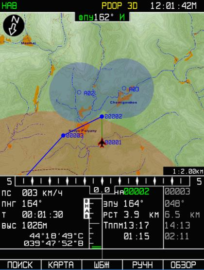

Опасная зона средств ПВО рисуется с учетом затенения рельефом на высоте полета
вертолёта. Для отрисовки зоны берется окружность радиуса обнаружения ПВО и
накладывается на трехмерную карту рельефа на высоте полета вертолёта. Все, что
пересекается с рельефом - отсекается.

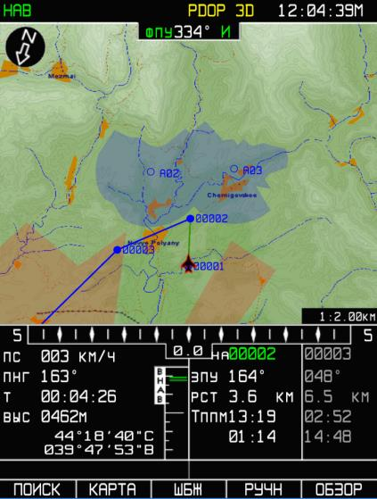

Возможно отображение только неподвижных средств ПВО. Т.к. информация о средствах ПВО в процессе полета не обновляется, опасные зоны ПВО будут отображаться на карте дисплея даже после уничтожения связанных с ними средств ПВО.

{!docs/ka50/abbr.md!}
{!dev-docs/ka50/abbr.md!}
