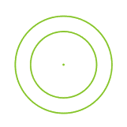
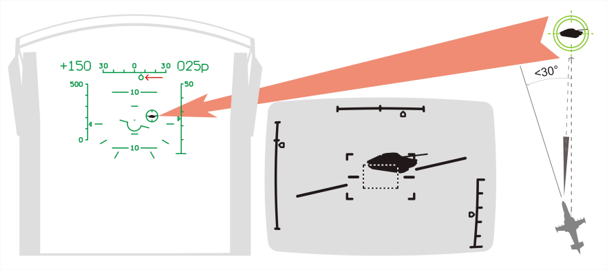
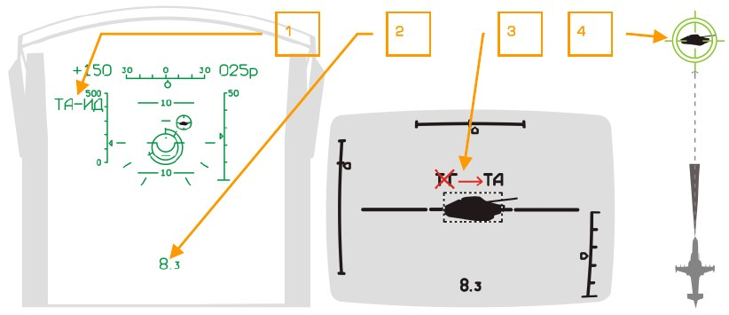
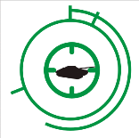
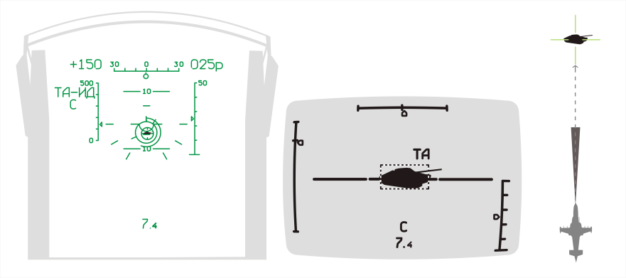
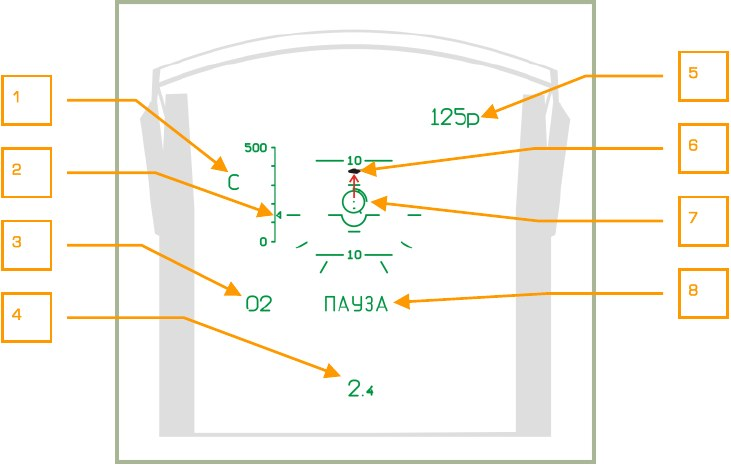
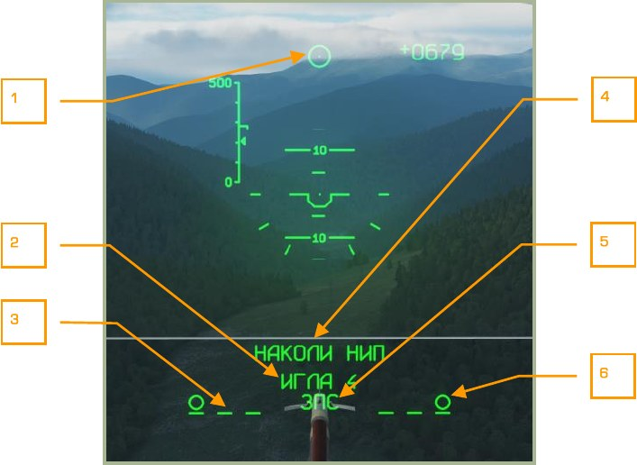
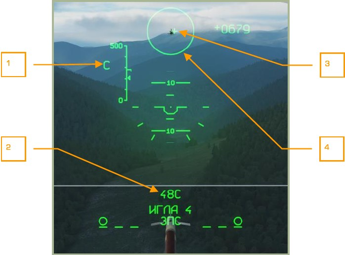
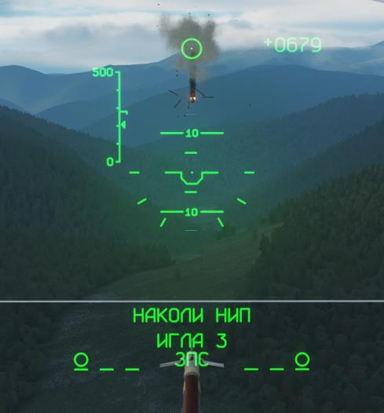
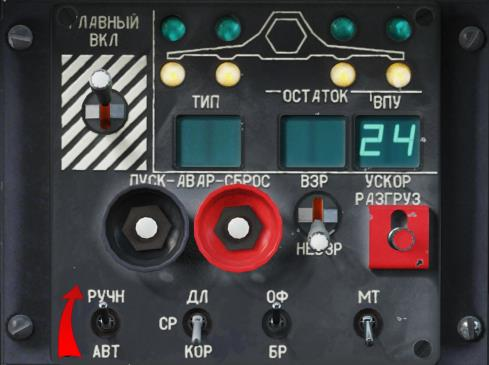

# Боевое применение

Полет в район боевых действий выполнять на наивыгоднейших режимах полета.

Подход к цели и выход на цель должны быть скрытными, с использованием рельефа
местности и препятствий. Хорошие результаты может дать действие из засад.

Маневрирование в районе цели выполнять на скоростях, с кренами и тангажами в
пределах установленных ограничений для вертолёта и на высотах, обеспечивающих
безопасность полета и защиту от противодействия ПВО.

Режимы и профили полета с применением оружия (высота, скорость, дальность,
углы крена и тангажа) выбираются в пределах установленных ограничений для
применяемого оружия.

Дальность визуального обнаружения днем малоразмерных наземных целей при максимальной дальности видимости равна 10-15 км. Распознавание типа цели с помощью комплекса И-251В «Шквал» – 5-10 км.

## Ограничения ПТУР «Вихрь»

Минимальная высота полета над рельефом местности по условиям загрузки летчика:

- На режиме висения – 10 м.
- В горизонтальном полете – 50 м.

На меньших высотах резко возрастает вероятность столкновения с землей или препятствиями в случае потери управления и дезориентации при активной работе с системой вооружения.

Максимальная барометрическая высота пуска ПТУР - 4000 м.

На высотах до 3000 м пуск ПТУР обеспечивается во всем диапазоне скоростей, в
том числе и на режиме висения.

Дальность пуска ПТУР:

- Минимальная – 800 м.
- Максимальная – 8000 м.

Угол поворота в вертикальной плоскости подвижного пускового устройства ракет
«Вихрь» составляет от минус 11°30’, до 0°. Поворот пускового устройства ПТУР с одновременным отклонением прицельной марки на ИЛС по углу места цели вниз обеспечивается только в основном режиме наведения ПТУР.

## Ограничения стрельбы из несъемной подвижной пушечной установки (НППУ)

Минимальная высота полета вертолёта над рельефом местности днем по условиям
загрузки летчика:

- На режиме висения – 10 м.
- В горизонтальном полете с использованием И-251В – 30 м.
- В горизонтальном полете без использования И-251В – 20 м.

Максимальная высота боевого применения – 5000 м.

Максимальная скорость горизонтального полета по прибору – 300 км/ч.

Минимальная дальность стрельбы из НППУ – 800 м.

Максимальная прицельная дальность стрельбы из НППУ – 2000 м.

Максимальные допустимые углы вертолёта:

- По крену - ±45°.
- По тангажу - ±60°.

## Ограничения НАР

Минимальная высота полета вертолёта над рельефом местности днем по условиям
загрузки летчика:

- В горизонтальном полете с использованием И-251В – 30 м.
- В горизонтальном полете без использования И-251В – 20 м.

Максимальная высота боевого применения – 4000 м.

Минимальная дальность пуска – 1000 м.

Максимальная прицельная дальность пуска – 2000 м.

Разрешенная дальность – 4000 м (без автоматического ввода поправок).

## Подготовка к боевому вылету

Для успешного выполнения боевого задания необходимо обеспечить надлежащую
подготовку к полету. Для этого необходимо:

- Изучить особенности задания на полет, возможные способы его выполнения, применяемое оружие, возможное противодействие.
- Уточнить маршрут и профиль полета.
- Проанализировать обстановку в районе цели, характеристики цели и прикрывающих средств ПВО.
- Откорректировать план полета в случае необходимости.
- Определить способы атаки цели и схемы повторных заходов.
- Определить порядок связи и способы взаимодействия.

## Полет в зону боевого соприкосновения

### Общие указания

Основным способом полета вертолёта или группы вертолётов в зону боевого соприкосновения является полет по запрограммированному в ПНК и систему АБРИС
маршруту.

Полет по маршруту выполнять на наивыгоднейших режимах. С целью скрытного
подхода к цели использовать предельно малые высоты.

При действиях в условиях быстро меняющейся обстановки при подходе к зоне боевого соприкосновения использовать доразведку с применением аппаратуры внешнего целеуказания (ВЦУ), а также самостоятельный поиск.

Проверить включение опции отображения тактической обстановки в системе АБРИС
(по умолчанию включена). Для этого нажать на АБРИС первую кнопку ОПЦИИ [[1]],
появится страница ОПЦИИ. Далее еще раз нажать первую кнопку – УСТАН [[1]], появится выпадающее меню. С помощью манипулятора курсора АБРИС или с помощью
кнопок стрелок ВВЕРХ [[2]] и ВНИЗ [[3]], выбрать пункт КАРТЫ и еще раз нажать
кнопку УСТАН [[1]]. После этого появится страница ОПЦИИ. Напротив позиции
ТАКТИКА должен стоять знак «+».

Включить режим НАВ (КАРТА) на АБРИС. Для этого нажать пятую кнопку НАВ [[5]].
Настроить масштаб карты на АБРИС. Для этого в режиме НАВ нажать кнопку КАРТА
[[2]], после этого кнопки [[3]] и [[4]] приобретут значения МСШТБ+ и МСШТБ-. С помощью этих кнопок настроить нужный масштаб и вернуться обратно в режим НАВ,
нажав на кнопку НАВ [[5]].

При подходе к району боевых действий:

-   Включить выключатель ГЛАВНЫЙ.
-   Установить необходимый режим применения оружия.
-   Установить выключатель ИЗЛ – ОТКЛ на ПВР в положение ИЗЛ.
-   Включить аппаратуру выброса ловушек УВ-26 и ввести необходимую программу выброса, исходя из предполагаемых угроз.
-   Произвести построение группы вертолётов, исходя из тактического замысла.

По окончании работы:

-   Выключить выключатель ГЛАВНЫЙ.
-   Проверить работу систем и оборудования.
-   Выполнить маневр ухода от цели и возвратиться на базу по запрограммированному маршруту.

### Ввод оперативных точек в ПрПНК

ПрПНК вертолёта имеет возможность хранить в памяти до 10 оперативных точек
(ОТ), которые могут являться целями или точками выхода.

В полете определение ОТ осуществляется двумя способами:

-   Пролетом вертолёта над ОТ с запоминанием координат в момент пролета.
В этом случае координаты цели соответствуют координатам вертолёта,
находящегося непосредственно над ОТ.
-   С помощью комплекса И-251В и лазерного дальномера (угломестный способ), когда определяется азимут-удаление до ОТ относительно собственных координат вертолёта.

#### Ввод ОТ методом пролета

-   Установить галетный переключатель ПВИ в положение ВВОД.
-   Установить переключатель И-251В – ПРОЛ [[RCtrl + V]] в положение ПРОЛ.
-   Нажать на ПВИ кнопку-табло ОТ [[RAlt + U]].
-   Присвоение номера ОТ осуществляется путем нажатия на цифровом
наборном поле ПВИ кнопки, соответствующей желаемому номеру вводимой ОТ.
-   В момент пролета над ОТ нажать кнопку ЦУ [[O]] на ручке ППУ, при этом
счисленные координаты вертолёта выводятся на табло ПВИ как координаты ОТ, на ИЛС индицируется разовая команда ОТ.
-   Нажать на ПВИ кнопку ВВОД [[RAlt + I]], при этом счисленные координаты
запоминаются как координаты ОТ. Разовая команда ОТ на ИЛС исчезает.
-   После ввода ОТ установить галетный переключатель ПВИ в положение
РАБ.

#### Ввод ОТ с помощью И-251

-   Убедиться, что выключатель ИЗЛ-ОТКЛ [[RShift + O]] на ПВР установлен в
положение ИЗЛ.
-   Установить галетный переключатель ПВИ в положение ВВОД.
-   Установить переключатель И-251В – ПРОЛ [[RCtrl + V]] в положение И251В.
-   Нажать на ПВИ кнопку-табло ОТ [[RAlt + U]].
-   Присвоение номера ОТ осуществляется путем нажатия на цифровом
наборном поле ПВИ кнопки, соответствующей желаемому номеру вводимой ОТ.
-   Нажать кнопку ЦУ [[O]] на ручке ППУ, при этом на телевизионном индикаторе появляется изображение.
- С помощью кнюппеля джойстика или клавиш управления [[ ‘]], [[,]], [[.]], [[/]]
совместить линию визирования с целью (ОТ) по ИЛС и обнаружить ее на
ИТ.
- На ИТ обрамить изображение цели прицельной рамкой переключателем
РАМКА на рычаге общего шага (РОШ) [[]], [[]] и нажать кнопку АЗ [[Enter]].
При этом на ИТ должна появиться индикация дальности до цели.
- Нажать кнопку ЦУ [[O]] на ручке ППУ, при этом счисленные координаты ОТ
выводятся на табло ПВИ, на ИЛС индицируется разовая команда ОТ.
- Нажать на ПВИ кнопку ВВОД [[RAlt + I]], при этом счисленные координаты
запоминаются как координаты цели. Разовая команда ОТ на ИЛС исчезает.
- После ввода ОТ установить галетный переключатель ПВИ в положение
РАБ. На ПВР нажать кнопку СБРОС [[Backspace]].

### Ввод типов целей и точек выхода

Включить выключатели ТЛК [[LCtrl + LShift + O]], УКВ-ТЛК [[LCtrl + LShift + P]] (пульт
правый боковой) и ВЦУ [[RCtrl + B]] (ПВИ).

Убедиться, что выключатель ИЗЛ-ОТКЛ [[RShift + O]] на ПВР установлен в положение
ИЗЛ.

Галетный переключатель КТО Я [[LCtrl + I]] на ПВЦ должен быть установлен в положение, соответствующее номеру вертолёта. Командир группы должен иметь номер
1.

Галетный переключатель РЕЖИМ [[LCtrl + M]] на ПВЦ установить на вертолёте командира в положение КОМ.

Определение координат цели (точки подхода) вертолётами Ка-50 осуществляется c
помощью комплекса И-251В и лазерного дальномера (угломестный способ), когда
определяется азимут-удаление до цели относительно собственных координат вертолёта.

После визуального обнаружения цели летчику необходимо:

- Нажать кнопку ЦУ [[O]] на ручке ППУ, при этом на телевизионном индикаторе появляется изображение.
- С помощью кнюпеля джойстика или клавиш управления [[ ‘]], [[,]], [[.]], [[/]]
совместить линию визирования с целью по ИЛС и обнаружить ее на ИТ.
- Провести распознавание и классификацию цели, переключившись в узкое
поле зрения [[=]].
- На ИТ обрамить изображение цели прицельной рамкой переключателем
РАМКА на рычаге общего шага (РОШ) [[]], [[]] и нажать кнопку АЗ [[Enter]].
- На ПРЦ нажать кнопку-табло, соответствующую наблюдаемому типу цели
или точки выхода [[LShift + 1…4]] (при этом включается ее подсвет).
- На ПРЦ нажать кнопку-табло ПРД/ПАМ [[LShift + U]] для запоминания координат цели (при этом происходит кратковременное включение ее
подсвета и выключение подсвета нажатой ранее кнопки типа цели. На
АБРИС появляется символ, соответствующий типу цели с присвоенным номером.
- На ПВР нажать кнопку СБРОС [[Backspace]], при этом происходит ориентирование линии визирования И-251В по продольной оси вертолёта.

### Передача цели ударным вертолётам

Запомненные координаты цели с вертолёта-разведчика передаются с помощью аппаратуры ВЦУ, при этом летчику вертолёта-разведчика необходимо:

- На ПРЦ нажать кнопку-табло типа цели:

     – подвижная малоразмерная цель, бронетехника [[LShift + 1]];

     – средства ПВО [[LShift + 2]];

     – прочие объекты [[LShift + 3]];
    
     – точки подхода к цели [[LShift + 4]]. При этом значок выбранной цели
начнет мигать на экране.

- Если в памяти системы находится несколько однотипных целей, то необходимо нажимать кнопку цели несколько раз, перебирая все однотипные
цели циклически и контролируя перебор по экрану системы АБРИС.
- На ПРЦ нажать кнопку-табло с номером вертолёта, которому адресовано
ЦУ [[LCtrl + 1…4]], или кнопку-табло ВСЕМ [[LCtrl + 5]] (подсвет кнопки включен).
- На ПРЦ нажать кнопку-табло ПРД/ПАМ [[LShift + U]] (подсвет кнопки включен).
- На дисплее АБРИС индицируется мигающий значок передаваемой цели.

В случае, если ударный вертолёт принял информацию от вертолёта-разведчика и
ответил ему, на ПРЦ последнего выключается подсвет указанных кнопок. При отсутствии «квитанции» о приеме начинается мигание подсвета кнопки ПРД/ПАМ. В этом
случае необходимо повторно нажать кнопку ПРД/ПАМ [[LShift + U]], при этом выключается подсвет кнопок ПРД/ПАМ, номера вертолёта и номера цели, прекращается
мигание символа цели на дисплее АБРИС. Если вместо номера вертолёта была
нажата кнопка ВСЕМ [[LCtrl + 5]], то после нажатия кнопки ПРД/ПАМ подсвет кнопок
выключается вне зависимости от получения квитанции о приеме.

В случае передачи координат определяемой цели другому вертолёту без их запоминания после взятия цели на автосопровождение комплексом И-251В необходимо
нажать кнопку-табло номера вертолёта [[LCtrl + 1…4]], которому передается местоположение цели, и нажать кнопку ПРД/ПАМ [[LShift + U]].

Для передачи запомненных координат оперативной точки на ударный вертолёт
необходимо:

- На ПВИ нажать кнопку-табло ОТ [[RAlt + U]] (загорается ее подсвет).
-   На ПВИ нажать кнопку-табло с цифрой, соответствующей номеру оперативной точки [[RAlt + 0…9]]. При этом загорается номер оперативной точки
на ПВИ, на дисплее АБРИС начинает мигать символ точки.
-   На ПРЦ нажать кнопку-табло назначенного типа цели или точки выхода
[[LShift + 1…4]] для этой ОТ (загорается подсвет нажатой кнопки).
-   Нажать кнопку-табло номера вертолёта [[LCtrl + 1…4]], которому адресуется передача (загорается подсвет нажатой кнопки).
-   Нажать кнопку-табло ПРД/ПАМ [[LShift + U]] (загорается подсвет нажатой
кнопки) для осуществления передачи.

После прихода «квитанции» о приеме подсвет указанных кнопок гаснет.

### Работа с ВЦУ при сближении ударного вертолёта с целью

Прием целеуказания ударным вертолётом осуществляется при установке галетного
переключателя на ПВЦ в положение ПРИЕМ, ВЕДОМ или КОМ [[LCtrl + M]].
При приеме информации от вертолёта разведчика (командира) о местоположении
цели на ударном вертолёте речевой информатор и УСТ выдают сообщение летчику
«Принять ЦУ».

Одновременно на ПРЦ включается мигающий подсвет кнопки-табло номера типа
цели или точки подхода и кнопки-табло с номером вертолёта, передающего информацию.
После приема информации в режиме ВЕДОМ происходит автоматическая выдача
«квитанции» на вертолёт, передавший координаты цели.

После приема целеуказания от вертолёта-разведчика летчик ударного вертолёта
имеет возможность запомнить принятую информацию. Для этого ему необходимо
нажать кнопку-табло типа цели [[LShift + 1…4]] (при необходимости изменить тип
цели), а затем кнопку ПРД/ПАМ [[LShift + U]] на ПРЦ (на дисплее АБРИС символы
принимаемой цели и вертолёта, передающего координаты цели, а также подсвет
кнопок-табло прекращает мигать).

При необходимости стирания информации с дисплея АБРИС необходимо:

-   Для стирания символа цели нажать нужное количество раз кнопку-табло
типа цели [[LShift + 1…4]] для выделения цели, затем кнопку-табло СТИР
[[LShift + T]].
-   Для стирания символа вертолёта, нажать кнопку-табло с номером вертолёта [[LCtrl + 1…4]], затем кнопку-табло СТИР [[LShift + T]].

### Автоматический выход на цель

При подходе к району боевых действий летчику ударного вертолёта для осуществления автоматического выхода на цель необходимо:

-   Нажать кнопку табло типа цели [[LShift + 1…4]] (перебором выбрать необходимую цель), при этом включается подсвет кнопки-табло типа цели, а
на дисплее АБРИС начинает мигать символ цели.
- Нажать кнопку-табло ВЫХОД [[LShift + Y]] на ПРЦ (при этом включается ее
подсвет, а подсвет кнопки-табло типа цели выключается), а также включить выключатель ЗК на ППР и установить переключатель СНИЖМАРШРУТ на РОШ в положение МАРШРУТ [[R]].
- Нажать кнопку-табло АДВ [[Q]] на ПВР (при этом происходит автоматизированный доворот вертолёта на цель, символ цели на дисплее АБРИС перестает мигать и обрамляется перекрестием).

Одновременно на ИЛС вместо шкалы курса индицируется шкала КУЦ и счетчик
дальности до цели, на которую производится выход, а на ПНП - пеленг на цель и
дальность до нее. При подлете к цели на удалении 8 км - нажать кнопку ЦУ [[O]],
приступить к обнаружению цели на ИТ-23. При необходимости включить режим сканирования повторным нажатием ЦУ [[O]].

При обнаружении цели необходимо слегка сдвинуть кнюппель джойстика или
нажать на любую управляющую клавишу [[;]], [[,]], [[.]], [[/]] (сканирование прекращается), обрамить цель [[]], [[]] и взять ее на сопровождение [[Enter]].

Снятие режима ВЫХОД осуществляется повторным нажатием кнопки ВЫХОД [[LShift + Y]].

### Управление ведомыми – задача «Разведка»

При необходимости командир группы может поставить задачу разведки для любого
ведомого в группе.

Для этого необходимо:

- Вызвать меню радиопереговоров [[ \ ]].
- Выбрать ведомого [[F2]], [[F3]], [[F4]].
- Вызвать меню разведки [[F9]].
- Выбрать в меню требуемую глубину разведки или направить ведомого на
переданную через канал ВЦУ точку.

После отдачи приказа вертолёт-разведчик начнет двигаться на малой высоте по
курсу игрока в режиме сканирования местности на указанную глубину.

При обнаружении цели вертолёт-разведчик будет передавать через аппаратуру ВЦУ
координаты и тип цели командиру группы.

### Поиск цели в режиме автоматического сканирования

При выполнении боевых и навигационных задач можно использовать режим автоматического сканирования оптической оси телевизионной системы И-251 (линии визирования) в секторе ±10° относительно первоначального курсового угла.

Включение сканирования:

- Нажать кнопку ЦУ [[O]] и навести в район поиска линию визирования с помощью кнюппеля МЕТКА [[;]], [[,]], [[.]], [[/]] на ручке ППУ.
- Включить сканирование, для чего повторно нажать кнопку ЦУ [[O]] на
ручке ППУ; при этом оптическая ось телевизионной системы И-251 и символ линии визирования на ИЛС начинают перемещение влево и вправо на
10° относительно начального положения линии визирования.
- Подобрать требуемую скорость сканирования установкой галетного переключателя СКАНИР [[LCtrl + LShift + M]] [[RAlt + LCtrl + M]]на правом пульте
(от 0,25 до 3-х градусов в секунду).

Далее необходимо контролировать перемещающуюся картинку местности на экране
телевизионного индикатора ИТ-23.

При обнаружении цели на ИТ-23 - остановить сканирование, тронув кнюппель [[;]],
[[,]], [[.]], [[/]] (при любом прикосновении к кнюппелю сканирование останавливается).

В случае необходимости выполнить опознавание цели, переключившись в узкое
поле зрения переключателем ШПЗ – УПЗ [[-]], [[=]] на РОШ.
Для продолжения поиска после остановки вновь нажать на кнопку ЦУ [[O]], при этом
сканирование возобновляется.

Перемещение зоны сканирования:

- Кнюппелем переместить символ линии визирования на ИЛС в район нового поиска, при этом сканирование останавливается.
- Включить сканирование новым нажатием на кнопку ЦУ [[O]], при этом сканирование возобновляется в секторе ±10° относительно вновь заданного
направления линии визирования.

Выключение режима сканирования происходит при нажатии кнопки СБРОС
[[Backspace]] на ПВР, при этом сканирование отключается и ось И-251 устанавливается в нулевом положении.

## Подготовка к применению оружия

Готовность системы управления оружием (СУО):

-  Пульт ПУИ. На индикаторе ОСТАТОК ВПУ высвечена информация о наличии боеприпасов к пушке. Высвечивается остаток снарядов в выбранной
ленте в десятках. Индекс «23» обозначает, что выбранная лента снаряжена 230 снарядами.
-  Пульт ПУИ. Под символом вертолёта высвечены нижние желтые светосигнализаторы наличия оружия на консолях крыла.
-  На индикаторе ТИП в зависимости от положения переключателя ВНЕШН
[[Y]] – ВНУТР [[I]] (на ручке общего шага) высвечена информация о типе
подвешенного оружия: НР (неуправляемые ракеты), ПС (противотанковые
снаряды), АБ (авиационные бомбы), СП (съемные пушки).

### Установка переключателей СУО при подготовке к пуску ПТУР

На пульте ПВР:

-  Галетный переключатель ОСН РЕЖ – положение, соответствующее варианту управления пуском. В случае полной функциональности комплекса ППУ. В случае неполной функциональности - НПУ или РУ.
-  Выключатель ИЗЛ – ОТКЛ (излучение – отключено) [[RShift + O]] в положение ИЗЛ.
-  Переключатель АС – ПМ (автоматическое сопровождение – прицельная
марка) [[P]] в положение АС.
-  Кнопка НПЦ (наземная подвижная цель) [[N]] нажата – включен подсвет
кнопки.

На ПУИ:

-  Переключатель АВТ – РУЧН (автомат – ручное) [[A]] в положение АВТ.
-  Переключатель ДЛ – СР – КОР (длинная – средняя – короткая) [[S]] в положение выбранного режима пуска. ДЛ и СР - залповый пуск двух ракет.
КОР – пуск одной ракеты.

Переключатель ВНЕШН – ВНУТР на рычаге общего шага в положение ВНЕШН, при
этом на ПУИ высветятся верхние зеленые светосигнализаторы о готовности к применению ПТУР.

Выключатель ГЛАВНЫЙ [[LAlt + W]] – включить.

### Установка переключателей СУО при подготовке к пуску НАР

На ПУИ:

-  Переключатель ДЛ – СР – КОР (длинная – средняя – короткая) [[S]] в положение выбранного режима пуска ракет:

    ДЛ – осуществляется пуск 10 ракет C-8 (половина боекомплекта) из каждого блока;

    СР – 5 ракет C-8 (четверть боекомплекта) из каждого блока;

    КОР – по одной ракете из каждого блока.

Положения других переключателей на ПУИ при пуске НАР не контролируются.

Выключатель ГЛАВН [[LAlt + W]] – включить.

На рычаге общего шага переключатель ВНЕШН – ВНУТР - в положение, соответствующее выбранным к применению блокам, при этом на ПУИ высветятся верхние
зеленые светосигнализаторы о готовности к применению выбранного оружия, а
также информация об остатке боекомплекта в выбранных блоках.

### Установка переключателей СУО при подготовке к стрельбе из пушки

На ПВР:

-  Галетный переключатель – в положение, соответствующее варианту применения пушки:

    ППУ – подвижная пушка;

    НПУ – неподвижная пушка.

-  Выключатель ИЗЛ – ОТКЛ (излучение – отключено) [[RShift + O]] в положение ИЗЛ (при стрельбе с измерением дальности).
-  Переключатель АС – ПМ (автоматическое сопровождение – прицельная
марка) [[P]] в положение АС с уточнением прицеливания и вычисления
точки упреждения или ПМ – без уточнения.
-  Кнопка НПЦ (наземная подвижная цель) [[N]] нажата – включен подсвет
кнопки.

На ПУИ:

-  Переключатель АВТ – РУЧН (автомат – ручное) [[A]] в положение выбранного варианта управления стрельбой:
АВТ – основной режим стрельбы с расчетом разрешенной дальности;
РУЧН – резервный режим без учета разрешенной дальности.
-  Переключатель ДЛ – СР – КОР (длинная – средняя – короткая) [[S]] в положение, соответствующие выбранному режиму стрельбы:
ДЛ и СР – длина очереди 20 выстрелов;
КОР – 10 выстрелов.
-  Переключатель МТ-БТ (малый темп – большой темп) в положение выбранного темпа стрельбы:

    МТ – 300 выстрелов в минуту;

    БТ – 600 выстрелов в минуту.

-  Переключатель ОФ – БР (осколочно-фугасные – бронебойные снаряды)
[[LCtrl + C]] в положение требуемого типа снарядов.

Выключатель ГЛАВН [[LAlt + W]] – включить.

### Установка переключателей СУО при подготовке к бомбометанию

Система управления оружием вертолёта Ка-50 не имеет режима расчета точки падания бомб. Применение бомбового вооружения производится глазомерно.

Положения переключателей на ПУИ при бомбометании не контролируются.

Выключатель ГЛАВН [[LAlt + W]] – включить.

На рычаге общего шага переключатель ВНЕШН [[Y]] – ВСЕ [[U]] – ВНУТР [[I]] - в положение, соответствующее выбранным к применению точкам подвески с бомбами или
КМГУ, при этом на ПУИ на индикаторе типа оружия высветятся АБ, верхние зеленые
светосигнализаторы о готовности к применению выбранного оружия, а также информация об остатке бомб или КМГУ.

### Установка переключателей СУО при подготовке к пуску УРВВ

На пульте ПВР:

-  Выбрать полусферу атаки цели, по умолчанию ЗПС. При выборе ППС
нажать кнопку [[LAlt + S]] – включен подсвет кнопки.
На ПУИ:
-  Переключатель АВТ – РУЧН (автомат – ручное) [[A]] в положение выбранного режима пуска – полуавтоматический или ручной.
На рычаге общего шага переключатель выбора подвесок в положение ПС ВОЗД
[[LCtrl + U]].

Выключатель ГЛАВНЫЙ [[LAlt + W]] – включить.

### Выключение режима применения оружия

Нажать на кнопку СБРОС [[Backspace]] на ПВР.

Убедиться в отключении табло ППУ (встроенная пушечная установка расстопорена),
если велась стрельба из подвижной пушки.

Выключатель ГЛАВН [[LAlt + W]] – выключить.

## Выход на цель в автоматическом режиме

Включить режим, для чего:

-   Установить выключатели и переключатели на ПВР и ПУИ в положение, соответствующее выбранному оружию, режиму и условиям его применения.
-   Нажать на кнопку АДВ (автоматический доворот) [[Q]] на ПВР.
-   Выключатель ОБЗ – ОТКЛ (обзор – отключен) [[H]] на ПВР установить в положение ОБЗ (в случае применения нашлемной системы целеуказания
НСЦ) или в положение ОТКЛ (без применения НСЦ).
-   Убедиться в том, что выключатель ИЗЛ – ОТКЛ (излучение – отключено)
[[RShift + O]] находится в положении ИЗЛ, а переключатель АС - ПМ (автоматическое сопровождение – прицельная марка) [[P]] - в положении АС.
-   Переключатель ШПЗ – УПЗ (широкое поле зрения – узкое поле зрения) на
ручке управления общим шагом установить в положение ШПЗ [[-]].
-   Проконтролировать появление в нашлемном устройстве (если применяется) и на ИЛС прицельной марки, а на ИТ – изображения местности, прицельной рамки и границ УПЗ. Одновременно на ИЛС и ИТ появляется соответствующая пилотажная информация и индикация положения линии визирования И-251.

### Визуальный поиск в режиме автоматического выхода на цель

Определить примерное расположение цели на местности и развернуть вертолёт на
цель, после чего:

-   Нажать кнопку ЦУ [[O]] на ручке ППУ и кнюппелем МЕТКА [[;]], [[,]], [[.]], [[/]]
наложить символ линии визирования по ИЛС на цель.
-   Перенести взгляд на ИТ, обнаружить изображение цели сначала в ШПЗ,
затем переключателем ШПЗ –УПЗ [[-]], [[=]] переключиться в УПЗ и распознать цель.
-   С помощью кнюппеля МЕТКА [[;]], [[,]], [[.]], [[/]] навести рамку на изображение
цели.
-   Произвести первичное обрамление цели с помощью переключателя
РАМКА М – Б [[]], [[]] на рычаге общего шага.
-   Контролировать автоматический доворот и устойчивость полета вертолёта
в направлении на цель.
-   В процессе сближения с целью (при необходимости) корректировать с помощью кнюппеля МЕТКА расположение цели в центре рамки на ИТ и уточнять ее обрамление.

### Визуальный поиск с целеуказанием от НСЦ в режиме автоматического выхода на цель

При подходе к району цели включить выключатель ОБЗ – ОТКЛ на ПВР, после чего:

-   Определить район цели, поворотом головы навести на него нашлемное
визирное устройство (НВУ), нажать кнопку ЦУ [[O]] на ручке ППУ, при этом
на НСЦ появляется сигнал ОТРАБОТКА (две концентрические окружности
и мигающее перекрестие); удерживать кнопку до появления на НВУ сигнала «отработка И-251 выполнена» (две концентрические окружности и
перекрестие индицируются устойчиво), после чего отпустить ее. В момент
нажатия кнопки ЦУ включается автоматический доворот на цель. На ИЛС
индицируется пилотажно-навигационная информация, символ линии визирования перемещается в район цели и совмещается с прицельной маркой
НСЦ.

    Если в момент нажатия кнопки ЦУ углы НСЦ меньше максимальных углов отклонения И-251, происходит разарретирование И-251 и отработка им углов НСЦ.

    Если в момент нажатия кнопки ЦУ углы НСЦ больше максимальных углов И-251, то
происходит разарретирование И-251 и отработка им максимального значения курсового угла в сторону цели; на нашлемном визирном устройстве появляется сигнал
«доворот» (две мигающие концентрические окружности и мигающее перекрестие).

    Выполняется автоматизированный доворот вертолёта в сторону цели. При вхождении цели в зону обзора И-251 сигнал «доворот» в НСЦ снимается, а линия визирования следит за прицельной маркой НСЦ, совмещенной с целью. Вертолёт продолжает автоматизированный разворот продольной осью на цель.

-   Сопровождать цель прицельной маркой НСЦ и удерживать кнопку ЦУ [[O]]
нажатой до появления сигнала «отработка И-251 выполнена», после чего
кнопку ЦУ [[O]] отпустить, при этом символ линии визирования на ИЛС
грубо совместится с целью.
-   В случае отпускания кнопки ЦУ [[O]] в процессе доворота, доворот будет
осуществляться на последнюю запомненную точку целеуказания.
-   При необходимости корректировать доворот вертолёта вручную.
-   Убедиться по ИЛС, что символ линии визирования совмещен с целью, перенести взгляд на ИТ, обнаружить изображение цели сначала в ШПЗ, затем переключателем ШПЗ –УПЗ [[-]], [[=]] переключиться в УПЗ и распознать
цель.
-   Произвести первичное обрамление цели с помощью переключателя
РАМКА М – Б [[]], [[]] на рычаге общего шага.
-   Контролировать автоматический доворот и устойчивость полета вертолёта
в направлении цели.
-   В процессе сближения с целью корректировать (при необходимости) с помощью кнюппеля МЕТКА расположение цели в центре рамки на ИТ и уточнять ее обрамление.

## Применение оружия в режиме автоматического управления

### Пуск и наведение ПТУР

При выходе на боевой курс уточнить наводку оптико-телевизионной оси И-251 на
цель:

-   Отклонением кнюппеля МЕТКА [[;]], [[,]], [[.]], [[/]] на ручке ППУ уточнить
наводку мушки рамки по ИТ на цель, а переключателем РАМКА М-Б [[]], [[]]
на ручке общего шага скорректировать размер рамки по контуру цели.
-   По уточнению наводки нажать кнопку АЗ [[Enter]] на ручке общего шага.
Корректировка положения рамки после этого возможна только при нажатой кнопке АЗ [[Enter]].
-   При появлении символа ТГ с индикацией дальности до цели отпустить
кнопку АЗ [[Enter]], при этом на ИТ должен появиться символ ТА (телеавтомат активен), на ИЛС – символ ТА-ИД (телеавтомат – индикация дальности), а также кольцо со шкалой дальности, обозначающее зону встреливания ПТУР.
-   В процессе сближения с целью отслеживать по индикации на ИЛС приближение к разрешенной дальности пуска, по ИТ контролировать устойчивость захвата и, при необходимости, зажав кнопку АЗ [[Enter]], кнюппелем
МЕТКА [[;]], [[,]], [[.]], [[/]] корректировать положение рамки на цели. После выполнения коррекции вновь включить режим АС, отпустив кнопку АЗ
[[Enter]].

При подходе к разрешенной дальности пуска:

-   Маневром вертолёта наложить кольцо зоны встреливания ПТУР на цель
(совместить кольцо встреливания с линией визирования), удерживать это
положение до пуска ПТУР и в течение 1 секунды после ее пуска.
-   При необходимости осуществлять коррекцию положения рамки на цели.

При высвечивании символа «С» (выход на разрешенную дальность стрельбы):

-   Зажать гашетку на ручке ППУ и удерживать ее до схода ПТУР (1-2 секунды).
-   После схода контролировать включение лазерно-лучевого канала управления (ЛЛКУ) по смене на ИЛС символа ТА-ИД на ТА-ИУ и индикацию времени до конца атаки с момента пуска ПТУР.
-   При необходимости осуществлять коррекцию положения рамки на цели.
-   При отвороте вертолёта в процессе полета ракеты к цели с выходом линии визирования (цели) из поля зрения ИЛС на нем появляется рамка
(зона прокачки И-251) с индикацией линии визирования в масштабе этой
рамки. При приближении линии визирования к границе зоны прокачки за
5° символ линии визирования и символы угловых положении линии
визирования на ИТ начинают мигать. При этом маневром вертолёта необходимо осуществить доворот в сторону цели, не позволяя линии визирования выйти за пределы зоны прокачки И-251, и устранить мигание.
-  Признаками окончания атаки являются: поражение цели, индикация времени конца атаки (равного расчетному времени полета ракеты плюс шесть
секунд запаса), появление запрещающего креста на ИЛС. После окончания атаки выполнить отворот от цели.

### Последовательность действий летчика при пуске ПТУР

#### Подход к району цели

Действия летчика:
Выбрать оружие – ПТУР.

Рычаг ОШ:

-  переключатель выбора оружия – внешняя подвеска [[Y]]. На ПУИ - индикация ПТУР (12) и тип (ПС);
-  переключатель поля зрения – узкое поле зрения [[=]]. На ИТ - узкое поле
зрения (УПЗ) – 0,7° х 0,9°.

ПУИ:

-  ДЛ – СР – КОР в положение КОР [[S]]. Пуск одной ПТУР;
-  РУЧН – АВТ в положение АВТ [[A]];
-  ГЛАВНЫЙ – включить [[LAlt + W]].

Подготовить режим НСЦ.

На ПВР включить:

-  ОБЗ [[H]]. На нашлемном визирном устройстве (НВУ) - прицельная марка
НВУ.
-  ИЗЛ [[RShift +O]]. Снимается блокировка включения лазерного дальномера.
-  НПЦ [[N]]. Прицеливание по наземной подвижной цели.
-  АДВ [[Q]]. Выдача автопилоту готовности для автоматизированного доворота на цель.

На ПУР:

-  Соответствующим потенциометром на ПУР настроить яркость прицельной
марки НВУ.
-  Соответствующими потенциометрами на ПУР настроить яркость и контрастность изображения на ИТ.
-  ОГР ИНФ – ПОЛН [[RCtrl + S]]. Включить требуемый режим вывода информации на ИЛС и ИТ. В положении ОГР ИНФ крен, тангаж, скорость и индекс ЛА на ИЛС и ИТ не индицируются.

Индикация на ИЛС и ИТ:

- На ИЛС - пилотажно-навигационная информация. При высоте менее 50
метров - шкала высоты.
- На нашлемном устройстве - прицельная марка НВУ.

    

#### Обнаружение района цели

Курсовой угол цели более 30°. Доворот. Начало предварительного наведения на
цель.

Поворотом головы навести прицельную марку НВУ на цель. Нажать и удерживать
кнопку ЦУ [[O]] на ручке ППУ.

На нашлемном визирном устройстве при курсовом угле цели (КУЦ) более 30° - сигнал «доворот».

На ИТ – телевизионное изображение местности по курсу полета с кратностью увеличения при УПЗ – 23х, ШПЗ – 7х.

На ИЛС - прямоугольное поле отклонения линии визирования в уменьшенном масштабе, по вертикали +10°…-85°, по горизонтали ±30°, для индикации относительного положения линии визирования. Также вместо шкалы курсов появляется шкала
КУЦ (±30°) с символом курсового угла цели.

Вертолёт начинает автоматизированный доворот в сторону цели.

#### Автоматизированный доворот вертолёта на цель

В процессе разворота поворотом головы удерживать прицельную марку НВУ на
цели.

При КУЦ менее 30° разарретируется гиростабилизатор ШКВАЛ, на ИЛС исчезает
прямоугольная рамка относительного положения линии визирования и начинает индицироваться истинное положение линии визирования. Телевизионная система отрабатывает курсовой и вертикальный углы наведения.

При появлении на НВУ сигнала ОШ (отработка ШКВАЛА отпустить кнопку ЦУ [[O]].

При окончании отработки комплексом И-251 углов нашлемной системы целеуказания на НВУ появляется сигнал ОШВ/ЗАХВАТ. Цель находится в зоне обзора на ИТ.

Дальнейшее управление линией визирования производить кнюппелем на ручке ППУ
[[;]], [[,]], [[.]], [[/]].

Продолжение автоматизированного доворота на цель до курсового угла - 0° (±5°).
Индекс курсового угла цели на ИЛС начинает отслеживать текущий курсовой угол
цели.

#### Вывод из разворота, обнаружение цели на ИТ

Убедиться, что цель находится в поле зрения ИЛС. На ИЛС - курсовой угол цели
±5°.

Обнаружить и распознать цель на ИТ в узком поле зрения. В случае отсутствия цели
на ИТ, переключиться в широкое поле зрения, обнаружить цель, навести центр
поля обзора на цель и переключиться в узкое поле зрения.

#### Захват цели на автосопровождение

Обрамить цель прицельной рамкой переключателем РАМКА Б – М [[]], [[]] на РОШ.

При появлении символа ТГ (телеавтомат готов) на ИТ - нажать кнопку АЗ [[Enter]].

Отпустить кнопку АЗ после появления индикации дальности до цели.

При нажатии кнопки АЗ [[Enter]] происходит включение лазерного дальномера на
время около 3-х секунд, на ИЛС появляется символ ИД и индицируется обратный
отсчет времени до окончания цикла дальнометрирования.

Признак включения автосопровождения цели – появление на ИЛС и ИТ символа автосопровождения ТА (телеавтомат активен), появление счетчика дальности до
цели, появление на ИЛС зоны встреливания с указанием текущей, разрешенной и
минимальной дальности пуска.

1.   Текущая дальность.
2.   Разрешенная дальность.
3.   Минимальная дальность.

На НВУ – сигнал автосопровождения цели.

1.     Символ ТА-ИД (телеавтомат активен – измерение дальности).
2.     Счетчик дальности до цели (в километрах).
3.     Символ ТГ (телеавтомат готов) меняется на символ ТА (телеавтомат активен).
4.     Индикация на НВУ

#### Прицеливание

При подлете на разрешенную дальность пуска произвести прицеливание – маневром вертолёта совместить и удерживать прицельную марку (зону встреливания) с
линией визирования, совмещенной с целью.

При окончании прицеливания символ ЛВ, совмещенный с целью, должен находиться внутри окружности зоны встреливания.

При текущей дальности до цели в пределах разрешенной дальности пуска, а также
при отсутствии угловых перемещений вертолёта более 3 градусов в секунду, на ИЛС
и ИТ появляется символ «С» - разрешение пуска, а на НВУ - сигнал ПУСК
РАЗРЕШЕН.

#### Пуск ПТУР

С появлением символа «С» убедиться в наличии символа ТА на ИТ и произвести
пуск – нажать и удерживать гашетку «огонь» на ручке ППУ до схода ПТУР [[RAlt + Space]].

При нажатии на гашетку включается лазерно-лучевой канал управления (ЛЛКУ)
ПТУР.

#### Наведение ПТУР на цель

После схода ПТУР пилотировать вертолёт так, чтобы линия визирования не выходила за пределы углов прокачки И-251. Избегать перемещений вертолёта с большими угловыми скоростями во избежание вылета ракеты из канала наведения.

- На ИЛС - прицельная марка с индикацией текущей дальности до цели и
отметкой минимальной дальности пуска.
- Появление символа ТА-ИУ (работа ЛЛКУ при телеавтосопровождении
цели).
- Включается излучение в ЛЛКУ.
- Включается программный механизм в ЛЛКУ.
- На ИЛС и ИТ включается индикация оставшегося времени полета ПТУР с
запасом (плюс) в 6 секунд.

Маневром вертолёта устранять приближение линии визирования к границе зоны
прокачки. В этом случае при приближении индекса ЛВ к границе зоны углов прокачки И-251 «Шквал» на величину менее 5° индекс линии визирования на ИЛС и индексы углов на ИТ начинают мигать.

1.   Индикация оставшегося времени полета ПТУР с запасом в 6 секунд.
2.   Прицельная марка со шкалой дальности на ИЛС.
3.   Мигающий индекс курсового угла на ИТ.
4.   Индикация на НВУ.

#### Конец атаки. Отворот

При подрыве ПТУР, приближении к цели на минимальную дальность пуска по прицельной марке - нажать кнопку СБРОС [[Backspace]] на ПВР и произвести отворот
(уход) от цели.

На ИЛС и ИТ появляется сигнал запрета – мигающий крест.

После нажатия кнопки СБРОС арретируется И-251, выключаются телеавтомат (ТА) и
ЛЛКУ, сбрасывается код выбранного оружия, ПрПНК переходит в режим навигации.

### Стрельба из подвижной пушки в режиме АС

Выбрать пушку [[C]]. При этом на ИЛС появится изображение зоны допустимых границ отклонения пушки – «ворота».
Маневром вертолёта ввести цель в границы отклонения пушки.

По ИТ уточнить наводку оптико-телевизионной оси И-251 на цель. Удерживать символ линии визирования в пределах границ отклонения пушки.

При подлете на разрешенную дальность стрельбы (максимальная прицельная дальность 2000 м) и наличии разрешения стрельбы – символа «С» нажать гашетку
пушки [[Space]]. Удерживать гашетку нажатой до окончания очереди. Для продолжения стрельбы отпустить и снова нажать гашетку.

Если на ИЛС включается мигание границ отклонения пушки, сигнализирующее о достижении предельных углов ее отклонения, при которых не проходит сигнал от гашетки и прекращается стрельба - следует выполнить маневр для ввода линии визирования (цели) в границы зоны допустимых углов отклонения пушки.

При поражении цели или при появлении сигнала запрета стрельбы (большой знак
«Х») - выйти из атаки.

1.       Телеавтомат активен (цель сопровождается).
2.       Символ разрешения стрельбы «С».
3.       Указатель текущей скорости.
4.       Дальность до цели.
5.       Текущая геометрическая высота.
6.       «Ворота» - зона допустимых отклонений пушки.
7.       Прицельная марка со шкалой дальности, наложенная поверх линии визирования цели.

### Пуск НАР и стрельба из неподвижной пушки в режиме АС

Для включения режима стрельбы из неподвижного оружия необходимо галетный
переключатель на пульте ПВР (левая панель) установить в положение НПУ (неподвижная пушечная установка).

При ведении огня из неподвижного оружия в режиме автосопровождения необходимо:

-     Уточнить наводку оптико-телевизионной оси И-251 на цель.
-     При подходе к разрешенной дальности пуска (стрельбы) маневром вертолёта наложить прицельную марку (ПМ) ИЛС на линию визирования (цель).

    Удерживать ПМ на цели до открытия огня.

-     С высвечиванием символа «С» (разрешение огня) нажать гашетку ПУСК
[[RAlt + Space]] или нажать гашетку стрельбы [[Space]], при этом произойдет
стрельба согласно выбранному режиму.
-     При поражении цели или при появлении сигнала запрета стрельбы (большой знак «Х») - выйти из атаки.

1.       Телеавтомат активен (цель сопровождается).
2.       Символ разрешения стрельбы «С».
3.       Указатель текущей скорости.
4.       Дальность до цели.
5.       Текущая геометрическая высота.
6.       Индекс линии визирования цели.
7.       Прицельная марка со шкалой дальности.

## Стрельба из неподвижной пушки и пуск НАР без использования режима автосопровождения

Стрельба из неподвижного оружия без использования режима автосопровождения
цели возможна с использованием прицельной марки с замером дальности, а также
без замера дальности по прицельной сетке ИЛС.

### Стрельба из пушки и пуск НАР с измерением дальности

После подготовки СУО к ведению огня на пульте ПВР переключатель АС - ПМ установить в положение ПМ (прицельная марка) [[P]].
На ИЛС появится прицельная марка (ПМ), совмещенная с оптической осью лазерного дальномера.

1.       Прицельная марка.
2.       Указатель текущей скорости.
3.       Текущая геометрическая высота.
4.       Цель.

Маневром вертолёта совместить ПМ с целью и нажать кнопку АЗ [[Enter]] (замерить
дальность), после появления на ПМ сектора-шкалы текущей дальности – кнопку отпустить. После замера дальности ПМ отстраивается (перемещается) в точку падения снарядов (НАР). На ИЛС высвечивается обратный счетчик времени, до обнуления которого запрещается повторное нажатие АЗ.

1.       Символ разрешения стрельбы «С».
2.       Указатель текущей скорости.
3.       Обратный счетчик времени до разрешения на повторное нажатие АЗ.
4.       Дальность до цели.
5.       Геометрическая высота.
6.       Цель.
7.       Прицельная марка со шкалой текущей дальности.
8.       Команда «ПАУЗА» - запрет на нажатие АЗ.

Повторным маневром вертолёта совместить ПМ с целью, на разрешенной дальности
при появлении символа «С» - нажать гашетку пушки [[Space]] или гашетку подвесного оружия [[RAlt + Space]].

### Стрельба из пушки и пуск НАР с использованием прицельной сетки

После подготовки СУО к ведению огня, галетный переключатель на ИЛС переключить в положение СЕТКА.
Маневром вертолёта ввести цель в поле сетки на ИЛС с учетом поправок и нажать
гашетку пушки [[Space]] или гашетку подвесного оружия [[RAlt + Space]].

Направление выноса перекрестия сетки от цели:

-     При учете поправки на скорость ветра – в сторону против ветра;
-     При учете скорости движения цели – в сторону движения цели.

1.   Курсовая черта (продольная ось вертолёта).
2.   Отметка (перекрестие), соответствующая направлению строительной горизонтали фюзеляжа вертолёта (СГФ).
3.   Отметка (перекрестие), соответствующая вертикальному углу (углу места)
от СГФ минус 2° и курсовому углу 3°.
4.   Перекрестие, соответствующее центральной линии визирования ИЛС (минус 2° от СГФ).
5.   Отметка, соответствующая вертикальному углу плюс 1° от СГФ.
6.   Оцифровка отметок в десятках тысячных долей.

## Применение бомбового вооружения

Применение бомбового вооружения на вертолёте возможно глазомерным способом:

- Построить маневр вертолёта прямо на цель без крена и скольжения на
безопасной высоте не менее 200 м в случае применения фугасных авиабомб (на высоте менее 200 м сброс блокируется). В случае применения
КМГУ минимальная высота не ограничивается.
- В зависимости от скорости и высоты полета глазомерно рассчитать момент
сброса, нажать и удерживать гашетку подвесного оружия [[RAlt + Space]].

Следует учитывать, что с момента нажатия гашетки до начала сброса суббоеприпасов из КМГУ проходит около 1,5 с.

## Применение целеуказательных НАР С-8ЦМ

Целеуказательные, маркерные НАР С-8ЦМ предназначены для повышения эффективности действия ударных ЛА за счет целеуказания (маркирования) наземных объектов. Боевая часть таких ракет содержит корпус, контейнер, обтекатель, поршень.

В контейнере расположен дымовой элемент с установленным в нем замедлителем и
вышибным зарядом. При падении на землю образуют хорошо заметное облако
дыма, маркируя цель или точку поверхности.

Применение этих ракет ничем не отличается от применения фугасных НАР и возможно из режимов с измерением дальности или ручном режиме.

Пускать ракеты рекомендуется в режиме короткой очереди, на пульте ПУИ переключатель режима применения оружия в положении КОР. При этом в каждом залпе
будет расходоваться 2 ракеты.

## Применение осветительных НАР С-8О (ОМ)

Осветительные ракеты С-8О (ОМ) предназначены для повышения эффективности
действия авиации и других родов войск в ночных условиях. Боевая часть таких ракет включает в себя парашютную систему, осветительный факел, взрыватель, замедлитель и воспламенитель. Через 17 секунд после пуска ракеты срабатывает воспламенитель осветительного факела, факел отделяется от ракетной части и вводится в действие парашютная система. Горящий факел опускается на парашюте,
освещая местность в течение 35 секунд, со средней скоростью снижения 8,2 м/с.

После пуска, за 17 секунд до отделения осветительного факела, ракета пролетает
около 7 км. Это стоит учитывать в расчете точки прицеливания.

Для создания оптимальных условий освещения цели необходимо пустить ракеты с
таким расчетом, чтобы факел отделился от ракеты прямо над целью на высоте от
500 до 1000 метров.

Для этого необходимо из заранее рассчитанной точки, за 7 км до цели, пустить ракеты с углом кабрирования 15…20 градусов в направлении цели.

Пускать ракеты рекомендуется последовательно, в режиме короткой очереди, на
пульте ПУИ переключатель режима применения оружия в положении КОР. При этом
в каждом залпе будет расходоваться 2 ракеты.

## Особенности прицеливания и применения оружия по воздушным целям

Прицеливание по ВЦ возможно при условии наличия достаточной контрастности
цели и фона, при этом на дальностях до цели более 1500 м целесообразно применять ПТУР, на дальностях менее 1500 м – пушку.

Пуск ПТУР и стрельбу из пушки осуществлять в режиме автосопровождения (АС)
при подвижной пушке (режим ППУ).

Для активации дистанционного взрывателя ПТУР, который будет срабатывать в случае пролета ракеты на небольшом расстоянии от цели - на пульте ПВР включить
кнопку ВЦ.

В зависимости от полусферы атаки воздушной цели необходимо настроить задержку
взрывателя ПТУР:

- Если атака производится вдогон или на боковых ракурсах, настройка не
требуется.
- Если атака производится в ППС (цель летит навстречу), необходимо
уменьшить задержку дистанционного взрывателя для более надежного поражения – на пульте ПВР включить кнопку ППС.

При значительных угловых перемещениях цели (прицеливание под большими ракурсами) маневром вертолёта удерживать цель в поле зрения ИЛС.

При взятии на автосопровождение цель на телевизионном индикаторе обрамлять
полностью, чтобы в рамку входили все видимые элементы.

При выполнении прицеливания и стрельбы из НППУ на пикировании учитывать скоротечность режима пикирования, особенно при достижении углов тангажа, близких
к максимально допустимым (-60°) из-за быстрого нарастания приборной скорости
вертолёта (прирост скорости составляет около 30 км/ч за секунду). Углы тангажа на
пикировании выдерживать в пределах ограничений, учитывая потерю высоты вертолётом при выводе из пикирования, не допуская выхода вертолёта за ограничения
по скорости полета.

При выполнении прицеливания и стрельбы из НППУ на кабрировании учитывать интенсивность падения приборной скорости, особенно при достижении углов тангажа
близких к максимально допустимому (+60°), которая может составлять около 40
км/ч за секунду. При этом рекомендуемые углы тангажа выдерживать в зависимости
от скорости вертолёта в начале выполнения горки, не допуская падения скорости
на выходе из горки менее 50 км/ч по прибору.

При стрельбе в основном режиме (пушка подвижна) и выполнении вертикального
маневра следить по ИЛС за нахождением ЛВ в пределах зоны пушки по верхнему и
боковым пределам, а по ИТ – по нижнему пределу ее отклонения.

В силу большой разницы в скоростях атака самолетов может вестись только на
встречных и встречно-пересекающихся курсах, что при крайнем дефиците времени
является трудной задачей.

В случае позднего обнаружения атаки самолета наиболее простым и быстрым способом обороны является стрельба из пушки «навскидку» по неподвижной сетке
прицела.

## Применение УРВВ «Игла»

Для применения УР «Игла» летчик с помощью кнюппеля выбора подвесок на РОШ
вызывает режим ПС ВОЗД [[LCtrl + U]].

На пульте ПВР автоматически включится подсвет кнопки-табло ВЦ (воздушная
цель) [[V]], указывающий на работу режима.

1.       Кнопка-табло ВЦ [[V]]. Задание признака воздушной цели.
2.       Кнопка-табло ППС [[LAlt + S]].
3.       Кнопка-табло СБРОС [[Backspace]]. Сброс задачи.

На ИЛС появится кадр ИГЛА с прицельной маркой (ПМ), с индексами типа авиационного средства поражения (АСП) на пилонах, индикацией количества имеющихся
ракет и командой «НАКОЛИ НИП».

1.       Прицельная марка (ПМ).
2.       Тип и количество АСП (ракет).
3.       Индексы пилонов, на которых подвешены АСП.
4.       Команда «НАКОЛИ НИП» указывает летчику задействовать источники питания, для задействования ракеты.
5.       Полусфера атаки цели (ЗПС).
6.       Индекс выбранных АСП на пилонах.

Прицельная марка отображает зону захвата ГСН ракеты с углом поля зрения 1°, до
момента захвата цели. ПМ располагается в нулевой точке ИЛС, по строительной
оси.

НИП – наземный источник питания, сохранивший название от наземного ПЗРК. В
данном контексте на слово «наземный» не стоит обращать внимание. «Накол НИП»
термин также пришедший из ПЗРК, когда специальная тяга накалывает мемебрану
баллона с азотом и давит на боек батареи для задействования НИП.

НИП выполняет следующие функции:

1.       Снабжение сжатым азотом ГСН ракеты для охлаждения.
2.       Обеспечиение ракеты электроэнергией в период подготовки к пуску.

Один НИП работает в течение 30 секунд. К каждой ракете подключены два НИП, задействуемых последовательно, что дает суммарное время на подготовку и прицеливание до 55 секунд. В случае если летчик выполнит сброс задачи кнопкой СБРОС,
до момента задействования второго НИП, при остатке времени более 30 секунд,
есть возможность задействовать ракету повторно со вторым НИП, но уже с ограничением времени 25 секунд.

После расхода обоих НИП ракета обесточивается и больше не может быть использована.

!!! attention
    Суммарное время прицеливания ограничено временем работы НИП, летчику нужно
    успеть за 55 секунд выполнить прицеливание и произвести пуск ракеты.

Для задействования УР «Игла» летчику необходимо однократно нажать на гашетку
РС подвесного оружия [[RAlt + Space]] на РППУ. При этом происходит задействование
НИП, подача электропитания и хладагента на ракету. На ИЛС исчезает команда
«НАКОЛИ НИП».

Для отказа от применения УР летчик нажимает на кнопку СБРОС [[Backspace]] на ПВР
и выходит из режима боевого применения.

### Пуск УРВВ «Игла» в полуавтоматическом режиме

Применение УР «Игла» возможно в двух режимах пуска – полуавтоматическом и
ручном. Выбор режима пуска задается переключателем РУЧН - АВТ [[A]] на пульте
ПУИ (центральный пульт).

По умолчанию включен режим полуавтоматического пуска. В этом режиме разарретирование ГСН происходит автоматически после накалывания наземного источника
питания (НИП).

Режим применения УР «Игла» включается расположенным на РОШ кнюппелем выбора подвесок. Клавишами [[LCtrl + U]] выполните нажатие кнюппеля вверх в позицию ПС ВОЗД. После включения режима на ИЛС появляется индикация прицельной
марки, сигнал «НАКОЛИ НИП», индикация типа и количества ракет «ИГЛА 4» и признак полусферы атаки ЗПС.

Для накалывания НИП необходимо однократно нажать на РППУ гашетку подвесного
оружия РС [[RAlt + Space]]. На ИЛС выдается индикация задействованной первой ракеты из четырех.

Через 5 секунд, после раскрутки гироскопа, а также охлаждения ГСН поступившим
хладагентом, на ИЛС вместо «НАКОЛИ НИП» индицируется признак «ГОТОВ» и
отображается обратный отсчет времени до окончания боевого цикла работы. Время
боевого цикла одной ракеты не может превышать 55 сек. при наличии двух НИП на
МУП (модуль универсальный пусковой).

1.    Признак «ГОТОВ».
2.    Обратный счётчик времени боевого цикла задействованной ракеты.

Пока идет обратный отсчет времени необходимо навести и удерживать ПМ на цели.
В случае наличия в зоне цели с приемлемым уровнем ИК излучения захват цели
происходит в течение 1-2 секунд.

После захвата цели на ИЛС индицируется признак «С» (стреляй), надпись «ГОТОВ»
гаснет. Обратный отсчёт времени боевого цикла задействованной ракеты продолжает отображаться. Размер зоны захвата на ИЛС увеличивается до 4°. Прицельная
марка, крестик размером 0,6°, перемещается в зависимости от положения оптической оси ГСН ракеты.

Для пуска ракеты необходимо второй раз нажать на РППУ гашетку подвесного оружия РС [[RAlt + Space]], после чего происходит сход ракеты.

1.    Признак разрешения стрельбы «С».
2.    Обратный счётчик времени боевого цикла задействованной ракеты.
3.    Прицельная марка (положение оптической оси ГСН ракеты).
4.    Зона захвата ИК излучения цели.

В случае выхода цели за пределы зоны захвата или ручного сброса захвата цели
кнопкой СБРОС [[Backspace]] на пульте выбора режимов (ПВР), индикация «С» меняется на «ГОТОВ» со сбросом зоны захвата обратно до 1°. Необходимо заново маневром вертолета совместить ПМ на ИЛС с целью и дождаться захвата ГСН ракеты.

После истечения времени боевого цикла 55 секунд, в случае если ракета не была
запущена, СУО автоматически выбирает следующую ракету и заново индицирует
сигнал «НАКОЛИ НИП». Индикация на ИЛС ракеты с оконченным временем боевого
цикла пропадает. Активной становится следующая ракета.

В случае повторной атаки цели необходимо выполнить все действия сначала. Если
задача выполнена, нажатием на кнопку СБРОС [[Backspace]] на ПВР выполнить выход
из режима боевого применения УРВВ.

### Режим ручного пуска

Включить режим ручного пуска переключателем РУЧН - АВТ [[A]] на пульте ПУИ (центральный пульт) в положение РУЧН.

Режим ручного пуска отличается от полуавтоматического только тем, что перед захватом цели летчику требуется самому разарретировать ГСН ракеты нажатием
кнопки АВТ ЗАХВ [[Enter]] на РОШ, после чего на ракету выдается команда разрешения захвата цели.

{!docs/ka50/abbr.md!}
{!dev-docs/ka50/abbr.md!}
