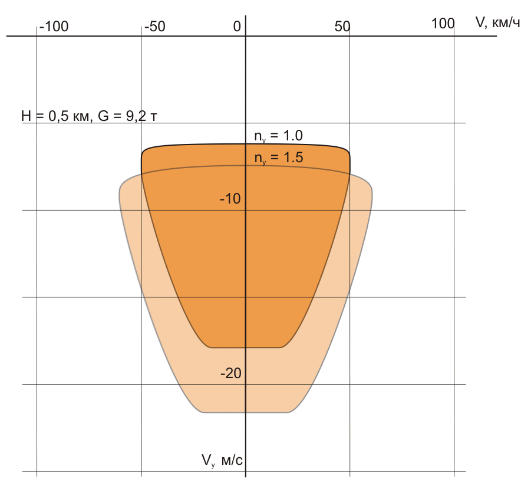
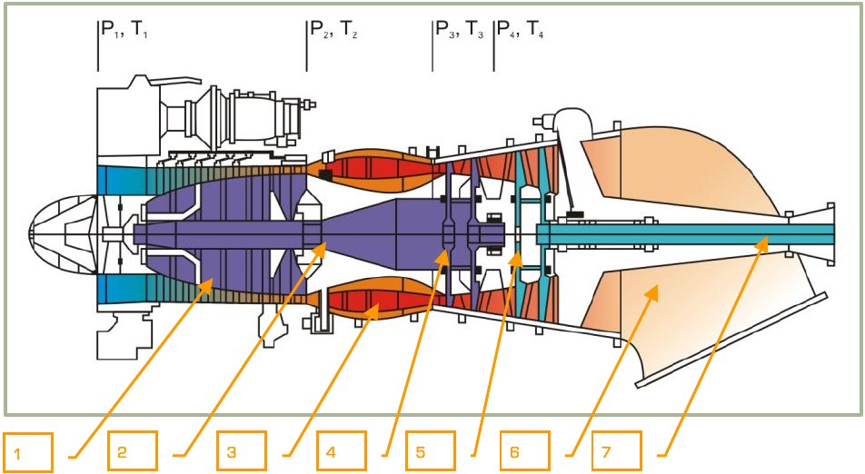
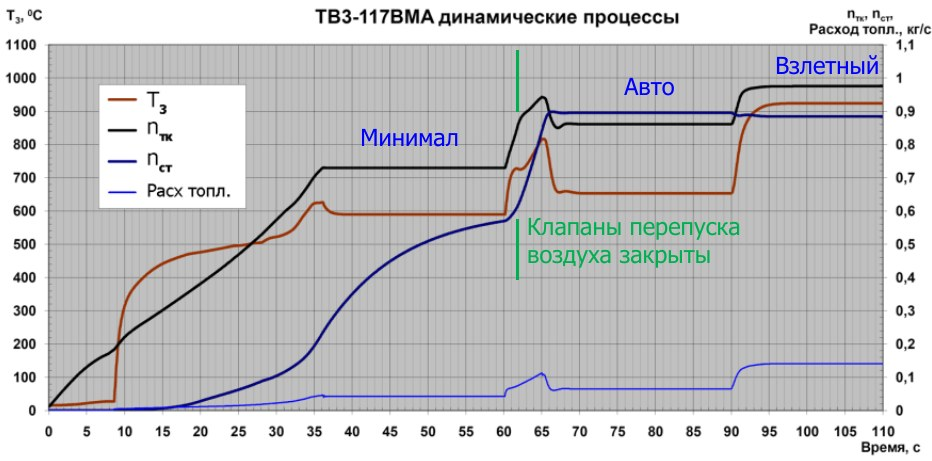
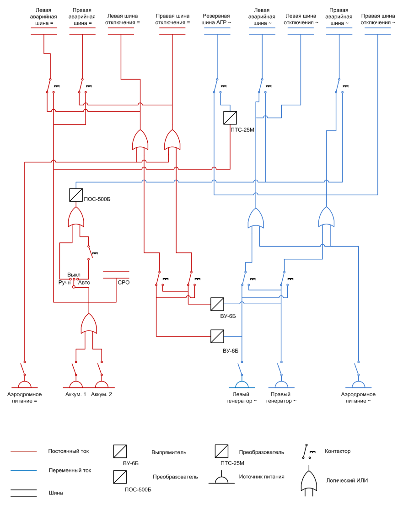
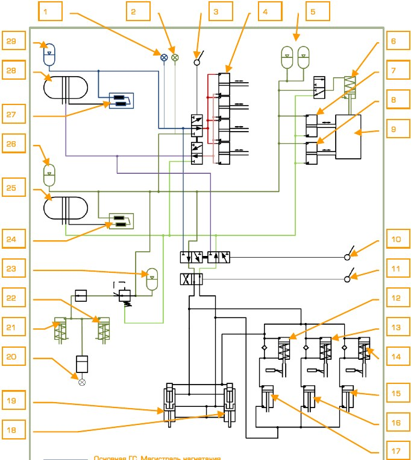
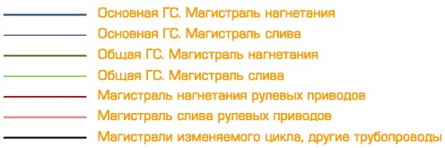

# Ограничения и системы

## Эксплуатационные ограничения

В разделе приведены только основные ограничения, связанные с эксплуатацией
вертолёта, приведенные по условиям безопасности полета при исправной работе
систем и оборудования.

Наименование                                               | Величина  |  Причина
-----------------------------------------------------------|-----------|------
Максимальная взлетная и посадочная масса, кг               | 10800 |   По прочности вертолёта и шасси.
Максимальная перегоночная взлетная и посадочная масса, кг  | 11900
Максимально допустимые скорости, км/ч:
приборная в полете с убранным и выпущенным шасси           | 300   |  По срыву потока с лопастей, флаттеру и прочности.
приборная уборки и выпуска шасси                           | 200   |  По прочности створок шасси.
путевая посадочная                                         | 80    |  По эффекту «шимми» передних колес.
Вертикальная скорость при планировании на приборной скорости 50 км/ч, м/с: | | По условиям предотвращения попадания в режим вихревого кольца.
на геометрических высотах более 200 м                      | 5
на геометрических высотах до 200 м                         | 3
Максимально допустимая скорость ветра, м/с:                 | | По запасам управления.
для руления:
встречный                               | 20
боковой и попутный                      | 10
для взлета и посадки:
боковой и попутный                      | 10
Максимально допустимый угол тангажа на кабрирование и пикирование, град | 60
Максимально допустимый угол крена, град                                 | 65
Перегрузки, ед:
максимально допустимая до приборной скорости 250 км/ч       | 3,0 | По прочности.
минимально допустимая                   | 0 | По минимально необходимому расстоянию между лопастями винта и фюзеляжем.
максимально допустимая перегрузка при перегоночной массе    | 1,5
Максимально допустимая частота вра- щения несущих винтов, %: | | По флаттеру.
до 190 км/ч                            | 98
190…245 км/ч                           | 95
245…265 км/ч                           | 93
265…280 км/ч                           | 91
280…300 км/ч                           | 90
Минимально допустимая частота вращения несущих винтов, %:
на взлетном режиме                              | 86
на переходных режимах при выполнении маневров   | 83

#### По двигателям ТВ3-117ВМА

Наименование                                               | Величина  |  Причина
-----------------------------------------------------------|-----------|------
Допустимое время непрерывной работы двигателя по режимам, мин: | | По надежности и ресурсу двигателя.
на взлетном:
в нормальной обстановке                 | 6
в чрезвычайной обстановке               | 6…30
при отказе одного двигателя             | 90
на номинальном                          | 60
на малом газе                           | 20
Максимально допустимое значение частоты вращения ротора турбокомпрессора на взлетном режиме, % | 101,15 | По прочности двигателя.
Максимально допустимая температура газов перед турбиной компрессора, °С: | | По термопрочности двигателя.
на взлетном режиме                  |  990
при запуске и режиме малого газа    |  780
Давление масла, кг/см :
минимально допустимое               |   2
максимально допустимое              |   4

#### По редукторам

Наименование                                               | Величина 
-----------------------------------------------------------|----------
Давление масла, кг/см2:
минимально допустимое на режиме малого газа | 0,5
минимально допустимое на других режимах     | 1,3
Температура масла, °С:
минимально допустимая при запуске двигателя и на режиме малого газа | -30
максимально допустимая                                              | +90

#### Эксплуатационные ограничения И251В Шквал

Наименование                                               | Величина  
-----------------------------------------------------------|-----------
Диапазон измерения дальности, км:                           | 9,9…0,6
Режим работы лазерного дальномера за полет, серий:          | 5
Одна серия включает в себя 16 циклов по 10 секунд каждый, с перерывами между циклами 5 сек.
Перерыв между сериями, мин:            | 30
Допустимые при сопровождении цели крены в режиме АС, градусов: |      ±45
Допустимые при сопровождении цели углы тангажа в режиме АС, градусов: |     ±50
Диапазон угловых скоростей, градусов в секунду:
по направлению:                      ±30
по тангажу:                          ±20
по крену:                            ±60

#### Эксплуатационные ограничения ДИСС

При маневрировании с углами крена и тангажа, превышающими 10° ДИСС переходит в режим ПАМЯТЬ.

## Опасная зона высота-скорость

Опасная зона высота-скорость определена из условия обеспечения безопасной посадки в случае отказа одного из двигателей.

В случае отказа двигателя в опасной зоне не гарантируется безопасная посадка
вертолёта, поэтому в случаях, когда это не обусловлено выполнением конкретного
задания, следует избегать полетов в опасной зоне.

Верхняя граница опасной зоны определяется запасом высоты, необходимым для выполнения разгона и предпосадочного маневра при работе одного двигателя. Нижняя граница – это высоты, с которых вертолёт до момента приземления не успевает
развить большую вертикальную скорость и производит безаварийную посадку.

Размер зоны зависит от полетной массы и атмосферных условий. На рисунке приведены опасные зоны для вертолёта с нормальной и максимальной взлетными массами 9800 и 10800 кг на уровне моря.

## Области режимов вихревого кольца

Области режимов вихревого кольца построены для вертолёта с полетной массой 9,2
т при значениях нормальной перегрузки ny = 1 и 1,5 на высоте 0,5 км.

В случае непреднамеренного попадания вертолёта в режим вихревого кольца летчик должен немедленно принять меры по выводу вертолёта из этого режима.

Наиболее надежно вертолёт выводится из режима вихревого кольца путем сброса
общего шага примерно на 1/3 хода и энергичного перевода вертолёта в разгон скорости.

## Несущая система

Несущая система вертолёта состоит из двух соосных винтов (установленных на соосных валах главного редуктора), которые служат для создания подъемной и пропульсивной сил, а также для управления вертолётом.

Втулки винтов и агрегаты управления лопастями конструктивно объединены в колонку несущих винтов, которая состоит из: втулок верхнего и нижнего винтов, верхнего и нижнего автоматов перекоса, ползушки, тяг, качалок и рычагов, связывающих эти агрегаты.

Втулка нижнего винта устанавливаются на наружном валу главного редуктора, а
втулка верхнего винта - на внутреннем валу.

Втулки передают на лопасти крутящий момент от силовой установки, а также, через
главный редуктор, передают на фюзеляж силы и моменты, создаваемые несущими
винтами.

Конструкция втулок верхнего и нижнего винтов одинакова. Втулки - бесшарнирные,
с упругим креплением лопастей, роль которых выполняют торсионы, представляющие собой пакеты стальных пластин. Торсион имеет малую жесткость в плоскости
взмаха и на кручение, что позволяет ему, воспринимая центробежную силу, обеспечивать маховое движение лопасти в плоскости тяги и поворот лопасти относительно продольной оси для изменения ее угла установки.

Автоматы перекоса винтов предназначены для изменения циклического шага винтов.

Ползушка служит для управления общим и дифференциальным шагом винтов.

Конструкция лопастей верхнего и нижнего винтов одинакова. Лопасти отличаются
только направлением вращения: лопасти верхнего винта вращаются по часовой
стрелке, если смотреть на винты сверху, а нижнего винта – против часовой стрелки.

Противообледенительная система – электротепловая. На концах лопастей нижнего
винта установлены контурные огни.

1.   Лопасть верхнего несущего винта.
2.   Осевой шарнир лопасти.
3.   Торсион.
4.   Вертикальный шарнир лопасти.
5.   Лопасть нижнего несущего винта.
6.   Поводок лопасти нижнего несущего винта.
7.   Тяга динамической регулировки нижнего винта.
8.   Нижний автомат перекоса.
9.   Рычаг управления общим шагом винтов.
10. Рычаг управления дифференциальным шагом.
11. Внешний вал редуктора.
12. Внутренний вал редуктора.
13. Корпус редуктора.
14. Рычаг управления дифференциальным шагом.
15. Рычаг управления шагом верхнего винта.
16. Качалка ползушки.
17. Корпус ползушки.
18. Тяга ползушки.
19. Тяга динамической регулировки верхнего винта.
20. Верхний автомат перекоса.
21. Внутренний вал редуктора.
22. Верхний ползун.
23. Тяга статической регулировки верхнего винта.
24. Шлиц-шарнир верхнего автомата перекоса.
25. Соединительная тяга.
26. Шлиц-шарнир нижнего автомата перекоса.
27. Внешний вал редуктора.
28. Качалки управления продольным и поперечным наклоном автоматов перекоса.

## Управление вертолётом

Управление вертолётом состоит из систем продольного, поперечного, путевого
управлений и системы управления общим шагом несущих винтов. Продольное и поперечное управление воздействует только на лопасти несущих винтов и имеет общий орган управления – ручку продольно-поперечного управления (ППУ). Путевое
управление воздействует на лопасти несущих винтов и на руль направления, органом управления являются педали путевого управления.

Система управления общим шагом воздействует на лопасти несущих винтов и на
мощность двигателей, органом управления для изменения общего шага является
рычаг общего шага (РОШ).

Органы управления вертолётом, находящиеся в кабине летчика, связаны через необратимые гидроусилители с соответствующими агрегатами управления колонки,
воздействующими на лопасти винтов. Отклонение органов управления через системы управления воздействует на лопасти винтов и руль направления таким образом, что возникают неуравновешенные аэродинамические силы и моменты относительно трех осей вертолёта: продольной, поперечной и вертикальной. Эти неуравновешенные силы и моменты, воздействуя на вертолёт, меняют его положение в
пространстве, то есть осуществляют управление.

При отклонении ручки ППУ в продольном и поперечном направлениях наклоняются
автоматы перекоса, что вызывает циклическое изменение шага лопастей, приводящее к наклону конуса вращения винтов, то есть к наклону силы тяги винтов и изменению момента этой силы.

Продольное управление вызывает изменение силы вдоль продольной оси (движение вперед-назад) и момента относительно поперечной оси (пикирование или кабрирование). Поперечное управление вызывает изменение силы вдоль поперечной
оси (движение вбок) и момента относительно продольной оси (правый или левый
крен).

При отклонении педалей дифференциально изменяется шаг верхнего и нижнего
винтов: шаг лопастей одного винта увеличивается, а другого – уменьшается, одновременно отклоняется руль направления. Это приводит к неравенству крутящих моментов винтов, что вызывает появление неуравновешенного момента, равного разности реактивных моментов несущих винтов, и действующего на вертолёт относительно вертикальной оси. Таким образом, путевое управление вызывает появление
момента относительно вертикальной оси (разворот влево-вправо).

При отклонении рычага общего шага одновременно и одинаково происходит изменение шага всех лопастей (общего шага) обоих винтов, приводящее к увеличению
или уменьшению тяги. Управление общим шагом воздействует на лопасти и вызывает изменение силы, действующей вдоль вертикальной оси (движение вверх-вниз).

Одновременно при изменении общего шага происходит изменение мощности работающих двигателей (через топливную автоматику двигателей). При увеличении общего шага мощность увеличивается, при уменьшении – уменьшается.
Каждая система управления включает органы управления (ручку ППУ, педали, рычаг общего шага) и проводку управления до качалок и рычагов колонки несущих
винтов и руля направления. В проводку управления всех систем включены гидравлические рулевые приводы, предназначенные для уменьшения усилий на органах
управления вертолёта и для разгрузки их от аэродинамических и других сил, действующих на несущие винты и руль направления.

В системе управления параллельно проводкам продольного, поперечного и путевого управлений установлены триммерные механизмы, выполняющие функции:

- Создания на ручке ППУ и педалях нагрузки, направленной в сторону, противоположную их отклонению, и возрастающей по мере их отклонения
(создание градиента усилий, имитирующих аэродинамические нагрузки).
- Снятие нагрузки с ручки ППУ и педалей при любом их отклоненном положении во всем диапазоне перемещений (создание нейтрали по нагрузке,
т.е. балансирование ручки и педалей в любом положении).

### Особенности управления вертолётом в симуляторе

Главным отличием метода управления вертолётом в симуляторе от управления реальным прототипом (в случае использования джойстика без технологии Force
Feedback) является необходимость возвращать ручку джойстика в нейтраль после
каждого нажатия кнопки триммера. В реальном вертолёте ручка остается отклоненной в затриммированном положении, что возможно реализовать только на
джойстике с Force Feedback.

Крайне рекомендуется использовать педали для управления по рысканию, т.к. это
значительно облегчает управление вертолётом в симуляторе.

Движение левой руки летчика вертолёта физически противоположно движению
руки летчика самолета. Традиционно, для увеличения скорости и высоты летчик самолета толкает ручку газа «от себя», в то время как вертолётчик тянет ручку общего шага «на себя». Для большей степени имитации вертолётного управления рекомендуется инвертировать ось ручки общего шага, для которой обычно используется ручка газа джойстика.

### Индикатор положения органов управления

Для индикации положения органов управления в симуляторе введен специальный
индикатор, который отображает положение ручки ППУ, рычага общего шага (РОШ),
ручек раздельного управления двигателями (РРУД) и педалей.
Включение и выключение индикатора происходит при нажатии комбинации клавиш
[[Enter + RCtrl]].

1.   Шкала положения РОШ.
2.   Текущее положение РОШ.
3.   Шкала РРУД. Положение МАКСИМАЛ.
4.   Шкала РРУД. Положение АВТОМАТ.
5.   Текущее положение РРУД.
6.   Шкала РРУД. Положение ОТКАЗ РО.
7.   Шкала РРУД. Положение МАЛЫЙ ГАЗ.
8.   Индикатор включенного стояночного тормоза.
9.   Шкала колесного тормоза.
10. Шкала оси тангажа (продольное управление).
11. Текущее положение ручки ППУ.
12. Шкала крена (поперечное управление).
13. Шкала направления (педалей).
14. Текущее положение педалей.

## Схема силовой установки

1.   Турбостартер правого двигателя.
2.   Правый двигатель ТВ3-117ВМА.
3.   Главный редуктор ВР-80.
4.   Левый двигатель ТВ3-117ВМА.
5.   Турбостартер левого двигателя.
6.   Промежуточный редуктор ПВР-800.
7.   Двигатель ВСУ АИ-9В.
8.   Трубопроводы системы отбора воздуха от ВСУ.
9.   Правый генератор.
10. Турбопривод ТП-35.
11. Левый генератор.
12. Входной вал.

### Двигатель ТВ3-117

1.   Компрессор.
2.   Вал компрессора.
3.   Кольцевая камера сгорания.
4.   Турбина компрессора.
5.   Свободная турбина.
6.   Сопло.
7.   Выходной вал.

-  n~тк~ – обороты турбокомпрессора в модели двигателя.
-  n~тк~ реал – обороты турбокомпрессора реального двигателя.
-  Т~3~ – температура перед турбиной в модели двигателя.
-  Т~3~ реал – температура перед турбиной реального двигателя.
-  Уд. расх. – удельный расход топлива в модели двигателя.
-  Уд. расх. реал – удельный расход топлива реального двигателя.
-  n~ст~ – обороты свободной турбины.

## Топливная система

Топливная система предназначена для питания топливом основных двигателей и
двигателя ВСУ и состоит из: баков для топлива, трубопроводов, системы дренажа,
агрегатов и приборов контроля.

Емкости для топлива - основные и подвесные топливные баки. Основные баки состоят из переднего и заднего мягких баков. Четыре подвесных металлических бака
располагаются по два с правого и левого бортов под крыльевыми пилонами и соединяются с основными баками трубопроводами перекачки топлива: два правых соединены с передним баком, а два левых - с задним. Передний бак обеспечивает
топливом левый двигатель, а задний – правый двигатель; ВСУ АИ-9 питается от заднего бака. Передний и задний баки соединены трубопроводом кольцевания с краном кольцевания, при открытии которого возможно питание двигателя от любого
основного бака или от обоих сразу, либо питание обоих двигателей от одного бака.

Основные баки являются расходными, из них топливо подается к двигателям центробежными насосами, смонтированными по одному. По мере расхода топлива из
основных баков они пополняются топливом из подвесных баков.

Перетеканию топлива при перекачке из внешних баков во внутренние и наоборот
препятствуют обратные клапаны в системе перекачки.

Насосы подкачки и перекачки топлива включаются и выключаются вручную выключателями насосов, а сигнализация работы каждого насоса выведена на светосигнальное табло верхнего пульта.

После выработки топлива в подвесных баках гаснут соответствующие табло: БАК
ЛЕВ ВНЕШ, БАК ПРАВЫЙ ВНЕШ, БАК ЛЕВ ВНУТР, БАК ПРАВЫЙ ВНУТР.

Увеличение живучести топливной системы достигается:

- Подключением насосов баков к аварийной шине электропитания, что
обеспечивает питание насосов от аккумуляторных батарей при отказе основной электросистемы.
- Способностью топливных насосов, установленных на двигателях, подсасывать топливо из расходных баков при отказе подкачивающих насосов.

Топливо подсасывается через обводной обратный клапан.

Контроль работы топливной системы осуществляется системой управления и измерения топлива, сигнализаторами давления и светосигнальными табло.

Органы управления и сигнализации топливной системы:

- Выключатель топливомера, выключатели насосов на панели ТОПЛИВО
правого бокового пульта.
- Индикатор топливомера на правой приборной доске.
- Выключатели перекрывных кранов двигателей, ВСУ и крана кольцевания
на правом боковом пульте.
- Светосигнальное табло на верхнем пульте.

При минимальном аварийном остатке топлива в одном из основных баков мигает
ЦСО и одновременно на УСТ системы ЭКРАН высвечивается информация ПЕРЕДНИЙ
БАК 110 кг или ЗАДНИЙ БАК 110 КГ.

1.     Насосный узел (для каждого бака).
2.     Сигнализатор давления (для каждого бака).
3.     Обратный клапан.
4.     Поплавковый клапан уровня.
5.     Заливная горловина. На переднем и заднем баках.
6.     Датчик топливомера. На переднем и заднем баках.
7.   Перекрывной кран левого двигателя.
8.   Кран кольцевания.
9.   Перекрывной кран правого двигателя.
10. Обводной обратный клапан.
11. Перекрывной кран ВСУ.

Максимальная масса топлива при полной заправке внутрифюзеляжных баков: 1450 кг

передний бак:                                             705 кг

задний бак:                                               745 кг

Максимальная масса топлива при полной заправке внутрифюзеляжных и четырех подвесных топливных баков: 3210 кг

Минимальный аварийный остаток топлива:

передний бак:                                             110 кг

задний бак:                                            110 кг

Аварийный сброс подвесных топливных баков производится от кнопки АВАР-СБРОС
на центральном пульте (пульт ПУИ-800).

## Система электроснабжения

Система электроснабжения включает в себя:

- Основную систему электроснабжения переменным током 115/200 В.
- Систему аварийного электроснабжения переменным током.
- Систему электроснабжения постоянным током.
- Сеть подключения внешнего источника электроснабжения.

Органы управления системы электроснабжения расположены на правом боковом
пульте, органы контроля – на пульте контроля, сигнализация – на верхнем пульте и
УСТ системы ЭКРАН.

Основная система питания потребителей электроэнергией – система трехфазного
переменного тока напряжением 115/200 В. Выработка электроэнергии осуществляется двумя генераторами трехфазного тока.
Потребители постоянного тока напряжением 27 В питаются от двух выпрямительных устройств, каждое из которых подключено к своему генератору.

Для обеспечения полета при отказе основных источников электроэнергии имеется
система аварийных шин, питающихся от аккумуляторных батарей. В этом случае питание потребителей напряжением ~115 В осуществляется от статического преобразователя ПОС-500Б, подключенного к аварийным шинам.

Аэродромный источник переменного тока подключается через розетку на левом
борту вертолёта, а при его отсутствии питание для запуска двигателей подается от
аккумуляторной батареи.

Проверка работоспособности оборудования на земле при неработающих двигателях
и отсутствии аэродромного источника электроэнергии производится от бортовых генераторов переменного тока при работающем турбоприводе.

### Основная система электроснабжения переменным током

Система включает в себя два раздельных канала генерирования для левого и правого борта. Источниками электроэнергии переменного тока напряжением 115/200 В
являются два синхронных генератора трехфазного переменного тока с приводом от
главного редуктора или от турбопривода.

Левый генератор подключен к ЦРУ-1, а правый - к ЦРУ-2, от шин которых питаются
потребители электроэнергии. При отказе или отключении одного из генераторов,
его шины подключаются к шинам ЦРУ работающего генератора.

Генераторы включаются выключателями ЭНЕРГЕТИКА ~ТОК, ГЕН ЛЕВ, ГЕН ПРАВ,
при работающих двигателях в положении РРУД АВТОМАТ или при работе турбопривода.

При отказе двух генераторов на табло УСТ высвечивается кадр СЕТЬ НА АККУМУЛ,
в телефонах прослушивается речевое сообщение «Смотри УСТ», на верхнем пульте
загорается табло ПРЕОБРАЗ, сигнализирующее о включении преобразователя ПОС500Б, а на левой приборной доске загорается ЦСО в проблесковом режиме.

### Система аварийного электроснабжения переменным током

При отказе основной системы электроснабжения переменным током потребители
переменного тока питаются от статического преобразователя ПОС-500Б,
преобразующего постоянное напряжение 27 В аккумуляторной батареи в переменное напряжение 115 В.

От аварийных шин преобразователя ПОС-500Б питаются переменным током следующие потребители:

-   Радиовысотомер.
-   Сигнализаторы температуры масла силовой установки.
-   Топливомер, датчик перегрузки, приборы измерения оборотов и температуры газов двигателей, измеритель вибраций.
-   Самолетный радиолокационный ответчик (СРО).
-   Система ограничительных сигналов (СОС).
-   Звуковая сигнализация падения частоты вращения винтов.
-   Аварийный подсвет приборных досок, пультов и панелей.

Питание резервного авиагоризонта осуществляется от отдельного статического преобразователя ПОС-25М, питающегося от аккумуляторной батареи.

При отказе обоих генераторов к приведенному перечню добавляются потребители,
питающиеся от аварийной шины постоянного тока.

Для обеспечения автоматического подключения преобразователя ПОС-500Б переключатель ЭНЕРГЕТИКА ~ТОК ПРЕОБР должен быть установлен в положение АВТ.

### Система электроснабжения постоянным током

Система состоит из двух электрически независимых каналов, проложенных по левому и правому бортам.
Каждый канал включает в себя выпрямительное устройство ВУ-6Б, ЦРУ-3 для левого и ЦРУ-4 для правого каналов.

При отказе одного из каналов электропитания распределительного устройства,
шины этого устройства подключаются у ЦРУ работающего канала, что обеспечивает
резервирование питания потребителей.

На вертолёте установлены две аккумуляторные батареи, которые обеспечивают автономный запуск двигателей и питание аварийных шин при отказе обоих генераторов. Непосредственно от батарей питается самолетный радиолокационный ответчик
госопознавания.

В ЦРУ-3 и ЦРУ-4 имеется по две шины. Шины №1 – аварийные, которые при отказе
обоих выпрямительных устройств (ВУ) питаются от аккумуляторных батарей. Шины
№2 – шины отключения, которые при отказе обоих ВУ обесточиваются.

От аварийных шин постоянного тока (при отказе обоих генераторов или при отказе
обоих выпрямительных устройств) питаются следующие потребители электроэнергии:

-   Преобразователь ПОС-500Б для питания аварийных потребителей переменным током.
- Радиосвязное оборудование: УКВ радиостанции, АВСК.
- Радиовысотомер.
- Самолетный радиолокационный ответчик.
- Система управления вооружением.
- Приборы контроля силовой установки и гидросистемы.
- Топливомер, топливные насосы, перекрывные краны.
- Преобразователь ПТС-25 для питания резервного авиагоризонта.
- Светотехническое оборудование.
- Обогрев ПВД.
- Системы САС, ЭКРАН.

Подключение аккумуляторов к бортсети осуществляется выключателями
ЭНЕРГЕТИКА =ТОК, АКК1 и АКК2 на правом боковом пульте. Выпрямительные
устройства автоматически подключаются к бортсети при включенном аэродромном
питании или бортовых генераторах.

При отказе одного из ВУ на табло УСТ высвечивается информация ЛЕВ ВЫПРЯМИТ
или ПРАВ ВЫПРЯМИТ. Одновременно на левой приборной доске включается ЦСО в
проблесковом режиме.

При отказе двух ВУ на табло УСТ высвечивается сигнал СЕТЬ НА АККУМУЛ. Одновременно на левой приборной доске включается ЦСО в проблесковом режиме.

## Гидравлическая система

Гидравлическая система предназначена для привода гидравлических механизмов
различных систем вертолёта и состоит из двух автономных систем: основной и общей.

Основная гидросистема обеспечивает питание блока рулевых приводов, продольного, поперечного, путевого управлений и управления общим шагом, а при отказе
общей гидросистемы обеспечивает аварийный выпуск шасси.

Общая гидросистема обеспечивает питанием систему уборки и выпуска шасси, систему торможения основных колес шасси, систему управления подвижной пушечной
установки, а при выходе из строя основной гидросистемы обеспечивает питанием
блок рулевых приводов.

Каждая гидросистема состоит из: гидронасоса, гидробака, фильтров, клапанов, трубопроводов и элементов управления. Источниками питания обоих систем являются
гидронасосы переменной производительности. Гидронасос основной гидросистемы
установлен на левой коробке приводов главного редуктора и работает при вращении несущих винтов как на моторном режиме, так и на режиме авторотации. Гидронасос общей гидросистемы установлен на задней коробке приводов главного редуктора и работает как при вращении несущих винтов, так при работающей ВСУ на
земле.

В магистрали каждой гидросистемы установлены гидроаккумуляторы для гашения
колебаний давления. В тормозной системе колес шасси установлен свой гидроаккумулятор для обеспечения стояночного торможения колес (до 2-х часов) после выключения двигателей, а также для обеспечения работоспособности тормозов на рулении в случае отказа общей гидросистемы.

Бак основной гидросистемы имеет объем 13 л, бак общей гидросистемы – 17 л. Для
контроля работы гидросистемы установлены индикаторы для измерения давления и
температуры и сигнализаторы давления.

Индикаторы установлены на верхней панели пульта контроля в кабине. На приборах нанесены метки предельных значений параметров:

- Индикаторы давления в основной и общей гидросистемах. Отметки: 64 и
90 кгс/см2.
- Индикатор давления в гидроаккумуляторе. Отметки: 60 и 90 кгс/см2.
- Индикатор давления в тормозной системе. Отметки: 0 и 22 кгс/см2.
- Индикаторы температуры в гидросистемах. Отметки: минус 10 °С и +90
°С.

Рабочий диапазон давлений в гидросистемах 65…90 кгс/см2.

Температура рабочей жидкости (АМГ-10) в полете - не более +85 °С.

Сигнализаторы давления установлены:

- В каналах блока рулевых приводов для сигнализации падения давления.
- В тормозной системе колес шасси для сигнализации падения давления в
гидроаккумуляторе.
- В магистрали наддува гидробаков.

Переключение питания рулевых приводов с основной гидросистемы на общую (автоматически или с помощью переключателя ОСН. ГИДРО ОТКЛ) сигнализируется
светосигнализаторами клапанов КЛАПАН 1 ГИДРО, КЛАПАН 2 ГИДРО, которые размещены на пульте контроля над индикаторами давления.

1.        Манометр основной гидросистемы.
2.        Манометр общей гидросистемы.
3.        Переключатель питания рулевых приводов с основной гидросистемы на
общую.
4.   Блок рулевых приводов продольного, поперечного, путевого управлений и
управления общим шагом.
5.   Гидроаккумуляторы приводов подвижной пушечной установки.
6.   Стопор пушечной установки.
7.   Привод пушечной установки по вертикали.
8.   Привод пушечной установки по горизонтали.
9.   Подвижная пушечная установка.
10. Переключатель аварийного выпуска шасси.
11. Кран шасси.
12. Гидрозамок убранного (выпущенного) положения левой стойки шасси.
13. Гидрозамок убранного (выпущенного) положения передней стойки шасси.
14. Гидрозамок убранного (выпущенного) положения правой стойки шасси.
15. Привод левой стойки шасси.
16. Привод передней стойки шасси.
17. Привод правой стойки шасси.
18. Привод правой створки шасси.
19. Привод левой створки шасси.
20. Манометр тормозной системы.
21. Привод тормоза левого колеса.
22. Привод тормоза правого колеса.
23. Гидроаккумулятор тормозной системы.
24. Гидронасос общей гидросистемы.
25. Гидробак общей гидросистемы.
26. Гидроаккумулятор общей гидросистемы.
27. Гидронасос основной гидросистемы.
28. Гидробак основной гидросистемы.
29. Гидроаккумулятор основной гидросистемы.

## Прицельно-пилотажно-навигационный комплекс (ПрПНК)

ПрПНК представляет собой комплекс связанных радиотехнических, гироскопических, оптических, телевизионных и лазерных систем, обеспечивающих с помощью
вычислительных средств автоматизированное пилотирование, воздушную навигацию и боевое применение всех видов вооружения вертолёта по визуально видимой
цели.

### Принцип работы

Боевой вылет до поражения цели делится на следующие этапы: полет по маршруту
в район боевых действий, поиск и обнаружение цели в районе боевых действий, перенацеливание по целеуказанию от ведущего группы или с земли, сближение с целью и атака с применением соответствующего вида оружия, возвращение на заданный аэродром.

В ПрПНК предусмотрено следующее автоматизированное решение указанных этапов:

-   Полет по запрограммированному маршруту в район боевых действий.
-   Поиск и обнаружение цели с использованием аппаратуры внешнего целеуказания (ВЦУ) и автоматического прицельного комплекса (режим сканирования).
-   Сближение с целью и атака с применением выбранного вида оружия, режим автоматизированного доворота (АДВ) на цель и автосопровождение
цели КАПК Шквал.
-   Возвращение на аэродром посадки (режим ВОЗВРАТ).

Могут применяться следующие способы автоматизированного сближения с целью и
наведения на нее выбранного оружия:

-   Целеуказание для КАПК с помощью НСЦ с последующим выполнением автоматизированного доворота на цель (режим АДВ).
-   Целеуказание для КАПК после ручного доворота на цель, ввод цели в
поле зрения прицельной системы, захват с автосопровождением до поражения.

Комплекс построен на основе цифровых вычислительных машин, обеспечивающих
автоматизированное решение пилотажно-навигационных и боевых задач.

Работоспособность комплекса обеспечивается при наличии на борту электроснабжения переменным током.

### Органы управления ПрПНК

Органы управления ПрПНК расположены на следующих пультах:

-   Пульт ввода и индикации (ПВИ) – основной пульт управления ПНК, обеспечивающий выбор режимов его работы и взаимодействия с другими системами. Расположен на правом пульте.
-   Пульт выбора режимов (ПВР) обеспечивает включение ПрПНК и выбор режимов автоматизированного управления вертолётом и оружием при атаке
цели. Расположен на левом пульте.
-   Пульт управления и индикации (ПУИ) обеспечивает приведение в готовность к применению, выбор режимов применения и контроль за наличием
на борту вооружения и остатком боекомплекта. Расположен на центральном пульте.
-   Пульт управления режимами (ПУР) обеспечивает регулировку изображения и объем отображаемой информации на индикаторе телевизионном
ИТ-23, ИЛС и нашлемном визирном устройстве (НВУ). Расположен на центральном пульте.
-   Пульт подготовки и контроля (ППК) используется наземными специалистами для включения и наземного контроля работоспособности отдельных
элементов ПрПНК. Расположен на пульте контроля.
-   Пульт включения целеуказания (ПВЦ) на правом пульте и пульт режимов
целеуказания (ПРЦ) на верхнем пульте обеспечивают включение и управление работой аппаратуры внешнего целеуказания.

Предназначение и положение остальных выключателей, обеспечивающих включение и работу отдельных устройств ПрПНК на различных режимах работы и полета
указаны в отдельных разделах.

### Состав комплекса

В состав ПрПНК входят следующие комплексы, системы и приборы:

-   Пилотажно-навигационный комплекс ПНК-800.
-   Система управления оружием СУО-800.
-   Круглосуточный автоматический прицельный комплекс КАПК И-251В
Шквал.
-   Система отображения информации СОИ-800.
-   Нашлемная система целеуказания (НСЦ).
-   Аппаратура внешнего целеуказания (ВЦУ).
-   Датчик углов атаки и скольжения ДУАС-В.
-   Цифровые вычислительные машины, обеспечивающие решение пилотажно-навигационных задач (ЦВМ-Н), боевого применения (ЦВМ-Б), отображения информации (ЦВМ-И) и внешнего целеуказания (ЦВМ-Ц).
-   Пульты управления.
-   Блоки питания, связи и коммутации.

## Пилотажно-навигационный комплекс ПНК-800

ПНК является основной составной частью ПрПНК, обеспечивающей решение задач
автоматизированного пилотирования, навигацию и выполнение боевых задач.

Пилотажные задачи, решаемые комплексом:

-   Автоматическая стабилизация угловых положений вертолёта.
-   Автоматическая стабилизация заданной барометрической высоты полета.
-   Автоматическая стабилизация заданной воздушной скорости.
-   Стабилизация истинной высоты полета.
-   Стабилизация висения по сигналам ДИСС и РВ.
-   Вертикальное снижение с заданной скоростью при висении.
-   Автоматическое управление вертолётом в горизонтальном полете по
маршруту и при выходе на цель с выдерживанием заданных пилотажных и
навигационных параметров.
-   Корректировка возмущений вертолёта, возникающих от отдачи оружия
при стрельбе.
-   Формирование пилотажной информации при директорном управлении полетом.
Навигационные задачи, решаемые комплексом:
-   Ввод в память ЦВМ координат поворотных пунктов маршрута (ППМ), аэродромов (АЭР), ориентиров коррекции (ОР), оперативных точек целей (ОТ).
-   Программирование очередности пролета ППМ.
-   Расчет навигационных параметров при полете по маршруту и выходе на
цель.
-   Автоматическое счисление координат текущего места вертолёта.
-   Ручная коррекция координат при пролете над запрограммированными
ориентирами или при визировании ориентиров через КАПК И-251В Шквал.
-   Снятие координат целей при пролете над ними или при визировании через КАПК И-251В Шквал.
-   Индикация текущих координат места вертолёта.
-   Индикация номера очередного ППМ.
-   Автономная выставка стояночного курса вертолёта при экстренной, ускоренной и нормальной с гирокомпасированием подготовках информационного комплекса вертикали и курса (ИК-ВК).
-   Ручная коррекция начальной выставки курса.
- Расчет возврата на один из двух запрограммированных аэродромов по
кратчайшему пути.
- Расчет и индикация оставшегося расстояния и времени полета до заданной точки маршрута.
- Автоматическое определение и индикация курсового угла радиостанции
(КУР).

В состав комплекса входит следующее оборудование, инструменты и приборы:

- Бортовая цифровая вычислительная машина (БЦВМ-Н).
- Вычислитель угловой стабилизации (основная часть комплекса).
- Блок гироскопов.
- Информационный комплекс вертикали и курса ИК-ВК.
- Допплеровский измеритель составляющих скоростей ДИСС.
- Информационный комплекс высотноскоростных параметров ИК-ВСП.
- Авиагоризонт резервный АГР-81.
- Индикатор командно–пилотажный ИКП-81.
- Прибор навигационный плановый ПНП-72.
- Вычислитель спецрежима ВСС.
- Пульт пилотажных режимов ППР.
- Компас магнитный КИ-13.
- Датчик линейных ускорений.

Кроме того, к ПНК относятся:

- Автоматический радиокомпас АРК-22.
- Радиовысотомер А-036.

С ПНК скомплексирована система АБРИС.

### Основные тактико-технические характеристики

Работоспособность комплекса обеспечивается при следующих условиях:

- Угол крена и тангажа ±70°.
- Угловые скорости по всем осям до 60°/с.
- Воздушная скорость от минус 70 до 400 км/ч.
- Высота до 6000 м.
- Время готовности комплекса к работе при нормальной подготовке – 15
мин.
- В режиме ускоренной подготовки – 3 мин.
- В режиме с гирокомпасированием – 20 мин.

Точности выдерживания пилотажных параметров на установившихся режимах полета:

- По углам крена и тангажа - 1°.
- По углам курса – 1,5°.
- По барометрической высоте ±20 м.
- По геометрической высоте висения ±1,5 м.
- По заданной воздушной скорости – 10 км/ч.

Точность автономного счисления координат в полете по маршруту при подготовке
ИК-ВК с гирокомпасированием, за час полета в процентах от пройденного пути:

- В инерциально-допплеровском режиме – 1,2 %.
- В курсо-допплеровском режиме – 1,6 %.
- В курсо-воздушном режиме – 10 %.
- В курсо-допплеровском режиме при ускоренной подготовке к полету – 2,4
%.

### Органы управления, контроля и сигнализации

Управление работой комплекса осуществляется со следующих пультов и рычагов:

- Пультов ППР, ПВИ, ППК, ПВР, ПУР, входящих в состав ПрПНК.
- Рычага ОШ и ручки ППУ.
- Пульта ПУИ системы управления оружием.

Включение комплекса совместно с ПрПНК производится выключателем К-041 на
пульте ПВР.

### Режим стабилизации угловых положений

Режим стабилизации угловых положений, высоты и скорости задается летчиком при
включенных каналах автопилота (кнопки К, Т, Н, В на ППР нажаты).

Нажатие кнопки ТРИММЕР на ручке ППУ снимает и передает в автопилот позиционные сигналы по крену (К), тангажу (Т) и направлению (Н), а отпускание кнопки приводит к запоминанию заданных угловых положений вертолёта в пространстве.

Стабилизация углового положения по тангажу приводит к установлению соответствующей этому тангажу скорости.

Нажатие гашетки на РОШ (являющейся одновременно тормозом РОШ и кнопкой
триммера по высоте) снимает позиционный сигнал по высоте (В), а отпускание гашетки после установки РОШ в новое положение и выхода на новую высоту приводит к запоминанию и стабилизации этой высоты. Стабилизируется барометрическая
либо геометрическая высота, в соответствии с положением переключателя БАР-РВ
на пульте ППР; при этом, если переключатель установлен в положение РВ при
включенном канале «В», но полет совершается на высоте более 300 м - автопилот
переводится на стабилизацию барометрической высоты.

### Режим стабилизации висения

В режиме стабилизации висения обеспечивается сохранение постоянного положения вертолёта относительно заданной точки висения и поддержание заданной высоты висения по сигналам РВ.

Включение режима осуществляется после зависания на высоте не менее 4 м нажатием кнопки ВИСЕНИЕ на ручке ППУ, при нейтральном положении переключателя
МАРШРУТ-СНИЖЕНИЕ на РОШ, при этом автоматически включается режим стабилизации высоты (В). После нажатия кнопки ВИСЕНИЕ включается табло ВИСЕНИЕ на
САС, Нрв СТАБ, а на ИЛС индицируется символ и зона висения, отклонение от заданной высоты висения. На ИКП выключается директорный индекс по крену и тангажу, индикация отклонения по высоте, боковое отклонение. На ПНП отображаются
продольное и боковое отклонения.

Выключение режима производится повторным нажатием кнопки ВИСЕНИЕ.

### Режим вертикального снижения

В данном режиме обеспечивается автоматическое вертикальное снижение с режима
висение при переводе и удержании переключателя МАРШРУТ-СНИЖЕНИЕ в положение СНИЖЕНИЕ.

При этом обеспечивается автоматическое поддержание скорости снижения не более
2-3 м/с и сохранение постоянного положения вертолёта над точкой снижения.

### Режим автоматического управления полётом

Режим предназначен для автоматического управления вертолётом в полете по
маршруту и при выходе на цель.

В этом режиме автопилот осуществляет управление пространственным положением
вертолёта для обеспечения полета по заданной траектории: полет с заданным курсом, полет по ЛЗП, развороты. Режим задается после взлета установкой переключателя МАРШРУТ-СНИЖЕН на РОШ в положение МАРШРУТ, а переключателей ЗК-ЛЗП
и БАР-РВ на ППР в положение соответствующее выбранному режиму полета.

В режиме МАРШРУТ после разворота на заданный курс одновременно реализуются
режимы стабилизации угловых положений вертолёта, высоты и скорости.

### Специальный режим

В спецрежиме обеспечивается автоматическая стабилизация вертолёта при пусках
НАР и стрельбе из пушки путем формирования упреждающих и стабилизирующих
импульсов, подаваемых в соответствующие каналы автопилота.

Включение спецрежима при применении НАР и пушки производится при нажатии
соответствующей боевой кнопки на применение оружия.

## Расчет параметров полета ПНК

Расчет параметров полета производится для обеспечения автоматического или директорного управления вертолётом в полете по запрограммированному маршруту
или при выходе на цель.

### Режим СЧИСЛЕНИЕ координат вертолёта

В комплексе использован метод непрерывного счисления координат места вертолёта путем обработки информации о скорости и направлении движения.

Наличие в комплексе информации о скорости от датчиков ИК-ВК, ИК-ВСП и ДИСС
дает возможность осуществлять счисление координат в одном из четырех режимов
с различной точностью:

-   Инерциально-допплеровском (ИДР).
-   Курсо-допплеровском (КДР).
-   Курсо-воздушном (КВР).
-   Инерциальном (ИР).

ИДР используется в качестве основного режима счисления, который автоматически
включается при исправной работе ДИСС и наличии информации об абсолютной скорости от инерциальной системы ИК-ВК.

В режиме счисления производится расчет следующих параметров:

-   Текущих географических координат вертолёта.
-   Путевой скорости.
-   Угла сноса.
-   Направления и скорости навигационного и метеорологического ветра.

В режиме счисления индицируются следующие навигационные парамтеры:

-   Текущие географические координаты (на индикационном табло ИТ ПВИ
при включенной кнопке табло φ/λ на ПВИ).
-   Направление и скорость метеорологического ветра (при включенной
кнопке δ/V на ПВИ).

Режим счисление включается автоматически в момент отрыва колес вертолёта от
ВПП. Отключение режима происходит по окончании полета при касании земли колесами вертолёта.

### Режим МАРШРУТ

Режим предназначен для расчета и индикации пилотажно-навигационных параметров, обеспечивающих автоматизированное или директорное управление вертолётом
при полете по маршруту с числом ППМ не более 6.

Расчет навигационных параметров производится от текущего места вертолёта до
очередного ППМ поэтапно.

Рассчитываются следующие навигационные параметры:

- Заданный путевой угол на очередной ППМ с учетом бокового уклонения от
ЛЗП.
- Заданный курс на очередной ППМ с учетом ветра и бокового уклонения от
ЛЗП.
- Боковое уклонение от ЛЗП.
- Оставшееся расстояние и время полета до очередного ППМ.

Реализованы два способа автоматического полета по маршруту:

- Путевой (при установке переключателя ЗК-ЛЗП на ППР в положение ЗК).
- Маршрутный (при установке переключателя ЗК-ЛЗП на ППР в положение
ЛЗП).

Путевой способ обеспечивает выход на ППМ путем постоянного обнуления угла
между вектором путевой скорости и направлением на ППМ. При этом способе траектория полета не совпадает с линией заданного пути. Разворот на курс следующего
этапа происходит над ППМ без линейного упреждения разворота (ЛУР).
Достоинством способа является то, что в каждый момент времени вертолёт направляется в заданную точку по кратчайшему расстоянию.

Маршрутный способ обеспечивает выход на ППМ по линии заданного пути. При
этом обеспечивается выход на ППМ или к цели с заданного направления. Для вписывания в следующий за ППМ отрезок маршрута разворот происходит перед ППМ
на расстоянии линейного упреждения разворота (ЛУР). При расчете ЛУР автоматически учитывается угол разворота, направление и скорость ветра, время ввода вертолёта в крен.

Достоинством способа является то, что полет выполняется по линии заданного
пути.

За 250 м до начала разворота при любом из способов управления на верхнем
пульте включается табло ППМ РАЗВОРОТ. В начале разворота текущие навигационные параметры заменяются на параметры очередного этапа маршрута. Автоматизированный разворот производится с креном до 15°.

Режим МАРШРУТ включается при включении кнопки-табло ППМ на ПВИ и установке
переключателя МАРШРУТ-СНИЖЕН на РОШ в положение МАРШРУТ.

Отключение режима производится при выключении кнопки–табло ППМ или установке переключателя МАРШРУТ-СНИЖЕН в нейтральное положение.

Режим автоматически отключается при пролете конечного пункта маршрута на 2
км, при этом гаснут табло КОНЕЦ МАРШРУТА, МАРШРУТ ЗК (ЛЗП) на верхнем пульте
и табло на ПВИ.

### Режим ВОЗВРАТ

Режим предназначен для автоматизированного или ручного директорного управления вертолётом при возвращении из любой точки маршрута на один из двух запрограммированных аэродромов по кратчайшему расстоянию.

Задание номера аэродрома возврата осуществляется нажатием кнопки с соответствующим номером аэродрома после включения кнопки-табло АЭР. Номер АЭР индицируется на табло.

Полет выполняется в подрежимах ЗК или ЛЗП.

Расчет и индикация пилотажно-навигационных параметров аналогичны режиму
МАРШРУТ.

Включение режима осуществляется при установке переключателя МАРШРУТСНИЖЕН на РОШ в положение МАРШРУТ при включенной кнопке-табло АЭР на ПВИ.

При подлете к аэродрому на верхнем пульте включается табло КОНЕЦ МАРШРУТА.

Выключение режима происходит при выключении кнопки-табло АЭР или установке
переключателя МАРШРУТ-СНИЖЕН на РОШ в нейтральное положение, а также автоматически при пролете аэродрома на 2 км.

### Режим ВЫХОД 

Режим предназначен для автоматизированного или ручного директорного управления вертолётом при выходе на одну из десяти запрограммированных оперативных
точек (ОТ) или целей из любой точки маршрута по кратчайшему пути. В режиме выполняется расчет параметров азимута и дальности до ОТ.

Индикация азимута и дальности осуществляется на табло ПВИ при включенной
кнопке-табло Ац/Дц.

Расчет и индикация остальных пилотажно-навигационных параметров аналогичны
режиму МАРШРУТ.

Включение режима производится при установке переключателя МАРШРУТ-СНИЖЕН
на РОШ в положение МАРШРУТ при включенной кнопке-табло ОТ на ПВИ.

Задание номера ОТ производится нажатием на соответствующую цифровую кнопку
после включения кнопки-табло ОТ.

Выключение режима производится выключением кнопки-табло ОТ на ПВИ или при
установке переключателя МАРШРУТ-СНИЖЕН на РОШ в нейтральное положение, а
также автоматически при пролете цели на 2 км.

### Режим КОРРЕКЦИЯ

Режим предназначен для коррекции погрешностей счисления координат места вертолёта, возникающих за счет неточности информации датчиков и метода счисления.

В комплексе реализованы следующие подрежимы коррекции:

-   Коррекция пролетом.
-   Коррекция с захватом ориентира через И-251В.

Коррекция пролетом и коррекция по И-251В выполняются по ориентирам (до четырех), координаты которых введены в ПНК. Коррекция происходит при включенной
кнопке-табло ОР на ПВИ.

Коррекция пролетом выполняется при нахождении над любым из четырех запрограммированных ориентиров. При подлете к зоне коррекции необходимо:

-   Включить кнопку-табло ОР на ПВИ. Переключатель И-251В – ПРОЛ на ПВИ
установить в положение ПРОЛ.
-   Нажать на наборном поле ПВИ кнопку с номером, соответствующим номеру ориентира. Номер ориентира индицируется на табло НОТ.
-   В момент пролета над ориентиром нажать кнопку ЦУ на ручке ППУ, при
этом счисленные текущие координаты заменяются на координаты ориентира коррекции, отключается подсвет кнопки-табло ОР на ПВИ и отключается индикация номера ОР на табло.

Коррекция с захватом ориентира через И-251В выполняется при нахождении в зоне
прямой видимости любого из запрограммированных ориентиров, при установке переключателя И-251В – ПРОЛ в положение И-251В.

При подлете к зоне коррекции необходимо:

-   Включить кнопку-табло ОР и нажать кнопку с номером ориентира.
-   Включить И-251В и, управляя зоной обзора, направить линию визирования на ориентир коррекции.
-   Выключатель ИЗЛ-ОТКЛ на ПВР установить в положение ИЗЛ.
-   По индикатору ИТ-23 наложить прицельную рамку на ориентир и подогнать прицельную рамку под размеры ориентира.
-   Произвести захват на автосопровождение ориентира нажатием кнопки АЗ
на РОШ.
-   После появления символа ТА (захват телеавтомата) повторно нажать
кнопку ЦУ на ППУ, при этом снимаются значения наклонной дальности и
углы визирования (курсовой и вертикальный) ориентира. По значению
этих параметров и известных координат ориентира рассчитываются уточненные координаты вертолёта.

Отключение режима производится нажатием кнопки-табло СБРОС на ПВР.

### Режим ЗАПИСЬ

Режим предназначен для записи в полете географических координат оперативных
точек (ОТ) в память ЦВМ-Н (до 10).

Записи производится в одном из двух подрежимов:

-   Запись пролетом.
-   Запись с помощью И-251В Шквал.

Запись в обоих подрежимах производится при включенной кнопке-табло ОТ на ПВИ
после присвоения данной ОТ номера нажатием соответствующей кнопки-табло
наборного поля ПВИ. Галетный переключатель ПВИ должен быть при этом установлен в положение ВВОД.

Запись пролетом производится при установке переключателя И-251В – ПРОЛ в положение ПРОЛ в момент нахождения строго над ОТ нажатием кнопки ЦУ на ручке
ППУ, при этом счисленные координаты вертолёта в ЦВМ-Н запоминаются как координаты ОТ.
Запись с помощью И-251В производится при пролете в стороне от ОТ, при установке переключателя И-251В – ПРОЛ на ПВИ в положение И-251В. Визирование ОТ
с помощью И-251В и действия летчика с органами управления аналогичны действиям, изложенным в подрежиме КОРРЕКЦИЯ по И-251В.
Координаты ОТ рассчитываются по значениям наклонной дальности до ОТ, курсового и вертикального углов, измеренных И-251В, и счисленным координатам места
вертолёта, и запоминаются в момент повторного нажатия кнопки ЦУ на ручке ППУ,
при этом на ИЛС индицируется разовая команда ОТ.

Выключение режима выполняется нажатием кнопки СБРОС на ПВР, при этом И-251В
арретируется.

Летчик имеет возможность перезаписать координаты существующей ОТ с любым
номером (0…9), выполнив запись координат новой ОТ под тем же номером.

### Режим ДОВОРОТ

В режиме ДОВОРОТ обеспечивается автоматическое управление вертолётом при
выходе на цель по сигналам КАПК И-251В.

Включение режима осуществляется кнопкой АДВ на ПВР. В режиме обеспечивается
координированный разворот вертолёта на цель – точку, визируемую И-251В. Режим
ДОВОРОТ может быть включен при любом другом пилотажном режиме.

{!docs/ka50/abbr.md!}
