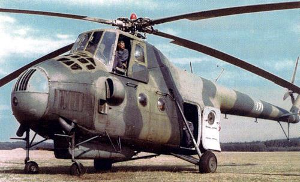

# ИСТОРИЯ ВЕРТОЛЕТА

Во второй половине 50-х гг. конструктор М.Л. Миль начал задумываться о
разработке качественно новых машин легкого и среднего классов второго
поколения, которые заменили бы серийно выпускаемые вертолеты первого
поколения Ми-1 и Ми-4. На смену Ми-1 проектировался одномоторный
вертолет, а в качестве наследника Ми-4 рассматривался вертолет, оснащенный
двумя двигателями.

Новый вертолет в аванпроекте преподносился как дальнейшая модификация
Ми-4, но с газотурбинной силовой установкой. Несущий и рулевой винты,
хвостовая и концевая балки, трансмиссия, шасси, система управления и
большинство других частей и агрегатов оставались практически неизменными.
Изменению подверглись носовая и центральная части фюзеляжа. Силовая
установка переносилась наверх грузовой кабины, пилотская кабина – в
переднюю часть аппарата, а для повышения вместимости грузопассажирской
кабины был переделан фюзеляж. Предусматривалась возможность перевозки
до 20 человек или транспортировка крупногабаритной техники. С самого начала
проектирования планировалось создать, помимо основных вариантов –
пассажирского и транспортно-десантного, транспортно-боевую и
противолодочную модификации, а также модификацию вертолета-салона.

По настоянию руководства Министерства гражданской авиации СССР 20
февраля 1958 г. Совет Министров СССР принял постановление о разработке
вертолета В-8 грузоподъемностью 1,5 – 2 т с вертолетным вариантом двигателя
АИ-24 конструкции А.Г. Ивченко. Примерно через год проект В-8 поддержало и
командование Советских ВВС. Разработкой В-8 руководил заместитель главного
конструктора В.А. Кузнецов. Ведущим конструктором был назначен Г.В. Ремезов
(потом – В.А. Никифоров). После утверждения эскизного проекта и натурного
макета в 1959 г. началось рабочее проектирование однодвигательного В-8.

Мощность двигателя АИ-24В составляла 1900 л.с., что позволяло сохранить на
В-8 трансмиссию его предшественника Ми-4. Однако характеристики АИ-24В,
особенно удельный расход топлива, оставляли желать лучшего, а главное –
конструкторы хорошо понимали необходимость перехода на более безопасный
и надежный двухдвигательный вариант. Поэтому несколько авиамоторных ОКБ
получили задание на проектирование вертолетного двигателя мощностью
1250 л.с. Наибольший интерес к этой разработке проявило молодое ОКБ-117,
руководимое главным конструктором С.П. Изотовым. Этому же коллективу
поручили конструирование нового двухвального редуктора. Возможность
увеличения совокупной мощности силовой установки позволяла увеличить
грузоподъемность создаваемой машины. Заказчик одобрил проект
предложенной модификации, и 30 мая 1960 г. принято решение о постройке
параллельно с однодвигательным В-8 и двухдвигательного варианта В-8А.

В процессе эскизного и рабочего проектирования инженеры ОКБ М.Л. Миля
усовершенствовали не только трансмиссию, но и ряд других агрегатов и систем
В-8. В частности, было решено: шасси делать не четырех, а трехопорным с
передними самоориентирующимися сдвоенными колесами; фрикционные
демпферы вертикальных шарниров втулки несущего винта заменить
гидравлическими; спиртовую противообледенительную заменить
электротепловой системой; гидроусилители всех четырех каналов управления
установить единым гидроблоком (гидрокомбайном); в систему управления
ввести триммеры с загрузочными электромеханизмами; на шасси и концевой
балке установить обтекатели и т.д. Большинство нововведений
вертолетостроители обязались реализовать и на серийно строящихся Ми-4,
чтобы добиться максимальной взаимозаменяемости частей и агрегатов этой
машины и вновь создаваемой. Таким образом, Михаил Леонтьевич и его
соратники постепенно превращали глубокую модернизацию Ми-4 в
принципиально новый перспективный вертолет.

В конструкции фюзеляжа впервые использовались крупногабаритные
дюралюминиевые штамповки и клеесварные соединения. В носовой части
размещались удобная, хорошо остекленная кабина экипажа с прекрасным
обзором и аккумуляторные отсеки под полом. Экипаж вертолета состоял из трех
человек: летчика-командира, летчика-штурмана и борттехника.
В центральной части фюзеляжа размещались грузопассажирская кабина
размером 5,34х2,34х1,8 м, задний отсек со створками грузового люка,
двигательный и редукторный отсеки, а также расходный топливный бак.
Грузопассажирская кабина В-8 рассчитывалась на перевозку груза и техники
общей массой до двух тонн. Для выполнения спасательных операций была
предусмотрена установка бортовой стрелы грузоподъемности 150 кг снаружи
над дверью. Для перевозки крупногабаритных грузов на вертолете В-8 впервые
была смонтирована шарнирно-маятниковая система внешней подвески
грузоподъемностью до 2500 кг. Капоты двигателей и редуктора позволяли
обслуживать все агрегаты, расположенные в верхней части вертолета, без
применения стремянок. Два подвесных топливных бака закреплялись
стальными лентами по бокам фюзеляжа. На хвостовой балке находился
стабилизатор, угол установки которого фиксировался на земле.

Однодвигательный В-8 первый раз оторвался от земли 24 июня 1961 г. под
управлением летчика-испытателя Б.В. Земскова. В декабре 1961 г. первый В-8
был представлен на совместные государственные испытания, но в качестве
прототипа будущих серийных машин рассматривался недолго и с 1963 г.
использовался только в роли испытательного стенда. Фирма и заказчики
сделали ставку на двухмоторный вариант. Собранный в ноябре 1961 г. второй
экземпляр однодвигательного В-8 на летные испытания так и не поступал и
служил лишь для наземных испытаний. Он сразу же был принят базовым для
последующего переоборудования в двухмоторный вариант.

Новые двигатели ТВ2-117 и главный редуктор ВР-8, разработанные в ОКБ С.П.
Изотова, поступили летом 1962 г. Двигатели развивали взлетную мощность по
1500 л.с. и обладали сравнительно высокими удельными показателями.

Двухдвигательная силовая установка обеспечивала высокую
энерговооруженность, достаточную для выполнения горизонтального полета
без снижения при отказе одного из двигателей. ВР-8 представлял собой
трехступенчатый планетарный редуктор с передаточным отношением 1:62,6.
2 августа 1962 г. летчик-испытатель Н.В. Лешин впервые оторвал
двухдвигательный вариант от земли, а 17 сентября вертолет совершил первый
свободный полет. В марте 1963 г. вертолет В-8А поступил на первый этап
совместных государственных испытаний, которые, в целом, проходили
благополучно, хотя время от времени полеты приостанавливались для
проведения доработок и устранения дефектов. Летом 1963 г. испытания
пришлось прервать почти на два месяца для доработки двигателей и главного
редуктора.

В конструкцию опытной машины постоянно вносились изменения, все больше
отличавшие ее от предшественника Ми-4. В частности, для снижения уровня
вибраций был создан новый пятилопастной несущий винт. Лопасти остались
цельнометаллическими, как на Ми-4, но некоторые узлы заменили на
упрочненные и установили новую теплоэлектрическую
противообледенительную систему. Старый рулевой винт с деревянными
лопастями сменил новый с цельнометаллическими лопастями и втулкой на
карданном подвесе. Однокамерные стойки шасси заменили двухкамерными с
пневмомасляными амортизаторами, которые исключали появление
динамической неустойчивости. Изменилась конструкция хвостовой опоры.
Стойки и колеса шасси получили обтекатели. Установленный в систему
управления по дифференциальной схеме четырехканальный автопилот АП-34
значительно улучшил пилотажные характеристики В-8А.

В процессе испытаний и доводки новая силовая установка была оборудована
автоматической системой регулирования, обеспечивавшей поддержание
частоты вращения несущего винта в заданных пределах и синхронизацию
работы двигателей. В случае отказа одного из двигателей в полете система
обеспечивала автоматический выход работающего двигателя на повышенную
мощность.

Все усовершенствования оперативно вносились в собиравшийся третий
экземпляр нового вертолета. Этот вертолет создавался в десантно-
транспортном варианте и получил название В-8АТ. Двадцать откидных сидений
десантников располагались вдоль бортов грузовой кабины. Заказчики на макете
отработали загрузку и крепление в кабине различных видов боевой и
инженерной техники, а также установку комплекса вооружения, аналогичного
применяемому на Ми-4АВ. Внешний вид В-8АТ немного изменился по сравнению
с В-8А: боковые двери кабины экипажа были заменены сдвижными блистерами;
сдвижной стала и боковая дверь грузовой кабины.

Сборку В-8АТ закончили летом 1963 г., и он заменил на государственных
испытаниях В-8А, который в дальнейшем использовался для летных и наземных
ресурсных испытаний. Во время летных испытаний 19 апреля 1964 г. экипаж
летчика-испытателя В. Колошенко установил на В-8АТ два мировых рекорда:
рекорд дальности по замкнутому маршруту (2465,7 км) и рекорд скорости на
базе 2000 км (201,8 км/ч). Несколько лет спустя, в 1967-1969 гг. экипажи И.
Копец и Л. Исаевой на Ми-8 установили пять женских мировых рекордов.

В мае 1964 г. была завершена сборка пассажирского В-8АП в варианте
правительственного салона. Он почти ничем не отличался от В-8АТ и послужил
базой для испытания модернизированного автопилота АП-34Б и синхронизатора
оборотов несущего винта. В сентябре того же года с полетов на В-8АП начался
второй этап программы совместных государственных испытаний. Через месяц к
нему присоединился В-8АТ. Вертолеты продемонстрировали прекрасные летно-
технические характеристики. В ноябре 1964 г. Комиссия приняла решение
рекомендовать вертолет к запуску в серийное производство, а его десантно-
транспортный вариант – к принятию на вооружение.

Зимой 1964-1965 гг. В-8АП был дооборудован в пассажирский вариант – на нем
установили 20 мягких кресел, гардероб, тепло- и звукоизоляцию, отопление,
вентиляцию, кондиционирование и ряд элементов внутреннего дизайна. В
марте 1965 г. закончились его испытания в ГосНИИГА, и пассажирский вариант
был также рекомендован в серию для оснащения Аэрофлота. Поступив в
серийное производство, новый вертолет получил название Ми-8Т – в десантно-
транспортном варианте и Ми-8П – в пассажирском. В конце 1965 г. из
сборочного цеха Казанского завода вышли первые серийные образцы.
Серийный Ми-8Т отличался от прототипа круглой формой боковых окон
грузовой кабины. Прямоугольные окна остались особенностью только
пассажирского варианта Ми-8П и его последующих модификаций.

В 1968 г. завершились испытания вооруженного Ми-8ТВ. У него по бокам
фюзеляжа крепились ферменные консоли с двумя балочными держателями на
каждой стороне для подвески блоков УБ-16-57 неуправляемых ракет КАРС-57
(С-5) или бомб калибра от 50 до 500 кг. От предусмотренной проектом носовой
пулеметной установки пришлось отказаться в пользу бомбовой нагрузки.
По завершении испытаний вооружения в 1968 г. легкий десантно-транспортный
вертолет Ми-8Т был официально принят на вооружение Советских ВВС. К этому
времени ресурс основных частей вертолета уже был доведен до 1000 ч. За свои
прекрасные летно-технические и пилотажные качества, а также удобство
летной и наземной эксплуатации советские вертолетчики, "пересевшие" с Ми-4
на Ми-8 прозвали новую винтокрылую машину: "Василисой Прекрасной".

К 1969 г. Ми-8 полностью заменил Ми-4 на сборочной линии. Его производство
с каждым годом увеличивалось, достигая нескольких сотен машин в год. Всего с
1965 по 1996 гг. Казанский вертолетный завод построил в разных
модификациях около четырех с половиной тысяч Ми-8 с двигателями ТВ2-117. В
1970 г. производство Ми-8 параллельно начато на Улан-Удэнском авиационном
заводе. Это предприятие выпустило до настоящего времени свыше 3700
вертолетов Ми-8 с двигателями ТВ2-117.

В ходе доводки и эксплуатации Ми-8 конструкция его частей и деталей
постоянно подвергались совершенствованию. Инженерам МВЗ им. М.Л. Миля
совместно с казанскими и улан-удинскими коллегами удалось добиться
значительного улучшения его конструкции и повышения ресурса агрегатов.
Назначенный ресурс современных модификаций Ми-8Т превышает 20000 ч. В
1980 г. вертолет Ми-8 впервые получил свидетельство о летной годности в
соответствии с американскими нормами FАR-29 при полетах в Японии. В 70 –
90-х гг. на вертолетах Ми-8 установили высокоэффективные надвтулочные
виброгасители, радиолокатор, заменили маятниковую систему внешней
подвески на тросовую грузоподъемностью 3 т, повысили боевую живучесть,
ввели бронирование, усилили вооружение, неоднократно модернизировали
различное оборудование и т.д. По заказу польских военных был разработан
вариант размещения в грузовой кабине сидений для 37 десантников. Кроме
отечественных специалистов доработки агрегатов Ми-8 вели и зарубежные
службы эксплуатации, в частности египтяне устанавливали на них английские
пылезащитные устройства, а финны – навигационные локаторы. Во второй
половине 80-х гг. на МВЗ был проведен комплекс экспериментальных
исследований по улучшению аэродинамических характеристик вертолета –
демонтированы подвесные баки, установлены новые створки грузового люка,
обтекатели автомата перекоса и выхлопных сопел двигателей и т.п.
Большое значение для повышения летно-технических данных Ми-8 имела
доработка силовой установки. Вскоре после начала серийного производства
вертолеты стали оснащаться улучшенными двигателями ТВ2-117А. На
вертолетах, поставлявшихся в южные страны, с 1973 г. устанавливалась
специальная модификация двигателей, предназначенная для эксплуатации при
высоких температурах воздуха. В конце 70-х гг. был создан форсированный
двигатель ТВ2-117Ф с мощностью на чрезвычайном режиме 1700 л.с. Его
применили на модификации Ми-8ПА. В 80-е гг. серийные вертолеты Ми-8
вместо ТВ2-117А оборудовались новой, более долговечной моделью ТВ2-117АГ
с графитовым уплотнением в опорах турбокомпрессора. Этой модификации
присвоили вновь обозначение Ми-8АТ. Она до настоящего времени служит
базой для разработки различных модификаций, преимущественно гражданского
назначения. Оснащенные дешевыми ТВ2-117АГ вертолеты Ми-8АТ имеют
широкое распространение в равнинных районах с умеренными температурами
воздуха. В 1987 г. на базе двигателей ТВ2-117ТГ создана опытная модификация
Ми-8ТГ, впервые в мире приспособленная для работы на жидком метане. С
целью повышения надежности эксплуатации силовых установок
разрабатывались пылезащитные устройства различной конструкции, из которых
так называемые грибковые в 1977 г. поступили в серийное производство и
эксплуатацию. Самым же выдающимся событием в истории развития Ми-8 была
модернизация вертолета под более мощные двигатели ТВ3-117МТ.
Во второй половине 60-х гг. в ленинградском ОКБ С.П. Изотова был разработан
двигатель ТВ3-117 мощностью 1900 л.с. Модификацию этого двигателя
предусматривалось установить и на боевом вертолете Ми-24. Возникла идея
максимально унифицировать силовую установку, трансмиссию и винты для всех
трех вертолетов.

В 1971 г. вместо ТВ2-117 и старой трансмиссии на Ми-8Т решили установить
двигатели ТВ3-117МТ, главный редуктор ВР-14 и усиленную трансмиссию.
Кроме того, модернизированный аппарат предполагалось оснастить
вспомогательной силовой установкой АИ-9 со стартером-генератором и рулевым
винтом обратного вращения – из толкающего винт превращался в тянущий.
Благодаря изменению направления вращения, при котором нижняя лопасть шла
вперед – навстречу возмущенному потоку от несущего винта, и увеличению
хорды лопастей эффективность путевого управления существенно возросла.
В начале 70-х гг. началось массовое снятие с эксплуатации Ми-4. В
высокогорных районах и странах с жарким климатом Ми-8 с ТВ2-117 их
заменить не могли. Пришлось поторопиться, и летом 1975 г.
модернизированный вертолет был построен, а 17 августа того же года впервые
поднялся в воздух. Летные испытания показали значительное улучшение летно-
технических характеристик, особенно потолка и скороподъемности. На боковых
фермах модернизированного вертолета размещалось уже не по два, а по три
балочных держателя. Принятый на вооружение вертолет получил название Ми-
8МТ и с 1977 г. пошел в серию на Казанском вертолетном заводе. Со
следующего года он строился с модернизированными двигателями ТВ3-117МТ
серии III. Первое время число построенных вертолетов с ТВ3-117 существенно
уступало количеству предыдущих модификаций с ТВ2-117, но боевые действия
в Афганистане заставили пересмотреть портфель заказов, к середине 80-х гг.
Ми-8МТ и его модификации стали основными на заводских сборочных линиях.
Казанский завод выпустил с 1977 по 1997 гг. свыше трех с половиной тысяч
вертолетов с ТВ3-117МТ и ТВ3-117ВМ.

В 1981 г. Ми-8МТ впервые демонстрировался на авиационной выставке в
Париже. Из рекламно-коммерческих соображений ему присвоили новое
название Ми-17, под которым он и получил распространение на мировом рынке.
Пассажирская версия вертолета, аналогичная по внутренней отделке Ми-8П,
получила название Ми-17П. Базовая модель Ми-8МТ, так же как и ее
предшественница, послужила основой для создания многочисленных
модификаций и вариантов, предназначенных для различных областей военного
и гражданского применения.

Следующим важным этапом модернизации Ми-8 стало оснащение его
высотными двигателями ТВ3-117ВМ, первые образцы которых прошли
испытания в 1985 г. За два года в ОКБ М.Л. Миля была создана новая базовая
модель Ми-8МТВ (Ми-17-1В в экспортном варианте). Высотный двигатель
позволил вертолету осуществлять взлет и посадку на высотах до 4000 м и
выполнять горизонтальный полет на высотах до 6000 м. Кроме потолков
возросли и другие летно-технические характеристики вертолета:
скороподъемность, дальность и т.д. Новая базовая модель отличалась
современным оборудованием, включающим метеорадиолокационную станцию и
радиосистему дальней навигации, имела бронирование, протектированные баки
с пенополиуретановым заполнителем, носовой и кормовой пулеметы ПКТ, шесть
подвесных балочных держателей и шкворневые установки под оружие
десантников. С учетом "афганского" опыта была повышена живучесть частей и
агрегатов вертолета. Для повышения безопасности эксплуатации на Ми-8МТВ
установили систему аварийного приводнения. С 1988 г. началось освоение
серийного производства Ми-8МТВ (Ми-8МТВ-1). Базовую модель можно
использовать в транспортном, десантном, десантно-штурмовом, санитарном,
перегоночном вариантах, а также в вариантах вертолета огневой поддержки и
постановщика мин.

На Улан-Удэнском заводе вертолет Ми-8МТВ пошел в серию в 1991 г. с
небольшими изменениями в оборудовании под обозначением Ми-8АМТ (Ми-
171). Вертолет используется в транспортном, десантно-транспортном,
санитарном и пассажирском вариантах. В 1997 г. вертолет Ми-171А в России
получил сертификат типа. В 1999 г. вертолет Ми-171 получил сертификат типа
в Китае по американским нормам FAR-29 в пассажирском и грузовом вариантах
для полета над сушей и водной поверхностью.
Вслед за Ми-8МТВ-1 (Ми-17-1В) в 90-е гг. на ОАО "Казанский вертолетный
завод" последовали новые базовые модификации Ми-8МТВ-2 и Ми-8МТВ-3. В их
кабине размещалось до 30 десантников. Эти машины имели усиленное
бронирование, модернизированные системы. На Ми-8МТВ-3 из шести балочных
держателей осталось только четыре, но при этом число возможных вариантов
подвески вооружения увеличилось с 8 до 24. Вертолеты получили рулевой винт
с увеличенной хордой лопастей и повышенной жесткостью проводки
управления, систему беспарашютного десантирования и бортовую стрелу
большей грузоподъемности. Ми-8МТВ-3 в 1991 г. послужил прототипом для
экспортной модификации Ми-172, прошедшей в 1994 г. сертификацию в
индийском авиарегистре по американским нормам FAR-29. Сертифицированный
в России вертолет называется: Ми-172А. Все усовершенствования,
опробованные на этих модификациях, в 1992 г. были внедрены и на новой
демонстрационной модели Ми-17М. Кроме того, на ней установили
международную навигационную систему и усовершенствованный радиолокатор,
увеличили размеры боковых дверей, а задний грузовой люк переделали по типу
Ми-26 - со створками уменьшенного размера и опускающимся трапом-
аппарелью. По договору с канадской фирмой была создана совместная
модификация Ми-17КФ с западной авионикой, скомпонованной по типу "glass
cockpit".

Демонстрационная модель Ми-17М послужила основой для создания в 1997 г. в
Казани очередной базовой модификации Ми-8МТВ-5 (Ми-17В-5). Основными
отличиями базового Ми-8МТВ-5 от предшествующих моделей являются новые
современные формы и конструкция планера. На вертолете установлена
дополнительная правая входная дверь и значительно расширена левая, створки
заднего грузового люка заменены на опускающийся трап-аппарель с
гидросистемой выпуска и уборки, число мест десантников увеличено до 36.
Теперь десантники могут покидать вертолет тремя потоками через две двери и
рампу всего за 15 секунд. Расширенная левая дверь, кроме того, позволяет
использовать новое спасательное устройство со стрелой грузоподъемностью
300 кг. С его помощью можно поднимать на борт сразу до трех человек.
Устроенный в полу большой люк позволил использовать систему внешней
подвески грузоподъемности 4,5 т. На вертолете полностью перекомпонована
носовая часть. Ей придан современный вид с цельным, поднимаемым вверх
обтекателем, под которым может быть установлен метеолокатор и новое
радиооборудование. На Ми-8МТВ-5 установлен модернизированный пилотажно-
навигационный комплекс, а кабина экипажа адаптирована под использование
очков ночного видения, что обеспечивает возможность применения вертолета в
любое время года и суток, в различных метеоусловиях. В конструкцию других
видов оборудования также внесены существенные изменения, в частности, в
энергосистему установлены новые бесщеточные генераторы.

[По материалам ОАО "Московский вертолётный завод им. М. Л. Миля"](http://www.Mi-Helicopter.Ru)

