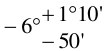
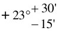
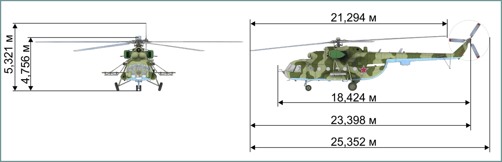

# Основные сведения и предназначение вертолета

## Основные геометрические данные вертолета

Длина:

- без несущего и рулевого винтов: 18,424 м
- с вращающимися несущим и рулевым винтами: 25,352 м

Высота:

- без рулевого винта: 4,756 м
- с вращающимся рулевым винтом: 5,321м

Расстояние от земли до нижней точки фюзеляжа (клиренс): 0,445 м

Площадь горизонтального оперения: 2,0 м2

Размеры грузовой кабины:

- длина (по полу) 5,34 м
- ширина 2,3 м
- высота 1,8 м

Проём фюзеляжа в районе створок грузовой кабины:

- высота 1,620 м
- ширина (по строительной горизонтали) 2,288 м

Размеры проема двери грузовой кабины:

- высота 1, 405 м
- ширина 0,825 м

Несущий винт:

- диаметр 21,294 м
- число лопастей 5
- направление вращения: Вперёд, вправо, назад

Рулевой винт:

- тип Карданный
- диаметр 3,908 м
- направление вращения Вниз, вперёд, вверх
- число лопастей 3
- угол установки лопастей (на R=0,7):
    - минимальный (левая педаль до упора)

        

    - максимальный (правая педаль до упора)

        

ВЗЛЁТНО-ПОСАДОЧНЫЕ УСТРОЙСТВА:

- тип шасси Трёхстоечное
- неубирающееся
- колея шасси 4,510 м
- база шасси 4,281 м
- Размеры пневматиков:
    - передней стойки 595 Х 185 мм
    - основных стоек 865 X 280 мм

Стояночный угол (вперед вверх) 4°10'

Хвостовая опора Амортизационная

## Основные тактико-технические данные

Нормальный взлетный вес 11100 кг

Максимальный взлетный вес 13000 кг

Десантная нагрузка:

- нормальная 2000 кг
- максимальная (при полной заправке основных топливных баков) 4000 кг
- количество перевозимых солдат 21 - 24 чел.
- количество раненых, перевозимых на носилках 12 чел.

Максимальная скорость горизонтального полёта на высотах 0–1000 м:

- при нормальном взлетном весе 250 км/ч
- при максимальном взлетном весе 230 км/ч

Крейсерская скорость полёта на высотах до 1000 м:

- при нормальном взлетном весе 220–240 км/ч
- при максимальном взлетном весе 205–215 км/ч

Статический потолок при нормальном взлетном весе вне влияния земли в стандартных атмосферных условиях: 3960 м

Практический потолок:

- с нормальным взлетным весом 5500 м
- с максимальным взлетным весом 3900 м

Время набора высоты на номинальном режиме работы двигателей и
наивыгоднейшей скорости набора (120 км/ч; ПОС выключена):

- с нормальным взлетным весом
    - 1000 м 1,8+0,5 мин
    - 3000 м 6+1 мин
    - 4000 м 9,5+2 мин

- с максимальным взлетным весом
    - 1000 м 2,4+0,5 мин
    - 3000 м 10,9+1 мин

Практическая дальность полёта на высоте 500 м на крейсерской
скорости при полной заправке основных топливных баков с 5% остатком
топлива:

- при десантной нагрузке 2117 кг 495 км
- при десантной нагрузке 4000 кг 465 км
- с одним полностью заправленным дополнительным топливным баком 725 км
- с двумя полностью заправленными дополнительными топливными баками (перегоночная дальность) 950 км

## Предназначение и задачи

Военно-транспортный вертолет Ми-8МТВ2 предназначен для повышения
мобильности сухопутных войск и огневой поддержки их на поле боя.

На вертолете выполняются следующие основные задачи:

- десантирование оперативно-тактического и тактического воздушных
десантов;
- обеспечение маневра и действий войск в ходе боя;
- перевозка грузов в грузовой кабине и на внешней подвеске;
- уничтожение на переднем крае и в тактической глубине боевых
машин пехоты; живой силы в боевых и предбоевых порядках, в
опорных пунктах; противотанковых средств, артиллерии и
тактических ракет на огневых (стартовых) позициях;
радиолокационных постов, зенитных средств, передовых пунктов
управления, а также боевых и транспортных вертолетов на
площадках;
- уничтожение воздушного (морского) десанта и аэромобильных частей
 (подразделений) в районе выброски (высадки);
- обеспечение пролета оперативно-тактического и тактического
воздушных десантов в район десантирования и поддержки их боевых
действий;
- воздушная разведка противника;
- минирование с воздуха (задача в игре не реализована);
- поиск и спасение экипажей самолётов (вертолетов), терпящих
бедствие;
- эвакуация раненых и больных.

Для решения указанных задач вертолет Ми-8МТВ2 применяется в следующих
вариантах:

1. Транспортный:
    - без дополнительных топливных баков (для перевозки в грузовой
    кабине грузов общим весом до 4000 кг);
    - с одним дополнительным топливным баком (не реализовано);
    - с двумя дополнительными топливными баками (не реализовано);
    - для транспортировки грузов на внешней подвеске общим весом до
    3000 кг.
2. Десантный:
    - для перевозки десантников с личным оружием (до 24 десантников).
3. Санитарный (в игре не реализован):
    - до 12 человек на носилках и сопровождающий;
    - комбинированный вариант (до 20 человек – 3 на носилках и 17 на
    сидячих местах или 15 сидячих мест и один дополнительный
    топливный бак).
4. Воздушное минирование (в игре не реализовано):
    - с оборудованием ВСМ-1.
5. Боевой (с различным вооружением на шести узлах подвески).
6. Перегоночный (в игре не реализован).

Для перевозки длинномерных крупногабаритных грузов (типа лопастей
несущего винта) и выполнения учебно-тренировочных прыжков с парашютом
(парашютного десантирования) через грузовой люк, на вертолете
предусмотрено полуоткрытое положение или снятие створок грузовой кабины.

Вертолет Ми-8МТВ2 может выполнять возложенные на него задачи днем и
ночью в простых и сложных метеорологических условиях с аэродромов и с
неподготовленных площадок.

Экипаж вертолета состоит из трех человек: командира экипажа, летчика-
штурмана и бортового техника.

{!docs/mi8/abbr.md!}
