# Кабина экипажа

В состав кабины экипажа входят панели с органами управления системами и
оборудованием, органы управления вертолетом и двигателями, приборное
оборудование.

Для большинства органов управления в кабине предусмотрены всплывающие
подсказки, которые показываются при наведении курсора мыши на тот или
иной орган управления или переключатель. Благодаря им легче запомнить все
переключатели в кабине. Подсказки можно включить или выключить в меню
настроек.

С помощью мыши можно совершать следующие действия:

- чтобы задействовать переключатель или кнопку, нажмите левую
кнопку мыши;
- чтобы повернуть многопозиционный переключатель в необходимом
направлении, нажмите правую или левую кнопку мыши
соответственно;
- чтобы повернуть поворотный регулятор (1-й вариант), вращайте
колесо мыши (при вращении с зажатой клавишей [[LShift]] скорость
вращения увеличивается в 10 раз);
- чтобы повернуть поворотный регулятор (2-й вариант), зажмите левую
кнопку мыши и потяните мышь.

Если навести курсор мыши на устройство, которым можно управлять, курсор
изменит цвет на зеленый, а рядом с ним появится значок, указывающий
действие, которое можно совершить с данным устройством. Все функции,
выполняемые с помощью мыши, продублированы соответствующими
сочетаниями клавиш на клавиатуре и указаны в окне настроек управления. В
этом руководстве такие сочетания клавиш отмечены [[ особым ]] [[ форматированием ]].

Приборное оборудование вертолета представляет собой комплекс приборов,
обеспечивающих:

- пилотирование вертолета в любых метеорологических условиях днем
и ночью;
- контроль за работой двигателей, трансмиссии и управления.

Комплекс приборного оборудования включает:

- приборы контроля работы двигателей, трансмиссии и вертолетных
систем;
- пилотажно-навигационные приборы и оборудование.

## Панели с органами управления системами и оборудованием

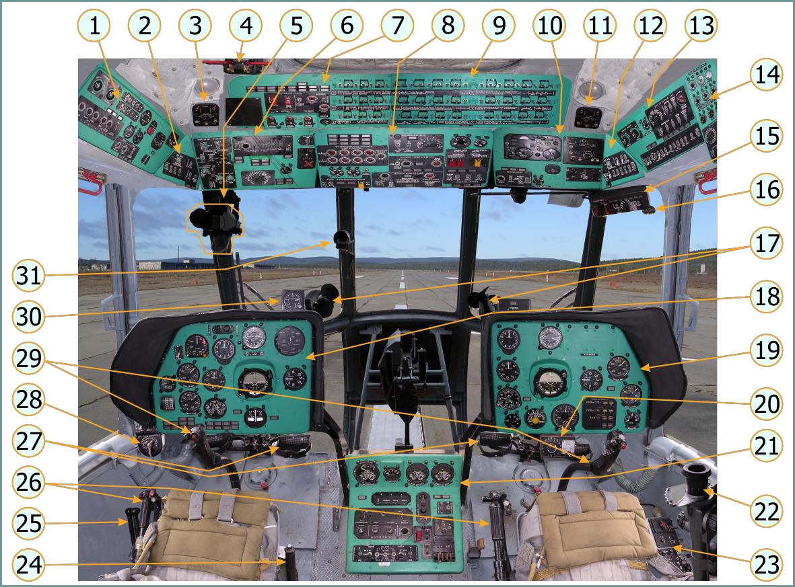

1. Левая боковая панель электропульта 
2. Левый щиток электропульта 
3. Абонетский аппарат СПУ-7 левого летчика 
4. Краны останова двигателей ("стоп- краны") 
5. Прицел ПКВ 
6. Левая панель электропульта 
7. Левая панель АЗС 
8. Средняя панель электропульта 
9. Правая панель АЗС 
10. Правая панель электропульта 
11. Абонетский аппарат СПУ-7 правого летчика 
12. Правый щиток электропульта 
13. Правая боковая панель электропульта 
14. Электрощиток 
15. Пульт управления бомбардировочным вооружением 
16. Указатель температуры наружного воздуха
17. Кабинные вентиляторы 
18. Левая приборная доска 
19. Правая приборная доска 
20. Щиток электросбрасывателя (бомбардировочное вооружение) 
21. Центральный пульт 
22. Прицел ОПБ-1р (не моделируется) 
23. Правый дополнительный щиток 
24. Рычаг тормоза несущего винта 
25. Рычаги раздельного управления двигателями (РРУД) 
26. Левый и правый рычаги общего шага НВ (РОШ) 
27. Педали управления 
28. Кран переключения ПВД 
29. Рукоятки продольно-поперечного управления вертолетом (РППУ) 
30. Акселерометр (G-метр) 
31. Магнитный компас КИ-13К

### Левая приборная доска

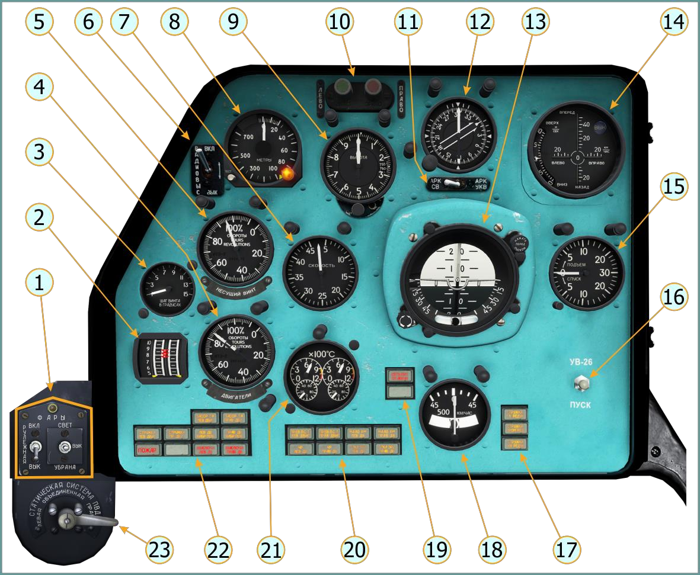

1. Блок управления фарой 
2. Указатель режимов ИР-117 
3. Индикатор УП-21-15 указателя шага несущего винта 
4. Двухстрелочный указатель ИТЭ-2Т числа оборотов двигателя ТВЗ-117ВМ 
5. Указатель ИТЭ-1Т числа оборотов НВ 
6. Выключатель радиовысотомера 
7. Указатель скорости УС-450К 
8. Указатель УВ-5М радиовысотомера РВ-5 
9. Высотомер ВД-10ВК 
10. Курсоуказатель прицела ОПБ-1Р 
11. Переключатель АРК СВ-АРК УКВ
12. Указатель УГР-4УК курсовой системы ГМК-1А 
13. Авиагоризонт АГБ-ЗК 
14. Индикатор висения и малых скоростей аппаратуры ДИСС-15 
15. Вариометр ВР-30МК 
16. Кнопка ручного отстрела патронов ИК- помех устройства УВ-26 
17. Табло 
18. Указатель поворота ЭУП-53 
19. Табло "ОТКАЗ 6201" (системы "свой- чужой") снизу, СЕТЬ ПИТАЕТСЯ ОТ АККУМУЛЯТОРОВ сверху 
20. Табло 
21. Указатель 2УТ-6К температуры газов двигателя ТВ3-117ВМ 
22. Табло 
23. Переключатель системы ПВД

(17) Табло сигнализации стружки в редукторах

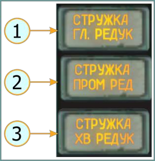

1. Стружка в главном редукторе
2. Стружка в промежуточном редукторе
3. Стружка в хвостовом редукторе

(20) Табло сигнализации

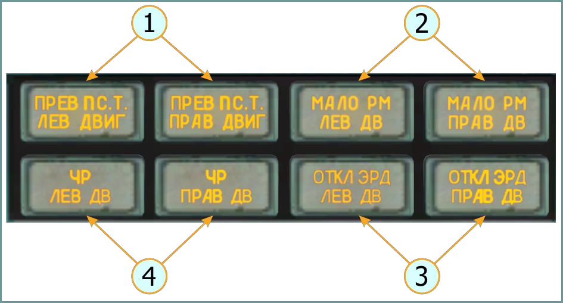

1. Превышение оборотов
свободной турбины левого
 (правого) двигателя
2. Мало давление масла в
левом (правом) двигателе
3. Отключен блок
электронной регулировки
левого (правого) двигателя
4. Включен чрезвычайный
режим (ЧР) левого (правого)
двигателя

(22) Табло сигнализации

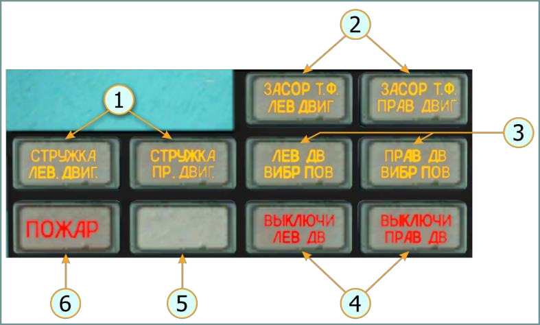

1. Стружка в левом (правом)
двигателе
2. Засорение топливного
фильтра левого (правого)
двигателя
3. Повышенная вибрация
левого (правого) двигателя
4. Выключи левый (правый)
двигатель
5. Табло не используется
6. Пожар (общее табло
пожара для всех защищаемых
отсеков)

### Правая приборная доска

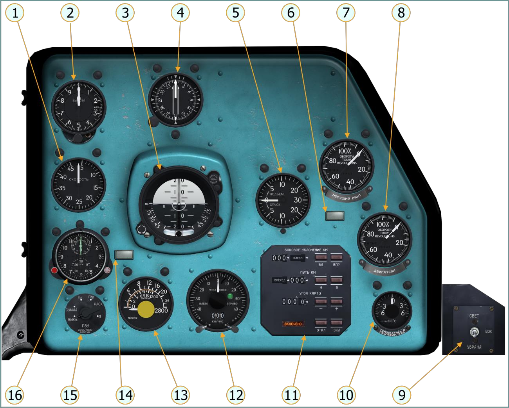

1. Указатель скорости УС-450К 
2. Высотомер ВД-10ВК 
3. Авиагоризонт АГБ-ЗК 
4. Указатель УГР-4УК курсовой системы ГМК-1А 
5. Вариометр ВР-30МК 
6. Табло "ДИСС ОТКАЗАЛ" 
7. Указатель ИТЭ-1Т числа оборотов НВ 
8. Двухстрелочный указатель ИТЭ-2Т числа оборотов двигателя ТВЗ-117ВМ 
9. Блок управления фарой
10. Термометр ТВ-1 контроля температуры в пассажирском салоне (не задействован в игре) 
11. Индикатор координат аппаратуры ДИСС-15 
12. Индикатор путевой скорости и угла сноса аппаратуры ДИСС-15 
13. Указатель БЭ-09К топливомера 
14. Табло "ОСТАЛОСЬ 270 л." 
15. Переключатель топливомера СКЭС- 2027В 
16. Часы АЧС-1

### Центральный пульт

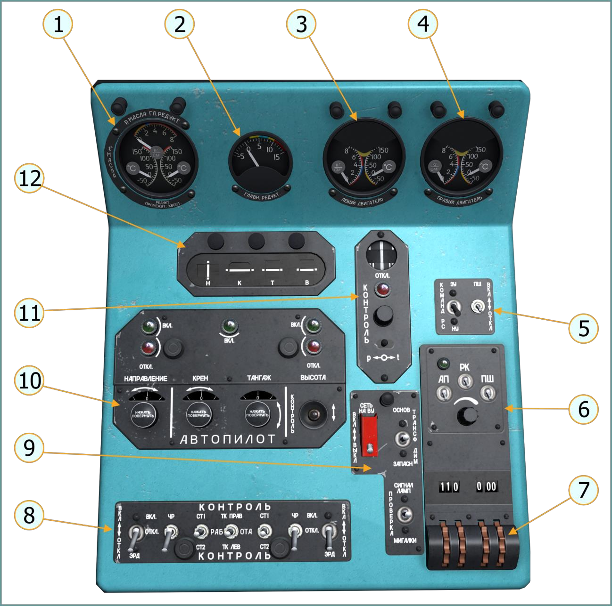

1. Трехстрелочный указатель УИЗ-6 давления масла на входе в главный редуктор и температуры масла в промежуточном хвостовом редукторе 
2. Указатель ТУЭ-48 температуры масла в главном редукторе 
3. Трехстрелочный указатель УИЗ-3 давления топлива, давления и температуры масла левого двигателя 
4. Трехстрелочный указатель УИЗ-3 давления топлива, давления и температуры масла правого двигателя электрического моторного индикатора ЭМИ-ЗРИ 
5. Переключатель выбора наборного устройства или запоминающего устройства радиостанции Р-863
6. Пульт управления радиостанцией Р-863 
7. Наборное устройство рабочей частоты радиостанции Р-863 
8. Пульт контроля блоков ЭРД двигателей 
9. Переключатель проверки сигнальных ламп и включения мигалки и переключатель трансформаторов ДИМ (115/36V) 
10. Пульт управления автопилотом АП-34Б 
11. Блок управления БУ-32-1 системы СПУУ-52-1 
12. Индикатор нулевой ИН-4 автопилота АП-34Б

### Левая боковая панель электропульта

1. Пульт управления подсветом 
2. Табло "РТ ЛЕВ РАБОТАЕТ" "РТ ПРАВ РАБОТАЕТ" 
3. Пульт управления ракетами 7П622 
4. Табло "САРПП РАБОТАЕТ" 
5. Манометр МВУ-10К, контролирующий давление воздуха в воздушной системе 
6. Пульт дистанционного управления аппаратурой РИ-65Б 
7. Манометр МА-60К, контролирующий давление воздуха в тормозной системе колес шасси 
8. Блок 484 изделия 6201 
9. Блок 485 изделия 6201 
10. Пульт управления магнитофоном П- 503Б 
11. Табло "ВКЛЮЧИ ЗАПАСНОЙ" (системы 6201)
12. Переключатель управления замком внешней подвески 
13. Табло "СТВОРКИ ОТКРЫТЫ" 
14. Табло "ЗАМОК ОТКРЫТ" 
15. Табло "СИРЕНА ВКЛЮЧЕНА" 
16. Включатель сирены 
17. Кнопка "Код АНО" для подачи световых сигналов бортовыми огнями 
18. Выключатель САРПП 
19. Кнопки контроля регулятора температуры левого и правого двигателя 
20. Кнопки контроля индикации температуры выходящих газов "ЗЕМЛЯ", "ВОЗДУХ" 
21. Кнопка контроля индикатора вибрации ИВ-500Е

### Левый щиток электропульта

1. Переключатель режимов работы стеклоочистителя 
2. Выключатель СПУУ-52 
3. Выключатель радиовысотомера 
4. Выключатель РИ-65 
5. Кнопка контроля обогрева ПВД
6. Табло "ОБОГРЕВ ИСПРАВЕН" 
7. Табло "ВКЛЮЧИ РИ-65" 
8. Выключатель коррекции ВК-53 
9. Выключатель авиагоризонта 
10. Выключатель вентилятора 
11. Выбор режима подсвета

### Левая панель электропульта

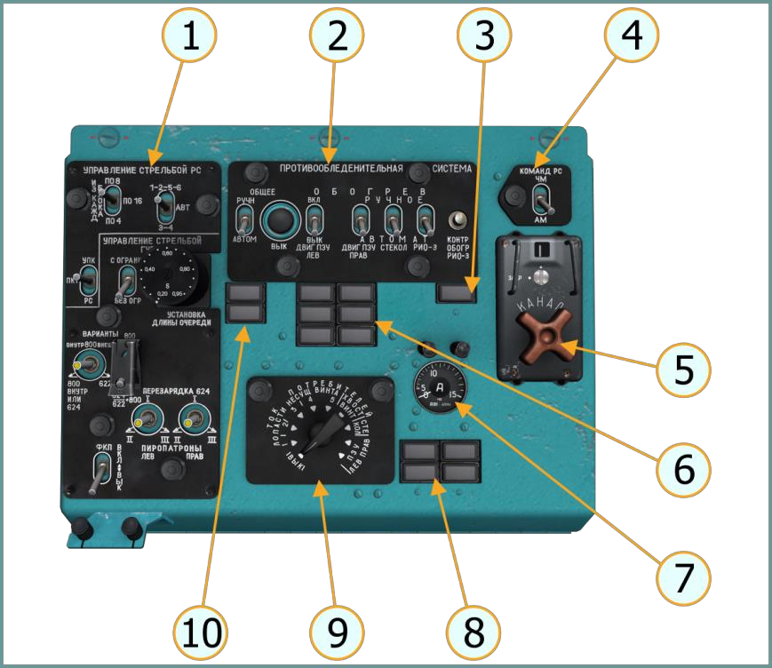

1. Пульт управления вооружением 
2. Пульт управления противообледенительной системой 
3. Табло "ОБОГРЕВ ИСПРАВЕН" 
4. Переключатель АМ-ЧМ радиостанции Р- 863 
5. Пульт управления радиостанцией Р-863 (запоминающее устройство) 
6. Табло "ОБОГРЕВ ДВИГ ЛЕВ", "ОБОГРЕВ ДВИГ ПР", "ЛЕВ ПЗУ ПЕРЕДН", "ПРАВ ПЗУ ПЕРЕДН", "ЛЕВ ПЗУ ЗАДН", "ПРАВ ПЗУ ЗАДН"
7. Амперметр АФ1-150 
8. Табло "1 СЕКЦИЯ", "2 СЕКЦИЯ", "3 СЕКЦИЯ", "4 СЕКЦИЯ" загорание сигнализирует, что секции лопастей несущего винта находятся под током 
9. Галетный переключатель для контроля тока потребляемого элементами противообледенительной системы по амперметру АФ1-150 
10. Табло "ОБЛЕДЕН" и "ПОС ВКЛЮЧЕНА"

### Средняя панель электропульта

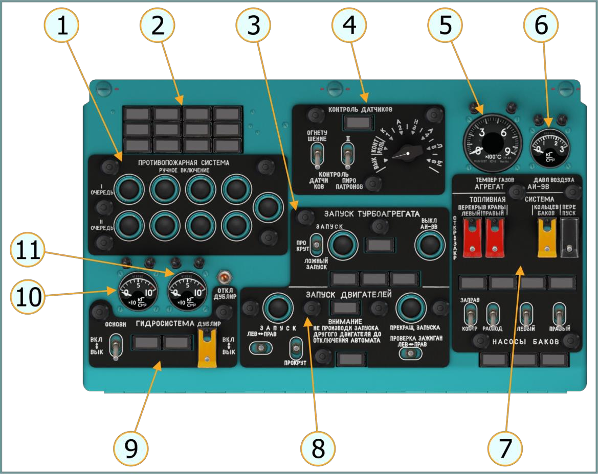

1. Щиток противопожарной системы 
2. Табло пожарной системы "ПОЖАР ЛЕВ ДВИГ", "1 ОЧЕРЕДЬ", "2 ОЧЕРЕДЬ", "ПОЖАР ПРАВ ДВИГ", "1 ОЧЕРЕДЬ", "2 ОЧЕРЕДЬ", "ПОЖАР КО-50", "1 ОЧЕРЕДЬ", "2 ОЧЕРЕДЬ", "ПОЖАР РЕДУК АИ-9В", "1 ОЧЕРЕДЬ", "2 ОЧЕРЕДЬ" 
3. Панель запуска турбоагрегата 
4. Щиток контроля противопожарной системы 
5. Указатель температуры газов турбоагрегата АИ-9В 
6. Указатель давления воздуха турбоагрегата АИ-9В 
7. Панель управления топливной системы 
8. Панель запуска двигателей 
9. Панель управления гидросистемами (табло "ОСНОВ. ВКЛЮЧ.", "ДУБЛИР. ВКЛЮЧ.") 
10. Указатель давления основной гидросистемы 
11. Указатель давления дублирующей гидросистемы

### Правая панель электропульта

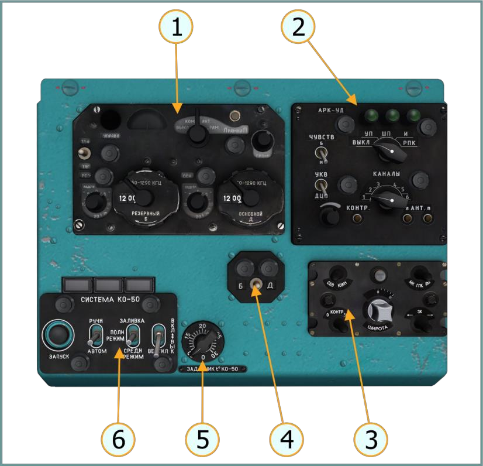

1. Пульт управления радиокомпасом АРК-15 
2. Пульт управления радиокомпасом АРК-УД 
3. Пульт управления ПУ-26 курсовой системы ГМК-1А 
4. Дистанционный переключатель волн радиокомпаса АРК-15 (дальний. ближний) 
5. Задатчик температуры воздуха в грузовой кабине 
6. Аппаратура управления системы КО-50 (керосиновый обогреватель) (табло "ПОДОГРЕВАТЕЛЬ", "ЗАЖИГАНИЕ", "КО-50 РАБОТАЕТ")

### Панели АЗС

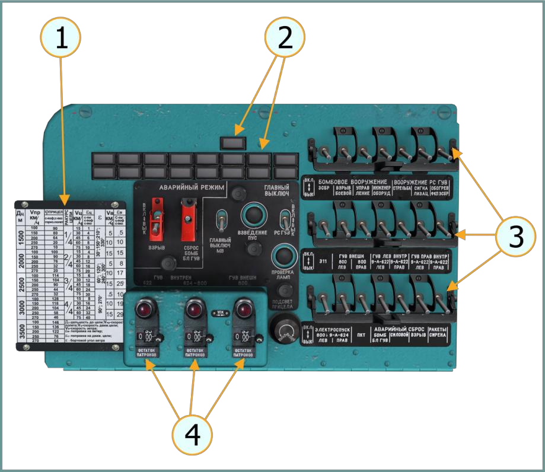

1. Таблица поправок прицеливания
2. Табло и пульт управления вооружением
3. АЗС цепей вооружения
4. Указатели остатка боекомплекта
5. Регулятор яркости сетки прицела

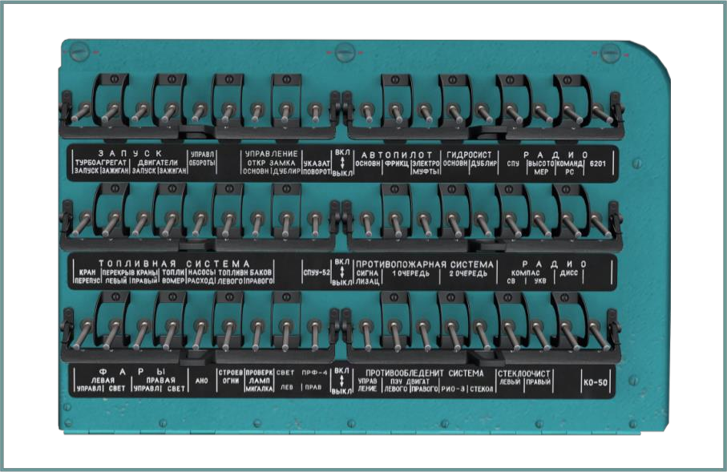

### Правый щиток электропульта

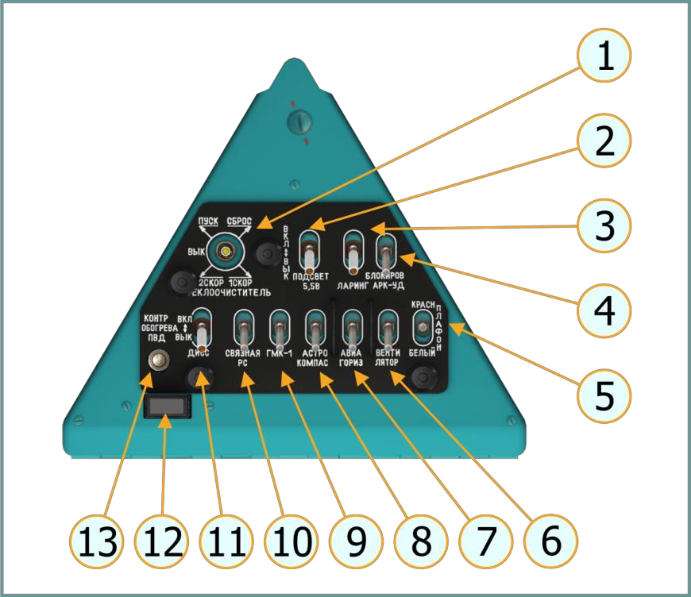

1. Переключатель режимов работы стеклоочистителя 
2. Выключатель подсвета системы "Подсвет 5,5В" (ДИСС-15, пульта управления радиостанции ЯДРО-1А, индикатора РВ-5, индикатора ИР-117) 
3. Выключатель ларингофонов 
4. Выключатель блокировки АРК-УД 
5. Выключатель освещения 
6. Выключатель вентилятора 
7. Выключатель авиагоризонта 
8. Выключатель астрокомпаса 
9. Выключатель ГМК-1 
10. Выключатель связной радиостанции 
11. Выключатель ДИСС 
12. Табло "ОБОГРЕВ ИСПРАВЕН" 
13. Кнопка контроля обогрева ПВД

### Правая боковая панель электропульта

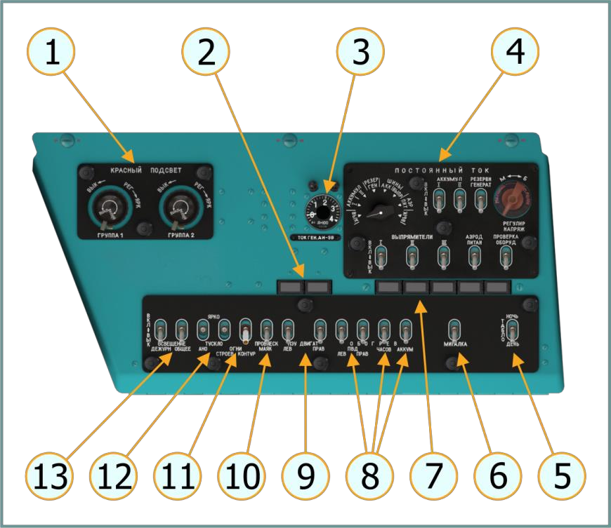

1. Пульт управления красным подсветом 
2. Табло "ЛЕВ ПЗУ ВКЛЮЧЕН", "ПРАВ ПЗУ ВКЛЮЧЕН" 
3. Указатель тока генератора 
4. Панель управления питанием постоянным током 
5. Переключатель изменения яркости свечения табло 
6. Включение режима мигания аварийных ламп и табло 
7. Жёлтые табло "ВКЛЮЧИ ВЫПР. I", "ВКЛЮЧИ ВЫПР. II", "ВКЛЮЧИ ВЫПР. III" "АЭР. ПИТ. ВКЛЮЧЕН", "ПРОВЕРКА ОБОРУДОВ" 
8. Выключатели обогрева левого и правого ПВД, часов и аккумулятора 
9. Выключатели ПЗУ левого и правого двигателей 
10. Выключатель проблескового маяка МСЛ-3 
11. Переключатели управления строевыми и контурными огнями 
12. Управление яркостью АНО и строевых огней 
13. Выключатели дежурного и общего освещения в грузовой кабине

### Электрощиток

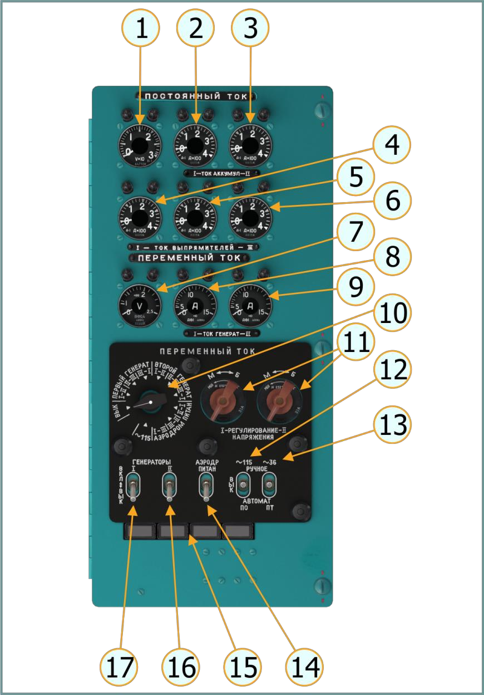

1. Вольтметр постоянного тока В-1 
2. Амперметр А-1 для контроля тока нагрузки 1 аккумуляторной батареи 
3. Амперметр А-1 для контроля тока нагрузки 2 аккумуляторной батареи 4, 5, 
6. амперметры контроля постоянного тока выпрямителей 
7. Вольтметр генераторов переменного тока 8 
9. Амперметры генераторов переменного тока 
10. Электрощиток переменного тока 
11. Регуляторы подстройки напряжения переменного тока 
12. Выключатель преобразователя однофазного тока 
13. Выключатель преобразователя трехфазного тока 
14. Выключатель аэродромного питания 
15. Табло "ГЕНЕРАТ. I ОТКАЗАЛ", "ГЕНЕРАТ. II ОТКАЗАЛ", "АЭР. ПИТ. ВКЛЮЧЕНО", "ПО- 500 ВКЛЮЧЕН" 16, 
17. Выключатели генераторов

### Правый дополнительный щиток

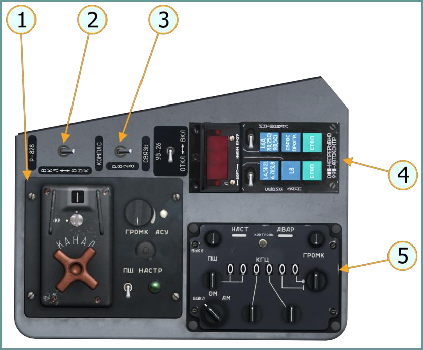

1. Пульт управления радиостанцией Р-828 
2. Выключатель радиостанции Р-828       
3. Переключатель "КОМПАС-СВЯЗЬ"         
4. Пульт управления устройством выброса
ИК-помех (УВ-26)
5. Пульт управления радиостанцией
ЯДРО-1А.

## Органы управления вертолетом и двигателями

Органы управления вертолетом и двигателями являются основными элементами
системы управления, которая отдельно в данном руководстве не
рассматривается.

Управление вертолетом осуществляется изменением величины и направления
силы тяги несущего винта и изменением величины тяги рулевого винта.

В систему управления вертолетом входят:

- двойное ручное управление, в котором две ручки продольно-
поперечного управления (РППУ) кинематически связаны между собой
и с автоматом перекоса;
- двойное ножное управление, имеющее две пары педалей, связанных
с рулевым винтом (РВ);
- двойное объединенное управление "ШАГ-ГАЗ" (рычаги общего шага
или РОШ), в котором две руки "ШАГ-ГАЗ" кинематически связаны с
ползуном автомата перекоса и рычагами топливных насосов-
регуляторов на двигателях;
- раздельное управление двигателями, имеющее на кронштейне левой
ручки "ШАГ-ГАЗ" два рычага (рычаги раздельного управления
двигателями или РРУД), которые связаны с рычагами топливных
насосов-регуляторов;
- управление электромагнитными тормозами пружинных механизмов
загрузки, которые выключаются кнопками, расположенными на обеих
ручках продольно-поперечного управления;
- управление остановом двигателей, имеющее две ручки, которые
связаны с рычагами топливных насосов-регуляторов;
- управление тормозом несущего винта, в котором ручка управления
тормозом в кабине экипажа кинематически связана с рычагом
тормоза, установленного на главном редукторе.

Управление вертолетом в основном жесткой конструкции. Тросы применены в
управлении тормозом несущего винта и частично в управлении рулевым
винтом.

В продольном, поперечном управлении и в управлении общим шагом несущего
винта установлены гидроусилители КАУ-30Б, а в управлении рулевым винтом –
РА-60Б. Все гидроусилители работают по необратимой схеме (усилия от
аэродинамических поверхностей не передаются на органы управления).

Для создания на ручке и педалях управления необходимых усилий,
обеспечивающих возможность плавного выполнения маневра на вертолете, в
систему управления включены пружинные механизмы загрузки. Снятие усилий с
ручки управления и педалей при их перемещении летчиком осуществляется
выключением электромагнитных тормозов ЭМТ-2М с помощью кнопок,
расположенных на обеих ручках управления.

### Продольно-поперечное управление

Продольное и поперечное управление осуществляется летчиком, который,
отклоняя ручку, изменяет наклон тарелки автомата перекоса, что вызывает
циклическое изменение угла установки лопастей в различных азимутальных
положениях, а, следовательно, меняется направление равнодействующей силы
тяги несущего винта.

Продольно-поперечное управление состоит из двух колонок управления,
проводок продольного и поперечного управлений. Каждая из проводок
включает систему тяг и качалок, гидроусилитель КАУ-30Б, механизм загрузки с
электромагнитным тормозом ЭМТ-2М, агрегат управления и автомат перекоса.

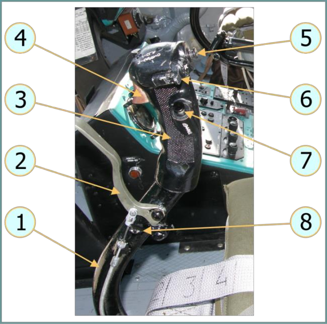

Ручка управления вертолетом изготовлена из изогнутой стальной трубки (1), на
верхнем конце которой установлена рукоятка (3) из эбонита. На рукоятке
смонтированы по четыре кнопки: курковая кнопка (4) обеспечивает включение
радио и СПУ, кнопка (5) — выключение автопилота, кнопка (6) — пуск
(стрельба) оружия, кнопка (7) — включение ЭМТ-2М. На рукоятке левой ручки
установлен рычаг (2) торможения колес, для удержания которого в
заторможенном положении предусмотрен фиксатор (8).

Правая и левая колонки продольно-поперечного управления аналогичны по
конструкции, установлены на балке пола кабины экипажа симметрично
относительно продольной оси вертолета.

В продольном управлении установлен гидроупор, который включается только
на земле. При отклонении автомата перекоса назад на угол 2 º12' и более на
ручке управления от гидроупора возрастает усилие на 12±3 кгс. Резкое
увеличение усилия на ручке управления сигнализирует летчику о
недопустимости дальнейшего отклонения ручки назад для исключения
возможности касания лопастей несущего винта о хвостовую балку при рулении
вертолета на земле.

Включение гидроупора производится микровыключателями при обжатии
амортизаторов главных стоек шасси. После отрыва вертолета от земли
гидроупор автоматически отключается. Функция гидроупора не моделируется в
игре.

### Путевое управление

Путевое управление состоит из двух педалей и проводки управления. Проводка
управления смешанной конструкции, она включает систему тяг и качалок,
участок тросовой проводки с втулочно-роликовой цепью, гидроусилитель РА-60Б, 
механизм загрузки с электромагнитным тормозом ЭМТ-2М, агрегат
управления, сектор и механизм изменения шага рулевого винта.

Изменение шага рулевого винта осуществляется путем отклонения педалей.

При отклонении правой подножки педалей вперед шток механизма изменения
шага рулевого винта втягивается, обеспечивая увеличение шага лопастей
рулевого винта и разворот вертолета вправо; при отклонении левой подножки
педалей вперед происходит обратный процесс.

Педали путевого управления — параллелограммного типа, выполнены в виде
отдельного агрегата, смонтированного на попу кабины экипажа против сидений
пилотов. На подножках смонтированы концевые выключатели для
переключения канала направления автопилота на режим согласования.
Подножки оборудованы ремнями и рифлеными накладками для фиксации
ступни.

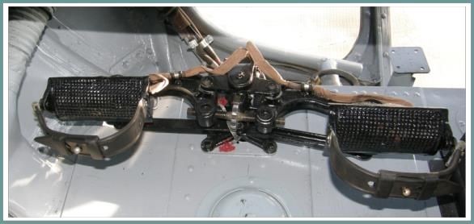

Путевое управление включает в себя систему подвижных упоров (СПУУ-52-1)
ограничивающих предельный угол установки лопастей рулевого винта в
зависимости от температуры и давления окружающей среды (плотности
воздуха: плотность выше – упор работает, плотность ниже – упор убирается).

В полёте кнопка-табло "ОТКЛ." на центральном пульте кабины летчиков не
должна гореть, планка индикатора нуля перемещается влево с увеличением
температуры или уменьшением давления наружного воздуха.

Необходимо иметь в виду, что при установке правой педали на упор канал
курса автопилота отключается.

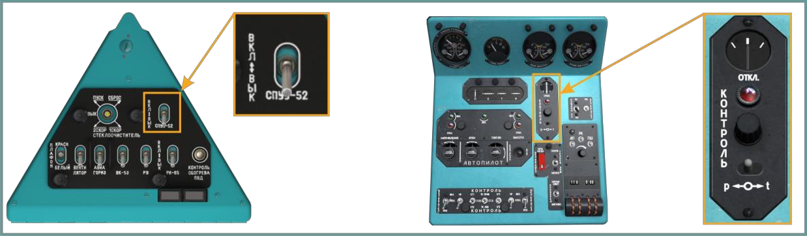

При отказе в полёте СПУУ-52 загорается кнопка-табло "ОТКЛ." В этом случае
необходимо установить выключатель СПУУ-52 на левом щитке электропульта в
положение "ВЫК.", при этом стрелка индикатора нуля должна установиться в
крайнее левое положение, что свидетельствует о снятии ограничения по
перемещению правой педали.

Висение и посадку в этом случае выполнять по возможности против ветра, не
допуская резких перемещений педалей путевого управления.

#### Отказ проводки управления рулевым винтом в полёте

Вертолет в момент разрушения проводки управления рулевым винтом
разворачивается влево и затем выходит (при нулевом крене) на режимы полёта
с правым скольжением и левым разворотом.

На движение педалями вертолет не реагирует. При обнаружении такого отказа
необходимо установить скорость 60–200 км/ч, для выполнения прямолинейного
полёта создать вертолету правый крен.

Наиболее удобно пилотировать вертолет на скорости около 150 км/ч, при этом
в прямолинейном полёте скольжение будет минимальным, а угол крена 5–7°
вправо. Опробовать реакцию вертолета на движение педалями во всем
диапазоне их хода. Возможно сохранение управления рулевым винтом в
ограниченном диапазоне. Продолжить полёт для подбора площадки,
подходящей для выполнения посадки с пробегом с посадочной скоростью 70–80
км/ч.

В полёте переходы от режима к режиму выполнять плавными движениями
общего шага, имея в виду, что для балансировки вертолета в прямолинейном
полёте при увеличении общего шага требуется отклонение ручки вправо и
увеличение угла крена, при уменьшении общего шага (переход к снижению) –
отклонение ручки влево и уменьшение угла крена.

Развороты и управление курсом вертолета выполнять с помощью крена.

Развороты целесообразно выполнять в левую сторону.

После выбора площадки установить на предпосадочной прямой скорость
снижения в прямолинейном полёте 150 км/ч при вертикальной скорости 3–4
м/с.

На высоте 25–30 м начать энергичное гашение скорости. В процессе
торможения не допускать разворота влево незначительным, при необходимости
ступенчатым, сбросом общего шага. На высоте 10–15 м, продолжая гашение
скорости, энергично уменьшить общий шаг на 1,5–2,5°, придав вертолету
положение с нулевым креном. При сбросе шага вертолет разворачивается
вправо и уменьшает угол скольжения (сноса). Контроль вертикальной скорости
и угла сноса осуществлять по земле, корректируя получение приемлемого угла
сноса движением общего шага.

На высоте 3 – 4 м увеличить общий шаг для получения к моменту приземления
вертикальной скорости 1 – 2 м/с. Учитывать, что разворот вертолета влево и
увеличение угла сноса следуют с запаздыванием на 1 – 2 с после взятия общего
шага.

После приземления вертолета уменьшить общий шаг до минимального.

### Рычаг общего шага

Ручки ШАГ–ГАЗ смонтированы в кронштейнах, которые установлены на полу
кабины экипажа с левой стороны от сидений пилотов. Замыкающий вал,
кинематически связывающий обе ручки, расположен под полом кабины. С
ручками он связан четырьмя тягами: две из них предназначены для управления
общим шагом, две другие — для управления двигателями. Левая ручка ШАГ–
ГАЗ смонтирована на кронштейне вместе с рычагами раздельного управления
двигателями. Правая ручка ШАГ–ГАЗ, в отличие от левой, не имеет дискового
фрикциона ручки и рычагов раздельного управления двигателями.
Управление общим шагом несущего винта и двигателями осуществляется от
ручки ШАГ–ГАЗ, кинематически связанной с ползуном автомата перекоса и
одновременно с рычагами подачи топлива насосов-регуляторов НР-40ВГ на
двигателях. При перемещении ручки ШАГ–ГАЗ вверх увеличивается общий шаг
несущего винта и одновременно двигатели переводятся на режим большей
мощности. Фрикцион надежно удерживает ручку ШАГ–ГАЗ в любом положении,
что обеспечивает возможность бесступенчатого изменения общего шага
несущего винта.

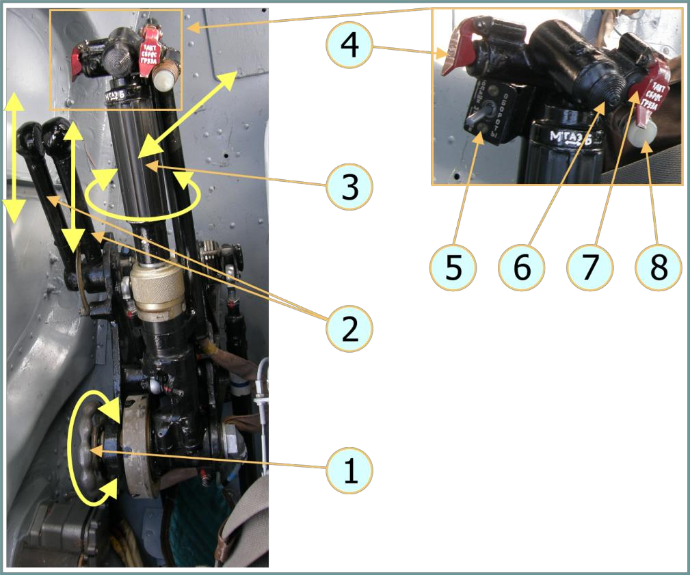

1. Маховик затяжки фрикциона ручки 
2. Рычаги раздельного управления левым и правым двигателями (РРУД) 
3. Поворотная рукоятка коррекции 
4. Кнопка аварийного сброса груза 
5. Переключатель перенастройки оборотов двигателей 
6. Кнюппель управления фарами 
7. Кнопка тактического сброса груза с внешней подвески 
8. Кнопка выключения фрикциона ручки ШАГ-ГАЗ

Фрикцион затянут маховиком так, что без нажатия на кнопку выключения
фрикциона ручку ШАГ–ГАЗ можно перемещать только с усилием 200...250 Н
(20...25 кгс). Для изменения мощности двигателей с целью поддержания
необходимой частоты вращения несущего винта при сохранении заданного
значения общего шага на ручке ШАГ–ГАЗ предусмотрена поворотная рукоятка
коррекции, которая кинематически связана только с рычагами подачи топлива
на насосах НР-40ВГ. При повороте рукоятки коррекции влево двигатели
переводятся на режим меньшей мощности.

Наряду с объединенным управлением ШАГ–ГАЗ на вертолете имеется
раздельное управление двигателями, позволяющее изменять режим работы
каждого двигателя без изменения общего шага несущего винта. Раздельное
управление осуществляется рычагами на кронштейне левой ручки ШАГ–ГАЗ. От
рычагов раздельного управления двигателями движение передается к рычагам
топливных насосов.

Система управления ШАГ–ГАЗ является резервной системой регулирования
частоты вращения несущего винта, так как система автоматического
поддержания частоты вращения несущего винта предусмотрена на двигателях.

Переход с системы автоматического поддержания частоты на систему
управления ШАГ–ГАЗ и обратно осуществляется поворотом рукоятки коррекции.

При правой коррекции работает система автоматического поддержания частоты
вращения. При повороте рукоятки коррекции влево отключается система
автоматического регулирования частоты вращения и вступает в работу система
управления ШАГ–ГАЗ. Момент переключения определяется по уменьшению
частоты вращения несущего винта при дальнейшем незначительном повороте
рукоятки коррекции влево.

Для установки оборотов несущего винта перед взлетом 95%, предусмотрена
ручная перенастройка регуляторов свободных турбин двигателей. Управление
перенастройкой оборотов осуществляется переключателями "ОБОРОТЫ
БОЛЬШЕ – МЕНЬШЕ", установленными на ручках шаг-газ.

## Приборы контроля работы двигателей и вертолётныхсистем

### Тахометр ИТЭ-2Т

Двухстрелочный тахометр ИТЭ-2Т предназначен для непрерывного
дистанционного измерения частоты вращения вала турбокомпрессора
двигателя. Стрелка с цифрой "1" показывает частоту вращения
турбокомпрессора левого двигателя, а стрелка с цифрой "2" показывает частоту
вращения турбокомпрессора правого двигателя.

Указатель представляет собой электромеханический прибор, который
преобразует частоту переменного тока в угол поворота стрелок. Шкала
указателя оцифрована в процентах. Диапазон измерения частоты вращения от
0 до 110%. Цена деления шкалы указателя 1%.

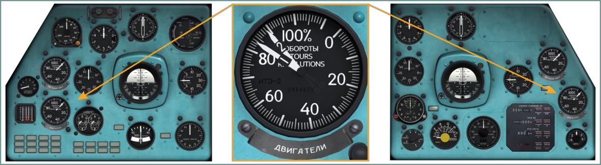

### Тахометр ИТЭ-1Т

Тахометр ИТЭ-1Т предназначен для непрерывного дистанционного измерения
частоты вращения несущего винта в процентах. На вертолете установлены два
тахометра, по одному на левой и правой приборных досках лётчиков.

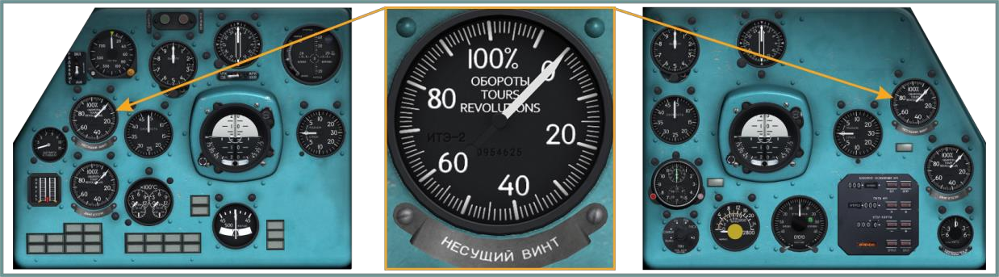

Принцип действия аналогичен принципу действия тахометра ИТЭ-2Т. Диапазон
измерения прибора от 0 до 110%. Цена деления шкалы указателя 1%.

### Двухстрелочный моторный индикатор ЭМИ-3РИ

Диапазон измерения давления масла от 0 до 8 кг/см2. Цена деления шкалы
0,5 кг/см2.

Диапазон измерения температуры масла от –70°С до +150°С. Цена деления
шкалы 10°С. Датчики установлены на двигателях, указатели - на центральном
пульте.

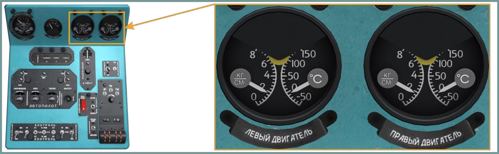

### Трехстрелочный моторный индикатор ЭМИ-3РВИ

Предназначен для дистанционного измерения давления масла на входе в
главный редуктор и температуры масла в промежуточном и хвостовом
редукторах.

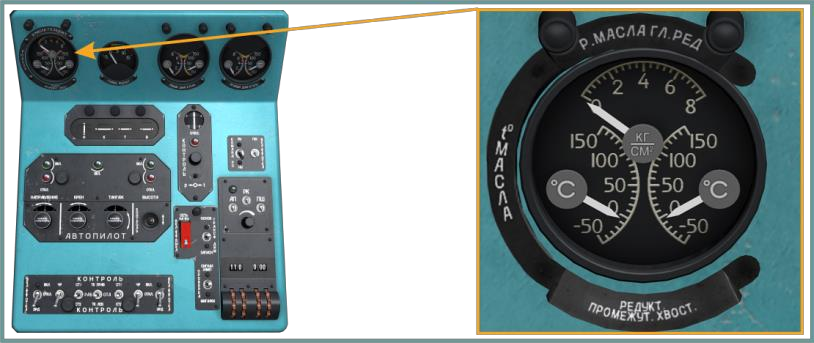

Датчики давления и приёмники температуры установлены на редукторах в
соответствующих маслосистемах. Диапазон измерения давления масла от 0 до
8 кг/см2. Цена деления шкалы давления 0,5 кг/см2.

Диапазон измерения температуры масла от –70°С до +150°С. Цена деления
шкалы температуры –10°С.

### Указатель температуры выходящих газов двигателей 2УТ-6К

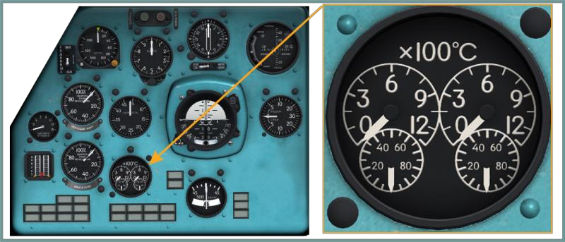

Предназначен для индикации температуры выходящих газов двигателей по
шкалам грубого и точного отсчета. Шкалы грубого отсчета имеют предел
измерения от 0 до 1200°С с ценой деления 100°С. Шкалы точного отсчета
имеют предел измерения от 0 до 100°С с ценой деления 5°С.

При изменении измеряемой температуры на каждые 100°С стрелка на указателе
точного отсчета делает полный оборот, а стрелка грубого отсчета
перемещается на одно деление 100°С.

Проверка производится двумя кнопками КОНТРОЛЬ-2ИА-6 "ЗЕМЛЯ", "ВОЗДУХ"
на левой боковой панели электропульта. Питание прибора осуществляется
однофазным переменным током 115V.

### Измеритель режимов работы двигателей ИР-117

Измеритель режимов предназначен для контроля режимов работы двигателей.
Указатель УР-117 в одном корпусе объединяет три самостоятельных прибора.
На лицевой части указателя расположен единый индекс с нанесенными
границами режимов: "О" - взлетный; "Н" - номинальный; "К" - крейсерский.

Слева и справа на шкале прибора имеются подвижные жёлтые треугольные
индексы, указывающие избыточное давление за компрессором левого и правого
двигателей. Максимальная погрешность измерения ±1,5%; диапазон измерения
избыточного давления 4,6…8,5 атм.; диапазон высот 0,5 км – 2,5 км.

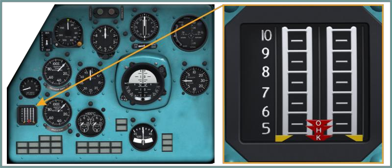

Принцип действия основан на измерении давления воздуха за компрессором и
выдаче сигналов на подвижные индексы указателя. Подвижный индекс с
нанесенными на нём буквами "О", "Н", "К", обозначающими режимы работы
двигателей, перемещается по суммарному сигналу, формируемому датчиком
давления и приёмником температуры наружного воздуха. Контроль режимов
двигателей по УР-117 осуществляется до значений температуры наружного
воздуха +24°С, а при более высоких температурах – по оборотам компрессоров
двигателей.

### Термометр ТУЭ-48

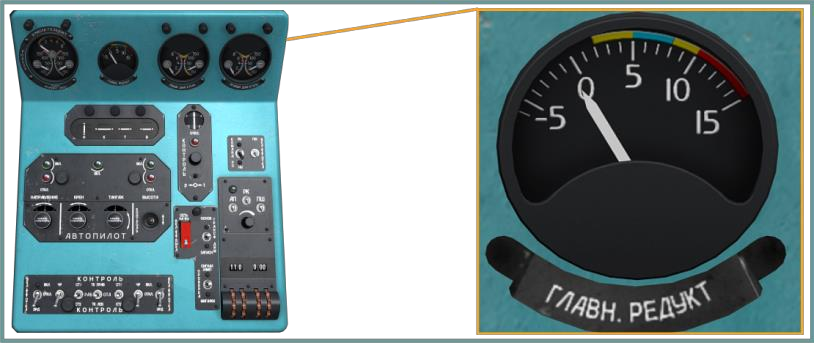

Предназначен для измерения температуры масла в главном редукторе. Предел
измерения от –70°С до +150°С. Цена деления –10°С.

### Термометр ТВ-19

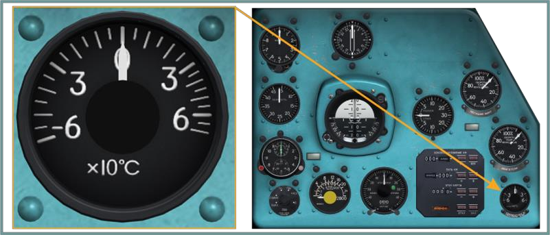

Предназначен для контроля за температурой воздуха в салоне. Диапазон
измеряемых температур от -60 до +60°С, цена деления 5°С.

### Индикатор температуры ТСТ-2

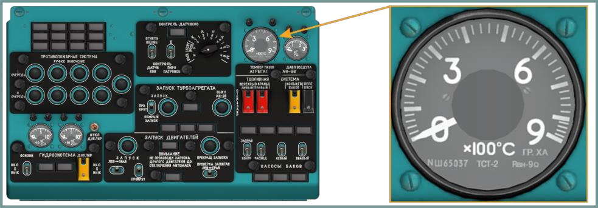

Предназначен для индикации температуры выходящих газов за турбиной
двигателя АИ-9В. Диапазон измерения температуры от 0 до 900°С, цена
деления 20°С.

### Указатель давления воздуха УИ1-3

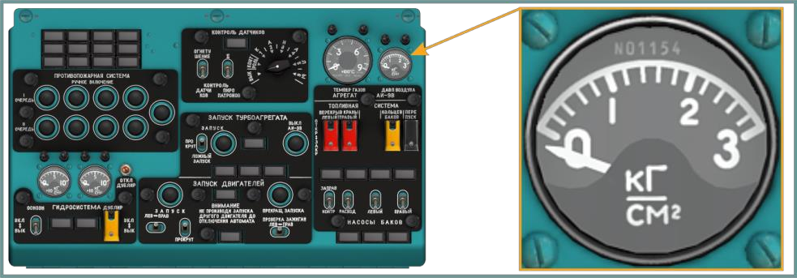

Предназначен для измерения давления воздуха, поступающего от двигателя
АИ-9В в воздушные стартеры СВ-78Б двигателей ТВ3-117ВМ.

Указатель УИ1-3 установлен на средней панели электропульта. Диапазон
измерения давления от 0 до 3 кг/см2. Цена деления 0.2 кг/см2.

### Указатели давления в гидросистемах УИ1-100

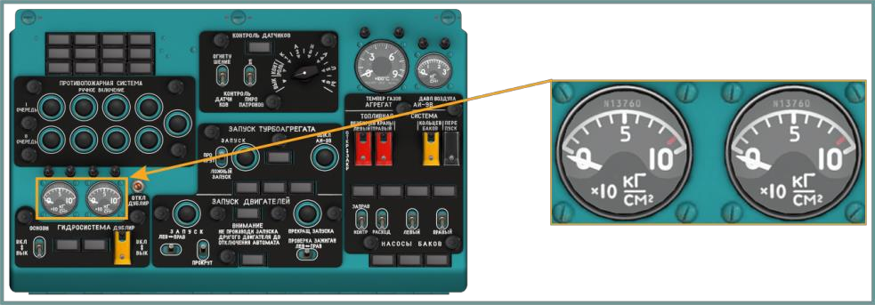

Предназначены для индикации давления рабочей жидкости в основной и
дублирующей гидросистемах.

Диапазон измерения давления манометрами от 0 до 100 кг/см2. Цена деления
указателя УИ1-100 10 кг/см2.

### Указатель шага винта УП-21-15

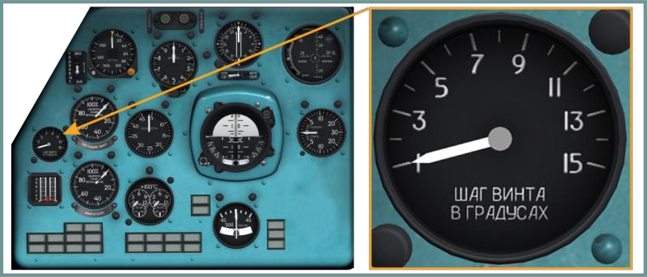

Указатель шага винта показывает общий угол установки лопастей несущего
винта в градусах. Диапазон измерения прибора от 1° до 15°. Цена деления
шкалы индикатора 1°.

### Топливомер СКЭС-2027В

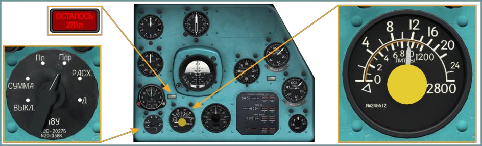

Предназначен для измерения запаса топлива в баках, а также для сигнализации
полной заправки баков и аварийного остатка топлива в расходном баке.
На циферблат нанесены две шкалы. Наружная – предназначена для отсчета
суммарного запаса топлива, а внутренняя – для отсчёта топлива в отдельном
баке. Наружная шкала отградуирована от 0 до 2800 литров с ценой деления
200 литров. Внутренняя шкала отградуирована от 0 до 1200 литров с ценой
деления 100 литров.

Рядом расположен переключатель с трафаретами:

- СУММА - суммарное измерение запаса топлива в баках;
- Пл, Ппр, РАСХ, Дпр - измерение топлива соответственно в Подвесном
левом, Подвесном правом, расходном и Дополнительном левом (не
моделируется) баках;
- ВЫКЛ - топливомер выключен.

На правой приборной доске установлено красное табло "ОСТАЛОСЬ 270 л",
сигнализирующее о критическом остатке топлива в расходном баке (этого
остатка хватает на выполнение полёта на скорости 220км/ч в течение 23мин на
расстояние 60км и посадке по вертолетному.

### Измеритель вибрации двигателей ИВ-500Е

Измеритель вибрации двигателей ИВ-500Е предназначен для измерения
величины линейной вибрации основных двигателей и выдачи соответствующей
информации на сигнальные табло и речевой информатор.

Комплект ИВ-500Е:

- два датчика МВ-03 на корпусах первых опор двигателей;
- два жёлтых табло "ЛЕВЫЙ (ПРАВЫЙ) ДВИГ ВИБРАЦИЯ ПОВЫШЕНА" на
левой приборной доске;
- два красных табло "ВЫКЛЮЧИ ЛЕВЫЙ (ПРАВЫЙ) ДВИГАТЕЛЬ" на
левой приборной доске;
- кнопка "КОНТРОЛЬ ИВ-500Е" на левой боковой панели электропульта.

При виброскорости 45 мм/с – загораются жёлтые табло "ЛЕВ (ПРАВ) ДВ ВИБР
ПОВ", при виброскорости 60 мм/с – загораются красные табло "ВЫКЛЮЧИ ЛЕВ
(ПРАВ) ДВ".

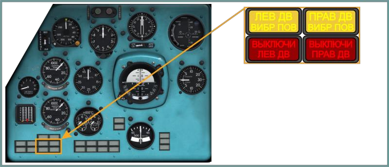

Если в полёте загорится красное табло "ВЫКЛЮЧИ ЛЕВ (ПРАВ) ДВ", то
необходимо уменьшением режима работы двигателя попытаться снизить
уровень вибрации. После погасания табло на скорости 130...140 км/ч следовать
до ближайшего аэродрома с посадкой по самолётному.

Если табло не гаснет, то двигатель, работающий с опасной вибрацией,
необходимо выключить. На режиме моторного планирования допускается
мигание жёлтых и красных табло.

Контроль исправности ИВ-500Е производится перед запуском двигателей
кнопкой "КОНТРОЛЬ ИВ-500Е". При нажатии на кнопку на левой приборной
доске должны загореться жёлтые и красные табло и выдать соответствующую
речевую информацию РИ – 65Б.

Основные технические данные аппаратуры ИВ-500Е:

- Контролируемый частотный диапазон 190...340 Гц;
- Контролируемый диапазон виброскорости 5...100 мм/с;
- Продолжительность непрерывной работы 10 часов.

### Манометр МВУ-100К

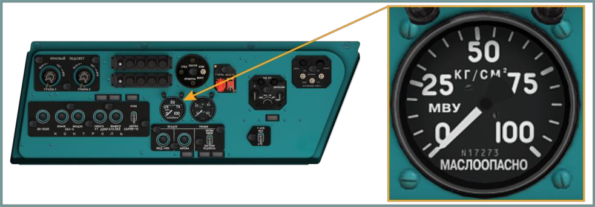

Предназначен для контроля за давлением в воздушной системе, которое
должно быть в пределах 40...50 кгс/см2. Диапазон измерения давления от 0 до
100 кгс/см2. Цена деления 5 кгс/см2. Манометр установлен на левой боковой
панели электропульта.

### Манометр МА-6К

Манометр МА-6К индицирует давление воздуха в системе торможения шасси.
Диапазон измерения от 0 до 60 кгс/см2. Цена одного деления 2 кгс/см2.
Манометр установлен на левой боковой панели электропульта. Под манометром
нанесена надпись "ТОРМОЗ".

## Пилотажно-навигационные приборы и оборудование

К пилотажно-навигационному оборудованию относятся пилотажные приборы и
связанное с ними оборудование, часы, автопилот АП-34Б (рассмотрен в 7.11).

### Приемники воздушного давления ПВД-6М и анероидно-мембранные приборы

На вертолете в носовой части фюзеляжа
снизу установлены два приемника ПВД-6М - левый и правый.

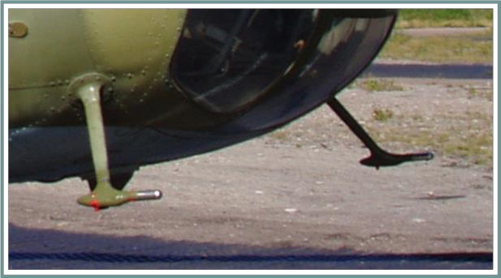

Приемники обеспечивают подачу
статического давления в камеры
указателей скорости УС-450К, высотомеров
ВД-10К и вариометров ВР-30МК,
расположенных на левой и правой
приборных досках, датчиков высоты ДВ-
15М и ДВК, измерительного комплекса
давления ИКД, датчиков скорости ДАС и КЗСП, а также обеспечивают подачу
динамического давления в камеры указателей скорости, датчика скорости ДАС,
корректора-задатчика скорости приборной КЗСП.

На левом борту кабины расположен кран ПВД. Рукоятка крана имеет три
положения:

- О – объединенная (правый и левый ПВД работают совместно);
- Л – левая (в работе только левый ПВД);
- П – правая (в работе только правый ПВД).

При постановке рукоятки крана на отметку "О" статическое давление подается
на все приборы от обоих ПВД-6М, а при постановке рукоятки на отметку "П" или
"Л" соответственно от правого или левого ПВД. Полным давлением левый ПВД-
6М обеспечивает только УС-450К на левой приборной доске, а правый
обеспечивает УС-450К установленный на правой приборной доске и датчики
приборной скорости ДАС и КЗСП. Приемники имеют обогревательные элементы,
подключаемые выключателями ОБОГРЕВ ПВД "ЛЕВ." "ПРАВ." на правом боковом
электропульте.

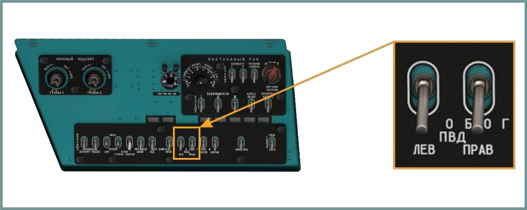

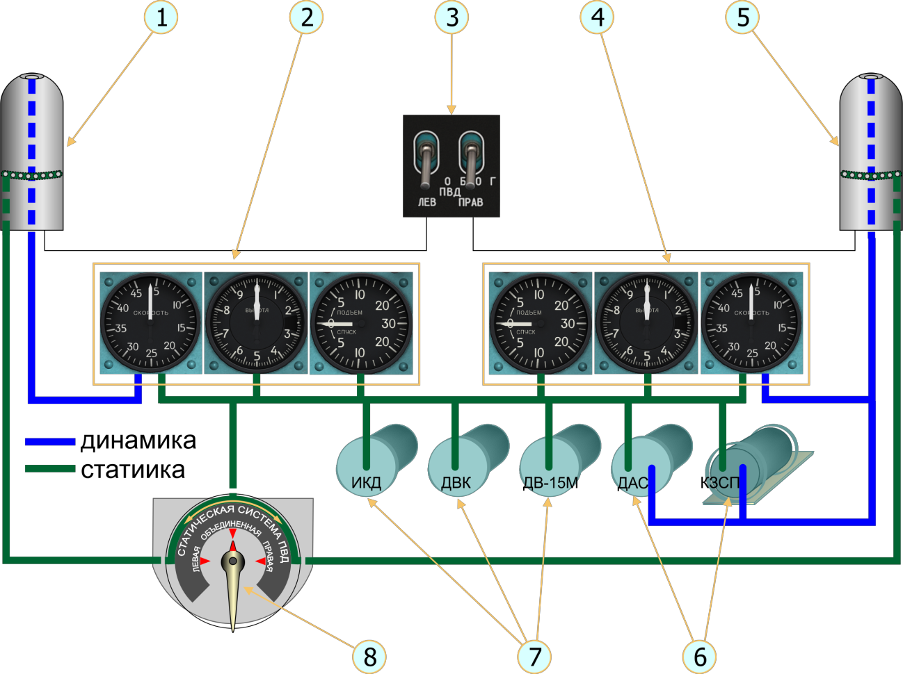

1. Приемник воздушного давления ПВД-6М левый 
2. Приборы УС-450К, ВД-10К и ВР-30МК левой приборной доски 
3. Выключатели обогрева левого и правого ПВД 
4. Приборы ВР-30МК, ВД-10К и УС-450К левой приборной доски 
5. Приемник воздушного давления ПВД-6М правый 
6. Потребители статического и динамического давления 
7. Потребители статического давления 
8. Кран переключения ПВД.

Контроль исправности обогрева ПВД осуществляется кнопками "КОНТРОЛЬ
ОБОГРЕВА ПВД" на левом и правом щитках электропульта. При нажатии на эти
кнопки рядом должны загораться жёлтые табло "ОБОГРЕВ ИСПРАВЕН".

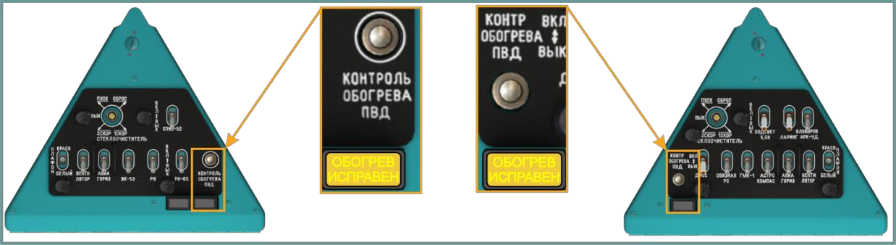

### Указатель скорости УС-450К

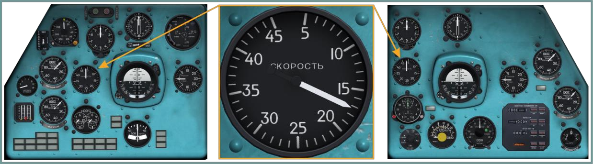

Предназначен для определения воздушной (приборной) скорости полёта
вертолета. Диапазон измерения от 0 до 450 км/ч. Цена деления – 10 км/ч.

### Высотомер ВД-10К

Предназначен для определения барометрической высоты полёта. Отсчет
ведётся с помощью двух стрелок: большая показывает высоту в метрах
(оцифровка через 100 м), малая – в километрах. Диапазон измерения высоты -
от 0 до 10000 м. Цена деления для большой стрелки 10 м, для малой – 100 м.

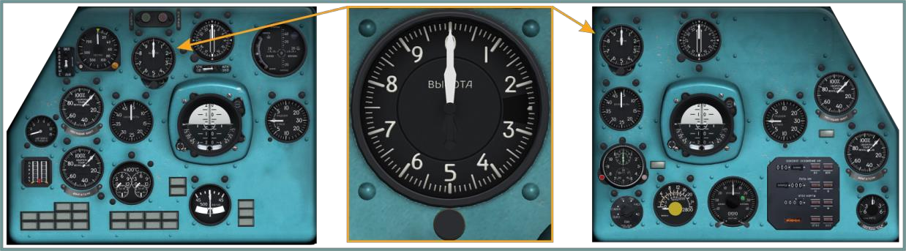

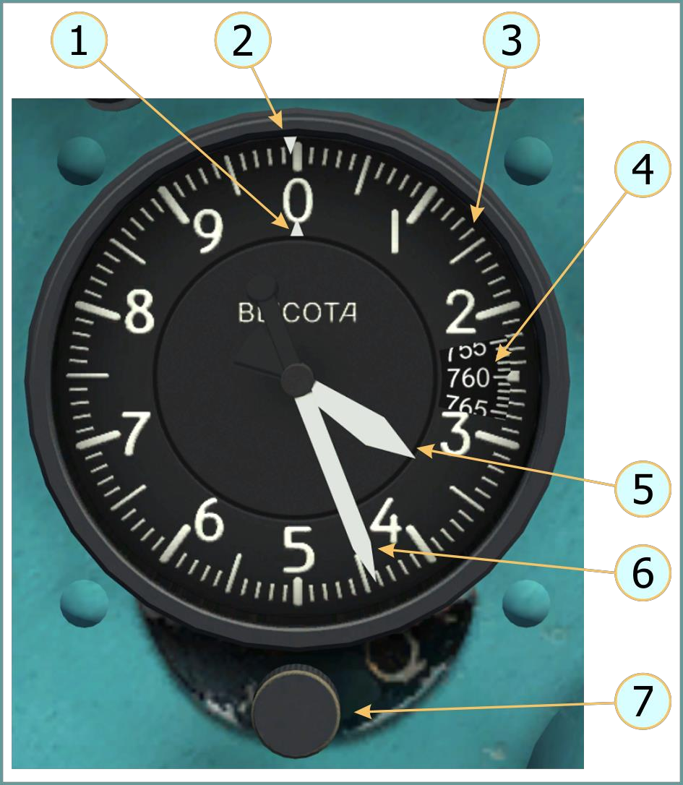

1. Треугольный индекс тысяч метров 
2. Треугольный индекс сотен метров 
3. Шкала высотомера 
4. Шкала давлений (мм.рт.ст.) 
5. Стрелка тысяч метров 
6. Стрелка сотен метров 
7. Кремальера

Кремальерное устройство предназначено для установки стрелок на 0 и
перевода шкалы барометрического давления. Одновременно со шкалой
барометрического давления перемещаются два треугольных индекса,
расположенные на лицевой части прибора. Один перемещается по шкале
метрового диапазона, другой – по шкале километрового диапазона. С помощью
этих индексов можно выставлять превышение посадочной площадки на которой
неизвестно атмосферное давление. В этом случае высотомер будет показывать
высоту полёта относительно площадки, превышение которой выставлено с
помощью индексов. На примере (Рис. 5.43) показана установка высоты
площадки 3.400м треугольными индексами с помощью кремальеры. При этом
стрелки указывают барометрическую высоту относительно этой площадки
(50 м).

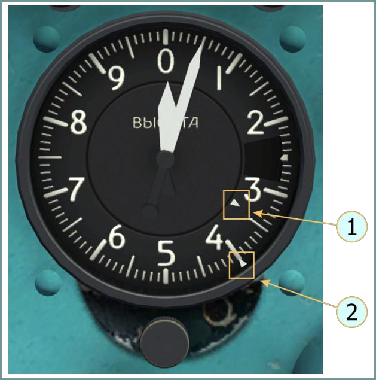

### Вариометр ВР-30МК

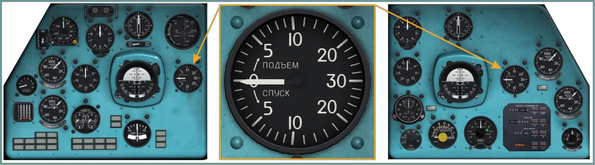

Предназначен для определения вертикальной скорости. С помощью вариометра
контролируется выдерживание горизонтального полёта, а также заданная
скорость снижения либо набора высоты. Диапазон измерения от 0 до 30 м/с на
подъем и спуск. Цена деления – 1 м/с.

#### Гироскопические пилотажные приборы

К гироскопическим пилотажным приборам относятся два авиагоризонта
бомбардировщика АГБ-3К, установленные по одному на левой и правой
приборных досках и электрический указатель поворота ЭУП-53, установленный
на левой приборной доске.

### Авиагоризонт АГБ-3К

Предназначен для определения положения вертолета в пространстве (углов
крена и тангажа) относительно истинного горизонта, а также для определения
бокового скольжения.

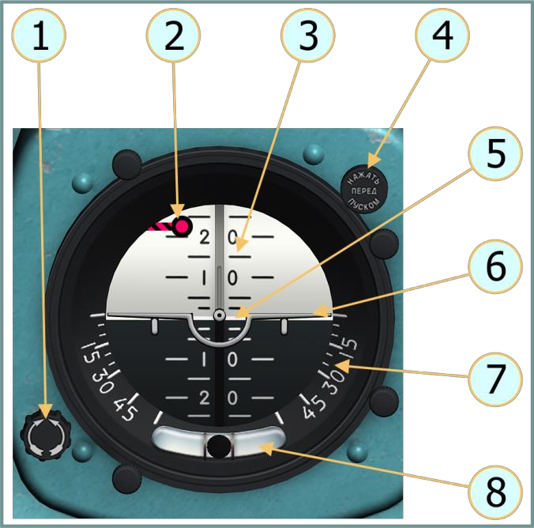

1. Кремальера 
2. Бленкер 
3. Шкала тангажа 
4. Кнопка "АРРЕТИР" (перед пуском нажать) 
5. Линия горизонта 
6. Силуэт самолёта 
7. Шкала крена 
8. Указатель скольжения

Авиагоризонт АГБ-3К, установленный на левой приборной доске выдаёт
сигналы крена и тангажа в ДИСС-15 и в САРПП-12Д1М, а правый, в автопилот
АП-34Б. Работа авиагоризонта основана на свойстве гироскопа с тремя
степенями свободы сохранять неизменным положение в пространстве. При
углах тангажа порядка 85-87˚ прибор может "выбиваться" (терять одну из трёх
степеней свободы).

При отсутствии питания на шкале прибора появляется красный бленкер.
Для поддержания главной оси ротора гироскопа в вертикальном положении в
авиагоризонте предусмотрена система коррекции.

Основные данные АГБ-3К:

- время готовности не более 1,5 мин;
- погрешность:
    - в пределах углов измерения до 30° не более ±1°;
    - в пределах углов измерения более 30° не более ±2°.

Проверка работоспособности АГБ-3К. При наличии в бортсети питания
переменным (36V 3Ф) и постоянным (27V) током:

- нажать кнопку "АРРЕТИР" на приборе (все три оси гироскопа
устанавливаются перпендикулярно друг другу);
- выключатели "АВИАГОРИЗОНТ" на левом и правом электрощитках
установить в положение "ВКЛЮЧЕНО";
- убедиться в нормальной работе авиагоризонта (бленкеры на лицевых
панелях АГБ-3К должны убраться).

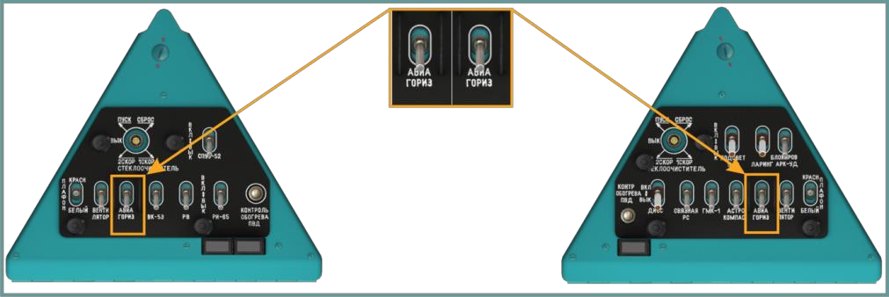

При отказе авиагоризонта АГБ-3К, из-за отсутствия питания, на лицевой панели
прибора должен появиться красный бленкер. При отказе правого АГБ-3К
отказывает автопилот АП-34Б. Пилотирование выполнять по левому АГБ-3К.
Работа АП-34Б от левого АГБ-3К не предусмотрена.

### Указатель поворота ЭУП-53

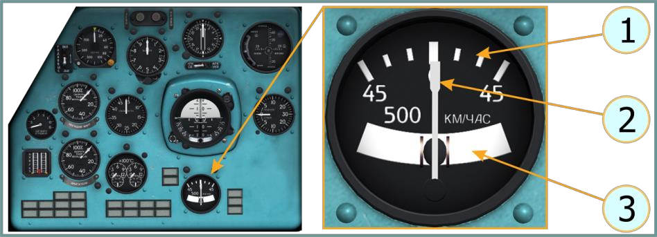

1. шкала отсчета
2. стрелка указателя
3. указатель скольжения

Является дублирующим прибором. Предназначен для определения величины и
направления угловой скорости вращения (виража) вертолета относительно
вертикальной оси. В нижней части прибора расположен указатель скольжения,
который выполнен в виде стеклянной трубки, заполненной толуолом, с
пластмассовым шариком внутри.

Шкала прибора отградуирована в градусах от 0 до 45° в обе стороны от
нулевого положения. Цена деления 15°.

Работа прибора основана на использовании свойств гироскопа с двумя
степенями свободы. Питание осуществляется через АЗС "УКАЗАТЕЛЬ
ПОВОРОТА", установленный на правой панели АЗС.

Необходимо иметь в виду, что при выполнении координированных разворотов
показания указателя поворота (ЭУП-53) не соответствуют фактическим углам
крена вертолета. Так, при развороте на скорости 160–200 км/ч с креном 5, 10 и
15° показания указателя поворота соответственно будут 15-10, 30-25 и 45-35°.

При отсчете необходимо учитывать, что вследствие высокой чувствительности
указателя поворота стрелка его будет находиться в постоянном колебательном
движении около своего среднего положения, поэтому показания надо снимать
осредненные.

### Курсовая система ГМК-1А

Предназначена для определения и индикации курса, углов разворота вертолёта
и выдачи магнитных или истинных пеленгов. Представляет собой комплекс
взаимосвязанных магнитных и гироскопических устройств. Включается
выключателем "ГМК-1" на правом щитке электропульта.

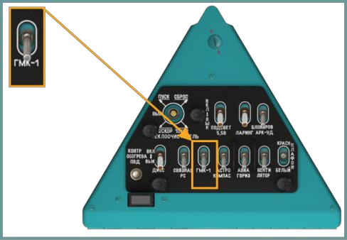

ПУ-26 – пульт управления (Рис. 5.49), предназначен для:

- выбора режима работы ("МК" – "магнитная коррекция" и "ГПК" –
 "гирополукомпас");
- ввода широтной коррекции гироскопа, компенсирующей "уход"
гироскопа из-за суточного вращения Земли;
- компенсации ухода гироскопа в азимуте от его
несбалансированности;
- установки шкалы указателя на заданный курс в режиме ГПК;
- включения быстрой скорости согласования в режиме МК;
- контроля за работой системы.

Пульт управления ПУ-26 расположен на правой панели электропульта.

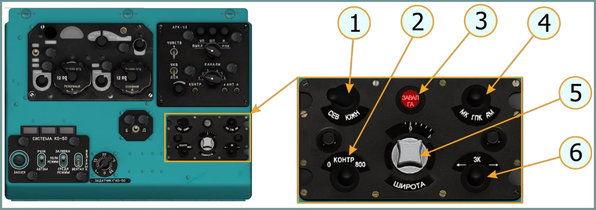

1. Переключатель широтной коррекции     
2. Переключатель "КОНТРОЛЬ"             
3. Лампа-сигнализатор "ЗАВАЛ ГА"        
4. Переключатель "МК. ГПК. АМ"
5. Рукоятка задатчика широты
6. Переключатель "ЗК" (задатчик курса)

УГР-4УК – указатель предназначен для индикации курса вертолета, углов
разворота, пеленгов и курсовых углов радиостанций. На вертолёте установлено
два указателя, по одному на левой и правой приборных досках. Курс
отсчитывается по вращающейся шкале, оцифрованной через каждые тридцать
градусов, относительно верхнего неподвижного индекса
Погрешность выдачи магнитного курса не более ±1,5°.

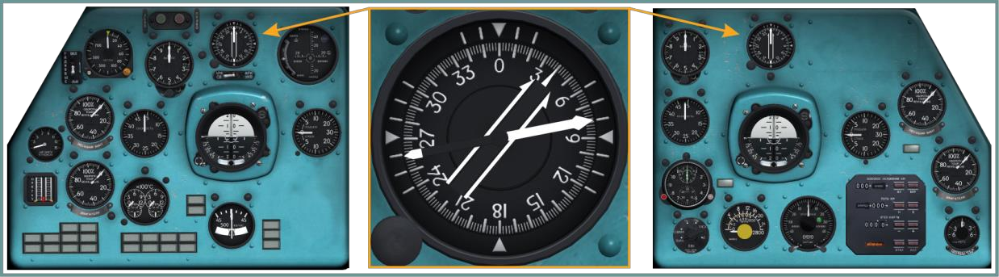

Накопление ошибки при работе в режиме ГПК за один час работы не более
±2,5°.

Готовность к работе в режиме МК не более трёх минут, в режиме ГПК не более
пяти минут.

Нормальная скорость согласования в режиме МК не менее 1,5...7 /мин; быстрая
скорость согласования в режиме МК не менее 6°/с; от переключателя ЗК не
менее 2°/с.

Принцип работы заключается в выработке индукционным датчиком сигнала
курса и выдачи его на курсовой гироскоп (гироагрегат) для определения и
стабилизации показаний. Система может работать в одном из двух режимов: в
режиме ГПК или в режиме МК. Основным режимом работы системы является
режим гирополукомпаса с коррекцией его показаний от магнитного корректора
(ИД+КМ). При работе системы в режиме ГПК датчиком курса является курсовой
гироскоп. Режим ГПК позволяет выбрать за начало отсчета курсовых углов
любое направление.

Свободный гироскоп имеет уход в азимуте из-за вращения Земли, и уходы,
вызванные наличием трения в опорах карданного подвеса. Компенсация уходов
производится автоматически широтным корректором.

Для включения режима ГПК необходимо на пульте управления переключатель
режимов установить в положение "ГПК".

Режим МК применяется для согласования сигналов курса, выдаваемых
гирополукомпасом с показаниями магнитного корректора (ИД+КМ). Работает
при постановке переключателя режимов на пульте управления в положение
"МК".

Возможно согласование по магнитному курсу с нормальной скоростью
(переключатель "ЗК" на пульте управления ПУ-26) и в режиме быстрого
согласования.

Режим автоматического согласования обеспечивает автоматическое
согласование с большой скоростью при переключении переключателя режимов
из положения "ГПК" в положение "МК" при наличии в системе рассогласования
между магнитным и гироскопическим курсом.

Контроль осуществляется в режиме МК при нажатии на пульте переключателя
"КОНТРОЛЬ" в положение 0° или 300°. На указателях устанавливается курс
0°±10° или 300°±10°. Одновременно с нажатием переключателя "КОНТРОЛЬ"
загорается лампа "ЗАВАЛ ГА" (контролируется исправность лампы). В полёте
лампа загорается при сбое осей гироскопа.

При подготовке курсовой системы к полёту необходимо:

- установить переключатель широтной коррекции на отметку "СЕВ" или
 "ЮЖН" в зависимости от того, в каком полушарии выполняется
полёт;
- ручкой "ШИРОТА" ввести широту места полётов;
- проверить работоспособность курсовой системы нажав "КОНТРОЛЬ";
- согласовать систему по магнитному курсу нажатием на
переключатель "ЗК" (если система работает в режиме МК) или
нажатием переключателя "ЗК" установить шкалы УГР-4УК на
заданный курс (если система работает в режиме ГПК);
- перед взлетом согласовать систему или установить указатели УГР-4УК
на заданный курс.

### Магнитный авиационный компас КИ-13К

Компас магнитный жидкостный КИ-13К предназначен для определения
компасного курса вертолета и применяется в качестве автономного
дублирующего прибора. Установлен на профиле остекления в передней части
кабины пилотов.

Принцип действия основан на взаимодействии постоянных магнитов компаса с
магнитным полем земли.

Шкала имеет разбивку через 5 градусов с оцифровкой через 30 градусов. Два
основных курса "Север" и "Юг" отмечены буквами "С" и "Ю".

Основные технические данные компаса:

- инструментальная погрешность компаса (без девиационного
устройства) ±1°;
- угол застоя картушки не более 1°;
- собственная девиация компаса на курсах 0, 90, 180 и 270° не более
 ±2,5°;
- Угол увлечения картушки:
- при температуре от 20 до 50°С и угловой скорости 18°/с не
более 10°;
- при температуре -60°С и угловой скорости 18°/с не более 35°.
- Время полного успокоения картушки при температуре от +50 до –
60°С не более 17 секунд.

Конструкция компаса обеспечивает его нормальную работу при кренах
вертолёта не более 17°.

!!! note "Примечание"
    Т.к. магнитный компас индицирует не истинный курс ЛА, а компасный, для
    вычисления истинного курса необходимо вводить поправку магнитного склонения местности, а
    также поправку девиации компаса.

### Авиационные часы АЧС-1

Часы АЧС-1 предназначены для измерения текущего времени в часах, минутах,
секундах; времени полёта в часах и минутах; коротких промежутков времени
(до одного часа) в минутах и секундах. Устанавливаются на приборной доске
правого лётчика.

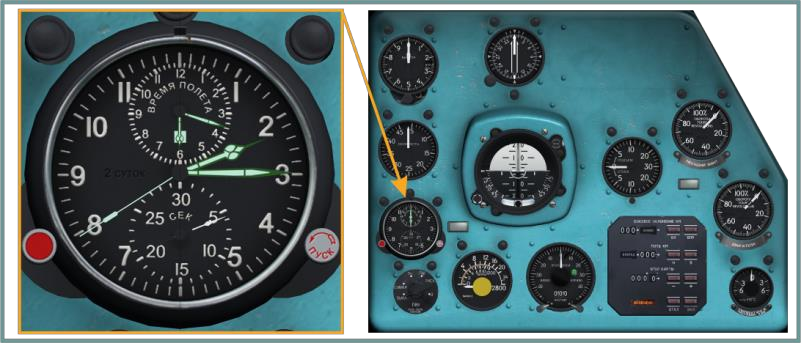

Часы снабжены электрообогревателем с терморегулятором. Включение
обогрева часов осуществляется АЗС "ОБОГРЕВ ЧАСОВ". Работоспособность
часов при температуре ниже +5°С обеспечивается при условии включения
обогревателя. Точность хода часов при нормальной температуре ±20секунд в
сутки.

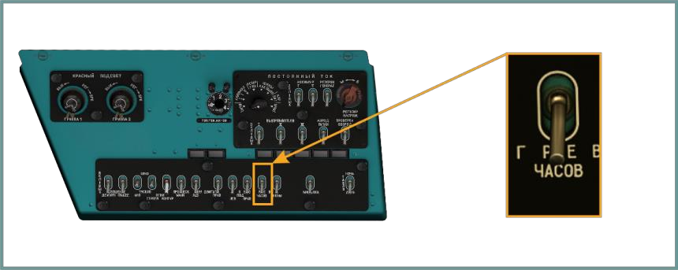

1. Циферблат обычных часов для отсчета текущего времени суток 
2. Циферблат времени полёта для показания времени нахождения ЛА в полёте 
3. Сигнальный индикатор работы механизма учета времени полёта 
4. Секундомер для замера и отсчета коротких промежутков времени 
5. Головка пуска часов или включения секундомера 
6. Головка установки времени суток на механизме обычных часов или пуска отсчета времени полёта

Механизм суточных часов работает непрерывно. Механизм времени полёта
может включаться и выключаться с помощью нажатия левой головки (6)  [[RALT]] +  [[RCTRL]] +  [[RSHIFT]] +  [[С]]. 

Механизм секундомера может включаться и
выключаться с помощью нажатия правой головки (5)  [[RALT]] +  [[RSHIFT]] +  [[С]].

Для установки стрелок на точное время необходимо в момент прохождения
секундной стрелкой цифры 12 повернуть правую головку (5) по часовой стрелке
 [[RCTRL]] +  [[RSHIFT]] +  [[.]], при этом стрелки часов остановятся. Затем вытянуть
левую головку (6) на себя до упора правой кнопкой мыши  [[RSHIFT]] +  [[M]], и
вращая ее колесом мыши, перевести стрелки на текущее время  [[LALT]] +  [[.]],
 [[LALT]] +  [[.]].

При подаче сигнала точного времени необходимо правую головку (5) повернуть
против часовой стрелки  [[RCTRL]] +  [[RSHIFT]] +  [[.]].
Показания времени полёта отсчитываются на верхней шкале циферблата часов
(2).

Работа механизма времени полёта определяется тремя положениями
сигнального индикатора, покрытого красным (серо-голубым, синим) и белым
покрытием. Пуск механизма времени полёта осуществляется нажатием на
левую головку  [[RALT]] +  [[RCTRL]] +  [[RSHIFT]] +  [[C]]; на индикаторе появится
красный (серо-голубой, синий) цвет, и стрелки часов начнут перемещаться.

Остановка механизма времени полёта производится вторым нажатием левой
головки (6); при этом на индикаторе появится сочетание красного (серо-
голубого, синего) и белого цветов. Возврат стрелок в нулевое положение
осуществляется третьим нажатием левой головки.

Показания секундомера отсчитываются на нижней шкале циферблата часов (4),
механизм которого управляется правой головкой (5). При первом нажатии на
правую головку механизм секундомера приходит в действие, остановка
механизма производится вторичным нажатием на ту же головку. Возврат
стрелок в нулевое положение, когда они остановлены, осуществляется третьим
нажатием на правую головку (5).

Заводят часы вращением левой головки против хода часовой стрелки до отказа.
Полный завод пружины обеспечивает работу механизма в течение двух суток.

### Выключатель коррекции ВК-53РШ

Выключатель коррекции ВК-53РШ предназначен для автоматического
отключения поперечной коррекции бортовых гироскопических устройств АГБ-3К
и курсовой системы ГМК-1А при выполнении вертолётом разворотов и виражей.

Коррекция выключается только при установившейся угловой скорости
превышающей 0,3°/с. При колебаниях и толчках вертолёта в полёте коррекция
не выключается.

Включается в работу выключателем "ВК-53", расположенным на левом щитке
электропульта. В полёте обязательно должен быть включен.

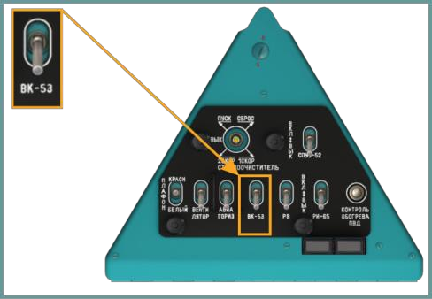

Основные технические данные ВК-53РШ.

Напряжение источников питания:

- трёхфазного переменного тока 36В ±5%, 400 Гц;
- постоянного тока 27 В ± 10%.

Угловая скорость выключения коррекции 0,3°/с. 
Время выдержки выключения 3…15 с. 
Время готовности не более одной минуты. 
Масса 2,7 кг.

### Акселерометр

Акселерометр предназначен для индикации замеренного значения нормальной
перегрузки вертолета (белая стрелка), а также для фиксации значений
максимальной и минимальной достигнутых перегрузок в полёте (красные
стрелки).

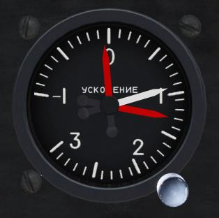

Отсчет показаний значения перегрузки производится от цифры 1 (сила тяжести
на земле).

Максимальное индицируемое значение положительной перегрузки – 3g.

Максимальное индицируемое значение отрицательной перегрузки – минус 1g.

Для сброса зафиксированных значений перегрузок используется кнопка,
находящаяся справа - внизу шкалы прибора  [[LShift]] +  [[-]].

{!docs/mi8/abbr.md!}
