# РАДИОЭЛЕКТРОННОЕ ОБОРУДОВАНИЕ

Радиоэлектронное оборудование вертолета Ми-8МТВ2 включает:

- радиоаппаратуру связи;
- радиоаппаратуру вертолетовождения;
- радиоаппаратуру опознавания и оповещения;
- радиоаппаратуру специального назначения.

Радиоэлектронное оборудование обеспечивает:

- связь между членами экипажа;
- связь экипажа с наземными командными пунктами и радиостанциями;
- связь с экипажами других летательных аппаратов;
- речевое оповещение экипажа и наземного командного пункта об
аварийных ситуациях на вертолете;
- выдачу сигналов государственного опознавания и сигналов бедствия;
- навигацию вертолета по сигналам приводных и широковещательных
радиостанций.

Электроснабжение радиоэлектронного оборудования осуществляется:

- постоянным током напряжением 28,5 В от трех выпрямительных
устройств ВУ-6А, мощностью по 6 кВт каждое;
- переменным однофазным током напряжением 115 В 400 Гц через
трансформатор ТС/1-2;
- переменным трехфазным током напряжением 36 В 400 Гц от
трансформатора ТС 330С04Б.

Аварийными источниками электроснабжения на вертолете являются:

- две аккумуляторные батареи 12CAM-28 и генератор СТГ-3
постоянного тока;
- преобразователь ПО-500А и ПТ-200Ц переменного тока напряжением
115 В и 36 В частотой 400 Гц.

Все радиоэлектронное оборудование размещается в хвостовой балке, в
радиоотсеке и в кабине экипажа.

## Радиоаппаратура связи

В состав радиоаппаратуры связи входят:

- самолетное переговорное устройство СПУ-7;
- командная ультракоротковолновая радиостанция Р-863;
- связная коротковолновая радиостанция Ядро-1А;
- ультракоротковолновая радиостанция Р-828;
- радиоаппаратура записи П-503Б (не моделируется);
- аппаратура речевой информации РИ-65Б;
- система коммутации и авторегулирования уровня звука.

### Самолетное переговорное устройство СПУ-7

Предназначено для обеспечения внутривертолетной телефонной связи между
членами экипажа, выхода на внешнюю радиосвязь через радиостанции Р-863,
Р-828, ЯДРО-1, прослушивание сигналов приемников радиокомпасов АРК-15М и
АРК-УД, а также для прослушивания сигналов специального назначения от
аппаратуры речевых сообщений РИ-65 и радиовысотомера РВ-5.

В состав комплекта самолетного переговорного устройства СПУ-7 входят:

- усилитель;
- распределительная коробка;
- два абонентских аппарата летчиков в кабине экипажа, слева и справа
от панели АЗС электропульта;
- абонентский аппарат и переключатель "ЛАРИНГ ВКЛ. - ВЫКЛ.", на
левом борту грузовой кабины;
- три дополнительные переговорные точки:
    1. на рабочем месте бортового техника;
    2. в грузовой кабине слева, около сдвижной двери;
    3. в грузовой кабине около грузовой створки;
- переключатель "ПРОСЛУШИВАНИЕ АРК СВ – СПУ – АРК УКВ"
установлен на правой этажерке;
- кнопка "СПУ" на кронштейне правой этажерки;
- выключатель "ЛАРИНГ ВКЛ.- ВЫКЛ." на правом щитке электропульта;
- две унифицированные кнопки "СПУ – РАДИО" на ручках управления
вертолетом;
- АЗС "СПУ-7" на правой панели АЗС.

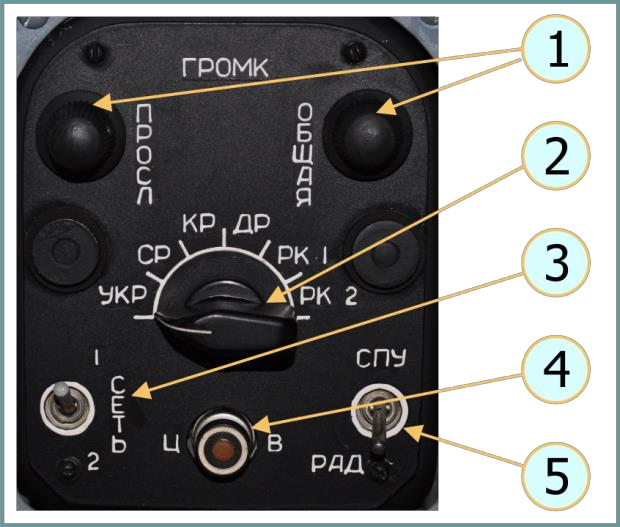

1. Регуляторы громкости "ОБЩАЯ" и "ПРОСЛ" для плавного регулирования громкости
внутренней и внешней связи;
2. Переключатель режимов работы:
	- "УКР" – работа командной радиостанции Р-863;
	- "СР" – работа связной радиостанции ЯДРО-1А;
	- "КР" – работа радиостанции Р-828;
	- "ДР" – не задействован;
	- "РК 1" – прослушивание радиосигналов от АРК-9;
	- "РК 2" –прослушивание радиосигналов от АРК-УД;
3. Переключатель "СЕТЬ" не задействован;
4. Кнопка "ЦВ" (циркулярный вызов) для передачи экстренных сообщений. При нажатии
обеспечивается:
	- внутривертолетная телефонная связь с удвоенной нерегулируемой громкостью;
	- прослушивание экстренных сообщений с максимальной нерегулируемой громкостью;
5. Переключатель "СПУ-РАД".

#### Особенности работы переключателя СПУ-РАД

При установке данного переключателя в положение СПУ и нажатой
унифицированной кнопки СПУ-РАДИО на РППУ до первого или второго щелчка
осуществляется выход на внутривертолетную телефонную связь. В положении
РАДИО и нажатой унифицированной кнопки СПУ-РАДИО до первого щелчка
осуществляется выход на внутривертолетную телефонную связь, при нажатии
данной кнопки до второго щелчка осуществляется выход на внешнюю радиосвязь.
В положении РАДИО эфир звучит с нормальной громкостью, речь членов экипажа – с
пониженной. Для регулирования громкости необходимо использовать регуляторы
ОБЩАЯ и ПРОСЛ.

При установке переключателя СПУ-РАДИО в положение СПУ громкость сигналов
внутренней телефонной связи регулируется регулятором ОБЩАЯ, а громкость
сигналов внешней радиосвязи регулируется регулятором ПРОСЛ.
При установке переключателя СПУ-РАДИО в положение РАДИО громкость сигналов
внутренней телефонной связи регулируется регулятором ПРОСЛ., а громкость
сигналов внешней радиосвязи регулируется регулятором ОБЩАЯ.

На практике положение СПУ малоиспользуемое. Положение переключателя СЕТЬ-1 –
СЕТЬ-2 на Ми-8 всех модификаций НЕ ИМЕЕТ ЗНАЧЕНИЯ. В любом положении этого
переключателя работает.

### Командная ультракоротковолновая радиостанция Р-863

Предназначена для обеспечения беспоисковой бесподстроечной радиосвязи с
наземными и воздушными ультракоротковолновыми радиостанциями в
метровом и дециметровом диапазоне длин волн в пределах прямой видимости.
Радиостанция позволяет осуществлять с помощью пульта управления с
запоминающим устройством (ЗУ) выбор в процессе полета одной из 20
фиксированных частот, предварительно настроенных на земле или с помощью
наборного устройства (НУ) установить требуемую частоту связи.
Радиостанция обеспечивает дежурный прием сигналов на аварийной частоте
(121,5 МГц или 243 МГц).

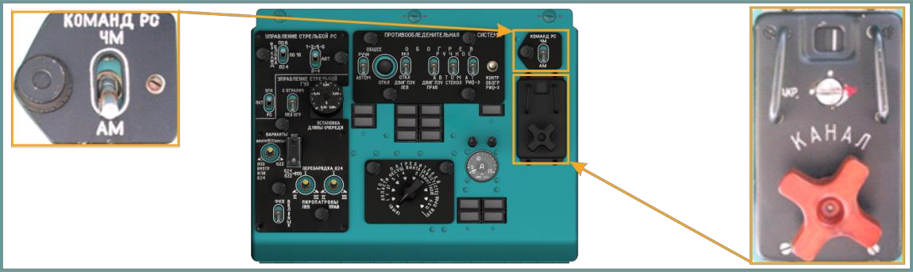

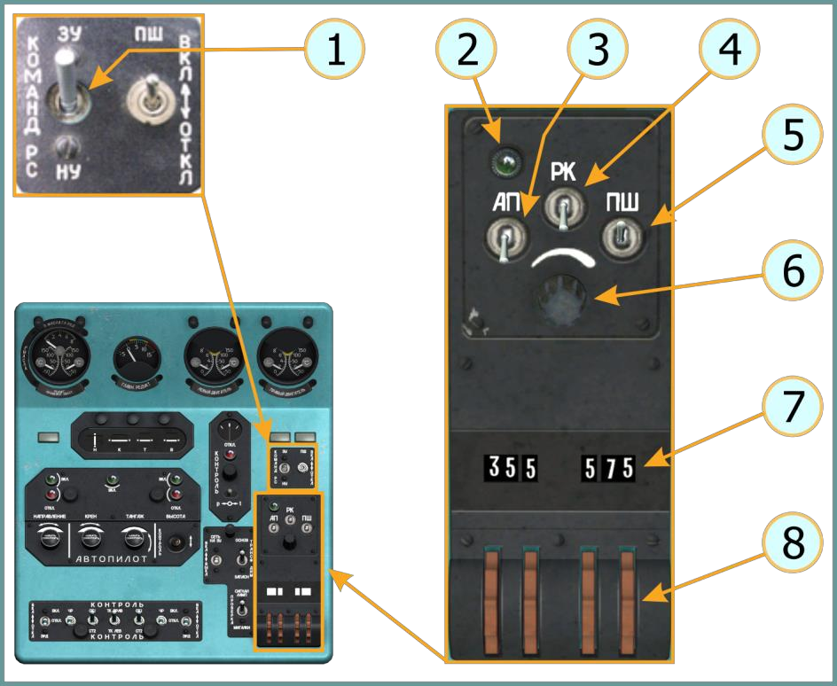

1. Переключатель "ЗУ-НУ" для выбора пульта управления 
2. Сигнальная лампа "АП" (на Ми-8МТ, - МТВх – не зайдествован по причине отсутствия аварийного приемника) 
3. Переключатель "АП" (аварийный приемник), при установке в верхнее положение прослушиваются сигналы, принимаемые аварийным приемником (на Ми-8МТ, -МТВх – не зайдествован по причине отсутствия аварийного приемника) 
4. Переключатель "РК" (рабочий контроль) устанавливается в верхнее положение для параллельного прослушивания команд по радиостанции независимо от положения переключателя рода работ на абонентском аппарате СПУ-7 (на Ми-8МТ, -МТВх – не зайдествован) 
5. Выключатель "ПШ" (подавитель шумов) предназначен для включения и отключения схемы подавителя шумов 
6. Ручка "РГ" (регулятор громкости) регулирует громкость принимаемых сигналов 
7. Окошки индикации набранной радиочастоты 
8. Рукоятки набора радиочастоты

!!! info "Основные ТТД"
    Диапазон рабочих частот:
    
    - метровый (МВ) 100-149, 975 МГц;
    - дециметровый (ДМВ) 220-399,975 МГц.
    - Разнос частот между соседними каналами 25 кГц.
    
    Количество фиксированных частот связи:
    
    - в МВ диапазоне 2000;
    - в ДМВ диапазоне 7200.
    
    Мощность передатчика:
    
    - в МВ диапазоне 10 Вт;
    - в ДМВ диапазоне 8 Вт.
    
    Чувствительность приемника 3 мкВ. 
    
    Частота настройки аварийного приемника:
    
    - в МВ диапазоне 121, 5 МГц;
    - в ДМВ диапазоне 243 МГц.
    
    Время перехода с канала на канал не более 1,5 с. 

    Готовность к работе 5 мин. 

    Напряжение электропитания 28,5 В.

Для использования радиостанции Р-863 необходимо:

- включить питание радиостанции и СПУ автоматами защиты сети
 "КОМАНД. РС", "СПУ". Установить переключатель выбора
радиосредств абонентского аппарата СПУ в положение "УКР.", а
переключатель "СПУ–РАДИО" в положение "РАДИО". Установить на
пульте управления радиостанцией:
- выключатель "ПШ" в положение "ВЫКЛ.";
- переключатель режимов "АМ–ЧМ" в положение, соответствующее
виду модуляции наземной радиостанции;
- переключателем "КАНАЛ" номер заданного канала связи;
- регулятор громкости на максимум.

При ухудшении слышимости сигналов наземной радиостанции выключить
подавитель шумов. Для выключения радиостанции автомат защиты сети
"КОМАНД. РС" установить в положение "ВЫКЛ.".

!!! note "Примечания"
    1. Переключатель АП для включения аварийного приемника и световой индикатор
    наличия приема на вертолете не задействованы в связи с отсутствием аварийного приемника.
    2. Переключатель РК для включения одновременного прослушивания радиокомпаса АРК-9
    также не используется, так как прослушивание радиокомпаса на вертолете обеспечивается
    через СПУ-7.

#### НАСТРОЙКА ЗУ ДЛЯ ИСПОЛЬЗОВАНИЯ В ИГРЕ

Для предварительной настройки каналов для ЗУ Р-863 перед запуском миссии необходимо
настроить каналы на закладке настроек после активации иконки вертолета на карте редактора
миссий:

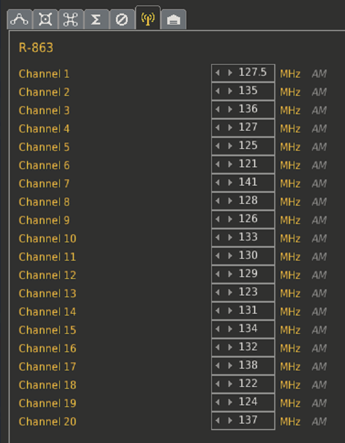

### Связная радиостанция ЯДРО-1А

Приемо-передающая коротковолновая радиостанция ЯДРО-1А предназначена
для беспоисковой и бесподстроечной телефонной радиосвязи с наземными
пунктами управления и между экипажами летательных аппаратов в воздухе.
Радиостанция обеспечивает симплексную телефонную связь с двумя видами
модуляции: АМ (амплитудная двухполосная модуляция) и ОМ (однополосная
модуляция). Радиостанция позволяет осуществлять настройку в процессе
полета на любую частоту рабочего диапазона.

В состав комплекта входят:

- приемопередатчик и антенно-согласующее устройство;
- лучевая антенна, расположена сверху, от фюзеляжа до
стабилизатора, на изоляционных стойках вдоль хвостовой балки;

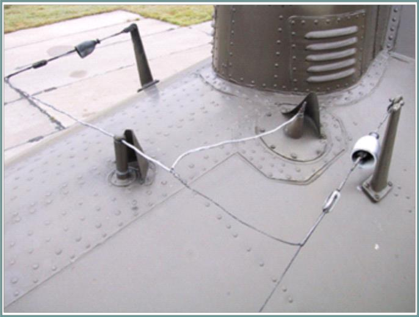

- пульт управления, на правом дополнительном щитке;
- АЗС "СВЯЗН. РС", на правом щитке электропульта.

!!! info "Основные ТТД"
    Диапазон частот 2-17,999 МГц

    Дискретность сетки частот 100 Гц

    Дальность связи не менее 900 км

    Готовность к работе не более 2 мин

    Время непрерывной работы 6 часов

    Чувствительность приемника:
    
    - при АМ 5 мкВ
    - при ОМ 3 мкВ
    
    Мощность передатчика:
    
    - на участке диапазона до 12,000 МГЦ 100 ВТ
    - на участке диапазона 12,000 – 17,999 МГЦ 50 ВТ
    
    Время перехода на другую частоту 5с

    Электропитание 28,5 В

#### Органы управления

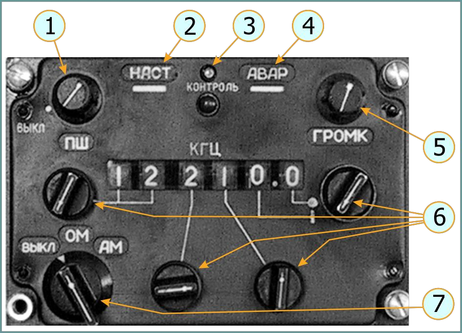

1. Регулятор "ПШ" для регулировки порога срабатывания подавителя шумов и его выключения 
2. Табло световой индикации "НАСТ." (белое) сигнализирует о режиме настройки на заданную частоту 
3. Кнопка и индикаторная лампа "КОНТРОЛЬ" для проверки радиостанции с помощью системы встроенного контроля 
4. Табло световой индикации "АВАР." (красное) сигнализирует об аварийном состоянии радиостанции 
5. Ручка "ГРОМК." для регулировки громкости принимаемого сигнала 
6. Четыре ручки для установки заданной частоты связи 
7. Переключатель на 3 положения: "ВЫКЛ." - радиостанция обесточена; "ОМ", "АМ" - выбор режима работы радиостанции.

Для использования радиостанции Ядро-1А необходимо:

- включить питание радиостанции и СПУ автоматами защиты сети
 "СВЯЗН. РС", "СПУ". Установить переключатель выбора радиосредств
абонентского аппарата СПУ в положение "СР", а переключатель
 "СПУ–РАДИО" в положение "РАДИО". Установить на пульте
управления радиостанцией:
- переключатель вида модуляции "ВЫКЛ. – ОМ - АМ" в положение,
соответствующее виду модуляции наземной радиостанции;
- выключатель "ПШ-ВЫКЛ." в положение "ВЫКЛ.";
- регулятор громкости на максимум;
- ручками установки частоты необходимую частоту, при этом на пульте
управления радиостанцией загорается табло "НАСТ.", которое должно
погаснуть не более чем через 5 с.

Для проверки работоспособности радиостанции с помощью системы
встроенного контроля нажать кнопку "КОНТР." на пульте управления
радиостанцией. При исправной радиостанции, работающей в режиме ПРИЕМ, в
телефонах должны прослушиваться шумы и загораться лампа "КОНТР.", в
режиме ПЕРЕДАЧА должен прослушиваться звуковой сигнал и загораться лампа
"КОНТР.".

Для выключения радиостанции автомат защиты сети "СВЯЗН. РС" установить в
положение "ВЫКЛ".

### Радиостанция Р-828

Предназначена для обеспечения беспоисковой бесподстроечной телефонной
радиосвязи с наземными пунктами управления и экипажами других летательных
аппаратов в воздухе, а при совместной работе с радиокомпасом АРК-УД – для
привода летательного аппарата на наземные радиостанции.

Радиостанция является малогабаритной многоканальной радиостанцией УКВ
диапазона с частотной модуляцией (ЧМ). Так как радиостанция не имеет
амплитудной модуляции (АМ), то связаться с РП в игре нет возможности.
Радиостанция Р-828 имеет два режима работы: "СВЯЗЬ" и "КОМПАС".

В режиме "СВЯЗЬ" радиостанция работает как обычная связная УКВ
радиостанция. В режиме "КОМПАС" радиостанция работает совместно с
радиокомпасом АРК-УД и обеспечивает вывод вертолета на наземные объекты с
радиостанциями, работающими в диапазоне 20…60 МГц. В этом режиме нет
возможности выхода на внешнюю связь.

В состав комплекта радиостанции Р-828 входят:

- приемопередатчик;
- пульт управления, на правом дополнительном щитке;
- выключатель "Р-828 ВКЛ. - ВЫКЛ." и переключатель "Р-828 КОМПАС-
СВЯЗЬ" на правом дополнительном щитке;
- антенна типа НИПВ (настраиваемый излучатель прямого
возбуждения), установлена в нижней части фюзеляжа.

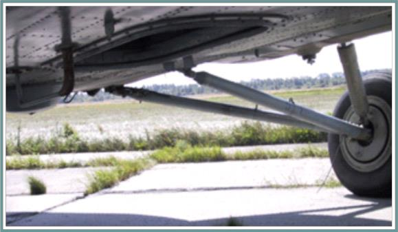

!!! note "Основные ТТД"
    Диапазон частот 20-59, 975 МГЦ. 
    Дискретность сетки частот 25 кГц. 
    Готовность к работе не более не более 3 мин. 
    Количество фиксированных частот связи 1600. 
    Число предварительно настроенных каналов 10. 
    Чувствительность приемника не хуже 2 мкВ. 
    Мощность передатчика 10 ВТ. 
    Дальность радиосвязи при высоте полета 1000 м 120 км. 
    Время перехода на другую частоту не более 5 с. 
    Электропитание 28,5 В. 

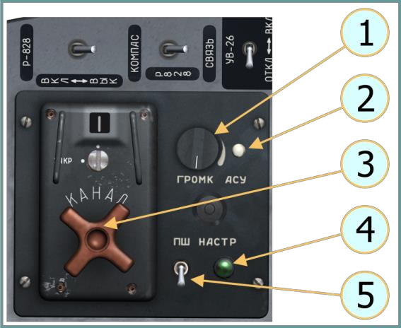

1. Ручка "ГРОМК" для регулирования громкости принимаемого сигнала 
2. Кнопка "АСУ" для включения системы АСУ с целью согласования выхода передатчика с антенной 
3. Запоминающее устройство с переключателем "КАНАЛ" для выбора одной из 10 ранее настроенных частот 
4. Сигнальная лампа "НАСТР" (белого цвета) сигнализирует о процессе настройки АСУ 
5. Выключатель "ПШ" для включения и выключения подавителя шумов

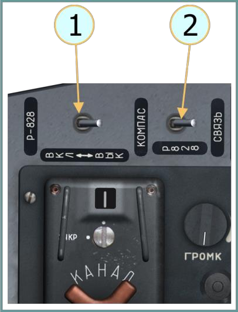

1. Выключатель "Р-828 ВКЛ – ВЫКЛ", для
включения и выключения радиостанции
2. Переключатель "Р-828 СВЯЗЬ – КОМПАС",
для выбора режима работы радиостанции

Для использования радиостанции Р-828 необходимо:

- включить питание радиостанции выключателем "Р-828 ВКЛ.– ВЫКЛ.",
СПУ АЗС "СПУ". Установить переключатель выбора радиосредств на
абонентском аппарате СПУ в положение "КР", а переключатель "СПУ–
РАДИО" в положение "РАДИО". Установить переключатель "Р-828
СВЯЗЬ-КОМПАС" в положение "СВЯЗЬ";
- установить на пульте управления радиостанцией:
	- выключатель "ПШ" в положение "ВЫКЛ.";
	- регулятор громкости на максимум;
	- переключателем "КАНАЛ" номер заданного канала связи, при этом
лампа "НАСТР." должна загореться и через 1–5 с погаснуть.

Для выключения радиостанции выключатель "Р-828 ВКЛ.-ВЫКЛ." установить в
положение "ВЫКЛ".

В полете для обеспечения вывода вертолета на наземную УКВ радиостанцию с
помощью радиокомпаса АРК-УД при совместной его работе с радиостанцией Р-
828 необходимо установить двустороннюю радиосвязь по радиостанции Р-828 с
наземной радиостанцией, дать команду оператору наземной радиостанции на
включение ее в режим ТОНАЛЬНОЙ МОДУЛЯЦИИ.

При приеме тонового сигнала перевести переключатель "Р-828 СВЯЗЬ-
КОМПАС", в положение "КОМПАС", при этом стрелка указателя радиокомпаса
АРК-УД должна показать направление на наземную радиостанцию.
Осуществить вывод вертолета на наземную радиостанцию путем выдерживания
нулевых показаний указателя АРК-УД.

#### НАСТРОЙКА КАНАЛОВ СВЯЗИ НА ЗАДАЮЩЕМ УСТРОЙСТВЕ (ЗУ) Р-828

Для предварительной настройки каналов для ЗУ Р-828 перед запуском миссии необходимо
настроить каналы на закладке настроек (после активации иконки вертолета на карте редактора
миссий):

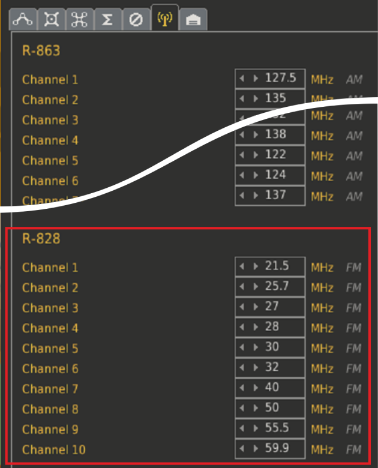

### Аппаратура речевой информации РИ-65Б

Речевой информатор РИ-65Б предназначен для речевого оповещения членов
экипажа и оператора наземного командного пункта через командную
радиостанцию Р-863 об аварийных ситуациях, возникающих на вертолете.
Речевые сообщения выдаются автоматически в телефоны членов экипажа при
поступлении на РИ-65Б сигналов от датчиков бортовых систем одновременно со
срабатыванием соответствующей световой сигнализации. При поступлении
сигналов от нескольких датчиков одновременно речевые сообщения выдаются
последовательно в зависимости от степени важности сообщения (первым
выдается сообщение, записанное на дорожке с меньшим номером).
Сообщения о пожаре на борту вертолета выдаются, кроме того, на вход
радиостанции УКВ диапазона (Р-863) для автоматической передачи на
наземный командный пункт.

На вертолете аппаратура РИ-65 обеспечивает выдачу в телефоны членов
экипажа следующих речевых сообщений:

- "Борт … Пожар в отсеке левого двигателя";
- "Борт … Пожар в отсеке правого двигателя";
- "Борт … Пожар в отсеке главного редуктора";
- "Борт … Пожар в отсеке обогревателя;
- "Опасная вибрация левого двигателя";
- "Опасная вибрация правого двигателя";
- "Отказала основная гидросистема";
- "Аварийный остаток топлива";
- "Отказал насос расходного бака";
- "Отказали насосы основных топливных баков";
- "Обледенение";
- "Отказал первый генератор";
- "Отказал второй генератор";
- "Блок РИ-65 исправен".

В комплект РИ-65 входят:

- аппаратура речевых сообщений;
- выключатель РИ-65Б и световое табло (желтого цвета) ВКЛЮЧИ РИ-
65 размещены на левом дополнительном щитке электропульта, Рис.
6.11;
- пульт дистанционного управления, Рис. 6.12.

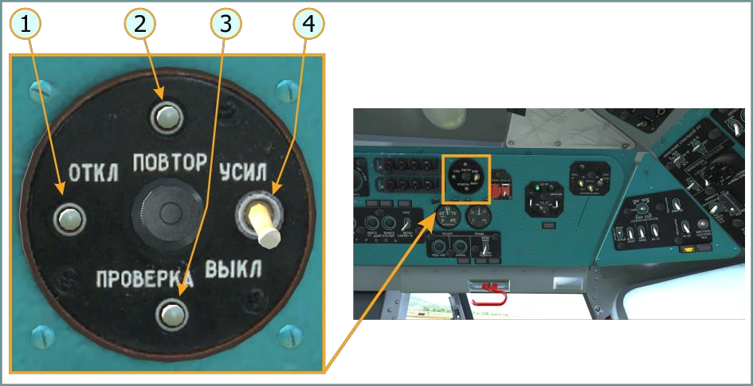

1. Кнопка ОТКЛ. для отключения прослушиваемой информации и перевода радиостанции Р-863 из режима ПЕРЕДАЧА в режим ПРИЕМ. 
2. Кнопка ПОВТОР для повторного прослушивания текущего речевого сообщения. 
3. Кнопка ПРОВЕРКА предназначена для проверки работо-способности аппаратуры 
4. Выключатель УСИЛ. не задействован.

Сигнальное табло ВКЛЮЧИ РИ-65 гаснет при включении питания аппаратуры
РИ-65Б.

Питание аппаратуры РИ-65 осуществляется постоянным током напряжением 27
В.

## Радиоаппаратура вертолетовождения

В состав радиоаппаратуры вертолетовождения входят:

- средневолновый автоматический радиокомпас АРК-9;
- ультракоротковолновый автоматический радиокомпас АРК-УД;
- доплеровский измеритель путевой скорости и угла сноса ДИСС-15;
- радиовысотомер малых высот РВ-5.

### Средневолновый автоматический радиокомпас АРК-9

Предназначен для вертолетовождения по приводным и широковещательным
радиостанциям. Радиокомпас обеспечивает измерение и непрерывный отсчет
курсового угла радиостанции (КУР), автоматическое определение пеленга на
радиостанцию, заход на посадку по системе ОСП, полет на радиостанцию и от
нее, прослушивание позывных сигналов радиостанций. Кроме того,
радиокомпас может использоваться в качестве резервного связного приемника.

Работает в трёх режимах: "Антенна", "Компас" и "РамкаВ состав комплекта АРК-
9 входят:

- приемник;
- рамочная антенна с блоком вращения рамки и ненаправленная
антенна расположены под общим радиопрозрачным обтекателем в
нижней части фюзеляжа;

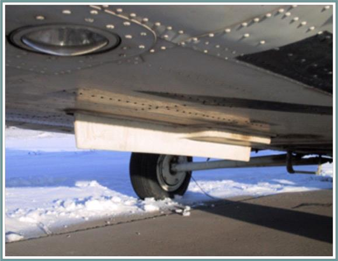

- антенно-согласующее устройство и антенный фильтр;
- пульт управления, на правой панели электропульта;
- переключатель "АРК СВ – АРК УКВ" для подключения указателя УГР-
4УК к радиокомпасу АРК-9 или к АРК-УД, на левой приборной доске
под прибором УГР-4УК;.
- АЗС "КОМПАС СВ" для подключения электропитания радиокомпаса, на
правой панели АЗС.
Указателями курсовых углов являются два индикатора УГР-4УК на левой и
правой приборных досках.

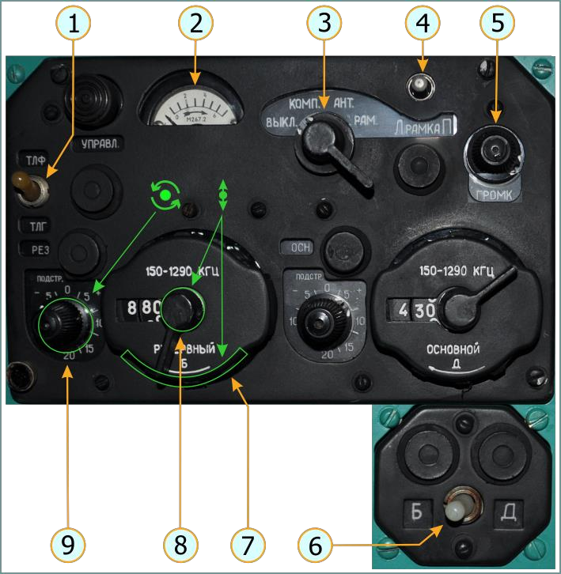

1. Переключатель "ТЛФ-ТЛГ" (основное положение "ТЛФ") 
2. Индикатор мощности сигнала 
3. Переключатель режимов работы "АРК ВЫКЛ., КОМП., АНТ., РАМ.":
    - "ВЫКЛ." радиокомпас обесточен;
    - "КОМП." (КОМПАС) работают все схемы радиокомпаса, основное положение;
    - "АНТ." (АНТЕННА) рамочная антенна отключается, приемник АРК работает на ненаправленную антенну и используется как широковещательный средневолновый приемник;
    - "РАМ." (РАМКА) прием сигналов осуществляется только на рамочную антенну. Режим является вспомогательным и используется в условиях большого уровня помех и при отказе режима "КОМПАС" для определения на слух пеленга радиостанции 
4. Нажимной переключатель "Л рамка П", для принудительного вращения рамочной антенны (и соответственно стрелки УГР- 4УК) во всех режимах работы АРК 
5. Ручка "ГРОМК." для регулировки громкости сигналов (кнопка "УПРАВЛ." не задействована) 
6. Переключатель "Б – Д" для переключения наборных устройств: в положении "Б" подключается левое наборное устройство, в положении "Д" - правое
7. Переключатель фиксированной настройки (сотни кГц) 
8. Переключатель фиксированной настройки (десятки кГц) 
9. Ручка точной подстройки

Переключатель "ТЛФ-ТЛГ" (1) устанавливается в положение, соответствующее
характеру работы приводной радиостанции Для прослушивания
модулированных сигналов приводных радиостанций, передач
широковещательных радиостанций и сообщений, передаваемых
руководителями полётов на частоте приводной радиостанции, переключатель
"ТЛФ – ТЛГ" на пульте управления радиокомпасом должен быть установлен в
положение "ТЛФ", для прослушивания немодулированных сигналов приводных
радиостанций - в положение "ТЛГ" (основное положение "ТЛФ").

Прослушивание позывных сигналов обеспечивается при установке
переключателя режимов работы на абонентском щитке СПУ в положение "РК 1".
Ручками настройки (7, 8) устанавливается частота от 150 до 1290 кГц с шагом
10 кГц.

Установка сотен килогерц (7) на переключателе фиксированной настройки
осуществляется вращением барабана переключателя, для чего подвести
указатель мыши в обозначенную зеленым маркером область (7), курсор мыши
при этом преобразуется в "маркер клика"

далее нажимая левую или правую
кнопку мыши установить нужное значение сотен кГц.

Установка десятков килогерц (8) на переключателе фиксированной
настройки осуществляется поворотом флажка переключателя, для чего
подвести указатель мыши в обозначенную зеленым маркером область (8),
курсор мыши при этом преобразуется в "маркер клика", далее нажимая
левую или правую кнопку мыши установить нужное значение десятков кГц.

Подстройка единиц килогерц (9) осуществляется ручкой тонкой настройки,
для чего подвести указатель мыши в обозначенную зеленым маркером область
(9), курсор мыши при этом преобразуется в "маркер вращения"

далее
вращая колесо мыши, повернуть ручку на нужное значение.

Частота, на которую установлен переключатель фиксированной настройки,
показывается цифрами в окне переключателя, ручками точной подстройки
устанавливается добавка от -10 до +20 кГц, суммирующаяся с установленной на
переключателе частотой.

!!! info "Основные ТТД"
    Диапазон рабочих частот 150-1300 кГц.

    Точностью настройки ±10 кГц.

    Дискретностью настройки 10 кГц.

    Дальность действия при работе с радиостанцией ПАР-10 не менее 160 км. при Нпол. = 1000 м

    Время перехода на другой канал 2-4 с.

    Точность определения курсового угла не более 2°.

    Время готовности к работе 1-2 мин.

    Чувствительность в режиме АНТ 5-8 мкВ.

#### Включение и настройка радиокомпаса

1. Включить питание радиокомпаса (должны работать источники 27V, 115V
400Hz) и СПУ автоматами защиты сети "КОМПАС СВ", "СПУ".
2. Установить переключатель выбора радиосредств абонентского аппарата СПУ
в положение "РК 1", а переключатель "СПУ–РАДИО" в положение "РАДИО"

    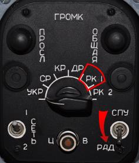

3. Установить переключатель "АРК-СВ – АРК-УКВ" в
положение "АРК-СВ" (Средневолновый АРК) для подключения УГР-4 на левой
приборной доске к контуру АРК-9, а не к АРК-УД.

    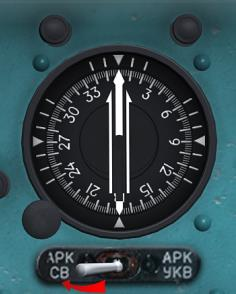

4. Установить на <a href="#614">пульте управления радиокомпасом (Рис. 6.14)</a>:
    - переключатель рода работы (3) в положение "АНТ.";
    - переключатель "ТЛФ–ТЛГ" (1) в положение ТЛФ (в положении "ТЛГ",
    в телефонах должен появляться звуковой сигнал, а в положении
     "ТЛФ" – исчезать);
    - регулятор громкости (5) в крайнее правое положение;
    - переключатель "Б – Д" (6) в положение "Б";
    - наборным устройством первого канала частоту работы приводной
    радиостанции (7-9) и прослушать ее позывные (контролировать по
    максимальному отклонению стрелки индикатора мощности сигнала,
     (2));
    - переключатель рода (3) работы в положение "КОМП.", при этом
    стрелка указателя УГР-4 должна указать курсовой угол пеленгуемой
    радиостанции;
    - отвести стрелку указателя УГР-4 от первоначального положения КУР
    на угол 150°–170° нажатием переключателя "Л-РАМКА-П" (4),
    отпустить переключатель "Л-РАМКА-П", при этом стрелка указателя
    УГР-4 должна возвратиться в первоначальное положение;
5. Установить переключатель "Б – Д" (6) в положение "Д" и настроить
радиокомпас аналогичным образом.

При работе радиокомпаса в условиях помех может использоваться <a href="#614-3">режим "РАМ"
(Рис. 6.14, 3)</a>. В этом случае для определения пеленга на радиостанцию
нажатием переключателя "Л-РАМКА-П" определить пеленг по минимальной
громкости приема позывных сигналов радиостанции.

### Ультракоротковолновый автоматический радиокомпас АРК-УД

Предназначен для привода вертолета на радиостанции (радиомаяки)
непрерывного и импульсного излучения в целях поиска экипажей вертолетов и
других летательных аппаратов, оборудованных аварийными УКВ и ДЦВ
радиостанциями (радиомаяками), а также для сбора группы вертолетов в
воздухе.

Радиокомпас АРК-УД обеспечивает:

- круговое автоматическое курсоуказание и привод поисковых
вертолетов на УКВ или ДЦВ радиомаяки (радиостанции);
- четкую отметку момента пролета вертолета радиомаяка
 (радиостанции) путем изменения показаний индикатора УГР-4УК на
180°;
- опознавание летчиком сигналов радиомаяка (радиостанции), на
которой осуществляется привод вертолета.

В состав комплекта АРК-УД входят:

- антенный блок (рамочная и ненаправленная антенна), установлен
под полом грузовой кабины в специальной чаше;

    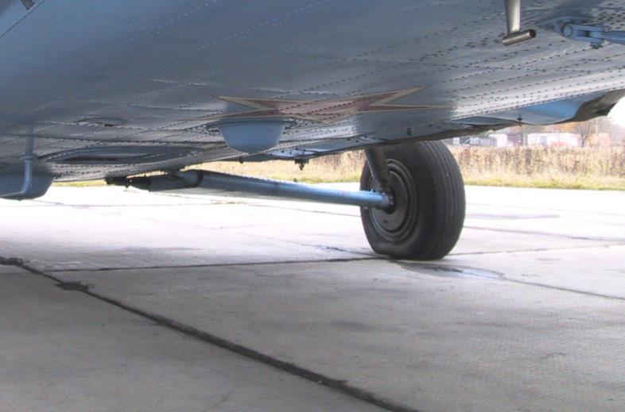

- антенный усилитель;
- пульт дистанционного управления, на правой панели электропульта;
- приемно-пеленгаторное устройство;
- ненаправленная антенна АШС-УД на хвостовой балке;

    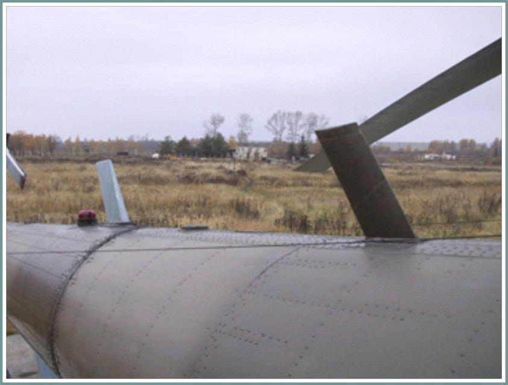

- выключатель "БЛОКИРОВКА АРК-УД" на правом щитке электропульта
для обеспечения блокировки радиокомпаса при работе радиостанции
Р-863 на передачу;
- АЗС "РАДИОКОМПАС УКВ", на правой панели АЗС;
- переключатель "АРК СВ - АРК УКВ", на левой приборной доске.

Работа радиокомпаса в УКВ и ДЦВ диапазонах имеет отличительную
особенность от работы в средневолновом диапазоне:

1. В диапазоне УКВ и ДЦВ металлические части фюзеляжа вертолета влияют на
точность показаний, т.к. они соизмеримы с длиной волны. Вследствие чего
радиокомпас АРК–УД показывает только ориентировочное направление на
пеленгуемую радиостанцию (радиомаяк).
2. В УКВ диапазоне радиоволны не огибают препятствия, а отражаются от них.
В результате возникают интенсивные переотражённые сигналы, вызывающие
колебания стрелки при приближении вертолета к радиомаяку.

!!! info "Основные ТТД"
    УКВ диапазон частот 114,166-124,1 МГц.
    
    Фиксированные частоты
    
    - 114,166 МГц;
    - 121,5 МГц;
    - 114,333 МГц;
    - 123,1 МГц;
    - 114,583 МГц;
    - 124,1 МГц.
    
    ДЦВ диапазон частот 243-248 МГц.
    
    Фиксированная частота 243 МГц.
    
    Дальность действия с Р-855УМ:
    
    - Н=3000 м 55 км;
    - Н=1000 м 35 км;
    - Н=500 м 25 км;
    - Н=300 м 15 км.
    
    Точность пеленгования на нулевом КУР не хуже ±3°.
    
    Точность выхода на аварийную радиостанцию по боковому не более ±200м.
    уклонению на Н=1000 м

1. Переключатель режимов "ВЫКЛ., УП., ШП, И, РПК.":
	- "ВЫКЛ." радиокомпас обесточен;
	- "УП" (узкая полоса) - принимается непрерывный сигнал узкополосной частью приемника, сигнализируется лампой;
	- "ШП" (широкая полоса) - принимается непрерывный сигнал широкополосной частью приемника, сигнализируется лампой;
	- "И" (импульсный режим) - канал привода включен для работы со схемой преобразования при приеме импульсных сигналов маяков с длительностью импульса 40 мкс и частотой повторения 300 Гц, а телефонный выход канала обнаружения подключен к широкополосной части приемника, сигнализируется лампой;
	- "РПК" (радиополукомпас) - не используется; 
2. Переключатель "ЧУВСТВ. Б-М" для переключения чувствительности (инерционности) следящей системы канала привода:
	- "Б" - максимальная чувствительность
	- "М" - минимальная чувствительность 
3. Переключатель "КАНАЛЫ" на 6 положений для переключения фиксированных настроенных частот 
4. Кнопки "Л-АНТ.- П." для вращения антенны АРК во всех режимах 
5. Кнопка "КОНТР." для проверки работоспособности аппаратуры 
6. Регулятор громкости – для регулировки громкости 
7. Переключатель "УКВ-ДЦВ" для переключения диапазона частот

Радиокомпас АРК-УД работает на следующих фиксированных частотах:

Диапазон | Частота, МНz | Номер канала на ПУ
---------|--------------|---------------
УКВ | 114,166  |1
УКВ | 114,333  |2
УКВ | 114,583  |3
УКВ | 121,5   | 4
УКВ | 123,1   | 5
УКВ | 124,1   | 6
ДЦВ | 243,0   | Не имеет значения

При работе встроенного контроля (5) стрелка УГР-4УК устанавливается на
КУР=180°±10° и загораются сигнальные лампочки соответственного режима,
установленного переключателем (1) на пульте управления.

На вертолете в качестве индикатора курсовых углов пеленгуемых АРК-УД
радиостанций используется указатель УГР-4УК только левого летчика.

#### Использование радиокомпаса АРК-УД

1. Включить питание компаса (27V, 115V 400Нz и 36V 400Нz), автоматы защиты
сети "РАДИОКОМПАС УКВ" и "СПУ" на панели АЗС, на абонентском аппарате
СПУ-7 установить положение РК2, а переключатель "СПУ–РАДИО" в положение
"РАДИО" .

    

2. Установить выключатель "АРК СВ–АРК УКВ" в положение "АРК УКВ"
 (это необходимо для прослушивания речи или тонального
сигнала, для работы компаса необязательно);

    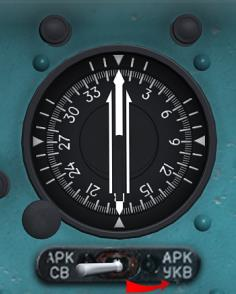

3. На <a href="#617">пульте управления АРК-УД (Рис. 6.17)</a>:
    - переключатель режимов работы на пульте управления (1) в
    положение УП, а при загорании лампы ШП (когда вертолет
    приблизится к объекту поиска) – в положение ШП;
    - переключатель диапазонов (7) – в положение прослушиваемого
    диапазона, а переключатель "КАНАЛЫ" (3) – на требуемый канал (при
    установке переключателя диапазонов (7) в положение ДЦВ номер
    канала на переключателе КАНАЛЫ не имеет значения).

!!! note "Примечание"
    При установке переключателя режимов в положение "И" в наушниках должен
    прослушиваться тональный сигнал с пониженной частотой (в игре этот режим пока не
    используется).

Для использования АРК-УД в игре необходимо, чтобы источник радиоизлучения
(радиостанция наземной техники или ЛА) был настроен на одну из частот,
приведенных в таблице выше.

!!! note "Примечание"
    Настройка осуществляется из редактора миссий:
    1. выбрать ЛА или наземную
    единицу
    2. МАРШРУТ/ РАСШИРЕННЫЙ (ППМ, ДЕЙСТВИЯ)/ добавить действие –
    ВЫПОЛНИТЬ КОМАНДУ/ УСТАНОВИТЬ ЧАСТОТУ (модуляция AM)
    3. добавить действие –
    ВЫПОЛНИТЬ КОМАНДУ/ ПОСЛАТЬ СООБЩЕНИЕ (выбрать звуковой файл в качестве
    передаваемой информации на излучение, выбрать флаг "Закольцевать", чтобы звучало
    непрерывно)

    Более подробно см. Руководство по использованию редактора миссий DCS User
    Manual RU(EN).pdf.

Кроме того, для определения направления на радиостанции сухопутных войск
компас АРК-УД может использовать приемник радиостанции Р-828. При этом
получается, что "компасная часть" АРК-УД переключается с собственного
приемника, на приемник Р-828, который работает в другом диапазоне частот.
Переключение выполняется с пульта управления Р-828

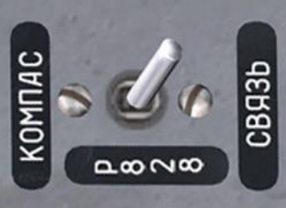

Более подробно см. описание [Р-828](#-828).

### Доплеровский измеритель путевой скорости и угла сноса ДИСС-15

Предназначен для автоматического непрерывного измерения и индикации
путевой скорости и угла сноса, составляющих вектора путевой скорости и
счисления ортодромических координат местоположения вертолета.

ДИСС-15 совместно с другими бортовыми устройствами позволяет решать
следующие навигационные задачи:

- вывод вертолета в точку с заданными координатами;
- висение вертолета и посадку при отсутствии информации о силе и
направлении ветра;
- висение и управление движением при отсутствии визуальной
видимости.

В комплект аппаратуры ДИСС-15 входят:

- низкочастотный блок (внутри вертолета);
- вычислитель координат (внутри вертолета);
- высокочастотный блок, в нижней части хвостовой балки;

    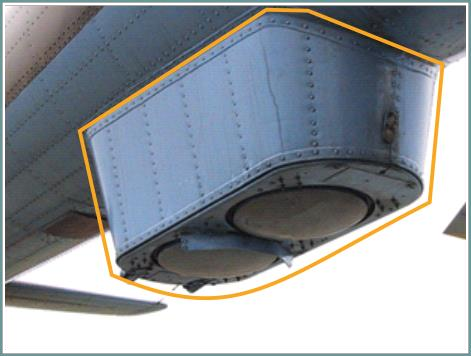

- индикатор висения и малых скоростей на левой приборной доске;

    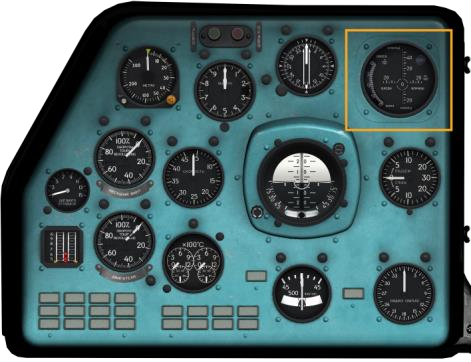

- индикатор путевой скорости и угла сноса (1), индикатор координат
 (2), табло "ДИСС ОТКАЗАЛ" (3) на правой приборной доске
 (загорается при переходе ДИСС в режим "ПАМЯТЬ" или при отказе
составных элементов ДИСС);

    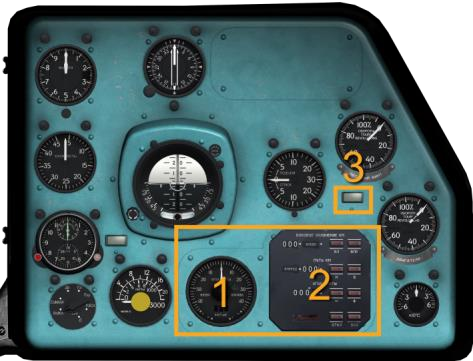

- пульт контроля;

    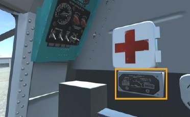

- выключатель питания "ДИСС" (1) и, если необходимо, выключатель
 "ПОДСВЕТ 5,5В" (обеспечивает включение подсвета элементов
управления и индикации ДИСС в кабине), на правом щитке
электропульта (2);

    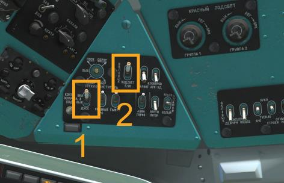

- АЗС "ДИСС", на правой панели АЗС.

Работа ДИСС-15 основана на использовании эффекта Доплера. Для измерения
путевой скорости на вертолете установлены передатчик (источник излучения) и
приемник, который принимает отраженные от земли сигналы, несущие
информацию о частоте Доплера. В аппаратуре ДИСС-15 используется антенная
система с трехлучевой диаграммой направленности, что необходимо для
измерения угла сноса и вычисления трех составляющих вектора путевой
скорости.

Вычислитель составляющих вектора путевой скорости состоит из двух основных
решающих схем. Сначала определяются составляющие путевой скорости в
прямоугольной системе координат, связанной с вертолетом, затем решается
задача пересчета составляющих вектора скорости из прямоугольной связанной

в прямоугольную горизонтальную систему координат, с учетом величин углов
крена и тангажа, поступающих с левого авиагоризонта АГБ-ЗК.
Вычисленные значения выдаются на индикаторы:

- висения и малых скоростей;
- путевой скорости и угла сноса;
- координат.

При полете над водной поверхностью и волнении менее 1...2 баллов ДИСС
переходит в режим ПАМЯТЬ, при этом летчикам выдаются предыдущие
измерения. Кроме этого ДИСС переходит в режим ПАМЯТЬ при углах крена
более ±30° и при углах тангажа более ±7°.

!!! info "Основные ТТД"
    Вид излучения непрерывное.
    
    Частота излучаемых колебаний 13325 +20 -30 МГц.
    
    Мощность излучения не менее 2 Вт.
    
    Рабочий диапазон высот 10-3000 м.
    
    В режиме висения:
    
    - над сушей 2-1000 м;
    - над морем (при волнении более 1 балла) 2-500 м.
    
    Диапазон измерения путевой скорости 0-400 км/ч.
    
    Диапазон измерения углов сноса ±45°.
    
    Погрешности измерения:
    
    - путевой скорости 0,5% ±1,5 км/ч;
    - угла сноса 25 угловых минут;
    - ортодромических координат 1% ±1 км за 1 час;
    - продольной и поперечной составляющих ±1,5 км/ч;
    - вертикальной составляющей ±0, 4 м/с.

#### ОРГАНЫ УПРАВЛЕНИЯ И ИНДИКАЦИИ

##### Пульт контроля

Предназначен для контроля работоспособности аппаратуры
ДИСС на земле и в воздухе, расположен за спиной правого пилота. Позволяет
периодически контролировать исправность аппаратуры по правильности
решения контрольных задач (соответствие наблюдаемых значений параметров
допускам, указанным на передней панели пульта контроля). Кроме того, в
аппаратуре ДИСС-15 имеется непрерывный автоматический контроль:

- при заниженном уменьшении уровня отраженного сигнала или
отсутствии его на индикаторе путевой скорости загорается табло "П";
- при отказе магнетрона на пульте контроля загорается табло "М";
- при нарушении работы вычислителя на пульте контроля загорается
табло "В". На правой приборной доске загорается табло "ДИСС
ОТКАЗАЛ" одновременно с загоранием табло "М" или "В" на пульте
контроля.

1. Переключатель режимов на пять положений. При установке переключателя в первые четыре
положения обеспечивается проверка работоспособности, при этом СВЧ колебания передатчика
в антенну не поступают.

    Первое и второе положение служат для проверки правильности отработки контрольных
значений, составляющих вектора путевой скорости в режиме висения и малых скоростей.
Решение контрольных задач проверятеся по индикатору висения и малых скоростей на левой
приборной доске.

    Третье положение для проверки точности индикации путевой скорости и угла сноса. Решение
контрольной задачи проверяется по Индикатору путевой скорости и угла сноса на правой
приборной доске.

    Четвертое контроль работоспособности в режиме ПАМЯТЬ.

2. Световое табло "КОНТРОЛЬ". Включается при установке переключателя режимов в первые
четыре положения;
3. Световое табло РАБОТА (зеленого цвета). Включается при установке переключателя режимов
работы в пятое положение, при отсутствии сигналов отказа. В этом положении происходит
излучение передающей антенной СВЧ колебаний передатчика и измерение составляющих
путевой скорости и угла сноса.
4. Световое табло "В" (красного цвета). Включается при отказе вычислителя составляющих
вектора путевой скорости;
5. Световое табло "М" (красного цвета). Включается при отказе передающего устройства
(магнетрона).

##### Индикатор висения и малых скоростей

Предназначен для индикации трех
составляющих вектора скорости при висении, взлете, посадке и медленных
перемещениях вертолета. Расположен на левой приборной доске.

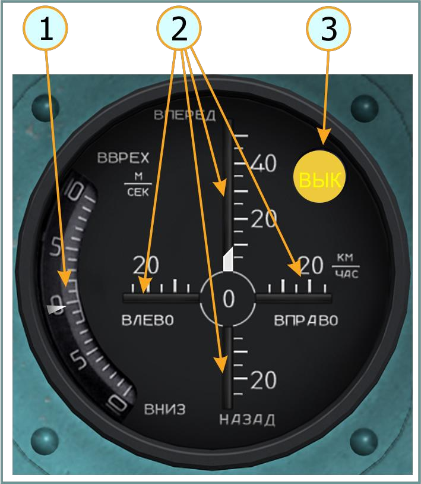

1. Шкала отсчета скорости вверх-вниз, индицируется подвижной стрелкой по левой шкале.
Цена деления 1 м/с;
2. Шкалы отсчета скорости вперед-назад и влево-вправо. Отсчет производится по острию
столбиков-указателей, перемещающихся в щелях перекрестия. Цена деления 5 км/ч.
3. Табло "ВЫК." включается в случаях:

    а) превышения более чем на 50 км/ч продольной составляющей путевой скорости, при этом в
работу включается индикатор путевой скорости и угла сноса, а индикатор висения отключается;
    б) при переходе аппаратуры в режим "ПАМЯТЬ".

##### Индикатор путевой скорости и угла сноса

Предназначен для индикации
текущих значений путевой скорости и угла сноса в режиме навигации.

Расположен на правой приборной доске.

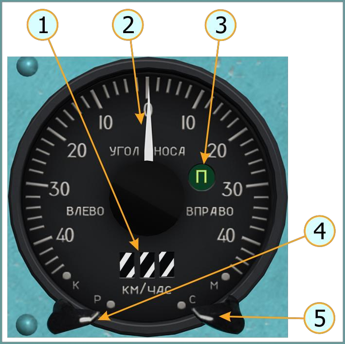

1. Трехразрядный счетчик путевой скорости (50 до 400 км/ч). Цена деления счетчика: первого
разряда. 1 км/ч, второго разряда. 10 км/ч, третьего разряда. 100 км/ч. При путевой скорости
менее 50 км/ч цифровой счетчик закрыт шторкой;
2. Стрелка указателя угла сноса (диапазон измерения ± 45°). Цена деления шкалы угла сноса.
2°;
3. Зеленая лампа "П", сигнализирует работу режима "ПАМЯТЬ";
4. Ручка-переключатель режимов "Р-К" (РАБОТА-КОНТРОЛЬ). При установке переключателя в
положение "К" отрабатывается значение скорости 306±3,5 км/ч и угла сноса 15± 1°;
5. Ручка-переключатель режимов "С-М" (СУША-МОРЕ), для коррекции показаний аппаратуры
ДИСС-15 при полетах над морем и сушей, при этом текущее значение путевой скорости
увеличивается на 2%.

##### Индикатор координат

Предназначен для отработки и индикации
ортодромических координат вертолета. Расположен на правой приборной
доске.

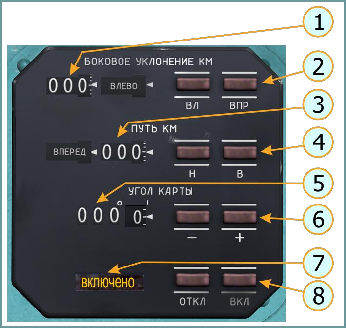

1. Счетчик "БОКОВОЕ УКЛОНЕНИЕ КМ", показывает отклонение вертолета ВПРАВО или ВЛЕВО
от линии заданного пути в километрах с дискретностью 200 м;
2. Кнопки "ВЛ", "ВПР" предназначены для обнуления счетчика "БОКОВОЕ УКЛОНЕНИЕ КМ";
3. Счетчик "ПУТЬ КМ", показывает пройденный путь ВПЕРЕД или НАЗАД в километрах с
дискретностью 200 м;
4. Кнопки "Н" и "В" предназначены для обнуления счетчика "ПУТЬ КМ";
5. Счетчик "УГОЛ КАРТЫ" предназначен для индикации угла карты с дискретностью 6 угловых
минут;
6. Кнопки "-" и "+", для установки угла карты по счетчику "УГОЛ КАРТЫ";
7. Табло "ВКЛЮЧЕНО", сигнализирует о работе индикатора координат;
8. Кнопки "ВКЛ" и "ОТКЛ" для включения и отключения режима счисления координат.

УГОЛ КАРТЫ – угол, который выставляется перед полетом для работы счетчика
координат. "Зная" угол карты (УК) система начинает отсчет пройденного
расстояния от точки включения кнопки 8 на индикаторе координат. Т.е. по сути,
летчик-штурман устанавливает некое условное начало координат отсчета,
относительно которого рассчитывается текущее положение вертолета.

Если необходимо выполнить полет по маршруту с достаточно длинным участком
(по опыту – более 30км), то целесообразно отслеживать координаты вертолета
(пройденный путь и боковое уклонение) относительно оси этого этапа. Для
этого угол карты выставляется равным значению МПУ этого участка маршрута.

Если необходимо пролететь по маршруту с несколькими поворотными и при
этом этапы относительно непродолжительны, то для удобства использования в
полете (а именно – исключения необходимости постоянно наклоняться к панели
управления ДИСС и заниматься вводом нового угла карты) выбирается некая
условная линия (ортодромия), тогда значением УК выставляется значение угла
между магнитным меридианом и направлением этой линии. При этом летчик-
штурман заранее определяет расчетные значения показаний Индикатора
координат (влево-вправо-вперед-назад) на каждом ППМ, подписывает их рядом
с ППМ, и руководствуется ими при контроле текущего положения вертолёта.
Подсветка индикаторов ДИСС-15 осуществляется от системы "Подсвет 5,5В".

#### Включение и проверка ДИСС

1. Включить АЗС ДИСС.

    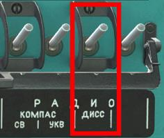

2. Установить переключатель режимов на пульте контроля (ПК) в положение ПАМЯТЬ.

    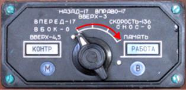

3. На индикаторе путевой скорости и угла сноса переключатели К-Р, С-М установить
соответственно в положение Р (работа) и С (суша).

    

3. Включить питание ДИСС (после включения источников питания 27V постоянного тока и 115V
переменного тока включить выключатель ДИСС на правом электрощитке)

    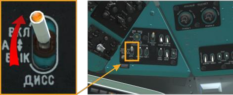

    При этом должны загореться:

	- на пульте контроля табло: КОНТРОЛЬ, М, В,
	- на индикаторе путевой скорости и угла сноса световое табло П;
	- на индикаторе висения и малых скоростей табло ВЫК.;
	- на приборной доске правого летчика табло ДИСС ОТКАЗАЛ.
4. На пульте контроля переключатель режимов установить поочередно в положение 1, 2, 3, при
этом на индикаторе висения и малых скоростей значения должны отличаться не более, чем на
±2,5 км/ч для продольной и поперечной составляющих и ±0,5 м/с для вертикальной
составляющей от значений, указанных на пульте контроля. Показания индикатора путевой
скорости и угла сноса должны быть 136±2,5 км/ч и 0±1° соответственно.
5. Переключатель С-М установить в положение М , при этом значение
путевой скорости должно увеличиться на 3 км/ч (2%)от прежнего значения. Вернуть
переключатель в положение С.

    

6. Поставить переключатель режимов в положение 3 и проверить работу индикатора координат
для чего:
	- обнулить счетчики БОКОВОЕ УКЛОНЕНИЕ КМ, ПУТЬ КМ и УГОЛ КАРТЫ;
	- нажать кнопку ВКЛ., при этом загорится световое табло ВКЛЮЧЕНО на индикаторе
координат. Включить секундомер и засечь время. За 5 минут счетчик ПУТЬ КМ должен
отработать ВПЕРЕД 11, 3 км; а БОКОВОЕ УКЛОНЕНИЕ КМ – 0 км.

    За 10 минут счетчик ПУТЬ КМ должен отработать ВПЕРЕД 22,5±1,5 км, а счетчик БОКОВОЕ
УКЛОНЕНИЕ КМ - 0±1,1 км.

7. Переключатель К-Р установить в положение К. На счетчике путевой
скорости должно установиться значение 306±3,5 км/ч, угол сноса ВЛЕВО –15±1°.

    

8. Установить переключатель режимов работы в положение ПАМЯТЬ. При этом путевая скорость
не должна измениться от прежнего значения более, чем на ± 9 км/ч, а угол сноса не более чем
на ± 3°. Одновременно должно загореться табло П.
9. После проверок для применения ДИСС-15 в полете необходимо переключатель режимов
установить в положение РАБОТА.

    

    При этом будут работать: индикатор
висения и малых скоростей и индикатор путевой скорости и угла сноса.
10. Для применения индикатора координат (кроме установки переключателя в положение
РАБОТА) необходимо установить на индикаторе угол карты (УК), равный магнитному путевому
углу следующего этапа маршрута (в случае варианта применения в частной ортодромической
системе координат) и включить аппаратуру кнопкой ВКЛ над ориентиром начала
этого этапа маршрута.

    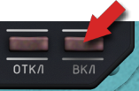

    На индикаторе будут отсчитываться пройденный путь (ВПЕРЕД +
значение) и линейное боковое уклонение (ВЛЕВО или ВПРАВО + значение). Можно установить
начальное значение расстояния кнопкой НАЗАД. В этом случае с приближением к следующему
ППМ расстояние на счетчике будет убывать (НАЗАД + значение) и на следующем ППМ счетчик
покажет значение 0.

### Радиовысотомер малых высот РВ-5

Предназначен для измерения истинной высоты полета вертолета над
поверхностью суши и моря в диапазоне от 0 до 750 м. Точность измерения
истинной высоты ±2 м на высотах до 20 м и ±0,1Н на высотах более 20 м.

В комплект радиовысотомера входят:

- приемопередатчик;
- индикатор высоты, на левой приборной доске;
- приемная и передающая антенны, установлены в нижней части
хвостовой балки;
- АЗС "РАДИОВЫСОТОМЕР" на правой панели АЗС;
- выключатель "РАДИОВЫСОТОМЕР ВКЛ. - ОТКЛ.", расположен на
левой приборной доске.

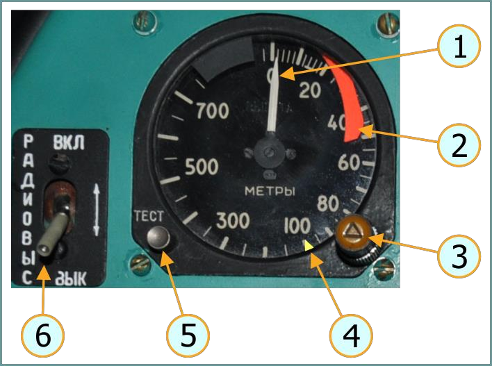

1. Стрелка указателя высоты
2. Флажок (бленкер) сигнализации отказа радиовысотомера
3. Ручка для установки "опасной высоты" путем перемещения индекса по шкале указателя. В
ручке смонтирована желтая лампа. В полете при достижении "опасной высоты" выдается
звуковая и световая сигнализация
4. Подвижный индекс-указатель для установки "опасной высоты"
5. Кнопка "ТЕСТ" для проверки работоспособности радиовысотомера по отклонению стрелки
высоты индикатора в контрольный сектор
6. Выключатель радиовысотомера на левой приборной доске.

При использовании радиовысотомера в полете не требуется производить его
подстройку и регулирование (кроме установки "опасной высоты").

При полетах на малых высотах над толстым слоем льда (снега) радиовысотомер
может измерять высоту с большой ошибкой, так как измерение высоты может
происходить от нижней кромки ледяного (снежного) покрова. Высота до
верхней кромки ледяного (снежного) покрова измеряется только при полетах
над влажным или загрязненным льдом или снегом.

При полетах на малых высотах над лесными массивами в зависимости от
состава и плотности леса радиовысотомер может измерять высоту до верхней
кромки крон деревьев (густой лес) или до земной поверхности (редкий лес).

При полетах над горной местностью, когда резкие изменения высоты полета
могут выходить за пределы диапазона измеряемых высот, а также при углах
крена и тангажа более 40° радиовысотомером пользоваться не рекомендуется.

При углах крена и тангажа более 20° погрешность измерения высоты полета
увеличивается за счет влияния наклонной дальности.

При полетах выше рабочего диапазона высот или неисправном
радиовысотомере на индикаторе высоты появляется флажок бленкера красного
цвета, стрелка индикатора находится в темном секторе, со стороны больших
высот.

При проверке радиовысотомера в режиме "Контроль" (может производиться на
любой высоте нажатием кнопки ТЕСТ на индикаторе высотомера) необходимое
время контроля определяется временем прохождения стрелки индикатора из
затемненного сектора до высоты 15 м. После отработки контрольной высоты
флажок бленкера не должен быть в поле зрения.

При снижении вертолета и прохождении им заданной высоты выдается
звуковая и световая сигнализация.

При транспортировке крупногабаритных грузов на внешней подвеске
радиовысотомер может давать неустойчивые показания (в игре не
реализовано).

При отключении питающих напряжений от радиовысотомера на индикаторе
радиовысотомера появляется флажок бленкера, а стрелка индикатора может
находиться в любой точке шкалы.

Питание радиовысотомера осуществляется постоянным током напряжением 27
В и переменным током напряжением 115 В 400 Гц.

Подсветка индикатора РВ-5 осуществляется от системы "Подсвет 5,5В".

!!! info "Основные ТТД"
    Диапазон частот 4200-4400 МГц
    
    Диапазон измерения высот 0-750 м
    
    Вид модуляции частотная
    
    Длительность звукового сигнала 3-9 с
    
    Погрешность измерения текущей высоты полета:
    
    - на Н=0-20 м ±2 м
    - на Н=20-750 м ± 0,1 Н

#### Включение и проверка работоспособности радиовысотомера

1. Включить автомат защиты сети "РАДИОВЫСОТОМЕР", на правой панели АЗС.

    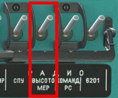

2. Установить выключатель "РАДИОВЫС. ВКЛ.– ВЫК.", расположенный на левой приборной
доске, в положение "ВКЛ."

    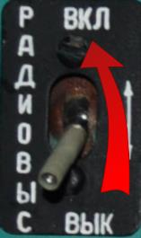

3. После включения радиовысотомера стрелка индикатора высоты должна отклониться в
темный сектор и через 1–2 мин установиться в пределах двойной ширины оцифрованной
нулевой риски шкалы, а флажок бленкера индикатора высоты должен исчезнуть из поля
зрения.
4. Если индекс "ОПАСНАЯ ВЫСОТА" был установлен в диапазоне измеряемых высот начиная с 5
м, то в момент перехода стрелки через значение высоты, отмеченной индексом "ОПАСНАЯ
ВЫСОТА", должна сработать звуковая сигнализация (в течение 3 – 9 с слышится прерывистый
сигнал) и световая сигнализация (загорается желтая лампа "ОПАСНАЯ ВЫСОТА").
5. Нажать кнопку "ТЕСТ" на индикаторе радиовысотомера, при этом стрелка индикатора должна
установиться в контрольном секторе шкалы.
5. Отпустить кнопку ТЕСТ, стрелка индикатора должна вернуться в первоначальное положение.

### Радиоаппаратура специального назначения (Устройство выброса УВ-26)

#### Предназначение

УВ-26 предназначено для постановки пассивных ИК-помех с борта вертолета за
счет выброса тепловых ИК-патронов. Объектами РЭБ являются ГСН ракет с
тепловой головкой самонаведения ("Игла", "Стингер", AIM-9, Р-60, Р-73 и т.д.).

Устройство УВ-26 обеспечивает:

- отстрел по заданной программе непрерывной серии по одному
патрону или залпами до полного израсходования всех патронов;
- раздельную индикацию наличия патронов по правому и левому
бортам;
- индикацию кода установленной программы;
- прекращение и возобновление отстрела помеховых патронов с
возможностью изменения заданной программы;
- выбор начала отстрела с левого или правого бортов с
автоматическим переходом на другой борт при израсходовании
патронов на одном.

#### Состав УВ-26

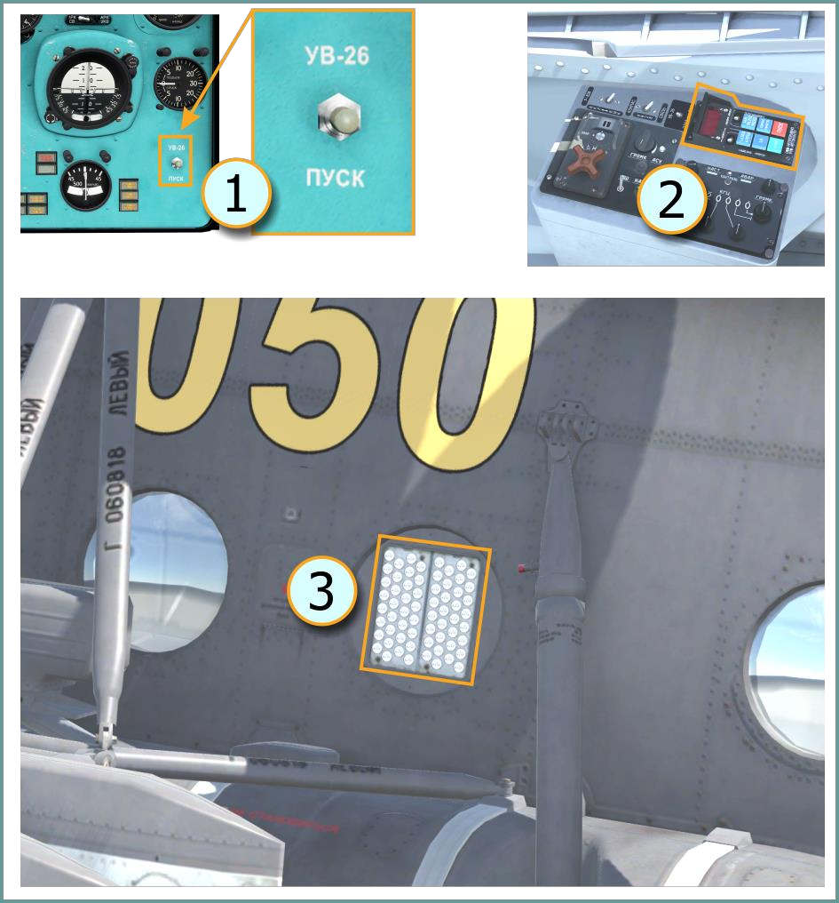

1. Кнопка для отстрела патронов на левой приборной доске.
2. Пульт управления УВ-26 установлен на правой дополнительной
панели.
3. Четыре держателя с кассетами (устанавливаются вместо
иллюминаторов на левом и правом борту попарно). В каждом
держателе имеется одна кассета, снаряженная 32 патронами. Всего в
4-х кассетах – 128 патронов ППИ-26.

#### Пульт управления УВ-26

Пульт управления УВ-26 располагается с правой стороны на дополнительном
щитке. Пульт предназначен для управления системой постановки пассивных
помех.

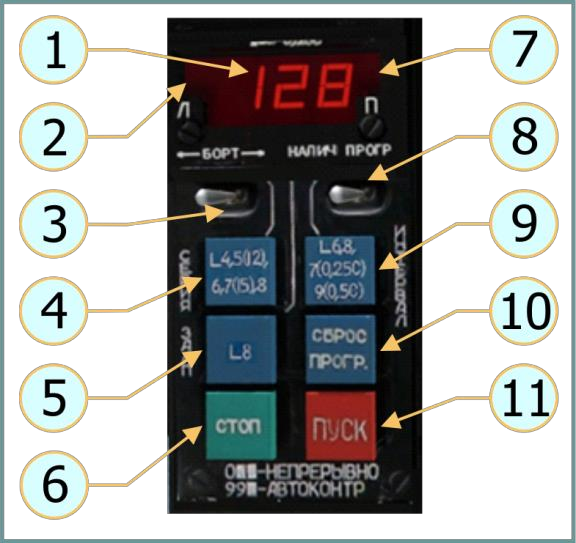

1. Индикационное табло. Индицирует цифровые индексы параметров выброса ловушек или
остаток ловушек. В случае если переключатель НАЛИЧ-ПРОГР находится в положении НАЛИЧ –
индицируется остаток ловушек. Максимальное количество ловушек -128. В случае если
переключатель НАЛИЧ-ПРОГР находится в положении ПРОГР – первый числовой индикатор
показывает кодовое число СЕРИЯ, второй числовой индикатор показывает кодовое число ЗАЛП
и третий числовой индикатор показывает кодовое число ИНТЕРВАЛ.
2. Лампа - индикатор выбора блоков выброса ловушек левого борта.
3. Трехпозиционный переключатель БОРТ для выбора к работе блоков ловушек левого,
правого или обоих бортов [[RAlt]] + [[ ] ]] .
4. Кнопка СЕРИЯ [[RShift]] + [[Insert]] . Устанавливает количество серий залпов. Количество
устанавливается кодовым числом из ряда 1…4,5(12),6,7(15),8. Для всех кодовых чисел, кроме 0,
5 и 7 количество серий равно кодовому числу. Для кодового числа 5 - количество серий 12, для
кодового числа 7 - количество серий 15.
При установке кодового числа 0 происходит непрерывный выброс всего комплекта ловушек.
5. Кнопка ЗАЛП [[RCtrl]] + [[Insert]] . Устанавливает количество патронов в залпе. Количество
устанавливается кодовым числом из ряда 1…8. Для всех кодовых чисел количество патронов в
залпе равно кодовому числу.
6. Кнопка СТОП [[Delete]] . Останавливает работу системы выброса ловушек.
7. Лампа - индикатор выбора блоков выброса ловушек правого борта.
8. Переключатель НАЛИЧИЕ – ПРОГР [[RCTRL]] + [[ ] ]] . В положении НАЛИЧИЕ на
индикационное табло выводится количество оставшихся ловушек, в положении ПРОГР
индицируются кодовые числа параметров выброса ловушек.
9. Кнопка ИНТЕРВАЛ [[RAlt]] + [[Insert]] . Устанавливает интервал между залпами. Значение
интервала устанавливается кодовым числом из ряда: 1…6,7(0,25),8,9(0,5). Для всех кодовых
чисел, кроме 0, 7 и 9 значение интервала в секундах равно кодовому числу. Для кодового числа
7 – значение интервала 0,25 с, для кодового числа 9 – значение интервала 0,5 с. При выборе
кодового числа 0 значение интервала равно 0,125 с.
10. Кнопка СБРОС ПРОГР [[RCtrl]] + [[Delete]] . Сбрасывает параметры набранной программы
выброса ловушек в значения по умолчанию 110.
11. Кнопка ПУСК [[Insert]] . Запускает заданную программу выброса ловушек.

#### Примеры кодовых чисел

110 – серия 1, в залпе 1, интервал 0. При однократном нажатии на кнопку
"ПУСК" будет произведен выброс одной ловушки в зависимости от положения
трехпозиционного переключателя БОРТ. Если переключатель БОРТ находится в
среднем положении, будет произведен выброс по одной ловушке с каждого
борта. Это программа установлена по умолчанию в системе постановки помех.

622 – серия 6, в залпе 2, интервал 2. При однократном нажатии на кнопку
"Пуск" будет производиться залп из 2-х ловушек, через каждые 2 секунды, 6
раз. Если переключатель БОРТ находится в среднем положении, будет
произведен выброс ловушек по этой программе с обоих бортов.

529 – серия 12 (смотри подсказку на кнопке), в залпе 2, интервал 0,5 (смотри
подсказку на кнопке). При однократном нажатии на кнопку "Пуск" будет
производиться залп из 2-х ловушек, через каждые 0,5 секунды, 12 раз. Если
переключатель БОРТ находится в среднем положении, будет произведен
выброс ловушек по этой программе с обоих бортов.

{!docs/mi8/abbr.md!}
