# Системы

## Система электроснабжения

Система электроснабжения вертолета включает в себя первичную и вторичную
системы электроснабжения, а также питание от наземных источников, Рис. 7.1.

### Первичная система электроснабжения

Первичной системой является энергосистема переменного тока, основными
источниками которой являются два генератора трёхфазного переменного тока
СГС-40ПУ с напряжением на выходе 208V и частотой 400Hz. Общая
электрическая мощность энергосистемы составляет 80kVA.

От канала генератора № 1 питаются:

- выпрямительное устройство ВУ-6А № 1
- трансформатор ТС310С04Б (208/36)
- противообледенительная система (ПОС) несущего и рулевого винтов

От канала генератора №2 питаются:

- выпрямительные устройства ВУ-6А № 2 и № 3
- трансформатор ТС/1-2 (208/115)
- ПОС стекол и ПЗУ.

При отказе канала одного из генераторов обеспечивается резервирование
питания всех потребителей, кроме ПОС несущего и рулевого винтов, путем
переключения вторичных источников ТС/1-2 и ТС310С04Б на канал исправного
генератора. Кроме того, ВУ №3 является резервным и автоматически
подключается к каналу генератора №1 в случает отказа генератора №2. Таким
образом, при одном отказавшем генераторе всегда работает два ВУ.

При отказе каналов обоих генераторов питание потребителей, необходимых для
завершения полёта и безопасной посадки, осуществляется от резервных
источников.

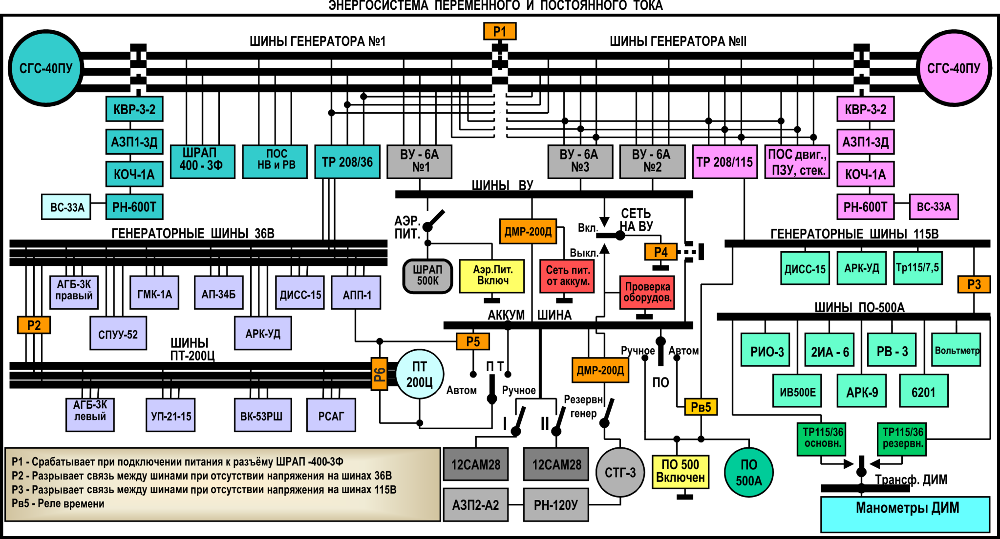

### Вторичная система электроснабжения

Для питания потребителей переменным и постоянным током различных
напряжений на вертолете имеются следующие одноканальные вторичные
системы электроснабжения:

- система однофазного переменного тока напряжением 115Vи частотой
400 Hz;
- система однофазного переменного тока напряжением 36 V и частотой
400 Hz:
- система трехфазного переменного тока напряжением 36 V и частотой
400 Hz;
- система постоянного тока напряжением 27V;
- резервные источники.

#### Система однофазного переменного тока напряжением 115V

Система однофазного переменного тока напряжением 115V и частотой 400 Hz
получает питание от канала генератора № 2 первичной системы через
трансформатор ТС/1-2 мощностью 2 kVA и предназначена для питания всех
потребителей однофазного переменного тока напряжением 115V и частотой 400
Hz. На вертолете обеспечено резервирование питания трансформатора ТС/1-2
при отказе канала генератора № 2 путем переключения на канал генератора №
1.

При отказе каналов обоих генераторов или трансформатора ТС/1-2 и его цепей
питание потребителей, обеспечивающих продолжение полёта и безопасную
посадку, осуществляется от резервного источника – преобразователя ПО-500А.

#### Система однофазного переменного тока напряжением 36 v

Система однофазного переменного тока напряжением 36 V и частотой 400 Hz
получает питание от системы однофазного переменного тока напряжением
115V и частотой 400 Hz через основной или резервный трансформатор ТР
115/36. От трансформатора ТР115/36 питаются приборы контроля работы
двигателей и трансмиссии.

#### Система трехфазного переменного тока напряжением 36 v

Система трехфазного переменного тока напряжением 36 V и частотой 400 Hz
получает питание от канала генератора № 1 первичной системы через
трансформатор ТС310С04Б мощностью 1 kVA и предназначена для питания всех
потребителей трехфазного переменного тока напряжением 36 V и частотой 400
Hz. На вертолете предусмотрено резервирование питания трансформатора
ТС310С04Б при отказе канала генератора № 1 путем переключения питания на
канал генератора № 2.

При отказе каналов обоих генераторов или трансформатора ТС310С04Б и его
цепей питание потребителей, обеспечивающих продолжение полёта и
безопасную посадку, осуществляется от резервного источника –
преобразователя ПТ-200Ц.

#### Система постоянного тока напряжением 27 v

Система постоянного тока напряжением 27 V получает питание от первичной
системы через три выпрямительных устройства ВУ-6А №1, № 2, № 3)
мощностью по 6 kW. Все три выпрямительных устройства подключены
параллельно к общей шине (шина Выпрямительных Устройств, или шина ВУ),
связанной комплексным аппаратом ДМР-200Д с шиной аккумуляторов.

Мощности двух выпрямительных устройств достаточно для питания всех
потребителей постоянного тока напряжением 27 V. Третье выпрямительное
устройство ВУ-6А № 3 подключено к каналу генератора № 2 и является
резервным. При отказе канала генератора № 2 оно переключается на канал
генератора № 1 и совместно с ВУ-6А № 1 обеспечивает питание всех
потребителей.

При отказе каналов обоих генераторов или неисправностях в цепях
выпрямительных устройств питание потребителей, обеспечивающих
продолжение полёта и безопасную посадку, осуществляется от резервных
источников – двух аккумуляторных батарей 12САМ-28 и стартер-генератора
СТГ-3 двигателя АИ-9В.

#### Резервные источники электроэнергии

РЕЗЕРВНЫМИ ИСТОЧНИКАМИ ЭЛЕКТРОЭНЕРГИИ на вертолете являются:

- две аккумуляторные батареи 12САМ-28;
- преобразователь ПО-500А;
- преобразователь ПТ-200Ц;
- стартер-генератор СТГ-3 двигателя АИ-9В.

Две аккумуляторные батареи с преобразователями ПО-500А и ПТ-200Ц
обеспечивают безопасную посадку вертолета. Завершение полёта, в аварийной
ситуации возможно только при одновременной работе аккумуляторных батарей
со стартер-генератором СТГ-3 двигателя АИ-9В при его работе в генераторном
режиме в течение 30min. Кроме того, стартер-генератор может быть
использован совместно с преобразователями ПО-500А и ПТ-200Ц на земле (при
внеаэродромном базировании) для проверки оборудования. Ввиду
ограниченной мощности стартер-генератора СТГ-3 (3 KW) проверку
оборудования разрешается производить только поочередным включением
потребителей

### Управление системой энергоснабжения

Управление электросистемой осуществляется с правой боковой панели
электропульта и электрощитка, Рис. 7.2.

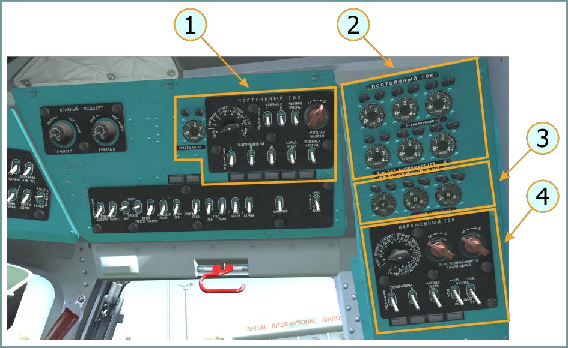

1. Панель управления питанием
постоянным током
2. Приборы контроля электропитания
постоянного тока
3. Приборы контроля электропитания
переменного тока
4. Панель управления питанием
переменным током

#### Управление источниками постоянного тока

Управление источниками постоянного тока (включение, регулировка
напряжения, контроль нагрузки) осуществляется с панели управления питанием
постоянного тока, Рис. 7.3.

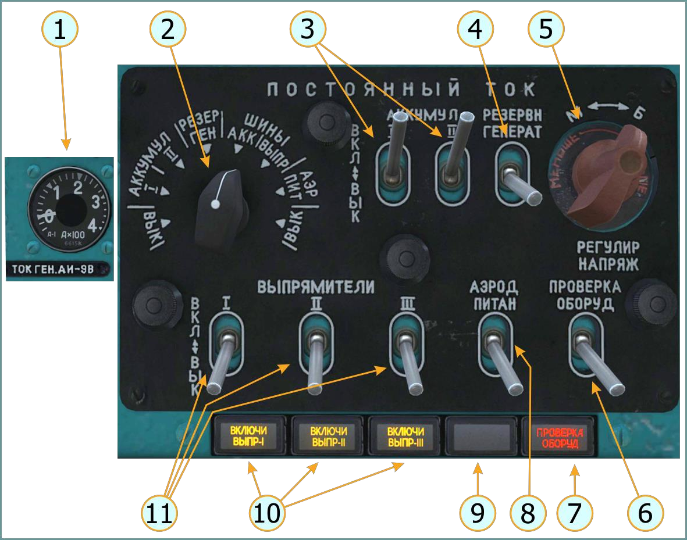

1. Амперметр генератора АИ-9В (во время работы в качестве резервного генератора ток не должен превышать 100 A) 
2. Галетный переключатель для подключения источников постоянного тока к приборам контроля 
3. Выключатели аккумуляторов (I, II) 
4. Выключатель резервного генератора (установленного на АИ-9В) 
5. Выносное сопротивление для регулировки напряжения выпрямительных устройств (I, II, III), в игре не используется. 
6. Выключатель ПРОВЕРКА ОБОРУДОВАНИЯ, для подключения резервного генератора к аккумуляторной шине 
7. Табло сигнализации включения выключателя ПРОВЕРКА ОБОРУДОВАНИЯ 
8. Выключатель аэродромного питания постоянного тока 27-29 V 
9. Табло сигнализации подключения ШРАП- 500К к борту вертолета 
10. Табло сигнализации отключения ВУ (I, II, III) от шины ВУ при работающих генераторах переменного тока 
11. Выключатели ВУ (I, II, III)

Контроль нагрузки выпрямителей и аккумуляторов осуществляется по
амперметрам, а напряжение каждого источника – по вольтметру постоянного
тока (Рис. 7.2, 2), расположенным на электрощитке. Контроль напряжения
каждого из источников постоянного тока осуществляется при подключении
вольтметра к этому источнику галетным переключателем.

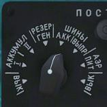

#### Управление источниками переменного тока

Управление источниками переменного тока (включение, регулировка
напряжения, контроль нагрузки) осуществляется с панели управления питанием
переменного тока, Рис. 7.4.

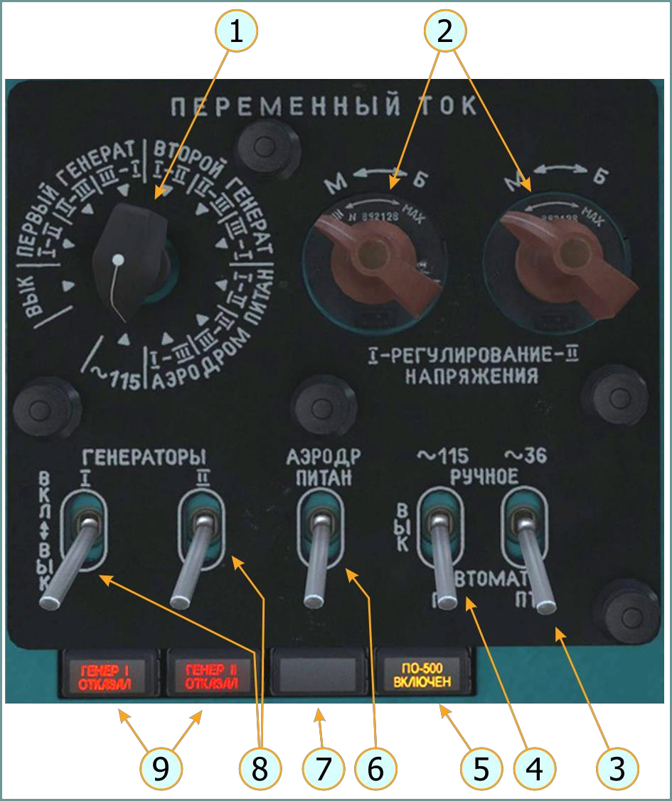

1. Галетный переключатель для подключения источников переменного тока к приборам контроля 
2. Выносные сопротивления для регулирования напряжения генераторов переменного тока (I, II), в игре не используются 
3. Переключатель режима работы преобразователя 36 V ПТ РУЧНОЕ (вверх)– АВТОМАТ (вниз) 
4. Переключатель режима работы преобразователя 115 V ПО РУЧНОЕ (вверх)– АВТОМАТ (вниз). 
5. Табло сигнализации работы однофазного преобразователя (115 V) 
6. Выключатель аэродромного питания переменного тока 208 V 
7. Табло сигнализации подключения ШРАП- 400-3Ф к борту вертолета 
8. Выключатели генераторов переменного тока (I, II) 
9. Табло сигнализации отказа генераторов переменного тока (I, II)

Контроль нагрузки генераторов осуществляется по амперметрам, а напряжение
каждого источника – по вольтметру переменного тока (Рис. 7.2, 3),
расположенным на электрощитке. Контроль напряжения каждого из источников
переменного тока осуществляется при подключении вольтметра к этому
источнику галетным переключателем.

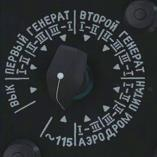

### Нормальная эксплуатация

Действия с электрооборудованием во время подготовки к полёту и после
выполнения полёта изложены в разделе 9.2.

### Неисправности

ПРИЗНАКИ:

- РИ-65 информирует: "Отказал первый генератор" ("Отказал второй
генератор");
- загорается табло ГЕНЕРАТОР I ОТКАЗАЛ (ГЕНЕРАТОР II ОТКАЗАЛ) на
щитке ПЕРЕМЕННЫЙ ТОК;
- стрелка амперметра отказавшего генератора отклоняется до нуля;
- стрелка вольтметра при установке переключателя контроля
напряжения на отказавший генератор установится на нуль.
ДЕЙСТВИЯ ЭКИПАЖА:
- установить выключатель отказавшего генератора ГЕНЕРАТОРЫ I (II) в
положение ВЫК.;
- выключить противообледенительную систему несущего и рулевого
винтов, для чего на пульте ПРОТИВООБЛЕДЕНИТЕЛЬНАЯ СИСТЕМА
левой панели электропульта:
	- если полёт выполняется с включенной вручную ПОС, убедиться,
что выключатель ДВИГ. ПЗУ ЛЕВ. – в положении ВКЛ.,
переключатели ДВИГ. ПЗУ ПРАВ., СТЕКОЛ – в положении РУЧНОЕ,
установить переключатель ОБЩЕЕ РУЧН.-АВТОМ. – в положение
АВТОМ. и нажать кнопку ВЫК.;
	- если полёт выполняется с включенной автоматически ПОС,
убедиться, что переключатель ОБЩЕЕ РУЧН.–АВТОМ.– в
положении АВТОМ., выключатель ДВИГ. ПЗУ ЛЕВ.– в положении
ВКЛ., установить переключатели ДВИГ. ПЗУ ПРАВ., СТЕКОЛ – в
положение РУЧНОЕ и нажать кнопку ВЫК.;
- принять решение о дальнейшем выполнении задания.

!!! note "Примечание"
    При отказе одного из генераторов второй работающий генератор полностью
    обеспечивает питание всех потребителей электроэнергии вертолета, за исключением
    противообледенительной системы несущего и рулевого винтов.

#### Отказ двух генераторов переменного тока

ПРИЗНАКИ:

- РИ-65 информирует: "Отказал первый генератор", "Отказал второй
генератор";
- загораются табло ГЕНЕРАТОР I ОТКАЗАЛ, ГЕНЕРАТОР II ОТКАЗАЛ на
щитке ПЕРЕМЕННЫЙ ТОК;
- стрелки амперметров обоих генераторов отклоняются до нуля;
- стрелка вольтметра при установке переключателя контроля
напряжения в положения ПЕРВЫЙ ГЕНЕРАТОР, ВТОРОЙ ГЕНЕРАТОР
установится на нуль;

При отказе обоих генераторов переменного тока питание автоматически
переключается на аккумуляторную шину. При этом остаются включенными:
двигатель АИ-9В, преобразователи ПО-500 и ПТ-200Ц, трехстрелочные
индикаторы ЭМИ-ЗРИ и ЭМИ-3РВИ, указатель шага несущего винта, термометр
выходящих газов 2ИА-6, регулятор температуры газов РТ12-6-20, аппаратура
контроля вибраций ИВ-500Е, индикатор режимов ИР-117, основная и
дублирующая гидросистемы, электромагнитный кран ГА-19 в системе
управления двигателями, обогрев левого ПВД противопожарная система,
плафоны летчиков, II группа системы красного подсвета, дежурное освещение
грузовой кабины, аэронавигационные огни, правая фара ФПП-7, проблесковый
маяк МСЛ-3, радиостанция Р-863, радиокомпас АРК-9, переговорное устройство
СПУ-7, левый авиагоризонт АГБ-ЗК, радиовысотомер РВ-5, магнитофон МС-61,
аппаратура САРПП-12ДМ, замок внешней подвески ДГ-64, цепи аварийного
сброса вооружения, стеклоочиститель левого летчика, насосы топливных баков,
механизмы МП-100М-2С в системе управления перестройкой оборотов
двигателей, кран перепуска топлива, пожарные краны двигателей, воздушно-
тепловой обогрев входных частей двигателей, сигнализатор обледенения РИО-
3, ракеты ЭКСР-46, лебедка ЛПГ-150М, система подвижных упоров управления
СПУУ-52-1, аппаратура РИ-65, электромагнитные тормоза ЭМТ-2М системы
управления (триммер), электромагнитный кран ГА-192 подачи жидкости на
расстопаривания ручки шаг-газ.

ДЕЙСТВИЯ ЭКИПАЖА:

- установить выключатели ГЕНЕРАТОРЫ I, II в положение ВЫК.;
- выключить противообледенительную систему несущего и рулевого
винтов и стекол, для чего на пульте ПРОТИВООБЛЕДЕНИТЕЛЬНАЯ
СИСТЕМА левой панели электропульта:
	- если полёт выполняется с включенной вручную ПОС, убедиться,
что выключатель ДВИГ. ПЗУ ЛЕВ. – в положении ВКЛ.,
переключатель ДВИГ. ПЗУ ПРАВ. – в положении РУЧНОЕ,
установить переключатели ОБЩЕЕ РУЧН.– АВТОМ., СТЕКОЛ – в
положение АВТОМ. и нажать кнопку ВЫК.;
	- если полёт выполняется с включенной автоматически ПОС,
убедиться, что переключатели ОБЩЕЕ РУЧН.–АВТОМ., СТЕКОЛ – в
положении АВТОМ., выключатель ДВИГ. ПЗУ ЛЕВ.– в положении
ВКЛ., установить переключатель ДВИГ. ПЗУ ПРАВ. – в положение
РУЧНОЕ и нажать кнопку ВЫК.;
- произвести запуск двигателя АИ-9В, см. раздел …;
- после запуска двигателя выключатель РЕЗЕРВН. ГЕНЕРАТ. поставить в
положение ВКЛ. Галетный переключатель контроля напряжения на
щитке ПОСТОЯННЫЙ ТОК установить в положение РЕЗЕР. ГЕН.
Проверить по вольтметру напряжение генератора, которое должно
быть 27-29 В, и по амперметру ток генератора, который не должен
превышать 100 А. Время работы двигателя АИ-9В в режиме
 "Генератор" не более 30 мин;
- командиру экипажа в течение указанного времени принять решение о
прекращении выполнения задания и возвращении на аэродром
вылета или о выполнении посадки на запасном аэродроме.

!!! note "Примечание"
    При работе указанных выше потребителей только от аккумуляторных батарей их
    емкости будет достаточно для 6—7 мин полёта.

## Топливная система

Топливная система вертолета предназначена для размещения необходимого
запаса топлива на борту вертолета и для бесперебойного питания топливом
основных двигателей, двигателя бортовой вспомогательной установки и
керосинового обогревателя на всех эксплуатационных режимах работы
вертолета.

### Размещение топлива

На вертолете топливо размещается в трех протектированных пенополиуретаном
(ППУ) основных топливных баках, из которых два подвесных жестких бака
расположены снаружи по бортам фюзеляжа, а один расходный мягкий бак – в
контейнере за главным редуктором.

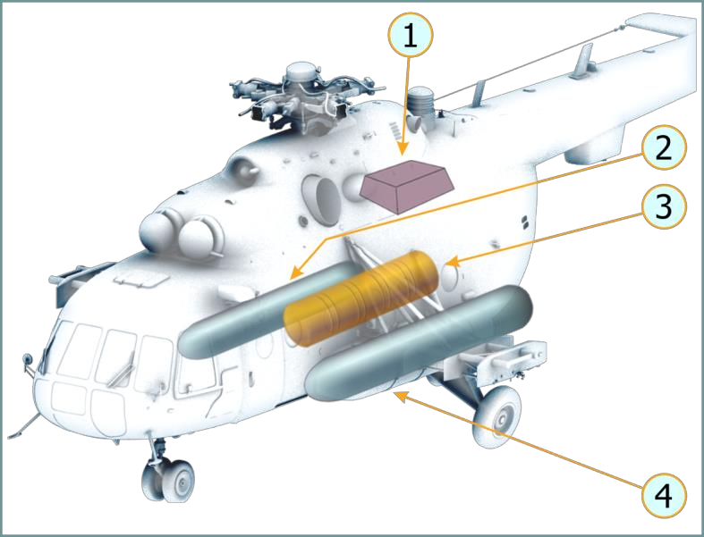

1. Расходный бак
2. Правый подвесной бак
3. Левый дополнительный бак (не моделируется)
4. Левый подвесной бак

При необходимости для увеличения дальности и продолжительности полёта
внутри фюзеляжа может быть установлен один или два дополнительных
жесткий топливных бака (в игре не моделируются).

!!! info "Вместимость топливных баков в ltr/kg"
    - расходного протектированного: 415/322
    - правого подвесного с ППУ: 1040/832
    - левого подвесного с ППУ: 1130/904
    - дополнительного с ППУ: 895/694

### Распределение топлива

Для обеспечения надежной работы в топливную систему включены насосы,
клапаны, датчики давления, электромагнитные и перекрывные краны.

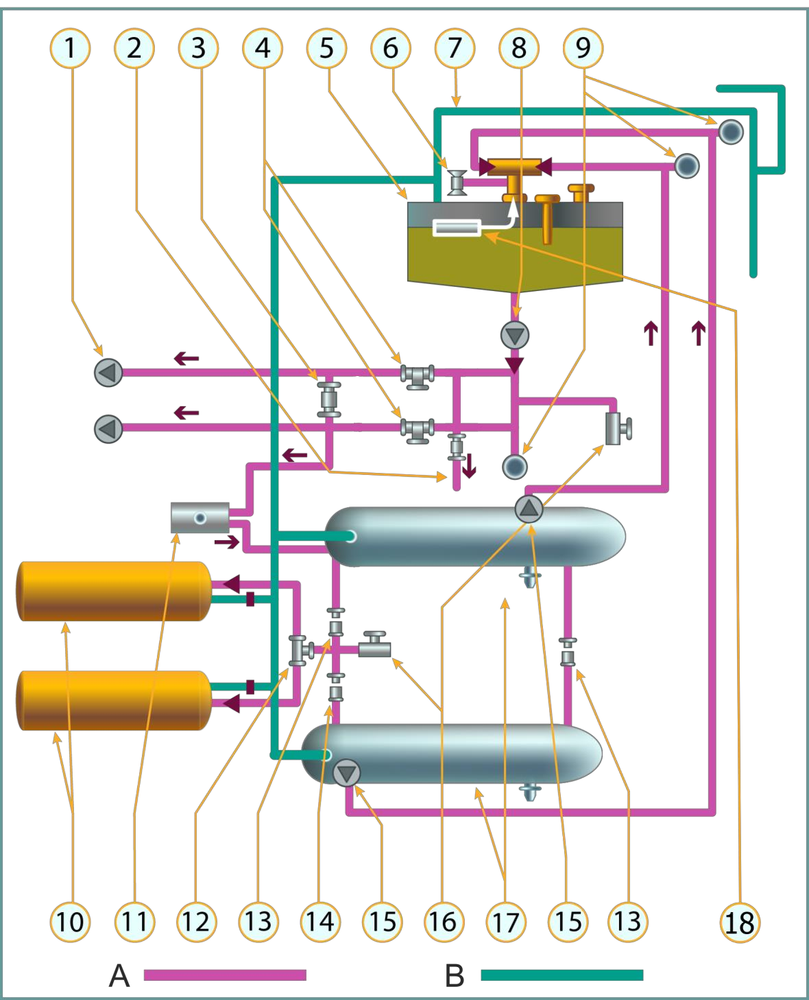

1. Насосы двигателей ДЦН-70А, 
2. Магистраль в АИ-9В с краном 610200А 
3. Электромагнитный кран 610200А КО-50 
4. Пожарные краны 768600МА (электродистанционные) 
5. Расходный бак 
6. Перекрывной кран 768600МА магистрали перепуска топлива 
7. Трубопровод суфлирования 
8. Насос 463Б 
9. Сигнализаторы давления СД-29А. 
10. Дополнительные баки (не моделируются) 
11. КО-50 
12. Перепускной кран 637000 
13. Перекрывные краны 768600МА 
14. Перекрывной кран 633600А 
15. Насосы ЭЦН-91 
16. Сливные краны 
17. Подвесные баки 
18. Поплавковый клапан 766300А-1

    A – Магистраль подачи топлива

    B – Трубопроводы суфлирования системы.

В систему распределения топлива на вертолете входят:

- электро-приводной
центробежный топливный насос 463Б (8);
- два центробежных топливных насоса
ЭЦН91С (15);
- электроприводной топливный насос 748Б (обогревателя КО-50, не
показан);
- поплавковый клапан 766300A-1 (18);
- пять перекрывных кранов
768600MA (6, 13);
- один перекрывной кран 633600A (14);
- два электромагнитных
крана 610200А (2, 3) для магистралей питания АИ-9 и КО-50 соответственно;
- перепускной кран 637000 (12);
- топливный фильтр 11 ТФ30 СТ (не показан);
блок обратных клапанов (не показан);
- трубопроводы и шланги.

Топливо из подвесных баков двумя насосами ЭЦН-91С (15) подается по
трубопроводам в расходный бак, из которого оно насосом 463Б (8)
распределяется для питания двигателей ТВ3-117ВМ. В магистралях от насоса
463Б к двигателям установлены перекрывные (пожарные) краны 768600 МА (4).
Отбор топлива для питания двигателя АИ-9В и керосинового обогревателя
производится от магистрали, идущей к правому двигателю ТВ3-117ВМ, до
пожарного крана.

На схеме не указаны механические КРАНЫ ОСТАНОВА двигателей, которые
открываются/закрываются членами экипажа для запуска/выключения
двигателей.

#### Назначение агрегатов топливной системы

##### Электроприводной центробежный топливный насос 463Б (8)

Предназначен для создания
подпора топлива на входе в основные топливные насосы двигателей ТВ3-117ВМ и двигателя
АИ-9В, а также в насос 748Б керосинового обогревателя КО-50.

Насос 463Б – внебакового расположения, установлен в нижней части расходного бака.
При отказе насоса 463Б работа двигателей не нарушается, так как в этом случае топливо к
двигателям из расходного бака поступает самотеком.

Цепь питания насоса подключена к аккумуляторной шине через АЗСы ТОПЛИВНАЯ СИСТЕМА.
НАСОСЫ ТОПЛИВН. БАКОВ-РАСХОД, установленных на правой панели АЗС электропульта
летчиков.

Включение насоса осуществляется выключателем НАСОСЫ БАКОВ-РАСХОД, установленным на
средней панели электропульта.

##### Электроприводные центробежные насосы ЭЦН-91С, (15)

Расположенные в монтажных
устройствах внутри подвесных баков (в левом баке спереди, в правом – сзади), предназначены
для перекачки топлива в расходный бак.

Цепи питания электродвигателей насосов подключены к аккумуляторной шине через АЗСы
ТОПЛИВНАЯ СИСТЕМА. НАСОСЫ ТОПЛИВН. БАКОВ-ЛЕВОГО и ТОПЛИВНАЯ СИСТЕМА. НАСОСЫ
ТОПЛИВН. БАКОВ-ПРАВОГО, установленных на правой панели АЗС электропульта летчиков.
Включение насосов осуществляется выключателями НАСОСЫ БАКОВ-ЛЕВЫЙ и НАСОСЫ БАКОВ-
ПРАВЫЙ, установленными на средней панели электропульта летчиков.

##### Электроприводной топливный насос 748Б (11)

Шестеренчатого типа, предназначен для
подачи топлива к форсункам керосинового обогревателя КО-50 и установлен в отсеке
керосинового обогревателя.
Цепь питания и управления насосом подключена к шине ВУ через АЗС КО-50, расположенном на
правой панели АЗС электропульта летчиков. Включение насоса осуществляется при включении
обогревателя в работу.

##### Поплавковый клапан 766300А-1 (18)

Предназначен для предохранения расходного бака от
переполнения при перекачке топлива из подвесных баков, установлен в расходном баке и
крепится к плите.

Во время перекачки, когда расходный бак не заполнен полностью, под давлением топлива
клапан отходит от седла, открывая проходное сечение для топлива. Через окна корпуса
клапана топливо выливается в бак и заполняет его. При наполнении бака, когда поплавок
клапана займет верхнее положение, клапан перекрывает поступление топлива в бак.

##### Перекрывные краны 768600А (4) (пожарные краны)

Предназначены для перекрывания и открывания топливных
магистралей. Установлены в редукторном отсеке, (см. Рис. 7.7 1, 2).

Цепи питания пожарных кранов подключены к аккумуляторной шине через автоматы защиты
сети ТОПЛИВНАЯ СИСТЕМА. ПЕРЕКРЫВ. КРАНЫ-ЛЕВЫЙ И ТОПЛИВНАЯ СИСТЕМА. ПЕРЕКРЫВ.
КРАНЫ-ПРАВЫЙ, установленные на правой панели АЗС электропульта летчиков. Открытие и
закрытие кранов осуществляется переключателями ПЕРЕКРЫВ. КРАНЫ-ЛЕВЫЙ И ПЕРЕКРЫВ.
КРАНЫ-ПРАВЫЙ, закрытыми предохранительными колпачками и установленными на средней
панели электропульта. О закрытии кранов сигнализируют табло ЛЕВЫЙ ЗАКРЫТ И ПРАВЫЙ
ЗАКРЫТ, расположенные под переключателями.

##### Два крана останова (стоп-краны)

Установлены в магистралях питания
двигателей ТВ3-117ВМ. Каждый из них предназначен для механического перекрывания топлива
перед насосом-регулятором двигателя при необходимости его останова. Рукоятки кранов
находятся на потолочной панели кабины экипажа. При запуске двигателей должны быть
открыты вручную членами экипажа.

##### Один перекрывной кран (6)

Предназначен для перепуска топлива от подвесных баков в
расходный бак при отказе поплавкового клапана 766300А-1 в закрытом положении. Кран
установлен на плите расходного бака.

Цепь питания перекрывного крана подключена к аккумуляторной шине через автомат защиты
сети АЗС ТОПЛИВНАЯ СИСТЕМА-КРАН ПЕРЕПУСК., установленный на правой панели
электропульта. Открытие и закрытие крана осуществляется переключателем ТОПЛИВНАЯ
СИСТЕМА-ПЕРЕПУСК, установленным на средней панели электропульта.
ДВА ПЕРЕКРЫВНЫХ КРАНА установлены в магистралях кольцевания баков, соединяющие
подвесные баки между собой спереди и сзади и служащие для равномерной выработки топлива
из подвесных баков при отказе одного из насосов ЭЦН-91С.

Нормальное положение кранов – открытое.

Краны должны быть закрыты в случае входа в зону возможного поражения вертолета,
обеспечивая сохранение топлива в одном из подвесных баков при повреждении другого;
Цепи питания кранов кольцевания подключены к аккумуляторной шине. Открытие и закрытие
кранов осуществляется переключателем КОЛЬЦЕВ БАКОВ ЗАКР-ОТКР под колпачком,
установленным на средней панели электропульта. О закрытом положении кранов сигнализирует
желтое табло КОЛЬЦЕВ ОТКЛ., расположенное под переключателем.

##### Перекрывной кран 633630 (не моделируется)

Предназначен для перекрытия переднего
трубопровода кольцевания подвесных баков. Кран управляется вручную и должен находиться в
открытом положении. Кран закрывается в случае демонтажа правого бака и слива топлива из
дополнительных баков.

##### Электромагнитные краны 610200А

Предназначены для управления подачей топлива в
двигатель АИ-9В и керосиновый обогреватель КО-50. Электромагнитный кран, смонтированный
в магистрали подачи топлива в двигатель АИ-9В, установлен в редукторном отсеке и
открывается автоматически при нажатии кнопки пуска двигателя АИ-9В. Закрытие крана
производится при выключении АИ-9В.

Электромагнитный кран, смонтированный в магистрали подачи топлива в керосиновый
обогреватель КО-50, установлен на потолочной панели грузовой кабины под правым пожарным
краном и открывается автоматически при пуске обогревателя, а закрывается при его
выключении.

##### Перепускной кран 637000 (не моделируется)

Предназначен для подключения одного или
двух дополнительных баков к передней магистрали, соединяющей подвесные топливные баки,
также для слива топлива из дополнительных баков. Кран открывается вручную, а установлен
под полом грузовой кабины рядом с передним перекрывным краном 633600А и обеспечивает
выработку топлива из дополнительных баков как раздельную, так и одновременную.

##### Блок обратных клапанов

Включает в себя два обратных клапана, смонтированных в
магистралях перекачки топлива из подвесных баков в расходный. Клапаны пропускают топливо
только в одном направлении – в расходный бак и установлены на плите расходного бака перед
поплавковым и перекрывным кранами.

Система трубопроводов и обратных клапанов обеспечивает питание двигателей топливом от
любого из двух насосов подвесных топливных баков в случае выхода одного из них.

##### Сигнализаторы давления СД-29А

Отключают табло, сигнализирующие о работе
перекачивающих насосов ЭЦН-91С или насоса 463Б в случае, когда давление в
соответствующей магистрали становится менее 0,5 кг/см2.

### Управление и контроль работы топливной системы

#### Управление агрегатами топливной системы

Управление агрегатами топливной системы осуществляется с панели
управления топливной системой, которая расположена на средней панели
электропульта, Рис. 7.7. Кроме того, имеются ручные перекрывные краны,
которые в игре не моделируются.

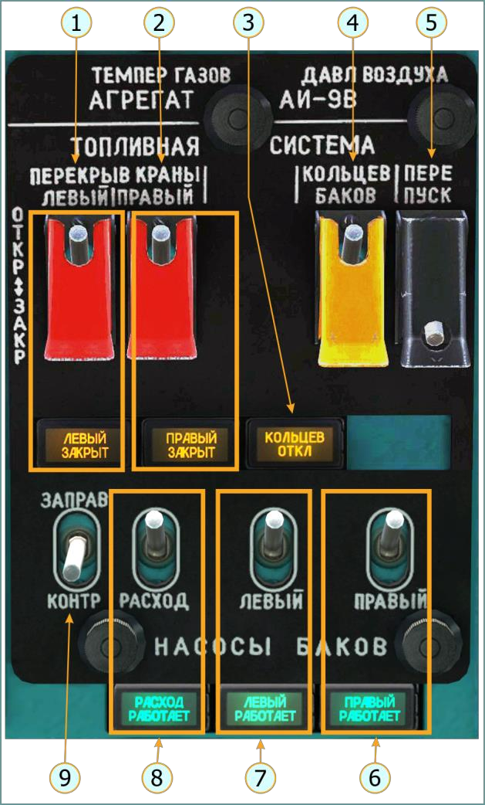

1. Левый перекрывной (пожарный) кран и табло, сигнализирующее о его закрытом положении 
2. Правый перекрывной (пожарный) кран и табло, сигнализирующее о его закрытом положении 
3. Табло сигнализации отключения кольцевания подвесных баков (связывающая магистраль перекрыта) 
4. Выключатель электромагнитных кранов открытия кольцевания подвесных баков (верхнее положение – связывающая магистраль ОТКРЫТА) 
5. Выключатель электромагнитного крана ручного перепуска топлива из подвесных баков в расходный (при отказе поплавкового клапана расходного бака). Нормальное положение ЗАКРЫТО (вниз). 
6. Выключатель и табло сигнализации рабочего состояния электроприводного насоса ЭЦН-91С ПРАВОГО бака 
7. Выключатель и табло сигнализации рабочего состояния электроприводного насоса ЭЦН-91С ЛЕВОГО бака 
8. Выключатель и табло сигнализации рабочего состояния электроприводного насоса 463Б РАСХОДНОГО бака 
9. Переключатель режима работы ламп, сигнализирующих о наполнении бака на 100%. Лампы расположены вблизи заправочных горловин, в игре не моделируются.

#### Контроль работы топливной системы

Контроль работы топливной системы осуществляется по сигнальным табло
работы насосов и топливомеру, который показывает остаток топлива в литрах
отдельно по бакам или в сумме (подвесных и расходного баков):

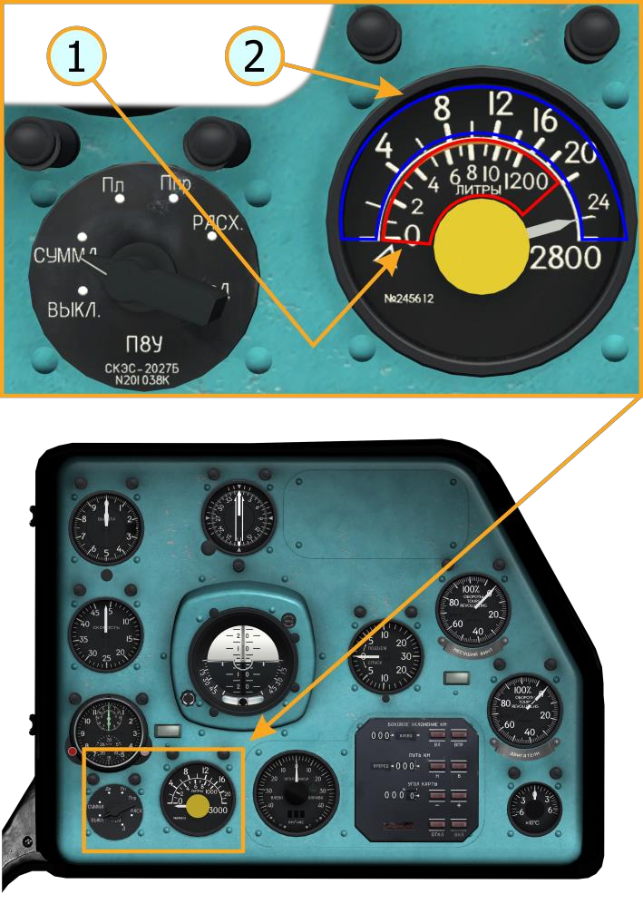

1. Внутренняя шкала для замера топлива по
бакам (выделена красным) 
2. Внешняя шкала для замера топлива в
сумме (выделена синим)

Переключение между баками осуществляется переключателем топливомера:

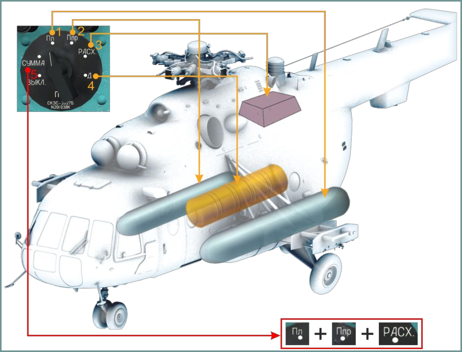

Положения переключателя топливомера: 

1. Пл – Подвесной Левый 
2. Ппр – Подвесной Правый 
3. РАСХ – Расходный бак 
4. Д – Дополнительный (не моделируется в игре) 
5. СУММА – суммарное количество топливо в подвесных и расходном баках

### Нормальная эксплуатация

#### Перед запуском

1. Включить автоматы защиты сети ТОПЛИВНАЯ СИТЕМА. ТОПЛИВОМЕР;
НАСОСЫ ТОПЛИВН. БАКОВ-РАСХОД-ЛЕВОГО-ПРАВОГО; ПЕРЕКРЫВ КРАНЫ
ЛЕВЫЙ-ПРАВЫЙ, КРАН ПЕРЕПУС. на правой панели АЗС

    

    При этом загораются табло ЛЕВЫЙ ЗАКРЫТ, ПРАВЫЙ ЗАКРЫТ на средней панели электропульта;

    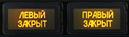

2. Проверить количество топлива по указателю топливомера;
3. Поочередным включением проверить работоспособность
подкачивающего и перекачивающих насосов, контролируя их работу по
загоранию табло РАСХОД РАБОТАЕТ, ЛЕВЫЙ (ПРАВЫЙ) РАБОТАЕТ;

    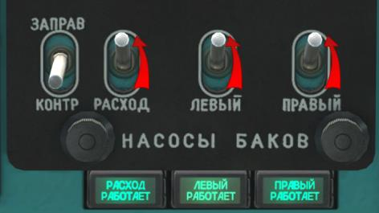

4. Перед запуском ВСУ и основных двигателей включить топливомер,
подкачивающий и перекачивающие насосы, убедиться в их работе по
загоранию соответствующих табло, открыть противопожарные краны, при этом
должны погаснуть табло ЛЕВЫЙ ЗАКРЫТ и ПРАВЫЙ ЗАКРЫТ.

    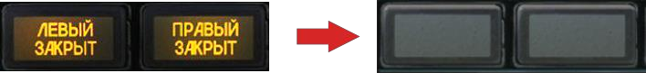

#### Работа в полёте

Топливо, подаваемое насосами из подвесных баков по двум трубопроводам
через обратные и поплавковый клапаны поступает в расходный бак, а оттуда
через открытые пожарные краны – в двигатели ТВЗ-117ВМ.

В полёте необходимо контролировать табло, сигнализирующие работу насосов,
и раз в 5-10 мин – остаток топлива в расходном баке.

### Неисправности

#### Отказ поплавкового клапана расходного бака (отказ не реализован)

Отказ поплавкового клапана расходного бака сопровождается следующим
признаком: при работающих насосах подвесных баков количество топлива в
расходном баке уменьшается.

ДЕЙСТВИЯ ЭКИПАЖА

- Принять решение о возможности дальнейшего выполнения полёта.
- Установить выключатель ПЕРЕПУСК на пульте ТОПЛИВНАЯ
СИСТЕМА в положение ОТКР.

    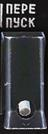

    При этом топливо, минуя поплавковый
клапан, через открытый перекрывной кран будет поступать в
расходный бак. Далее вручную регулировать дальнейшую выработку
топлива, не допуская переполнения расходного бака поддерживая
количество топлива в расходном баке не более 370...390 л.

#### Отказ одного/обоих перекачивающих насосов

Отказ перекачивающих насосов сопровождается следующими признаками:

- погасшим сигнальным табло НАСОСЫ БАКОВ "ЛЕВЫЙ РАБОТАЕТ"
или "ПРАВЫЙ РАБОТАЕТ" или обоих табло вместе;

    

- сигналом речевого информатора "Отказали насосы основных
топливных баков";
- уменьшением количества топлива в расходном баке.

ДЕЙСТВИЯ ЭКИПАЖА

ПРИ ОТКАЗЕ ОДНОГО ПЕРЕКАЧИВАЮЩЕГО НАСОСА

- Выключить отказавший насос.
- При отказе одного из насосов второй обеспечивает наполнение
топливом расходного бака.
- Убедившись в поступлении топлива в расходный бак, продолжить
выполнение задания.

ПРИ ОТКАЗЕ ДВУХ ПЕРЕКАЧИВАЮЩИХ НАСОСОВ

- Выключить НАСОСЫ БАКОВ ЛЕВЫЙ, ПРАВЫЙ.

    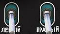

- выполнение задания прекратить.
- произвести посадку на ближайшем аэродроме или на площадке,
подобранной с воздуха.

!!! "ПРЕДУПРЕЖДЕНИЕ"
    Необходимо учитывать, что запас топлива в расходном баке достаточен
    для полёта на высоте 500 м и скорости 220 км/ч в течение 21 мин на расстояние 70 км.

#### Отказ подкачивающего насоса расходного бака

Отказ подкачивающего насоса расходного бака сопровождается:

- кратковременное падение оборотов двигателей на 2-5%, давления
топлива на 3-4 кгс/см2 и падение оборотов несущего винта на 1-3%;
- погасшим зеленым сигнальным табло РАСХОД РАБОТАЕТ
на средней панели электропульта;

    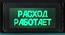

- сигналом речевого информатора "Отказал насос расходного бака".

ДЕЙСТВИЯ ЭКИПАЖА

- при отказе подкачивающего насоса выполнение задания продолжать.
При этом нормальную работу двигателей обеспечивают насосы
двигателей ДЦН-70А.
- выключить насос.

    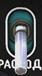

- изменение режимов работы двигателей и пилотирование вертолета
производить плавно.

## Гидравлическая система

### Краткое описание

На вертолете имеются две самостоятельные гидравлические системы: основная и дублирующая.

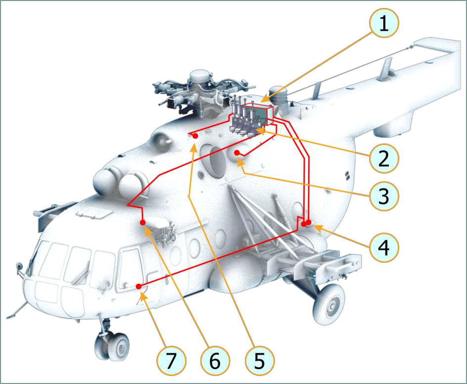

1. Панель с гидроагрегатами 
2. Гидроусилители 
3. Гидронасос НШ-39М основной системы 
4. Бортовая панель с зарядными штуцерами 
5. Гидронасос НШ-39М дублирующей системы 
6. Цилиндр гидроупора 
7. Гидроцилиндр расстопорения фрикциона ручки "Шаг-газ"

(1) ПАНЕЛЬ С ГИДРОАГРЕГАТАМИ – предназначена для компактного размещения
объектов обеих гидросистем (электромагнитных кранов, гидроаккумуляторов,
фильтров, обратных клапанов);

(2) ГИДРОУСИЛИТЕЛИ предназначены для преобразования перемещения тяг
ручного управления и сигналов от автопилота в перемещение силового штока;

(3) ГИДРОНАСОС НШ-39М основной системы предназначен для создания давления
в магистрали основной гидросистемы;

(4) БОРТОВАЯ ПАНЕЛЬ с зарядными штуцерами предназначена для зарядки
гидросистем гидрожидкостью и проверки этих систем от наземной
гидроустановки (в игре не моделируется);

(5) ГИДРОНАСОС НШ-39М дублирующей системы предназначен для создания
давления в магистрали дублирующей гидросистемы;

(6) ЦИЛИНДР ГИДРОУПОРА предназначен для создания усилия на РППУ при
достижении угла отклонения тарелки автомата перекоса 2°12'. Усилие
составляет 16 кг (в игре не моделируется);

(7) ГИДРОЦИЛИНДР РАССТОПОРЕНИЯ ФРИКЦИОНА ручки "Шаг-газ" предназначен для
снятия усилий с РОШ при нажатии кнопки на РОШ (в игре не моделируется)

Основная гидравлическая система предназначена для питания
комбинированных агрегатов управления (гидроусилителей) КАУ-30Б,
установленных в системах продольного, поперечного управлений и управления
общим шагом несущего винта, РА-60Б, установленного в системе путевого
управления, гидроцилиндра расстопаривания фрикциона ручки "ШАГ-ГАЗ";
гидроцилиндра управления переменным упором в продольном управлении.

Гидроусилители КАУ-30Б и РА-60Б могут работать в двух режимах:

- от ручного управления, осуществляемого пилотом;
- от комбинированного управления с включенным автопилотом.

Дублирующая гидравлическая система является повторением основной
гидросистемы и предназначена для выполнения функций основной
гидросистемы при ее отказе. Включение дублирующей гидросистемы
происходит автоматически при падении давления в основной гидросистеме до
30±5 кгс/см2.

При отказе основной гидросистемы и включении в работу дублирующей
гидросистемы автопилот АП-34Б, система расстопаривания фрикциона ручки
"ШАГ-ГАЗ" и гидроупор отключатся. При этом гидроусилители управляются
только в ручном режиме работы, а для создания оптимальных усилий,
необходимых для перемещения ручки "ШАГ-ГАЗ", следует подобрать
определенную затяжку фрикциона (в игре не моделируется).
Управление гидросистемами осуществляется с панели гидросистемы.

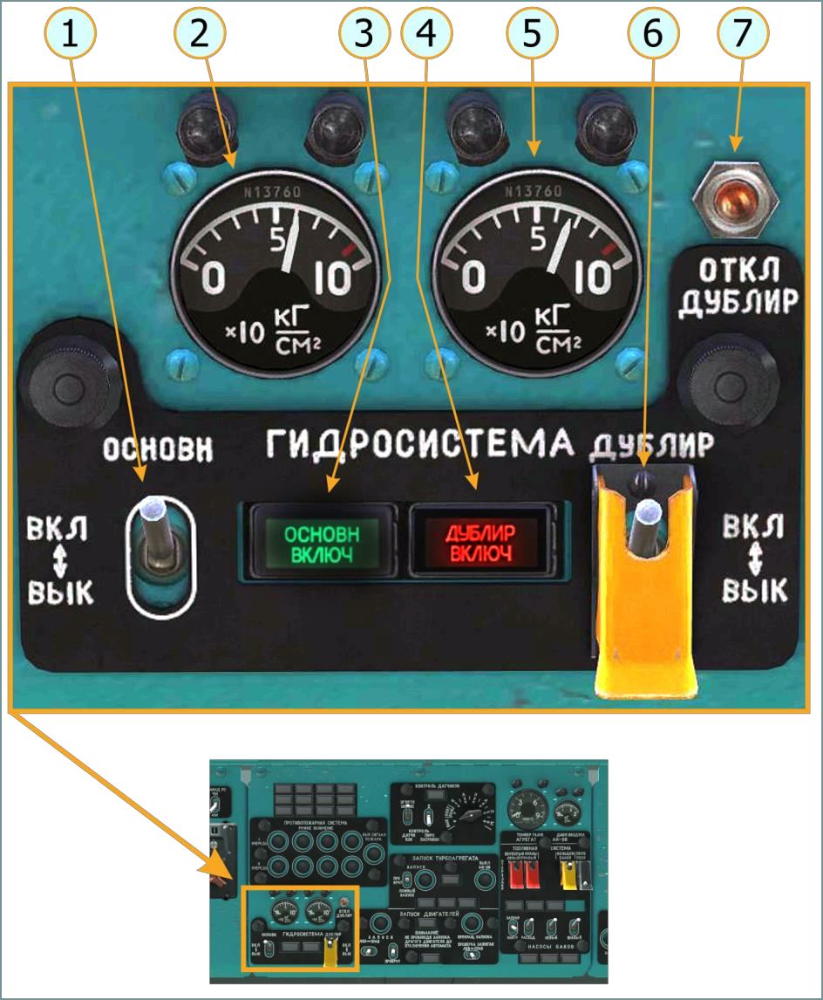

1. Выключатель основной системы 
2. Манометр основной системы 
3. Табло, сигнализирующее включение основной системы 
4. Табло, сигнализирующее включение дублирующей системы 
5. Манометр дублирующей системы 
6. Выключатель дублирующей системы 
7. Кнопка отключения дублирующей системы

Кнопка ОТКЛ.ДУБЛИР. (Рис. 7.11, 7) используется для обеспечения устойчивого перехода с
дублирующей гидросистемы на основную при запуске двигателя и наземной
проверке гидросистемы (наземная проверка в игре не реализована).

#### Ттх гидросистем

Характеристика | Значение
---------------|-----------
Рабочая жидкость масло | АМГ-10
Рабочее давление в основной и дублирующей гидросистемах | (4500±300...6500+800-200)kPa  [(45±3...65+8-2) kgf/cm2]
Диапазон температуры окружающего воздуха, при которой  обеспечивается нормальная работа гидросистемы | от -50 до +60 °С
Допустимая температура рабочей жидкости | до 70°С
Количество масла АМГ-10 в гидросистеме | 22 л (по 11)
Давление в системе, при котором происходит включение насоса  на рабочий режим (питание гидросистемы) | (4500±300) kРа [(45±3) kgf/cm2]
Давление в системе, при котором происходит переключение  насоса на холостой режим (прокачка жидкости в бак) | (6500+800-200) kРа [(65+8-2) kgf/cm2]
Минимальное давление в основной системе, при котором происходит  переключение питания гидроусилителей на дублирующую систему | (3000±500) kPa [(30±5) kgf/cm2]

### Нормальная эксплуатация

#### Контрольная проверка перед запуском двигателей

1. Включить АЗСы ГИДРОСИСТ. ОСНОВН/ДУБЛИР.

    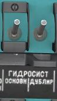

2. Убедиться, что выключатели гидросистем находятся в положении "ВКЛ." (включены основная
и дублирующая гидросистемы)

    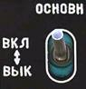

3. Выключатель дублирующей гидросистемы ГИДРОСИСТЕМА ДУБЛИР. закрыт предохранительным колпачком.

    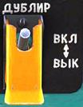

#### Во время запуска двигателя

Внимание! В процессе запуска двигателей при включенных выключателях
основной и дублирующей гидросистем возможно вступление в работу не
основной, а дублирующей гидросистемы. При давлении в дублирующей
гидросистеме (2500±160) kРа [(25±1,6) kgf/cm2] должно загореться табло
ДУБЛИР ВКЛЮЧЕНА (При этом электромагнитное реле выключит
основную гидросистему).

Давление по указателям манометров обеих систем
установится в пределах (6500 ) kРа [(65) kgf/cm2]. Для перехода на работу от
основной гидросистемы, необходимо нажать кнопку ОТКЛ ДУБЛИР и
удерживать ее 1…1,5 s.

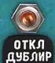

Должно загореться табло ОСНОВНАЯ ВКЛЮЧЕНА и
погаснуть ДУБЛИР ВКЛЮЧЕНА.

Давление в дублирующей гидросистеме должно
упасть до значений (0-500) kРа [(0-5) kgf/cm2].

Перед проверкой исправности гидросистемы необходимо перейти на основную
гидросистему, для чего нажать кнопку ОТКЛ. ДУБЛИР. на средней панели
электропульта пилотов и удерживать ее до тех пор, пока не загорится
светосигнальное табло зеленого цвета ОСНОВН. ВКЛЮЧ. и погаснет
светосигнальное табло красного цвета ДУБЛИР. ВКЛЮЧ.

Убедиться, что давление в основной гидросистеме нарастает до значений 42...73 кгс/см2.

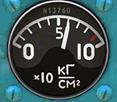

При этом необходимо обратить внимание на частоту
перемещения стрелки указателя манометра основной гидросистемы.

#### Проверка гидросистемы во время прогрева силовой установки

Проверить работу органов управления, гидросистем для чего:

- поочередно отклоняя не более чем на 1/3 от полного хода ручку
управления, педали и рычаг "ШАГ-ГАЗ", убедиться в плавности (без
рывков и заеданий) отклонения органов управления;
- убедиться, что при движении органов управления давление в
основной гидросистеме изменяется в пределах 42...73 кгс/см2, а
давление в дублирующей системе отсутствует, горит зеленое
светосигнальное табло ОСНОВН. ВКЛЮЧЕНА;
- установить переключатель ГИДРОСИСТЕМА ОСНОВН в положение
ВЫКЛ. Давление в основной системе (за краном) падает до нуля,
момент, когда оно пройдет через значения (3000±160) kРа
 [(30±1,6) kgf/cm2] сработает сигнализатор давления основной
системы, гаснет табло ОСНОВНАЯ ВКЛЮЧЕНА, а при давлении
 (3000±500) kPa [(30±5) kgf/cm2] сработает клапан аварийного
питания. Давление в дублирующей гидросистеме должно расти, при
достижении давления (2500±1,6) kPa [(25±1,6) kgf/cm2] сработает
сигнализатор давления дублирующей гидросистемы и должно
загореться табло ДУБЛИР ВКЛЮЧЕНА. Давление в дублирующей
гидросистеме быстро растет и при перемещении органов управления
изменяется в пределах (4500±300...6500+800-200) kPa [(45±3...65+8-2) kgf/cm2];
- включить выключатель основной гидросистемы и убедиться, что
загорается зеленое светосигнальное табло ОСНОВН. ВКЛЮЧЕНА,
давление в основной гидросистеме сохраняется в пределах 42…73
кгс/см2, красное светосигнальное табло ДУБЛИР. ВКЛЮЧЕНА гаснет и
давление в дублирующей гидросистеме падает до нуля. На
вертолетах с доработанной электросхемой гидросистемы для
перехода на основную гидросистему после включения выключателя
ГИДРОСИСТЕМА ОСНОВН, необходимо нажать кнопку ОТКЛ. ДУБЛИР.
на средней панели электропульта пилотов и удерживать ее до тех
пор, пока не загорится светосигнальное табло зеленого цвета
ОСНОВН. ВКЛЮЧЕНА и погаснет табло красного цвета ДУБЛИР.
ВКЛЮЧЕНА.

### Неисправности

Проявление неисправностей и необходимые действия см.10.6

## Противообледенительная система

### Общее описание

Противообледенительная система (ПОС) вертолета предназначена для
предотвращения образования и удаления льда или воды с защищаемых
элементов конструкции вертолета (Рис. 7.12) и сигнализации о наличии
обледенения. Защищаемыми элементами являются:

- два передних смотровых стекол кабины экипажа;
- воздухосборники, включающие пылезащитные устройства (ПЗУ) и
входные части двигателей;
- лопасти несущего и рулевого винтов.

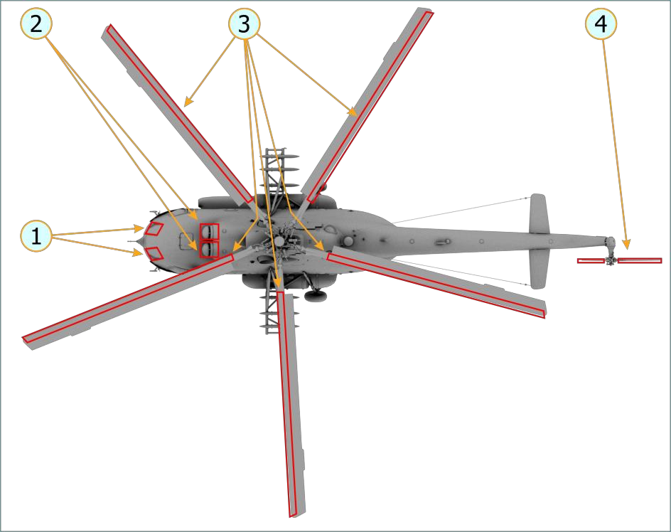

1. Обогреваемые стекла 
2. Обогреваемые объекты воздухосборников, включающих пылезащитные устройства (ПЗУ) и входные части двигателей 
3. Обогреваемые элементы лопастей НВ 
4. Обогреваемые элементы лопастей РВ

Для обеспечения сигнализации о начале обледенения на вертолете установлен
сигнализатор обледенения РИО-3 и визуальный датчик обледенения.

### Обогреваемые стекла

Обогрев стекол работает на принципе электрообогрева.
Противообледенительная система стекол обеспечивает как автоматическое
включение обогрева стекол от сигнала СО-121ВМ, так и ручное включение
обогрева стекол и стеклоочистителей. Температура обогрева стекол
поддерживается 30°С термоэлектрическими регуляторами ТЭР-1М.

#### Ттх обогреваемых стекол

Характеристика | Значение
---------------|-------------
Напряжение питания, V | 190; 208; 230 или 250
Потребляемая мощность, W | не более 1930
Потребляемый ток, А | не более 9,65

Для контроля тока, потребляемого обогревательными элементами стекол,
необходимо галетный переключатель ТОКИ ПОТРЕБИТЕЛЕЙ (Рис. 7.18)
установить в положение ОБОГРЕВ СТЕКОЛ и проверить ток по бортовому
амперметру. Показания бортового амперметра должны быть в пределах 40-120
А. Величина тока зависит от одновременности включения обогрева стекол.

Истинное значение тока получается при делении показаний амперметра на 6.

#### Стеклоочистители

На обогреваемых стеклах установлены стеклоочистители. Стеклоочистители
предназначены для удаления водяных брызг и снега с обогреваемых смотровых
стекол летчиков. На вертолете щетки стеклоочистителей приводятся в
движение непосредственно электромеханизмами ЭПК-2Т-60.

Электромеханизм ЭПК-2Т-60 может работать в четырех режимах: пусковом
режиме, первая рабочая скорость; вторая рабочая скорость; возврат щетки в
исходное положение.

Цепь питания и управления стеклоочистителей подключена к аккумуляторной
шине через АЗС СТЕКЛООЧИСТ. – ЛЕВЫЙ и СТЕКЛООЧИСТ. – ПРАВЫЙ.

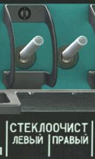

Управление работой стеклоочистителя осуществляется
переключателями СТЕКЛООЧИСТИТЕЛЬ (на левом и правом щитках
электропульта), Рис. 7.13

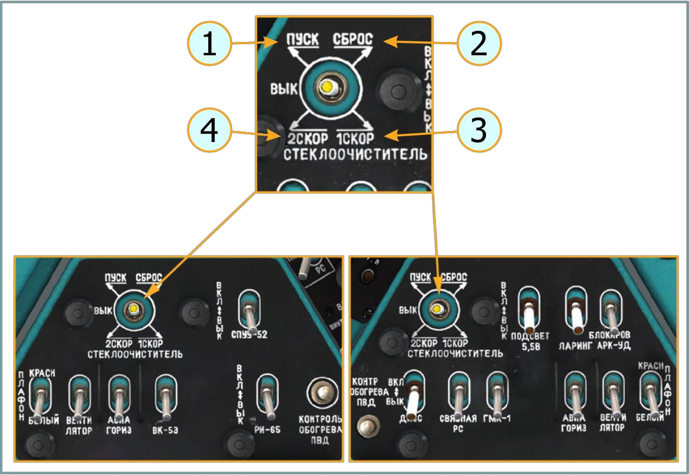

1. ПУСК – для начала работы кратковременно следует перевести в это положение 
2. СБРОС – положение переключателя для окончания работы 
3. 1 СКОР – положение переключателя для работы на первой скорости 
4. 2 СКОР – положение переключателя для работы на второй скорости

Переключатели имеют четыре фиксированных положения: ПУСК, 1 СКОР., 2
СКОР. и нейтральное, соответствующее выключенному положению
электромеханизма. Пятое положение СБРОС – нефиксированное, с
автоматическим возвратом в выключенное положение.

Для включения стеклоочистителя в работу необходимо включить автоматы
защиты сети СТЕКЛООЧИСТИТЕЛЬ – ЛЕВЫЙ, СТЕКЛООЧИСТИТЕЛЬ – ПРАВЫЙ.

Далее, переключатель СТЕКЛООЧИСТИТЕЛЬ установить в положение ПУСК, а
затем, в зависимости от внешних условий (интенсивности дождя или снега),
переключатели устанавливаются в положения 1 СКОР (60...90 качаний в
минуту) или 2 СКОР (30...60 качаний в минуту). Снег и дождь на стеклах
вертолета в игре пока не моделируются.

Управление в игре осуществляется мышью: необходимо кликнуть по одной из
пяти зон, соответствующих режимам работы стеклоочистителя.

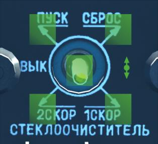

После выключения стеклоочистителя щетка может остановиться в любом
положении и мешать обзору летчика. Для установки ее в крайнее исходное
положение переключатель СТЕКЛООЧИСТИТЕЛЬ устанавливается в положение
СБРОС и удерживается в этом положении, пока щетка не займет крайнего
положения; при этом электромеханизм остановится автоматически. После
останова стеклоочистителя в крайнем положении ручку переключателя следует
отпустить и она займет нейтральное положение – выключенное.

### Пос ПЗУ и входных частей двигателей

Противообледенительная система ПЗУ смешанная воздушно-теплового и
электротеплового действия, а противообледенительная система входных частей
двигателей воздушно-теплового действия.

Для воздушно-теплового обогрева используется горячий воздух, отбираемый из
тракта охлаждения камеры сгорания (5).

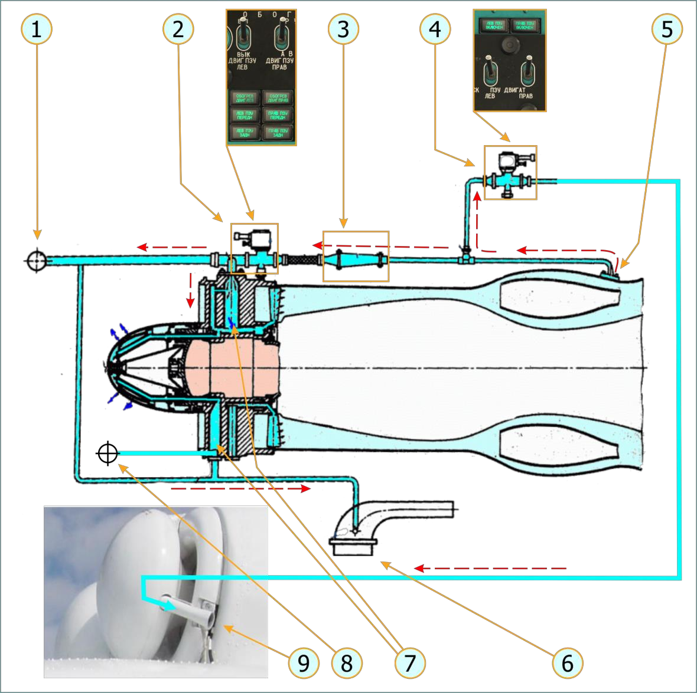

1. ПОС воздухозаборника (входной коллекторной губы) 
2. Электрозаслонка 1919т открывающая ток горячего воздуха на нужды ПОС 
3. Терморегулятор 
4. Заслонка 1919т открывающая ток горячего воздуха на эжектор ПЗУ (для создания разряжения) 
5. Штуцер отбора воздуха из тракта охлаждения камеры сгорания ТВ3-117ВМ 
6. Подогрев воздухозаборника термокомпенсатора насоса – регулятора НР-ЗВМ (для его корректной работы) 
7. Обогреваемые элементы входного направляющего аппарата двигателя (вертикальные и горизонтальные стойки) 
8. Отвод воздуха на обогрев сепаратора ПЗУ 
9. Эжектор ПЗУ

На каждом двигателе установлена заслонка 1919Т (2), которая открывает ток
горячего воздуха из контура охлаждения камеры сгорания (5).

Вторая заслонка (4) – служит для подачи воздуха к эжектору ПЗУ с целью создания разряжения,
которое активирует отсос и выброс пыли из входного тракта двигателя.

В ПЗУ горячим воздухом обогреваются (Рис. 7.15): входная коллекторная губа и
поверхность туннеля, сепаратор ПЗУ, воздухозаборник термокомпенсатора
насоса – регулятора НР-ЗВМ (Рис. 7.14, 6).

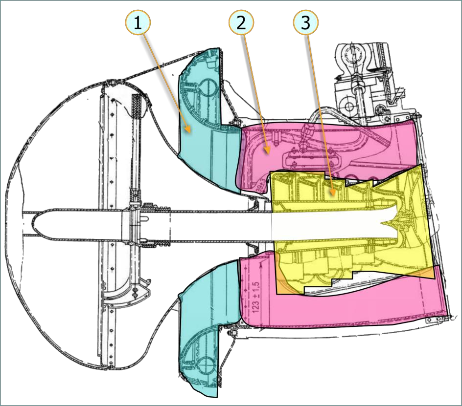

1. Входная коллекторная губа
2. Поверхность туннеля
3. Сепаратор ПЗУ

Электрический обогрев (Рис. 7.16) применен для следующих узлов ПЗУ:
передней и задней части обтекателя, кожуха трубопровода вывода пыли,
раструба вывода пыли и носков стоек обтекателя.

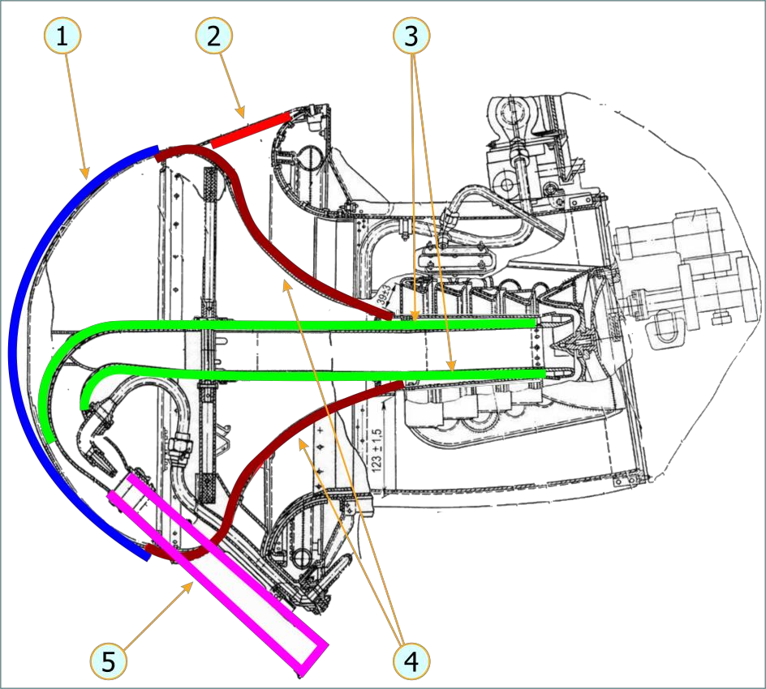

1. Передняя часть обтекателя 
2. Носок стойки обтекателя   
3. Кожух трубопровода вывода пыли
4. Задняя часть обтекателя
5. Раструб вывода пыли

На указанные поверхности по всей площади с внутренней или с внешней
стороны приклеены нагревательные накладки. Между обшивкой и
нагревательной накладкой вклеены термодатчики ТД-2, которые совместно с
терморегуляторами ТЭР-1М обеспечивают стабильную температуру нагревателя
при различных температурах наружного воздуха.

Питание системы электрообогрева осуществляется переменным током
напряжением 200 V и частотой 400 Нz.

Обогрев левого двигателя, его воздухозаборника и ПЗУ включается и
выключается вручную, правого двигателя и его входных частей – как вручную,
так и автоматически от сигнализатора обледенения (см.ниже). Выключение
обогрева производится вручную.

Показания бортового амперметра (Рис. 7.18) должны быть в пределах 65-120 А.
Величина тока зависит от одновременности включения обогрева передней и
задней частей ПЗУ. Истинное значение тока получается при делении показаний
амперметра на 3.

#### Ттх нагревательных элементов

Характеристика | Значение
---------------|-------------
Напряжение питания, V | 200-208V
Потребляемая мощность, W | не более 8000
Потребляемый ток, А | не более 40

### Противообледенительная система винтов

Обогрев лопастей несущего и рулевого винтов осуществляется
электронагревательными элементами, питание которых осуществляется
переменным током.

Нагревательный элемент несущего винта состоит из четырех секций, рулевого
винта - разделен на две секции.

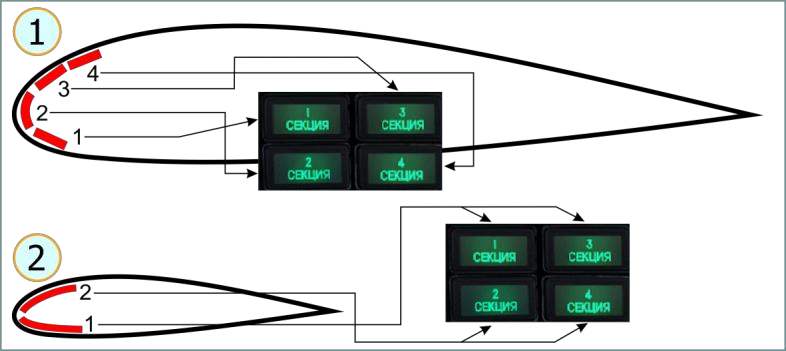

1. Схема нагревательных элементов НВ 
(4 секции)
2. Схема нагревательных элементов РВ
(2 секции)

Циклическое включение секций осуществляется с помощью программного
механизма ПМК-21, который за один цикл обеспечивает нагрев каждой секции
несущего и рулевого винтов в течение 38,5 с и охлаждение в течение 115,5 с
для секции несущего винта и в течение 38,5 с для секции рулевого винта.
Секции нагревательных элементов рулевого винта включаются в следующем
порядке: первые секции нагревательных элементов лопастей рулевого винта
включаются совместно с I и III секциями нагревательных элементов лопастей
несущего винта, а вторые секции – со II и IV секциями нагревательных
элементов лопастей несущего винта.

Для контроля тока каждой секции каждой лопасти несущего винта и секций
рулевого винта необходимо при загорании табло соответствующей секции
устанавливать галетный переключатель ТОКИ ПОТРЕБИТЕЛЕЙ поочередно в
положения ЛОПАСТИ НЕСУЩ. ВИНТА 1-2-3-4-5 и ХВОСТ ВИНТА и проверить ток
по бортовому амперметру в соответствующих секциях лопастей, Рис. 7.18.

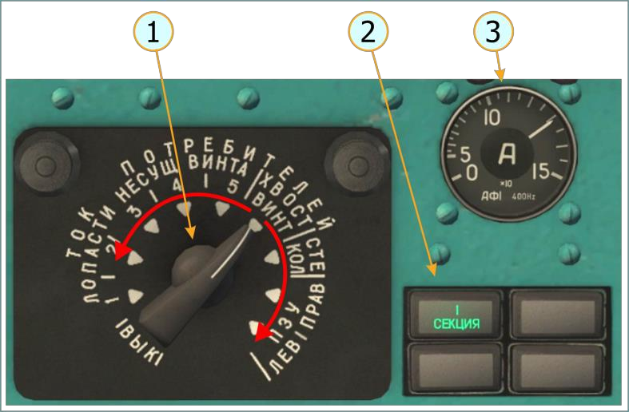

1. Галетный переключатель потребителей 
тока
2. Табло, сигнализирующие подключение
отдельных секций НВ и РВ
3. Амперметр переменного тока

Показания бортового амперметра должны быть:

- 60-72 А – для лопасти несущего винта;
- 110-150 А – для лопастей рулевого винта.

Истинное значение тока получается при делении показаний амперметра на 3
для лопасти несущего винта, и на 6 для лопастей рулевого винта.

### Сигнализаторы обледенения

С целью своевременного обнаружения обледенения, сигнализации о наличии
льда на конструкции вертолета, а также автоматического включения ПОС на
вертолете имеется радиоизотопный сигнализатор обледенения (РИО-3). Датчик
сигнализатора РИО-3 установлен в туннеле воздухозаборника вентилятора.
Принцип работы основан на изменении проводимости участка электропечи,
который работает за счет бета-излучения радиоизотопа.

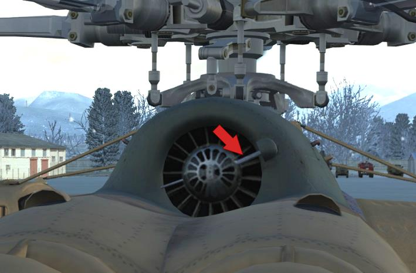

Кроме этого на левом блистере снаружи прикреплен визуальный сигнализатор
обледенения. Визуальный указатель обледенения представляет собой штырь,
установленный на левом сдвижном блистере. На штыре нанесены красные и
черные поперечные полосы шириной 5 мм каждая. По скорости намерзания
льда летчик судит об интенсивности обледенения (не реализовано в игре).

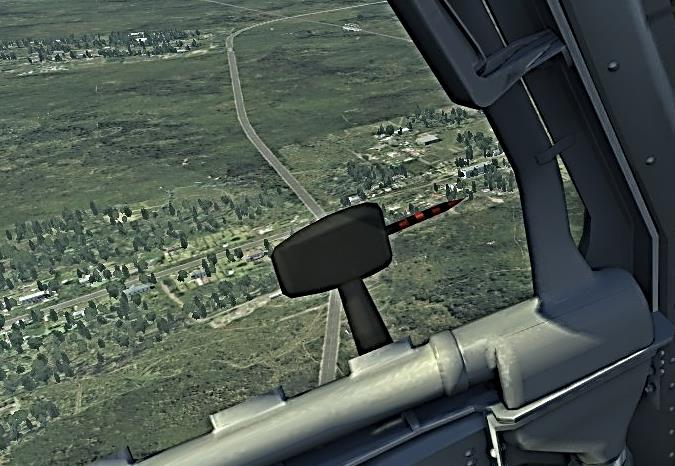

Радиоизотопный сигнализатор обледенения обеспечивает подачу сигнала
экипажу о начале обледенения – непрерывный сигнал сигнализации при
нахождении вертолета в зоне обледенения и автоматического включения
противообледенительной системы (винтов, правого двигателя и стекол). После
выхода вертолета из зоны обледенения РИО-3 прекращает подачу сигнала, при
этом выключение противообледенительной системы производится вручную.

Сигнал от РИО-3 может быть выдан с некоторым опозданием, когда на узлах
ПЗУ и двигателей уже нарастает большое количество льда. Накопившийся лед
при включении обогрева может отрываться и попадать в двигатели, что
приведет к их отказу.

Во избежание подобных случаев обогрев ПЗУ и двигателей включается перед
полётом вручную.

### Управление ПОС

Для функционирования ПОС в ручном или автоматическом режимах должны
быть включены АЗСы ПОС.

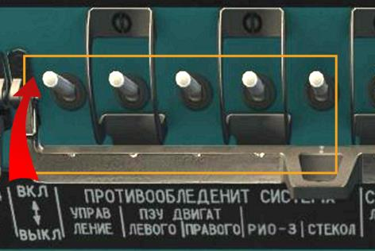

Управление ПОС осуществляется с панели ПОС, Рис. 7.21

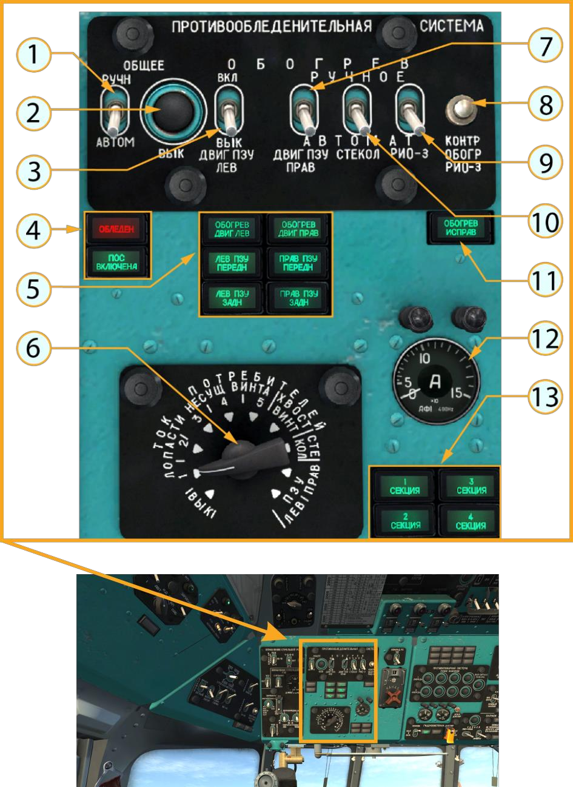

1. Переключатель ОБЩЕЕ РУЧН-АВТОМ 
2. Кнопка отключения ПОС 
3. Выключатель ДВИГ ПЗУ ЛЕВ обогрева ПЗУ и входного устройства левого двигателя 
4. Табло сигнализации обледенения (красное) и включения ПОС (зеленое) 
5. Табло сигнализации включения обогрева ПЗУ и входных устройств левого (левый столбец) и правого (правый столбец) двигателей 
6. Галетный переключатель для контроля значений тока потребителей 
7. Переключатель (ручное – автоматическое включение) ДВИГ ПЗУ ПРАВ обогрева ПЗУ и входного устройства правого двигателя 
8. Контроль обогрева РИО-3 
9. Переключатель обогрева РИО-3 
10. Переключатель обогрева стекол 
11. Табло сигнализации исправности обогрева РИО-3 
12. Амперметр переменного тока

Для работы ПОС в автоматическом режиме все выключатели на пульте
управления должны быть в нижнем положении:

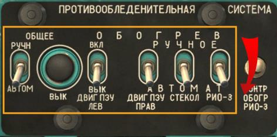

Работа автоматического режима основана на получении сигнала блоком
управления ПОС от РИО-3. При этом в условиях обледенения системой
сигнализации выдается следующие сигналы:

- на включение табло ОБЛЕДЕН

    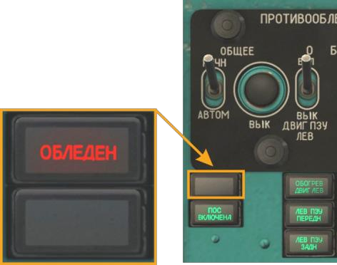

- на автоматическое включение ПОС лопастей винтов, ПОС правого
двигателя, его воздухозаборника, ПЗУ и обогрева стекол о чем можно
судить по загоранию соответствующих табло

    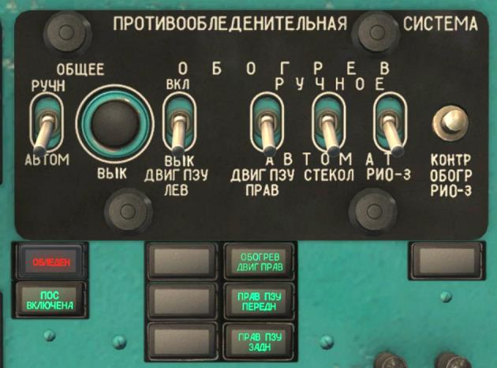

- на воспроизведение речевой информации РИ-65 ОБЛЕДЕНЕНИЕ;
- в систему регистрации параметров (САРПП-12ДМ) – о выдаче сигнала
ОБЛЕДЕН.

Если сработало автоматическое включение ПОС, то необходимо включить
вручную ПОС ПЗУ и входного устройства ЛЕВОГО двигателя (выключатель ДВИГ
ПЗУ ЛЕВ перевести в верхнее положение), убедившись в устойчивой работе
правого двигателя.

Для ручного включения ПОС необходимо все выключатели на пульте
управления ПОС (кроме РИО-3) переместить вверх

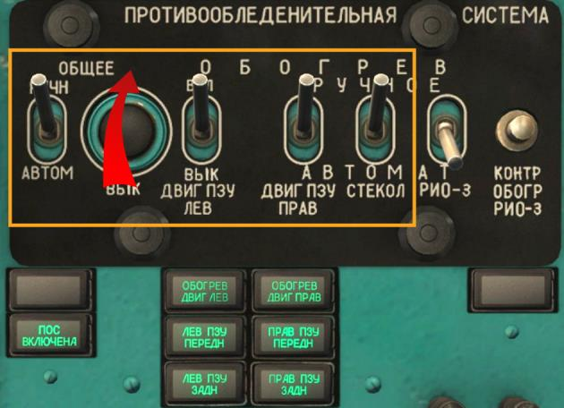

Кроме того, есть возможность ручного включения ПОС отдельных агрегатов: НВ
и РВ; левого двигателя (ПЗУ и входного устройства); правого двигателя (ПЗУ и
входного устройства); стекол.

Для выключения ПОС необходимо выключить все выключатели ПОС на
пульте управления и нажать на кнопку ВЫК

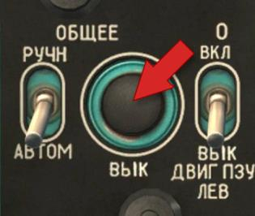

### Влияние ПОС на летно-тактические характеристики

#### На взлетный вес

При включении отбора воздуха на эжекторы ПЗУ предельный вес вертолета,
определенный по номограммам, уменьшить на 200 кг; при включении ПОС
двигателей и винтов уменьшить на 1000 кг.

#### На расход топлива

При включении противообледенительных систем вертолета и ПЗУ двигателей
километровый и часовой расходы топлива по сравнению с указанными в [таблице](08.restrictions.md#t84) значениями увеличиваются:

- при включении противообледенительной системы воздухозаборников
и ВНА двигателей – на 3%;
- при включении противообледенительной системы несущего и
рулевого винтов – на 2%.

При включении ПЗУ на висении вертолета часовой расход топлива по
сравнению с указанным в [таблице](08.restrictions.md#t86) значениями увеличивается на 3%.

## Пневматическая система

Пневмосистема вертолета предназначена для торможения колес главного шасси
и подзарядки камер колес от бортовых баллонов во внеаэродромных условиях.
Сжатый воздух под давлением 50 кгс/см2 находится в баллонах, в качестве
которых используются подкосы основных стоек шасси.

Зарядка баллонов осуществляется от компрессора, имеющего привод от
главного редуктора, при работе двигателей или от наземного баллона через
бортовой штуцер, Рис. 7.22

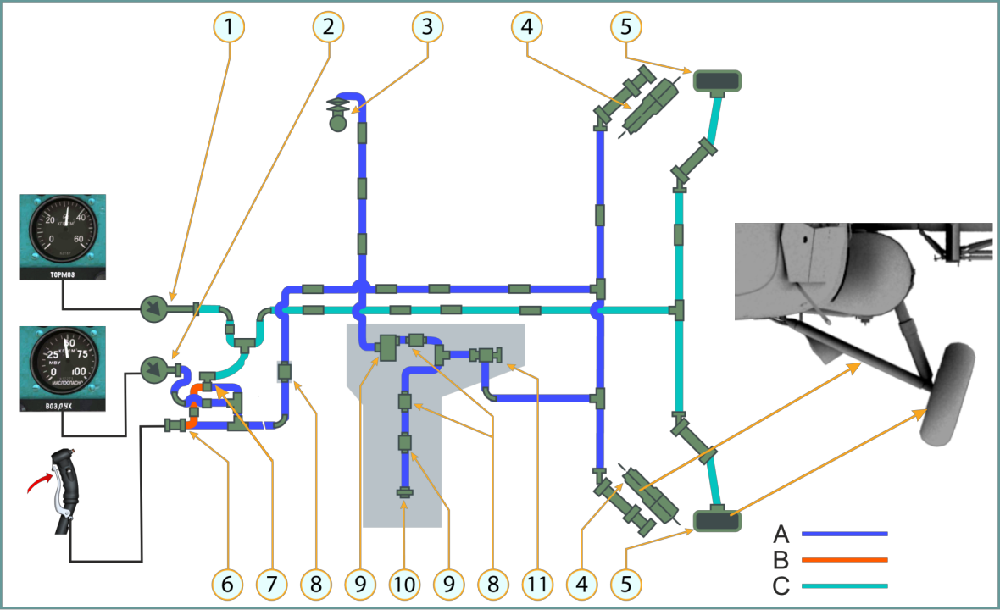

1. Манометр МА-60К 
2. Манометр НТМ-60 
3. Компрессор АК-50Т, 
4. Баллоны 
5. Тормоз колеса 
6. Редукционный клапан УП-25/2 
7. Редукционный ускоритель УПО3/2М 
8. Обратный клапан 636100М 
9. Фильтр 
9. Фильтр 
10. Зарядный клапан 3509с50 
11. АД-50

    A – давление 40..54 кгс/см2

    B – давление 0..14 кгс/см2

    C – давление 30..34 кгс/см2

(1) МАНОМЕТР МА-60К служит для контроля давления непосредственно в
тормозах;

(2) МАНОМЕТР НТМ-60 служит для контроля давления в баллонах (4);

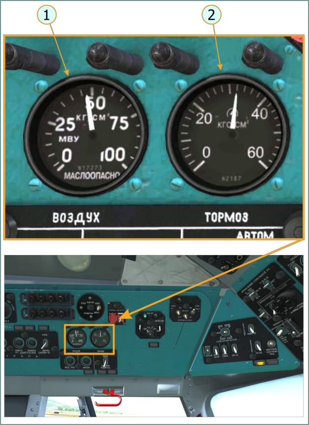

1. Манометр НТМ-60
2. Манометр МА-60К

(3) ВОЗДУШНЫЙ КОМПРЕССОР АК-50Т предназначен для подзарядки пневматической
системы вертолета сжатым воздухом во время полёта. Компрессор
обеспечивает наполнение бортовых баллонов воздухом до давления (5000+400)
kPa [(50+4) kgf/сm2] за время не более 25 min. Привод воздушного компрессора
АК-50Т осуществляется от главного редуктора.

(4) БАЛЛОНЫ. В качестве баллонов использованы внутренние полости подкосов
главных ног шасси.

(5) ТОРМОЗ КОЛЕС – колодочного типа, торможение осуществляется за счет
прижатия воздухом тормозных колодок к барабану.

(6) РЕДУКЦИОННЫЙ КЛАПАН УП25/2 предназначен для пневматического управления
тормозами колес главных ног шасси. Управление осуществляется от рычага на
РППУ, Рис. 7.24.

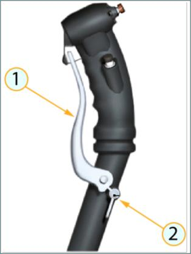

1. Рычаг управления тормозами  [[W]]
2. Собачка стояночного тормоза  [[LShift+W]]

 (7) РЕДУКЦИОННЫЙ УСКОРИТЕЛЬ УПО3/2М предназначен для ускорения подачи
сжатого воздуха в тормоза колес главных ног шасси, а также для выпуска
воздуха из тормозов в атмосферу при растормаживании колес. Редукционный
ускоритель работает от управляющего давления, подаваемого от
редукционного клапана УП25/2, и создает в тормозной магистрали давление,
равное (3300+300) kPa [(33+3) kgf/сm2].

(11) АВТОМАТ ДАВЛЕНИЯ АД-50 предназначен для автоматического переключения
компрессора АК-50Т с рабочего режима на холостой и обратно. Переключение
компрессора с рабочего режима на холостой происходит при давлении воздуха
в баллонах (5000+400) kPa [(50+4) kgf/сm2], а с холостого режима на рабочий -
при давлении воздуха в баллонах не менее 4000 kPa (40 kgf/сm2). Автомат
давления установлен на пневмопанели.

!!! note "Примечание"
	Пневмопанель служит для удобства монтажа агрегатов и проверки герметичности
    соединений, а также уменьшения количества трубопроводов. На ней установлена часть
    агрегатов пневматической системы. Пневмопанель установлена на левом борту грузовой
    кабины фюзеляжа. В игре не используется.

#### Основные ТТХ пневматической системы

Наименование параметра|Минимальное значение| Номинальное значение | Максимальное значение
------------|------------|------------|------------
Давление воздуха в баллонах кгс/см2| 40| 50 |54
Давление воздуха в тормозах колес кгс/см2| 30 |32| 34

#### Нормальная эксплуатация

Проверить зарядку воздушной системы (давление в системе должно быть по
манометру ВОЗДУХ 40...50 кгс/см2) и работу тормозной системы колес шасси
(при обжатии тормозного рычага давление в тормозах колес должно быть по
манометру ТОРМОЗ 30...34 кгс/см2, после растормаживания не должно быть
остаточного давления в тормозах).

## Противопожарная система

### Краткое описание

Противопожарное оборудование предназначено для обнаружения,
сигнализации и ликвидации пожара в защищаемых отсеках. Противопожарное
оборудование вертолета состоит из системы обнаружения и оповещения о
пожаре, и системы пожаротушения, включающей 2 баллона с огнегасящей
жидкостью (один баллон первой очереди срабатывания, другой баллон второй
очереди срабатывания). Питание электрических цепей осуществляется от
аккумуляторной шины при включении АЗС СИГНАЛИЗАЦИЯ, 1 ОЧЕРЕДЬ, 2
ОЧЕРЕДЬ, Рис. 7.25:

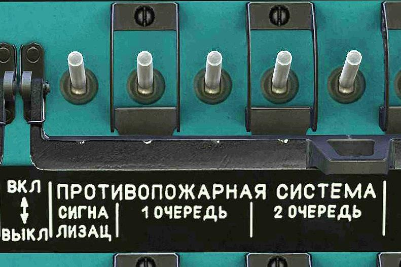

### Система обнаружения и оповещения о пожаре

Обнаружение пожара и оповещение экипажа обеспечиваются электрической
системой сигнализации о пожаре ССП-ФК.

Система сигнализации о пожаре ССП-ФК обеспечивает:

- обнаружение пожара в защищаемых отсеках вертолета;
- оповещение экипажа при помощи световой сигнализации;
- выдачу дополнительных сигналов оповещения на аппаратуру речевой
информации и аппаратуру автоматической регистрации параметров
полёта;
- автоматическое включение разрядки баллона 1 очереди в зону того
отсека, из которого получен сигнал о пожаре;
- индикацию срабатывания средств пожаротушения;
- проверку исправности системы и готовности ее к действию.

Работа аппаратуры ССП-ФК основана на получении и обработке электрического сигнала от
специальных датчиков. Датчик представляет собой термобатарею, собранную из трех
последовательно соединенных хромель-алюмелевых термопар. Рабочие (малоинерционные)
спаи электродов имеют значительно меньшие размеры, чем нерабочие (инерционные) спаи.

При быстром нагреве среды, окружающей датчик, малоинерционные спаи последнего, имеющие
меньшую массу, нагреваются значительно быстрее инерционных. За счет разности температур
нагрева рабочих и нерабочих спаев на выводных штырях датчика появляется термо-эдс.

#### Система обнаружения пожара

На вертолете установлено три комплекта аппаратуры ССП-ФК, которые
обеспечивают обнаружение пожара в четырех наиболее опасных в пожарном
отношении отсеках:

- левого двигателя;
- правого двигателя;
- керосинового обогревателя КО-50;
- главного редуктора, расходного топливного бака и двигателя АИ-9В
(все три области включены в один защищаемый отсек).

Система обнаружения пожара по принципу действия представляет собой многоконтурное
электрическое устройство, имеющее в каждом контролируемом отсеке вертолета несколько
самостоятельных групп датчиков, выдающих сигналы на исполнительные устройства.

В исполнительном блоке каждая группа датчиков подсоединена к своему блоку преобразования
сигналов (комбинированному блоку), образуя полностью независимый чувствительный контур.

Этим обеспечивается высокая надежность системы, так как при выходе из строя любой группы
датчиков работоспособность остальных групп сохраняется. Система способна обнаружить пожар
с помощью одного контура чувствительных элементов.

В состав системы ССП-ФК входят:

- 42 датчика-сигнализатора типа ДПС объединенных в 14 групп.

    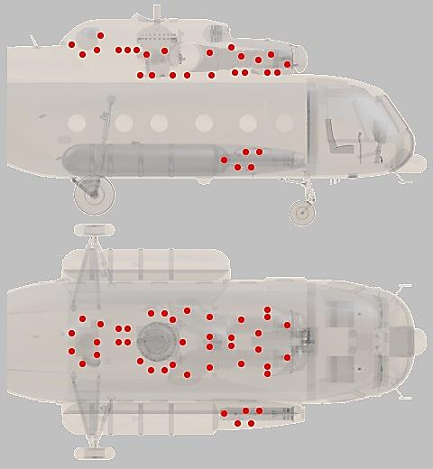

- три исполнительных блока ССП-ФК-БИ, принимающие электрические
сигналы, которые возникают в цепях датчиков при пожаре, и
управляющие системой сигнализации и автоматики. Исполнительные
блоки установлены в кабине экипажа на правой этажерке.
Система оповещения о пожаре

    Световая сигнализация. Система световой сигнализации о пожаре
представляет собой пять сигнальных табло с красными светофильтрами,
расположенными на щитке управления противопожарной системы, Рис. 7.27, 1:

- два табло ПОЖАР ЛЕВ. ДВ. и ПОЖАР ПРАВ. ДВ. сигнализируют о
пожаре, возникшем соответственно в отсеках левого и правого
двигателей вертолета;
- табло ПОЖАР КО-50 сигнализирует о пожаре в отсеке обогревателя
КО-50;
- табло ПОЖАР РЕДУК. АИ-9 сигнализирует о пожаре в отсеках
главного редуктора, расходного топливного бака и двигателя АИ-9В;
- табло ПОЖАР – дополнительное табло на левой приборной доске,
дублирующее загорание любого из четырех основных, Рис. 7.28.

    

1. Табло сигнализации пожара в защищаемых отсеках (ПОЖАР ЛЕВ ДВ, ПОЖАР ПРАВ ДВ ПОЖАР КО-50, ПОЖАР РЕД.АИ-9) 
2. Табло срабатывания системы пожаротушения первой очереди 
3. Табло срабатывания системы пожаротушения второй очереди 
4. Кнопки ручного включения системы пожаротушения первой очереди 
5. Кнопки ручного включения системы пожаротушения второй очереди 
6. Кнопка выключения сигнализации пожара Буквами обозначены табло сигнализации пожара, срабатывания баллонов системы пожаротушения и кнопки ручного включения системы пожаротушения отсеков:

    1. ЛЕВОГО двигателя
    1. ПРАВОГО двигателя 
    1. КО-50 
    1. Главного редуктора, расходного бака и ВСУ

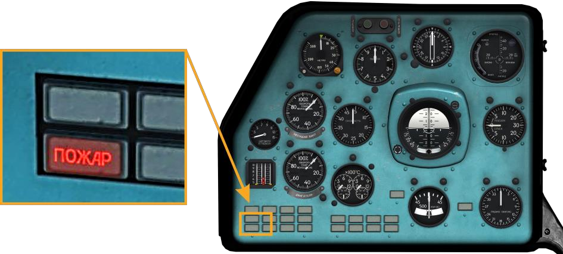

Чтобы быстрее привлечь внимание экипажа к сигналу о пожаре в каком-либо из
отсеков, предусмотрена работа ламп всех пяти сигнальных табло в "мигающем"
режиме, для чего цепи питания их заведены в схему вертолетной системы
МИГАЛКА.

Дополнительные сигналы оповещения. Одновременно с подачей питания
на табло система пожарной сигнализации обеспечивает выдачу по
параллельным цепям дополнительных сигналов оповещения на вход блока из
комплекта аппаратуры речевой информации РИ-65. В зависимости от места
пожара сигнал поступает на один из четырех каналов, который при этом
запускается и обеспечивает выдачу соответствующего речевого сообщения в
телефоны левого летчика: ПОЖАР ЛЕВЫЙ ДВИГАТЕЛЬ, ПОЖАР ПРАВЫЙ
ДВИГАТЕЛЬ, ПОЖАР РЕДУКТОР ВСУ, ПОЖАР КО-50.

Речевое сообщение поступает в телефоны левого летчика в циркулярном
режиме и повторяется с периодичностью 2 сообщения за 12 s. Одновременно
это же сообщение через командную УКВ радиостанцию вертолета
автоматически передается на наземный пункт управления полётом и на вход
блока из комплекта системы автоматической регистрации параметров полёта
(САРПП-12ДМ).

### Контроль системы сигнализации и оповещения

Контроль исправности системы сигнализации сводится к проверке исправности
ламп сигнальных табло и контролю исправности датчиков.
ПРОВЕРКАИСПРАВНОСТИ ЛАМП и цепей их питания осуществляется от вертолетной
системы проверки ламп при включенных автомате защиты сети ПРОВЕРКА
ЛАМП. МИГАЛКА и выключателе МИГАЛКА.

При установке переключателя ПРОВЕРКА МИГАЛКИ-СИГНАЛ. ЛАМП на
центральном пульте летчиков в положение ПРОВЕРКА МИГАЛКИ должны
загореться в "мигающем" режиме лампы пяти табло сигнализации о пожаре
([Рис. 7.27](#727), 1 и [Рис. 7.28](#728)). В положении переключателя ПРОВЕРКА СИГНАЛ.
ЛАМП должны гореть лампы восьми табло 1 ОЧЕРЕДЬ и 2 ОЧЕРЕДЬ ([Рис. 7.27](#727),
2, 3).

КОНТРОЛЬ ИСПРАВНОСТИ ДАТЧИКОВ ДПС и цепей их питания осуществляется со
щитка КОНТРОЛЬ ДАТЧИКОВ (Рис. 7.29) на средней панели электропульта
после установки выключателя ОГНЕТУШЕНИЕ-КОНТРОЛЬ ДАТЧИКОВ в
положение КОНТРОЛЬ ДАТЧИКОВ; при этом на щитке контроля загорится табло
КОНТРОЛЬ ДАТЧИКОВ с красным светофильтром (Рис. 7.29, 3),
свидетельствующее о готовности цепей контроля.

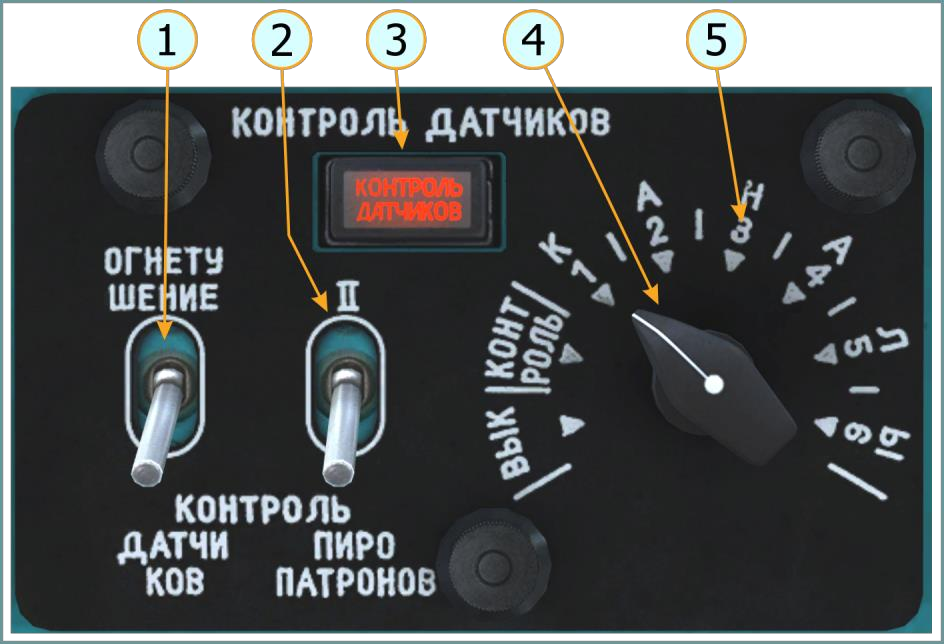

1. Переключатель ОГНЕТУШЕНИЕ – КОНТРОЛЬ ДАТЧИКОВ 
2. Переключатель I – II проверки пиропатронов на баллонах с огнегасящей смесью 
3. Табло сигнализации положения переключателя (1) КОНТРОЛЬ ДАТЧИКОВ 
4. Переключатель ВЫК – КОНТРОЛЬ – КАНАЛЫ 1–2–3–4–5–6 
5. Положения для подключения каналов 1– 2–3–4–5–6 датчиков или выключения процедуры контроля (ВЫК)

Система контроля работает от аккумуляторной шины через автомат защиты
сети ПРОТИВОПОЖАРНАЯ СИСТЕМА. СИГНАЛИЗАЦ. и галетный переключатель
КОНТРОЛЬ ДАТЧИКОВ. Все 14 групп датчиков ДПС сгруппированы в шесть
каналов контроля (Рис. 7.29, 4), каждый из которых подключен к своему
контакту переключателя. Для контроля необходимо переключатель поочередно
устанавливать в положение проверяемых каналов. При исправности датчиков в
группах и их цепей питания на средней панели электропульта и на левой
приборной доске будут загораться соответствующие лампы табло,
сигнализирующие о пожаре ([Рис. 7.27](#727), 1 и [Рис. 7.28](#728)).

Разбивка групп датчиков различных отсеков по каналам контроля приведена в
таблице:

Контролируемые отсеки | Канал I| Канал II| Канал III| Канал IV| Канал V| Канал VI | Горят табло
----------------------|-----------|------------|-------------|------------|-----------|-------------|-----------
Левого двигателя  | + | + | + | | | | ПОЖАР ЛЕВ. ДВ.
Правого двигателя | + | + | + | | | | ПОЖАР ПРАВ ДВ.
Главного редуктора и расходного бака | + | + | + | + | | | ПОЖАР РЕДУК. АИ-9
Двигателя АИ-9В | | | | | + | + | ПОЖАР РЕДУК. АИ-9
Обогревателя КО-50 | + | + | | | | | ПОЖАР КО-50

### Система пожаротушения

Стационарная система пожаротушения состоит из двух шаровых баллонов типа
УБШ-4-4 с огнегасящим составом с обеспечением их разрядки в две очереди,
Рис. 7.30. Баллон заправляется огнегасящим составом фреон 114В2 массой
5,640 kg и для обеспечения подачи этого состава заряжается воздухом или азотом
массой 0,180 kg до давления (10500...11500) kРа [(105...115) kgf/cm2] при
температуре 15...20 °С. Каждый баллон имеет четыре пироголовки (по числу
защищаемых отсеков). Открытие каждой пироголовки производится с помощью
двух пиропатронов. Баллоны размещены в отсеке главного редуктора по
правому борту.

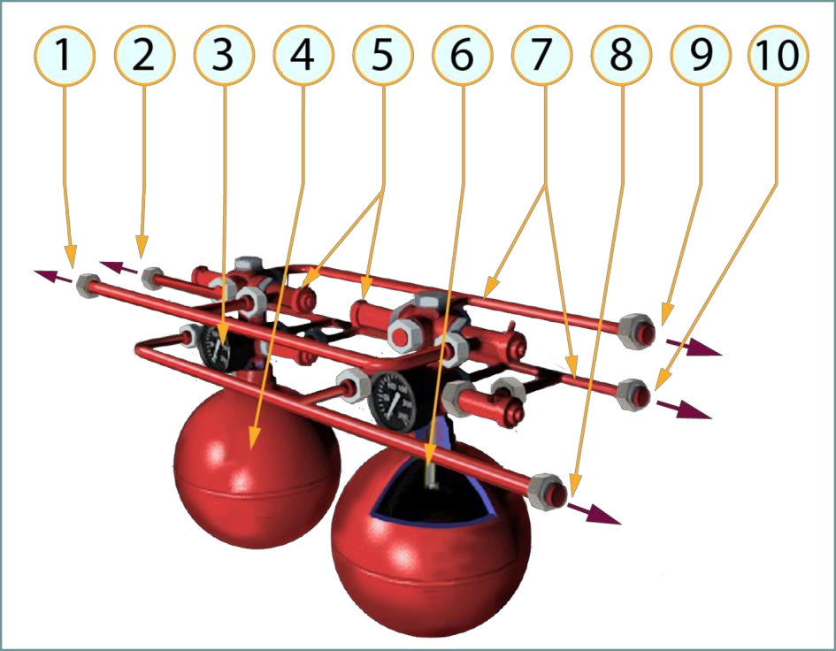

1. Отвод в отсек главного редуктора, расходного топливного бака, двигателя АИ-9В 
2. Отвод за борт 
3. Манометр 
4. Баллон огнетушителя УБШ-4-4, коллекторный узел 
5. Пироголовка ПГКц 
6. Сифонная трубка 
7. Коллекторный узел 
8. Отвод в КО-50 
9. Отвод в отсек левого двигателя 
10. Отвод в отсек правого двигателя

Следует учесть, что при тушении пожара в отсеке "главный редуктор,
расходный бак и АИ-9В" огнегасящая смесь распространяется во все три
защищаемых области (и в область редуктора, и в область расходного бака, и в
область АИ-9В), не смотря на то, что пожар был только в области расходного
бака (к примеру).

### Нормальная эксплуатация

#### Условия (этап) работы и необходимые действия

1. ПРОВЕРКА ИСПРАВНОСТИ ЭЛЕКТРИЧЕСКОЙ СИСТЕМЫ ПРОТИВОПОЖАРНОГО ОБОРУДОВАНИЯ.
После включения источников электроэнергии необходимо:

    - выключить командную радиостанцию на АЗС РАДИО;
    
        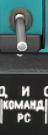
    
    - включить АЗС ПРОТИВОПОЖАРНАЯ СИСТЕМА;
    
        
    
    - поочередно поставить переключатель КОНТРОЛЬ ПИРОПАТРОНОВ в
    положение I и II,
    
        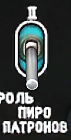
    
        убедиться в исправности электрических цепей
    пиропатронов (желтые лампы на табло сигнализации огнетушителей
    не должны гореть);
    
        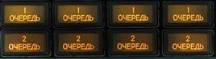
    
    - установить переключатель КОНТРОЛЬ ДАТЧИКОВ-ОГНЕТУШЕНИЕ в
    положение КОНТРОЛЬ,
    
        
    
        при этом должна загореться сигнальная
    лампа табло КОНТРОЛЬ ДАТЧИКОВ;
    
        
    
    - произвести галетным переключателем переключение по всем шести
    каналам .
    
    
        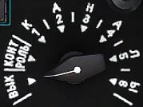
    
    
        При установке переключателя в положение 1 и 2 должны гореть лампы-табло
    ПОЖАР ЛЕВ. ДВ., ПОЖАР ПРАВ.ДВ., ПОЖАР КО-50, ПОЖАР РЕДУК.АИ-9.
    
        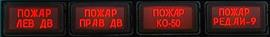

    При установке переключателя в
положение 3 лампа-табло, сигнализирующая о пожаре в отсеке КО-50 должна
погаснуть. При установке переключателя в положение 4, 5 и затем 6 должна
гореть лампа-табло, сигнализирующая ПОЖАР РЕДУК.АИ-9, остальные табло
должны погаснуть.

2. ПРИВЕДЕНИЕ СИСТЕМЫ В СОСТОЯНИЕ ГОТОВНОСТИ

    - установить галетный переключатель в положение ВЫК;
    
        
    
    - установить переключатель КОНТРОЛЬ ДАТЧИКОВ-ОГНЕТУШЕНИЕ в
    положение ОГНЕТУШЕНИЕ,
    
        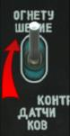
    
        при этом должна погаснуть
    сигнальная лампа табло КОНТРОЛЬ ДАТЧИКОВ.
    
        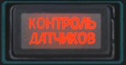
    
    - система готова к автоматическому срабатыванию или ручному
    включению.

3. ВЫКЛЮЧЕНИЕ СИСТЕМЫ

После заруливания на стоянку и останова двигателей, для выключения системы
выключить АЗС ПРОТИВОПОЖАРНАЯ СИСТЕМА.

!!! note "ПРЕДУПРЕЖДЕНИЕ"
    Во избежание срабатывания огнетушителей первой
    (автоматической) очереди системы запрещается поворачивать ручку галетного
    переключателя с отметки ВЫКЛ при нахождении переключателя КОНТРОЛЬ
    ДАТЧИКОВ-ОГНЕТУШЕНИЕ в положение ОГНЕТУШЕНИЕ и устанавливать
    переключатель КОНТРОЛЬ ДАТЧИКОВ-ОГНЕТУШЕНИЕ в положение
    ОГНЕТУШЕНИЕ до установки галетного переключателя в положение ВЫКЛ.

#### Работа системы и действия экипажа с оборудованием противопожарной системы при пожаре

При возникновении пожара в одном из защищаемых отсеков (например, левого
двигателя) и возникновении термо-эдс на датчиках любого из каналов
загораются табло:

- ПОЖАР ЛЕВ ДВ на щитке управления противопожарной системой
 (Рис. 7.27, 1-a);
- ПОЖАР на левой приборной доске (Рис. 7.28)

Одновременно взрывается пиропатрон магистрали подачи огнегасящей
жидкости баллона 1-й очереди в отсек левого двигателя, после чего загорается
табло, сигнализирующее срабатывание 1-й очереди – 1 ОЧЕРЕДЬ на щитке
управления противопожарной системой (Рис. 7.27, 2-a).

Если пожар потушен, то за время не более 10 c термо-эдс на датчиках
пропадает и табло ПОЖАР ЛЕВ ДВ гаснет, а табло 1 ОЧЕРЕДЬ продолжает
гореть. Если табло не гаснут через 10 с, нажать кнопку ВЫК. СИГНАЛИЗАЦИИ
ПОЖАРА (Рис. 7.27, 6).

Если автоматика включения баллона первой очереди не сработала (табло
ПОЖАР ЛЕВ ДВ на щитке управления противопожарной системой и ПОЖАР на
левой приборной доске горят, а табло 1 ОЧЕРЕДЬ не загорается), тогда
необходимо вручную взорвать пиропатрон магистрали подачи огнегасящей
жидкости баллона 1-й очереди в отсек левого двигателя, нажав кнопку 1
ОЧЕРЕДЬ для отсека левого двигателя (Рис. 7.27, 4-a).

Если после ликвидации пожара в отсеке левого двигателя баллоном 1 очереди
произошел пожар в другом отсеке (например, в отсеке "главный редуктор,
расходный бак и ВСУ"), значит необходимо вручную взорвать пиропатрон 2
очереди для отсека "главный редуктор, расходный бак и ВСУ" нажатием кнопки
2 ОЧЕРЕДЬ для отсека "главный редуктор, расходный бак и ВСУ" (Рис. 7.27, 5-
d). После чего загорается табло срабатывания 2-й очереди 2 ОЧЕРЕДЬ под
табло пожара ПОЖАР РЕД.АИ-9 на щитке управления противопожарной
системой (Рис. 7.27, 3-d).

!!! note "Примечание"
	При срабатывании системы для тушения пожара в отсеке "главный редуктор,
    расходный бак и ВСУ" двигатель АИ-9в выключается, если он работал, и блокируется его
    запуск. Аналогично и для отсека КО-50.

Более подробно смотри [Пожар на вертолете](10.emergency.md#пожар-на-вертолете)

## Система обогрева и вентиляции кабины

### Краткое описание

Предназначена для создания и поддержания комфортных условий для членов
экипажа и сопровождающих груз людей и обеспечивает:

- подачу подогретого и атмосферного воздуха в кабину экипажа и
грузовую кабину;
- обдув передних стекол и блистеров кабины экипажа.

В состав системы обогрева и вентиляции кабин входит обогреватель КО-50 и
вентиляторы ДВ-302Т индивидуального пользования у правого и левого
пилотов.

Работа обогревателя заключается в следующем: в камере сгорания
обогревателя после запуска происходит процесс горения керосиново-воздушной
смеси. Продукты горения выводятся наружу через выхлопной патрубок.
Нагретые стенки калорифера омываются воздухом от вентилятора. Воздух
отбирает тепло от стенок калорифера, нагревается и подается в кабины
вертолета.

Обогреватель может работать в автоматическом, ручном, а также в
вентиляторном режимах. При работе обогревателя в автоматическом режиме
температура воздуха поддерживается постоянной в зависимости от положения
задатчика температуры. Ручное управление обеспечивает работу обогревателя
на максимальном (полном) и среднем режимах теплопроизводительности.

Режим рециркуляции служит для ускорения обогрева кабин в зимних условиях с
забором воздуха из грузовой кабины вертолета, в игре управление
перекрывной заслонкой не моделируется. Работа системы в вентиляторном
режиме обеспечивает охлаждение обогревателя и вентиляцию кабин вертолета
(через короба) в теплое время года.

В цепи электропитания обогревателя установлено реле, которое разрывает
цепь питания обогревателя при возникновении пожара в отсеке КО-50.
КО-50 размещен спереди правого подвесного топливного бака, Рис. 7.31:

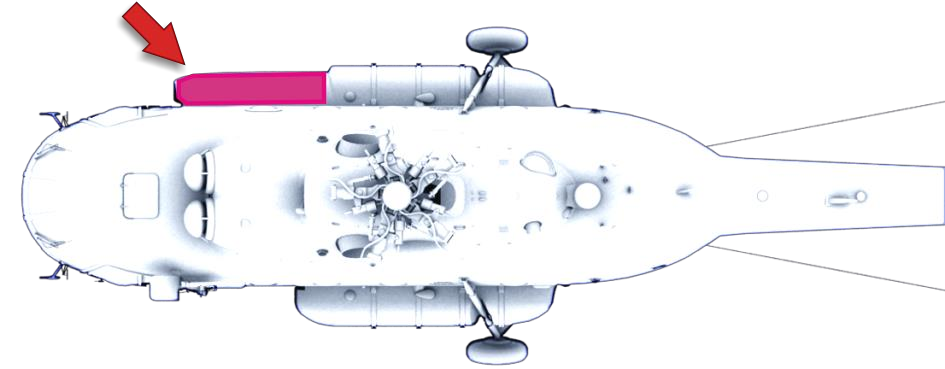

Теплопроизводительность керосинового обогревателя КО-50 – 50.000 kcal/h при
перепаде температур на земле 130° С.  Расход воздуха – 1 760 kg/h при
давлении 100 мм вод. ст. за обогревателем.  Расход топлива – 8,7 kg/h. 
Потребляемая электрическая мощность вентилятора – 2,5 kW.

Топливо для питания керосинового обогревателя подается из магистрали
питания правого двигателя при открытии электромагнитного крана 610200А КО-
50, открытие крана осуществляется с панели управления КО-50, Рис. 7.32
системой запуска обогревателя.

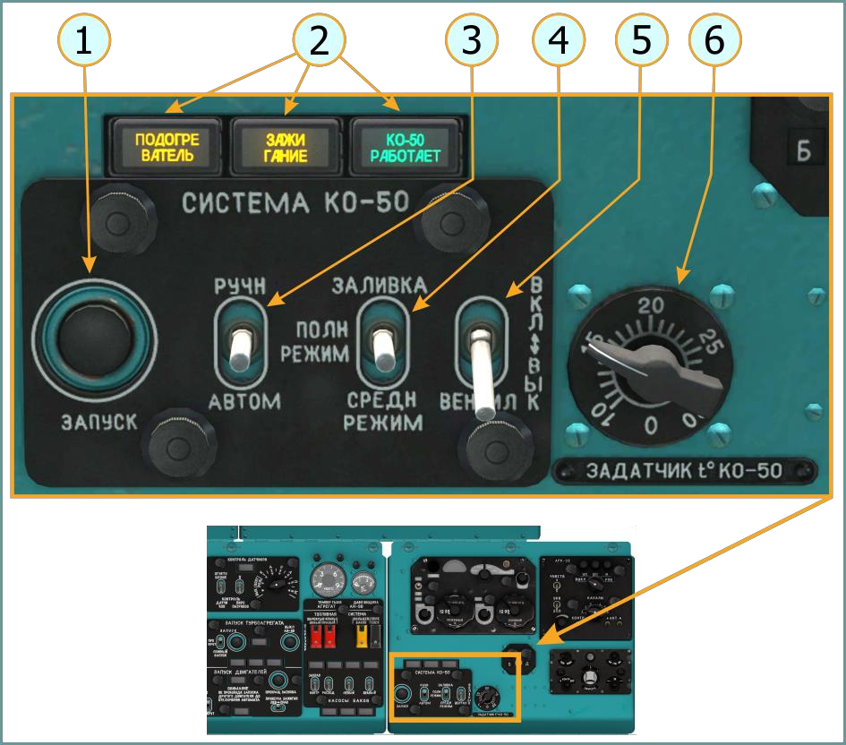

1. Кнопка запуска КО-50 
2. Табло сигнализации состояния обогревателя на этапах запуска и работы:

    - ПОДОГРЕВАТЕЛЬ – подогрев топлива перед форсункой;
    - ЗАЖИГАНИЕ – электрический поджиг распыленного топлива;
    - КО-50 РАБОТАЕТ – горение распыленного топлива 

3. Переключатель РУЧН – (НЕЙТРАЛЬ) – АВТОМ режимов работы КО-50 
4. Переключатель ЗАЛИВКА – ПОЛН РЕЖИМ – СРЕДН РЕЖИМ:

    - положения ПОЛН РЕЖИМ – СРЕДН РЕЖИМ служат для установки режимов теплопроизводительности в ручном режиме работы;
    - положение ЗАЛИВКА в игре не используется 

5. Выключатель вентилятора 
6. Задатчик температуры

### Включение обогревателя КО-50 в автоматическом режиме

- Включить АЗС КО-50 на правой панели АЗС;
    
    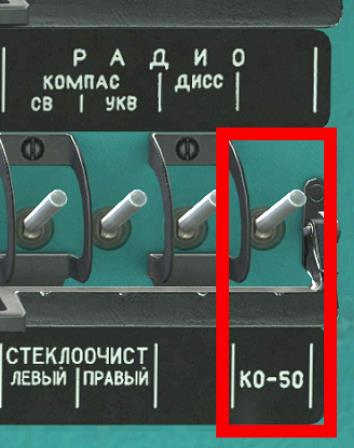

- установить переключатель на пульте управления обогревателем в
положение АВТОМ. (Рис. 7.32, 3);
- установить задатчик температуры на заданную (требуемую)
температуру (Рис. 7.32, 6);
- нажать кнопку ЗАПУСК (Рис. 7.32, 1), при этом на пульте должно
загореться табло ПОДОГРЕВАТЕЛЬ. При достижении температуры
топлива 70±5°С табло ПОДОГРЕВАТЕЛЬ погаснет и загорятся
светосигнальные табло ЗАЖИГАНИЕ И КО-50 РАБОТАЕТ. По истечении
не более 40 с погаснет табло ЗАЖИГАНИЕ, что будет означать
установившийся процесс горения в КО-50.

### Включение обогревателя КО-50 в ручном режиме

- Включить АЗС КО-50 на правой панели АЗС;
- установить переключатель на пульте управления обогревателем в
положение РУЧН.;
- установить переключатель в положение ПОЛН.РЕЖИМ (максимальный
режим) или СРЕДН.РЕЖИМ (средний режим);
- нажать кнопку ЗАПУСК.

Дальнейшие этапы работы аналогичны этапам автоматического режима.

!!! note "Примечание"
	Перед выключением для ускоренного охлаждения обогревателя установить
    переключатель ВЕНТИЛ. на пульте управления в положение ВКЛ. на 3...10 мин (нет
    необходимости использовать в игре).

### Работа обогревателя в режиме вентиляции

При использовании обогревателя в летнее время для вентиляции кабин
включить АЗС КО-50, а переключатель ВЕНТИЛ. установить в положение ВКЛ.
Подача воздуха производится по тем же каналам, что и в зимнее время.

### Выключение обогревателя КО-50

- Установить переключатель РУЧН.- АВТОМ. в нейтральное положение;
- после посадки выключить АЗС.

## Светотехническое оборудование

Вертолёт оборудован светотехническими средствами, обеспечивающими
полёты, как днём, так и ночью. Светотехническое оборудование состоит из
внешнего и внутреннего.

### Внешнее светотехническое оборудование

К внешнему светотехническому оборудованию относятся, Рис. 7.33:

- две посадочно-поисковые фары ФПП-7М;
- рулёжная фара ФР-100;
- проблесковый маяк МСЛ-3;
- аэронавигационные огни БАНО-45 и хвостовой огонь ХС 39;
- строевые огни ОПС-57;
- контурные огни (на законцовках лопастей).

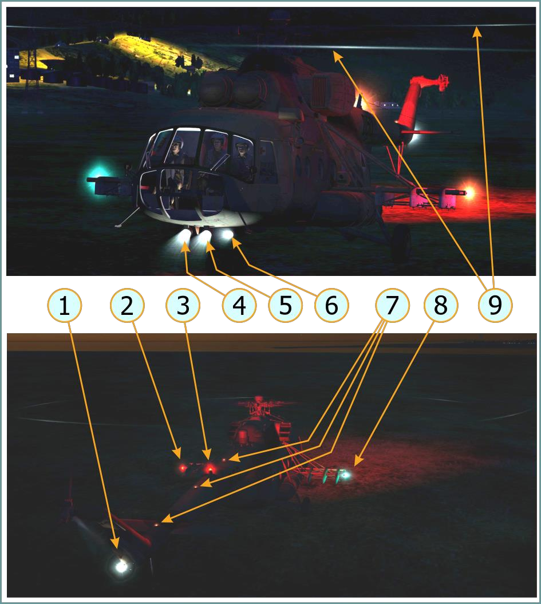

1. Хвостовой огонь ХС 39 
2. Левый аэронавигационный огонь БАНО- 45 (красный) 
3. Проблесковый маяк МСЛ-3 
4. Фара ФПП-7М правого летчика 
5. Фара ФПП-7М левого летчика 
6. Рулежная фара ФР-100 
7. Строевые огни ОПС-57 
8. Правый аэронавигационный огонь БАНО- 45 (зеленый) 
9. Контурные огни (на законцовках каждой лопасти)

Цепи внешнего светотехнического оборудования подключены через АЗС,
расположенные на правой панели АЗС, Рис. 7.34:

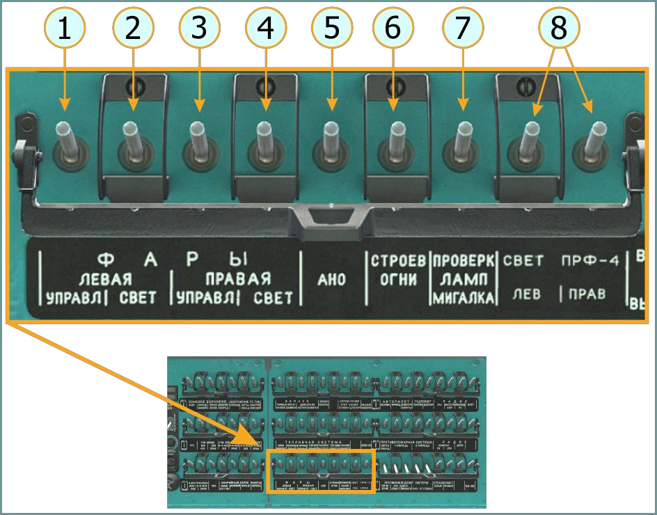

1. Фара посадочная левая, цепь управления фарой 
2. Фара посадочная левая, цепь лампы накаливания 
3. Фара посадочная правая, цепь управления фарой и цепь лампы накаливания рулежной фары 
4. Фара правая, цепь лампы накаливания 
5. Цепь питания аэронавигационных огней 
6. Цепь питания строевых огней 
7. Цепь системы МИГАЛКА 
8. Цепи фар ПРФ-4 (на подкосах основных стоек шасси, в игре не реализаованы)

АЗС  [[проблескового маяка]](#strobe) установлен на правой боковой панели.

#### Посадочно-поисковая фара ФПП-7М

На вертолёте в носовой части фюзеляжа под полом кабины летчиков
установлены две фары ФПП-7М ([Рис. 7.33](#733), 4, 5).

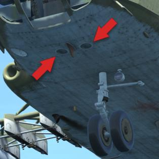

Фары предназначены для поиска посадочной
площадки, освещения места посадки и местности при рулении вертолёта по
земле, а также для освещения места погрузочно-разгрузочных работ,
производимых с вертолёта в ночное время и в ухудшенных метеорологических
условиях.

Фары могут быть выпущены на угол от 0 до 120° по углу места и развернуты на
любой угол по азимуту, могут быть убраны.

Правая фара ФПП-7М подключена к аккумуляторной шине, а левая к шине ВУ. В
цепях управления и света фар установлены автоматы защиты сети,
расположенные на правой панели АЗС.

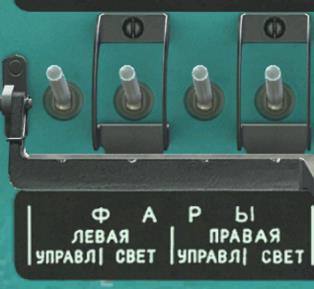

Включение света фар и подача питания к переключателям выпуска, уборки и
поворота фар осуществляется двумя переключателями ФАРЫ СВЕТ – ВЫК –
УБРАНА при установке их в положение СВЕТ  [[LShift]] +  [[L]] /  [[RShift]] +  [[L]].

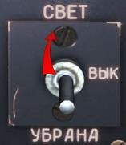

Переключатели установлены на левом и правом боковых кронштейнах
приборных досок (Рис. 7.35, 2 ,3):

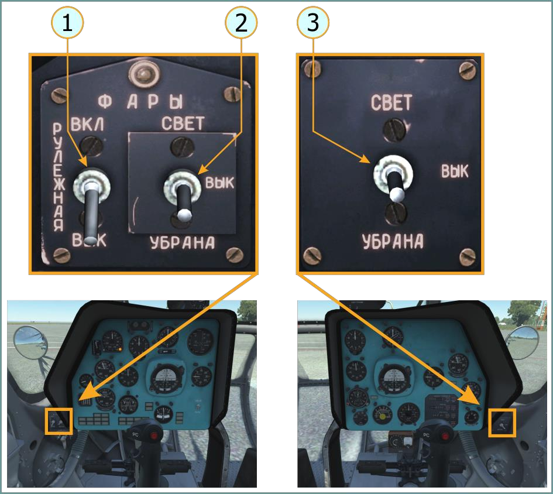

1. Выключатель рулежной фары ФР-100 левого летчика 
2. Переключатель управления посадочной фарой ФПП-7М левого летчика 
3. Переключатель управления посадочной фарой ФПП-7М правого летчика

Управление выпуском и уборкой (настройкой положения луча по углу места),
левым и правым поворотом фар (настройкой положения луча по азимуту)
осуществляется с помощью двух пятипозиционных переключателей,
установленных на ручках ШАГ-ГАЗ, Рис. 7.36:

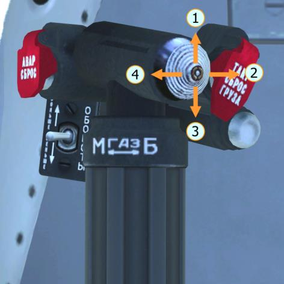

1. Движение фары (луча) вперед (вверх)  [[LShift]] +  [[8]] (левая фара) /  [[RShift]] +  [[8]] (правая фара) 
2. Разворот фары (луча) вправо  [[LShift]] +  [[0]] /  [[RShift]] +  [[0]] 
3. Движение фары (луча) назад (вниз)  [[LShift]] +  [[7]] /  [[RShift]] +  [[7]] 
4. Разворот фары (луча) влево  [[LShift]] +  [[9]] /  [[RShift]] +  [[9]]

При установке переключателей ФАРЫ СВЕТ – УБРАНА в положение УБРАНА,

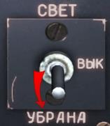

происходит выключение света фар и
автоматическая уборка. Во время полной уборки фары автоматически
возвращаются в исходное положение относительно оси вертолёта. Предельное
выпущенное и полностью убранное положения фиксируются с помощью
концевых выключателей.

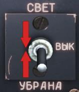

Положение ВЫК (нейтральное)  [[LShift]] +  [[;]] (первое нажатие)
служит для сохранения установленной настройки направления луча при
выключенном свете фары. Это же положение в игре используется как
положение "по умолчанию".

##### Ттх ФПП-7М

- Номинальное напряжение питания, В 27
- Ток, потребляемый каждым электродвигателем, А, не более 0,7
- Потребляемая мощность, Вт, не более 480
- Номинальное значение силы света, кд 300000
- Угол выпуска фары (по углу места), град от 0 до 120
- Угол поворота фары (по азимуту) вращение не ограничивается
- Масса изделия, кг, не более 3

#### Фара ФР-100

Фара предназначена для освещения местности при рулении вертолета.

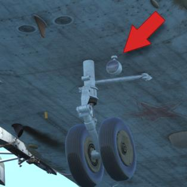

Рулёжная фара установлена в нижней части фюзеляжа (в
реале используется для экономии ресурса посадочных фар).

Питание получает от аккумуляторной шины через АЗС ФАРЫ ПРАВАЯ
УПРАВЛЕНИЕ. Включается выключателем ФАРЫ –
РУЛЁЖНАЯ, установленным рядом с переключателем левой фары ФПП-7, (Рис.
7.35, 1)  [[RCtrl]] +  [[L]].

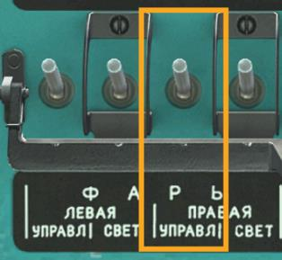

#### Проблесковый маяк мсл-з

Предназначен для обеспечения безопасности полёта в ночных условиях, при
плохой видимости днем, а также для сигнализации о месте нахождения
вертолета в случае вынужденной посадки. Установлен проблесковый маяк МСЛ-
3 сверху на хвостовой балке.

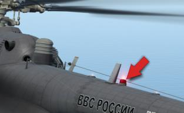

Включается маяк АЗС защиты
ПРОБЛЕСК МАЯК, расположенным на правом электропульте
  [[RCtrl]] +  [[6]].

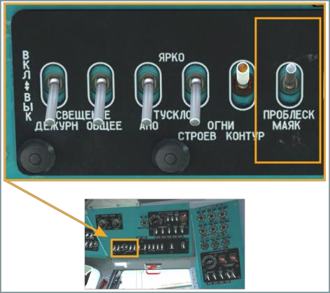

Маяк подключен к аккумуляторной шине (на некоторых сериях Ми-8МТВх – к
шине ВУ).

Работа маяка без обдува от несущего винта допускается в течение 10минут (в
игре без ограничений).

#### Аэронавигационные огни

Аэронавигационные огни предназначены для светового обозначения вертолёта.

На вертолете установлены бортовые аэронавигационные огни типа БАНО-45 и
хвостовой огонь ХС-39.

Красный и зеленый бортовые огни укреплены на законцовках ферм

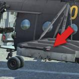

или по левому и правому бортам носовой части фюзеляжа
 (в случае отсутствия ферм и брони).

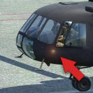

ХС-39 на обтекателе хвостовой балки.

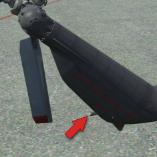

Аэронавигационные огни получают питание от шины аккумуляторов через АЗС
"АНО", который установлен на правой панели АЗС .

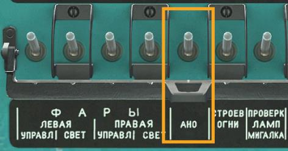

Управление (включение и выбор яркости
свечения) АНО осуществляется переключателем яркости АНО ТУСКЛО –
(нейтраль)– ЯРКО, установленным на правой боковой панели электропульта:

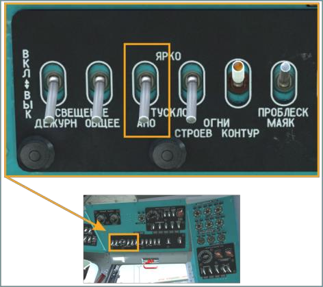

ТУСКЛО –  [[RCtrl]] +  [[1]] (вниз), ЯРКО –  [[RCtrl]] +  [[2]]
(вверх). Нейтральное положение выключает АНО.

Для подачи световых сигналов условным кодом, на левой боковой панели
установлена кнопка "КОД-АНО".

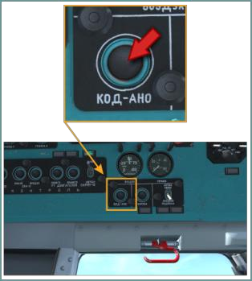

#### Строевые огни ОПС-57

Огни полёта строем предназначены для соблюдения строя при групповых
полётах ночью или в условиях плохой видимости. На вертолёте установлено три
строевых огня.

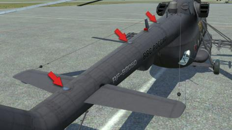

Строевые огни получают питание от шины ВУ через АЗС СТРОЕВ ОГНИ, который
установлен на правой панели АЗС.

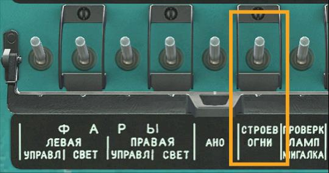

Управление
(включение и выбор яркости свечения) строевых огней осуществляется
переключателем яркости ОГНИ СТРОЕВ ТУСКЛО –(нейтраль)– ЯРКО,
установленным на правой боковой панели электропульта:

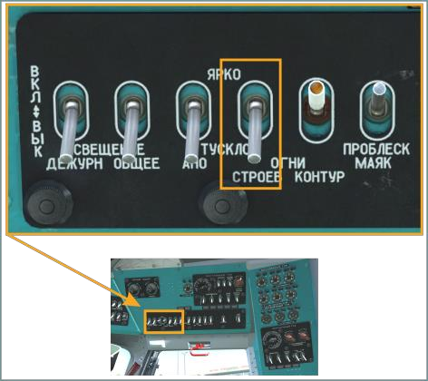

ТУСКЛО –  [[RCtrl]] +  [[3]] (вниз), ЯРКО –  [[RCtrl]] +  [[4]]
(вверх) . Нейтральное положение выключает строевые огни.

#### Контурные огни

Контурные огни предназначены для обозначения контура плоскости несущего
винта. Огни установлены на законцовках лопастей несущего винта.

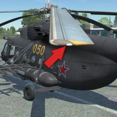

Включение контурных огней осуществляется
выключателем ОГНИ КОНТУР, который установлен на правой боковой панели
электропульта  [[RCtrl]] +  [[5]].

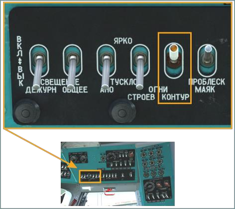

Питание контурных огней осуществляется от шины переменного тока с
напряжением 115В через трансформатор ТР 115/7,5.

### Внутреннее светотехническое оборудование

Внутреннее светотехническое оборудование включает в себя освещение кабины
экипажа, освещение грузовых и технических отсеков и систему
внутривертолётной световой сигнализации.

#### Освещение кабины экипажа

Освещение кабины экипажа включает в себя:
- игровой фонарик летчика;
- освещение рабочих мест экипажа;
- систему красного подсвета.

ИГРОВОЙ ФОНАРИК ЛЕТЧИКА

Игровой фонарик летчика предназначен для облегчения ориентирования игрока
в кабине экипажа при запуске миссии с "холодным стартом" в ночное время. Включается/выключается  [[LAlt]] +  [[L]],
управляется мышью.

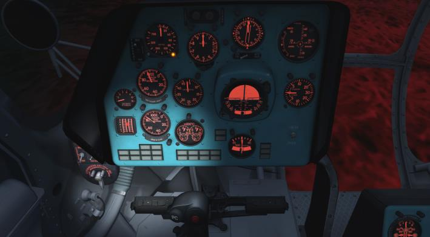

ОСВЕЩЕНИЕ РАБОЧИХ МЕСТ ЭКИПАЖА

Кабина экипажа освещается белым (основным) и красным (дежурным) светом с
помощью двух плафонов,
установленных на потолке кабины по обе стороны вертолёта. В каждом
плафоне установлено по две лампы одна – белого цвета, вторая – красного
цвета. Включение осуществляется выключателями ПЛАФОН КРАСНЫЙ (вверх) –
(нейтраль)–БЕЛЫЙ (вниз). Нейтральное положение выключает плафон.

Выключатели расположены на левом и правом щитках электропульта
(треугольных), Рис. 7.37.

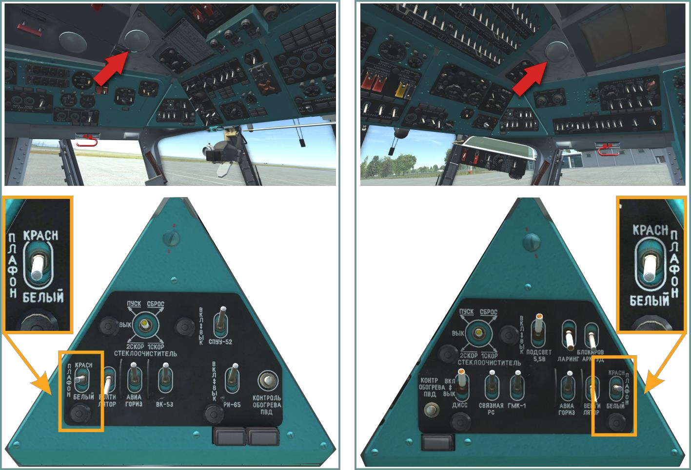

СИСТЕМА КРАСНОГО ПОДСВЕТА

Система красного подсвета предназначена для подсвета надписей на
указателях, пультах управления систем и надписей, размещённых на приборных
досках, центральном пульте и электропульте.

Система красного подсвета приборных досок, центрального пульта и
электрощитке электропульта разделена на две группы. Группа I подключена к
шине ВУ, а группа II к аккумуляторной шине. Система красного подсвета не
имеет АЗС. Включение обеих групп и плавное регулирование яркости красного
подсвета производится с помощью реостатов. Для ограничения максимального
напряжения питания красного подсвета на реостатах установлены упоры.
Включение красного подсвета на левой панели АЗС, левой боковой панели,
левом щитке, левой панели электропульта, левой приборной доске, кронштейне
компаса КИ-13, на абонентских аппаратах левого лётчика и грузовой кабины, на
пульте левой ФПП-7М осуществляется реостатами КРАСНЫЙ ПОДСВЕТ – ГРУППА
1 и КРАСНЫЙ ПОДСВЕТ – ГРУППА 2, установленными на левой боковой панели
электропульта.

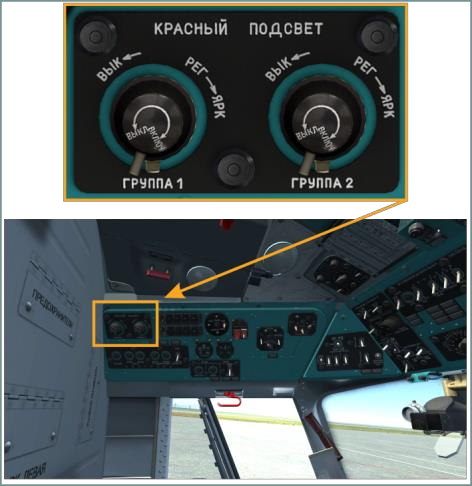

Включение красного подсвета на пульте бомбардировочного вооружения,
пульте управления и передатчике радиостанции Р-863, правой панели АЗС,
правом щитке, правой панели электропульта, правой приборной доске и на
пульте правой ФПП-7 осуществляется реостатами КРАСНЫЙ ПОДСВЕТ – ГРУППА
1 и КРАСНЫЙ ПОДСВЕТ – ГРУППА 2, установленными на правой боковой панели
электропульта.

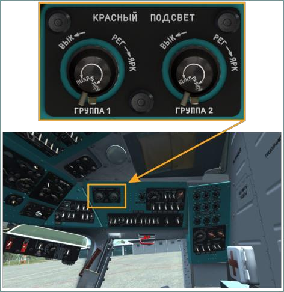

Включение красного подсвета на центральном пульте, электрощитке
электропульта, правой боковой панели, средней панели электропульта, панелях
Р-828, УВ-26, Ядро-1М и панели красного подсвета в проёме двери
осуществляется реостатами КРАСНЫЙ ПОДСВЕТ – ГРУППА 1 и КРАСНЫЙ
ПОДСВЕТ – ГРУППА 2, установленными на панели в проёме двери кабины
экипажа справа.

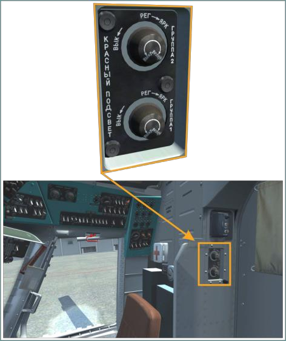

Включение красного подсвета 5,5V (система "Подсвет 5,5V" была предназначена
для приборов и оборудования, установленного на Ми-8МТ во время
модернизации из Ми-8т) производится выключателем ПОДСВЕТ 5,5В,
установленным на правом электрощитке,

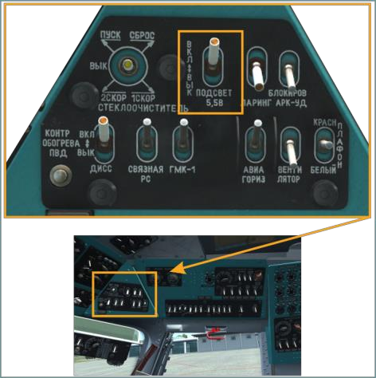

а регулировка яркости – регулировочным трансформатором ТР-100,
установленным на правой этажерке (за спиной второго пилота).

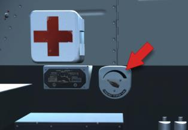

Приборы, подсветка которых осуществляется системой
"Подсвет 5,5В", показаны на Рис. 7.38:

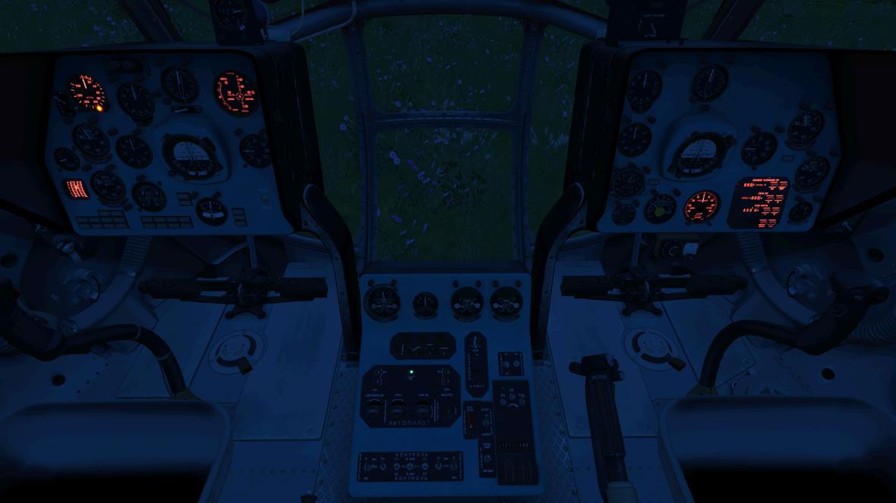

Цепи питания красного подсвета 5,5V подключены к генераторной шине
переменного тока 115В. По умолчанию в игре яркость свечения подсвета
выведена на максимум при запуске ночной миссии с уже запущенным
вертолетом.

#### Освещение грузовых и технических отсеков

Функция в игре не реализована.

#### Система внутривертолётной световой сигнализации

Контроль за состоянием и работой систем и агрегатов вертолёта, кроме
соответствующих контрольно-измерительных приборов, осуществляется с
помощью систем внутривертолётной световой сигнализации.

Сигнализация обеспечивается световыми табло со светофильтрами красного,
жёлтого и зелёного цвета, размещёнными на приборных досках, центральном
пульте и электропульте. Для некоторых групп табло предусмотрены особые
режимы их работы (МИГАЛКА, ДЕНЬ-НОЧЬ), а также проверка исправности
ламп.

СИСТЕМА "МИГАЛКА" предназначена для быстрого восприятия глазом загорания
светового табло, сигнализирующего об отказе какой-либо системы, агрегата и о
сложившейся на вертолёте аварийной обстановке (пожар, обледенение,
нерасчетная вибрация двигателей, работа дублирующей гидросистемы, остаток
топлива 270л). Принцип работы системы "МИГАЛКА" основан на работе ламп в
импульсном режиме. Включение режима мигания осуществляется
выключателем "МИГАЛКА" на правой боковой панели электропульта
  [[RCtrl]] + [[-]].

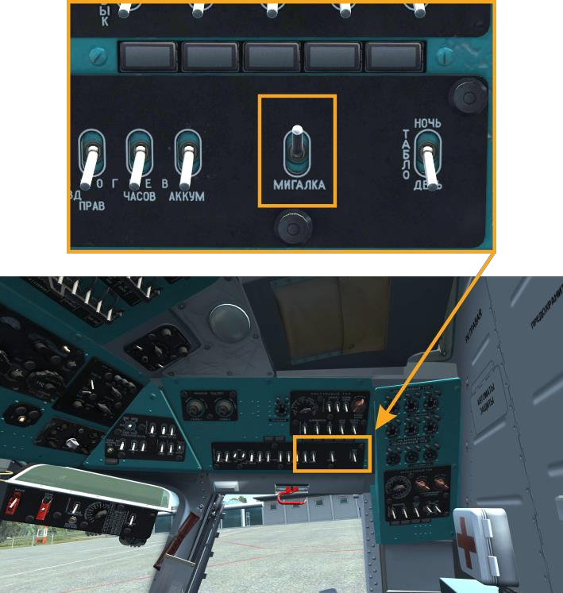

СИСТЕМА "ДЕНЬ-НОЧЬ" предназначена для изменения яркости свечения
отдельных табло. Уменьшение яркости свечения табло достигается установкой
переключателя "ТАБЛО ДЕНЬ-НОЧЬ", расположенного на правой боковой
панели электропульта, в положение "НОЧЬ"
(вверх).

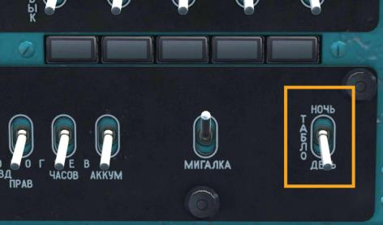

Табло, подключенные к системе "ДЕНЬ-НОЧЬ" будут гореть в половину
накала.

СИСТЕМА ПРОВЕРКИ ЛАМП СИГНАЛИЗАЦИИ

Для включения системы проверки ламп сигнализации необходимо включить:

- АЗС "ПРОВЕРКА ЛАМП МИГАЛКА",
    
    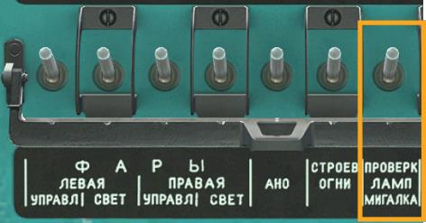

- переключатель "ПРОВЕРКА СИГНАЛ ЛАМП – МИГАЛКИ",
расположенным на центральном пульте, установить в положение
 "СИГНАЛ ЛАМП" (вверх)
  [[LAlt]] +  [[LCtrl]] +  [[B]].

    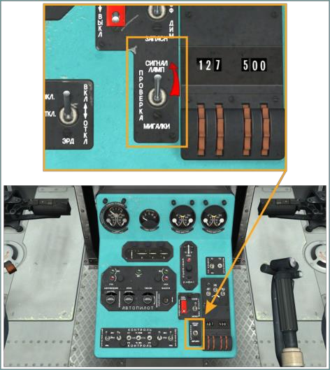

При этом будут гореть все табло, кроме тех, которые подключены к системе
"МИГАЛКА" и тех, которые включаются при подключении оборудования
(например, АЭРОДРОМНОЕ ПИТАНИЕ). При установке переключателя
"ПРОВЕРКА СИГНАЛ ЛАМП – (нейтраль) – МИГАЛКИ" в положение "ПРОВЕРКА
МИГАЛКИ" (вниз)
 [[LAlt]] +  [[LCtrl]] +  [[V]], табло, подключенные к системе "МИГАЛКА" будут
работать в импульсном режиме.

Табло, подключенные к системе МИГАЛКА показаны на Рис. 7.39:

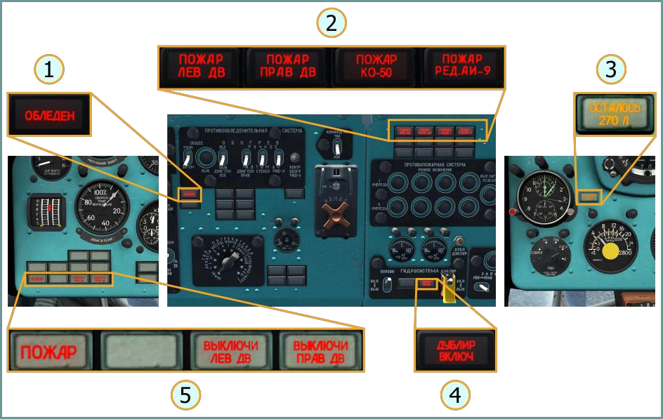

1. ОБЛЕДЕНЕНИЕ (началось/продолжается обледенение) 
2. Сигнализация пожара в отсеках (слева направо):

	- ПОЖАР ЛЕВ ДВ (в отсеке левого двигателя)
	- ПОЖАР ПРАВ ДВ (в отсекеправого двигателя)
	- ПОЖАР КО-50 (в отсеке обогревателя)
	- ПОЖАР РЕД АИ-9 (в отсеке редуктора, вспомогательной силовой установки и расходного бака) 

3. ОСТАЛОСЬ 270л (аварийный остаток топлива) 
4. ДУБЛИР ВКЛЮЧЕНА (сигнализация работы дублирующей гидросистемы, что указывает на отказ основной гидросистемы) 
5. Общая сигнализация пожара ПОЖАР, далее – ВЫКЛЮЧИ ЛЕВ ДВ, ВЫКЛЮЧИ ПРАВ ДВ (сигнализация наличия разрушающей вибрации двигателя)

Цепи проверки ламп, "МИГАЛКА" и системы "ДЕНЬ-НОЧЬ" подключены к
аккумуляторной шине через АЗС ПРОВЕРКА ЛАМП МИГАЛКА, который
установлен на правой панели АЗС.

## Регистрация параметров полёта и запись переговоров

### Система автоматической регистрации параметров полёта САРПП-12ДМ

Система не реализована, за исключением табло и анимации выключателя.
САРПП-12ДМ предназначена для записи световым лучом на фотопленке
двенадцати параметров полёта вертолета в нормальных и аварийных условиях
и сохранения записанной информации в случае механического удара.

Система регистрирует шесть непрерывных параметров (барометрическая
высота, приборная скорость, шаг НВ, обороты НВ, тангаж, крен) и девять
разовых команд (аварийный остаток топлива, отказ топливного насоса, пожар,
отказ основной и дублирующей гидросистемы, падение давления масла в
главном редукторе, включение ПОС правого двигателя и ПЗУ, ручное
включение ПОС левого двигателя и ПЗУ, включение ЧР).

Выключатель САРПП-12ДМ "РУЧН – АВТОМ" и зелёное табло "САРПП РАБОТАЕТ"
расположены на левой боковой панели электоропульта.

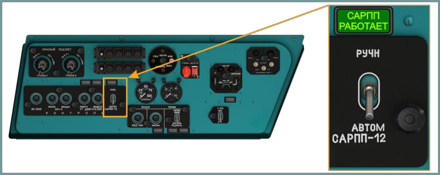

САРПП-12ДМ включается в работу при установке переключателя в положение
"РУЧН", а при установке переключателя в положение "АВТ" включается только
при наличии давления в основной или дублирующей гидросистеме или при
срабатывании одного из концевых выключателей на амортстойках главных ног
шасси после отрыва вертолета от земли. При установке выключателя в
положение РУЧН. система включается в работу независимо от давления в
гидросистеме.

Накопитель информации в бронеконтейнере и согласующее устройство
установлены в хвостовой балке.

Питание системы САРПП-12ДМ осуществляется постоянным током от бортовой
сети напряжением 27-29В, а в аварийном режиме от аккумуляторных батарей
через предохранитель ПМ-10 САРПП, расположенный на щитке
предохранителей.

Время непрерывной работы системы САРПП-12 составляет не менее 5,5 ч.

В комплект системы входят:

- накопитель информации светолучевой К12-51Д1М;
- согласующее устройство УсС-4-1M;
- датчики.

Для включения системы перед запуском установить в положение "АВТОМ." или
РУЧН  [[LAlt]] +  [[LCtrl]] +  [[LShift]] +  [[6]]

### Магнитофон бортовой П-503Б

Не реализован, за исключением анимации выключателя.

Магнитофон предназначен для записи речевой информации командира
вертолета по внешней и внутренней системам связи, а также информации,
поступающей к командиру вертолета.

Управление магнитофоном осуществляется с пульта управления командиром
вертолета на левой боковой панели электропульта.

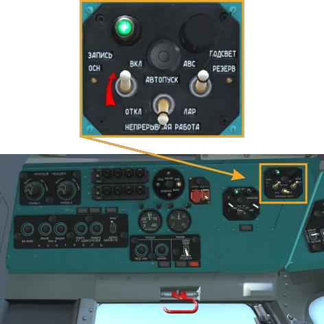

Питание магнитофона осуществляется постоянным током от бортовой сети
напряжением 27 В и в аварийном режиме – от аккумуляторных батарей.

## Система внешней подвески

### Общее описание

Устройство для внешней подвески грузов предназначено для транспортировки
крупногабаритных грузов под фюзеляжем вертолета и последующей отцепки
груза на месте назначения, а также для выполнения строительно-монтажных
работ, Рис. 7.41.

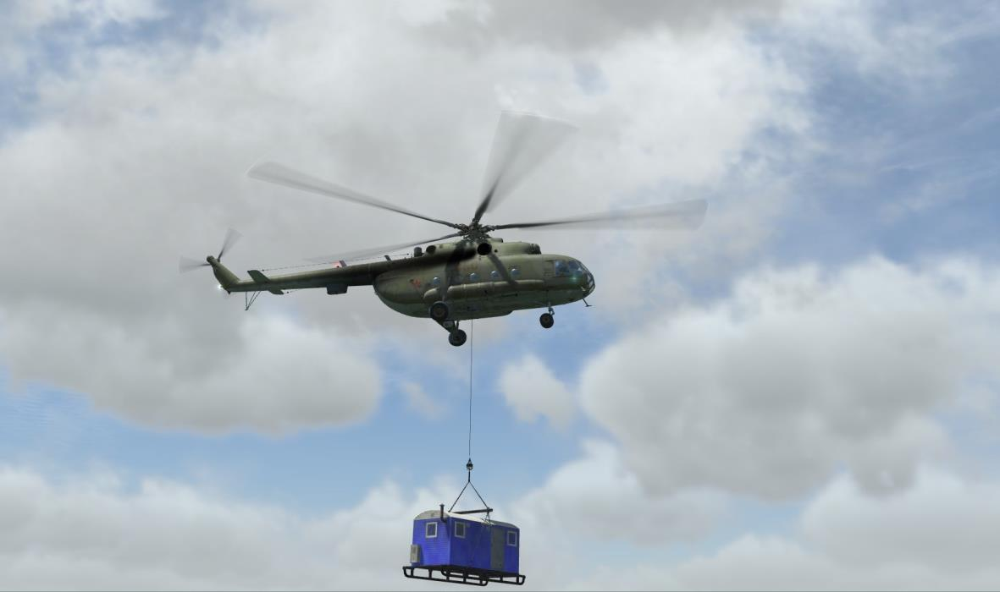

На вертолете применена тросовая подвеска грузоподъемностью до 4000 кг с
длиной грузовых строп 4м. Отцепка груза осуществляется дистанционным
открытием электрического замка.

В комплект подвески входят:

- четыре силовых стропа;
- замок ДГ-64М;
- узлы крепления силовых строп;
- ограждение подвески;
- трос подтягивания грузовых строп (не моделируется);
- удлинительные канаты (тросы) для возможности осуществлять
подвеску груза на длины 1.7, 5, 10, 15, 20, 30, 40, 50 и 65 m (в игре
до 30);
- грузовые стропы (4х4м) или "паук" (в игре возможна произвольная
длина);
- детали сборки (крюк с вертлюгом, скоба грузовых строп), отдельно не
моделируются.

Основными силовыми элементами тросовой наружной подвески являются
четыре силовых стропа диаметром 16 мм. На верхних концах строп имеются
узлы, которыми они крепятся к узлам, установленным на верхних балках
силовых шпангоутов № 7 и 10 центральной части фюзеляжа (под потолком
грузовой кабины как раз под главным редуктором). В нижней части все четыре
стропа соединены с узлом шарнирного крепления замка ДГ-64М и далее к замку
цепляется удлинительный канат (сборный трос), который опускается в люк для
внешней подвески. Общая схема оборудования внешней подвески показана на
Рис. 7.42.

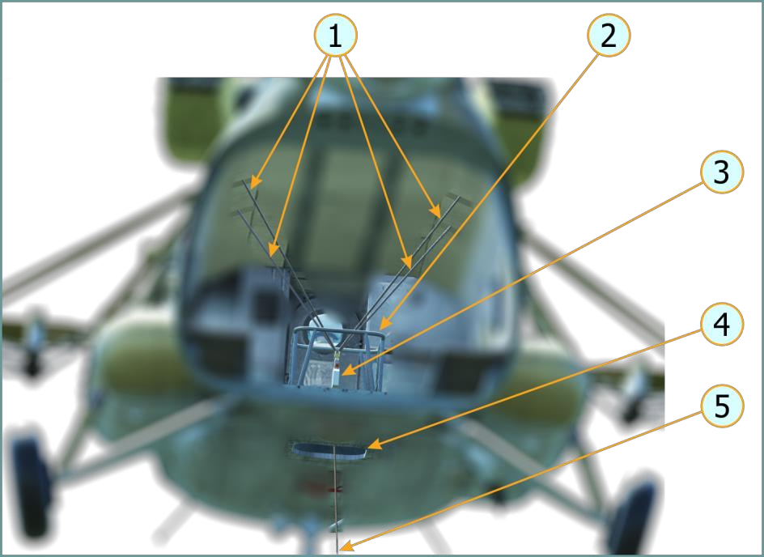

1. Четыре силовых стропа 
2. Ограждение подвески   
3. Замок ДГ-64М канатов
4. Люк внешней подвески
5. Трос из комплекта удлинительных

### Управление замком внешней подвески

Для внешней подвески реализовано электрическое управление замком ДГ-64М:

- напряжение питания 27-29V;
- минимальное напряжение для открытия замка 20V.

Управление замком заключается в выборе способа его открытия: либо
автоматического открытия (и отцепа груза) при касании земли (система
автоматического сброса), либо ручного открытия в полёте (сброса груза) или на
земле.

Для включения электроцепей управления открытием замка необходимо
включить АЗС "УПРАВЛЕНИЕ ОТКРЫТИЕМ ЗАМКА" "ОСНОВНОЕ", "ДУБЛИР" на
панели АЗС:

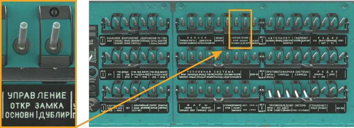

#### Автоматическое открытие

Система автоматического открытия замка активируется перед посадкой, когда
груз уже подвешен. Для этого необходимо включить выключатель ВНЕШНЯЯ
ПОДВЕСКА АВТОМ СБРОС, расположенный на левой боковой панели
электропульта:  [[RCtrl]] +  [[RShift]] +  [[K]].

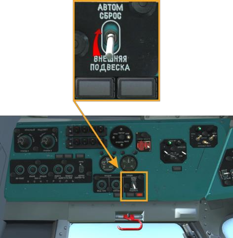

При касании грузом земли и уменьшении нагрузки на несущий рычаг замка до
значения менее 25 кг замок откроется, груз останется на земле. При открытии
замка загорается табло ЗАМОК ОТКРЫТ.

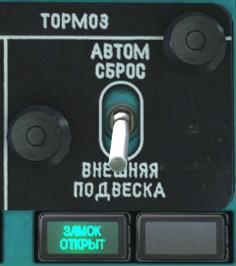

#### Ручное открытие

Открытие замка в полёте (сброс груза) может быть выполнено как тактически
(штатно), так и аварийно. Как правило, применяется при возникновении особых
случаев в полёте.

Для открытия замка с помощью электромагнитного спускового механизма
следует нажать на кнопку тактического или аварийного сброса груза. Кнопки
расположены на РОШ, Рис. 7.43.

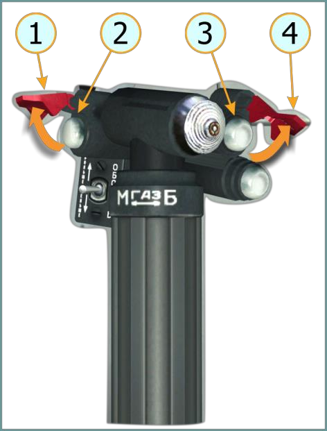

1. Предохранительный колпачек кнопки АВРАР СБРОС  [[RCtrl]] +  [[RShift]] +  [[RAlt]] +  [[R]] 
2. Кнопка аварийного сброса груза  [[RCtrl]] +  [[RShift]] +  [[RAlt]] +  [[P]] или  [[RCtrl]] +  [[RShift]] +  [[RAlt]] +  [[A]] (этот вариант работает только при открытом колпачке)
3. Кнопка тактического сброса груза  [[RCtrl]] +  [[RShift]] +  [[RAlt +L]] или  [[RCtrl]] +  [[RShift]] +  [[RAlt]] +  [[Q]] (этот вариант работает только при открытом колпачке)
4. Предохранительный колпачек кнопки ТАКТ СБРОС ГРУЗА  [[RCtrl]] +  [[RShift]] +  [[RAlt]] +  [[T]]

Для игрока выбор способа сброса груза в полёте (тактически или аварийно)
ничем не отличается, так как выполняется одно и то же конечное действие.
Различие состоит в электроцепи, по которой идет сигнал на открытие замка ДГ-
64М. В обоих случаях при открытии замка срабатывает микровыключатель,
загорается световое табло ЗАМОК ОТКРЫТ.

Закрывают замок вручную (в игре закрывается автоматически при условии
выбора груза через радиоменю и соблюдения условия висения над этим грузом
в течение заданного времени в пределах некоторой области пространства).

Действия игрока во время игры с внешней подвеской (выбор груза, его подцеп
и отцеп) [описаны здесь](13.specialtasks.md#выбор-груза).

## Автопилот АП-34Б

### Общее описание

Четырехканальный электрогидравлический автопилот АП-34Б предназначен для
автоматической стабилизации вертолета по крену, курсу, тангажу, высоте и
скорости полёта. Автопилот представляет собой устройство, воспринимающее
информацию об изменении угловых положений вертолета и изменение
барометрической высоты и приборной скорости вертолета и имеет 4
независимых канала, воздействующих на соответствующие органы управления:

- канал направления – на шаг рулевого винта;
- канал крена – на автомат перекоса в поперечном направлении;
- канал тангажа – на автомат перекоса в продольном направлении;
- канал высоты – на общий шаг несущего винта.

Сигнал изменения приборной скорости вертолета поступает в канал тангажа и
вызывает соответствующее изменение угла тангажа вертолета.

Четыре канала (направление, крен, тангаж, высота) автопилота обеспечивают:

- стабилизацию положения вертолета относительно трех осей
 (продольной, вертикальной и поперечной);
- стабилизацию высоты полёта вертолета в горизонтальном полёте и
при висении;
- стабилизацию приборной скорости вертолета.

Основные данные АП-34Б:

- Напряжение питания постоянным током +28,5 В
- Напряжение питания переменным током ~36 В 3х фазный ток, 400 Гц
- Время готовности к включению не более 2 минут
- Диапазон перемещения органа управления автопилотом 20% относительно полного хода органа управления
- Точность выдерживания в спокойной атмосфере:
    - в канале направления ±1°
    - в канале крена ±0,5°
    - в канале тангажа ±0,5°
    - высоты ±10м
    - скорости ±15 км/ч
- Высотность 10000 м
- Масса не более 25 кг

### Агрегаты автопилота

В комплект автопилота АП-34Б входят следующие агрегаты:

- пульт управления;

    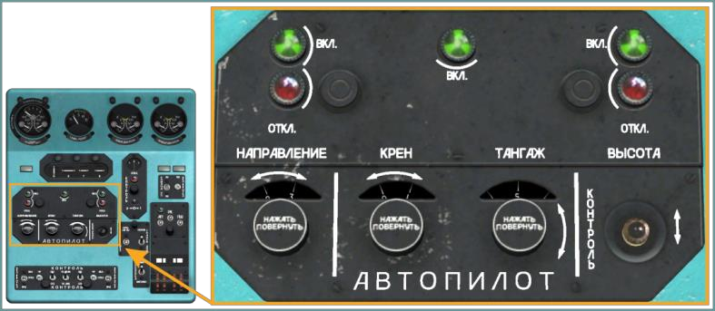

- агрегат управления – необходим для преобразования, суммирования
и усиления управляющих сигналов (в составе модели);
- датчики угловых скоростей направления, крена и тангажа (в составе
модели);
- блок усилителей (в составе модели);
- индикатор нулевой (индикатор нуля) ИН-4;

    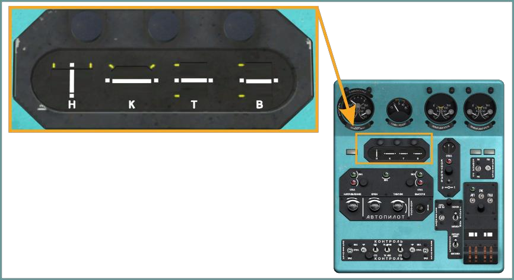

- три компенсационных датчика (в каждом канале в составе модели);
- корректор высоты КВ-11 (в составе модели).

Питание автопилота АП-34Б и механизмов системы управления постоянным
током напряжением 27 V осуществляется от аккумуляторной шины и шины ВУ
через автоматы защиты сети АВТОПИЛОТ-ОСНОВН., АВТОПИЛОТ-ФРИКЦ. и
АВТОПИЛОТ-ЭЛЕКТРОМУФТЫ. 

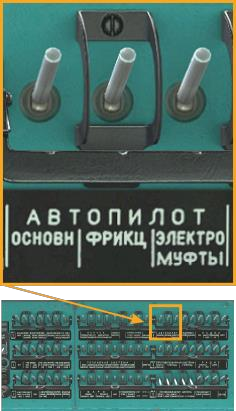

Все автоматы защиты сети
расположены на правой панели. Питание переменным трехфазным током
напряжением 36V и частотой 400 Нz осуществляется от генераторных шин
трехфазного переменного тока 36 V.

### Органы управления и индикации автопилота

#### Пульт управления

Управление режимами автопилота экипаж осуществляет с пульта управления,
который обеспечивает:

- обнуление сигналов углов и угловых скоростей перед включением
автопилота;
- поканальное включение и отключение автопилота (с
соответствующей сигнализацией);
- введение поправок в полёте при помощи ручек центрирования;
- проверку канала высоты с помощью переключателя "КОНТРОЛЬ".

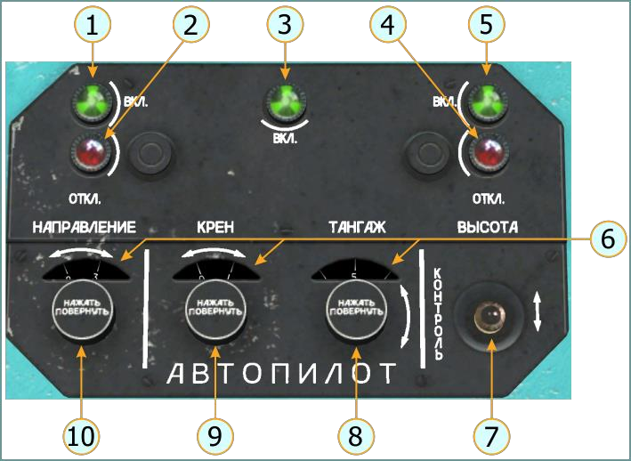

1. Кнопка-лампа включения канала направления 
2. Кнопка-лампа отключения канала направления 
3. Кнопка-лампа включения каналов крена и тангажа 
4. Кнопка-лампа отключения канала высоты 
5. Кнопка-лампа включения канала высоты 
6. Вращающиеся шкалы инидикации рассогласования сигналов между датчиками направления, крена и тангажа и положением органов управления (1 деление соответствует 1°) 
7. Переключатель КОНТРОЛЬ для проверки канала высоты 
8. Ручка центрирования канала тангажа 
9. Ручка центрирования канала крена 
10. Ручка центрирования канала направления

#### Индикатор нуля (ИН-4)

Индикатор нуля (ИН-4) предназначен для индикации положения штоков малых
цилиндров рулевых агрегатов. ИН-4 установлен на центральном пульте.

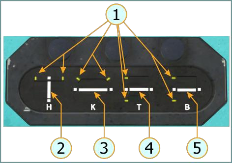

1. Метки максимального отклонения   
индикаторов                         
2. Индикатор канала направления
3. Индикатор канала крена
4. Индикатор канала тангажа
5. Индикатор канала высоты

Другими словами – индикаторы указывают положение центра выделенного
автопилоту диапазона управления относительно текущего положения педалей,
РППУ или РОШ, особенности см.ниже.

### Оборудование, взаимодействующее с автопилотом

- Курсовая система ГМК-1А – выдает сигналы курса в пульт управления
автопилота для автоматической стабилизации вертолета по
заданному курсу. Кроме того, курсовая система выдает сигнал в пульт
управления на перевод канала направления автопилота в режим
согласования при включении режимов задачи курса и контроля
курсовой системы. Используется автопилотом при включении канала
НАПРАВЛЕНИЕ.
- Авиагоризонт правого летчика АГБ-3К, являющийся датчиком углов
крена и тангажа автопилота. Используется автопилотом при
включении канала КРЕН-ТАНГАЖ.
- Корректор-задатчик приборной скорости КЗСП, предназначенный для
выдачи электрического сигнала, пропорционального отклонению
скорости от заданной. КЗСП воздействует на канал тангажа.
Используется при включении канала ВЫСОТА.
- Блок сигнала готовности БСГ, предназначенный для работы
совместно с корректором скорости КЗСП и выдачи сигнала
готовности, свидетельствующего об исправности отрабатывающей
системы корректора КЗСП.
- Комбинированные агрегаты управления КАУ-30Б и рулевой агрегат
РА-60Б – являются силовыми исполнительными элементами как
системы управления вертолетом, так и автопилота. Непосредственно
воздействуют на органы управления (тарелку автомата перекоса НВ,
качалку управления шагом РВ). Четыре рулевых агрегата
установлены в продольном, поперечном управлении, в управлении
общим шагом несущего винта и в ножном управлении. В рулевые
агрегаты вмонтированы датчики обратной связи, с помощью которых
осуществляется обратная связь в автопилоте, см. ниже.
- Электромагнитные краны (ГА-192), которые по сигналам с пульта
управления автопилотом переключают рулевые агрегаты на работу в
автопилотном режиме (особенности описаны ниже).
- Две кнопки ВЫКЛ. АП отключения автопилота, установленные на
ручках управления вертолетом  [[LWin]] +  [[LShift]] +  [[A]].
- Две кнопки отключения канала высоты, установленные на ручках
шаг-газа (нажатие их в игре моделируется при изменении положения
джойстика РОШ или кнопок управления ОШ –
  [[Num – ]] или  [[Num +]] ).
- Четыре малогабаритных выключателя на педалях ножного
управления. При установке летчиком ног на педали малогабаритные
выключатели срабатывают и канал направления переводится в режим
согласования.
- Малогабаритный выключатель, установленный на качалке механизма
подвижного упора системы СПУУ-52 и предназначенный для перевода
канала направления автопилота в режим согласования при подходе
тяги ножного управления к упору, положение которого определяется
системой СПУУ-52 (т.е. канал направления попросту отключается при
достижении упора).
- Реле времени с задержкой 0,5 s, включенное в схему перевода канала
направления в режим согласования и предназначенное для
исключения автоколебаний ножного управления при переключении
автопилота в режим согласования.
- Распределительная коробка автопилота (не моделируется).

Так как автопилот АП-34Б работает совместно с электрогидравлическими
агрегатами управления КАУ-30Б и РА-60А, то на органы управления вертолетом
могут одновременно воздействовать как летчик, при помощи обычных рычагов
управления, так и автопилот (так называемый режим комбинированного
управления, когда летчик в любой момент времени может вмешаться в
управление вертолетом при включенном автопилоте). При этом автопилот
воздействует на малый цилиндр рулевого агрегата, который является
раздвижной тягой, включенной в систему управления. Результирующее
перемещение органов управления является суммой перемещений от
воздействия летчика и автопилота. Перемещения органов управления от
сигналов автопилота не передаются на РППУ и РОШ.

Кроме того, автопилот может работать в режиме автоматической стабилизации
вертолета (при включении всех четырех каналов). Подробности работы
гидроагрегатов при автопилотном и ручном управлении описаны ниже.

Воздействие корректора-задатчика приборной скорости (КЗСП) на автопилот
происходит по каналу тангажа.

Безопасность полёта в случае отказа автопилота обеспечивается 20%
ограничением перемещения органов управления от автопилота по всем
четырем каналам, а также возможностью вмешательства летчика в управление
параллельно с автопилотом в любом режиме использования автопилота.

### Использование автопилота по этапам полёта

Пилотирование вертолета с включенным автопилотом является основным видом
полётов, и все полёты от взлета до посадки выполняются, как правило, с
включенным каналом "крена-тангаж", каналы "направление" и "высота"
используются значительно реже.

Включение автопилота выполняется перед взлетом нажатием на кнопки-
лампочки соответствующих каналов.

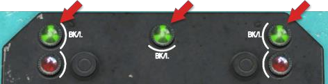

Канал
высоты нельзя отдельно включить без включения канала "КРЕН-ТАНГАЖ".

При взлете по-вертолетному необходимо включать каналы "КРЕН-ТАНГАЖ"
(в практике эксплуатации Ми-8 в РФ канал "НАПРАВЛЕНИЕ" перед взлетом, как
правило, не включают).

При взлете по-самолётному включать только каналы "КРЕН-ТАНГАЖ".
Включение контролировать по загоранию зеленых лампочек включенных
каналов.

На висении автопилот стабилизирует вертолет по углам крена и тангажа, а
при освобожденных педалях (если канал "НАПРАВЛЕНИЕ" включен) – и по
курсу. Работа автопилота на висении проверяется по индикаторам на пульте
автопилота. Нормальная работа характеризуется колебаниями планок "К", "Т",
"Н" индикатора около нейтрального положения.

На установившихся режимах горизонтального полёта, набора высоты
или снижения с полностью освобожденным управлением вертолет сохраняет
свое пространственное положение, медленно уходя с заданной скорости, т.к.
автопилот стабилизирует не скорость полёта (до V = 150 км/ч), а угол тангажа.

Управление вертолетом с помощью автопилота без перемещения
органов управления

Для ввода поправки в курс полёта до ±5° в прямолинейном горизонтальном
полёте при включенном автопилоте необходимо вращать ручку центровки
(центрирования) на пульте управления вправо или влево.

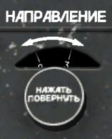

Полный
оборот соответствует изменению курса на 10°. На шкале нанесено 10 делений,
цена одного деления один градус. Аналогично можно управлять тангажом и
креном.

Канал высоты можно включать после балансировки вертолета в режиме
горизонтального полёта на высоте не ниже 50 м. Контроль работы канала
производится по колебаниям стрелки индикатора, по изменению величины
общего шага несущего винта по указателю УП-21-15 и вертикальному
перемещению вертолета при парировании каналом высоты вертикальных
возмущений.

Заход на посадку, торможение и выполнение посадки следует осуществлять
обычным способом с включенным автопилотом по каналам "КРЕН" и "ТАНГАЖ".
После приземления выключить автопилот нажатием на кнопку "ВЫКЛ. АП",
расположенной на обеих ручках управления.

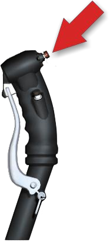

### Пояснения особенностей работы АП-34Б, игры с автопилотом и клавиатурные команды управления

#### Совместная работа гидроусилителей и автопилота ап -34Б при автопилотном и ручном управлении

При автоматической стабилизации вертолета исполнительные штоки комбинированных
гидроусилителей КАУ-30Б могут перемещаться в пределах 20% полного их хода, при этом ручки
управления остаются неподвижными, зафиксированными в заданном положении. Ручки
управления фиксируются пружинными механизмами загрузки. Ручки шаг-газа стопорятся
фрикционным механизмом.

Ограничение 20% (обеспечивается конструкцией рулевых агрегатов) полного перемещения
органов управления необходимо для обеспечения безопасности полёта в случае отказа
автопилота, т.к. большинство возможных отказов автопилота сопровождается появлением
одностороннего сигнала на выходе и быстрым отклонением органов управления.

Вместе с тем такой ограниченный диапазон работы органов управления от сигналов автопилота
достаточен для парирования реальных возмущений, действующих на вертолет, и стабилизации
угловых положений вертолета.

Летчик может в любой момент вмешаться в управление вертолетом при включенном
автопилоте. Для этого на пульте управления предусмотрены ручки центровки (центрирования)
для каналов тангажа, крена и направления, полный оборот которых соответствует 10° поворота
вертолета. На ручке нанесены десять делений, каждое соответствует одному градусу.

Поворачивая соответствующую ручку центровки по часовой стрелке или против часовой
стрелки, летчик тем самым вызывает доворот вертолета. При вмешательстве летчика в
управление по крену и тангажу с помощью ручки управления, для сохранения автопилотного
диапазона управления, необходимо исключить воздействие на гидроусилители крена и тангажа
сигналов от датчиков угла и угловой скорости. Для этой цели установлены компенсационные
датчики, которые кинематически связаны с продольным и поперечным управлением и выдают
сигналы, равные по величине и противоположные по знаку сигналам, поступающим от
авиагоризонта. Другими словами – при перемещении РППУ происходит постоянное
"обновление" опорного значения крена и тангажа, которое автопилот использует как значение,
которое необходимо поддерживать.

Таким образом, летчик управляет вертолетом по крену и тангажу, не выключая автопилот,
который стремится сохранить заданное летчиком положение вертолета. Для того, чтобы летчик
мог управлять вертолетом по курсу при включенном автопилоте, на педалях ножного
управления смонтированы гашетки и микровыключатели, при нажатии на которые происходит
перевод канала направления в режим согласования. После окончания маневра и снятия ног с
гашеток канал направления автоматически включается.

#### Особенности игры с использованием игровых педалей и включенным каналом "направление"

Для путевого управления в Ми-8МТВ2 используется рулевой агрегат РА-60А. В
отличие от КАУ-30Б он имеет механизм перегонки, который позволяет
автопилоту перемещать педали в случае нехватки 20% запаса управления для
поддержания направления.

Если, к примеру, канал "НАПРАВЛЕНИЕ" включен, а игрок при вертикальном
отрыве вертолета не будет парировать игровыми педалями увеличение
реактивного момента НВ, то РА-60А после исчерпания 20% запаса начнет
перемещать правую педаль в модели вперед без действий со стороны игрока.

Педали игрока при этом останутся в прежнем положении. Для согласования
положений игровых педалей и педалей в модели необходимо:

- установить игровые педали нейтрально (при наличии пружин в
педалях – достаточно убрать ноги с игровых педалей);
- выполнить сброс триммера  [[LCtrl]] +  [[T]].

После этой процедуры педали в модели установятся нейтрально и положения
будут совпадать.

!!! note "Примечание"
	Следует иметь ввиду, что такая процедура возвращает в нейтраль также и РППУ
    модели

#### Особенность использования механизма триммирования при включенном автопилоте

Как в реальной жизни, так и в нашей модели связь механизма триммера и автопилота в Ми-8
отлична от такой связи в Ка50. В Ми-8 нажатие и удержание кнопки триммер не переводит АП-
34Б в режим согласования, как это сделано в Ка50. Т.е. триммер как объект никак не связан с
автопилотом.

Автопилот управляет по каналу крена (тангажа) в пределах 20% запаса хода РППУ по этому
каналу. Достижение индикаторами на ИН-4 крайних положений (Рис. 7.45, 1) говорит о том, что
гидроусилители крена или тангажа (точнее малые цилиндры рулевого агрегата) достигли
предела 20% запаса управления, "отпущенного" на автоматическую стабилизацию углов крена
или тангажа. Это проявляется как увеличение резкости реакции вертолета на небольшое
перемещение РППУ в сторону предела ограничения и взывает некоторые неудобства
пилотирования.

Величину удаления центра 20% зоны управления автопилота от текущего положения РППУ
можно оценить по положению указателей на ИН-4 (Рис. 7.46, 2). И если летчик триммером
перевел РППУ за пределы этой зоны (по индикации на ИН-4), то автопилот уже не может также
"комфортно" управлять стабилизацией крена (тангажа) как это было ранее. Естественно,
летчику тоже становится немного некомфортно, не смотря на убранные усилия с пружин
триммерного механизма. На практике это проявляется увеличением количества необходимых
мелких движений РППУ для поддержания крена или тангажа. Для облегчения комфортного
пилотирования необходимо центр 20% зоны управления автопилота приблизить туда, где
сейчас находится РППУ. Или другими словами – "указать" автопилоту новое положение за точку
отсчета. Для этого используют два способа:

1. Ручками центрирования на пульте АП-34Б. В реальной жизни обычно бортовой
техник вращением этих ручек устраняет рассогласование, устанавливая индикаторы крена и
тангажа по горизонтальным индексам. В это время летчик должен плавно перемещать РППУ в
новое положение (для сохранения режима полёта), т.е. как бы "отдаляя" РППУ от места, где
был ранее включен автопилот. А затем снова триммирует РППУ.
2. Отключением автопилота, корректировкой балансировки и повторным его включением.
Первый способ хорош тем, что позволяет плавно устранять рассогласованность, второй же
позволяет это сделать быстро и без помощи другого члена экипажа.
Для понимания описанных особенностей см. изложенное ниже.

#### Положение РППУ и индикаторов на ИН-4 (крен-тангаж) во время висения и в горизонтальном полёте

Ниже показаны положения РППУ в зависимости от момента включения
автопилота по крену-тангажу для режимов висения и ГП.

ВИСЕНИЕ

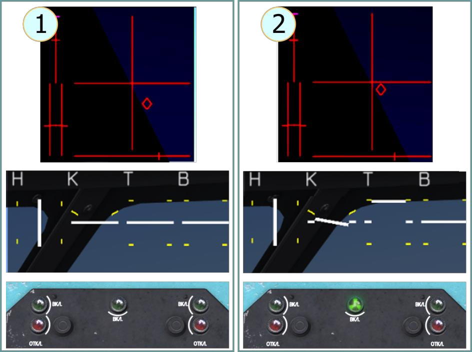

1. Висение. Канал "крен-тангаж" выключен
2. Висение. Канал "крен-тангаж" был включен
на земле, в нейтральном положении РППУ

ГОРИЗОНТАЛЬНЫЙ полёт

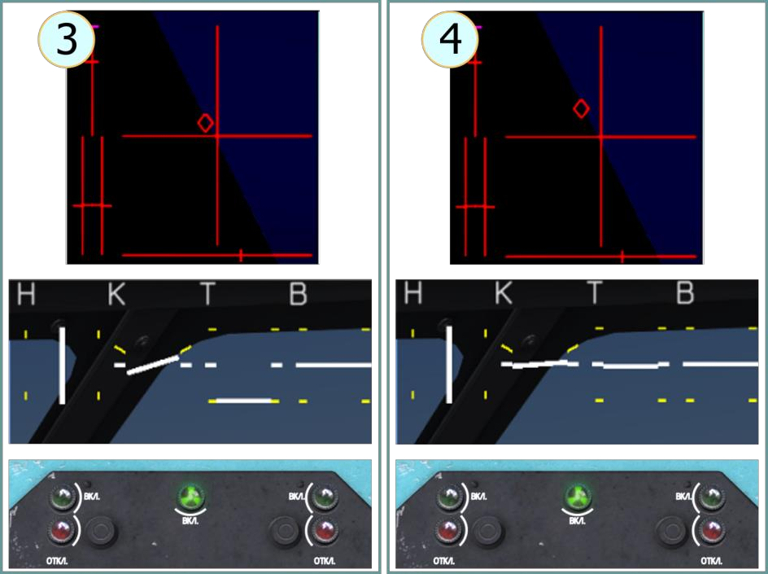

3. Скорость 240 км/ч. Канал "крен-тангаж" был включен во время висения 
4. Скорость 240 км/ч. Канал "крен-тангаж" был выключен и после балансировки вертолета на скорости 240 км/ч снова был включен

В игре реализована возможность автоподстройки "крена-тангажа" виртуальным
борттехником. Автоподстройка может быть выполнена по команде игрока
(клавиатурной командой)  [[RAlt]] +  [[A]] или автоматически, если в особых
настройках ЛА установлен флаг "Подстройка автопилота", Рис. 7.48.

При получении команды от игрока на подстройку автопилота ИИ бортовой
техник "докладывает" о выполнении своих действий.

#### Клавиатурные команды управления АП-34Б

Команда| Действие
-------|---------
 [[LWin]] +  [[LShift]] +  [[S]]  |Автопилот НАПРАВЛЕНИЕ. ручка центрир ВЛЕВО
 [[LWin]] +  [[LShift]] +  [[D]]  |Автопилот НАПРАВЛЕНИЕ. ручка центрир ВПРАВО
 [[LWin]] +  [[LCtrl]] +  [[A]]   |Автопилот НАПРАВЛЕНИЕ.ВЫКЛ
 [[LCtrl]] +  [[A]]            |Автопилот НАПРАВЛЕНИЕ.ВКЛ
 [[LCtrl]] +  [[LShift]] +  [[S]] |Автопилот ТАНГАЖ. Ручка центр. ВЛЕВО
 [[LCtrl]] +  [[LShift]] +  [[D]] |Автопилот ТАНГАЖ. Ручка центр. ВПРАВО
 [[LWin]] +  [[LCtrl]] +  [[S]]   |Автопилот КРЕН. Ручка центр. ВЛЕВО
 [[LWin]] +  [[LCtrl]] +  [[D]]   |Автопилот КРЕН. Ручка центр. ВПРАВО
 [[LWin]] +  [[A]]             |Автопилот КРЕН-ТАНГАЖ.ВКЛ
 [[LWin]] +  [[LShift]] +  [[A]]  |Автопилот ВЫКЛ ВСЕ каналы

## Экранно-выхлопное устройство (ЭВУ)

Установка ЭВУ обеспечивает уменьшение сигнатуры ИК-излучения двигателей
примерно в два раза, что снижает дальность захвата ИК-ГСН ЗРК и увеличивает
вероятность преодоления ПВО.

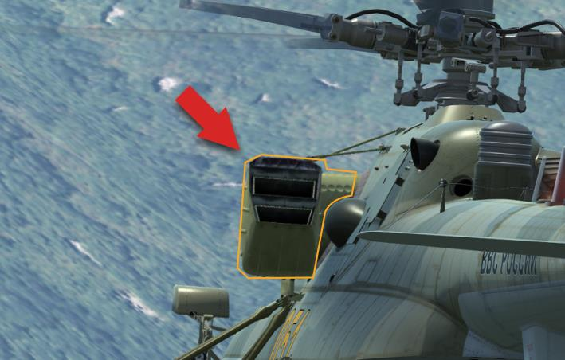

!!! note "Примечание"
    Установка ЭВУ требует уменьшить максимальный расчетный взлетный вес
    на 300кг. На графиках это эквивалентно повышению температуры наружного воздуха на +3°С.
    Кроме того, вес пустого вертолета увеличивается на 160кг.

{!docs/mi8/abbr.md!}
