# Подготовка и выполнение полетов

Процедура автоматического старта (подготовки вертолета из состояния "всё
выключено" в состояние "к полету готов") запускается комбинацией клавиш
[[LWIN]] + [[HOME]]. Автоматическое выключение [[LWIN]] + [[END]].

Ниже приведены два варианта действий: УПРОЩЁННЫЕ ПРОЦЕДУРЫ (минимально
необходимые действия) и ПОЛНЫЕ ПРОЦЕДУРЫ (полный набор действий). Кроме
того, цветом отмечены пункты, которые можно пропустить.

## Предполётная подготовка кабины

### Упрощённая процедура

Убедитесь, что все органы контроля в предстартовом положении:

1. Растормозить несущий винт – ВНИЗ [[RCtrl]] + [[R]]

    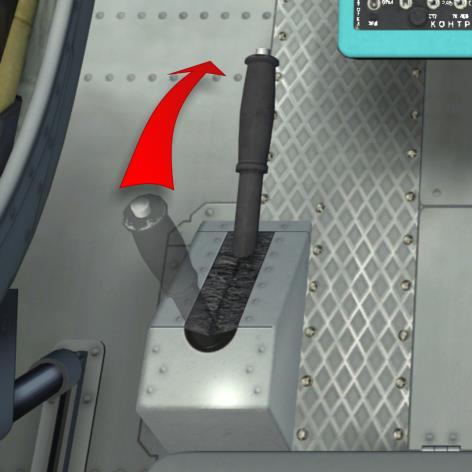

2. РППУ в центральном положении (включение индикатора [[LCtrl]] + [[Enter]])

    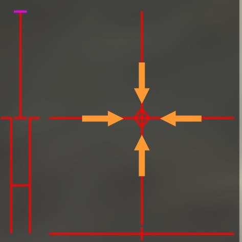

3. Убедиться, что рычаг шаг-газ находится на
нижнем упоре [[Num –]]

4. Рукоятка коррекции повернута полностью
влево (малый газ) [[PgDn]]

    

5. Рычаги раздельного управления
двигателями находятся в нейтральном
положении на защелках [[RCTRL]] + [[HOME]] / [[RCTRL]] + [[END]]

    

### Полная процедура

Перед полетом выполнить следующие операции:

- убедиться в работоспособности тормозной системы (после нажатия на
тормозную гашетку и достижения в тормозах давления 31–34 кгс/см2
не должно быть шума выходящего воздуха, а после растормаживания
не должно быть остаточного давления в тормозах) [[W]]
- установить стрелки барометрического высотомера на 0 и проверить
соответствие показания шкалы барометрического давления
фактическому давлению на аэродроме ±1.5 мм рт.ст. [[LShift]] + [[B]]
 / [[LCtrl]] + [[B]]
- включить бортовое электропитание
- проверить связь по СПУ с членами экипажа (для игры с
возможностью экипажа по сети)
- проверить работу стеклоочистителя
- проверить установку точного времени
- растормозить несущий винт [[RCtrl]] + [[R]] (вниз)
- убедиться, что рычаг шаг-газ находится на нижнем упоре [Num –] а
рукоятка коррекции повернута полностью влево [[PgDn]], рычаги
раздельного управления двигателями находятся в нейтральном
положении на защелках [[RCTRL]] + [[HOME]] / [[RCTRL]] + [[END]], ручка
управления находится в положении, близком к нейтральному, рычаги
управления кранами останова закрыты [[RCtrl]] + [[PageUp]] .. [[PageDown]]

## Порядок подготовки и контроля оборудования перед запуском ВСУ

Для запуска ВСУ необходимо подключение источников электропитания, а при
выполнении полной процедуры – проверить состояние и выполнить подготовку
некоторого оборудования и систем. ВСУ может быть запущена от
аккумуляторных батарей (A) или внешнего, аэродромного источника питания
(Б).

### Упрощённая процедура

#### A. Для включения аккумуляторов необходимо:

1. Правая боковая панель электропульта –
постоянный ток:
поставить выключатели "АККУМУЛ. I"
и "II" в положение "ВКЛ." (Вверх), проверить
напряжение на аккумуляторной шине,
поставив галетный переключатель в
положение "ШИНЫ АКК." (напряжение
должно быть не менее 24 В).

    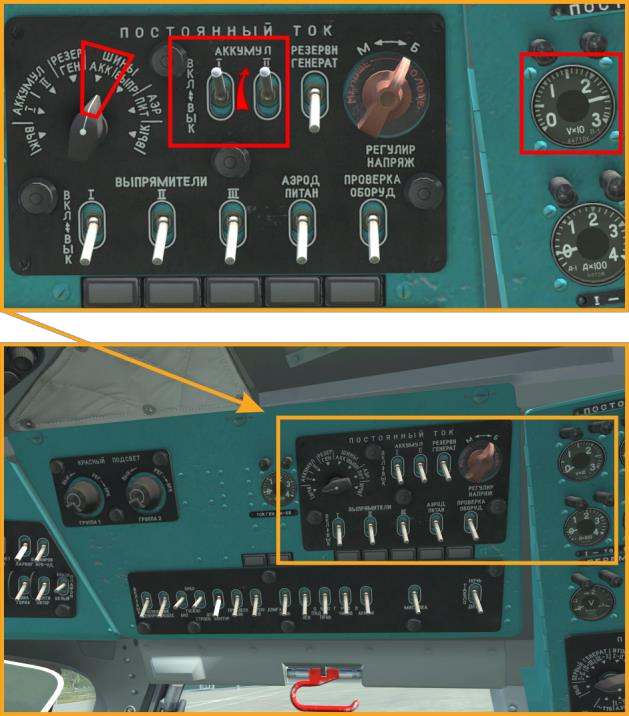

2. Электрощиток – переменный ток:
 ~115 (преобразователь 115V) –
поставить в положение "РУЧНОЕ"
(необходим для работы манометров и
указателей температуры газов для
двигателей ТВ3-117ВМ).

    !!! note "Примечание"
        При запуске от аккумуляторов в
        целях экономии батарей переключатель
        преобразователя 36V рекомендуется оставить
        в нейтральном положении до вступления в
        работу генераторов переменного тока

    

3. Левая и правая панели АЗС:
Включить все выключатели [[RCTRL]] + [[RSHIFT]] + [[4...9]] (1..3 для системы
вооружения)

    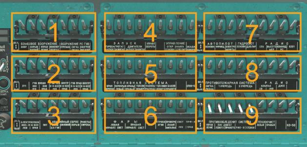

4. ПРОТИВООБЛЕДЕНЕНИЕ если не требуется
– оставить выключенными

    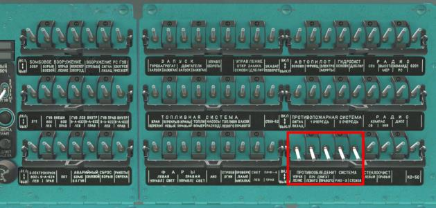

#### Б. Для включения аэродромного источника питания необходимо:

5. Подключить аэродромное питание в меню радиопереговоров: [[\]], [[F8]],
[[F2]], [[F1]]

6. При работе от аэродромного источника
питания постоянного тока после загорания
табло "АЭР. ПИТ. ВКЛЮЧЕНО" проверить
напряжение аэродромного источника
питания, поставив галетный переключатель в
положение "АЭРОДРОМ. ПИТАН."
(напряжение должно быть 27–29 В).

    

7. Выполнить все предписания раздела А

### Полная процедура

При выполнении полной процедуры подготовки необходимо подключить
источники электропитания и продолжить расширенный контроль и подготовку
оборудования к запуску.

#### Подключение источников электропитания

A. Для включения и проверки аккумуляторов необходимо:

- поставить выключатели "АККУМУЛ. I" и "II" в положение "ВКЛ."
 [[LCtrl]] + [[LShift]] + [[1..2]];
- проверить напряжение на аккумуляторной шине, поставив галетный
переключатель в положение "ШИНЫ АКК." (напряжение должно быть
не менее 24 В).
- проверить состояние бортовых аккумуляторных батарей, для чего:
    - выключатель "АЭРОДР. ПИТАН." установить в положение "ВЫКЛ."
     [[LCtrl]] + [[LShift]] + [[7]];
    - галетный переключатель на щитке ПОСТОЯННЫЙ ТОК установить в
    положение "АККУМУЛ. I" [[LCtrl]] + [[LShift]] + [[9..0]]
    - выключатель "АККУМУЛ. II" установить в положение "ВЫКЛ."
     [[LCtrl]] + [[LShift ]] + [[2]]
    - включить любой топливоподкачивающий насос и проверить
    напряжение по вольтметру (должно быть не менее 24 В) [[RShift]] +
     [[1]]
    - установить галетный переключатель в положение "АККУМУЛ. II"
     [[LCtrl]] + [[LShift]] + [[9..0]]
    - установить выключатель "АККУМУЛ. II" в положение "ВКЛ." [[LCtrl]]
 + [[LShift ]] + [[2]] а выключатель "АККУМУЛ.I" в положение "ВЫКЛ."
    - проверить напряжение по вольтметру (должно
быть не менее 24 В). [[LCtrl]] + [[LShift ]] + [[1]]
    - выключить топливоподкачивающий насос [[RShift]] + [[1]];
    - установить выключатель "АККУМУЛ. I" в положение "ВКЛ." [[LCtrl]]
     + [[LShift]] + [[1..2]];
    - установить галетный переключатель в положение "ШИНЫ АКК."
     [[LCtrl]] + [[LShift]] + [[9..0]].

Б. Подключение аэродромного источника питания и проверка источников тока.

После включения аэродромного источника питания необходимо:

- при работе от аэродромного источника питания постоянного тока
после загорания табло "АЭР. ПИТ. ВКЛЮЧЕНО" проверить
напряжение аэродромного источника питания, поставив галетный
переключатель в положение "АЭР. ПИТ." ) [[LCtrl]] + [[LShift]] + [[7]]
 (напряжение должно быть 27–29 В)
- при работе от аэродромного источника питания переменного тока
после загорания табло "АЭР. ПИТ. ВКЛЮЧЕНО" проверить
напряжение аэродромного источника питания, поставив галетный
переключатель в положение "АЭРОДРОМ. ПИТАН." [[LAlt]] + [[LShift]] +
 [[`]] (напряжение должно быть 200–205 В). Выключатель "АЭРОДР.
ПИТАН." поставить в положение "ВКЛ.". Переключатели "ПО-500А ~
115" и "ПТ-200 ~ 36" поставить в положение "АВТОМАТ",
выключатели "ВЫПРЯМИТЕЛИ I, II, III" поставить в положение
 "ВКЛ.", проверить напряжение на шине ВУ, поставив галетный
переключатель в положение "ШИНЫ ВЫПР." (напряжение должно
быть 27–29 В). Поставить галетный переключатель на щитке
 "ПЕРЕМЕННЫЙ ТОК" в положение "115" (напряжение должно быть
115 В)
    - установить галетный переключатель на щитке ПЕРЕМЕННЫЙ ТОК
в положение "~115" (напряжение должно быть 115 В).
    - Выключатель "АЭРОДР. ПИТАН." поставить в положение "ВКЛ.".
Переключатель "ПО-500А ~ 115" поставить в положение
 "РУЧНОЕ".
    - Проверить напряжение преобразователя, поставив галетный
переключатель на щитке ПЕРЕМЕННЫЙ ТОК в положение "~115"
 (напряжение должно быть 115 В).

#### Продолжение подготовки и контроля оборудования и систем:

- Включить все АЗС необходимые для запуска ВСУ и двигателей
 (система запуска, система зажигания для ВСУ и двигателей,
противопожарная система, гидравлическая система, триммер, насосы
топливных баков, топливомер, противообледенительная система,
авиагоризонт, компас, автопилот, речевая система оповещения,
СППУ, система автоматической регистрации полёта, навигационные
огни) [[RCTRL]] + [[RSHIFT]] + [1... 9]
- убедитесь, что выключатели генератора переменного тока
установлены в положение "ВЫКЛЮЧЕНО" [[LAlt]] + [[LShift]] + [[1..2]]
- убедиться, что выключатель РИ-65 находится в положении ВЫКЛ.,
при этом горит табло ВКЛЮЧИ РИ-65;
- убедиться, что выключатель СПУУ-52 находится в положении ВЫКЛ.,
при этом горит кнопка-табло на центральном пульте борттехника;
- проверить заправку топлива по топливомеру, после проверки
переключатель поставить в положение "РАСХ." (необходимо занять
место второго пилота), [[RCtrl]] + [[RShift]] + [[V]] по часовой стрелке
 [[RCtrl]] + [[RShift]] + [[B]] против часовой стрелки;
- проверить исправность пиропатронов огнетушителей и систему
сигнализации о пожаре ССП-ФК согласно разделу Контроль системы
сигнализации и оповещения.
При подготовке к полёту ночью:
- фонарик [[LAlt]] + [[L]]
- включить красный подсвет приборов, пультов и панелей согласно
7.8.2
- включить аэронавигационные огни [[RCtrl]] + [[1]] (тускло), маяк МСЛ-3
 [[RCtrl]] + [[6]] и контурные огни (включение перед запуском
осуществляется для безопасности наземного персонала, для игры не
обязательно).

## Запуск ВСУ и двигателей ТВЗ-117ВМ

После проверки кабины и подключения питания, перед запуском ВСУ и
двигателей:

### Завершение подготовки к запуску ВСУ

1. Установить переключатель "КОНТРОЛЬ
ДАТЧИКОВ – ОГНЕТУШЕНИЕ" в положение
"ОГНЕТУШЕНИЕ"

    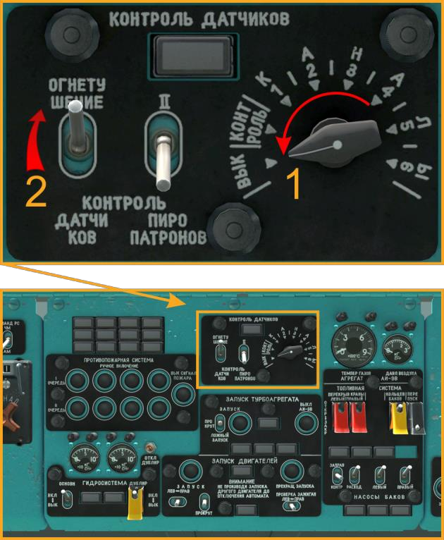

2. Включить подкачивающие насосы
расходного бака [[RShift]] + [[1]] и
перекачивающие насосы основных баков
[[RShift]] + [[2..3]]

    !!! note "Примечание"
        При запуске от аккумуляторов в
        целях экономии батарей перекачивающие
        насосы рекомендуется не включать до
        вступления в работу генератора ВСУ или
        выпрямителей

    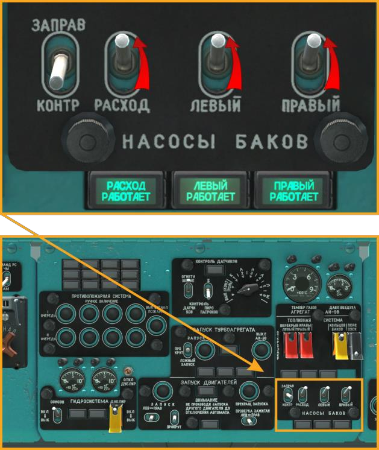

3. Открыть пожарные краны [[LAlt]] + [[5..6]]
затем [[RAlt]] + [[5..6]]

    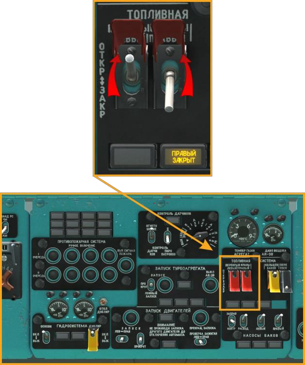

Запросите через радиоменю разрешение на запуск двигателей

### Запуск двигателя АИ-9В (ВСУ)

Перед запуском двигателей вертолета произвести запуск двигателя АИ-9В:

1. На панели ЗАПУСК ТУРБОАГРЕГАТА
поставить переключатель "ЗАПУСК–
ПРОКРУТ.– ЛОЖНЫЙ ЗАПУСК" в положение
"ЗАПУСК" [[RCtrl]] + [[E]] / [[RAlt]] + [[E]]

    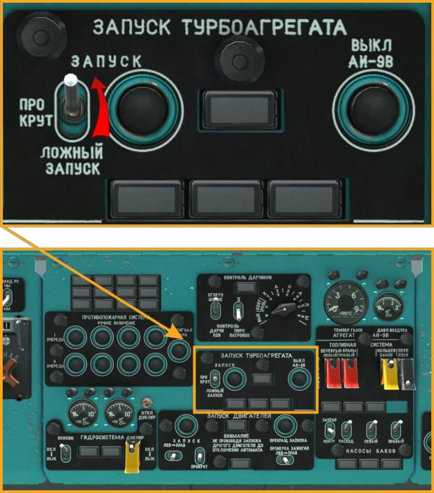

2. Нажать на 2–3 с кнопку "ЗАПУСК" [[RShift]] + [[Home]].
После чего должно загореться
табло "АВТОМАТ. ВКЛЮЧЕНА", двигатель АИ-
9В автоматически выходит на режим
холостого хода, при этом загорятся лампы-
табло "ДАВ. МАСЛ. НОРМА", "ОБОРОТЫ
НОРМА". Время выхода на режим холостого
хода не более 20 с.

    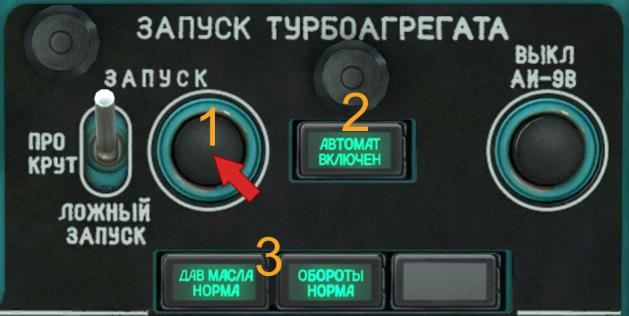

3. После выхода двигателя на режим холостого хода проверить параметры его работы:

    - температура газов за турбиной не
    более 720°С;
    - горят сигнальные табло "ДАВ. МАСЛА
    НОРМА", "ОБОРОТЫ НОРМА";
    - давление воздуха по манометру
     "ДАВЛЕНИЕ ВОЗДУХА АИ-9В" в
    пределах нормы (1.3-2.0 кг с/см2);

        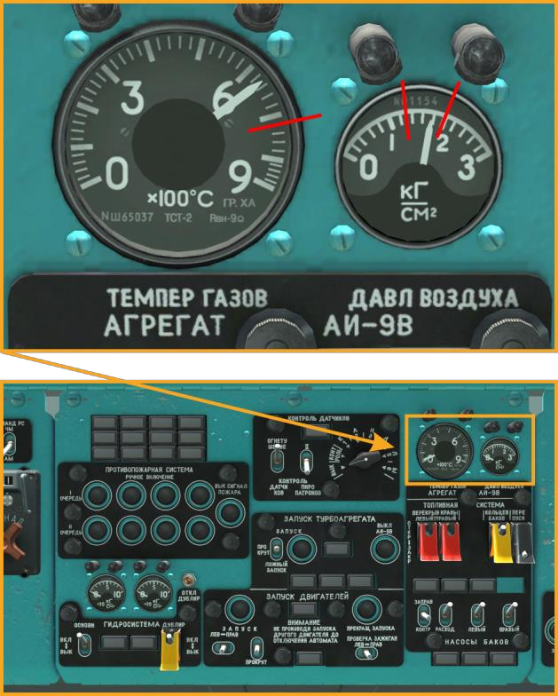

    - переключатель "РЕЗЕРВН. ГЕНЕРАТ."
    находится в положении "ВЫКЛ."
     [[LCtrl]] + [[LShift]] + [[3]]

        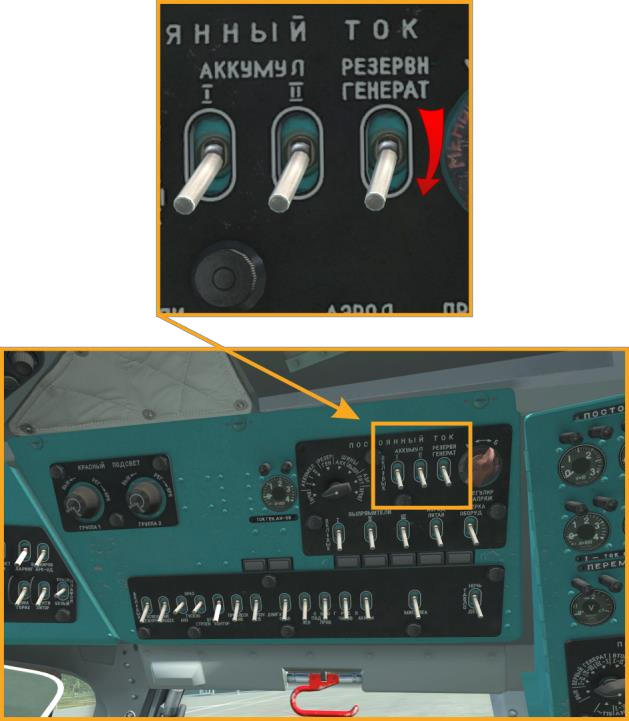

После прогрева в течение 1 мин двигатель АИ-9В готов к запуску двигателей
ТВЗ-117ВМ.

В случае самопроизвольного выключения двигателя АИ-9В для прекращения
подачи топлива в двигатель необходимо нажать на 2–3 с кнопку "ВЫКЛЮЧЕНИЕ
АИ-9В" [[End]].

Запуск двигателя АИ-9В можно прекратить нажатием на 2–3 с кнопки
"ВЫКЛЮЧЕНИЕ АИ-9В".

В случае неудавшегося запуска произвести холодную прокрутку двигателя АИ-
9В, для чего:

- поставить переключатель "ЗАПУСК – ПРОКРУТ. – ЛОЖНЫЙ ЗАПУСК" в
положение "ПРОКРУТ." [[RCtrl]] + [[E]] / [[RAlt]] + [[E]];
- нажать кнопку "ЗАПУСК" [[RShift]] + [[Home]] при этом должны
загореться лампы-табло "АВТОМАТ. ВКЛЮЧЕНА", "ДАВ. МАСЛА
НОРМА".

Разрешается производить три последовательных запуска двигателя АИ-9В с
перерывами между ними не менее 3 мин, после чего необходимы останов и
охлаждение его не менее 15 мин.

Время непрерывной работы двигателя АИ-9В в режиме "РЕЗЕРВН. ГЕНЕРАТ". не
более 30 мин, после чего его выключить для охлаждения в течение 15 мин. ВСУ
должна остывать 15 минут между закрытием и перезапуском. Перед
выключением ВСУ должна поработать на протяжение 1 минуты.

В случае необходимости разрешается производить пять последовательных
отборов воздуха для запуска двигателя ТВЗ-117ВМ продолжительностью не
более 45 с каждый с перерывами между отборами не менее 1 мин на холостом
ходу. Общее непрерывное время работы при этом должно быть не более 13
мин, после чего его выключить и охладить в течение не менее 15 мин.

В процессе запуска двигателя АИ-9В включать отбор воздуха на запуск
двигателей ТВЗ-117ВМ и подключать СТАРТЕР–ГЕНЕРАТОР на генераторный
режим запрещается (последствия в игре не моделируются).

### Запуск двигателей ТВЗ-117ВМ

Очередность запуска двигателей определяется в зависимости от направления
ветра. Первым запускается двигатель с подветренной стороны (для игры
значения не имеет).

1. Перед запуском поставить
переключатель рода работ в
положение "ЗАПУСК" [[LShift]] + [[E]] а
переключатель "ЛЕВ.–ПРАВ." – на
запускаемый двигатель (первым
запускается двигатель с подветренной
стороны) [[RAlt]] + [[RShift]] + [[E]] /
[[RCtrl]] + [[RShift]] + [[E]]

    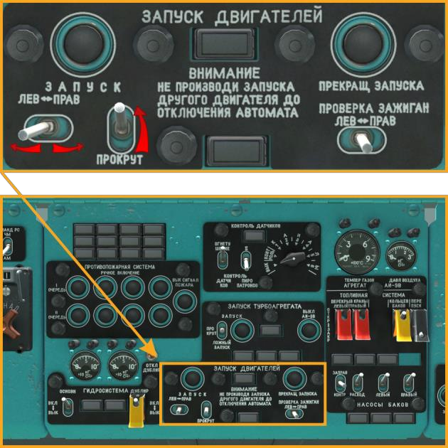

2. Нажать на 2–3 с пусковую кнопку
для начала запуска [[Home]].

    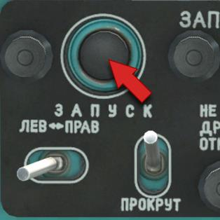

3. Перевести рычаг крана останова
запускаемого двигателя в положение
"ОТКРЫТО", когда обороты
запускаемого двигателя начнут расти
[[RCtrl]] + [[PgUp]] (left) / [[RCtrl]] +
[[PgDn]] (right)

    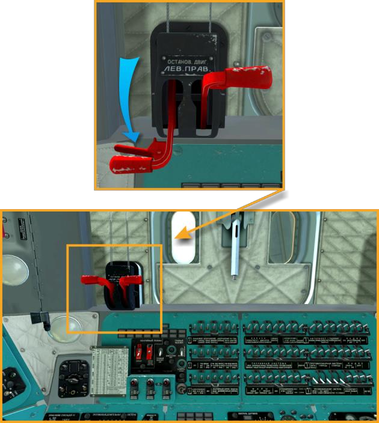

4. Двигатель должен выйти на обороты
малого газа за время не более 60 с. В
процессе запуска должны гореть табло
"АВТОМАТ. ВКЛЮЧЕНА" и "СТАРТЕР
РАБОТАЕТ".

    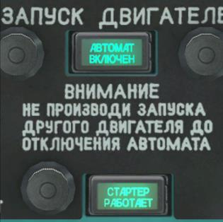

5. Если запуск двигателей выполняется
с использованием только бортовых
аккумуляторов, то после запуска
первого двигателя подключить
бортовые потребители к генератору
ВСУ, установив выключатели "РЕЗЕРВН.
ГЕНЕРАТ." [[LCtrl]] + [[LShift]] + [[3]] и
"ПРОВЕРКА ОБОРУД.") [[LCtrl]] +
[[LShift]] + [[8]] в положение "ВКЛ."
Перед запуском второго двигателя
отключать резервный генератор

    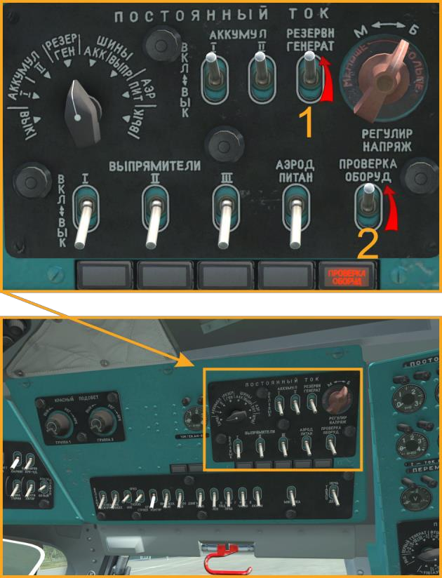

По окончании цикла работы панели табло должны погаснуть (табло "АВТОМАТ.
ВКЛЮЧЕНА" – через 30 с, табло "СТАРТЕР РАБОТАЕТ" – при достижении
оборотов турбокомпрессора 60-65%).

В процессе выхода двигателей на малый газ и раскрутки несущего винта при
появлении стуков от ударов центробежных ограничителей свеса лопастей по
упорам небольшими перемещениями ручки управления добиться такого
положения, чтобы стуки исчезли.

Установить переключатель "ЛЕВ. – ПРАВ." в положение запуска второго
двигателя [[RAlt]] + [[RShift]] + [[E]] / [[RCtrl]] + [[RShift]] + [[E]] и произвести его
запуск аналогичном порядке.

После запуска двух двигателей и выхода их на режим малого газа обороты
несущего винта должны быть в пределах 55–70%.

Сразу же после запуска двигателей :

6. Включить ПЗУ, переключатели "ПЗУ
ДВИГАТ. ЛЕВ. ПРАВ." на правой
боковой панели электропульта
установить в положение "ВКЛ."
[[LCtrl]] + [[D]] / [[RCtrl]] + [[D]]

    Проконтролировать загорание
сигнальных табло ЛЕВ. ПЗУ ВКЛЮЧЕН.,
ПРАВ. ПЗУ ВКЛЮЧЕН. (в течение 30
секунд).

    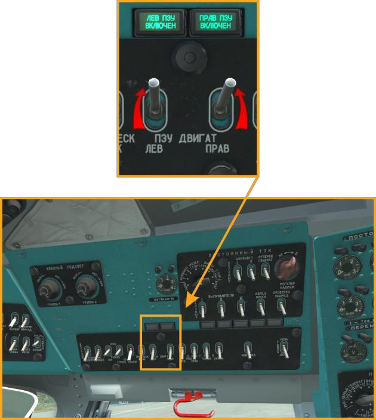

7. Если запуск двигателей выполняется
от аэродромного питания, то после
запуска двигателей ТВЗ-117ВМ
выключить двигатель АИ-9В,
предварительно охладив его на режиме
холостого хода в течение 0,5-1,0 мин
[[End]] . или см.п.8

    

8. Если запуск двигателей выполняется
с использованием только бортовых
аккумуляторов, то АИ-9В не выключать
до окончания прогрева двигателей и
выхода на обороты НВ выше 88%. Для
питания потребителей электроэнергией
на режиме малого газа и между
запуском первого и второго двигателей
включать генератор СТГ-3 (см.п.5),
установив выключатели "РЕЗЕРВН.
ГЕНЕРАТ." [[LCtrl]] + [[LShift]] + [[3]] и
"ПРОВЕРКА ОБОРУД.") [[LCtrl]] +
[[LShift]] + [[8]] в положение "ВКЛ."

    !!! note "Примечание"
        Если перед запуском ВСУ
        для экономии аккумуляторных батарей
        не были включены перекачивающие
        насосы, то теперь их необходимо
        включить

    

## Прогрев силовой установки, проверка работы органов управления и гидравлической системы

Прогрев силовой установки производить на режиме малого газа (установить
рычаг шаг-газ на нижний упор [Num – ], рукоятку коррекции – полностью влево
[[PgDn]], рычаги раздельного управления – в нейтральное положение на
защелку [[RCtrl]] + [[Home]]/[[RCtrl]] + [[End]].

В процессе прогрева силовой установки следить за показаниями приборов
контроля работы силовой установки. Время прогрева во всех случаях должно
быть не менее 1 мин.

Проверить работу органов управления и гидросистем на режиме малого газа в
следующем порядке:

- поочередно отклоняя ручку управления и педали, убедиться в
плавности отклонения органов управления;
- при движении органов управления давление в основной
гидросистеме изменяется в пределах от 45±3 до 65±82 кгс/см2,
давления в дублирующей системе около 5 кгс/см2.

Вывод двигателей с режима малого газа на режим правой коррекции
разрешается после достижения температуры масла на выходе из двигателя
+30°С и в главном редукторе не ниже –15°С.

Дополнительные проверки на малом газу (для углубленного изучения вертолета):

1. Проверить работу основной и дублирующей гидросистем;
2. Проверить ПОС двигателей на режиме малого газа;
3. Проверить работу ЭРД по каналам СТ1 и СТ2:
    - выключатели "ЭРД ЛЕВ. ПРАВ" – "вкл";
    - переключатели "КОНТРОЛЬ СТ-1 – РАБОТА – КОНТРОЛЬ СТ-2" в положение "СТ-1";
    - увеличить обороты НВ плавным поворотом рукоятки коррекции вправо (шаг НВ на
    нижнем упоре, при необходимости рычагами раздельного управления) до момента
    загорания желтых табло "ПРЕВ. Nст ЛЕВ. ДВ", "ПРЕВ. Nст ПРАВ. ДВ". Табло должны
    загореться при NНВ=91,5±2%;
    - плавно уменьшить NНВ на 5-7%, но не менее 88%, при этом вышеуказанные табло должны гореть;
    - установить переключатель в положение "СТ-2" и повторить проверку.

!!! warning "ВНИМАНИЕ"
    Переключатели с положения "СТ-1" в положение "СТ-2" переводить с задержкой в
    промежуточном положении. Быстрое переключение с положения "СТ-1" в положение "СТ-2"
    может привести к выключению двигателей (в игре не реализовано).

## Ввод правой коррекции, включение генераторов и выпрямительных устройств. Проверка авиационного оборудования

### А. Включение генераторов и выпрямительных устройств

1. Ввести правую коррекцию [[PgUp]]

    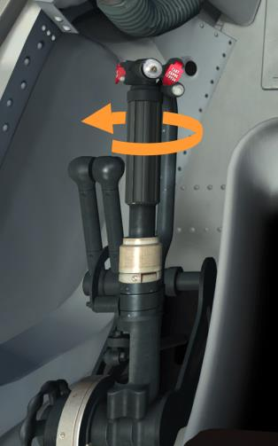

2. Включить выключатели генераторов
переменного тока [[LAlt]] + [[LShift]] +
[[1..2]] и выпрямительных устройств
[[LCtrl]] + [[LShift]] + [[4..6]]

    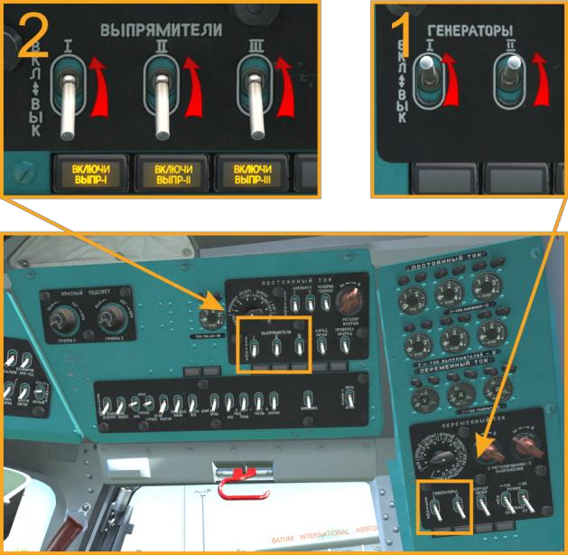

3. Отключить наземные источники
питания. После погасания табло "АЭР.
ПИТ. ВКЛЮЧЕНО" выключить
переключатель АЭРОДР. ПИТАН.
[[LCtrl]] + [[LShift]] + [[7]]

    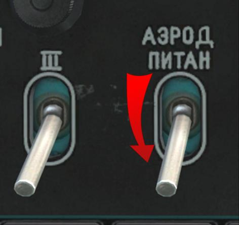

4. Если был включен генератор ВСУ, то
выполнить его отключение, установив
выключатели "РЕЗЕРВН. ГЕНЕРАТ."
[[LCtrl]] + [[LShift]] + [[3]] и "ПРОВЕРКА
ОБОРУД.") [[LCtrl]] + [[LShift]] + [[8]] в
положение "ВЫКЛ." и затем выключить
ВСУ.

    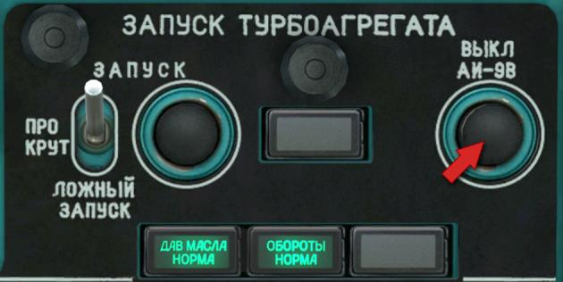

5. Проверить:

    - напряжение генераторов (200–
205 В), [[LAlt]] + [[LShift]] + [[7]]
 / [[LAlt]] + [[LShift]] + [[8]]

        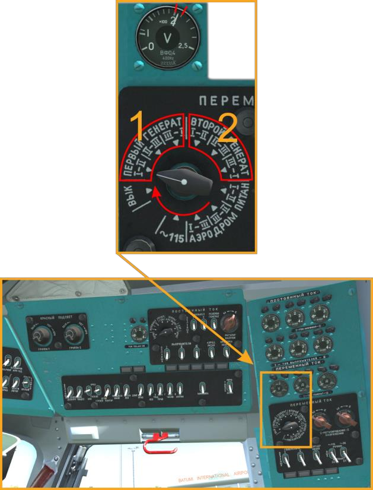

    - выпрямительных устройств ВУ-
6А (27–29 В), [[LCtrl]] + [[LShift]]
 + [[9]] / [[LCtrl]] + [[LShift]] +
 [[0]]
   

        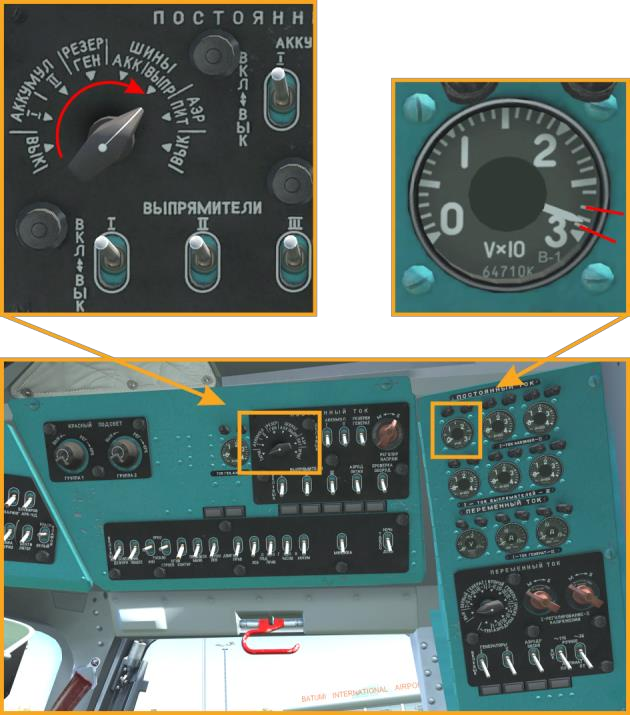

    - трансформатора (115 В).

        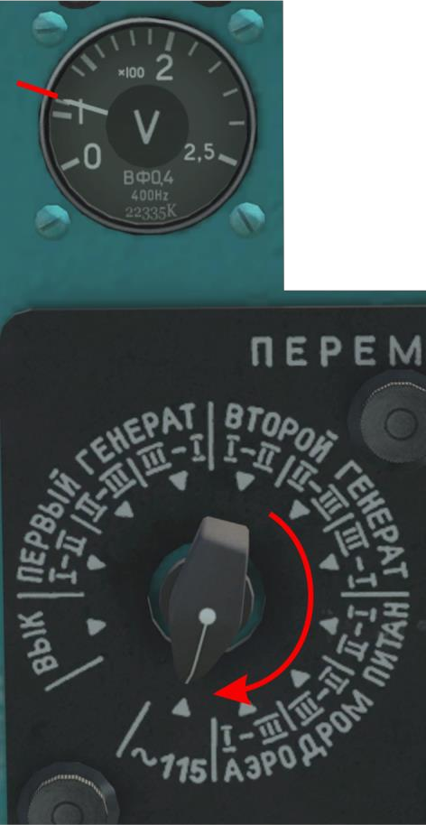

6. Установить переключатели ПО-500
~115 [[LAlt]] + [[LShift]] + [[3]] 115 и ПТ-
200 ~ 36 [[LAlt]] + [[LShift]] + [[5]] в
положение "АВТОМАТ".

    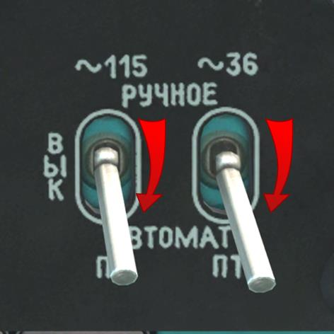

### Дополнительные проверки на правой коррекции (для углубленного изучения вертолета).

1. Проверить ПОС двигателей при правой коррекции. При этом, после 25-40 секунд после её
включения может увеличиться температура газов перед турбиной компрессора (но не более чем
на 60°С) и NТК (но не более чем на 2%).
2. Проверить частичную приемистость двигателей:

    - ввести правую коррекцию и проработать на этом режиме 1 мин.;
    - запомнить значение частоты вращения турбины компрессора;
    - повернуть рукоятку коррекции в крайнее левое положение;
    - ввести правую коррекцию за время 1-2 секунды, замерив время с начала
    перемещения коррекции вправо до достижения частоты вращения турбины компрессора на 1-1,5% 
    ниже оборотов правой коррекции;
    - время частичной приёмистости должно находиться в пределах 3-6 секунд.

3. Переход на генераторный режим: 1 -й генератор – "вкл", галетным переключателем замерить
межфазное напряжение, 2-й генератор – "вкл", замерить межфазное напряжение, галетный
переключатель в положение "115 в".
4. Включить и проверить выпрямительные устройства (ВУ) – "вкл" (по одному с контролем
нагрузки по амперметру);
5. Проверить систему перенастройки оборотов НВ:

    - установить рычаг "шаг-газ" по УШВ на 3° при правой коррекции, температура масла
    в главном редукторе не менее 30 °С
    - отклонить переключатель перенастройки на рычаге общего шага вниз, и после
    прекращения изменения оборотов НВ проверить их величину, NНВ должны
    составлять 91±2%;
    - отклонить переключатель вверх и убедиться, что частота вращения НВ составляет
    96..99%;
    - если верхний предел N нв не будет достигнут, необходимо прогреть масло в
    главном °С и повторить проверку;
    - после проверки диапазона перенастройки установить переключателем NНВ 94..95%
    и отклонить рычаг "шаг-газ" вниз до упора.

6. [Проверить](07.systems.md#_44) ПОС НВ, РВ, ПЗУ (при необходимости).
7. "Обогрев ПВД" – проверить (при необходимости);
8. СПУУ-52 – проверить:

    - АЗС на правой панели – "вкл", выключатель "СПУУ-52" на левом щитке – "вкл";
    - поставить педали в нейтральное положение;
    - нажать на кнопку "откл" (лапочка загорается), установить индикатор в среднее
    положение;
    - не отпуская кнопки "откл", установить нажимной переключатель в положение t ,
    планка индикатора нуля перемещается на правую промежуточную отметку, затем в
    положение "Р" - планка перемещается на левую отметку;
    - отпустить кнопку и нажимной переключатель – кнопка-табло гаснет, планка
    индикатора нуля занимает среднее положение;
    - нажать кнопку-табло "откл" и, не отпуская её, поворотом ручки "Контроль"
    установить планку индикатора нуля в крайнее правое положение;
    - выключить выключатель "СПУУ-52" и отпустить кнопку-табло – планка индикатора
    должна переместиться в крайнее левое положение, а кнопка-табло продолжает
    гореть;
    - включить выключатель "СПУУ-52", нажать на кнопку-табло и не отпуская её ручкой
     "контроль" установить планку индикатора нуля в среднее положение;
    - в полете планка индикатора нуля перемещается влево с увеличением температуры
    или уменьшением давления наружного воздуха.

### Б. Авиационное оборудование

Включить всё пилотажно-навигационное и радиоэлектронное оборудование и
проверить его работу.

7. Перед включением выключателя
"АВИАГОРИЗ." авиагоризонта АГБ-3К
предварительно нажать кнопку
"АРРЕТИР" [[LCtrl]] + [[LShift]] + [[N]]
(левого) [[RCtrl]] + [[RShift]] + [[N]]
(правого) включение [[LAlt]] + [[LShift]] + [[G]] (левого) [[RAlt]] + [[RCtrl]] + [[P]]
(правого) и проверить его работу

    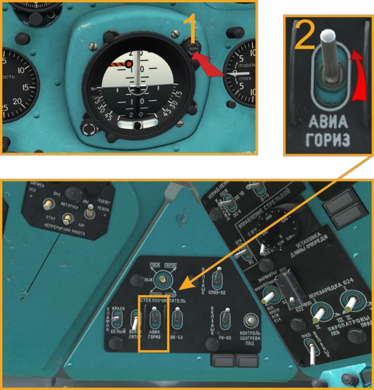

8. Включить:

    - выключатель коррекции ВК-53РШ
 [[LAlt]] + [[LShift]] + [[F]] ;
    - систему подвижного упора
управления СПУУ-52
 [[LAlt]] + [[LShift]] + [[T]] ;
    - речевой информатор РИ-65

    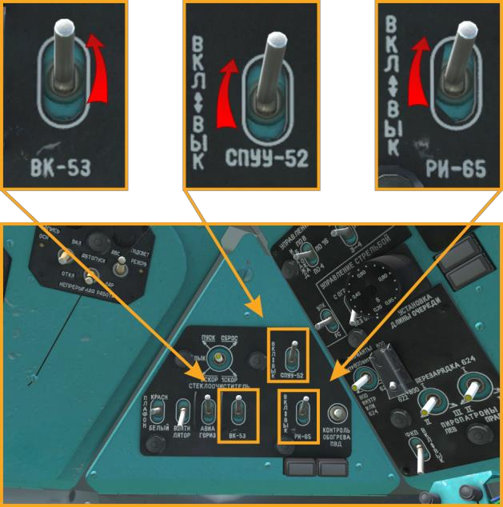

9. Включить АРК и [настроить его на
необходимую приводную радиостанцию](06.radios.md#-9).
10. Включить:
    
    - Доплеровский измеритель
скорости и сноса "ДИСС-15"
 [[RAlt]] + [[RShift]] + [[T]] ;
    - Правый авиагоризонт АГБ-3К
нажать "АРРЕТИР" [[RCtrl]] +
 [[RShift]] + [[N]] и включить
 [[RAlt]] + [[RCtrl]] + [[P]] ;
    - Курсовую систему ГМК-1А
 [[RAlt]] + [[RShift]] + [[U]] .

    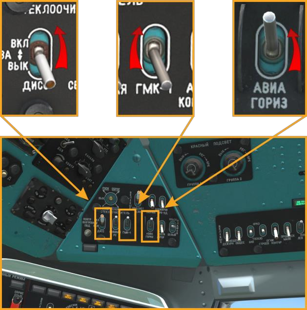

11. После установки стояночного
магнитного курса переключатель рода
работы поставить в положение "ГПК"
[[RCtrl]] + [[RShift]] + [[O]]

    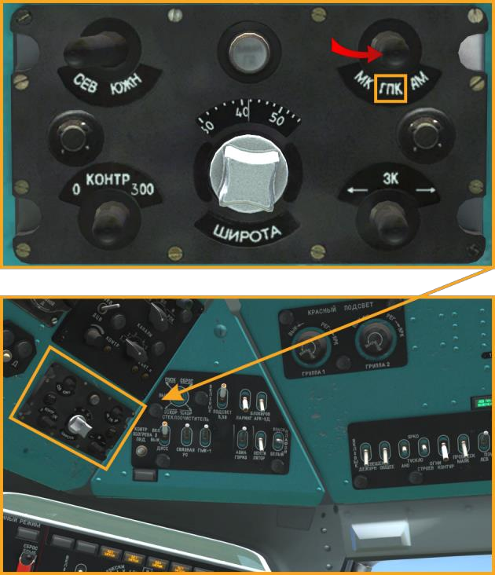

12. Проверить работоспособность
автопилота:

    - по каналу "НАПРАВЛЕНИЕ"
 [[LCtrl]] + [[A]] ,
    - по каналу "КРЕН-ТАНГАЖ"
 [[LWin]] + [[A]] ,
    - по каналу "ВЫСОТА" [[LAlt]] +
 [[A]]

    Кнопочные лампы включения каналов расположены на пульте
управления автопилотом.

    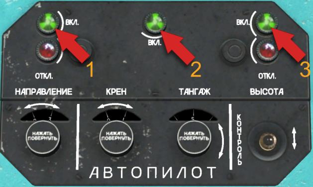

13. Нажимной переключатель "ЗК"
кратковременно нажать влево или
вправо. При этом шкала
"НАПРАВЛЕНИЕ" на пульте управления
должна вращаться в соответствующую
сторону.

    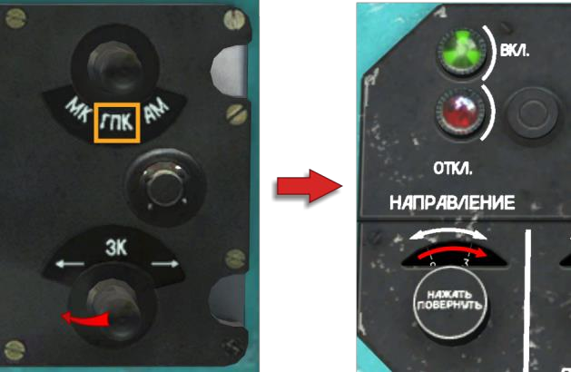

14. Включить систему МИГАЛКА
[[RCtrl]] + [[-]].

    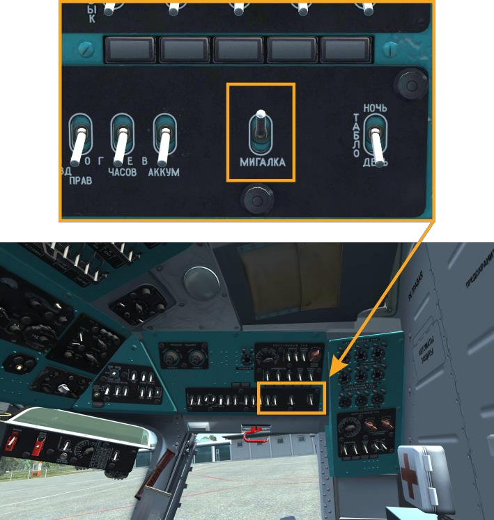

### При выполнении полетов ночью

- включить аэронавигационные огни [[RCtrl]] + [[1]] (тускло) или [[RCtrl]] + [[2]] (ярко), маяк МСЛ-3 [[RCtrl]] + [[6]] и контурные огни, а при
необходимости и строевые огни [[RCtrl]] + [[3..4]] ;
- включить рулёжную [[RCtrl]] + [[L]] и посадочные фары [[LShift]] + [[L]]
 (левая), [[ RShift ]] + [[L]] (правая); для управления направлением света
фар [[LShift]] + [[7..0]] (левая), [[RShift]] + [[7..0]] (правая), [подробно](07.systems.md#_63).

## Выключение двигателей

### Перед установкой режима малого газа

1. Выключить ПЗУ [[LCtrl]] + [[D]] / [[RCtrl]] +
[[D]]

    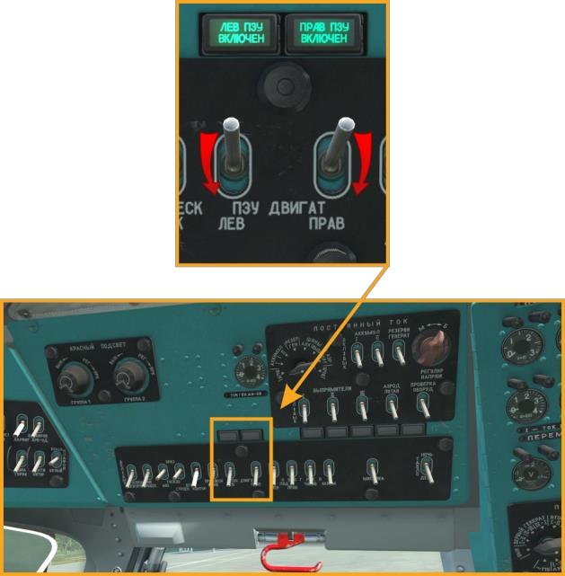

2. Выключить все потребители
электроэнергии, кроме приборов,
контролирующих работу силовой установки
(на левой и правой стороне):

    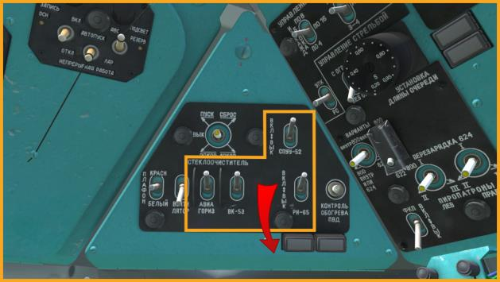
    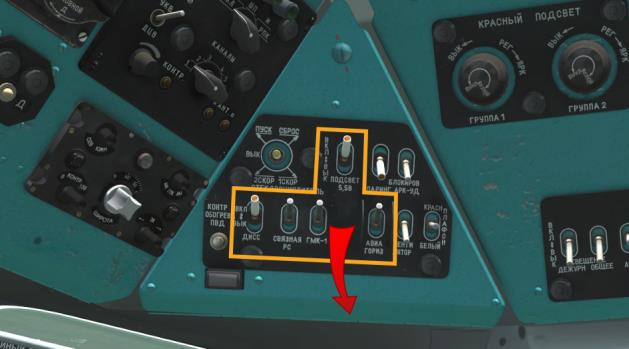

3. Выключить выпрямители постоянного тока
[[LCtrl]] + [[LShift]] + [[4..6]] , переключатель
"ПО-500А" поставить в положение "РУЧНОЕ"
[[LAlt]] + [[LShift]] + [[4]] , выключить
генераторы переменного тока [[LAlt]] +
[[LShift]] + [[6]]

    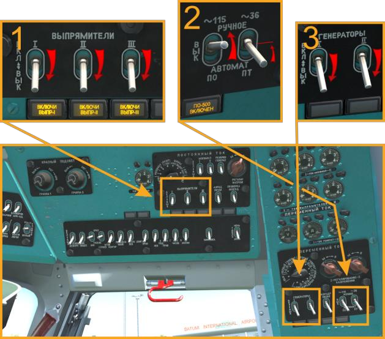

### Малый газ и выключение

4. Убрать коррекцию полностью влево
[[PgDn]]

    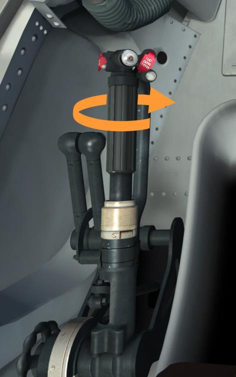

5. После охлаждения двигателей на оборотах
малого газа остановить двигатели переводом
рычагов кранов останова в положение
"ОСТАНОВ. ДВИГ. ЛЕВ. ПРАВ." [[ RCtrl ]] +
[[PgUp]] (левый) / [[RCtrl]] + [[PgDn]] (правый)

    

6. При оборотах ротора Nr < 15% –
затормозить несущий винт
[[RCtrl]] + [[R]]

    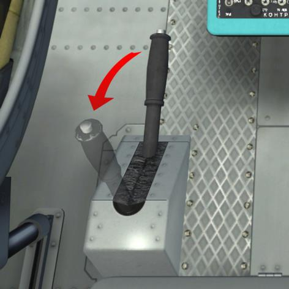

7. После полной остановки двигателей
закрыть топливные пожарные краны [[LAlt]] +
[[5..6]] (поднятие защитного колпачка) затем
[[RAlt]] + [[5..6]]

    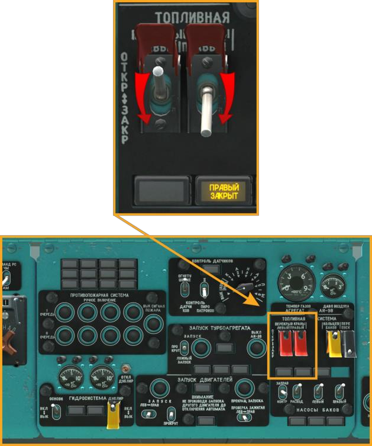

8. Выключить топливные [[RShift]] + [[1]] и
подкачивающие насосы [[RShift]] + [[2..3]]

    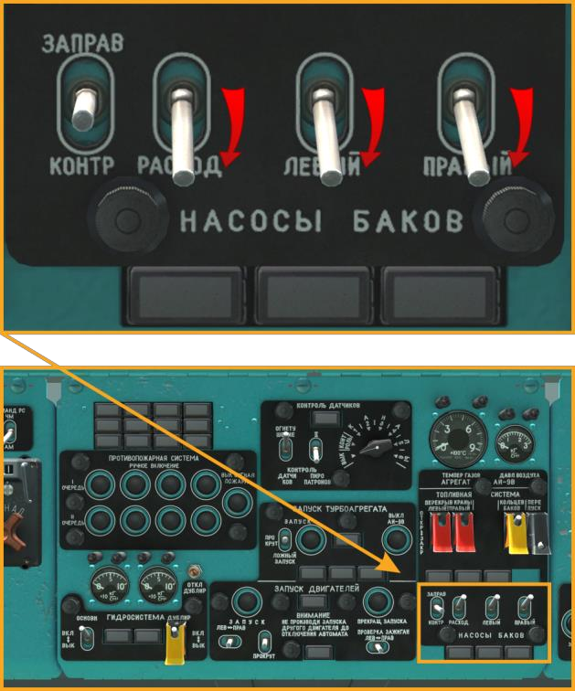

9. Выключить все АЗС и выключатели, кроме
выключателя дублирующей гидросистемы

    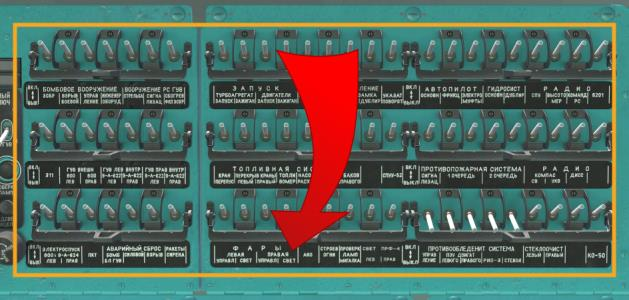

10. Выключить аккумуляторы
[[LCtrl]] + [[LShift]] + [[1]]

    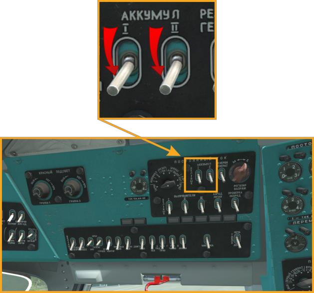

11. Переключатель на щитке САРПП-12
установить в положение "АВТОМ."
[[LAlt]] + [[LCtrl]] + [[LShift]] + [[6]]

    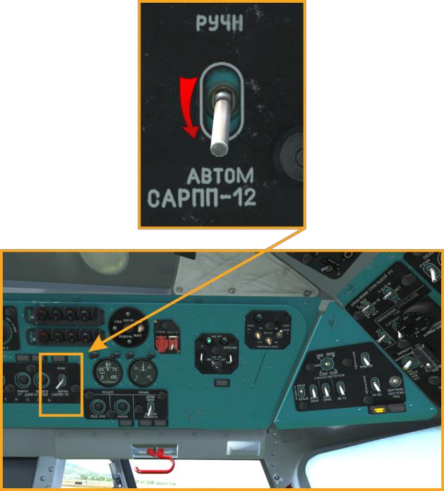

## Подготовка к рулению и руление

А. Перед выруливанием убедиться:

- Отключить аэродромное питание в меню радиопереговоров: [[\]],
 [[F8]], [[F2]], [[F2]];
- насосы ЭЦН-91Б включены (по положению выключателей и световому
табло);
- выключен АИ-9В;
- включены все АЗС.

Б. Убедиться, что на пути руления нет препятствий, после чего необходимо:

- проверить включение ПЗУ;
- убедиться, что обороты несущего винта 95±2%;
- по радио получить разрешение на выруливание;
- растормозить основные колеса [[W]].

Увеличением общего шага несущего винта до 1–2° и плавным отклонением
ручки управления от себя перевести вертолет на поступательное движение.

В. Руление выполнять не допуская взвешенного состояния вертолета. В
случаях, когда по состоянию грунта невозможно выполнять руление,
необходимо производить подлеты на малой высоте.

Г. Скорость руления не более 15–20 км/ч. Развороты выполнять плавным
отклонением педалей, не допуская полной разгрузки амортизационной стойки
носового колеса.

Д. Руление выполнять при скорости ветра не более 15 м/с. При рулении с
боковым ветром вертолет имеет тенденцию к развороту против ветра. Разворот
парировать отклонением педалей, а кренение – отклонением ручки управления
против ветра.

Е. После выруливания к месту взлета проверить пилотажно-навигационное
оборудование, убедиться, что питание на авиагоризонт подано (флажка на
фоне шкалы АГБ-ЗК нет), радиокомпас АРК правильно показывает направление
на приводную радиостанцию, курсовая система согласована и ее показания
соответствуют курсу взлета. Включить "ВРЕМЯ ПОЛЕТА" [[RALT]] + [[RCTRL]] +
[[RSHIFT]] + [[C]] на бортовых часах.

## Висение

А. В зависимости от полетного веса висение разрешается:

- до 10 м при взлетном весе 11 100 кгс и менее;
- до 5 м при взлетном весе более 11 100 кгс.

Выше указанных высот разрешается висеть при транспортировке грузов на
внешней подвеске или по тактическим соображениям.

Б. Развороты на висении выполнять с угловой скоростью до 12°/с.

В. Для выполнения висения необходимо:

- по возможности установить вертолет против ветра;
- убедиться, что коррекция находится в крайнем правом положении;
- плавным движением рычага шаг-газ вверх установить шаг несущего
винта 3°;
- убедиться, что обороты НВ на шаге 3° имеют значение 95%;
- выключить все каналы автопилота [[LWin]] + [[LShift]] + [[A]] и
включить автопилот нажатием лампы-кнопки "КРЕН–ТАНГАЖ"
 [[LWin]] + [[A]] при этом должна загореться зеленая лампа "ВКЛ. КРЕН–
ТАНГАЖ";
- плавным движением рычага шаг-газ вверх отделить вертолет от
земли и набрать заданную высоту висения.

Г. Увеличение общего шага несущего винта при отделении вертолета от земли
должно быть плавным; установление взлетной мощности двигателя должно
производиться не менее чем за 5 с, что обеспечивает сохранение оборотов
несущего винта в пределах 92–94%.

Д. При отрыве от земли вертолет имеет стремление к смещению вперед и
влево.

Е. Примерное отклонение ручки управления от нейтрального положения на
висении составляет:

- на себя – 1/4 полного хода ручки при предельно задней и нормальной
центровках, 1/2 полного хода ручки при предельно передней
центровке;
- вправо–на 1/4 полного хода ручки независимо от центровки.

## Перемещения и подлеты на малой высоте

А. Перемещения и подлеты на малой высоте выполнять при производстве
специальных работ, а также в случаях, когда состояние грунта не позволяет
выполнять руление.

Б. Перемещения влево, вправо и назад выполнять со скоростью не более
10 км/ч, ориентируясь при этом по земле, предварительно убедившись в
отсутствии препятствий в направлении перемещения.

В. Подлеты вперед на высотах до 10 м производить со скоростью не более
20 км/ч, ориентируясь по земле, а также используя для контроля прибор ДИСС-15. 
При скорости ветра более 10 м/с подлеты производить только против ветра.

Г. Полеты на малой высоте над сильно пересеченной местностью (овраги,
балки, обрывы) производить на высоте не менее 20 м и на скорости не менее
60 км/ч.

## Взлет

Взлет производится одним из способов:

- по-вертолетному с разгоном в зоне влияния земли;
- по-вертолетному с разгоном вне зоны влияния земли;
- по-самолетному с разбегом до скорости 20–50 км/ч, необходимой для
отрыва от земли.

Для выполнения взлетов и посадок на высотах до 1500 м рабочая площадка
должна иметь следующие минимальные размеры:

- для взлетов и посадок по-вертолетному при отсутствии препятствий
на подходах–50х50 м;
- для взлетов и посадок по-вертолетному при наличии препятствий
высотой 15 м на границе площадки–50х120 м;
- для взлетов и посадок по-самолетному при отсутствии препятствий на
подходах–50х160 м;
- для взлетов и посадок по-самолетному при наличии препятствий
высотой 15 м на границе площадки–50х200 м.

### Взлет по-вертолетному с разгоном в зоне влияния земли

Взлет по-вертолетному с разгоном в зоне влияния земли разрешается
производить в том случае, когда вертолет может висеть на высоте не менее 3 м
над землей на взлетном режиме работы двигателей.

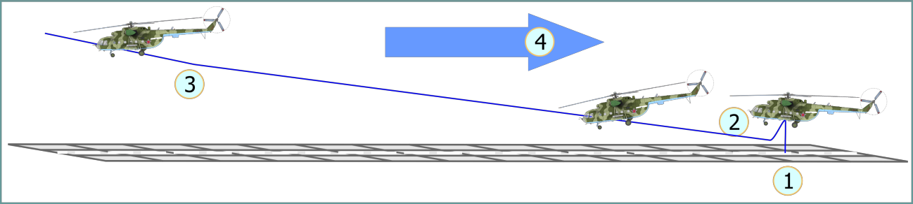

Рис. 9.1. Взлет по-вертолетному с разгоном в зоне влияния земли

Для взлета установить вертолет против ветра (4), отделить его от земли и
выполнить контрольное висение (1.). Убедившись, что показания приборов
нормальные, а высота висения достаточная для взлета по-вертолетному,
снизиться до высоты 0,5–1 м (2) и плавным отклонением ручки управления от
себя перевести вертолет в разгон с одновременным увеличением мощности
двигателей вплоть до взлетной, не допуская уменьшения оборотов несущего
винта ниже 92%. Разгон выполнять в зоне влияния земли с постепенным
набором высоты (3) с таким расчетом, чтобы на высоте 20–30 м скорость была
60–70 км/ч. После разгона до скорости 60–70 км/ч перевести вертолет в режим
набора высоты с одновременным увеличением скорости до 120 км/ч.

### Взлет по-вертолетному с разгоном вне зоны влияния земли

Взлет по-вертолетному с разгоном вне зоны влияния земли производится в том
случае, когда площадка имеет ограниченные размеры и окружена
препятствиями, а взлетный вес вертолета обеспечивает висение вне зоны
влияния земли.

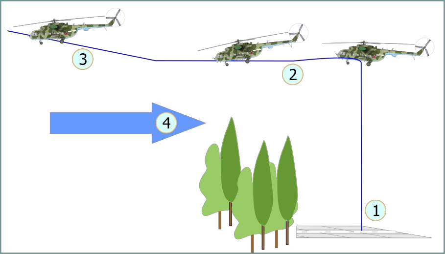

Рис. 9.2. Взлет по-вертолетному с разгоном вне зоны влияния земли

Для взлета установить вертолет против ветра (4), отделить его от земли и
строго вертикально набрать высоту (1), обеспечивающую безопасный проход
над препятствиями с превышением не менее 10 м. В процессе увеличения
общего шага следить за величиной оборотов несущего винта, не допуская
уменьшения их ниже 92%.

Плавным отклонением ручки управления от себя (2) перевести вертолет в
разгон до скорости 20–50 км/ч, после чего перейти в набор высоты (3) с
одновременным увеличением скорости до 120 км/ч.

### Взлет по-самолетному

Взлет по-самолетному разрешается производить, если вертолет при взлетном
режиме работы двигателей может висеть на высоте не менее 1 м над землей.

При выполнении взлета по-самолётному должны быть включены только каналы
крена и тангажа автопилота.

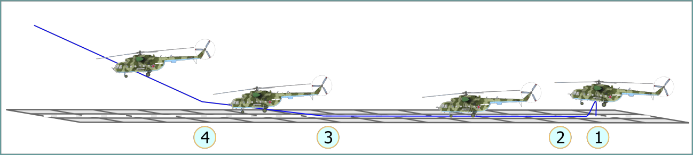

Рис. 9.3. Взлет по-самолетному

Произвести контрольное висение, приземлить вертолет, уменьшить общий шаг
несущего винта до такой величины, чтобы вертолет устойчиво стоял на грунте.

Убедившись, что вертолет зависает на высоте не менее 1 м (1), а показания
приборов нормальные и коррекция введена полностью вправо, отклонением
ручки управления от себя и плавным увеличением общего шага перевести
вертолет в разбег (2) до скорости 20–50 км/ч. Дальнейшим увеличением общего
шага несущего винта до взлетного режима работы двигателей отделить
вертолет (3) от земли.

При разбеге вертолет стремится к отрыву сначала основных колес, затем
носового колеса. Это стремление нужно парировать в момент отрыва
движением ручки управления на себя.

После отхода от земли (4) довести скорость до 120 км/ч и перевести вертолет в
набор высоты. Взлетная дистанция при этом составляет 250– 300 м.

При взлете с площадок ограниченных размеров, окруженных препятствиями,
для уменьшения взлетной дистанции высоту набирать на скорости 50–60 км/ч.

### Взлет по-самолетному с разбегом на носовом колесе

Взлет с разбегом на носовом колесе применять при необходимости увеличения
грузоподъемности или для уменьшения длины разбега с площадок, поверхность
и состояние грунта которых обеспечивают безопасный разбег вертолета.

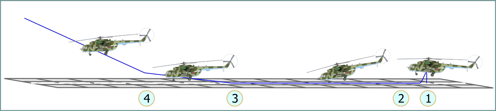

Рис. 9.4. Взлет с разбегом на носовом колесе

Произвести контрольное висение, приземлить вертолет (1) и убедиться в том,
что коррекция введена полностью вправо. Отключить автопилот кнопкой на
ручке управления. Установить минимальный шаг несущего винта. Затормозить
колеса. Отклонив ручку управления от себя на максимально возможную
величину, включить каналы тангажа и крена автопилота нажатием на
соответствующую лампу-кнопку на пульте управления. При этом должна
загореться зеленая лампа "ВКЛ. КРЕН – ТАНГАЖ." Отклонив ручку управления
на максимально возможную величину на себя, механизмом триммирования
снять усилия на ручке управления. Максимально возможные величины
отклонения ручки управления от себя и на себя определяются по отсутствию
ударов лопастей по упорам горизонтальных шарниров.

Растормозить колеса. Плавным увеличением общего шага несущего винта
довести вертолет до состояния отрыва основных колес шасси от земли, не
допуская отрыва носовых колес, после чего плавно (за 3–5 с) отклонить ручку
управления от себя на 1/2–2/3 ее хода вперед и перевести вертолет в режим
разбега (2) с углом тангажа на пикирование, отличающимся от исходного
стояночного на 8–9°. Необходимый угол тангажа на разбеге устанавливается
летчиком путем выдерживания положения концов лопастей на уровне
горизонта. В процессе разбега режим работы двигателей плавно увеличить до
взлетного.

При разбеге на скорости 40 км/ч вертолёт имеет тенденцию к кабрированию и
"приседанию" на основные колеса шасси, а после "приседания" – к энергичному
пикированию ("клевку"), что необходимо частично парировать
соответствующим отклонением ручки управления от себя и на себя.

Отрыв вертолета (3) производить через 1–2 с после "клевка" плавным
отклонением ручки управления на себя на приборной скорости 60–65 км/ч.
Набор высоты до 10 м производить с разгоном до скорости 70–80 км/ч.

Дальнейший набор высоты (4) производить на скорости 120 км/ч.

Потребная длина бетонированной ВПП для взлета с предельным взлетным
весом 13000 кгс составляет 150 м, а потребная длина рабочей площадки –
340 м. При центровках вертолета, близких к предельно задней, длина разбега,
потребные длина ВПП и взлетная дистанция возрастают в 1,5 раза.

После взлета и набора высоты в горизонтальном прямолинейном полете
отключить автопилот кнопкой на ручке управления, сбалансировать вертолет и
включить каналы направления, крена и тангажа автопилота нажатием
соответствующих ламп-кнопок на пульте управления.

## Набор высоты

А. Наивыгоднейшая скорость набора высоты на высотах от земли до 2000 м –
120 км/ч, на высоте 3000 м – 110 км/ч, на высоте 4000 м и выше – 100 км/ч.
Набор высоты, как правило, производится на номинальном режиме работы
двигателей. При необходимости набор высоты можно производить на взлетном
режиме (не более 6 мин), а также на режиме ниже номинального.
После взлета установить необходимый режим набора высоты, выключить ПЗУ.

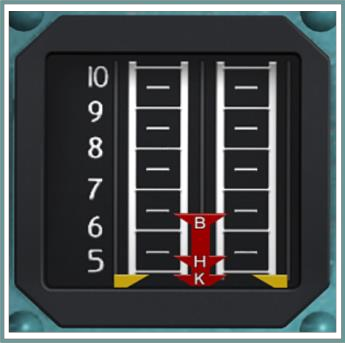

Рис. 9.5. Указатель измерителя режимов ИР-117М

Б. Режим работы двигателей устанавливается летчиком по указателю
измерителя режимов ИР-117М до высоты 2500 м и определяется положением
бокового индекса относительно центральных индексов "Н" и "К", а именно:

- взлетный режим – боковой индекс находится выше центрального
индекса "Н";
- номинальный режим – боковой индекс находится выше центрального
индекса "К" до положения против индекса "Н";
- крейсерский режим – боковой индекс находится против или ниже
центрального индекса "К".

В. На высоте 2500 м и выше режим работы двигателей определяется по
специальным графикам.

Г. В наборе высоты на номинальном режиме работы двигателей при постоянном
значении общего шага обороты несущего винта до определенной высоты
поддерживаются автоматически постоянными (95±2) %. При дальнейшем
наборе высоты обороты несущего винта будут уменьшаться в связи с тем, что
регуляторы оборотов турбокомпрессоров уменьшают мощность двигателей. В
этом случае плавным уменьшением общего шага не допускать уменьшения
оборотов несущего винта ниже 92%. Ограничение номинальной мощности
двигателей начинается с высоты 1000 – 1500 м.

В случае набора высоты на крейсерском режиме работы двигателей обороты
несущего винта поддерживаются постоянными до высоты 2000 - 2500 м.

При наборе высоты на взлётном режиме работы двигателей при постоянном
шаге обороты несущего винта 92-94% автоматически не поддерживаются. В
этом случае не допускать уменьшения оборотов несущего винта
последовательным уменьшением общего шага.

## Горизонтальный полет

Рекомендуемая скорость горизонтального полета при выполнении полетов по
кругу 160 км/ч.

Развороты и виражи разрешается выполнять с креном до 30° с нормальным
взлетным весом и с креном до 20° с максимальным взлетным весом.

## Переходные режимы полета
А. Для перехода из режима вертикального набора высоты на режим висения: по
достижении заданной высоты остановить вертолет плавным уменьшением
общего шага несущего винта и плавными движениями рычага шаг-газ сохранять
заданную высоту висения.

Б. Для перехода из режима висения на режим вертикального снижения:
рычагом шаг-газ уменьшить общий шаг несущего винта с таким расчетом, чтобы
вертикальная скорость снижения вертолета у земли была не более 0,2 м/с.

В. Для перехода из режима висения на режим горизонтального полета: ручку
управления отклонить вперед для перевода вертолета на разгон. Одновременно
рычагом шаг-газ удерживать вертолет на постоянной высоте. После достижения
заданной скорости полета взятием ручки управления на себя прекратить
разгон.

Г. Для перехода из режима горизонтального полета на режим висения: на той
же высоте плавным движением рычага шаг-газ уменьшить общий шаг несущего
винта, а ручкой управления погасить поступательную скорость.

При достижении скорости полета 50–60 км/ч у вертолета появляется
стремление к снижению. Для парирования снижения необходимо увеличить
общий шаг несущего винта.

При уменьшении скорости полета менее 50 км/ч появляется тряска, проходящая
при дальнейшем уменьшении скорости. При уменьшении скорости полета менее
40–20 км/ч появляется стремление к развороту влево.

Ручкой управления необходимо своевременно удерживать вертолет от кренов,
одновременно отклонением правой педали удерживать вертолет от разворота.

Д. Для перехода из режима горизонтального полета на режим планирования с
работающими двигателями: уменьшить общий шаг несущего винта и ручкой
управления установить нужную скорость планирования.

Е. Для перехода из режима планирования при работающих двигателях на
режим горизонтального полета: рычагом шаг-газ установить режим работы
двигателей, соответствующий режиму горизонтального полета, а ручкой
управления установить заданную скорость.

Ж. При выполнении переходных режимов полета автоматическое сохранение
оборотов несущего винта в диапазоне 95±2% обеспечивается только при
определенном темпе перемещения рычага шаг-газ:

- вверх по времени не менее 5 с от значения общего шага 1–3° до
шага, соответствующего взлетному режиму работы двигателей;
- вниз не быстрее 1°/с при любом исходном значении общего шага.

При более быстром перемещении рычага шаг-газ вверх может произойти
уменьшение оборотов несущего винта ниже минимально допустимых (88%),
вниз – раскрутка оборотов выше максимально допустимых (103%).

При выходе оборотов несущего винта за пределы 95±2% необходимо
соответствующим перемещением рычага шаг-газ удерживать их в допустимых
пределах.

Энергичное отклонение ручки управления в продольном отношении при разгоне
вертолета приводит к уменьшению оборотов несущего винта, при торможении –
к их росту. Чем выше темп отклонения ручки управления, тем интенсивнее
изменение оборотов.

Снимать возникающие на переходных режимах усилия с органов управления
следует короткими нажатиями кнопки снятия усилий (ЭМТ-2) после небольших
отклонений органов управления.

## Снижение

Снижение с работающими двигателями в зависимости от высоты полета
допускается как вертикальное, так и по наклонным траекториям
(планирование).

Снижение на режиме самовращения несущего винта разрешается только по
наклонной траектории.

### Вертикальное снижение с работающими двигателями

Вертикальное снижение разрешается выполнять с высоты 10 м до земли во всех
случаях, а с высоты 110 м до высоты 10 м – только в случае невозможности
планирования из-за препятствий или по тактическим соображениям. С
динамического потолка до высоты 110 м снижение выполнять на режиме
планирования в диапазоне разрешенных поступательных скоростей.

При вертикальном снижении с высоты 110 м до высоты 10 м не допускать
скорости снижения более 3 м/с. В случае самопроизвольного увеличения
скорости снижения необходимо уменьшить ее плавным увеличением общего
шага. Если запас мощности окажется недостаточным, перейти на полет с
поступательной скоростью.

Вертикальное снижение с высоты 10 м до земли выполнять с постепенным
уменьшением вертикальной скорости снижения с таким расчетом, чтобы к
моменту приземления она была не более 0,2 м/с.

### Планирование с работающими двигателями

На планировании поддерживать обороты несущего винта 95±2% изменением
общего шага несущего винта. По мере уменьшения высоты полета для
обеспечения вертикальной скорости допускается постепенное уменьшение
общего шага вплоть до минимального значения с сохранением при этом
оборотов несущего винта.

Рекомендуемая скорость планирования на высотах менее 2000 м 120–180 км/ч,
вертикальная скорость при этом будет 3–5 м/с.

## Снижение на режиме самовращения несущего винта

А. Снижение на режиме самовращення несущего винта выполнять при отказе в
полете двух двигателей. Для перехода на режим самовращения в необходимо:

- в горизонтальном полете установить скорость, на которой будет
производиться снижение на режиме самовращения несущего винта;
- уменьшить общий шаг до минимального значения и убедиться в том,
что обороты несущего винта составляют (95±2) %;
- стремление вертолета развернуться вправо и опустить нос
парировать соответствующими отклонениями органов управления;
- рукоятку коррекции газа повернуть влево до упора;
- после перехода на режим самовращения изменением положения
рычага шаг-газ сохранять обороты несущего винта в допустимых
пределах.

Б. Снижение на режиме самовращення несущего винта с работающими
двигателями выполнять на скоростях:

- на высоте 2000 м и более – 100 - 120 км/ч;
- на высоте менее 2000 м – 120 - 190 км/ч.

Наивыгоднейшая скорость планирования на высотах менее 2000 м 180–190 км/ч
(скорость наибольшей дальности планирования).

В. Вертикальная скорость снижения 10 - 12 м/с.
Наименьшая вертикальная скорость 10 м/с соответствует скорости
планирования 110 – 120 км/ч.

Г. Развороты при снижении на режиме самовращения несущего винта
выполнять с креном не более 20°.

Д. Вывод вертолета из режима снижения на самовращении несущего винта с
работающими двигателями производить в такой последовательности:

- плавно перевести рукоятку коррекции вправо, наблюдая за
увеличением оборотов турбокомпрессоров и несущего винта;
- на высотах более 1500 м стремление к выходу оборотов несущего
винта за максимальные пределы парировать своевременным
увеличением общего шага до 3–4° по УШВ;
- на высотах менее 1500 м увеличение общего шага производить после
перевода коррекции полностью вправо. Темп перемещения рычага
шаг-газ вверх должен быть таким, чтобы обороты несущего винта не
упали менее 92%.

Е. С остановленными двигателями снижение на режиме самовращения несущего
винта производить на скорости 100–120 км/ч.

## Посадка

На вертолете выполняются следующие виды посадок:

- посадка по-вертолетному с зависанием в зоне влияния земли;
- посадка по-вертолетному с зависанием вне зоны влияния земли;
- посадка с работающими двигателями с поступательной скоростью
 (по-самолетному);
- посадка с одним работающим двигателем;
- посадка с выключенными двигателями на режиме самовращения
несущего винта (РСНВ).

Перед выполнением посадок с поступательной скоростью, в том числе и на
режиме самовращения несущего винта, каналы направления и высоты
автопилота выключаются.

### Посадка по-вертолетному с зависанием в зоне влияния земли

Планирование перед посадкой производить на скорости по прибору
120 км/ч. С высоты 100 м плавным отклонением ручки управления на себя
начать уменьшение поступательной скорости с таким расчетом, чтобы на
высоте 60–50 м скорость составляла 60–50 км/ч.

С высоты 8–5 м плавным движением ручки управления на себя и
увеличением общего шага до необходимой величины выполнить зависание
вертолета на высоте 2–3 м.

После зависания плавным уменьшением общего шага снизить вертолет
уменьшая вертикальную скорость с таким расчетом, чтобы к моменту
приземления она была не более 0,2 м/с.
При посадке с боковым ветром удерживать вертолет отклонением ручки
управления в сторону против ветра до полного приземления и устойчивой
стоянки вертолета на грунте.

### Посадка по-вертолетному с зависанием вне зоны влияния земли

Производится в случае, когда препятствия на подходах к площадке не
позволяют выполнить зависание вблизи земли.
Выполнение посадки с зависанием вне зоны влияния земли не отличается
от посадки с зависанием в зоне ее влияния.

На высоте 50 м выше уровня препятствий начать плавное торможение с
таким расчетам, чтобы зависание выполнить на высоте не менее 5 м выше
окружающих препятствий.

### Посадка с работающими двигателями с поступательной скоростью (по-самолетному)

Производится при невозможности выполнить зависание из-за недостатка
располагаемой мощности двигателей (высокогорные аэродромы, высокие
температуры наружного воздуха).

Посадка может производиться на аэродром или ровную проверенную площадку
при наличии безопасного подхода.

Планирование после четвертого разворота производить со скоростью 120 км/ч.

Глиссаду снижения выдерживать таким образом, чтобы до высоты 40 м
значение скорости полета было на 20 км/ч больше значения текущей высоты.

Дальнейшее снижение осуществлять с постоянным уменьшением скорости
полета и вертикальной скорости снижения с таким расчетом, чтобы на высоте
1–0,5 м скорость полета была 50–40 км/ч, а вертикальная скорость снижения
0,1–0,2 м/с.

Плавно приземлить вертолет на основные колеса и уменьшить общий шаг
несущего винта до минимального значения, после чего опустить вертолет на
носовое колесо, полностью убрать коррекцию; для уменьшения пробега
использовать тормоза колес. Пробег вертолета составляет 20–30 м. Общая
длина площадки с подходами должна быть не менее 100 м.

Если размеры площадки не обеспечивают возможности выполнения посадки по-
самолетному с пробегом 20–30 м, а ее выполнение необходимо, то посадку
произвести с укороченным пробегом, для чего на высоте 40–50 м относительно
посадочной площадки начать плавное уменьшение поступательной и
вертикальной скоростей за счет увеличения общего шага и угла тангажа;
маневр предпосадочного торможения производить с таким расчетом, чтобы на
высоте 5–10 м режим работы двигателей был близок к взлетному, а
поступательная скорость относительно земли составляла 40–20 км/ч; на высоте
5–10 м отклонением ручки управления от себя придать вертолету посадочное
положение, исключающее возможность касания земли хвостовой опорой, но
обеспечивающее дальнейшее уменьшение поступательной скорости до 15–
10 км/ч к моменту приземления вертолета; уменьшение вертикальной скорости
с высоты. 5–10 м производить за счет дальнейшего увеличения общего шага с
темпом 2–4°/с так, чтобы в момент приземления она не превышала 0,2 м/с;
после приземления ручку управления установить на 1/3–1/4 хода вперед от
нейтрального положения, уменьшить общий шаг до минимального значения,
перевести рукоятку коррекции полностью влево и затормозить колеса шасси.

### Посадка с одним работающим двигателем

Посадку вертолета с одним работающим двигателем производить на ровную
площадку с безопасными подходами или на аэродром. Вес вертолета при
выполнении посадки не более 10 000 кгс.

Заход на посадку с одним работающим двигателем выполнять против ветра или
с боковым ветром не более 5 м/с.

На высоте 300 м перед запуском двигателя АИ-9В выключить ПОС двигателей и
ПЗУ, если они были включены. Запустить АИ-9В. По показаниям приборов
контроля и высвечиванию надписей на табло "ДАВЛ. МАСЛА НОРМА",
"ОБОРОТЫ НОРМА" убедиться в нормальной работе двигателя АИ-9В.

Посадку вертолета с одним работающим двигателем производить с
приземлением вертолета на скорости 10–20 км/ч или 50 км/ч в
последовательности:

- отклонением рычага шаг-газ выдерживать обороты несущего винта в
пределах 95±2%;
- проверить включение ЧР работающего двигателя по загоранию
табло;
- на глиссаде снижения режим полета выдерживать таким образом,
чтобы значение скорости полета было на 20 км/ч больше значения
текущей высоты;
- на высоте 7–5 м придать вертолету посадочное положение;
- с высоты 3–5 м уменьшать вертикальную скорость до момента
приземления путем увеличения общего шага несущего винта. При
увеличении общего шага парировать разворот вертолета влево
плавной дачей правой педали и ручкой управления выдерживать
посадочный угол тангажа. В процессе увеличения общего шага не
допускать падения оборотов несущего винта менее 88%;
- после приземления без задержки плавно опустить рычаг шаг-газ вниз
до упора с одновременным отклонением ручки управления от себя на
1/3–1/4 хода для исключения удара лопастями несущего винта по
хвостовой балке;
- после опускания переднего колеса применить тормоза колес.
Приземление вертолета происходит на скорости 10–20 км/ч. Пробег после
приземления составляет 5–20 м.

Для приземления вертолета на скорости 50 км/ч на глиссаде снижения режим
выдерживать таким образом, чтобы значение скорости полета было на 20 км/ч
больше значения текущей высоты до высоты 40 м. Скорость 60 км/ч
выдерживать до высоты 5–7 м. Приземление производить обычным способом,
при этом длина пробега составляет 80–100 м.

### Выполнение посадки на РСНВ с использованием установившегося планирования

Произвести расчет на посадку, после чего в расчетной точке над аэродромом
на высоте 800 м относительно ВПП на приборной скорости 100 км/ч перевести
вертолет на РСНВ.

Обороты НВ выдерживать максимальными (общий шаг – 1° по УШВ), но не
более 110%. Сбалансировать вертолет триммерами, создав незначительный
пикирующий момент, а поперечным триммером полностью снять нагрузки от
кренящего момента.

С высоты 70–50 м перевести взгляд на землю для визуального определения
высоты полета вертолета относительно ВПП, при этом ручкой управления
сохранять установившийся угол тангажа.

На высоте 15–10 м (чем больше вертикальная скорость, тем больше высота)
увеличить общий шаг НВ до 7–8° (произвести "подрыв" НВ) за время не менее
1 с и выдержать его в течение 0,5–1 с. Выполнение первого этапа управления
общим шагом в процессе "подрыва" НВ выполняет роль "пробы", обеспечивая
гарантированное уменьшение вертикальной скорости и скорости
предпосадочного планирования до 70 км/ч. Если этого окажется недостаточно
для уменьшения вертикальной скорости, увеличить общий шаг НВ до 12° за
время 1 – 1,5 с соразмерно уменьшению вертикальной скорости.
В процессе "подрыва" НВ с темпом 10°/с увеличить угол тангажа вертолета до
5–6° для уменьшения горизонтальной составляющей скорости планирования,
зафиксировать угол незначительным отклонением ручки управления от себя.

При "подрыве" НВ вертолет стремится увеличить угол тангажа, отклонением
ручки управления от себя выдерживать посадочный угол.

После приземления установить общий шаг НВ 7–8° и выдерживать его
постоянным до полной остановки вертолета на пробеге. Отклонением ручки
управления на себя выдерживать достигнутый угол тангажа при приземлении
до момента, когда вертолет начнет самопроизвольно опускаться на носовое
колесо. После этого ручку управления плавно отклонить от себя на 1/3–1/4
хода и применить тормоза колес.

### Выполнение посадки на РСНВ комбинированным методом

Произвести расчет на посадку, после чего в расчетной точке над аэродромом на
высоте 800 м относительно ВПП на приборной скорости 120 км/ч перевести
вертолет на РСНВ.

Обороты НВ выдерживать максимальными (общий шаг– 1° по УШВ).

Сбалансировать вертолет триммерами, создав незначительный пикирующий
момент, а поперечным триммером полностью снять нагрузки от кренящего
момента.

С высоты 50–40 м произвести интенсивное уменьшение скорости вертолета от
120 до 70–60 км/ч путем увеличения угла тангажа до 15°. Со скорости 70–
60 км/ч (высота не менее 20 м) начать плавное уменьшение угла тангажа с
таким расчетом, чтобы к моменту приземления он был близок к посадочному 5–
6°.

С высоты 15–10 м произвести уменьшение вертикально скорости путем
быстрого и непрерывного увеличения общего шага НВ с темпом 6–8°/с.
После приземления установить общий шаг НВ 7–8° и выдерживать его
постоянным до полной остановки вертолета на пробеге. Отклонением ручки
управления на себя выдерживать тангаж 5–6° до момента самопроизвольного
опускания носового колеса. После этого ручку управления плавно отклонить от
себя на 1/3 –1/4 хода и применить тормоза колес.

## Окончание полета

После заруливания на стоянку поставить вертолет на стояночный тормоз и
выключить ПЗУ, все потребители электроэнергии, кроме приборов,
контролирующих работу силовой установки; убрать коррекцию полностью
влево.

Выключить двигатели:

- выключить выпрямители постоянного тока, переключатель "ПО-500А"
поставить в положение "РУЧНОЕ", выключить генераторы
переменного тока;
- после охлаждения двигателей на оборотах малого газа остановить
двигатели переводом рычагов кранов останова в положение
 "ОСТАНОВ. ДВИГ. ЛЕВ. ПРАВ".;
- после полной остановки двигателей закрыть топливные пожарные
краны;
- выключить топливные подкачивающие и перекачивающие насосы;
- выключить все АЗС и выключатели, кроме выключателя дублирующей
гидросистемы;
- выключить аккумуляторы.

## Полет на поиск потерпевших бедствие

А. Перед выполнением поиска необходимо:

- установить на пульте управления АРК – УД переключатель режимов
работы в положение "ШП", переключатель диапазонов в положение
 "УКВ", а переключатель "КАНАЛЫ" – в положение "4";
- установить переключатель на абонентском аппарате СПУ в
положение "РК2", а переключатель "СПУ–РАДИО" – в положение
 "РАДИО";
- вывести вертолет в район поиска, при этом учитывать, что дальность
действия АРК-УД как по обнаружению, так и по приводу с
увеличением высоты полета увеличивается (на высоте 500 м
дальность действия не менее 25 км);
- в режиме дежурного приема при обнаружении сигнала маяка
 (радиостанции) должна загореться лампа-сигнализатор.

Б. После обнаружения и опознания сигналов маяка (радиостанции) произвести
его поиск, для чего:

- установить переключатель режимов работы в положение,
соответствующее горящей лампе-сигнализатору "УП, ШП". Если горит
лампа-сигнализатор "УП", установить переключатель режимов работы
в положение "УП";
- с помощью кнопок "АНТ. Л" (или "П") отвести стрелку указателя
влево или вправо от положения пеленга и убедиться, что при
отпущенной кнопке стрелка возвращается в прежнее положение;
- развернуть вертолет на стрелку. На больших удалениях начинать
вывод на маяк в режиме "УП", по мере усиления сигнала перейти в
режим "ШП", так как надежность работы АРК-УД в этом режиме выше.

## Полет (висение) над безориентирной местностью с использованием доплеровской аппаратуры [ДИСС-15](06.radios.md#-15)

А. Индикатор висения и малых скоростей обеспечивает визуальную индикацию
путевой скорости в диапазоне скоростей: вперед 0–50 км/ч; назад 0–25 км/ч;
влево и вправо 0–25 км/ч.

Б. Продольная и поперечная скорости индицируются по оцифровке напротив
стрелок-указателей, вертикальная скорость индицируется по шкале в левой
части прибора, указателем является треугольная белая стрелка.
Перед взлетом включить аппаратуру ДИСС-15 выключателем "ДИСС" на правой
боковой панели летчиков в положение "ВКЛ.".

В. При висении необходимо ориентироваться по показаниям стрелок-указателей
на индикаторе висения.

Ручку управления необходимо отклонять в сторону, противоположную
выдвижению стрелок-указателей, стремясь удержать их в центре индикатора в
кольце, при этом индекс-стрелка вертикальной скорости должна находиться на
нуле.

При отсутствии видимости естественного горизонта режим висения с помощью
доплеровского индикатора выдерживать с обязательным контролем положения
вертолета по авиагоризонту и по другим пилотажно-навигационным приборам.

Высоту висения следует контролировать по радиовысотомеру. Правильные
показания индикатора висения обеспечиваются до высоты полета не более
1000 м. При достижении скорости более 50 км/ч индикатор висения отключится,
на нем загорится табло "ВЫКЛ.".

## Полет ночью в простых метеорологических условиях

А. Порядок запуска, опробования и останова двигателей остается таким же, как
и днем. Перед запуском двигателей кроме выключателей, включаемых в
дневном полете, необходимо на правой панели АЗС электропульта включить
АЗС "ФАРЫ", "АНО", "СТРОЕВ. ОГНИ", "ПРОВЕРК. ЛАМП-МИГАЛКА";
переключатели "ПЛАФОН КРАСНЫЙ – БЕЛЫЙ" на левом и правом щитках
электропульта поставить в требуемое положение. Отрегулировать реостаты
красного подсвета на правой и левой боковых панелях электропульта.
Включить рулежную фару ФР-100.

Б. После запуска двигателей и отключения аэродромного источника
электропитания переключатель "ТАБЛО ДЕНЬ – НОЧЬ" поставить в положение
"НОЧЬ", включить выключатели "МИГАЛКА", "ПРОБЛЕСК", "КОНТУР. ОГНИ.".
Переключатели аэронавигационных и строевых огней установить в зависимости
от полетного задания в положение "ЯРКО" или "ТУСКЛО".
Руление выполнять с включенной рулежной фарой ФР-100. Фары ФПП-7
включать при необходимости для более тщательного просмотра переднего
пространства, а также перед разворотами.

В. Взлет производить с включенными фарами ФПП-7, ФР-100, направление
света необходимо уточнить на висении на высоте 3–5 м с помощью
переключателей, расположенных на рычаге шаг-газ.

Г. Разгон и набор высоты до 50 м производить более плавно, чем днем, на
высоте 30–50 м полностью перейти на пилотирование по приборам, выключить
фары.

Д. При полетах ночью пилотирование вертолета должно осуществляться в
основном по приборам с периодическим просмотром воздушного пространства.

Е. Построение маневра и заход на посадку выполнять так же, как и днем. На
высоте 50–70 м включить фары ФПП-7. Если от света фар на предпосадочном
снижении появляется световой ореол, затрудняющий наблюдение за землей,
фары необходимо выключить, а место посадки определить по земле,
освещенной наземными посадочными прожекторами, или по другим световым
ориентирам. Высоту при выполнении посадки определять по радиовысотомеру с
контролем по освещенным участкам земли и световым ориентирам.

Заруливание производить с включенной рулежной фарой ФР-100.

## Полет в сложных метеорологических условиях днем и ночью

А. Перед выполнением полетов в сложных метеорологических условиях
необходимо изучить погоду района предстоящих полетов; внимание обратить
на наличие и интенсивность обледенения, скорость и направление ветра.
Полеты в облаках разрешается выполнять до высоты 3500 м.

Б. Перед выруливанием проверить включение всех необходимых для
выполнения полета АЗС и выключателей, убедиться в нормальной работе
автопилота, авиагоризонтов, указателя поворота, радиокомпасов, курсовой
системы, радиовысотомера, стеклоочистителей, работу измерителя путевой
скорости и угла сноса ДИСС-15. Давление на барометрическом высотомере при
установленных стрелках на нуль должно соответствовать фактическому
давлению на уровне аэродрома. Проверить включение курсовой системы,
установку широты места, установку переключателя в положение "МК",
убедиться в нормальной работе ДИСС-15 по свечению табло "РАБОТА" на
пульте контроля.

В. При температуре наружного воздуха +5°С и ниже обогрев ПВД включать
перед выруливанием и выключать после заруливания вертолета на стоянку.
Перед выруливанием при температуре наружного воздуха +5°С и ниже, во
избежание обледенения входных устройств и сброса льда в двигатели,
включить противообледенительную систему двигателей вручную, для чего
выключатели "ОБОГРЕВ. ДВИГ. ПЗУ ЛЕВ. (ПРАВ.)" установить в положение
"ВКЛ.".

Г. Установить на индикаторе координат ДИСС-15 угол карты по заданному
маршруту, расстояние и боковое уклонение на 0, выключить пульт кнопкой
ВЫКЛ., расположенной на этом пульте.

Д. После выруливания к месту взлета согласовать курсовую систему и
установить курсозадатчик УГР-4УК на магнитный курс взлета.

Е. Запросить разрешение на взлет; получив разрешение, произвести взлет.
Висение выполнять при визуальном наблюдении за землей.

Ж. После взлета до входа в облака установить режим набора высоты –
скорость 150 км/ч, вертикальная скоростью 3–4 м/с. За 25–30 м до входа в
облака перейти на пилотирование по приборам.

Полеты в облаках рекомендуется выполнять на следующих режимах:

- скорость набора высоты 150 км/ч, вертикальная скорость 3–4 м/с;
- скорость снижения 120–200 км/ч, вертикальная скорость 3–4 м/с;
- скорость горизонтального полета при заходе на посадку 160–
180 км/ч.

Длительные полеты по маршруту выполнять (на высотах до 1000 м) на
скоростях:

- с нормальным взлетным весом–220 км/ч;
- с максимальным взлетным весом – 200 км/ч.

## Заход и расчет на посадку методом "большой коробочки"

Построение маневра для захода на посадку методом "большой коробочки"
удобно выполнять, когда выход на ближнюю ПРС произведен с магнитным
курсом, равным посадочному, или отличается от него не более чем на 60°.

Заход и расчет на посадку по приборам в облаках выполнять по ближней
приводной радиостанции, установленной на удалении 1300 м от места
приземления. Рекомендуемая высота полета по коробочке 300 м, скорость
горизонтального полета 160 км/ч, крены при разворотах 10°.

После взлета установить режим набора высоты на скорости 150 км/ч с
вертикальной скоростью 3–4 м/с.

Первый разворот выполнять на высоте не менее 150 м на удалении от линии
старта 3500 м или по истечении расчетного времени с учетом ветра (для
штилевых условий 1 мин 32 с). По достижении высоты 300 м перевести
вертолет в горизонтальный полет и установить скорость 160 км/ч. При
повторном заходе без посадки первый разворот выполнять через 2 мин после
прохода ПРС.

Второй разворот выполнять при КУР=240°±УС (КУР=120°±УС – при правой
коробочке) или на расчетном МПР через 3 мин 27 с после взлета.
Третий разворот выполнять при КУР=240°±УС (КУР=120°±УС – при правой
коробочке) или на расчетном МПР.

После третьего разворота перевести вертолет в режим снижения с
вертикальной скоростью 2–3 м/с и установить поступательную скорость
155 км/ч. Снижение производить до высоты 200 м.

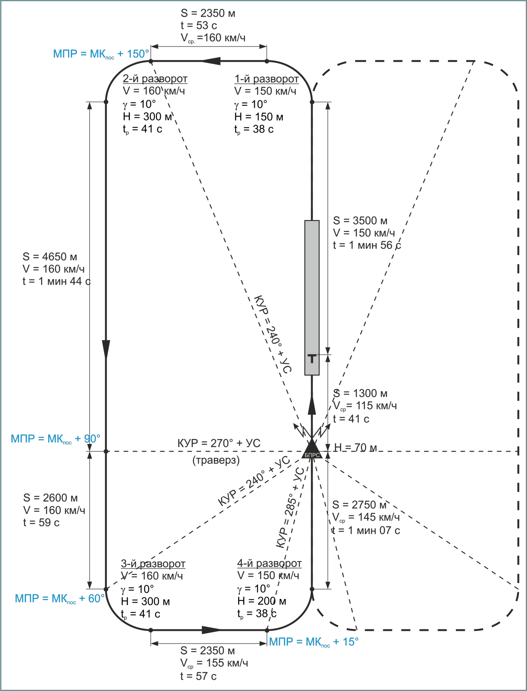

Рис. 9.6. Схема захода на посадку методом "большой коробочки"

Четвертый разворот выполнять в режиме горизонтального полета на высоте не
менее 200 м и скорости 150 км/ч. Ввод в разворот при
КУР=285°±УС(КУР=75°±УС – при правой коробочке) или на расчетном МПР.

Начало всех разворотов и траверза контролировать по заранее рассчитанному
времени. В момент ввода в четвертый разворот острый конец стрелки
радиокомпаса подойдет к верхнему обрезу планки курсозадатчика, угол между
ними будет равен 15°. При правильном выполнении разворота примерно за 30°
до выхода на посадочный курс обе стрелки должны совместиться.

Дальнейший разворот выполнять при совмещенных стрелках. Если в первой
половине разворота угол между стрелкой радиокомпаса и курсозадатчиком
остается неизменным или даже увеличивается, крен необходимо уменьшать.

Если же после совмещения стрелка радиокомпаса начнет отставать от
курсозадатчика, крен необходимо увеличивать, но не более чем до 15°.

После выхода из четвертого разворота вертолет перевести в режим снижения с
вертикальной скоростью 2–3 м/с и уменьшить скорость полета с таким
расчетом, чтобы над ближней ПРС при высоте полета 100 м она составляла 120
– 140 км/ч. Если снижение до высоты 100 м произведено до прохода ПРС,
вертолет перевести в режим горизонтального полета.

Если выход из разворота в направлении на приводную радиостанцию выполнен
с курсом, отличающимся от посадочного, ошибку исправлять в процессе
снижения, для чего при КУР=0 произвести отсчет разницы между фактическим
магнитным курсом и посадочным. Если она будет более 5°, ошибку выхода
исправить на снижении, для чего вертолет развернуть на стрелку радиокомпаса
(от курсозадатчика) так, чтобы она установилась посредине между отсчетным
индексом и курсозадатчиком; если УГР-4УК показывает магнитный курс больше
посадочного, то доворот выполнять вправо, при курсе меньше посадочного –
влево.

После доворота выдерживать исправленный магнитный курс до тех пор, пока
стрелка радиокомпаса не совместится с курсозадатчиком, после чего развернуть
вертолет на совмещенные стрелки радиокомпаса и курсозадатчика до
установления их под отсчетным индексом (при отсутствии сноса на посадочном
курсе) или в стороне от него на величину угла сноса.

При сносе вправо стрелку курсозадатчика, установленную на магнитный курс
посадки, и стрелку радиокомпаса удерживать совмещенными и отклоненными
вправо от верхнего неподвижного индекса на величину угла сноса.

После пролета ближней ПРС выдерживать подобранный посадочный курс.

При заходе на посадку методом "большой коробочки" после пролета ближней
ПРС взять посадочный курс и по истечении расчетного времени (для штилевых
условий 2 минуты) выполнить первый разворот и далее совершить полет по
коробочке.

## Заход на посадку методом "малой коробочки"

В случаях, когда выход на ПРС произведен с магнитным курсом, отличающимся
от посадочного более чем на 60°, но не более чем на 120°, заход на посадку
выполнять по "малой коробочке".

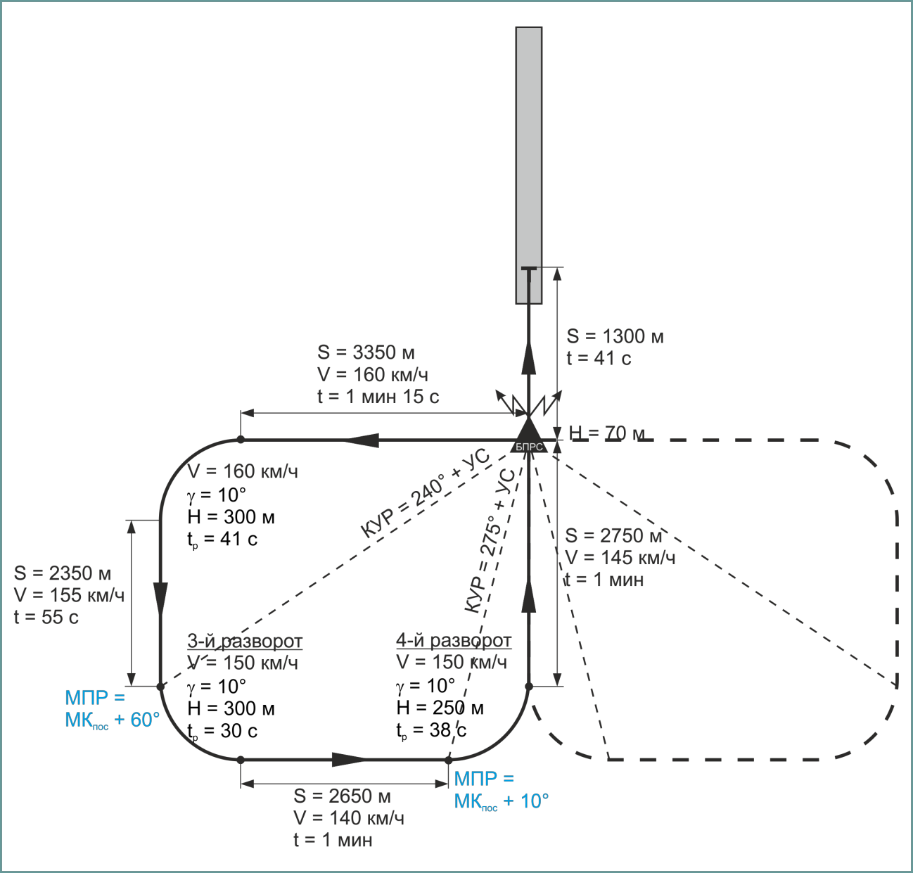

Рис. 9.7. Схема захода на посадку методом "малой коробочки"

При заходе на посадку методом "малой коробочки" после прохода ближней ПРС
взять курс, перпендикулярный посадочному, с учетом угла сноса. По истечении
расчетного времени (для штилевых условий 1 мин 15 с) выполнить разворот на
курс, обратный посадочному, с учетом угла сноса. Дальнейший маневр захода и
расчет на посадку совпадают с элементами большой коробочки.

## Заход на посадку с прямой методом отворота на расчетный угол

В случае когда выход на ближнюю ПРС производится с магнитным курсом,
обратным посадочному, или с разницей не более 60°, заход на посадку следует
выполнять отворотом на расчетный угол.

При подготовке к полету с учетом угла сноса (УС) ветра рассчитываются
магнитные курсы (МК) и путевое время (tгп) для каждого участка маневра, а
также величина расчетного угла отворота (РУ). Значения рассчитываются
заранее и сводятся в таблицы или графики.

Высота участка, м | РУ | tгп
-----|---|----
300  |28 |1.30
400  |19 |2.15
500  |14 |3.00
600  |12 |3.45
700  |10 |4.30
800  |8  |5.15
900  |7  |6.00
1000 | 6 |6.45

!!! note "Примечание"
    При расчете таблицы приняты штилевые условия:
    Vгп=160 км/ч; Vy=2–3 м/с; Wсн.ср=150 км/ч; γ=10°.

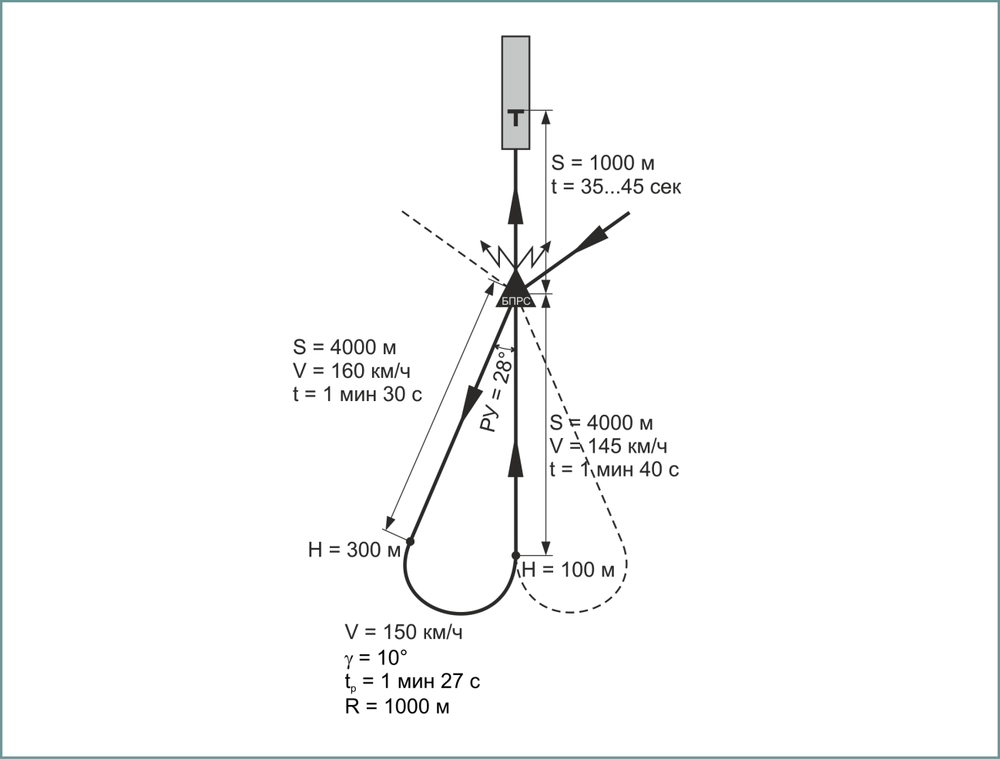

Рис. 9.8. Схема захода на посадку с прямой методом отворота на расчетный угол

При заходе на посадку с прямой отворотом на расчетный угол вывести вертолет
на заданной высоте на БПРС. После прохода БПРС выполнить отворот вправо
или влево на расчетный угол с учетом сноса и продолжать полет с этим курсом
до расчетной точки. По истечении расчетного времени (tгп) перевести вертолет
на снижение со скоростью 150 км/ч и вертикальной скоростью 2–3 м/с,
выполнить разворот на посадочный курс с креном 10° и потерей высоты 200 м.

При снижении на посадочном курсе учитывать угол сноса, выдерживать
заданный режим, не допускать полета со скольжением. Достигнув высоты
100 м, перевести вертолет в горизонтальный полет, ближнюю ПРС пройти на
высоте 100 м и скорости 120–140 км/ч.

После выхода из облаков визуально уточнить расчет, снизиться и произвести
посадку.

## Особенности выполнения взлетов и посадок на высокогорных площадках

Минимальные размеры площадки для взлета и посадки по-вертолетному в зоне
влияния земли при отсутствии препятствий на подходе должны составлять
50х50 м, а при наличии препятствий высотой до 15 м на границах площадки на
высотах до 1500 м – 50х120 м; на высоте 2000 м – 50х165 м; на высоте 3000 м –
50х255 м; на высоте 3500 м – 50х300 м; на высоте 4000 м–50х345 м.

Минимальные размеры площадки при взлете и посадке по-самолетному должны
составлять на высотах до 1500 м – 50х160 м; на высоте 2000 м – 50х225 м; на
высоте 3000 м – 50х350 м; на высоте 3500 м – 50х410 м; на высоте 4000 м –
50х475 м.

Минимальные размеры площадки при посадке по-самолетному с одним
работающим двигателем на высотах до 1500 м должны составлять 50х190 м при
приземлении на скорости 10–20 км/ч и 50х360 м при приземлении на скорости
50 км/ч.

Взлет по-вертолетному с разгоном вне зоны влияния земли применять в тех
случаях, когда площадка имеет ограниченные размеры и окружена
препятствиями, а запас мощности двигателей позволяет выполнять висение вне
зоны влияния земли.

Посадку по-вертолетному с зависанием вне зоны влияния земли применять на
ограниченные площадки с полетным весом вертолета, позволяющим выполнять
висение вне зоны влияния земли.

Взлет по-вертолетному с разгоном в зоне влияния земли применять в тех
случаях, когда запас мощности двигателей обеспечивает возможность
выполнения висения на высоте не менее 3 м, а размеры площадки позволяют
выполнять разгон в зоне влияния земли.

Посадку по-вертолетному с зависанием в зоне влияния земли применять в тех
случаях, когда размеры площадки и подходы к ней, а также запас мощности
двигателей позволяют выполнять торможение и зависание в зоне влияния
земли.

Взлет по-самолетному применять в тех случаях, когда запас мощности
двигателей обеспечивает висение вертолета на высоте не менее 1 м, а
поверхность и состояние грунта площадки обеспечивают безопасный разбег
вертолета длиной 80–100 м и последующий разгон в зоне влияния земли.

Посадку по-самолетному применять в тех случаях, когда состояние грунта и
размеры площадки позволяют выполнять посадку с пробегом.

Торможение перед зависанием в зоне влияния земли выполнять с таким
расчетом, чтобы к моменту выхода на границу выбранной площадки высота
полета была не более 2–3 м, а скорость полета порядка 5–10 км/ч. Зависание
по возможности выполнять в центре площадки с последующим выбором места
приземления и оценкой пригодности состояния грунта для приземления. К
выбранному месту приземления произвести подлет на скорости 5–10 км/ч.

При заходе на посадку на площадку, имеющую препятствия на ее границе со
стороны захода, пролет препятствий выполнять с превышением над ними не
менее 10 м.

При выполнении захода на укладку груза на внешней подвеске гашение
скорости производить заблаговременно. Дистанция торможения при заходе на
высокогорную площадку с грузом на внешней подвеске увеличивается в 1,5–
2 раза по сравнению с дистанцией торможения в равнинной местности.
Увеличение интенсивности торможения приводит к усложнению техники
пилотирования и вызывает раскачку груза.

## Взлет и посадка на площадках с уклонами

Площадки, расположенные в горах, почти всегда имеют уклоны различной
величины.

Максимальные величины уклонов площадки для выполнения взлета и посадки
по-вертолетному без выключения двигателей после приземления не должны
превышать:

- носом на уклон 7°;
- носом под уклон 5°;
- левым бортом на уклон 7°;
- правым бортом на уклон 2°30'.

Максимальные величины уклонов площадки для выполнения взлета и посадки
по-вертолетному с выключением двигателей после приземления не должны
превышать:

- носом на уклон и под уклон, левым бортом на уклон 3°;
- правым бортом на уклон 2°30'.

Взлеты и посадки по-вертолетному на площадках с уклонами при ветре
скоростью до 5 м/с разрешается выполнять при любом положении вертолета
относительно направления ветра, при скорости ветра более 5 м/с только против
ветра с учетом максимальной величины допустимых уклонов. Взлеты и посадки
на площадки с уклонами по возможности выполнять при положении вертолета
носом или левым бортом на уклон. Наиболее безопасными являются взлет и
посадка носом на уклон.

При выполнении посадки носом под уклон зависание производить на высоте не
менее 3 м во избежание касания хвостовой опорой о землю. Снижение после
зависания производить строго вертикально, не допуская перемещений
вертолета, особенно хвостом на уклон.

В момент зависания над площадкой на высоте 3 м расстояние от пяты
хвостовой опоры до земли составляет 0,8–0,6 м, в момент отделения вертолета
от земли при взлете и в момент приземления при посадке – 0,3 м. При
энергичном торможении перед зависанием и энергичном уменьшении общего
шага после приземления возможно касание хвостовой опорой о землю.

Посадку вертолета на площадку с уклоном и взлет с нее при положении
вертолета вдоль уклона производить с заторможенными колесами шасси.

При посадке па площадку поперек уклона удерживать вертолет от бокового
смещения под уклон отклонением ручки управления в сторону,
противоположную смещению. При отсутствии перемещения висение вертолета
над площадкой происходит с креном.

Отрыв вертолета от земли при взлете поперек уклона выполнять строго
вертикально, не допуская боковых перемещений и разворотов вертолета. В
момент отделения вертолета от земли при положении его левым бортом на
уклон возникает клевок (резкое накренение) вертолета влево, при положении
вертолета правым бортом на уклон – клевок вправо, который парировать
соответствующим отклонением ручки управления.

## Выполнение пилотажа

Пилотаж выполняется вне облаков при горизонтальной видимости не менее
2000 м в диапазоне допустимых скоростей полета и полетных весов.

На вертолете выполняются:

- развороты, виражи и спирали;
- пикирование;
- горки;
- развороты на горке.

Перед выполнением пилотажа необходимо отключить канал высоты
автопилота.

Форсированные виражи и развороты на высотах 50 – 1000 м при нормальном
взлетном весе и менее на скоростях полета 120 – 250 км/ч выполняются с
креном до 45°.

На истинных высотах до 50 м над рельефом местности допускается угол крена,
по величине численно равный высоте полета. Величину крена контролировать
по показаниям АГБ.

#### ВЫПОЛНЕНИЕ ВИРАЖЕЙ, РАЗВОРОТОВ И СПИРАЛЕЙ

Перед выполнением виража (разворота) необходимо:

- проверить, свободно ли воздушное пространство в направлении
выполнения виража;
- сбалансировать вертолет в горизонтальном полете на заданной
скорости и снять усилия с ручки управления нажатием кнопки снятия
усилий;
- наметить ориентир для вывода из виража.

Ввод в вираж (разворот) выполнять координированными движениями ручки
управления и педалей, а заданную высоту и скорость выдерживать изменением
общего шага несущего винта.

При вводе в левый вираж вертолет имеет тенденцию к изменению угла тангажа
на пикирование, а при вводе в правый – на кабрирование.
При достижении заданного угла крена по показаниям АГБ-ЗК запомнить
положение естественного горизонта относительно остекления кабины при этом
крене и удерживать это положение в процессе выполнения виража.

При выполнении левого виража вертолет имеет тенденцию к увеличению
крена, при правом – к уменьшению.

Стремление вертолета изменить крен парировать отклонением ручки
управления в сторону, противоположную развороту – на левом вираже, и в
сторону разворота – на правом, добиваясь координации разворота отклонением
педали.

За 15–20° до намеченного ориентира или заданного значения курса
координированным отклонением ручки управления и педали в сторону,
обратную вращению, начать вывод вертолета из разворота с таким расчетом,
чтобы к моменту выхода вертолета на заданный ориентир (курс) крен был
убран полностью.

После вывода из разворота установить режим работы двигателей,
соответствующий режиму горизонтального полета.

Форсированные виражи и развороты с креном до 45° разрешается выполнять
как при постоянном значении общего шага винта, так и с изменением его
положения в процессе разворота.

При скоростях ввода менее 200 км/ч форсированный разворот выполнять при
постоянном значении общего шага винта, а на скоростях 200–250 км/ч – как
при постоянном значении общего шага, так и с уменьшением его на 2–5° по
УШВ.

При энергичном вводе в форсированный вираж или разворот при постоянном
значении общего шага винта происходит увеличение оборотов несущего винта
на 2–2,5%.

При вводе в форсированный вираж или разворот с уменьшением общего шага
происходит более энергичный заброс оборотов несущего винта, поэтому темп и
величина уменьшения общего шага винта и отклонение ручки управления на
себя на вираже и развороте должны быть такими, чтобы обороты несущего
винта, не выходили за допустимые пределы.

При выполнении форсированного виража (разворота) выдерживание заданной
высоты полета в процессе разворота производить изменением темпа
торможения скорости или уменьшением угла крена.

По достижении скорости 100 км/ч плавным отклонением ручки управления от
себя прекратить дальнейшее уменьшение скорости, а для сохранения высоты
увеличить режим работы двигателей. Вывод из виража (разворота) начинать за
15–20° до намеченного ориентира (курса).

Перед выполнением спирали сбалансировать вертолет на заданной скорости и
снять усилия с ручки управления.

Ввод в спираль производить с режима горизонтального полета или набора
(снижения) высоты координированным отклонением ручки управления и
педалей с одновременным изменением мощности двигателей до значения,
обеспечивающего сохранение заданной вертикальной скорости.

#### ПИКИРОВАНИЕ

Перед вводом в пикирование необходимо:

- осмотреть воздушное пространство, обратив особое внимание в
сторону пикирования;
- установить заданную скорость и соответствующий ей режим работы
двигателей;
- снять усилия с ручки управления;
- установить задатчик высоты радиовысотомера на высоту начала
вывода из пикирования.

Ввод в пикирование с горизонтального полета с изменением углов тангажа до
20° выполнять за время не менее 5–6 с отклонением ручки управления от себя
при постоянном значении общего шага винта, удерживая вертолет от кренов и
разворотов.

При вводе в пикирование наблюдается уменьшение оборотов несущего винта
на 1–2%.

Для ввода в пикирование с разворота с креном до 30° необходимо плавным
отклонением ручки управления от себя создать заданной угол пикирования с
одновременным выводом из крена.
Пикирование выполнять при постоянном значении общего шага винта.
Максимальные скорости начала вывода в зависимости от изменения угла
тангажа на пикировании и высоты полета приведены в таблице.

Высота, м | ≤ 150 км/ч | 180 км/ч | 200 км/ч| 220 км/ч
----------|------------|----------|---------|--------
До 500 |20 |20 |15| 10
500-1000| 20| 20| 15| –
1 000–2000| 20| 10| |

При достижении заданной скорости пикирования или высоты начала вывода из
пикирования с учетом просадки на выводе отклонением ручки управления на
себя при постоянном значении общего шага винта начать вывод вертолета из
пикирования.

Зависимость максимальной скорости начала вывода (км/ч) от высоты полета и
изменения угла тангажа на пикировании

Высота, м | Изменение угла тангажа: 10° | 20°
----------|-----------------------------|------
До 1000| 285| 270
1000 - 2000| 235| 220

Вывод из пикирования осуществлять за время не менее 8–9 с, не допуская
увеличения оборотов несущего винта более 103%.

Необходимо учитывать потерю высоты при выводе из пикирования (просадку)
за время 8–9 с, которая зависит от скорости начала вывода и изменения угла
тангажа на пикировании.

Потеря высоты (просадка) в метрах на выводе из пикирования

Скорость начала вывода из пикирования, км/ч | Изменение угла тангажа: 10° | 20°
----------|-----------------------------|------
180 | 60 | 90
200 | 70 | 120
220 | 85 | 150
240 | 100|  180
260 | 115|  200
280 | 130|  220

При достижении на выводе из пикирования угла тангажа на кабрирование 10° и
прекращении снижения вертолета плавным отклонением ручки управления от
себя перевести вертолет в горизонтальный полет, не допуская уменьшения
оборотов несущего винта менее 89%, и установить режим работы двигателей,
соответствующий очередному режиму полета или маневру.

#### ГОРКА

Перед вводом в горку необходимо:

- осмотреть воздушное пространство в направлении выполнения горки;
- установить заданную скорость и соответствующий ей режим работы
двигателей;
- снять усилия с ручки управления.

Ввод в горку производить с горизонтального полета отклонением ручки
управления на себя на скоростях, не превышающих максимально допустимых
значений. Рекомендуемая скорость ввода в горку не менее 150 км/ч.
Темп и величина отклонения ручки управления на себя должны быть такими,
чтобы вертолет достигал изменения угла тангажа на 20° за время не менее 6–
7 с. Ввод и вывод из горки производить при постоянном значении общего шага
винта.

При достижении заданного угла кабрирования незначительным отклонением
ручки управления от себя зафиксировать этот угол. Тенденцию уменьшения
угла кабрирования по мере уменьшения скорости вертолета на прямолинейном
участке горки парировать отклонением ручки управления на себя.

Вывод из горки начинать на скорости 110–100 км/ч. Для вывода отклонить
ручку управления от себя с темпом, обеспечивающим выход вертолета на
режим горизонтального полета за время не менее 5–6 с, не допуская
уменьшения скорости менее минимальной для данной высоты.

После вывода вертолета в горизонтальный полет установить режим работы
двигателей, соответствующий очередному режиму полета или маневру.

#### РАЗВОРОТ НА ГОРКЕ

Разворот на горке применяется для быстрого разворота на 180° (90°) после
набора высоты на горке. Техника выполнения первой половины разворота на
горке не отличается от техники выполнения горки. Рекомендуемые скорости
ввода в горку 180–220 км/ч.

Разворот на горке выполнять при постоянном значении общего шага винта.
При достижении скорости на горке 120 км/ч отклонением ручки управления и
педали в сторону разворота ввести вертолет в разворот с креном до 30° (чем
больше угол горки, тем больше должен быть крен на развороте).

После достижения заданного крена плавным отклонением ручки управления от
себя уменьшить угол тангажа вертолета, удерживая вертолет в
координированном развороте, не допуская уменьшения скорости до 70 км/ч и
менее.

При выполнении левого разворота на горке вертолет имеет тенденцию к
увеличению крена, при правом – к уменьшению. Стремление вертолета
изменить крен парировать отклонением ручки управления в сторону,
противоположную развороту – на левом вираже и в сторону разворота – на
правом, добиваясь координации разворота соответствующим отклонением
педали.

За 15–20° до намеченного ориентира (заданного курса) координированным
отклонением ручки управления и педали вывести вертолет из разворота в
горизонтальный полет на скорости не менее 70 км/ч.

{!docs/mi8/abbr.md!}
