# ВООРУЖЕНИЕ Ми-8МТВ2

Вооружение вертолета Ми-8МТВ2 может включать ракетное неуправляемое,
стрелково-пушечное, бомбардировочное вооружение и систему минирования
(пока не реализовано) в различных вариантах сочетания.

Система вооружения предназначена для размещения на вертолете, управления
режимами боевого применения и собственно боевого применения оружия
согласно предназначению. Включает в себя (Рис. 11.1 и Рис. 11.2):

- фермы с 6-ю балочными держателями БД3-57КрВ и приборами
управления стрельбой (ПУС);
- АЗСы и выключатели цепей систем сигнализации и управления
оружием;
- верхний и нижний щитки пульта вооружения командира экипажа;
- пульт бомбардировочного вооружения летчика-штурмана;
- щиток электросбрасывателя (ЭСБР-3П/А);
- пульт минного вооружения (не реализован);
- щиток переключения режима стрельбы носового пулемета ПКТ
 (пулемет не реализован);
- прицел ПКВ командира экипажа;
- прицел ОПБ-1р летчика штурмана (не реализован);
- кнопки стрельбы (пуска) оружия на каждой РППУ, кнопки сброса бомб
 (подвесок) на прицеле ОПБ-1р и две КСБ-49 с гибким проводом (у
левого и правого пилотов);
- фотоконтрольный прибор для контроля применения оружия АКС-2;
- подсистемы оружия и авиационные средства поражения (АСП):

    - неуправляемое ракетное вооружение (включает в себя блоки
Б8В20-А с неуправляемыми авиационными ракетами (НАР)
калибра 80-мм различных типов);
    - пушечное вооружение (включает в себя универсальные пушечные
контейнеры УПК-23-250 с двуствольными пушками ГШ-23Л и
снарядами 23-мм);
    - стрелковое вооружение (включает в себя гондолы универсальные
вертолетные ГУВ-8700 (9-А-669) со встроенными пулеметами ЯкБ-
12,7 (9-А-624) и ГШГ-7,62 (9-А-622), или со встроенным
гранатометом АГС-17 "Пламя-А" (9-А-800)), а также стрелковое
вооружение в грузовой кабине;
    - бомбардировочное вооружение (включает в себя бомбы калибра
100, 250 и 500кг различных типов и зажигательные баки (пока не
реализованы));
    - Вертолетная система минирования (включает в себя контейнеры
вертолетной системы минирования К-29 по 29 кассет в каждом с
различными минами (пока не реализованы)).

1. Предохранительный выключатель
вооружения (над левым блистером)
2. Верхний щиток пульта
вооружения командира экипажа
3. Нижний щиток пульта
вооружения командира экипажа
4. Прицел ПКВ командира экипажа
5. Кнопка сброса бомб КСБ-49
левого пилота
6. Кнопка стрельбы (пуска) оружия
на левой РППУ
7. Щиток электросбрасывателя
 (ЭСБР-3П/А)
8. Кнопка стрельбы (пуска) оружия
на правой РППУ
9. Прицел ОПБ-1р летчика
штурмана (пока не реализован)
10. Кнопка сброса бомб КСБ-49
правого пилота
11. Пульт бомбардировочного
вооружения летчика-штурмана
12. Панель АЗС системы
вооружения

## Фермы с 6-ю балочными держателями БД3-57КрВ и приборами управления стрельбой (ПУС)

Предназначены для подвески оружия и обеспечения поступления к оружию
управляющих электрических импульсов. Нумерация – справа налево, если
смотреть на вертолет спереди. Для обеспечения управления стрельбой НАР в
БД3-57КрВ №1, 6, 3 и 4 установлены приборы управления стрельбой ПУС-36-71,
которые обеспечивают выдачу импульсов на пуск ракет С-8 с интервалом
0.05сек между ракетами одного блока. Это обеспечивается использованием
механических вращающихся контактов и системой реле, что позволяет не
подавать импульсы в те стволы, которые уже отстрелялись. ПУС 1 обеспечивает
отстрел НАР из блоков на держателях №1 и2 (Рис. 11.2), ПУС №6 – из блоков
на держателях №5 и6, ПУС №3 –из блока №3, ПУС №4 –из блока №4.

Положение скользящих контактов ПУС на стволе №1 для ПУС №4 (к примеру)
сигнализируется табло ПУС 4 ВЗВЕДЕН на верхнем щитке пульта вооружения
командира экипажа.

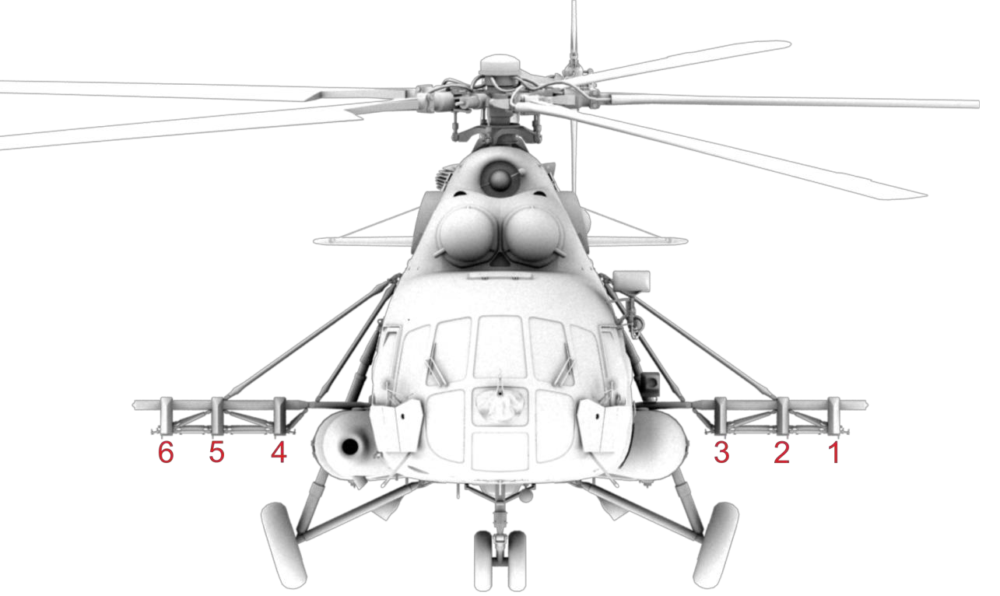

## АЗСы и выключатели цепей систем сигнализации и управления оружием

АЗСЫ СИСТЕМЫ ВООРУЖЕНИЯ предназначены для защиты цепей системы
вооружения от короткого замыкания. Расположены слева вверху на панели АЗС

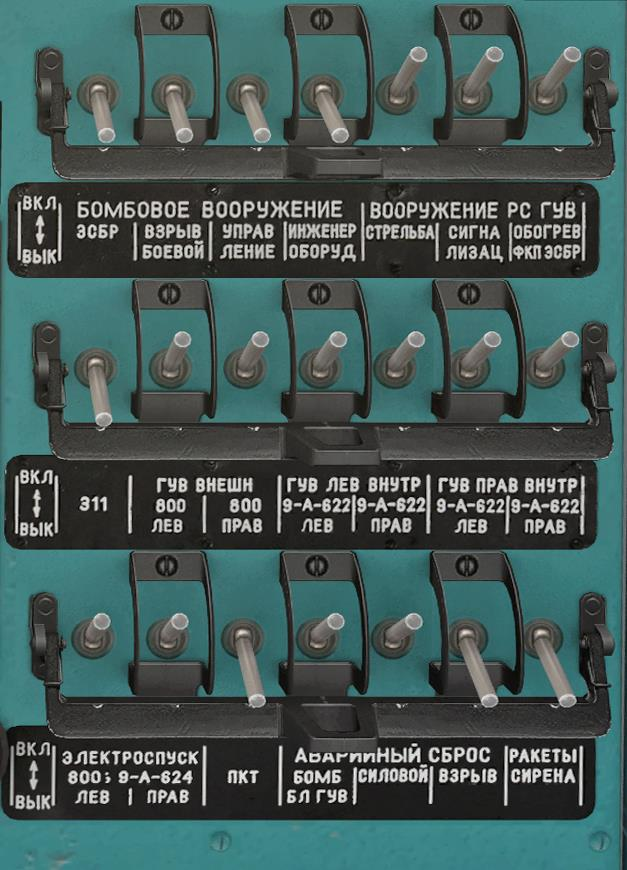

ПРЕДОХРАНИТЕЛЬНЫЕ ВЫКЛЮЧАТЕЛИ. Предназначены для подключения электроцепей
оружия к органам управления оружием (не путать с главными выключателями
подсистем оружия, которые подсоединяют цепи вооружения к энергосистеме
вертолета). Расположены над сдвижным блистером левого летчика. Без
включения предохранительных выключателей пуск (стрельба), а также сброс
бомб (подвесок) не будет работать. Необходимы для безопасной работы
наземного персонала при подготовке вооружения.

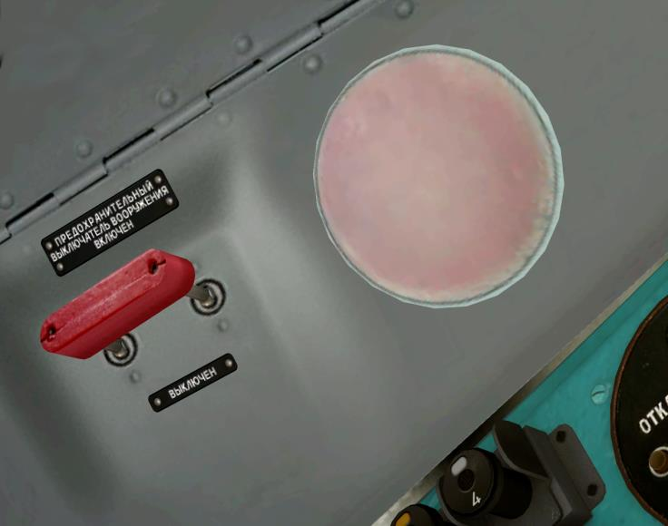

## Верхний и нижний щитки пульта вооружения командира экипажа

### Верхний щиток пульта вооружения командира экипажа

ВЕРХНИЙ ЩИТОК ПУЛЬТА ВООРУЖЕНИЯ КОМАНДИРА ЭКИПАЖА (Рис. 1.5) предназначен для
контроля готовности оружия, включения главных выключателей ГЛАВНЫЙ
ВЫКЛЮЧАТЕЛЬ РС ГУВ и ГЛАВНЫЙ ВЫКЛЮЧАТЕЛЬ МИННОГО ВООРУЖЕНИЯ (в
текущей версии не задействован), аварийного сброса подвесок, для взведения
ПУС, регулирования яркости сетки прицела ПКВ, а также для контроля остатка
патронов 12.7, 7.62-мм, снарядов 23-мм или гранат 30-мм.

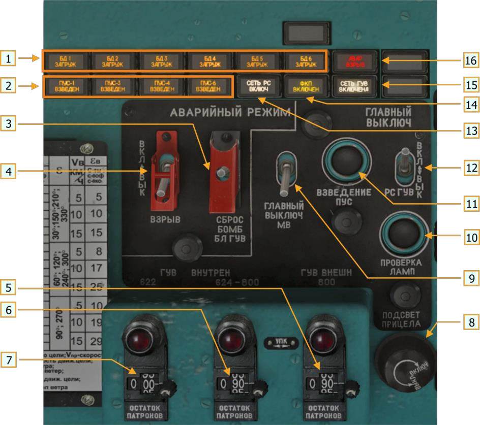

1. Табло сигнализации о подвеске вооружения на балочные держатели
2. Табло сигнализации взведения ПУС
3. Нажимной выключатель аварийного сброса от командира экипажа (уходит ВСЯ подвеска)
4. Выключатель аварийного взрыва
5. Счетчик снарядов для правого УПК при варианте с УПК (или гранат, при смешанной подвеске)
6. Счетчик снарядов для левого УПК при варианте с УПК (или патронов ГУВ к пулеметам 12,7мм при смешанной подвеске)
7. Счетчик патронов ГУВ к пулеметам 7,62
8. Ручка регулирования яркости сетки прицела
9. Главный выключатель (ГВ) минного вооружения
10. Кнопка проверки ламп на щитке вооружения командира экипажа
11. Кнопка взведения ПУС
12. Главный выключатель для НАР, УПК и ГУВ
13. Табло, сигнализирующее о включении цепей НАР
14. Табло, сигнализирующее о включении фотоконтрольного прибора (ФКП, не смоделирован)
15. Табло, сигнализирующее о включении цепей ГУВ
16. Табло, сигнализирующее о включении цепи аварийного взрыва

На пульте расположены:

1. ТАБЛО СИГНАЛИЗАЦИИ О ПОДВЕСКЕ ВООРУЖЕНИЯ НА БАЛОЧНЫЕ ДЕРЖАТЕЛИ. Необходимы
для сигнализации наличия подвесок на соответствующем БД.
1. ТАБЛО СИГНАЛИЗАЦИИ ВЗВЕДЕНИЯ ПУС. ПУС установлены непосредственно в БД3-
57КрВ №1, 3, 4, 6. Сигнализируют о положении подвижного контакта прибора
управления стрельбой в положении готовности к пуску НАР из ствола №1. ПУС-
1 – для блоков на БД №1 и 2, ПУС-3 – для БД № 3, ПУС-4 – для БД № 4, ПУС-6
для блоков на БД №5 и 6.
1. НАЖИМНОЙ ВЫКЛЮЧАТЕЛЬ (ДВИГАТЬ ВВЕРХ) АВАРИЙНОГО СБРОСА
от командира
экипажа. Применяется для быстрого облегчения вертолета при аварийной
посадке, а также для сброса бомб, в случае невозможности их сброса от
основной системы.

    !!! note "Примечание"
        При аварийном сбросе от командира экипажа осуществляется сброс ВСЕХ
        подвесок, в отличие от аварийного сброса от летчика-штурмана: от правого выключателя
        аварийного сброса сбрасывается подвеска ТОЛЬКО согласно варианту, установленному на
        щитке бомбардировочного вооружения. Т.е. к примеру, при установке варианта I на щитке
        бомбардировочного вооружения и попытке выполнить аварийный сброс от летчика штурмана,
        ничего не произойдет, т.к. вариант I указывает системе вооружения, что висят блоки, и потому
        ни тактический, ни аварийный сброс не произойдет. Для аварийного сброса любой подвески от
        летчика штурмана необходимо установить на пульте управления БВ вариант II.

1. ВЫКЛЮЧАТЕЛЬ АВАРИЙНОГО ВЗРЫВА. Установить в положение ВКЛ при
необходимости сбросить бомбы на взрыв. В случае варианта смешанной
подвески (например, блоки и бомбы), сбросятся и бомбы, и блоки, но бомбы
взорвутся при падении на землю.
1. СЧЕТЧИК СНАРЯДОВ для правого УПК при варианте с УПК (или гранат, при
смешанной подвеске).
1. СЧЕТЧИК для левого УПК при варианте с УПК (или патронов ГУВ к
СНАРЯДОВ
пулеметам 12,7мм при смешанной подвеске).
1. СЧЕТЧИК ПАТРОНОВ ГУВ к пулеметам 7,62.

    !!! note "Примечание"
        Число патронов, устанавливаемое на шкале счетчика, должно равняться:

            - для ГШ-23л – числу снарядов 23-мм в ленте, деленному на 2 (на счетчике 100,
            значит в ленте – 200);
            - для пулеметов 9-А-624 – числу патронов, поделенному на 5 (в счетчике 10, значит в
            ленте 50);
            - для пулеметов 9-А-622 числу патронов, поделенному на 4;
            - для ГУВ в гранатометном варианте число на шкале должно соответствовать числу
            гранат в ленте.

1. РУЧКА РЕГУЛИРОВАНИЯ ЯРКОСТИ СЕТКИ ПРИЦЕЛА.
Регулирует яркость сетки. В игре
по умолчанию установлено значение 50% от максимальной яркости.
1. Главный выключатель (ГВ) минного вооружения (в текущей версии не
задействован).
1. Кнопка проверки ламп на щитке вооружения командира экипажа. При ее
нажатии загораются все табло этого щитка.
1. КНОПКА ВЗВЕДЕНИЯ ПУС. Предназначена для взведения ПУС без выполнения
нажатия на боевую кнопку (на РППУ). Взведение ПУС – установка подвижных
контактов приборов управления стрельбой в положение готовности к пуску НАР
из ствола №1 каждого блока Б8. Взведение работает при установке ГВ РС ГУВ и
предохранительных выключателей в положение ВКЛ, переключателя УПК–ПКТ–
РС (Рис. 11.6, 2) в положение РС и переключателя блоков в АВТО или
положение, соответствующее текущее подвеске.

    !!! note "Примечание"
        Система вооружения НАР была доработана этой кнопкой по опыту
        применения Ми-8МТ в Афганистане, для возможности взведения ПУС в полете. Когда наземным
        специалистам по вооружению не было времени проводить подготовку оружия в полном объеме
        для огромной массы вертолетов, которые выполняли многократные вылеты в течение короткого
        времени. Невзведение ПУС перед боевым применением приводит к необходимости
        дополнительных нажатий на боевую кнопку для полного отстрела НАР из блоков или к
        отсутствию схода НАР при первом нажатии. Это обусловлено тем, что общее количество
        контактов, проходимых подвижным элементом ПУС, равно 36, а не 20. А количество пройденных
        контактов зависит от положения переключателя ПО8– ПО16–ПО4 (Рис. 11.6, 1).

1. ГЛАВНЫЙ ВЫКЛЮЧАТЕЛЬ ДЛЯ НАР, УПК И ГУВ (ГЛАВНЫЙ ВЫКЛЮЧ. PC ГУВ).
Предназначен для исключения случайного пуска оружия (случайной стрельбы).
Включается непосредственно при выходе на линию боевого пути и необходим
для подключения электроцепей пуска ракет, цепей сигнализации взведения
ПУС, а также контроля наличия подвесок на балочных держателях.
1. ТАБЛО, СИГНАЛИЗИРУЮЩЕЕ О ВКЛЮЧЕНИИ ЦЕПЕЙ НАР. Загорается после включения
ГВ PC (12) и предохранительного выключателя вооружения (Рис. 11.4).
1. Табло, сигнализирующее о включении фотоконтрольного прибора.
1. ТАБЛО, СИГНАЛИЗИРУЮЩЕЕ О ВКЛЮЧЕНИИ ЦЕПЕЙ ГУВ. Загорается после включения
варианта ГУВ на щитке бомбардировочного вооружения летчика штурмана и
предохранительного выключателя вооружения (Рис. 11.4).
1. Табло, сигнализирующее о включении цепи аварийного взрыва. Загорается
в положение ВКЛ переключателя АВАР ВЗРЫВ.

### Нижний щиток пульта вооружения командира экипажа

НИЖНИЙ командира экипажа (Рис. 11.6) предназначен
для выбора активного оружия (между НАР, 23-мм подвесными пушками или
носовым пулеметом ПКТ), управления стрельбой НАР, управления режимами
стрельбы ГУВ и работой фотоконтрольного прибора.

!!! note "Примечание"
    Следует отметить, что для выбора ГУВ в качестве активного оружия
    необходимо установить переключатель вариантов на щитке бомбардировочного вооружения у
    правого пилота в положение ГУВ

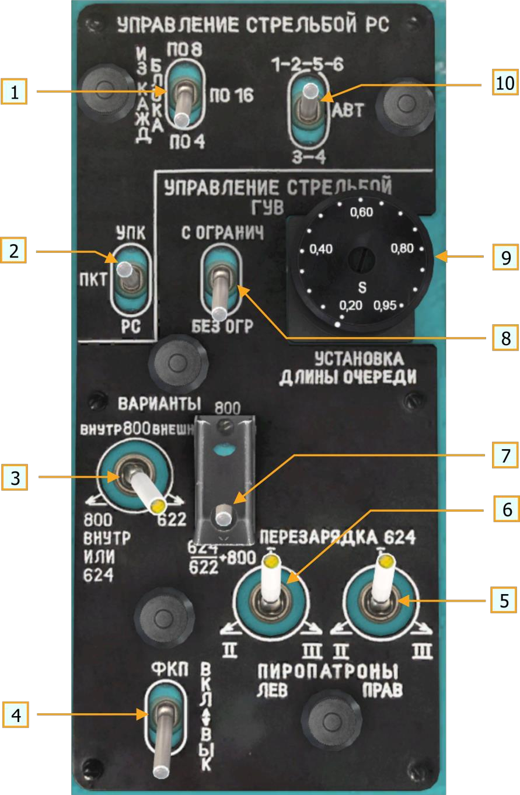

1. Переключатель установки количества НАР в серии ПО8– ПО16 –ПО4 из каждого блока
2. Переключатель выбора оружия: УПК –ПКТ – РС.
3. Перключатель вариантов стрельбы из ГУВ
4. Выключатель фотоконтрольного прибора (не смоделирован)
5. Переклчатель пиропатронов для перезарядки пулемета ЯкБ-12,7 правого ГУВ (три пиропатрона на пулемет: I II, III)
6.  Переключатель пиропатронов для перезарядки пулемета ЯкБ-12,7 левого ГУВ (три пиропатрона на пулемет: I II, III)
7.  Переключатель вариантов подвески ГУВ: положение 800 – только гранатометные ГУВ (1,2,5,6 БД); вариант 624/622+800 – смешанный вариант: 1, 6 гранатометные ГУВ, 2, 5 пулеметные ГУВ.
8. Выключатель ограничения длины очереди при стрельбу ГУВ
9. Ручка установки длины очереди при стрельбе ГУВ
10. Перключатель БЛОКИ, для выбора активных блоков при стрельбе НАР

На пульте расположены:

1. ПЕРЕКЛЮЧАТЕЛЬ УСТАНОВКИ КОЛИЧЕСТВА НАР В СЕРИИ: ПО8– ПО16 –ПО4. Указывает
количество НАР, выстреливаемых из каждого блока. К примеру, если
необходимо сделать залп из 8НАР при двух подвешенных блоках, то надо
выбрать вариант ПО4.
1. ПЕРЕКЛЮЧАТЕЛЬ ВЫБОРА ОРУЖИЯ: УПК – ПКТ – РС. Для выбора активного
оружия, которое будет стрелять при нажатии на боевую кнопку (кроме ГУВ: для
выбора ГУВ следует установить вариант ГУВ на щитке БВ летчика-штурмана).
УПК – огонь из пушек УПК-23-250. ПКТ – огонь из носового ПКТ (не реализован)
при его нахождении в походном положении. РС – пуск НАР из блоков Б8В20-А.
1. ПЕРЕКЛЮЧАТЕЛЬ ВАРИАНТОВ СТРЕЛЬБЫ ИЗ ГУВ: ВНУТР 800 ВНЕШН – 800 ВНУТР
ИЛИ 624 – 622. Положение ВНУТР 800 ВНЕШН – для выбора активным оружием
гранатометов на БД№ 1 и 6. Положение 800 ВНУТР ИЛИ 624 – 622 – для выбора
активным оружием ГУВ, подвешенных на БД № 2 и 5 (гранатометов или
пулеметов ЯкБ-12.7). Положение 622 – для выбора активным оружием
пулеметов ГШГ-7.62 на БД № 2 и 5. Работает совместно с переключателем
вариантов подвески (7) ГУВ 800– 624/622+800. Все возможные результаты
подключений оружия ГУВ при выборе различного взаимного положения
переключателей (3) и (7) рассмотрены ниже.
1. ВЫКЛЮЧАТЕЛЬ ФОТОКОНТРОЛЬНОГО ПРИБОРА.
Включает в действие фотоаппарат,
снимающий перекрестие прицела. Кадры делаются при каждом нажатии на
боевую кнопку на РППУ командира экипажа.
1.И (6) ПЕРЕКЛЮЧАТЕЛИ ПИРОПАТРОНОВ для перезарядки пулеметов ЯкБ-12,7 ГУВ.
Перед стрельбой необходимо установить в положение I. Необходимы для
перезарядки пулеметов 12.7 при осечках в стрельбе.
1. ПЕРЕКЛЮЧАТЕЛЬ ВАРИАНТОВ ПОДВЕСКИ ГУВ:
положение 800 – только
гранатометные ГУВ (1,2,5,6 БД); вариант 624/622+800 – для выбора активного
оружия при смешанном варианте: 1, 6 гранатометные ГУВ, 2, 5 пулеметные ГУВ.
Работает совместно с (3). Все возможные результаты подключений оружия ГУВ
при выборе различного взаимного положения переключателей (3) и (7)
рассмотрены ниже.
1. ВЫКЛЮЧАТЕЛЬ ОГРАНИЧЕНИЯ ДЛИНЫ ОЧЕРЕДИ ПРИ СТРЕЛЬБЕ ГУВ: С ОГРАН –
БЕЗ ОГРАН. В положении БЕЗ ОГРАН при нажатии и удержании боевой кнопки
стрельба из ГУВ будет вестись до полного окончания боекомплекта. В
положении С ОГРАН длина очереди устанавливается в соответствии с заданным
значением на ручке (9).
1. Ручка установки длины очереди при стрельбе ГУВ. Задает длину очереди
ГУВ:

    - для обеспечения стрельбы короткими и средними очередями на
    шкале переключателя устанавливается временной интервал 0,25 или
    0,6с;
    - при стрельбе из гранатомета при установке значения временного
    интервала 0,25—1,00 с расход гранат в очереди приблизительно
    равен величине временного интервала, умноженного на 10;
    - при установке временного интервала 0,25с для пулемета ЯкБ-12,7
    длина очереди составляет 15..18 патронов, для пулемета ГШГ-7,62 —
    20..25 патронов, а при установке 0,6 с — соответственно 40—42 и
    50—60 патронов.

1. ПЕРЕКЛЮЧАТЕЛЬ БЛОКИ, для выбора активных блоков при стрельбе НАР: 1-2-
5-6 – АВТ – 3-4.

В положении 1-2-5-6 НАР при нажатии на боевую кнопку выходят в следующей
последовательности:

- НАР №1 – из блока №1,
- через 0.025 сек – НАР №1 из блока №2;
- одновременно со сходом НАР из блока №1 сходит НАР №1 из блока
 №6, через 0.025с – из блока №5.

Интервал между сходом НАР из одного блока – 0.05с.

В положении АВТ – начинается сход ракет из блоков на БД№1, 2, 5 и 6, а после
полного израсходования в них ракет, система автоматически переключается на
блоки № 3 и 4. Во всех других положениях сходят ракеты из блоков, номера БД
которых соответствуют положению переключателя.

## Пульт бомбардировочного вооружения летчика-штурмана

Пульт бомбардировочного вооружения предназначен для сигнализации наличия
и управления тактическим и аварийным сбросом подвешенного вооружения с
балочных держателей, а также для подключения цепей ГУВ. Пульт находится
справа на верхней жесткости каркаса фонаря кабины экипажа на рабочем месте
летчика-штурмана (Рис. 11.7).

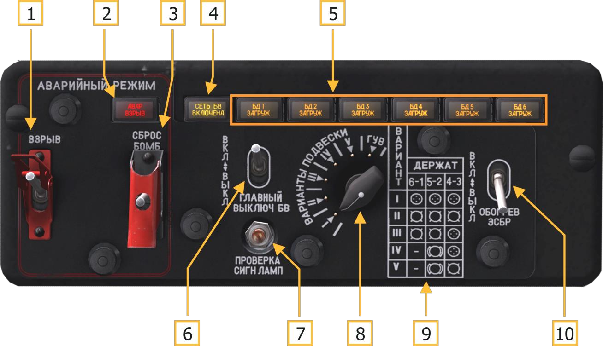

1. Включение аварийного взрыва
2. Табло сигнализации включения цепи аварийного взрыва
3. Выключатель аварийного сброса
4. Табло сигнализации включения сети бомбардировочного вооружения
5.  Табло (6шт) сигнализации наличия какой-либо подвески на БД3-57
6.  Главный выключатель бомбардировочного вооружения
7.  Кнопка проверки ламп
8. Галетный переключатель вариантов подвески
9. Схема-памятка по вариантам подвески
10. Выключатель обогрева ЭСБР (не задействован)

1. ВЫКЛЮЧАТЕЛЬ ВЗРЫВ (закрыт колпаком) – для активации цепи аварийного
взрыва при сбросе бомб;
1. КРАСНОЕ ТАБЛО АВАР. ВЗРЫВ — для сигнализации готовности цепи аварийного
сброса авиабомб на взрыв, загорается после включения выключателя ВЗРЫВ;
1. ВЫКЛЮЧАТЕЛЬ СБРОС БОМБ (закрыт колпаком) – для аварийного сброса бомб;
1. БЕЛОЕ ТАБЛО СЕТЬ БВ ВКЛЮЧ. — для сигнализации включения цепи сброса
бомб, загорается после включения выключателя ГЛАВНЫЙ ВЫКЛЮЧ. БВ;
1. ШЕСТЬ ЖЕЛТЫХ ТАБЛО БД1 ЗАГРУЖ — БД6 ЗАГРУЖ — для сигнализации наличия
бомб на держателях, загораются при включении главного выключателя БВ;
1. ВЫКЛЮЧАТЕЛЬ ГЛАВНЫЙ ВЫКЛЮЧ. БВ — для включения цепей боевого сброса
бомб;
1. КНОПКА ПРОВЕРКА СИГН. ЛАМП — для проверки исправности всех ламп на
пульте штурмана и летчика;
1. ПЕРЕКЛЮЧАТЕЛЬ ВАРИАНТЫ ПОДВЕСКИ, который в зависимости от варианта
применения средств поражения обеспечивает подключение к цепи боевого и
аварийного сброса только тех держателей, на которые подвешены бомбы
(главная задача – не допустить случайного сброса "НЕ бомбового" вооружения).
Имеет пять положений.
    - I – "все блоки": в этом положении, несмотря на включение всех цепей
    для тактического (боевого) сброса, при нажатии на одну из трех
    кнопок СБРОС (КСБ-49 или на ОПБ1р) сброса бомб, и вообще любого
    вооружения с БД не произойдет;
    
    !!! note "Примечание"
        Необходимо помнить, что система сброса ничего "не знает" о типе подвешенного
        вооружения кроме как "читая" положение галетного переключателя (8).
    
    - II – "все бомбы": в этом положении при нажатии любой кнопки
    СБРОС будет осуществляться поочередный сброс со всех БД любого
    подвешенного вооружения, начиная с БД-6 при первом нажатии;
    - III – "4 бомбы + 2 блока": в этом положении при нажатии любой
    кнопки СБРОС будет осуществляться поочередный сброс с БД 6-1-5-2
    любого подвешенного вооружения, начиная с БД-6 при первом
    нажатии;
    - IV – "2 тяжелые бомбы +2 блока": в этом положении при нажатии
    любой кнопки СБРОС будет осуществляться поочередный сброс
    только с БД 5-2 любого подвешенного вооружения, начиная с БД-5
    при первом нажатии;
    - V – "2 тяжелые бомбы + 2 обычные": в этом положении при нажатии
    любой кнопки СБРОС будет осуществляться поочередный сброс с БД
    5-2-4-3 любого подвешенного вооружения, начиная с БД-5 при
    первом нажатии;
    
    !!! note "Примечание"
        Прочерк для вариантов IV и V на схеме-памятке означает, что импульс на сброс с
        этих БД (с прочерком) системой подаваться не будет, символ означает тяжелую бомбу
        или зажигательный бак, однако это значения не имеет: если летчик установит это положение
        при подвешенных Б8В20, ГУВ или УПК на БД 5 и 2, то успешно будет выполнен сброс этого
        вооружения.

    - ГУВ – это положение предназначено для подключения цепей питания
    стрельбой ГУВ. Это положение "перекрывает" логику всех остальных
    переключателей, т.е. если оно включено, кроме стрельбы ГУВ
    никакой стрельбы из другого оружия или сброса с держателей
    происходить не будет (кроме аварийного сброса от командира
    экипажа).

1. ВЫКЛЮЧАТЕЛЬ ОБОГРЕВ ЭСБР — для включения обогрева
электросбрасывателя при отрицательных температурах (в игре не реализован).

## Щиток электросбрасывателя (ЭСБР-3П/А)

Электросбрасыватель ЭСБР размещен в кабине экипажа под приборной доской
летчика-штурмана. Обеспечивает одиночный или залповый сброс авиабомб, а
также выбор очередности для тактического сброса любой подвески.

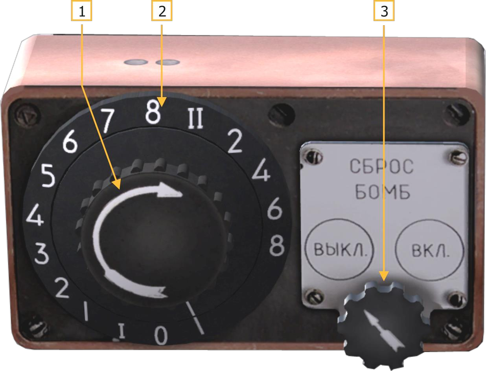

1. Рукоятка подачи импульсов
2. Лимб ЭСБР с оцифровкой
3. Выключатель СБРОС БОМБ

На передней панели ЭСБР размещены:

1. РУКОЯТКА ПОДАЧИ ИМПУЛЬСОВ,
которая имеет два положения для установки:
положение I — для одиночного сброса и положение II —для залпового сброса
одновременно с двух держателей;
1. ЛИМБ С ОЦИФРОВКОЙ для контроля сброшенных бомб, а также для ручного
назначения очередности (недокументированные возможности) очередности
подачи импульсов на БД для сброса бомб;
1. ВЫКЛЮЧАТЕЛЬ СБРОС БОМБ — для подключения ЭСБР к цепи сброса авиабомб.

ДЛЯ СБРОСА БОМБкроме включения АЗС, установки варианта подвески и
включения главного выключателя БВ необходимо корректно установить ЭСБР в
соответствующее задаче положение рукояткой (1) и включить его (3).

При установке рукоятки (1) в положение \ и 0 лимба ничего не будет работать,
эти положения нужны для тестирования ЭСБРа с помощью специальных
устройств.

ПОЛОЖЕНИЕ I. Дает команду ЭСБРу осуществлять сброс бомб по одной, начиная с
БД-6 и далее поочередно БД-1-5-2-4-3, если на пульте бомбардировочного
вооружения будет установлен вариант II. Однако умелое использование ЭСБР
позволяет выбрать любую подвеску для сброса с первого нажатия. К примеру,
если необходимо сбросить груз с БД 3, то необходимо:

- отключить ЭСБР – (3) в положение ВЫКЛ;
- установить вариант II на пульте БВ (можно и V, но тогда дальнейшие
действия будут отличаться);
- установить рукоятку на ЭСБРе (1, Рис. 11.8) в положение арабской 5.

Далее, при включении ЭСБРа это будет воспринято им как то, что уже были
поданы импульсы сброса на БД 6-1-5-2-4 и сошло 5 бомб. И теперь следующее
нажатие СБРОС приведет к сходу бомбы (или чего бы то ни было) с держателя
БД-3. Если все вооружение для сброса бомб включено (см.выше) и летчик
начнет поворачивать рукоятку ЭСБРа (1) руками, то с каждым щелчком после
римской I будет осуществляться сброс одной бомбы (или чего бы то ни было,
если вариант подвески на щитке БВ летчика-штурмана выбран II).

ПОЛОЖЕНИЕ II. Дает команду ЭСБРу осуществлять сброс бомб парами, начиная с
БД-6+1 и далее поочередно БД-5+2, 4+3, если на щитке бомбардировочного
вооружения будет установлен вариант II. В этом положении также можно
вручную изменить последовательность обработки БД для сброса,
руководствуясь методикой, описанной выше.

В вариантах IV и V на щитке БВ летчика штурмана (при условии, что все
оборудование для сброса включено) с первым нажатием на СБРОС будет
осуществляться сброс с держателя БД-5 (или БД5+2, если на ЭСБРе было
установлено II). Т.е. на БД 6 и 1 импульсы на открытие замков подаваться не
будут.

## Пульт минного вооружения (не реализован)

Реализация отложена

## Щиток переключения режима стрельбы носового пулемета ПКТ (пулемет не реализован)

Реализация носового ПКТ не планируется.

## Прицел ПКВ командира экипажа

Вертолетный коллиматорный прицел ПКВ (Рис. 11.9) предназначен для
прицеливания и определения дальности до цели внешнебазовым способом при
стрельбе из ПКТ и пушек, пусках неуправляемых ракет и бомбометании.

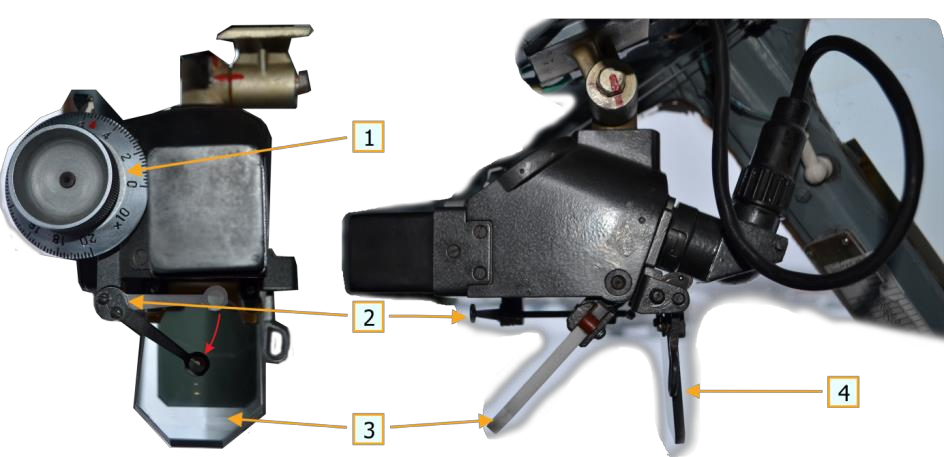

1. Лимб
2. Механический дублер (стрелкой показано
направление приведения в рабочее
положение)
3. Отражатель
4. Светофильтр

При включении АЗС СИГНАЛИЗАЦИЯ включается лампа прицела и в отражателе
появляется сетка прицела, имеющая кольца и деления Рис. 11.10.

ОПРЕДЕЛЕНИЕ ДАЛЬНОСТИ ДО ЦЕЛИ (*Dt*) с помощью ПКВ можно выполнить по
зависимости:

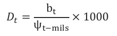

где: 
bt – база цели (известное расстояние межлу левой и правой частью
объекта); 
ψt−mils – угловое расстояние между этими же элементами в прицеле в
тысячных долях радиана.

Для примера, объект имеющий расстояние по фронту между крайними точками
100м в прицеле будет занимать 100тыс радиана с дальности 1000м.

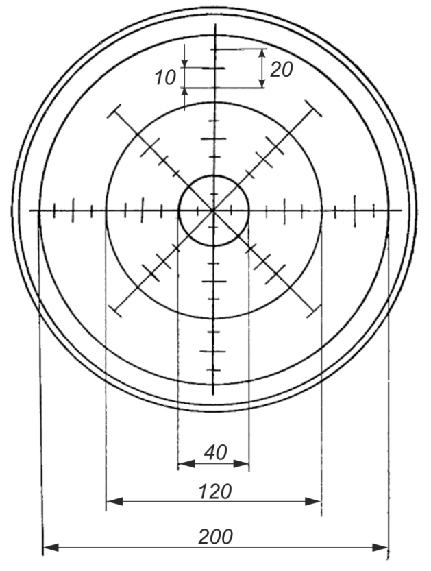

Прицел установлен перед левым летчиком на специальном кронштейне. Для
выполнения прицеливания летчику приходится поднимать сидение на 15..20см.

!!! info "Основные данные прицела"
    Угловая величина радиуса колец сетки прицела:

    - размеры малого 20 тыс.радиана
    - среднего 60 тыс.
    - большого 100 тыс.

    Угловая величина малого деления сетки: 10 тыс.

    Угловая величина большого деления сетки: 20 тыс.

    Оцифровка шкалы поворотного лимба: через 20 тыс.

    Цена малого деления лимба: 2 тыс.

    Цена большого деления лимба: 4 тыс.

    Диапазон углов прицеливания, которые возможно устанавливать с помощью шкалы поворотного лимба: 0—200 тыс.(0-11,5°)

    Угол визирования ПКВ относительно СГФ (шкала поворотного лимба в положении "0"): 57,5 тыс.(вверх)

    Красная отметка на лимбе соответствует: 52,4тыс

    Масса прицела: 1,8 кг

Угол прицеливания вводится путем отклонения отражателя с помощью
поворотного лимба [LCtrl] + [O] (по часовой стрелке), [LAlt] + [O] (против
часовой стрелки) или указателем мыши (навести на лимб и, вращая колесо,
изменять угол установки прицела). Прицеливание осуществляется путем
совмещения перекрестия прицела с целью (точкой прицеливания).

На случай выхода из строя оптической системы прицела предусмотрен
механический дублер. Дальномерные штрихи перекрестия сетки прицела
являются простейшим внешнебазовым дальномером и используются для
определения дальности до целей с известными линейными размерами.

Подключение прицела к бортовой сети 27 В осуществляется включением АЗС
СИГНАЛИЗАЦ. Для высвечивания сетки к прицелу через реостат ПОДСВЕТ
ПРИЦЕЛА подсоединяется электроосветитель. При наличии яркого фона может
быть использован откидной светофильтр (клавиатурную команду необходимо
назначить самостоятельно или использовать мышь).

За угол прицеливания принят угол, учитывающий угол понижения траектории
полета снаряда (пули), угол тангажа вертолета, угол установки оружия и угол
установки прицела относительно СГФ. Таким образом, УГОЛ ПРИЦЕЛИВАНИЯ (Рис.
11.11) – это угол между "линией бросания" оружия (на схеме – "ось оружия") и
линией визирования на цель.

Углы прицеливания в зависимости от дальности до цели, скорости полета,
режима (ГП или пикирование) рассчитываются для каждого вида вооружения.
Таблицы углов прицеливания приведены в разделе Боевое применение.

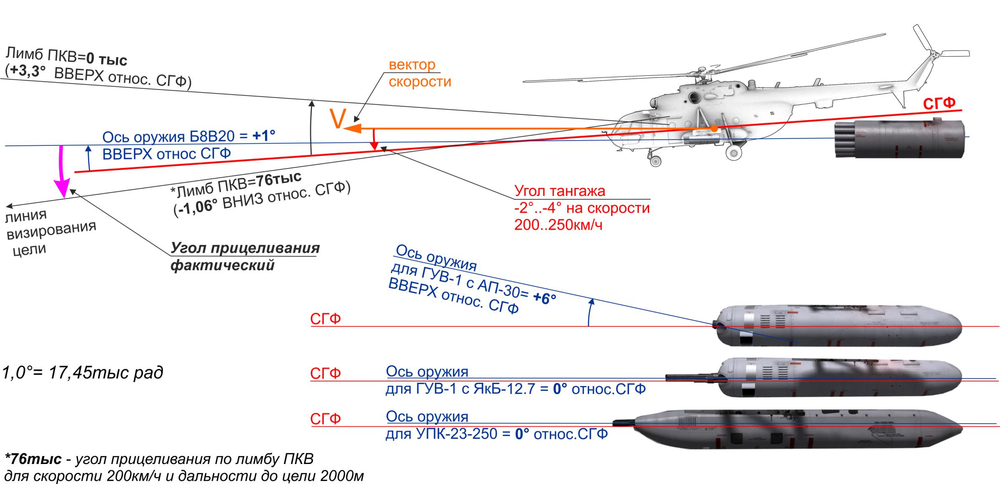

## Прицел ОПБ-1р летчика штурмана

(не реализован)

## Кнопки пуска (стрельбы) оружия и сброса

Кнопки пуска оружия [Space] – на каждой РППУ позволяют
применять все вооружение (кроме бомбового). Кнопки сброса бомб (подвесок)
[B] – одна на прицеле ОПБ-1р (не реализована) и две КСБ-49 с гибким
проводом (у левого и правого пилотов слева и справа от приборной доски
соответственно), Рис. 11.1, 5, 10. Эти кнопки для нажатия мышью в игре
недоступны, работает только клавиатурная команда.

## Фотоконтрольный прибор АКС-2

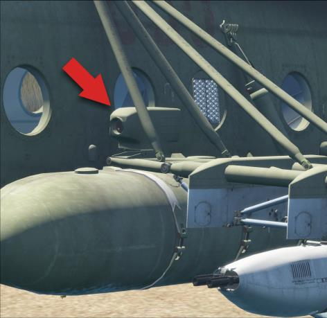

Фотоконтрольный прибор (ФКП) установлен на не сбрасываемой левой
спецферме и предназначен для фотоконтроля
результатов прицеливания командиром экипажа по цели.

В состав входит сам прибор и АЗС ФКП на нижнем щитке командира экипажа.

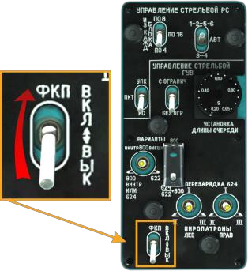

Включение ФКП осуществляется при нажатии боевой кнопки на любой из РППУ
при пуске НАР, стрельбе из УПК-23, ГУВ-1 (АЗС ФКП на пульте управления
стрельбой должен быть в положении ВКЛ).

!!! info "Основные данные АКС-2"
    Cкорость съемки: 24 или 48 кадр/с
    
    Открытый сектор обтюратора (устройство, предотвращающее блики от солнца): 120°
    
    Размеры кадра: 16 х 22 мм
    
    Применяемая кинопленка: 35мм (перфорированная)
    
    Выдержка:
    
    - при скорости съемки 24 кадр/с: 1/50 с
    - при скорости съемки 48 кадр/с: 1/100с
    
    Запас пленки в кассете: 60 м
    
    Продолжительность непрерывной съемки:
    
    - при скорости съемки 24 кадр/с: 2 мин. 12 сек.
    - при скорости съемки 48 кадр/с: 1 мин. 6 сек.
    
    Фокусное расстояние: 135 мм
    
    Максимальный потребляемый ток: 12 А
    
    Напряжение питания: 27 В
    
    Габаритные размеры: 474х139х210 мм
    
    Вес: 9,1 кг

В игре реализована скорость съемки 24 кадра в секунду.

!!! note "Примечание"
    Оптическая ось прибора расположена параллельно СГФ, поэтому положение
    центра кадра относительно цели, полученного в ФКП, будет немного отличаться от положения
    перекрестия прицела ПКВ относительно цели на скриншоте, если угол прицеливания на лимбе
    ПКВ отличается от значения 57,5 тыс.

Результат работы ФКП можно увидеть во время игры или при просмотре трека.
Для этого необходимо включить опцию GUN CAMERA MODE в настройках игры:

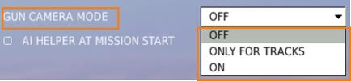

- OFF – выключено;
- ONLY FOR TRACKS – будет видим только в треке;
- ON – будет виден сразу при стрельбе (может вызвать небольшое
падение частоты кадров при малом быстродействии компьютера
игрока).

Все моменты нажатия на любую из кнопок стрельбы будут показаны как "фото",
сделанное прибором АКС-2:

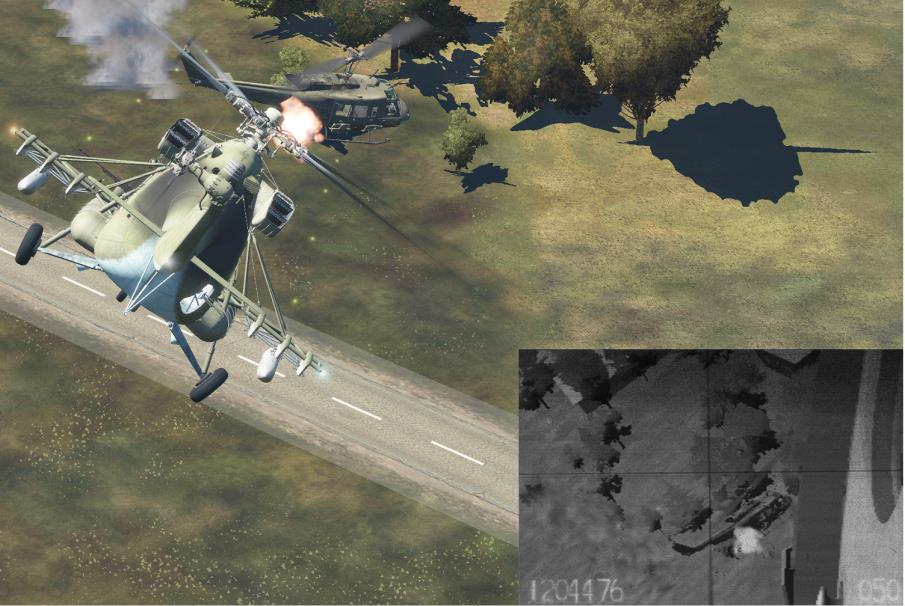

## Подсистемы оружия и авиационные средства поражения (АСП)

Система вооружения МИ-8МТВ2 включает в себя несколько подсистем,
благодаря чему имеется возможность применять вооружение Ми-8МТВ2 в
различных вариантах его сочетания (подвески).

### Варианты средств поражения при боевом применении вертолета для точек подвески  № 1–6

1 | 2 | 3 | 4 | 5 | 6 | Применение в ВС РФ
--|---|---|---|---|---|------
 – | Б8 | Б8 | Б8 | Б8 | – | да
Б8 | Б8 | Б8 | Б8 | Б8 | Б8 | нет
 – | УПК | Б8 | Б8 | УПК | – | да
Б8 | УПК | Б8 | Б8 | УПК | Б8 | нет
 – | АБ-250,100 | Б8 | Б8 | АБ-250,100 | – | да
АБ-250,100 | АБ-250,100 | Б8 | Б8 | АБ-250,100 | АБ-250,100 | нет
АБ-250,100 | АБ-250,100 | АБ-250,100 | АБ-250,100 | АБ-250,100 | АБ-250,100 | да
 – | АБ-500 | АБ-250,100 | АБ-250,100 | АБ-500 | – | да
ГУВ (гран) | ГУВ (пул) | Б8 | Б8 | ГУВ (пул) | ГУВ (гран) | нет
ГУВ (гран) | ГУВ (пул) | – | – | ГУВ (пул) | ГУВ (гран) | да
ГУВ (гран) | ГУВ (гран) | – | – | ГУВ (гран) | ГУВ (гран) | да
 – | ВСМ | ВСМ | ВСМ | ВСМ | – | да
 – | УПК | ВСМ | ВСМ | УПК | – | да
ГУВ (гран) | ГУВ (гран) | ВСМ | ВСМ | ГУВ (гран) | ГУВ (гран) | да
ГУВ (гран) | ГУВ (пул) | ВСМ | ВСМ | ГУВ (пул) | ГУВ (гран) | нет

!!! note "Примечание"
    В таблице обозначены:

    - Б8 – блок для 80-мм НАР типа С-8хх;
    - УПК –универсальный (унифицированный) пушечный контейнер УПК-23-250;
    - АБ-250, 100 –авиационные бомбы калибра 250 и 100 кг различных модификаций;
    - ГУВ (пул) – гондола универсальная вертолетная ГУВ-8700 с 1х12,7мм пулеметом
    ЯкБ-12,7 и 2х7,62мм пулеметами ГШГ-7,62;
    - ГУВ (гран) – гондола универсальная вертолетная ГУВ-8700 с 1х30мм гранатометом
    АГ-17А "Пламя-А";
    - ВСМ – контейнер с минами из вертолетной системы минирования ВСМ-1 (не
    реализовано).

Во всех вариантах может быть использован пулемет "КОРД" 12.7-мм,
устанавливаемый в проем двери грузовой кабины и пулемет "ПКТ" 7.62-мм на
правой створке грузового люка.

### Неуправляемое ракетное вооружение

Неуправляемое ракетное вооружение вертолета предназначено для поражения
линейных и площадных (групповых) небронированных и бронированных
наземных целей. На вертолете могут применяться блоки Б8В20-А с ракетами
типа С-8 калибра 80мм различного снаряжения. Ранее применявшиеся блоки
УБ-32А-24 с ракетами С-5 калибра 57мм сняты с вооружения.

В состав неуправляемого ракетного вооружения при применении блоков Б8В20-
А входят:

- четыре двадцатиствольных блока Б8В20-А (Рис.11.13)
 (цепи вооружения позволяют применение 6 х Б8В20А);
- 80 неуправляемых ракет типа С-8 (С-8М, С-8АС, С-8Б, С-8КО, С-80Ф),
 (цепи вооружения позволяют применение 120 НАР С-8хх);
- приборы управления стрельбой ПУС-36-71 (4 ПУС), установленные в
балочных держателях БД3-57КрВ №1, 3, 4 и 6;
- органы управления.

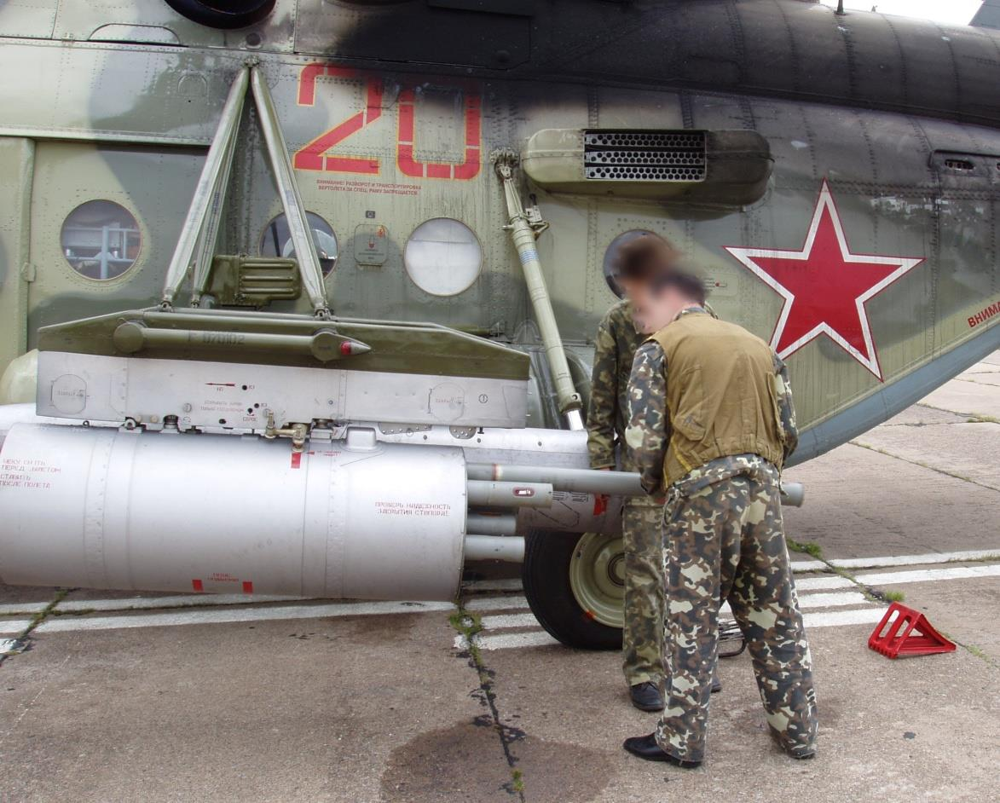

Блоки Б8В20-А представляют собой силовой корпус, внутри которого
смонтированы трубы-стволы, предназначенные для размещения неуправляемых
ракет перед их применением, а также для их пуска (Рис.11.14).

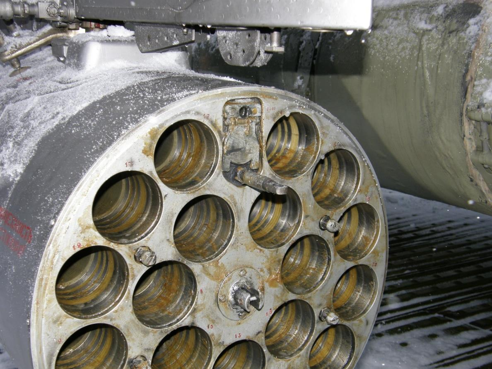

Блоки подвешиваются на замки держателей БДЗ-57КрВ вертолета. Масса одного
неснаряженного блока составляет 100 кг.

Масса снаряженных блоков зависит от типа ракет и составляет для Б8В20-А
332– 405 кг.

#### Основные ДАННЫЕ НЕУПРАВЛЯЕМЫХ АВИАЦИОННЫХ РАКЕТ (НАР) типа С-8

Табл. 11.4

Модификация | Предназначение | Диаметр, мм | Длина, мм | Стартовая масса, кг | Масса боевой/ специальной части, кг | Масса ВВ, кг | Тип боевой/ специальной части | Скорость ракеты, м/с | Дульная скорость, м/с | Угол прицеливания с дальности 2000м, тыс.радиана
-----------|-------------|-----------|---------|-----------|-----------|-------|-------------|------------|--------------|------
С-8ОМ | поражение средне бронированной б/т, ж/с | 80 | 1570 | 11,3 | 3,6 | 0,9 | кумулятивно-осколочная | до 650 | 37..52 | 76 
С-8КОМ | освещение целей | 80 | 1632 | 12,1 | 4,1 | \*\*\* | осветительный заряд, начало горения ч\з 17с, время горения 40с | до 545 | 37..52 | \*\*\*
С-8ЦМ | обозначение целей и объектов |  80 | 1632 | 11,1 | 4,1 | \*\*\* | маркерный дым | 670 | 37..52 | 76
С-8ОФП2 | поражение ж/с (усиленный фугасный и осколочный эффект), легко бронированной б/т | 80 | 1570 | 16,7 | 9,5 | 2,9 | осколочно- фугасная проникающая (срабатывание фугасного заряд с небольшой задержкой), осколок 3..6г, осколков 1000..2100 | до 450 | 37..52 | 98

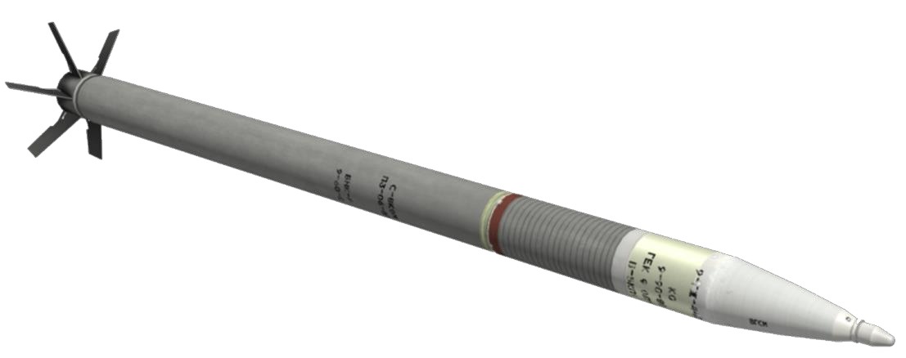

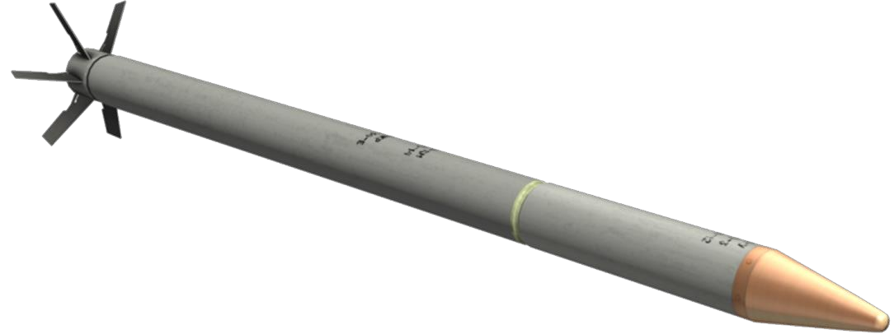

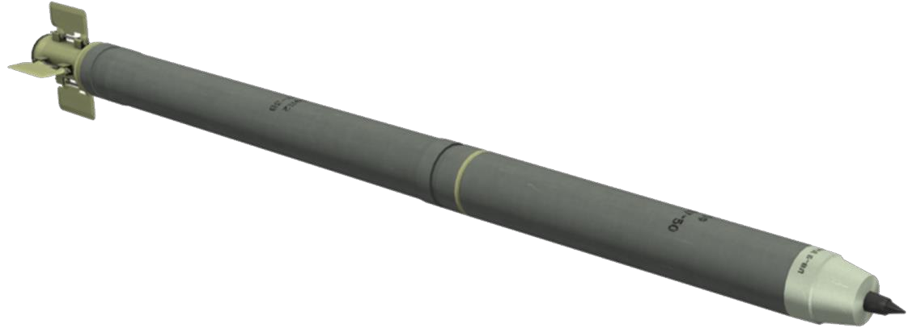

Для обеспечения ведения серийно-залпового пуска ракет из блоков в
различных вариантах в системе установлены приборы управления стрельбой
(ПУС-36-71), которые предназначены для последовательной отработки и
посылки в определенной последовательности импульсов электрического тока в
блоки Б8В20-А, размещены в балочных держателях. ПУС-1 обеспечивает
стрельбу из блоков, подвешенных на БД № 1 и 2, ПУС-3 – из блока БД№3, ПУС-
4 – из блока БД№4, ПУС-6 – из блоков БД № 5 и 6.

В подвешенном состоянии оси блоков отклонены на один градус вверх
относительно СГФ.

Действия с оборудованием и особенности боевого применения НАР см.здесь. //link

### Пушечное вооружение

Пушечное вооружение предназначено для поражения единичных и групповых
(небронированных и легкобронированных) наземных целей при их
визуальной видимости днем и ночью.

В состав пушечного вооружения входят:

- два универсальных (унифицированных) пушечных контейнера УПК-
23-250 с установленной в каждом из них пушкой ГШ-23Л (Рис. 11.18);
- два балочных держателя БДЗ-57КрВ(№ 2 и 5), на которые
подвешиваются контейнеры;
- органы управления стрельбой из пушек.

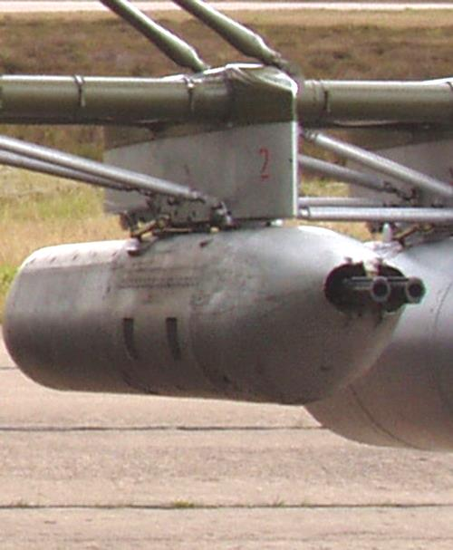

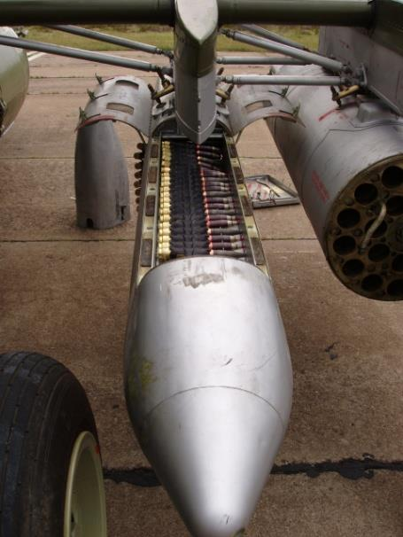

Боекомплект каждого контейнера УПК состоит из 250 снарядов калибра 23 мм.
Масса одного снаряженного контейнера составляет 230 кг. При одном нажатии
(даже относительно длительном) кнопки ОГОНЬ РС из пушек выпускается по 8-
10 снарядов за 0,16с, т.е. установлено ограничение на длину очереди, очередь
не регулируется.

!!! info "Основные ТТХ пушки ГШ-23Л, встроенной в УПК-23-250"
    Калибр, мм 23 
    Габаритные размеры, мм: 
    
    - длина 1537
    - ширина 165
    - высота 168
    
    Масса, кг 50±1.5 
    Темп стрельбы, выстр/мин. 3000-3400 
    Начальная скорость снаряда, м/с 715±15 
    Сила отдачи, кгс <2900 
    Боекомплект, снарядов 250 
    Максимальная очередь, выстрелов 10 
    Термостойкость, выстрелов 250 

    Применяемые снаряды:
    
    - ОФЗ-23-АМ-ГШ
    
        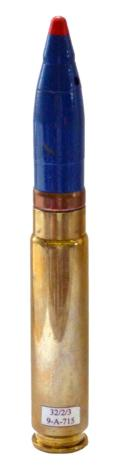
    
        масса патрона, г 338 
        масса снаряда, г 184 
        свойства снаряда: осколочно-фугасно-зажигательный 
    
    - БЗТ-23-АМ-ГШ
    
        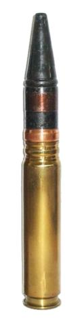
    
        масса патрона, г 340 
        масса снаряда, г 186 
        свойства снаряда: бронебойно-зажигательный-трассирующий 

Для выполнения прицеливания используется прицел ПКВ. При подвешенном
состоянии контейнера УПК на вертолете ось ствола пушки ГШ-23Л параллельна
СГФ.

Действия с оборудованием и особенности боевого применения УПК-23-250
см.здесь. //link

### Стрелковое вооружение с ГУВ

Стрелковое вооружение вертолета с ГУВ в пулеметном и гранатометном
варианте предназначено для поражения одиночных и групповых
небронированных и легкобронированных наземных целей при их визуальной
видимости днем и ночью.

В состав стрелкового вооружения (с ГУВ) входят:

- гондолы ГУВ-1 (ГУВ-8700), снаряженные гранатометами АГ-17А
 ("Пламя-А", АП-30, 9-А-800) калибра 30 мм (Рис. 11.19), и гондолы,
снаряженные (каждая) одним пулеметом ЯкБ-12,7 (9-А-624) калибра
12,7мм и двумя пулеметами ГШГ-7,62 (9-А-622) калибра 7,62мм (Рис.
11.20);
- четыре балочных держателя БДЗ-57КрВ № 1, 2, 5, 6, на которые
подвешиваются гондолы;
- органы управления стрельбой из оружия гондол.

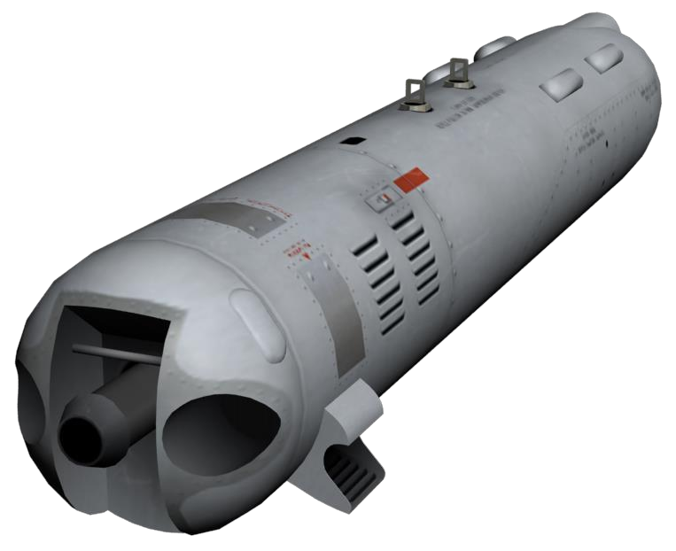

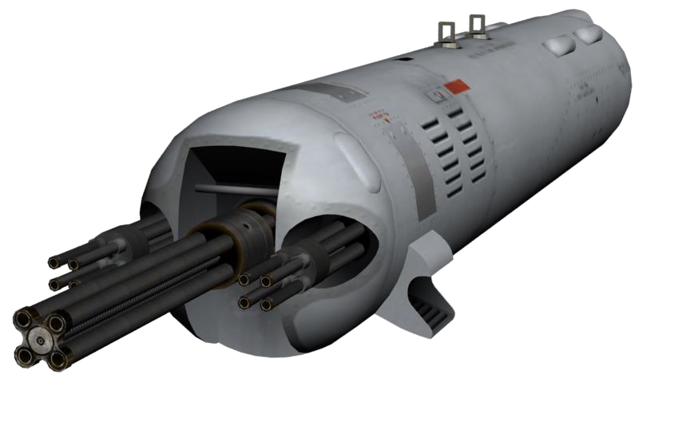

В ГРАНАТОМЕТНУЮ ГОНДОЛУ ВСТРОЕН ГРАНАТОМЕТ АГ-17А ("Пламя-А", АП-30, 9-А-800)
калибра 30-мм (Рис. 11.21).

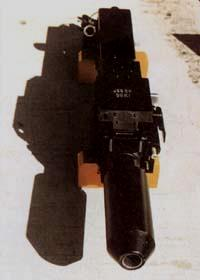

Боекомплект гондолы с гранатометом состоит из 300 гранат калибра 30 мм.

!!! info "ТТХ гранатомета АГ-17А (АП-30), встроенного в ГУВ-1, и гранат для него"
    Калибр, мм 30 
    Выстрел ВОГ-17 (ВОГ-17М) 
    Масса гранатомета, кг 21..22 
    Начальная скорость гранаты, м/с 185 
    Дульная энергия, Дж 4791 
    Режимы огня непрерывный 
    Темп стрельбы 600 в/мин 
    Прицельная дальность, м 1700 
    Дальность прямого выстрела по цели высотой 2 м, 200..250 м 
    Масса выстрела / гранаты, г. 350 / 280 (из низ 36г ВВ) 
    Время самоликвидации, с 25-27 
    Радиус сплошного поражения ж\с гранатой, м 6..7 

В ПУЛЕМЕТНЫЕ ГОНДОЛЫ (в каждую) встроены один пулемет ЯкБ-12,7 (9-А-624)
калибра 12,7мм (Рис. 11.22) и два пулемета ГШГ-7,62 (9-А-622) калибра 7,62мм

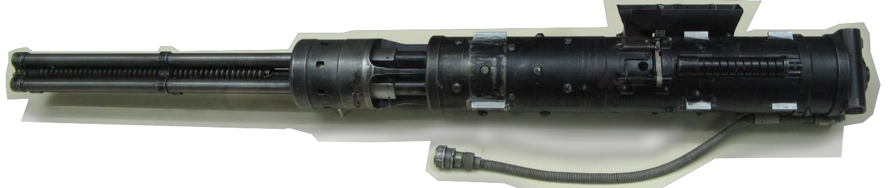

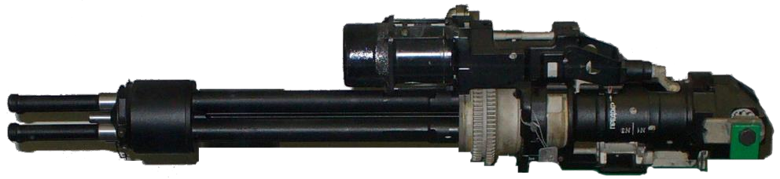

Боекомплект гондолы в пулеметном варианте состоит из 750 патронов калибра
12,7мм и 3400 патронов калибра 7,62 мм.

Пулемёт ЯкБ-12,7 выполнен по многоствольной схеме автоматики с вращающимся блоком
стволов. Вращение блока стволов осуществляется при помощи газового двигателя кулачкового
типа, в котором возвратно-поступательное движение поршня превращается во вращательное
движение блока. Разгон блока осуществляется при помощи пружинного стартового устройства,
которое запасает энергию в конце очереди выстрелов при торможении блока и постреле в этот
момент двух последних патронов в очереди выстрелов. Работа автоматики пулемёта основана
на использовании энергии пороховых газов, отводимых из стволов через газоотводные
отверстия в газовый двигатель. Для стрельбы используются патроны от пулемёта А-12,7.

ТТХ пулеметов, встроенных в ГУВ-1, представлены в Табл. 11.7.
Калибр, мм 12,7 7,62
Габаритные размеры, мм:
длина 1345 800
ширина 145
высота 190
Масса, кг 45 19
Темп стрельбы, выстр/мин. 4000-4500 6000
Начальная скорость пули, м/с 810 850
Сила отдачи, кгс 1400
Боекомплект, патронов 750 1800
Максимальная очередь, выстрелов 400 1000
Живучесть, выстрелов 8000
Применяемые патроны 12,7 БЗТ- 12,7 Б-32 7,62 БТ 7,62 Б-32
44
Масса патрона, г 128 (БЗТ-44) 21,6 (БТ)
133,5 (Б-32) 22,9 (Б-32)
Масса пули, г 44 (БЗТ-44) 9,2 (БТ)
48,2 (Б-32) 10,4 (Б-32)
Свойства пули БЗТ-44 – бронебойно- БТ – бронебойно-
зажигательно- трассирующая
трассирующая Б-32 – бронебойно-
Б-32 – бронебойно- зажигательная
зажигательная
Масса одной снаряженной гондолы в пулеметном варианте составляет не более
452 кг, а в гранатометном варианте — 274 кг.
Гондолы в гранатометном варианте подвешиваются на балочные держатели
№1, 2, 5, 6 (в варианте с двумя гондолами — на держатели №1 и 6), а в
пулеметном варианте — только на балочные держатели №2 и 5. При
подвешенных к вертолету гондолах оси стволов пулеметов расположены
относительно СГФ вертолета по вертикали под углом 0°, а оси ствола
гранатометов — под углом +6°.
Возможна одновременная подвеска на вертолет гондол в пулеметном и
гранатометном вариантах: гондолы в гранатометном варианте подвешиваются
на БД № 1, 6, а в пулеметном — на БД № 2, 5. При этом стрельба из пулеметов
и гранатометов выполняется раздельно.

Ограничения

400 ПАТРОНОВ ИЗ ПУЛЕМЕТА 9-А-624 (12.7) делать перерыв в
ПОСЛЕ ОТСТРЕЛА КАЖДЫХ
стрельбе (в игре нет необходимости) для охлаждения оружия в полете в
течение:
- 25 мин – при температуре наружного воздуха выше 10° С;
- 15 мин – при температуре наружного воздуха от +10 До —10°С;
- 5 мин – при температуре наружного воздуха ниже — 10° С;
ПОСЛЕ ОТСТРЕЛА КАЖДЫХ 1000 ПАТРОНОВ ИЗ ПУЛЕМЕТА 9-А-622 (7.62) в полете при
температуре наружного воздуха 20° С и ниже время охлаждения пулемета
должно быть не менее 25 мин. При температуре наружного воздуха выше 20° С

в полете допускается производить не более 1000 выстрелов из каждого
пулемета. Последующая стрельба запрещается (в игре повреждения пулеметов
от перегрева не реализованы).
Действия с оборудованием и особенности боевого применения УПК-23-250
см.здесь.

### Стрелковое вооружение в грузовой кабине

Предназначение

Стрелковое вооружение предназначено для ведения десантниками стрельбы по
воздушным и наземным целям в полете и на земле при их визуальной
видимости днем и ночью.

!!! note "Примечание"
    Вариант оснащения стрелковым вооружением, описанный для игры, не является
единственным вариантом, применяемым в реальности.

На вертолете предусмотрена возможность одновременной или раздельной
стрельбы из следующих точек:
- проема левой сдвижной двери из пулемета КОРД 12.7-мм;
- люка правой створки грузового люка (в хвостовой части фюзеляжа)
из пулемета ПКТ 7.62-мм.

Состав

В состав стрелкового вооружения вертолета DCS: Ми-8МТВ2 входят:
- один пулемет КОРД калибра 12.7-мм в проеме левой сдвижной двери
с системой крепления к полу грузовой кабины (система крепления
позволяет поворачивать пулемет в горизонтальной и вертикальной
плоскостях в определённом диапазоне)

 ;
- один кормовой танковый пулемет ПКТ калибра 7.62-мм в люке правой
створки грузового люка вместе со шкворнями и гильзосборником
 .
Общее описание

Сводные ТТХ пулеметов представлены в Табл. 11.8
Табл. 11.8
№ Технические характеристики КОРД-12.7 (дверной) ПКТ-7.62 (кормовой)
1 Калибр, мм 12,7 7.62
2 Темп стрельбы, выстрелов в около 600 700
минуту
3 Применяемый патрон 12,7 БЗТ-44 12,7 Б-32 7,62 БТ 7,62 Б-32

4 Масса патрона, г 128 (БЗТ-44) 21,6 (БТ)
133,5 (Б-32) 22,9 (Б-32)
5 Масса пули, г 44 (БЗТ-44) 9,2 (БТ)
48,2 (Б-32) 10,4 (Б-32)
6 Свойства пули БЗТ-44 – бронебойно- БТ – бронебойно-
зажигательно- трассирующая
трассирующая Б-32 – бронебойно-
Б-32 – бронебойно- зажигательная
зажигательная
7 Начальная скорость пули м/с 860..820 855..800

8 Прицельная дальность до 2000 До 1000
стрельбы, м
9 Масса ствола, кг 9,25 3,23
10 Масса ленты, кг 7,7 (50патронов) 9,4 (250патронов)
11 Углы наводки пулемета
относительно стойки (фермы)
крепления или шкворней:
в горизонтальной -30° (влево)..+45° От +10° (крайнее
плоскости (от плоскости, (вправо) левое
перпендикулярной к СГФ и положение)..+75°
проходящей через точку (крайнее правое
крепления пулемета) положение)
в вертикальной
плоскости (от плоскости
параллельной горизонту пола
кабины и проходящей через +10° (вверх)…- 45°
точку крепления пулемета) +10° (вверх)…- 45° (вниз) (вниз)
12 Кучность боя (R50) на не более 300
дистанции 100 м, мм
13 Технический ресурс, выстрелов 10000
14 Бронепробиваемость, мм до 20 на 100м дальности до 5 на 500м
дальности
15 Боекомплект на вертолете 12 лент (коробок) по 50 3 ленты (коробки) по
патронов 250 патронов
Углы наводки пулеметов в горизонтальной и вертикальной плоскости, Рис.
11.24:
Рис. 11.24. Углы наводки пулеметов КОРД и ПКТ в горизонтальной
и вертикальной плоскостях
1. Пулемет КОРД 12.7-мм 2. Пулемет ПКТ 7.62-мм

Пулеметы управляются ИИ-стрелками с возможностью настройки опций их
поведения. Кроме того, КОРД 12.7-мм может управляться игроком.
Реализация пулемета КОРД 12.7-мм в игре

В игре пулемет прикреплен к полу грузовой кабины, Рис. 11.25:

Рис. 11.25. Реализация пулемета КОРД 12.7-мм в игре, основные элементы
1. Короб с патронами 12.7-мм (50шт) 4. Система крепления к полу грузовой
2. Патронная лента с патронами кабины
3. Целик с прицельной планкой 5. Прицельная мушка

Перезарядка новой ленты занимает 5-7 сек.
Применение пулеметов в игре см.здесь.

### Бомбардировочное вооружение

Предназначение

Бомбардировочное вооружение предназначено для выполнения прицельного
бомбометания с горизонтального полета авиабомбами калибра 100, 250 и 500 кг
при визуальной видимости днем и ночью.

Состав

В состав бомбардировочного вооружения входят:
- шесть балочных держателей БДЗ-57КрВ с замками БДЗ-55ТН;
- оптический прицел ОПБ-1Р со светосигнальной системой ЛЕВО –
ПРАВО (не реализован);
- электросбрасыватель ЭСБР-ЗП/А;
- органы управления бомбардировочным вооружением (пульт
бомбардировочного вооружения летчика-штурмана и щиток
электросбрасывателя).

Описание

Прицеливание при бомбометании осуществляет летчик-штурман с помощью
прицела ОПБ на высотах полета от 100 до 4000 м (в игре не реализовано). На
высотах менее 100 м прицеливание по дальности выполняет командир
экипажа с помощью прицела ПКВ.
Кнопки КСБ справа от приборной доски летчика-штурмана и СБРОС БОМБ на
прицеле ОПБ (не реализован) – для боевого сбрасывания авиабомб
(подключаются к цепи сброса включением выключателя ГЛАВНЫЙ
ВЫКЛЮЧ. БВ).
Кнопка КСБ командира экипажа на левом борту – для боевого сбрасывания
авиабомб (подключается к цепи сброса включением ГЛАВНЫЙ ВЫКЛЮЧ. БВ);
Бомбардировочное вооружение обеспечивает командиру экипажа и летчику-
штурману боевое (тактическое) и аварийное сбрасывание авиабомб. Боевое
сбрасывание производится только на взрыв от кнопок КСБ в определенной
последовательности, в зависимости от положения переключателя ВАРИАНТЫ
ПОДВЕСКИ и выбранного режима работы ЭСБР.
Порядок работы во время боевого применения описан здесь.

Применяемые АСП свободного падения

В игре применяются бомбы калибра 100 (ФАБ-100, САБ-100), 250 (ФАБ-250)
(Рис. 11.26) и 500 (ФАБ-500М62) кг; зажигательные баки пока не реализованы.

Рис. 11.26. Фугасная авиабомба калибра 250кг

ФАБ – фугасные авиабомбы, предназначены для поражения живой силы боевой
техники и других наземных объектов за счет поражающего действия в основном
фугасного эффекта.
САБ – светящиеся авиабомбы, предназначены для освещения местности в
ночных условиях. В локальных войнах (Таджикистан) применялись также и
днем для превентивной1 постановки ИК-помех с целью снижения
эффективности ПЗРК с ИК-ГСН.
В игре бомбы снаряжены взрывателями мгновенного действия (планируется
сделать с замедлением). Поэтому сброс бомб с ПМВ небезопасен для вертолета
и экипажа.

1
В ущельях непосредственно перед действием основной группы, группа обеспечения сбрасывала 4..6
САБов с высоты 6.000 и более, т.е. основная группа действовала под "факелами" от САБов.

