# БОЕВОЕ ПРИМЕНЕНИЕ Ми-8МТВ2

## Подготовка к боевому применению модуля

### Снаряжение вертолета вооружением из редактора миссий

В случае самостоятельного создания миссии с боевым применением необходимо
после установки вертолета на карту в редакторе миссий выполнить снаряжение
его вооружением. Для снаряжения вертолета в миссии необходимым
вооружением используется закладка "Подвески" (PAYLOAD) в редакторе миссий.

Возможность подвески различного вооружения
на балочные держатели 1–6, а также установки пулеметов КОРД и ПКТ в
грузовой кабине схематично показны на Рис. 12.1.

1. Возможный выбор подвесного вооружения на балочных держателях 1-6
2. Выбор установки пулемета КОРД 12.7 в проем двери грузовой кабины
3. Выбор установки пулемета ПКТ 7.62 в люк правой створки грузового люка

Иконка в редакторе миссий | Описание
--------------------------|------------
 | блок НАР Б8В20
 | универсальный пушечный контейнер УПК-23 с двуствольной пушкой 23-мм
 | гондола универсальная вертолетная ГУВ-1 с одним пулеметом 12.7 и двумя пулеметами 7.62
 | гондола универсальная вертолетная ГУВ-1 с одним гранатометом 30-мм
 |  бомба калибра 500кг
 |  бомба калибра 250кг
 |  бомба калибра 100кг

Более подробно о разработке миссий рассказано в DCSW\Doc\DCS User ManualEN (RU).pdf

### Настройка "быстрых видов"

Описано в разделе 14.4.2 //link

## Особенность пилотирования с подвешенным вооружением

После подвески вооружения центровка вертолета смещается несколько вперед.
Это приводит к изменению расходов РППУ и угла тангажа на основных режимах
полета. В горизонтальном полете балансировочное положение РППУ вперед на
1/5..1/6 хода меньше, чем при полете без вооружения. Во время стрельбы НАР
при больших залпах (по 8-16 НАР из каждого блока) наблюдается влияние
реактивной струи двигателей НАР на срезы блоков, которое сопровождается
небольшим моментом по тангажу (на пикирование).

## Порядок включения подсистем вооружения

В п.12.3 рассматривается порядок работы с оборудованием для применения
каждого вида вооружения от включения АЗС до нажатия на кнопку стрельбы
(сброса). Включение оборудования по этапам боевого полета рассмотрено в п.
12.4.

### Для применения НАР с Б8В20

На запущенном вертолете и наличии напряжения на шинах ВУ необходимо:

1. Включить АЗСы на левой панели
(показаны АЗС, необходимые только
для выполнения стрельбы)

    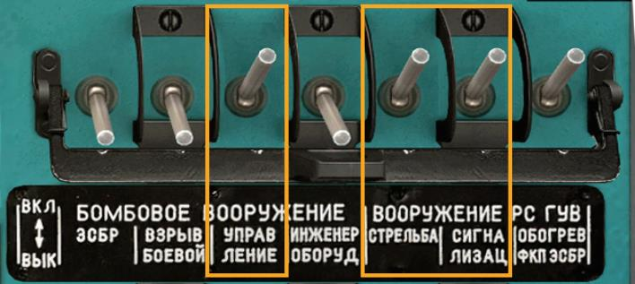

2. Включить
ПРЕДОХРАНИТЕЛЬНЫЕ
ВЫКЛЮЧАТЕЛИ [LAlt] + [S]

    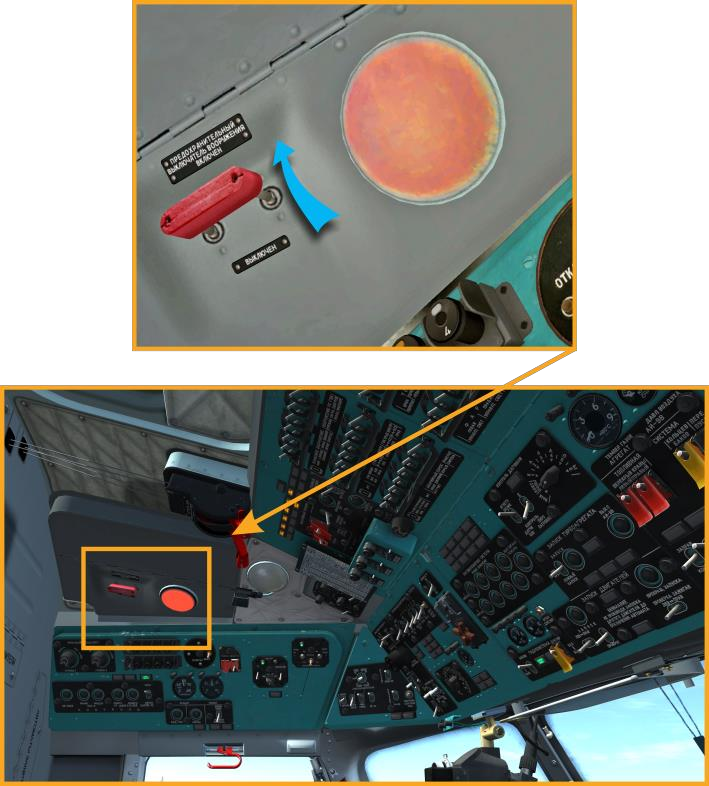

3. На верхнем щитке
управления вооружением
командира:

    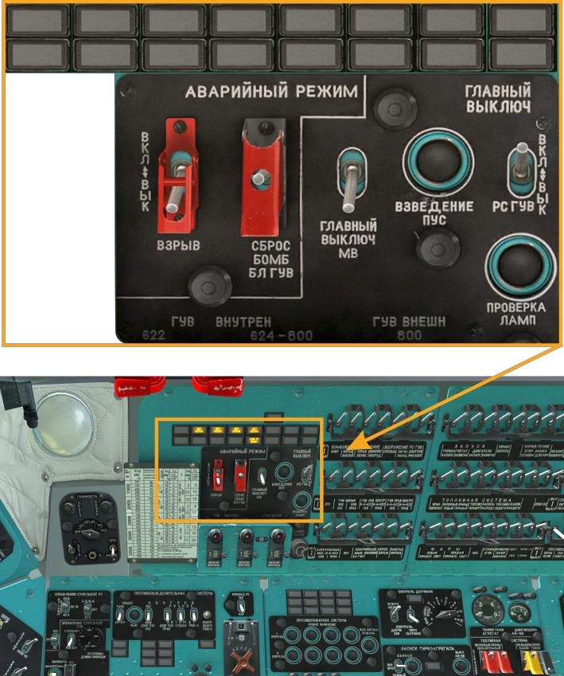

    - кнопкой "ПРОВЕРКА ЛАМП"
 (1) проверить исправность
ламп в табло (2)

        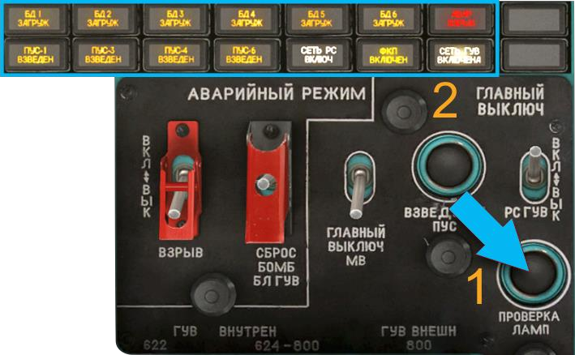

    - включить "ГЛАВНЫЙ
ВЫКЛЮЧАТЕЛЬ РС, ГУВ" (a) и
проконтролировать загорание
табло: "БД 3, 4 (1, 2, 5, 6)
ЗАГРУЖЕН" (b),
 "СЕТЬ РС ВКЛ." (c),
 "ПУС 3, 4 (1, 6) ВЗВЕДЁН" (d)
в зависимотсти от варианта
подвески оружия

        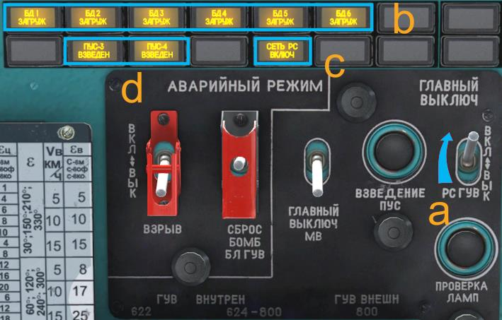

    - если табло "ПУС .. ВЗВЕДЕН"
не горит – кнопкой
 "ВЗВЕДЕНИЕ ПУС" установить
ПУСы в исходное состояние

        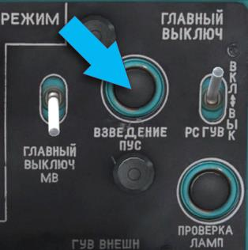

4. На нижнем щитке управления
вооруженияем командира, на
пульте УПРАВЛЕНИЕ СТРЕЛЬБОЙ РС:

    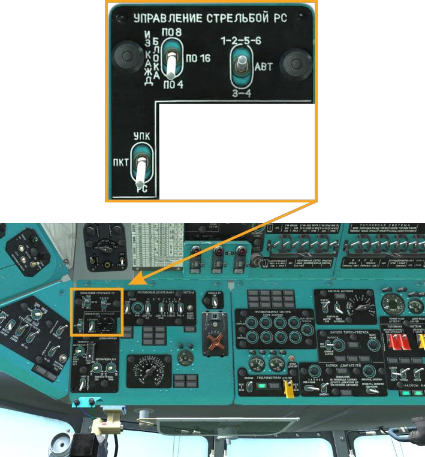

    - переключателем "ИЗ
КАЖДОГО БЛОКА – по 8 – по
16 – по 4" – установить
количество НАР, которое
требуется выпустить из
каждого блока
 ("по8" – на одно
продолжительное нажатие
кнопки на РППУ будет
выходить по 8 НАР из каждого
блока,
 "по16" и "по4" –
соответственно по 16 и по 4
НАР из каждого блока); по
умолчанию в игре установлено
значение "по 4" (вниз)

        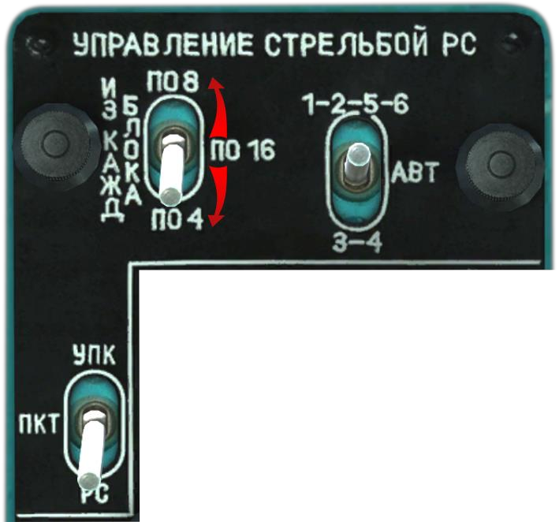

    - переключателем "1-2-5-6 –
АВТ – 3-4" – подключить
нужную группу блоков:
в положении АВТ – начинается
сход ракет из блоков на БД№1,
2, 5 и 6 (если они подвешены),
а после полного
израсходования в них ракет,
система автоматически
переключается на блоки № 3 и 4. Во всех других положениях
переключателя ракеты сходят
только из соответствующих
цифрам блоков; по умолчанию
в игре установлено положение
АВТ (среднее положение)

        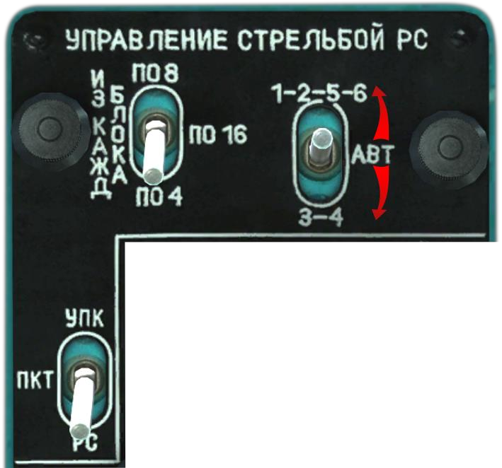

    - переключателем "УПК-ПКТ-
РС" – подключить цепи НАР к
боевой кнопке, установив его в
положение "РС" (вниз); по
умолчанию в игре установлено
положение "РС"

        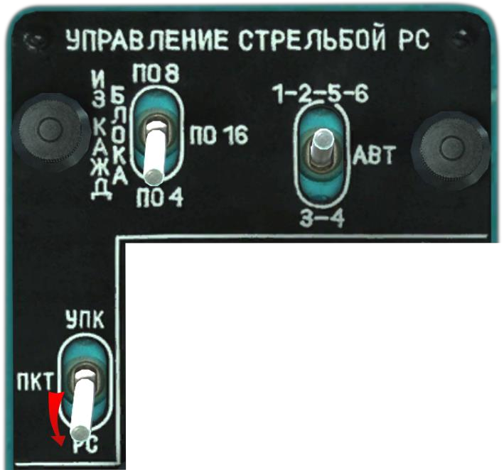

5. Включить фотоконтрольный прибор
(ФКП) (не обязательно). Для просмотра
снимков, сделанных ФКП, необхоимо
включить опции в особых настройках
модуля

    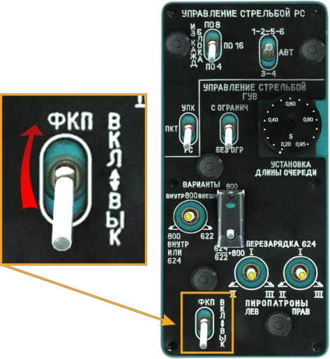

6. На пульте БВ летчика-штурмана -
переключатель "ВАРИАНТЫ ПОДВЕСКИ"
установить в положение
соответствующее подвешенному
вооружению: стрельба будет возможна
только с тех БД, которым соответствует
символ в варианте подвески (для
Б8В20 это I (все блоки), III (блоки на 3
и 4 БД), IV варианты (блоки на 3 и 4
БД)

    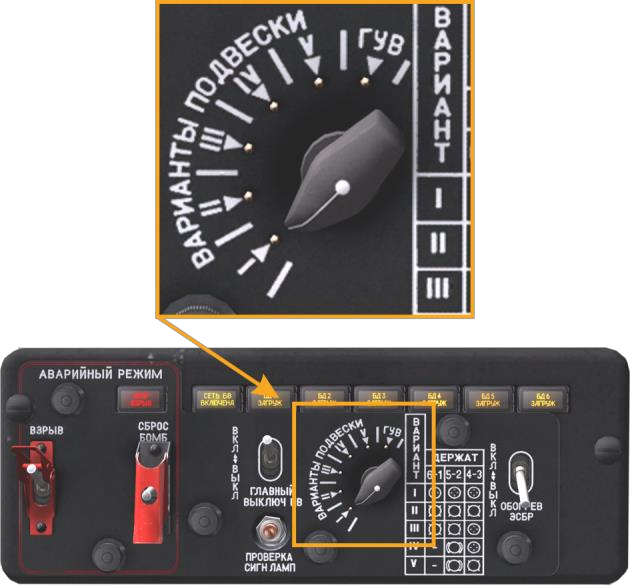

7. Нажать кнопку РС (на ручках
управления вертолетом под
предохранительным колпачком) –
произойдет пуск ракет [Space].

    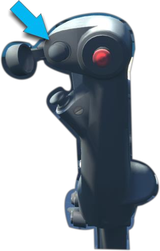

### Для применения пушечного вооружения 23-мм с УПК-23-250

На запущенном вертолете и наличии напряжения на шинах ВУ необходимо:

1. Включить АЗСы на левой панели
(показаны АЗС, необходимые только
для выполнения стрельбы)

    

2. Включить
ПРЕДОХРАНИТЕЛЬНЫЕ
ВЫКЛЮЧАТЕЛИ [LAlt] + [S]

    

3. На верхнем щитке
управления вооружением
командира:

    

    - кнопкой "ПРОВЕРКА ЛАМП"
 (1) проверить исправность
ламп в табло (2)

        

    - b) включить "ГЛАВНЫЙ
ВЫКЛЮЧАТЕЛЬ РС ГУВ" (a) и
проконтролировать загорание
табло: "БД 2, 5 ЗАГРУЖЕН"
 (b),
 "СЕТЬ РС ВКЛ." (c)

        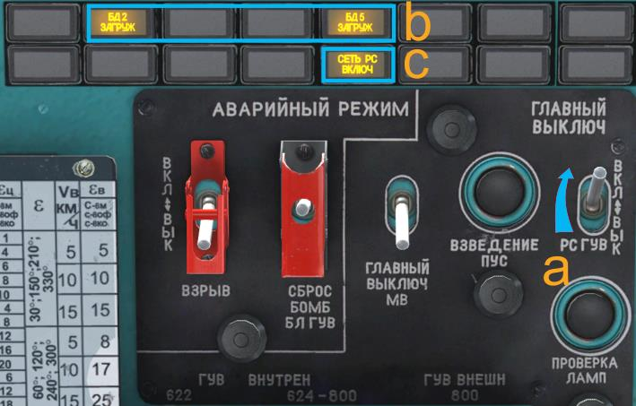

4. На нижнем щитке управления
вооруженияем командира, на
пульте УПРАВЛЕНИЕ СТРЕЛЬБОЙ РС:
переключателем "УПК-ПКТ-РС" –
подключить цепи УПК-23-250 к боевой
кнопке, установив его в положение
"УПК" (вверх)

    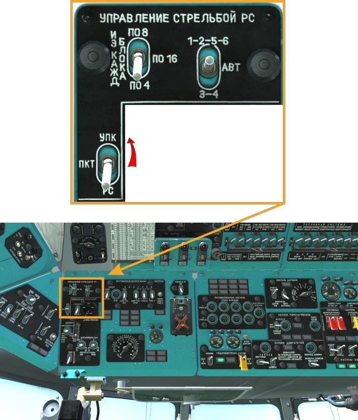

5. Включить фотоконтрольный прибор
(ФКП) (не обязательно). Для просмотра
снимков, сделанных ФКП, необхоимо
включить опции в особых настройках
модуля

    

6. Нажать кнопку РС (на ручках
управления вертолетом под
предохранительным колпачком,
открывается мышью) [Space] –
произойдет стрельба очередью 8-10
снарядов из каждой пушки.

    

### Для применения пулеметов 12.7-мм (7.62-мм) и гранатометов 30-мм с ГУВ-1

На запущенном вертолете и наличии напряжения на шинах ВУ необходимо:

1. Включить АЗСы на левой панели
(показаны АЗС, необходимые только
для выполнения стрельбы, пунктиром –
для аварийного сброса гондол, см.
12.5.2)

    

2. Включить
ПРЕДОХРАНИТЕЛЬНЫЕ
ВЫКЛЮЧАТЕЛИ [LAlt] + [S]

    

3. На пульте БВ летчика-штурмана -
переключатель "ВАРИАНТЫ ПОДВЕСКИ"
установить в положение "ГУВ" [ . ]
или [ ; ]

    В этом положении происходит
подключение цепей управления
стрельбой и сигнализации подвески
гондол ГУВ (см. п.4 b), цепи РС, УПК и
бомбардировочного вооружения
отключаются

    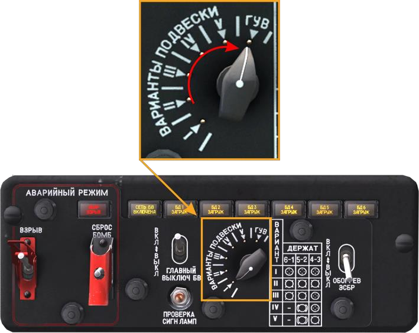

4. На верхнем щитке
управления вооружением
командира:

    

    - кнопкой "ПРОВЕРКА ЛАМП"
 (1) проверить исправность
ламп в табло (2)

        

    - b) включить "ГЛАВНЫЙ
ВЫКЛЮЧАТЕЛЬ РС, ГУВ" (a) и
проконтролировать загорание
табло: "БД 1, 2, 5, 6
ЗАГРУЖЕН" (b)
 (в зависимотсти от варианта
подвески оружия),
 "СЕТЬ ГУВ ВКЛ." (c),

        

5. На нижнем щитке управления
вооруженияем командира, на
пульте УПРАВЛЕНИЕ СТРЕЛЬБОЙ ГУВ:

    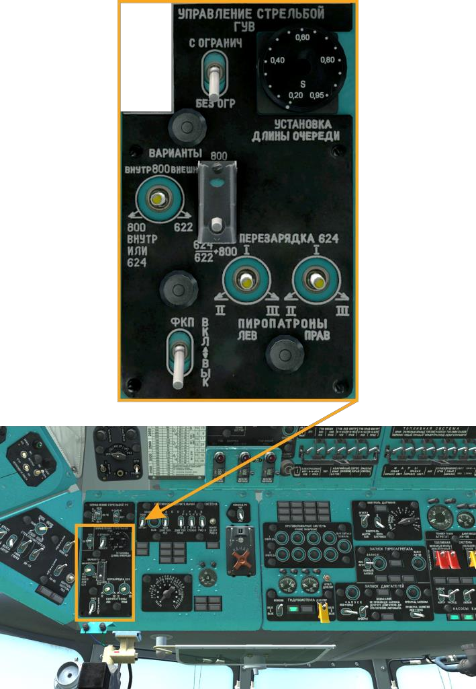

    - переключатель "УСТАНОВКА
ДЛИНЫ ОЧЕРЕДИ С ОГРАНИЧ –
БЕЗ ОГР"
установить в положение
 "БЕЗ ОГР" (вниз) [LAlt] + [R] ,
чтобы длина очереди зависела
только от времени нажатия на
кнопку стрельбы

        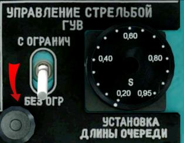

    - переключатель
 "ВАРИАНТЫ:
800 – 624/622+800"
установить в положение "800"
 (вверх) [RAlt] + [RCtrl] + [P] ,
если на держатели 1, 2, 5, 6
подвешены гранатометные ГУВ
 (АП-30); поднять
предохранительный колпак
 [RShift] + [O]

        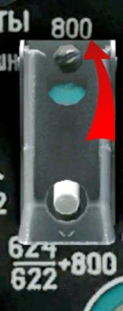

    - переключатель "ВАРИАНТЫ:
800 – 624/622+800"
установить в положение
 "624/622+800" (вниз) [RAlt] +
 [RCtrl] + [O] , если на
держатели 1, 6 подвешены
гранатометные ГУВ с АП-30
 (или ничего), а на держатели 2,
5 – пулеметные ГУВ с 12.7мм и
7.62мм пулеметами; положение
по умолчанию – "624/622+800"

        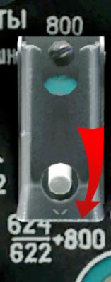

    - 4-х позиционный
переключатель
 "ВАРИАНТЫ ВНУТР 800
ВНЕШ – 800 ВНУТР ИЛИ
624 – 622" [[RAlt] + [[RCtrl]] + [[ [ ]] или [[RAlt]] + [[RCtrl]] + [[ ] ]]
установить в положение:

        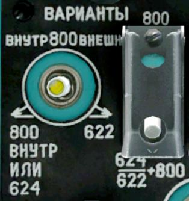

    - "ВНУТР 800 ВНЕШ" – для стрельбы из
АП-30 с держателей 1, 6, 2, 5
одновременно или 1, 6 (если на 2 и 5
нет АП-30)

        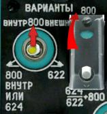

или

        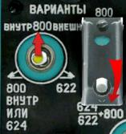

    - "800 ВНУТР ИЛИ 624" – для стрельбы
из 12.7-мм пулеметов с держателей 2 и
5

        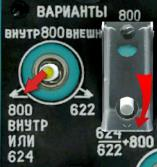

    - "622" – для стрельбы из 7.62-мм
пулеметов с держателей 2 и 5

        

6. Включить фотоконтрольный прибор
(ФКП) (не обязательно). Для просмотра
снимков, сделанных ФКП, необхоимо
включить опции в особых настройках
модуля

    

7. Выполнить перезарядку
12.7-мм пулеметов при осечках
стрельбы (осечки в игре не
моделируются)

    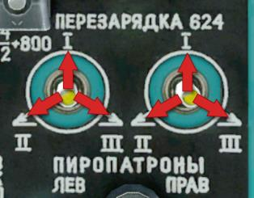

8. Нажать кнопку РС (на ручках
управления вертолетом под
предохранительным колпачком) –
произойдет стрельба из ГУВ [Space] .

    

### Для применения стрелкового вооружения из грузовой кабины

Включать ничего не требуется. Применение см. здесь //link

### Для применения бомбардировочного вооружения

На запущенном вертолете и наличии напряжения на шинах ВУ необходимо:

1. Включить на левой панели
(показаны АЗС, необходимые
только для выполнения
бомбометания)

    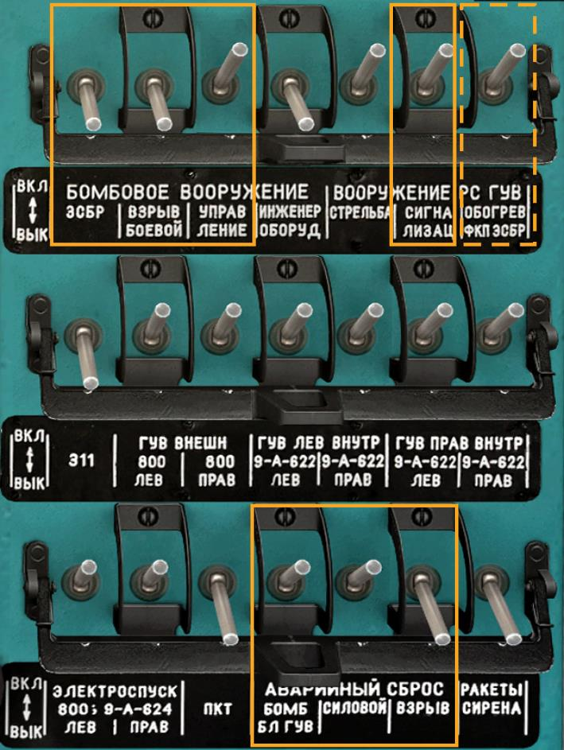

2. Включить
ПРЕДОХРАНИТЕЛЬНЫЕ
ВЫКЛЮЧАТЕЛИ [LAlt] + [S]

    

3. На верхнем щитке
управления вооружением
командира:

    

    - кнопкой "ПРОВЕРКА ЛАМП"
 (1) проверить исправность
ламп в табло (2)

        

    - включить "ГЛАВНЫЙ
ВЫКЛЮЧАТЕЛЬ РС ГУВ" (a) и
проконтролировать загорание
табло: "БД 1–6 ЗАГРУЖЕН" (b)
 (в зависимости от варианта) –
для включения цепей
сигнальных табло

        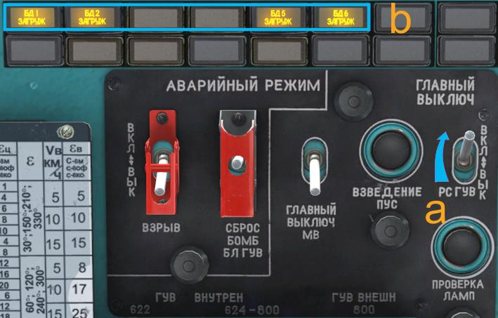

4. На пульте БВ летчика-штурмана:

    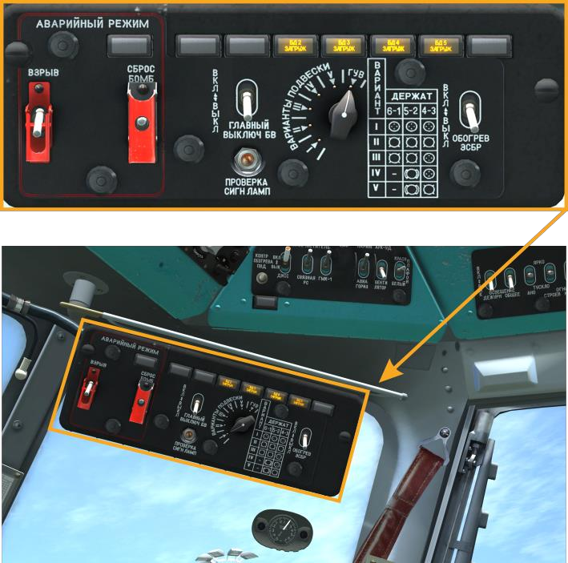

    - переключатель "ВАРИАНТЫ
ПОДВЕСКИ" установить в
положение, соответствующее
варианту с подвешенными
бомбами (там, где есть
символы , ),
переключатель вправо/влево
 [ . ] или [ ; ]
который в зависимости от
варианта применения средств
поражения обеспечивает
подключение к цепи боевого и
аварийного сброса только тех
держателей, на которые
подвешены бомбы.

        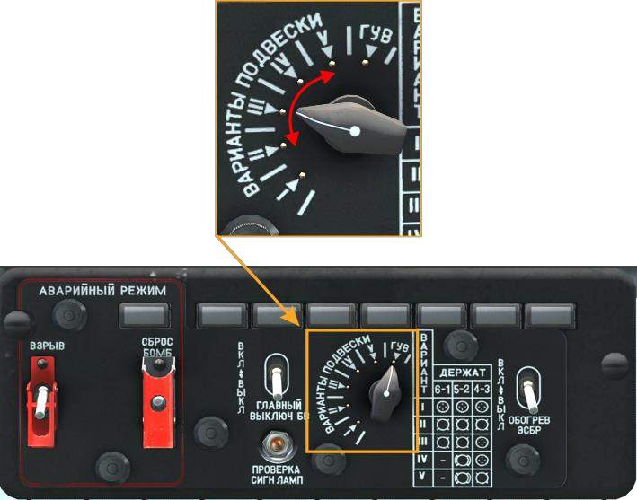

    - включить ГЛАВНЫЙ
ВЫКЛЮЧ. БВ [RCtrl] + [P] –
загорятся соответствующие
табло (два–шесть желтых табло
БД1 ЗАГРУЖ – БД6 ЗАГРУЖ. –
для сигнализации наличия
бомб на держателях)

        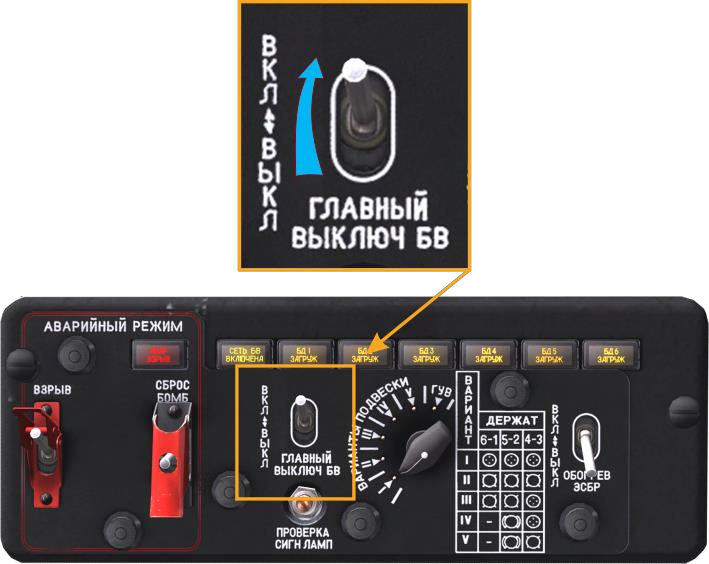

5. На щитке электросбрасывателя
(ЭСБР-3П/А):

    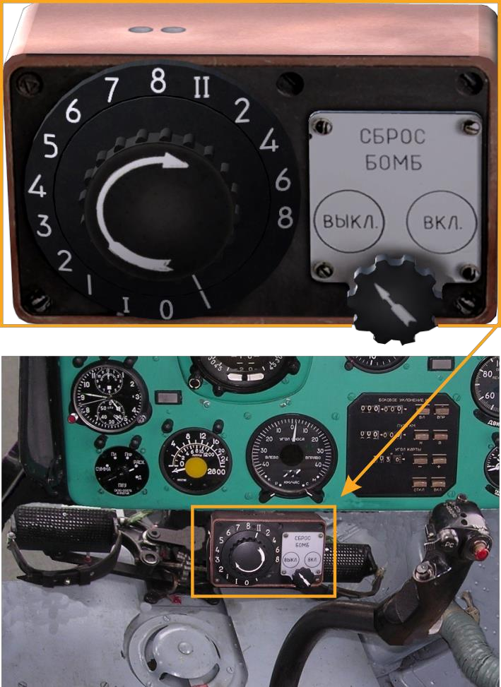

    - установить рукоятку подачи
импульсов в одно из
положений: положение I — для
одиночного сброса (по одной) и
положение II —для залпового
сброса одновременно с двух
держателей [RAlt] + [RShift] + [B] (вращается только
вправо), более подробно об
особенностях работы щитка
электросбрасывателя см.11.5

        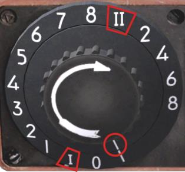

    - включить выключатель ЭСБР
 [RAlt] + [B] (вправо)

        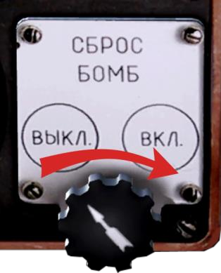

    - выполнить сброс бомб,
нажимая на кнопку сброса КСБ-
49 (3D-модель отсутсвует в
игре) [B] и проконтролировать
сброс бомб по погасанию табло
на пульте БВ летчика-штурмана
или верхнем щитке управления
вооружением командира

## Действия по этапам выполнения боевого полета

### Перед выруливанием (взлетом)

Для применения оружия необходимо его включить, при этом часть оружия
включается на земле, часть – непосредственно в районе боевых действий (в
целях безопасности от несанкционированного применения оружия). Как
правило, на земле включаются все выключатели кроме главных выключателей
вооружения. У Ми-8МТВ2 три главных выключателя для различного
вооружения:

- РС ГУВ – обеспечивает подключение цепей для стрельбы НАР, из
УПК-23-250, из ГУВ-1;
- МВ – обеспечивает подключение цепей для отстрела мин из кассет
 (не задействован в игре);
- БВ – обеспечивает подключение цепей для сброса бомб.
Кроме того, после проверки бомбардировочного вооружения вместе в главным
выключателем бомбардировочного вооружения выключают ЭСБР.

1. Перед взлетом включить оружие согласно 12.3. Для исключения
несанкционированной стрельбы или сброса бомб выключить ГЛАВНЫЙ ВЫКЛЮЧ
РС ГУВ на верхнем щитке управления вооружением командира, ГЛАВНЫЙ
ВЫКЛЮЧ. БВ на пульте бомбардировочного вооружения летчика-штурмана
(дополнительно необходимо выключить ЭСБР на щитке электросбрасывателя).
2. Установить угол прицеливания на прицеле ПКВ, соответствующий
замыслу боевого применения (в зависимости от средств поражения, режима
полета и дальности атаки). Для изменения угла прицеливания навести
указатель мыши на поворотный лимб прицела и, вращая колесо мыши,
выставить нужный угол или [LCtrl] + [O] – [LAlt] + [O]. Для облегчения
работы с прицелом рекомендуется использовать настроенный SnapView. Углы
прицеливания для различного вооружения и режимов полета:

    - для применения НАР с ГП – Табл. 12.2, Табл. 12.3
    - для применения НАР с режима пикирования – Табл. 12.4
    - для учета поправок на ветер при стрельбе НАР – Табл. 12.5
    - для применения УПК-23-250 с ГП – Табл. 12.6
    - для применения ГУВ-1 с 12.7-мм пулеметами – Табл. 12.7
    - для применения ГУВ-1 с 7.62-мм пулеметами – Табл. 12.8
    - для применения ГУВ-1 с 30-мм гранатометами – Табл. 12.9
    - для бомбометания с предельно-малых высот (ПМВ) и прицеливанием
    по ПКВ – Табл. 12.10

3. Перед полетом (перед взлетом) рекомендуется мысленно продумать
весь полет по этапам, особенно работу в районе цели: поиск цели,
прицеливание, уточнение прицеливания по мере изменения условий, выход из
атаки, порядок ведения осмотрительности.

По опыту боевого применения НАР (СПО) между нажатиями на кнопку РС (залпами) для
коррекции точки прицеливания проходит 3..5сек. На скорости 180..200км/ч вертолет пролетает
250..285м и поправка в угол прицеливания, учитывающая уменьшение дальности в этом
случаем может составить 3..6тыс (1/2 деления) – т.е. на эту величину необходимо выполнить
опускание перекрестия. Кроме того, если при движении от точки к точке есть рост скорости от
расчетной, то следует учесть этот рост скорости внесением дополнительной поправки: при
росте скорости на 20км/ч уменьшить угол прицеливания на 4..5тыс (1/2 деления).

Таким образом, начиная атаку НАР (СПО) с максимальной дальности следует перекрестие
выносить вверх на расчетную поправку, а по мере приближения к минимальной дальности
опускать его вниз примерно на величину 1деления сетки ПКВ (10тыс) за каждые 5 сек полета на
скорости 200км/ч, Рис. 12.2. При увеличении скорости полета до 250км/ч во время атаки цели
поправка на опускание перекрестия может достигать 2..3 деления сетки.

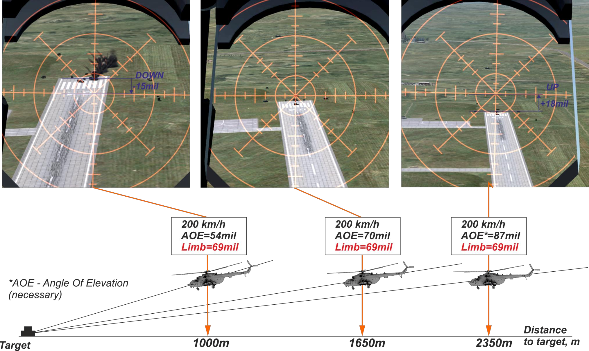

### Углы установки прицела для различного вооружения и условий боевого применения

ДЛЯ СТРЕЛЬБЫ НАР ИЗ Б8В20А С РЕЖИМА ГП

Углы прицеливания при пусках ракет типа С-8КОМ (и др.НАР весом 11..12кг) из блоков Б8В20А с горизонтального полёта, тыс., для различных скоростей полета вертолета в момент пуска

Дальность до цели в момент пуска, м | 100 км/ч | 150 км/ч | 200 км/ч | 250 км/ч 
-----------------------------------|--------|---------|----------|-----------
1000 | 82  | 73  | 57  | 13
1500 | 90  | 80  | 64  | 20
2000 | 100 | 90  | 76  | 32
2500 | 114 | 104 | 90  | 44
3000 | 128 | 118 | 104 | 58
3500 | 146 | 136 | 122 | 76

Углы прицеливания при пусках ракет

Углы прицеливания при пусках ракет типа С-8ОФП2 (вес 16.7кг) из блоков Б8В20А с горизонтального полёта, тыс., для различных скоростей полета вертолета в момент пуска

Дальность до цели в момент пуска, м | 100 км/ч | 150 км/ч | 200 км/ч | 250 км/ч 
-----------------------------------|--------|---------|----------|-----------
1000 | 100 | 90  | 74  | 34
1500 | 112 | 102 | 86  | 46
2000 | 125 | 114 | 98  | 58
2500 | 139 | 128 | 112 | 72
3000 | 152 | 141 | 125 | 85
3500 | 169 | 157 | 140 | 99

вернуться на стр.ТТХ НАР вернуться на стр.описания ПКВ

ДЛЯ СТРЕЛЬБЫ НАР ИЗ Б8В20А С РЕЖИМА ПИКИРОВАНИЯ

Угол тангажа градусы | Скорость ввода в пикирование км/ч | Скорость вертолета в момент пуска, км/ч | Дальность до цели в момент пуска, м | Углы прицеливания при пусках из блоков Б8В20-А с пикирования различных типов ракет, тыс. С-8КОМ
-----------------------------------|--------|---------|----------|-----------
10 | 150 | 180 | 1500 | 68
10 | 150 | 180 | 2000 | 74
10 | 150 | 180 | 2500 | 82
10 | 150 | 180 | 3000 | 92
10 | 150 | 180 | 3500 | 104
20 | 150 | 200 | 1500 | 64
20 | 150 | 200 | 2000 | 70
20 | 150 | 200 | 2500 | 78
20 | 150 | 200 | 3000 | 88
20 | 150 | 200 | 3500 | 98
20 | 150 | 200 | 4000 | 110
20 | 150 | 200 | 4500 | 128

ТАБЛИЦА УГЛОВЫХ ПОПРАВОК НА ВЕТЕР (ДЛЯ Б8В20-А):
Табл. 12.5
Угловая поправка на ветер в тыс.
Курсовой угол ветра при заходе на Скорость ветра,
для ракет
цель,град. м/с
С-8КОМ
5 5
30°; 150°; 210° и 330° 10 10
15 15
5 8
60°;120°; 240° и 300° 10 17
15 25
5 10
90° и 270° 10 19
15 29

ДЛЯ СТРЕЛЬБЫ ИЗ ПУШКИ ГШ-23Л (УПК-23-250) С РЕЖИМА ГП:
Табл. 12.6
Углы прицеливания при стрельбе
Приборная из пушек ГШ-23Л по наземным целям
скорость с горизонтального полета для различных дальностей, тыс.
полета, км/ч
500 м 1000 м 1500 м 2000 м 2500м 3000 м
0 48 56 72 90 — —
100-250 44 54 66 84 102 123

ДЛЯ СТРЕЛЬБЫ ИЗ ПУЛЕМЕТОВ ЯКБ-12.7 (ГУВ-8700):
Табл. 12.7
Углы прицеливания при стрельбе
Угол из пулемета ЯкБ-12.7 (ГУВ) тыс. для скоростей полета,
Дальность
пикирования, км/ч
стрельбы, м
градусы
0 100 150 200 250
500 65 65 65 60 60
1000 70 70 70 65 65
0
1500 80 80 80 75 70
2000 95 95 90 90 85
500 – – 60 60 55
1000 – – 65 65 60
10
1500 – – 75 70 65
2000 – – 85 85 80
500 – – 55 50 45
1000 – – 60 55 50
20
1500 – – 70 65 60
2000 – – 80 75 70
500 – – 45 40 –
1000 – – 50 45 –
30
1500 – – 60 55 –
2000 – – 70 65 –

ДЛЯ СТРЕЛЬБЫ ИЗ ПУЛЕМЕТОВ ГШГ-7.62 (ГУВ-8700):
Табл. 12.8
Углы прицеливания при стрельбе
Угол из пулемета ГШГ-7.62 (ГУВ) тыс. для скоростей полета,
Дальность
пикирования, км/ч
стрельбы, м
градусы
0 100 150 200 250
500 65 60 60 60 55
1000 70 70 70 65 65
0
1500 90 90 85 85 80
2000 120 120 115 110 105
500 – – 60 55 55
1000 – – 65 65 60
10
1500 – – 85 80 65
2000 – – 110 110 80
500 – – 50 50 45
1000 – – 60 55 50
20
1500 – – 75 75 60
2000 – – 100 100 70

ДЛЯ СТРЕЛЬБЫ ИЗ АВТОМАТИЧЕСКИХ ГРАНАТОМЕТОВ АП-30 (ГУВ-8700):
Табл. 12.9

Углы прицеливания при стрельбе
Угол пикирования, Дальность из гранатомета АП-30 (ГУВ) тыс. для скоростей полета, км/ч
градусы стрельбы, м
100 140 160 180 200 220 250
800 80 70 65 60 50 45 30
1000 115 105 100 90 85 75 60
0
1500 225 200 190 175 165 155 135
2000 – – – – – 245 225
800 – 70 65 60 50 40 30
1000 – 105 100 90 80 70 55
10
1500 – 195 185 175 160 150 130
2000 – – – – – 237 217
800 – 65 60 50 40 30 –
1000 – 90 85 75 70 60 –
20
1500 – 175 165 155 145 130 –
2000 – – – 240 220 215 –
!!! note "Примечание"
    Как правило, предусматривается несколько залпов (стрельб) в одном
заходе, но нет необходимости при изменении дальности перед каждой стрельбой изменять угол
прицеливания вращением лимба (это попросту делать некогда). Исходя из замысла атаки
(дальность начала, дальность окончания, применяемое в одном заходе стрелковое вооружение)
определяются максимальный и минимальный углы прицеливания и на лимбе устанавливается
средний угол прицеливания.
Далее для расчетных точек стрельбы в одной атаке определяется разница между углом
прицеливания из таблицы и средним углом, установленным на лимбе. Далее, при стрельбе
вычисленные значения разницы для каждой точки учитываются как подъем (опускание)

перекрестия на эту разницу ВВЕРХ (ВНИЗ) относительно цели, например как на (Рис. 12.2). В
игре по умолчанию установлен угол 69тыс, его можно выбрать как средний и затем от него
определять поправки.

ДЛЯ БОМБОМЕТАНИЯ С ПРЕДЕЛЬНО-МАЛЫХ ВЫСОТ (ПМВ) И ПРИЦЕЛИВАНИЕМ ПО ПКВ:
Табл. 12.10
Углы прицеливания, тыс. для путевых скоростей, км/ч
Высота, м Выдержка времени, с
150 160 170 180 190 200 210 220 230 240 250
200 200 200 200 _183 174 165 157 149 140 123
50
1,0 0,5 0,5 — — — — — — — —
200 200 200 200 200 200 200 200 200 200 200
100
3,0 2,5 2,0 2,0 1,5 1,0 0,5 0,5 0,5 — —
Время выдержки, с
150 6,0 5,5 5,0 4,5 4,0 3,5 3,0 2,5 2,0 1.5 1.0
200 8,5 7,5 7,0 6,5 6,0 5,5 5,0 4,5 4.0 3,5 3.0
250 11,5 10,5 10,0 9,5 8,5 8,0 7,0 6,0 5,5 5.0 4.5
300 15,0 14,0 13,0 11,5 10,0 9,5 9,0 8,5 7,5 6.5 6.0

!!! note "Примечания"
    1. Угол прицеливания из таблицы необходимо установить поворотом
лимба. Например, для расчетных высоты 50м и скорости 200км/ч угол прицеливания составляет
174тыс, его и надо установить на прицеле (Рис. 12.3).
2. Время выдержки – промежуток времени между моментом "наползания" пересечения
вертикальной линии сетки и нижней части большого кольца ПКВ на центр цели и моментом
нажатия на кнопку сброса.
3. При бомбометании с ПМВ используются взрыватели с замедлением времени срабатывания
для безопасности экипажа от поражения своими осколками (будут смоделированы позже).

Рис. 12.3. Установка угла прицеливания 174тыс на лимбе ПКВ
### Выход на боевой курс, прицеливание и открытие огня (атака
цели)

1. Выход в район цели выполнить скрытно, вне зоны обнаружения средств ПВО
объекта, для чего наиболее целесообразно выполнять полет на ПМВ до района
цели, используя складки местности. Наиболее применяемым режимом полета
при стрельбах НАР и СПО является ГП на скорости 180..200км/ч с последующим
пологим пикированием (5..10°) при выполнении непосредственной атаки цели и
прицеливания. После занятия этой скорости отрегулировать автопилот,
устранив отклонения на ИН-4, оттриммировать вертолет, запомнить показания

ОШ НВ на приборе (это пригодиться для
быстрого установления режима ГП после маневров).
2. Включить главные выключатели вооружения (ГВ) и ЭСБР:
1. ГВ РС ГУВ (если необходимо выполнить 2. ГВ БВ и ЭСБР (если необходимо выполнить
стрельбу НАР, из УПК-23-250, из ГУВ-1) бомбометание)

(следует помнить, что остальные необходимые АЗС и выключатели должны быть включены
перед выруливанием или взлетом).

3. На дальности 3000..2500м (9000..8000 ft) до цели выполнить маневр набора
высоты для видимости цели: либо "горкой" (взять РППУ на себя до угла тангажа
+10..15° набрать нужную высоту, снова установить тангаж для ГП или
пикирования), либо РОШ (без изменения угла тангажа, но с увеличением ОШ
НВ, тем самым набрав необходимую высоту; после набора высоты уменьшить
ОШ ровно на столько, насколько увеличивал).

!!! note "Примечание"
    Второй вариант хотя и менее красив, но более предпочтителен, т.к. цель
не теряется из вида во время маневра, нет увеличения картинной плоскости вертолета,
приводящей к повышению эффективности огня стрелкового оружия противника, а также нет
потери скорости вертолета.

4. После набора высоты видимости цели установить РОШ значение ОШ НВ на
приборе, которое соответствует режиму скорости боевого применения
(запомненное ранее), выполнить поиск этой цели, доворот вертолета на нее,
устранить скольжения (шарик в центре!) и убрать набор высоты или снижение в
режиме ГП.
!!! note "Примечание"
    Необходимо помнить, что при открытии огня в условиях наличия
вертикальной скорости1 или скольжения стрельба становится весьма неточной. Снаряды (НАР,
23мм) и пули будут ложиться при вертикальной скорости вниз – с недолетом, при вертикальной
вверх – с перелетом, в боковом отношении снаряды летят в сторону "шарика". Особенно
актуально для НАР, так как начальная скорость вылета из ствола всего 30..50м/с. И как только
вектор скорости НАР хоть немного не совпадает с вектором скорости потока, немедленно по
вылету из ствола начинает действовать флюгирующая НАР сила, заставляющая её
доворачиваться на поток, т.е. отклоняться от своего вектора дульной скорости. И последующий
разгон ракеты уже происходит на искривленной траектории. Поэтому ракеты более "чутко"
реагируют на не выдерживание режима стрельбы, чем снаряды пушки и пули пулеметов. Этим
кстати обусловливается и значения угла прицеливания НАР для ГП на скорости 250км/ч: эти
углы гораздо меньше углов для скорости 200..100км/ч. При ГП на 250км/ч вертолет имеет
значительный (до -5°) угол тангажа на пикирование, и ракета, вылетая из ствола, имеет
большее рассогласование вектора собственной дульной скорости и набегающего потока, чем
при меньших скоростях. Поэтому она стремиться автоматически "поправиться", задирая нос
вверх.

Если выход на цель (или повторный заход) выполняется из разворота, то вывод
вертолета из крена необходимо начать при значении разности текущего курса и
желаемого боевого курса равной примерно крену вертолета (т.е. если крен в
развороте 40°, то вывод из крена начать примерно за 40° до достижения носом
вертолета заданного курса). Следует помнить, что при выполнении разворота с
большими, чем 15°, кренами вертолет после вывода стремится набрать высоту,
что следует компенсировать уменьшением ОШ на 1/8..1/6 часть хода. Далее:

Для стрельбы НАР и из СПО:

a) после вывода из разворота установить режим ГП на скорости
180..200км/ч, убрать набор высоты или снижение, установить шарик в
центр (это уменьшит рассеивание НАР относительно точки
прицеливания);
b) при стрельбе НАР: с дальности 2500м (7500 ft) выполнить
окончательный доворот на цель, установить вид цели через прицел и
наложить прицельную марку на цель плавным движением РППУ, с
дальности 2000м (6000..3000 ft) с учетом поправки на дальность до
цели и боковую поправку на ветер нажать кнопку открытия огня;
при стрельбе из СПО (УПК-23-250, ГУВ-1): дальность начала ведения
огня 1500..1200м;

1
имеется ввиду вертикальная скорость в ГП, не в пикировании.
c) если запланировано несколько залпов в одном заходе, то по мере
приближения к цели корректировать угол и точку прицеливания
 (с.347);
d) на расчетной минимальной дальности (не ближе 1000м) начать
отворот от цели.
Стрельба из НАР и СПО сопровождается небольшой отдачей, а так как оси всего
подвесного вооружения ниже центра тяжести, то появляется незначительный
пикирующий момент, что надо учитывать при стрельбе длинными очередями,
накладывая прицел на 3..5тыс ВЫШЕ цели (при совпадении направления
стволов с СГФ1).

Для бомбометания от командира экипажа и прицеливанием по
ПКВ:

a) Заход на цель строить с таким расчетом, чтобы после вывода
вертолета на боевой путь время до сброса составляло 10..15с. По
мере повышения мастерства это время следует уменьшать.
a) После вывода вертолета на линию боевого пути при отсутствии
бокового ветра вертолет следует пилотировать так, чтобы проекция
его линии пути проходила через цель. В этом случае вертикальная
линия сетки прицела должна проходить через цель;
b) при наличии бокового ветра слева (справа) вертикальная черта сетки
прицела должна проходить левее (правее) цели на величину угла
сноса;
c) если ветер ровно встречный или попутный, а также при штиле, то
сброс бомб выполняется в момент совмещения цели с точкой
пересечения вертикальной линии с нижней частью большого кольца
сетки прицела (Рис. 12.4);

Рис. 12.4. Положение сетки прицела на цели в момент сброса в штиль, высота 50м

d) если есть боковой ветер, то сброс выполняется в момент совмещения
цели с горизонтальной линией, проходящей через точку пересечения

1
СГФ – строительная горизонталь фюзеляжа.

вертикальной линии с нижней частью большого кольца сетки прицела
 (Рис. 12.5);

Рис. 12.5. Положение сетки прицела на цели в момент сброса при боковом ветре
СЛЕВА, высота 100м

e) в том случае, когда необходимый угол прицеливания выходит за поле
зрения прицела, прицеливание осуществляется путем введения
временной выдержки. В этом случае визирная линия прицела с
помощью поворотного лимба устанавливается в крайнее положение
 (200 тыс.).
f) После совмещения цели с точкой пересечения вертикальной черты и
нижней части большого кольца сетки командир экипажа начинает
отсчет времени выдержки. По истечении времени выдержки
выполняется сброс бомбы.
Бомбы, сброшенные с ПМВ с замедлением, могут рикошетировать от
поверхности и взрываться дальше намеченной точки.

### Выход из атаки

1. После прекращения огня интенсивно отвернуть от цели со снижением на
ПМВ1 и увеличением скорости до максимальной 230..250км/ч (110..120KNOTS).
Для уменьшения количества попаданий стрелковыми средствами противника
после отворота от цели выполнять противозенитное маневрирование (змейку):
крен 30..40° влево, отворот на 40..50° (4..5сек), перекладка крена вправо,
также 30..40°, отворот на 40..50° (4..5сек) и так далее до дальности
1000..1500м (3000..4000ft) от цели.
При необходимости выполнить повторный заход (заходы).
2. По окончании атаки выключить главные выключатели (ГВ РС ГУВ, БВ)
выполнить полет на свою площадку (аэродром).

1
ПМВ – предельно-малая высота
### Применение пулеметов КОРД 12.7-мм и ПКТ 7.62-мм

Стрелки в грузовой кабине – из пулемета КОРД 12.7-мм в дверном проеме
(далее "дверной стрелок", и из пулемета ПКТ 7.62-мм в правой створке
грузового люка (далее "кормовой стрелок") – могут вести огонь на любом этапе
выполнения полета. Стрелки в игре реализованы как объекты ИИ. Игрок может
управлять их поведением (ROE, или правилами ведения боя) во время игры.
Кроме того, реализована возможность игры за дверного стрелка из пулемета
КОРД 12.7-мм "от первого лица".
Управление ИИ-стрелками

Управляя ИИ-стрелками, игрок может выбрать одну из трех опций их поведения
(установить правило ведения боя):
- НЕ СТРЕЛЯТЬ (HOLD);
- ОТВЕТНЫЙ ОГОНЬ (RET. FIRE) – т.е. огонь открывается только в
случае ведения огня противником по вертолету;
- ВСЕГДА АТАКОВАТЬ (FREE FIRE) – (огонь ИИ-стрелки открывают в
случае обнаружения цели в пределах 800 м от себя). Если целей
много, то ИИ-стрелок выполняет перенацеливание и пытается
обстрелять все объекты. Но приоритет оставляет на более опасных
целях.
По умолчанию установлена опция "Не стрелять". Текущая настройка
индицируется в СТАТУСЕ СТРЕЛКОВ, который доступен либо в книборде, либо в
форме экранной подсказки (текст на прозрачном фоне) с рабочего места
стрелка.
ДЛЯ ИЗМЕНЕНИЯ НАСТРОЕК ПОВЕДЕНИЯ ИИ-СТРЕЛКОВ необходимо:
1. Активировать наколенный планшет игрока (книборд) [RShift] + [K] или [K]
(кратковременно) для индикации статуса вооружения и стрелков:

Рис. 12.6. Индикация статуса стрелков в наколенном планшете (книборде)
1. Дверной стрелок 4. Остаток боекомплекта в процентах
2. Кормовой стрелок 5. Длина очереди (здесь не изменяется)
3. Текущие опции поведения (правила 6. Горячие клавиши для изменения
ведения боя) правил ведения боя (LC – LCtrl, LW –
LWin)

2. Командой [LCtrl] + [LWin] + [4] (последовательным нажатием) для
дверного стрелка и командой [LCtrl] + [5] для кормового стрелка выбрать
нужные варианты поведения и проконтролировать их в книборде.
ИИ-стрелки ведут огонь короткими очередями: с 12.7-мм пулемета – по 5..7
патронов, с 7.62-мм пулемета – по 7..10 патронов.

Управление дверным пулеметом КОРД 12.7-мм от первого лица

Для занятия места стрелка необходимо нажать клавишу [4], после чего игрок
перемещается на рабочее место стрелка, где также индицируется статус
стрелков (экранная подсказка в правом нижнем углу экрана):

Рис. 12.7. Вид с рабочего места дверного стрелка

Активировать/убрать экранную подсказку о статусе стрелков – [LWin] + [H].
На экранной подсказке указываются те же данные, что и в книборде, за
исключением остатка патронов: здесь указывается не в процентах от всего
количества, а по патронам и номеру текущей ленты, начиная с ленты №12 и

далее к ленте №1 . В примере 16/8
означает: осталось 16 патронов в 8-й ленте (из 12) для пулемета КОРД 12.7-мм.
Аналогично и для 7.62-мм пулемета ПКТ.
Управление и взглядом, и стволом пулемета осуществляется мышью:
- движение мыши влево-вправо перемещает пулемет влево и вправо;
- вращение колеса мыши отдаляет/приближает прицельную планку.
Для прицеливания необходимо колесом мыши "приблизить" пулемет к себе:
и выполнить совмещение прорези на прицельной планке, мушки и цели, Рис.
12.8:

Рис. 12.8. Прицеливание из пулемета

Прицельная дальность на прицельной планке в игре установлена на 1.000 м, и
для этой дальности прицеливание необходимо осуществлять "под обрез" (по
нижнему краю картинной плоскости цели). Если необходимо прицелиться на
меньшую дальность, тогда потребуется немного опустить линию "целик –
мушка" ниже цели.
Открытие огня выполняется левой кнопкой мыши.
Особенность использования систем отслеживания движений
головы (типа TrackIR) при игре за стрелка

В случае добавления к имеющимся устройствам ввода (клавиатура, мышь и
джойстики) систем отслеживания движений головы (типа TrackIR) управление
взглядом и пулеметом в игре имеет три режима применения:
- TrackIR управляет взглядом, мышь – пулеметом (по умолчанию при
занятии рабочего места стрелка);
- TrackIR управляет и взглядом, и пулеметом;
- TrackIR выключен горячей клавишей из ПО TrackIR [F9], и тогда
мышь управляет и взглядом, и пулеметом.

Последовательное переключение режимов осуществляется командой
[LAlt] + [T].
!!! note "Примечание"
    Функция совместного использования устройств ввода настраивалась
только для официально поддерживаемого устройства TrackIR, работа с другими аналогичными
устройствами не тестировалась.

Клавиатурные команды при игре со стрелками

Комбинация клавиш Назначение
[4] Занять рабочее место дверного стрелка
[1] Занять рабочее место левого пилота
[RShift] + [K] Активировать наколенный планшет
Активировать наколенный планшет
 [K] (кратковременно)
Активировать/деактивировать экранные подсказки
 [LWin] + [H] с рабочего места дверного стрелка
 [LCtrl] + [LWin] +
 [4] Установить правила ведения боя дверного стрелка
 [LCtrl] + [5] Установить правила ведения боя кормового стрелка
Переключение режимов совместного применения
 [LAlt] + [T] мыши и TrackIR
 [F9] Отключение/включение TrackIR из его ПО

## Аварийный сброс бомб и подвесок
### Общее описание

Аварийный сброс применяется для экстренного сброса подвесок в полете с
целью облегчения вертолета В ОСОБЫХ СЛУЧАЯХ ПОЛЕТА или необходимости сброса
бомб во время применения бомбардировочного вооружения ПРИ ОТКАЗЕ ОСНОВНОЙ
СИСТЕМЫ СБРОСА.

Случаи экстренного сброса в полете всех подвесок
вооружения

Экстренный сброс в полете всех подвесок вооружения выполняется в
следующих аварийных ситуациях:
- при отказе двух двигателей (если есть возможность);
- при отказе или вынужденном выключении одного двигателя, когда
продолжение полета невозможно из-за потери высоты;
- при отказе путевого управления в том случае, когда принято решение
на выполнение посадки;
- при аварийном покидании вертолета экипажем, когда безопасность
покидания не обеспечена (в игре не реализовано);
- при зависании авиабомб, пожаре или взрыве боеприпасов в
контейнерах, гондолах и блоках (в игре не реализовано).
Вертолет оборудован двумя щитками управления аварийным сбросом:
На верхнем щитке вооружения На пульте управления бомбардировочным
командира экипажа вооружением летчика-штурмана
 (второго пилота)
1. Выключатель ВЗРЫВ – в положении ВКЛ 1. Табло, сигнализирующее об активации
(вверх) активирует взрыватели авиабомб цепи аварийного взрыва
2. Нажимной (подпружиненный) переключатель 2. Нажимной (подпружиненный)
сброса СБРОС БОМБ БЛ ГУВ – при переводе в переключатель сброса СБРОС БОМБ – при
верхнее положение посылает сигнал на переводе в верхнее положение посылает
открытие замков всех без исключения балочных сигнал на открытие замков тех балочных
держателей держателей, которые в выбранном варианте
3. Табло, сигнализирующее об активации цепи
аварийного взрыва
подвески имеют символы или
3. Выключатель ВЗРЫВ – в положении ВКЛ
 (вверх) активирует взрыватели авиабомб

Поэтому аварийное сбрасывание может быть выполнено с рабочего места
командира экипажа или с рабочего места летчика-штурмана (второго пилота).
Сброс может быть выполнен как на "взрыв", так и на "невзрыв" в зависимости
от положения выключателей ВЗРЫВ на пультах вооружения. В положении
"ВЗРЫВ" взрыватели сброшенных бомб будут взведены и бомбы взорвутся
при контакте с поверхностью.
При аварийном сбросе от командира экипажа сбрасываются бомбы, блоки и
контейнеры со всех держателей во всех вариантах подвески, а при сбросе от
летчика-штурмана сбрасываются только бомбы, при условии, что они есть в
установленном на пульте БВ варианте подвески, см. Табл. 12.11.

Табл. 12.11
Варианты подвески Что будет сброшено при аварийном сбросе от
(на щитке БВ летчика-штурмана) летчика-штурмана
I – "все блоки" – ничего не будет сброшено
II – "все бомбы" – импульс на сброс будет подан
на балочные держатели №1-6 одновременно
III – "бомбы-блоки" – импульс на сброс будет
подан на балочные держатели №1, 6, 2, 5
одновременно
IV – "бомбы-блоки" – импульс на сброс будет
подан на балочные держатели №2, 5
одновременно
V – "все бомбы" – импульс на сброс будет подан
на балочные держатели №2, 5, 3, 4
одновременно

При установке переключателя ВАРИАНТЫ ПОДВЕСКИ на пульте БВ в
положения I, III и IV исключается возможность сбрасывания блоков летчиком-
штурманом от цепей аварийного сброса.
Блоки в этих случаях могут быть сброшены с помощью выключателя СБРОС
БОМБ БЛ ГУВ на пульте командира экипажа. При необходимости все же
выполнить аварийный сброс от летчика-штурмана перед сбросом следует
изменить вариант на пульте БВ на II или V (чтобы система "думала", что на всех
БД подвешены бомбы).

### Аварийный сброс от командира экипажа

Для выполнения аварийного сброса командиру экипажа необходимо проверить
и выполнить:
1. Должны быть включены
АЗСы на левой панели
(показаны АЗС, необходимые только
для выполнения сброса)
2. Должны быть включены
ПРЕДОХРАНИТЕЛЬНЫЕ
ВЫКЛЮЧАТЕЛИ;

3. На верхнем щитке
управления вооружением
командира:

    - a) если необходимо выполнить
сброс без взрыва бомб,
тогда следует открыть
защитный колпачек
выключателя аварийного
сброса [LAlt] + [J] (1) и
выполнить сброс [J] (2)

    - b) если необходимо выполнить
аварийный сброс со взрывом
бомб, тогда следует сначала
открыть защитный колпачек
выключателя ВЗРЫВ [LAlt] +
 [J] (1) и установить положение
ВКЛ (вверх) [H] (2) – загорится
табло АВАР ВЗРЫВ, а после
этого выполнить сброс [J] ,
см.п. a)
4. Убедиться в сбросе бомб, блоков,
контейнеров и др. визуально и по
погасанию табло;
5. Установить выключатель СБРОС
БОМБ БЛ ГУВ в положение ВЫКЛ.

### Аварийный сброс бомб от летчика-штурмана (второго пилота)

1. Должны быть включены
АЗСы на левой панели
(показаны АЗС, необходимые только
для выполнения аварийного сброса)

2. Должны быть включены
ПРЕДОХРАНИТЕЛЬНЫЕ
ВЫКЛЮЧАТЕЛИ;

3. На пульте
бомбардировочного
вооружения:
    - a) проверить установленный
вариант вооружения, см.Табл.
12.11

    - b) если необходимо выполнить
сброс без взрыва бомб,
тогда следует открыть
защитный колпачек
выключателя аварийного
сброса [RAlt] + [U] (1) и
выполнить сброс [U] (2)

    - c) если необходимо выполнить
аварийный сброс со взрывом
бомб, тогда следует сначала
открыть защитный колпачек
выключателя ВЗРЫВ [RAlt] +
 [I] (1) и установить его вверх
 [I] (2) – загорится табло АВАР
ВЗРЫВ, а после этого открыть
защитный колпачек
выключателя аварийного
сброса [RAlt] + [U] (3) и
выполнить сброс [U] (4)
4. Убедиться визуально и по погасанию
табло сигнализации о наличии грузов,
и сбросе всех авиабомб с держателей;
5. Установить выключатель СБРОС
БОМБ в нижнее положение и закрыть
его предохранительным колпаком;

13 ВЫПОЛНЕНИЕ
СПЕЦИАЛЬНЫХ ЗАДАЧ

13. ВЫПОЛНЕНИЕ СПЕЦИАЛЬНЫХ ЗАДАЧ
13.1. Перевозка грузов на тросовой внешней подвеске
В игре реализована возможность перевозки грузов на тросовой внешней
подвеске, см Рис. 13.1

Рис. 13.1. Ми-8МТВ2 с грузом на тросовой внешней подвеске

Наиболее сложные этапы выполнения полета с грузом на тросовой внешней
подвеске включают в себя:
- выполнение зависания над грузом и подцеп груза;
- взлет с грузом;
- полет в район укладки (отцепа) груза;
- заход и зависание в зоне (точке) укладки, отцеп груза.
В реальной жизни выполнение задач по перевозке грузов на внешней подвеске
является одним из самых сложных видов полетов. В таком полете активно
работает весь экипаж. Для частичной компенсации необходимой помощи от
членов экипажа в игру добавлены несколько опций игры с внешней подвеской,
которые активируются либо игроком, либо автоматически, см. ниже.
Кроме того, чтобы играть с внешней подвеской, в редакторе миссий необходимо
создать миссию с добавлением груза (грузов) для коалиции игрока.

13.1.1. Опции игры при перевозке грузов на тросовой внешней
подвеске

Эти опции предназначены для облегчения точного зависания над грузом по
месту и высоте перед его зацепом, а также во время полета к зоне укладки и
зависания над зоной укладки груза. Опции включают в себя:
- маркирование груза дымом с некоторого расстояния (2000 м)
 – автоматическая опция, активируется после выбора груза из
радиоменю, см.ниже;

- индикатор груза, указывающий положение груза относительно замка
внешней подвески, а также положение вертолета в пределах зоны
висения по высоте (опция работает на этапе подцепа груза) – опция
активируется игроком;
- автоматический голосовой ассистент (бортовой техник ИИ), который
подсказывает куда и насколько следует переместить вертолет для
точного зависания над грузом, (опция работает на этапах подцепа,
взлета с грузом, полета к месту зоны укладки, при укладке груза (при
соответствующей подготовке миссии))
 – автоматическая опция, условия активации см ниже;
- вид с блистера на груз (вниз под вертолет), облегчающий контроль
места вертолета относительно груза
 – опция активируется игроком, работает всегда.
Маркирование груза дымом, (см. Рис. 13.2). Осуществляется автоматически
после выбора груза из радиоменю (см. ниже). Маркерный дым виден только
игроку, который выбрал этот груз (если выполняется полет в сети)

Рис. 13.2. Маркирование груза дымом

Индикатор груза, Рис. 13.3. .
Рис. 13.3. Индикатор груза
1. Проекция замка внешней подвески на 3. Допустимые пределы зоны висения по
поверхность высоте
2. Положение груза 4. Индикация положения вертолета
относительно пределов зоны висения по
высоте (на красной линии – ОК)

Активация/деактивация индикатора происходит после выбора груза из
радиоменю и применения клавиатурной команды [RCtrl] + [RShift] + [P].
Автоматический голосовой ассистент (бортовой техник ИИ RU или EN)
подачей голосовых команд помогает:
- на этапе выполнения зависания над грузом и подцепа груза – дает
необходимые команды по занятию точного положения над грузом,
информирует о факте подцепа груза;
- на этапе взлета с грузом – информирует о поведении груза и его
текущей высоте;
- на этапе полета в район укладки (отцепа) груза – информирует о
возникновении раскачки груза, а также снижении груза на высоту
ниже 20м до поверхности;
- на этапе зависания в зоне (точке) укладки и отцепа груза (при
указании в миссии места укладки триггером, см.ниже) – дает
необходимые команды по занятию точного положения над точкой
укладки, информирует о факте касания грузом поверхности.

На этапе зависания над грузом голосовой ассистент включается при
уменьшении расстояния от груза до вертолета менее 10 м по X, Z, Y, (т.е. если
хотя бы одно из расстояний меньше 10 м). На этапе зависания в зоне укладки
ассистент включается при уменьшении расстояния от груза до центра зоны
укладки менее 75 м. Список команд, подаваемых голосовым ассистентом по
этапам полета, указан в Табл. 13.1. Футы или метры выбираются в настройках
DCS.
Табл. 13.1
Этап полета, описание ситуации, куда Фразы голосового ассистента (цифры в метрах
следует двигаться, информация и футах)
Зависание над грузом
вверх – 1, 3, 5, 10 (для метров)
необходимо увеличить высоту на.. 3, 10, 15, 30 (для футов)
вниз – 1, 3, 5, 10 (для метров)
необходимо уменьшить высоту на .. 3, 10, 15, 30 (для футов)
вперед – 3, 5, 10 (для метров)
необходимо сместиться вперед на .. 10, 15, 30 (для футов)
назад – 3, 5, 10 (для метров)
необходимо сместиться назад на .. 10, 15, 30 (для футов)
влево – 3, 5, 10 (для метров)
необходимо сместиться влево на .. 10, 15, 30 (для футов)
вправо – 3, 5, 10 (для метров)
необходимо сместиться вправо на .. 10, 15, 30 (для футов)
достигнута высота зоны подцепа на высоте, держать высоту
Подцеп груза
вертолет завис точно над грузом (±2,5 м) над грузом
груз подцеплен и замки автоматически
закрылись при зацепе с висения (или
клавиатурной командой при зацепе с земли) замки закрыты, груз подцеплен
необходимо выполнить плавное натяжение
тросов натяжение тросов
натяжение тросов завершено троса натянуты
достигнута нужная высота висения в зоне
над грузом (высота равна длине троса +
высота груза) на высоте
необходимо выдерживать высоту (высота
равна длине троса + высота груза) держать высоту
Взлет с грузом

груз поднят на один метр (три фута) от
земли груз метр от земли (три от земли)
груз поднят на три метра (10 футов) от
земли три от земли (10 от земли)

поведение груза после его отрыва от
поверхности штатное, можно начать разгон
скорости груз, троса в норме. Можно взлетать

Полет в район укладки (отцепа)
груза
продольная раскачка 3, 5, 10 (для метров)
происходит продольная раскачка груза 10, 15, 30 (для футов)
поперечная раскачка 3, 5, 10 (для метров)
происходит поперечная раскачка груза 10, 15, 30 (для футов)
раскачка исчезла (устранена) груз спокоен, троса норма
высота груза (20, 10, 3, 1 метров) до земли высота груза 20, 10, 3, 1 (для метров)
60, 30, 10, 3 (для футов) до земли
Заход и зависание в зоне (точке)
укладки, отцеп груза (при
использовании обозначения зоны укладки
триггером, и правилом для него ”груз
отцеплен в зоне”, начиная с дальности 75 м)
высота груза (20, 10, 3, 1 метров) до земли высота груза 20, 10, 3, 1 (для метров)
60, 30, 10, 3 (для футов) до земли
необходимо увеличить высоту на.. (в случае
опускания груза ниже 6м на дальности вверх – 1, 3, 5, 10 (для метров)
более 5 м от центра зоны) 3, 10, 15, 30 (для футов)
необходимо уменьшить высоту на
..(относительно высоты 6 м от груза до вниз – 1, 3, 5, 10 (для метров)
земли) 3, 10, 15, 30 (для футов)
вперед – 3, 5, 10, 20, 30, 50 (для метров)
необходимо сместиться вперед на .. 10, 15, 30, 60, 100, 150 (для футов)
назад – 3, 5, 10, 20, 30, 50 (для метров)
необходимо сместиться назад на .. 10, 15, 30, 60, 100, 150 (для футов)
влево – 3, 5, 10, 20, 30, 50 (для метров)
необходимо сместиться влево на .. 10, 15, 30, 60, 100, 150 (для футов)
вправо – 3, 5, 10, 20, 30, 50 (для метров)
необходимо сместиться вправо на .. 10, 15, 30, 60, 100, 150 (для футов)
груз 6 метров (18 футов) до земли на высоте
вертолет завис точно над местом укладки
(±5м) над зоной
груз 10, 5, 3, 1 (для метров)
высота груза (10, 5, 3, 1 метров) до земли 30, 15, 10, 3 (для футов) до земли
груз на земле, сброс груз на земле, сброс
В случае укладки груза с обозначением зоны укладки (триггером в миссии с
правилом "груз отцеплен в зоне”), голосовой ассистент ведет игрока в
окружность с радиусом 5 метров по логике наводки на зону отцепа на высоте не
менее 6 метров от нижней центральной точки груза, команды "ниже-выше"
выдает относительно этой метки, а после попадания в указанную окружность
начинает выдавать команды на снижение.
В случае укладки груза без обозначения зоны укладки (триггером в миссии
с правилом "груз отцеплен в зоне”), голосовой ассистент будет помогать
контролировать высоту груза до земли фразами: "груз 60 до земли", "груз 50 до
земли", груз 30 до земли", "груз 20 до земли", "груз 15 до земли", "груз 10 до
земли", "груз 5 до земли", "груз 3 до земли", "груз метр до земли", "груз на
земле, сброс".
После фразы, "груз на земле, сброс", автоматический голосовой ассистент
(бортовой техник ИИ RU или EN) прекратит свою работу до выбора следующего
груза.
Следует помнить, что во время энергичных перемещений вертолета в районе
подцепа или укладки груза (по месту или высоте) актуальность информации
сообщений быстро устаревает.
Вид с блистера на груз (Рис. 13.4) служит для контроля места зависания
после "закрытия" видимости груза фюзеляжем. Активируется/деактивируется
[LShift] + [LAlt] + [С],

Рис. 13.4. Вид с блистера на груз

Вид с блистера на груз можно использовать как с места командира, так и с
места второго пилота.
Рекомендуется назначить на одну из кнопок джойстика и применять во время
зависания над грузом частой, но кратковременной активацией.

13.1.2. Создание миссии в редакторе для игры с внешней подвеской

Установка груза на карте и выбор длины троса внешней
подвески

Для создания миссии необходимо выполнить действия, указанные на схеме, Рис.
13.5:
Рис. 13.5 Схема, поясняющая действия при создании мисси для игры с внешней
подвеской

1. Выбрать "Добавить статический объект"
2. Выбрать категорию ГРУЗЫ (Cargos), тип – Груз-1 (или хх):

3. Установить объект на карте (левой кнопкой мыши);
4. Установить флаг "МОЖЕТ БЫТЬ ГРУЗОМ" (для возможности выбора и
подцепки груза во время игры):

5. Установить необходимый вес груза (для начинающих рекомендуется не
более 500кг), для многих грузов вес изменить нельзя;
6. Переименовать этот объект (рекомендуется), например "ГРУЗ_500",
чтобы облегчить его выбор, если в игре не один груз;
7. Установить требуемую длину троса (максимально до 30м):

8. Сохранить миссию, создание миссии завершено.
Созданная миссия позволяет выполнить подцеп груза, полет с грузом и
самостоятельную его укладку по желанию игрока (укладка осуществляется без
использования автоматических опций – обозначения места укладки и помощи
голосового ассистента).
Для создания более продвинутой миссии, где при выполнении точной укладки
груза по месту будут работать автоматические опции (маркирование дымом
места укладки, помощь автоматического голосового ассистента) в миссию
необходимо добавить обозначение места укладки груза триггерной зоной.
Обозначение места укладки груза

Для возможности маркирования места укладки груза дымом, а также получения
помощи голосового ассистента (бортового техника ИИ, см.ниже) при укладке
груза необходимо:
1. Установить триггерную зону, присвоить ей имя и указать радиус (в
данном случае размер радиуса не имеет значения):
2. В настройке триггеров, Рис. 13.6 (1) создать новый триггер (2); выбрать
тип условия CARGO UNHOOKED IN ZONE (3); выбрать, для какого именно
груза должно быть маркирование места укладки (4); связать выбранный
груз с нужной зоной (5):

Рис. 13.6. Схема настройки триггера для маркирования места укладки

3. В действиях, которые должны произойти при наступлении указанного
условия, выбрать любое событие/события (например, вывод сообщения
 "Выполнена точная укладка груза"). Действие по триггеру выбирать
обязательно, иначе триггер не запишется.
Теперь во время игры после приближения вертолета с указанным грузом
"1000kg" на расстояние менее двух километров до центра триггерной зоны
"UnHooked Zone-1" место укладки будет маркировано дымом, а с удаления 50м
голосовой ассистент начнет уточнять место зависания перед укладкой. К одной
триггерной зоне можно "привязать" любое количество грузов.

13.1.3. Действия игрока во время игры

Рассмотрим действия по выбору груза и этапам полета с грузом на примере.
Итак: в некотором районе находятся несколько грузов различной массы.
Необходимо выбрать один из них, выполнить зависания над грузом и подцеп
груза, взлет с грузом, полет в район укладки (отцепа) груза, заход и зависание
в зоне (точке) укладки, отцеп груза.
ДЕЙСТВИЯ ИГРОКА

Выбор груза

Для возможности выбора грузов (с использованием радиоменю) из некоторого
множества реализована "зона видимости грузов", которая движется вместе с
вертолетом игрока или бота (обозначены окружностями вокруг вертолетов №1
и 2). Поэтому грузы игроком могут быть выбраны в случае, когда вертолет
приблизиться к ним на дальность менее размера радиуса зоны видимости
грузов (см. Рис. 13.7, вертолет №2)

Рис. 13.7. Схема логики активации пункта меню выбора грузов

Исходя из опыта тестирования, радиус зоны обнаружения грузов установлен
2000м (6.562ft). Если удаление вертолета от грузов более 2000m, то груз
выбрать нельзя (меню вертолета №1). Как только грузы окажутся в зоне
"видимости", которая движется вместе с вертолетом, тогда в меню появится
дополнительный пункт для активации дополнительной страницы [F6] со
списком грузов (меню вертолета №2).
При попадании грузов в радиус обнаружения, игрок имеет возможность выбора
грузов из списка (см. Рис. 13.8. )
Рис. 13.8. Меню выбора грузов
1. Клавиша выбора 3. Имя груза
2. Действительная масса груза

Для выбора груза игрок должен нажать одну из клавиш [F1..F10]. При этом
место расположения груза будет немедленно маркировано дымом.
В случае необходимости поменять выбор груза необходимо снова активировать
радиоменю, войти в раздел работы с грузами [F6] и выбрать команду CANCEL
для ранее выбранного груза. Затем повторить выше описанную процедуру для
выбора нового груза.

Выполнение зависания над грузом и подцеп груза

Подцеп груза может быть выполнен ИИ (т.е. автоматически) или игроком в
режиме "ручного подцепа".
АВТОМАТИЧЕСКИЙ ПОДЦЕП груза активируется после выбора груза из радиоменю.
Реализуется только с режима висения над грузом. При этом автоматический
подцеп груза осуществляется при соблюдении определенных условий, которые
учитывают длину троса, точность выдерживания места висения и промежуток
времени, который необходим виртуальному стропальщику для подцепа крюка к
грузу. Поэтому для подцепа необходимо зависнуть в пределах границ некоторой
зоны над грузом и находится в ней в течение заданного времени. Ограничения
зоны висения:
- относительно продольной и поперченной оси – радиус 2,5м;
- относительно вертикальной оси – от значения "высота груза + 0,5м"
до значения "длина троса + высота груза минус 0,5м". Например,
если трос 30м, груз высотой 7м, то диапазон допустимой для подцепа
высоты висения над поверхностью будет составлять: от 7+0.5м (7,5м)
до 30+7–0.5 (36,5м).
Время нахождения в этой зоне – не менее 5 с.
Трос в игре может быть использован от 5 м до 30 м.
После выбора груза можно активировать индикатор груза [RShift] + [RCtrl] +
[P].
За 10 м до груза (по любой из осей) включается автоматический голосовой
ассистент.
Во время нахождения в зоне подцепа (когда все условия выполняются)
появится сообщение HOVER ABOVE CARGO (Висение над грузом) и через 5

секунд – CARGO HOOKED (Груз подцеплен). В случае выхода за пределы зоны –
также выводится соответствующее сообщение.
"РУЧНОЙ ПОДЦЕП" ГРУЗА.
Применяется при посадке вблизи груза, выбранного из
меню. "Ручной подцеп" работает, когда вертолет находится на земле и если
используется трос большей длины, чем удаление места посадки вертолета до
точки подцепа груза, подцеп – [RCtrl] + [RShift] + [L]. Факт подцепа
указывается текстовым сообщением и сообщением голосового ассистента.

Взлет с грузом

После подцепа груза необходимо без спешки вертикально набрать высоту для
натяжения троса. После натяжения троса плавно увеличить ОШ НВ и выполнить
вертикальный отрыв груза от поверхности. Далее, не фиксируя зависание (без
уменьшения ОШ НВ) после подъема груза на 1–3м над поверхностью, плавно
перевести вертолет в разгон скорости с набором высоты. Отдавать РППУ с
изменением угла тангажа более чем на 1–2° не рекомендуется. Во время
отрыва груза от поверхности продолжает работу голосовой ассистент.
В процессе разгона скорости не допускать уменьшения вертикальной скорости
менее нуля. Учитывать необходимый запас высоты груза при пролете над
препятствиями.

Полет в район укладки (отцепа) груза

Во время полета следить за раскачкой груза и в случае сильной раскачки –
компенсировать ее небольшим уменьшением ОШ во время начала движения
груза от одного из крайних положений к центру. Воздерживаться от резких
движений РППУ и РОШ для изменения режима. О раскачке груза, или при
снижении груза на высоту менее 60 м над поверхностью информирует
голосовой ассистент.

Заход и зависание в зоне (точке) укладки, отцеп груза

Выполнить выход в зону укладки груза. Гашение скорости начинать заранее
(1.600–1.400 м), с темпом уменьшения скорости значительно ниже, чем при
обычных полетах.
Если во время создания миссии была указана зона укладки груза (триггерная
зона), то после приближения вертолета с грузом на расстояние менее двух
километров место укладки будет маркировано дымом. С удаления 50 м
голосовой ассистент начнет уточнять место зависания перед укладкой и
сообщит о факте касания грузом поверхности.
Перед укладкой груза можно активировать функцию "автоматического сброса"
(см. здесь) [RCtrl] + [RShift] + [K] для немедленной отцепки груза при касании
им земли. Также можно выполнить отцеп груза вручную, уже после его точной
укладки на поверхность, используя кнопки тактического или аварийного сброса,
расположенные на РОШ (Рис. 7.43) [RCtrl] + [RShift] + [RAlt] + [L] или [RCtrl]
+ [RShift] + [RAlt] + [P].
После открытия замка выводится соответствующее сообщение.
13.1.4. Информационная помощь игроку при игре с грузом

Во время игры есть возможность получить подсказки, которые информируют
игрока о возможных сочетаниях клавиш, установленной длине троса, факте
выбора и подцепки груза. Для этого необходимо активировать наколенный
планшет (книборд),

[RShift] + [K]. Более подробно о книборде указано в 14.7 .

13.1.5. Клавиатурные команды при игре с грузом

Назначение Назначение на
Комбинация клавиш на русском английском Комментарий
Индикатор External Cargo Включает/выключает индикатор
RCtrl] + [RShift] + [P груза Indicator груза(чит)
Подцеп груза на земле, по
нажатию происходит подцеп
груза, если место крепления
троса к веротлету на расстоянии
меньше длины троса от точки
Подцеп External Cargo крепления троса к груза и
RCtrl] + [RShift] + [L груза Hook вертолет на земле
RCtrl] + [RShift] + Тактический External Cargo Колпачок открывается сразу по
[RAlt] + [L отцеп груза Tactical Unhook нажатию комбинации
External Cargo
RCtrl] + [RShift] + Аварийный Emergency Колпачок открывается сразу по
[RAlt] + [P отцеп груза Unhook нажатию комбинации
Автоматичес External Cargo Активирует/дективирует отцеп
кий отцеп Autounhook груза после снятия нагрузки с
RCtrl] + [RShift] + [K груза Switch - ON/OFF замка
Открытие/за
крытие
колпачка
для кнопки External Cargo
 "Тактически Tactical Unhook
RCtrl] + [RShift] + й сброс Button Cover
[RAlt] + [T груза" OPEN/CLOSE
Открытие/за
крытие External Cargo
колпачка Emergency
для кнопки Unhook Button
RCtrl] + [RShift] + "Аварийный Cover
[RAlt] + [R сброс груза" - OPEN/CLOSE
RCtrl] + [RShift] + Тактический External Cargo Срабатывает только после

[RAlt] + [Q отцеп груза Tactical Unhook открытия колпачка
Button
External Cargo
RCtrl] + [RShift] + Аварийный Emergency Срабатывает только после
[RAlt] + [A отцеп груза Unhook Button открытия колпачка
Плавно переводит взгляд вниз в
открытый блистер, работает по-
Взгляд на разному
LShift ] + [LAlt] + [С цель View to Aim для правого и левого места

13.2. Высадка и эвакуация десантов (РДГ)
В разработке

14 КАК ИГРАТЬ

14. КАК ИГРАТЬ
К предисловию

14.1. Общие положения
Игра представляет собой симулятор вертолета, в котором игрок "от первого
лица" управляет этим вертолетом, кабинным оборудованием и положением
головы виртуального пилота, используя игровые устройства ввода (джойстики,
педали, тач-пады и др.), клавиатуру и мышь.
Кроме того, доступна возможность установки внешней (по отношению к кабине
ЛА) камеры в любое место игрового пространства для наблюдения со стороны
как своего вертолета, так и других объектов мира.
Суть игры заключается в том, что игрок должен в режиме реального времени
имитировать основные действия летчика при работе с кабинным
оборудованием, а также распределении внимания между внекабинным
пространством и кабиной на каждом этапе выполнения полетного задания (от
запуска двигателя до заруливания на стоянку). Кроме того, при усложнении
игрового сценария игрок должен управлять (принимать решения и отдавать
команды) своими подчиненными экипажами (летчиками своего подразделения).
Игра может быть одиночной (в игровом мире есть только один игрок, остальные
объекты управляются ИИ) или сетевой (в игровом мире присутствует более
одного игрока, которые входят в игру через интерфейсы локальной сети,
остальные объекты управляются ИИ).
После покупки игры ее необходимо установить как модуль к DCS World и
активировать. Основные документы, описывающие порядок активации игры,
функции главного окна, настройки игры, работу с редактором миссий,
настройку игровых устройств находятся в папке DOC, расположенной в каталоге
установленной игры. Каждый из них описывает определенную часть игрового
функционала:
a) как установить и активировать игру – в руководстве
DCS World Installation Guide RU.pdf;
b) описание функций главного окна, настроек игры и работы с редактором
миссий – в руководстве
DCS User Manual EN.pdf;
c) порядок настройки игровых устройств – в руководстве
DCS World Input Controller Walk Through EN.pdf;
d) данные радиотехнических средств аэродромов, используемых в игре,
указаны в справочнике
DCS World List of all available Beacons EN.pdf.
Чтобы оказаться в кабине вертолета необходимо запустить соответствующую
миссию (сценарий) под управлением оболочки DCS World. Миссии могут быть
встроенными в игру (поставляются вместе с пакетом установки модуля),
скачанными из интернета или разработанные самостоятельно. Набор сюжетно
связанных миссий называется кампанией. Пользователь может самостоятельно
создать миссию (кампанию), используя инструменты Редактора миссий
(MISSION EDITOR). Как работать с инструментами Редактора миссий описано в
DCS User Manual EN.pdf.
Возможности игрока по действиям в кабине

Находясь в кабине игрок может управлять вертолетом, объектами кабины
и положением головы виртуального пилота (видами). Все перечисленные
возможности могут быть реализованы или только клавиатурой, мышью,
джойстиком, или в их различном сочетании. Конечно, для качественной игры
при управлении вертолетом рекомендуется использовать джойстик.
Мышь может быть использована в двух режимах:
- управления объектами кликабельной кабины;
- управления положением головы виртуального пилота (управление
видами). Переключение между режимами осуществляется
комбинацией клавиш [LAlt+C] или двойным кликом по колесу мыши.

14.2. Запуск встроенных миссий
Игра приобретается с некоторым набором миссий. Это миссии обучения и
собственно игровые миссии (или кампания). Игровые миссии (кампании)
предполагают, что игрок уже ознакомился с особенностями управления
вертолетом и готов попробовать себя в самостоятельном использовании
вертолета в игровом сценарии.
Порядок действий пользователя при запуске встроенной
миссии:

1. Запустить игру (оболочку DCS World). После запуска главного окна
программы можно запустить либо тренировочные миссии, войдя в меню
TRAINING, либо сразу игровые, войдя в меню INSTANT ACTION или MISSION:

2. Для выбора миссии необходимо выбрать тип модуля и затем предложенные
для него миссии из соответствующей папки (в примере ниже это папки Training,
QuickStart или Single):

3. После выбора миссии появится окно описания и будет доступна кнопка
СТАРТ, которая запускает миссию для виртуального полета:

14.3. Управление вертолетом и объектами кабины
в игре
Основные органы управления вертолетом включают в себя ручку управления
ЛА (для вертолета – ручка продольно-поперечного управления или РППУ, для
самолета – ручка управления самолетом или РУС), ручку (рычаг)
управления силовой установкой (для вертолета – рычаг общего шага или
РОШ, он управляет тягой НВ и мощностью двигателя одновременно, для
самолета – ручка (рычаг) управления двигателем или РУД), и педали. РППУ
(РУС) используется для управления ЛА по крену (наклон ЛА влево-вправо) при
выполнении разворотов и тангажу (подъём носа ЛА вверх-вниз) для перевода
ЛА на снижение или в набор высоты, а в случае с вертолетом – для разгона или
гашения скорости. РОШ (РУД) используется для управления тягой НВ
(мощностью двигателя) при необходимости увеличить или уменьшить
горизонтальную или вертикальную скорость полёта. Педали используются для
управления по рысканию (поворот носа самолёта вправо-влево) и компенсации
скольжения с помощью руля направления. Кроме того, на самолетах они могут
использоваться во время руления для раздельного торможения колес основных
стоек шасси для выполнения поворотов (одновременно с поворотом руля
направления).

14.3.1. Управление ЛА (вертолетом, самолетом) с помощью
джойстика

Крен Тангаж

Если имеется джойстик, он может быть оборудован ручкой управления тягой
и/или поворотной рукояткой (может быть любая ось джойстика), которая
управляет тягой (общим шагом для вертолетов), а также, вращающейся
рукояткой для управления педалями.
Во время пилотирования из кабины можно включить индикатор положения
органов управления используя сочетание клавиш [RCtrl+Enter] чтобы видеть

положение органов управления вертолетом .

14.3.2. Управление вертолетом с клавиатуры

Если игрок управляет вертолетом только с клавиатуры, то основные клавиши
управления это: клавиши со стрелками для управления по крену и тангажу,
[Numpad+] и [Numpad –] для управления тягой, клавиши [Z] и [X] для
управления педалями.

14.3.3. Управление объектами кабины с помощью мыши

Всеми объектами кликабельной кабины можно управлять с помощью мыши. Это
основной режим применения мыши в игре. Для это используются левая, правая
кнопки и колесо мыши.
Как правило, все включения выключателей выполняются левой кнопкой,
галетные переключатели (ручки вращения с фиксированными промежуточными
положениями) – в одну сторону левой кнопкой, в противоположную – правой
кнопкой мыши. Объекты кабины, предусматривающие включение/выключение

при наведении указателя мыши на них, помечены символом .
Вращающиеся ручки поворачиваются колесом мыши. Объекты кабины,
предусматривающие вращение при наведении указателя мыши на них,

помечены символом .
Для ускорения вращения ручек от колеса мыши необходимо нажать [LShift] и
вращать колесо мыши. Тогда ручка станет вращаться в х10раз быстрей. По
умолчанию мышь включена в режим управления объектами кабины.

14.4. Управление положением головы виртуального пилота
и видами в кабине 6DOF
14.4.1. Управление положением головы виртуального пилота в
кабине 6DOF

Управление положением головы виртуального пилота в кабине формата 6 DOF
предполагает возможность перемещения головы вдоль всех трех осей (OX, OY,
OZ), а также поворота головы вокруг этих осей (Figure 14.1).
Figure 14.1. Положение осей кабины 6DOF

Управление положением головы может быть осуществлено всеми устройствами
ввода: клавиатурой, мышью, джойстиком, устройствами слежения за головой
пользователя (типа TrackIR). Следует заметить, что поворот виртуальной
головы вокруг оси OX (изогнутая стрелка красного цвета) как правило, не
используется, поэтому недоступен для управления с клавиатуры и мыши.
Кроме перемещения и поворотов головы есть также функция зуммирования
(уменьшения угла поля зрения кабины).
Т.е. на рабочую площадь экрана отображаются только объекты, вошедшие в поле зрения. Т.к.
поле зрения при зуммировании сужается, то на одной и той же площади объекты становятся
крупней. Это можно сравнить с применением подзорной трубы. При этом все объекты,
расположенные на оси взгляда, видны при любом увеличении.
Скорость перемещения взгляда от мыши может регулироваться с клавиатуры:
LShift] + [[ Мышь, большая скорость
LCtrl] + [[ Мышь, замедленная скорость
LAlt] + [[ Мышь, нормальная скорость

Действия клавиатурой и мышью для перемещения головы, ее
поворотов и зуммирования изображения

Условные обозначения на схемах для использования мыши:
Выполнить нажатие и удерживать колесо
внизу

Выполнить двойной клик КОЛЕСА

Выполнить нажатие, удерживать колесо
внизу и вращать

Вращать колесо мыши

Перемещения головы вдоль
соответствующих осей
Вращение головы вокруг соответствующих
осей

Мышь по умолчанию включена в РЕЖИМ УПРАВЛЕНИЯ ОБЪЕКТАМИ КАБИНЫ, и для
переключения ее в РЕЖИМ УПРАВЛЕНИЯ ПОЛОЖЕНИЕМ ГОЛОВЫ ВИРТУАЛЬНОГО ПИЛОТА (и
обратно) необходимо использовать комбинацию клавиш [LAlt+C] или двойной
клик по колесу мыши.
Вид действия Реализация клавиатурой и мышью
Клавиатурой:
 [RCtrl+RShift+ *] или [RCtrl+RShift+ /]
Мышью:

 ,

Клавиатурой:
 [RCtrl+RShift+ Num2] или [RCtrl+RShift+
Num8]
Мышью:

 , и
Клавиатурой:
 [RCtrl+RShift+ Num4] или [RCtrl+RShift+
Num6]
Мышью:

 , и
Клавиатурой:
 [Num4] или [Num6]
Мышью:

 ,

Клавиатурой:
 [Num2] или [Num8]
Мышью:

 ,

З У М М И Р О В А Н И Е ( ZOO M) .
Клавиатурой:
 [Num *] или [Num /]
Мышью:

 ,

14.4.2. Управление видами в кабине 6DOF

Многие объекты кабины расположены неудобно (в нишах, закрыты другими
объектами). Чтобы можно было в полете быстро посмотреть на нужный объект
и вернуться к приборам, используя комбинацию клавиш, следует использовать
встроенную функцию настройки "быстрых видов" SnapView. Эта функция
позволяет "запомнить" любой настроенный игроком вид и присвоить ему
комбинацию клавиш на цифровой клавиатуре. Затем после процедуры записи
по мере необходимости вызывать настроенные виды комбинацией клавиш
[Num0 (модификатор) + Num1..9 (один из 9 нужных видов)].

Перед самостоятельной записью видов рекомендуется ознакомиться с
настроенными видами по умолчанию, поочередно нажимая Num0+Num1..9.
Возможно, сделанные по умолчанию виды вполне подойдут.
Для проведения собственной записи SnapView необходимо:
a) активировать начало записи одного из видов нажатием [Num0+ Num1..9]
 (одну из цифр), при этом появится некий вид, начало записи
активировано;
Примечание. Для настройки нужного вида использовать стандартные средства управления
камерой:
- [Num * ] – приближение, [Num / ] – отдаление,
- [RShift+RCtrl+Num2] – ось взгляда параллельно ВНИЗ,
- [RShift+RCtrl+Num8] – ось взгляда параллельно ВВЕРХ,
- [RShift+RCtrl+Num4] – ось взгляда параллельно ВЛЕВО,
- [RShift+RCtrl+ Num6] – ось взгляда параллельно ВПРАВО,
- [Num1..9] – поворот оси взгляда от текущей точки
- [Num5] – центрировать взгляд,
- [RShift+RCtrl+ Num*] – перемещение головы виртуального пилота вперед,
- [RShift+RCtrl+ Num/] – перемещение головы виртуального пилота назад.

b) настроить этот нужный вид (рассмотрен пример настройки вида на
прицел ПКВ), который потом "запомним", для чего ВЫПОЛНИТЬ:
 (1) переместить ось взгляда на центр выбранного объекта
 [RShift+RCtrl+Num2,8,6,4];
 (2) повернуть ось взгляда на нужный угол [Num2,8,6,4];
 (3) используя zoom "приблизиться" к объекту на нужное
расстояние [ * ] (или "отдалиться" – [ / ]), чтобы получился
результат (например), похожий как на Рис. 14.1:

Рис. 14.1.Вид сетки ПКВ с третьим кольцом

 (4) завершить запись настроенного вида в файл, нажав сочетание
 [RAlt] + [Num0+Num1..9].
Информация о записанных видах хранится здесь:
"C:\Users\<USERNAME>\Saved Games\DCS\Config\View\SnapViews.lua".
14.5. Особые настройки игры
Особые настройки модуля находятся на закладке ОСОБЫЕ, Рис. 14.2:

Рис. 14.2. Особые настройки модуля DCS: Ми-8МТВ2
1. ПОМОЩНИК В УПРАВЛЕНИИ (чек-бокс для 5. ФОТОКИНОПУЛЕМЕТ (выпадающий
установки флага) список)
2. ТРИММЕР РН (чек-бокс для установки флага) 6. МАКС.ПОЛЕ ЗРЕНИЯ (ползунок)
3. ПОДСТРОЙКА АВТОПИЛОТА (чек-бокс для 7. Поле со списком ЯЗЫК И ТЕКСТУРА
установки флага) КАБИНЫ (выпадающий список)
4. РЕЖИМ ТРИММИРОВАНИЯ (выпадающий
список)

(1) ПОМОЩНИК В УПРАВЛЕНИИ. Активация виртуального помощника в управлении.

Если флаг установлен ( ), тогда при выполнении полетов виртуальный
помощник будет сглаживать резкие и амплитудные движения РППУ и педалями
и пытаться предотвратить резкие изменения тангажа, крена и направления, а
также действие реактивного момента НВ. Может быть полезен начинающим
игрокам.
(2) ТРИММЕР РН. Если флаг установлен, тогда при нажатии кнопки триммера [T]
вместе с РППУ будут триммироваться игровые педали (руль направления), т.е.
педали в кабине вертолета останутся в новом положении, несмотря на возврат
игровых педалей в центр (например, за счет пружин). Работает аналогично
джойстику, у которого параметр РЕЖИМ ТРИММИРОВАНИЯ установлен в
значение "Триммирование с возвратом в центр" (см.ниже).
(3) ПОДСТРОЙКА АВТОПИЛОТА. Если флаг установлен, тогда виртуальный бортовой
техник постоянно (автоматически) "подстраивает" каналы крена и тангажа
ручками центрирования, если отклонения индикаторов достигают более 50%
хода. Подстройка выполняется плавно (скорость не более 1 град/сек), поэтому
игрок этого не замечает.
Примечание. Существует возможность подстраивать автопилот и без установки этого флага,
командой [RAlt] + [A] . В этом случае ИИ бортовой техник разово выполняет подстройку крена
и тангажа и докладывает о действиях.

(4) РЕЖИМ ТРИММИРОВАНИЯ. Выпадающий список со значениями:
- "Умолчание" – джойстик работает в обычном режиме: нажатие
кнопки триммера [T] дает только звук, положение виртуальной РППУ
совпадает с положением джойстика;
- "Триммирование с возвратом в центр" – после нажатия на кнопку
триммера виртуальная РППУ остается там, где была нажата кнопка, и
последующие сигналы положения от джойстика не передаются до тех
пор, пока игрок его не поставит в центр (с некоторым допуском).
После этого отклонение джойстика от центрального положения будет
добавляться к текущему положению виртуальной РППУ. Для "сброса"
триммерного положения виртуальной РППУ необходимо нажать
 [LCtrl] + [T];
- "Джойстик без пружин и FFB" – предназначено для доработанных
джойстиков, у которых изъяты центрирующие пружины. При нажатии
на кнопку триммера воспроизводится звук работы триммера, но
положение виртуальной РППУ полностью совпадает с положением
джойстика.
(5) ФОТОКИНОПУЛЕМЕТ. Устанавливает опции применения фотоконтрольного
прибора АКС-2. Выпадающий список со значениями:
- Выкл. – выключено;
- Только для треков – будет видим только в треке;
- Вкл. – будет виден сразу при стрельбе (может вызвать небольшое
падение частоты кадров при малом быстродействии компьютера
игрока).
(6) МАКС.ПОЛЕ ЗРЕНИЯ.
Ползунок настройки угла поля зрения при посадке в
кабину в начале миссии. Значение по умолчанию – 120°. Наиболее адекватные
угловые размеры объектов кабины достигаются при угле 90°.
(7) ЯЗЫК И ТЕКСТУРА КАБИНЫ. Выпадающий список со значениями:
- "По умолчанию" – язык кабинных надписей устанавливается в
соответствии с языковыми настройками операционной системы
 (русский или английский);
- "Английская" – язык кабинных надписей устанавливается английский;
- "Китайская" – язык кабинных надписей устанавливается китайский.

14.6. Дополнительные настройки вертолета
в DCS:MI-8MTV2
При установке на карте вертолета Ми-8 МТВ2 кроме возможности изменения
веса топлива, варианта подвески оружия есть возможность настроить
некоторые другие особенности вертолета, а именно (Рис. 14.3):
- снять/установить фермы с балочными держателями и прицел ПКВ;
- установить длину троса при игре с внешней подвеской (см.также
13.1.2, 7).
- снять /установить Экранные Выхлопные Устройства (ЭВУ);
- задать остаток ресурса (обратная величина "изношенности")
двигателей;
- снять /установить дополнительное бронированное;
- снять/установить створки грузового люка.
Рис. 14.3. Дополнительные настройки вертолета в DCS:MI-8MTV2
1. Активация закладки с выбором 5. Установка флага наличия ЭВУ на
подвесок/вооружения двигателях
2. Установка флага наличия ферм с балочными 6. Настройки текущего ресурса двигателей
держателями 7. Установка флага наличия броневой
3. Установка длины троса при игре с внешней защиты
подвеской, в м. 8. Установка флага наличия створок
4. Активация закладки с дополнительными грузового люка
параметрами

(2) УСТАНОВКА ФЛАГА НАЛИЧИЯ ФЕРМ С БАЛОЧНЫМИ ДЕРЖАТЕЛЯМИ – позволяет
подвешивать весь комплекс штатного вооружения. Увеличивает вес пустого
вертолета на 401кг.
(3) УСТАНОВКА ДЛИНЫ ТРОСА для транспортировки грузов на внешней подвеске
(5) УСТАНОВКА ФЛАГА НАЛИЧИЯ ЭВУ (7.12).
(6) КОЭФФИЦИЕНТ РЕСУРСА ДВИГАТЕЛЕЙ позволяет делать миссии, в которых силовая
установка вертолета будет изношена, что потребует от игрока дополнительного
уровня мастерства при выполнении задачи.

!!! note "Примечания"
    90% соответствует новому двигателю с завода.
100% – дает стендовую мощность (условно).
Коэффициент нелинейный, поэтому:
- 75% – обороты НВ падают при 11,5° ОШ.
- 50% – обороты НВ начиная с ОШ 5° будут падать. Т.е. на таких двигателях летать
уже нельзя.
(7) УСТАНОВКА ФЛАГА НАЛИЧИЯ БРОНЕВОЙ ЗАЩИТЫ – броневая защита позволяет
увеличить живучесть экипажа и важных узлов вертолета от пуль и осколков.
Увеличивает вес пустого вертолета на 419кг.

(8) УСТАНОВКАФЛАГА НАЛИЧИЯ СТВОРОК ГРУЗОВОГО ЛЮКА – снятие створок грузового
люка увеличивает число возможных игровых конфигураций, уменьшает вес
вертолета на 130 кг.

14.7. Наколенный планшет
Для облегчения процесса обучения, а также компенсации неудобств "полета
перед монитором" в игре предусмотрено использование наколенного планшета
виртуального летчика (так называемый "книборд" или kneeboard), в котором
имеется информация о текущих значениях наиболее важных параметров
оборудования или статуса ИИ-стрелков, а также необходимых сочетаниях
клавиш для изменения этих значений, Рис. 14.4:

Рис. 14.4. Наколенный планшет
ОРУЖИЕ ИГРА С ГРУЗОМ
1. Индикация подвешенного вооружения 9. Клавиатурная команда для ручной
    - GUV-GL – гранатометный ГУВ подцепки груза на земле
    - GUV-MG – пулеметный ГУВ 10. Клавиатурная команда для активации
    - UPK – УПК-23-250 автоматической отцепки груза при
    - B8 – блок НАР Б8В20 касании грузом земли
    - Bo – бомбы 11. Клавиатурная команда для
2. Оставшееся количество боеприпасов по тактического сброса груза в воздухе
подвескам (для GUV-MG в числителе для 12. Клавиатурная команда для аварийного
12.7-мм пулемета, в знаменателе для 7.62-мм сброса груза в воздухе
пулеметов) 13. Клавиатурная команда для активации
3. Установленный угол прицеливания на ПКВ индикатора груза
4. Положение Главного выключателя (ГВ) на 14. Клавиатурная команда для
верхнем щитке управления вооружением перемещения оси взгляда игрока на груз в
командира (ON – включено, OFF – открытый блистер/ возвращения ее в
выключено) и клавиатурная команда для кабину
изменения 15. Выбранная в МЕ длина троса
5. Положение предохранительных 16. Масса выбранного или подцепленного
выключателей (ARMED – включено, SAFE – груза
выключено) и клавиатурная команда для
изменения СТАТУС БОРТОВЫХ СТРЕЛКОВ
6. Индикация активного вооружения (RS – 17. Клавиатурная команда для изменения
НАР, UPK – УПК, PKT – ПКТ, GUV – ГУВ) и правил ведения боя дверного стрелка
клавиатурные команды для изменения (HOLD, RET.FIRE, FIRE)
(RC=RCtrl, RA=RAlt, R=RShift) 18. Клавиатурная команда для изменения
7. Положение переключателя вариантов правил ведения боя кормового стрелка
подвески на пульте бомбардировочного (HOLD, RET.FIRE, FIRE)
вооружения (I, II, III, IV, V, GUV) и 19. Индикация длины очереди ИИ-
клавиатурные команды для изменения стрелков (в игре не изменяется)
8. Положение выключателя 20. Остаток общего числа патронов в
электросбрасывателя ЭСБР-3П/А (ON – процентах
включено, OFF – выключено) и клавиатурная 21. Индикация установленных правил
команда для изменения ведения боя ИИ-стрелками

Активируется: [K] – на время удержания клавиши, [RShift] + [K] – до
отключения ([K]).

14.8. Использование помощи ИИ членов экипажа
В игре частично реализованы некоторые функции членов экипажа, которые
выполняются ИИ:
- подстройка автопилота в полете ИИ бортовым техником (механиком);
- голосовые команды от ИИ бортового техника (автоматический
голосовой ассистент) при игре с грузом на тросовой внешней
подвеске, которые помогают точному зависанию над местом подцепки
или отцепки груза.

14.8.1. Подстройка автопилота ИИ бортовым техником

Осуществляется либо по команде от игрока, либо автоматически.
Команда от игрока – [RAlt] + [A]. При активации этой команды виртуальный
бортовой техник выполняет плавную регулировку каналов крена и тангажа
автопилота ручками центрирования. При этом действия им озвучиваются.
Для автоматической подстройки на всех этапах полета необходимо установить
флаг в особых настройках игры:

14.8.2. Голосовые команды от ИИ бортового техника (механика) при
игре с грузом на тросовой внешней подвеске

Эти команды подаются ИИ бортовым техником во время зависания над грузом
перед его подцепкой, во время подъема груза с поверхности, при укладке груза.
Более подробно работа этой опции изложена в 13.1.1.

15 СПИСОК ТЕРМИНОВ И СО КРАЩЕНИЙ

15. СПИСОК ТЕРМИНОВ И СОКРАЩЕНИЙ
АВСК Аппаратура внутренней связи и коммутации
АЗС Автомат защиты сети
АНО Аэронавигационные огни. Красный – левый, зеленый – правый.
АРК Автоматический радиокомпас
АРП Автоматический радиопеленгатор
АЦП Аналогово-цифровой преобразователь
АЭР Аэродром
БАНО Бортовые аэронавигационные огни: красный – левый, зеленый – правый
БВ Бомбардировочное вооружение
БЧ Боевая часть
БПРМ Ближняя приводная радиостанция с маркером
БПРС Ближняя приводная радиостанция (1000 м от торца ВПП)
ВМГ Винтомоторная группа
ВПП Взлетно-посадочная полоса
ВС Воздушное судно
ВСУ Вспомогательная силовая установка
ГВ Главный выключатель
ГПК Гирополукомпас
ГУВ Гондола универсальная вертолетная
ДИМ Дистанционно-индукционный манометр
ДИСС Доплеровский измеритель составляющих скоростей
ДПРМ Дальняя приводная радиостанция с маркером
ДПРС Дальняя приводная радиостанция (4000 м от торца ВПП)
ЗПУ Заданный путевой угол
ИВС Истинная воздушная скорость
ИИ Искусственный интеллект
ИПМ Исходный пункт маршрута
КМГУ Контейнер мелких грузов универсальный
КПМ Конечный пункт маршрута
КУР Курсовой угол радиостанции
КУЦ Курсовой угол цели
ЛА Летательный аппарат
ЛБУ Линейное боковое уклонение
ЛУР Линейное упреждение разворота
МВ Минное вооружение
МК Магнитный курс
МПР Магнитный пеленг радиостанции
МСА Международная стандартная атмосфера
НАР Неуправляемая авиационная ракета
НВ Несущий винт
НОП Наземный обслуживающий персонал
НППУ Несъемная подвижная пушечная установка
НУРВ Неуправляемое ракетное вооружение
ОПРС Отдельная приводная радиостанция (NDB)
ОПС Оптическая прицельная система

Оборудование системы посадки. Система посадки по дальней и ближней
ОСП
приводным радиостанциям (ICAO 2NDB Approach)

ОТ Оперативная точка
ОШ Общий шаг винтов
ПВД Приемник воздушного давления
ПВО Противовоздушная оборона
ПВР Пульт выбора режимов
ПЗУ Пылезащитное устройство
ПНК Пилотажно-навигационный комплекс
ПНП Планово-навигационный прибор
ПО Программное обеспечение
ПОС Противообледенительная система
ППД Приемник полного давления
ППМ Промежуточный пункт маршрута
ППУ Продольно-поперечное управление (ручка)
ПрПНК Прицельно-пилотажно-навигационный комплекс
ПРС Приводная радиостанция
ПТБ Подвесной топливный бак
ПУ Путевой угол
ПУИ Пульт управления и индикации
ПУР Пульт управления режимами
РОШ Рычаг общего шага
РППУ Ручка продольно-поперечного управления
РРУ
Рычаги раздельного управления (двигателями)
(РРУД)
РС Реактивные снаряды
РСНВ Режим самовращения несущего винта
РУ Расчетный угол
САР Система автоматического регулирования
СГФ Строительная горизонталь фюзеляжа
СПО Стрелково-пушечное оружие
СПУ Самолетное переговорное устройство
СРО Самолетный радиолокационный ответчик госопознавания
СТ Свободная турбина
СУО Система управления оружием
ТК Турбокомпрессор
ТТХ Тактико-технические характеристики
УВД Управление воздушным движением
УПК Универсальный (унифицированный) пушечный контейнер
ФПУ Фактический путевой угол
ХС Хвостовой сигнал. Белого цвета, установлен на киле
ЦАП Цифро-аналоговый преобразователь

ЦСО Центральный сигнальный огонь
ШБЖ Штурманский бортовой журнал
ЭВУ Экранно-выхлопное устройство
ЭРД Электронный регулятор двигателя
Global Positioning System – среднеорбитальная спутниковая
GPS
радионавигационная система НАВСТАР, разработанная в США
NDB Nondirectional radio-beacon (отдельная приводная радиостанция ОПРС)

NAVigation Satellites for Timing And Ranging (навигационные спутники для
NAVSTAR определения времени и расстояний) – название системы GPS в
англоговорящих странах, отсюда русское НАВСТАР
Very-high-frequency omnidirectional range (всенаправленный курсовой
VOR
радиомаяк УKB-диапазона)

16 ЭКИВАЛЕНТЫ И КОЭФФИЦ ИЕНТЫ КОНВЕРТАЦИИ
МЕТРИЧЕСКОЙ СИСТЕМЫ В ИМПЕРСКУЮ

16. ЭКИВАЛЕНТЫ И КОЭФФИЦИЕНТЫ КОНВЕРТАЦИИ
МЕТРИЧЕСКОЙ СИСТЕМЫ В ИМПЕРСКУЮ
16.1.1. Эквиваленты метрических единиц

Linear Measure Liquid Measure
1 centimeter = 10 millimeters = .39 inch 1 centiliter = 10 milliters = .34 fl. ounce
1 decimeter = 10 centimeters = 3.94 inches 1 deciliter = 10 centiliters = 3.38 fl. ounces
1 meter = 10 decimeters = 39.37 inches 1 liter = 10 deciliters = 33.81 fl. ounces
1 dekameter = 10 meters = 32.8 feet 1 dekaliter = 10 liters = 2.64 gallons
1 hectometer = 10 dekameters = 328.08 feet 1 hectoliter = 10 dekaliters = 26.42 gallons
1 kilometer = 10 hectometers = 3,280.8 feet 1 kiloliter = 10 hectoliters = 264.18 gallons

Weights Square Measure
1 centigram = 10 milligrams = .15 grain 1 sq. centimeter = 100 sq. millimeters = .155
1 decigram = 10 centigrams = 1.54 grains sq. inch
1 gram = 10 decigram = .035 ounce 1 sq. decimeter = 100 sq. centimeters = 15.5
1 decagram = 10 grams = .35 ounce sq. inches
1 hectogram = 10 decagrams = 3.52 ounces 1 sq. meter (centare) = 100 sq. decimeters =
1 kilogram = 10 hectograms = 2.2 pounds 10.76 sq. feet
1 quintal = 100 kilograms = 220.46 pounds 1 sq. dekameter (are) = 100 sq. meters =
1 metric ton = 10 quintals = 1.1 short tons 1,076.4 sq. feet
1 sq. hectometer (hectare) = 100 sq.
dekameters = 2.47 acres
1 sq. kilometer = 100 sq. hectometers = .386
sq. mile

Cubic Measure
1 cu. centimeter = 1000 cu. millimeters = .06
cu. inch
1 cu. decimeter = 1000 cu. centimeters =
61.02 cu. inches
1 cu. meter = 1000 cu. decimeters = 35.31
cu. feet

16.1.2. Коэффициенты перевода единиц

To change To Multiply by
(imperial) (metric)
inches centimeters 2.540
feet meters .305
yards meters .914
miles kilometers 1.609
knots km/h 1.852
square inches square centimeters 6.451
square feet square meters .093
square yards square meters .836
square miles square kilometers 2.590
acres square hectometers .405
cubic feet cubic meters .028
cubic yards cubic meters .765
fluid ounces milliliters 29,573
pints liters .473
quarts liters .946
gallons liters 3.785
ounces grams 28.349
pounds kilograms .454
short tons metric tons .907
pound-feet Newton-meters 1.356
pound-inches Newton-meters .11296
ounce-inches Newton-meters .007062
(metric) (imperial)
centimeters inches .394
meters feet 3.280
meters yards 1.094
kilometers miles .621
km/h knots 0.54
square centimeters square inches .155
square meters square feet 10.764
square meters square yards 1.196
square kilometers square miles .386
square hectometers acres 2.471
cubic meters cubic feet 35.315
cubic meters cubic yards 1.308
milliliters fluid ounces .034
liters pints 2.113
liters quarts 1.057
liters gallons .264
grams ounces .035
kilograms pounds 2.205
metric tons short tons 1.102

17 РАЗРАБОТЧИКИ

17. РАЗРАБОТЧИКИ
BELSIMTEK
РУКОВОДСТВО

Управление проектом, альфа-тестирвание,
Александр Подвойский
игровая и техническая документация

ДОКУМЕНТАЦИЯ

Руководство пилота: разделы истории,
Владимир Тимофеев
аэродинамики, кабина

Евгений "EvilBivol-1" Биволь Руководство по быстрому старту

МОДЕЛИРОВАНИЕ ДИНАМИКИ И СИСТЕМ
Андрей Коваленко, Николай Володин, Владимир Михайлов, Борис Силаков,
Александр Мишкович, Евгений Грибович, Максим Зеленский, Дмитрий
Москаленко, Виталий Перепелкин

МУЗЫКА И ОЗВУЧИВАНИЕ ЭФФЕКТОВ

Константин "btd" Кузнецов

РАЗРАБОТЧИКИ 3Д-МОДЕЛЕЙ-

Павел Сидоров 3D-model вертолета,
кабины, грузов,
поврежденийl

Андрей Решетко Пилоты и стрелки

Станислав Колесников Кабина

Валерий "Palmal" Мягкий Варианты окраски (ливреи)
вертолетов

ТЕСТЕРЫ

Dmitry "Laivynas" Koshelev
Gene "EvilBivol-1" Bivol
"AlhpaOneSix "
"BillyCrusher"
"Derelor"
"FrogFoot"

"Kairat"
"Rik"
"Shadowowweosa"
"Vibora"
"Wadim"

МИССИИ И КАМПАНИИ
Олег Dzen Федоренко, Дмитрий Кошелев
ОЗВУЧИВАНИЕ ИГРОВОЙ КАМПАНИИ
Русская версия:
dr.lex, BTD, Laivynas, Vatel, Dzen, MadShark, wildcat191, Maler, Рустам
Английская версия:
graywo1fg, Weta43, EvilBivol-1, paulrkiii, Joyride, Walter, Curtis, Alex, Jeremy,
Headspace, SimFreak, SiThSpAwN

ТРЕНИРОВОЧНЫЕ И ОБУЧАЮЩИЕ МИССИИ

Евгений "EvilBivol-1" Биволь Обучающие миссии, перевод на
английский, поддержка форума

Вячеслав "SL_PAK" Пакетный Обучающие миссии

ОТДЕЛЬНОЕ СПАСИБО

Кайрату "Кайрат" За организацию записи звука, видео,
Джаксбаеву (летчик 1- фотоматериалы, помощь в тестировании
го класса) динамики модели и уточнении работы систем на
реальном вертолете

Олегу Василенко За фото и видео материалы, помощь в
(летчик-снайпер, тестировании динамики модели и уточнении
летчик-испытатель) работы систем на реальном вертолете

Александру Титоренко, За помощь в доработке и добавлении систем,
командиру вертолета совершенствовании гейм-плея игры с внешней
Ми-8 (ГА) подвеской

Виталий "Vert-117" За неоценимую помощь в тонкой настройке
систем

Дмитрий "dimon-flight" За активную помощь в разработке систем

Николай "kolyakar" За добавление новых ливрей для DCS: Mi-8MTV2
Карахтинцев

Ralf "upuaut" За разарботку новых грузов и площадок для
DCS: Mi-8MTV2
Алексей "tester За помощь в подборе материалов Руководства
пилота

devrim За предоставленные материалы текстур для
английской кабины

18 СПИСОК ИСТОЧНИКОВ

18. СПИСОК ИСТОЧНИКОВ
1. Вертолет Ми-8МТ. Техническое описание, 1982.
2. Вертолет Ми-8МТВ. Руководство по эксплуатации и техническому обслуживанию. Книга
V. Радиоэлектронное оборудование.
3. Гессоу А., Мейерс Г. Аэродинамика вертолета. Перевод Бирюлина В. Под редакцией
Братухина И. – М.: Государственное издательство оборонной промышленности. 1954.
4. Дмитриев В., Вождаев Е., Каргопольцев Е., Приоритетные направления повышения
конкурентоспособности вертолетной техники. – ЦАГИ. 2002.
5. Загордан А. Элементарная теория вертолета. – М.: Военное Издательство
Министерства Обороны Союза ССР. 1955.
6. Инструкция экипажу вертолета Ми-8МТ. Второе издание, 1982.
7. Ковалев В. Устройство вертолета.
8. РЛЭ Ми-8МТВ5
9. РТЭ двигателя АИ-9в
10. РТЭ двигателя ТВ3-117ВМ
11. РТЭ Ми-8МТВ5
12. Техническое описание АРК-9.
13. Техническое описание АРК-УД.
14. Техническое описание ДИСС-15.
15. Техническое описание П-503Б.
16. Техническое описание Р-828.
17. Техническое описание Р-863.
18. Техническое описание РИ-65Б.
19. Техническое описание СПУ-7.

