# Боевое применение Ми-8МТВ2

## Подготовка к боевому применению модуля

### Снаряжение вертолета вооружением из редактора миссий

В случае самостоятельного создания миссии с боевым применением необходимо
после установки вертолета на карту в редакторе миссий выполнить снаряжение
его вооружением. Для снаряжения вертолета в миссии необходимым
вооружением используется закладка "Подвески" (PAYLOAD) в редакторе миссий.

Возможность подвески различного вооружения
на балочные держатели 1–6, а также установки пулеметов КОРД и ПКТ в
грузовой кабине схематично показны на Рис. 12.1.

1. Возможный выбор подвесного вооружения на балочных держателях 1-6
2. Выбор установки пулемета КОРД 12.7 в проем двери грузовой кабины
3. Выбор установки пулемета ПКТ 7.62 в люк правой створки грузового люка

Иконка в редакторе миссий | Описание
--------------------------|------------
 | блок НАР Б8В20
 | универсальный пушечный контейнер УПК-23 с двуствольной пушкой 23-мм
 | гондола универсальная вертолетная ГУВ-1 с одним пулеметом 12.7 и двумя пулеметами 7.62
 | гондола универсальная вертолетная ГУВ-1 с одним гранатометом 30-мм
 |  бомба калибра 500кг
 |  бомба калибра 250кг
 |  бомба калибра 100кг

Более подробно о разработке миссий рассказано в DCSW\Doc\DCS User ManualEN (RU).pdf

## Особенность пилотирования с подвешенным вооружением

После подвески вооружения центровка вертолета смещается несколько вперед.
Это приводит к изменению расходов РППУ и угла тангажа на основных режимах
полёта. В горизонтальном полёте балансировочное положение РППУ вперед на
1/5..1/6 хода меньше, чем при полёте без вооружения. Во время стрельбы НАР
при больших залпах (по 8-16 НАР из каждого блока) наблюдается влияние
реактивной струи двигателей НАР на срезы блоков, которое сопровождается
небольшим моментом по тангажу (на пикирование).

## Порядок включения подсистем вооружения

В п.12.3 рассматривается порядок работы с оборудованием для применения
каждого вида вооружения от включения АЗС до нажатия на кнопку стрельбы
(сброса). Включение оборудования по этапам боевого полёта рассмотрено в п.
12.4.

### Для применения НАР с Б8В20

На запущенном вертолете и наличии напряжения на шинах ВУ необходимо:

1. Включить АЗСы на левой панели
(показаны АЗС, необходимые только
для выполнения стрельбы)

    

2. Включить
ПРЕДОХРАНИТЕЛЬНЫЕ
ВЫКЛЮЧАТЕЛИ [[LAlt]] + [[S]]

    

3. На верхнем щитке
управления вооружением
командира:

    

    - кнопкой "ПРОВЕРКА ЛАМП"
 (1) проверить исправность
ламп в табло (2)

        

    - включить "ГЛАВНЫЙ
ВЫКЛЮЧАТЕЛЬ РС, ГУВ" (a) и
проконтролировать загорание
табло: "БД 3, 4 (1, 2, 5, 6)
ЗАГРУЖЕН" (b),
 "СЕТЬ РС ВКЛ." (c),
 "ПУС 3, 4 (1, 6) ВЗВЕДЁН" (d)
в зависимотсти от варианта
подвески оружия

        

    - если табло "ПУС .. ВЗВЕДЕН"
не горит – кнопкой
 "ВЗВЕДЕНИЕ ПУС" установить
ПУСы в исходное состояние

        

4. На нижнем щитке управления
вооруженияем командира, на
пульте УПРАВЛЕНИЕ СТРЕЛЬБОЙ РС:

    

    - переключателем "ИЗ
КАЖДОГО БЛОКА – по 8 – по
16 – по 4" – установить
количество НАР, которое
требуется выпустить из
каждого блока
 ("по8" – на одно
продолжительное нажатие
кнопки на РППУ будет
выходить по 8 НАР из каждого
блока,
 "по16" и "по4" –
соответственно по 16 и по 4
НАР из каждого блока); по
умолчанию в игре установлено
значение "по 4" (вниз)

        

    - переключателем "1-2-5-6 –
АВТ – 3-4" – подключить
нужную группу блоков:
в положении АВТ – начинается
сход ракет из блоков на БД№1,
2, 5 и 6 (если они подвешены),
а после полного
израсходования в них ракет,
система автоматически
переключается на блоки № 3 и 4. Во всех других положениях
переключателя ракеты сходят
только из соответствующих
цифрам блоков; по умолчанию
в игре установлено положение
АВТ (среднее положение)

        

    - переключателем "УПК-ПКТ-
РС" – подключить цепи НАР к
боевой кнопке, установив его в
положение "РС" (вниз); по
умолчанию в игре установлено
положение "РС"

        

5. Включить фотоконтрольный прибор
(ФКП) (не обязательно). Для просмотра
снимков, сделанных ФКП, необхоимо
включить опции в особых настройках
модуля

    

6. На пульте БВ летчика-штурмана -
переключатель "ВАРИАНТЫ ПОДВЕСКИ"
установить в положение
соответствующее подвешенному
вооружению: стрельба будет возможна
только с тех БД, которым соответствует
символ в варианте подвески (для
Б8В20 это I (все блоки), III (блоки на 3
и 4 БД), IV варианты (блоки на 3 и 4
БД)

    

7. Нажать кнопку РС (на ручках
управления вертолетом под
предохранительным колпачком) –
произойдет пуск ракет [[Space]].

    

### Для применения пушечного вооружения 23-мм с УПК-23-250

На запущенном вертолете и наличии напряжения на шинах ВУ необходимо:

1. Включить АЗСы на левой панели
(показаны АЗС, необходимые только
для выполнения стрельбы)

    

2. Включить
ПРЕДОХРАНИТЕЛЬНЫЕ
ВЫКЛЮЧАТЕЛИ [[LAlt]] + [[S]]

    

3. На верхнем щитке
управления вооружением
командира:

    

    - кнопкой "ПРОВЕРКА ЛАМП"
 (1) проверить исправность
ламп в табло (2)

        

    - b) включить "ГЛАВНЫЙ
ВЫКЛЮЧАТЕЛЬ РС ГУВ" (a) и
проконтролировать загорание
табло: "БД 2, 5 ЗАГРУЖЕН"
 (b),
 "СЕТЬ РС ВКЛ." (c)

        

4. На нижнем щитке управления
вооруженияем командира, на
пульте УПРАВЛЕНИЕ СТРЕЛЬБОЙ РС:
переключателем "УПК-ПКТ-РС" –
подключить цепи УПК-23-250 к боевой
кнопке, установив его в положение
"УПК" (вверх)

    

5. Включить фотоконтрольный прибор
(ФКП) (не обязательно). Для просмотра
снимков, сделанных ФКП, необхоимо
включить опции в особых настройках
модуля

    

6. Нажать кнопку РС (на ручках
управления вертолетом под
предохранительным колпачком,
открывается мышью) [[Space]] –
произойдет стрельба очередью 8-10
снарядов из каждой пушки.

    

### Для применения пулеметов 12.7-мм (7.62-мм) и гранатометов 30-мм с ГУВ-1

На запущенном вертолете и наличии напряжения на шинах ВУ необходимо:

1. Включить АЗСы на левой панели
(показаны АЗС, необходимые только
для выполнения стрельбы, пунктиром –
для аварийного сброса гондол, см.
12.5.2)

    

2. Включить
ПРЕДОХРАНИТЕЛЬНЫЕ
ВЫКЛЮЧАТЕЛИ [[LAlt]] + [[S]]

    

3. На пульте БВ летчика-штурмана -
переключатель "ВАРИАНТЫ ПОДВЕСКИ"
установить в положение "ГУВ" [[ . ]]
или [[ ; ]]

    В этом положении происходит
подключение цепей управления
стрельбой и сигнализации подвески
гондол ГУВ (см. п.4 b), цепи РС, УПК и
бомбардировочного вооружения
отключаются

    

4. На верхнем щитке
управления вооружением
командира:

    

    - кнопкой "ПРОВЕРКА ЛАМП"
 (1) проверить исправность
ламп в табло (2)

        

    - b) включить "ГЛАВНЫЙ
ВЫКЛЮЧАТЕЛЬ РС, ГУВ" (a) и
проконтролировать загорание
табло: "БД 1, 2, 5, 6
ЗАГРУЖЕН" (b)
 (в зависимотсти от варианта
подвески оружия),
 "СЕТЬ ГУВ ВКЛ." (c),

        

5. На нижнем щитке управления
вооруженияем командира, на
пульте УПРАВЛЕНИЕ СТРЕЛЬБОЙ ГУВ:

    

    - переключатель "УСТАНОВКА
ДЛИНЫ ОЧЕРЕДИ С ОГРАНИЧ –
БЕЗ ОГР"
установить в положение
 "БЕЗ ОГР" (вниз) [[LAlt]] + [[R]] ,
чтобы длина очереди зависела
только от времени нажатия на
кнопку стрельбы

        

    - переключатель
 "ВАРИАНТЫ:
800 – 624/622+800"
установить в положение "800"
 (вверх) [[RAlt]] + [[RCtrl]] + [[P]] ,
если на держатели 1, 2, 5, 6
подвешены гранатометные ГУВ
 (АП-30); поднять
предохранительный колпак
 [[RShift]] + [[O]]

        

    - переключатель "ВАРИАНТЫ:
800 – 624/622+800"
установить в положение
 "624/622+800" (вниз) [[RAlt]] +
 [[RCtrl]] + [[O]] , если на
держатели 1, 6 подвешены
гранатометные ГУВ с АП-30
 (или ничего), а на держатели 2,
5 – пулеметные ГУВ с 12.7мм и
7.62мм пулеметами; положение
по умолчанию – "624/622+800"

        

    - 4-х позиционный
переключатель
 "ВАРИАНТЫ ВНУТР 800
ВНЕШ – 800 ВНУТР ИЛИ
624 – 622" [[RAlt]] + [[RCtrl]] + [[ [ ]] или [[RAlt]] + [[RCtrl]] + [[ ] ]]
установить в положение:

        

    - "ВНУТР 800 ВНЕШ" – для стрельбы из
АП-30 с держателей 1, 6, 2, 5
одновременно или 1, 6 (если на 2 и 5
нет АП-30)

        

        или

        

    - "800 ВНУТР ИЛИ 624" – для стрельбы
из 12.7-мм пулеметов с держателей 2 и
5

        

    - "622" – для стрельбы из 7.62-мм
пулеметов с держателей 2 и 5

        

6. Включить фотоконтрольный прибор
(ФКП) (не обязательно). Для просмотра
снимков, сделанных ФКП, необхоимо
включить опции в особых настройках
модуля

    

7. Выполнить перезарядку
12.7-мм пулеметов при осечках
стрельбы (осечки в игре не
моделируются)

    

8. Нажать кнопку РС (на ручках
управления вертолетом под
предохранительным колпачком) –
произойдет стрельба из ГУВ [[Space]] .

    

### Для применения стрелкового вооружения из грузовой кабины

Включать ничего не требуется. [Применение см. здесь](#127-762-).

### Для применения бомбардировочного вооружения

На запущенном вертолете и наличии напряжения на шинах ВУ необходимо:

1. Включить на левой панели
(показаны АЗС, необходимые
только для выполнения
бомбометания)

    

2. Включить
ПРЕДОХРАНИТЕЛЬНЫЕ
ВЫКЛЮЧАТЕЛИ [[LAlt]] + [[S]]

    

3. На верхнем щитке
управления вооружением
командира:

    

    - кнопкой "ПРОВЕРКА ЛАМП"
 (1) проверить исправность
ламп в табло (2)

        

    - включить "ГЛАВНЫЙ
ВЫКЛЮЧАТЕЛЬ РС ГУВ" (a) и
проконтролировать загорание
табло: "БД 1–6 ЗАГРУЖЕН" (b)
 (в зависимости от варианта) –
для включения цепей
сигнальных табло

        

4. На пульте БВ летчика-штурмана:

    

    - переключатель "ВАРИАНТЫ
ПОДВЕСКИ" установить в
положение, соответствующее
варианту с подвешенными
бомбами (там, где есть
символы , ),
переключатель вправо/влево
 [[ . ]] или [[ ; ]]
который в зависимости от
варианта применения средств
поражения обеспечивает
подключение к цепи боевого и
аварийного сброса только тех
держателей, на которые
подвешены бомбы.

        

    - включить ГЛАВНЫЙ
ВЫКЛЮЧ. БВ [[RCtrl]] + [[P]] –
загорятся соответствующие
табло (два–шесть желтых табло
БД1 ЗАГРУЖ – БД6 ЗАГРУЖ. –
для сигнализации наличия
бомб на держателях)

        

5. На щитке электросбрасывателя
(ЭСБР-3П/А):

    

    - установить рукоятку подачи
импульсов в одно из
положений: положение I — для
одиночного сброса (по одной) и
положение II —для залпового
сброса одновременно с двух
держателей [[RAlt]] + [[RShift]] + [[B]] (вращается только
вправо), более подробно об
особенностях работы щитка
электросбрасывателя см.11.5

        

    - включить выключатель ЭСБР
 [[RAlt]] + [[B]] (вправо)

        

    - выполнить сброс бомб,
нажимая на кнопку сброса КСБ-
49 (3D-модель отсутсвует в
игре) [[B]] и проконтролировать
сброс бомб по погасанию табло
на пульте БВ летчика-штурмана
или верхнем щитке управления
вооружением командира

## Действия по этапам выполнения боевого полёта

### Перед выруливанием (взлетом)

Для применения оружия необходимо его включить, при этом часть оружия
включается на земле, часть – непосредственно в районе боевых действий (в
целях безопасности от несанкционированного применения оружия). Как
правило, на земле включаются все выключатели кроме главных выключателей
вооружения. У Ми-8МТВ2 три главных выключателя для различного
вооружения:

- РС ГУВ – обеспечивает подключение цепей для стрельбы НАР, из
УПК-23-250, из ГУВ-1;
- МВ – обеспечивает подключение цепей для отстрела мин из кассет
 (не задействован в игре);
- БВ – обеспечивает подключение цепей для сброса бомб.
Кроме того, после проверки бомбардировочного вооружения вместе в главным
выключателем бомбардировочного вооружения выключают ЭСБР.

1. Перед взлетом включить оружие согласно 12.3. Для исключения
несанкционированной стрельбы или сброса бомб выключить ГЛАВНЫЙ ВЫКЛЮЧ
РС ГУВ на верхнем щитке управления вооружением командира, ГЛАВНЫЙ
ВЫКЛЮЧ. БВ на пульте бомбардировочного вооружения летчика-штурмана
(дополнительно необходимо выключить ЭСБР на щитке электросбрасывателя).
2. Установить угол прицеливания на прицеле ПКВ, соответствующий
замыслу боевого применения (в зависимости от средств поражения, режима
полёта и дальности атаки). Для изменения угла прицеливания навести
указатель мыши на поворотный лимб прицела и, вращая колесо мыши,
выставить нужный угол или [[LCtrl]] + [[O]] – [[LAlt]] + [[O]]. Для облегчения
работы с прицелом рекомендуется использовать настроенный SnapView. Углы
прицеливания для различного вооружения и режимов полёта:

    - для применения НАР с ГП – Табл. 12.2, Табл. 12.3
    - для применения НАР с режима пикирования – Табл. 12.4
    - для учета поправок на ветер при стрельбе НАР – Табл. 12.5
    - для применения УПК-23-250 с ГП – Табл. 12.6
    - для применения ГУВ-1 с 12.7-мм пулеметами – Табл. 12.7
    - для применения ГУВ-1 с 7.62-мм пулеметами – Табл. 12.8
    - для применения ГУВ-1 с 30-мм гранатометами – Табл. 12.9
    - для бомбометания с предельно-малых высот (ПМВ) и прицеливанием
    по ПКВ – Табл. 12.10

3. Перед полётом (перед взлетом) рекомендуется мысленно продумать
весь полёт по этапам, особенно работу в районе цели: поиск цели,
прицеливание, уточнение прицеливания по мере изменения условий, выход из
атаки, порядок ведения осмотрительности.

По опыту боевого применения НАР (СПО) между нажатиями на кнопку РС (залпами) для
коррекции точки прицеливания проходит 3..5сек. На скорости 180..200км/ч вертолет пролетает
250..285м и поправка в угол прицеливания, учитывающая уменьшение дальности в этом
случаем может составить 3..6тыс (1/2 деления) – т.е. на эту величину необходимо выполнить
опускание перекрестия. Кроме того, если при движении от точки к точке есть рост скорости от
расчетной, то следует учесть этот рост скорости внесением дополнительной поправки: при
росте скорости на 20км/ч уменьшить угол прицеливания на 4..5тыс (1/2 деления).

Таким образом, начиная атаку НАР (СПО) с максимальной дальности следует перекрестие
выносить вверх на расчетную поправку, а по мере приближения к минимальной дальности
опускать его вниз примерно на величину 1деления сетки ПКВ (10тыс) за каждые 5 сек полёта на
скорости 200км/ч, Рис. 12.2. При увеличении скорости полёта до 250км/ч во время атаки цели
поправка на опускание перекрестия может достигать 2..3 деления сетки.

### Углы установки прицела для различного вооружения и условий боевого применения

ДЛЯ СТРЕЛЬБЫ НАР ИЗ Б8В20А С РЕЖИМА ГП

Углы прицеливания при пусках ракет типа С-8КОМ (и др.НАР весом 11..12кг) из блоков Б8В20А с горизонтального полёта, тыс., для различных скоростей полёта вертолета в момент пуска

Дальность до цели в момент пуска, м | 100 км/ч | 150 км/ч | 200 км/ч | 250 км/ч 
-----------------------------------|--------|---------|----------|-----------
1000 | 82  | 73  | 57  | 13
1500 | 90  | 80  | 64  | 20
2000 | 100 | 90  | 76  | 32
2500 | 114 | 104 | 90  | 44
3000 | 128 | 118 | 104 | 58
3500 | 146 | 136 | 122 | 76

Углы прицеливания при пусках ракет

Углы прицеливания при пусках ракет типа С-8ОФП2 (вес 16.7кг) из блоков Б8В20А с горизонтального полёта, тыс., для различных скоростей полёта вертолета в момент пуска

Дальность до цели в момент пуска, м | 100 км/ч | 150 км/ч | 200 км/ч | 250 км/ч 
-----------------------------------|--------|---------|----------|-----------
1000 | 100 | 90  | 74  | 34
1500 | 112 | 102 | 86  | 46
2000 | 125 | 114 | 98  | 58
2500 | 139 | 128 | 112 | 72
3000 | 152 | 141 | 125 | 85
3500 | 169 | 157 | 140 | 99

[Вернуться на страницу ТТХ НАР](11.weapons.md#_10)

[Вернуться на страницу описания ПКВ](11.weapons.md#_7)

ДЛЯ СТРЕЛЬБЫ НАР ИЗ Б8В20А С РЕЖИМА ПИКИРОВАНИЯ

Угол тангажа градусы | Скорость ввода в пикирование км/ч | Скорость вертолета в момент пуска, км/ч | Дальность до цели в момент пуска, м | Углы прицеливания при пусках из блоков Б8В20-А с пикирования различных типов ракет, тыс. С-8КОМ
-----------------------------------|--------|---------|----------|-----------
10 | 150 | 180 | 1500 | 68
10 | 150 | 180 | 2000 | 74
10 | 150 | 180 | 2500 | 82
10 | 150 | 180 | 3000 | 92
10 | 150 | 180 | 3500 | 104
20 | 150 | 200 | 1500 | 64
20 | 150 | 200 | 2000 | 70
20 | 150 | 200 | 2500 | 78
20 | 150 | 200 | 3000 | 88
20 | 150 | 200 | 3500 | 98
20 | 150 | 200 | 4000 | 110
20 | 150 | 200 | 4500 | 128

ТАБЛИЦА УГЛОВЫХ ПОПРАВОК НА ВЕТЕР (ДЛЯ Б8В20-А):

Курсовой угол ветра при заходе на цель | Скорость ветра, м/с | Угловая поправка на ветер в тыс. для ракет С-8КОМ
------------------------------------|-----------------------|---------------------------
30°; 150°; 210° и 330° | 5  |5
30°; 150°; 210° и 330° | 10 |10
30°; 150°; 210° и 330° | 15 |15
60°;120°; 240° и 300°  | 5  |8
60°;120°; 240° и 300°  | 10 |17
60°;120°; 240° и 300°  | 15 |25
90° и 270° | 5  | 10
90° и 270° | 10 | 19
90° и 270° | 15 | 29

ДЛЯ СТРЕЛЬБЫ ИЗ ПУШКИ ГШ-23Л (УПК-23-250) С РЕЖИМА ГП:

Углы прицеливания при стрельбе из пушек ГШ-23Л по наземным целям с горизонтального полёта для различных дальностей, тыс.

Приборная скорость полёта, км/ч | 500 м |1000 м |1500 м |2000 м |2500м |3000 м
--------------------------------|-------|--------|------|--------|------|------
0 |48 |56 |72 |90 |— |—
100-250 |44 |54 |66 |84 |102 |123

ДЛЯ СТРЕЛЬБЫ ИЗ ПУЛЕМЕТОВ ЯКБ-12.7 (ГУВ-8700):

Углы прицеливания при стрельбе из пулемета ЯкБ-12.7 (ГУВ) тыс. для скоростей полёта

Угол пикирования, градусы | Дальность стрельбы, м | 0, км/ч|100, км/ч |150, км/ч |200, км/ч |250, км/ч
-------------------------|-----------------------|---|----|----|-----|----
0 | 500  | 65 | 65 |65 |60 |60
0 | 1000 | 70 | 70 |70 |65 |65
0 | 1500 | 80 | 80 |80 |75 |70
0 | 2000 | 95 | 95 |90 |90 |85
10| 500  | –  | – |60 |60 |55
10| 1000 | –  | – |65 |65 |60
10| 1500 | –  | – |75 |70 |65
10| 2000 | –  | – |85 |85 |80
20| 500  | –  | – |55 |50 |45
20| 1000 | –  | – |60 |55 |50
20| 1500 | –  | – |70 |65 |60
20| 2000 | –  | – |80 |75 |70
30| 500  | –  | – |45 |40 |–
30| 1000 | –  | – |50 |45 |–
30| 1500 | –  | – |60 |55 |–
30| 2000 | –  | – |70 |65 |–

ДЛЯ СТРЕЛЬБЫ ИЗ ПУЛЕМЕТОВ ГШГ-7.62 (ГУВ-8700):

Углы прицеливания при стрельбе из пулемета ГШГ-7.62 (ГУВ) тыс. для скоростей полёта

Угол пикирования, градусы | Дальность стрельбы, м | 0, км/ч|100, км/ч |150, км/ч |200, км/ч |250, км/ч
-------------------------|-----------------------|---|----|----|-----|----
0 |500  | 65 | 60 |60 |60 | 55
0 |1000 | 70 | 70 |70 |65 | 65
0 |1500 | 90 | 90 |85 |85 | 80
0 |2000 | 120| 120|115|110| 105
10|500  | –  | – |60 |55 |55
10|1000 | –  | – |65 |65 |60
10|1500 | –  | – |85 |80 |65
10|2000 | –  | – |110|110| 80
20|500  | –  | – |50 |50 |45
20|1000 | –  | – |60 |55 |50
20|1500 | –  | – |75 |75 |60
20|2000 | –  | – |100|100| 70

ДЛЯ СТРЕЛЬБЫ ИЗ АВТОМАТИЧЕСКИХ ГРАНАТОМЕТОВ АП-30 (ГУВ-8700):

Углы прицеливания при стрельбе из гранатомета АП-30 (ГУВ) тыс. для скоростей полёта

Угол пикирования, градусы | Дальность стрельбы, м |100, км/ч |140, км/ч |160, км/ч |180, км/ч |200, км/ч |220, км/ч |250, км/ч
-------------------------|----------------------------|----------|----------|----------|----------|----------|----------|-------
0 |800 |80 |70 |65 |60 |50 |45 |30
0 |1000 |115 |105 |100 |90 |85 |75 |60
0 |1500 |225 |200 |190 |175 |165 |155 |135
0 |2000 |– |– |– |– |– |245 |225
10|800 |– |70 |65 |60 |50 |40 |30
10|1000 |– |105 |100 |90 |80 |70 |55
10|1500 |– |195 |185 |175 |160 |150 |130
10|2000 |– |– |– |– |– |237 |217
20|800 |– |65 |60 |50 |40 |30 |–
20|1000 |– |90 |85 |75 |70 |60 |–
20|1500 |– |175 |165 |155 |145 |130 |–
20|2000 |– |– |– |240 |220 |215 |–

!!! note "Примечание"
    Как правило, предусматривается несколько залпов (стрельб) в одном
    заходе, но нет необходимости при изменении дальности перед каждой стрельбой изменять угол
    прицеливания вращением лимба (это попросту делать некогда). Исходя из замысла атаки
    (дальность начала, дальность окончания, применяемое в одном заходе стрелковое вооружение)
    определяются максимальный и минимальный углы прицеливания и на лимбе устанавливается
    средний угол прицеливания.
    
    Далее для расчетных точек стрельбы в одной атаке определяется разница между углом
    прицеливания из таблицы и средним углом, установленным на лимбе. Далее, при стрельбе
    вычисленные значения разницы для каждой точки учитываются как подъем (опускание)
    перекрестия на эту разницу ВВЕРХ (ВНИЗ) относительно цели, например как на (Рис. 12.2). В
    игре по умолчанию установлен угол 69тыс, его можно выбрать как средний и затем от него
    определять поправки.

ДЛЯ БОМБОМЕТАНИЯ С ПРЕДЕЛЬНО-МАЛЫХ ВЫСОТ (ПМВ) И ПРИЦЕЛИВАНИЕМ ПО ПКВ:

Углы прицеливания, тыс., для путевых скоростей, км/ч (Выдержка времени, с)

Высота, м | 150 | 160 | 170 | 180 | 190 | 200 | 210 |220 |230 |240 |250
----------|-----|-----|-----|-----|-----|-----|-----|----|----|----|----
50 | 200 (1,0) | 200 (0,5) | 200 (0,5)| 200 (-) |183 (-) | 174 (-)| 165 (-)| 157 (-)|149 (-)| 140 (-)| 123 (-)
100 | 200 (3,0)| 200 (2,5)| 200 (2,0)| 200 (2,0)| 200 (1,5)| 200 (1,0)| 200 (0,5)| 200 (0,5)| 200 (0,5)| 200 (-)| 200 (-)

Время выдержки, с, для путевых скоростей, км/ч

Высота, м | 150 | 160 | 170 | 180 | 190 | 200 | 210 |220 |230 |240 |250
----------|-----|-----|-----|-----|-----|-----|-----|----|----|----|----
150| 6,0| 5,5| 5,0| 4,5| 4,0| 3,5| 3,0| 2,5| 2,0| 1.5| 1.0
200| 8,5| 7,5| 7,0| 6,5| 6,0| 5,5| 5,0| 4,5| 4.0| 3,5| 3.0
250| 11,5| 10,5| 10,0| 9,5| 8,5| 8,0| 7,0| 6,0| 5,5| 5.0| 4.5
300| 15,0| 14,0| 13,0| 11,5| 10,0| 9,5| 9,0| 8,5| 7,5| 6.5| 6.0

!!! note "Примечания"
    1. Угол прицеливания из таблицы необходимо установить поворотом
    лимба. Например, для расчетных высоты 50м и скорости 200км/ч угол прицеливания составляет
    174тыс, его и надо установить на прицеле (Рис. 12.3).
    2. Время выдержки – промежуток времени между моментом "наползания" пересечения
    вертикальной линии сетки и нижней части большого кольца ПКВ на центр цели и моментом
    нажатия на кнопку сброса.
    3. При бомбометании с ПМВ используются взрыватели с замедлением времени срабатывания
    для безопасности экипажа от поражения своими осколками (будут смоделированы позже).

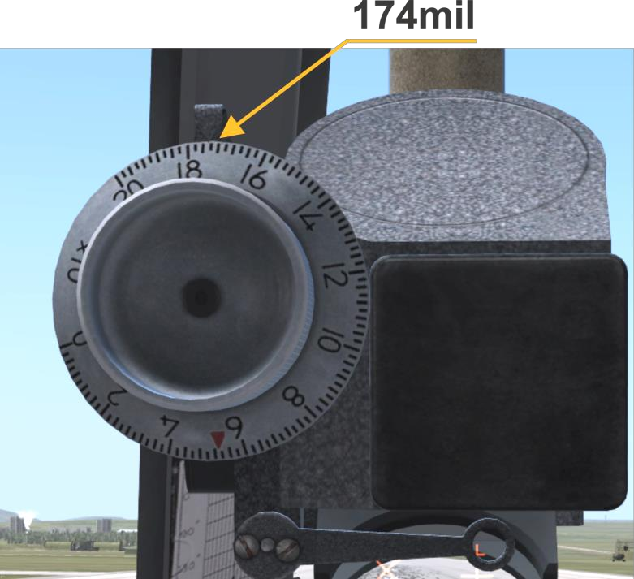

### Выход на боевой курс, прицеливание и открытие огня (атака цели)

1. Выход в район цели выполнить скрытно, вне зоны обнаружения средств ПВО
объекта, для чего наиболее целесообразно выполнять полёт на ПМВ до района
цели, используя складки местности. Наиболее применяемым режимом полёта
при стрельбах НАР и СПО является ГП на скорости 180..200км/ч с последующим
пологим пикированием (5..10°) при выполнении непосредственной атаки цели и
прицеливания. После занятия этой скорости отрегулировать автопилот,
устранив отклонения на ИН-4, оттриммировать вертолет, запомнить показания
ОШ НВ на приборе (это пригодиться для
быстрого установления режима ГП после маневров).

    

2. Включить главные выключатели вооружения (ГВ) и ЭСБР:

    1. ГВ РС ГУВ (если необходимо выполнить
    стрельбу НАР, из УПК-23-250, из ГУВ-1)
    
        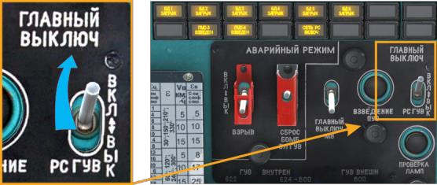
    
    2. ГВ БВ и ЭСБР (если необходимо выполнить
    бомбометание)
    
        
        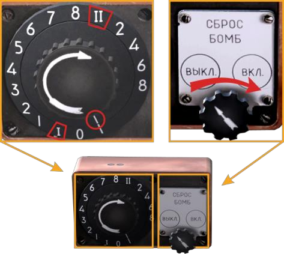
    
    (следует помнить, что остальные необходимые АЗС и выключатели должны быть включены
    перед выруливанием или взлетом).

3. На дальности 3000..2500м (9000..8000 ft) до цели выполнить маневр набора
высоты для видимости цели: либо "горкой" (взять РППУ на себя до угла тангажа
+10..15° набрать нужную высоту, снова установить тангаж для ГП или
пикирования), либо РОШ (без изменения угла тангажа, но с увеличением ОШ
НВ, тем самым набрав необходимую высоту; после набора высоты уменьшить
ОШ ровно на столько, насколько увеличивал).

    !!! note "Примечание"
        Второй вариант хотя и менее красив, но более предпочтителен, т.к. цель
        не теряется из вида во время маневра, нет увеличения картинной плоскости вертолета,
        приводящей к повышению эффективности огня стрелкового оружия противника, а также нет
        потери скорости вертолета.

4. После набора высоты видимости цели установить РОШ значение ОШ НВ на
приборе, которое соответствует режиму скорости боевого применения
(запомненное ранее), выполнить поиск этой цели, доворот вертолета на нее,
устранить скольжения (шарик в центре!) и убрать набор высоты или снижение в
режиме ГП.

    !!! note "Примечание"
        Необходимо помнить, что при открытии огня в условиях наличия
        вертикальной скорости1 или скольжения стрельба становится весьма неточной. Снаряды (НАР,
        23мм) и пули будут ложиться при вертикальной скорости вниз – с недолетом, при вертикальной
        вверх – с перелетом, в боковом отношении снаряды летят в сторону "шарика". Особенно
        актуально для НАР, так как начальная скорость вылета из ствола всего 30..50м/с. И как только
        вектор скорости НАР хоть немного не совпадает с вектором скорости потока, немедленно по
        вылету из ствола начинает действовать флюгирующая НАР сила, заставляющая её
        доворачиваться на поток, т.е. отклоняться от своего вектора дульной скорости. И последующий
        разгон ракеты уже происходит на искривленной траектории. Поэтому ракеты более "чутко"
        реагируют на не выдерживание режима стрельбы, чем снаряды пушки и пули пулеметов. Этим
        кстати обусловливается и значения угла прицеливания НАР для ГП на скорости 250км/ч: эти
        углы гораздо меньше углов для скорости 200..100км/ч. При ГП на 250км/ч вертолет имеет
        значительный (до -5°) угол тангажа на пикирование, и ракета, вылетая из ствола, имеет
        большее рассогласование вектора собственной дульной скорости и набегающего потока, чем
        при меньших скоростях. Поэтому она стремиться автоматически "поправиться", задирая нос
        вверх.
    
    Если выход на цель (или повторный заход) выполняется из разворота, то вывод
    вертолета из крена необходимо начать при значении разности текущего курса и
    желаемого боевого курса равной примерно крену вертолета (т.е. если крен в
    развороте 40°, то вывод из крена начать примерно за 40° до достижения носом
    вертолета заданного курса). Следует помнить, что при выполнении разворота с
    большими, чем 15°, кренами вертолет после вывода стремится набрать высоту,
    что следует компенсировать уменьшением ОШ на 1/8..1/6 часть хода. Далее:

#### Для стрельбы НАР и из СПО

- после вывода из разворота установить режим ГП на скорости
180..200км/ч, убрать набор высоты или снижение, установить шарик в
центр (это уменьшит рассеивание НАР относительно точки
прицеливания);
- при стрельбе НАР: с дальности 2500м (7500 ft) выполнить
окончательный доворот на цель, установить вид цели через прицел и
наложить прицельную марку на цель плавным движением РППУ, с
дальности 2000м (6000..3000 ft) с учетом поправки на дальность до
цели и боковую поправку на ветер нажать кнопку открытия огня;
при стрельбе из СПО (УПК-23-250, ГУВ-1): дальность начала ведения
огня 1500..1200м;
- если запланировано несколько залпов в одном заходе, то по мере
приближения к цели корректировать угол и точку прицеливания
 (с.347);
- на расчетной минимальной дальности (не ближе 1000м) начать
отворот от цели.

Стрельба из НАР и СПО сопровождается небольшой отдачей, а так как оси всего
подвесного вооружения ниже центра тяжести, то появляется незначительный
пикирующий момент, что надо учитывать при стрельбе длинными очередями,
накладывая прицел на 3..5тыс ВЫШЕ цели (при совпадении направления
стволов с СГФ1).

#### Для бомбометания от командира экипажа и прицеливанием по ПКВ

- Заход на цель строить с таким расчетом, чтобы после вывода
вертолета на боевой путь время до сброса составляло 10..15с. По
мере повышения мастерства это время следует уменьшать.
- После вывода вертолета на линию боевого пути при отсутствии
бокового ветра вертолет следует пилотировать так, чтобы проекция
его линии пути проходила через цель. В этом случае вертикальная
линия сетки прицела должна проходить через цель;
- при наличии бокового ветра слева (справа) вертикальная черта сетки
прицела должна проходить левее (правее) цели на величину угла
сноса;
- если ветер ровно встречный или попутный, а также при штиле, то
сброс бомб выполняется в момент совмещения цели с точкой
пересечения вертикальной линии с нижней частью большого кольца
сетки прицела (Рис. 12.4);

    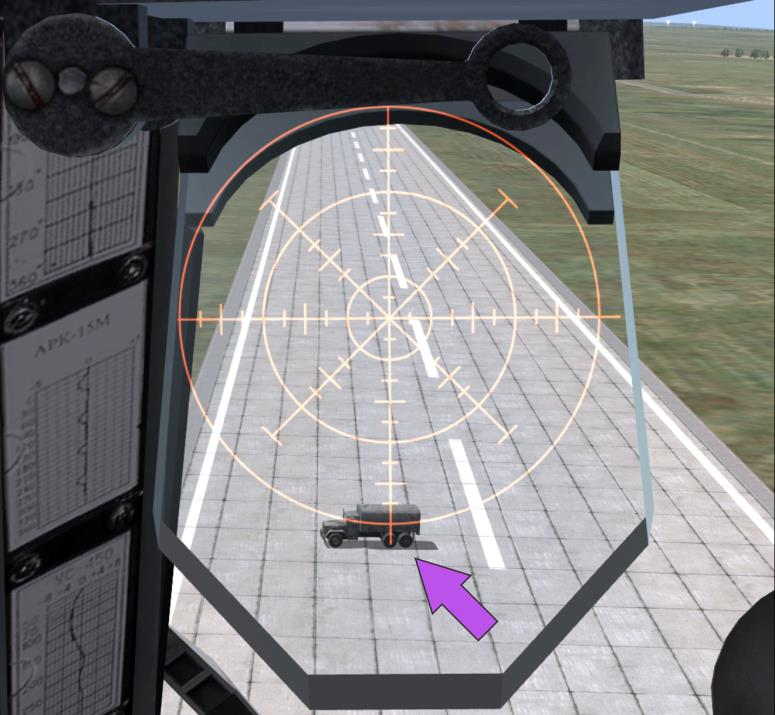

- если есть боковой ветер, то сброс выполняется в момент совмещения
цели с горизонтальной линией, проходящей через точку пересечения
вертикальной линии с нижней частью большого кольца сетки прицела

    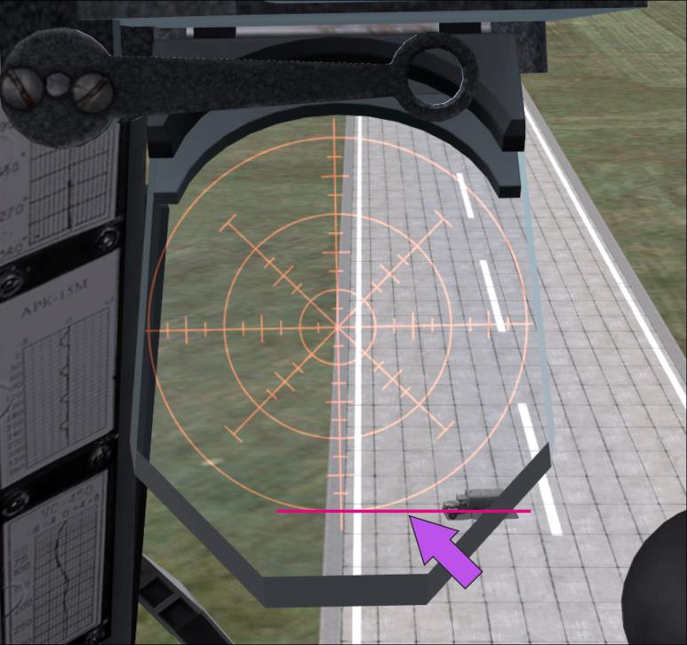

- в том случае, когда необходимый угол прицеливания выходит за поле
зрения прицела, прицеливание осуществляется путем введения
временной выдержки. В этом случае визирная линия прицела с
помощью поворотного лимба устанавливается в крайнее положение
 (200 тыс.).
- После совмещения цели с точкой пересечения вертикальной черты и
нижней части большого кольца сетки командир экипажа начинает
отсчет времени выдержки. По истечении времени выдержки
выполняется сброс бомбы.

Бомбы, сброшенные с ПМВ с замедлением, могут рикошетировать от
поверхности и взрываться дальше намеченной точки.

### Выход из атаки

1. После прекращения огня интенсивно отвернуть от цели со снижением на
ПМВ1 и увеличением скорости до максимальной 230..250км/ч (110..120KNOTS).
Для уменьшения количества попаданий стрелковыми средствами противника
после отворота от цели выполнять противозенитное маневрирование (змейку):
крен 30..40° влево, отворот на 40..50° (4..5сек), перекладка крена вправо,
также 30..40°, отворот на 40..50° (4..5сек) и так далее до дальности
1000..1500м (3000..4000ft) от цели.
При необходимости выполнить повторный заход (заходы).
2. По окончании атаки выключить главные выключатели (ГВ РС ГУВ, БВ)
выполнить полёт на свою площадку (аэродром).

### Применение пулеметов КОРД 12.7-мм и ПКТ 7.62-мм

Стрелки в грузовой кабине – из пулемета КОРД 12.7-мм в дверном проеме
(далее "дверной стрелок", и из пулемета ПКТ 7.62-мм в правой створке
грузового люка (далее "кормовой стрелок") – могут вести огонь на любом этапе
выполнения полёта. Стрелки в игре реализованы как объекты ИИ. Игрок может
управлять их поведением (ROE, или правилами ведения боя) во время игры.
Кроме того, реализована возможность игры за дверного стрелка из пулемета
КОРД 12.7-мм "от первого лица".

#### Управление ИИ-стрелками

Управляя ИИ-стрелками, игрок может выбрать одну из трех опций их поведения
(установить правило ведения боя):

- НЕ СТРЕЛЯТЬ (HOLD);
- ОТВЕТНЫЙ ОГОНЬ (RET. FIRE) – т.е. огонь открывается только в
случае ведения огня противником по вертолету;
- ВСЕГДА АТАКОВАТЬ (FREE FIRE) – (огонь ИИ-стрелки открывают в
случае обнаружения цели в пределах 800 м от себя). Если целей
много, то ИИ-стрелок выполняет перенацеливание и пытается
обстрелять все объекты. Но приоритет оставляет на более опасных
целях.

По умолчанию установлена опция "Не стрелять". Текущая настройка
индицируется в СТАТУСЕ СТРЕЛКОВ, который доступен либо в книборде, либо в
форме экранной подсказки (текст на прозрачном фоне) с рабочего места
стрелка.

ДЛЯ ИЗМЕНЕНИЯ НАСТРОЕК ПОВЕДЕНИЯ ИИ-СТРЕЛКОВ необходимо:

1. Активировать наколенный планшет игрока (книборд) [[RShift]] + [[K]] или [[K]]
(кратковременно) для индикации статуса вооружения и стрелков:

    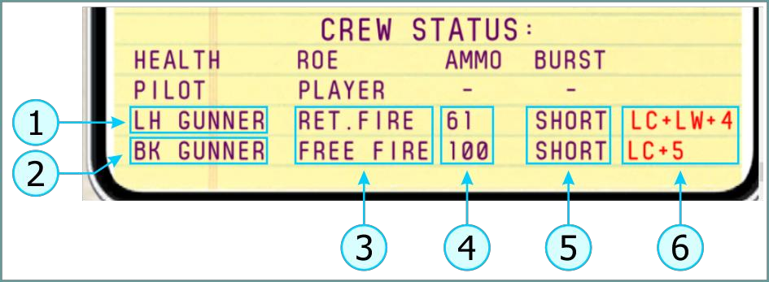
    
    1. Дверной стрелок 
    2. Кормовой стрелок 
    3. Текущие опции поведения (правила ведения боя) 
    4. Остаток боекомплекта в процентах 
    5. Длина очереди (здесь не изменяется) 
    6. Горячие клавиши для изменения правил ведения боя (LC – LCtrl, LW – LWin)

2. Командой [[LCtrl]] + [[LWin]] + [[4]] (последовательным нажатием) для
дверного стрелка и командой [[LCtrl]] + [[5]] для кормового стрелка выбрать
нужные варианты поведения и проконтролировать их в книборде.
ИИ-стрелки ведут огонь короткими очередями: с 12.7-мм пулемета – по 5..7
патронов, с 7.62-мм пулемета – по 7..10 патронов.

#### Управление дверным пулеметом КОРД 12.7-мм от первого лица

Для занятия места стрелка необходимо нажать клавишу [[4]], после чего игрок
перемещается на рабочее место стрелка, где также индицируется статус
стрелков (экранная подсказка в правом нижнем углу экрана):

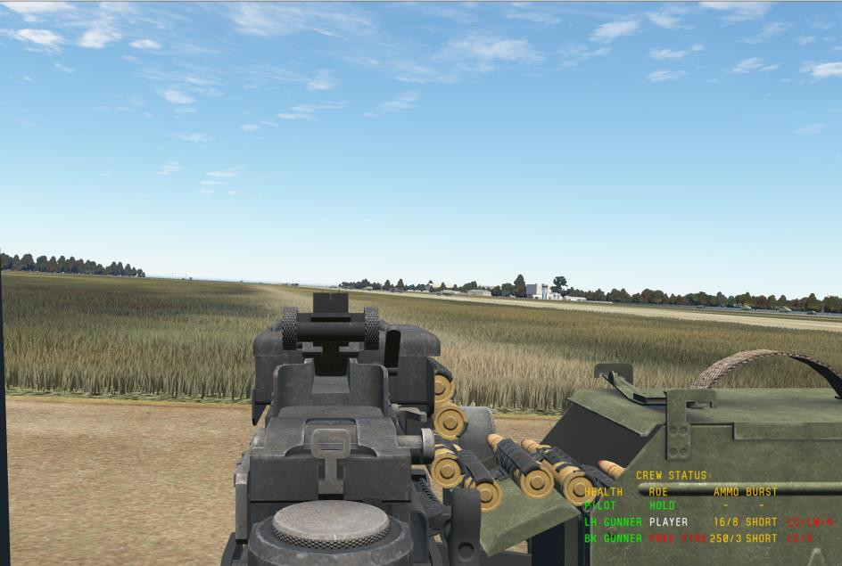

Активировать/убрать экранную подсказку о статусе стрелков – [[LWin]] + [[H]].
На экранной подсказке указываются те же данные, что и в книборде, за
исключением остатка патронов: здесь указывается не в процентах от всего
количества, а по патронам и номеру текущей ленты, начиная с ленты №12 и
далее к ленте №1.

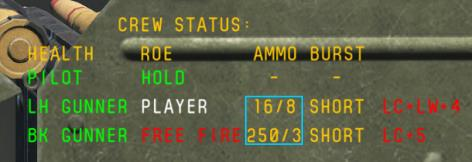

В примере 16/8
означает: осталось 16 патронов в 8-й ленте (из 12) для пулемета КОРД 12.7-мм.
Аналогично и для 7.62-мм пулемета ПКТ.

Управление и взглядом, и стволом пулемета осуществляется мышью:

- движение мыши влево-вправо перемещает пулемет влево и вправо;
- вращение колеса мыши отдаляет/приближает прицельную планку.

Для прицеливания необходимо колесом мыши "приблизить" пулемет к себе:

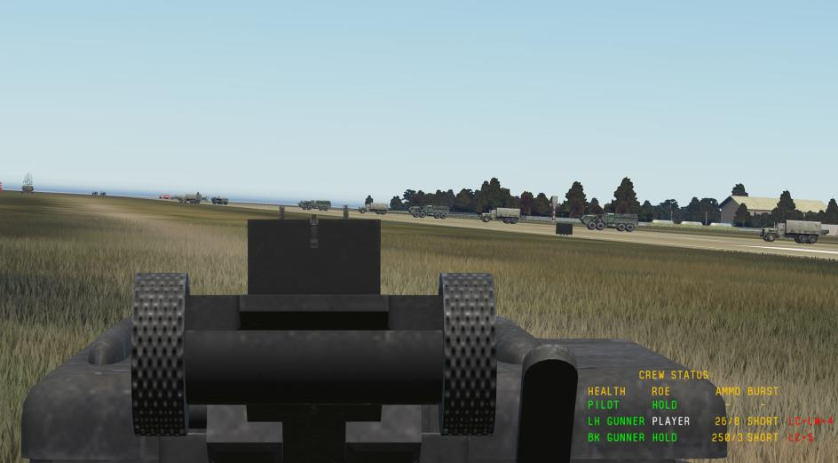

и выполнить совмещение прорези на прицельной планке, мушки и цели

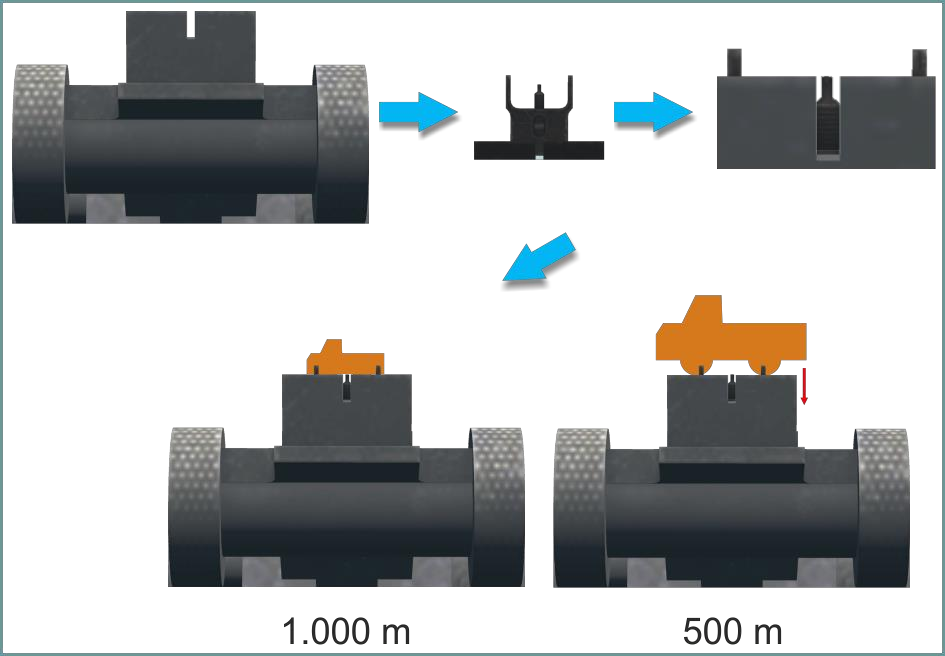

Прицельная дальность на прицельной планке в игре установлена на 1.000 м, и
для этой дальности прицеливание необходимо осуществлять "под обрез" (по
нижнему краю картинной плоскости цели). Если необходимо прицелиться на
меньшую дальность, тогда потребуется немного опустить линию "целик –
мушка" ниже цели.

Открытие огня выполняется левой кнопкой мыши.

#### Особенность использования систем отслеживания движений головы (типа TrackIR) при игре за стрелка

В случае добавления к имеющимся устройствам ввода (клавиатура, мышь и
джойстики) систем отслеживания движений головы (типа TrackIR) управление
взглядом и пулеметом в игре имеет три режима применения:

- TrackIR управляет взглядом, мышь – пулеметом (по умолчанию при
занятии рабочего места стрелка);
- TrackIR управляет и взглядом, и пулеметом;
- TrackIR выключен горячей клавишей из ПО TrackIR [[F9]], и тогда
мышь управляет и взглядом, и пулеметом.

Последовательное переключение режимов осуществляется командой
[[LAlt]] + [[T]].

!!! note "Примечание"
    Функция совместного использования устройств ввода настраивалась
    только для официально поддерживаемого устройства TrackIR, работа с другими аналогичными
    устройствами не тестировалась.

#### Клавиатурные команды при игре со стрелками

Комбинация клавиш | Назначение
----------------|------------
[[4]] |Занять рабочее место дверного стрелка
[[1]] |Занять рабочее место левого пилота
[[RShift]] + [[K]] | Активировать наколенный планшет
[[K]] | Активировать наколенный планшет (кратковременно)
[[LWin]] + [[H]] | Активировать/деактивировать экранные подсказки с рабочего места дверного стрелка
 [[LCtrl]] + [[LWin]] + [[4]] | Установить правила ведения боя дверного стрелка
 [[LCtrl]] + [[5]] | Установить правила ведения боя кормового стрелка
[[LAlt]] + [[T]] | Переключение режимов совместного применения мыши и TrackIR
 [[F9]] | Отключение/включение TrackIR из его ПО

## Аварийный сброс бомб и подвесок

### Общее описание

Аварийный сброс применяется для экстренного сброса подвесок в полёте с
целью облегчения вертолета В ОСОБЫХ СЛУЧАЯХ полётА или необходимости сброса
бомб во время применения бомбардировочного вооружения ПРИ ОТКАЗЕ ОСНОВНОЙ
СИСТЕМЫ СБРОСА.

#### Случаи экстренного сброса в полёте всех подвесок вооружения

Экстренный сброс в полёте всех подвесок вооружения выполняется в
следующих аварийных ситуациях:

- при отказе двух двигателей (если есть возможность);
- при отказе или вынужденном выключении одного двигателя, когда
продолжение полёта невозможно из-за потери высоты;
- при отказе путевого управления в том случае, когда принято решение
на выполнение посадки;
- при аварийном покидании вертолета экипажем, когда безопасность
покидания не обеспечена (в игре не реализовано);
- при зависании авиабомб, пожаре или взрыве боеприпасов в
контейнерах, гондолах и блоках (в игре не реализовано).

Вертолет оборудован двумя щитками управления аварийным сбросом:

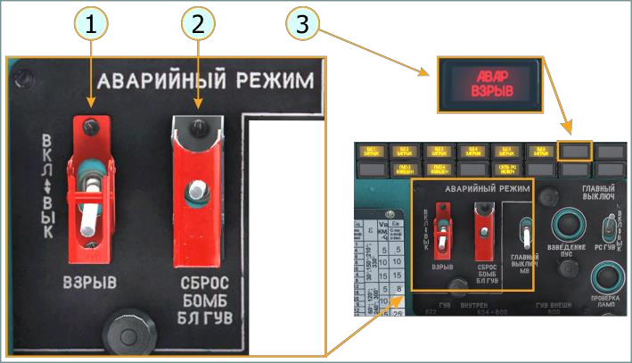

1. Выключатель ВЗРЫВ – в положении ВКЛ
(вверх) активирует взрыватели авиабомб
2. Нажимной (подпружиненный) переключатель сброса СБРОС БОМБ БЛ ГУВ – при переводе в верхнее положение посылает сигнал на открытие замков всех без исключения балочных держателей
3. Табло, сигнализирующее об активации цепи аварийного взрыва

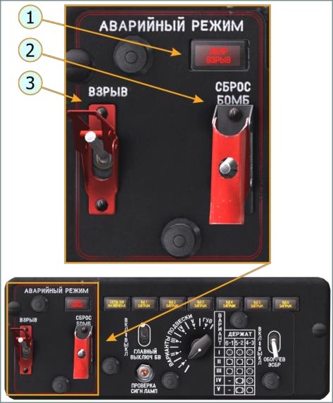

1. Табло, сигнализирующее об активации цепи аварийного взрыва 
2. Нажимной (подпружиненный) переключатель сброса СБРОС БОМБ – при переводе в верхнее положение посылает сигнал на открытие замков тех балочных держателей, которые в выбранном варианте подвески имеют символы 

    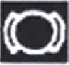
    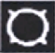

3. Выключатель ВЗРЫВ – в положении ВКЛ (вверх) активирует взрыватели авиабомб

Поэтому аварийное сбрасывание может быть выполнено с рабочего места
командира экипажа или с рабочего места летчика-штурмана (второго пилота).

Сброс может быть выполнен как на "взрыв", так и на "невзрыв" в зависимости
от положения выключателей ВЗРЫВ на пультах вооружения. В положении
"ВЗРЫВ" взрыватели сброшенных бомб будут взведены и бомбы взорвутся
при контакте с поверхностью.

При аварийном сбросе от командира экипажа сбрасываются бомбы, блоки и
контейнеры со всех держателей во всех вариантах подвески, а при сбросе от
летчика-штурмана сбрасываются только бомбы, при условии, что они есть в
установленном на пульте БВ варианте подвески:

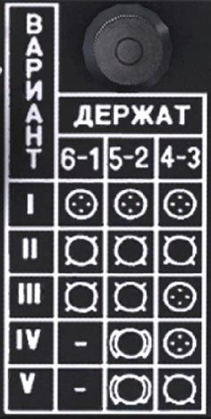

I – "все блоки" – ничего не будет сброшено 
II – "все бомбы" – импульс на сброс будет подан
на балочные держатели №1-6 одновременно 
III – "бомбы-блоки" – импульс на сброс будет
подан на балочные держатели №1, 6, 2, 5
одновременно 
IV – "бомбы-блоки" – импульс на сброс будет
подан на балочные держатели №2, 5
одновременно 
V – "все бомбы" – импульс на сброс будет подан
на балочные держатели №2, 5, 3, 4
одновременно 

При установке переключателя ВАРИАНТЫ ПОДВЕСКИ на пульте БВ в
положения I, III и IV исключается возможность сбрасывания блоков летчиком-
штурманом от цепей аварийного сброса.
Блоки в этих случаях могут быть сброшены с помощью выключателя СБРОС
БОМБ БЛ ГУВ на пульте командира экипажа. При необходимости все же
выполнить аварийный сброс от летчика-штурмана перед сбросом следует
изменить вариант на пульте БВ на II или V (чтобы система "думала", что на всех
БД подвешены бомбы).

### Аварийный сброс от командира экипажа

Для выполнения аварийного сброса командиру экипажа необходимо проверить
и выполнить:

1. Должны быть включены
АЗСы на левой панели
(показаны АЗС, необходимые только
для выполнения сброса)

    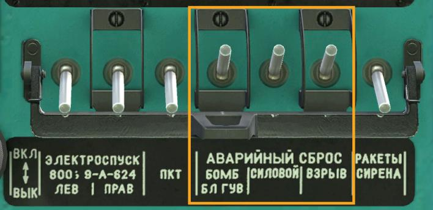

2. Должны быть включены
ПРЕДОХРАНИТЕЛЬНЫЕ
ВЫКЛЮЧАТЕЛИ;

    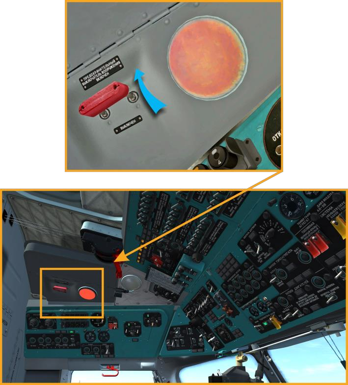

3. На верхнем щитке
управления вооружением
командира:

    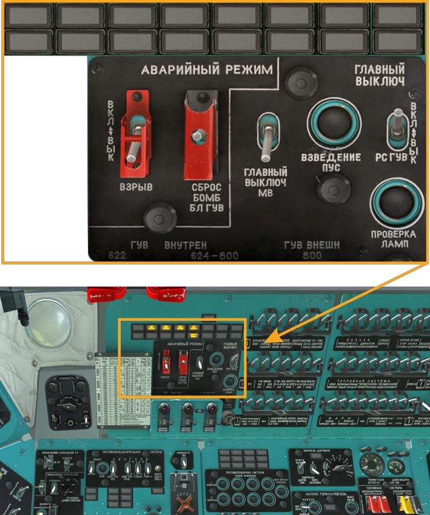

    - если необходимо выполнить
сброс без взрыва бомб,
тогда следует открыть
защитный колпачек
выключателя аварийного
сброса [[LAlt]] + [[J]] (1) и
выполнить сброс [[J]] (2)

    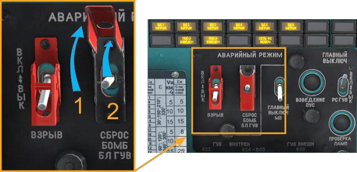

    - если необходимо выполнить
аварийный сброс со взрывом
бомб, тогда следует сначала
открыть защитный колпачек
выключателя ВЗРЫВ [[LAlt]] +
 [[J]] (1) и установить положение
ВКЛ (вверх) [[H]] (2) – загорится
табло АВАР ВЗРЫВ, а после
этого выполнить сброс [[J]] ,
см.п. a)

    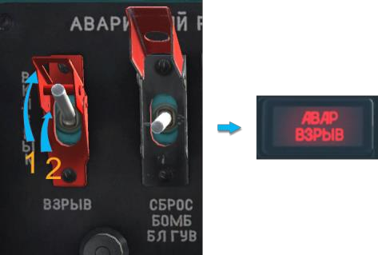

4. Убедиться в сбросе бомб, блоков,
контейнеров и др. визуально и по
погасанию табло;

5. Установить выключатель СБРОС
БОМБ БЛ ГУВ в положение ВЫКЛ.

### Аварийный сброс бомб от летчика-штурмана (второго пилота)

1. Должны быть включены
АЗСы на левой панели
(показаны АЗС, необходимые только
для выполнения аварийного сброса)

    

2. Должны быть включены
ПРЕДОХРАНИТЕЛЬНЫЕ
ВЫКЛЮЧАТЕЛИ;

    

3. На пульте
бомбардировочного
вооружения:

    - a) проверить установленный
вариант вооружения, см.Табл.
12.11

    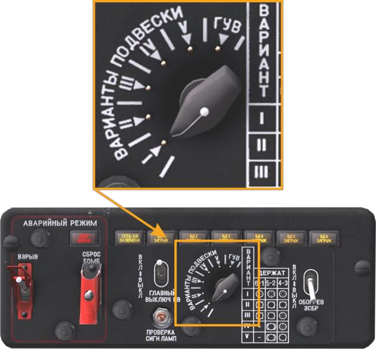

    - b) если необходимо выполнить
сброс без взрыва бомб,
тогда следует открыть
защитный колпачек
выключателя аварийного
сброса [[RAlt]] + [[U]] (1) и
выполнить сброс [[U]] (2)

    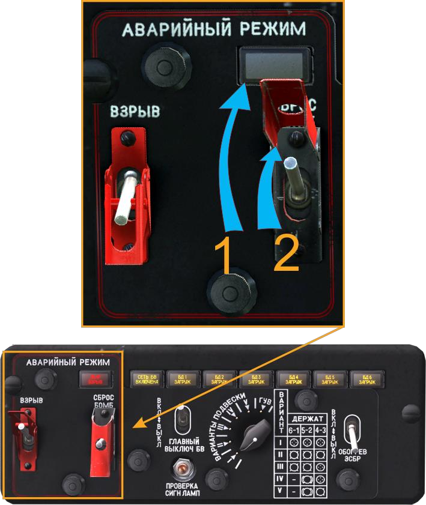

    - c) если необходимо выполнить
аварийный сброс со взрывом
бомб, тогда следует сначала
открыть защитный колпачек
выключателя ВЗРЫВ [[RAlt]] +
 [[I]] (1) и установить его вверх
 [[I]] (2) – загорится табло АВАР
ВЗРЫВ, а после этого открыть
защитный колпачек
выключателя аварийного
сброса [[RAlt]] + [[U]] (3) и
выполнить сброс [[U]] (4)

    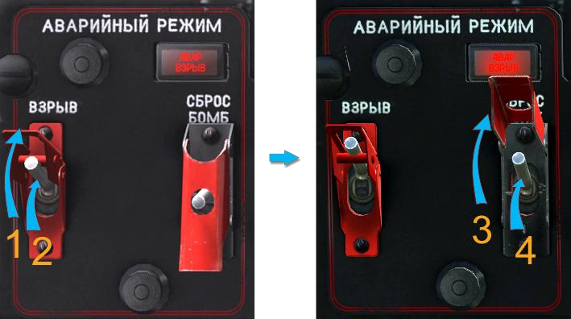

4. Убедиться визуально и по погасанию
табло сигнализации о наличии грузов,
и сбросе всех авиабомб с держателей;
5. Установить выключатель СБРОС
БОМБ в нижнее положение и закрыть
его предохранительным колпаком;

{!abbr.md!}
{!docs/mi8/abbr.md!}
