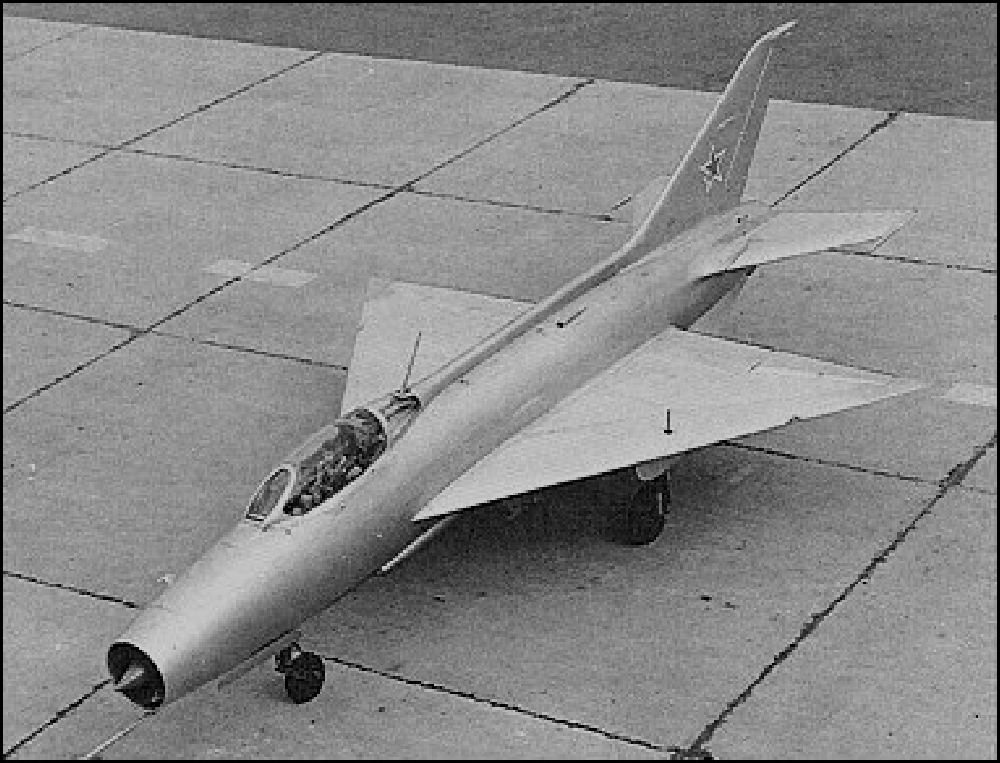
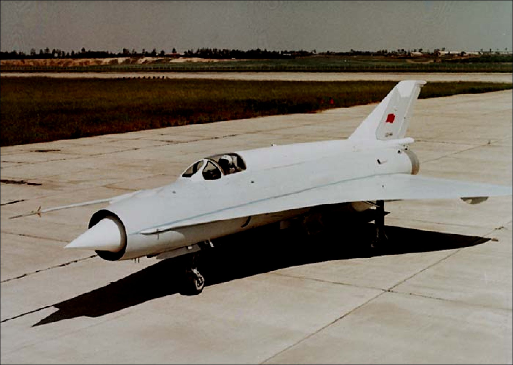
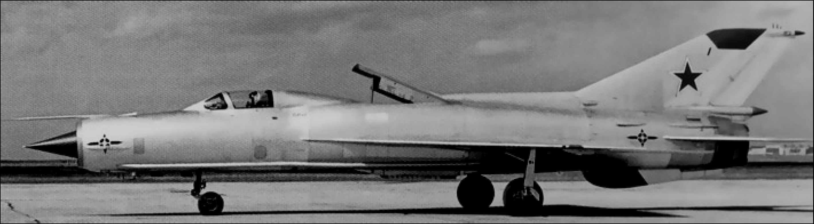
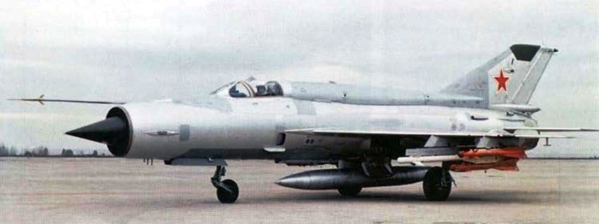
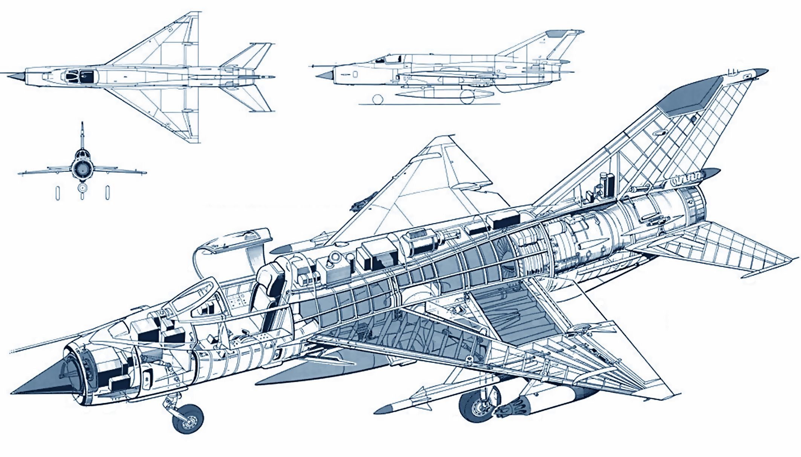

# Краткая историческая справка

Работы над проектом, который позже стал известен всему миру как МиГ-21, начались в первой
половине 1950-х годов, когда ОКБ Микояна завершило предварительную работу над машиной
«Е-1». Впрочем, этот проект вскоре был пересмотрен и проходил в рабочей документации под
индексом «Е-2». Эти опытные образцы, равно как дошедшие до стадии реализации проекты,
имели стреловидное крыло, а первой экспериментальной машиной с треугольным крылом,
ставшим в последствии «визитной карточкой» серийных «Мигов», оказался опытный вариант
Е-4. Он впервые поднялся в воздух 16 июня 1955 года, а в июле 1956 г. был представлен
широкой общественности. МиГ-21 стал первым советским самолётом, успешно сочетающим
качества фронтового истребителя и перехватчика. Его схема была использована во множестве
проектов советской конструкторской школы.

МиГ-21 являлся лёгким истребителем с относительно маломощным, но при этом способным
разгонять самолет до 2М, двигателем. По этому показателю его «ровесниками» могут
считаться такие американские истребители, как Lockheed F-104 Starfighter, Northrop F-5
Freedom Fighter и французский Dassault Mirage III.

Подобно множеству летательных аппаратов, оптимизированных для решения задач перехвата
воздушных целей, МиГ-21 имел маленький боевой радиус. Проблема маленького боевого
радиуса и небольшого запаса топлива стала своеобразным «родовым проклятием» целой
линейки «двадцать первых»: Ф, ПФ, ПФМ, С/СМ, хотя каждая новая модификация и имела
баки большей емкости, чем предыдущая. Постоянные попытки добиться вменяемых
результатов в этом направлении привели к появлению модификаций МТ и СМТ, которые уже
отличались увеличенной на 250 км дальностью, достигнутой за счет ухудшения некоторых
ЛТХ: нижней границы практического потолка и приобретения меньшей скороподъемности.

Треугольное крыло, отлично подходящие для быстрого разгона и сверхзвукового полёта,
оказалось далеко не лучшим решением для полётов на малых скоростях и ведения
маневренного ближнего воздушного боя (БВБ). Частично ситуация улучшалась применением
чрезвычайного форсажа, обеспечивающего прирост тяговооруженности на высотах до 4000
метров, выполнения резких маневров на небольших скоростях и возможности быстрого выхода
из зоны низких скоростей. Хвостовое оперение вкупе с треугольным крылом обеспечивало
устойчивость и управляемость самолета на предельных полетных режимах, прощая многие
ошибки не очень подготовленным пилотам.

Самолет с подвешенным для ведения БВБ вооружением мог развивать вертикальную скорость
в 235 м/с, уже вплотную приближаясь по своим характеристикам к появившемуся несколько
позднее F-16A. При наличии на борту двух слагаемых победы - безотказных ракет и
подготовленного пилота, «двадцать первый» мог дать жару любому современному ему
истребителю. Позднее самолет был заменен более совершенными применявшихся в т.ч. и для
непосредственной поддержки наземных войск МиГ-23 и МиГ-27, имевших крылья изменяемой
геометрии. Однако, до появления Миг-29 в середине 1980-хх никто, кроме «двадцать первых»
не мог противопоставить что-то в ответ новым американским перехватчикам.

МиГ-21 широко экспортировался во многие страны и остается востребованным после
модернизации. Уступая современным истребителям в технологичности, МиГ-21 в то же время
является более дешёвым в производстве и эксплуатации, поэтому на протяжении он трех
десятилетий он остаётся фаворитом у стран, скупающих советское вооружение.

МиГ-21БИС («изд.75») стал венцом развития всей линейки «двадцать первых». Он оснащался
турбореактивным двигателем Туманского Р25-300 и отличался множеством других
нововведений от своих предшественников. Самолёты ПВО ("Fishbed-L") укомплектовывались
аппаратурой боевого управления и наведения “ЛАЗУРЬ”, а самолёты ВВС ("Fishbed-N"),
оборудовались системой инструментальной посадки “Полет”. Бортовое оборудование
обеспечивало выполнение полётов днём и ночью в простых и сложных метеоусловиях. МиГ-21
БИС, относящийся к третьему поколению, состоит на вооружении более 50 государств. И даже
спустя полвека с момента первого полета он все еще защищает небо отдельных стран.
Несколько компаний предлагают свои услуги по модернизации МиГ-21 до современного
уровня в плане бортовой электроники и вооружения.

МиГ-21 установил множество рекордов и до сих пор является самым массовым реактивным
истребителем в истории мировой авиации.

## Летно-технические характеристики

- Экипаж: 1 человек

- Длина: 15.0 м (с ПВД) (49 ft 2.5 in)

- Размах крыльев: 7.154 м (23 ft 5.66 in)

- Высота: 4.125 м (13 ft 6.41 in)

- Площадь крыла: 23.0 м² (247.3 ft²)

- Масса пустого самолета: 5,339 кг (11,770 lb)

- Взлетная масса : 8,725 кг (19,235 lb)

- Силовая установка: 1×турбореактивный двигатель Туманского Р25-300, 44 кН – тяга на
бесфорсажном режиме, 71 кН - тяга на режиме «Форсаж».

- Предельно допустимая скорость: 2350 км/ч (ИС), 1300 км/ч (ПС)
- Предельное число М: 2.05
- Боевой радиус, (без ПТБ): 1210 км (751 miles)
- Практический потолок: 17500 м (57415 ft)
- Скороподъёмность: 225 м/с (44280 ft/min)
- Скорость отрыва от ВПП, ПС: 340-370 км/ч
- Скорость касания, ПС: 260-270 км/ч
- Крейсерская скорость, ИС: 800 км/ч

- База шасси: 4.71 м
- Ширина колеи: 2.69 м
- Нагрузка на крыло: 385кг/м2
- Масса пустого самолета: 5339 кг
- Нормальная взлетная масса: 8725 кг
- Предельный взлетный вес: 10400 кг
- Ход конуса, максимальный: 200 мм
- Угол установки закрылков:
    - взлет: 25°
    - посадка: 45°
- Угол отклонения элеронов: ±20°
- Угол отклонения тормозных щитков:
    - передних - 35°
    - заднего - 40°
- Угол отклонения цельноповоротного стабилизатора : +7.5°/ -15.7°
- Угол отклонения руля направления: ±25°

## Объём топлива

- В основных (внутренних) баках: 2850л = 2225кг
- Подвесной топливный бак: 490 л = 382 кг (+52 кг масса ПТБ)
- Подвесной топливный бак: 800 л = 625 кг (+57 кг масса ПТБ)

Соотношение л/кг: 1кг = 1,279 л; 1л = 0.781 кг

Удельный вес топлива: 0,775г/см3

Весовые показатели топлива сильно зависят от его температуры.

## Нормы расхода

- 100% на земле 3,2 л/с (2,5кг/с)
- Форсажный режим на уровне моря: 4,2л/с (3,3кг/с)
- Чрезвычайный форсаж на уровне моря: 5,5л/с (4,3кг/с)
- Форсажный режим: M1.06 6,4л/с (5,0кг/с)
- Чрезвычайный форсаж: M1.06 8,8л/с (6,9кг/с)
- Руление: 80 л
- Взлёт: 250л (~2мин ~25 км)
- Полётный уровень: 1485л (550km)
- Полет по кругу (обучение): 200 л
- Рекомендуемый остаток топлива на посадке (включая резерв для двух заходов): 700 л

Во время перегоночных полётов, уменьшение массы самолета на 10% приводит к снижению
удельного расхода

- на 10% при полете на высотах 10000 – 11000 м
- на 5% при полете на высотах 5000 м
- на 0,5% при полете на высотах 500 м

