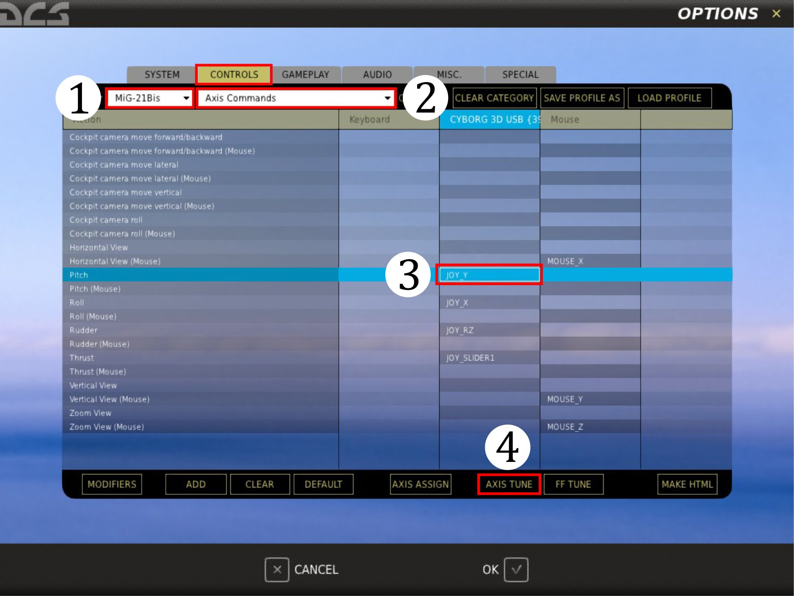
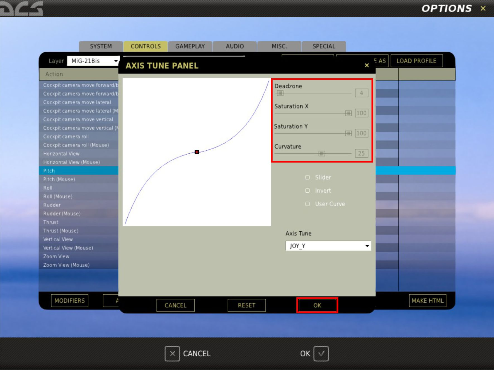
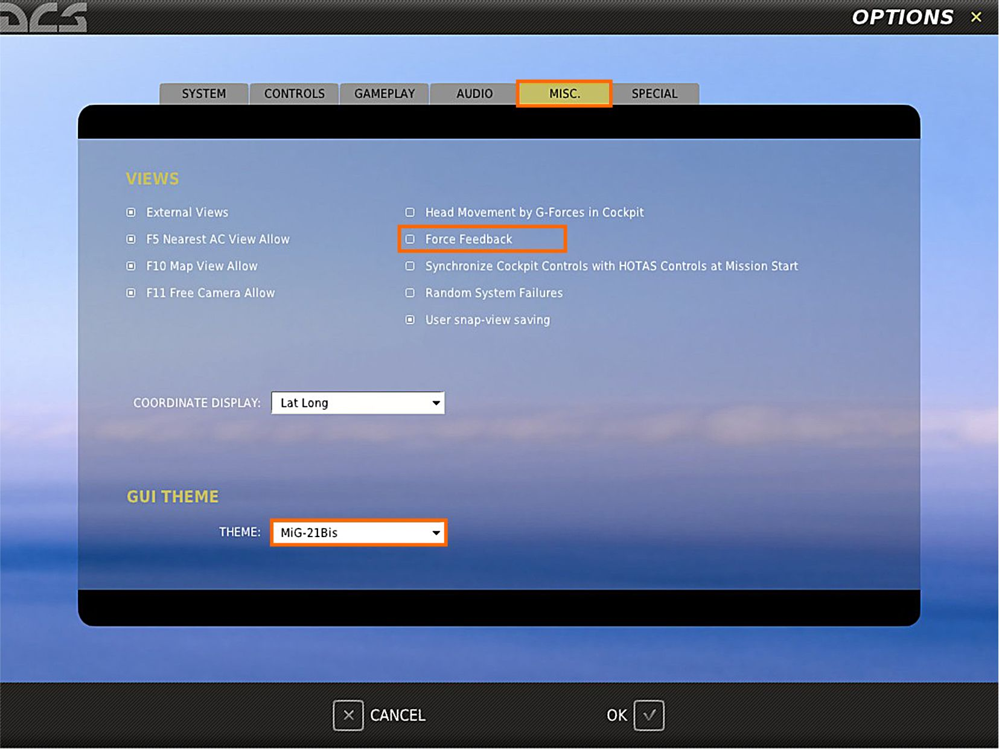
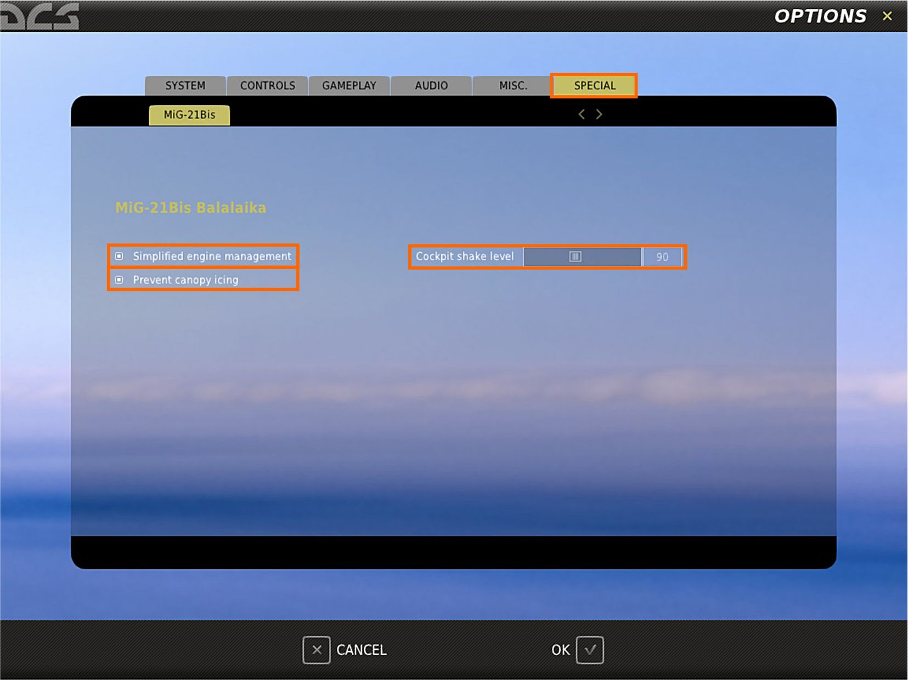

# Установка и настройка модуля

## Настройка управления

Основной задачей, решаемой при создании МиГ-21БИС, равно как и любого другого
истребителя, являлось достижение максимально возможных скоростей и превосходной
управляемости. Главной трудностью, возникающей в скоростном полете, является определение
величины отклонения управляющих аэродинамических поверхностей. Например, если вы
полностью возьмёте ручку на себя на скорости 500 км/ч, горизонтальное оперение отклонится
полностью, что позволяет выполнить резкие развороты с относительно небольшой перегрузкой
(около 2-3g). Но если увеличить скорость до 1000 км/ч и потянуть ручку таким же образом, то
без системы управления вы мгновенно достигли бы очень высокой перегрузки, которая, скорее
всего, будет за рамками физиологических возможностей лётчика и пределами прочности
планера. Таким образом, система управления отклонит горизонтальное оперение на сей раз не
полностью, а частично, все ещё позволяя выполнить развороты и маневры при больших
перегрузках.

Для правильной настройки чувствительности джойстика, которая позволит сбалансировать
отклик самолёта в полёте на больших и малых скоростях, рекомендуем выполнить следующее:

Независимо от типа вашего джойстика, перейдите в главное меню DCS и там выберите пункт
НАСТРОЙКИ, затем вкладку УПРАВЛЕНИЕ (рисунок 1), потом выберите МиГ-21 БИС(1).
Выберите ОСЕВЫЕ КОМАНДЫ (2) затем ТАНГАЖ (3). Кликните НАСТР. ОСИ (4): в
всплывающем окне ПАНЕЛЬ НАСТРОЙКИ ОСИ (рисунок 2) позволит вам настроить кривые
и другие оси.

На ПАНЕЛИ НАСТРОЙКИ ОСИ расположены четыре ползунка: мёртвая зона, насыщенность
X, насыщенность Y и кривизна. Другие настройки сейчас неважны. Установите эти ползунки
для каждой оси индивидуально (тангаж, крен, и рысканье) согласно этой таблице:

Таблица 3.1:

Параметр | Тангаж | Крен | Рысканье
---------|--------|------|--------
Мёртвая зона    | 1-3   | 1-3   | 1-5
Насыщенность X  | 100   | 100   | 100
Насыщенность Y  | 100   | 100   | 100
Кривизна        | 20-25 | 10-25 | 20-25

Подтвердите установки нажатием OK.

## Настройка игровых параметров

DCS предлагает множество вариантов настроек сообразно вашим требованиям. Помимо
стандартных настроек из Руководства пользователя, DCS МиГ-21БИС предлагает несколько
дополнительных и имеет некоторые особенные функции, о которых вам следует помнить.

### Особенности модуля

Так называемые “особые функции” строятся на запрограммированных свойствах систем
самолёта и двигателя. Они описаны ниже.

#### Перегрузка систем самолёта

Каждый раз при включении/отключении
бортовых систем, они подергаются
значительным нагрузкам (в результате
переходных процессов). Вы никогда не заметите
это во время игры. Однако, в критической
ситуации можно «перегрузить» какие-то
системы, что приведёт к их отказу.

!!! note "Примечание"
    Во время полета самолёт
    расходует ресурсы бортовых систем (различные
    жидкости, а также в результате взаимодействия
    механизмов, возникающих напряжений и т.п.).
    После посадки и дозаправки ресурс всех систем
     будет восстановлен до 100%. Это будет заметно
    при открытии фонаря (если он был закрыт):
    переключатели вернутся в положение ВЫКЛ, а
    технические жидкости (за исключением
    топлива) восстановятся до прежнего уровеня.
    Наблюдайте за манометром (RH61), (LV39) и
     (LV2), показания которых восстановятся до
    прежних.

!!! note "Примечание"
    Автоматическое восстановление
    систем самолёта завязано на процесс заправки
    топливом. Однако, для ремонта поврежденных
    участков планера (фюзеляж, крылья, хвостовое
    оперение, шасси) необходимо вызвать наземную
    команду и запросить ремонт. Так же необходимо
    поступить и при подвеске вооружения.

#### Износ двигателя

Располагаемый ресурс двигателя будет
уменьшаться вне зависимости от настроек
отказов (включены они или нет). Всякий раз при
запуске двигателя или работе на форсаже, а
также когда он подвергается воздействию
отрицательных/околонулевых перегрузок,
двигатель испытывает подвергается
незначительные напряжения.

Как и в предыдущем случае, при нормальном
пилотировании износ не будет сказываться,
двигатель будет также стабильно работать,
кроме отказов, вызванных другими причинами,
например, прекращением подачи топлива.
Однако, если накопленный износ достигнет
предела, двигатель остановится и его повторный
запуск будет невозможен.

Износа двигателя обнуляется после посадки и
выключения. При этом за 4 минуты
восстанавливаются все израсходованные
ресурсы.

#### Замерзание фонаря

При полётах в условиях температур от 0oC до -
10oC (32oF/14oF) и выдерживании ПС между
400 – 500 км/ч, происходит накопление льда на
остеклении фонаря. Для его устранения
разгоните самолет до ИС >700 км/ч (или ПС >500 км/ч, по ситуации) и задействуйте ПОС.

#### Замерзание трубок приёмников воздушного давления (ПВД)

В условиях полёта, подобных вышеописанным,
замерзанию также подвержены и трубки ПВД.
Этот процесс длителен и поначалу незаметен. На
поздних стадиях можно обнаружить
расхождение между значениями скорости (ИС,
ПС, М) и тягой двигателя, наряду со странными
показаниями высотомера и вариометра.

Для предотвращения обмерзания ПВД перед
взлётом включите его обогрев (CL74/75). Если
вы начали миссию в воздухе, то обогрев
включён по умолчанию.

Если вы уже допустили обледенение ПВД, то
имейте в виду, что на его прогрев нужно время.

Даже в самой тяжёлой ситуации на снятие
ледовых образований требуется не более 2
минут.

### Замерзание аккумулятора

Самолётный аккумулятор замёрзнет без
включённого обогрева (RV41) при полете на
высотах выше 4000 м. Этот процесс занимает
некоторое время, но начавшись, приводит к
ускоренной разрядке АкБ. Аккумулятор
является резервным источником постоянного
тока. Остаться без него - явно не лучшая идея.

Проверьте включение обогрева батареи перед
взлётом.

#### Погрешность ПВД на околозвуковых скоростях.

Ошибки системы ПВД рассчитаны для всех
диапазонов скоростей и высот. В большинстве
случаев ошибки настолько маленькие, что вы их
наверняка не будете учитывать.

Однако, при полете на между 0.95М и 1.05М
можно заметить странное поведение
аэрометрических приборов. Показания скорости,
барометрической высоты и вертикальной
скорости будут «прыгать». Это особенно
заметно на барометрическом высотомере и
на вариометре ДA-200.

И этого нельзя избежать или как-то устранить.

Обычно, такие явления возникают при
интенсивном, в течение нескольких секунд,
проходе зоны околозвуковых скоростей. Так что
она может и не оказать значимого влияния на
полет. Но продолжительное пребывание в этой
зоне (если, например, полезная нагрузка не
позволяет разогнаться выше 1.05М), заставит
вносить поправки при считывании данных.
Также помните, что полёты в трансзвуковой зоне
крайне неэкономичны.

#### Порядок работы с системой автоматической регистрации параметров полета (САРПП)

При включении САРПП (RV 30) регистрация
параметров осуществляется с периодичностью
один раз в секунду. По окончании миссии
данные записываются на жесткий диск, позволяя
экономнее пользоваться его ресурсом.
Длительность цикла регистрации САРПП
составляет 120 мин. Если полет длится больше
120 мин. (например, в сетевых миссиях), то
запись будет происходит циклически – новая
запись осуществляется поверх прежней.

Ваши записи САРПП находятся в папке: “Saved
Games\DCS\SARPP”.

#### Стартовые пороховые ракетные двигатели СПРД

Для сокращения разбега МиГ-21БИС может
оборудоваться ускорителями СПРД.
Продолжительность их работы составляет около
7 с. Для их использования, установите СПРД в
редакторе миссий, подайте на них питание,
включите сброс (RH51, RH50). Начните разбег //link
на форсаже: когда скорость достигнет 120-150
км/ч СПРД сработают автоматически. Их можно
задействовать вручную (CV91), хотя это не
рекомендуется. Чтобы отстрелить СПРД после
взлета, используйте кнопку LH60.

## Игровые настройки

Настройка параметров наверняка уже вам знакома по другим модулям DCS. За подробными
инструкциями обращайтесь к DCS User manual_RU (Руководство пользователя DCS). Здесь
мы рассмотрим влияние некоторых настроек на ход игрового процесса.

УПРОЩЕННАЯ ДИНАМИКА - выбор этой позволяет выбрать упрощенную модель полёта:

- сваливание затруднено, но возможно,
- ввод в штопор невозможен,
- устойчивость повышена на 10-20%,
- шасси автоматически убираются после взлёта, кран уборки автоматически занимает
соответствующее положение (нейтраль),
- выпуск шасси вручную,
- в случае ухода на второй круг или прохода на малой высоте, шасси убираются автоматически,
- износ двигателя не учитывается.

УПРОЩЕННАЯ АВИОНИКА. Этот опция включает игровой (аркадный) режим. При выборе
режима не происходит расчета внутренних напряжений. Отказ оборудования в этом режиме
возможен только при задействовании соответствующих настроек в редакторе миссии или
расходовании рабочих сред (топливо, масло, кислород, сжатый воздух, спирт)). Развертка
рабочего поля РЛС отображается наложением на основном экране, что удобно для просмотра
при пилотировании "вне кабины" (F2).

ПОДСКАЗКИ – Эта настройка позволяет отключать подсказки в кабинах
советского/иностранного производства при наведении курсора на орган управления.

ЗЕРКАЛА - МиГ-21 БИС имеет располагаемое в верхней части фонаря зеркало (перископ).

ОБРАТНАЯ СВЯЗЬ - DCS МиГ-21БИС поддерживает устройства с силовой обратной связью
(FF). Если ваш джойстик поддерживает режим FF вы можете включить эту опцию. Она
позволит испытать непередаваемые ощущения и улучшить управляемость.

ТЕМА ИНТЕРФЕЙСА - устанавливает обои рабочего стола DCS World, окон, меню и
музыкальные темы.

## Особые настройки

УПРОЩЕННОЕ УПРАВЛЕНИЕ ДВИГАТЕЛЕМ - Если выбрана эта настройка, то любые
отказы и остановки двигателя в воздухе в результате любых внутренних
неисправностей/перегрузок будут невозможны. Останов двигателя в воздухе довольно
распространен у начинающих пилотов. При каждой остановке двигателя его необходимо
повторно запускать, учитывая тот факт, что есть ограниченное количество попыток запуска.
Перезапуск двигателя в воздухе может быть затруднен или даже невозможен в некоторых
случаях.

Предотвращение обледенения - Если настройка включена, то на фонаре при наступлении
соответствующих обстоятельств отображаются ледовые наросты.

Уровень вибрации – позволяет настроить уровень вибрации с помощью ползунка. Установка
по умолчанию 100% соответствует нормальному уровню вибрации. Если вы планируете
совершать полёты на выполнение фигур высшего пилотажа, то наверняка для повышения
точности пилотирования захотите установить уровень вибрации 0%. Максимальный уровень
вибрации 200%.
