# Кабина

Органы управления самолетом расположены перед пилотом на передней панели, на правом
и левом бортах кабины, на задней переборке и за креслами летчиков.

## Приборы передней панели

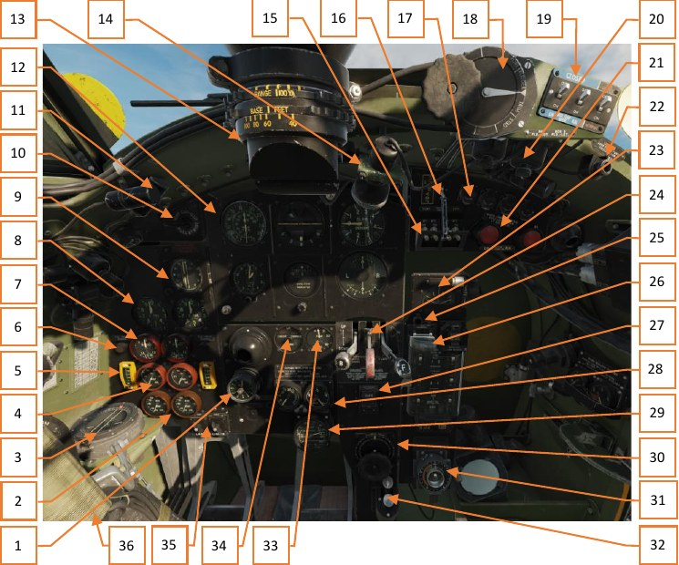

1. Часы
2. Индикаторы температуры радиатора
3. Компас
4. Индикаторы температуры масла
5. Индикаторы давления масла
6. Предупреждающая лампа давления топлива
7. Индикаторы давления наддува
8. Индикаторы оборотов
9. Указатель курса
10. Перекрывной кран управления наддувом (не подключен на Merlin 25)
11. Реостаты ламп заливающего освещения
12. Панель приборов «инструментального полета»
13. Прицел
14. Ультрафиолетовая лампа
15. Магнето
16. Главный выключатель электросети
17. Кнопки стартера и бустерных катушек
18. Ручка управления и индикатор положения триммера руля направления
19. Тумблеры створок радиатора и фильтра
20. Реостаты ламп освещения
21. Кнопки флюгирования пропеллеров
22. Предупреждающая лампа баков для полета на дальние дистанции
23. Индикатор приводного приемника
24. Рычаги управления створками бомболюка, уборки-выпуска, управления щитками
25. Лампа индикации открытого бомболюка
26. Пульт управления бомбовым вооружением
27. Главный тумблер вооружения
28. Регулятор и индикатор кислорода
29. Трехстрелочный манометр
30. Триммер элеронов
31. Счетчик съемочных кадров
32. Антиобледенительная система
33. Индикатор положения щитков
34. Индикатор положения шасси
35. Выключатели посадочных фар
36. Колонна РУС

### Тумблер главного выключателя бортовой электросети

Главный выключатель бортовой сети электропитания управляет электросистемой самолета
и конструктивно совмещен с рамкой ограничителя тумблеров магнето.

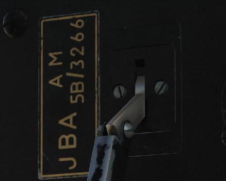

### Тумблеры магнето

Тумблеры магнето, по два на каждый двигатель, установлены и сгруппированы под скобой,
обеспечивающей их одновременное включение и выключение.

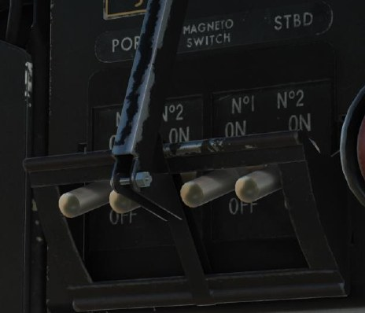

### Кнопки запуска двигателей

Для запуска двигателей необходимо подать питание на электрический стартер и затем
пусковую катушку. В верхней части приборной доски смонтировано по две кнопки на каждый
двигатель. Во избежание непреднамеренного нажатия кнопки оснащены подпружиненными
крышками. Левая кнопка – стартер, правая - пусковая катушка.

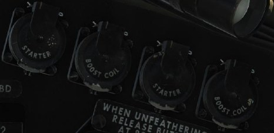

### Указатель курса

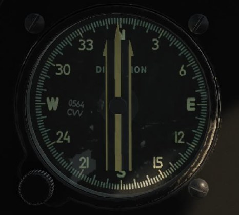

### Панель инструментального полета

На самолете установлена стандартная панель приборов инструментального полета.

В целях уменьшения влияния вибрации на показания приборов, панель установлена
на антивибрационных опорах.

На панели приборов инструментального полета установлены следующие пилотажно-
навигационные приборы:

### Указатель воздушной скорости Mk.IXF

Указатель имеет двойную концентрическую шкалу, тарированную в милях в час. По наружной
шкале считываются показания в диапазоне от 60 миль/час до 280 миль/час, далее от 280
до 480 миль/час считываются по внутренней шкале.

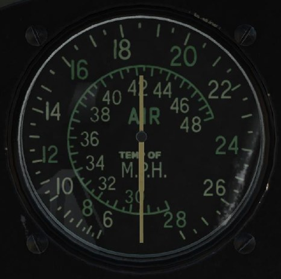

### Авиагоризонт Mk.1С

Предназначен для определения положения самолета относительно плоскости горизонта при
слепом полете. Авиагоризонт Mk.1С (6A/1519) является важным прибором слепого полета, так
как он дает возможность сохранять горизонтальное положение самолета без видимости земли.
Показания авиагоризонта безынерционны и не имеют запаздывания. Авиагоризонт мгновенно
реагирует на появившийся угол и не имеет колебаний при наличии ускорений,
сопровождающих полет.

На лицевой части прибора имеется черный экран с горизонтальной чертой, покрытой
светящейся массой и изображающей линию горизонта. Силуэт самолета закреплен неподвижно
и наглядно воспроизводит положение действительного самолета, как бы летящего
от наблюдателя, относительно земного горизонта. Угол между силуэтом самолета
и горизонтальной чертой равен абсолютному поперечному крену самолета. Расстояние между
центром силуэта и чертой пропорционально абсолютному продольному крену самолета.
В нижней части прибора расположен указатель крена и нанесена шкала углов крена.

### Вариометр

Прибор показывает вертикальную скорость самолета. Имеет некоторое запаздывание,
вследствие инерционности конструкции.
В горизонтальном полете стрелка должна находиться точно на нуле.
Шкала градуирована от 0 до 4000 футов/мин. цифры написаны без нулей, надпись “3” означает
3000 и так далее. Цена деления шкалы 200 футов/мин.

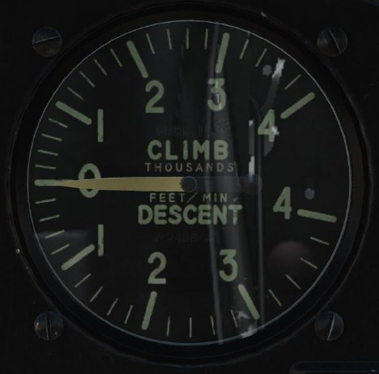

### Высотомер

Прибор предназначен для индикации барометрической высоты полета.

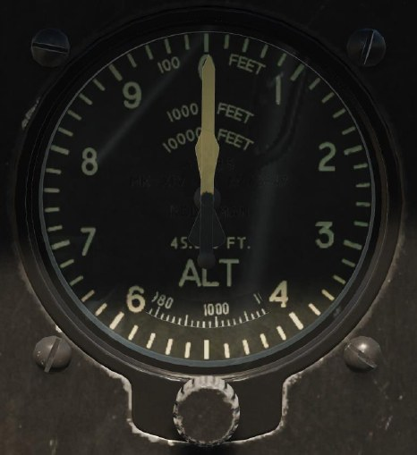

Высотомер Mk.XIVA (6A/685) трехстрелочный. На циферблате высотомера указаны единицы
измерения для каждой стрелки у ее вершины.

Большая узкая стрелка указывает высоту в сотнях футов, малая широкая стрелка в тысячах
футов, малая узкая стрелка в десятках тысяч футов.

Кремальера под циферблатом служит для установки барометрического уровня давления. При
вращении кремальеры в окошке циферблата перемещается шкала давлений.

### Гирополукомпас

Гирополукомпас Mk.IA (6A/1298) предназначен для выдерживания заданного курса самолета
и выполнения разворотов на заданное число градусов. Полукомпас построен на принципе
гироскопа с тремя степенями свободы, ось ротора гироскопа горизонтальна.

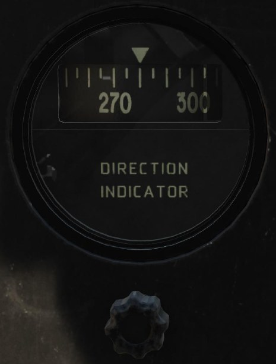

Прибор проградуирован от 0 до 360°, цена деления 5°. Деления и цифры картушки, а также
курсовой индикатор покрыты светящимся составом.

Под циферблатом находится кремальера для установки необходимого показания по индикатору
курса, она же работает и как арретир. При выполнении пилотажа, посадке и рулении
необходимо арретировать гирополукомпас для предотвращения его выхода из строя.

### Компас

Слева от приборной доски в нижней ее части на специальном кронштейне установлен
магнитный компас P.8.M (6A/726).

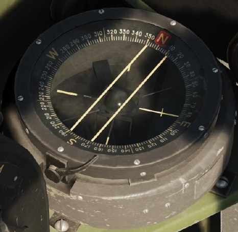

### Указатель крена и скольжения Mk.IB

Указатель крена и скольжения Mk.IB (6A/1302) предназначен для индикации летчику наличия
вращения самолета вокруг вертикальной оси и наличие поперечного скольжения самолета.

Указатель поворота в сочетании с магнитным компасом повышает точность пилотирования
по прямой, так как стрелка указателя поворота быстрее и точнее реагирует на отклонения
самолета от прямой, чем магнитный компас. Комбинация указателя поворота с указателем
скольжения позволяет выполнять правильный вираж с определенной скоростью.

Действие указателя поворота основано на использовании свойств гироскопа с двумя степенями
свободы. Ось гироскопа совпадает по направлению с продольной осью самолета. Демпфер
в указателе поворота предназначен для успокоения колебаний стрелки. Если бы не было
демпфера, то в случае малейшего рыскания самолета на курсе колебания стрелки были бы
настолько велики, что невозможно было бы пилотировать самолет по указателю поворота.
Указатель скольжения основан на принципе маятника.

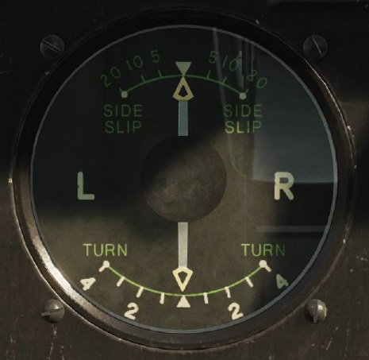

### Краны управления гидравлической системой

На передней панели сгруппированы краны управления гидравлической системой, слева
направо:

- Кран открытия-закрытия створок бомболюка
- Кран уборки-выпуска шасси
- Кран управления щитками

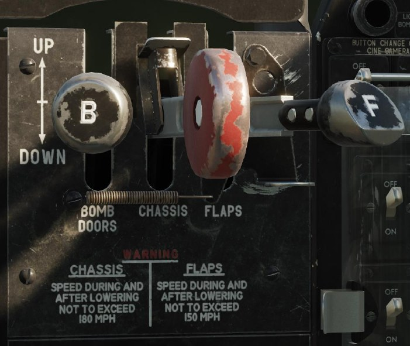

В верхнем положении рукоятки крана гидравлическая система работает на закрытие, уборку,
подъем, соответственно, в нижнем – на открытие, выпуск, опускание механизации.

Рядом с кранами установлена табличка с напоминанием летчику о максимальной скорости
полета с выпущенными шасси - 180 миль/час и щитками 160 миль/час.

### Индикатор положения шасси

Предназначен для индикации летчику положения основных стоек шасси. Соответствующее
сигнальное табло загорается при убранном "UP" или выпущенном "DOWN" положении.
В центральной части прибора расположена верньера управления шторкой индикатора,
которая приглушает его свечение при ночных полетах.

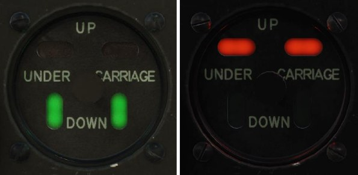

### Индикатор положения щитков

Прибор показывает положение щитков, проградуирован от 0 до 70°.
Положение 0 обозначает полностью убранные щитки.

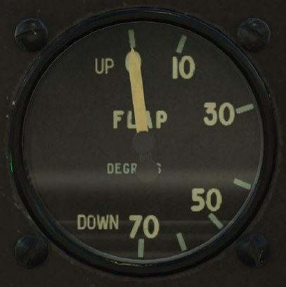

### Трехстрелочный манометр Mk.IC

Прибор контроля за исправностью пневматической системы. Трехстрелочный индикатор
объединяет в одном приборе показания давления в пневматической системе самолета
и в пневматических тормозах колес. На общем циферблате нанесены три шкалы: давление
в пневмосистеме - от 0 до 220 фунтов на дюйм2, манометров левого и правого тормоза –
от 0 до 130 фунт/дюйм2. Шкалы расположены таким образом, что при нормальных значениях
измеряемых величин стрелки образуют фигуру, что облегчает наблюдение за прибором, нет
необходимости считывать показания каждой стрелки, а позволяет оценить состояние системы
лишь по взаимному расположению стрелок.

Верхняя часть шкалы предназначена для контроля давления сжатого воздуха в системе,
нижние левая и правая шкалы указывают давление воздуха в тормозах колес. На верхней
части манометра установлен индикатор максимально допустимого давления в пневмосистеме.

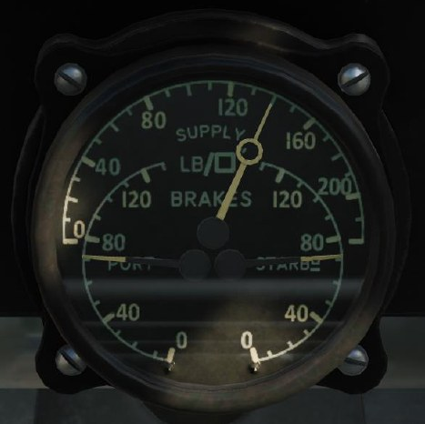

### Тахометры Mk.IX G

Тахометры индицируют скорость вращения двигателей. Скорость вращения определяется
количеством оборотов в минуту.

Шкала прибора имеет деления от 0 до 9000 об/мин. Три крайних нуля не обозначаются.
Цена наименьшего деления 500 об/мин.

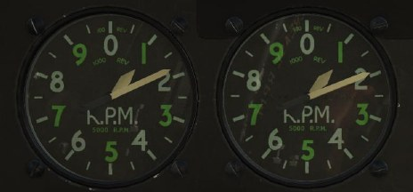

### Указатели наддува

На самолете установлены указатели наддува Mk.IIIL (6А/1427), рассчитанные на максимальное
давление +24 фунт/дюйм2. На шкале нанесены деления через 2 фунт/дюйм2.

### Сигнальные лампы низкого давления бензина

Слева и справа от указателей наддува установлены лампы-сигнализаторы, срабатывающие при
падении давления за бензонасосом ниже 10 фунт/дюйм2 (0,7 кг/см2).

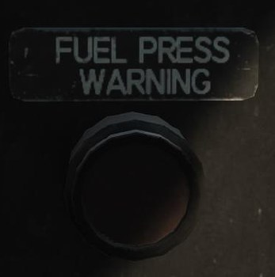

### Перекрывной кран управления наддувом

На двигателе Мерлин 25 не подключена, о чем информирует шильдик.

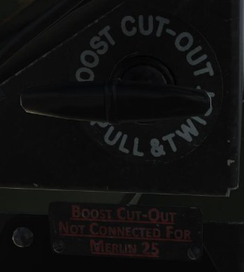

### Указатели температуры и давления масла Mk.XIV

Указатели температуры сгруппированы в центре, манометры разнесены по краям.

Давление и температура масла – значимые параметры работы двигателей. Выход этих
параметров из рабочих диапазонов может вызвать серьезные неполадки, вплоть до отказа,
и от летчика требуется контролировать показания манометров и термометров, своевременно
реагировать на изменение показателей.

Диапазон измерений указателей давления 0..150 фунт/дюйм2. Цена деления 30 фунт/дюйм2.
Диапазон измерений термометров – 0..100° С. Цена наименьшего деления 5° С.

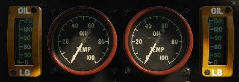

### Указатели температуры охлаждающей жидкости Mk.VIII

По конструкции и принципу работы аналогичны паровому термометру, измеряющему
температуру масла.

Диапазон измерений 40-140° С. Цифры, деления, а также стрелка покрыты светящейся массой.

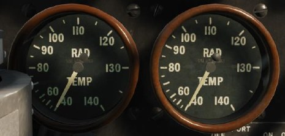

### Лампа заливающего освещения передней панели

Лампа оборудована поворотным ультрафиолетовым светофильтром

### Ручка управления и указатель положения триммера руля направления

Совмещенный прибор настройки и индикации положения триммера руля направления
расположен слева от прицела. Отклонение стрелки индикатора вверх указывает, что триммер
установлен в левое положение, отклонение вниз – в правое. Величина отклонения стрелки
отображает угол отклонения.

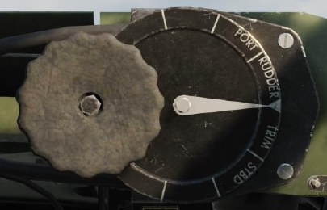

### Переключатели створок радиаторов и фильтра

Положение створок радиаторов управляется двумя тумблерами.
Тумблеры вверх – закрыто CLOSED, вниз – открыто OPEN.

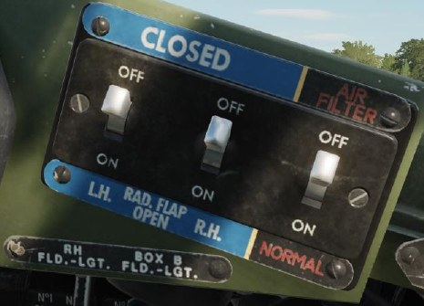

### Предупреждающая лампа низкого давления в погружном насосе

Лампа зажигается при падении давления на погружном насосе в дополнительном фюзеляжном
баке, что сигнализирует о выработке топлива и необходимости отключения насоса.

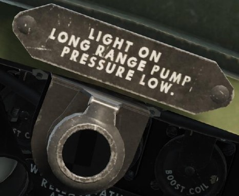

### Лампы и реостаты заливающего освещения кабины

Для освещения кабины в темное время суток и условиях недостаточной освещенности
по бортам и на панелях кабины установлены светильники заливающего света.

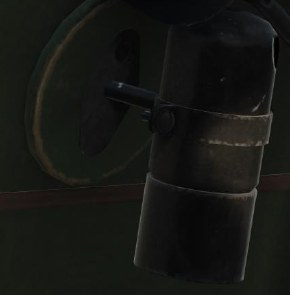

Включение светильников и установка яркости свечения производятся реостатами.

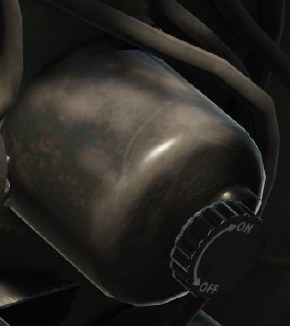

### Часы авиационные Mk.IV

Часы предназначены для показания текущего времени в часах, минутах и секундах. Имеют
заводную головку в нижней части прибора. В качестве принципа работы используются
колебания маятника. Конструктивно являются обычными пружинными часами с круглым
маятником-балансиром. Запас хода 8 суток.

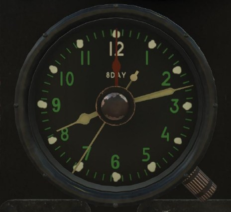

### Кислородный прибор Мk.VIIIB

Регулятор подачи кислорода используется для правильного снабжения летчика дыхательной
смесью. Прибор оборудован двум циферблатами, между которыми установлен кран регулятора.
Левый циферблат показывает соответствие подачи кислорода высоте полета, правый - остаток
кислорода на борту.

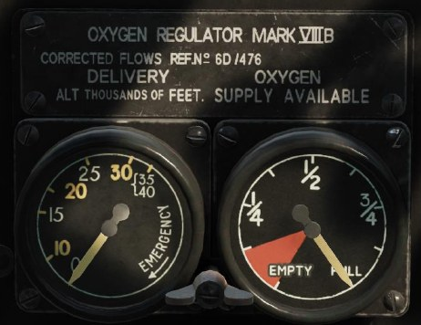

### Выключатели посадочных фар

Посадочные фары могут включаться и выключаться раздельно для левого и правого бортов по
необходимости.

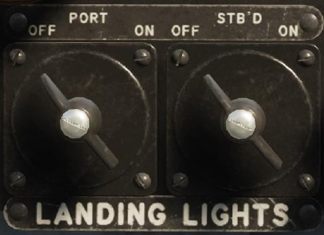

### Тумблер включения вооружения

Для работы с вооружением необходимо откинуть защитную крышку и перевести тумблер
в нижнее положение ON.

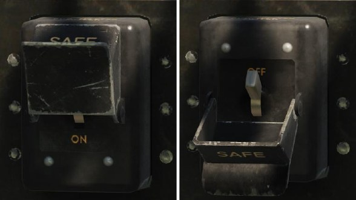

### Пульт управления бомбовым вооружением

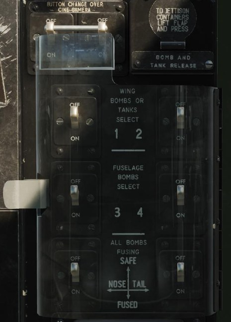

На пульте сгруппированы переключатели выбора используемых подвесок и способа взведения
сбрасываемых бомб.

В правом верхнем углу над защитной крышкой расположена кнопка сброса контейнеров.

Положение ON включает выбранную подвеску, положение OFF выключает.

Тумблеры 1 и 2 включают сброс подкрыльевых бомб или баков

Тумблеры 3 и 4 включают сброс из бомбового отсека.

Нижняя пара тумблеров задает способ взвода бомба, слева носовой, справа – хвостовой.

### Прицел

Оптический прицел Barr & Stroud Mark II, оборудован приборами для установки дистанции
и базы цели. На основании прицела расположены две шестерни, верхняя для установки
дистанции до цели, промаркирована от 0 до 500 ярдов, в сотнях ярдов, нижняя – для
установки размера – базы цели, промаркирована от 40 до 100 футов.

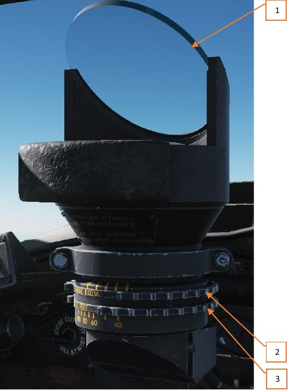

1. Стекло прицела
2. Шестерня установки дистанции до цели
3. Шестерня установки базы цели

### Тумблер переключения залпа реактивных снарядов

Для залпового пуска реактивных снарядов перевести тумблер в положение ON (будет
реализован позже)

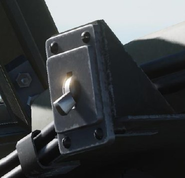

### Антиобледенительная система (не моделируется)

Система состоит из бачка с антиобледенительной жидкостью, крана, ручной помпы
и игольчатого клапана. Над бачком установлен кран, обеспечивающий подачу жидкости
от помпы в распылитель. Игольчатый клапан, установленный после помпы, служит для
регулировки количества подаваемой жидкости.

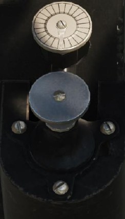

### Колонна РУС

Управление самолетом по крену и тангажу выполняется с помощью ручки управления
самолетом, выполненной в виде отклоняемой по тангажу колонны с отклоняемой по крену
вершиной.

На РУС смонтированы органы управления вооружением и блокируемый рычаг тормоза.

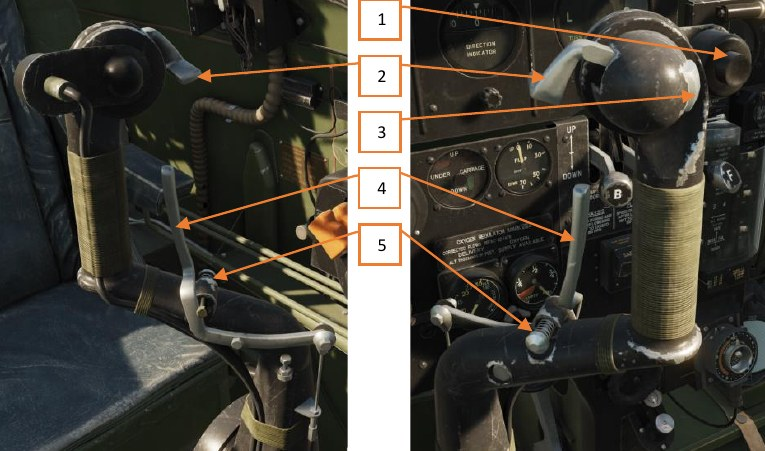

1. Триггер сброса бомб/включения камеры [[RShift]] + [[Space]]
2. Кнопка пушек [[RAlt]] + [[Space]]
3. Кнопка пулеметов [[Space]]
4. Рычаг тормоза [[W]]
5. Блокировка рычага тормоза [[W]] + [[LAlt]] + [[T]] - [[W]]

## Приборы левого борта

1. Ручка отстегивания ремней пилота
2. Ручка регулировки положения кресла пилота (не реализована)
3. Рычаг управления топливной смесью
4. Переключатель режимов наддува
5. Кнопка PTT
6. Переключатель прибора наведения по лучу
7. Переключатели компаса
8. Указатель положения триммера руля высоты
9. Ультрафиолетовая лампа
10. Лампы заливающего света
11. Реостат прибора наведения по лучу
12. Реостат аварийного освещения кабины
13. Кнопка сброса подкрыльевых баков
14. Реостаты освещения приборов
15. Рычаги газа
16. Управление оборотами винтов
17. Регулятор усилия на РУД
18. Регулятор усилия на рычагах оборотов
19. Блок управления радиосвязью

### Блок управления двигателями

На блоке управления двигателями смонтированы рычаги управления газом, рычаги управления
оборотами, рычаг управления топливной смесью и переключатель режима работы
нагнетателей.

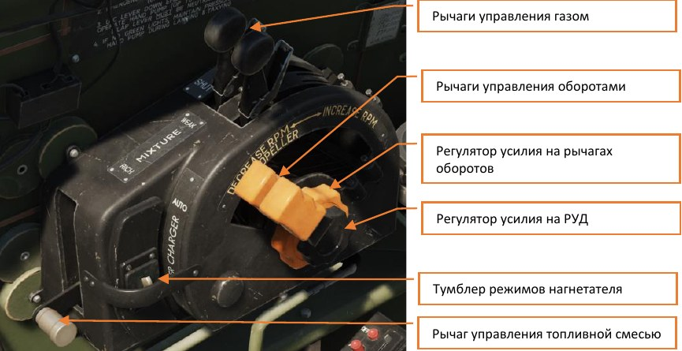

### Пульт управления радиостанцией

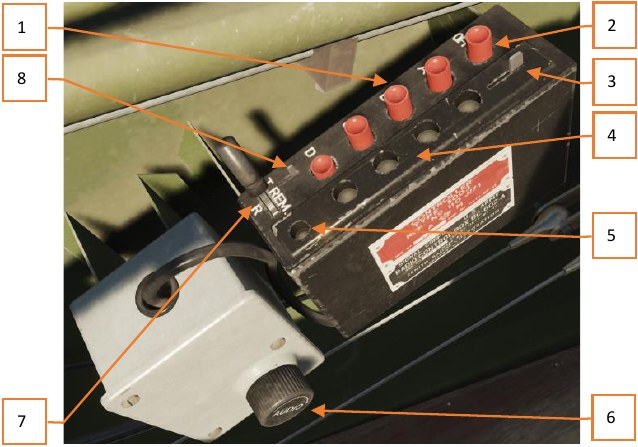

1. Кнопки выбора канала
2. Кнопка выключения радиостанции
3. Рычажок управления светофильтром
4. Индикаторные лампы выбранного канала
5. Индикатор приема-передачи
6. Ручка настройки громкости
7. Переключатель режимов работы
8. Фиксатор переключателя режимов

Кнопками выбора каналов осуществляется выбор требуемого канала радиосвязи для работы
радиостанции в режиме приема и передачи на соответствующей фиксированной частоте.

Одновременно может быть выбран только один канал.

 "А" – данный канал обычно используется для радиосвязи с наземными (командными)
пунктами, а также с другими самолетами.

 "B" – принят как основной канал связи с пунктами УВД, оснащенными УКВ радиостанциями.
Используется обычно для получения соответствующих инструкций при выполнении взлетов
и посадок.

 "C" – канал часто используется для радиосвязи с приводными радиостанциями.

 "D" – канал обычно используется для связи с наземными радиопеленгаторными станциями.

Кнопка OFF выключает радиостанцию.

Индикаторные лампы каналов служат для указания выбранного канала связи, используемого
радиостанцией в режиме приема и передачи.

Рычажок управления светофильтром позволяет ослабить яркость свечения ламп-индикаторов.
Снижение яркости свечения ламп может быть полезным при полете в темное время суток или
в пасмурную погоду.

Фиксатор блокировки переключателя режимов используется для блокировки положения
переключателя режимов Приема-Передачи. В переднем положении рычажка переключателя
режимов Приема-Передачи фиксируются с помощью механизма блокировки.
При установке рычажка в заднее положение переключатель режимов Приема-Передачи
удерживается в позиции R (прием) и может быть перемещен в подпружиненную позицию
T (передача), что позволит летчику передавать голосовые сообщения аналогично управлению
в ручном режиме в случае неисправности кнопки включения микрофона на РУД.
При удержании в положении T переключатель режимов Приема-Передачи каждый раз при
отпускании будет возвращаться в положении R, чтобы обеспечить работу радиостанции
в режиме постоянного приема.

Если рычажок блокировки находится в крайнем заднем положении, переключатель режимов
Приема-Передачи нельзя установить в позицию REM, соответствующую ручному управлению
посредством микрофонной кнопки.

Переключатель режимов Приема-Передачи имеет три положения:

- R - постоянный прием
- T - постоянная передача
- REM - ручное

В положении R радиостанция находится в режиме постоянного приема, в положении Т –
в режиме постоянной передачи.

В положении REM управление режимом работы радиостанции осуществляется с помощью
микрофонной кнопки PTT, см. рис. ниже, при котором нажатое положение кнопки обеспечивает
передачу, а отжатое положение - прием радиосообщений.

Вращение верньеры Audio регулирует громкость в наушниках.

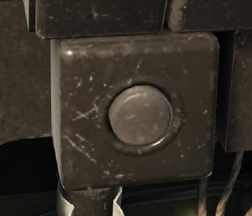

### Штурвал триммера руля высоты

Управление триммером руля высоты осуществляется штурвалом, расположенным слева
от кресла пилота.

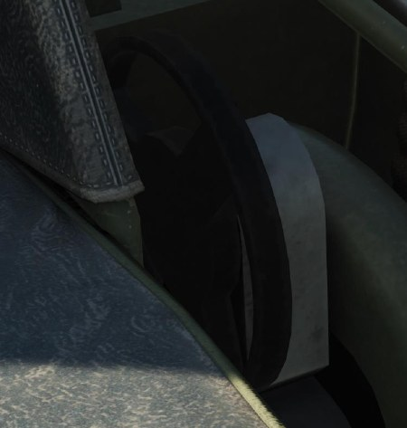

### Указатель положения триммера руля высоты

Служит для визуальной индикации положения триммера руля высоты. Стрелка в передней
части шкалы указывает, что триммер отклонен на пикирование, в задней, соответственно, на
кабрирование.

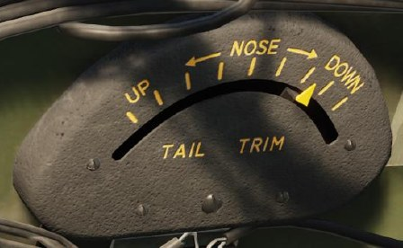

### Блок переключателей оборудования

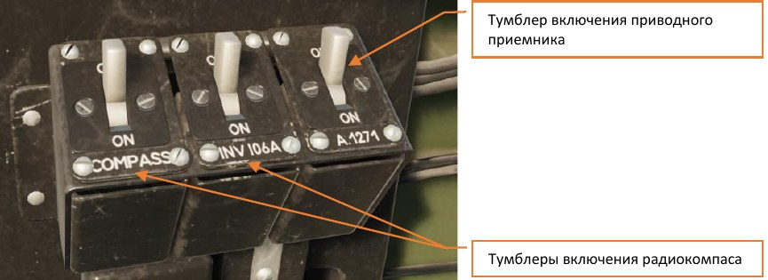

### Настроечный реостат приводного приемника

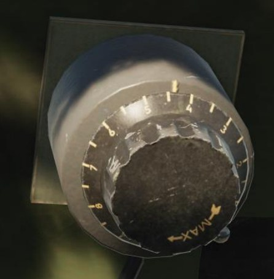

### Лампа с ультрафиолетовым светофильтром

Ультрафиолетовое освещение работает на отображение маркировки приборов.
Включение и выключение выполняется тумблером на панели правого борта.
Вращение обода светильника включает или выключает UV светофильтр.

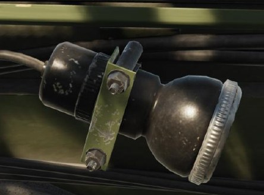

### Кнопка сброса подкрыльевых баков

Для быстрого сброса подвесных крыльевых баков откинуть защитную крышку и нажать кнопку.

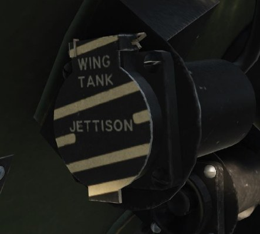

### Ручка освобождения пилота от пристежных ремней

На правой стороне кресла летчика размещена ручка, которая позволяет быстро отстегнуть
ремни, фиксирующие пилота в кресле.

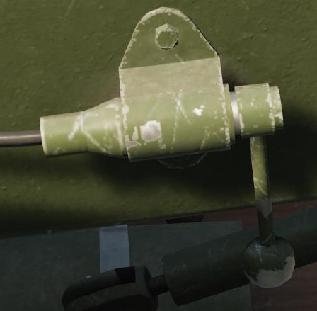

### Ручка регулировки положения кресла пилота

Предназначена для регулировки высоты кресла, расположена справа на кресле пилота
(не реализована).

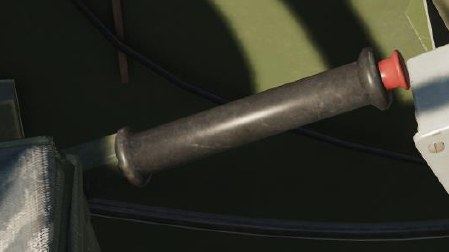

## Приборы правого борта

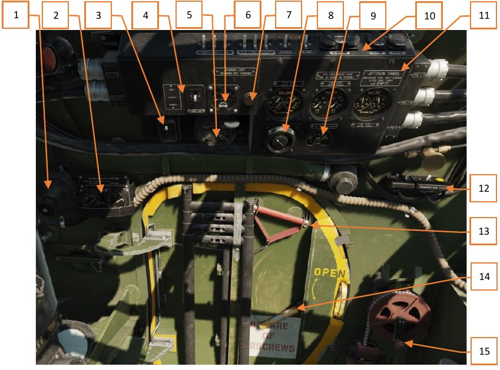

1. Кислородный кран высокого давления
2. Кислородный регулятор второго пилота
3. Переключатель смоляных ламп
4. Переключатель цвета нижнего опознавательного огня
5. Ключ идентификации
6. Вольтметр
7. Предупреждающая лампа генератора
8. Регулятор работы стеклоочистителей
9. Указатель температуры забортного воздуха
10. Переключатели и кнопки верхней панели блока правого борта
11. Топливомеры групп баков
12. Разъем интеркома
13. Ручка аварийного сброса двери
14. Ручка открытия двери
15. Управление положением антенны

### Кислородный кран высокого давления

Открывает магистраль кислородного питания, подающую кислород из баллонов
на персональные регуляторы.

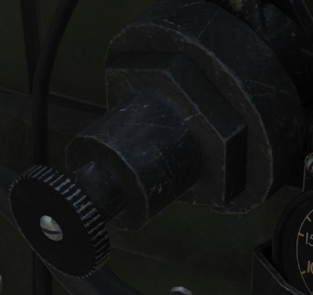

### Регулятор кислородного питания

Аналогично оборудованию кислородного питания летчика, на втором месте также установлен
регулятор кислородного питания

### Бензиномеры топливных баков Mk.IV

Указатели топлива внутренних, центральных и внешних крыльевых топливных баков
сгруппированы на панели по правому борту кабины. Проградуированы в соответствии
с емкостью баков от 0 до, соответственно, 146, 53, 63 и 59 галлонов.

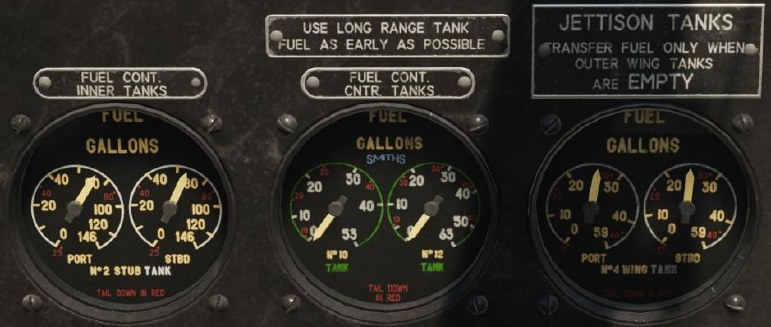

### Переключатели и кнопки верхней панели блока правого борта

На верхней панели сгруппированы переключатели, управляющие электрическими цепями,
соответственно, фотокинооборудования, навигационных огней, ламп освещения кабины,
подогрева трубки Пито, погружного топливного насоса, подсветки прицела, носовой фары, IFF.
Правее под защитными крышками размещены кнопки подрыва IFF (в настоящий момент не
реализовано) и огнетушителей левого и правого двигателей

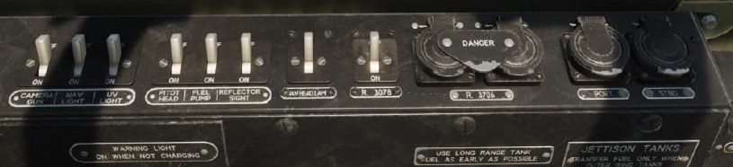

### Вольтметр

Показывает напряжение бортовой электросети, проградуирован от 0 до 40 В.
Справа от вольтметра расположена предупреждающая лампа, которая включается
при отсутствии заряда аккумулятора от генератора.

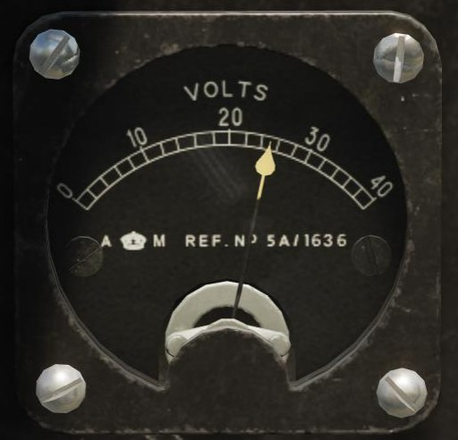

### Указатель температуры воздуха за бортом

Прибор показывает температуру забортного воздуха, проградуирован в диапазоне от -70°С
до +30°С

### Разъем интеркома

### Ключ идентификации

Служит для передачи кодированных сообщений на верхнем и/или нижнем огнях самолета
с использованием азбуки Морзе.

### Выключатель смоляных ламп

### Входная дверь экипажа

### Лампа и реостат освещения правого борта кабины

### Рычаг крана обогрева вооружения

Справа от кресла второго пилота расположен рычаг обогрева стрелкового вооружения.
Теплый воздух для обогрева отводится от двигателя.

### Управление антенной

### Регулятор управления стеклоочистителем

Ручка управления работой щетки очистителя лобового стекла. Против часовой стрелки
выполняется выключение, по часовой стрелке – включение.

На задней переборке кабины, установлены краны, управляющие топливной системой.

### Топливные краны

Краны, управляющие подачей бензина от баков к бензонасосам двигателя. Каждый кран
обслуживает свой двигатель. Установка кранов в верхнее положение перекрывает подачу
топлива, установка во внешние положения открывает подачу топлива из внешних баков,
установка в положение к центру – из основной топливной галереи.

### Рукоятки перекрывных кранов топливной магистрали

Вытягивание рукояток отключает подачу топлива к левому и/или правому двигателю,
соответственно.

### Кран перекачки топлива из подкрыльевых баков

При переводе крана в открытое положение включаются насосы для перекачки горючего
из подвесных подкрыльевых баков во внешние крыльевые баки.

### Краны дополнительной подачи масла

Для обеспечения подачи смазки от внешнего питания предусмотрены краны дополнительной
подачи масла.

### Кнопки разбавления масла

При необходимости запуска двигателей в условиях пониженных температур требуется
разбавление масла топливом. Подача топлива может осуществляться раздельно для каждого
двигателя.

### Кран наддува топливных баков

Для обеспечения нормальной подачи топлива требуется поддув баков от набегающего потока
воздуха

### Рычаг и патрубок воздуховода обогрева кабины

Для обогрева кабины самолет оборудован воздуховодом и рычагом для управления створкой.
Теплый воздух для обогрева забирается от двигателя.

За бронеспинкой летчика в доступности второго пилота размещено радиооборудование в составе
передатчика T.1154 и приемника R.1155, органов управления антеннами и IFF.

### Переключатель режимов работы антенны

Между приемником и передатчиком расположен переключатель режимов работы антенны.

### Приемник R.1155

R.1155 обеспечивает прием радиосигналов и настройку на требуемые параметры приема.

1. Селектор диапазона работы
2. Переключатель гетеродина
3. Регулятор громкости звучания приемника
4. Подстройка амплитуды
5. Выключатель дополнительного фильтра на входе
6. Подстройка баланса
7. Лампа индикации настройки
8. Переключение диаграммы направленности антенны
9. Настройка девиации
10. Подстройка частоты
11. Переключатель мастер режима
12. Ручка грубой настройки частоты
13. Ручка точной настройки частоты

### Передатчик T.1154

Т.1154 обеспечивает передачу радиосигналов и точную настройку требуемых параметров.

1. Селектор диапазона работы
2. Тонкая подстройка частоты генератора C2
3. Выбор подстроечного конденсатора С2
4. Верньер настройки частоты генератора C2
5. Тонкая подстройка частоты генератора C4
6. Выбор подстроечного конденсатора С4
7. Верньер настройки частоты генератора C4
8. Тонкая подстройка частоты генератора C17
9. Выбор подстроечного конденсатора С17
10. Выбор подстроечного конденсатора C15
11. Настройка выходного контура, конденсатор C15
12. Переключатель витков катушки S3
13. Выбор подстроечного конденсатора C16
14. Настройка выходного контура, конденсатор C16
15. Переключатель витков катушки S4
16. Настройка выходного контура, катушка L6
17. Переключатель витков катушки S6
18. Переключатель витков катушки S7
19. Переключатель режима работы S5

### Блок опознавания свой-чужой ARI 5083 (Транспондер IFF)

1. Выключатель питания
2. Тумблер детонатора под защитной крышкой
3. Переключатель каналов

{!abbr.md!}
