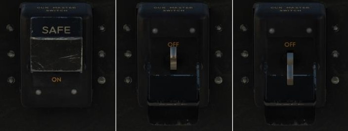
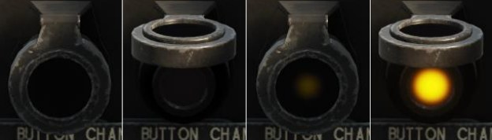

# Боевое применение

Основным вооружением самолета является пулеметно-пушечное, также Москито может нести
бомбы и реактивные снаряды.

В этом разделе рассматриваются базовые процедуры применения вооружения DH FB Mk.VI.

## Пулеметно-пушечное вооружение

Применение стрелкового вооружения:

- Откинуть крышку и перевести главный тумблер вооружения в нижнее положение

    

- Включить прицел тумблером на панели правого борта

    

- Произвести визуальное обнаружение и опознавание цели
- С помощью маховика шкалы базы цели - на основании прицела, нижний - установить
значение, соответствующее размаху крыльев самолета-цели

    
    
    1. Маховик установки базы цели
    2. Маховик установки дистанции
    3. Кольцо сетки прицела
    4. Центральная точка
    5. Дальномерная риска

- Маневрируя самолетом, подвести цель внутрь кольца сетки прицела и, удерживая центр
сетки на цели, вращать маховик установки дистанции - на основании прицела, верхний -
до тех пор, пока просвет поперечной риски прицела не станет соответствовать размеру
цели.
- С учетом ракурса и скорости цели выбрать упреждение и открыть огонь.

## Бомбовое вооружение

- Открыть крышку и перевести главный тумблер вооружения в нижнее положение

    

- Откинуть защитную крышку на пульте управления бомбовым вооружением

    

- Выбрать на пульте требуемые к сбросу подвески и способ их взведения.
    
    При использовании фюзеляжных подвесок открыть бомболюк
    переводом рычага открытия створок в нижнее положение

    

    По завершению открытия створок рычаг вернется в центральное положение автоматически.

- убедиться по состоянию лампы открытия бомболюка, что створки открыты.

    

- Выполнить заход на цель
- Сбросить бомбы нажатием кнопки на РУС или клавишами [[ RShift ]] + [[ Space ]]
- Створки бомболюка закрыть

!!! warning
    Бомбометание производить без бокового скольжения во избежание столкновения бомб
    с воздушными винтами!

## Реактивные снаряды

Будет реализовано позднее

{!abbr.md!}
