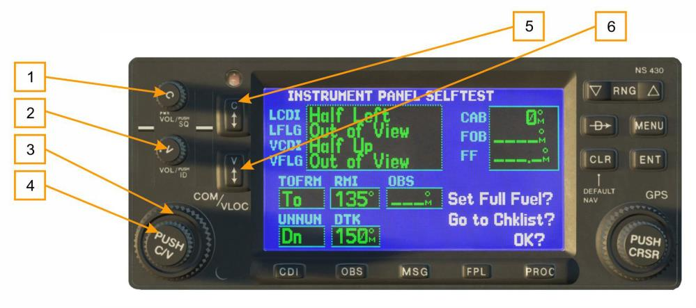
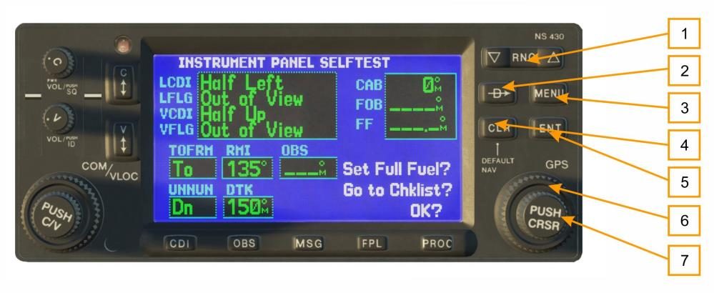
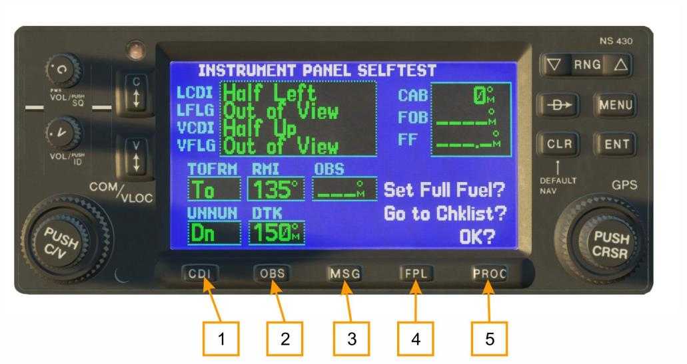

# Органы управления прибором

## Кнопки и ручки слева

1.   Ручка COM power/volume                      
2.   Ручка громкости VLOC                        
3.   Большая левая ручка                         
4.   Малая левая ручка
5.   Кнопка COM flip-flop
6.   Кнопка VLOC flip-flop

Ручка COM power/volume регулирует питание прибора и громкость радиосвязи. Ручка
громкости VLOC volume регулирует уровень громкости сигнала для заданной частоты маяков
VOR - курсовых маяков. Большая левая ручка используется для настройки величины мегагерц
(МГц) резервной частоты приемопередатчика COM или приемника VLOC, смотря какой включен
в данный момент настроечным курсором. Малая левая ручка используется для настройки
килогерц (кГц) резервной частоты приемопередатчика COM или приемника VLOC, смотря какой
выбран в данный момент настроечным курсором. Нажмите ручку, чтобы перевести настроечный
курсор между окнами COM и VLOC. Кнопка COM flip-flop используется, чтобы менять активную
и резервную частоты COM. Нажмите и удерживайте, чтобы переключиться на аварийный канал
связи (121.500 MHz). Кнопка VLOC flip-flop используется, чтобы менять активную и резервную
частоты VLOC (например, активировать заданную резервную частоту).

## Кнопки и ручки справа

1.   Кнопка range (RNG)                          
2.   Кнопка DIRECT TO
3.   Кнопка menu (MENU                           
4.   Кнопка clear (CLR)
5.   Кнопка enter (ENT)
6.   Большая правая
7.   Малая правая ручка

Кнопка range (RNG) дает возможность выбирать необходимый масштаб карты. Нажимайте край
со стрелкой вверх, чтобы уменьшить изображение, и стрелку вниз, чтобы увеличить
изображение. Кнопка direct-to позволяет вводить точку маршрута назначения и устанавливает
прямой курс до выбранного пункта назначения. Кнопка menu (MENU) выводит на экран список
опций, зависящих от контекста. Этот список опций дает возможность выполнять изменения
настроек, относящихся к текущей выведенной на экран странице. Кнопка clear (CLR)
используется для удаления информации или аннулирования введенных данных. Нажмите и
удерживайте кнопку, чтобы непосредственно вывести на экран страницу NAVdef. Кнопка enter
(ENT) используется для подтверждения действия или введения полных данных. Она также
используется для подтверждения сведений, например, таких как при включении. Большая
правая ручка используется, чтобы выполнять выборку между различными страничными
блоками: NAV, WPT, AUX или NRST. При включенном курсоре на экране, большая правая ручка
позволяет вам перемещать курсор по странице. Малая правая ручка используется, чтобы
выполнять выборку между различными страницами внутри одного из блоков, перечисленных
выше. Нажмите данную ручку для вывода на экран курсора. Курсор дает вам возможность
вводить данные и /или выполнять выборку из списка опций.

## Нижний ряд кнопок

   1.   Кнопка CDI
   2.   Кнопка (OBS)
   3.   Кнопка сообщений (MSG)
   4.   Кнопка план полета (FPL)
   5.   Кнопка схемы операций (PROC)

Кнопка CDI используется для переключения источника навигации (GPS или VLOC), который
обеспечивает выход на внешние индикатор планового навигационного прибора (HIS) или
индикатор отклонения от курса CDI (Этот режим поддерживается внутри прибора, а внешние
подистемы могут его использовать).

Кнопка (OBS) используется для того чтобы включить режим Suspend «временная приостановка».
Временная приостановка (SUSP) нужна, чтобы выбирать ручную или автоматическую
последовательность выполнения действий для точек маршрута. Нажатие данной кнопки
устанавливает режим SUSP, который сохраняет текущую точку маршрута “активной” в качестве
вашего навигационного ориентира, даже после ее прохождения (а именно, предотвращает
последовательность выполнения действий для следующей точки маршрута). Снова нажав
кнопку OBS, вы вернетесь в обычный режим с автоматической последовательностью
выполнения действий для точек маршрута.

Кнопка сообщений (MSG) используется для просмотра системных сообщений, важных
предупредительных сигналов и запросов.
Кнопка план полета (FPL) позволяет создавать, редактировать, активировать и изменять
порядок планов полета, а также предоставлять доступ заходам на посадку, вылетам и рилетам.
Кнопка схемы операций (PROC) позволяет вам выбирать заходы на посадку, вылеты и прилеты
с вашего активного плана полета. Если используется план полета, порядок действий
относительно вашего аэропорта отправления и/или прибытия предлагается автоматически. В
ином случае, вы можете выбрать нужный аэропорт, а затем необходимую схему действий.

{!docs/ns430/abbr.md!}
