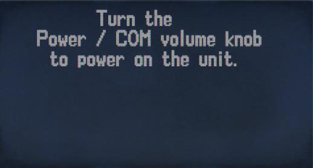
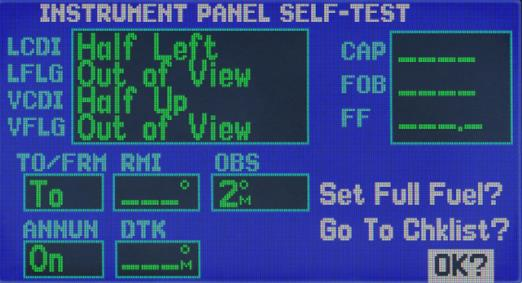

# Работа с прибором

## Стартовая последовательность

При включении прибора, происходит тестирование систем прибора и загрузка данных.
Пользователю показывается несколько экранов. На первом экране нужно нажать (повернуть)
ручку Power и предлагается несколько раз нажать ENT. Затем показывается экран с
состояниями спутника и через некоторое время автоматически происходит переход на вторую
страницу блока NAV. После этого прибор готов к работе.

## Экран

### Левая панель экрана

На левой панели экрана отображаются резервные и активные частоты COM и VLOC. Для
переключения между этими блоками нужно нажать левую малую ручку. Для выбора нужных
мегагерц использовать большую ручку, для выбора килогерц нужно поворачивать малую левую
ручку. Например, “115” и “400” для частоты “115.400”.

Для переключения между резервной и активно частотой нужно использовать соответствующую
кнопку C или V.

Ниже блоков частот расположены три поля с диагностикой:

- доступности данных для страници NAVter - TER TST, TER N/A, TERRAIN, TER INHB
        и TER FAIL
- Режим CDI/RAIM: Заход на посадку (APR), Пункт назначения (TERM), по маршруту
        (ENR)
- Нарушение целостности GPS (в настоящий момент считается, что GPS всегда
        целостный и диагностики ошибки нет)

### Нижняя панель экрана

На нижней строке экрана отображается состояние прибора:

- Источник навигации: GPS, VLOC.
- Временная приостановка SUSP или пустое место (для автоматического определения
        последовательности)
- Световое табло сообщения: Мигающий сигнал MSG (новое сообщение) или пустое
        место (нет сообщений)
- Световое табло страницы (NAV/WPT/AUX/NRST/FPL/MSG/PROC/DIRECTTO) –
        показывает имя блока и страницу по порядку

### Распределение экрана

Экран прибора распределен на 3 части: левую с отображением частот, нижнюю с отображением
текущего состояния прибора и правую которая содержит большое количество страниц,
объединенных в блоки. Переключением между блоками осуществляется большой правой ручкой.
Переключение между страницами в блоке осуществляется малой правой ручкой.

В таблице ниже, приведены 4 основных блока.

NAV        |  WPT       |  AUX       |  NRST
-----------|------------|------------|------------
NAVdef     |  WPTapt    |  AUXfpl    |  NRSTaero
NAVmap     |  WPTrunway |  AUXutil   |  NRSTint
NAVterrain |  WPTfreq   |  AUXsetup1 |  NRSTndb
NAVcom     |  WPTapr    |  AUXsetup2 |  NRSTvor
NAVpos     |  WPTarr    |            |  NRSTuser
NAVsat     |  WPTdep    |            |  NRSTartcc
NAVvprof   |  WPTint    |            |  NRSTfss
           |  WPTndb    |            |  NRSTspace
           |  WPTvor    |            |     
           |  WPTuser   |            |        

Кроме основных блоков есть дополнительный блок FPL попасть на который можно нажав кнопку
FPL. В приборе также присутствуют отдельные страницы DRCT, MSG и PROC.

Выход из этих блоков осуществляется либо по завершении того или иного действия, либо 2-х
секундным удержанием кнопки CLR.

Каждая из основных страниц имеет меню опций, позволяя вам выбирать конфигурацию
соответствующей страницы по вашему выбору. Инициация меню опций осуществляется
нажатием кнопки MENU.

{!docs/ns430/abbr.md!}
