# СТРАНИЦЫ

## Группа страниц NAV

Группа навигационных страниц включает 6 страниц. Во время просмотра любой навигационной
страницы поворачивайте малую правую ручку для выбора другой страницы. Вы можете
убедиться, что такая процедура выбора очень удобна для выбора между навигационной
страницей, устанавливаемой по умолчанию и страницей карты – двумя наиболее часто
используемыми страницами. Другие страницы обеспечивают вас списками частот для вашего
плана полета, показывают ваше текущее положение, индицируют текущий прием спутников, и
определяют установки для вертикальной навигации.

### NAVdef

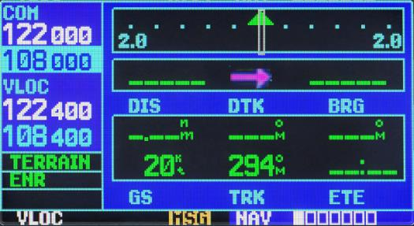

Первая навигационная страница это страница NAVdef, индицируемая по умолчанию. Эта
страница может быть быстро выбрана из любой страницы при использовании кнопки CLR
(удержание 2 сек).

Страница NAVdef индицирует графический индикатор отклонения от ЛЗП (CDI) вверху
страницы. В отличие от угловых ограничений, используемых на механических индикаторах,
ограничения шкалы для этого индикатора определяется концами шкалы. По умолчанию, шкала
будет автоматически настраиваться на требуемый масштаб в зависимости от фазы полета: на
маршруте, в зоне аэропорта или на заходе.

Графический CDI показывает ваше положение в центре индикатора относительно заданной ЛЗП
(двигающаяся стрелка ЛБУ). Так же как и в традиционных механических индикаторах, когда вы
отклонились от ЛЗП, просто двигайтесь DIRECT TO стрелку. Стрелка НА/ОТ в центре шкалы
указывает двигаетесь ли вы к ППМ (стрелка вверх) или вы проходите мимо (стрелка вниз).

Прямо под индикатором отклонения курса указывается активный этап вашего плана полета или
точка назначения DIRECT TO, когда используется кнопка DIRECT TO. В этом случае вы будете
автоматически переходить к следующему этапу вашего плана полета по мере достижения
каждого промежуточного ППМ. Если не задан план полета или не выбран ППМ DIRECT TO, поле
назначения будет оставаться пустым.

Внизу страницы NAVdef вы найдете шесть определяемых пользователем полей, которые
индицируют данные, необходимые во время полета. По умолчанию, эти поля: дальность до точки
назначения(DIS), заданный ПУ(DTK), пеленг на точку назначения(BRG), путевая скорость(GS),
фактический путевой угол (TRK) и расчетное время в пути (ETE). Однако, каждое из этих полей
может быть определено по вашему предпочтению. Имеющиеся возможности для выбора:

-  Пеленг на ППМ (BRG)
-  Дальность до точки назначения (DIS)
-  Безопасная высота на маршруте (ESA)
-  Расчетное время в пути (ETE)
-  Минимальная безопасная высота (MSA)
-  Фактический путевой угол (TRK)
-  Боковое отклонение от курса (ЛБУ) (XTK)
-  Курс наведения (CTS)
-  Заданный путевой угол (DTK)
-  Путевая скорость (GS)
-  Разница ЗПУ и ФПУ (∆ ПУ ) (TKE)
-  Требуемая вертикальная скорость (VSR)

Если не задан план полета или не выбран ППМ DIRECT TO, могут индицироваться только
скорость, курс, высота и минимальная безопасная высота. Все остальные типы данных будут
появляться как пустые линии – пока не будет выбрана точка назначения.

Для выбора других значений для любого поля данных:

1.   Начните со страницы NAVdef, нажмите кнопку MENU для индицирования опций меню.
2.   Всегда выделяется опция `Change Fields?` (“Изменить поле?”), поэтому нажмите ENT
         для выбора этой опции.
3.   Используйте большую правую ручку для выделения поля данных, которое вы хотите
         изменить.
4.   Поворачивайте малую правую ручку для индицирования списка имеющихся
         параметров. Продолжайте поворачивать малую правую ручку для выбора требуемого
         параметра из списка.
5.   Нажмите ENT для выбора требуемого параметра и возвращения к странице NAVdef.
6.   Нажмите на малую правую ручку для передвижения курсора из страницы.

Вы можете также быстро вернуть все установки полей данных к их первоначально
установленным на заводе-изготовителе значениям.

1.   Начните со страницы NAVdef, нажмите кнопку MENU для индицирования опций меню.
2.   Поворачивайте большую правую ручку для выделения опции “Restore Defaults?” и
         нажмите ENT.

### NAVmap

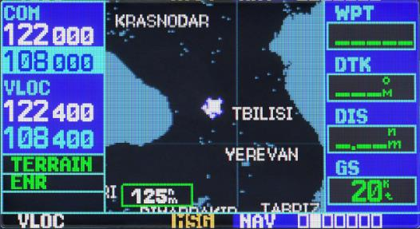

Вторая навигационная страница - это страница карты, которая индицирует ваше текущее
положение, используя символ самолета, индицируя ближайшие аэропорты, навигационные
средства, пользовательские ППМ. автомобильные дороги и города.

Для выбора масштаба карты:

1.   Нажмите на стрелку вверх на кнопке RNG для увеличения масштаба и показа большей
         площади.
2.   Нажмите на стрелку вверх на кнопке RNG для уменьшения масштаба и показа меньшей
         площади.

Другая функция страницы карты - сдвиг, который позволит вам передвигать карту за ее текущие
границы без настройки масштаба карты. При выборе функции сдвига-нажав на малую правую
ручку- на экране карты появится указатель цели. Также вверху карты появится окно, в котором
индицируются координаты положения указателя плюс пеленг и расстояние до указателя от
вашего текущего положения.

Для выбора функции сдвига и передвижения экрана карты:

1.   Нажмите на малую правую ручку для активизации указателя цели.
2.   Поворачивайте малую правую ручку для движения карты вверх (вращая по часовой
         стрелке) или вниз (вращая против часовой стрелки).
3.   Поворачивайте большую правую ручку для движения карты вправо (вращая по часовой
         стрелке) или влево (вращая против часовой стрелки).
4.   Для отмены функции сдвига и возвращения к вашему текущему положению, нажмите
         на малую правую ручку.

Когда указатель цели помещен на объект, имя этого объекта будет выделено (даже если это имя
первоначально не индицировалось на карте). Эта функция применима к аэропортам,
навигационным средствам, пользовательским ППМ, дорогам, озерам, рекам, почти ко всему, что
индицируется на карте, кроме линий маршрутов.

Когда аэропорт, навигационное средство или пользовательский ППМ выбирается на экране
карты, вы можете просмотреть информацию о ППМ или назначить ППМ в качестве точки
назначения.

Для просмотра информации об аэропорте, навигационном средстве или пользовательском ППМ,
индицированных на экране:

1.   Используйте функцию сдвига(как описано выше), чтобы поместить указатель цели на
         ППМ.
2.   Нажмите ENT для индицирования страницы с информацией о выбранном ППМ

#### Режим DIRECT TO на странице карты

Для назначения аэропорта, навигационного средства          или   пользовательского   ППМ,
индицированных на экране как точки назначения:

1.   Используйте функцию сдвига (как описано выше), чтобы поместить указатель цели на
         ППМ.
2.   Нажмите кнопку DIRECT TO для индицирования страницы DIRECT TO ППМ.
3.   Нажмите ENT дважды для подтверждения выбора и начала навигации на ППМ.

Функция DIRECT TO может быть использована в любом месте карты. Если местоположение
пересечения не было отмечено как ППМ, новый ППМ (названный “+МАР”, показан слева) будет
создан на местоположении указателя цели перед инициализацией режима DIRECT TO.

Для индицирования опций меню страницы карты, нажмите кнопку MENU.
Имеются следующие опции: “Setup Map?”, “Measure Dist?”, “Data Fields Off?”, “Change
Fields?” и “Restore Defaults?”

Установка “Setup Map?” позволит вам создать конфигурацию карты по вашему выбору, включая
ориентацию карты, наземные данные, базу данных, автомасштаб, границы воздушных
пространств и размер текста. В текущей версии Эта опция недоступна.

#### Измерение расстояний

Опция “Measure Dist?’ обеспечивает быстрый легкий способ для определения пеленга и
расстояния между двумя точками на странице карты.

Для измерения пеленга и расстояния между двумя точками:

1.   Поворачивайте большую правую ручку для выделения опции “Measure Dist?” и
         нажмите ENT. На странице карты на вашем текущем положении появится опорный
         указатель.
2.   Используйте малую и большую правые ручки для перемещения опорного указателя на
         положение, от которого вы хотите измерять расстояние и нажмите ENT.
3.   Снова используйте малую и большую правые ручки для перемещения опорного
         указателя на положение, до которого вы хотите измерять расстояние и нажмите ENT.
         Пеленг и расстояние от от первого опорного положения появятся вверху страницы
         карты.
4.   Для выхода из опции“Measure Dist?”, нажмите малую правую ручку.

#### Выбор полноразмерного экрана карты

Опция “Data Fields Off?” обеспечит полноразмерный экран карты (показан внизу справа) без
четырех полей данных с правой стороны экрана. Выбирайте эту опцию, когда хотите
индицировать большую площадь карты. Если выбрана эта опция и поля данных отсутствуют,
вместо опции “Data Fields Off?” появится “Data Fields On?”
Для включения или отключения полей данных, поворачивайте большую правую ручку для
выделения “Data Fields Off?” (или “Data Fields On?”) и нажмите ENT.

#### Выбор требуемых данных на экране

Опция “Change Fields?” позволит вам выбрать данные, индицируемые на четырех выбираемых
пользователем полях с правой стороны на странице карты. Имеется 14 типов данных, включая
пеленг и дальность до точки назначения, расчетное время прибытия, путевую скорость,
минимальную безопасную высоту и ПУ.

Для изменения поля данных:

1.   Поворачивайте большую правую ручку для выделения опции “Change Fields?” и
         нажмите ENT.
2.   Поворачивайте большую правую ручку для выделения поля данных, которое вы хотите
         изменить.
3.   Поворачивайте малую правую ручку для выделения типа данных, которые вы хотите
         поместить на экран карты в выделенное поле и нажмите ENT.
4.   Нажмите малую правую ручку для передвижения курсора.

#### Восстановление заводских установок

Опция “Restore Defaults?” вернет заводские установки полей данных.

Для восстановления заводских установок, поворачивайте большую правую ручку для выделения
“Restore Defaults?” (смотри слева внизу) и нажмите ENT.

### NAVterrain

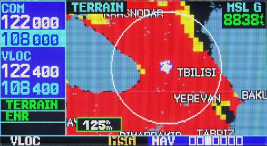

Страница Земля (Terrain) Чтобы вывести на экран страницу NAVter, выберите страничный блок
NAV и вращайте небольшую правую ручку, пока не отобразится NAVter. Страница показывает
информацию о земле, наземную траекторию воздушного судна, и высоту СУМ (MSL), полученную
GPS. “G” справа от отображения высоты СУМ (MSL) напоминает пилоту, что высота является
производной GPS.

Чтобы запретить (разрешить) слой TERRAIN:

1.   Выберите страницу NAVter и нажмите MENU.
2.   Используя большую правую ручку выбирете “Inhibit Terrain?” («Enable Terrain») .
3.   Нажмите ENT. Слой TERRAIN заблокирована. Оповещение TER INHB отображается
         на дисплее в поле оповещения terrain, каждый раз, когда запрещается функция
         TERRAIN.

Чтобы запретить (разрешить) слой навигационных данных:

1.   Выберите страницу NAVter и нажмите MENU.
2.   Используя большую правую ручку выбирете “Hide Aviation Data?” («Show Aviation
         Data») .
3.   Нажмите ENT для достижения эффекта.

Чтобы изменить режим View terrain 360/120:

1.   Выберите страницу NAVter и нажмите MENU.
2.   Используя большую правую ручку выбирете “View Terrain 120?” («View Terrain
         360»).
3.   Нажмите ENT для достижения эффекта.

### NAVcom

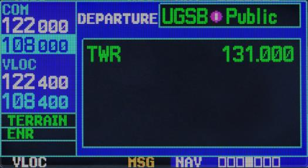

Эта страница обеспечивает списком частот аэропорта прибытия и отправления, с удобным
выбором частот, которые вам необходимы. Если у вас нет активного плана полета с аэропортом
отправления, на странице NAVCOM будут индицироваться частоты аэропорта, ближайшего к
местоположению вашего отправления.

Для выбора списка частот для аэропорта отправления, или прибытия:

1.   Нажмите на малую правую ручку для активизации курсора.
2.   Поворните малую правую ручку для активации меню из аэропортов
3.   Нажмите ENT.

Для выбора из списка частот:

1.   Поворачивайте большую правую ручку для передвижения курсора по списку частот.
         Если в списке имеется больше частот, чем показано на экране, столбик прокрутки
         вдоль правой стороны экрана будет указывать, какая часть списка индицируется в
         текущий момент.
2.   Для перемещения частоты в резервное поле окна СОМ или VLOC, выделите требуемую
         частоту и нажмите ENT.

### NAVpos

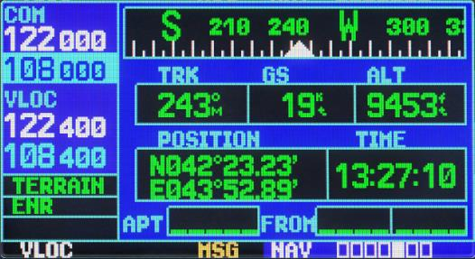

Страница положения индицирует ваше текущее местоположение и высоту. На странице
положения также индицируется ваш текущий ПУ, путевая скорость, время и поле опорного
ППМ. Эти поля выбираются пользователем для создания конфигурации страницы по вашему
предпочтению и текущим требованиям навигации.

Графический индикатор ПУ вверху страницы указывает направление, по которому вы
двигаетесь, или ПУ, только во время вашего движения. Прямо под ним находятся три поля.
Выбираемых пользователем, которые по умолчанию индицируют курс, путевую скорость и
высоту.

Минимальная безопасная высота (MSA) может также индицироваться на этих полях. MSA
является минимальной рекомендованной высотой внутри 10-мильной зоны от Вашего
настоящего положения. MSA вычисляется по информации, содержащейся в базе данных и, в
основном, включает горы, строения и другие постоянные объекты.

Страница положения также индицирует поле опорного ППМ, расположенное внизу страницы и
указывает ваш пеленг и расстояние НА/ОТ ближайшего ППМ.

Для изменения полей данных по выбору пользователя:

1.   Нажмите кнопку MENU для индицирования меню опций страницы положения.
2.   Поворачивайте большую правую ручку для выделения опции “Change Fields?” и
         нажмите ENT.
3.   Поворачивайте большую правую ручку для выделения поля данных, которое вы хотите
         изменить.
4.   Поворачивайте малую правую ручку для индицирования списка имеюшихся типов
         данных.
5.   Продолжайте поворачивать большую правую ручку для выбора требуемого типа
         данных из списка.
6.   Нажмите ENT для выбора требуемого типа данных и возврата к странице положения.
7.   Нажмите на малую правую ручку для удаления курсора из страницы.

#### Восстановление заводских установок

Опция позволит вам переустановить все поля данных на их первоначальные значения.
Установленные на заводе. Это вернет три пользовательских поля вверху страницы и поле
опорного ППМ к значениям. Установленным по умолчанию.

Для восстановления заводских установок:

1. Нажмите кнопку MENU для индицирования меню опций страницы положения.
2. Поворачивайте большую правую ручку для выделения опции “Restore Defaults?” и
         нажмите ENT

### NAVsat

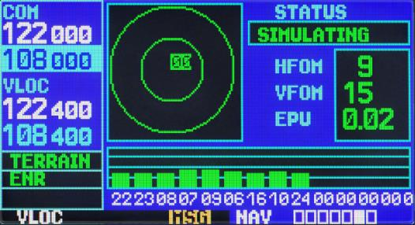

Страница состояния спутников (пятая в группе навигационных страниц) обеспечивает
визуальной информацией о функциях приемника GPS, включая покрытие спутников, состояние
приемника GPS и точность определения местоположения. Это полезно при получении плохого
уровня сигнала вследствие плохого покрытия или проблем с установкой.

После захвата спутников, для каждого спутника появится столбик мощности сигнала с
соответствующим номером (01-32) под каждым столбиком.

Обзор неба (слева вверху страницы) показывает, какие спутники в обзоре в текущий момент, и
где они находятся.

Внешняя окружность представляет линию горизонта (с севером вверху страницы), внутренняя
окружность представляет линию 45о над горизонтом и центральная точка представляет точку
DIRECT TOд головой.

### NAVvprof

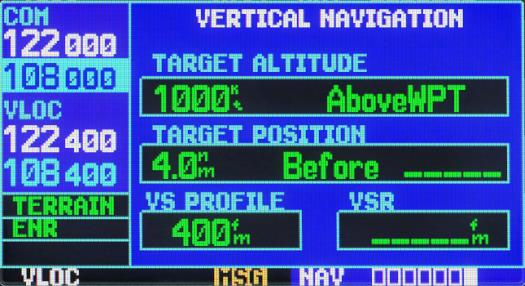

Страница вертикальной навигации (последняя навигационная страница) позволит вам создать
трехмерный профиль, который будет руководить вашим движением от вашего текущего
положения и высоты к конечной цели с определенной высотой и местоположением. Это полезно,
когда вы хотите снизится до определенной высоты вблизи аэропорта или подняться на
некоторую высоту прежде чем достигните высоты маршрута или точки назначения. После того,
как профиль ВНАВ определен, будут появлятся сообщения и дополнительные данные на
навигационной странице и странице карты будут информировать вас о полете.

Для создания профиля вертикальной навигации:

1.   Нажмите на малую правую ручку для активизации курсора
2.   Поворачивайте большую правую ручку для выделения поля высоты цели.
3.   Поворачивайте малую и большую правую ручки для выбора высоты цели и нажмите
         ENT.
4.   Поворачивайте малую правую ручку для выбора “Above Wpt” или “MSL” и нажмите
         ENT. “Above Wpt” будет использовать высоту аэропорта назначения. “MSL” позволит
         вам выбрать определенную высоту цели для любой категории ППМ: аэропорт, VOR,
         NDB, пересечение или пользовательский ППМ. В текущей реализации
         используется только ”AboveWPT”.
5.   Поворачивайте малую правую ручку для выбора дальности до цели от опорного ППМ
         цели и нажмите ENT. Если высота цели появится на опорном ППМ цели введите
         дальность ноль.
6.   Поворачивайте малую правую ручку для выбора “Before” или “After” цели и нажмите
         ENT. Эта установка назначается всегда, когда координаты профиля определяют точку
         до то достижения опорного ППМ цели или после того. как вы достигните ППМ. В
         текущей реализации используется только «Befor».
7.   При использовании плана полета опорный ППМ цели может быть определен из ППМ,
         содержащихся в плане полета. По умолчанию, будет выбран последний ППМ в плане
         полета Для выбора другого ППМ поворачивайте малую правую ручку для выбора
         требуемого ППМ и нажмите кнопку ENT. В текущей реализации исползуется
         только последний ППМ из плана полета. По умолчанию профиль использует
         скорость          снижения           400          футов        в          минуту
         (2.03 м/сек). Чтобы изменить скорость поворачивайте большую правую ручку для
         выделения поля “VS Profile” и используйте малую и большую правые ручки для ввода
         новой скорости. Нажмите ENT по окончании.

После этих действий система будет индицировать требуемую вертикальную скорость на странице
вертикальной навигации. При использовании функции вертикальной навигации можно ожидать
следующего:

1.   За минуту до достижения начальной точки снижения, появится сообщение
         “Approaching VNAV Profile”. Угол снижения (набора высоты) будет также
         зафиксирован, Approaching VNAV Profile чтобы предотвратить изменение скорости
         из-за изменения профиля.
2.   По выбору поле требуемой вертикальной скорости (VSR) на навигационной странице
         и странице карты будет показывать требуемую вертикальную скорость для
         поддержания соответствующего угла снижения (набора высоты)
3.   При 500 футах выше (или ниже для набора высоты) высоты цели появится сообщение
         “Approaching Target Altitude”. поле требуемой вертикальной скорости (VSR) на
         навигационной странице и странице карты будет пустым для этой точки.
4.   Сообщения вертикальной навигации могут быть включены или выключены. (По
         умолчанию сообщения выключены). Выключение сообщений позволит вам сохранять
         установки профиля, как вы их ввели раньше, без появления сообщений, когда функция
         ВНАВ не нужна.

Для индицирования/выключения сообщений VNAV:

1.   Нажмите кнопку MENU для индицирования меню опций страницы вертикальной
         навигации.
2.   При выделении опции “VNAV Messages On?” нажмите ENT Или, если сообщение уже
         было включено и вы хотите выключить его, убедитесь, что выделена опция “VNAV
         Messages Off?” и нажмите ENT.

Для восстановления заводских установок:

1. Нажмите кнопку MENU для индицирования меню опций страницы положения.

2. Поворачивайте большую правую ручку для выделения опции “Restore Defaults?” и
     нажмите ENT

## Группа страниц WPT

Вторая группа страниц (WPT) обеспечит информацией о аэропортов, VOR, NDB, пересечений,
ВПП, частотах и процедурах, хранимых в вашей базе данных.

Для быстрого выбора страницы ППМ:

1.   Из любой страницы нажмите и держите CLR 2 сек. для выбора страницы NAVdef. (Вы
         можете опустить этот шаг, если вы уже просмотрели какие-нибудь основные
         страницы.)
2.   Поворачивайте большую правую ручку для выбора группы страниц ППМ. В нижнем
         правом углу экрана появится “WPT”.
3.   Поворачивайте малую правую ручку для выбора требуемой страницы WPT.

Для ввода идентификатора ППМ:

1.   Выберите требуемую страницу ПММ и нажмите на малую правую ручку для
         активизации курсора.
2.   Поворачивайте малую правую ручку для выбора первого символа идентификатора
         ППМ,
3.   Поворачивайте большую правую ручку для выбора следующего поля символа,
4.   Поворачивайте малую правую ручку для выбора требуемого символа,
5.   Повторяйте шаги 3 и 4 до тех пор, пока идентификатор не будет выбран, затем нажмите
         ENT.
6.   Для удаления мигающего курсора, нажмите на малую правую ручку.

После ввода идентификатора ППМ, все шесть страниц аэропорта будут индицировать
информацию для выбранного аэропорта. Так как вы ввели идентификатор, прибор будет
сканировать базу данных, индицируя те ППМ, которые соответствуют тем символам, которые вы
ввели для данной точки. Если существуют дубликаты для введенного кодового наименования
или положения, они могут быть просмотрены при нажатии кнопки ENT. Если дубликаты имеются
для введенного идентификатора, появится страница дублированных ППМ после того как вы
выберите идентификатор (правой большой ручкой и нажатием кнопки ENT). По умолчанию при
отсутсвии плана происходит поиск ближайших объектов, при наличии плана для аэропорта
загружается информация аэропорта отправления.

Для выбора идентификатора ППМ из списка дубликатов:

1.   Выберите идентификатор требуемого аэропорта или навигационного средства.
2.   При нажатии ENT появится окно дублированных ППМ. Поворачивайте большую правую
         ручку для выбора требуемого ППМ и нажмите ENT.
3.   Для удаления мигающего курсора, нажмите на малую правую ручку.

### WPTero

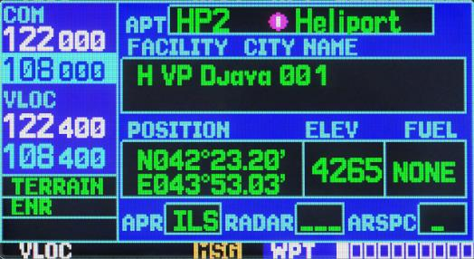

На странице положения аэропорта индицируется широта, долгота и превышение для выбранного
аэропорта. Здесь также индицируется кодовое наименование и положение (город), наличие
топлива, имеющиеся заходы, покрытие радарами и тип воздушного пространства. Используются
следующие описания и аббревиатуры:

Наименование |  Описание
-------------|-----------------------------------------------------------------
 POSITION    |  Широта/долгота градусы/минуты или градусы/минуты/секунды, MGRS или UTM/UPS (в текущей реализации только градусы/минуты)
 ELEV        |  В футах или метрах
 FUEL        |  Для гражданских аэропортов имеются следующие типы топлива: авиационный бензин (80-87/100ЛЛ/100-130/Mogas), топливо для реактивных двигателей или никакого (NONE). В текущей реализации данных нет, отображается NONE
 APR         |  В текущей версии не поддерживается
 RADAR       |  В текущей версии не поддерживается
 ARCPC       |  В текущей версии не поддерживается

Имеются следующие опции для этой страницы, которые могут быть индицированы при нажатии
кнопки MENU:

-  Select Next FPL Apt? Загружает на страницу аэропорт являющийся следующим по
         пути следования полетного плана.
-  Select Destination Apt? Загружает на страницу аэропорт являющийся конечным по
         пути следования полетного плана.

### WPTrunway

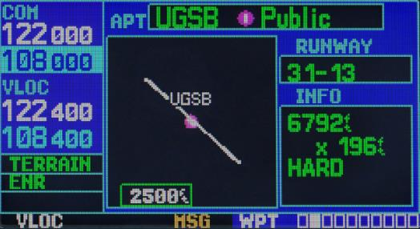

На странице ВПП аэропорта индицируется обозначение, длина, тип поверхности ВПП и
светосистема для выбранного аэропорта. Карта, представляющая границы ВПП и окружающую
территорию также индицируется на странице ВПП. Масштаб карты показан в нижнем левом углу
экрана и настраивается с помощью кнопки RNG. Для аэропортов с несколькими ВПП имеется
информация для каждой ВПП.

Для индицирования информации для каждой ВПП:

1.   Нажмите на малую правую ручку для активизации курсора.
2.   Используйте большую и малую ручки для выбора имени аэропорта. Нажмите ENT для
         выбора аэропорта.
3.   Поворачивайте большую правую ручку для индицирования окна со списком всех ВПП
         для выбранного аэропорта.
4.   Поверните малую правую ручку для активации меню с ВПП.
5.   Поворачивайте большую правую ручку для выбора ВПП.
6.   Нажмите ENT для индицирования информации для выбранной ВПП на странице ВПП
         аэропорта.
7.   Для удаления мигающего курсора, нажмите на малую правую ручку.

Для настройки масштаба карты:

1.   Нажмите на стрелку вниз на кнопке RNG правую ручку для индицирования меньшей
         площади карты.
2.   Нажмите на стрелку вверх на кнопке RNG левую ручку для индицирования большей
         площади карты.

На странице ВПП аэропорта присутствует окно INFO со следующими данными сверху вниз:

Наименование |  Описание
-------------|-----------------------------------------------------------------
 Длинна / Ширина |  В футах
 Поверхность     |  Типы покрытия ВПП: HARD, SOFT
 Освещение       |  Типы освещения: нет освещения, частичное время освещения, полное время освещения, неизвестный или частотный (для освещения, контролируемого пилотом). В текущей версии прибора параметр не отображается

Имеются следующие опции для этой страницы, которые могут быть индицированы при нажатии
кнопки MENU:

-  Select Next FPL Apt? Загружает на страницу аэропорт являющийся следующим по
         пути следования полетного плана.

-  Select Destination Apt? Загружает на страницу аэропорт являющийся конечным по
         пути следования полетного плана.

### WPTfreq

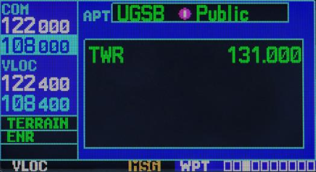

На странице частот аэропорта индицируются радиочастоты и типы частот для выбранного
аэропорта. Если выбранный аэропорт имеет заход LOC/ILS, частоты КРМ ILS также
индицируются на странице частот ВПП. Страница частот ВПП может быть использована для
быстрого выбора и настройки частот СОМ или VLOC.

Для просмотра списка частот и настройки требуемой частоты из списка:

1.   Нажмите на малую правую ручку для активизации курсора
2.   Используя большую и малую правую ручку набирите название аэропорта, или сразу
         нажмите ENT.
3.   Поворачивайте большую правую ручку для листания списка, помещая курсор на
         требуемую частоту. Если в списке имеется частот больше, чем может поместиться на
         экране, столбик прокрутки на правой стороне экрана будет индицировать, в каком
         месте списка вы находитесь.
4.   Нажмите ENT, чтобы поместить выбранную частоту в резервное поле окна СОМ ли
         VLOC.
5.   Для удаления мигающего курсора, нажмите на малую правую ручку.

Имеются следующие опции для этой страницы, которые могут быть индицированы при нажатии
кнопки MENU:

-  Select Next FPL Apt? Загружает на страницу аэропорт являющийся следующим по
         пути следования полетного плана.
-  Select Destination Apt? Загружает на страницу аэропорт являющийся конечным по
         пути следования полетного плана.

### WPTapr

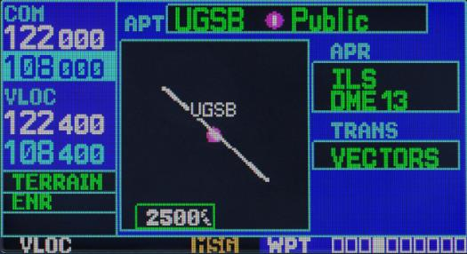

На странице захода аэропорта индицируются имеющиеся процедуры для выбранного аэропорта.
Там, где имеется множество начальных фиксированных точек захода и фидер маршрутов, эта
информация также может быть индицирована.

Для просмотра имеющихся заходов и переходов:

1.   Нажмите на малую правую ручку для активизации курсора.
2.   Используя большую и малую правую ручку набирите название аэропорта, или сразу
         нажмите ENT.
3.   Поворачивайте малую правую ручку для индицирования окна со списком всех
         имеющихся заходов для выбранного аэропорта. Продолжайте поворачивать малую
         правую ручку для выбора требуемого захода.
4.   Нажмите ENT для выбора.
5.   Для удаления мигающего курсора, нажмите на малую правую ручку.

Имеются следующие опции для страницы захода аэропорта, которые могут быть индицированы
при нажатии кнопки MENU:

-  Load into Active FPL? Позволит вам загрузить выбранный заход в активный план
         полета - без активизации захода. Эта опция выполняет те же самые операции как и из
         опции “Select Approach?” на странице процедур. При успешном выполнении произойдет
         переход на страницу FLPact. В случае отсутствии полетного плана, будет создан новый.

-  Load and Activate? Позволит вам загрузить выбранный заход в активный план полета
         и активизировать навигацию на переход к заходу. При успешном выполнении
         произойдет переход на страницу FLPact.
-  Select Approach Chnl В текущей версии прибора не используется
-  Select Next FPL Apt? Загружает на страницу аэропорт являющийся следующим по
         пути следования полетного плана.
-  Select Destination Apt? Загружает на страницу аэропорт являющийся конечным по
         пути следования полетного плана.

### WPTarr

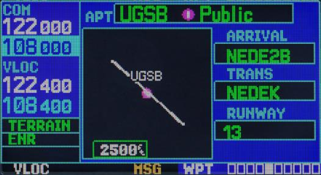

На странице прибытия в аэропорт индицируются имеющиеся процедуры стандартного прибытия
в аэропорт (STAR) для выбранного аэропорта. Если имеется множество переходов или ВПП,
связанных с процедурой прибытия, эта информация также индицируется.

Для листания списка имеющихся прибытий:

1.   Нажмите на малую правую ручку для активизации курсора.
2.   Поворачивайте большую правую ручку, чтобы поместить курсор в поле имени
         процедуры прибытия (ARRIVAL).
3.   Поворачивайте малую правую ручку для индицирования окна со списком всех
         имеющихся прибытий для выбранного аэропорта. Продолжайте поворачивать малую
         правую ручку для выбора требуемого прибытия.
4.   Нажмите ENT.
5.   Поворачивайте большую правую ручку, чтобы поместить курсор в поле имени
         переходов (TRANS).
6.   Поворачивайте малую правую ручку для индицирования окна со списком всех
         имеющихся переходов для выбранного аэропорта. Продолжайте поворачивать малую
         правую ручку для выбора требуемого перехода.
7.   Нажмите ENT.
8.   Для удаления мигающего курсора, нажмите на малую правую ручку.

На странице прибытия в аэропорт имеются следующие опции, которые могут быть индицированы
при нажатии кнопки MENU:

-  Load into Active FPL? Позволит вам загрузить выбранную процедуру прибытия в
         активный план полета. Это идентично загрузке процедуры прибытия из страницы
         процедур
-  Select Next FPL Apt? Загружает на страницу аэропорт являющийся следующим по
         пути следования полетного плана.
-  Select Destination Apt? Загружает на страницу аэропорт являющийся конечным по
         пути следования полетного плана.

### WPTdep

На странице отправления из аэропорта индицируются имеющиеся процедуры стандартного
отправления из аэропорта (SID) для выбранного аэропорта. Если имеется множество переходов
или ВПП, связанных с процедурой отправления, эта информация также индицируется.

Для листания списка имеющихся отправлений:

1.   Нажмите на малую правую ручку для активизации курсора.
2.   Поворачивайте большую правую ручку, чтобы поместить курсор в поле имени
         процедуры отправления (DEP).
3.   Поворачивайте малую правую ручку для индицирования окна со списком всех
         имеющихся отправлений для выбранного аэропорта. Продолжайте поворачивать
         малую правую ручку для выбора требуемого отправления.
4.   Нажмите ENT.
5.   Для удаления мигающего курсора, нажмите на малую правую ручку.

На странице отправления из аэропорта имеются следующие опции, которые могут быть
индицированы при нажатии кнопки MENU:

-  Load into Active FPL? Позволит вам загрузить выбранную процедуру отправления
         создав новый план полета. Это действие идентично загрузке процедуры прибытия из
         страницы процедур.
- Select Next FPL Apt? Загружает на страницу аэропорт являющийся следующим по
        пути следования полетного плана.
- Select Destination Apt? Загружает на страницу аэропорт являющийся конечным по
        пути следования полетного плана.

### WPTint

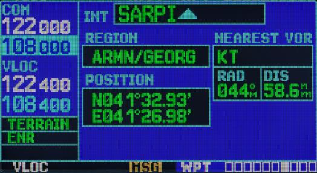

На странице пересечений индицируются широта, долгота регион и страна для выбранного
пересечения. Также индицируется идентификатор, радиал и дальность для ближайшего VOR,
VORTAC или VOR/DME.

Пересечения могут быть выбраны только идентификатором, как описано на предыдущих
страницах.

Используются следующие обозначения и аббревиатуры:

Наименование |  Описание
-------------|-----------------------------------------------------------------
  REGION           |    Название региона
  POSITION         |    Широта/долгота (градусы/минуты или градусы/минуты/секунды), MGRS или UTM/UPS
  RAD              |     Радиал от ближайшего VOR в градусах магнитных или истинных (в зависимости от конфигурации системы)
  DIS              |     Дальность от ближайшего VOR в морских милях/сухопутных милях/километрах (в зависимости от конфигурации системы)
  NEAREST VOR      |     Ближайший VOR

!!! attention "Обратите внимание"
    VOR, индицируемый на странице пересечений, является ближайшим
    VOR, не обязательно тем, который используется для определения пересечения.

### WPTndb

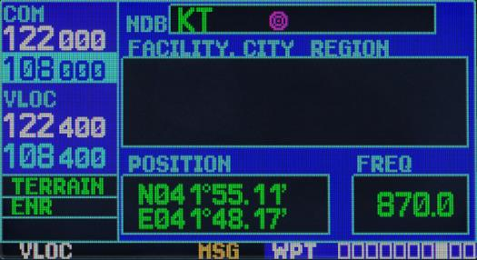

На странице NDB индицируются кодовое наименование, город, регион/страна, широта и долгота
для выбранного NDB. Также индицируется частота.

NDB могут быть выбраны идентификатором, как описано на предыдущих страницах.

Используются следующие обозначения и аббревиатуры:

Наименование |  Описание
-------------|-----------------------------------------------------------------
FACILITY, CITY & REGION     | Название города и региона
POSITION                    | Широта/долгота (градусы/минуты или градусы/минуты/секунды), MGRS или UTM/UPS
FREQ                        | Частота в килогерцах

### WPTvor

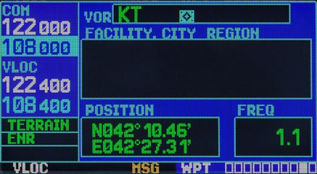

На странице VOR индицируются кодовое наименование, город, регион/страна, магнитное
склонение, широта и долгота для выбранного VOR. Также индицируется частота.

NDB могут быть выбраны идентификатором, как описано на предыдущих страницах.

Используются следующие обозначения и аббревиатуры:

Наименование |  Описание
-------------|-----------------------------------------------------------------
FACILITY, CITY & REGION     | Название города и региона
POSITION                    | Широта/долгота (градусы/минуты или градусы/минуты/секунды), MGRS или UTM/UPS
FREQ                        | Частота в килогерцах

### WPTuser

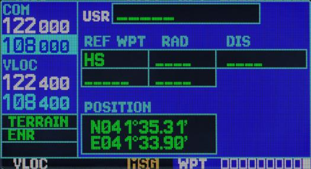

Кроме информации об аэропортах, VOR, NDB и пересечениях, содержащейся в базе данных, NS
430 позволит вам хранить до 1000 пользовательских ППМ. На странице пользовательских ППМ
индицируется имя ППМ (до пяти символов длиной), идентификатор и радиал от двух опорных
ППМ, дальность до одного опорного ППМ, и широта/долгота пользовательского ППМ.

Используются следующие обозначения и аббревиатуры на странице пользовательских ППМ:

Наименование |  Описание
-------------|-----------------------------------------------------------------
  REF WPT    | Название региона
  POSITION   | Широта/долгота (градусы/минуты или градусы/минуты/секунды), MGRS или UTM/UPS
  RAD        | Радиал от ближайшего VOR в градусах магнитных или истинных (в зависимости от конфигурации системы)
  DIS        | Дальность от ближайшего VOR в морских милях/сухопутных милях/километрах (в зависимости от конфигурации системы)

Пользовательские ППМ создаются и редактируются на странице пользовательских ППМ. Для
создания нового пользовательского ППМ просто введите его имя (идентификатор) и положение,
или введите опорный ППМ и радиал и дальность от него до создаваемого пользовательского
ППМ (Этот режим в текущей версии не реализован).

Для создания нового пользовательского ППМ для вашего текущего положения:

1.   На странице пользовательских ППМ нажмите на малую правую ручку для активизации
         курсора.
2.   Используйте малую и большую правые ручки для ввода имени нового ППМ.
3.   Нажмите ENT для подтверждения выбранного имени. Курсор переместится в поле
         положения внизу страницы, где отображается ваше текущее положение.
4.   Нажмите ENT 2 раза для подтверждения положения.
5.   После появления вопроса “Create?” нажмите ENT.

Для создания нового пользовательского ППМ вводом его положения (широты/долготы):

1.   Выполните пункты 1-5 предыдущей поцедуры.
2.   Используйте малую и большую правые ручки для ввода координат положения для
         нового ППМ, Нажимая ENT для подтверждения широты и долготы точки.
3.   После появления вопроса “Create?” нажмите ENT. для добавления нового ППМ в
         память.

Для создания нового пользовательского ППМ через опорный ППМ:

В текущей версии прибора не реализовано.

#### Опции страницы пользовательских ППМ

На странице пользовательских ППМ имеются следующие опции, которые могут быть
индицированы при нажатии кнопки MENU:

-  View User Waypoint List? Индицирует список всех пользовательских ППМ, хранимых
         сейчас в памяти.
-  Delete User Waypoint? Позволит вам удалить выбранный ППМ из памяти.
-  Crossfill Взаимодействие между приборами. В текущей версии прибора не реализовано

Список пользовательских ППМ позволит вам просмотреть или удалить выбранный
пользовательский ППМ, хранимые в памяти. Редактирование в текущей версии прибора не
реализовано.

Для просмотра пользовательского ППМ из списка:

1.   Выберите список пользовательских ППМ из меню функцией View User Waypoint List.
2.   Поворачивайте большую правую ручку для выделения требуемого пользовательского
         ППМ.
3.   Нажмите ENT для индицирования страницы пользовательских ППМ для выбранного
         ППМ. Из этой страницы вы можете просмотреть всю информацию, определяющую ППМ
         и его положение.

Для удаления пользовательского ППМ из списка:

1.   Выберите список пользовательских ППМ из меню функцией Delete User Waypoint?.
2.   Поворачивайте большую правую ручку для выделения требуемого пользовательского
         ППМ.
3.   Нажмите ENT для удаления выбранного ППМ

## Группа страниц AUX

Для быстрого выбора страниц AUX:

1.      Из любой страницы нажмите и удерживайте кнопку CLR для выбора страницы NAV по
умолчанию. (Вы можете опустить этот шаг если уже находитесь на любой из основных страниц.)
2.    Вращайте большую правую ручку для выбора группы страниц AUX. “AUX” появится в
нижнем правом углу экрана.
3.     Вращайте малую правую ручку для выбора нужной страницы AUX.

### AUXfpl

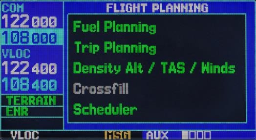

На странице планирования полета обеспечивается доступ для планирования полета,
топлива, расчета барометрической высоты по tH, истинной воздушной скорости и ветра в полете,
а также к функции “Межмашинный обмен” для переноса маршрутов и ППМ пользователя на
другую NS 430. После выбора меню появляется соответствующая страница, обеспечивающая
дополнительную информацию и функции.

Для выбора вариантов меню со страницы планирования полета:

1.       Нажмите малую правую ручку для активизации курсора
2.       Вращайте большую правую ручку для выбора нужного варианта и нажмите ENT.

Имеются следующие варианты:

**Планирование полета** — позволяет пилоту просмотреть информацию о ЗПУ (DTK), расстоянии
(DIS), времени полета (ETE), безопасной высоте на маршруте (ESA) и расчетном времени
прибытия (ETA) для полета прямо между двумя определенными точками и на маршруте для
любого запрограмированного плана.

**Планирование топлива** – индикация требований по топливу для полета прямо между двумя
определенными точками или по запрограммированному маршруту. Функция планирования
топлива требует от пилота ввода начального количества топлива (FOB) и расхода (FF). Вы
можете также ввести различные путевые скорости полета (GS) для просмотра информации о
топливе на базе различных временах полета. Если Ваша установка включает датчик расхода
топлива, информация от него используется при расчетах и ее нет нужды вводить вручную.

**Высота по плотности / Истинная воздушная скорость / Ветер** — индицирует
теоретическое значение высоты, на которой самолет летел бы при условии наличия некоторых
внешних условий, включая индикаторную высоту (IND ALT), барометрическое давление (BARO),
температуру торможения (TAT). В этом варианте меню рассчитывается истинная воздушная
скорость(TAS) на основе приведенных выше величин и приборной скорости. А также данный
вариант меню позволяет рассчитать ветер в полет – направление и скорость, и компоненты
встречного/попутного ветра на основе расчетного значения высоты по плотности, истинной
воздушной скорости, курса самолета (HDG) и путевой скорости.

**Межмашинный обмен** — в текущей версии прибора не реализовано.

**Планирование сообщений** — индицирует сообщения-напоминания (такие как “Change oil
(Смени масло)”, “Switch fuel tanks (Переключи топливные баки)”, “Overhaul (Ремонт)”, и т.п..).
Допускаются одновременные, периодические и основанные на событиях сообщения
Одновременные сообщения появляются один раз после прошествия таймера и появляются
всякий раз после включения системы до удаления данного сообщения. Периодические
сообщения автоматически устанавливают таймер на его начальное значение после индикации
сообщения. Сообщения, основанные на событиях, используют не таймеры, а определенные дату
и время.

### AUXutil

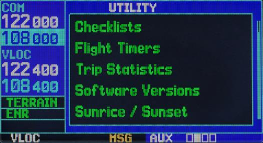

Страница процедур обеспечивает доступ (через меню вариантов) к контрольным
картам (тест-спискам), таймеру с прямым и обратным счетом, полетным таймерам, полетной
статистике, предсказанию RAIM (Receiver Autonomous Integrity Monitoring), расчетам времени
восхода/захода и информации о версиях ПМО/базы данных. После выбора варианта из меню
появляется соответствующая страница с дополнительной информацией и функциями.

Для выбора варианта меню со страницы процедур:

1. Нажмите малую правую ручку для активизации курсора.
2. Вращайте большую правую ручку для выбора нужного варианта меню и нажмите ENTER.

Имеются следующие вараинты меню:

**Checklists (Контрольные карты)** — обеспечивает до 9 различных контрольных карт,
содержащих до 30 пунктов каждый.

**Flight Timers (Полетные таймеры)** — обеспечивает таймеры с прямым и обратным отсчетом, а так же
 автоматическую запись времени взлета и полного полетного времени. Время взлета и полное
полетное время регистрируются каждый раз по включению системы или по достижении скорости
30 узлов.AUX P

**Trip Statistics (Полетная статистика)** — обеспечивает показаниями пройденного пути
(одометра), средней скорости и максимальной скорости. Эти показания могут
переустанавливаться (индивидуально или все вместе) нажатием кнопки MENU для индикации
окна вариантов.

**Software Versions (Версия ПМО/Базы данных)** — обеспечивает инфопмацией о версии ПМО
приемника GPS, связного приемопередатчика, приемника VOR/ILS и основного процессора. На
странице версий также индицируются тип теущей базы данных и время ее годности вместе с
версией и типом наземной базы данных

**Sunrise/Sunset (Восход/Закат)** — позволяет Вам рассчитывать время возхода/заката солнца
для любого ППМ или текущего местоположения на заданное время..

### AUXsetup1

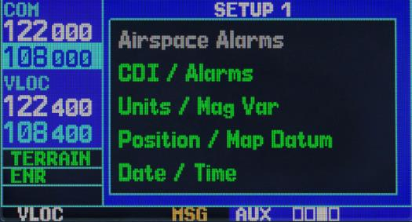

На странице Setup 1 обеспечивается доступ (через варианты меню) к предупреждениям о зонах
SUA, установке масштаба CDI, предупрежедниям о прибытии, установкам единиц измерения,
форматам местоположения, параметрам карты (эллипсоиды), и установкам индикации местного
времени или UTC. Когда выбран вариант меню, появляется соответствующая страница,
обеспечивающая доступ к различным установкам системы.

Для выбора меню из страницы setup 1:

1. Нажмите малую правую кнопку для активизации курсора.
2. Вращайте большую правую ручку для выбора нужного пункта меню и нажмите ENTER.

Имеются следующие варианты меню:

**Предупреждения о зонах** — В текущей версии прибора не реализовано

**CDI/Предупреждения** — позволяет Вам определить масштаб шкалы указателя отклонения от ЛЗП
NS 430. Величины шкалы представляют полное отклонение индикатора в обе стороны. По
умолчанию установка “Auto”, которая начинает вычислять масштаб с 5 м.м. и уменьшает его до
1 м.м. на подходе, а затем до 0.3 м.м. на заходе. Для автоматической настройки масштаба Вы
должны иметь маршрут полета или режим DIRECT TO с аэропортом или заходом в конечной точке
или быть в 30 м.м. от аэропорта назначения. Обратите внимание на то, пределы защиты RAIM,
приведенные ниже за масштабами шкалы, изменяются автоматически при установке “Auto”:

  Шкала CDI                                      |             Защита RAIM
-------------------------------------------------|-------------------------
  +/-5.0 м.м. или Auto (маршрут)                 |             2.0 м.м.
  +/-1.0 м.м. или Auto (подход)                  |             1.0 м.м.
  +/-0.3 м.м. или Auto (заход)                   |             0.3 м.м.

Установка “auto” указателя отклонения ILS позволяет GNS 430 автоматически переключать
внешний CDI с приемника GPS на приемник VLOC, на конечном курсе захода. (См. стр. 82.\\link Если
нужно, выберите вериант “manual” для ручного переключения CDI.

Предупреждение прибытия, обеспечиваемое на странице CDI / alarms page, может быть
установлено для выдачи Вам сообщения о приближении на заданное расстояние к конечному
пункту (пункт DIRECT TO или конечная точка маршрута). При приближении к этой точке на
заданное расстояние (до 99.9 единиц расстояния) Вы получите сообщение “Arrival at
[идентификатор ППМ]”.

**Единицы / Магнитное склонение** — позволяет Вам конфигурировать индицируемые данные
в стандартных или метрических единицах измерения. Эти установки касаются расстояния,
скорости, высоты, топлива, давления и темперытуры.

**Местоположение/Данные карты** — конфигурирует информацию о формате выдачи
местоположения и данных карты (используемый эллипсоид).

**Дата/Время** — обеспечивает установки формата времени (местное или UTC; 12- или 24-
часовое) и сдвиг местного времени относительно UTC. UTC (также называемое “GMT” или “zulu”)
дата и время рассчитываются прямо от сигналов спутников GPS и не может изменяться. Если
Вам предпочтительно использовать местное время, просто определите сдвиг времени
добавлением или вычитанием правильного количества часов.

### AUXsetup2

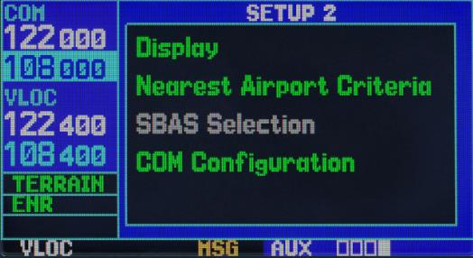

Страница setup 2 обеспечивает доступ (через меню вариантов) к настройке индикатора(яркость,
контрастность), параметрам, определяющим поиск ближайших аэропортов и вариантам сетки
частот(25 или 8.33КГц) связного приемопередатчика. После выбора варианта меню появляется
соответствующее окно, обеспечивающее доступ к различным установкам системы.

Для выбора варианта меню на странице setup 2:

1.       Нажмите малую правую ручку для активизации курсора.
2.       Вращением большой правой ручки выберите нужный вариант меню и нажмите ENTER.

Имеются следующие варианты меню:

**Display** — позволяет настроить дисплей для оптимальной видимости при всех условиях. Имеется
автоматический подсвет, использующий встроенный фотоэлемент (в верхней левой части рамки
дисплея) для настройки параметров дисплея без внешнего вмешательства. Автоматическая
настройка контраста дисплея изменяет контраст дисплея в зависимости от текущей температуры
изделия. Вы можете выбрать ручную настройку контраста и подсвета по своему усмотрению.
Nearest Airport Criteria (Критерии поиска ближайших аэропортов) — определяет
минимальную длину и тип ВПП, используемые для определения девяти ближайших аэропортов
на странице nearest airport. Минимальная длина полосы и/или ее тип могут быть введены для
предотвращения поиска аэропортов с малыми полосами и неподходящим типов ВПП. Установка
по умолчанию “0 футов” и “any” (любой).

**COM Configuration (Конфигурация связи)** — позволяет выбрать разделение частот каналов
УКВ связи 8.33 КГц или 25.0 КГц.

## Группа страниц NRST

Четвертая группа страниц (NRST) обеспечит вас подробной информацией о ближайших
аэропортах, VOR, NDB, пересечениях и пользовательских ППМ внутри 200-мильной зоны от
вашего текущего положения. Кроме того, страницы NRST включают пять ближайших станций
обслуживания полетов (FSS) и центров связи УВД/РДС (ARTCC/FIR), плюс предупредит вас о
любом пространстве специального использования (SUA) или контролируемом воздушном
пространстве, которое может оказаться поблизости. В текущей реализации есть данные только
о кавказском регионе.

Для быстрого выбора страницы NRST:

1.   На любой страницы нажмите и держите 2 сек кнопку CLR для выбора страницы NAV.
         (Вы можете пропустить этот шаг, если вы уже находитесь на одной из основных
         страниц. )
2.   Поворачивайте большую правую ручку для выбора группы страниц NRST. “NRST”
         появится в нижнем правом углу экрана.
3.   Поворачивайте малую правую ручку для выбора требуемой страницы NRST.

Не для всех ближайших аэропортов, VOR, NDB, пересечений или пользовательских ППМ могут
быть индицированы на соответствующей странице NRST одновременно. Страница ближайших
аэропортов индицирует подробную информацию для трех ближайших аэропортов, столбик
прокрутки на правой стороне экрана указывает, какая часть списка просматривается в данный
момент. Страница ближайших SUA индицирует подробную информацию для трех воздушных
пространств специального использования. Страницы NRST для VOR, NDB, пересечений и
пользовательских ППМ индицируют пять ППМ одновременно. Оставшиеся в списке ППМ могут
быть просмотрены при использовании большой правой ручки.

Для просмотра списка ближайших аэропортов, VOR, NDB, пересечений, пользовательских ППМ
или пространств SUA:

1.   Выберите требуемую страницу NRST, как описано выше.
2.   Нажмите на малую правую ручку для активизации курсора.
3.   Поворачивайте большую правую ручку для листания списка. Столбик прокрутки на
         правой стороне экрана будет указывать, какая часть списка просматривается в данный
         момент.
4.   Нажмите на малую правую ручку для удаления мигающего курсора.

Страницы ближайших ARTCC и FSS представляют подробную информацию для пяти ближайших
станций – индицируя только одну станцию одновременно. Дополнительная информация может
быть просмотрена при использовании большой правой ручки.

Для просмотра списка ближайших станций обслуживания полетов или центров связи:

1.   Выберите требуемую страницу NRST, как описано на выше
2.   Нажмите на малую правую ручку для активизации курсора.
3.   Поворачивайте малую правую ручку для листания списка.
4.   Нажмите на малую правую ручку для удаления мигающего курсора.

### NRSTapt

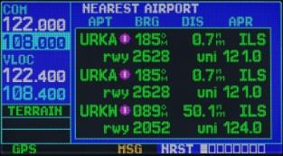

Страница ближайшего аэропорта индицирует идентификатор, символ, пеленг и дальность до
ближайших аэропортов (в радиусе 200 миль от вашего текущего положения). Для каждого
аэропорта на этой странице также индицируется наилучший имеющийся заход, рекомендуемая
частота связи позывной (CTAF) и длина самой длинной ВПП.

Страница ближайшего аэропорта может быть использована для быстрой настройки передатчика
СОМ на ближайший аэропорт. Выбранная частота помещается в резервное поле окна СОМ и
активизируется кнопкой С↕

Для быстрой настройки рекомендуемой частоты CTAF из страницы ближайшего аэропорта:

1.   Выберите страницу ближайшего аэропорта, как описано выше
2.   Нажмите на малую правую ручку для активизации курсора.
3.   Поворачивайте большую правую ручку для листания списка, выделяя частоту связи с
         этим аэропортом.
4.   Нажмите ENT для перемещения выбранной частоты в резервное поле окна СОМ.
5.   Нажмите С↕ для активизации выбранной частоты.
6.   Нажмите на малую правую ручку для удаления мигающего курсора.

Дополнительные частоты связи, информация о ВПП доступна из страницы ближайшего
аэропорта выделением курсором идентификатора требуемого аэропорта и нажимая на кнопку
ENT.

Для просмотра дополнительной информации для ближайшего аэропорта:

1.   Выберите страницу ближайшего аэропорта, как описано выше
2.   Нажмите на малую правую ручку для активизации курсора.
3.   Поворачивайте большую правую ручку для листания списка, выделяя идентификатор
         требуемого аэропорта.
4.   Нажмите ENT для индицирования страницы положения аэропорта для выбранного
         аэропорта.
5.   Для просмотра дополнительных страниц ППМ для выбранного аэропорта (включая
         страницы ВПП и частот связи) поворачивайте малую правую ручку для индицирования
         дополнительных страниц ППМ.

### NRSTint

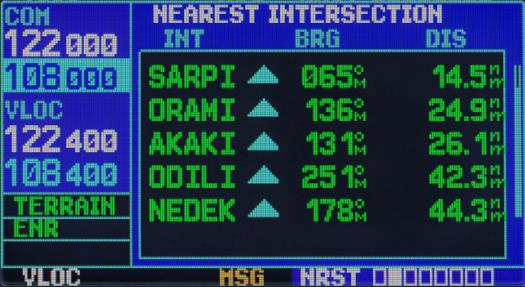

Страница ближайших пересечений показывает их список и позволяет посмотреть детальную
информацию о конкретном пересечении.

Для детализации информации о пересечении:

-  Выберите страницу ближайшего пересечения как описано выше.
-  Нажмите малую правую ручку для высвечивания курсора.
-  Используйте большую правую ручку для выбора конкретного пересечения.
-  Нажмите ENT для перехода на страницу WPTint для просмотра более детальной
         информации.

### NRSTndb

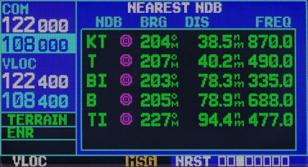

Страница ближайших узлов ndb может быть использована для быстрой настройки передатчика
СОМ на ближайший eptk. Выбранная частота помещается в резервное поле окна СОМ и
активизируется кнопкой С↕

Для детализации информации о ndb:

1.   Выберите страницу ближайшего ndb как описано выше.
2.   Нажмите малую правую ручку для высвечивания курсора.
3.   Используйте большую правую ручку для выбора конкретного ndb.
4.   Нажмите ENT для перехода на страницу WPTndb для просмотра более детальной
         информации если выбрано имя ndb.

### NRSTvor

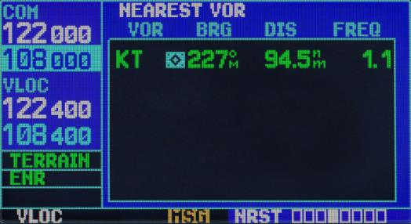

Страница ближайшего VOR индицирует идентификатор, символ, пеленг и дальность до
ближайших VOR (в радиусе 200 миль от вашего текущего положения). Для каждого VOR эта
страница также индицирует частоту и может быть использована для быстрой настройки
приемника VLOC на ближайший VOR. Выбранная частота помещается в резервное поле окна
VLOC и активизируется кнопкой V↕

Для быстрой настройки рекомендуемой частоты VOR из страницы ближайшего VOR:

1.   Выберите страницу ближайшего VOR, как описано выше.
2.   Нажмите на малую правую ручку для активизации курсора.
3.   Поворачивайте большую правую ручку для листания списка, выделяя частоту связи с
        VOR.
4.   Нажмите ENT для перемещения выбранной частоты в резервное поле окна VLOC.
5.   Нажмите V↕ для активизации выбранной частоты.
6.   Нажмите на малую правую ручку для удаления мигающего курсора.

Для просмотра информации VOR из страницы ближайшего VOR:

1.   Выберите страницу ближайшего VOR
2.   Нажмите на малую правую ручку для активизации курсора.
3.   Поворачивайте большую правую ручку для листания списка, выделяя идентификатор
         требуемого VOR.
4.   Нажмите ENT для индицирования страницы VOR для выбранного VOR.

### NRSTuser

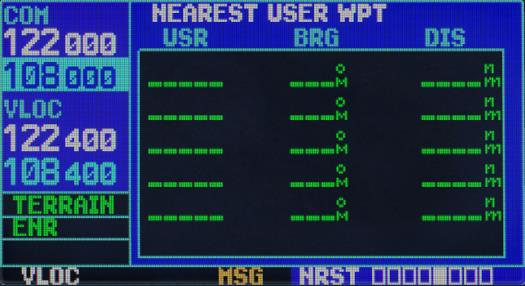

Страница ближайшего USER WPT индицирует идентификатор, символ, пеленг и дальность до
ближайших VOR (в радиусе 200 миль от вашего текущего положения).

Для просмотра информации USER WPT из страницы ближайшего USER WPT:

1.   Выберите страницу ближайшего USER WPT
2.   Нажмите на малую правую ручку для активизации курсора.
3.   Поворачивайте большую правую ручку для листания списка, выделяя идентификатор
         требуемого USER WPT.
4.   Нажмите ENT для индицирования страницы USER WPT для выбранного USER WPT.

### NRSTartcc

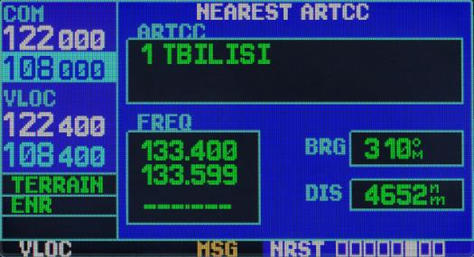

Страница ближайших центров индицирует кодовое наименование, пеленг и дальность до пяти
ближайших центров УВД (ARTCC) (в радиусе 200 миль от вашего текущего положения). Для
каждого ARTCC эта страница также индицирует частоту связи и может быть использована для
быстрой настройки приемника СОМ на частоту центра. Выбранная частота помещается в
резервное поле окна СОМ и активизируется кнопкой С↕

Для быстрой настройки рекомендуемой частоты ARTCC из страницы ближайшего ARTCC:

1.   Выберите страницу ближайшего центра, как описано выше.
2.   Нажмите на малую правую ручку для активизации курсора.
3.   Поворачивайте большую правую ручку для листания списка, выделяя требуемый
         центр.
4.   Поворачивайте большую правую ручку для листания списка, выделяя требуемую
         частоту.
5.   Нажмите ENT для перемещения выбранной частоты в резервное поле окна СОМ.
6.   Нажмите С↕ для активизации выбранной частоты.
7.   Нажмите на малую правую ручку для удаления мигающего курсора.

В текущей реализации страница лишь отображает данные для кавказского региона.

### NRSTfss

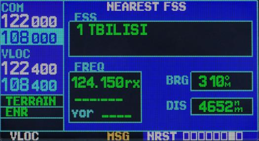

Страница ближайших станций обслуживания индицирует кодовое наименование, пеленг и
дальность до пяти ближайших станций обслуживания (в радиусе 200 миль от вашего текущего
положения). Для каждой FSS эта страница также индицирует частоту связи и может быть
использована для быстрой настройки приемника СОМ на частоту FSS. Выбранная частота
помещается в резервное поле окна СОМ и активизируется кнопкой С↕

Для быстрой настройки рекомендуемой частоты FSS из страницы ближайшей FSS:

1.   Выберите страницу ближайшей станции обслуживания
2.   Нажмите на малую правую ручку для активизации курсора.
3.   Поворачивайте большую правую ручку для листания списка, выделяя требуемую станцию
    обслуживания.
4.   Поворачивайте большую правую ручку для листания списка, выделяя требуемую частоту
     (частоту СОМ или частоту VOR для двойных операций).
5.   Нажмите ENT для перемещения выбранной частоты в резервное поле окна СОМ или окна
     VLOC.
6.   Нажмите С↕ или V↕, соответственно, для активизации выбранной частоты.
7.   Нажмите на малую правую ручку для удаления мигающего курсора.

В текущей реализации страница лишь отображает данные для кавказского региона.

### NRSTspace

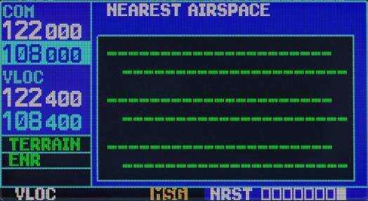

Последняя страница в группе NRST, страница ближайших SUA, предупредит вас как о девяти
контролируемых или специальных зон воздушных пространствах в районе вашего плана полета.
Предупреждения появляются в соответствие со следующими условиями (В текущей версии не
реализовано):

1.   Если ваш курс приведет вас внутрь воздушного пространства в течение следующих 10 мин,
     появится сообщение “Special use airspace ahead less than 10 minutes”. На странице
     ближайших SUA воздушное пространство будет показано как “Ahead”.
2.   Если вы находитесь внутри 2-мильной зоны от воздушного пространства и ваш текущий курс
     ведет вас внутрь воздушного пространства, появится сообщение “Special use airspace
     near and ahead ”. На странице ближайших SUA будет показано как “Within 2nm of
     airspace”.
3.   Если вы находитесь внутри 2-мильной зоны от воздушного пространства и ваш текущий курс
     не ведет вас внутрь воздушного пространства, появится сообщение “Near special use
     airspace less than 2 nm”. На странице ближайших SUA будет показано как “ Ahead
     <2nm”.
4.   Если вы вошли в воздушное пространство, появится сообщение “Inside special use
     airspace ”. На странице ближайших SUA будет показано как “Inside special use airspace ”.

Обратите внимание, что предупреждения о воздушном пространстве основываются на
трехмерных данных (широта, долгота и высота), чтобы избежать сообщений, вызванных шумами.

Предупреждения для контролируемых воздушных пространств также разделяются, чтобы
обеспечить полную информацию для любого ближайшего воздушного пространства. После
выполнения одного из описанных выше условий будет мигать сигнализатор сообщений,
предупреждая вас и сообщении SUA.

В текущей реализации страница лишь отображает данные для кавказского региона.

## Дополнительная группа FPL

NS 430 позволяет создавать до 20 различных планов полета по 31 ППМ в каждом. Группа
страниц планов полета состоит из двух страниц, доступных при нажатии на кнопку FPL.
Страницы планов полета позволят вам создавать, копировать и редактировать планы полета.

### FPLact

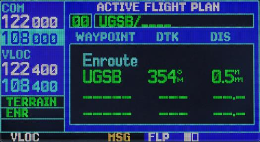

Страница активного плана полета обеспечивает информацией и функциями редактирования для
плана полета “0” – плана полета, используемого в текущий момент для навигации. После
активизации плана полета или функции DIRECT TO, страница активного плана полета будет
показывать каждый ППМ для плана полета (или единичного ППМ для DIRECT TO) вдоль линии
заданного пути (DTK) и дальность (DIS) для каждого участка полета.

Для добавления ППМ, используя левую малую ручку:

1.   Из страницы активного плана полета нажмите на малую правую ручку для активизации
         курсора.
2.   Поворачивайте большую правую ручку для выделения идентификатора ППМ, после
         которого вы хотите добавть ППМ.
3.   Поверните левую малую ручку для появления окна для выбора из списка ППМ.
4.   Используя большую и малую ручку наберите идентификатор ППМ. Если такая точка
         одна, то будет предложено выбрать ее, если ППМ несколько в окне появится
         соответствующее сообщение и будет предложено меню.
5.   Нажмите ENT.
6.   Если точек было несколько, появится меню. Используя болшую правую ручку выберети
         необходимую точку и снова нажмите ENT.
7.   Нажмите ENT для подтверждения конкретной ППМ.

Для удаления ППМ, используя кнопку CLR:

1.   Из страницы активного плана полета нажмите на малую правую ручку для активизации
         курсора.
2.   Поворачивайте большую правую ручку для выделения идентификатора ППМ, после
         который вы хотите вставить новую точку.
3.   Нажмите CLR для индицирования окна подтверждения.

На странице FPLact имеются следующие опции, которые могут быть индицированы при нажатии
кнопки MENU:

- `Copy Flight Plan?` Делает копию для текущего плана полета.
- `Invert Flight Plan?` Инвертирует текущий плана полета.
- `Delete Flight Plan?` Удаляет текущий плана полета.
- `Select Approach?` Выбор захода.
- `Select Arrival?` Выбор прибытия.
- `Select Departure?` Выбор отбытия.
- `Change Fileds?` Редактирование отображаемых параметров.
- `Restore Defaults?` Восстановление отображаемых параметров.

### FPLcat

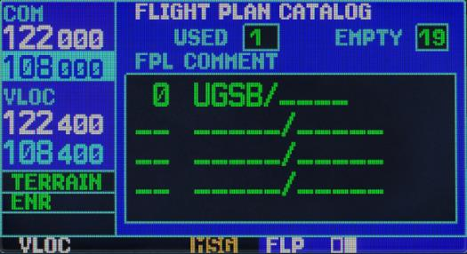

Каталог планов полета позволит вам создавать, копировать и редактировать планы полета.
Планы полета, пронумерованные от 1 до 19, используются для сохранения планов полета для
дальнейшего использования. План полета “0” используется исключительно для текущего плана
полета. Каждый раз, когда вы активизируете план полета, его копия автоматически помещается
в план полета “0” и записывается вместо предыдущего активного плана полета.

Для создания нового плана полета:

1.   Нажмите кнопку FPL и поворачивайте малую правую ручку для индицирования
         каталога планов полета.
2.   Нажмите кнопку MENU для индицирования опций каталога планов полета.
3.   Поворачивайте большую правую ручку для выделения “Create New Flight Plan?” и
         нажмите ENT.
4.   Пустая страница плана полета появится для ближайшего местоположения.
5.   Повторяйте необходимы шаги для           ввода   идентификатора      для   каждого
         дополнительного ППМ плана полета.
6.   После ввода всех ППМ, нажмите на малую правую ручку.
7.   Для возврата в каталог планов полета используйте малую правую ручку.

Для дополнения ППМ в существующий план полета:

1.   Нажмите кнопку FPL и поворачивайте малую правую ручку для индицирования
         каталога планов полета.
2.   Нажмите на малую правую ручку для активизации курсора.
3.   Поворачивайте большую правую ручку для выделения требуемого плана полета и
         нажмите ENT.
4.   Далее следуйте указаниям страницы FLPact.

Для удаления ППМ из существующего плана полета:

1.   Нажмите кнопку FPL и поворачивайте малую правую ручку для индицирования
         каталога планов полета.
2.   Нажмите на малую правую ручку для активизации курсора.
3.   Поворачивайте большую правую ручку для выделения требуемого плана полета и
         нажмите ENT.
4.   Далее следуйте указаниям страницы FLPact.

Для активизации плана полета:

1.   Из страницы каталога планов полета нажмите на малую правую ручку для активизации
         курсора.
2.   Нажмите MENU для индицирования окна опций каталога планов полета.
3.   Поворачивайте большую правую ручку для выделения “Activate Flight Plan?” и
         нажмите ENT.

Для реверсирования плана полета:

После движения по плану полета, вы можете перевернуть маршрут для навигации обратно к
вашей первоначальной точке отправления

1.   Выполните шаги. Описанные выше для активизации плана полета.
2.   На странице активного плана полета нажмите MENU для индицирования окна опций
         активного плана полета.
3.   Поворачивайте большую правую ручку для выделения “Invert Flight Plan?” и нажмите
         ENT. Первоначальный план полета будет сохранен в вашем каталоге планов полета.

Для копирования плана полета:

Если вы хотите сохранить текущий план полета из плана полета “0”, убедитесь, что вы
скопировали его в открытый план полета из каталога (1-19) до того, как он будет отменен,
перезаписан или стерт. Сделать опию можно для любого плана полета.

1.   Из страницы активного плана полета нажмите MENU для индицирования окна опций
         активного плана полета.

2.   Из страницы каталога планов полета нажмите на малую правую ручку для активизации
         курсора, поворачивайте большую правую ручку для выделения плана полета, который
         вы хотите скопировать, затем нажмите MENU для индицирования опций каталога
         планов полета.

3.   Поворачивайте большую правую ручку для выделения “Copy Flight Plan?’ и нажмите
         ENT.

Для удаления плана полета:

После того, как вы закончили использование плана полета, он может быть легко удален из
каталога или страницы активного плана полета.

1.   Из страницы активного плана полета нажмите MENU для индицирования окна опций
         активного плана полета.
2.   Из страницы каталога планов полета нажмите на малую правую ручку для активизации
         курсора, поворачивайте большую правую ручку для выделения плана полета, который
         вы хотите удалить, затем нажмите MENU для индицирования опций каталога планов
         полета.
3.   Поворачивайте большую правую ручку для выделения “Delete Flight Plan?’ и нажмите
         ENT.

Для каталога планов полета имеются следующие опции:

- `Activate Flighn Plan?` –позволит вам выбрать план полета для навигации
- `Create New Flighn Plan?` – позволит вам создать новый план полета,
- `Crossfill?` – позволит вам передавать планы полета между двумя NS 430 при двойной
        установке. В текущей версии прибора опция не реализована
- `Copy Flight Plan?` – позволит вам копировать выбранный план полета в новый план
        полета. Копирование полезно для дублирования существующего плана полета перед
        его изменением.
- `Delete Flight Plan?` - позволит вам удалить выбранный план полета из памяти.
        Удаление плана полета не уничтожает индивидуальные ППМ, содержащиеся в плане
        полета, из базы данных или памяти пользовательских ППМ.
- `Delete All Flight Plans?` - позволит вам удалить все планы исключая активный.

## Дополнительная страница DRCT

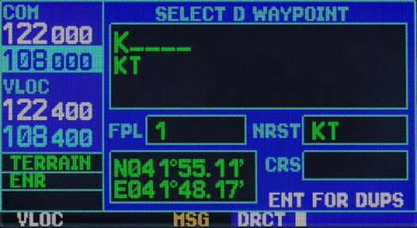

Одним из преимуществ NS 430 является возможность лететь DIRECT TO точку назначения или
лететь от точки к точке без использования наземных средств навигации. Для обеспечения
удобной и эффективной навигации, NS 430 предлагает два основных метода выбора точки
назначения: режим DIRECT TO и навигация на маршруте. Функция DIRECT TO
обеспечивает прокладывание пути по заданной линии к точке назначения от Вашего текущего
положения. Навигационные данные на различных навигационных страницах будут обеспечивать
управление полетом до тех пор, пока режим DIRECT TO не будет отменен или заменен новой
точкой назначения.

Наименование |  Описание
-------------|-----------------------------------------------------------------
  FLT        |          Номер плана полета
  NRST       |           Ближайший найденный ППМ
  CRS        |           В текущей версии не поддерживается

Для выбора режима DIRECT TO точку назначения:

1.   Нажмите на кнопку DIRECT TO. Появится страница выбора DIRECT TO ППМ с
         выделенным полем идентификатора ППМ.
2.   Используйте малую и большую правые ручки для ввода идентификатора требуемой
         точки назначения.
3.   Нажмите ENT для подтверждения выбранного ППМ,
4.   Cнова нажмите ENT для активизации функции DIRECT TO.

Если при движении на ППМ вы отклонились от ЛЗП (по СDI или HSI), функция DIRECT TO
может быть повторно использована для возврата на ЛЗП и продолжать движение к выбранному
ППМ.

Для выбора точки назначения из страницы карты:

1.   Из страницы карты нажмите на малую правую ручку для индицирования указателя
         цели.
2.   Поворачивайте малую и большую правую ручки для перемещения указателя цели на
         требуемое местоположение назначения.
3.   Если указатель цели помещен на существующий аэропорт, навигационное средство или
         пользовательский ППМ, имя ППМ будет выделено. Нажмите на кнопку DIRECT TO
         для имени ППМ в странице DIRECT TO.
4.   Нажмите ENT для активизации функции DIRECT TO.

Для выбора ближайшего аэропорта или другой точки как точки назначения DIRECT TO:

1.   Выбирите групппу NRST используя большую правую ручку
2.   Поворачивайте малую правую ручку для индицирования окна, показывающего
         ближайшие аэропортов или другие навигационные точки.
3.   Нажмите малую правую ручку для появление курсора.
4.   Поворачивайте большую правую ручку для выделения поля ближайшего аэропорта или
         другой навигационной точки.
5.   Нажмите кнопку DIRECT TO. Появится страница выбора ППМ DIRECT TO с
         выделенным полем идентификатора.
6.   Нажмите ENT для подтверждения выбранного ППМ и ENT для активизации функции
         DIRECT TO.

## Дополнительная страница PROC

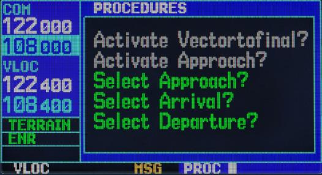

NS 430 позволит вам выполнять неточные и точные заходы по опубликованным
инструментальным процедурам захода. Все имеющиеся заходы хранятся в базе данных, и
автоматически обновляются, когда вы заменяете картридж на новый.

Страница процедур индицируется нажатием кнопки PROC. Страница процедур обеспечивает
прямой доступ к заходам, процедурам прибытия и отправления, основываясь на активном плане
полета, режиме DIRECT TO или создания нового плана полета из ближайшего аэропорта (для
отправления). В любом случае, аэропорты отправления и назначения должны иметь связанные
с ними разрешенные процедуры.

Для выбора заходов, процедур отправления или прибытия:

1.   Нажмите кнопку PROC для индицирования страницы процедур.
2.   Поворачивайте большую правую ручку для выделения “Select Approach?”, “Select
         Departure?” или “Select Arrival?” и нажмите ENT.
3.   Появится окно со списком имеющихся процедур. Поворачивайте большую правую
         ручку для выделения требуемой процедуры и нажмите ENT. (При выборе процедуры
         отправления схемы предлагаются для ближайшего аэропорта).
4.   Дальнейшие действия аналогичны для соответствующей страницы WPT. Например,
         можно загрузить и активировать процедуру, используя кнопку MENU.

Для точных и некоторых неточных заходов нужно помнить, что GPS на заходе используется
только для контроля, для основной навигации используйте приемники VLOC и CDI (или HSI).
Заходы ILS, например, должны быть использованы при включении приемника VLOC на
соответствующие частоты и подключения приемника VLOC к внешнему CDI (или HSI).

После выбора захода он может быть активизирован для навигации из страницы процедур.
Активизация захода заменит участок маршрута на участок захода, а также приведет к
автоматическому изменению масштаба CDI.

Для активизации захода:

В текущей реализации прибора опция не реализована.

-  Из страницы процедур поворачивайте большую правую ручку для выделения “Activate
         Approach?” и нажмите ENT.
-  Появится окно подтверждения. При выделенном “Yes?” нажмите ENT.

Другая опция страницы процедур позволит вам активизировать конечный сегмент захода. Эта
опция предполагает, что вы получите векторы на конечную точку захода (FAF) и полетите на
пересечение конечного курса до достижения FAF.

Для активизации захода с вектором на конечную точку:
В текущей реализации прибора опция нереализована.

1.   Из страницы процедур поворачивайте большую правую ручку для выделения “Activate
         Vector-To-Final?” и нажмите ENT.
2.   Появится окно подтверждения. При выделенном “Yes?” нажмите ENT.

Во многих случаях легче “загрузить” полный заход заранее до аэропорта назначения. Позднее,
направляясь на конечный участок, используйте вышеприведенные шаги для выбора конечного
вектора “Activate Vector-To-Final?”, который активизирует курс на FAF. Или активизируйте
полный заход, используя опцию “Activate Approach?”

NS 430 обеспечивает неточные заходы, используя встроенный приемник GPS. Приемник может
быть также использован как дополнительная помощь для точных заходов, но для основной
навигации ДОЛЖНЫ использоваться приемники локаторов и глиссадных радиомаяков.

Заходы, предназначенные специально для GPS обычно очень просты и не требуют пролета над
VOR или NDB. Многие неточные заходы имеют покрытие, чтобы позволить вам лететь по
существующей процедуре(VOR, VOR/DME, NDB, RNAV и т.д.) более точно, используя GPS. Для
сведения, существует свыше 1400 только GPS-заходов и свыше 3500 заходов с покрытием GPS.

Многие заходы являются комплексными (по сравнению с GPS - заходами). NS 430 руководит
вашим полетом на каждом участке захода – автоматически следуя от одного участка к другому.
По заходу можно лететь как “разрешено” с полным переходом используя любой разрешенный
входной маршрут или начальную точку захода (IAF) – или лететь по вектору на конечную точку
перехода.

### Последовательность действий для взлета

Система позволяет в начале плана поместить процедуру взлета (SID).

Для того чтобы запланировать взлет нужно:

1.   Используя большую и малую левые ручки выбирите страницу NAVdep.
2.   Нажмите правую малую ручку для активизации курсора
3.   Переместите курсор на поле DEP. Поверните малую правую ручку активировав меню
         имеющихся отправлений.
4.   Используя большую ручку выберите DEP необходимую процедуру взлета
5.   Нажмите ENT для подтверждения. Пункты 3, 4 могут быть опущены если вас
         устраивает автоматически выбранная процедура.
6.   Для выключения курсора нажмите на малую правую ручку.
7.   Используя кнопку MENU и правую большую ручку выберете пункт Load into FPL, тем
         самым вы скопируете данные в новый полетный план. Система автоматически перейдет
         на страницу FLPact, где этот план будет показан.

### Последовательность действий для полета по маршруту

Система позволяет запланировать маршрут полета, создав полетный план, а затем
контролировать положение и направление полета.

Для того чтобы запланировать маршрут полета необходимо:

1.   Использую кнопку FLP перейдите на страницу FLPact.
2.   Включить курсор, нажав малую правую ручку.
3.   Добавить нужное количество точек на маршруте используя поворот малой правой
         ручки для высвечивания окна по добавлению точек маршрута.
4.   Завершив добавление точек, нажать правую малую ручку для выключения курсора.
5.   Окончив планирование, нажать на 2 сек. кнопку CLR для перехода на страницу
         NAVdef.
6.   Шкала CDI и другие поля страницы будут диагностировать правильность вашего
         полета.

### Последовательность действий для посадки

Операции захода обычно начинаются с некоторых основных шагов:

1.   Выберите аэропорт назначения, используя кнопку DIRECT TO или как последний ППМ
         в активном плане полета.
2.   Выберите опцию “Select Approach?” из страницы процедур или из опций активного
         плана полета.
3.   Используйте “Load into FPL” на странице WPTapr чтобы загрузить заход для будущего
         использования. Это введет заход в план полета, но сохранит курс, пока заход не будет
         активизирован.
4.   Выберите опцию “Select Arrival?” из страницы процедур или из опций активного плана
         полета.
5.   Используйте “Load into FPL” на странице WPTarriv чтобы загрузить заход для
         будущего использования. Это введет заход в план полета, но сохранит курс, пока заход
         не будет активизирован.
6.   Активизируйте полный заход или конечный вектор, как вам удобно. Иногда вы можете
         найти более удобным немедленно активизировать заход и перескочить процесс
         загрузки.

Ниже приведены некоторые схемы заходов. В текуще версии прибора не все из них реализованы

### Заход по схеме “Procedure turn”

“Procedure turn” является схемой захода на посадку и хранится как отдельный этап общей
процедуры. По этой причине NS 430 не требуется никаких специальных действий со стороны
пилота отличных от тех, которые необходимы собственно для выполнения процедуры разворота
и свыше того, что требуется для любого другого типа захода.

Этот пример использует заход VOR на ВПП 03 регионального аэропорта KLYH, Линхбург
(Вирджиния), и предполагает вылет из муниципального аэропорта KFDK, Фредерик,
(Мэрилэнд). Шаги, требуемые для установки и полета по заходу:

1.   До вылета из KFDK аэропорт назначения выбирается, используя кнопку DIRECT TO
         или созданием плана полета на Линхбург.
2.   Во время полета по маршруту через 40-50 миль вы выбираете частоту ATIS для
         проверки условий использования аэропорта и ВПП. Это выполняется выбором
         страницы NAVCOM и выбором частоты ATIS из списка. Эта частота помещается в
         резервное окно. Используйте кнопку С↕, чтобы сделать частоту ATIS активной.
3.   По частоте ATIS вы узнаете, что ВПП 03 находится в использовании и соответствует
         плану вашего захода. Нажмите кнопку PROC и выберите заход “VOR 03”, используя
         шаги. В окне перехода выберите LYH VOR (начальная точка захода IAF). Затем
         выберите “Load?” для загрузки (но не активизации) захода.
4.   После того, как вы все подготовили для захода, нажмите кнопку PROC, выберите
         “Activate Approach?” и нажмите ENT.

### Полет по схеме “Процедура разворота”

1.   В 30-мильной зоне от аэропорта назначения, NS 430 перейдет с режима “на маршруте”
         на режим “терминал” (индицируется в нижнем левом углу экрана). Переход на режим
     “терминал” сопровождается изменением масштаба на CDI от 5 до 1 морской мили
     (пример вверху слева).
2.   За несколько миль до начальной точки захода (IAF) вы можете захотеть просмотреть
     последовательность захода. Нажмите кнопку FPL для индицирования страницы
     активного плана полета. Нажмите на малую правую ручку и поворачивайте большую
     правую ручку для просмотра каждого участка захода.
3.   После достижения начальной точки захода IAF (LYH) в нижнем правом углу экрана
     появится предупреждение (“NEXT DTK 205o“). Так как дальность (DIS) до IAF нулевое
     предупреждение заменяется на совет (“TURN TO 205o“). Наберите внешний курс 205o
     на CDI (или HSI), используя кнопку OBS и начиная стандартный разворот на этот
     курс.
4.   Летите по внешнему курсу, удерживая стрелку CDI в центре.
5.   После того, как вы пролетели приблизительно 15 сек после конечной точки захода FAF
     (LYH) в нижнем правом углу экрана появится сообщение “PROC TURN OK”. Вы можете
     начать процедуру разворота в любое время после получения этого сообщения.
6.   Доверните налево на 160о для начала разворота. Управление курсом обеспечивается
     относительно внешнего участка от конечной точки захода. (Процедура разворота
     индицируется на странице карты и индицируетcя как активный участок на страницах
     NAV и активного плана полета). Стрелка на CDI начнет сдвигаться вправо.
7.   Приблизительно через одну минуту сделайте правый поворот на 340о для пересечения
     с внутренним курсом. NS 430 будет следовать по внутреннему участку к конечной точке
     захода FAF, стрелка CDI отклонится на противоположную сторону, чтобы обеспечить
     соответствующую чувствительность на конечном курсе и в нижнем правом углу экрана
     появится сообщение “NEXT”
8.   Так как стрелка CDI направляется к центру, сделайте правый доворот на 025o–
     конечный курс захода.
9.   Внутри 2-мильной зоны от FAF NS 430 переключит режим “терминал” на режим
     “заход”. Масштаб CDI уменьшится от 1 до 0.3 морских мили.
10. После того, как вы достигните FAF в нижнем правом углу экрана появится
    предупреждение “NEXT DTK 025o“. Обязательно проведите настройку курса на
    конечном участке (FAF на МАР)
11. После пересечения FAF следуйте к точке МАР (ВПП 03). Удерживая стрелку по центру
    летите на МАР, соблюдая минимальную высоту, указанную для захода.
12. После пересечения МАР над кнопкой OBS появится “SUSP”, указывая, что
    автоматическое следование по ППМ захода приостанавливается в точке МАР. Указание
    “from” будет индицироваться на странице NAV и на CDI, но управление относительно
    ЗПУ конечного этапа будет продолжаться. Если требуется выполнить прерванный
    заход, используйте кнопку OBS, чтобы начать выполнение ухода на второй круг, как
    показано на следующей странице.

Ниже приведены характерные схемы для захода на посадку. Некоторые из них в текущей версии
прибора не доступны (как минимум заход по дуге DME)

### Полет по схеме прерванного захода

Если после прохождения МАР вы не видите ВПП, необходимо выполнить схему прерванного
захода. NS 430 будет продолжать управление вдоль конечного курса до тех пор пока вы
вручную не начнете процедуру прерванного захода (как упоминалось раньше в ссылке на
“SUSP”, Кнопка OBS используется для инициирования прерванного захода:

1.   Нажмите кнопку OBS. Точка ожидания схемы прерванного захода (МАНР, в этом
         случае пересечение SWARM) предлагается автоматически как точка назначения.
2.   Следуйте по процедуре прерванного захода (уход на второй круг), как разрешено для
         вашего захода с соответствующими инструкциями. NS 430 будет руководить вами
         вдоль радиала 053о от LYH VOR.
3.   В нижнем правом углу экрана появится сообщение-предупреждение, рекомендующее
         ввести процедуры для схемы ожидания (“HOLD DIRECT”, “HOLD PARALLEL” или
         “HOLD TEARDROP”). Так как вы летите по схеме по схеме ожидания, на странице NAV
         появится таймер. Таймер автоматически переустанавливается снаружи от точки
         ожидания, когда вы находитесь на траверзе точки ожидания. Таймер снова
         переустановится когда вы повернете внутрь приблизительно внутри 30о зоны от
         внутреннего курса). Это позволит вам использовать определенное время (обычно одну
         минуту) для полета на внутреннем и внешнем участках процедуры ожидания.
4.   NS 430 обеспечит руководство полетом только внутри схемы ожидания. Когда вы
         перейдете от схемы ожидания к повторному полету по заходу (или другому заходу),
         нажмите кнопку PROC для выбора “Select Approach?” или “Activate Approach?”, как
         описано выше. (Или, используйте кнопку DIRECT TO для выбора другого назначения)

### Заход на посадку с ожиданием

Стартуя с того места, где мы оставили предыдущий пример, предположим, что погодные условия
привели к прерванному заходу в аэропорту Линхбурга. И мы решили лететь в аэропорт
Фармвилля (KFVX).

1.   Нажмите кнопку DIRECT TO.
2.   Используйте малую и большие правые ручки для ввода идентификатора аэропорта
         назначения (KFVX).
3.   Нажмите кнопку ENT дважды.
    Затем вы выбираете GPS–заход на ВПП 21 в аэропорту Фармвилля. Этот заход начинается
    со схемы ожидания у начальной точки IAF, пересечения BODRY.
4.   Нажмите кнопку PROC и выберите заход “GPS 21”.
5.   В окне перехода выберите пересечение BODRY в качестве IAF. Также выберите
         “Activate?”, чтобы загрузить и активизировать заход.
6.   После активизации захода появится страница активного плана полета. Вы можете
     посмотреть последовательность захода, нажав на малую правую ручку и поворачивая
     большую правую ручку. Нажмите кнопку FPL для возврата к навигационным
     страницам.
7.   Как и в последнем примере, внутри 30-мильной зоны от аэропорта, NS 430
     переключится от режима “на маршруте” к режиму “терминал”, и масштаб шкалы
     CDI перейдет от 5 к 1 морской миле.
8.   Непосредственно перед пересечением точки BODRY в нижнем правом углу экрана
     появится предупреждение      “HOLD TEARDROP”,    чтобы предложить ввести
     соответствующую схему ожидания. (“HOLD DIRECT” или “HOLD PARALLEL” могут
     быть предложены в других аналогичных заходах)
9.   Как было упомянуто в примере прерванного захода, на странице NAV будет
     индицироваться таймер при полете по схеме ожидания. Используйте этот таймер,
     чтобы лететь одну минуту по внешнему участку схемы ожидания. (Схема ожидания
     индицируется на странице карты и индицируется как активный участок на странице
     NAV и странице активного плана полета).
10. При пересечении IAF над кнопкой OBS           появится “SUSP”, указывая, что
    автоматическое следование по ППМ захода временно приостановлено. После поворота
    внутрь схемы “SUSP” будет отменено и NS 430 вернется к автоматическому
    следованию по заходу.
11. Когда вы приблизитесь к пересечению BODRY, в нижнем правом углу экрана появится
    предупреждение (“NEXT DTK 209O”)
12. Внутри 2-мильной зоны от FAF (пересечение DEPOY) NS 430 переключится с режима
    “терминал” на режим “заход”. Масштаб шкалы CDI уменьшится от 1 до 0.3 морских
    миль.
13. После того, как вы достигните FAF, в нижнем правом углу экрана появится
    предупреждение (“NEXT DTK 209O”). Выполните настройки курса, необходимые для
    конечного курса (от FAF к МАР).
14. После пересечения FAF точкой назначения становится МАР (ВПП 21, кромка ВПП).
    Удерживая иглу CDI в центре, летите DIRECT TO МАР, следите за минимальной
    разрешенной высотой. (Глядя на страницу карты, вы заметите, что конечный курс
    индицируется красным цветом – активный участок плана полета всегда индицируется
    красным цветом- и пунктирная линия продолжает курс позади МАР. НЕ СЛЕДУЙТЕ по
    этому продолжению курса. Вместо этого, следуйте по разрешенной процедуре
    прерванного захода).
15. После пересечения МАР над кнопкой OBS появится “SUSP” указывая, что
    автоматическое следование по ППМ захода временно приостановлено в точке МАР.
    Указание “from” будет индицироваться на странице NAV и на CDI, но управление
    курсом вдоль конечного курса будет продолжаться. Если требуется выполнить
    прерванный заход, используйте кнопку OBS, чтобы начать выполнение прерванного
    захода.

### Заход по дуге DME

Покрытие GPS заходов по дуге DME использует дополнительные ППМ базы данных Jeppesen
для определения дуги. Эти ППМ индицируются с помощью буквы D в начале имени ППМ. После
нее следуют три цифры, указывающие радиал, на котором лежит ППМ. Последняя буква
указывает радиус дуги. Например:

D258G указывает ППМ DME (“D”) на радиале 258о при DME 7 (“G” –седьмая буква алфавита).

Когда вы готовы для захода по дуге DME, вы должны выполнить один из следующих пунктов,
чтобы пересечь дугу:

-  Следуйте по определенному радиалу для пересечения с IAF.
-  Следуйте по вектору АТС, который позволит вам пересечь дугу в любой точке вдоль
         дуги.

Этот пример основывается на полете от муниципального аэропорта Хатчинсона (KHUT)(Канзас)
в аэропорт Forbes Field (KFOE) в Тореке, Канзас. Заход 21 по VOR/DME будет выбран, в
качестве IAF выбран ППМ “D258G”.

1.   Выберите Forbes Field (KFOE) как точку назначения, кнопкой DIRECT TO или как
         последний ППМ в плане полета.
2.   Нажмите кнопку PROC и выберите заход “VOR/DME 21”. В окне перехода выберите
         “D258G” как IAF. Также выберите “Load?” (или “Activate?”, если уже готовы к
         заходу.) Внутри 30-мильной зоны от KFOE, NS 430 переключится от режима “на
         маршруте” к режиму “терминал”, и масштаб шкалы CDI перейдет от 5 к 1 морской
         миле.
3.   Если вы еще не активизировали заход (как описано в пункте #2), сделайте это, когда
         будете готовы для захода.
4.   После достижения IAF в нижнем правом углу экрана появится предупреждение “NEXT
         DTK 352O”. После того, как дальность до IAF станет равна 0, предупреждение будет
         заменено на совет “TURN TO 352O”.
5.   Следуйте по дуге, удерживая стрелку CDI в центре. При использовании автопилота,
         выбор ФПУ на CDI (или HSI) должен периодически обновляться с учетом требуемого
         ЗПУ (DTK), чтобы гарантировать соответствующий путь по дуге. Всегда, когда
         установленный и требуемый ЗПУ отличаются больше, чем на 10 о, на странице
         сообщений появится сообщение “Set course to ###o”.
6.   Следующая точка захода промежуточная точка фиксации, помеченная как “D025G”.
         После того, как вы достигните этой точки, в правом нижнем углу экрана появится
         предупреждение “NEXT DTK 205o”. После того, как дальность до точки фиксации
         станет равна 0, предупреждение будет заменено на совет “TURN TO 352O”. Введите
         этот ЗПУ на CDI, используя кнопку OBS и инициируя стандартный поворот на этот
         курс.
7.   До достижения TOP VOR в нижнем правом углу экрана появится сообщение “NEXT
         DTK 200o”. Выберите этот ЗПУ на CDI (или HSI), используя кнопку OBS и поверните
         на этот ПУ.
8.   Внутри 2-мильной зоны от FAF (FF 21; ППМ Jeppesen) NS 430 переключится с
         режима “терминал” на режим “заход”. Масштаб шкалы CDI уменьшится от 1 до 0.3
         морских миль.
9.   После того, как вы достигните FAF, в нижнем правом углу экрана появится
         предупреждение (“NEXT DTK 200O”). Выполните настройки ПУ, необходимые для
         финального ПУ (от FAF к МАР).
10. После пересечения FAF точкой назначения становится МАР (ВПП 21, кромка ВПП).
        Удерживая иглу CDI в центре, летите DIRECT TO МАР, следите за минимальной
        разрешенной высотой. (Глядя на страницу карты, вы заметите, что конечный ПУ
        индицируется красным цветом – активный участок плана полета всегда индицируется
        красным цветом – и пунктирная линия продолжает ПУ позади МАР.
11. После пересечения МАР над кнопкой OBS появится “SUSP” указывая, что
        автоматическое следование по ППМ захода временно приостановлено в точке МАР.
        Указание “from” будет индицироваться на странице NAV и на CDI, но управление ПУ
        вдоль конечного курса будет продолжаться. НЕ СЛЕДУЙТЕ по этому продолжению
        курса. Вместо этого, следуйте по разрешенной процедуре прерванного захода). Если
        требуется выполнить прерванный заход, используйте кнопку OBS, чтобы начать
        выполнение прерванного захода.

### Векторение на посадочную прямую

Давайте рассмотрим уход на второй круг на заходе “VOR/DME 21 в Форбс Филде. Вместо
следования по дуге DME диспетчерский пункт даст указание ожидать векторение на финальный
ПУ захода. Имеется несколько способов выбрать “векторение на посадочную прямую” с NS 430.
Первые два положения из описанных ниже требуют меньшей загрузки при выполнении:

-  Когда заход выбирается впервые, выберите “VECTORS” в окне перехода.
-  Загрузите полный заход включая включая начальную фиксированную точку захода IAF
         в окне перехода. Когда будете готовы, нажмите PROC и выберите “Activate Vectors-
         To-Final?”
-  Загрузите полный заход. Используйте кнопку DIRECT TO (нажмите ее дважды) на
         странице активного плана полета для выбора требуемого участка захода.

Для выбора “VECTORS” из окна перехода:

1.   Выберите Форбс Филде (KFOE) как точку назначения, используя кнопку DIRECT TO,
         или как последний ППМ в плане полета.
2.   Нажмите кнопку PROC и выберите заход “VOR/DME 21”.
3.   В окне перехода выберите “VECTORS”
4.   Выберите “Load?”(или “Activate?”. Если уже готовы к заходу)

Для активизации векторения на финальном курсе из страницы процедур:

1.   Выберите Форбс Филде (KFOE) как точку назначения, используя кнопку DIRECT TO,
         или как последний ППМ в плане полета.
2.   Нажмите кнопку PROC и выберите заход “VOR/DME 21”.
3.   В окне перехода выберите ““D258G” в качестве начальной точки захода. Затем
         выберите “Load?”
4.   Если уже готовы к заходу, нажмите кнопку PROC и выберите “Activate Vectors-To-
         Final?”

При векторении на посадочную прямую стрелка CDI будет отклонена от центра пока вы на
выйдете на посадочную прямую. Когда заход активизирован, на странице карты продолжение
финальной прямой будет индицироваться красным цветом (помните, красный цвет используется
для обозначения активного участка плана полета) и на странице NAV появится “VTF” как часть
активного участка (как напоминание, что заход был активизирован с векторением на посадочную
прямую). В этом примере мы предполагаем, что векторы диспетчерского пункта будут
перпендикулярны финальному курсу:

1.   Внутри 30-мильной зоны от KFOE NS 430 перейдет от режима “на маршруте” к режиму
         “терминал” и масштаб CDI перейдет от 5 до 1 морской мили.
2.   Активизируйте заход, если вы еще не сделали этого. Это позволит NS 430
         осуществлять руководство навигацией на финальном курсе.
3.   Диспетчерский пункт даст указание повернуть влево на курс 020 о. При этом вы
         окажетесь параллельно финальному курсу в противоположном направлении. Стрелка
         CDI отклонится влево.
4.   Диспетчерский пункт даст указание повернуть влево на курс 110о.
5.   Диспетчерский пункт даст указание повернуть влево на курс 170 о для пересечения
         финального курса захода. После того, как вы приблизитесь к финальному курсу,
         стрелка CDI будет двигаться к центру. (На иллюстрации слева стрелка еще не
         вернулась на СDI, так как ваше текущее положение находится все еще в 2,6 мили
         справа от финального курса захода).
6.   После возвращения стрелки в центр CDI, проведите необходимую коррекцию ПУ для
         установления полета на финальную прямую. За 2 мили от конечной точки захода
         FAF(FF21) NS 430 перейдет с режима “терминал” на режим захода. Масштаб CDI
         изменится от 1 до 0.3 морских мили.
7.   После того, как вы приблизитесь к FAF, в нижнем правом углу появится
         предупреждение “NEXT DTK 200o”. Проведите необходимые настройки на конечный
         участок захода (FAF на МАР).
8.   После пересечения FAF точкой назначения будет МАР (“RW21”). Удерживая стрелку
         в центре, летите DIRECT TO МАР, следя за минимальной безопасной высотой,
         разрешенной для данного захода.
9.   После того, как Вы достигли МАР в нижнем правом углу появится предупреждение о
         ППМ (“APPRCHING WPT”)
10. После пересечения МАР над кнопкой OBS появится “SUSP” указывая, что
        автоматическое следование по ППМ захода временно приостановлено в точке МАР.
        Указание “from” будет индицироваться на странице NAV и на CDI, но управление ПУ
        вдоль посадочной прямой будет продолжаться. НЕ СЛЕДУЙТЕ по этому продолжению
        ЛЗП. Вместо этого, следуйте по разрешенной процедуре прерванного захода). Если
        требуется выполнить прерванный заход, используйте кнопку OBS, чтобы начать
        выполнение прерванного захода.

### Участки маршрута “полет от заданной точки”

Определенные заходы, SID, STAR и процедуры прибытия в базе данных Jeppesen содержат
участки маршрута Участки маршрута “курс от заданной точки”. NS 430 может загрузить эти
участки в маршрут вместе с остальными данными процедуры и обеспечить навигацию по этим
участкам.

Имеются три различных типа участков “курс от заданной точки”:

#### Тип 1: Полет от заданной точки на расстояние или Полет от заданной точки по дуге DME

Участки Полет от заданной точки на расстояние появляются в маршруте как нормальные ППМ,
но имя точки назначения должна начинаться с символа "D", вслед за которым идет расстояние
в десятках м.м. от заданной точки. Этот пример использует заход VOR/DME RWY 25 в
Палмдейле, Калифорния (KPMD) и включает изменение курса на обратный.

1.   При достижении начальной точки захода (PMD), появляется предупреждение о
         прибытии в ППМ (“NEXT DTK 070°”) в нижнем правом углу экрана. Когда расстояние
         от IAF достигает нуля, предупреждение заменяется на подсказку о развороте (“TURN
         TO 070°”). Введите курс подлета на CDI (или HSI) пользуясь ручкой OBS и начните
         стандартный разворот на данный курс.
2.   Летите на курс подхода, держа стрелку CDI по центру. Вы теперь на участке “полет
         от заданной точки на расстояние”, как показано на страницах активного маршрута
         и страницах NAV. Обратите внимание на красную линию в нижней части картинки,
         которая представляет текущий активный участок захода. Расстояние, индицируемое на
         обоих экранах есть расстояние НА точку “D13.0”. Маршрут автоматически
         переключается на следующий участок после “D13.0”.
3.   В 13.0 м.м. от FAF, появляется предупреждение о прибытии в ППМ (“NEXT DTK 265°”)
         правом нижнем углу экрана. Произведите разворот со стандартной скоростью
         разворота для пересечения конечной ЛЗП захода и следите, чтобы стрелка CDI была
         в центре.
4.   По прибытии в промежуточную точку (CF25), появится предупреждение (“NEXT DTK
         265°”). Настройте курс соответствующим образом.
5.   В 2.0 морских милях от FAF (THERO), NS 430 переключится из режима подхода в
         режим захода. (“APR” появится в левом нижнем углу экрана, взамен “TERM”.) Масштаб
         CDI изменится от 1.0 до 0.3 м.м. , полное отклонение.
6.   При прилете в FAF, “NEXT DTK 265°” появится в правом нижнем углу экрана.
7.   После пересечения FAF, точка назначения переключается на MAP (MA25). Удерживая
         стрелку CDI по центру, летите на MAP, наблюдая за минимумами высоты, требуемыми
         схемой захода
8.   После прибытия в MAP, в нижнем правом углу экрана появляется предупреждение
         (“APPRCHING WPT”).

9.   При пересечении MAP, над кнопкой появляется сигнализация “SUSP”, индицирующая
         прекращение автоматического переключения ППМ в MAP. Если требуется прерванный
         заход, используйте кнопку OBS для инициализации последовательности прерванного
         захода как описано ниже.

Тип 2: Полет от заданной точки на высоту

Участки Полет от заданной точки на высоту показывают заданную высоту на страницах
активного маршрута и страницах NAV. Последовательность прерванного захода для захода
VOR/DME RWY 25 включает участок полет от заданной точки на высоту.

В данном примере участок соответствует начальному участку прерванного захода, который
звучит как “Набор 5000’ на курсе вылета PMD VOR R-282”.

1.   После пересечения MAP, нажмите OBS. Автоматически будет предложена
         последовательность прерванного захода, начиная с полета от заданной точки на
         высоту. Предупреждение “NEXT DTK 282°” появляется в нижнем правом углу экрана.
         Следуйте процедурам прерванного захода, как описано в Вашей опубликованной схеме
         захода в инструкциях по соответствующему набора и курсу.

2.   Обратите внимание на то, что через несколько секунд от нажатия OBS для начала
         автоматического переключения ППМ сигнализация “SUSP” появляется вновь над
         кнопкой OBS так как NS 430 приостанавливает автоматическое переключение ППМ.
         Это является нормальным при полете от заданной точки на высоту.

3.   Летите по курсу вылета, следя за тем, чтобы стрелка CDI была по центру. На странице
         карты будет картинка, изображающая маршрут от PMD VOR. Расстояние (DIS) на
         страницах NAV, карты и активного маршрута будет увеличиваться и индицировать
         расстояние назад к PMD VOR.

4.   После достижения нужной высоты (5000’), нажмите кнопку OBS для возвращения к
         автоматическому переключению ППМ. Убедитесь, что “SUSP” не появляется над
         кнопкой OBS

5.   Предупреждение (“NEXT DTK 126°”) появится для наведения Вас на курс подлета.
         ЗПУ (DTK) будет зависеть от путевой скорости и расстояния от PMD VOR. Пересеките
         и летите по курсу подхода, удерживая стрелку CDI по центру.

6.   По прибытии в PMD VOR (точка ожидания при прерванном заходе), сообщение в
         нижнем правом углу экрана будет рекомендовать процедуру входа в зону ожидания
         (“HOLD PARALLEL”). При полете в зоне ожидания, на странице NAV появляется
         таймер. Он автоматически переключается на сторонах схемы зоны ожидания.

7.   Обратите внимание, что NS 430 опять индицирует “SUSP” над кнопкой OBS.
         Автоматическое переключение ППМ остановлено в точке ожидания прерванного
         захода. Предупреждение о ППМ (“APPRCHING WPT”) появляется в нижнем правом
         углу экрана при приближении к PMD VOR на маршруте ожидания.

8.   После ухода из зоны ожидания, нажмите кнопку PROC для реактивизации захода или
         выбора другого захода или нажмите DIRECT TO для полета на другой ППМ
         назначения. CEDURES

Тип 3: Полет от заданной точки до ручного переключения

Участки полета от заданной точки до ручного переключения появятся в активном маршруте и
страницах карты с индикацией “man seq” на месте идентификатора ППМ. Пример такого типа
участков появляется COASTAL ONE DEPARTURE из Вестфилда, Массачусетс (Барнс Муни).

Пример участка соответствует участку вылета из муниципального аэропорта Барс и появляется
следующим образом на страницах активного маршрута и NAV:

1.   Выберите SID (CSTL1) со страницы процедур. Затем выберите ВПП (RW02, в данном
         примере) и переход (GEDIC). См. Раздел 5 для инструкций по выбору SID.

2.   После вылета в правом нижнем углу экрана появляется индикация “NEXT DTK 026°”
         и сигнализация “SUSP” DIRECT TOд кнопкой OBS. Вы теперь на участке ‘полет от
         заданной точки до ручного выбора’. Расстояние, индицируемое на страницах активного
         маршрута, NAV и карты есть расстояние ОТ заданной точки (ВПП взлета в данном
         примере).

3.   Летите по курсу вылета, удерживая стрелку CDI по центру После разрешения
         переключиться на следующий участок маршрута нажмите OBS. Убедитесь в том, что
         “SUSP” отсутствует над кнопкой OBS. Предупреждение (“NEXT DTK 186°”) появится в
         правом нижнем углу экрана для наведения Вас на новый ППМ (HFD VOR). ЗПУ (DTK)
         будет зависеть от путевой скорости и расстояния от HFD VOR.

4.   После нажатия кнопки OBS NS 430 будет автоматически переключать ППМ по
         оставшейся части маршрута, включая заданный переход.

Заход по системе ILS.
Точные заходы могут быть созданы с помощью встроенного приемника VLOC
(VOR/курсоглиссадный приемник). Приемник GPS может использоваться для управления
полетом до достижения посадочной прямой, но при этом должна быть выбрана соответствующая
частота в окне VLOC (с левой стороны экрана) и выход CDI должен быть переключен с “GPS”
на “VLOC”.

1.   Например, выберем полет из Лафлина (Аризона) в Флагстаф (KFLG) и выберем заход
         по системе ILS на ВПП 21. Пересечение “SHUTR” будет выбрано как начальная
         фиксированная точка захода и будет включена во внешний участок и процедуру
         поворота. Конечно, векторение на финальную прямую также может быть выбрано, как
         описано ранее для неточных заходов.
2.   Выберите Флагстаф (KFLG) как точку назначения, посредством кнопки DIRECT TO или
         как последний ППМ в плане полета.

3.   Нажмите кнопку PROC и выберите “ILS 21”

В окне перехода выберите “SHUTR” в качестве начальной фиксированной точки захода.
Используйте Load into FPL из меню для загрузки процедуры в план полета.

Заход по системе ILS.
При активизации захода по системе ILS частота ILS будет автоматически помещена в резервное
поле окна VLOC. Чтобы использовать эту частоту, нажмите кнопку V↕ для перемещения ее в
активное поле частоты.

1.   Внутри 30-мильной зоны от KFLG NS 430 перейдет от режима “на маршруте” к
         режиму “терминал” и масштаб CDI перейдет от 5 до 1 морской мили

2.   Активизируйте заход при получении диспетчерского разрешения, если вы еще не
         сделали этого.

3.   После достижения IAF (SHUTR)         в   нижнем   правом   углу   экрана    появится
         предупреждение “NEXT DTK 352O”.

4.   Если вы еще не сделали этого, нажмите кнопку V↕ для активизации частоты ILS.

5.   После того, как дальность до IAF станет равна 0, предупреждение будет заменено на
         совет “TURN TO 30O”.

6.   Летите с ПУ (030 о), удерживая стрелку в центре на внешнем CDI (или HSI).

7.   Примерно через 1 мин. после того, как вы пролетели пересечение SHUТR, в нижнем
         правом углу экрана появится предупреждение “START PROC TURN”. Вы можете
         начать процедуру разворота в любое время после получения этого предупреждения.

8.   Поверните вправо на 075о для начала процедуры разворота. NS 430 не будет
         управлять полетом во время разворота. (Процедура разворота индицируется на
         странице карты и индицируется как активный участок на странице NAV и странице
         активного плана полета). Стрелка внешнего CDI начнет сдвигаться вправо (обратная
         чувствительность).

9.   Приблизительно через одну минуту поверните на 180 о влево на курс 255 о до
         пересечения ILS. NS 430 будет следовать по внутреннему участку и в нижнем правом
         углу экрана появится предупреждение “NEXT DTK 210 о ”.

10. После того, как стрелка CDI начнет двигаться к центру, поверните влево на 210о – ПУ
        ILS. После установления ПУ на FAF, переключатель CDI автоматически переключится
        с приемника “GPS” на приемник “VLOC” (Если частота ILS активизирована, как указано
        в пункте #4).

11. После того, как вы достигните SHUTR, в нижнем левом углу экрана появится “0.30nm”-
        отражая изменение масштаба от 1 до 0.3 морских мили. (Такое изменение масштаба
        применяется только на странице NAV на экранном CDI, так как внешний CDI или НSI
         сейчас подсоединены к приемнику VLOC. GPS-заход не будет активизироваться для
         точного захода. Используйте приемник VLOC для основной навигации.)

12. После того, как вы достигните SHUTR, в нижнем правом углу экрана появится
        предупреждение “NEXT DTK 210 о ”.

13. После пересечения SHUTR точкой назначения станет МАР (“RW21”, кромка ВПП).
        Удерживая стрелку внешнего CDI (или HSI) по центру, летите DIRECT TO МАР, следя
        за минимальной высотой, разрешенной для захода. При просмотре страницы карты, вы
        заметите, что конечный курс индицируется красным цветом (активный участок плана
        полета всегда индицируется красным) и продолжается пунктиром за МАР.

14. По мере приближения к МАР в нижнем правом углу экрана появится предупреждение
        “APPRCHING WPT”.

15. После пересечения МАР над кнопкой OBS появится “SUSP” указывая, что
        автоматическое следование по ППМ захода временно приостановлено в точке МАР.
        Указание “from” будет индицироваться на странице NAV и на CDI, но управление
        курсом вдоль конечного участка будет продолжаться.

НЕ СЛЕДУЙТЕ по этому продолжению конечного участка. Вместо этого, следуйте по
разрешенной процедуре прерванного захода). Если требуется выполнить прерванный заход,
используйте кнопку OBS, чтобы начать выполнение прерванного захода.

1.   Система сообщений
В NS 430 используется мигающий сигнализатор “MSG” в нижней части экрана (DIRECT TOд
кнопкой MENU) для сообщения о наличии важной информации или предупреждения. Хотя
многие сообщения имеют характер совета, предупреждающие сообщения требуют Вашего
вмешательства. Всякий раз при мигании сигнализатора “MSG” нажмите кнопку MENU для
индикации сообщения. Нажмите MENU снова для возврата на предыдущую страницу.

Ниже приведен перечень имеющихся сообщений и их значения :

Approaching target altitude - Текущая высота GPS-в 500 футах от конечной высоты режима
вертикальной навигации.

Approaching VNAV profile - Вы в одной минуте полета от точки начала снижения или набора
режима вертикальной навигации.

Arrival at waypoint - [идентификатор ППМ]-Ваше судно на заданном расстоянии от ППМ.
Расстояние устанавливается на странице setup 1.

Auto CDI scale selected - GNS автоматически переустановила шкалу CDI при выполнении
навигации на маршруте, подходе или заходе. При выборе ручного управления шкалой на
странице setup 1 NS 430 автоматически переключает ручное управление на автоматическое в 30
м.м. от аэропорта прибытия. Система также возвращается в автоматическое управление после
выключения, установка ручного управления НЕ сохраняется после включения.

FPL is full - remove unnecessary waypoints - Попытка добавить более 31 точек в маршрут.
Set course to [###]° - Дополнительный CDI/HSI должен быть установлен на заданный ПУ.
Сообщение появляется, когда текущий ПУ более, чем на 10° отличается от ЗПУ (D ПУ>10o).

Waypoint already exists - Вы ввели ППМ, идентификатор которого уже существует. Введите
другое имя ППМ.

Waypoint memory is full - Память ППМ переполнилась (более 1000 ППМ). Вам надо удалить
неиспользуемые ППМ для освобождения места для новых ППМ.

2.   Обозначения
Ниже приведен перечень сокращений, используемых в NS 430 и их значения:

  ACTV                  Активный

  ALT                   Высота

  APPRCHING             Приближение

  APR                   Заход

  APT                   Аэропорт

  ARSPC                 Воздушное пространство

  ARTCC                 Центр контроля УВД (Air Route Traffic Control Center)

  ARVL                  Прибытие

  AUX                   Дополнительный

  AVGAS                 Авиационый бензин

  AVTN                  Авиация

  BARO                  Барометрическое давление

  BRG                   Пеленг “НА”

  C/V                   COM/VLOC

  CAS                   Приборная скорость с учетом инструментальных ошибок

  CDI                   Указатель отклонения от ЛЗП (ЛБУ)
CLR     Очистить

COM     Связной Приемопередатчик

CRSR    Курсор

CTA     Зона управления ИКАО (ICAO Control Area)

CTAF    Частота консультативного обслуживания полетов

CTR     См. ARTCC

CTS     ПУ наведения

CUM     Кумулятивный

DB      База данных

DEN     Плотность

DEP     Вылет

DIS     Расстояние

DME     Оборудование дальномера

DOP     Ухудшение точности

DTK     ЗПУ

EFF     Эффективность

ELEV    Превышение

ENDUR   Запас топлива в час. и мин.

ENR     На маршруте

ENT     Ввод

EPE     Расчетная ошибка положения

ESA     Безопасная высота на маршруте
ETA       Расчетное время прибытия

ETE       Время полета

FF        Расход топлива

FOB       Запас топлива на борту

FPL       Маршрут

Fpm       фут в минуту

FREQ      Частота

Ft        фут

G/S       Глиссада

Gl        галлон

GS        Путевая скорость

HDG       Направление

Hg        дюймы трутного столба

HWY       Автострада

ID        Идентификатор

Ig        Имперский галлон

IND       Индицируемый

INT       Пересечение

INTEG     Целостность

kph       Километры в час

kt        Узлы

LAT/LON   Широта/долгота
lb      Фунты

LCL     Местное

LFOB    Текущий остаток топлива после пролета одного и более участков
        маршрута

LOC     Курсовой радиомаяк(КРМ)

LRES    Остаток топлива LFOB, выраженный во времени

Lrg     Большой

lt      Литры

°M      Магнитные градусы

m       Метры

mb      Миллибары

Med     Средний

mi      Сухопутные мили

MOA     Зона военных действий

mph     Сухопутная миля в час

mpm     Метр в минуту

mps     Метр в секунду

MSA     Минимальная безопасная высота

MSG     Сообщение

MSL     Средний уровень моря

mul     Мультисвязь

NATNL   Национальный

NAV     Навигация
NAVAID      Навигационное средство

NDB         Ненаправленный радиомаяк

nm          Морская миля

NRST        Ближайший

NUM         Количество

P.POS       Текущее местоположение

PROC        Процедура

PROV        Провинция

PWR         Питание

RAD         Радиал

RAIM        Автономная проверка целостность приемника

REF         Ссылка

REQ         Требования/требуемый

RESTRICTD   Ограниченный

RNG         Дальность

RX          Принимать

SID         Стандартный маршрут вылета

Sml         Малый

SPD         Скорость

SQ          Подавитель шума

SRFC        Поверхность

STAR        Стандартный маневр прибытия
SUA     Воздушное пространство специального использования

°T      Истинный градус

TAS     Истинная воздушная скорость

TAT     Температура торможения

TEMP    Температура

TERM    Аэропорт

TKE     Ошибка ПУ

TMA     Аэродромная зона управления IКAO

TRANS   Переход

TRK     ФПУ

TRSA    Аэродромная зона управления (УВД) с РЛС

twr     Вышка

TX      Передача

uni     Unicom

UTC     Всемирное скоординированное время (также GMT или “zulu”)

VAR     Склонение

VER     Версия

VFR     ПВП (Правила визуальных полетов)

VLOC    Приемник VOR/Localizer (ВОР/КРМ)

VNAV    Вертикальная навигация

VOL     Громкость

VS      VS
VSR   Потребная вертикальная скорость

WPT   ППМ

WX    Погодный

XTK   Отклонение от ЛЗП (ЛБУ)
                    РАЗРАБОТЧИКИ

BRG - Пеленг “НА”
РАЗРАБОТЧИКИ
BELSIMTEK
Менеджмент
Александр Подвойский         Директор Belsimtek

Сергей Герасёв               Продюсер, документация

Александр Бабичев            Менеджер проектов

Программисты
Юрий Некрасов                 Программирование систем прибора

Юрий Кочмарев                 Взаимодействие прибора с DCS World

Вячеслав Косач                Миссии

Дизайн и озвучание
Павел Сидоров                 Модель прибора

Надежда Бабичева              Верстка мануала

Matthias Techmanski           Локализация, английский мануал

IT и клиентская
поддержка
Константин «Const» Боровик   Системный и сетевой администратор, WEB, форум
 Андрей Филин                              Системный и сетевой администратор, Клиентская
                                           поддержка

 Константин «MotorEAST» Харин              Клиентская поддержка

 Контроль качества
 Валерий "USSR_Rik" Хоменок                Ведущий тестер

 Иван "Frogfoot" Макаров                   Тестер

 Александр "BillyCrusher" Билиевский       Тестер

 Никита "Nim" Определенков                 Тестер

 Олег "Dzen" Федоренко                     Тестер

 Отдел локализации
 Алексей «Mode» Чистяков                   Локализация

НЕМЕЦКАЯ ЛОКАЛИЗАЦИЯ
Hardy "I./ZG15_FALKE" Bauer
Sebastian "Lino_Germany" Benner
Thomas "shagrat" Gaussmann
Marco "SynGrownos" Gronemeyer
Charly "Nirvi" Kramer
Marcel "EagleEye" Kruger
Daniel "Luigi Gorgonzola" Atencio Psille
Matthias "Groove" Techmanski
Sebastian "Rakuzard" Markert
Torsten "monthypython76" Goddek

ИСПАНСКАЯ ЛОКАЛИЗАЦИЯ
Roberto "Vibora" Seoane Penas
ФРАНЦУЗСКАЯ ЛОКАЛИЗАЦИЯ
Gilles "Maraudeur" Annee
Clement "Azrayen" Bakes
Gaetan "cameleon33" Delaporte
Guillaume "Bad CRC" Gaillet
Julien "Psycho" Gras
Cedric "Cedaway" Lemercier

ЧЕШСКАЯ ЛОКАЛИЗАЦИЯ
Honza Lehky

КИТАЙСКАЯ ЛОКАЛИЗАЦИЯ
Xueqian "uboats" Zhao
Zhiliu "ACEJohnLu" Lu
Anderson "Anderson" Yip
Jiong "billeinstein" Zhang
Yonglong "RglsPhoto" Zhao
Zupei "groovy" Li
Jiutian "Yukari" Cai

Тестеры
Apache600
Astronut
Breezy
Bond 42
Gospadin
Gumar
Laivynas
Muffler
ody81
Scudrunner
Skete
SLPAK
Sport
SuperSix2
Wolf5

