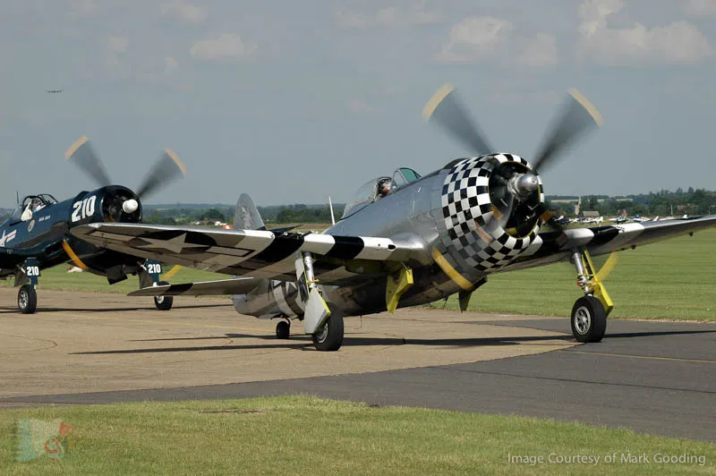

# Введение

P-47 Тандерболт (“Удар молнии”) – истребитель-бомбардировщик времен Второй Мировой
Войны, разработанный компанией Рипаблик, который является продолжателем серии самолетов,
разработанных двумя русскими эмигрантами, Александром Северским и Александром Картвелли.
Тандерболт был создан фирмой Рипаблик Авиэйшн (Republic Aviation Corporation) в
Фармингдейле (Лонг Айленд, Нью Йорк и Эвансвиль, Индиана). P-47D был одним из основных
истребителей ВВС США времен Второй Мировой Войны, особенно хорошо он выполнял роль
штурмовика. Благодаря радиальному двигателю и протектированными бензобаками он
отличается своей живучестью.

За форму фюзеляжа самолет получил неформальное прозвище “Джаг” (англ. Jug – кувшин).
Британцы думали, что Jug – это сокращение от Juggernaut (Джаггернаут – непреклонная сила),
ссылаясь на большие размеры и вес, высокую мощность двигателя и внушительное вооружение
самолета. Другое не официальное название самолета – Т-болт (T-bolt).

В состав вооружения P-47D-30 входит восемь 12,7 мм пулеметов Colt Browning M2 с
боекомплектом в 425 патронов на ствол. Возможность подвески бомбового вооружения весом до
1135 кг позволяет P-47D выполнять атаку наземных целей. Самолет также имеет возможность
подвески до 10 неуправляемых авиационных ракет HVAR.

{!abbr.md!}
