# История самолета

## Рождение концепции

Схема консольного цельнометаллического низкоплана с эллиптическим крылом стала “торговой
маркой” фирмы Seversky Aircraft Corporation. Позже к этому “джентльменскому набору”
присоединили турбокомпрессор. Северский работал над концепцией самолета вместе с другим
русским, точнее русским грузином, Михаилом Григоришвили, урезавшим в Штатах свое "швили"
до короткого Грегор. Первым самолетом Северского стал Sev-З – цельнометаллический
низкоплан с взаимозаменяемым поплавковым и колесным шасси. Крыло самолета имело в плане
форму, близкую к эллипсу. Эллиптические крылья обладали гораздо меньшим индуктивным
сопротивлением по сравнению с обычными. Северский использовал один из лучших на тот
момент профилей крыла в мире – NACA Clark Y, точнее скоростной вариант данного профиля –
Clark YH. И в США в 1933 году крыло с таким профилем имел один единственный аэроплан – Sev-
3.

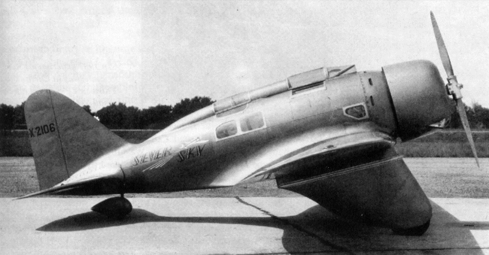

Авиационному корпусу армии США требовался двухместный самолет первоначальной и базовой
подготовки летчиков. Северский выиграл в 1935 году конкурс на учебно-тренировочную машину.
Фирма получила заказ на три десятка самолетов ВТ-8. Прежде чем заказ был получен, на фирме
произошли важные изменения. В 1934-ом работать к Северскому пришел Александр
Картвелишвили, превратившийся в США в Александра Картвели. Из-за этого сокращения
отдельные люди считают грузина за армянина – дескать исходный вариант был Картвелян.
Картвелишвили родился в Тифлисе 9 сентября 1896 года. Получил военное образование во
Франции, где увлекся авиацией. В числе учителей Александра Картвелишвили были Луи Блерио,
Вибо. После того, как Григоришвили покинул фирму вдрызг разругавшись с главой компании,
главным конструктором "Северский Ко" стал Александр Картвелишвили. Скончался
Картвелишвили в США 20 июля 1974 года.

Летом 1935 года на фирму пришел Хэрт Миллер, имевший репутацию знающего инженера и
великолепного летчика. Сам глава фирмы, Картвелишвили и Миллер составили триумвират,
определявший всю техническую политику. Миллер вложил немало сил в создание истребителя
Р-35, фирма получила заказ на 77 таких машин.

"Авиация прогрессирует тогда, когда прогрессируют авиационные двигатели", – сказал как-то
один из французов на заре эры авиации. С двигателями для самолетов в США в 30-е годы дела
обстояли не особенно блестяще. Военные не требовали от конструкторов сделать двигатель,
сохранявший мощность на больших высотах. Высотность мотора достигалась за счет
использования дополнительных устройств. В Великобритании, Германии и Советском Союзе с
переменным успехом много экспериментировали с многоступенчатыми механическими
нагнетателями. Американцы пошли иным путем.

В США все работы по обеспечению высотности моторов были сконцентрированы на
проектировании и доводке турбокомпрессоров, работающих от выхлопных газов двигателя. Еще
в 1921 году на биплане Le Pere LUSAC-11 был установлен, оснащенный турбокомпрессором,
двигатель Паккард, аэроплан сумел забраться на высоту 10 000 м. Турбокомпрессоры
испытывались на истребителях Р-6, Р-12 и на двухместном Р-12А. Четыре турбокомпрессора
поставили на двигатели прототипа бомбардировщика В-17 "Летающая Крепость".

Неудивительно, что Северский с коллегами, зная о скромных достижениях моторостроителей
США, обратили свой взгляд на турбокомпрессоры. Только турбокомпрессор, по мнению
Северского, мог обеспечить истребителю летные характеристики на уровне лучших мировых
стандартов.

Фирма практически параллельно вела работы по нескольким типам самолетов, к примеру, в
1935 году над Sev-2ХР и Sev-1XP. Последний построенный серийный истребитель Р-35 был
оставлен на фирме в качестве платформы для дальнейшей модернизации. Он послужил основой
для самолета ХР-41. Машина имела традиционное для Северского убираемое шасси с основными
стойками, убирающимися в крыло с поворотом к продольной оси самолета. На ХР-41 стоял
двигатель Twin Wasp мощностью от 1050 до 1200 л.с.

Ссоры и разногласия Северского с чиновниками вкупе с постоянной жаждой конструктора читать
нотации привели к тому, что фирма Северского стала крайне непопулярной в Вашингтоне. Заказ
на самолеты достался конкуренту – фирме Curtiss-Right. Истребитель Р-35 стал последним
самолетом конструкции Северского, принятым на вооружение авиационного корпуса армии США.
Одно- и двухместный варианты самолета АР-7 послужили отправной точкой для дальнейших
работ. Сначала самолет имел те же крыло и шасси, что и истребитель Р-35, но в 1939 г.
значительной доработке подверглось шасси. В начале 1938 г. финансовое положение фирмы
Северского стало критическим, осенью ее объявили банкротом. Александру Северскому
пришлось сократить свои полномочия полновластного хозяина. Исполнительным директором
стал Уоллес Келетт, численность персонала пришлось сократить. Все шло к отстранению
основателя фирмы от дел вообще. 18 апреля 1939 г. Келетт стал президентом фирмы, пост
технического директора занял Александр Картвели.

Северский с трудом пережил эти изменения. Он был отброшен на пару десятков лет назад, снова
– поиски денег, работа с нуля по организации собственного дела. 15 сентября 1939 г. Александр
Северский убрал свое имя из названия основанной им фирмы. Фирма Северского стала
называться сначала Republic Aircraft Corporation, затем Republic Aviation Corporation (Рипаблик
Авиэйшн).

## АР-10 и ХР-47/ХР-47А

Во второй половине 30-х годов командование авиационного корпуса армии США воспылало
любовью к V-образным двигателям жидкостного охлаждения, имевшим меньший мидель по
сравнению со звездообразными моторами воздушного охлаждения. Справедливости ради,
следует отметить, что через “влюбленность” в жидкостные моторы прошли ВВС всех ведущих
авиационных держав мира. На мнение американцев повлияло появление в Великобритании
жидкостных двигателей Роллс-Ройс “Кестрел” и “R” – предшественника знаменитого “Мерлина”.
В США подобных моторов не имелось. Из-за недостаточного финансирования со стороны
правительства наиболее совершенный американский V-образный мотор Allison V-1710 не имел
повышающих высотность механических нагнетателей. Концепция легкого истребителя с
жидкостным двигателем фирмы Allison пользовалась большой популярностью в высших сферах
авиационного корпуса, ее поддерживал и сам командующий генерал Арнольд, но такой самолет
не мог нести большую нагрузку – бронезащиту, вооружение, топливо.

Мнение командования авиационным корпусом совершенно не совпадало со взглядами на
будущий истребитель технических руководителей фирмы Republic. Однако, фирма нуждалась в
деньгах, а заказчик всегда прав. В августе 1939 года Картвели представил военным свой ответ
на выданные требования – элегантный низкоплан очень небольших размеров с вытянутым
носом, установленным в нижней части фюзеляжа радиатором, полуэллиптическим крылом.
Расчетный вес самолета – не более 2,1 т., расчетная скорость на высоте 4570м – 670км/ч. Макет
самолета продублировали - вторая “деревяшка” предназначалась для натурных продувок в
аэродинамических трубах. Требования к легкому истребителю окончательно
выкристаллизовались, когда в умах начальников американской военной авиации произошел
революционный переворот в правильном направлении. Начальник штаба авиационного корпуса
генерал Д.С. Иммонс предложил пересмотреть существующую стратегию развития авиации,
сместив приоритеты в разработке истребителей – идея легкого самолета воздушного боя была
похоронена.

Самолет Р-47 явился продолжением семейства машин, которое началось с аппарата Р-35
Александра Северского и продолжилось самолетами Р-43 Lancer и аппаратом с более высокими
летными характеристиками Р-44, существовавшим только в проекте.

В 1939г. фирмой “Republic Aviation Corporation” в США был разработан истребитель AP-10,
являющийся развитием более ранней модели экспортного истребителя P-43 “Lancer”.
Вооружение машины составляли 2 пулемета калибра 7,62мм, но по требованию военных оно
было увеличено в два раза. Этот истребитель был прототипом P-47 “Thunderbolt”, однако, даже
по его внешнему виду об этом было сложно догадаться.

В ноябре 1939 года по проекту AP-10 был заказан прототип, получивший обозначение XP-47,
однако начавшаяся в Европе война наглядно продемонстрировала, что даже 4 пулемета калибра
7,62-мм это очень мало, а кроме того истребитель нуждался в бронировании и протектировании
бензобаков. Одним словом, проект был возвращен на доработку.

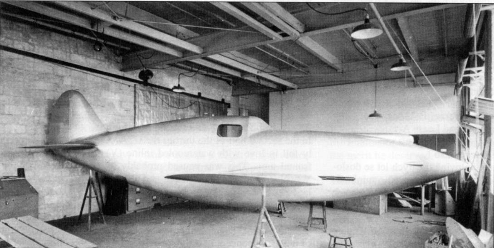

В 1940г. фирма Рипаблик представила проект истребителя ХР-47/47А; работы над ним велись в
обстановке секретности параллельно с проектированием легкой машины с V-образным
Аллисоном. Макет ХР-47 с двигателем R-2800 был готов, когда со сборочной линии завода сошел
первый из тринадцати YP-43.

Первоначальные планы США заказать проекты легких истребителей Republic АР-4 и АР-10 с
обозначениями ХР-47 и ХР-47А, соответственно, были отменены, как только поступили первые
сообщения об опыте боевых действий в Европе. Тогда Картвели предложил свой тяжелый
истребитель, который отвечал новым требованиям. В своем проекте он исходил из
использования поршневого двигателя с турбокомпрессором Pratt & Whitney R-2800 Double Wasp
и получил заказ на опытный образец ХР-47В на основе этого проекта. Новый самолет
представлял собой свободнонесущий цельнометаллический низкоплан с полотняной обшивкой
рулевых поверхностей, убирающимся трехопорным шасси с хвостовым колесом и
откидывающимся фонарем, под которым размещался пилот.

Потенциальные возможности аппарата ХР-47В выявились во время первого полета 6 мая 1941г.
Вскоре поступил заказ от Армии США на 171 серийный истребитель Р-47В. Самолеты начали
выходить из сборочных цехов в марте 1942г. Однако первые столкновения с немецкими
истребителями показали, что Тандерболт не обладает достаточно высокими летными
качествами и маневренностью на малых и средних высотах, а его дальность полета не
позволяла использовать самолет в качестве истребителя сопровождения. Эти недостатки были
устранены в последующих вариантах.

## Быть или не быть!

Серьезной проблемой американской военной авиации являлось невозможность добиться
хороших высотных характеристик истребителей при существующих двигателях. Все надежды
связывались с турбокомпрессорами и звездообразными двигателями воздушного охлаждения.
Разработку звезд в годы "великой депрессии" и политики изоляционизма финансировал флот –
командование авиации ВМС США принципиально не признавало V-образных моторов. Заботами
флота к концу 30-х годов фирма Pratt & Whitney отработала двигатель R-1830 Twin Wasp и
завершала разработку мотора R-2800 Double Wasp. Оба двигателя подходили для установки
турбокомпрессора и на оба не имелось заказов со стороны авиационного корпуса. Заказ на
моторы для самолетов AP-4 помог Pratt & Whitney устоять на ногах, а весной 1939 г.
командование корпуса армейской авиации объявило конкурс на высотный истребитель с
потолком не менее 7100 м.

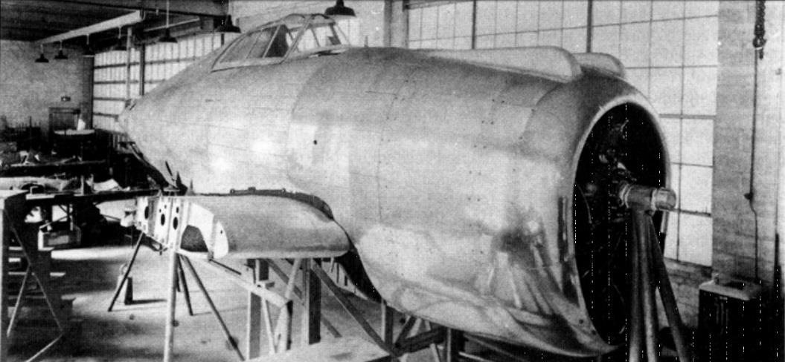

Двигателестроители не боялись конкуренции – конкурентов у Pratt & Whitney на тот момент в
США просто не имелось. А зря – вопреки здравому смыслу заказ на 524 самолета достался фирме
Curtiss, предложившей истребитель ХР-40 оснащенный двигателем Allison V-1710 мощностью
1050 л.с. Мотор был оптимизирован для работы на малых и средних высотах, и имел вооружение
всего из двух пулеметов винтовочного калибра.

Фирму Pratt & Whitney спасли от краха французы, сделавшие огромный заказ в преддверии войны
с Германией. К моменту нападения нацистов на Польшу портфель заказов фирмы Pratt & Whitney
оценивался более чем в 84 млн. долларов, потерянный заказ на 524 истребителя для
авиационного корпуса "тянул" всего на 8 млн. долл. На деньги западноевропейцев был выстроен
новый завод в East Hartford с производственными помещениями площадью 26 000 м2.

В июне 1940 года комиссия Иммонса подготовила отчет, в котором высказывалась озабоченность
зависимости истребительной авиации от одного двигателя Allison V-1710 и рекомендовалось
ускорить разработку истребителя со звездообразным двигателем воздушного охлаждения. В то
же время командование авиационного корпуса отнюдь не собиралось отказываться от моторов
жидкостного охлаждения, стимулируя их совершенствование.

Отчет Иммонса возымел необходимый эффект – специалистов проектного отдела фирмы Republic
пригласили на совещание в Райт-Филд (Огайо), где находился штаб авиационного корпуса армии
США. На совещании обсудили и скорректировали текущие программы проектирования
истребителей с моторами воздушного охлаждения и перспективные планы.

Выезжали на совещание очень спешно. Вице-президент и главный конструктор фирмы Александр
Картвели вместе с летчиком-испытателем Хэртом Миллером, который являлся по
совместительству главой отдела военных контрактов, паковали документацию, плакаты, схемы,
чертежи – спешили на ночной экспресс в Огайо. На совещании было обсуждено большое число
концепций будущего истребителя. Обсуждение в конечном итоге вылилось в появление
спецификации на истребитель со взлетной массой более чем в 6 тонн.

Военные попросили Картвели рассмотреть возможность перепроектирования конструкции
самолета ХР-44 под более мощный двигатель R-2800-11, развивавший на большой высоте на
боевом режиме мощность 2000 л.с.

В спецификацию был внесен ряд требований по опыту воздушной войны над Европой. Обе
стороны, заказчик и фирма Republic, приняли эти требования без протестов. Фактически же эти
требования означали конец линии развития ХР-44, конструкция не позволяла без существенных
изменений "повесить" броню, установить мощное вооружение и протектированные топливные
баки большой емкости. Необходимо было проектировать самолет едва ли не с нуля. Масса
машины определялась в 5250 кг, скорость – не менее 644 км/ч на высоте 7600м, вооружение –
шесть пулеметов калибра 12,7 мм. Изначально стало ясно, что такое вооружение в фюзеляже
разместить не получится, оставалось одно – поставить пулеметы в крыло. Проект ХР-47/47А в
корне менял лицо, а программу ХР-44 в ближайшем будущем планировалось прикрыть.
Возвращаясь с совещания поездом, Картвели и Миллер везли с собой несколько драгоценных
листочков технического задания.

## Путь к Тандерболту

Задуманный Картвели истребитель не являлся абсолютно новой конструкцией – он представлял
собой развитие все того же ХР-44, ноги которого в свою очередь выросли из самолета АР-4
конструкции Северского.

Картвели на первых набросках “завернул” турбокомпрессор в фюзеляж. Турбокомпрессор
увеличивал массу самолета – пришлось пойти на увеличение площади крыла. Работа велась в
спешке – Картвели даже приглашал к себе домой для работы над проектом наиболее способных
инженеров и конструкторов, специалистов по бортовому оборудованию во внеслужебное время.
Шел поиск наилучшего места для турбокомпрессора, компоновка сменяла компоновку,
рассматривался, в частности, вариант с удлиненным по аэродинамическим соображениям
фюзеляжем.

Вместо уродливого горшка маслорадиатора, торчащего в нижней части фюзеляжа, было
предложено установить два маслорадиатора за двигателем на противопожарной перегородке,
между двумя воздуховодами от турбокомпрессора. Выхлопные газы от двигателя подводились
по широкому каналу, проложенному в нижней части фюзеляжа к турбине. Сжатый воздух от
турбокомпрессора подавался через теплообменник по двум стальным трубам, проложенным по
бортам верхней части фюзеляжа к нагнетателю двигателя. Увеличение площади крыла привело
к увеличению его размаха – появилась возможность убирать опоры шасси целиком в крыло, а
не в крыло и центроплан, как на ХР-44.

За аэродинамику самолета отвечал молодой и очень способный специалист Костас И. Паппас –
он уже принимал участие в создании самолетов ХР-41 /АР-4 и Р-45.
Кабина и фонарь претерпели минимум изменений по сравнению с кабиной и фонарем ХР-44.
Наиболее существенным изменением стало внедрение боковой дверцы, по типу
использовавшейся на истребителях американском Р-39 “Аэрокобра” и британском “Тайфуне”.
Однако она не прижилась. Фонари с дверцами ставились только на прототип и три
последующих Тандерболта.

## Рождение Тандерболта

На положение центра тяжести самолета в значительной степени влияет взаимное размещение
двигателя, кабины, вооружения, турбокомпрессора и т.д. Первый прототип Тандерболта, ХР-47В,
имел несколько сдвинутый назад центр тяжести, что положительно влияло на маневренные
характеристики самолета в вертикальной плоскости. Позже, однако, потребовалось
откорректировать положение центра тяжести, что и было сделано на модификации Р-47С.

Из процесса разработки истребителя ХР-47В исключили изготовление макета, посчитав, что
компоновка в достаточной степени отработана при создании ХР-44 и его предшественников.
Традиционно, истребители авиационного корпуса армии США имели багажные отсеки в
фюзеляжах. На ХР-47 место багажа занимал более необходимый высотному истребителю
турбокомпрессор, а остальное свободное пространство фюзеляжа почти полностью занимали
два больших протектированных топливных бака. Согласно ТЗ суммарная емкость топливных
баков самолета должна была составлять 1190 л, но конструкторы, как ни старались, сумели
найти места лишь для баков емкостью 1130 л.

Еще до того, как прототип ХР-47 оторвался в первый раз от аэродрома, пост президента фирмы
занял Ральф С. Дэмэн. Вместе с Дэмэном на фирму пришел еще один менеджер высокого полета
– эмигрант из России Альфред Марчев. Оба руководителя пришли в ужас от организации работ
на фирме Рипаблик. Дэмэн взялся налаживать сборочные линии по типу использовавшихся
фирмой Локхид. Дэмэн проработал на фирме Рипаблик не так много – всего 28 месяцев, но
покидая свой пост, он оставил после себя созданные его усилиями два гигантских авиационных
завода, работавших как часы. Это было мечтой Северского.

За месяц до предусмотренного контрактом срока, в начале мая 1941 года прототип ХР-47В
появился на летном поле заводского аэродрома в Фэрмингдэле. Посмотреть на первый полет
собрались едва ли не все 2000 человек, работавших на заводе. Численность персонала
увеличилась за год в десять раз!

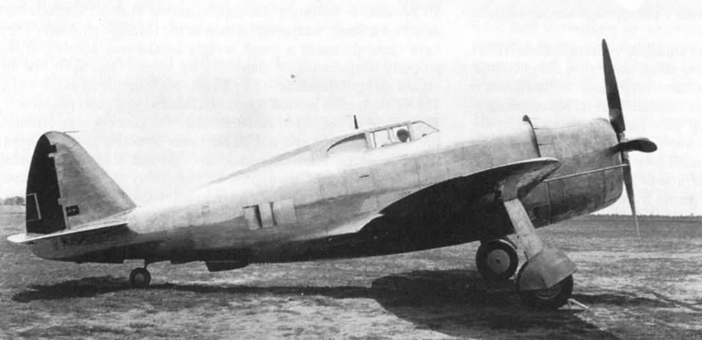

Опытный самолет сиял полированным металлом, выделялись черная надпись U.S. ARMY на
крыле, обтянутые полотном рули были окрашены в грязно-оливковый цвет. Первый полет
состоялся 6 мая 1941 года. Путевку в жизнь Тандерболту дал летчик-испытатель Ловери
Брэбхэм, работавший на фирме со времен Северского. Брэбхэм опасался сажать тяжелый
самолет на раскисший после недавнего дождя аэродром и предложил выполнить посадку на
расположенном поблизости аэродроме Митчел-Филд.

Первые минуты полета вполне могли вызвать у впечатлительных людей нервный срыв. Кабина
истребителя наполнилась дымом. Брэбхэм в надежде провентилировать кабину открыл форточки
– дым повалил наружу. Опытный пилот имел крепкие нервы – Брэбхэм не только не стал прыгать,
но и продолжил выполнять полетное задние на заполненной дымом машине, языков пламени-то
летчик не видел.

Причина появления дыма оказалась банальной – при стоянке на выхлопные трубопроводы
попало масло. От высокой температуры масло стало дымить. Как только все масло прогорело,
дым исчез, Брэбхэм без приключений сел в Митчел-Филде.

Появление истребителя, нареченного Миллером именем Тандерболт, еще до первого полета
сопровождалось мощной рекламной кампанией. Реакция за океаном была различной – реакция
британцев оказалась более чем сдержанной, в то время как нацистская пресса в пух и прах
разгромило очередное американское "чудо".

Через два года главный конструктор немецкой фирмы Бломм унд Фосс – Рихард Фогт заметит
после осмотра трофейного двигателя R-2800: "Как могли наши лидеры надеяться выиграть войну
у нации, способной выпускать столь прекрасные моторы для военных самолетов?"
Тип двигателя, который стоял на прототипе ХР-47В долгое время был одной из загадок,
окутывающих Тандерболт. К настоящему времени установлено, что 6 мая 1941 года Брэбхэм
летал на ХР-47В с мотором R-2800-11.

Прототип оставался в Митчелл-Филд несколько дней – устраняли мелкие недоделки. Затем
самолет вернулся на заводской аэродром. Командование авиационного корпуса рассматривало
самолет уже как “производственный прототип” – эталон для серийного производства.
Истребитель окрасили по нестандартной схеме с завышенной границей цветов. На самолете
отсутствовало вооружение – стояли только макеты пулеметов, чтобы не менялась аэродинамика.
На ХР-47В летали как собственные, так и военные летчики.

В неофициальном полете на самолет поставили двигатель R-2800-25. С этим мотором самолет
разогнался на высоте 7860 метров до скорости 663 км/ч, замеренная мощность двигателя при
этом составила 1960 л.с. Летчики отмечали прекрасную управляемость истребителя.

Благожелательные комментарии перебивала суровая проза – Тандерболт оказался явно
перетяжеленным. Проблему эту в целом так решить и не удалось. У более тяжелого и прочного
самолета на войне оказался неожиданный плюс – летчики Тандерболтов не опасались выполнять
вынужденные посадки, уверенные в том, что самолет способен выдержать очень жесткие
соприкосновения с землей. С точки зрения выживаемости при вынужденных посадках
Тандерболту, скорее всего, не было равных среди истребителей союзников.

Прототип летал до 8 августа 1942 года. В обычном испытательном полете бывший морской
летчик Филмор Фил Гилмер по ошибке выпустил шасси при работающим турбокомпрессоре.
Струя раскаленных газов мгновенно “сожрала” пневматик хвостового колеса, после чего
загорелся изготовленный из магния диск. Гилмер убрал шасси. Лучше бы он этого не делал. Диск
колеса продолжал гореть уже внутри фюзеляжа. Пожар перекинулся на другие узлы
конструкции. Перегорели тяги управления рулем высоты – самолет терял управление. Гилмер
пытался сохранить контроль над машиной регулируя положение триммеров на рулях высоты.
Безуспешно. Все, чего добился Гилмер – это отвернул пикирующий на высокой скорости опытный
истребитель от жилых кварталов Лонг-Айленда в сторону Атлантики. Летчик покинул
истребитель с парашютом.

## Истребитель Рипаблик P-47 с индексом "D"

Первоначально планировалось индекс “D” присваивать самолетам постройки завода в
Ивэнсвилле, но в конечном итоге Тандерболты из Ивэнсвилла получали довесок к обозначению
в виде литер RA, а Р-47 производства завода в Фэрмингдэйле – RE.

Первые четыре P-47D-RE (заводские номера 42-2250 и 42-2253) были собраны в Ивэнсвилле из
узлов, доставленных с завода в Фэрмингдэйле. В Фэрмигндэйле, в частности, были изготовлены
фюзеляжи, крылья поставлял другой субподрядчик.
Сложности с освоением производства, недостаточно высокий уровень рабочих и мастеров нового
завода сильно влияли на качество Тандерболтов из Ивэнсвилла – самолеты поступали
исключительно в тренировочные подразделения, дислоцировавшиеся в континентальной части
США.

Самолетов P-47D-1-RE (заводские номера 42-78530 – 42-7957) было изготовлено 105
экземпляров. Вариант близок к последним самолетам модификации Р-47С, за исключением
увеличенного для лучшего охлаждения двигателя количества створок (“юбки”) капота, кроме
того, на самолете появилась передняя бронеплита перед приборной доской кабины летчика,
были доработаны топливная и кислородная системы, внесен ряд других, не очень существенных,
изменений.

Истребитель P-47D-2-RE отличался от P-47D-1-RE только отсутствием кожуха турбонагнетателя;
построено 445 самолетов, заводские номера 42-7958 – 42-8402.

Истребители P-47D-2-RA являлись полным аналогом P-47D-2-RE, построено 200 самолетов с
заводскими номерами 42-22364 – 42-22563.

Самолеты P-47D-3-RA имели весьма существенные доработки по кислородной и топливной
системам, всего построено 100 машин с заводскими номерами 42-22564 – 42-22663.

Близкими к P-47D-3-RA являлись самолеты P-47D-4-RA, оснащенные системой впрыска воды в
цилиндры двигателя. Всего построено 200 самолетов с заводскими номерами 42-22664 – 42-
22863.

На модификации P-47D-5-RE (300 построенных истребителей с заводскими номерами 42-8401 –
42-8702) были внедрены две важных новинки, в значительной степени повысивших боевую
эффективность Тандерболта. Увеличение мощности двигателя осуществлялось в основном путем
повышения увеличения наддува. На P-47D-5-RE был установлен турбокомпрессор С-21,
способный работать при 20 000 об/мин, но из-за недостаточного охлаждения частота вращения
ограничивалась величиной 18 250 об/мин. Впрыск воды в цилиндры предупреждал возможную
детонацию смеси и улучшал охлаждение головок цилиндров на чрезвычайных режимах. Бак для
воды емкостью 57 л. монтировался в отсеке агрегатов двигателя, в воду добавлялись
антикоррозионные присадки и метиловый спирт, предотвращавший замерзание воды. Насос для
подачи воды имел привод от двигателя. Впервые массовый американский самолет получил
систему впрыска воды в цилиндры двигателя. Более глубоко, чем на P-47D-2-RE
модернизировали топливную и кислородную системы. Боевые самолеты перегонялись из США в
Великобританию через Гренландию и Исландию. Тандерболты по причине недостаточной
дальности летать этим маршрутом не могли. Вообще, лишь Лайтнинги с дополнительными
внешними баками являлись единственными американскими истребителями, способными
самостоятельно пересекать Атлантику с промежуточными посадками в Гренландии и Исландии.
Доставка Тандерболтов в Европу началась в конце ноября 1942 г. Истребители перевозили в
частично разобранном виде на палубах и в ангарах авианосцев, а также на палубах танкеров. P-
47D-5 стал первым Тандерболтом, на котором была предусмотрена возможность подвески под
фюзеляжем сбрасываемого топливного бака или авиабомбы массой до 454 кг.
Теоретически P-47D-5 отличались от самолетов предшествующих модификаций более выпуклым
"брюхом" в месте подвеске подфюзеляжного топливного бака, но далеко не на всех "D-5" в
заводских условиях монтировались пилоны и усиленная балка фюзеляжа. С другой стороны, в
полевых условиях множество Р-47С и P-47D прошли доработку, позволяющую нести внешнюю
нагрузку под фюзеляжем, более того – на них ставили систему впрыска воды в двигатель и новые
воздушные винты, дорабатывая самолеты до уровня стандартного Р-47D-5. Фактически
единственным достоверным способом идентификации истребителей P-47D-5 является
идентификация по заводскому номеру. Последний построенный на заводе P-47D-5 имел
заводской номер 43-22563, на этом самолете был опробован каплеобразный фонарь кабины.

Точно также, как и “ D-5” практически невозможно отличить по внешнему облику самолеты
модификации P-47D-6-RE, эти самолеты отличались от предшественников измененной
электрической системой. Всего заводом в Фэрмингдэйле изготовлено 350 самолетов P-47D-6-RE
с заводскими номерами 42-74615 – 42-74964.

Все серийные самолеты оснащались двигателями Pratt & Whitney R-2800-21 мощностью 2000 л.с.,
но двигатели могли комплектоваться различными нагнетателями – С-2, С-5, D-1, D-2 или D-3.
Нагнетатели серии "D" были рассчитаны на впрыск воды в цилиндры, их устанавливали в
полевых условиях, в то время как нагнетатели D-4 и D-5 ставили на заводе.

На истребителях P-47D-10-RE (построено 250 самолетов с заводскими номерами 42-74965 – 42-
75214) ставились двигатели Pratt & Whitney R-2800-63 мощностью 2300 л.с. и турбокомпрессоры
General Electric С-23, позволявшие двигателям работать при 20 000 об/мин продолжительное
время, в течение 15 минут – с частотой 22 000 об/мин. 15-минутный режим получил название
"боевой чрезвычайный". Летчик переводил двигатель на боевой режим вручную тумблером,
установленном на рукоятке управления двигателем. На боевом режиме максимальная скорость
возрастала на 21 км/ч, на высоте 9140 м. максимальная скорость составляла до 697 км/ч.

Самолеты "D-10" также получили доработанные масло- и гидросистемы, был упрощен механизм
перезарядки бортового вооружения в полете. Электропроводка выполнялась из более надежных
проводов фирмы Боудин.

Самолеты серии P-47D-11 выпускались в Фэрмингдэйле и Ивэнсвилле параллельно. На P-47D-11-
RE (построено 400 самолетов с заводскими номерами 42-22864 – 42-23113) ставились
электронасосы для впрыска воды в двигатель с автоматическим управлением.

Партия истребителей P-47D-15-RE включала 496 самолетов, заводские номера 42-75615 – 42-
75864 и 42-76119 – 42-76364. Еще 157 P-47D-15-RA построил завод в Ивэнсвилле. Серия P-47D-
15 стала основной в модификации “D”. Две “15-х” машины были достроены как ХР-47Н. Впервые
в серии на 15-х ах” монтировалось по одному пилону В-110 под каждой плоскостью крыла,
емкость внутренних топливных баков была увеличена до 1420 л. Цена установки пилонов и ряда
других доработок – снижение на 50 км/ч. максимальной скорости горизонтального полета.
Топливная система была доработана под “мокрые” пилоны – сквозь крыло проведены к узлам
подвески трубопроводы для горючего и трубопроводы системы наддува баков инертным газом.
Помимо топливных баков, на внешней подвеске самолет имел возможность нести бомбы.
Максимальная бомбовая нагрузка составляла 1130 кг, по одной 454 кг. бомбе на подкрыльевых
пилонах и одна бомба массой 227 кг. – под фюзеляжем. Не исключалась возможность монтажа
«Тандерболтмокрых" пилонов на ах” более ранних серий, однако на практике это мероприятие
требовало больших трудозатрат, связанных с монтажом трубопроводов в толще крыла.
Истребители P-47D-15-RA и Р-47D-15-RE имели еще одно важное нововведение – фонарь кабины
с механизмом аварийного сброса. Теперь летчику, чтобы покинуть кабину самолета, не надо
было тратить время на сдвиг сегмента фонаря назад. Заедание подвижного сегмента уже не
могло сделать пилота заложником поврежденного истребителя.

Истребители P-47D-16-RE (254 самолета с заводскими номерами 42-75865 – 42-76118) и P-47D-
15-RA (29 самолетов с заводскими номерами 42-23114 – 42-23142) отличались от P-47D-11-RE
модифицированными под использование высокооктанового бензина двигателем и топливной
системой. Самолеты поставлены в 1944 г.

Очередным значительным шагом в линии развития истребителя “Тандерболт” стал самолет
серии «Тандерболт D-20" – увеличена высота хвостовой опоры шасси, с целью снижения
аэродинамического сопротивления облагорожена форма подкрыльевых пилонов, установлены
двигатели R-2800-59, вместо электроподогрева отсеков вооружения и кабины летчика стал
использоваться подогрев выхлопными газами двигателя, модернизировано радиооборудование
и система впрыска воды в цилиндры двигателя. Самым “видимым” изменением стал отказ от
маскировочной окраски, Тандерболты перестали красить, начиная с P-47D-20-RE с заводским
номером 42-25274. Окраска не только увеличивала массу самолета, но и за счет большей чем у
полированного металла шероховатости создавала дополнительное аэродинамическое
сопротивление. В условиях абсолютного господства в воздухе авиации союзников
маскировочную окраску самолетов признали излишней. Было изготовлено три сотни P-47D-20-
RE (заводские номера 42-76365 – 4276614 и 42-25274 – 42-25322. Самолет с заводским номером
42-76614 (235-я серийная машина) достраивался как XP-47L с каплеобразным фонарем и
срезанным гаргротом.

Истребителей P-47D-20-RA было поставлено 187 штук, заводские номера 43-25254 – 43-25440,
самолеты P-47D-20-RE были идентичны выпуску завода в Фэрмингдейле.

На самолетах серии P-47D-21-RE вернулись к ручному управлению системой впрыска воды в
цилиндры двигателя, управляемой от кнопки на секторе газа. Дело в том, что отмечались случаи,
когда пилотам с переизбытком адреналина в крови не хватало емкости водяного бачка,
поскольку они постоянно пилотировали самолет при повышенных оборотах мотора. Слишком
интенсивное использование системы впрыска приводило к быстрому износу моторов, а порой
укорачивало еще и жизни летчиков из-за отказов. Всего было построено 216 Тандерболтов серии
P-47D-21-RE, заводские номера 42-25323 – 42-25538. Завод в Ивэнсвилле поставил 224
практически идентичных истребителя P-47D-21-RA, заводские номера 43-25441 – 43-25664.

Построенные в количестве 850 штук Тандерболты серии P-47D-22-RE (заводские номера 42-
25539 – 42-26388) стали одними из массовых машин модификации “D”. От предшественников эти
самолеты отличались, прежде всего, четырехлопастный воздушный винт Hamilton Standard
Hydromatics 24Е-50-65 диаметром 4.01 м, винт имел гидравлический механизм изменения шага
лопастей. "Веслообразные" лопасти винта имели большую хорду, чем лопасти винтов Curtiss
Electric, ранее стоявших на ах”, а втулка нового винта – – короче. Из-за более короткой втулки
винта общая длина самолета уменьшилась на 95 мм. Новый винт установили в надежде повысить
скороподъемность Тандерболта, винт Curtiss Electric не мог реализовать все располагаемую
мощность двигателя. Ряд изменений был внесен в конструкцию турбонагнетателя и карбюратора
двигателя, однако на внешнем облике самолета они никак не отразились.

На истребителях P-47D-23-RA, опять же с целью повышения скороподъемности, ставились
воздушные винты Curtiss Electric C-542S диаметром 3,96 м. и “тип 836”, последние винты имели
широкие "веслообразные" лопасти. В период производства самолетов серий “D-22” и “D-23”
предпринимались меры по их унификации, так как одновременно два завода строили
истребители с различными типами воздушных винтов, однако эффект от этих мер был получен
минимальный. Всего изготовлено 889 истребителей P-47D-23-RA, заводские номера объединены
в две группы: 43-25665 – 43-25753 и 42-27389 – 42-28188. Первые две цифры в заводском номере
обозначают финансовый год, в котором данный самолет планировался к производству.

Истребитель P-47D-25-RE первоначально имел обозначение P-47L, он представлял собой P-47D-
20 со срезанным гаргротом и каплеобразным фонарем кабины, эти нововведения впервые были
опробованы на XP-47L. В конечном итоге решили не менять обозначение модификации,
ограничившись только изменением номера серии. Помимо внешних, “D-25” имел еще и
внутренние отличия: увеличенный до емкости в 1020 л основной топливный бак, два
дополнительных кислородных баллона в задней части фюзеляжа. За счет "внутренних"
изменений увеличилась дальность полета, летчик мог дольше пилотировать истребитель на
больших высотах, где требовалось пользоваться для дыхания кислородом. Объем бачка для воды
(к радости летчиков, богатых адреналином) увеличили вдвое – до 114 л. От электронасоса
впрыска воды отказались, вернувшись к насосу с приводом от двигателя. Козырек фонаря
кабины стал более угловатым, с интегрированным в конструкцию бронестеклом. За креслом
летчика монтировался бронезаголовник, основным назначением которого, впрочем, являлось
дублирование противокапотажного переплета, предохранявшего пилота при опрокидывании
самолета на взлете или посадке. Изменения коснулись приборного оборудования кабины:
изменилось расположение некоторых тумблеров, был добавлен тахометр турбонагнетателя,
модернизировано радиооборудование. Штатным для самолетов P-47D-25-RE являлся воздушный
винт Hamilton Standard Hydromatics 25Е-50.

Самолетов серии P-47D-26-RA построили 250 экземпляров (заводские номера 42-28189 – 42-
8438). Они стали первыми построенными в Ивэнсвиле Тандерболтами с каплеобразными
фонарями. Самолеты оснащались воздушными винтами Curtiss Electric с веслообразными
лопастями. По форме лопастей самолеты P-47D-26-RA легко отличить от истребителей P-47D-25-
RE.

Завод в Фэрмингдэйле изготовил 615 самолетов P-47D-27-RE (заводские номера 42-26774 – 42-
27388). Начиная с истребителя заводской номер 42-27074 была повышена на 130 л.с. мощность
двигателя R-2800-59 на чрезвычайном боевом режиме и на 64 л.с. на номинальном режиме
работы. Самолеты оснащались воздушными винтами Curtiss Electric С-542S. Была доработана
система сброса внешних нагрузок. Три самолета (заводские номера 42-27385, 42-73386 и 42-
73388) известны как YP-47M, послужившие основой для “спринтерской” модели Тандерболта.
Самолет с заводским номером 42-7387 был модернизирован в вариант XP-47N.

Унификации по воздушному винту удалось добиться на модели P-47D-28. Завод в Фэрмингдэйле
изготовил 750 истребителей P-47D-28-RE (заводские номера 44-19558 – 44-20307), завод в
Ивэнсвилле – 1028 самолетов P-47D-28-RA (заводские номера 42-28439 – 42-29466). Все
истребители 27-й серии оснащались воздушными винтами Curtiss Electric C-542S-A-114. Ряд
изменений был внедрен в конструкцию гидросистемы, доработано радиооборудование.

Истребители P-47D-30-RE в количестве 800 экземпляров (заводские номера 44-20308 – 4421107)
сдавались заказчику заводом в Фэрмингдэйле. Самолеты имели лучшую управляемость на
больших скоростях за счет внедрения элеронов с тупой передней кромкой и тормозных решеток,
установленных на 30% хорды крыла. Решетки монтировались как на верхней, так и на нижней
поверхностях крыла, они отклонялись на 90 градусов. Изменилось крепление оптического
прицела в кабине летчика, теперь к верхнему переплету козырька фонаря кабины крепилось
только зеркало заднего обзора. Дальнейшей модернизации подверглись подкрыльевые пилоны
– в них были установлены пружинные толкатели, обеспечивающие большую надежность
отделения пустых топливных баков. В очередной раз была доработана гидросистема.

Самолеты P-47D-30-RA стали самыми массовыми среди Тандерболтов всех модификаций – их
было построено 1800 машин (заводские номера 44-32668 – 44-33867 и 44-89684 – 44-90283).
Истребители P-47D-30-RA идентичны P-47D-30-RE.

Последней моделью модификации “D” стал P-47D-40-RA, эта серия состояла из 665 самолетов
(заводские номера 44-90284 – 44-90483 и 44-49090 – 44-49554). На машинах данной серии
монтировались короткие пилоны для подвески неуправляемых ракет HVAR калибра 127 мм (5
дюймов), пилоны устанавливались между стойками основных опор шасси и “длинными”
пилонами для топливных баков и бомб. В кабине летчика ставился новый гироскопический
прицел К-14, обеспечивавший большую точность стрельбы, чем прежний оптический.

## На боевой службе

Неудивительно, что истребитель Р-47 часто упоминается в истории авиации Второй мировой
войны. Варианты Р-47D и Р-47N оставались на вооружении ВВС США в течение ряда лет после
войны, и были сняты с вооружения только в 1954 году; к этому времени они получили новые
обозначения F-47D и F-47N, соответственно. Даже после этого они могли эксплуатироваться еще
много лет и состояли на вооружении 16 стран.

Американская авиация не имела специализированного самолета штурмовика типа советского Ил-
2, но эту нишу удачно закрыл Тандерболт” с присущей ему высокой боевой живучестью и
способностью “тащить на себе” приличную ракетно-бомбовую нагрузку. Крупнокалиберные
пулеметы позволяли эффективно поражать легкобронированные цели, а отдельные крайне
смелые в суждениях западные авторы утверждают будто бы своими пулеметами “штурмовики”
Р-47 успешно отстреливали германские танки, снайперски попадая в решетки над двигателями,
отверстия вентиляторов и даже рикошетом от дороги, поражая зажигательными пулями
топливные баки танков через уязвимое днище. С августа 1944 г. на Европейском театре военных
действий американцы начали использовать напалм. Баками с напалмом вооружались и
Тандерболты.

По количеству полученных Тандерболтов Советский Союз занимает четвертое место. Уильям
Грин в своем фундаментальном труде “Warplanes of the Second World War” говорит о 203
отправленных из США в СССР Тандерболтов вариантов P-47D-22-RE и P-47D-27-RE, 196
самолетов, по данным Грина, дошло до получателя. Информация из архива Главного штаба ВВС
Советской Армии отличается не сильно – 190 истребителей Р-47 получено в 1944 г. и пять – в
1945 г. Видимо, в советском архиве не учтен еще один самолет – P-47D-10-RE заводской номер
42-75202 купленный на собранные американскими сенаторами средства, этот самолет получил
собственное имя “Knight of Pythias”. Именно его испытывали в середине 1944 г. в НИИ ВВС и ЛИИ.

Однако, Тандерболт слабо подходил к тактике действий истребительной авиации на восточном
фронте и разочаровал советских летчиков-испытателей. Один из лучших летчиков-испытателей
ЛИИ Марк Лазаревич Галлай так вспоминал о полете на Р-47:

"Уже в первые минуты полета я понял – это не истребитель! Устойчивый, с комфортабельной
просторной кабиной, удобный, но – не истребитель. Тандерболт имел неудовлетворительную
маневренность в горизонтальной и, особенно, в вертикальной плоскостях. Самолет медленно
разгонялся – сказывалась инерция тяжелой машины. Тандерболт замечательно подходил для
простого полета по маршруту без резких маневров. Для истребителя этого недостаточно".

Несильно отличалось от летчиков мнение о Тандерболте, сложившееся у советских авиационных
инженеров. В то же время, они отмечали, что несмотря большую лобовую проекцию, благодаря
зализанным формам и очень технологичному исполнению коэффициент Сх у Тандерболта
оказался меньше чем у основных немецких истребителей Bf 109G и Fw 190A. Однако, интерес
вызвал не столько сам самолет, а турбокомпрессор (в первую очередь!), двигатель, авиационное
оборудование. Самолет разобрали по "косточкам" и тщательно изучили в Бюро новой техники
Наркомата авиационной промышленности (БНТ НКАП). Специалисты БНТ выпустили на русском
языке полное техническое описание истребителя Р-47. Инженеры сделали выводы также
относительно качества и методов изготовления узлов и агрегатов американского истребителя,
справедливо отметив, что по уровню технологии советская авиационная промышленность
отстает от американской.

Строевые пилоты ВВС РККА также не оценили заокеанское чудо. В эскортировании тяжелых
бомбардировщиков в 1944 г. у Советского Союза не было ни малейшей нужды – всю тяжесть
войны несла на себе фронтовая авиация. Воздушные бои на советско-германском фронте велись
на высотах ниже 6000 м, как раз на тех высотах, где Тандерболт более всего походил на
летающую мишень. На малых высотах Р-47 проигрывал по всем статьям любому советскому или
германскому истребителю образца 1944 г. Интересный факт – не исключено, что американцы
пытались улучшить маневренные качества "советских" Тандерболтов, поставляя их с уже
снятыми внешними пулеметами. Фактически Тандерболт повторял историю советского
истребителя МиГ-3 – превосходного воздушного бойца на большой высоте и неуклюжего у земли.
Такой самолет в ВВС РККА в годы войны оказался невостребованным.

Конечно, следует учитывать, что мнение советских летчиков и инженеров было сформировано
на базе оценок истребителя P-47D-10-RE. По ленд-лизу же поставлялись оснащенные более
мощными двигателями R-2800-59 самолеты P-47D-22-RE и Р-47D-27-RE. На Западе
распространено мнение, что де русские просто не ту машину испытывали, a P-47D-22 и Р-47D-
27 прибыли слишком поздно. Это вряд ли. Весь ход воздушной войны на Восточном фронте
говорит о том, что тяжелые высотные истребители здесь не приживались. Тяжелым и неуклюжим
оказался даже Fw-190 – истребитель, который на Западном фронте славился своей
маневренностью. В Красной Армии все высотные истребители "сплавляли" в авиаполки ПВО.
Сначала такая участь постигла МиГ-3, затем ленд-лизовские Спитфайры и наконец Тандерболты.
Единственным местом, где появись они годом раньше, Тандерболты еще могли бы себя проявить,
оставалась авиация военно-морского флота.

Большинство Тандерболтов прибыло в Советский Союз южным маршрутом протяженностью 26
000 км (путь занимал 42 суток) из Нью-Йорка в персидский порт Абадан. В Абадане самолеты
собирали под надзором военных представителей ВВС РККА, затем облетывались, после чего
летчики 6-го перегоночного истребительного авиационного полка перегоняли Тандерболты по
маршруту Абадан-Тегеран-Кировобад. В Кировабаде самолеты принимал 11-й запасной
бомбардировочный авиационный полк. На маршруте протяженностью 1450 км летчикам
приходилось преодолевать две горные гряды. С промежуточной посадкой в Тегеране
протяженность беспосадочного перелета до Кировобада с территории Ирана сокращалась до 754
км.

Первые истребители "Тандерболт" прибыли на аэродром 11 -го ЗБАП 24 августа 1944 г. В этот
день по полку был отдан приказ №30, в котором отмечалось принятие на вооружение полка
оснащенных двигателями R-2800-59 истребителей P-47D-22-RE с заводскими номерами 42-25611
и 42-26633. Масштабные поставки начались чуть позже. Согласно приказам №№ 36, 38 и 39 от
22 декабря 1944 г. на вооружение части поступили самолеты P-47D-22-RE с заводскими номерами
42-25541, 543-7, 552, 553, 555, 557, 559, 560-564, 566-568, 570, 574, 576-580, 582, 583, 586, 591,
594, 595, 600-610, 612, 614-617, 619-628, 631, 634, 636-638 – всего 62 самолета. Тогда же были
приняты 47 истребителей P-47D-27-RE с заводскими номерами 42-27015, 018, 019, 021, 0222,
025-029, 031-033, 037, 038, 042-044, 050, 052-055, 058, 061, 116, 117, 123, 129, 130-132, 134, 140,
141, 144, 149, 150, 154, 156, 157, 159, 160,162 и 163. Таким образом, 11-й ЗБАП получил 111
Тандерболтов.

В 1945 г. Тандерболты прибыли в расположение 11-го ЗБАП двумя партиями, 21 апреля – два P-
47D-27 выпуска завода в Фэрмигдэйле (заводские номера 42-27136 и 42-27146) и 27 апреля –
еще четыре аналогичных истребителя (заводские номера 42-25551, 587, 590 и 593).

Все истории о доставке Тандерболтов в Советский Союз северными конвоями через Мурманск
или по трассе Аляска-Сибирь являются вымыслами чистой воды. Истребители Р-47 прибывали в
СССР только южным путем через Иран. Технические специалисты ВВС РККА дорабатывали (или
вообще меняли) радиостанции Тандерболтов под частоты, используемые в советской авиации;
ответчики радиолокационной системы опознавания "свой – чужой" снимались за ненадобностью.
Опознавательные знаки на P-47D-22-RE перекрашивались в Советском Союзе – наносились
красные звезды с бело-красной каймой. На предназначенных для поставки в СССР P-47D-27-RE
красные звезды наносились непосредственно на заводе фирмы Republic. Как правило их
наносили в тех же местах и тех же размеров, что и опознавательные знаки ВВС США, зачастую
красную звезду рисовали в белом круге.

В состав 11-го ЗБАП входили четыре эскадрильи- на базе 1-й и 2-й велась подготовка
бомбардировочных экипажей, на базе 3-й и 4-й – подготовка летчиков-истребителей, главным
образом, для самолетов P-39N/Q. В официальной документации 11-го ЗБАП истребитель Р-47
именуется Тандерболтом. Количество пилотов, подготовленных в полку к полетам на
Тандерболте невелико: 12 летчиков в 1944 г. и 15-в 1945 г.

До окончания войны в Европе истребители Р-47 так и не появились на вооружении фронтовых
частей ВВС РККА. Почти все Тандерболты поступали в истребительные авиаполки Юго-Западного
округа ПВО. Эта мощная авиационная группировка была сформирована 24 декабря 1944 г. для
прикрытия путей сообщения 1-го, 2-го, 3-го и 4-го Украинских фронтов в Румынии, Венгрии и
Чехословакии.

Первые 11 Тандерболтов (десять P-47D-22-RE с заводскими номерами 42-25544, 547, 555, 557,
564, 570, 604, 610, 622 и 638, один P-47D-27-RE с заводским номером 42-27026) прибыли на
расположенный в 50 км южнее Киева аэродром Белая Церковь 31 мая 1945 г. В июне 1945 г.
истребители распределили по авиационным полкам. 12 июня в войска прибыли еще 18
самолетов P-47D-22-RE (заводские номера 42-25543, 560, 563, 678, 593, 600, 601, 605, 606, 609,
611, 614617, 619, 621, 628, 633 и 634) и один P-47D-27-RE с заводским номером 42-27038.11 июля
поступила третья партия: 17 самолетов Р-47D-22-RE (заводские номера 42-2552,
556,567,580,582, 583,691, 594,602,603, 607, 616, 624-627 и 631) и два P-47D-27-RE с заводскими
номерами 42-27132 и 42-27154.

Истребители Р-47 не долго оставались на вооружении частей советской ПВО. Согласно
соглашению о ленд-лизе большинство самолетов вернули американцам. Тандерболты
сосредоточились на аэродроме Стрый (80 км юго-западнее Львова), где их и передали
представителям США. Американцы посчитали экономически нецелесообразным тащить назад
груду ставших ненужными истребителей. Было принято решение привести самолеты в
непригодное к полетам состояние.

В авиации ВМФ СССР истребители Р-47 получил 255-й ИАП ВВС Северного флота. Тандерболт не
был первым американским самолетом, освоенным летчиками полка. В 1943 г. 255-й ИАП
перевооружили истребителями Белл Р-39 Aircobra модификаций "N" и "Q". Советские морские
летчики успешно дрались на Кобрах, так 16 июля 1943 г. лейтенант В. А. Бурматов на P-39N сбил
Ганса Дёбриха из II./JG-5, эксперта с 65 победами. Первый P-47D-22-RE 255-й ИАП получил 29
октября 1944 г.
Командование морской авиации решило перепроверить результаты летных испытаний P-47D-10-
RE в ЛИИ. Собственной испытательной базы авиация ВМФ СССР не имело, поэтому решили, что
испытывать "Тандерболт" станут опытные фронтовые летчики из 255-го ИАП.

Испытательные полеты проводились с 29 октября по 5 ноября 1944 г., одновременно
исследовалась возможность базирования Тандерболтов на заполярных аэродромах. Несмотря на
сжатый срок программа испытаний выглядела весьма насыщенной:

- Взлет и посадка с бетонной и грунтовой полос с полной загрузкой;
- Определение боевого радиуса действия с различными вариантами бомбовой нагрузки на
внешней подвеске: 2хФАБ-250 (по бомбе на подкрыльевых пилонах), 3хФАБ-250 (две бомбы на
подкрыльевых и одна на подфюзеляжном узлах подвески), 2хФАБ-500;
- Бомбометание с пикирования;
- Топмачтовое бомбометание с высоты 20-25 м на дистанции 150-170 м от цели.

Результаты испытаний в целом оказались благоприятными. Самолет с двумя бомбами ФАБ-250
нормально взлетал с аэродрома Ваенга. Сброс бомб производился в пикировании под углом 50
град с высоты 3000 м, прицеливание при бомбометании производилось по штатному
пулеметному прицелу. Бомбометание тремя ФАБ-250 или двумя ФАБ-500 сочли возможным
выполнять только с горизонтального полета. Ниже приведена выдержка из "Протокола по
испытаниям самолета P-47D-22-RE Тандерболт".

    От командующего ВВС СФ генерал-лейтенанта авиации Преображенского №08489 от 13 ноября
    1944 г.
    
    Рапорт Командующему ВВС ВМФ СССР
    
    Маршалу Жаворонкову Докладываю, что по результатам испытания самолета P-47D-22-RE
    Тандерболт серийной постройки мною принято решение о вооружении одной эскадрильи 255-го
    ИАКП 14 самолетами Тандерболт.
    
    Эскадрилья будет выполнять следующие задачи:
    
    1. дальнее сопровождение бомбардировщиков
    
    2. горизонтальное и маловысотное бомбометание из расчета бомбовой нагрузки до 1000 кг на
    один самолет
    
    3. атака кораблей охранения конвоев

Маршал Жаворонков поставил на документе резолюцию: "Одобряю. Перевооружить полк. Выделить 50 самолетов".

В 255-м ИАП Тандерболты (в основном P-47D-27-RE с каплеобразными фонарями)
эксплуатировались в течение года после окончания войны, дольше, чем где бы то ни было в
СССР. Свой путь морские Тандерболты завершили почти так же, как и их собратья из частей ПВО
– в овраге на окраине Ваенги под гусеницами тракторов.

В целом высотный истребитель-бомбардировщик, внесший немалый вклад в дело борьбы с
немецкими Люфтваффе, пришелся "не ко двору" в советских ВВС и заметного следа в истории
Советских ВВС не оставил.

## Боевое применение

Чтобы опробовать Тандерболты в реальных условиях эксплуатации по возможности, вскорее
было решено вооружить новейшими самолетами строевые истребительные подразделения.
Выбор пал на 56-ю истребительную авиагруппу ВВС США – ближайшую по месту дислокации к
заводу-производителю. Решение о вооружении группы самолетами Р-47 было принято 14 января
1941 года. После Перл-Харбора и объявления Штатами войны Германии, группу
передислоцировали на Восточное побережье для обороны расположенных здесь
индустриальных центров от налетов германской авиации.

В состав 56-й группы входили 61-я, 62-я и 63-я эскадрильи. В начале 1942 года 56-ю группу
перебазировали севернее в Каролинас, где она вошла в состав 1-й воздушной армии и I
истребительного командования. Штаб группы находился в Тинеке, штат Ныо-Джерси, 61-я
эскадрилья базировалась в муниципальном аэропорте Бриджпорт, штат Коннектикут, 62-я – на
гражданском аэродроме Бендикс, штат Ныо-Джерси, а 63-я занимала часть заводского аэродрома
фирмы Рипаблик в Фэрмингдэйле.

В окрестностях Фэрмингдэйла базировалась также 80-я группа, начавшая перевооружение на
истребители Р-47В практически одновременно с 56-й группой. К июню 1942 года в группу
поступило достаточное для начала переучивания летного состава количество Тандерболтов.
Технический персонал группы изучал новую технику непосредственно на заводе фирмы
Рипаблик.

По сравнению с предшественниками, "Тандерболт" представлял собой существенный шаг в
развитии техники – сложнейшие на тот момент электрическая и гидравлическая системы
самолета долгое время оставались головной болью техников. Вызывало проблемы техническое
обслуживание приборного оборудования кабины, наладка системы управления. Благодаря
норову нового истребителя и собственной горячности юные летчики наломали немало дров по
ходу рутинной службы: дежурства, тренировочные полеты, взлеты по учебным тревогам. В
итоге, в 56-й группе к концу июня из доброй половины Тандерболтов часть была сломана, а
часть просто превращена в металлолом. Огромный истребитель чувствовал себя хозяином неба
лишь на больших высотах, здесь он демонстрировал прекрасную маневренность и имел лучшие
характеристики. ХР-47Н – модификация планера стандартного Р-47D-15 под установку 16-
цилиндрового двигателя жидкостного охлаждения Крайслер XI-2220 мощностью 2500 л.с.
Несмотря на меньший мидель двигателя и большую мощность по сравнению со штатным
звездообразным мотором, ХР-47Н не смог превысить значения скорости в 414 миль/ч, а первый
полет выполнил только в июле 1945 года.

Самым скоростным Тандерболтом стал XР-47J. Облегченный самолет с двигателем R-2800-57
мощностью 2800 л.с. 5 августа 1944 года развил скорость 505 миль/ч. ХР-72 – радикальная
модернизация исходной конструкции Тандерболта. Самолет оснащался двигателем Pratt &
Whitney R-4360 с соосным воздушным винтом фирмы Aeroproduct. Было построено два прототипа
ХР-72, один с соосным винтом, другой – с обычным. Программу разработки ХР-72 аннулировали
в 1944 году, так как приоритет в развитии истребительной авиации получила реактивная
техника.

56-я группа вместе с эскадрильями 4-й группы составила ядро VIII истребительного
командования, базировавшейся в Великобритании 8-й воздушной армии. Основной задачей,
которую решали пилоты Тандерболтов, стало сопровождение тяжелых бомбардировщиков в
налетах на Германию. "Короткие ноги", недостаточный радиус действия. ограничивали
тактическое использование истребителей Р-47. В полевых мастерских Тандерболты пытались
оснащать импровизированными подвесными топливными баками. Положение изменилось только
с появлением в 1944 году модификации Р-47D-25, на которые можно было подвешивать 760-
литровые дополнительные топливные баки. Изначально эти огромные баки предназначались
исключительно для использования в перегоночных полетах, но военная ситуация заставила
пилотов летать с такими "бочками" в глубокий тыл противника на сопровождение дневных
бомбардировщиков. Проблема заключалась в том, что эти баки не имели системы наддува, что
ограничивало их использование на больших высотах. Фактически топливо из бака расходовалось
примерно наполовину.

Жестокие потери американских бомбардировщиков в налетах на Швейнфурт, Бремен и
Регенсбург (80-я воздушная армия лишилась в этих рейдах пятой части бомбардировщиков,
принимавших участие в налетах) заставили срочно принимать все возможные меры по
обеспечению ударных самолетов истребительным прикрытием на всем маршруте до цели и
обратно. Словом дня для истребителя стала - "дальность". Группа технических специалистов VIII
истребительного командования под руководством полковника Кассиуса Хога предложила
использовать для повышения радиуса действия Тандерболтов подвесные баки из прессованного
картона, сделанные на основе подвесных баков британских истребителей Харрикейн. Хог сумел
даже наладить производство таких баков. Первые картонные баки имели емкость 420 литров, но
затем ее довели до 570 литров. Устанавливались на Р-47 и металлические подвесные топливные
баки емкостью 270 литров и 420 литров от истребителей Р-39 и Р-40. Импровизированные
металлические топливные баки овального сечения емкостью 760 литров оказались очень
удачными, а вот их картонный вариант не прижился. За счет использования дополнительных
баков тактический радиус действия истребителей Р-47 возрос на 520 км – истребители получили
возможность прикрывать бомбардировщики в небе Западной Европы на значительной части
маршрута. Тем не менее, над Берлином "большие друзья" (бомбардировщики) пока летали в
одиночестве.

На роль дальнего истребителя сопровождения отлично подходил двухмоторный двухбалочный
P -38 Лайтнинг, однако истребители Р-38 выпускал всего один завод, из-за чего в них ощущалась
постоянная нехватка. Приоритетом в получении Лайтнингов обладала действовавшая на Тихом
океане 5-я воздушная армия. Командование воздушной армии устраивали по своим
характеристикам оснащенные британскими двигателями Роллс-Ройс "Мерлин" истребители
Мустанг модификаций Р-51В/С и Р-51D/K. Тактический радиус действия в 1600 км позволял этим
самолетам сопровождать бомбардировщики в полетах до Берлина и обратно. В то же время,
командование армии отмечало трудности с обеспечением Мустангов запасными частями и
сложности технического обслуживания этих истребителей. Мустанг, вне всяких сомнений,
являлся выдающимся самолетом, но в отдельных публикациях утверждается, что летчики 8-й
воздушной армии практически не использовали в боях истребители Р-51.

Истина заключается в доминировании Тандерболтов на протяжении всей первой половины 1944
года в качестве истребителей сопровождения. Первые оснащенные "Мерлинами" истребители
второй мировой войны Мустанг прибыли в Великобританию в конце 1943 года, но для их
освоения еще требовалось время. О соотношении типов истребителей сопровождения в
бомбардировочных рейдах дают представления следующие примеры:

11 января 1944 года VIII истребительное командование выделило для сопровождения
бомбардировщиков 499 истребителей Тандерболт, 49 Лайтнингов и порядка двух десятков
Мустангов.

20 февраля – 668 Тандерболтов, 94 Лайтнинга»" и 73 Мустанга.

25 февраля, рейд на Регенсбург и Аугсбург: 755 тяжелых бомбардировщиков сопровождали 687
Тандерболтов, 73 Лайтнинга и 139 Мустангов.

Радиус действия Мустанга превосходил радиус действия Тандерболта, поэтому в конечном итоге
командование 8-й воздушной армии сделало ставку на использование Мустангов в качестве
истребителей сопровождения. Одним из мероприятий вторжения союзников в Нормандию стало
формирование 9-й воздушной армии, предназначенной для непосредственной поддержки
наземных войск. Американцам, не имевших специализированного самолета-штурмовика типа
советского Ил-2, эту нишу пришлось закрывать Тандерболтами.

Со штурмовок Тандерболты порой возвращались с ужасающими боевыми повреждениями –
простреленными насквозь или вовсе вырванными снарядами цилиндрами двигателей, иногда
нижняя часть фюзеляжа и плоскости крыла получали массу пробоин от собственных,
сброшенных слишком низко, бомб, иногда – самолет просто обдирал брюхо о макушки деревьев.
"Тандерболт" демонстрировал благодаря наличию звездообразного двигателя воздушного
охлаждения гораздо лучшую живучесть, нежели остроносые Спитфайры, Мустанги или
Лайтнинги. Большую живучесть лобастых звезд лишний раз продемонстрировала война в Корее,
когда фирма Норт Америкэн всерьез собиралась ставить двигатель воздушного охлаждения на
Мустанг. В Корее представители авиации второй мировой войны Мустанги наносили удары по
наземным целям, то есть выполняли те же задачи, что и Тандерболты в Западной Европе.
Действовавшая на Тихоокеанском театре военных действий 5-я воздушная армия генерала
Джорджа Кении получила первые Тандерболты в июне 1942 года. Главным препятствием для их
использования стал недостаточный радиус действия, меньший даже, чем у Р-40. Инженерно-
техническая служба 5-й воздушной армии немедленно стала проводить мероприятия по
оснащению истребителей Р-47 дополнительными топливными баками. Помимо дополнительных
баков от "Аэрокобр" и "Уархоков" мастерские стали выпускать штампованные из металла баки
"Брисбен" емкостью 760 литров. Пользовались популярностью и подвесные 630-литровые баки
от Лайтнингов. После нескольких случаев гибели летчиков и самолетов в ходе длительных
перелетов над водными пространствами Тихого океана, командование ВВС пригласили
известного летчика Чарльза Линдберга поделиться с пилотами своим опытом длительных
перелетов. В случае правильной регулировки оборотов двигателя и турбокомпрессора,
рациональной установки шага лопастей воздушного винта истребитель Р-47С был способен
держаться в воздухе более пяти часов.

В воздушных боях с плохо вооруженными и не имевшими брони японскими истребителями,
которые, однако обладали экстраординарной маневренностью, летчики Тандерболтов
выработали свои тактические приемы. Чаще всего использовалась атака на пикировании с
последующим энергичным выходом восходящим виражом. Летчики, сражавшиеся на Тихом
океане, пытались повысить маневренные качества Тандерболтов за счет демонтажа двух
внешних пулеметов и сокращения боезапаса. В 1943 году на Новой Гвинее действовали три
истребительных авиагруппы, вооруженных Тандерболтами. По мере улучшения ситуации на
Тихоокеанском театре военных действий Тандерболты стали все чаще использовать в качестве
истребителей-бомбардировщиков. В составе действовавшей на Средиземноморье 7-й воздушной
армии имелось шесть вооруженных Тандерболтами истребительных авиагрупп. И здесь самолеты
Р-47 чаще применялись для нанесения ударов по наземным целям, чем для ведения воздушных
боев. На Азиатском континенте истребители Р-47 использовала единственная группа, входившая
в состав 10-й воздушной армии. Это было особое соединение – 1-я авиационная группа
коммандос. Перед группой стояла задача поддерживать с воздуха действия войск союзников на
территории Индии и Бирмы. Бок о бок с истребителями Р-47 американских коммандос
действовали самолеты Тандерболт I" и Тандерболт II" британских ВВС. Британские Тандерболты
прибыли в Бирму в марте 1944 года вскоре после проведения японцами в этом районе
наступательной операции. Американские военные истребители-бомбардировщики в короткий
срок сменили устаревшие Харрикейн в 221-й группе RAF. Подразделения 14-й американской
воздушной армии, наполовину вооруженной Тандерболтами, прошли боевой путь, пролегавший
по доброй половине Земного шара: от Северной Африки через Сицилию, Италию в Индию, а
затем – и в Китай. В Китае Тандерболты из состава 14-й воздушной армии передали войскам
маршала Чан Кай Ши.

## P-47 на Европейском и Средиземноморском ТВД

Одно время до вступления США во Вторую мировую войну у ВВС США (USAAF) были планы
испытать Тандерболт в составе британских ВВС (RAF) в боевых условиях на Ближнем Востоке.
Однако сложности с началом серийного производства самолета привели к отказу от такой идеи.
В сентябре 1941 года министерство авиации Великобритании получило официальное извещение
от USAAF о невозможности таких испытаний.

В связи с вступлением 7 декабря 1941 года США во Вторую мировую войну USAAF представилась
возможность самим испытать Р-47 в боевых действиях. В начале июня 1942 года первая партия
из 37 P-47B (первый самолет передали еще 26 мая) была передана 63-й истребительной
эскадрилье 56-й FG (Fighter Group – истребительная группа), базировавшейся на летном поле
Муниципального аэропорта Бриджпорт в районе Лонг-Айленд. Личный состав начал
переучиваться на новый истребитель. Основной задачей группы стало выяснение возможных
конструктивных дефектов самолета. Найти быстрое решение помогали специалисты компании
Republic, поскольку база группы располагалась почти рядом с Фармингдейлом. В сентябре 1942
года командиром 56-й группы стал майор Хаб Земке (Hub Zemke) (он также некоторое время был
командиром 80-й истребительной группы в Фармингдейле, которая также осваивала Р-47).
Вскоре после принятия команды, он был произведен в подполковники. Процесс освоения новых
самолетов проходил с большими трудностями и сопровождался довольно частыми авариями,
поскольку Р-47 не прощал пилоту ошибок. Но многие пилоты в результате тяжелых аварий
оставались в живых, в то время как в аналогичных ситуациях пилоты истребителей P-40 или P-
39, как правило, погибали.

В ходе аварий и несчастных случаев 56-я FG потеряла 13 пилотов и 41 самолет. Всего же
повреждения получили 65 машин. В среднем на каждые 408 часов летного времени Р-47В
приходился один разбитый самолет. Несмотря на частые аварии (кстати продолжавшиеся и
далее: в 1943 году – 958 аварий, разбито 380 машин, погибло 145 пилотов, в 1944 году – 1303
аварии, 474 машины разбиты, погибло 217 пилотов) высокие характеристики машины по-
прежнему привлекали военных. Уже к началу июля 1942 года половина самолетов из списков
56-й FG была повреждена или разбита. Многие из аварий произошли по вине неопытных
пилотов, но значительное число самолетов было разбито в результате потери управления в ходе
пикирования с высокой скоростью. С выпуском достаточного количества P-47B, они были
переданы 348-й и 355-й FG.

Постепенно пилоты стали привыкать к особенностям управления Тандерболта. Но стала
проявляться новая проблема – оснащенные мощными двигателями высокоскоростные
истребители впервые столкнулись с новым явлением для авиации: сжимаемостью воздуха на
высоких скоростях. Под термином сжимаемость воздуха понимают процессы, происходящие в
набегающем на крыло потоке воздуха при полете самолета на околозвуковой скорости. До этого
с таким явлением сталкивались только на пропеллерах. Теперь влияние сжимаемости стало
проявляться и на самолетах, обычно при пикировании на больших высотах, где волновой кризис
наступает примерно на 150 км/ч раньше, чем при полете у земли. Из-за возникновения скачков
уплотнения на крыле начиналась вибрация и самолет затягивало в пикирование, выйти из
которого было крайне тяжело. Чаще всего такое явление наблюдалось на Р-47 и Р-38, имевших
Мкрит = 0.7, реже на Р-51 с ламинарным профилем крыла (Мкрит = 0.8) и еще реже на
Супермарин Спитфайр, имевшем тонкий крыльевой профиль (Мкрит = 0.9). Пилоты были
вынуждены учиться как вести себя в подобных ситуациях. Испытания показали, что управление
Тандерболтом можно было восстановить в ходе пикирования до небольших высот. Со снижением
высоты скорость потока на плоскостях становилась менее критического числа Маха и возникала
ударная волна, которая резко снижала давление на плоскостях, восстанавливая контроль над
органами управления. Пилоты были проинструктированы, что в ходе такого снижения
необходимо полностью закрыть дроссель двигателя и избегать пользоваться триммерами
органов управления, поскольку это вместе с усилием пилота на ручке управления могло привести
к чрезмерным напряжениям конструкции при восстановлении управления. Пилоты P-47,
испытавшие на себе явление сжимаемости воздуха получали ушибы внутренней части бедер,
поскольку при приближении скорости потока на рулях и элеронах к критическому числу Маха
они начинали вибрировать, вызывая резкие колебания ручки управления, которая била пилота
по ногам. После того, как на одном из P-47B в ходе полета была разорвана обшивка руля, 1
августа 1942 года был издан приказ, по которому запрещалось развивать скорость свыше 300
миль в час и выполнять резкие маневры.

В конце ноября 1942 года личный состав 56-й группы был уведомлен о скором развертывании в
Великобритании. Эскадрильи 56-й группы были полностью готовы к участию в боевых действиях.
Некоторые из пилотов внушали Земке опасения, но в некоторых он был твердо уверен. Но
выводы Земке о Роберте С. "Бобе" Джонсоне (Robert S. "Bob" Johnson) оказались ошибочны. Боб
Джонсон менее всего подходил для роли летчика-истребителя. Во время летной подготовки он
завалил стрельбы и был направлен в бомбардировочную авиацию. Однако в горячке 1942 года
его отправили в 56-ю истребительную группу ВВС США. Первую победу Джонсон одержал 13
июня. Впрочем, вместо похвалы он получил приличный нагоняй, поскольку для того, чтобы
атаковать FW.190A, ему пришлось оставить боевой порядок, т. е. нарушить летную дисциплину.

3 января 1943 года личный состав 56-й группы поднялся на борт английского лайнера HMS Queen
Elizabeth для пересечения Атлантического океана. Земке считал, что старые самолеты группы
будут также направлены через океан на борту корабля. Но когда группа прибыла в
Великобританию, то они должны были получить Р-47С. Первое впечатление пилотов RAF о Р-47
было негативным из-за больших размеров самолета. Они считали, что Spitfire Mk. V более
приспособлен к бою с истребителем Fw 190, чем Р-47.

Первые P-47C прибыли в Великобританию уже 20 декабря 1942 года. Кроме 56-й FG, P-47C
получила 4-я FG, которая ранее летала на Спитфайрах. В 4-й FG новые самолеты приняли
насторожено и с неохотой. Также на P-47C перевооружили 82-ю, 83-ю и 84-ю эскадрильи 78-й
FG. Командование 8-й воздушной армии, базировавшейся на аэродромах в Великобритании,
планировало ввести в эксплуатацию все три истребительные группы к середине февраля 1943
года. Но возникли непредвиденные трудности, связанные с неисправностями радиосвязи и
двигателя в ходе проверочных полетов на больших высотах. Многие двигатели Pratt & Whitney
на Р-47 страдали от утечек тока высокого напряжения из распределителя зажигания и других
элементов системы зажигания. Это приводило к быстрому загрязнению свечей зажигания и к
значительной потере мощности. В течение нескольких месяцев это было основной проблемой P-
47, но с ней справились герметизацией всей системы зажигания. К концу весны 1943 года было
преодолено большинство проблем.

Только 10 марта 4-я FG была полностью приведена в боеспособное состояние. 14 Тандерболтов
из состава группы в сопровождении 12 Spitfire Mk.V, которые все еще оставались на вооружении
группы совершили полет над Францией. Ожидавшейся встречи с истребителями Люфтваффе не
произошло. Несколько пилотов 4-й группы, назначенных на Тандерболт, наотрез отказались
летать на них. Ветераны Eagle Squadron по-прежнему предпочитали проверенный Spitfire.

Первый совместный вылет не добавил популярности Р-47 среди пилотов. Радиосвязь в воздухе
оказалась практически невозможной из-за сильных помех. Кроме того, среди пилотов 4-й группы
было твердое мнение о неспособности Р-47 к воздушному бою с немецкими истребителями.
Некоторые пилоты были вынуждены покинуть свои самолеты из-за возгорания. Другие при
посадке повредили стойки шасси. По прежнему частой проблемой оставались отказы двигателя.

Все эти многочисленные проблемы в ходе первого же вылета снизили доверие пилотов к Р-47
практически до нуля. Большинство пилотов не понимало, что причиной большинства проблем
была поспешная сборка, выполненная в Великобритании. Каждый самолет нуждался в
исправлении ошибок, допущенных при сборке. Эту длительную работу взял на себя технический
персонал Republic. В течение первой недели апреля все три группы P-47 (4-я, 56-я и 78-я)
формально были объявлены готовыми к боевому применению. 8 апреля все три группы были
направлены в объединенный истребительный рейд над Францией. Самолеты опять не встретили
никакого противодействия со стороны Люфтваффе. В течение следующих дней было выполнено
еще несколько безрезультативных вылетов. Наконец, 15 апреля майор Дональд Блакесли (Donald
Blakeslee) из 335-й эскадрильи 4-й FG сбил в районе Дьеппа Fw.190. Двумя неделями позже два
Р-47 из 56-й группы были сбиты внезапной атакой истребителей Fw.190. Эти потерянные
истребители были заменены только что прибывшими первыми образцами новой модели
истребителя Тандерболт – P-47D”.

На больших высотах с P-47C не мог сравниться ни один истребитель Люфтваффе, но на низких
и средних высотах P-47C отчетливо испытывал недостаток маневренности и скороподъемности.
Однако P-47C мог легко выйти из боя в любой момент крутым пике. В этом случае догнать его
не мог ни один самолет противника. Роберт Джонсон (Robert S. Johnson) из 56-й FG считал, что
ни один вражеский истребитель не мог так быстро выполнить бочку. В случае атаки восемь 12,7
мм пулеметов обеспечивали достаточную огневую мощь для уничтожения вражеского самолета.
В то же время прочная конструкция Тандерболта позволяла самолету выдерживать
значительные повреждения.

С начала мая P-47C 56-й, 4-й и 78-й FG 8-й воздушной армии стали применяться для эскорта
бомбардировщиков. Р-47 из 78-й группы в ходе сопровождения тяжелых бомбардировщиков в
ходе налета на Антверпен сбили один немецкий истребитель точно и еще два
предположительно, потеряв три Тандерболта. Действия Тандерболтов из 56-й группы привели
к еще худшим результатам. За 31 боевой вылет они сбили всего один вражеский истребитель,
потеряв несколько своих. Первую заявленную, но неподтвержденную победу Р-47 из 56-й группы
одержали 12 июня в ходе налета на Руан. Но единственную подтвержденную (истребитель
Fw.190) одержал уже упомянутый выше Роберт Джонсон 13 июня. Однако уже 26 июня 56-я FG
потеряла пять Тандерболтов и еще четыре были годны только под списание. В тот день они
сбили только два немецких истребителя.

В ходе этого боя P-47 Джонсона был поврежден огнем вражеского истребителя. Джонсон видел
атакующие самолеты Fw.190, но не желая ломать строй самолетов стал просить помощи по
радио. Но его запросов никто не услышал. Немецкий истребитель открыл огонь по Р-47 Джонсона
из 20-мм пушек. Снаряды попали в двигатель и разрушили гидросистему самолета и заклинили
фонарь кабины. Жидкость из гидросистемы проникла в кабину и вступив в реакцию с кислородом
из пробитой кислородной системы, вызвала взрыв и пожар в кабине. К счастью пожар был не
сильным и пламя только слегка опалило брови и волосы Джонсону. Гораздо хуже было
попадание жидкости в кабину, которая могла попасть в глаза и вызвать потерю зрения. В панике
Джонсон стал пытаться выбраться из поврежденного P-47. Фонарь не двигался назад больше
чем на несколько дюймов. Одна из плексигласовых панелей была разбита, и Джонсон попытался
выбраться через нее, но парашют не пролезал в отверстие.

В то время как Джонсон пытался выбраться из самолета, его Р-47 стремительно снижался. Вскоре
Джонсон понял, что самолет может продолжать полет на небольшой высоте и дотянуть до Ла
Манша. Джонсон уменьшил обороты двигателя и тряска самолета прекратилась. Все системы
управления истребителем работали четко, и Джонсон решил, что сможет долететь до своего
аэродрома. Но Джонсон заметил слева от хвостовой части самолет со сверкающей желтой
носовой частью. Вскоре он понял, что это немецкий истребитель Fw-190. Подлетев поближе,
немецкий пилот сбоку осматривал поврежденный P-47. Затем, он совершил поворот и зашел в
хвост Тандерболта Джонсона. Джонсон понял, что произойдет в следующий момент и опустил
рычаг регулятора высоты сиденья, чтобы оказаться как можно ниже под защитой брони.
Джонсону повезло, поскольку немецкий пилот видимо из-за отсутствия 20 мм снарядов открыл
огонь только из 7,92 мм пулеметов.

В ответ Джонсон решил предпринять контратаку. Он сделал несколько рысканий направо и
налево, чтобы затруднить прицеливание немецкому пилоту. Обзор Джонсону сильно уменьшало
залитое маслом из поврежденного двигателя лобовое стекло кабины. Затем Джонсон увидел Fw
190 справа. Развернув самолет, Джонсон открыл огонь по немецкому истребителю, но попасть
не смог.

Fw-190 разворотом ушел от огня и вновь оказался рядом с P-47. Джонсон отчетливо увидел
удивленное лицо немецкого пилота, который не мог понять, как может лететь самолет после
таких повреждений. Fw 190 совершил правый поворот и вновь зашел в хвост. Но бронеспинка
спасла Джонсона от 7,92 мм пуль. Джонсон вновь вышел из зоны огня. Но на этот раз Fw 190
сразу вышел на параллельный курс. В течение нескольких минут они вновь летели рядом.
Наконец Fw 190 в третий раз стал занимать позицию для атаки и вновь открыл огонь из
пулеметов. Немецкий пилот вел огонь до последнего патрона и после этого решил, что
истребитель противника обречен.

После ухода немецкого самолета истребитель Джонсона медленно набрал высоту 8000 футов. В
ходе боя Джонсон постоянно передавал в эфир призывы о помощи, и они были услышаны
службой военно-морского спасения. Оператор службы по радио вывел самолет Джонсона к
запасному летному полю в Мэнстоне. Вскоре Джонсон установил контакт с вышкой управления
на аэродроме. Джонсон выпустил шасси и к его удивлению и радости система выпуска шасси,
как и шины, были не повреждены. Но на самолете были повреждены закрылки и не действовала
тормозная система. Тандерболт не замедляясь катился к линейке стоявших на аэродроме в конце
взлетно-посадочной полосы истребителей RAF Spitfire и Typhoon. Пытаясь остановить самолет
Джонсон совершил несколько резких разворотов на земле и сумел остановиться между двумя
британскими истребителями.

Прибежавшие к месту посадки представители наземной службы сразу извлекли Джонсона из
разбитой кабины. Пуля зацепила Джонсону нос, на руках были множественные осколочные
ранения от попавших в кабину 20 мм снарядов, две 7,92 мм пули попали в ногу на участке от
бедра до ступни. В самолете насчитали 21 отверстие от попаданий 20 мм снарядов и свыше 100
отверстий от 7,92 мм пуль. Каждый квадратный фут поверхности истребителя имел хотя бы одно
пулевое отверстие. Самолет восстановлению не подлежал и был разобран на месте, а немногие
не поврежденные детали были использованы в качестве запчастей. Впоследствии выяснилось,
что самолет Джонсона атаковал эксперт Люфтваффе Эгон Майер (Egon Mayer) из состава JG2
(всего 102 победы).

Джонсон быстро оправился от ранений и с октября 1943 года боевой счет Джонсона неуклонно
возрастал и к 8 мая 1945 года составил 28 (после войны по уточненным данным число побед
снизилось до 27) сбитых самолетов точно, 6 вероятно и 4 поврежденных противника за 91 вылет.
Согласно рассекреченным после войны отчетам Люфтваффе, Джонсон мог сбить до 32 немецких
истребителей.

Как и Джонсон, многие пилоты Тандерболтов стали acами. Наиболее известными из них стали
подполковник Фрэнсис Габрески (Francis S. Gabreski), одержавший 31 победу (самый
результативный пилот Тандерболта) и полковник Хуберт Земке (Hubert Zemke), одержавший 20
побед.

До появления в конце июля 1943 года подвесных топливных баков дальность полета Р-47
зачастую оказывалась недостаточной. В 1943 году к 56-й, 4-й и 78-й FG присоединились 352-я,
353-я, 355-я, 356-я, 358-я, 359-я и 361-я FG, оснащенные P-47D. P-47 использовались в роли
эскортных истребителей до конца 1943 года, после чего их заменили P-38 Lightning и P-51
Mustang, которые имели большую дальность полета и лучше подходили для роли эскортного
истребителя.

В 1944 году основным эскортным истребителем на Европейском ТВД стал Mustang. Для P-47 это
означало изменение его основных боевых задач. По-прежнему оставаясь одним из самых лучших
высотных истребителей в Европе, в ходе высадки союзников во Франции P-47 был испытан в
новой роли – истребителя-бомбардировщика. В 1944 году в руководстве и тактике американских
военно-воздушных сил на Европейском ТВД произошли некоторые изменения. Эйзенхауэр
назначил командующим USSAFE генерала Туэя Спаатза (Tooey Spaatz). 6 января генерал Джимми
Дулиттл (Jimmy Doolittle) отстранил Айру Экера (Ira Eaker) от командования 8-й воздушной
армией. Дулиттл назначил на этот пост генерала Уильяма Кепнера (William Kepner). Перед 8-й
армией была поставлена задача поэтапного эскорта бомбардировщиков и борьба с самолетами
Люфтваффе. Тактика поэтапного эскорта преследовала цель уменьшить рабочую нагрузку на
все еще немногочисленные дальние эскортные истребители типа P-38 Lightning и P-51 Mustang.
Прокладка маршрута полета эскортных истребителей осуществлялась таким образом, чтобы
довести до максимальной продолжительность полета и позволить P-47 сопровождать
бомбардировщики вглубь вражеской территории. Такая маршрутизация обеспечивала эскорт
бомбардировщикам вплоть до самой цели полета. Поэтапный эскорт позволил группам
истребителей по мере выполнения задач эскорта атаковать аэродромы Люфтваффе. Теперь
взлет с аэродрома для немецких пилотов был сопряжен со смертельным риском - быть сбитым.
Вскоре ни один аэродром в Германии не был застрахован от внезапной атаки истребителей. Ни
одна железная дорога или автобан не были застрахованы от быстрого и неожиданного
нападения с воздуха.

В ходе наращивания сил перед высадкой во Франции, в Великобританию из Северной Африки
перебазировали 9-ю воздушную армию. Первыми FG 9-й воздушной армии, получившими P-47D
стали 362-я и 365-я FG. Вскоре их объединили с 358-й FG из 8-й армии. В мае 1944 года эти три
группы были объединены со многими другими частями (36-я, 50-я, 366-я, 367-я, 368-я, 371-я,
373-я, 405-я, 406-я, 48-я, 354-я и 404-я FG), имевшими на вооружении P-47D для обеспечения
воздушного прикрытия сухопутных войск в ходе высадки во Франции. Ночью 19-20 февраля 8-я
и 9-я воздушные армии наряду с RAF начали операцию Argument. Также известные как Big Week,
эти воздушные налеты самолетов союзников начались с масштабной атаки самолетов RAF на
Лейпциг. Сразу после атаки RAF тяжелые бомбардировщики 8-й армии вновь атаковали Лейпциг,
наряду с Готой и Брюнсвиком. Теоретически эти налеты были направлены против военных
заводов Германии. Но одной из главных задач операции было уничтожение летного состава
Люфтваффе. Производство истребителей в Германии не снизилось ни после этого налета, ни
после следующих. Но самолеты без опытных пилотов были практически бесполезны. Постоянные
налеты продолжались весь март и апрель. Потери Люфтваффе достигли критической отметки. К
тому времени акцент атак был перемещен на разрушение транспортной структуры немецкой
армии в ходе подготовки к ожидаемому вторжению во Францию. Самолеты 9-й воздушной армии
бомбили прибрежную линию обороны от Кале до Шербура. С каждым днем снабжение немецких
армейских частей становилось все более трудной задачей.

Положение Люфтваффе во Франции становилось все более отчаянным. Бомбардировщики и
истребители союзников контролировали воздушное пространство практически над всеми
аэродромами. Самолеты Люфтваффе были вынуждены базироваться на удаленных летных полях
или даже взлетать с автобанов. К середине мая 1944 года Люфтваффе как серьезная сила во
Франции уже не рассматривалась. Союзники теперь имели почти полное превосходство в
воздухе над всей Западной Европой и абсолютное над Францией. Ко всем проблемам немецкой
авиации добавился катастрофический дефицит топлива. Нефтеочистительные заводы и
хранилища подвергались регулярным налетам тяжелых бомбардировщиков 8-й и 15-й
воздушных армий.

Уничтожение нефтеперегонных заводов стало одной из основных задач бомбардировщиков
союзников. Тандерболты также начали привлекаться к штурмовке наземных целей с малых
высот. Применение узкоспециализированных высотных скоростных истребителей для атаки с
малых высот по наземным целям объяснялось отсутствием в авиации США специализированного
самолета-штурмовика. Поэтому командование американских ВВС широко привлекало для
подобных операций истребители Р-39, Р-40 и Р-51, а позже и Р-47. В отличие от других самолетов
он оказался даже более приспособленным к проведению штурмовых и ударных операций. Во-
первых, Р-47 обладал достаточно большой дальностью полета и, следовательно, мог действовать
в глубоком тылу противника. Во-вторых, скорость его полета у земли, особенно с подвешенными
бомбами, хотя и была несколько ниже, чем у основных истребителей противника, но была
гораздо выше, чем у многих пикирующих бомбардировщиков и штурмовиков. В-третьих,
истребитель Тандерболт мог нести довольно большую бомбовую нагрузку. Общая масса
бомбовой нагрузки Р-47D достигла 1135 кг, что было сравнимо с боевой нагрузкой многих
самолетов-бомбардировщиков и штурмовиков.

Не стоит забывать и о мощном пулеметном вооружении истребителя Р-47. Конечно, он не мог
эффективно бороться с танками противника, как штурмовики Ил-2 или Ju-87-G, на которых
стояли пушки калибра 23 и 37 мм соответственно, зато огня восьми крупнокалиберных пулеметов
было вполне достаточно для выведения из строя автомобилей, паровозов и другой техники, а
также для уничтожения живой силы противника. Кроме пулеметов на многие истребители
Тандерболт дополнительно устанавливали шесть ракетных пусковых установок типа "базука" (по
три в связке под каждым крылом) или десять 127 мм неуправляемых реактивных снарядов.
Оснащенные столь мощным вооружением эскадрильи самолетов Р-47 совместно с английскими
штурмовиками Hawker Typhoon в период высадки союзных войск в Нормандии практически
сорвали перевозки немецких войск, не позволив противнику вовремя прислать подкрепления.

Р-47 наряду с истребителем-бомбардировщиком RAF Hawker Typhoon считались самыми лучшими
самолетами своего класса на Европейском ТВД. По мнению многих, Тандерболт отличался в
лучшую сторону благодаря звездообразному двигателю, способному выдерживать значительные
повреждения. Pratt&Whitney R-2800 не имел жидкостной системы охлаждения, которая могла
быть легко повреждена вражеским огнем с земли, как это часто случалось на Hawker Typhoon.
Кроме того Hawker Typhoon был оснащен очень мощным, но крайне ненадежным 24-
цилиндровым Н-образным двигателем жидкостного охлаждения Napier Sabre, по сравнению с
которым двигатель Pratt&Whitney был идеалом надежности.

С началом вторжения во Францию (операция "Overlord") 6 июня 1944 года первоочередной
задачей союзных ВВС стала поддержка армейских сил в Нормандии. Люфтваффе почти не
противодействовали высадке. В единственной атаке приняли участие Йозеф Приллер вместе со
своим ведомым Гейнцем Водарчуком. Под прикрытием низкой облачности два Fw.190 атаковали
с бреющего полета побережье, а затем благополучно вернулись на базу. Это были единственные
самолеты Люфтваффе, появившиеся в небе над районом высадки десанта в самом начале
вторжения союзников на территорию Северной Франции. 26 немецких истребителей и
бомбардировщиков были уничтожены на земле.

Вскоре после начала высадки в Нормандии истребительные группы 9-й воздушной армии были
переданы Великобритании для использования с захваченных или заново подготовленных летных
полей не далеко от линии фронта. Это мероприятие значительно сократило время между
получением запроса авиационной поддержки войск и прибытием самолетов на место. В ряде
случаев Тандерболты базировались на летных полях в 5 минутах полета от линии фронта. К
декабрю 1944 года все эти самолеты базировались во Франции или Бельгии.

Большинство первых боевых вылетов было выполнено по запланированным целям. Но затем Р-
47 все чаще действовали по возможности против случайных целей. Тандерболты стали
постепенно привлекаться к бомбометаниям с горизонтального полета и пикирования. При этом
необходимо отметить, что некоторые соединения самолетов Р-47 действовали в Западной Европе
и на Тихом океане совершенно самостоятельно, обеспечивая и бомбометание, и воздушное
прикрытие. Вот характерный пример их боевого применения: взлетает группа из 12
Тандерболтов, из которых 8 самолетов снабжены бомбами и подвесными топливными баками
(ударные самолеты), а 4 – только подвесными баками (истребители прикрытия). Вся группа
подходит к объекту атаки на высоте порядка 3000-4000 м, ударные самолеты с пикирования
сбрасывают бомбы на цель и тут же уходят в сторону самолетов прикрытия, после чего вся
группа возвращается на базу.

Вскоре ни одно немецкое транспортное средство не могло передвигаться в дневное время без
риска атаки патрулирующими P-47. Недостаток воздушной поддержки со стороны Люфтваффе
деморализующе действовал на немецкие армейские части. Если они слышали звук мотора
самолета, то они были уверены, что это – вражеский самолет. 8-я и 9-я воздушные армии
обеспечили прорыв американских 1-й и 3-й армий во внутренние районы Франции. В ходе
операции Cobra, когда под руководством генерала Паттона (Patton) 3-я армия обошла главные
немецкие силы во Франции, перекрыв пути к отступлению через Argentan и Falaise, Р-47
совершили несколько тысяч боевых вылетов.

На Европейском ТВД конкуренцию Р-47D могли составить лишь Bf.109 моделей G и K с
двигателями DB 605D и Fw.190D. Истребитель-бомбардировщик Fw.190A-8 заметно проигрывал
Р-47D даже на средних высотах. Появившийся в конце войны в Европе Р-47М по скоростным
характеристикам превосходил все немецкие поршневые истребители, за исключением Та-152Н-
1.

P-47 Тандерболты сбили последний самолет в ходе войны в Европе 4 мая 1945 года. Последней
официальной жертвой стал реактивный истребитель Me-262. К 6 мая самолеты выполняли
исключительно разведывательные полеты, а через два дня война в Европе официально
завершилась.

Тандерболты также применялись и на Средиземноморском ТВД. Боевые действия в Италии
несколько отличались от Франции. Продвижение наземных сил союзников в Италии было очень
медленным из-за умелого использования немцами ландшафта страны. P-47 широко
применялись и в Италии для выполнения различных боевых заданий. С декабря 1943 года с баз
в районе Foggia действовала вооруженная Р-47С 325-я FG из состава 15-й воздушной армии.
Через два месяца на вооружение 322-й FG из состава 15-й армии поступили P-47D. Но затем по
опыту Европейского ТВД все Р-47 из состава 15-й воздушной армии были переведены в 12-ю
армию, где пришли на смену P-51. На P-47D перевооружили 57-ю, 79-ю, 37-ю, 86-ю, 324-ю и
350-ю FG из состава 12-й воздушной армии. Как и на Европейском ТВД P-47 применялись для
эскорта соединений бомбардировщиков. Но вскоре их стали использовать в роли истребителя-
бомбардировщика. Одной из наименее известных частей в Италии, имевших на вооружении Р-
47, была бразильская эскадрилья в составе 350-й FG USAAF. Как и на Европейском ТВД так и на
Средиземноморском ТВД Р-47 зарекомендовал себя очень эффективной машиной.

## P-47 на Тихоокеанском ТВД

Одновременно с Европейским театром военных действий, Р-47 стали поступать на вооружение
частей и на Тихоокеанском ТВД, где они действовали против легких и маневренных истребителей
японских армейских ВВС и самолетов Императорского японского флота. Между воздушной
войной в Европе и действиями над огромными пространствами Tихого океана имелись
кардинальные различия. Даже на Европейском ТВД малая дальность полета P-47 представляла
некоторые проблемы при эскортировании бомбардировщиков. В южных районах Tихого океана
требовалась гораздо большая дальность полета. Командующий 5-й воздушной армией генерал
Кенней (Kenney) отвечал за воздушную поддержку войск в действиях против Японии в юго-
западной части Тихого океана. Единственным армейским истребителем с достаточно большой
дальностью полета был Lockheed P-38 Lightning. Р-38, в основном, использовался для
выполнения заданий на расстоянии более 600 миль. При меньшем расстоянии, как правило,
использовались истребители Curtiss P-40. В конце 1943 года некоторые части все еще применяли
истребитель P-39 Airacobra. Генерал Кенней считал, что P-38 идеально подходит для
Тихоокеанского ТВД. С большой дальностью полета, превышавшей 400 миль в час максимальной
скоростью и имевшей много преимуществ силовой установкой из двух двигателей, Lightning
представлял собой следующую генерацию высокоэффективных американских истребителей. Но
количество Р-38 на Тихом океане было крайне недостаточным. Кроме того, многие самолеты Р-
38 были отозваны для участия в операции Torch (вторжение в Северную Африку). Для операции
были привлечены даже Lightning из 8-й воздушной армии. Кенней с большим трудом получал
пополнения. Другой проблемой был тот факт, что многие из имевшихся в распоряжении Кеннея
P-38 моделей F и G имели уже значительный налет и были порядком изношены.

Кеннею предлагались на выбор другие истребители. На вооружении 5-й армии уже было
некоторое количество P-40 Warhawk. Применение P-40 в составе 5-й армии было очень
ограниченным из-за малой дальности полета. Также был предложен новый истребитель фирмы
Republic – P-47 Тандерболт. До командования 5-й армии уже дошла информация о хороших
данных самолета. Но Jug имел небольшую ценность на Тихоокеанском ТВД, поскольку имел
дальность полета даже меньше, чем Curtiss P-40. Без внешних сбрасываемых баков P-47 не был
конкурентом по дальности полета Warhawk. Но несмотря на это, генерал "Хап" Арнольд ("Hap"
Arnold) предложил Кеннею недавно обученную группу, вооруженную P-47. Кенней за неимением
лучшего варианта принял группу.

348-я FG прибыла в Австралию 30 июня 1943 года и была вооружена P-47D-2-RE. В Англии
Тандерболт произвели неизгладимое впечатление на персонал RAAF. По воспоминаниям одного
из ветеранов, после того как пилот P-47 выбрался из кабины, один из членов австралийской
наземной команды спросил: "А где остальные члены экипажа?"

После прибытия 348-й истребительной группы по указанию Кеннея начались работы над
увеличением дальности полета нового истребителя. Кенней приказал инженерно-техническому
персоналу разработать подходящий внешний сбрасываемый бак. Как только проект был
завершен, Кенней заключил контракт с австралийским филиалом компании Ford на производство
баков. В середине августа были готовы первые баки, которые установили на Тандерболт. Баки
получились большими и уродливой формы, но они размещали дополнительные 200
американских галлонов топлива, которое почти удвоили дальность полета P-47. Дальность
полета Р-47 превысила таковую у P-40E. Тандерболт мог достигать прежде недоступные для
одномоторных истребителей районы японской обороны.

Вскоре после адаптации 348-я FG была введена в бой. Командиром группы был назначен
подполковник Нил Керби (Neel Kearby). Керби понял тактические преимущества P-47, поскольку
знал, что ни один японский самолет не мог противостоять комбинации скорости, большого
потолка, огневой мощи и выносливости Тандерболт. Эти преимущества привели к минимальным
потерям Р-47 в боях с японскими самолетами. Керби одержал первую победу 4 сентября, а 15
сентября – вторую. 11 октября 1943 года Керби выполнил боевой вылет, за который получил
Почетную медаль.

В ходе разведывательного полета четырех P-47 на высоте 26000 футов в районе Wewak, Керби
заметил намного ниже себя группу японских самолетов. Керби насчитал по крайней мере 12
бомбардировщиков, которые шли в сопровождении 36 истребителей эскорта. Керби повел
самолеты вниз на высокой скорости в атаку. Вклинившись в строй японских самолетов Керби
сбил три самолета эскорта. В это же время капитан Дунхам (Dunham) и Мур (Moore) сбили по
одному истребителю Ki-61 Tony. Преследуемый двумя Ki-61 Керби направил свой самолет в
пикирование с высоты 20000 футов, развив скорость более 400 миль в час. Обогнав оба Ki-61,
Керби сбил их. Керби сразу атаковал еще группу Tony и сбил один из них точно, а второй
предположительно. В момент атаки второго самолета на истребителе Керби закончилась лента
в фотокинопулемете и победа была ему зачтена как неподтвержденная.

После боя истребители Р-47 возвратились на запасной аэродром. После приземления было
обнаружено, что в баках всех четырех Тандерболт оставалось менее 300 галлонов топлива. С
шестью подтвержденными и одной вероятной победами Керби установил армейский рекорд
числа сбитых самолетов в ходе одного боевого вылета. Генерал Кенней сразу представил Керби
к награждению Почетной медалью. Генерал МакАртур подписал представление и постарался
ускорить ее вручение. В начале января 1944 года МакАртур лично вручил Керби награду.

К 5 марта 1944 года Керби как и другой известный американский ас Ричард Айра "Дик" Бонг
(Richard Ira "Dick" Bong) имел на счету 21 подтвержденную победу. В тот день Керби повел свой
самолет в атаку на большое формирование истребителей Nakajima Ki-43 Hayabusa (Oscar). Сбив
один Oscar на первом заходе, Керби нарушил главное правило американских летчиков-
истребителей на Tихом океане: он вступил в маневренный бой с японскими истребителями. В
таком бою Р-47 сразу становился уязвимым из-за низкой маневренности. Керби пристроился к
хвосту одного из Hayabusa и это стало роковой ошибкой. Ни один самолет в мире не обладал
лучшей маневренностью на скоростях ниже 200 миль в час, чем Ki-43. Мгновенно три японских
истребителя зашли сзади медленно летящего P-47. Заметив угрожавшую Керби опасность, к нему
на помощь бросились два Тандерболт майора Блэра (Blair) и капитана Дунхама, которые сбили
два преследовавших Керби японских истребитля. Но третий Ki-43 сумел добиться попаданий в
кабину Тандерболт Керби. P-47 Керби начал снижаться к джунглям. Никакого парашюта никто
не заметил. Hayabusa сбившего Керби японского летчика через несколько секунд взорвался от
попаданий с Тандерболт Дунхама. Дунхам закончил войну с 16 подтвержденными победами.
Собственный агрессивный характер Керби стал причиной его гибели и закончил его
соревнование с Бонгом. Общее количество сбитых Керби самолетов – 22. Бонг закончил войну
ведущим асом США с 40 подтвержденными победами, одержанными на Curtiss P-40 и Lockheed
P-38 Lightning в составе 49-й истребительной группы, которая несколько месяцев также летала
на P-47.

Как и предполагал Кенней, Тандерболт оказался очень эффективным истребителем в войне
против Японии. Не сумев добиться поставок новых P-38 из-за высокой потребности Европейского
ТВД в них, Кенней получил дополнительные Тандерболт для замены изношенных P-38 в составе
9-й истребительной эскадрильи 49-ой истребительной группы.

49-я FG имела на вооружении различные типы самолетов. 7-я и 8-я эскадрильи летали на Curtiss
P-40E, P-40K и более новой модели P-40N, прибывшей в октябре 1943 года. 9-я эскадрилья в
октябре 1942 года была перевооружена с P-40 на P-38. Lightning для 9-й эскадрильи были
фактически отбиты генералом Кеннеем у 17-й истребительной эскадрильи. К осени 1943 года
ресурс Р-38 из состава 9-й эскадрильи был практически исчерпан, и они нуждались в замене
новыми самолетами. Поскольку P-38 в наличии не было, Кенней решил перевооружить "Flying
Knights" 9-й FS на P-47D-5-RE. От этого известия пилоты 9-й FS не пришли в восторг. Эти пилоты
привыкли к Р-38 и были полностью уверенны в нем. Особенно нравилась им установка двух
двигателей, что не могло быть недооценено на огромных просторах Тихого океана. Тем не менее,
их изношенные Lightning представляли все большую проблему для наземного персонала.
Постоянное использование (как говорили некоторые механики "злоупотребление полетами") в
тропическом климате привело к износу двигателей и их систем, электрических схем и разъемов.
Механики эскадрильи были вынуждены работать по 18 часов в сутки для поддержания
боеспособного состояния самолетов. Кроме того, началось разрушение планеров самолетов от
коррозии. Короче говоря, срок службы P-38, главным образом модели G, давно вышел и они
были пригодны лишь для учебно-тренировочных целей. 12 ноября 1943 года уцелевшие P-38
были переданы эскадрилье обслуживания, а 9-я эскадрилья стала переучиваться на Тандерболт.

К концу ноября 9-я эскадрилья была объявлена готовой к участию в боевых действиях. Командир
9-й эскадрильи майор Джерри Джонсон (Jerry Johnson) одержал первую победу эскадрильи на
P-47. В ходе совместного полета с 348-ым FG Керби на Finschhaven (Новая Гвинея) он обнаружил
на высоте примерно 3000 футов над джунглями несколько самолетов с звездообразными
двигателями. Резко спикировав, Джонсон добился попаданий в двигатель одного из самолетов,
который упал в джунгли. Пилот самолета выпрыгнул с парашютом.

После возвращения на аэродром Джонсон узнал, что сбитый им самолет с звездообразным
двигателем не был японским. Джонсон сбил корректировщик артиллерийского огня из состава
RAAF на базе самолета Wirraway. Wirraway по существу был модернизированным вариантом North
American BT-9, предшественника самолетов повышенной летной подготовки В-6 и SNJ. Wirraways
изготовлялся по лицензии Australia's Commonwealth Aircraft Corporation. Австралийский пилот
Wirraway не пострадал, но направил жалобу руководству 5-й воздушной армии. Джонсон в
качестве извинений подарил пилоту пострадавшему Стюарту (flight-officer R.M. Stewart) ящик
контрабандного джина. Легенда 5-й армии гласит, что джин Джонсону якобы выдал сам генерал
Кенней.

К первой неделе декабря Джонсон отрапортовал о готовности 9-й эскадрильи к бою. Вскоре
после этого на Тандерболт была перевооружена 36-я истребительная эскадрилья 35-й
истребительной группы. Но после появления в большом количестве на Тихоокеанском ТВД P-47
необходимая дальность полета истребителей снова увеличилась. Японцы перевели большую
часть своих самолетов за пределы радиуса действия истребителей союзников. Возможность
боевого применения Тандерболт резко сократилась. 9-я FS использовала свои P-47 в течение
только четырех месяцев. За этот промежуток времени P-47 9-й эскадрильи сбили только 8
японских самолетов. Частям стал требоваться истребитель с гораздо большим радиусом
действия, а поскольку к апрелю 1944 года появилась в большом количестве новая модель
Lightning P-38J, то по приказу Кеннея 9-я FS была перевооружена этими самолетами.

Вскоре после занятия Сайпана и Гуама, в июне 1944 года на вооружение 318-й и 508-й FG 7-й
воздушной армии поступили Р-47D, которые затем заменила дальняя версия P-47N. Вместе с P-
47N 413-й, 414-й и 507-й FG из состава 12-й воздушной армии, самолеты использовались с баз
на Окинаве в ходе заключительных налетов на Японию. Дальняя версия P-47N начала поступать
на Tихий океан в начале 1945 года и использовалась для обеспечения дальнего эскорта
стратегических бомбардировщиков B-29 Superfortress, совершавших налеты на Японию с баз на
Сайпане.

Кроме того, имелось некоторое количество групп, имевших на вооружении Тандерболт и почти
не участвовавших в боевых действиях. Часть этих групп были учебными, а часть сформировали
слишком поздно для участия в войне. Среди них: 6-я, 14-я, 15-я, 18-я, 21-я, 23-я, 51-я, 53-я, 83-
я, 84-я, 85-я, 87-я, 326-я, 327-я, 337-я, 338-я, 370-я, 407-я, 408-я, 479-я и 507-я FG.

Военные действия в Европе имели для руководства США больший приоритет по сравнению с
войной на Tихом океане, и вследствие этого первые P-47 попали на Индокитайско-Бирманский
ТВД только в апреле 1944 года. Самолеты поступили на вооружение 33-й, 81-й и 80-й FG, а также
5-го и 6-го Sqdn. Fighter Command из состава 10-й и 14-й воздушных армий.

Тандерболт P-47D и Р-47N состояли на вооружении ВВС США в течение нескольких послевоенных
лет в составе частей SAC (Strategic Air Command – стратегическое авиационное командование),
TAC (Tactical Air Command – командование тактических ВВС) и ПВО. Вскоре почти все самолеты
передали частям Национальной гвардии, в которых в 1948 году их повторно переобозначили как
F-47D и F-47N. К 1955 году все самолеты сняли с вооружения.

## Модификации

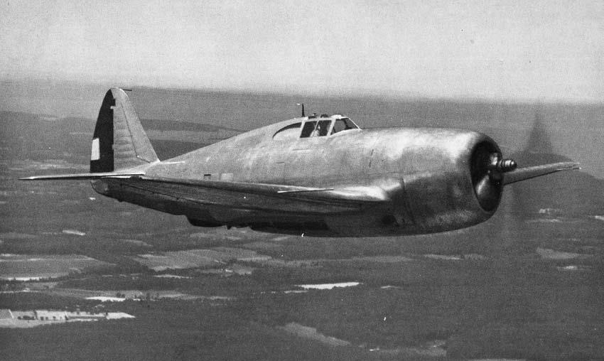

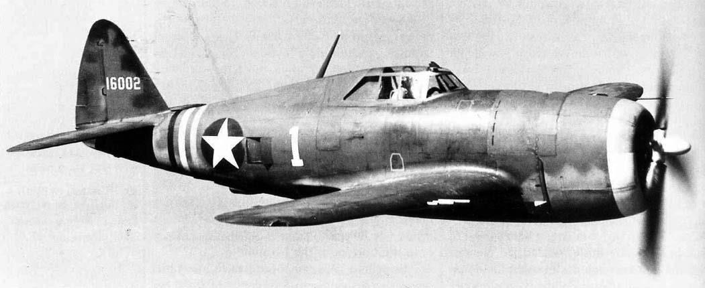

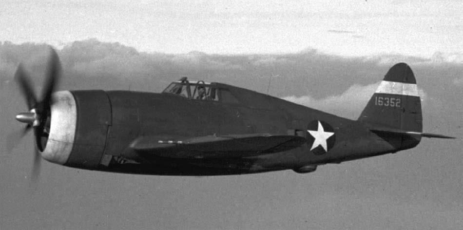

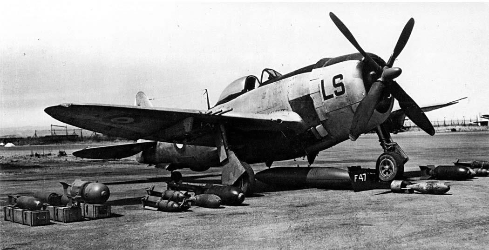

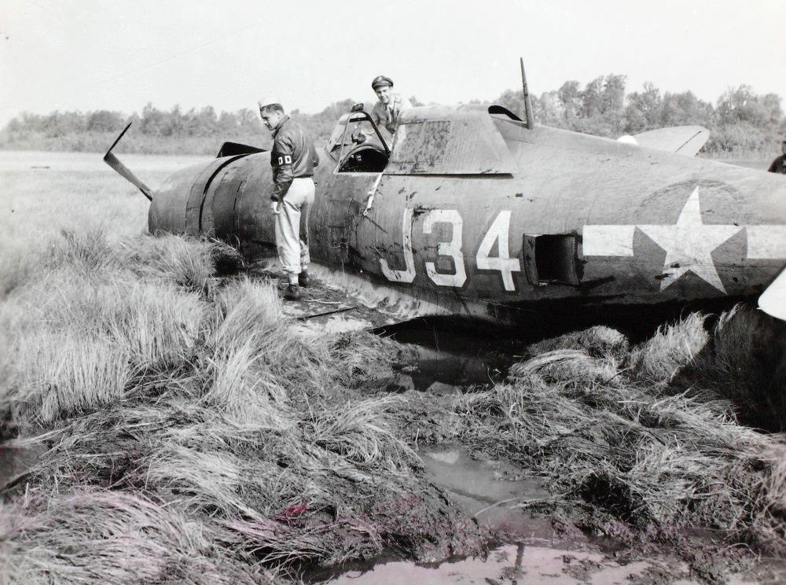

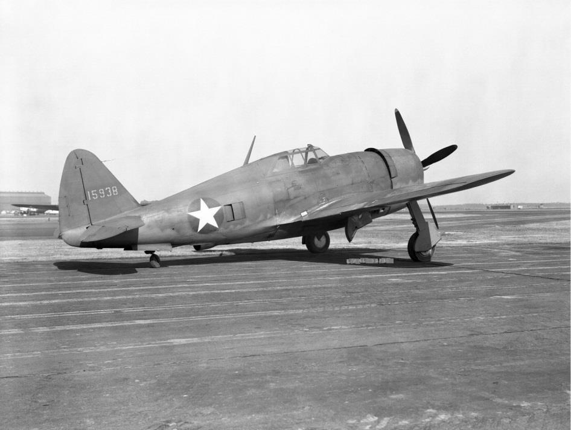

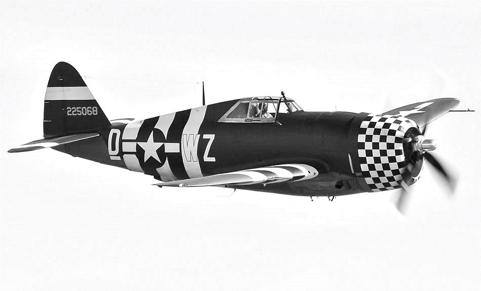

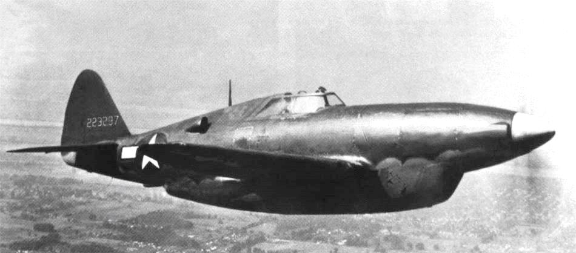

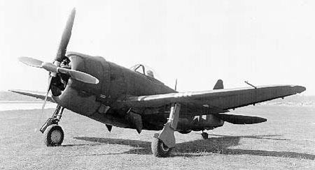

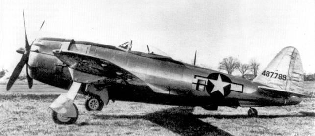

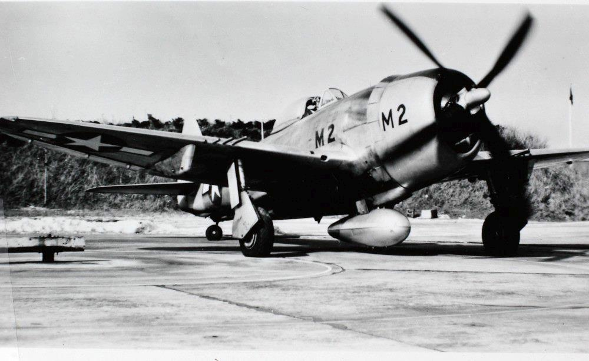

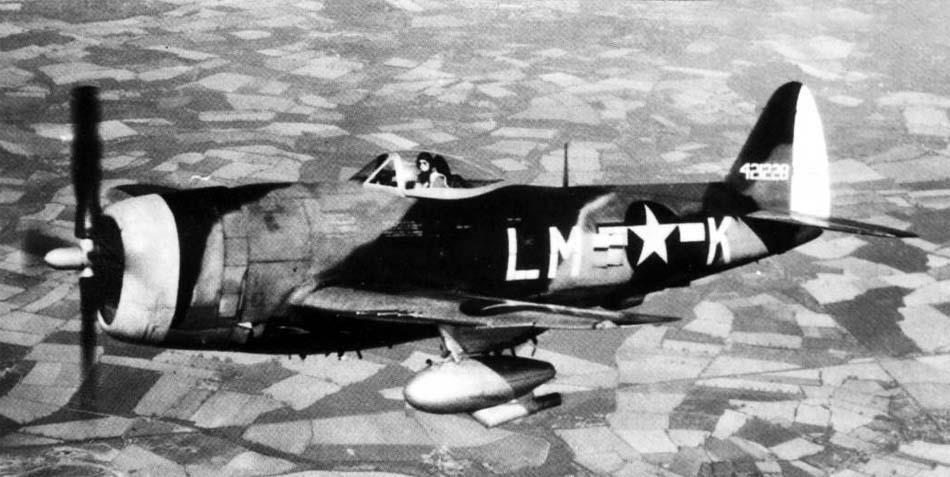

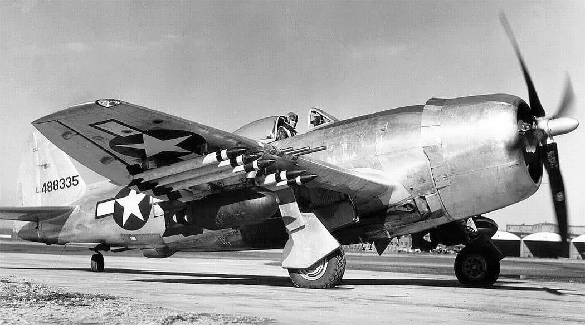
