# Кабина

Данный раздел ознакомит вас с приборным оборудованием кабины P-47D. Для уверенного
пилотирования вам следует хорошо усвоить назначение и расположение всех органов
управления и приборов в кабине самолета.

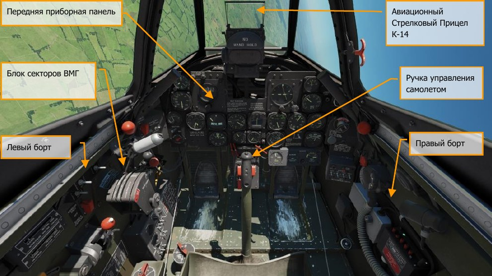

Кабину P-47D можно условно разделить на шесть основных частей:

1. левый борт с расположенными на нем главным щитком, триммерами управляющих
поверхностей, органами управления створками радиатора и интеркулера, и др.
2. блок секторов ВМГ, на котором размещены РУД, рычаг управления РПО, рычаг
управления ТК и корректор топливной смеси;
3. передняя приборная панель, на которой расположены прицел K-14, приборная
панель, передняя панель переключателей и коробка автомата постоянных оборотов;
4. Авиационный стрелковый прицел К-14;
5. ручка управления самолетом (РУС);
6. правый борт с расположенным на нём коммуникационным и кислородным
оборудованием.

## Левый борт

На левой стороне кабины расположены органы управления двигателем и механизацией, блок
управления автоматом постоянных оборотов и главный щиток с различными переключателями.

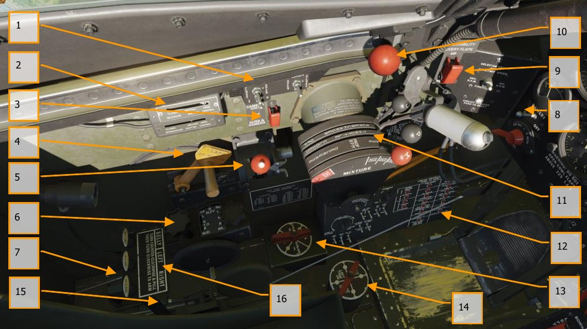

1. Переключатели управления фонарем, интеркулером и маслорадиатором.
2. Индикаторы положения створок интеркулера и маслорадиатора.
3. Предохранительный переключатель фотокинопулемета/пулеметов и прицела.
4. Рычаг управления закрылками.
5. Рычаг крана шасси.
6. Блок управления триммерами.
7. Рычаг подачи воздуха в карбюратор.
8. Блок управления автоматом постоянных оборотов.
9. Переключатель управления щитками вывода из пикирования
10. Ручка открытия фонаря в ручном режиме.
11. Блок секторов винто-моторной группы (ВМГ).
12. Щиток коммутации.
13. Селекторный клапан переключения топливных баков
14. Селекторный кран переключения ПТБ
15. Ручка управления воздушным фильтром
16. Блок управления взрывателями

### Рычаг подачи воздуха в карбюратор

Данный рычаг используется для подачи дополнительного горячего воздуха в карбюратор в
холодную пору или в условиях обледенения и по умолчанию установлен в позиции COLD.

- COLD (Холодный). Подача холодного воздуха в карбюратор.
- HOT (Горячий). Подача горячего воздуха в карбюратор.

### Ручка управления воздушным фильтром

Ручка управляет подачей воздуха в кабину через противопыльный воздушный фильтр и
используется в условиях повышенной запыленности.

Ручка имеет 2 позиции:

- ON. Подаваемый воздух в кабину будет проходить через специальный воздушный
фильтр.
- OFF. Подача воздуха в кабину происходит в обход воздушного фильтра.

### Предохранительный переключатель пулеметов

Данный переключатель управляет фотокинопулеметом (камерой), пулеметами и подает питание
на цепи стрелкового прицела К-14.

Фотокинопулемет установлен в передней кромке крыла и работает одновременно с пулеметами.
Камера фотокинопулемета может функционировать и независимо от пулеметов.

Переключатель имеет три положения:

- CAMERA ONLY (только камера и прицел)
- OFF – питание вооружения, камеры и прицела снято
- GUNS & CAMERA (пулеметы, камера, прицел)

В целях безопасности на стоянке, питание на соленоиды спусковых устройств пулеметов
блокируется рукояткой крана шасси и может быть подано только при верхнем положении
крана, когда шасси убраны.

Дополнительно, цепи питания пулеметов защищены 1 АЗС главного реле пулеметов и камеры,
а также, четырьмя АЗС в цепях соленоидов спусковых устройств пулеметов.

!!! note "Примечание"
    Фотокинопулемет в DCS: P-47D не реализован.

### Индикаторы положения створок интеркулера и маслорадиатора

Индикаторы, показывающие положение створок интеркулера (дверцы панелей с каждой
стороны фюзеляжа) и маслорадиатора находятся слева в кабине и имеют 3 отметки: CLOSED
(закрыты), NEUTRAL (промежуточное положение) и OPEN (открыты). Электропривод створок
управляется с помощью переключателей, установленными рядом с индикаторами (справа
впереди, не показано на рисунке ниже).

На взлёте створки маслорадиатора и интеркулера устанавливаются в нейтральное положение.
Во время полёта с их помощью управляют температурой масла и воздуха в карбюраторе согласно показаниям приборов.

Штатный полет выполняется с створками интеркулера, установленными в позицию OPEN. Но в
холодную погоду может понадобиться установить створки в промежуточные положения или
даже CLOSE для обеспечения температуры смеси на уровне 25ОС. Обычное положение створок
на скоростях выше 350 миль/ч. - NEUTRAL.

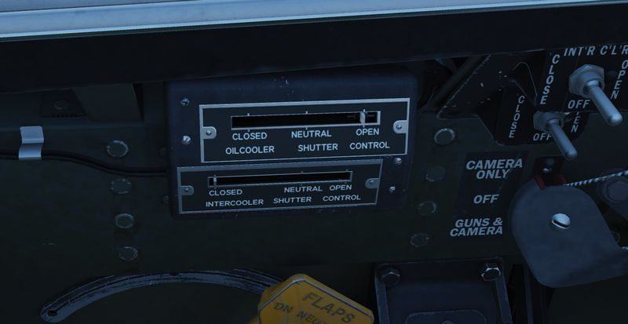

### Рычаг крана шасси

Выпуск и уборка шасси осуществляются с помощью рычага, установленного на левом борту слева
от пилота. С помощью белой кнопки рычаг может быть установлен в позицию UP (Уборка) или
DN (Выпуск). Подпружиненная предохранительная защелка справа от ручки используется для
предотвращения случайной уборки шасси.

При изменении позиции данного рычага, кроме аварийных случаев, очень важно дождаться
окончания цикла выпуска/уборки шасси.

Нейтральное положение рычага используется в случае отказа гидравлической системы из-за
потери жидкости. После полного выхода шасси и установки их на замки, желательно выпустить
посадочные закрылки.

### Рычаг управления закрылками

Данный рычаг выполняет управления посадочными закрылками и имеет 3 положения:

- Вперед – уборка посадочных закрылков
- Центр – остановка выпуска/уборки закрылков
- Назад – выпуск посадочных закрылков

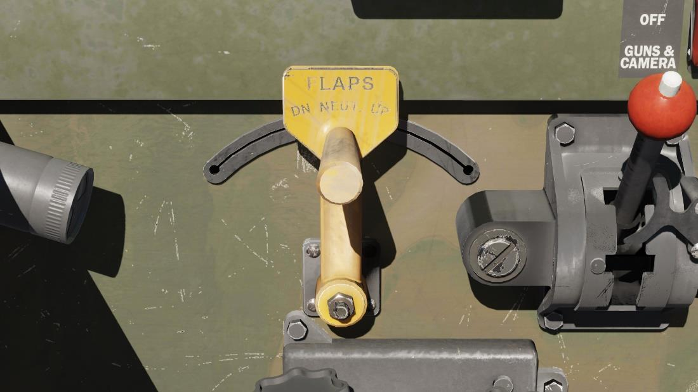

Максимальный угол выпуска закрылков составляет 40 гр. Для более точной установки угла
выпуска закрылков используются отметки, которые нанесены в левом верхнем углу левого
закрылка и соответственно, в правом верхнем углу правого закрылка. Эти маркеры хорошо
видны из кабины.

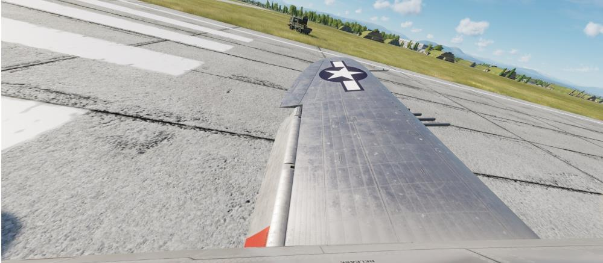

### Блок управления триммерами

В данной секции находятся триммеры рулей высоты, направления и элеронов.

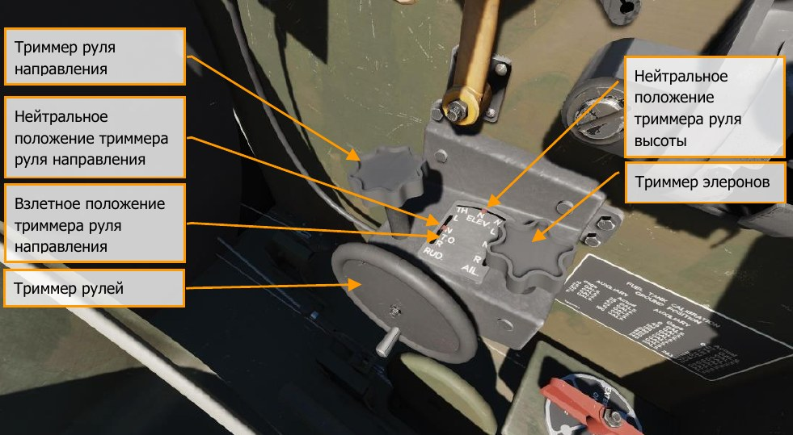

Триммер рулей высоты. Данный регулятор используется для триммирования самолета по
тангажу. Поверните колесо по часовой стрелке чтобы опустить нос самолета на пикирование.
Отметки TH (Tail Heavy – На кабрирование), N (Neutral – Нейтраль) и NH (Nose Heavy – На
пикирование) показывают положения триммирующих поверхностей. Красный указатель
отображает текущую позицию триммера рулей высоты (РВ).

Триммер руля направления. Данный регулятор управляет триммирующей поверхностью руля
направления. Индикаторы, помеченные как L (Left – Влево), N (Neutral – Нейтраль), TO (Takeoff
– Взлет) и R (Right – Вправо) индицируют позиции триммирующей поверхности. Красный
указатель отображает текущую позицию триммера руля направления (РН). При выполнении
взлета триммер руля направления устанавливается в позицию TO.

Триммер элерона. Данный регулятор управляет триммером элерона, который расположен на
левом элероне. Для того, чтобы увеличить крен вправо поверните данный регулятор по часовой
стрелке. Указатели L (Left – Влево), R (Right – Вправо) и N (Neutral – Нейтраль) индицируют
позиции триммирующей поверхности. Красный указатель отображает текущую позицию
триммера элеронов.

!!! note "Примечание"
    Будьте осторожны при использовании триммеров, поскольку они чрезвычайно
    чувствительны.

### Автоматика постоянных оборотов винта

Управление воздушным винтом на самолете P-47D осуществляется как рычагом на блоке
секторов ВМГ оборотов винта, так и посредством блока автоматики оборотов (на рисунке), на
котором установлен предохранитель (АЗС) и переключатель режима винта.

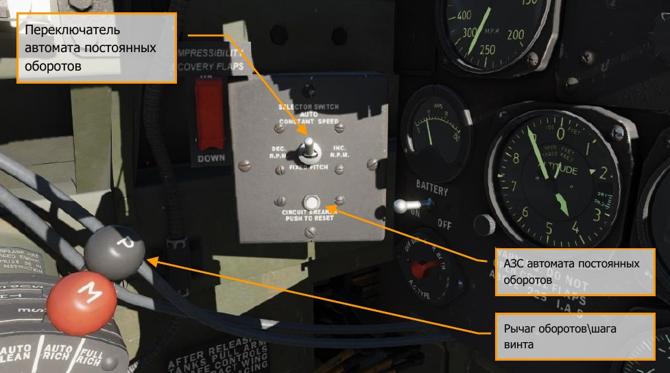

Переключатель AUTO CONSTANT SPEED на блоке управления имеет 4 положения:

- AUTO CONSTANT SPEED. В данной фиксированной позиции регулятор оборотов
воздушного винта автоматически поддерживает заданные рычагами управления на
блоке секторов ВМГ. Рычажок переключателя в этой позиции фиксируется.
- INCREASE RPM. Данная позиция нефиксированная и увеличивает шаг винта.
- DECREASE RPM. Данная позиция нефиксированная и уменьшает шаг винта.
- FIXED PITCH. При нахождении рычажка переключателя в этой фиксированной
позиции регулятор сохраняет шаг винта в положении, заданном с помощью рычага
управления шагом винта на блоке секторов ВМГ.

### Переключатель управления щитками вывода из пикирования

Данный переключатель используется для выпуска и уборки специальных щитков, облегчающих
вывод самолеты из пикирования на больших углах. Переключатель имеет 2 позиции:

- UP (Уборка). В данной позиции происходит уборка щитков.
- DOWN (Выпуск). В данной позиции происходит выпуск щитков.

Угол выпуска щитков вывода из пикирования составляет 21^о^.

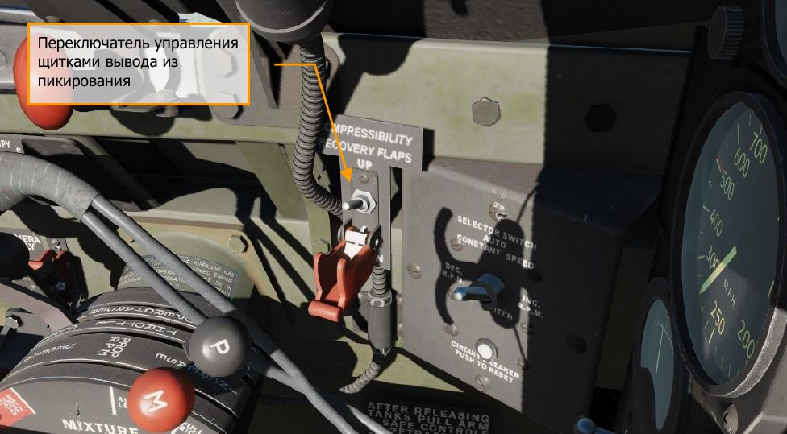

### Щиток коммутации

На данном щитке размещены переключатели и АЗС различных систем с электрическим
управлением. Реостаты управляют яркостью прицела, компаса и подсветкой приборной панели,
различной символики.

С помощью переключателей на данной панели можно управлять внешним освещением, а также
осуществлять выпуск/уборку посадочной фары, которая размещена в нижней секции левого
крыла.

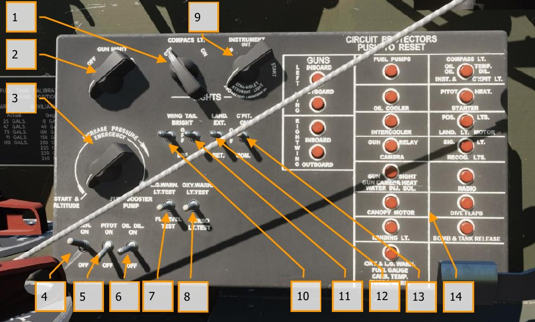

1. Реостат яркости компаса.
2. Реостат яркости прицела.
3. Реостат интенсивности подачи топлива.
4. Тумблер включения генератора.
5. Тумблер подогрева трубки Пито.
6. Тумблер разжижения масла.
7. Переключатель контроля лампы состояния шасси и светосигнальной лампы
индикатора уровня топлива.
8. Переключатель контроля лампы низкого остатка кислорода и превышения оборотов
турбокомпрессора.
9. Реостат подсветки приборной панели.
10. Переключатель управления аэронавигационными огнями, установленными на
законцовках крыла.
11. Переключатель управления аэронавигационными огнями, установленными в
хвостовой части.
12. Переключатель управления посадочной фарой. С помощью данного переключателя
осуществляется выпуск/уборка посадочной фары, установленной под левым крылом.
Максимальная скорость самолета при выпуске посадочной фары составляет 200
миль/ч.
13. Переключатель управления подсветкой в кабине.
14. Блок АЗС (автоматов защиты сети) различных устройств и систем.

### Селекторный клапан переключения топливных баков

С помощью селекторного клапана переключения топливных баков осуществляется выбор
топливного бака, из которого будет производиться подача топлива в двигатель. Клапан имеет
четыре фиксированных положения:

- MAIN. Включение подкачивающего насоса главного бака.
- AUXILIARY. Включение подачи топлива и насоса вспомогательного бака.
- EXTERNAL. Включение подачи топлива из внешних ПТБ.
- OFF. Отключение подачи топлива и всех топливных насосов.

!!! note "Примечание"
    Указательным является короткое плечо рукоятки селектора.

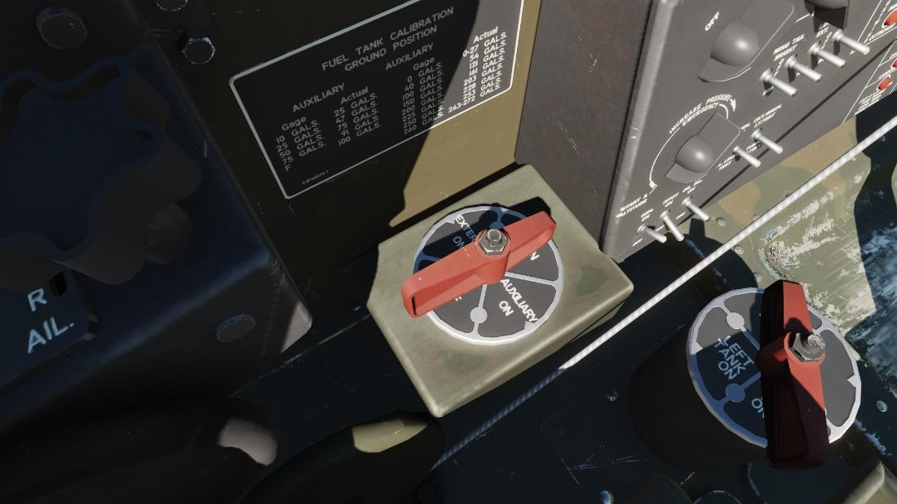

### Селекторный клапан переключения ПТБ

Данный селекторный клапан осуществляет управление подачей топлива из ПТБ и имеет 4
позиции:

- OFF. Отключение подачи топлива из ПТБ.
- BELLY. Включение подачи топлива из подфюзеляжного ПТБ.
- RIGHT TANK. Включение подачи топлива из правого подкрыльевого ПТБ.
- LEFT TANK. Включение подачи топлива из левого подкрыльевого ПТБ.

!!! note "Примечание"
     Указательным является короткое плечо рукоятки селектора.

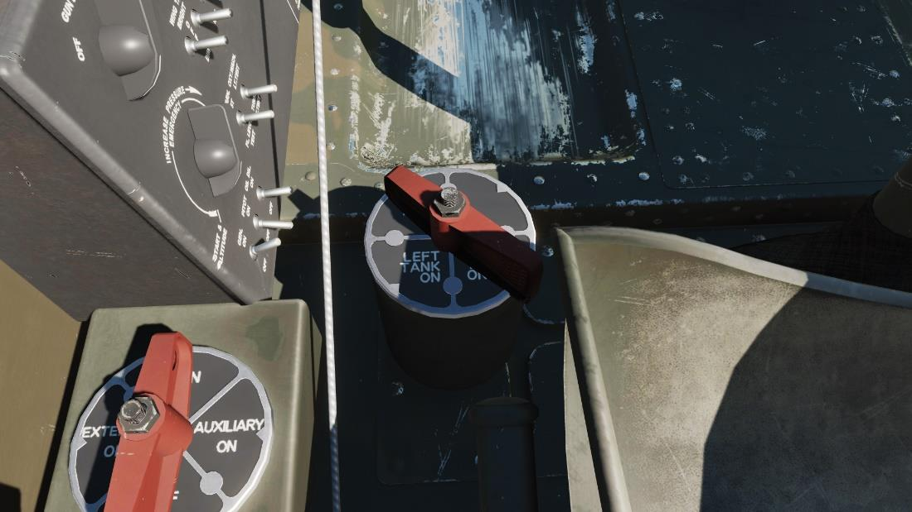

### Переключатели управления фонарем, интеркулером и маслорадиатором

Переключатель CANOPY. Управляет открытием и закрытием фонаря самолета. Для того,
чтобы закрыть фонарь, установите данный переключатель в позицию CLOSE и дождитесь
полного закрытия фонаря. Чтобы открыть фонарь кабины, установите данный переключатель в
позицию OPEN и дождитесь полного открытия фонаря.

Переключатель INTRCLR. Управляет створками интеркулера и имеет 3 позиции:

- OFF. Остановка и фиксация наружных створок интеркулера.
- OPEN. Движение створок на открытие.

- CLOSE. Движение створок на закрытие.

Переключатель OIL CLR. Управляет створками маслорадиатора и его функционирование
аналогично управлению створками интеркулера.

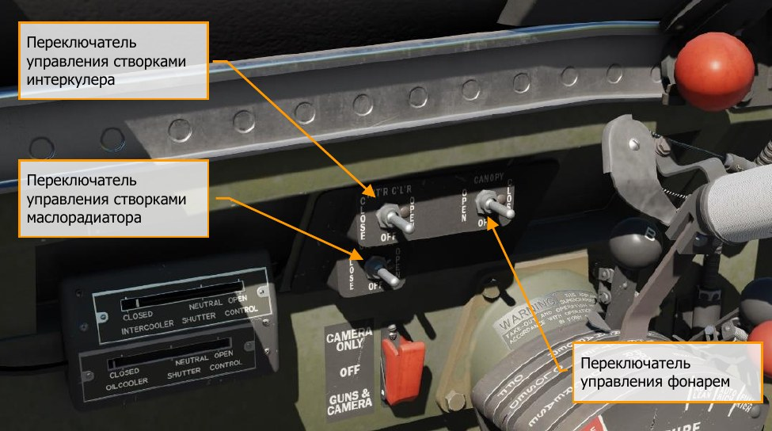

### Блок управления взрывателями

Данный блок состоит из трех рукояток, которые используются для взведения бомбового
вооружения.

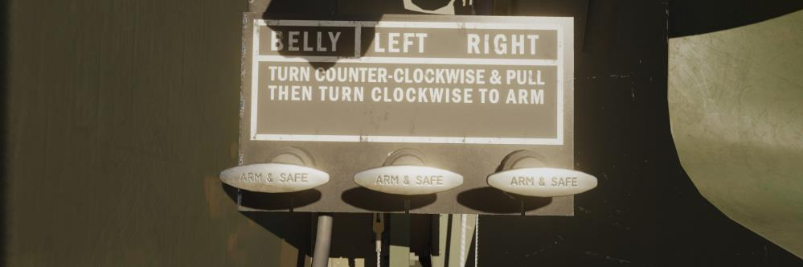

- BELLY. Взведение АБСП, установленного на подфюзеляжной точке подвески.
- LEFT. Взведение АБСП, установленного на левой крыльевой точке подвески.
- RIGHT. Взведение АБСП, установленного на правой крыльевой точке подвески.

Чтобы выполнить взведение боеприпаса нужно повернуть ручку против часовой стрелки на 90,
затем потянуть вверх на себе и повернуть на 90 по часовой стрелке.

## Приборы и органы управления на передней панели

Большинство приборов, за исключением приборов контроля подачи кислорода и давления в
гидросистеме (которые расположены на отдельной панели), установлены на антивибрационной
подпружиненной панели перед сиденьем пилота.

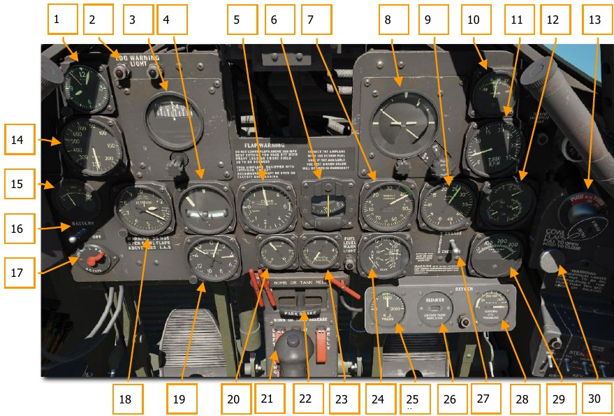

1. Часы
2. Индикаторы состояния шасси
3. Гирокомпас
4. Указатель крена и скольжения
5. Указатель вертикальной скорости
6. Магнитный компас
7. Указатель давления наддува
8. Авиагоризонт
9. Тахометр
10. Указатель температуры воздуха в карбюраторе
11. Тахометр турбокомпрессора и лампа превышения оборотов
12. Комбинированный трехстрелочный указатель температуры топлива, давления в топливной
и масляной системе
13. Праймер – ручка заливного насоса.
14. Указатель воздушной скорости
15. Амперметр
16. Выключатель аккумуляторной батареи
17. Переключатель управления зажиганием (Магнето)
18. Высотомер
19. Указатель перегрузки
20. Вакуумметр
21. Панель управления подвесным вооружением/ПТБ
22. Ручка управления стояночным тормозом
23. Указатель давления водно-метаноловой смеси
24. Топливомер
25. Указатель давления в гидросистеме
26. Указатель расхода кислорода
27. Переключатель управления стартером
28. Указатель давления в кислородной системе
29. Указатель температуры цилиндров
30. Рукоятка управления створками капота

### Часы

Часы установлены в верхней левой части передней приборной панели. Для установки стрелок
необходимо вытянуть на себя соответствующую ручку (в нижнем левом углу прибора), и
вращая ее, перевести стрелки на текущее время, после чего вернуть рукоятку в исходное (от
себя) положение.

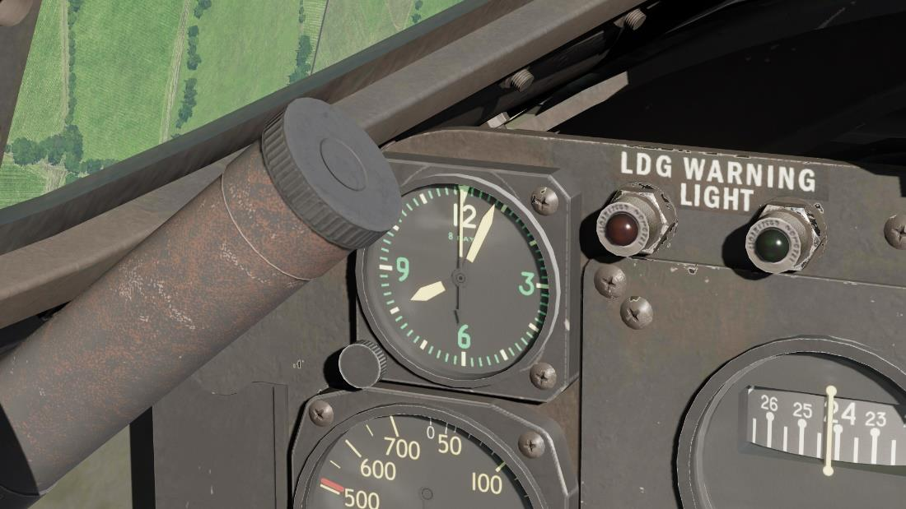

### Индикаторы состояния шасси

Данные светосигнальные индикаторы обеспечивают отображение положения стоек шасси. Если
горит зеленая лампа – шасси выпущены и установлены на замки.

Красная лампа загорается для привлечения внимания пилота, если:

- шасси не встали на замки
- шасси убрано, а РУД переведен на ¾ хода сектора назад. Это сделано для того, что
бы напомнить пилоту о шасси при заходе на посадку.

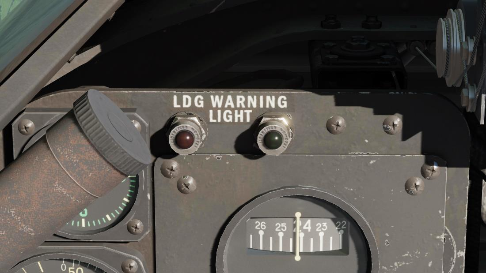

### Гирокомпас (гирополукомпас)

Гирокомпас используется для выполнения прямолинейного полета по заданному курсу. Данный
прибор не магнитный. Относительное перемещение самолета влево/вправо контролируется по
шкале подвижной картушки, проградуированной в градусах аналогично шкале компаса. Прибор
снабжен рукояткой арретирования (блокировки). В нормальных условиях полета прибор
должен быть разарретирован (разблокирован). Ручная коррекция курса осуществляется
нажатием и последующим вращением рукоятки арретирования в соответствующем
направлении. Он требует первоначальной выставки (alignment) и легко может утратить
начальную ориентацию при интенсивном маневрировании. Поэтому в полете, требует
регулярной выставки путем арретирования.

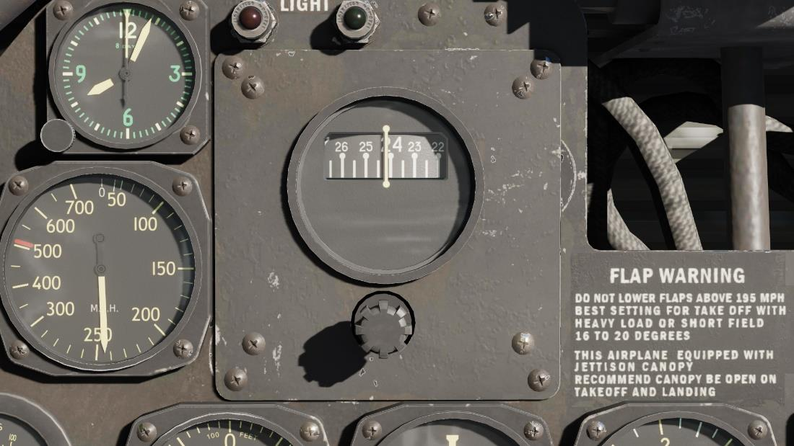

### Указатель крена и скольжения

Указатель Крена и Скольжения AN5820 включает в себя гироскопический указатель крена и
жидкостный указатель скольжения.

Указатель скольжения представляет собой свободный шарик, помещенный в заполненную
жидкостью изогнутую трубку.

Шарик изменяет свое положение в соответствии с действующими на него силой тяжести и
силами инерции. Чтобы минимизировать боковое скольжение в полете удерживайте шарик
между двумя метками в центре.

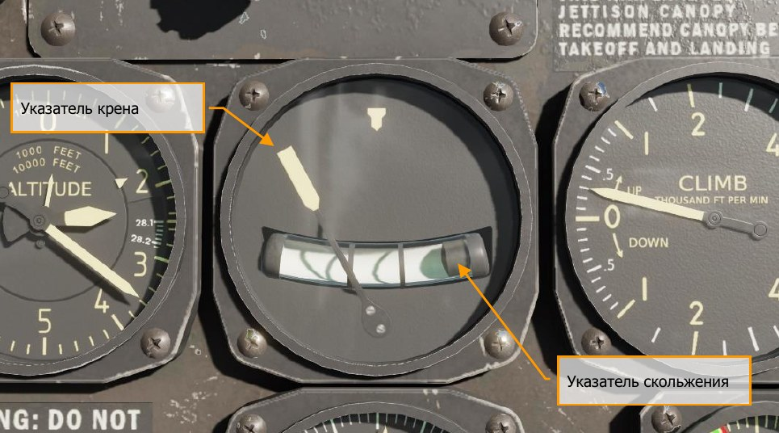

### Указатель вертикальной скорости (вариометр)

Указатель вертикальной скорости предназначен для индикации скорости изменения высоты
полёта. На табло прибора нанесены шкалы скорости набора и снижения. Каждая шкала
проградуирована от 0 до 6000 и показывает вертикальную скорость в футах в минуту (fpm).
Цена деления шкалы между значениями от 0 до 1000 футов составляет 100 футов, в остальном
интервале – 500 футов. Вариометр используется для удержания постоянной высоты в процессе
разворотов, а также для обеспечения определенной постоянной вертикальной скорости набора
высоты или снижения при полете по приборам.

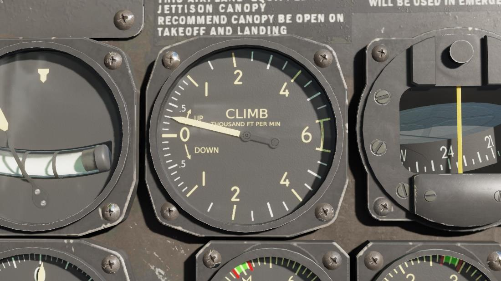

### Магнитный компас

Магнитный компас остался и используется в качестве вспомогательного инструмента во время
полета и для проверки правильной ориентации гирокомпаса.

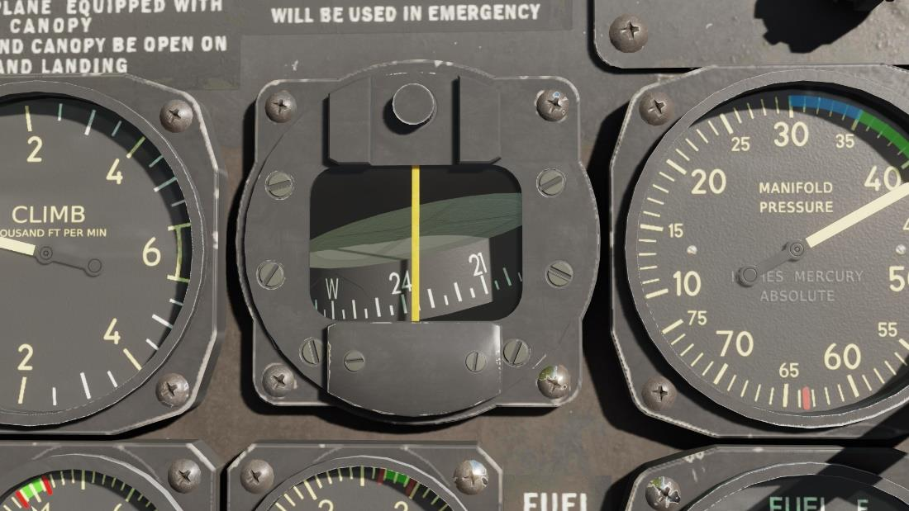

### Указатель наддува

Указатель давления во впускном коллекторе используется для контроля требуемого режима
работы двигателя, задаваемого рычагами управления дроссельной заслонкой (дросселем) и
турбокомпрессором.

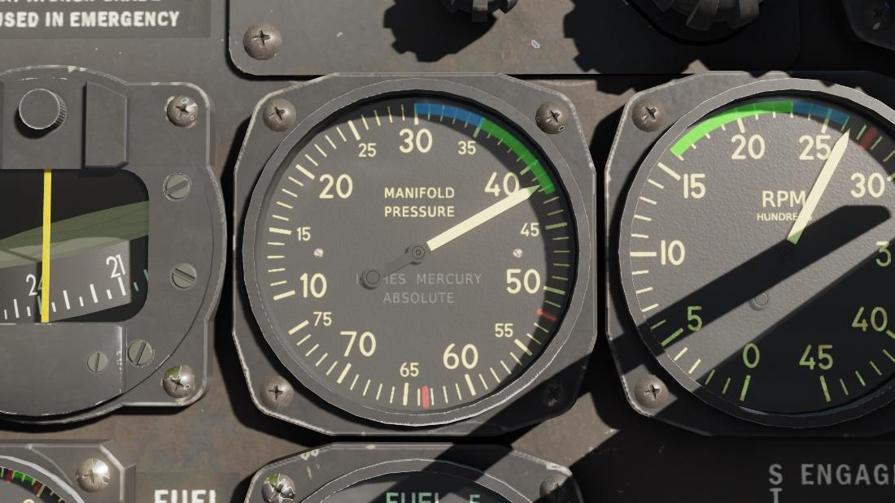

Указатель давления наддува является анероидным манометром абсолютного давления. Прибор
измеряет давление в дюймах ртутного столба (inHg), и проградуирован от 10 до 75 inHg. Цена
деления шкалы – 1 inHg. Зеленым цветом обозначен нормальный рабочий диапазон от 35 до 42
inHg. Красной чертой обозначено давление, соответствующее Боевому Режиму работы
двигателя – 64 inHg.

### Авиагоризонт

Авиагоризонт (Индикатор Гироскопического Горизонта) выполнен в виде горизонтальной
планки (линии горизонта) подключенной к гироскопу. Авиагоризонт используется при полете
по приборам и отображает продольное и поперечное (в вертикальной плоскости) положения
самолета. Горизонтальная планка указывает тангаж до 60° и крен до 100°. Штрих в верхней
части прибора указывает угол крена по шкале, проградуированной от 0° до 90° с шагом 30°.
Ручка арретира предназначена для арретирования прибора. Чтобы арретировать авиагоризонт,
необходимо потянуть ручку на себя и повернуть против часовой стрелки в позицию OFF. Для
того чтобы разарретировать прибор, необходимо потянуть ручку на себя и повернуть по
часовой стрелке в позицию ON.

### Тахометр

Тахометр обеспечивает измерение частоты вращения коленчатого вала двигателя. Прибор
проградуирован от 0 до 4500 оборотов в минуту (RPM). Цена деления шкалы – 100 RPM.
Зеленым цветом обозначен нормальный рабочий диапазон от 1600 до 2300 RPM. Красной
чертой обозначены максимальные допустимые (нормальные) обороты – 2750 RPM. Совместно с
индикатором наддува (давления во впускном коллекторе) и тахометром ТК дает полную
информацию о текущем режиме и нагрузке на двигатель.

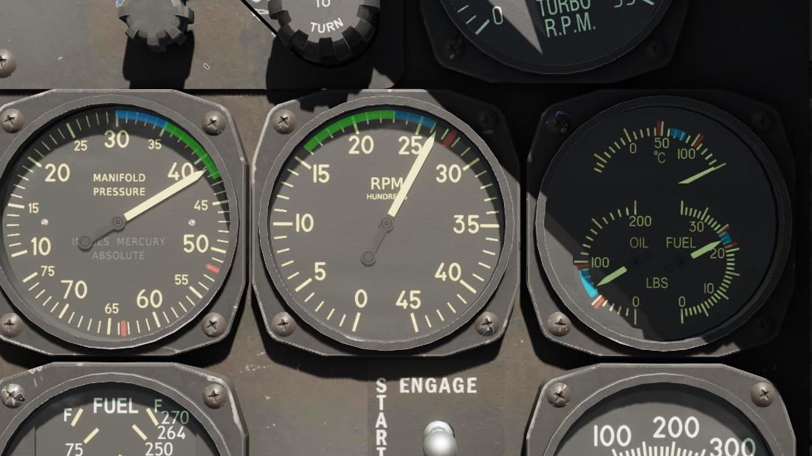

### Указатель температуры воздуха на входе в карбюратор

Указатель температуры на входе в карбюратор измеряет температуру воздуха, проходящего
через воздухозаборник карбюратора. Прибор показывает температуру в градусах Цельсия (°C) и
проградуирован от -70°С до +150°C. Цена деления шкалы – 10°C. Зеленым цветом обозначен
диапазон нормальных рабочих температур от 10°С до 20°C. Красной чертой обозначена
максимальная допустимая температура, равная 50°C.

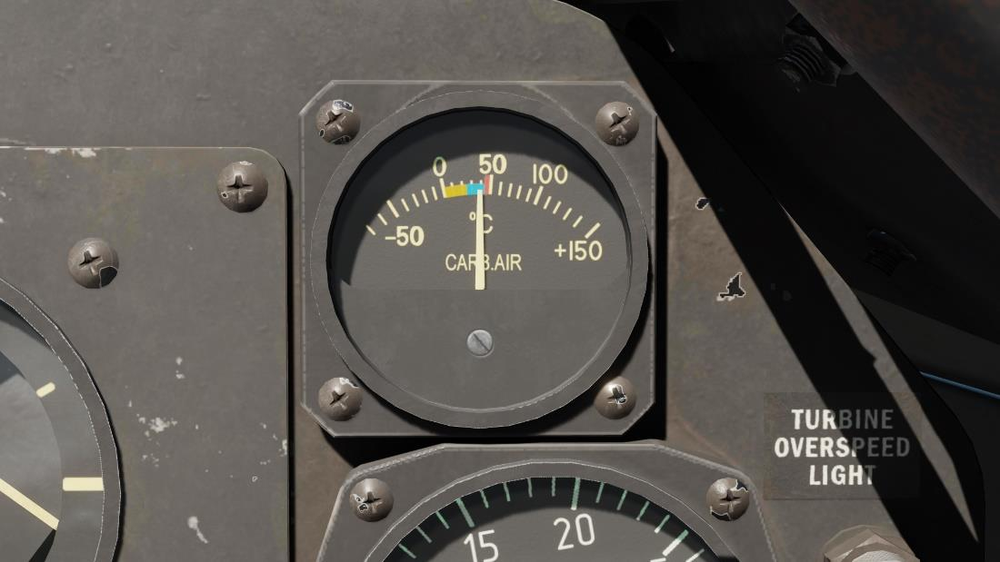

### Тахометр турбокомпрессора

Самолет оборудован тахометром и предупредительной светосигнальной лампой превышения
оборотов турбокомпрессора. Максимально допустимое значение оборотов турбокомпрессора
составляет 22000 об./мин. После превышения данной отметки загорается красная
предупредительная лампа, которая сигнализирует о необходимости уменьшить обороты
турбокомпрессора.

Данный указатель служит для отображения оборотов турбокомпрессора и проградуирован от 0
до 35 000 об./мин. Цена деления шкалы тахометра – 1 000 об./мин.

### Комбинированный указатель температуры топлива, давления и температуры масла

Прибор включает в себя три указателя: температуры масла; давления масла и давления
топлива.

Указатель температуры масла. Занимает верхнюю половину комбинированного прибора.
Указатель измеряет температуру масла в градусах Цельсия (°C) и проградуирован от -70° до
+150°C. Цена деления шкалы – 10°C. Синим цветом обозначен диапазон нормальных рабочих
температур от 65°С до 80°C. Красной отметкой обозначена максимальная допустимая
температура, равная 100°C.

Указатель давления масла. Находится в нижней левой части комбинированного прибора.
Указатель измеряет давление масла в фунтах на квадратный дюйм (PSI) и проградуирован от 0
до 200 PSI. Цена деления шкалы – 10 PSI. Синим цветом обозначен диапазон нормального
рабочего давления от 60 до 90 PSI. Красными отметками обозначены соответственно
минимальные – 50 PSI и максимальные – 90 PSI допустимые значения давления.

Указатель давления топлива. Расположен в нижней правой части комбинированного
прибора. Указатель измеряет давление топлива в фунтах на квадратный дюйм (PSI) и
проградуирован от 0 до 40 PSI. Цена деления шкалы – 1 PSI. Синим цветом обозначен
диапазон нормального рабочего давления от 21 до 25 PSI. Красными отметками обозначены
соответственно минимальные – 21 PSI и максимальные – 25 PSI допустимые значения
давления.
Указатель
температуры масла

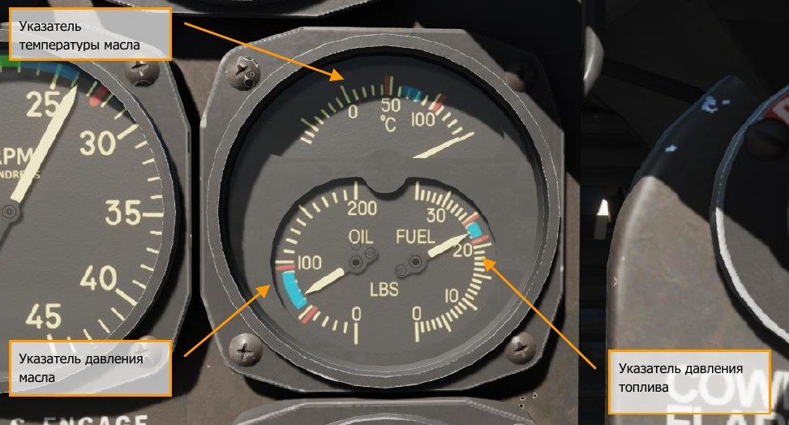

### Амперметр

Амперметр размещен на передней панели над переключателем управления аккумуляторной
батареей и служит для измерения силы тока генератора. Прибор проградуирован от 0 до 150А.
Цена деления шкалы амперметра составляет 10А.

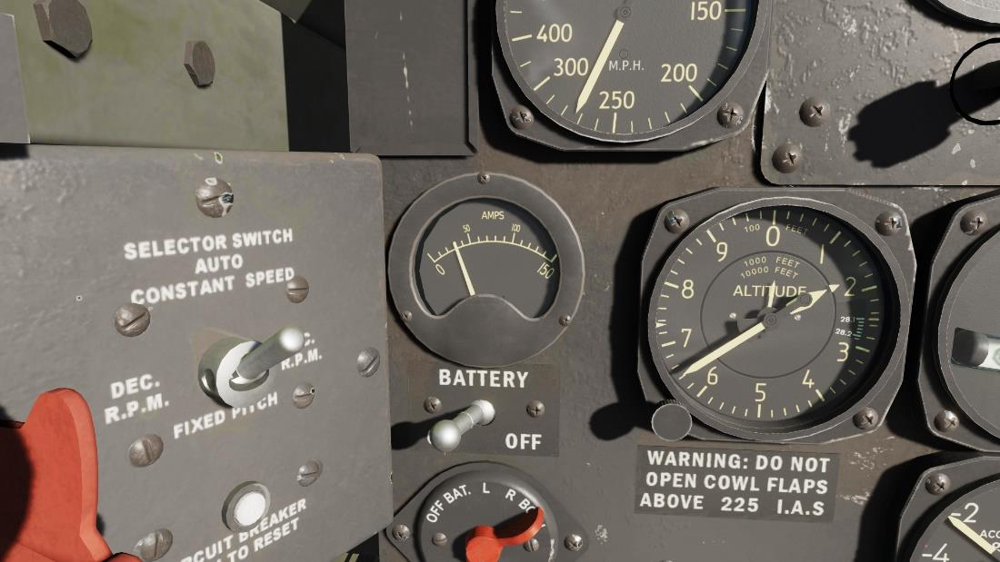

### Указатель воздушной скорости

Указатель воздушной скорости – это манометр, измеряющий разницу между давлением
скоростного напора воздуха в трубке Пито и статическим давлением. Прибор показывает
воздушную скорость (IAS) и проградуирован в милях в час от 0 до 700 миль/ч (mph). В
диапазоне от 50 до 300 миль/ч цена деления составляет 10 миль/ч, для больших значений – 50
миль/ч. Красная метка указывает на максимальную допустимую приборную скорость на
высотах до 5,000 футов (ft) равную 505 миль/ч.

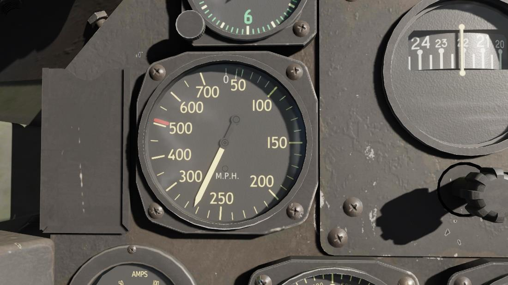

### Высотомер

Высотомер определяет высоту полета путем измерения атмосферного давления. Прибор имеет
3 стрелки и 2 индекса; самая короткая стрелка указывает высоту в десятках тысяч футов,
средняя – в тысячах футов, и самая длинная – в сотнях футов. Например, на рисунке ниже
значение высоты соответствует ~1 650 футам.

В правой части прибора имеется так называемое окно Колсмана, в котором отображается
шкала значений атмосферного давления над уровнем моря в дюймах рт. ст. (inHg). Установка
необходимого давления осуществляется вращением соответствующей рукоятки,
расположенной в нижнем левом углу высотомера.

Индексные треугольные маркеры связаны прямой зубчатой передачей с механизмом и шкалой
установки давления (окно Коллсмана) и показывают на приборе референс барометрической
высоты, соответствующий стандартному атмосферному давлению (МСА, англ. ISA).

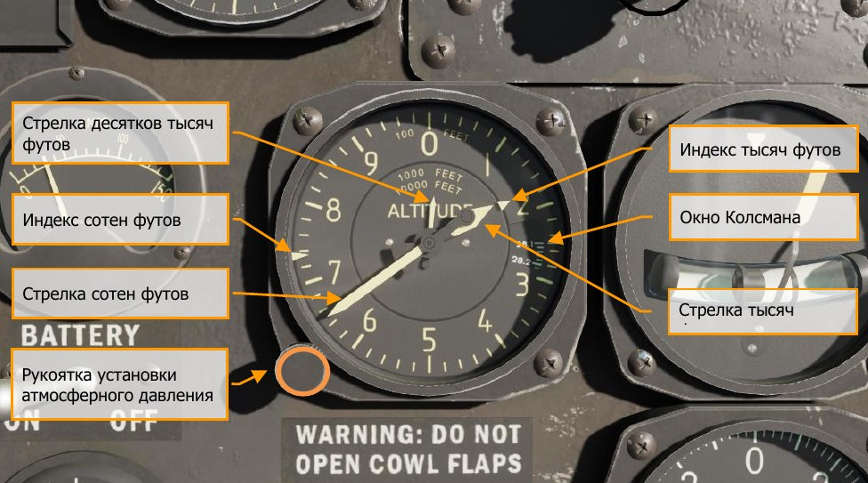

Индексные марки на шкалах высотомера служат для совместимости с устаревшим на момент
начала войны способом задания барометричекой высоты аэродрома через саму высоту. С
появлением барометрического окна Коллсмана на высотомерах, полезность индексов
постепенно утратила свое значение.

### Индикатор перегрузки

Индикатор перегрузки (Акселерометр) отображает перегрузку самолета. Прибор проградуирован
от -5 до 12G с ценой деления шкалы – 1G и имеет три стрелки, указывающие на значения
соответственно текущей перегрузки, предельно достигнутых положительных и отрицательных
перегрузок, зафиксированных с момента крайнего обнуления показаний. Сброс (обнуление)
показаний осуществляется поворотом ручки сброса перегрузки (в нижнем левом углу прибора).
Двумя красными метками обозначены предельно допустимые перегрузки -4G и +8G.

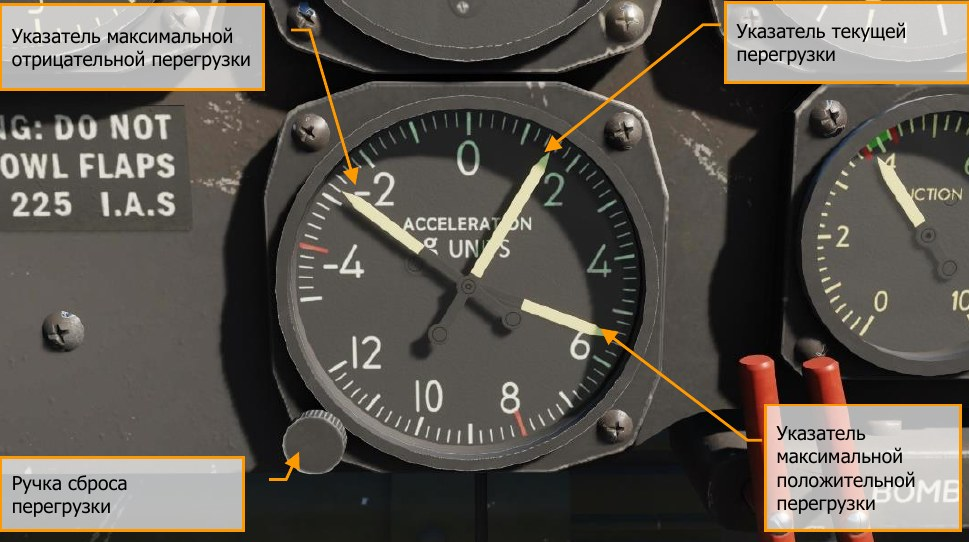

### Вакуумметр

Вакуумметр показывает создаваемое вакуумным насосом разряжение в системе. Шкала
прибора проградуирована в единицах давления от 0 до 10 дюймов рт. ст. (inHg) с шагом в 0,2
д. рт. ст. При показаниях ниже 3,85 и выше 4,15 давление находится за пределами нормальных
значений и показания приборов с вакуумным приводом считаются недостоверными.
Нормальное значение вакуума в системе – 4.00 дюйма рт. ст. (inHg).

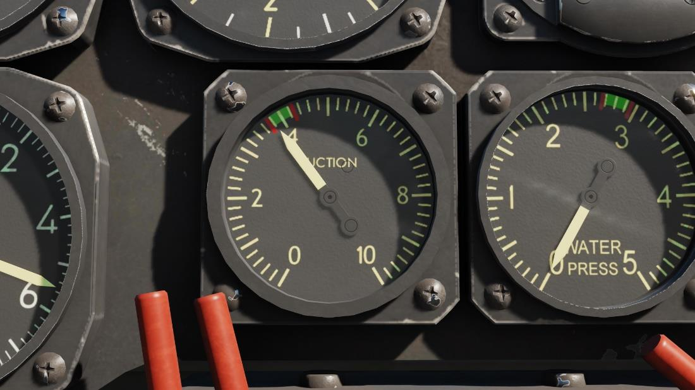

### Указатель давления водно-метаноловой смеси

Отображает текущее давление в системе впрыска водно-метаноловой смеси. Манометр
проградуирован от 0 до 50 psi. Цена деления шкалы составляет 1 psi.

Нормальное давление в системе впрыска водно-метаноловой смеси составляет 25-27 psi.

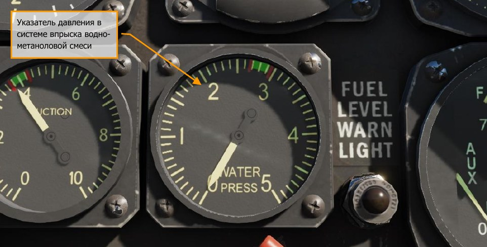

### Топливомер

Прибор показывает остаток топлива в главном (правая шкала) и вспомогательном (левая шкала)
топливных баках. Правильная индикация достигается при горизонтальном полете. Вместимость
главного топливного бака – 270 галлонов, вспомогательного – 100 галлонов.

Красная лампа в левом углу загорается при остатке топлива в главном баке от 40 и меньше
галлонов. Измерение количества топлива в ПТБ не предусмотрено.

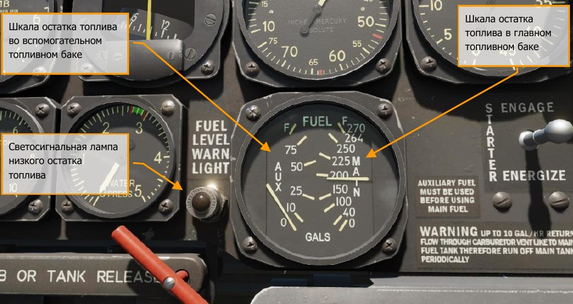

Для расчета остатка топлива при нахождении самолета на земле используется таблица,
размещенная на левой стенке кабины справа от блока управления триммерами.
Таблица поправок указателя уровня топлива при нахождении на земле.

Вспомогательный бак (гал)

Показания датчика | Фактический остаток
------------------|--------------------
10 | 25 
25 | 47 
50 | 75 
70 | 91 
Полный бак | 100

Основной бак (гал)

Показания датчика | Фактический остаток
------------------|--------------------
0   | 0-27
40  | 54
100 | 121
150 | 161
200 | 203
225 | 228
250 | 253
260 | 263-270

### Указатель давления в гидросистеме

Указатель давления в гидросистеме расположен в нижней части передней приборной панели.
Прибор показывает давление гидравлической жидкости в системе в фунтах на квадратный
дюйм (PSI) и проградуирован от 0 до 2000 PSI. Цена деления шкалы – 100 PSI. Нормальное
рабочее давление в гидросистеме составляет 800-1100 PSI.

### Указатель давления в кислородном баллоне

Расположен в нижнем правом углу передней панели приборов. Указатель измеряет давление
кислорода в системе в фунтах на квадратный дюйм (PSI) и проградуирован от 0 до 500 PSI.
Цена деления шкалы – 50 PSI. Нормальное рабочее давление в кислородной системе
составляет 400 PSI. Следует помнить, что показания давление в системе могут уменьшаться по
мере набора высоты полета, вследствие охлаждения баллонов с кислородом. И наоборот,
давление может возрастать по мере снижения высоты и соответствующего увеличения
температуры баллонов. Однако быстрое падение давления в кислородной системе в
горизонтальном полете или в процессе снижения – не является нормальным и должно
рассматриваться как признак утечки кислорода либо неисправности в работе системы.

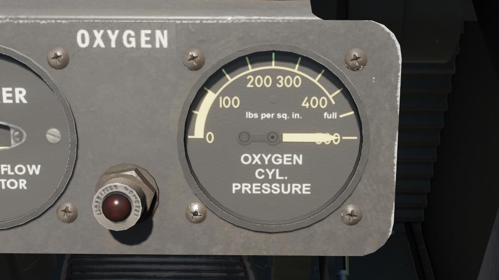

### Указатель температуры головок цилиндров

Данный прибор используется для контроля температуры головок цилиндров. Указатель
проградуирован от 0 до 400^o^C. Цена деления шкалы составляет 10^о^С.

Нормальная температура головок цилиндров на земле составляет около 150^o^C, в воздухе –
около 200^o^C. Никогда не превышайте температуру в 230^o^C на длительное время.

Причиной повышения температуры головок цилиндров может быть:

- Повышение давления наддува без соответствующего увеличения оборотов двигателя.
- Увеличение оборотов ТК перед увеличением оборотов двигателя.
- Уменьшение оборотов двигателя перед уменьшением оборотов ТК.
- Набор высоты на малой скорости, особенно с закрытыми створками капота двигателя.

Переохлаждение двигателя в полете также опасно. К переохлаждению могут привести:

- Пикирование с открытыми створками капота двигателя.
- Длительное планирование на МГ (малый газ).

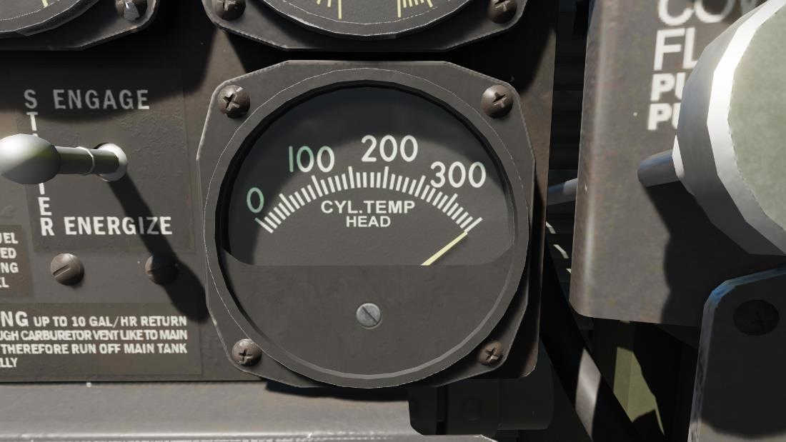

### Ручка заливного насоса

Справа от приборной панели находится рука заливного насоса, которая используется для
подкачки небольшого количества топлива в камеру сгорания при выполнении процедуры
запуска двигателя.

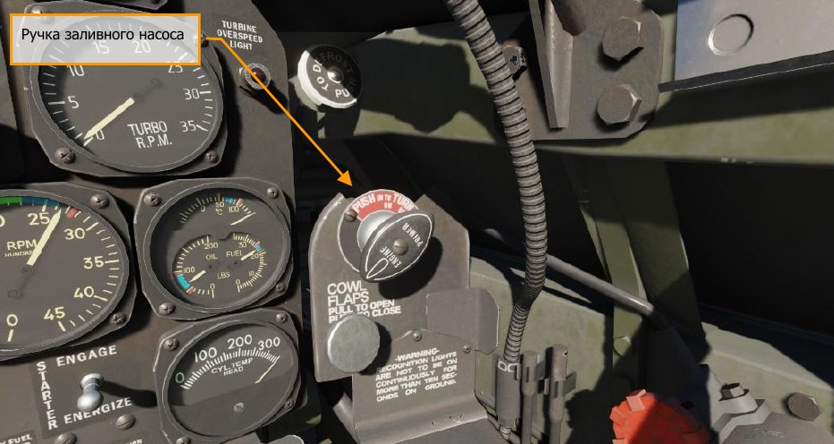

Для подкачки топлива в камеру сгорания:

1. Втяните вперед и поверните ручку Engine Primer против часовой стрелки.
2. Втяните и потяните на себя ручку от 4 до 6 раз.
3. Заблокируйте ручку, толкнув её вперед до упора и повернув по часовой стрелки.

### Рукоятка управления створками капота

Ручка управления створками капота находится справа от приборной панели, под ручкой
заливного насоса. Для открытия створок капота двигателя достаточно потянуть данную
рукоятку на себя, соответственно, чтобы закрыть створки капота достаточно утопить ручку в
панель.

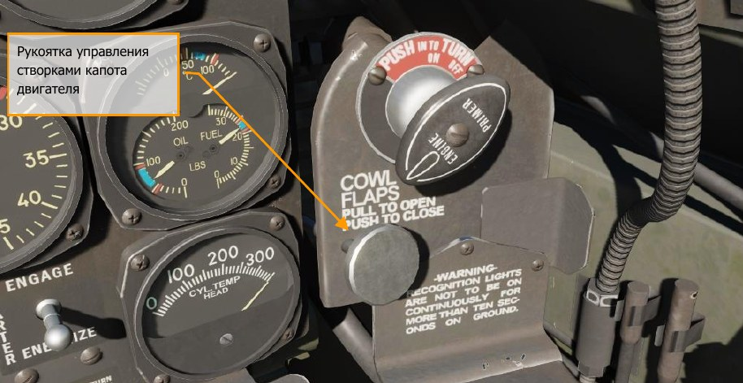

!!! note "Примечание"
    На самолете P-47D-30 не предусмотрен индикатор положения створок капота
    двигателя. Однако, их позиция хорошо видна из кабины.

### Выключатель аккумуляторной батареи

Подключает и отключает аккумуляторную батарею.

- OFF. АКБ отключена.
- ON. АКБ подключена.

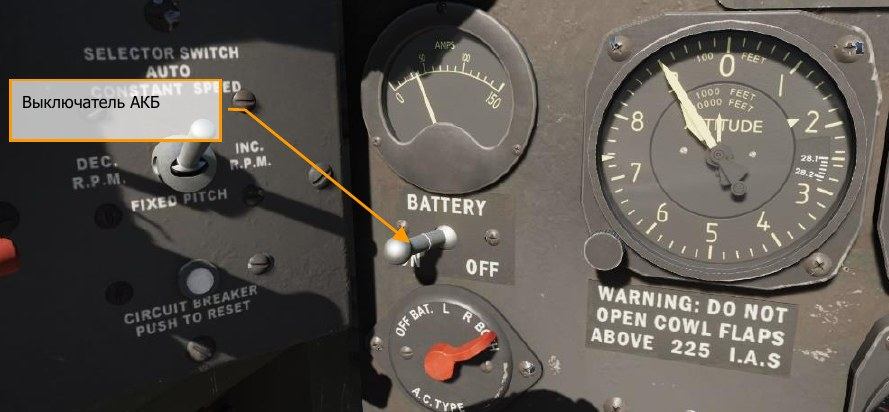

### Переключатель управления стартером

Данный переключатель размещен на приборной панели под тахометром и имеет 3 положения:

- Среднее положение. Нет действия.
- ENGAGE. В данной позиции происходит сцепление пускового маховика с двигателем.
- ENERGIZE. В данной позиции происходит раскрутка пускового маховика. Для этого
установите и удерживайте переключатель управления стартером в данной позиции.

Во избежание перегрева мотора стартера не удерживайте переключатель управления
стартером в положении ENERGIZE более 20 секунд.

### Переключатель управления зажиганием

С помощью данного переключателя осуществляется выбор магнето, которое будет
использоваться для подачи питания к системе зажигания двигателя. Переключатель имеет
четыре положения: OFF (выключено), R (правое), L (левое) и BOTH (оба).

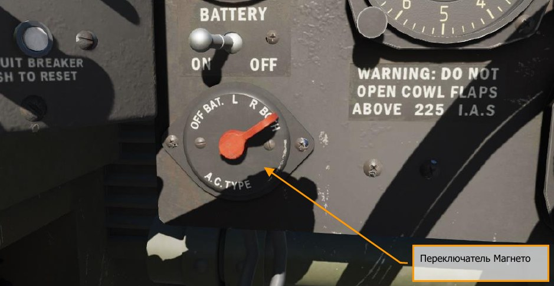

OFF (выключено). Магнето выключены.

- R (правое). Правое магнето используется при запуске двигателя.
- L (левое). Левое магнето используется при запуске двигателя.
- BOTH (оба). Оба магнето используются при запуске двигателя.

Обычно при запуске используются оба магнето.

### Ручка управления стояночным тормозом

Ручка стояночного тормоза расположена спереди, за РУС, прямо посередине, в нижней части
приборной панели.

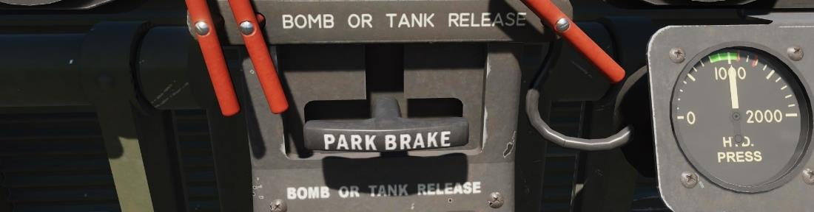

Чтобы задействовать стояночный тормоз необходимо ручку PARK BRAKE вытянуть на себя,
далее полностью нажать и потом отпустить тормозные подножки на педалях руля направления
(РН), после чего отпустить Ручку Стояночного Тормоза. Для снятия со стояночного тормоза
достаточно просто выжать тормозные подножки педалей.

!!! warning
    Необходимо избегать использования стояночного тормоза, если тормозные диски
    находятся в перегретом состоянии, так как это может привести к их смерзанию.

### Панель управления подвесным вооружением/ПТБ на P-47D-30RE

Данная панель состоит из специальных ручек сброса ПТБ, ручки управления стояночным
тормозом, переключателей постановки на взвод бомб/ сброса ПТБ, а также, два переключателя
для постановки на взвод химических контейнеров, позволяющих производить постановку
дымовой завесы или выпуск слезоточивых или иных газов из баллонов, подвешенных на
крыльевые точки подвески.

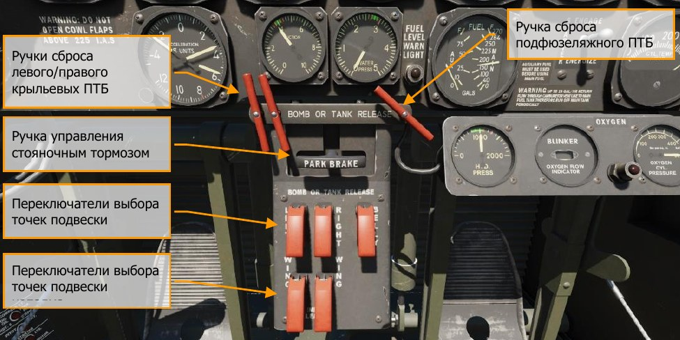

Для сброса ПТБ достаточно потянуть левую или правую ручку в левой верхней части панели,
после чего произойдет сброс соответствующего ПТБ.

Сброс подфюзеляжного ПТБ осуществляется с помощью ручки, расположенной в верхнем
правом углу панели.

Взведение бомб/выбор ПТБ (сброс с помощью кнопки Сброс) осуществляется с помощью
переключателей:

**LEFT**. Взведение бомбы, установленной на левую крыльевую точку подвески. Выбор ПТБ,
подвешенного на левую крыльевую точку подвески.

**RIGHT**. Взведение бомбы, установленной на правую крыльевую точку подвески. Выбор ПТБ,
подвешенного на правую крыльевую точку подвески.

**BELLY**. Взведение бомбы, установленной на подфюзеляжную точку подвески. Выбор ПТБ,
подвешенного на подфюзеляжную точку подвески.

После выбора ПТБ – сброс осуществляется с помощью кнопки Сброс на РУС.

С помощью переключателей WING осуществляется постановка на взвод химических
контейнеров, установленных на левой и/или правой крыльевой точке подвески. Выпуск газов
производится по нажатию кнопки Сброс.

!!! note "Примечание"
     Химические боеприпасы в настоящее время не реализованы.

### Панели управления подвесным вооружением и ПТБ на P-47D-40

Данные две панели содержат: специальные ручки сброса ПТБ, ручку управления стояночным
тормозом, переключателей постановки на взвод бомб/ракет, сброса ПТБ, а также, два
переключателя для постановки на взвод химических контейнеров, позволяющих производить
постановку дымовой завесы или выпуск слезоточивых или иных газов из баллонов,
подвешенных на крыльевые точки подвески.

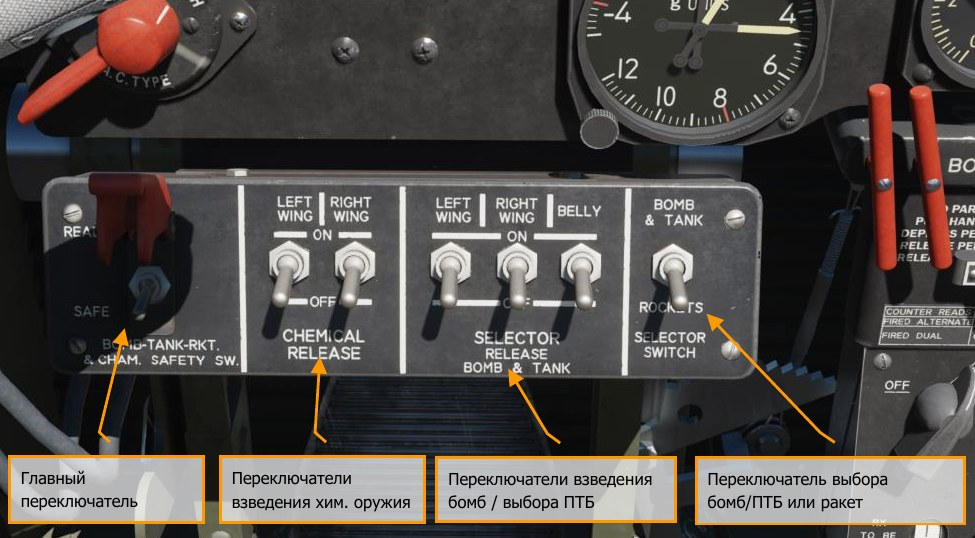

Переключатель BOMB-TNK-RKT&CHAM SAFETY является главным предохранителем.

- SAFE. Питание вооружения снято.
- READY. Подача питания на вооружение.

С помощью переключателей CHEMICAL RELEASE (LEFT/RIGHT) осуществляется постановка на
взвод химических контейнеров, установленных на левой и/или правой крыльевой точке
подвески. Выпуск газов производится по нажатию кнопки Сброс.

!!! note "Примечание"
     Химические боеприпасы в настоящее время не реализованы.

С помощью переключателя SELECTOR RELEASE осуществляется выбор точек подвески
бомб/ПТБ.

Переключатель SELECTOR SWITCH служит для выбора типа боеприпасов.

- BOMB & TANK. Выбор бомб или ПТБ для сброса.
- ROCKETS. Выбор ракет.

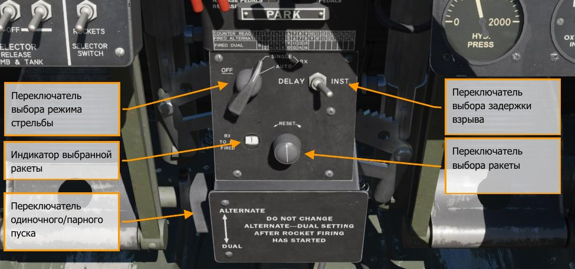

Панель управления ракетами состоит из:

- Переключателя выбора режима стрельбы:
    - OFF. Отключение подачи питания.
    - Single. Режим одиночного огня (пуск 1 ракеты).
    - Auto. Режим автоматического огня. Пуск ракет будет происходить до тех
пор, пока нажата боевая кнопка.
- Переключателя выбора задержки взрыва:
    - INST. Мгновенный подрыв.
    - DELAY. Подрыв с задержкой.
- Переключателя выбора ракеты. Данный переключатель осуществляет выбор ракеты,
которая будет выпущена следующей. Выбор ракеты осуществляется в диапазоне от 1
до 24.
- Индикатора выбранной ракеты. Отображает номер ракеты, которая будет выпущена
следующей.
- Переключатель одиночного/парного огня. Данный переключатель определяет тип
пуска ракет.
    - ALTERNATE. Одиночный пуск ракет.
    - DUAL. Парный пуск ракет.

## Правый борт

На правом борту размещено различное радиосвязное, кислородное, а также, светосигнальное
оборудование.

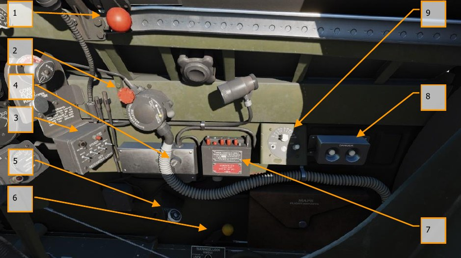

1. Ручка для открытия фонаря в ручном режиме
2. Регулятор подачи кислорода
3. Панель управления опознавательными огнями
4. Регулятор громкости радиоприемника
5. Рукоятка вентиляции кабины
6. Рычаг управления хвостовым колесом
7. Блок управления УКВ радиостанцией
8. Кнопки ликвидации аппаратуры засекречивания
9. Длинноволновой приемник Detrola

### Регулятор подачи кислорода

Регулятор подачи кислорода установлен на правой стороне кабины, перед приборной панелью.
Регулятор имеет мембрану, которая приводит в действие соответствующий клапан, позволяя
кислороду проходить через регулятор, где он смешивается с атмосферным воздухом в различных
соотношениях, в зависимости от барометрического давления. Управляющий клапан отключения
внешнего подсоса воздуха позволяет летчику перекрывать забор наружного воздуха, давая
таким образом чистому кислороду поступать в дыхательную маску. Также имеется аварийный
клапан, который заставляет кислород поступать напрямую в дыхательную маску в обход
регулятора. Магистраль, подающая кислород, связана с индикатором подачи кислорода,
позволяющим контролировать работу регулятора.

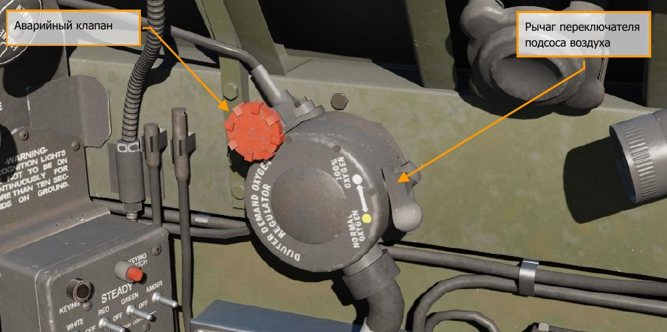

### Панель управления опознавательными огнями

Данная панель управляет тремя цветными лампами, которые расположенными под правым
крылом.

RED (Красный) / GREEN (Зеленый) /AMBER (Оранжевый) находятся в средней позиции – лампы
отключены. Установка переключателя в верхнее положение включает режим постоянного
свечения соответствующей лампы.

Данные переключатели также могут быть установлены в нижнее положение. Затем с помощью
нажатия кнопки KEYING SWITCH происходит подсветка соответствующих ламп, при этом,
нажатия дублируются сигнальной лампой KEYING LT., установленная в левом верхнем углу
блока управления.

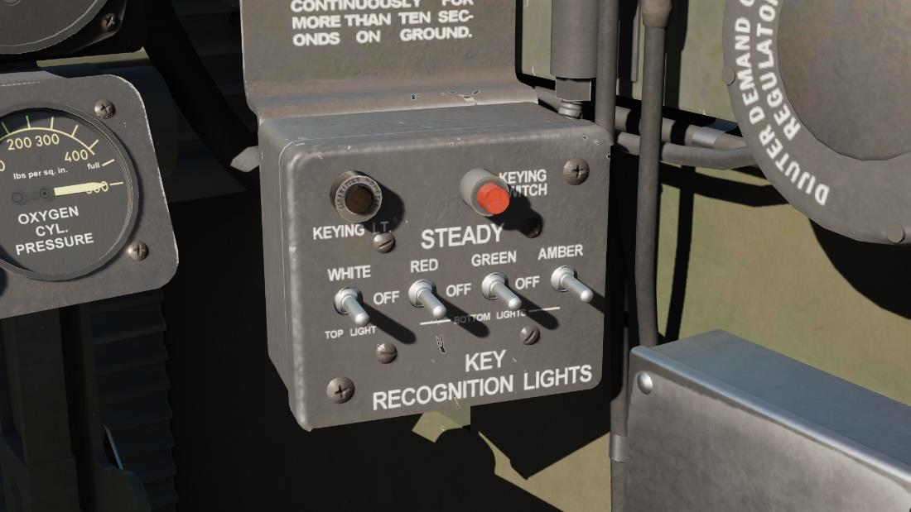

Действующий Кодовый пароль для набора световой комбинации сообщается летчику перед
вылетом.

!!! note "Примечание"
    Опознавательный огонь белого цвета установленный на фюзеляже и светивший вверх
    начиная с модели P-47D25 не устанавливается.

### Рычаг управления хвостовым колесом

Данный рычаг размещен справа от сидения пилота, предназначен для управления блокировкой
хвостового колеса и имеет 2 позиции:

- ВПЕРЕД. В данной позиции происходит блокировка хвостового колеса.
- НАЗАД. В данной позиции происходит разблокировка хвостового колеса.

При выполнении руления хвостовое колесо всегда должно быть разблокировано. Летчик должен
все время подруливать из стороны в сторону для улучшения видимости перед самолетом.

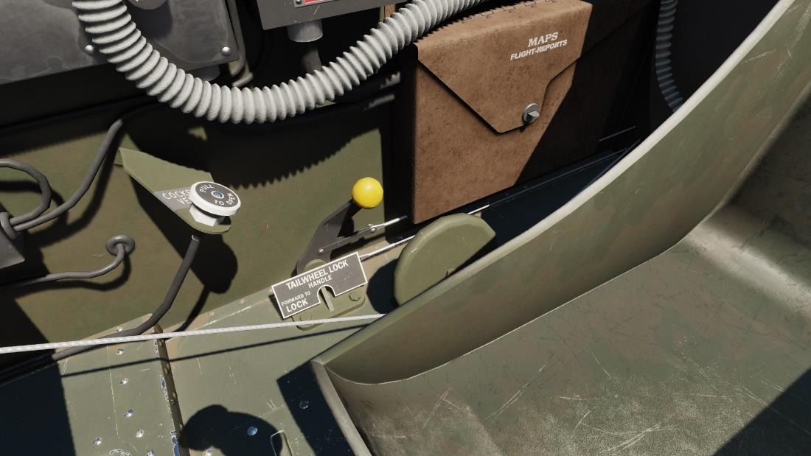

### Командная УКВ радиостанция

SCR-522 является командной приемопередающей УКВ радиостанцией с кнопочным
управлением, с кварцевой стабилизаций частоты гетеродина и работающей в диапазоне 100 –
156 МГц с амплитудной модуляцией (AM) и предназначенной для двухсторонней радиосвязи, а
также для приема и передачи приводных сигналов в радионавигационном режиме. Блок
управления радиостанцией размещен на правой стороне кабины. Для ведения передачи
используется кнопка микрофона – PTT (Push To Transmit), которая расположена снизу на
рукоятке рычага управления дросселем. Радиостанция может работать на одном из четырех
предустановленных каналов. Значение радиочастоты для каждого из каналов радиостанции
задается в редакторе миссий (создателем миссии) и не может быть изменено в процессе
выполнения миссии (в полете). Выбор нужного канала осуществляется летчиком с помощью
соответствующих кнопок выбора каналов. Также на пульте радиостанции установлен
переключатель режимов радиостанции, позволяющий выбирать один из трех режимов приемо-
передачи: внешнее управление (REM) по нажатию кнопки включения микрофона (PTT)
расположенной на РУД; только прием (R); только передача (T).

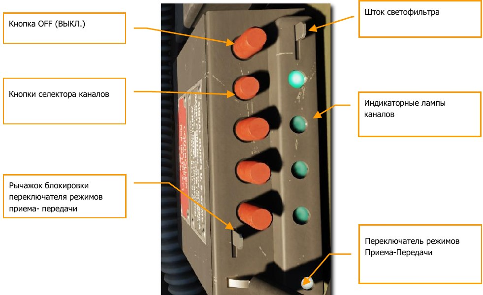

Шток управления светофильтром. Позволяет задействовать светофильтр, ослабляющий
яркость свечения ламп-индикаторов. Снижение яркости свечения ламп может быть полезным
при полете в темное время суток или в пасмурную погоду.

Кнопка OFF. При нажатии данной кнопки происходит выключение радиостанции.

Кнопки селектора A, B, С и D. Кнопками селектора осуществляется выбор требуемого канала
(фиксированной частоты) радиосвязи. Одновременно может быть выбран только один канал.
"А" – данный канал обычно используется для радиосвязи с наземными (командными) пунктами,
а также с другими самолетами.

"B" – принят как основной канал связи с пунктами УВД, оснащенными УКВ радиостанциями.
Используется обычно для получения соответствующих инструкций при выполнении взлетов и
посадок.

"C" – канал часто используется для радиосвязи с приводными радиостанциями.

"D" – канал обычно используется для связи с наземными радиопеленгаторными станциями.

Индикаторные лампы каналов. Служат для индикации выбранного канала связи.

Переключатель режимов приема-передачи. Переключатель Режимов Приема- Передачи
имеет три положения: REM (управление внешней кнопкой), R (только прием), и T (только
передача). Когда переключатель находится в позиции REM – передача в эфир происходит по
нажатию кнопки PTT на ручке управления двигателем. В позиции R радиостанция находится в
режиме постоянного приема, а в позиции Т – в режиме постоянной передачи. Управление
громкостью сигнала осуществляется с помощью соответствующей ручки регулятора, которая
находится на панели управления Радаром (ЗПС) AN/APS-13, расположенной с правой стороны
кабины перед радиостанцией.

Рычажок блокировки переключателя режимов приема-передачи. Данный рычажок
используется для блокировки положения переключателя Режимов Приема-Передачи. При
переднем положении рычажка, позиции переключателя Режимов Приема-Передачи
фиксируются с помощью соответствующего механизма блокировки. Когда рычажок установлен
в заднем положении – переключатель Режимов Приема-Передачи удерживается в позиции R
(прием) и может быть перемещен в нефиксируемую позицию T (передача), что позволяет
летчику работать на передачу в случае неисправности кнопки включения микрофона на РУД.
То есть, удерживая переключатель режима в положении "T" летчик работает на передачу,
опуская его возвращается в R. При этом (когда рычажок блокировки находится в крайнем
заднем положении) переключатель Режимов Приема-Передачи нельзя установить в позицию
REM.

### Длинноволновой приемник Detrola

Радиоприемник Detrola предназначен для приема сигналов длинноволновых радиостанций в
диапазоне 200-400 кГц. Он расположен на уровне сиденья пилота с правой стороны кабины. Это
приемник и поэтому может работать только на прием сигналов. Во время работы возможно
совместное его использование с командной УКВ (VHF) радиостанцией. Органами управления
Detrola являются комбинированный Выключатель Питания/Регулятор Громкости (ON-OFF/
Volume), а также Ручка Настройки Частоты.

!!! note "Примечание"
     Работа приемника Detrola в DCS:P-47D-30 не реализуется.

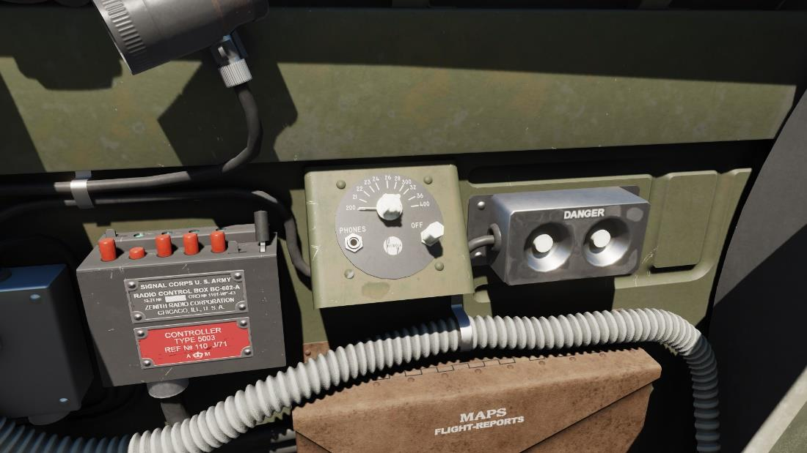

## Ручка управления самолетом

РУС используется для управления самолетом по крену и тангажу. Набор управляющих
элементов РУС самолета P-47D-30 состоит из кнопки сброса/пуска бомбовых/ракетных
боеприпасов и ПТБ, а также, гашетки применения пулеметов. Нажатие на гашетку производит
стрельбу изо всех пулеметов одновременно.
Процедура сброса ПТБ более подробно описана в разделе “Стандартные процедуры”.

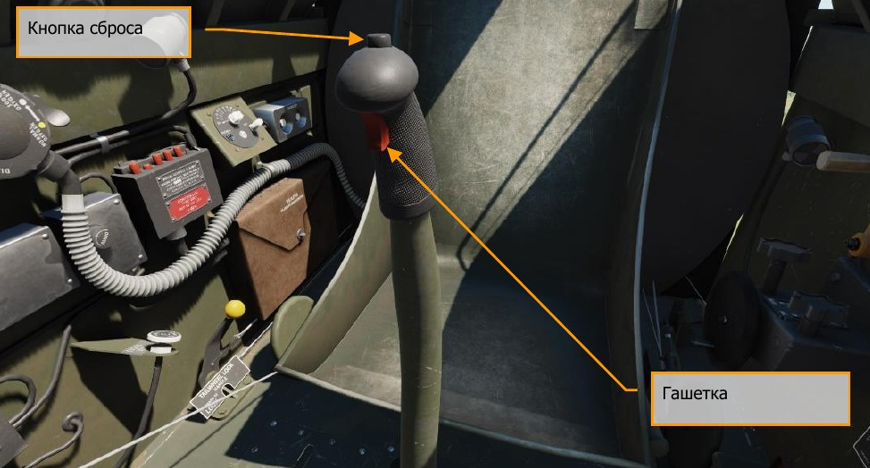

## Блок секторов ВМГ

Блок секторов винто-моторной группы состоит из объединённых на одной оси секторов с
рычагами: управления дросселем; управления турбокомпрессором; управления топливной
смесью; управления оборотами\шагом винта. Рычаг управления ТК и рычаг управления
оборотами оснащены подпружиненными защелками для сцепления и совместного хода с
рычагом управления дросселем (РУД). Движковый переключатель, размещенный с торца
рукоятки РУД отвечает за работу системы впрыска водно-спиртовой смеси. Кнопка с нижней
части рукоятки РУД отвечает за активацию микрофона при передачах речевых сообщений
через командную УКВ радиостанцию.

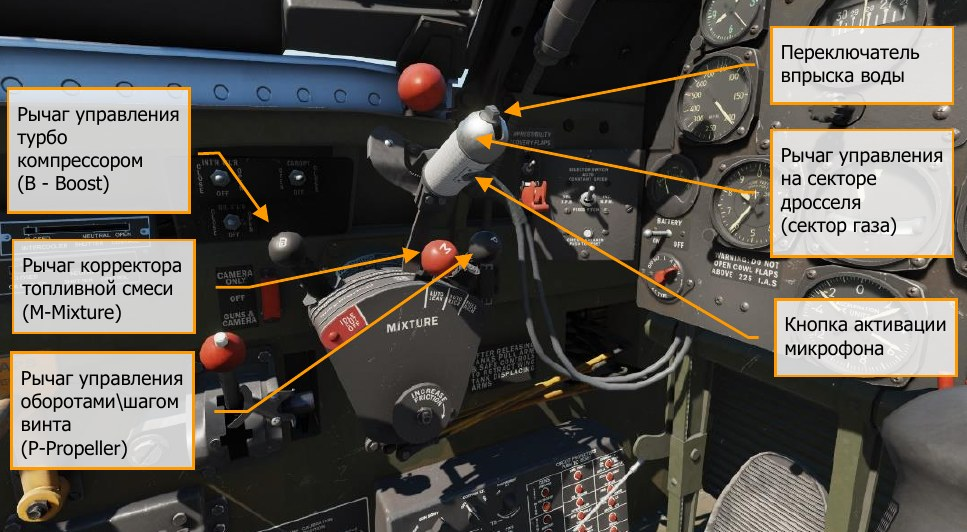

### Рычаг селектора топливной смеси.

Рычаг обозначен буквой "M" (Mixture - смесь), а сам селектор реализован в виде сектора с 4-мя
настроенными позициями:

- IDLE-CUT-OFF. Прекращает подачу топлива и используется при запуске или остановке
двигателя.
- AUTO LEAN. (Обедненная смесь, авто) Используется при выполнении полетов на
дальние дистанции в крейсерских режимах. Внимательно следите за температурой
цилиндров. Если двигатель начинает перегреваться, переключите данный рычаг в
позицию AUTO RICH и уменьшите обороты двигателя до тех пор, пока не снизится
температура цилиндров.
- AUTO RICH. (Обогащенная смесь, авто) Данная позиция используется при выполнении
тренировочных и штатных полетов, когда не используются крейсерские режимы
двигателя.
- FULL RICH. (Богатая смесь, пост.) Данная позиция заблокирована предохранительной
проволокой и задействуется, когда автоматический высотный регулятор смеси
неисправен. В таких случаях нужно как можно быстрее снизиться и продолжать полет
на малой высоте контролируя дымность выхлопа. Чем выше дымность, вызванная
несгоревшими частичками сажи, тем ниже надо спуститься.

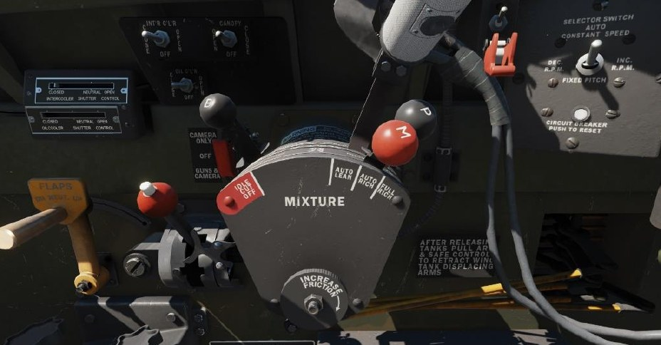

### Рычаг сектора управления турбокомпрессором

Данный рычаг позволяет задавать требуемое давлением воздуха, подаваемого на вход в
карбюратор после того, как РУД установлен вперед, в крайнее от себя положение.

Турбокомпрессор (ТК) используется в основном на высотах свыше 12 000 футов, когда плотность
воздуха сильно понижается.

!!! important "Важно!"
    Возьмите на вооружение простое правило – этот рычаг не может бежать впереди РУД.
    Если решили прибрать РУД, то сначала, потяните на себя рычаг управления ТК. Во избежание
    поломок или перегрева двигателя никогда не допускайте положение рычага ТК выше РУД.

Автоматический регулятор турбокомпрессора поддерживает постоянным не давление наддува,
как таковое, а давление выхлопных газов перед турбиной, поэтому для эффективного набора
высоты пилоту требуется постоянная коррекция наддува рычагом ТК.

### Рычаг сектора изменения шага/оборотов винта

Данный рычаг используется для установки оборотов двигателя с помощью регулятора
поддержания постоянных оборотов воздушного винта. Управление оборотами двигателя путем
установки шага винта с помощью данного рычага осуществляется, когда переключатель блока
управления на небольшой коробке слева от приборной панели установлен в позицию AUTO
CONSTANT SPEED.

## Авиационный стрелковый прицел К-14

В этом разделе приведен детальный обзор всех органов управления авиационным стрелковым
прицелом К-14, который размещен сверху, над приборной панелью.

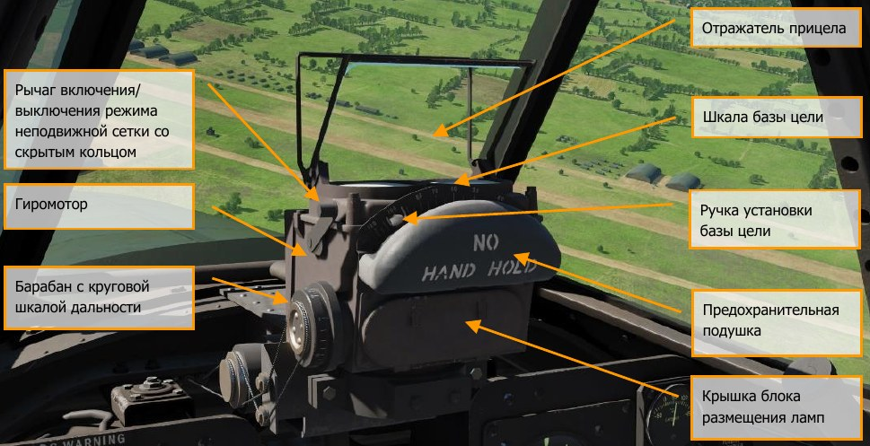

Самолет P-47D-30RE оборудован Авиационным стрелковым прицелом К-14, который установлен
на продольной оси приборной панели. Прицел имеет как неподвижную (фиксированную)
оптическую систему (сетку прицела), так и оптическую систему с гироприводом, которая
вычисляет необходимый угол упреждения для целей на дальности 600 – 2400 футов.

Неподвижная оптическая система проецирует на стекло отражателя сетку в виде перекрестия и
кольца, с угловой величиной равной 8 миллирадиан (8 тысячных). При необходимости кольцо
сетки может быть скрыто, для чего требуется опустить рычаг, расположенный на левой
стороне прицела. Неподвижная сетка используется при атаке наземных целей, а также как
вторичный при атаке воздушных целей.

Гироскопическая сетка прицела состоит из центральной точки прицеливания и шести
ромбиков, расположенных вокруг нее. Гироскопический прицел является основным при атаке
воздушных целей.

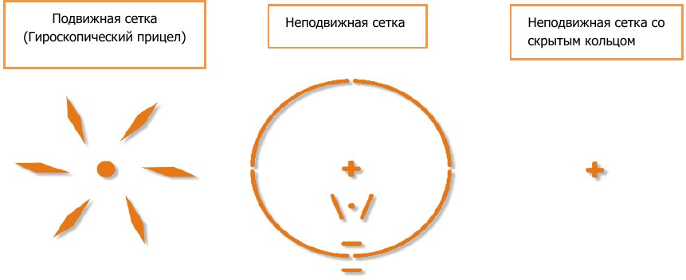

Прицел настраивается под размер цели (базы) с помощью соответствующей ручки (на шкале
баз). Дальность в вычислительный механизм вводится путем вращения барабана с круговой
шкалой дальности слева от прицела. Требуется вращать его до тех пор, пока внутренние края
дальномерного кольца, образованного ромбиками, не совместятся с законцовками крыльев
цели (диаметр кольца не станет соответствовать размеру цели). При этом точка прицеливания
(центр подвижной сетки) должна удерживаться на цели в течении 1 секунды до начала
стрельбы, чтобы дать время прицелу автоматически выстроить необходимый угол упреждения.

## Наколенный планшет

Чтобы облегчить процедуру навигации, в кабине предусмотрен наколенный планшет с картой,
которая может быть открыта в любое время нажатием и удержанием клавиши [[K]] для быстрого
взгляда, или включена/выключена постоянно – сочетание клавиш [[RSHIFT ]] + [[K]]. При первом
открытии на карте будет отображаться часть маршрута полета, отцентрированного на начальном
пункте маршрута. Для последовательного переключения между ППМ и страницами планшета
следует использовать клавиши [[[]], [[]]].

Кроме того, вы можете использовать сочетание клавиш [[RCTRL ]] + [[K]] чтобы разместить на карте
информацию в виде метки (с указанием времени ее создания), обозначающей текущее
местоположение самолета и направление его полета.

При включенной модели пилота в кабине (комбинация клавиш [[RSHIFT ]] + [[P]]), наколенный
планшет будет отображаться на левой ноге летчика.

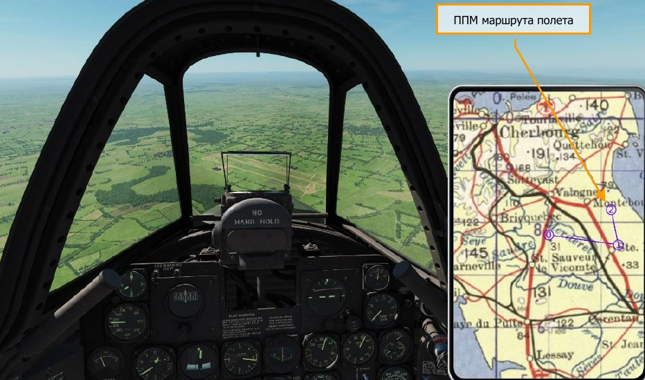
