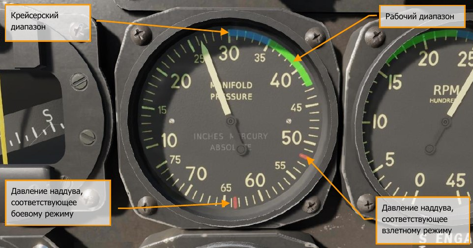
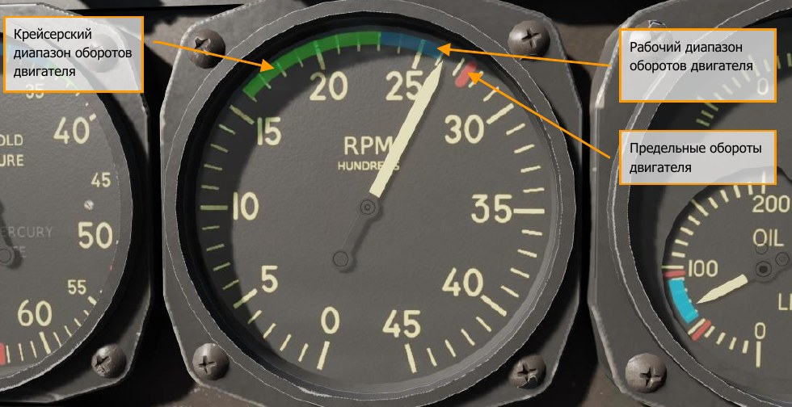
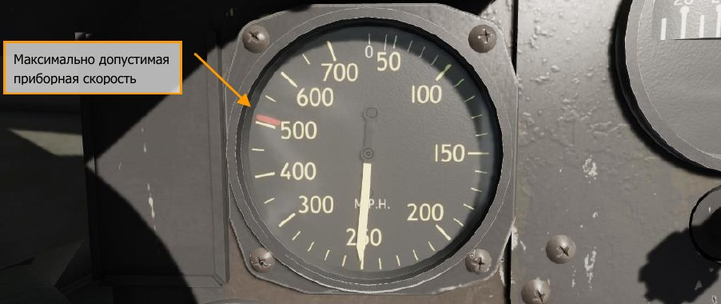
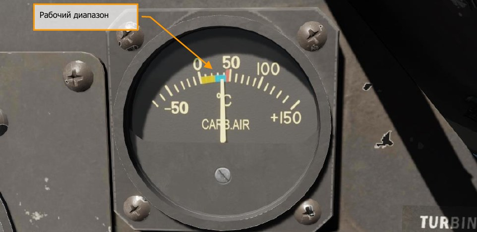
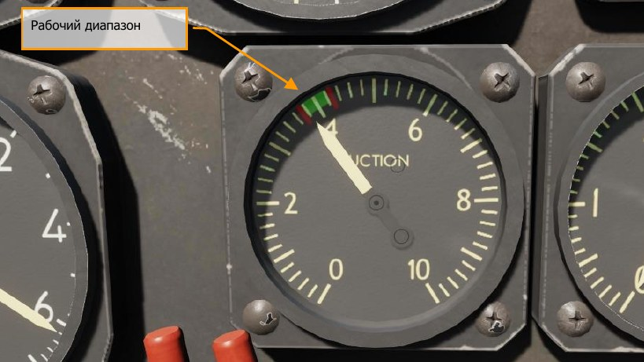
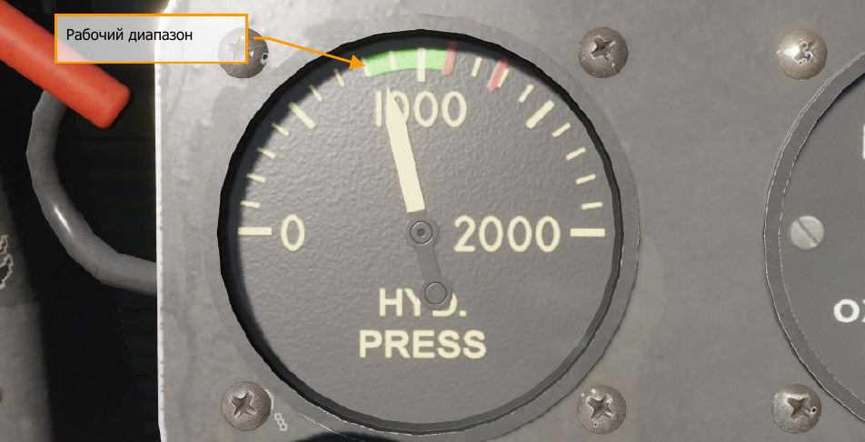

# Летные характеристики

## Эксплуатационные ограничения

### Ограничение воздушной скорости

Красная отметка на указателе воздушной скорости отмечает максимально допустимую скорость
полета (505 миль/ч) на высоте 5000 футов.

При подвеске ПТБ на 75 галлонов максимальная приборная скорость огранивается 400 миль/ч.
Так же не следует допускать падения скорости полета ниже значения 110 миль/ч по прибору во
время скольжения.

### Рабочие диапазоны на шкалах приборов

Информация об ограничениях и нормальных режимах работы систем и двигателя в полете
нанесена на шкалы соответствующих приборов. Нормальные диапазоны отмечаются зеленым
цветом, предельные отмечаются меткой красного цвета.

!!! attention "Обратите внимание!"
    Ввиду унификации применяемых на Тандерболтах разных модификаций
    приборов фактические рабочие диапазоны могут несколько отличаться от тех, что нанесены на
    шкалах приборов.

- Давление наддува, соответствующее боевому режиму – 64 дюймов. рт.ст.
- Крейсерский диапазон 30 ... 35 дюймов. рт.ст.
- Рабочий диапазон 35 ... 42 дюймов. рт.ст.

Макс. допустимая температура масла 105°C, рабочая температура масла 60 ... 80°C.

Макс. допустимое давление масла 90 фунтов/кв. дюйм. Мин. допустимоедавления масла 50
фунтов/кв. дюйм. Рабочий диапазон давления масла 60 ... 90 фунтов/кв. дюйм.

Макс. давление топлива 24 фунтов/кв. дюйм. Мин. допустимое давление топлива 22 фунтов/кв.
дюйм. Рабочий диапазон давления топлива 22 ... 24 фунтов/кв. дюйм.

Крейсерский диапазон 1600 ... 2300 об.\мин.

Рабочий диапазон 2300 ... 2600 об.\мин.

Предельные обороты двигателя – 2800 об.\мин.

## Особые условия полета

### Полет с подвесными топливными баками

При наличии подвесных топливных баков (ПТБ) разрешено выполнять полет только с
обеспечением нормальных пространственных положений самолета. Тоже самое относится и к
разворотам с набором высоты или снижением.

### Полет на малых и предельно малых высотах

При выполнении полетов на предельных высотах триммер тангажа следует установить на
незначительное кабрирование, во избежание случайного опускания носа самолета к земле в
момент кратковременного отвлечения внимания летчика от пилотирования.
