# Стандартные процедуры

## Подготовка к запуску

После посадки в кабину следует выполнить следующие проверки:

Селекторный клапан выбора топливных баков установить в позицию MAIN

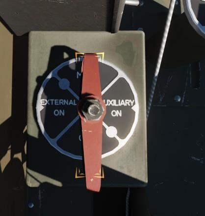

Установить триммер руля направления во взлетную позицию.

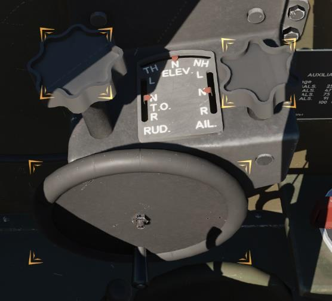

Убедиться, что закрылки убраны (в позиции UP).

Убедиться, что рычаг управления краном шасси находится в позиции DOWN.

Рычаг управления турбокомпрессором установить в позицию OFF. РУД передвинуть в позицию
полностью на себя. Рычаг селектора топливной смеси установить в позицию IDLE-CUTOFF.
Установить ручку управления РПО в позицию INCREASE RPM.

Установить тумблер включения генератора в позицию ON.

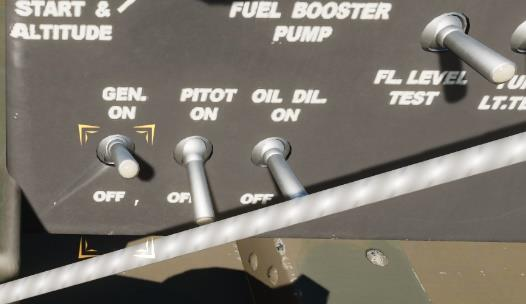

Убедиться в том, что переключатель управления винтом находится в позиции AUTO CONSTANT
SPEED и предохранитель управления винтом включен в позицию ON.

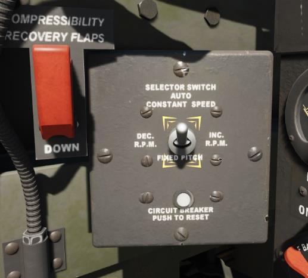

Убедиться, что переключатель управления зажиганием (Магнето) находится в позиции OFF.

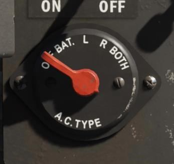

Убедиться в том, что переключатель управления аккумуляторной батареей находится в
позиции OFF.

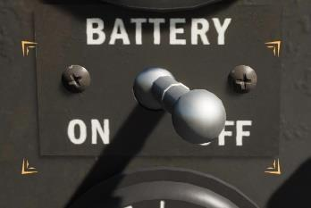

Убедиться в том, что пилотажные приборы заарретированы.

Проверить работоспособность ручного гидронасоса, проконтролировав увеличение давления в
гидросистеме на указателе давления.

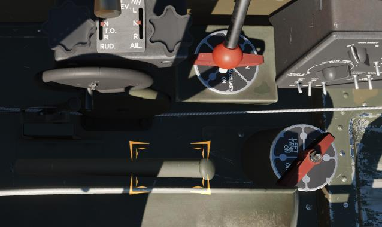

Проверить работоспособность органов управления и триммеров, передвинув их по всему
диапазону хода.

Проверить приборы на чистоту стеклянного покрытия.

Установить давление аэродрома на барометрическом высотомере.

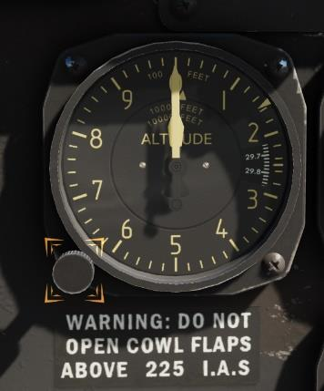

Убедиться, что переключатель управления пулеметами находится в позиции OFF.

Убедиться в том, что створки капота находятся в позиции OPEN.

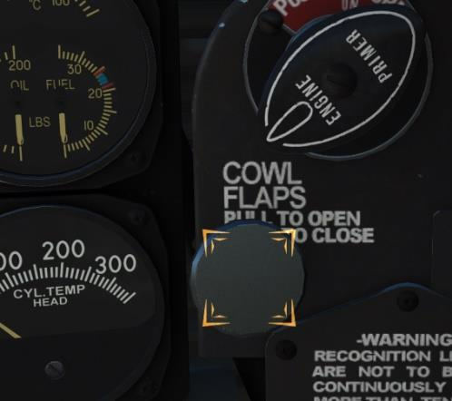

Убедиться в том, что радиостанция выключена.

Установить переключатель управления аккумуляторной батареей в позицию ON и проверить,
что все предохранители на щитке коммутации включены.

Выполнить проверку светосигнальной индикации.

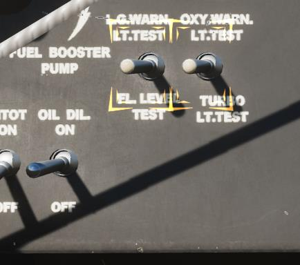

Проверить показания топливомера, расположенного на центральной приборной панели,
используя таблицу поправок.

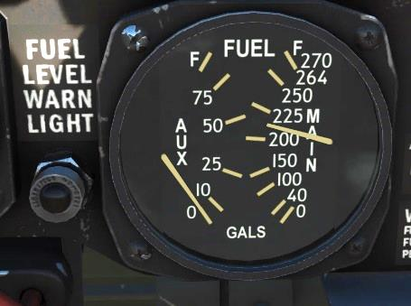

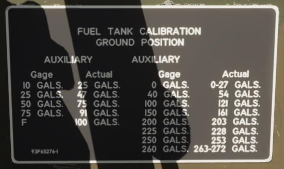

Проверить работоспособность датчика давления в кислородной системе и количество
доступного кислорода.

Проверить работоспособность створок маслорадиатора и интеркулера и установить регуляторы
в нейтральную позицию (NEUTRAL).

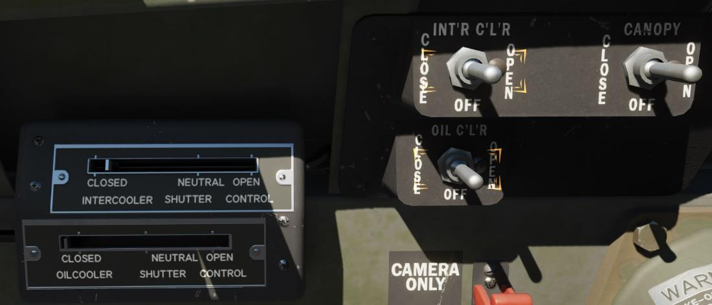

По окончании предыдущих проверок установить переключатель управления аккумуляторной
батареей в позицию OFF.

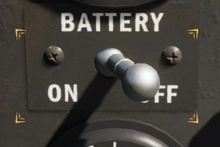

Установить реостат подкачивающего насоса в позицию START and ALTITUDE (Повернуть
полностью против часовой стрелки).

## Запуск двигателя

Ниже представлено описание процедуры холодного запуска P-47D-30:
Переключить селекторный клапан выбора баков в позицию MAIN.

Передвинуть РУД на 1 дюйм вперед. Установить рычаг управления турбокомпрессором
полностью на себя в позицию OFF. Установить рычаг управления топливной смесью в позицию
IDLE CUT-OFF. Регулятор постоянных оборотов винта установить в позицию INCREASE RPM
(Полностью вперед).

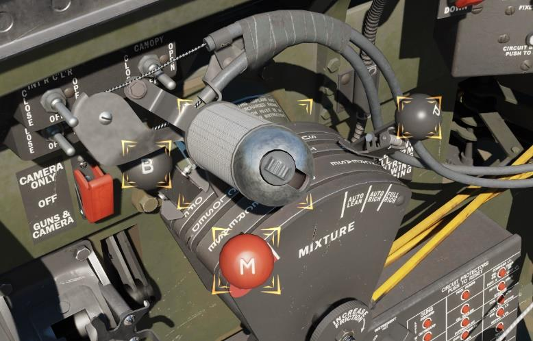

Включить автомат РПО в позицию AUTO CONSTANT SPEED и включить АЗС РПО винта, а также,
все другие АЗС на щитке коммутации (если не включены).

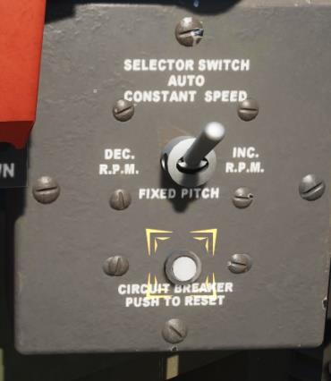

Удостоверится, что реостат топливного насоса находится в позицию START & ALTITUDE.

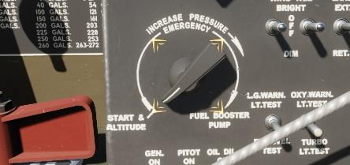

В условиях высокой запыленности нужно установить ручку управления воздушным фильтром в
позицию ON (вперед).

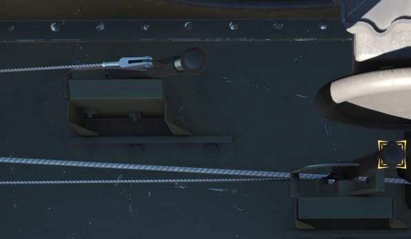

Разблокировать ручку заливного насоса, повернув её против часовой стрелки. Затем, потянуть
на себя от 4 до 6 раз, чтобы подкачать топливо в камеру сгорания. Затем, убедитесь, что праймер
заблокирован в позиции OFF, повернув ручку по часовой стрелке. Не заблокированная ручка
заливного насоса вызывает устойчивую подачу топлива в систему, и может привести к заливке
свечей и невозможности пуска. Перелив приводит к невозможности нормального запуска
двигателя и опасности возникновения пожара.

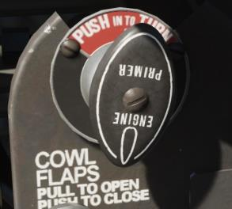

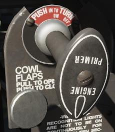

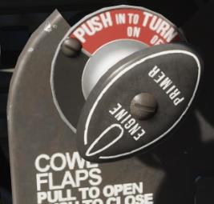

Выключатель АКБ установить в позицию ON.

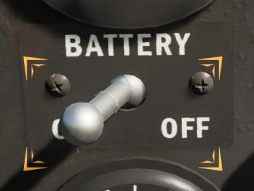

Установить переключатель управления Магнето в позицию BOTH.

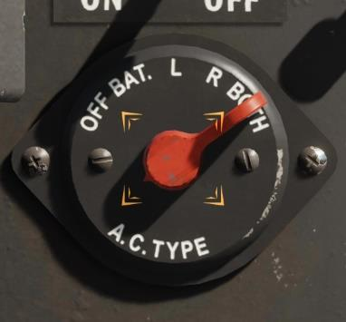

Для получения хорошего взаимного прилегания щеток и коллектора кратковременно установить
переключатель управления стартером в позицию ENGAGE и немедленно вернуть в позицию OFF.

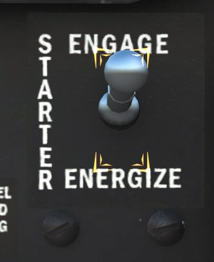

Раскрутите пусковой маховик. Для этого установить и удерживать переключатель управления
стартером в позиции ENERGIZE. Во избежание перегрева мотора стартера не удерживать его в
этом положении более 20 секунд.

Раскрутив пусковой маховик, немедленно переключите стартер в позицию ENGAGE (сцепление
с двигателем) и удерживая в этом положении продолжать вращение до момента запуска
двигателя (но не более, чем 30 секунд). Если двигатель не запустился, нужно охладить
стартер, подождав 1 минуту и повторить раскрутку и сцепление маховика.

После запуска, при первых вспышках в цилиндрах, передвинуть рычаг корректора топливной
смеси (M) в позицию AUTO-RICH.

Переместив РУД установите обороты двигателя ~900 RPM.

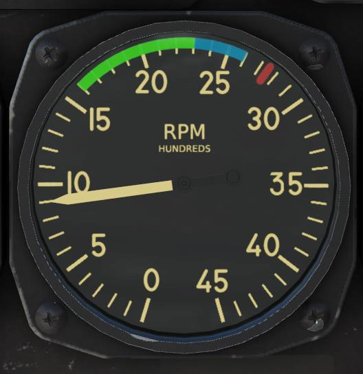

Включить радиостанцию, установив регулятор громкости УКВ радиостанции в крайнее правое
положение и выберите канал радиостанции согласно данным миссии.

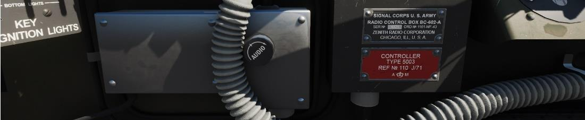

После запуска двигателя, через 30 секунд, проверить уровень давления масла. Если давление
масла в двигателе меньше, чем 25 psi, выполнить остановку двигателя. Прогрев двигателя
производить на оборотах 800-1000 RPM, пока температура масла на входе в двигатель станет
не ниже 40°С, а давление масла постоянным.

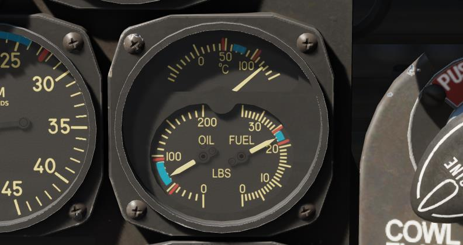

Убедиться, что стрелка вакуумметра находится в пределах значений 3,85 – 4,15 дюймов. рт. ст.

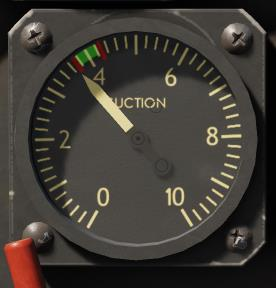

Проверить показания приборов контроля двигателя. Убедиться, что они не выходят за границы
предельных значений.

При выполнении холодного старта двигателя возможны скачки давление масла до 150-200 psi.
Не следует превышать обороты двигателя свыше 1000 RPM до тех пор, пока давление масла не
стабилизируется в допустимом диапазоне.

Выдерживать обороты двигателя в диапазоне 800-1000 RPM до тех пор, пока температура
масла не поднимется до 40оС и выше.

## Руление

Перед выполнением руления разблокировать хвостовое колесо (если заблокировано). Это
необходимо для выполнения руления змейкой, поскольку у пилота нет прямого обзора впереди
самолета.

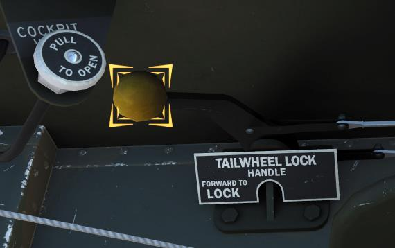

Руление выполняйте с открытым фонарем. Это позволит поддерживать оптимальную
температуру внутри кабины.

Отключить стояночный тормоз.

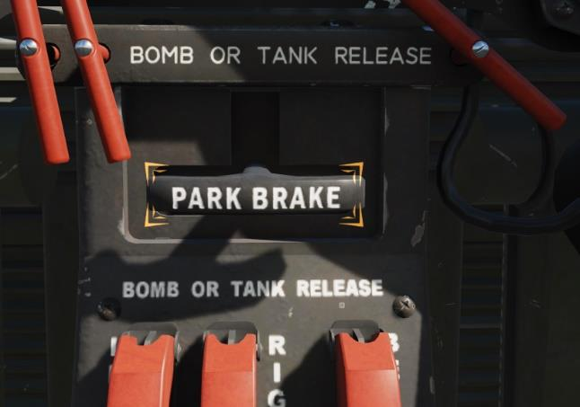

Руление с выпущенными закрылками запрещено.

## Перед взлетом

Убедитесь, что триммер руля направления установлен во взлетное положение (T/O), а
триммеры рулей высоты и элерона установлены в нейтральном положении. Если
вспомогательный бак полностью заполнен, установить указатель триммера рулей высоты на
1/4 дюйма вперед относительно белой отметки. Убедитесь, что рычаг корректора топливной
смеси установлен в позицию AUTO-RICH.

Проверить закрылки (в позиции UP – должны быть убраны). Открыть створки капота двигателя.

Удерживать ручку управления створками капота в позиции OPEN (На себя) до их полного
открытия.

Проверьте работу генератора, установив обороты двигателя на 1400 RPM.

Проверьте радиостанцию (связаться с диспетчером аэродрома).

## Взлет

### Нормальный взлет

Для выполнения нормального взлета следуйте процедуре, приведенной ниже:

Убедитесь, что в направлении взлета отсутствуют препятствия, а в воздухе нет самолетов,
заходящих на посадку, и занять исполнительный старт.

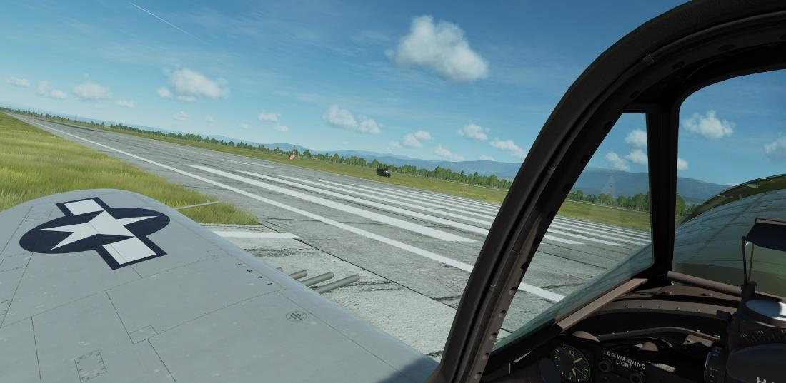

Выровняйте самолет вдоль оси ВПП и заблокируйте хвостовое колесо.

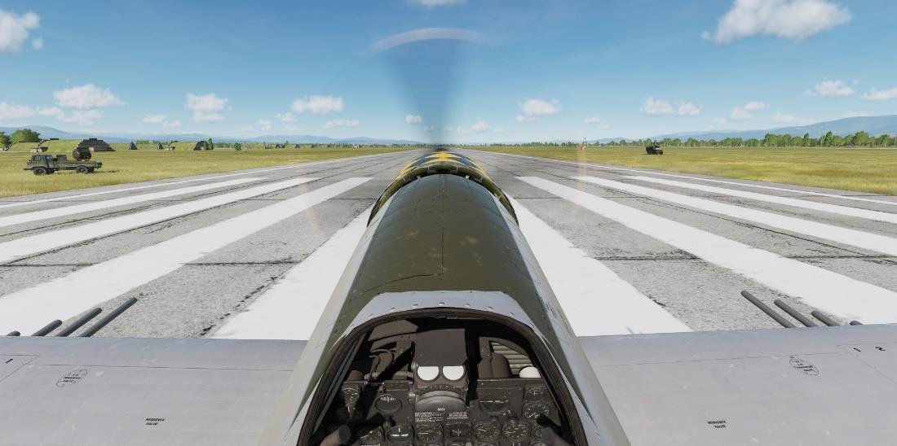

Для сокращения дистанции разбега (при взлете с экстремально коротких аэродромов) нужно
выпустить закрылки в промежуточное положение (20О).

Затем нужно установить, соединив РУД и рычаг управления ТК (с помощью специальной
защелки), уровень наддува на 30 дюймов рт. ст., и начинайте разбег.

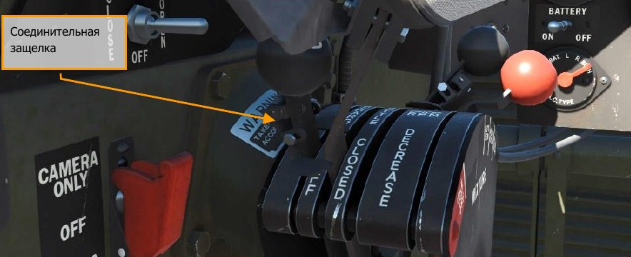

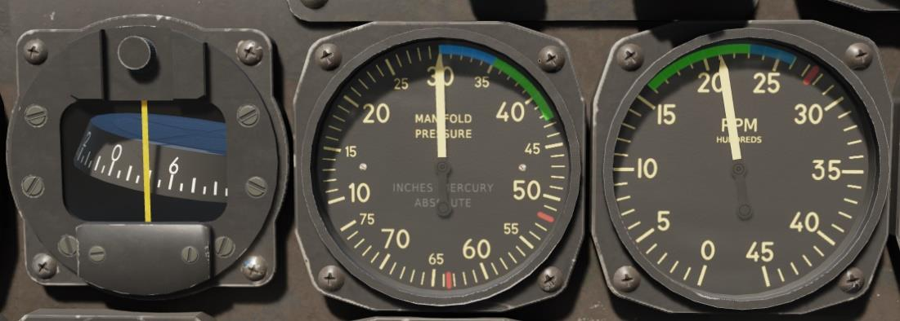

Плавным движением переведите соединенные РУД и рычаг управления ТК на взлетный режим
(52 дюйма рт.ст.).

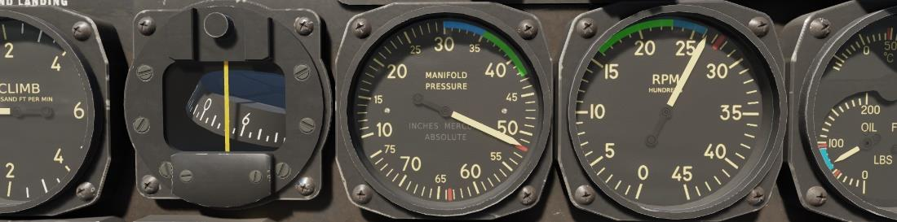

На скорости 110 миль/ч плавно нужно потянуть РУС на себя.
Примечание. Выпуск закрылков в промежуточное положение (на половину хода) позволяет
выполнять взлет с экстремально коротких аэродромов.

Взлет осуществляется с 3-х точек на скорости свыше 100 миль/ч. Тем не менее, удерживайте
самолет на земле до достижения скорости в 110 миль/ч, позволив хвостовой части
приподняться вверх на несколько дюймов (~6”). Подъём хвостовой части самолета и
достаточная скорость дают вам лучший контроль над рулем направления в случае
возникновения аварийных ситуаций.

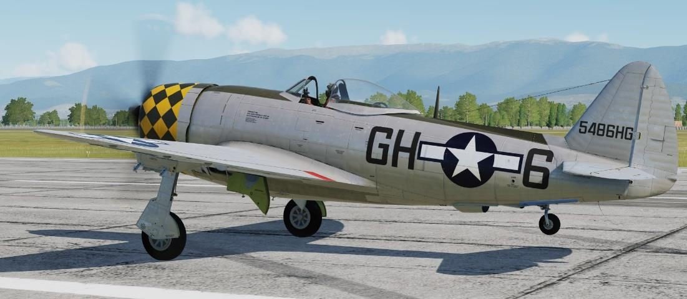

Для компенсации крутящего момента на взлете используйте педали, а не тормоза.
Использование тормозов увеличивает износ покрышек шасси и может привести к заносу.

Перед началом набора высоты наберите наивыгоднейшую скорость набора для Тандерболта -
около 160 миль в час.

### Взлет при высокой температуре воздуха

Во время взлета в жаркую погоду, когда температура воздуха выше 35 градусов по Цельсию,
необходимо рассоединить РУД и рычаг управления ТК и выполнять взлет без использования
турбокомпрессора взяв рычаг ТК полностью на себя. Это нужно во избежание потерь мощности
или увеличения температуры на входе в карбюратор. Турбокомпрессор можно использовать
при достижении безопасной высоты полета и при низкой температуре воздуха в карбюраторе.

### Взлет с боковым ветром

При взлете с боковым ветром рекомендована следующая процедура:

- Перевести рычаг управления дросселем (РУД) и ТК на взлетный режим (Наддув 52 дюйм.
рт. ст.).
- На разбеге следует удерживать хвостовое колесо на земле до момента, пока не будет
достигнута скорость, достаточная для эффективной работы руля направления (РН).
Помните, что скорость взлета с боковым ветром несколько выше, чем при нормальном
взлете.
- Кренящий момент бокового ветра на разбеге парировать достаточным отклонением РУС
 (элеронов) против ветра. Стремление самолета развернуться против ветра парировать
отклонением руля направления (РН).
- По мере возрастания скорости, следует сохранять устойчивое положение самолета на
взлетно-посадочной полосе вплоть до отрыва.
- После отрыва, снос самолета устранять созданием скольжения против ветра
 (выдерживанием крена против ветра и отклонением руля направления по ветру).

### После взлета

После безопасного отрыва от ВПП установить рычаг крана шасси в позицию UP (убрано) и
дождаться полной уборки шасси по индикаторам.

При использовании закрылков во время взлета как можно быстрее выполнить уборку шасси и
набрать не менее 145 миль в час перед тем как начать набор и убрать закрылки. Закрылки
должны быть в выпущенном положении до достижения высоты 500 футов. После достижения
заданной отметки, продолжая разгонять самолет, осторожно выполнить уборку закрылков
избегая потери высоты. Оптимальной для набора является скорость в 150-165 миль в час.

После достижения высоты 500 футов и убора закрылков (если требовалось), уменьшить
мощность двигателя до уровня соответствующего максимальному продолжительному режиму
работы - 42 дюйма рт. ст. по указателю наддува.

Установить триммер руля высоты (РВ) на кабрирование, сняв нагрузку с РУС.

Убедиться, что показания всех приборов находятся в пределах нормальных значений. По
показанию стрелки амперметра проверить правильность значения тока зарядки от генератора.
С момента начала взлета, величина зарядного тока не должна превышать 100 А, с
восстановлением нормального значения (50 А или меньше) после 5 минут полета. Если
уменьшение зарядного тока до указанного значения не происходит, перевести выключатель
генератора в положение OFF и произвести посадку при первой возможности. Также проверить
показание давления в гидросистеме, которое после уборки шасси должно составлять около
1000 PSI.

!!! alert
    Запрещается после отрыва использовать торможение для остановки вращения
    колес, во избежание смерзания тормозных дисков.

    После установки рычага крана шасси в позицию UP или DOWN дождитесь полной
    уборки или выпуска.

## Набор высоты

Оптимальная скорость набора высоты составляет 150 – 165 миль/ч. При высокой температуре
воздуха набор высоты осуществляется на более высоких скоростях для правильного
охлаждения двигателя и сохранения достаточных условий для набора высоты.

При наборе высоты створки капота двигателя должны быть ОТКРЫТЫ (OPEN). Контролируйте
температуру головок цилиндров. При достижении температуры головок цилиндров свыше
260оС увеличьте скорость, уменьшив угол кабрирования.

После набора безопасной высоты и прошествии 10 минут полета установите селекторный
клапан переключения баков в позицию AUXILARY для расхода топлива из вспомогательного
топливного бака. Самолет обладает большей продольной устойчивостью, если
вспомогательный бак пуст.

## Сброс ПТБ

Процедура сброса подвесных топливных баков

1. С помощью переключателей LEFT/RIGHT/BELLY ниже панели приборов
выберите сбрасываемые топливные баки, открыв защитную крышку и
установив переключатели в верхнее положение.
2. Нажмите кнопку сброса на РУС.

Для сброса ПТБ можно также использовать тросовые механизмы используя красные ручки,
расположенные слева и справа от стояночного тормоза. Для этого, потяните за
соответствующую ручку.

Сброс внешних подвесных топливных баков (ПТБ) осуществляется с помощью тросового
механизма или электромагнитами. Рукоятки тросов и селекторные переключатели установлены
на передней панели за РУС под приборной доской.

Трубопроводы поддержания избыточного давления во внешних баках соединены между собой,
поэтому сброс одного ПТБ вызывает общую разгерметизацию и неработоспособность
оставшихся.

!!! alert
    Дождитесь выработки горючего во всех баках, чтобы сбросить их одновременно.

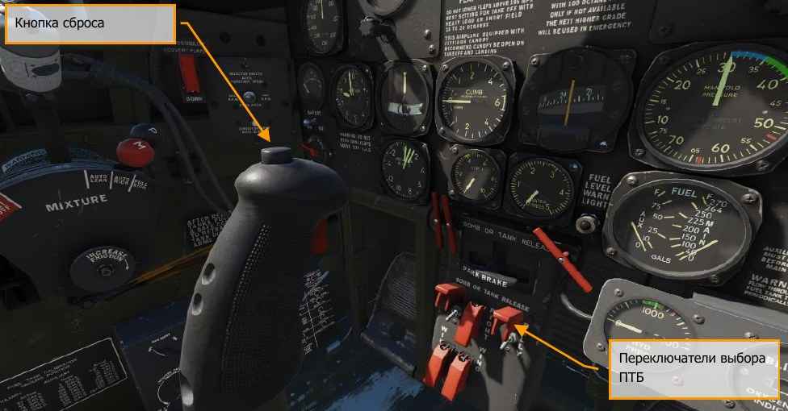

Сброс баков может осуществляться поочередно или одновременно.

## Пикирование

Оттриммируйте самолет на небольшое кабрирование, чтобы требовалось небольшое усилие на
РУС для удержания самолета в пикировании. Закройте створки капота двигателя. Снизьте
обороты ТК.

Ввод в пикирование на P-47D происходит опусканием носа из горизонтального полета (ГП).
Запрещено выполнять ввод в пикирование с помощью полубочки или переворота.

При выполнении пикирования на больших скоростях не сбрасывайте резко обороты двигателя
с помощью РУД. В противном случае увеличится момент на пикирование, и скорость
пикирования возрастет. Вывод из пикирования выполняйте постепенно. Резкое взятие РУС на
себя создает избыточные нагрузки на крылья и управляющие поверхности.

Пикирование с открытыми створками капота двигателя запрещено.
Для вывода из пикирования на самолете P-47D-30RE также предусмотрены щитки вывода из
пикирования.

## Посадка

Перед выполнением процедуры захода на посадку убедитесь в наличии достаточного
количества топлива, нужного для выполнения посадки и выберите нужный топливный бак с
помощью селекторного переключателя.

Установите рычаг корректора смеси в позицию AUTO RICH.

Переключатель управления автоматом постоянных оборотов воздушного винта установите в
позицию AUTO CONSTANT SPEED.

Соедините РУД и рычаг управления турбокомпрессором с помощью защелки. Установите
обороты двигателя 2550 RPM.

Закройте створки капота двигателя.

Выполняйте подход к полосе на высоте 1500 футов со скоростью 200 миль/ч.

После прохода обратного торца ВПП выполните разворот на 180 градусов на курс, обратный
посадочному.

В процессе разворота выполняйте снижение скорости до 160 миль в час.

Выпустите шасси, установив рычаг крана шасси в позицию DN. Проверьте их выпуск, взглянув
на светосигнальную лампу контроля шасси. Убедитесь в восстановлении давления
гидросистемы до (примерно) 1000 PSI. При этом следует учитывать, что с выпущенными шасси
самолет стремится опустить нос вниз, вынуждая летчика удерживать РУС в положении на себя
(иначе говоря, самолет будет "висеть" на ручке). Используя триммер руля высоты (РВ) снимите
усилие с РУС.

Выполняйте снижение до высоты 600-800 футов.

!!! attention "Обратите внимание!"
    Выпуск шасси и посадочных закрылков на скоростях,
    превышающих 190 миль/ч., запрещен.

!!! note "Примечание"
    Светосигнальная лампа состояния шасси погаснет после полного выпуска шасси и
    установки их на замки. Всегда дожидайтесь окончания цикла выпуска/уборки шасси, кроме
    аварийных ситуаций.

Проверьте хвостовое колесо. Оно должно быть заблокировано.

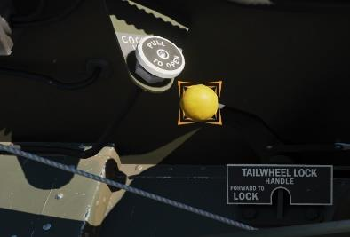

Выпустите закрылки в позицию DN (полный выпуск) на скорости 160 миль/ч на участке между
третьим и четвертым разворотом (на участке, предшествующем посадочной прямой) и
выполняйте снижение до 500 футов.

При наличии воздушного движения в районе аэродрома, сохраняйте приборную скорость в
пределах 150 миль/ч.

После выхода на посадочную прямую и выпуска закрылков, выдерживайте приборную скорость
115-120 миль/ч и на этой скорости продолжайте планировать до начала выравнивания.

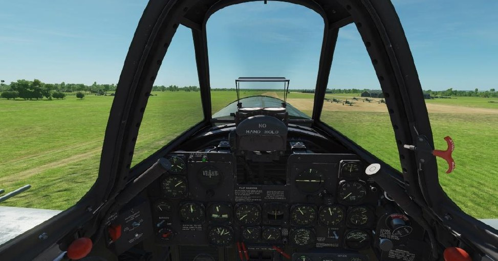

Убедившись в правильности расчета на посадку, переведите двигатель в режим малого газа.

Непосредственно перед приземлением начните выравнивание, уменьшая угол планирования
таким образом, чтобы выполнить касание на три точки в пределах первой трети взлетно-
посадочной полосы. После выравнивания выполните предпосадочное выдерживание –
снижение скорости, сопровождаемое увеличением угла атаки самолета с последующим мягким
касанием полосы тремя точками.

После освобождения полосы и остановки на заданном стояночном месте следует установить
самолет на парковочный тормоз. Для этого нужно рычаг PARK BRAKE потянуть на себя [[ LAlt + LCtrl + W]]
и, удерживая его, нажать оба колесных тормоза [[W]] и отпустить их. Затем
отпустить ручку стояночного тормоза. Произойдет фиксация ручки стояночного тормоза в
вытянутом состоянии.

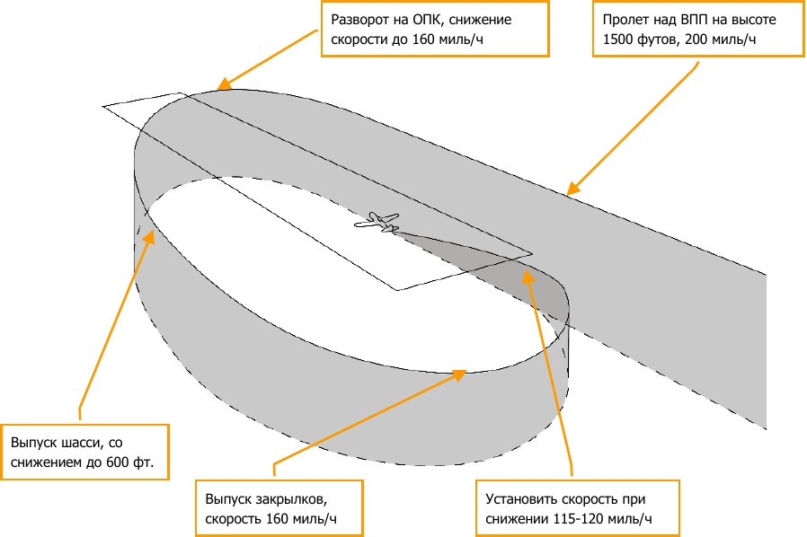

При выполнении посадки в ночное время суток используйте посадочную фару. Максимальная
скорость полета с выпущенной посадочной фарой составляет 200 миль/ч.

## Остановка двигателя

1. Примените колесные тормоза и установите стояночный тормоз. Отпустите колесные
тормоза.
2. Установите обороты двигателя на 1000 RPM и установите рычаг управления смесью в
позицию “IDLE CUT-OFF”, удерживая переключатель разжижения масла до полной
остановки двигателя.
3. После того, как винт прекратит вращение, установите переключатель магнето в
позицию “OFF”.
4. Установите селекторный клапан выбора топливных баков в позицию “OFF”.
5. Все переключатели на щитке коммутации установите в позицию “OFF”.

Для облегчения процедуры запуска самолета при низких температурах самолет имеет систему
разжижения масла, которая использует электромагнитный клапан, управляемый
переключателем разжижения масла. Через открытый клапан бензин попадает в масляную
систему двигателя, понижая вязкость масла. В работающем двигателе пары бензина
постепенно улетучиваются из картера через систему вентиляции картера.

{!abbr.md!}
