# Подготовка к вылету

## Операции на палубе

Когда вы появитесь в кабине самолёта на палубе, назначенная вам катапульта будет отображаться в
правом верхнем углу экрана. Катапульты 1 и 2 расположены на носу, а катапульты 3 и 4 у левого борта.
Выполните руление к указанной катапульте, используя малые обороты двигателей, и поворачивая при
помощи механизма разворота (NWS) переднюю стойку на больший угол.

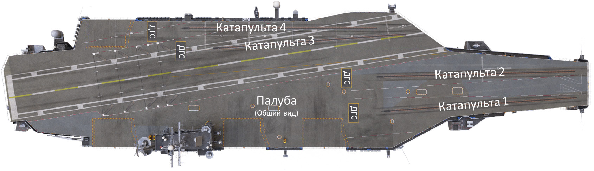

Заняв позицию перед щитом (дефлектором газовых струй - ДГС) катапульты, выполняйте указания
сигналов стоящего перед вами регулировщика в жёлтом.

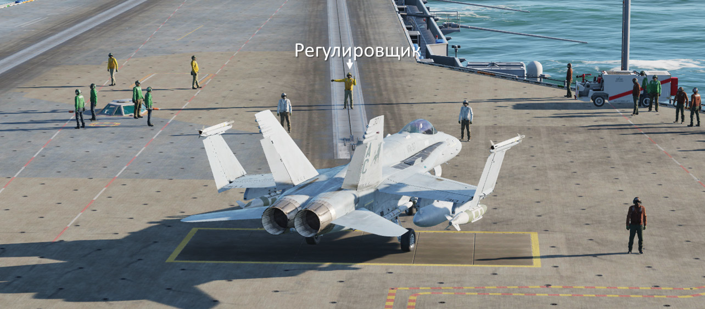

## Операции с катапультой

Чтобы правильно подъехать на стартовую позицию катапульты, вы должно точно выполнять сигналы
регулировщика. Последовательность операций с катапультой, обычно следующая:

1. Разложить крылья. При получении этого сигнала, разложите консоли крыльев используя рычаг
раскладывания консолей крыла в кабине.

    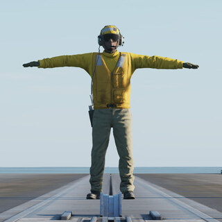

2. Выравнивание по линии катапульты. При получении этого сигнала, медленно выруливайте на
позицию перед щитом ДГС. Регулировщик подаст вам сигналы для выравнивания передней стойки
вдоль направляющей катапультного трека.

    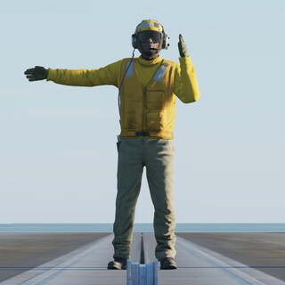
    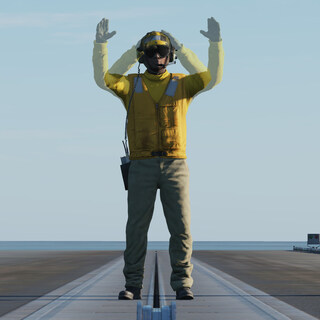
    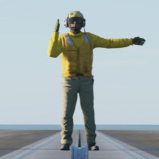

3. Стоп и опустить бросковую штангу. При получении этих сигналов, остановитесь и удерживайте
тормоза. Опустите бросковую штангу на передней стойке шасси используя соответствующий
переключатель в кабине самолёта. В это же время один из специалистов установит на переднюю стойку
специальный задержник.

    
    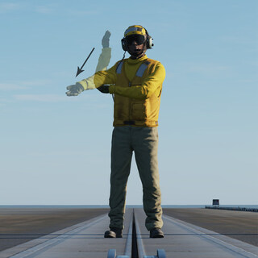

    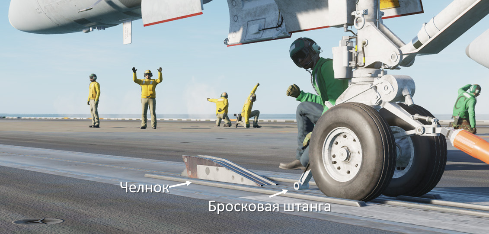

4. Соединение с челноком катапульты. Следуя сигналам регулировщика, медленно подъезжайте к
челноку катапульты. Возможно, потребуется увеличить обороты двигателей до 80-85%. Когда бросковая
штанга переедет челнок, самолёт остановится удерживаемый задержником, цапфы которого
одновременно войдут в захваты стопора катапульты на палубе. Уберите РУД-ы на малый газ.

    
    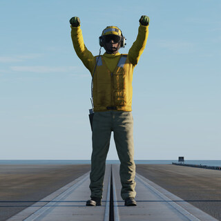

    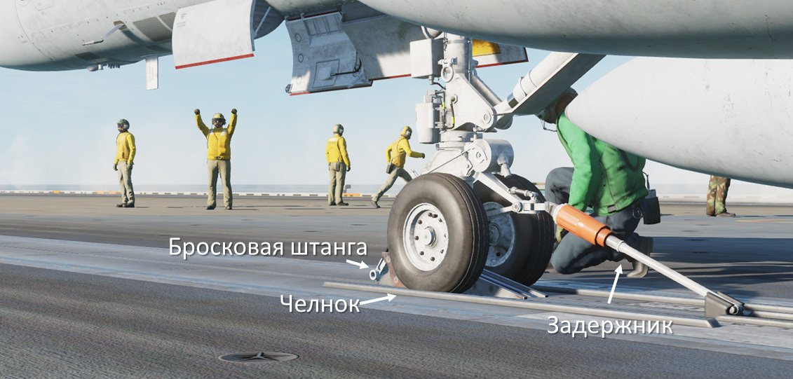

    Оператор катапульты из купола объединённого поста управления катапультами (ICCS) подаст на челнок
    катапульты небольшое давление пара для подтяжки зацепа бросковой штанги, Т-образный конец
    которой находится в пазах челнока.

5. Постановка переключателя бросковой штанги на уборку. При получении этого сигнала,
переведите переключатель бросковой штанги в положение уборки (вверх) используя соответствующий
переключатель в кабине самолёта. Однако уборка штанги произойдёт только после взлёта, когда она
освободится от челнока. Это очень важная операция, т.к. при невыполнении этого условия уборка
передней стойки шасси будет заблокирована.

    

6. Двигатели на полную мощность и проверка перед стартом. После этого регулировщик передаёт
управление офицеру старта, сигнализирующему увеличить обороты двигателей до максимальных.
Проверьте параметры работы двигателей и показания дисплеев на отсутствие каких-либо
светосигнальных предупреждений. Выполните проверку работоспособности рулевых поверхностей,
проведите РУС по кругу и верните в нейтральное положение. Выжмите педали полностью влево, затем
вправо и верните в нейтраль.

    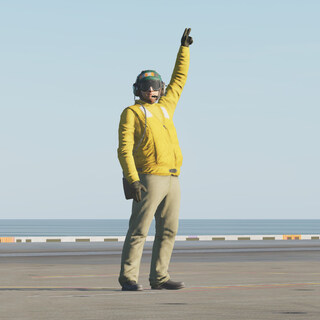

7. Выбор команды "Салют!" в радиоменю. Когда будете готовы к взлёту, выберите в радиоменю
команду "Салют!" или нажмите клавиатурную команду [[LCtrl]] + [[LShift]] + [[S]]. Офицер старта сделает
финальную проверку, ещё раз осматривая самолёт и катапультный трек, и резко принимая
своеобразную позу – согнув колено, выбрасывает руку в направлении взлёта самолёта.

    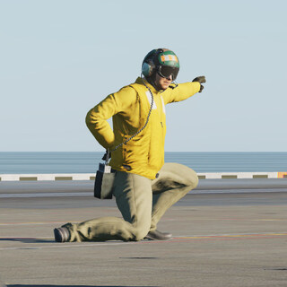

8. Пуск. Оператор катапульты из объединённого поста управления (ICCS) нажимает кнопку “Пуск”.
Давление в цилиндрах катапульты резко возрастает и когда общее усилие превысит настройку
задержника произойдёт его рассоединение и самолёт быстро уйдёт вперёд, разгоняясь до взлётной
скорости примерно за 2 секунды. После взлёта возьмите управление самолётом для достижения
стабильного набора высоты. Выполните уборку шасси и закрылков согласно руководству данного
самолёта.

    Если взлёт происходит с катапульт 1 или 2 (носовые катапульты), после взлёта выполните правый
    манёвр безопасности и выполняйте отход от авианосца вдоль базового курса авианосца на дальность 7
    миль на высоте не выше 500 футов со скоростью 300 узлов. Если взлёт происходит с катапульт 3 или 4
    (угловая палуба), манёвр безопасности выполняется влево.

## Вылет в простых метеоусловиях (Case I)

Вылеты в простых метеоусловиях (ПМУ) выполняются днём, по правилам визуальных полётов (ПВП).
Метеоминимум для таких полётов – это облачность выше 3000 футов и видимость более 5 миль.

!!! info
    Здесь и далее по тексту и в схемах, обозначение мили – будет соответствовать морским милям (от
    англ. nautical miles или nm). В авиации США для измерения расстояний используют только морские
    мили. 1 морская миля = 1,852 км.

После взлёта самолёта с катапульты и получения положительного угла атаки для набора высоты,
выполните манёвр безопасности для отхода от базового курса авианосца. Поднимитесь на 500 футов и
следуйте параллельно курсу судна или базовому курсу авианосца (BRC). Продолжайте полёт на этой
высоте на скорости 300 узлов параллельно BRC до удаления 7 миль от авианосца. Затем следуйте
полётному заданию.

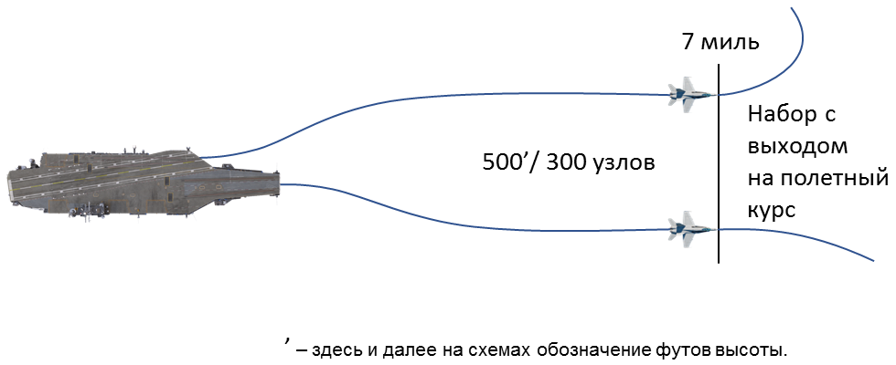

## Вылет в сложных метеоусловиях (Case II)

Вылеты в сложных метеоусловиях (СМУ) выполняются днём, когда погодные условия соответствуют
правилам визуальных полётов авианосца, но требуют контролируемое диспетчером преодоление
облачности при наборе высоты. Метеоминимум для таких полётов – это облачность выше 1,000 футов и
видимость более 5 миль.

После взлёта продолжайте полёт на высоте 500 футов и скорости 300 узлов параллельно базовому
курсу авианосца (англ. - BRC), как при ПМУ. На удалении 7 миль от авианосца, оставаясь ниже
облачности, начинайте разворот по дуге для входа в границу 10-мильной зоны от авианосца.

Оставаясь на границе 10-мильной зоны продолжайте окончательный выход на заданный курс. На курсе
выполните набор высоты для преодоления облачности поддерживая 300 узлов.

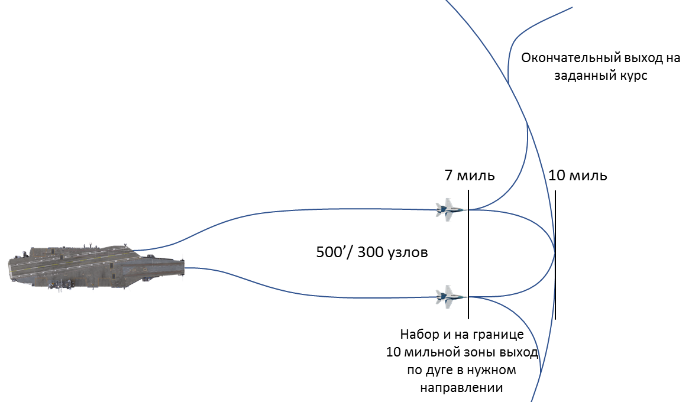

## Вылет по МИНИМУМУ метеоусловий (Case III)

Вылеты по МИНИМУМУ метеоусловий выполняются ночью, или днём, когда облачность ниже 1,000
футов и видимость 5 миль и менее. Контролируемое диспетчером зоны преодоление облачности
поддерживается на протяжении всего вылета.

Запуск самолётов с катапульт будет производиться с минимальным интервалом в 30 секунд. После
взлёта, набирайте высоту прямо по курсу на скорости 300 узлов, и удаляйтесь от авианосца не менее
чем на 5 миль на высоте 1500 футов или выше.

На удалении 7 миль от авианосца, начинайте разворот по дуге для входа в границу 10-мильной зоны.

Набирайте высоту по дуге до окончательного выхода на заданный курс. Продолжайте набор до высоты
согласно задания.

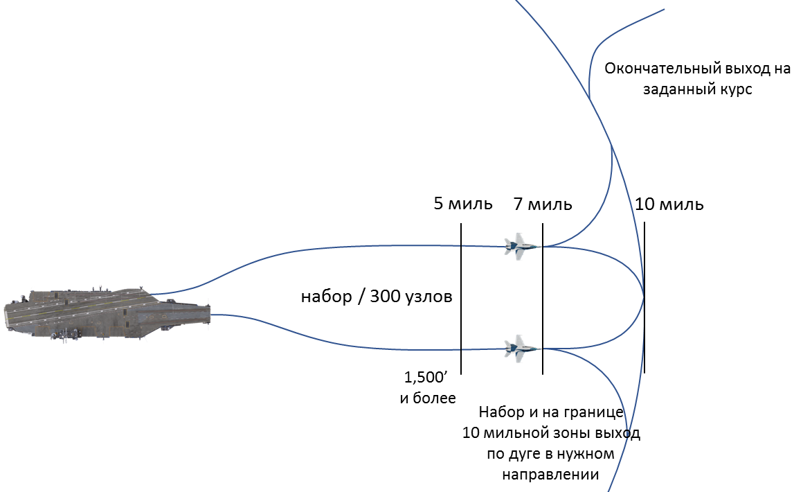
