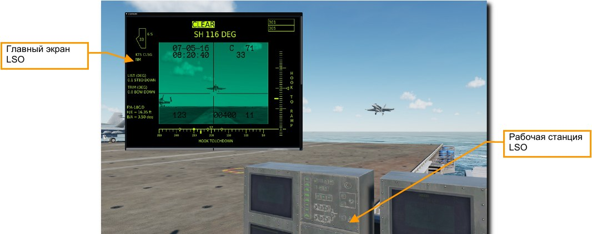
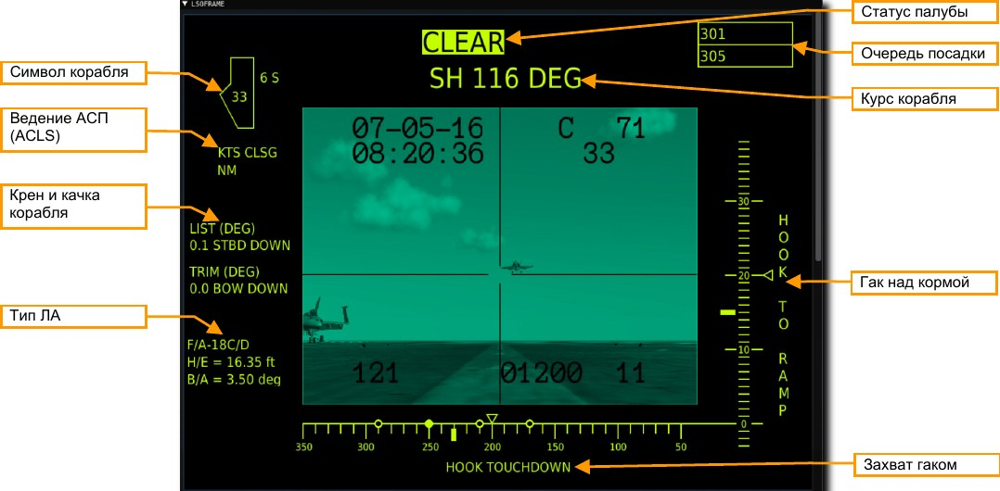
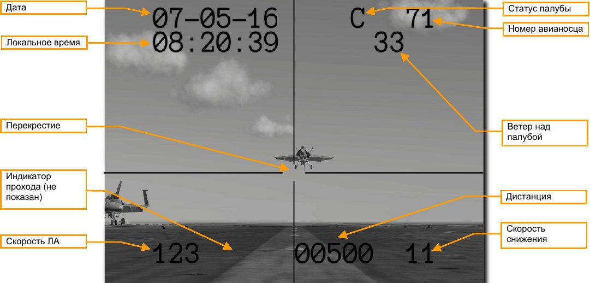

# ПОСТ ОФИЦЕРА ПОСАДКИ (LSO)

## Общая информация

Модуль DCS: Supercarrier включает в себя полностью функциональный пост офицера визуального
управления посадкой (LSO) для направления игроков в сетевой игре или наблюдения за самолётом в
режиме одиночной игры.

Пост LSO можно занять с помощью клавиатурной команды [LALT+F9].

Вы будете перенесены на позицию офицера посадки с пультами рабочей станции LSO перед вами. В
отдельном окне откроется камера телевизионной системы объективного контроля за выполнением
посадки (PLAT - Pilot Landing Aid Television). Будем называть это окно как главный экран LSO.

Вы можете осмотреться, используя стандартные команды управления видами DCS. Для включения
курсора мыши и взаимодействия с окном главного экрана LSO используйте клавиатурную команду
[LALT+C].

## Главный экран LSO

На главном экране LSO в реальном времени отображается вид с камеры PLAT с перекрестием заданной
глиссады и необходимыми данными авианосца и статуса ЛА. Вы можете открыть и закрыть окно, нажав
на значок в левом верхнем углу. Также можете изменить положение окна, щёлкнув ЛКМ на верхней
панели и перетащив на новое место.

Вид можно прокручивать вверх и вниз, используя колесо мыши или полосу прокрутки справа. Полный
главный экран LSO отображается сверху, а вид камеры PLAT - ниже.

Эта информация также доступна и на консолях станции LSO.

### Дисплей главного экрана LSO

На дисплее главного экрана отображается информация, используемая для калибровки световых огней
ОСП при заходе на посадку самолёта. Отображаемые здесь данные гарантируют пилоту правильный
заход по глиссаде.

Вид камеры PLAT также отображается в центре дисплея. Подробная информация об этом будет
показана в следующем разделе.

Символ корабля. В центре символа находится скорость встречного ветра над палубой в узлах. Она
рассчитывается как сумма скорости ветра и вектора скорости корабля. Если боковой ветер с левой
стороны, то слева от символа авианосца будет отображаться скорость ветра с буквой P (port – левый
борт). Если же боковой ветер с правой стороны, то справа от символа корабля будет отображаться
скорость ветра с буквой S (starboard – правый борт). Значение ветра меньше 1 узла не отображается.

Ведение АСП (ACLS). Если при заходе на посадку самолёт использует автоматическую систему
посадки АСП (ACLS), то на дисплее будет отображаться скорость самолёта в узлах.

Крен и качка корабля. Верхнее значение индикации LIST показывает в реальном времени бортовую
качку (крен на левый/правый борт) в градусах. Справа от значения X.X будет отображаться STBD UP
или STBD DOWN (борт вверх или вниз). Нижнее значение индикации TRIM также показывает в реальном
времени, только килевую качку (крен на нос и корму) авианосца.

Тип ЛА. Здесь будет указан тип ЛА, заходящего на посадку. Индикация H/E (hook to eye) – высота в
футах от выпущенного гака до линии визирования глаз пилота. Это расстояние используется для
калибровки шара ОСП (IFLOLS) для точной посадки каждого ЛА. Индикация B/A (basic angle) – это
базовый угол глиссады, ведомой перекрестиями на дисплее камеры.

Статус палубы. Если в зоне посадке будет другой ЛА или палубная команда – будет отображаться
FOUL. Если зона свободна, то отобразится CLEAR.

Курс корабля. Значение показывает магнитный курс авианосца (BRC), который совпадает курсом
захода на посадку, сообщаемым пилотам в простых метеоусловиях.

Очередь посадки. Здесь показываются до трёх номеров, следующих на посадку, садящийся ЛА
указывается в верхнем поле. Каждый ЛА указывается по бортовому номеру.

Захват гаком. На горизонтальной шкале показывается дистанция от кормы корабля до расчётного
места в зоне аэрофинишёров, на которое откалибрована ОСП. Для захвата 3-го троса, она должна быть
равна 230 футам. Четыре точки на шкале отображают 4 троса аэрофинишёров. Выбранный трос
обозначается сплошной точкой. Сплошная метка на шкале указывает точно желаемую точку касания
гаком, а верхняя каретка индицирует положение гака относительно места касания в зоне
аэрофинишёров при качке. По мере раскачивания корабля, каретка будет следовать по шкале.

Гак над кормой. На вертикальной шкале показывается высота, на которой должна быть нижняя часть
посадочного гака при пересечении торца кормы корабля. Для захвата 3-го троса, она должна быть равна
14,1 футам. Сплошная метка на шкале указывает желаемую высоту гака над кормой, а каретка –
динамическая индикация гака относительно кормы по высоте при раскачивании корабля.

### Вид из камеры PLAT

В центре дисплея показан вид из камеры PLAT. Камера установлена на палубе в зоне аэрофинишёров и
наклонена под углом 3 градуса в направлении глиссады садящегося ЛА. На изображение накладывается
информация, помогающая в выполнении обязанностей офицера посадки (LSO).

Дата. Текущая дата.

Локальное время. Текущее локальное время миссии.

Перекрестие. Показывает заданную глиссаду и азимут приближающегося ЛА.
Индикатор прохода. Если посадочная палуба будет занята или будут другие обстоятельства,
сопутствующие принятию решения о проходе – будет показан мигающий индикатор ‘W’.

Скорость ЛА. Показывает истинную воздушную скорость в узлах, если ЛА оборудован автоматической
системой посадки АСП (ACLS). В противном случае будут показаны нули.

Статус палубы. Состояние готовности зоны посадки. Индекс ‘C’ означает, что палуба свободна и при
заходе на посадку ЛА может безопасно сесть. Мигающий индекс ‘F’ означает, что палуба занята и зона
посадки заблокирована.

Номер авианосца. Бортовой номер авианосца, в данном случае CVN 71.

Ветер над палубой. Это скорость встречного ветра над палубой (или скорость хода авианосца) в
узлах, учитывающая сумму векторов скорости ветра и корабля.

Дистанция. Показывает дистанцию между авианосцем и ЛА в футах, если ЛА оборудован АСП (ACLS).
В противном случае будут показаны нули.

Скорость снижения. Показывает скорость снижения в футах в секунду, если ЛА оборудован АСП
(ACLS). В противном случае будут показаны нули.

