# Функции редактора миссий

## Общая информация

Модуль DCS: Supercarrier использует стандартный интерфейс редактора миссий. Полное руководство по
нему можно найти в папке установленной игры по пути DCS World/Doc. Это будет вашим первым
обучающим шагом при использовании таких объектов в создаваемых миссиях.

В этом разделе мы кратко остановимся на некоторых ключевых особенностях, которые важно понимать
при настройке миссии с авианосцем.

## Выбор и размещение корабля

Новые модели кораблей, включённые в состав модуля DCS: Supercarrier, появятся в раскрывающемся
списке поля ТИП. При выборе США в поле СТРАНА будут доступны новые авианосцы класса “Нимиц” и
эсминец “Арли Бёрк”. При выборе Россия в поле СТРАНА будет доступен Авианосец “Адмирал
Кузнецов”.

Обратите внимание что авианосцы ранних версий “Карл Винсон” (CVN-70) и “Джон К. Стеннис” (CVN-74),
не реализующих функционал "Supercarrier", включены в DCS World по-умолчанию. Они по-прежнему
доступны пользователям не владеющим модулем DCS: Supercarrier.

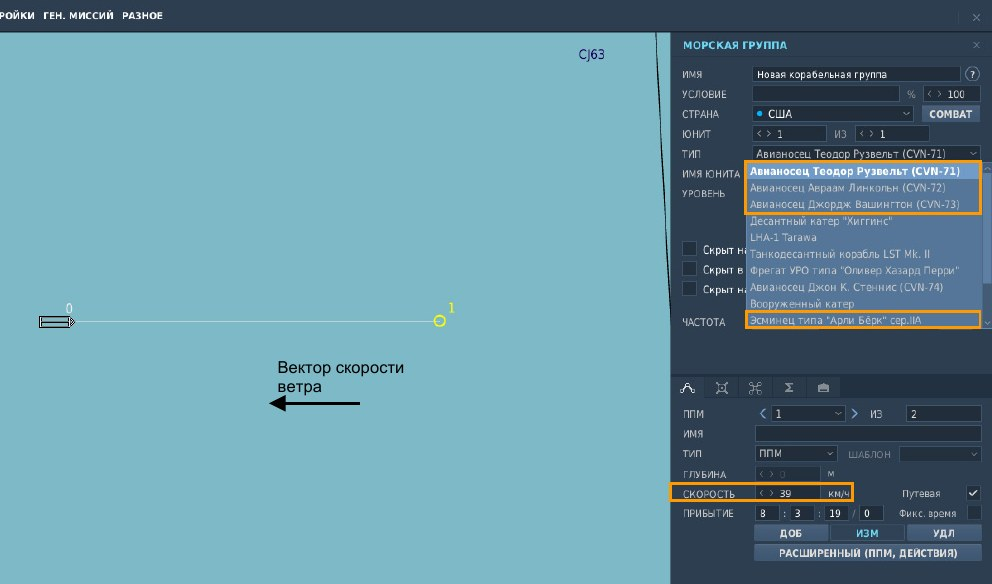

Необходимо обязательно направить авианосец навстречу вектору скорости ветра в миссии. Это
позволит устранить боковой ветер при стартах самолётов и обеспечит безаварийный заход при
посадках. Скорость авианосца должна быть установлена такой, чтобы ветер над палубой (скорость
судна плюс скорость ветра) составлял около 30 узлов.

Важно помнить, что в редакторе миссий курс судна является его истинным курсом, в то время как
базовый курс (BRC) используемый авианосцем является его магнитным курсом. Чтобы получить
базовый курс (BRC), добавьте или вычтите магнитное склонение для используемой карты или просто
отметьте BRC, показанный на дисплее главного экрана поста офицера посадки LSO в миссии.

## Оборудование связи и навигации

Радиочастоты и каналы навигации NAVAID (Navigation Automatic Information Distribution – Навигационная
система) настроены в редакторе миссии. См. первый раздел этого руководства (ниже) для описания
каждой системы. См. руководство к конкретному ЛА для точной настройки каналов и частот
радиостанций в полете для работы с авианосцем.

### Радиочастота

Радиочастота и модуляция КДП авианосца устанавливаются путем ввода желаемой частоты или
выбора желаемой модуляции (AM/FM) из раскрывающегося меню.
Все диспетчера и должностные лица авианосца (т.е. Маршал, Подход, Тауэр и LSO) будут использовать
эту единственную частоту. Также следует установить предварительную настройку канала радиостанции
ЛА, на котором будет радиообмен в миссии.

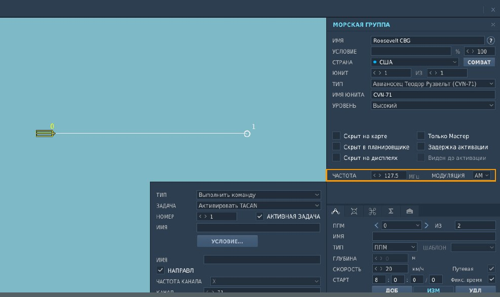

### Канал TACAN

Маяк TACAN авианосца активируют путём добавления расширенного действия ППМ. Обычно его
устанавливают в начальном ППМ 0 авианосца.

В примере ниже, используется канал TACAN и его диапапзон 71X. Установлен позывной TDR. Эти буквы
для идентификации будут передаваться в эфир посредством сигналов азбуки Морзе. Также этот
идентификатор будет отображаться на дисплеях ЛА, где это применимо.

Также вы должны выбрать юнита в группе, на котором будет стоять передатчик TACAN. Им всегда
должен быть авианосец. Обратите внимание, что ИМЯ ЮНИТА авианосца было изменено на CVN-71,
чтобы его было легче идентифицировать в списке в расширенном режиме ППМ.

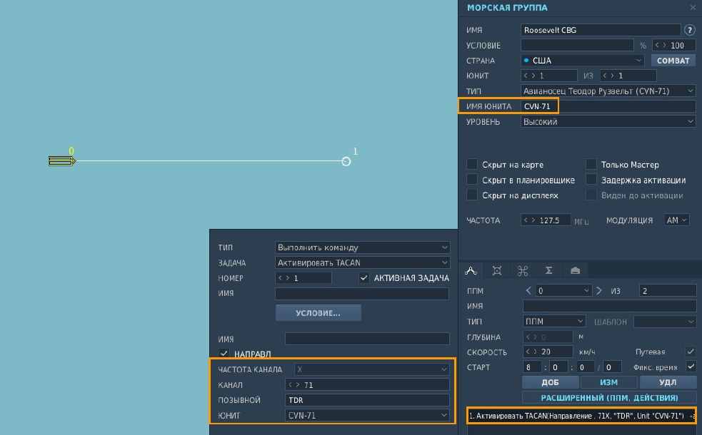

### Курсо-глиссадная система посадки (ICLS)

Канал курсо-глиссадной системы посадки (КГС) на авианосец устанавливается путём добавления
расширенного действия ППМ так же, как и TACAN.

В примере ниже, установлен КАНАЛ 11. По этому каналу ведомый ЛА будет получать команды маяков
КГС. Их источником будет выбранный ниже ЮНИТ CVN-71.

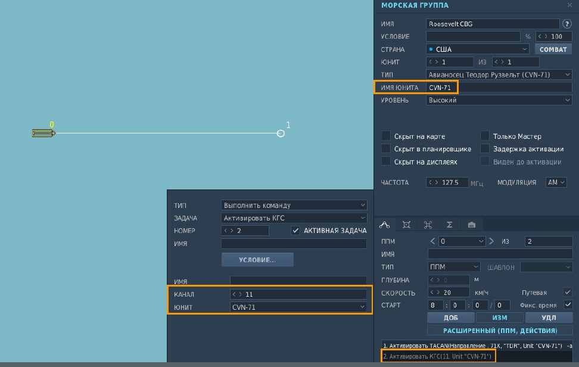

## Руление и парковка самолётов ИИ

После старта миссии доступны 20 позиций для появления самолётов: 16 стоянок, показанных ниже и
плюс по одной стартовой позиции на каждую катапульту. Самолёт, которому в редакторе миссии на
панели маршрута задан тип "Запуск на стоянке" или "Горячий старт со стоянки" появится на одной из 16
стоянок в соответствии с последовательностью, в которой они были добавлены на авианосец. В миссии
сетевой игры, стоянки назначаются в порядке очереди подключения клиента к серверу.

Самолёт, которому в редакторе миссии на панели маршрута задан тип "Взлёт с полосы" появится на
указанной создателем миссии стартовой позиции катапульты.

Количество доступных позиций уменьшается в сетевой игре, когда сервер не используется. Стоянки 1-4
деактивируются, чтобы очистить маршруты руления для вновь появившихся и запускающихся
самолётов, оставляя 16 позиций для появления: 12 оставшихся стоянок и 4 стартовые позиции на
катапультах.

Ниже показана схема размещения для малых самолётов типа F/A-18C Hornet. Эта схема также
применима к самолётам поддержки S-3 Viking и E-2 Hawkeye, за исключением стоянок 1-4, которые не
используются этими типами. Как правило, самолёты поддержки взлетают первыми, поэтому следует
рассмотреть возможность создавать их либо на катапульте, либо на стоянках 5-8.

F-14 Tomcat более крупный самолёт и на палубе занимает больше места. Для F-14 недоступны стоянки
по одной на каждом из лифтов и ещё одна при размещении в кормовой части. Планируйте
последовательность взлётов, помня, что самолёты занимают стоянки в порядке добавления их на
авианосец. Эти стоянки снова станут доступными после того, как самолёты начнут выруливать с них.

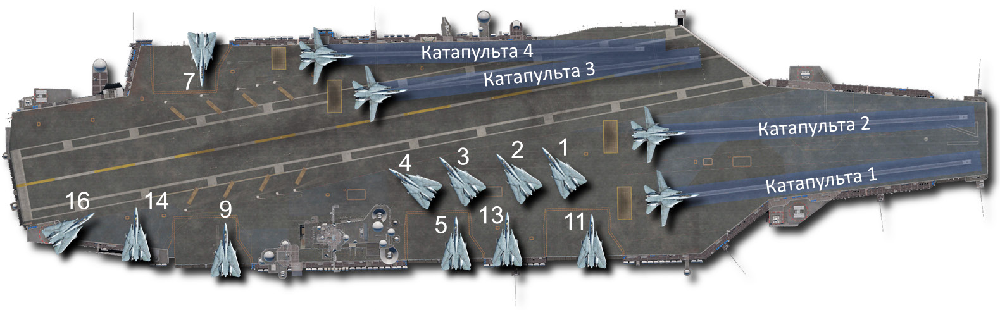

Самолёты, которые не могут поместиться на лётной палубе, хранятся внизу на ангарной палубе до тех
пор, пока не освободится подходящая для вашего самолёта стоянка. В сетевой игре это может привести
к появлению сообщения о задержке постановки на стоянку и необходимости подождать до тех пор, пока
она не освободится.

После посадки, самолёт запрашивает руление на стоянку для покидания зоны посадки (площадки). Пост
управления полётной палубой (в порядке очерёдности стоянок, указанном выше) определит свободную
стоянку для парковки самолёта и разрешит к ней руление. Что входит в обязанности поста управления
движением на палубе? Во-первых, на нём офицеры определяют количество свободных стоянок.

Например, если в кормовой части за надстройкой все стоянки заняты, будет выбрана следующая по
порядку стоянка. Затем пост управления проверит, подходит ли выбранная стоянка для парковки
данного типа севшего ЛА и нет ли на его маршруте руления таких препятствий, как другие движущиеся
самолёты и палубная техника. Как только эти пункты будут выполнены, севший ЛА будет направлен на
свободную стоянку.

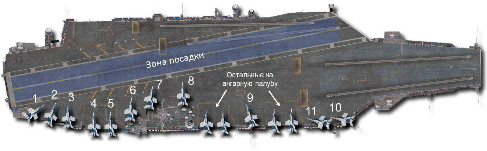

Такие самолёты, как F/A-18C Hornet, S-3 Viking и E-2 Hawkeye занимают небольшую площадь палубы и
поэтому могут занимать любую из доступных стоянок, показанных выше. Самолёты, требующие больше
места, такие как F-14 Tomcat, не имеют возможности занимать некоторые стоянки или могут помешать
другим самолётам парковаться на соседних. По этой причине рекомендуется обеспечить
беспрепятственное руление к лифтам 1 и 2, расположенным перед островной надстройкой авианосца.

Самолёты, достигающие этих лифтов, будут опускаться на ангарную палубу и помогать не загружать
лётную палубу.

В связи с этим очень важно, чтобы создатели миссий не размещали статические объекты на палубе так,
чтобы они занимали или блокировали маршруты к стоянкам и обратно. Это может значительно
сократить количество доступных стоянок.

Тем не менее, если в созданной миссии севшему ЛА невозможно достичь стоянки, то после посадки он
будет автоматически удалён с палубы.

## Размещение статических объектов

В состав модуля DCS: Supercarrier включён ряд новых статических объектов, позволяющих вам
добавить больше разнообразия на палубу авианосца, помимо палубной команды техников,
присутствующих по умолчанию.

Новые статические объекты доступны в категориях ‘Аэродромное и палубное оборудование’ и ‘Личный
состав’. Конечно, все самолёты и другие статические объекты, включённые в DCS World совместимы, и
могут также использоваться.

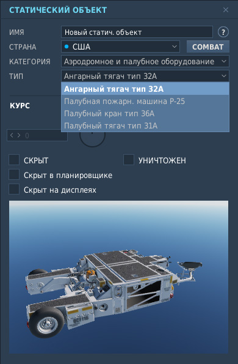
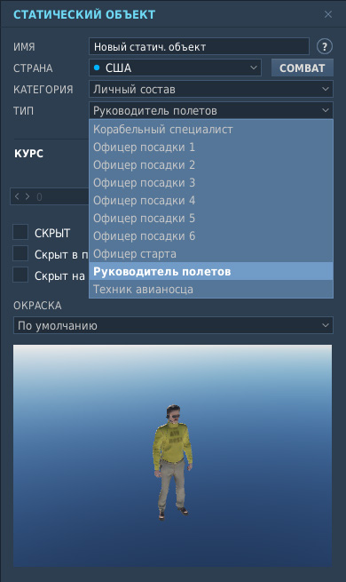

Для начала, вы должны нажать на иконку юнита на панели статусной строки экрана редактора миссий.

Включение этой опции покажет модели всех объектов в средстве просмотра редактора миссий. Это
позволит размещать объекты с гораздо большей точностью. Затем увеличьте масштаб, чтобы
авианосец был виден.

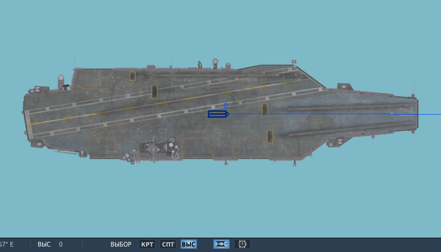

При размещении объекта на палубе, его необходимо зафиксировать на авианосце. Для этого в поле
ПРИКРЕПИТЬ К ЮНИТУ выберите имя авианосца и установите чекбокс ЗАПОМНИТЬ СМЕЩЕНИЕ.

После этого, статический объект будет привязан к палубе авианосца и останется на своём месте при его
движении.

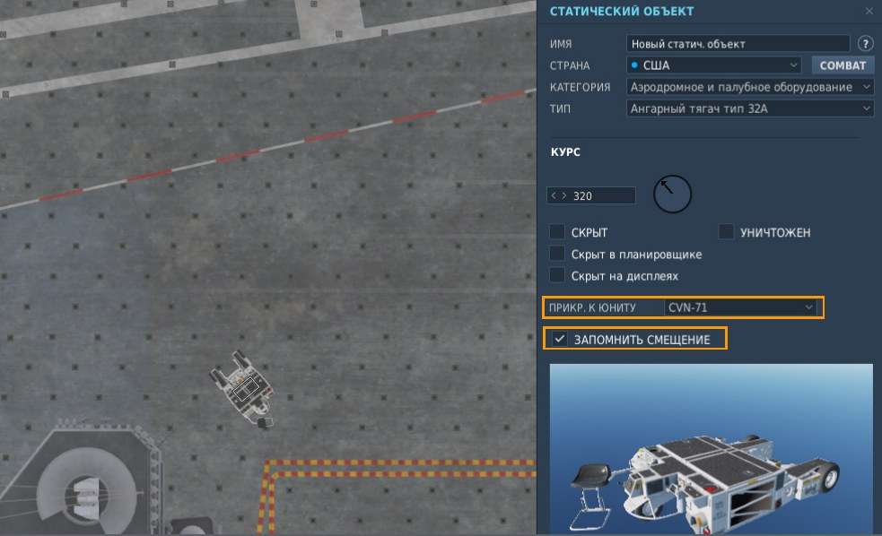

Может оказаться полезным добавлять дополнительные объекты, скопировав и вставив объект, уже
связанный с авианосцем, чтобы вам не пришлось выполнять этот шаг снова. При добавлении можно
пользоваться копированием [[CTRL]] + [[C]] и вставкой [[CTRL]] + [[V]]. При этом выделенный объект со всеми
атрибутами будет скопирован и вставлен новый под курсор мыши.

Слева и справа в 3 метрах от посадочной палубы сплошными линиями красно-белового цвета
размечаются линии безопасности. Сразу же за линиями безопасности разрешается стоянка самолётов и
средств обеспечения. Важно не размещать статические объекты в местах, где они могут помешать
выполнению стартовых операций, посадке и рулению на стоянку. Поэтому тщательно проверьте свою
миссию, для выявления и устранения таких проблем.

### Слайды статиков на авианосце

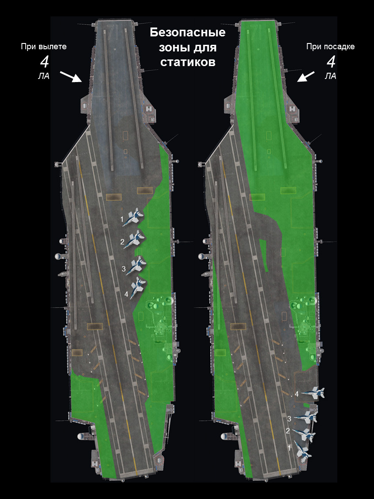
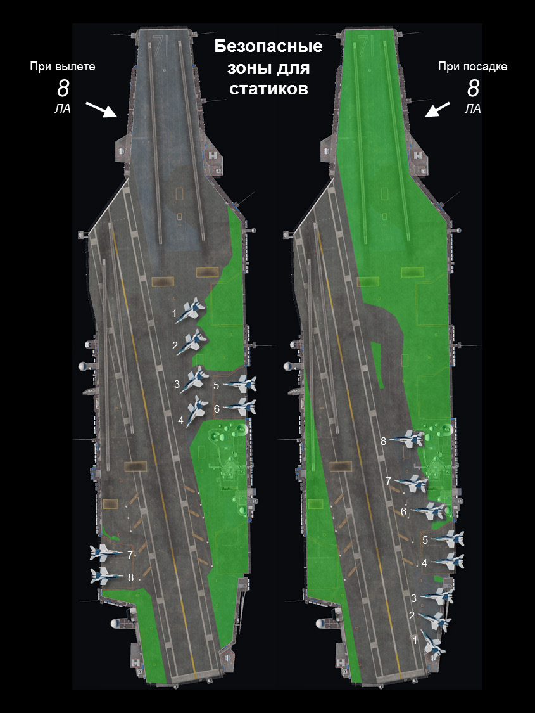
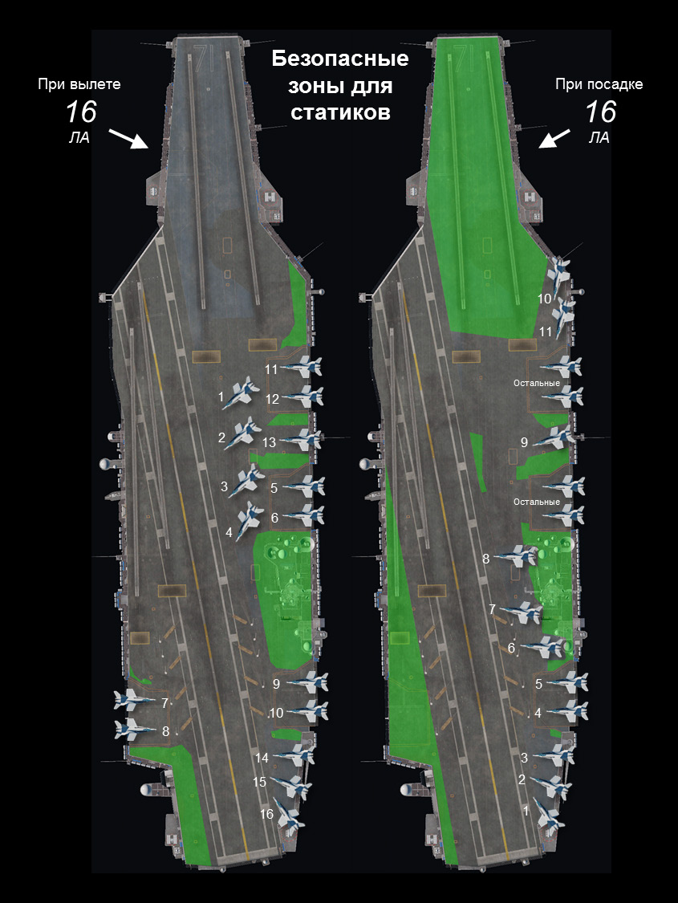
