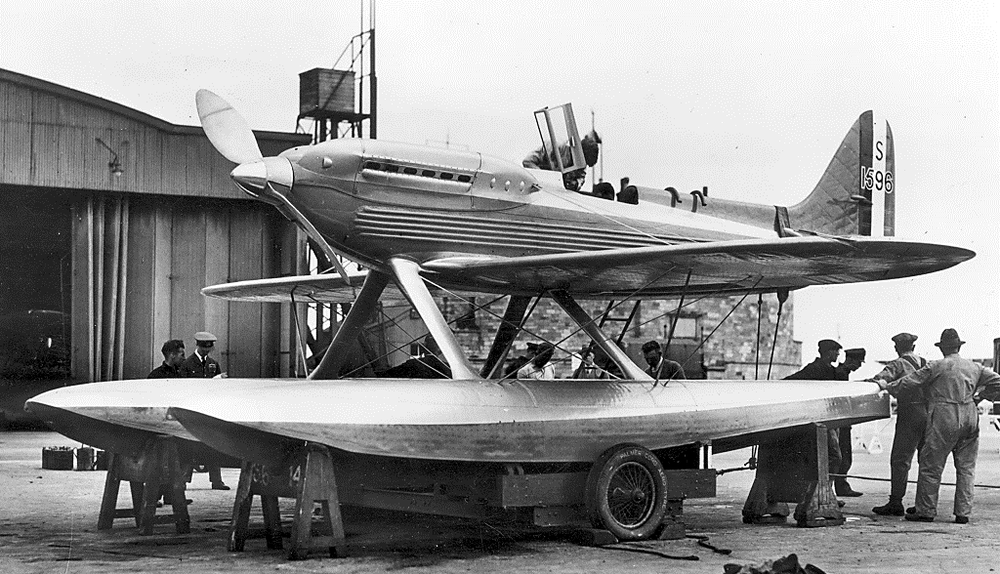
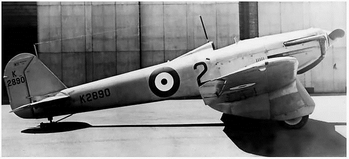
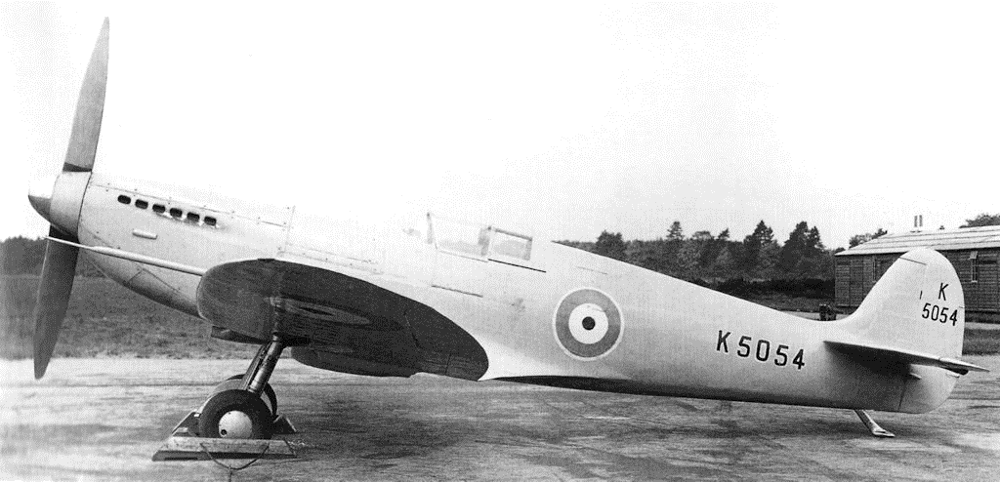
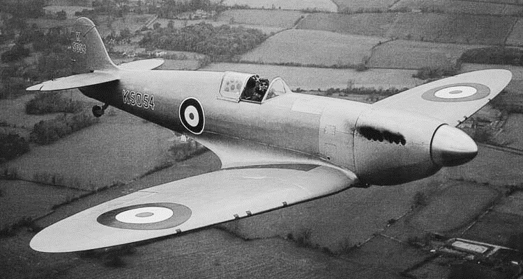
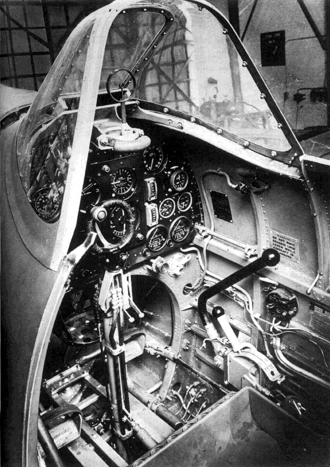
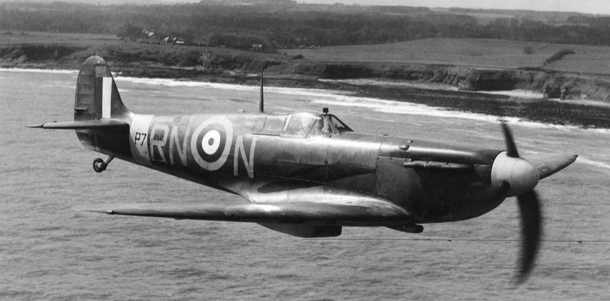
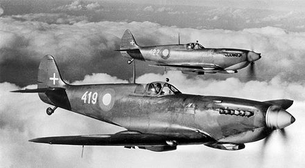
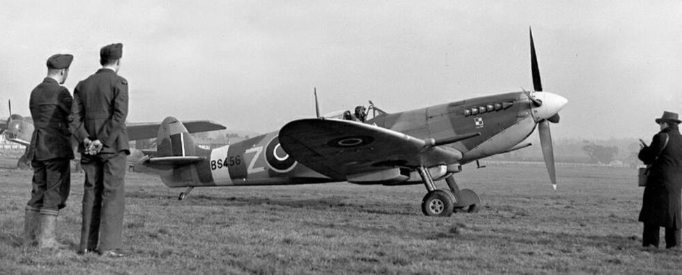
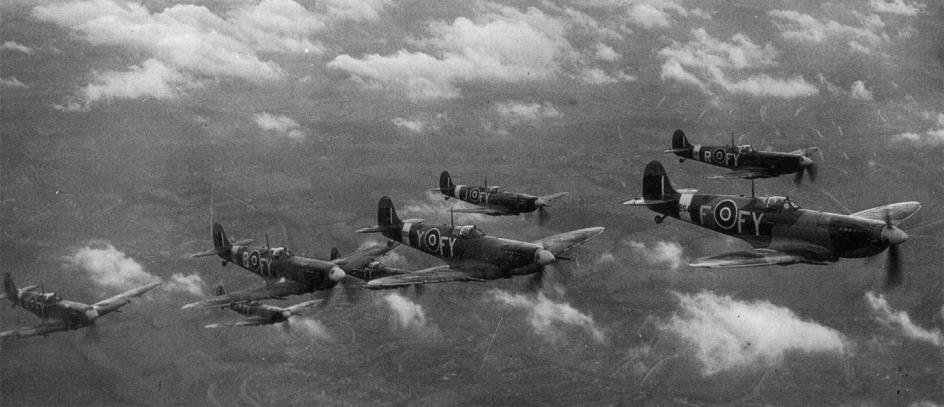

# Введение

## ПРЕДИСЛОВИЕ

### Рождение Английской Легенды

Реджинальд Джозеф Митчелл родился 20 мая 1895 года в деревне Тейк неподалеку от Стоук-он-
Трент. Он был первым из пяти детей в семье учителя Герберта Митчелла. Реджинальд рано
заинтересовался авиацией и уже в молодости строил летающие модели. В 1911 году он начал
работать на фирме "Керр Стюарт & Ко" в Стоуке. Фирма выпускала паровозы. В 1916 году он
перешел на работу на фирму "Pemberton Billing Ltd." в Вулстоне (Woolston) под Саутгемптоном
(Southampton). Эта фирма занималась главным образом ремонтом самолетов морской авиации.
Кроме того, на фирме построили несколько собственных прототипов, которые отличались
оригинальностью конструкции, но серийно не выпускались. Незадолго до начала Первой
Мировой войны фирма сменила свое название на "Supermarine Aviation Works".

На новом месте Реджинальд Митчелл быстро сделал карьеру. Уже в 1919 году в возрасте 24 лет
он стал главным конструктором фирмы. В то время самолеты создавались “на глаз”. Эскизы
деталей Митчелл имел привычку делать мягким карандашом с толстым грифелем. Чертежники,
позднее создававшие по эскизам чертежи, отсчитывали расстояние по середине линий, которые
на эскизах Митчелла могли иметь ширину 5 мм и больше.

Фирма "Supermarine" занималась ремонтом и проектированием гидросамолетов. Первым
крупным успехом фирмы стала победа в конкурсе Шнайдера в 1922 году, когда летающая лодка
"Sea Lion" развила в горизонтальном полете среднюю скорость 233 км/ч. Спустя три года
одномоторный гидросамолет "Supermarine S.4" развил среднюю скорость 364 км/ч. Этот
рекордный результат удалось получить благодаря необычайно чистой для того времени
аэродинамике самолета. К сожалению, при подготовке к очередному конкурсу Шнайдера самолет
разбился из-за возникшего флаттера крыла. Летчик-испытатель сумел уцелеть в произошедшей
катастрофе. В этом же году фирма создала самолет, который пошел в серию. Двухмоторная
разведывательная летающая лодка "Southampton" выпускалась серией в 79 машин, для
Королевских ВВС и иностранных заказчиков.

Гидросамолеты фирмы "Supermarine" продолжали ставить рекорды. В 1927 году самолет S.5
выиграл очередные соревнования, развив скорость 452 км/ч. На конкурсе Шнайдера 1929 года
очередной гидроплан S.6 показал максимальную скорость 574 км/ ч. В 1931 году гидроплан S.6B
на конкурсе Шнайдера развил скорость 655 км/ч.

Все эти успехи принесли фирме "Supermarine" мировую известность, но почти никаких заказов.
Достаточно сказать, что рекордные самолеты S.4, S.5 и S.6B были выпущены общей серией в
восемь машин. На протяжении описываемого периода фирма получала доходы в основном за
счет выпуска и ремонта летающих лодок "Southampton". В 1928 году контрольный пакет акций
компании приобрел концерн "Vickers", но первое время после покупки дела на фирме шли
попрежнему.

### Проект F.7/30 (Type 224)

Осенью 1931 года Министерство авиации выдало техническое задание F.7/30 на новый
истребитель, предназначенный на замену устаревшего истребителя “Bristol Bulldog”.
Многостраничный документ сыграл заметную роль в истории “Spitfire”. В первом из четырнадцати
параграфов определялись характеристики, которыми будущий самолет должен был обладать:

   1.   Максимальная скороподъемность;
   2.   Максимальная скорость на высоте более 15000 футов (4600 м);
   3.   Хороший обзор из кабины;
   4.   Маневренность;
   5.   Технологичность, позволяющая простое и массовое производство;
   6.   Простота технического обслуживания.

Вооружение состояло из четырех пулеметов и бомбодержателей для четырех 20-фунтовых (9-
кг) бомб. Разрешалось использовать на самолете любой двигатель английского производства.
В момент появления спецификации F.7/30 страна находилась в состоянии экономического
кризиса, который особенно больно ударил по английской авиационной промышленности.
Поэтому возможность получить крупный правительственный заказ и, возможно, иностранных
клиентов, породила ожесточенную конкуренцию между английскими авиастроительными
фирмами. В течение трех лет было создано по меньшей мере восемь самолетов самых разных
конструктивных схем. Пять моделей представляли собой бипланы: "Bristol Type 123", "Hawker
PV.3", "Westland PV.4", "Blackburn F.7/30" и "Gloster SS 37". Три других самолета выполнены по
схеме моноплана: “Bristol Type 133”, “Vickers Jockey” и “Supermarine Type 224”.

"Supermarine Type 224" представлял собой цельнометаллический низкоплан, что в то время было
новинкой. Самолет оснастили 670-сильным двигателем "Goshawk" фирмы "Rolls-Royce". Такой же
двигатель использовался на конкурентах "Bristol Type 123", "Hawker PV.3", "Westland PV.4",
"Blackburn F.7/30". Двигатель "Goshawk" был в то время самым мощным английским авиационным
двигателем. Повысить мощность двигателя удалось за счет оригинальной системы охлаждения,
работающей при повышенном давлении. Вода в рубашку двигателя подавалась под давлением,
что повышало температуру ее кипения. Покинув двигатель, перегретая вода тут же испарялась,
а пар направлялся в конденсационные камеры у передней кромки крыла. Оттуда конденсат
собирался в промежуточный бак и снова подавался в двигатель.

Истребитель "Supermarine Type 224" был единственным монопланом с двигателем "Goshawk".
Конденсационные камеры простирались почти до законцовок крыла. Промежуточные баки
находились в верхней части обтекателей неубирающихся стоек шасси. Чтобы увеличить рабочую
охлаждающую поверхность, переднюю кромку крыла выполнили из гофрированного дюраля.
По сравнению со своим предшественником самолет "Type 224" не отличался совершенством ни
в плане конструкции, ни в плане аэродинамики. Конструкторы, опасаясь флаттера и не имея
опыта создания свободнонесущих конструкций, перестарались, сделав крыло излишне толстым
и тяжелым.

Прототип облетали в феврале 1934 года. Быстро обнаружились проблемы с охлаждением
двигателя. Если конкуренты-бипланы имели достаточно пространства для охлаждения пара в
верхнем крыле, то на "224"-ке все было гораздо сложнее. Из верхнего крыла вода бесперебойно
самотеком поступала в промежуточный бак. На моноплане циркуляцию воды приходилось
обеспечивать принудительно с помощью пары насосов. Температура конденсата была немногим
ниже температуры кипения, поэтому любое падение давления приводило к вскипанию воды. В
результате двигатель не охлаждался. Такие случаи отмечались достаточно часто в ходе
предварительных испытаний.

Но и при адекватной работе насосов двигатель "Goshawk" перегревался при быстром наборе
высоты. Когда самолет набирал высоту 4500 м, конденсационные камеры в крыльях
переполнялись паром. При этом срабатывали предохранительные клапаны на законцовках
крыла. Заметив белые струйки пара, пилот должен был перевести машину в горизонтальный
полет и подождать, пока давление в конденсационных камерах придет в норму. Обслуживание
самолета затруднялось тем обстоятельством, что обшивка крыла в районе камер раскалялась
настолько, что требовалось довольно много времени пока она остынет и к ней можно будет
прикасаться голыми руками.

Со всеми этими недостатками можно было бы мириться, если бы характеристики самолета
оказались лучше, чем у конкурентов. Но, к сожалению, все было совсем не так. Максимальная
скорость "Supermarine Type 224" составляла всего 383 км/ч, а высоту 15000 футов он набирал 8
минут. Победителем конкурса стал биплан "Gloster SS 37", который пошел в серию под названием
"Gloster Gladiator". Победитель развивал максимальную скорость 390 км/ч, а высоту 15000 футов
набирал за 6,5 минут.

После всесторонних испытаний на армейском полигоне в Мартлешам-Хит (Martlesham Heath),
самолет передали в исследовательский центр в Фарнборо (Farnborough). В 1937 году самолет
использовали в качестве учебной цели на полигоне Орфорднесс (Orfordness).
Весной или летом 1935 года самолету "Type 224" присвоили собственное имя - "Spitfire". В
разговорном английском слово "Spitfire" означает "злобный, нервный, вспыльчивый человек" или
в данном случае даже "человек, писающий кипятком".

### Проект F.37/34 (Type 300)

Летом 1934 года, когда еще шли испытания самолета "Type 224”, фирма "Supermarine"
приступила к переговорам с Министерством авиации, предлагая новую, более совершенную
машину. Новый самолет "Type 300" представлял собой развитие "Type 224". Ожидалось, что за
счет использования убирающегося шасси, устранения выступающих деталей, замену
гофрированной обшивки гладкой и уменьшения размаха крыла удастся увеличить максимальную
скорость самолета примерно на 50 км/ч. В конце 1934 года проект "Supermarine № 425а"
представили в Министерство авиации.

Военные не слишком заинтересовались предложением фирмы. Но Митчелл не сдавался и его
коллектив продолжал совершенствовать "Type 300". Ранней осенью самолет оснастили более
тонким крылом размахом всего 11,3 м. Кабину закрыли фонарем, а конструкцию облегчили за
счет использования несущей обшивки. Двигатель планировалось оставить прежним. Ожидалось,
что скорость самолета составит около 450 км/ч. С более мощным двигателем самолет мог развить
и большую скорость. На подходе были 700- и даже 800-сильные двигатели "Nappier Dagger". 6
ноября 1934 года руководство концерна "Vickers" вмешалось в работу фирмы, предложив
оснастить самолет перспективным двигателем "Rolls-Royce PV XII" (в будущем этот двигатель
прославился под названием "Merlin"). Но в то время двигатель PV XII еще был сыроват и не
годился для установки на самолет. В июле 1933 года двигатель прошел 100-часовое испытание,
показав стартовую мощность 635 л.с. и максимальную мощность 800 л.с. на высоте 12000 футов
(3700 м). Ожидалось, что мощность двигателя удастся довести до 1000 л.с. В ноябре 1934 года
Митчелл получил согласие на продолжение работ над самолетом “Type 300” с двигателем PV XII.
Это решение утвердил директор концерна "Vickers Aviation ltd. " сэр Роберт Маклин. Концерн
взял на себя финансирование проектных работ, ожидая получить правительственный заказ.
Министерство авиации поддержало идею оснастить самолет двигателем PV XII. 1 декабря 1934
года фирма получила заказ AM 361140/34 на выпуск прототипа "доработанного самолета F.7/30"
суммой 10000 фунтов стерлингов. Новый самолет следовало представить к октябрю 1935 года.
3 января 1935 года Министерство авиации опубликовало техническое задание F.37/34, во многом
основанное на предложениях Митчелла. Эта спецификация представляла собой двухстраничное
дополнение к прежнему техзаданию F.7/30. Конкретных требований к характеристикам самолета
по-прежнему не предъявлялось. Утверждалось лишь, что они должны быть максимально
возможными.

Двигатель PV XII оказался почти на треть тяжелее, чем "Goshawk". Чтобы скомпенсировать
смещение центра тяжести вперед, значительно уменьшили стреловидность передней кромки
крыла. При этом логичным шагом стало придание крылу эллиптической формы, ставшей
отличительной чертой нового самолета. Такая форма крыла обеспечивала минимальное
сопротивление (теоретически идеальную аэродинамику имеет именно овальное крыло). Но не
это было главным. Эллиптическое крыло имеет больший внутренний объем, чем аналогичное по
свойствам крыло трапециевидной формы. Именно это обстоятельство учитывалось прежде всего,
так как в крыле предполагалось разместить убирающееся шасси и вооружение. Для крыла
выбрали профиль NACA 2200 переменной высоты.

Митчелл, все же позаимствовал кое-что из конструкции Не-70, а именно заклепки с потайными
головками. Совместить максимальную прочность и жесткость крыла с минимальной массой
оказалось нелегко. Главный лонжерон составили из двух балок закрытого сечения, составленных
из нескольких профилей, вставленных друг в друга. Лонжерон соединялся с нервюрами,
установленными на одинаковом расстоянии друг от друга. Обшивку передней кромки крыла
выполнили из толстого дюралевого листа. В результате вдоль передней части крыла
образовалась удлиненная камера, имевшая D-образное сечение. Камера играла роль основной
несущей конструкции крыла, одновременно работая и в качестве конденсационной камеры.
Четыре пулемета установили в крыле. Пулеметные стволы находились внутри трубок,
проходивших через камеру. Так удалось создать прочное и в то же время легкое крыло, во
многом обеспечившее успех всего самолета.

Другой необычной чертой крыла была его геометрическая крутка. Угол атаки у основания крыла
составлял +2° и постепенно изменялся до -0,5° у законцовок. В результате срыв воздушного
потока начинался у основания крыла. При этом возникала характерная вибрация,
предупреждавшая пилота о необходимости выйти из маневра. Однако воздушный поток у
законцовок крыла еще оставался невозмущенным, и самолет слушался элеронов.
Стойки шасси прикрепили к задней поверхности главного лонжерона. Стойки убирались наружу
и назад, так что их ниша находилась в задней части крыла, не испытывающей серьезных
нагрузок. Колею шасси решили сделать узкой, чтобы при касании не перегружать лонжерон.
Для дополнительного охлаждения двигателя при взлете и посадке самолет оснастили
выдвигающимся радиатором, расположенным за кабиной. Других отверстий на нижней
поверхности фюзеляжа и крыльев не предусматривалось. Воздухозаборник карбюратора
находился у основания крыла, а воздухозаборники маслорадиатора - по бокам носовой части
фюзеляжа, сразу за двигателем. Поскольку техническое задание предусматривало возможность
использовать самолет в качестве ночного истребителя, выхлопные газы отвели под фюзеляж.
Вопреки бытующему мнению, планер F.37/34 буквально не имел ничего общего с прежними
гидросамолетами Митчелла. Зато опыт создания рекордных самолетов широко применялся в
конструкции двигателя, оснащенного натриевым охлаждением клапанов и свечами, способными
работать при значительных степенях сжатия. Опыт учитывался и при создании винта для
скоростного самолета.

В это время командир эскадрильи Ральф Сорли, руководивший отделом оперативных требований
в Министерстве авиации, предложил, что современный истребитель должен нести по меньшей
мере восемь пулеметов. Мнение Сорли поддержал начальник штаба авиации Эдгар Ладлоу-
Хьюит. Пункт о необходимости вооружить самолет восемью пулеметами появился в техническом
задании F.5/34, но оно не касалось "Spitfire". Позднее это требование повторили в задании
F.10/35 и конструкцию истребителя доработали. Чтобы скомпенсировать массу четырех
дополнительных пулеметов с самолета сняли все бомбовое оборудование и уменьшили объем
топливных баков с 94 до 75 галлонов (с 420 до 340 л). Обозначение самолета осталось прежним
- "Supermarine F.37/34".

В июне 1935 года в Фарнборо в аэродинамической трубе состоялось испытание модели в
масштабе 1:24. Испытания показали, что самолет склонен к попаданию в плоский штопор.
Увеличение площади киля на 40% лишь незначительно исправило ситуацию, поскольку в
штопоре, киль заслонялся горизонтальным стабилизатором. Проблему удалось разрешить
другим образом - горизонтальный стабилизатор подняли на 18 см, а фюзеляж удлинили на 23
см.

В середине 1935 года оставалось устранить последний крупный недостаток самолета. До сих пор
предполагалось, что двигатель PV XII будет иметь поверхностное охлаждение, которое, как уже
известно, влечет определенные проблемы. Но Митчелл не хотел использовать классический
наружный радиатор, который увеличивал лобовое сопротивление самолета. К счастью именно
тогда Фред Мередит из центра в Фарнборо разработал новый тип радиатора. Благодаря
внутренней конструкции нагретый воздух, выходивший из радиатора, создавал реактивную тягу.
Тяга была небольшой, но в некоторых режимах полета практически компенсировала
аэродинамическое сопротивление или даже превосходила его. Эффективность радиатора
удалось повысить, используя в качестве рабочего агента этиленгликоль вместо воды.
Этиленгликоль имеет температуру кипения более высокую, чем вода, потому рабочую
поверхность радиатора удалось сократить почти в два раза.

В начале осени в Вулстоне приступили к сборке прототипа F.37/34. К этому времени в
конструкцию самолета внесли еще ряд изменений. Размах крыла уменьшили до 11,28 м, а
фюзеляжу за кабиной придали овальное сечение. При этом кабина стала шире. За фонарем
добавили еще одну остекленную панель, что улучшило обзор назад. До конца 1935 года
планировалось установить маслорадиатор под двигателем.
Постройку прототипа завершили в середине февраля. После наземных испытаний самолет
разобрали и отправили на аэродром в Истлее.

21 февраля корпорация "Vickers" проинформировала Министерство авиации, что если заводские
испытания удастся завершить к концу марта 1936 года, государственные испытания до конца
апреля 1936 года, то серийный выпуск можно будет начать в течение 15 месяцев, то есть до
сентября 1937 года. Еженедельно можно было бы выпускать по пять машин. До 31 марта 1939
года это позволило бы выпустить 360-380 машин. Как показало будущее, прогноз оказался
чрезвычайно оптимистичным.

Собранный в Истлее прототип приступил к наземным испытаниям двигателя. После небольшой
проверки самолет допустили к полетам.

## Испытания

### Прототип К5054

 В течение первой недели марта прототип F.37/34, получивший регистрационный номер К5054,
находился в ангаре аэродрома Истлей. готовясь к летным испытаниям. В это время
металлическая обшивка самолета оставалась неокрашенной. Обшитые материей рули и элероны
покрасили серебристой краской, а на крыльях и фюзеляже нанесли кокарды Королевских ВВС.
Самолет имел деревянный двухлопастный винт небольшого шага, оптимизированный на взлет и
полет с небольшой скоростью. В то время убирающееся шасси все еще считалось технической
новинкой, поэтому вначале стойки заблокировали в выпущенном положении.

Самолет облетал 5 марта 1936 года главный летчик-испытатель фирмы "Vickers" капитан Дж.
Саммерс. Первый полет продолжался около 20 минут. После посадки, еще не выбравшись из
кабины Саммерс сказал: "Не надо ничего трогать". Саммерс считал, что самолет можно
передавать для дальнейших испытаний в том виде, в каком он был.
Вскоре самолет оснастили винтом, имеющим большой шаг. Начались испытания максимальной
скорости. Кроме того, шасси разблокировали, включили механизм уборки и добавили щитки. 10
марта во втором полете Саммерс впервые убрал шасси в воздухе. Третий полет состоялся 11
марта.

В это время обнаружились проблемы с двигателем, потребовавшие его замены. После замены,
24 марта, самолет снова облетали. На этот раз его пилотировал главный летчик-испытатель
фирмы "Supermarine" - Джордж Пикеринг. 26 марта самолетом управлял Джеффри Квилл.
Приземлившись, Квилл снова поднялся в воздух. При этом он забыл убрать закрылки, которые
на прототипе выпускались на 57°, но самолет благополучно поднялся в воздух.
Единственный обнаруженный недостаток самолета заключался в чрезмерной угловой
балансировке руля направления, в результате чего усилие на руле оказалось минимально, а при
больших скоростях это приводило к недостаточной стабильности на курсе. Других серьезных
недостатков выявить не удалось. Но скорость самолета оказалась значительно ниже
предполагаемых 560 км/ч. Имелась надежда, что ее удастся достичь, доработав конструкцию
самолета, и подобрав для него винт.

В начале апреля закончился предварительный этап испытаний и прототип К5054 передали для
наземных резонансных испытаний. С этой целью Джордж Пикеринг перегнал 6 апреля самолет
в Фарнборо. В ходе испытаний доказали возможность возникновения флаттера при скоростях
меньших, чем предполагалось. Предельной безопасной скоростью для прототипа оказалась
скорость 610 км/ч. 9 апреля Пикеринг перегнал машину обратно в Истлей.
На следующий день самолет поставили в ангар для новой доработки. Прежде всего уменьшили
угловую балансировку руля направления, увеличив взамен площадь киля. Затем сделали уже
горловину воздухозаборника карбюратора, подняв тем самым давление входящего воздуха.
Далее, усилили створки капота, которые гремели в полете. После этого прототип впервые
окрасили в серо-голубой цвет. Самолет окрасили работники фирмы, имевшей эксклюзивный
контракт с "Rolls-Royce" на окраску машин этой фирмы. Увеличить максимально допустимую
скорость самолета можно было только радикально изменив конструкцию крыла, поэтому на
К5054 крыло оставили без изменений.

Примерно в это же время Министерство авиации согласилось официально присвоить самолету
название "Spitfire". Сам Митчелл был очень недоволен этим решением. Он воскликнул: "Это
достаточно дурацкое имя, чтобы они могли его утвердить!". Любопытно, в 1936 году прототип
К5054 назывался "Spitfire II" в отличие от "Spitfire I" - "Type 224".
Полеты возобновили 11 мая. Утром того дня Джеффри Квилл совершил более чем часовой полет,
разгоняя самолет и испытывая его поведение после доработки. С новым рулем самолет
значительно увереннее держался на курсе. Во второй половине дня Саммерс поднял "Spitfire" в
воздух для первой фотографической сессии. Квилл пилотировал авиетку, в которой находились
Джон Йоксалл из журнала "Flight" и Реджинальд Митчелл, который хотел посмотреть на свое
детище в полете.

14 мая Квилл проводил испытания в пикировании. Набрав скорость 610 км/ч по приборам (в
действительности скорость составила 750 км/ч), он услышал гул. Пилот вывел самолет из
пикирования и вернулся в Истлей. На земле оказалось, что оторвалась нижняя часть щитка на
левой стойке шасси, ударив при этом по днищу фюзеляжа.

Повреждения оказались минимальны, и на следующий день самолет был готов к очередному
полету. Теперь главным было как можно скорее отправить машину на государственные
испытания в Мартлешам-Хит. Истребитель фирмы "Hawker" (будущий "Hurricane") уже прибыл
на испытания, поэтому дальнейшие задержки могли привести к аннулированию
государственного заказа. Но на этом этапе "Spitfire" еще не был готов к официальным
испытаниям. Несмотря на все ухищрения, самолет невозможно было разогнать в горизонтальном
полете более чем на 540 км/ч. По данным, имевшимся у фирмы "Supermarine", их конкурент
развивал скорость более 530 км/ч. Такая небольшая разница в скорости не могла считаться
достаточной для уверенной победы в конкурсе. Самолет получил новый винт, с которым 15 мая
развил в горизонтальном полете скорость 560 км/ч. После еще одного полета самолет вернулся
в ангар для окончательной подготовки к испытаниям в Мартлешам-Хите. Теоретически, самолет
следовало вооружить, но в это время пулеметы еще не поступили. На совещании в штабе
авиации 22 мая подняли вопрос о вооружении "Spitfire". Было решено, пока пулеметов нет,
установить аналогичный по массе балласт как на "Spitfire", так и на "Hurricane".
26 мая все было готово и Саммерс перегнал "Spitfire" в Мартлешам-Хит. Как обычно, новый
самолет взвесили, измерили и осмотрели. Обычно, первый полет происходил не раньше, чем
через десять дней по прибытии. Но в случае со "Spitfire" поступило указание как можно быстрее
поднять самолет в воздух. Поэтому в тот же день самолет облетал флайт-лейтенант Хампфри
Эдвардс-Джонс, командир звена "А" на базе. 20-минутный полет подтвердил хорошие
характеристики самолета и простоту его пилотирования. Заходя на посадку, пилот забыл
выпустить шасси и опомнился буквально в последний момент. Можно было бы только
предполагать, что бы случилось, если прототип разбился в первый же день испытаний. В
соответствии с приказом Эдвардс-Джонс позвонил в Министерство авиации сразу же после
посадки. Ему сразу задали вопрос: "Сможет ли молодой летчик управлять этой машиной?". Пилот
ответил утвердительно, но, вспомнив недавние события дня, добавил, что требуется оснастить
самолет индикатором положения шасси. Так решилась судьба "Spitfire". Самолет был принят к
серийному производству.

На следующий день с самолета слили остатки масла и бензина, и отправили самолет на весы.
Центр в Мартлешам-Хите имел точные весы для взвешивания самолетов. Сухая масса прототипа
составила 1851,5 кг. Нормальная взлетная масса (338 л бензина, 32 л масла, пилот 90 кг и 198
кг оснащения - пулеметы, боекомплект и радиостанция) составила 2431 кг. Затем провели серию
испытаний, определяя центр тяжести самолета при разных схемах расположения масс. Заднюю
границу определили в 251 мм за плоскостью отнесения (плоскость от которой производится
отсчёт измерений - эта плоскость проходила по передней наружной поверхности бензобака).
Она соответствовала нормальному снаряженному состоянию самолета, но без 68 кг
боекомплекта, соответствующих 2400 выстрелам. Крайнее переднее положение центра тяжести
находилось в 213 мм за плоскостью отнесения, что соответствовало отсутствию радиостанции
(24,5 кг) и 270 л топлива (209,5 кг), то есть с резервом топлива на один час полета.
Во время проб 6 и 8 июня официально замерили максимальную скорость самолета. Она
составила 561 км/ч на высоте 5100 м. Испытания в Мартлешам-Хите продолжались до 16 июня,
когда Квилл снова отогнал прототип в Истлей. Там самолет планировалось через два дня
продемонстрировать прессе. В полете обнаружилась утечка масла. Тщательный осмотр самолета
причины утечки не выявил. Было решено самолет показать. В последний момент перед отрывом
Квилл обнаружил, что масла в двигателе нет совсем. Сделав небольшой круг на минимальных
оборотах, Квилл красиво посадил машину. Многочисленные журналисты ни о чем не догадались.
Позднее выяснилось, что отсоединился один из маслопроводов, по которому масло быстро
выливалось. Проработавший "на сухую" двигатель требовал немедленной замены.
27 июня Эдвардс-Джонс продемонстрировал К5054 во время показа самолетов Королевских ВВС
в Хендоне. Через два дня Саммерс показал несколько фигур высшего пилотажа на К5054 во
время выставки Британского общества авиационных конструкторов (Society of British Aircraft
Constructors - SBAC) в Хатфилде. Это общество и до ныне каждые два года организует показы
самолетов в Фарнборо.

1 июля прототип снова перегнали в Мартлешам-Хит для дальнейших испытаний. 8 июля центр
посетил король Эдуард VIII. После обеда состоялась демонстрация новых самолетов. Прототип
К5054 пилотировал командир эскадрильи Девид Андерсон.
Все это время отмечались проблемы со створками колесных ниш и щитками стоек шасси. В
середине июля провели испытания, желая установить, насколько их наличие или отсутствие
влияет на аэродинамику самолета. В пределах точности измерения никакой разницы не
обнаружилось. Поэтому с 24 июля "Spitfire" летал уже без створок колесных ниш. В конце
испытаний самолет оснастили трехлопастным винтом "Fairy Reed". 29 июля Джеффри Квилл
прибыл в Мартлешам-Хит для испытаний самолета с новым винтом. Оказалось, что взлет
проходит так же, но скороподъемность и горизонтальная скорость упали. Поэтому самолету
вернули прежний винт, а 1 августа Квилл перегнал К5054 обратно в Истлей.
После завершения государственных испытаний самолет оснастили радиостанцией и пулеметами,
а также устранили некоторые отмеченные недостатки. Это заняло больше времени, чем
предполагалось. Следующий полет состоялся лишь 3 декабря. На самолете при этом стоял
двигатель "Merlin F" мощностью 1065 л.с. на высоте 4875 м.

С 7 по 16 декабря Квилл проводил испытания по вводу и выводу самолета в штопор. Выяснилось,
что при любом положении центра тяжести, самолет легко выходит из штопора. 19 и 20 декабря
самолет летал с трехлопастным винтом “De Havilland” с изменяемым шагом (два положения).
Зимой 1936/37 проходили также оригинальные испытания с применением... сушеного гороха.
Все заклепки на наружной обшивке были с потайной головкой, но это усложняло технологию
сборки самолета и удорожало его выпуск. Поэтому было решено испытать самолет в таком виде,
если бы он имел обычные заклепки с полукруглой головкой. Поэтому техники заклеили все
заклепки колотым горохом, имитируя полукруглые головки. Испытания показали, что заметно
ухудшают характеристики самолета только заклепки на крыльях и хвостовом оперении. Поэтому
на серийных самолетах фюзеляжи собирались с использованием обычных заклепок с
полукруглой головкой. В декабре самолет оснастили хвостовым колесом, заменив им
применявшийся до той поры костыль.

26 февраля начались пробные стрельбы из пулеметов - сначала на земле, затем в полете. 10
марта на высоте 10000 м отказали семь из восьми пулеметов - на большой высоте замерзла
смазка в замках. Именно тогда был поставлен вопрос о необходимости создать эффективную
систему обогрева пулеметов.

22 марта произошла первая крупная авария. Из-за отказа двигателя летный офицер Сэм
Маккенна совершил вынужденную посадку в поле. Самолет получил сравнительно небольшие
повреждения, но ему требовался ремонт. Кроме того, самолет решили оснастить
экспериментальной системой обогрева пулеметов. Наконец, с самолета счистили прежнюю
краску и покрыли боевым камуфляжем: пятнистым зелено-коричневым сверху и сплошным
серебристым снизу.

В это время резко ухудшилось состояние здоровья Реджинальда Митчелла. У конструктора
обнаружили рак. Он умер 11 июня 1937 года в возрасте 42 лет. На должности главного
конструктора фирмы "Supermarine" Митчелла заменил Джо Смит.
Отремонтированный К5054 снова взлетел 9 сентября 1937 года. Через десять дней его
оборудовали новыми выхлопными трубами. Благодаря своей форме они давали тягу порядка 300
Н. Это увеличило максимальную скорость прототипа до 580 км/ч. На самолете испытывались
различные системы обогрева вооружения. Совершались пробные ночные полеты. Джеффри
Квилл установил, что без доработки "Spitfire" на роль ночного истребителя не годится. Языки
пламени, вырывающиеся из выхлопных труб, слепили пилота. Флайт-лейтенант Хайд, который
проводил аналогичные испытания от лица военных, подобной проблемы не отметил.
15 марта 1938 года прототип К5054 попал в новую аварию. В ходе третьей посадки за одну ночь
сержант Уэрхем уткнул самолет носом в землю. Причиной аварии стала слишком большая
скорость самолета во время касания земли. Пневматической системе не хватило мощности
полностью выпустить закрылки на такой скорости. Самолет быстро отремонтировали и оснастили
более мощным компрессором.

23 марта произошла еще одна авария. При жесткой посадке сорвало крепление левой стойки
шасси, в результате стойка пробила крыло насквозь. Для ремонта потребовалось четыре месяца.
Следующий полет состоялся уже 19 июля. Тем временем - 15 мая - облетали первый серийный
"Spitfire". В дальнейшем прототип использовали для отработки второстепенных узлов, например,
системы обогрева пулеметов. Наладить стабильную работу вооружения на холоде удалось лишь
к середине октября 1938 года.

7 ноября К5054 перегнали в Фарнборо. Сначала на прототипе пытались побить мировой рекорд
скорости. 20 мая 1939 года машину в последний раз показали публике. Флайт-лейтенант Холл
пилотировал К5054 в Одигеме во время Имперского дня авиации.
Карьера прототипа К5054 закончилась 4 сентября, в день вступления Великобритании во Вторую
Мировую войну. Флайт-лейтенант Уайт испытывал на самолете новые свечи зажигания. Садясь
в Фарнборо, он неправильно оценил высоту и жестко посадил машину. Истребитель
капотировал. Уайт получил тяжелую травму позвоночника и через четыре дня скончался в
госпитале.

К этому времени главные испытания проводились на серийных истребителях. Конструкция К5054
уже сильно отличалась от серийных самолетов, поэтому ремонтировать прототип не стали. Но и
на слом его не отправили. На уцелевшем фюзеляже в Фарнборо разрабатывался способ
оснастить самолет фотокамерой.
Самолет К5054 обошелся казне в 15776 фунтов стерлингов. Редкий случай, когда деньги
английских налогоплательщиков использовались столь эффективно.

## Серийное производство

3 июня 1936 года, еще до того, как в Мартлешам-Хит начались официальные испытания
прототипа "Spitfire", Министерство авиации заказало 310 экземпляров нового истребителя.
Общая сумма контракта составляла 1395000 фунтов, то есть 4500 фунтов за каждый планер, не
считая двигателя, вооружения, радиостанции и других деталей, закупаемых армией напрямую.
Спустя восемь недель, в конце июля Министерство авиации выдало новое техническое задание
F. 16/36, определявшее изменения, какие нужно внести в конструкцию серийных "Spitfire" по
сравнению с прототипом. Основные претензии военных сводились к конструкции крыла. Они
потребовали придать крылу дополнительную прочность и довести максимально допустимую
скорость до 725 км/ч по приборам, то есть увеличить ее на 110 км/ч по сравнению с прототипом.
Задачу удалось решить, изменив конструкцию лонжерона и увеличив толщину обшивки
передней кромки крыла. Параллельно увеличили запас топлива с 338 до 378 л, а максимальный
угол отклонения закрылков увеличили с 57 до 85°.

Кроме того, фирма "Supermarine" по собственной инициативе внесла в конструкцию самолета
ряд изменений технологического характера, упрощавших и удешевлявших сборку истребителя.
Значительное число деталей на серийных самолетах выковывалось или отливалось целиком, а
не собиралось из нескольких составных элементов. Широко применялись штампованные и
тянутые профили. В результате внутренняя конструкция "Spitfire" изменилась самым
решительным образом. Подготовка технической документации заняла почти целый год. От
прототипа не осталось ни одного чертежа. Прежних деталей осталось так мало, что проще было
перечертить все заново.

По требованию директора концерна "Vickers" сэра Роберта Маклина, выпуск серийных самолетов
следовало начать через 15 месяцев после заключения контракта. То есть, первые серийные
самолеты фирма должна была дать уже в октябре 1937 года. Но скоро выяснилось, что уложиться
в эти сроки невозможно. В 1936 году фирма “Supermarine” располагала 500 работниками и имела
контракты на выпуск 48 амфибий "Walrus" и 17 летающих лодок "Stranraer" для Королевских ВВС.
Ее производственные мощности состояли из двух небольших заводов в Саутгемптоне и ангара в
Истлей. Возможность быстро выполнить крупный контракт отсутствовала. Концерн "Vickers"
также ничем не мог помочь, так как получил заказ на 180 бомбардировщиков "Wellington".
Пришлось передавать часть заказа субподрядчикам. В ноябре фирма "General Aircraft ltd."
получила заказы на хвосты для "Spitfire". Маклин не был сторонником передачи субподрядов за
пределы своего концерна. Но Министерство авиации настаивало на сжатых сроках. Пришлось
передать субподрядчикам до 80% объема заказа. Уточненный график поставок предусматривал
постройку первых самолетов в декабре 1937 года. Но и этот график пришлось пересмотреть,
когда выяснилось, что чертежники фирмы "Supermarine" не успевают подготовить комплекты
технической документации для субподрядчиков. В это время чертежный отдел фирмы был
перегружен работой по составлению чертежей для амфибии проекта S.7/38 и тяжелого
бомбардировщика В. 12/36.

## На службе

### Mk.I

Первый серийный самолет (К9787) поднялся в воздух лишь 15 мая 1938 года. Его облетал
Джеффри Квилл. Испытатель убедился, что характеристики самолета не ухудшились, а
некоторые даже улучшились. В частности, благодаря большему углу отклонения закрылков
самолет стал увереннее вести себя при посадке. Испытания на флаттер в Фарнборо показали,
что самолет можно безопасно разгонять до 755 км/ч, то есть требование Министерства авиации
удалось перевыполнить на 30 км/ч. Но появилась новая проблема. При скоростях пикирования
больше 640 км/ч физические усилия для работы элеронами превосходили возможности
нормального человека. Но этот недостаток оставили без исправления, так как считалось, что
подобные экстремальные режимы пилотирования встречаются редко и не требуют активного
маневрирования.

Выпуск и дальше шел с опозданием. Первый самолет поступил заказчику лишь 19 июля. Это был
самолет К9788, второй серийный экземпляр. Его тут же отправили в Мартлешам-Хит. 27 июля
туда же отправился и первый серийный истребитель К9787. 4 августа 19-я эскадрилья,
дислоцированная в Даксфорде, получила "Spitfire" К9789. Следующий самолет К9790 поступил в
эскадрилью 11 августа, а К9792 - 16 августа. Машина К9791 осталась на фирме для испытаний.
В сентябре 1938 года Королевские ВВС получили только два "Spitfire", а в октябре - уже 13. К
началу 1939 года заказчик получил уже 49 машин. Все эти самолеты не имели одной важной
детали – обогрева пулеметов. Это означало, что на большой высоте пулеметы с большой
вероятностью могут отказать. Лишь в начале 1939 года, передав Королевским ВВС уже 60 машин,
фирма "Supermarine" начала ставить на пулеметы систему обогрева.

Итоговая стоимость первых 310 планеров "Spitfire" составила 1870242 фунта стерлингов, в
среднем 6033 фунтов стерлингов за штуку. То есть самолет стоил на 1533 фунта стерлингов
больше, чем предполагалось. В 1937 году поступил новый заказ на 200 "Spitfire" по цене 5696
фунтов за штуку.

Война приближалась, становилось ясно, что небольшая фирма "Supermarine" из пригородов
Саутгемптона не сможет дать нужного числа истребителей. Поэтому правительство
финансировало строительство крупного завода в Касл-Бромвич под Бирмингемом, с целью
выпускать там истребители "Spitfire" и бомбардировщики "Wellington". Предприятие
контролировал автомобильный концерн "Morris Motors ltd.". Строительство цехов началось в
июле 1938 года.

Опыт эксплуатации первых "Spitfire" обнажил некоторые недостатки. Стартер оказался слишком
слабым, из двигателя подтекало масло, ручной выпуск шасси требовал больших физических
усилий от пилота, а высоким пилотам приходилось сутулиться, чтобы закрыть фонарь. Все эти
недостатки уже были известны и соответствующие модификации подготовлены. Проблему с
пуском двигателя решил новый стартер с большей скоростью вращения. Выпуклый фонарь
оставлял место даже для самых рослых пилотов. Систему выпуска шасси оснастили
гидравлическим приводом. Все эти доработки довольно быстро внедрили в производство.
Труднее пришлось с герметизацией двигателя. Эту проблему полностью решить не удалось на
протяжении всей боевой карьеры истребителя.

Первые 77 самолетов "Spitfire" получили деревянные двухлопастные винты. Начиная с 78-го
экземпляра стандартом стал металлический трехлопастный винт "De Havilland". К тому времени
все самолеты получили выпуклые фонари кабины. В крылья подавался теплый воздух от
работающего двигателя, обдувающий пулеметы. О наличии системы обдува вооружения теплым
воздухом свидетельствовало небольшое выпускное отверстие на нижней стороне крыла за
пулеметами.

Тем временем встал вопрос о вооружении самолета более мощным оружием. Выбор руководства
Королевских ВВС пал на французскую 20-мм пушку "Hispano", как имевшую наибольшую
пробивную способность. В июле 1939 года в Мартлешам-Хит состоялись испытания "Spitfire"
L1007, вооруженного двумя пушками "Hispano" с боекомплектом 60 выстрелов на ствол вместо
восьми штатных пулеметов. Хотя две пушки весили на 4,5 кг легче восьми пулеметов,
максимальная скорость уменьшилась на 5 км/ч из-за массивных стволов и обтекателей
барабанов с боекомплектом. Во время испытаний на полигоне в Орфорднесс пушки постоянно
отказывали, особенно после резких маневров. Выяснилось, что пушка "Hispano" проектировалось
для установки в развале блока цилиндров двигателя. Массивный двигатель должен был брать
на себя энергию отдачи. Установка пушки в крыле привела к тому, что пушка деформировалась
при стрельбе. 13 января пайлот-офицер Джордж Праудмен провел первый воздушный бой на
пушечном "Spitfire". Летчик атаковал немецкий бомбардировщик Не-111. Прежде чем обе пушки
отказали, он успел сделать один выстрел из правой и 30 выстрелов из левой пушки. Тяжело
поврежденный бомбардировщик был добит другим истребителем. Этот бой показал, как
эффективность пушечного вооружения, так и низкую надежность пушек "Hispano".
Первые бои с Bf-109 состоялись во время эвакуации Дюнкерка. К тому времени "Spitfire" уже
заметно изменились от машин первой производственной серии. Внешне они отличались
трехлопастными винтами "Rotol" или "De Havilland" с автоматической регулировкой шага, а также
толстым лобовым бронестеклом. В хвостовой части самолета установили устройство
определения "свой-чужой" (Identification Friend or Foe - IFF), антенны которого проходили по
обоим бортам до хвостового оперения. Самолет оснастили бронеплитами общей массой 33 кг.
Плиты находились под сиденьем и за спинкой кресла пилотов, а также перед баками с топливом
и этиленгликолем. Сверху верхний бензобак закрывал лист обшивки большей толщины.

Весной 1940 года самолеты стали заправлять бензином с октановым числом 100 вместо 87. Хотя
на высотах более 5000 м это практически никак не сказывалось на характеристиках самолета,
на небольших высотах удалось поднять давление во впускном тракте с 4,3 до 8,3 ГПа без риска
детонации. В результате мощность двигателя повысилась. На уровне моря максимальная
скорость возросла на 40 км/ч, а на высоте 3000 м - на 55 км/ч.

В результате всех переделок взлетная масса самолета увеличилась на 152 кг до 2792 кг.
Некоторые элементы сказались на скорости самолета. Так, лобовое бронестекло стоило 10 км/ч,
а антенны устройства "свой-чужой" - 3 км/ч. Обычно в качестве скорости "Spitfire Mk.I" - 582 км/ч
(362 миль/ч) на высоте 5640 м (18500 футов) - приводится скорость первого серийного самолета
К9787, весившего 2640 кг. Летом 1940 года максимальная скорость полностью оснащенного
серийного "Spitfire Mk.I" составляла всего около 560 км/ч на той же высоте.
Поздней весной 1940 года было решено, что пушечная модификация достаточно доведена,
чтобы ее использовать на фронте. Для различения пушечного и пулеметного варианта им
присвоили обозначения: Mk.IB и Mk.IA соответственно.

"Битва за Англию" стала экзаменом для всех Королевских ВВС. По сравнению с Bf-109Е - главным
соперником "Spitfire Mk.I" - английский истребитель был немного быстрее на высотах до 4500 м
и немного медленнее на высотах более 6000 м. Практически на всех высотах и скоростях "Spitfire"
превосходил "Messershmitt Bf-109E" на горизонтали, зато Bf-109E превосходил Mk.I на вертикали.
Но упомянутые различия между обоими истребителями были минимальны. В реальном бою
гораздо сильнее ощущались тактическое превосходство: кто первым заметил противника, кто
имел преимущество в высоте, кто зашел со стороны солнца, у кого лучше координированы
действия, и т.д.

"Spitfire" отрывался от "Messershmitt", уходя в вираж.

"Messershmitt" отрывался от "Spitfire", уходя в пике.

"Messershmitt", оснащенный двигателем с непосредственным впрыском топлива, увереннее
проводил резкие маневры, тогда как "Spitfire", оснащенный поплавковым карбюратором,
неуверенно себя чувствовал на таких маневрах. Столкнувшись с этой проблемой специалисты из
"Rolls-Royce" и в Фарнборо лихорадочно искали выход в создавшейся ситуации. Такое решение
удалось найти, но быстро внедрить его не смогли.

Чтобы лично ознакомиться с проблемами боевого применения самолета, Джеффри Квилл в
августе-сентябре 1940 года служил в составе 65-й эскадрильи в Хорнчерче. 16 августа он сбил
Bf-109, а 18-го участвовал в коллективной атаке на Не-111. Вернулся он на фирму с четким
представлением о том, что нужно изменить в конструкции самолёта. Важнее всего было наладить
работу элеронов при пикировании с большой скоростью. При скорости больше 640 км/ч элероны,
по сути, блокировались, и пилоту приходилось прикладывать огромные усилия, чтобы хоть
немного отклонить их от нейтрального положения. (Надо заметить, что на Bf-109 имелась та же
проблема).

Причину блокировки элеронов на большой скорости вскоре удалось установить. Воздушный
поток выгибал матерчатую обшивку элерона вверх, при этом задняя кромка элерона становилась
толстой и парусила. Было решено заменить матерчатую обшивку элеронов металлической. В
ноябре 1940 года Квилл облетал самолет с новыми элеронами и нашел, что проблема
практически решена. "Spitfire" с металлическими элеронами направили в Тангмер, где его принял
командир 602-й эскадрильи Сэнди Джонстоун. Вскоре он составил рапорт, в котором отметил:
"Эффективность новых элеронов возросла настолько, что я бы не поверил, если бы сам не
испытал самолет". Тут же началась замена элеронов на всех самолетах.

Вернувшись на завод, Квилл доложил о плохом обзоре назад. Многие пилоты были сбиты прежде
чем заметили севшего на хвост противника. Он предложил два решения: одно временное, другое
кардинальное. Временное решение предусматривало установку фонаря, выгнутого не только
вверх, но и по бокам, так чтобы пилот мог заглядывать назад. Кардинально решить проблему с
обзором назад Квилл предлагал, оснастив истребитель каплевидной кабиной. Это предложение
Квилла внедрили в конструкцию самолета лишь четыре года спустя.

После дополнительной доработки самолёт "Spitfire Mk.IB" в ноябре 1940 года направили в
92-ю эскадрилью. Для пушки разработали специальный жесткий лафет, поэтому ее надежность
заметно возросла. Но "Битва за Англию" уже фактически закончилась и пушечные "Spitfire Mk.I"
одержали лишь единичные победы. В качестве компромиссного варианта предложили вооружить
самолет двумя пушками и четырьмя пулеметами калибра 7,7 мм. Эту схему опробовали на
самолете Х4257 летом и осенью 1940 года. Позднее такая схема вооружения стала основной и
применялась на подавляющем большинстве истребителей "Spitfire".

На базе "Spitfire Mk.I" создали ряд специализированных вариантов, в том числе "Speed Spitfire"
и целое семейство разведывательных машин. Некоторые модификации затронули только по
одной машине. На базе R6722 создали поплавковый гидросамолёт (хотя он так никогда и не
взлетал с воды). Самолет К9791 претерпел целый ряд переделок, получая разные винты,
деревянные макеты пушечного вооружения, подвесные бензобаки под крыльями. Самолет Р9565
получил один 180-литровый бензобак под левым крылом.
Выпуск "Spitfire Mk.I" продолжался фирмой "Supermarine" до марта 1941 года, когда его заменил
"Spitfire Mk.V". В июле-сентябре фирма "Westland Aircraft ltd. " в Йеовиле построила еще 50
самолетов в рамках контракта, заключенного годом раньше. Всего построили 1556 "Spitfire Mk.I".

### Mk.II

"Spitfire Mk.II" отличался от своего предшественника более мощным двигателем "Merlin XII",
оснащенный системой охлаждения, работавшей на находящимся под давлением антифризе, а
также пиротехническим стартером системы Коффмана. Летом 1939 года двигатель "Merlin XII"
установили на "Spitfire Mk.I" K9788 - второй серийный экземпляр. Характеристики самолёта
улучшились, тогда было решено использовать этот двигатель на следующей серии самолетов.
По сравнению с Mk.I, "Spitfire Mk.II" отличался только небольшим каплевидным обтекателем на
капоте, расположенным справа, сразу за винтом, а также более тупоносым коком винта. Под
обтекателем скрывался новый стартер.

Было решено, что выпуск "Spitfire Mk.II" организуют на новом заводе в Касл-Бромвиче под
Бирмингемом. Строительство этого завода началось еще летом 1938 года. Контролировала завод
автомобильная фирма "Morris Motors ltd.", которая планировала наладить выпуск самолетов по
типу автомобильного конвейера. Планировалось создать соответствующую оснастку,
позволявшую использовать малоквалифицированную рабочую силу. Владелец концерна "Morris
Motors ltd." лорд Наффилд не поскупился на оснащение нового завода. Но оказалось, что
истребители нельзя выпускать как автомобили. Организация труда на новом заводе исключала
возможность вносить в конструкцию самолета изменения. Дело приобрело неблагоприятный
оборот. В донесении Майлза Томаса, вице-президента фирмы "Morris Motors ltd.", лорд Наффилд
был горячим сторонником автоматизации и членения производственного процесса на
минимальные, но неизменные операции. В то же время "Spitfire" постоянно совершенствовался,
как того требовал опыт, получаемый в боях. В результате начало выпуска постоянно
откладывалось, так как готовилась новая оснастка для очередной модификации. В Касл-Бромвич
накапливалось все большее и большее число деталей, но самолетов завод не давал. Отношения
между Министерством авиации и концерном "Vickers" с одной стороны, и фирмой "Morris Motors
ltd." с другой стороны становились напряженными. Для Наффилда, имевшего славу
великолепного технолога, нескончаемая модификация самолета стала настоящим кошмаром.
17 мая 1940 года лорд Бивербрук, тремя днями ранее назначенный на новую должность министра
авиационной промышленности, отстранил Наффилда от управления заводом в Касл-Бромвич.
Строительство завода финансировалось правительством, поэтому Бивербрук был в своем праве.
Завод тут же передали под контроль "Morris Motors ltd.". Штат завода усилили кадрами фирмы
"Supermarine". В конце концов удалось наладить производство. Первые десять "Spitfire" завод
должен был дать к концу июня 1940 года. Силами самого завода в Касл-Бромвиче этого сделать
было невозможно, поэтому руководство концерна "Vickers" пошло на подлог. С завода
"Supermarine" в Саутгемптоне в Касл-Бромвич доставили несколько фюзеляжей в сборе и
множество других агрегатов. Только благодаря этому вливанию "июньскую десятку" самолетов
удалось сдать в срок.

Наффилду следовало с самого начала признать, что в условиях непрерывной доработки
конструкции    самолета    нельзя    обойтись   только    автоматизированным     трудом
малоквалифицированных кадров. Разумеется, с помощью простых рабочих, располагавших
соответствующей оснасткой, можно было собирать все узлы, конструкция которых оставалась
неизменной,   но   сборку    постоянно   дорабатываемых    узлов  следовало    поручить
высококвалифицированным рабочим, способным работать руками и головой.
В июле завод в Касл-Бромвич дал 23 самолёта, в августе - 37, в сентябре - 56.
Первый серийный "Spitfire Mk.IIA" нес восемь 7,7-мм пулеметов "Browning". Вскоре в серию
пошел и "Spitfire Mk.IIB" с двумя пушками "Hispano" и четырьмя пулемётами. Всего завод
выпустил 921 Mk.II, в том числе 751 Mk.IIA, остальные Mk.IIB. В марте 1941 года завод
переключился на выпуск модификации Mk.V.

Около пятидесяти самолетов Mk.IIA оснастили 180-литровым баком, расположенным под левым
крылом. Эти самолеты поступили в 66-ю, 118-го и 152-ю эскадрильи. Поскольку бак заметно
сказался на максимальной скорости самолёта, популярностью у пилотов эта модификация не
пользовалась.

В 1943 году около 50 снятых с вооружения самолетов "Spitfire Mk.II" оснастили двигателями
“Merlin XX”, а затем передали на морскую воздушно-поисковую службу. Самолеты дополнительно
несли спасательный комплект "Type E", состоявший из одного большого и двух малых
контейнеров, установленных за кабиной пилота. В большом контейнере помещался
многоместный надувной плот "Type L". В одном из малых контейнеров находилось 69 метров
плавающего троса, а в другом - запас пищи и воды. Когда пилот сбрасывал спасательный
комплект, сначала выходил большой контейнер, который тянул за собой трос из малого
контейнера. Когда трос полностью выпускался, срабатывала система надувания плота. Затем
выходили оба меньших контейнера, содержавшие в себе запас воды и пищи, аптечку и
ракетницу. Длинный трос, соединявший контейнеры с плотом, увеличивал шансы тонущих
добраться до плота. Преимущество спасательного комплекта "Type E" заключалось в том, что
его установка на самолет не требовала серьезных переделок, а также практически не
сказывалась на боевых возможностях самолета.

В начале 1942 года отряд совершенствования тактики воздушного боя (Air Fighting Development
Unit - AFDU) провел интересные испытания "Spitfire Mk.I" (K9830), модифицированного до
стандарта Mk.II. самолёт был оборудован перископом, открывавшим вид вперед и вниз, обычно
заслонённый капотом двигателя. Это устройство было особенно полезным при атаке целей с
большой угловой поправкой, когда нос самолёта заслонял собой цель. В таких условиях пилоту
приходилось стрелять наугад, надеясь на одну интуицию. Устройство состояло из двух зеркал,
одно из которых находилось над фонарем, а второе - внутри фонаря. Но испытание показало
низкую эффективность перископа, который увеличивал поле зрения пилота всего на 2°. В итоге
идею признали бесперспективной.

На "Spitfire Mk.I" испытывался так называемый "механизм тип 6". Под этим условным
обозначением скрывался прицел с гироскопической коррекцией, разработанный в Фарнборо для
стрельбы в крутом вираже. Позднее этот "механизм" получил известность как гироскопический
прицел Mk.I. Его доработанный вариант Mk.II широко применялся в последние месяцы войны.

### Mk.V

В конце 1940 года командование истребительной авиации было всерьез обеспокоено
повторением “Битвы за Англию” весной-летом 1941 года. При этом не исключалась возможность
того, что противник применит более совершенные истребители и бомбардировщики,
развивающие большую скорость и способные действовать на больших высотах. Разведчики
"Junkers-86P", оснащенные высотными двигателями, уже действовали безнаказанно над
Великобританией, поднимаясь на высоту более 11500 м. В начале 1941 года штаб ВВС решил
начать выпуск истребителей "Spitfire Mk.V" вместо "Spitfire Mk.III". Первоначально "Spitfire Mk.V"
рассматривался как временное решение, выпуск которого следовало продолжать до появления
ожидавшегося высотного истребителя "Spitfire Mk.VI", оснащённого гермокабиной.
Самолет Mk.V представлял собой планер Мk.I или Mk.II с усиленной моторамой, на которую
установили мощный двигатель "Merlin 45". Главной наружной особенностью, отличавшей Mk.V
от предыдущих образцов, был увеличенный маслорадиатор с круглым воздухозаборником вместо
полукруглого, как было прежде.

Первые Mk.V строили, переделывая серийные Мk.I и Mk.II. Джеффри Квилл впервые облетал
"Spitfire Mk.V" Х9422 20 февраля 1941 года. В этом же месяце полетел второй "Spitfire Mk.V" -
К9788, оснащенный двигателем "Merlin 45". Этот самолет направили для испытаний в Боском-
Даун.

Серийно "Spitfire Mk.V" выпускались в двух вариантах: Mk.VA и Mk.VB - пулемётном и пушечном.
Всего собрали 94 Mk.VA, после чего их выпуск свернули в пользу пушечного варианта. В 1941
году истребители "Spitfire Mk.VB" массовой серией выпускались фирмами "Supermarine" и
"Westland", а также заводом в Касл-Бромвич.

Истребители Mk.V появились в тот момент, когда командование истребительной авиации
постепенно переходило от обороны к наступлению. Поэтому самолеты этого типа все чаще
появлялись над Францией и Бельгией, занимаясь свободной охотой или сопровождая английские
бомбардировщики. Поскольку радиус действия самолета был слишком малым, начались работы
по созданию подвесных сбрасываемых баков объемом 135 л (30 галлонов) и 203 л (45 галлонов).
Бак вплотную подвешивался к днищу фюзеляжа.

В октябре 1941 года появился Mk.VC, который походил на Mk.VB, но имел усиленное крыло,
конструкция которого напоминала крыло Mk.III. Это было так называемое универсальное крыло,
в которое можно было установить любую конфигурацию вооружения: восемь пулеметов, две
пушки и четыре пулемета, четыре пушки. Боекомплект пушек у Mk.VC составлял 120 выстрелов
на ствол, тогда как на Mk. VB был всего 60 выстрелов на ствол. На Mk.VC колеса шасси выдвинули
на 5 см вперед, как на Mk.III.

В июне 1941 года Германия напала на Советский Союз, поэтому стало ясно, что новых налетов
на Великобританию не последует. Поэтому "Spitfire Mk.VI" оснащённый гермокабиной, в крупную
серию не пошёл. Оказалось, что создаваемый в качестве временной меры Mk.V вполне отвечает
требованиям командования истребительной авиации. Поэтому серийный выпуск самолета
продолжился.

Как уже говорилось, до конца 1941 года "Spitfire Mk.V" состоял на вооружении почти всех
истребительных эскадрилий Королевских ВВС на территории Англии, но ни один из них не попал
на Средиземноморский ТВД, где шли основные бои с участием английских войск. Чтобы
применять "Spitfire" в условиях пустыни, его следовало оснастить эффективным воздушным
фильтром. Без такого приспособления пыль, попадавшая в карбюратор, приводила к быстрому
износу цилиндров. Первоначально воздушный фильтр установили под двигателем, в результате
образовалась характерная «борода», которая съела около 13 км/ч скорости и около 2,8 м/с
скороподъемности у земли.

В конце 1941 года разработали большой 405-литровый (90 галлонов) подвесной сбрасываемый
бензобак. Впервые его иcпользовали 7 марта 1942 года во время операции "Spotter" - доставки
на Мальту 15 "Spitfire Mk.VB" в тропическом варианте. Самолеты предполагалось выпустить с
палубы авианосца HMS "Eagle" у побережья Алжира. При этом перебазировании самолеты
пролетели 1060 км.

В течение всей войны предпринимались попытки повысить боеспособность "Spitfire". В конце
1941 года удалось устранить один из крупных недостатков истребителя - нестабильную работу
двигателя при резких маневрах. На фирме "Rolls-Royce" разработали новый тип карбюратора, в
котором поплавок заменили мембраной. Новый карбюратор впервые установили на "Spitfire
Mk.VB" (W3228). В декабре 1941 года самолет прошел испытания в Боском-Даун. Результаты
оказались многообещающими. В рапорте сообщалось: "Мембранный карбюратор превращает
"Spitfire Mk.V" в отличную боевую машину, поскольку позволяет проводить активные маневры,
связанные с серьезными перегрузками. Теперь самолёт может проводить такие маневры,
которые были невозможны на самолете с поплавковым карбюратором. Но следует помнить, что
значительные или продолжительные перегрузки приводят к падению давления масла в
двигателе, что может привести к повреждению двигателя, если полет в экстремальных условиях
продолжается слишком долго. Этот недостаток сильно не сказывается на нормальном боевом
применении истребителя. Тем не менее, следует предупредить пилотов о возможности
повреждения двигателя при длительном активном маневрировании на самолете с мембранным
карбюратором".

Мембранный карбюратор применялся на двигателях "Merlin" 50-й серии, который ставили на
"Spitfire Mk.V" поздних выпусков.

Но и немцы не дремали. В начале 1942 года стало ясно, что "Spitfire Mk.V" уступает новому
"Focke-Wulf 190A". Англичанам представилась возможность провести сравнительные испытания
немецкого истребителя с английскими машинами, когда в июне 1942 года один Fw-190 по ошибке
сел на английском аэродроме. Выяснилось, что "Focke-Wulf" превосходил "Spitfire" в
максимальной скорости, скороподъемности, скорости пикирования и скорости крена. К счастью
для командования истребительной авиации люфтваффе в этот период не проявляло большой
активности на Западном фронте, поэтому немцы не смогли полностью использовать потенциал
своих новейших истребителей.

Ответом на Fw-190 должен был стать "Spitfire" с двигателем "Merlin 61". Но и у "Spitfire Mk.V"
оставались резервы, позволявшие повысить его шансы уцелеть при встрече с "Focke-Wulf",
особенно у земли. Прежде всего самолету укоротили крылья, сняв законцовки. В результате
размах крыла уменьшился до 9,91 м, а площадь до 21,46 м2 (всего на 1,02 м2). В результате
самолет стал гораздо живее «крутить» бочку, немного повысилась максимальная скорость,
скорость пикирования и улучшилась динамика разгона на высотах до 3000 м.
Следующим шагом была установка на самолет двигателя "Merlin 50М", оптимизированного для
небольших высот. От "Merlin 45" он отличался только урезанным ротором наддува, который
давал максимальное давление 12,4 ГПа на высоте всего 1800 м, что обеспечивало самолету
скорость 560 км/ч, то есть почти как у "Focke-Wulf". Соединение укороченных (clipped) крыльев
и урезанного (cropped) ротора наддува дало "Spitfire LF.V", который неофициально называли
"Spitfire укороченный и урезанный". Иногда эту модификацию называли еще и скрипучей:
подразумевая, что самолеты, прошедшие переделку до стандарта LF.Mk.V, как правило не
отличались новизной.

В 1942 году под крыльями у "Spitfire" снова появились бомбы, впервые за семь лет, которые
прошли после изменения технического задания F.37/34. В августе 1942 года 126-я эскадрилья,
дислоцированная на Мальте, приступила к налетам на Сицилию. Находившиеся на вооружении
эскадрильи у "Spitfire Mk.VC" несли под крыльями по одной 250-фунтовой (113-кг) бомбе. С
этого момента Mk.VC и последующие модификации все шире применялись в роли истребителей-
бомбардировщиков.

Первоначально все "Spitfire Mk.VC" перебрасывались на Мальту с помощью авианосцев. Этот
способ был тем плох, что отрывал авианосцы от выполнения их основных задач. Поэтому для у
"Spitfire Mk.VC" разработали модификацию, позволявшую совершать беспосадочный перелет с
Гибралтара на Мальту. Этот маршрут протяженностью 1750 км примерно равен расстоянию от
Лондона до Киева. Самолеты оборудовались 130-литровым баком за сиденьем пилота,
увеличенным маслобаком под двигателем и подвесным сбрасываемым баком на 765 л (170
галлонов) под фюзеляжем. На время перелета, а такие перелеты начались в октябре 1942 года,
самолеты несли всего два 7,7-мм пулемета. На Мальте с самолётов снимали дополнительные
баки, устанавливали тропические фильтры и остальное вооружение.

В мае 1942 года люфтваффе начало разведывательные полеты над Египтом, применяя самолеты
Ju-86R, действовавшие на сверхбольших высотах. База немецких разведчиков находилась на
Крите. Для перехвата разведчиков несколько "Spitfire Mk.V" переделали в высотные
перехватчики. Переделку проводили на базе ремонтного батальона в Абукире. С самолетов
сняли все лишнее оборудование, все бронирование и четыре пулемета, а также подняли
давление во впускном тракте двигателя. После первых пробных полетов конструкцию самолётов
еще больше облегчили. С них сняли радиостанцию и мачту антенны, штатный аккумулятор
заменили более легким, на 135 л сократили обычную заправку бензином.

На самолетах "Spitfire Mk.V" применялись крылья трех типов (А, В и С) с законцовками и без, а
также девять типов двигателей "Merlin" (45, 45М, 46, 50, 50А, 50М, 55, 55М и 56). Литерой "М"
обозначался двигатель с урезанным ротором наддува, оптимизированного под небольшие
высоты. "Merlin 46" представлял собой высотную модификацию "Merlin 45". Серия 50 отличалась
наличием мембранного карбюратора. 50А и 56 были высотными двигателями, аналогами 46. 55
и 56 имели блок цилиндров из двух частей. В результате характеристики "Spitfire Mk.V"
колебались в самых широких пределах. Кроме двигателя на скоростные качества влияло наличие
или отсутствие тропического фильтра, а также другие особенности в конструкции самолёта. В
1943 году в Фарнборо провели серию испытаний самолета "Spitfire Mk.V" (EN946). В конструкцию
самолета вносились изменения, которые влияли на его скорость, после чего изменение скорости
определялось на практике. Первоначально самолёт развивал 574 км/ч. Установка
индивидуальных выхлопных патрубков вместо штатных сдвоенных типа “рыбий хвост” дала
прирост скорости 11 км/ч. Демонтаж противообледенительной заслонки на карбюраторе дал еще
13 км/ч. Обтекатель на зеркале заднего вида добавил 5 км/ч. Демонтаж мачты антенны дал
выигрыш в 1 км/ч. Выравнивание отверстия сброса гильз с поверхностью крыла добавило 2 км/ч.
Шпаклёвка всех щелей, ровная окраска и полировка передней кромки крыла добавила 10 км/ч.
Полировка остальной поверхности самолета добавила 5 км/ч. В итоге все эти незначительные
изменения позволили увеличить скорость самолета с 574 до 621 км/ ч. Как оказалось, небольшие
дефекты планера могли серьезно сказываться на скорости самолёта. Даже разлитое на обшивке
масло, к которому прилипала гарь и пыль, создавали завихрения на обшивке, из-за которых
терялась скорость. Аналогичное влияние имели повреждения красочного слоя, царапины,
вмятины и заплаты на месте пробоин, особенно на передней кромке крыла.

Всего на заводе в Касл-Бромвич, рассредоточенной фирме "Supermarine" и фирме "Westland"
выпустили около 6500 “Spitfire Mk.V" всех вариантов. Кроме того, около 180 самолетов Mk.I и II
также переделали до стандарта Mk.V, путем установки на них двигателя "Merlin 45".

### Spitfire Mark IX

Когда испытания "Spitfire Mk.III" (N3297) с двигателем "Merlin 61" увенчались крупным успехом,
стало ясно, что дни "Spitfire Mk.V" сочтены. Никакие ухищрения не позволяли сделать из Mk.V
самолет равный Fw-190. Следовало пускать в серию самолет с новым двигателем. "Spitfire Mk.V"
должен был стать высотным истребителем с двигателем "Merlin 61" и гермокабиной. Кроме того,
в конструкцию самолета предполагалось внести еще ряд мелких изменений, в том числе
установить в крыльях два небольших бензобака и оснастить хвостовое колесо механизмом
уборки. "Spitfire Mk.VIII" должен был стать истребителем средних высот без гермокабины, но с
остальными доработками Mk.VII. Но для перехода на новую модификацию "Spitfire" требовалась
серьезная переналадка сборочных линий, тогда как самолет с новым двигателем требовался
прямо сейчас. Тогда два Mk.VC (AB196 и АВ197) отправили на завод "Rolls-Royce" в Хакнелле.
Там самолеты подверглись незначительной доработке (у них усилили стрингеры, чтобы они
могли выдержать более тяжёлый двигатель), после чего на них установили двигатели "Merlin
61". Так появился истребитель "Spitfire Mk.IX". Скептики сомневались в механической прочности
самолёта, но Министерство авиационной промышленности заказало партию "Spitfire Mk.IX". При
этом часть партии собиралась с нуля, а часть переделывалась из самолётов старых
модификаций. Было решено выпускать "Spitfire Mk.IX" до тех пор, пока не будет готов Mk.VIII.
В апреле 1942 года в AFDU доставили один из модифицированных самолетов (АВ505). Его
испытания произвели большое впечатление. В итоговом протоколе говорилось: "Характеристики
"Spitfire Mk.IX" значительно лучше характеристик "Spitfire Mk.V", особенно на высотах более 6000
м. На этих высотах Mk.IX значительно быстрее, а его скороподъемность превосходна. До высоты
6000 м манёвренность нового самолета примерно, как у "Spitfire Mk.V", но выше его
превосходство становится неоспоримым. На высоте 11600 м самолет развивает горизонтальную
скорость 592 км/ч и при этом сохраняет возможность осуществлять маневры, необходимые для
ведения воздушного боя".

Спустя несколько месяцев провели учебный бой "Spitfire Mk.IX" с трофейным "Focke-Wulf".
Оказалось, что характеристики самолетов очень похожи, поэтому исход боя зависел от того, на
чьей стороне окажется тактическое преимущество.
Серийно выпуск "Spitfire Mk.IX" начался в июне 1942 года, до конца месяца удалось собрать 18
машин.

В конце августа 1942 года люфтваффе предприняло новую наступательную операцию против
Великобритании с использованием высотных бомбардировщиков Ju-86R. Но англичане уже
располагали некоторым числом истребителей "Spitfire Mk.IX", которые, несмотря на отсутствие
гермокабины, могли вести активный бой на больших высотах. В Нортхолте сформировали звено
особого назначения, которое занималось перехватом бомбардировщиков Ju-86R. Самолёты

"Spitfire Mk.IX", служившие в звене, подверглись переделке. С них сняли все лишнее, включая
бронирование и четыре пулемёта, оставив только две 20-мм пушки. Самолеты оснастили более
легкими винтами и редукторами с более низким передаточным числом, оптимизированными для
работы на больших высотах. Их окрасили светло-голубой краской, подобной той, что
применялась на высотных разведчиках. Модифицированный таким образом "Spitfire Mk.IX" имел
взлетную массу всего 3154 кг, то есть был на 204 кг легче стандартного варианта. 12 сентября
1942 года пайлот-офицер Эммануил Галицин на модифицированном "Spitfire Mk.IX" перехватил
"Junkers Ju-86R" в районе Саутгемптона на высоте 12500 м и преследовал до высоты 13100 м.
Немецкий бомбардировщик получил повреждения, но сумел оторваться от преследования. Бой
показал, что Ju-86R уже не могут безнаказанно летать над Англией. Кроме того, он стал самым
высотным боем за всю историю Второй Мировой войны.

До того, как начался серийный выпуск фоторазведчиков с двигателем "Merlin 61", в Бенсон
оснастили фотокамерами 15 серийных истребителей Mk.IX. С самолетов сняли вооружение и
заделали отверстия для стволов. В хвостовой части крыла смонтировали две фотокамеры, а на
носу установили маслобак большого объема. Самолёты, обозначенные как PR.IX приступили к
боевым вылетам в ноябре 1942 года.

Весной 1943 года появились истребители "Spitfire Mk.IX" с двигателем "Merlin 66". Этот двигатель
отличался от двигателей 61-й и 63-й серий тем, что обе ступени наддува включались раньше, на
меньших высотах. В результате Mk.IX уже ни в чем не уступал Fw-190. Первоначально этот
вариант специально никак не обозначался, но позднее его стали называть Mk.IXB, тогда как
ранние самолеты с двигателями "Merlin 61" и "63" получили обозначение Mk.IXA. Некоторые
авторы ошибочно утверждают, что литеры "А" и "В" обозначали различное вооружение
самолета.

В конце 1943 года Министерство авиации разработало официальную схему обозначения
вариантов Mk.IX:

- F.IXC (прежний Mk.IXA) - самолет с двигателем "Merlin 61" или "63" с крылом "Type С".
- LF.IXC (прежний Mk.IXB) - самолет с двигателем "Merlin 66" с крылом "Type С". Хотя литера "L" в
названии обычно обозначала оптимизацию под небольшие высоты (low - низкий), в данном
случае это было не совсем так. Если F.IXC развивал максимальную скорость на высоте 8500, то
- LF.IXC имел максимум "лишь" на 6700 м.
- HF.IXC - самолет с двигателем "Merlin 70" с крылом "Type С". Этот самолет был оптимизирован
под большие высоты.

Но прежде чем официальные документы дошли до боевых частей, там уже устоялись стихийные
обозначения Mk.IXA и LH.IXB.

С 1944 года небольшое число "Spitfire Mk.IX" переделали в самолеты фоторазведки FR. IX,
установив в хвостовой части фюзеляжа диагональную фотокамеру, направленную влево. При
этом с некоторых самолётов снимали вооружение, а на некоторых вооружение оставляли.
Новые Mk.IX, выпущенные летом-осенью 1944 года, имели пять особенностей. В порядке
внедрения в производство это были: гироскопический прицел Mk.II, крыло "Type Е", руль
направления большей площадью, каплевидный фонарь кабины с пониженной хвостовой частью
фюзеляжа, наконец, дополнительные бензобаки в хвостовой части фюзеляжа. Хотя все эти
доработки значительно улучшили боевые качества самолета, они никак не обозначались в
названии самолета.

Гироскопический прицел Mk.II позволял пилотам брать поправку при стрельбе на вираже или по
целям, движущимся поперечным курсом. Пилоты, освоившие работу с прицелом, стреляли
значительно точнее. В 1944 году провели анализ 130 боев с участием "Spitfire Mk.IX",
оснащенных стандартным прицелом. Пилотам удалось сбить 34 самолета противника, то есть
результативность составляла 26%. В то же время другая эскадрилья, летавшая на Mk.IX с
гироскопическим прицелом, в ходе 38 боев заявили 19 побед, то есть добились 50%
результативности. То есть введение гироскопического прицела вдвое повысило эффективность
стрельбы. Гироскопический прицел сильно облегчил положение союзников в последние месяцы
войны, когда противник все шире применял реактивные истребители. В результате немцы теряли
два реактивных истребителя на каждый один сбитый поршневой самолет союзников.
Крыло "Type Е" значительно повысило эффективность огня. Прежнее крыло "Type С", несшее
две 20-мм пушки и четыре 7,7-мм пулемета, испытывало заметные деформации при активном
маневрировании. В результате юстировка стволов нарушалась, и очереди шли куда угодно, но
только не туда, куда указывал прицел. Кроме того, эффективность 7,7-мм пулеметов была
минимальна, так как все немецкие самолеты имели достаточное бронирование для защиты от
пуль винтовочного калибра.

На крыле "Type Е" 20-мм пушки разнесли на 30 см дальше от фюзеляжа, а на их месте установили
12,7-мм пулеметы "Colt-Browning". Крупнокалиберный пулемет не только эффективнее поражал
самолеты противника, но и оказался полезным при стрельбе по наземным целям.
Четырехлопастный винт в сочетании с мощным двигателем заметно уводил самолет в сторону
на взлете. Чтобы компенсировать большой крутящий момент винта самолет оснастили рулем
направления большей площади.

Большинство потеряных "Spitfire" было сбито прежде, чем пилот успевал заметить севший на
хвост самолет противника. Обзор назад удалось радикально улучшить с помощью каплевидного
фонаря кабины. Такой фонарь впервые установили в 1943 году на "Spitfire Mk.VIII" и подвергли
боевым испытаниям. Пилоты с энтузиазмом восприняли новинку, которую вскоре внедрили на
"Spitfire Mk.IX" поздних выпусков.

С началом активных наступательных действий Королевских ВВС, короткий радиус действия
"Spitfire" представлял все большую и большую проблему. Ее частично удавалось решить за счет
применения подвесных сбрасываемых бензобаков, но эти бензобаки серьезно сказывались на
боевых качествах самолета, их приходилось сбрасывать перед началом боя. Нужно было
увеличить вместимость внутренних бензобаков. На поздних Mk.IX появились дополнительные
баки, расположенные за кабиной. Бак вмещал 324 л (288 л у самолетов с каплевидным фонарем).
И значительно увеличивал дальность полета, практически не влияя на боевые качества
истребителя.

С сентября 1944 года завод в Касл-Бромвич значительную долю самолетов оснащал двигателями
"Merlin 266". Эти двигатели представляли собой аналог "Merlin 66", выпускавшийся по лицензии
американской фирмой "Packard Motor Company". Двигатель "Merlin 266" почти не отличался от
английского образца, но самолеты с этим двигателем получили обозначение "Spitfire Mk.XVI".
Внешне истребители Mk.IX и Mk.XVI не отличались друг от друга и выпускались параллельно на
одной линии. В конструкцию Mk.XVI внесли те же изменения, что описаны выше. Всего заводы
“Supermarine” и Касл-Бромвич собрали около 5710 "Spitfire Mk.IX". Кроме того, в Касл-Бромвиче
собрали около 1055 "Spitfire Mk.XVI". Еще до стандарта Mk.IX переделали 280 истребителей Mk.V.
Таким образом, общее число истребителей Mk.IX/XVI перевалило за семь тысяч. Это была самая
массовая модификация "Spitfire".

## Итоги

С весны 1935 года, когда началась сборка прототипа, и до февраля 1948 года, когда построили
последний Mk.24, было выпущено около 20400 "Spitfire" (точное число назвать невозможно, так
как известные цифры отличаются друг от друга). Это число не включает самолеты "Seafire",
которые выпускались до марта 1949 года.

Вероятно, история "Spitfire" сложилась бы совсем по-другому, будь жив его создатель -
Реджинальд Митчелл. Митчелл по складу характера был новатором, а не продолжателем. Скорее
всего, он, как Сидни Кемм из "Hawker", создал бы ряд новых самолетов, вместо того, чтобы
выжимать все резервы из "Spitfire". Так или иначе, самолеты "Spitfire" прошли всю войну, а
"Spitfire Mk.24" был одним из лучших в мире истребителей с поршневым двигателем.
По сравнению с прототипом Mk.24 был на треть быстрее, имел в два раза большую
скороподъемность, а масса залпа возросла пятикратно. При этом взлётная масса Mk.24
увеличилась по сравнению с прототипом на 3080 кг, что по правилам транспортных
авиакомпаний равно массе 30 пассажиров (считая 20 кг багажа на каждого пассажира). Эти
цифры дают представление о том, как далеко зашло совершенствование самолета.
История "Spitfire" тесно связана с историей совершенствования двигателей "Merlin" и "Griffon".
Мощность 27-литрового "Merlin" выросла с 1000 до 1600 л.с. При этом масса двигателя
увеличилась всего на 15%. После небольшой модификации самолет получил 37-литровый
двигатель "Griffon" мощностью 2230 л.с. При этом его масса лишь на 30% превышала массу
первого "Merlin".

Это техническая история "Spitfire". Но этот истребитель был не только боевой машиной. Для
англичан и других граждан Британского Содружества он был символом обороны Великобритании
в трудных днях 1940 года, а в конце войны стал символом победы.

## Диаграмма развития самолетов “Spitfire”

