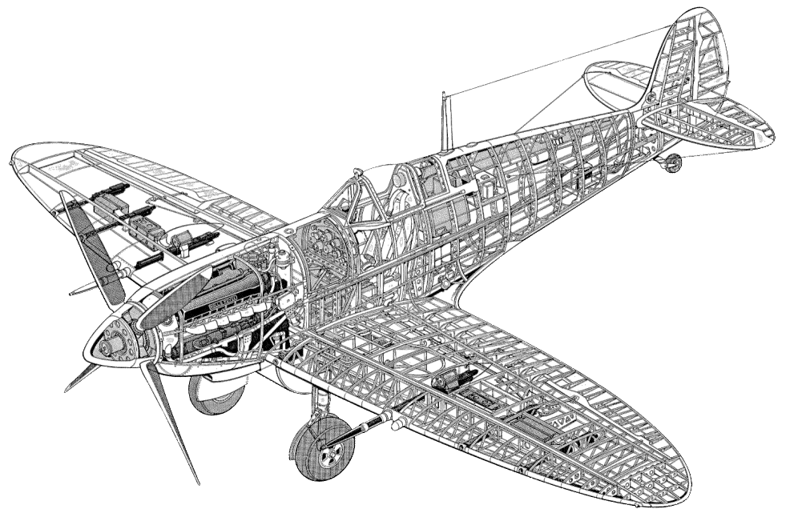

# Описание самолета

## Основные сведения

Модификации самолета "Spitfire" моделей IX, XI и XVI обозначались буквенным префиксом,
который указывал на высотность самолета и его роль.

- F – Истребитель (от Fighter)
- L – Низковысотный (от Low)
- H – Высотный (от High)
- PR – Фоторазведчик (от Photo Reconnaissance)

Добавление буквы (e) обозначало изменение состава вооружения – вместо 4-х пулеметов
калибра 7,69 мм устанавливались два пулемета калибра 12,7 мм. Все варианты имеют общую
схожесть конструкции, за исключением некоторых особенностей, представленных в таблице.

Вариант      |                         Ключевые особенности
-------------|---------------------------------------------
 F.IX        | Двигатель "Merlin" 61, 63 или 63A; две пушки калибра 20 мм., 4 пулемета              калибра 7,69 мм.
 LF.IX       | Двигатель "Merlin-66"; две пушки калибра 20 мм., 4 пулемета калибра 7,69 мм. (Этот вариант представлен в симуляторе)
 LF.IXE      | Двигатель "Merlin-66"; две пушки калибра 20 мм., 2 пулемета калибра 12,7 мм.
 HF.IX       | Двигатель "Merlin-70"; две пушки калибра 20 мм., 4 пулемета калибра 7,69 мм.
 HF.IXE      | Двигатель "Merlin-70"; две пушки калибра 20 мм., 2 пулемета калибра 12,7 мм.
 PR.XI       | Двигатель "Merlin" 61, 63 или 63A или 70, оборудование для фоторазведки.
 F.XVI       | Двигатель "Merlin-266”; две пушки калибра 20 мм., 2 пулемета калибра 12,7 мм.

Двигатели "Merlin" серий "61" и "63(А)" оснащались поплавковыми карбюраторами S.U., на
двигателях серии "66", "70" и "266" устанавливались инжекторные карбюраторы "Bendix-
Stromberg".

Все модификации оснащались 4-х лопастным винтом изменяемого шага "Rotol" и большинство
самолетов имели укороченные законцовки крыла.
Поздние модификации Mk. IX и XVI имели фюзеляж с заниженным гаргротом и каплевидные
фонари кабин.

### Описание конструкции

Самолет "Spitfire" - цельнометаллический свободнонесущий моноплан с нижним расположением
крыла. Крыло состоит из трех частей: центроплана, выполненного интегрально с фюзеляжем, и
двух отъемных консолей. Форма крыла в плане - эллиптическая, профиль довольно тонкий
(относительная толщина 12,6% у корня и 9,57% в середине). Лонжеронов два, но передний
намного мощнее заднего и принимает на себя практически всю нагрузку. Увеличению жесткости
на кручение способствует толстая обшивка носка, прикрепленная к переднему лонжерону.
Задний лонжерон тоже работает на кручение и служит для крепления элеронов. Элероны типа
"FRISE", цельнометаллические. Снизу под крылом установлены посадочные щитки типа
"SHRENK", разделенные на внешние и внутренние секции. Привод щитков - пневматический.
Нервюры ферменные. Обшивка крыла металлическая несущая, гладкая, клепаная впотай.
Законцовки крыла выпускались трех типов: обычные округлые, укороченные (почти
прямоугольные), и удлиненные заостренные. К самолетам с укороченными законцовками часто
придавался и комплект обычных.

Фюзеляж - полумонокок, то есть имеет силовой набор из шпангоутов, лонжеронов и стрингеров,
закрытый металлической обшивкой, воспринимающей часть нагрузки. Поперечное сечение
фюзеляжа - эллиптическое. Обшивка в его носовой части крепится потайными заклепками, в
хвостовой - заклепками с чечевичной головкой. Панели обшивки капота съемные.
Компоновка фюзеляжа - классическая для одномоторного истребителя того времени. В передней
части расположена винтомоторная группа, за ней находились отделенные противопожарной
перегородкой два бензобака. За второй противопожарной перегородкой - кабина пилота. Она
закрыта остекленным плексигласом фонарем, имеющим сдвигающуюся назад по направляющим
секцию. Основная особенность фонаря "Spitfire" - его "выпученность", выпуклости выступают за
габариты козырька на 80 мм в каждую сторону, обеспечивая улучшение обзора назад и в
стороны. Пилот может смотреть назад и через зеркало заднего вида, закрепленное сверху на
козырьке. Сам козырек спереди и по бокам имеет плоские грани, не искажающие изображение.
Центральная секция козырька - из бронестекла. Вход летчика в кабину облегчается наличием на
левом борту откидывающейся вниз дверцы. Сдвижная секция фонаря имеет систему аварийного
сброса - для этого достаточно потянуть за специальную ручку в виде резинового мячика красного
цвета, а затем руками отжать фонарь немного вверх. Далее его подхватывал набегающий поток
воздуха. Но частенько бывало, что тросик рвался, ручка оставалась у пилота, а фонарь - на
месте. Тогда полагалось взломать его ломиком, уложенным в нишу дверцы.

Пилот сидел в кресле из пластмассы (бакелита), довольно высоко над полом глубокой кабины.
Кресло соединялось из четырех штампованных частей дюралевыми накладками. В чашку сиденья
укладывался парашют "IRVIN". Кресло можно было регулировать по высоте ручкой справа от
пилота. Привязные ремни имели систему пружинного подтяга. Летчик мог ослабить ремни, чтобы
наклониться вперед, а затем опять притянуть. Сзади пилота прикрывали бронеспинка и
бронезаголовник из стального листа толщиной всего 5 мм (его пробивали даже немецкие
бронебойные пули калибра 7,9 мм). Летчик управлял самолетом при помощи длинной ручки так
называемого "ломающегося типа" (с шарнирным креплением верхней части) и педалей.
Английские педали были "двухэтажными". Обычно ноги летчика находились на нижних
ступеньках, но во время боя, когда для энергичных маневров требовались большие усилия, он
переставлял их наверх. Седьмой шпангоут, располагающийся за сиденьем пилота - усиленный,
выполнявший функции противокапотажной рамы.

Приборная доска - двойная. Основная панель сделана из текстолита толщиной 6 мм. На ней
располагаются приборы контроля мотоустановки и вспомогательные приборы. Навигационные
приборы стоят на алюминиевой панели, закрепленной на пружинных амортизаторах по центру
основной доски. Компас расположен отдельно на кронштейне под приборной доской.
Отопления на "Spitfire" не было. Предусматривался только электрообогрев одежды и перчаток
летчика, для чего летчику необходимо использовать специальные, пронизанные проводами,
перчатки и стельки в летных сапогах. Система эта была ненадежна и применялась весьма редко.
Вентиляция кабины осуществлялась через лючок на правом борту перед ветровым козырьком.
Вращая маховичок регулировочного винта, летчик регулировал обдув.

За кабиной летчика находился дополнительный бензобак (устанавливающийся дополнительно),
различное электро- и радиооборудование. Доступ к нему осуществлялся через люк на левом
борту. Почти вся хвостовая часть фюзеляжа была пустой. Для компенсации увеличившейся
массы мотоустановки, в хвост переместили аккумулятор и кислородный баллон.
19-й шпангоут - сдвоенный, это место стыка собственно фюзеляжа и отъемной хвостовой секции,
изготовленной заодно с килем. 20-й шпангоут идет до самого верха киля, превращаясь в его
лонжерон. Киль имеет каркас из алюминиевого сплава и такую же обшивку. Свободнонесущий
стабилизатор эллиптической формы в плане состоит из двух половин, соединенных между собой
внутри хвостовой части фюзеляжа. Он установлен параллельно оси самолета. Каркас и обшивка
стабилизатора - из алюминиевых сплавов. Аэродинамические профили киля и стабилизатора -
симметричные.

Рули и триммеры также имеют металлический каркас, но обтянуты полотном, пропитанным
лаком. Рули имеют роговую компенсацию. На ранних сериях руль направления отличался
округлым верхом, затем ввели более широкий руль с заостренным концом для компенсации
увеличившегося момента, создаваемого винтом. Поздние "девятки" также имели увеличенные
роговые компенсаторы рулей высоты.

На "Spitfire Mk.IX" устанавливались различные модификации “Merlin” 60-й серии - 61, 63, 66 и 70,
отличавшиеся номинальными высотами. Сам "Merlin" являлся 12-цилиндровым V-образным
двигателем жидкостного охлаждения с рабочим объемом 27 л. Двигатель монтировался на раме
трубчатой конструкции, сочетающей сварные, клепаные и болтовые соединения. На двигателях
61 и 63 серий стояли старые поплавковые карбюраторы, а на двигателях 66 и 70 серий -
американские      беспоплавковые     (мембранные)   "Bendix-Stromberg"    с   автоматическим
регулированием качества смеси (высотным корректором). Все эти двигатели обладали
двухступенчатыми двускоростными приводными центробежными нагнетателями. Температура
воздуха после нагнетателя снижалась при помощи отдельной системы охлаждения, что давало
возможность отодвинуть границу детонации и увеличить мощность двигателя.
Двигатель охлаждался смесью "гликоль", она же циркулировала в промежуточных радиаторах,
охлаждавших воздух между ступенями нагнетателя и топливную смесь перед входом в
цилиндры. Расширительный бачок системы крепился на редукторе двигателя. Радиаторы систем
охлаждения двигателя, маслосистемы, нагнетателя размещались в двух симметричных коробах
под крыльями. Под правым крылом находились одна секция радиатора двигателя и масляный
радиатор, под левым - радиатор нагнетателя и вторая секция радиатора системы охлаждения
двигателя. Сами радиаторы туннельного типа. Регулирование положения заслонок радиаторов -
автоматическое, от термостата.

Воздух для карбюратора засасывается из патрубка под центропланом. При сильной
запыленности на взлете он перекрывается заслонкой и забор осуществляется из подкапотного
пространства. Самолеты поздних серий оснащались дополнительным фильтром в связи с чем
воздухозаборник вытянули вперед.

На двигателе стояла система индивидуальных (по одному на цилиндр) реактивных выхлопных
патрубков, тяга которых несколько увеличивала скорость полета.
Самолеты с двигателями "Merlin-66" использовали пропеллер R12/4F5/4 с деревянными
лопастями. Винт четырехлопастной, с автоматическим изменением шага.
Двигатели 60-й серии питались высококачественным 100-октановым бензином. В Советском
Союзе либо пользовались импортным топливом, либо заливали в баки этилированный бензин
4Б-70 (с октановым числом 88), на котором английский двигатель хоть и не страдал от
детонации, но недодавал мощность.

Горючее хранилось в трех фюзеляжных баках. Два из них располагались перед кабиной летчика
в отсеке между двумя противопожарными перегородками. Нижний протектированный бак,
емкостью 37 галлонов (168 л), лежавший на шпангоутах, считался основным, из него-то и
запитывался двигатель. Из верхнего, непротектированного бака емкостью 47 галлонов (218 л)
бензин вытеснялся в нижний, самотеком или давлением газа, при включении системы наддува
бака. Сверху баки прикрывал стальной броневой лист толщиной 4 мм. Третий бак
(монтировавшийся не на всех сериях) устанавливался за сиденьем летчика. Он имел емкость 132
л и использовался только в сочетании с большим подфюзеляжным подвесным баком, поскольку
его заполнение сильно нарушало центровку самолета.

Истребитель мог нести четыре типа подвесных баков. Баки емкостью 30 галлонов (135 л), 45
галлонов (205 л) и 90 галлонов (410 л) имели вид корыта, плотно прилегавшего к центроплану
снизу. В этом случае для всасывающего патрубка в баке оставлялся проход. При сбросе такие
баки сначала съезжали назад по направляющим, а уже затем откидывались вниз. Четвертый тип
бака, в виде сигары емкостью 50 галлонов (227 л), подвешивался на замках подфюзеляжного
бомбодержателя. Переключение на питание из подвесных баков производится выше 600 м.
Шасси "Spitfire" выглядело довольно нетрадиционно. Основные стойки укладывались не в
направлении к фюзеляжу, а, наоборот, к концам крыла. Это позволило сделать крыло тонким,
но ограничило величину колеи 5 футов 8,5 дюймов (1 метр 74 см.), сделав самолет довольно
неустойчивым на неровных площадках. Стойки убирались и выпускались гидросистемой, помпа
которой навешивалась на двигатель. В случае отказа помпы шасси выпускалось сжатым
углекислым газом, хранившимся в баллоне в кабине пилота. Стойки шасси имели
гидропневматические амортизаторы "Vickers". Колеса размером 600 х 170 мм в выпущенном
положении стояли с небольшим развалом, на глаз почти незаметным. Они оборудовались
пневматическими тормозами "Dunlop". В убранном положении колеса укладывались в ниши за
главными лонжеронами консолей. Стойка и примерно половина колеса закрывались щитками,
смонтированными на стойке. Хвостовое колесо - свободно ориентирующееся, вращающееся на
360°. Его стойка также снабжена гидропневматическим амортизатором. На ранних сериях
"девятки" хвостовое колесо не убиралось, на поздних - стойка с колесом поворачивалась по
полету назад и укладывалась в фюзеляж, полностью закрываясь навешенными по бокам отсека
створками.

Пневмосистема, подпитывающаяся бортовым компрессором "Heywood" SН-6/2, управляла
тормозами колес, щитками, заслонками радиаторов, вооружением и включением-выключением
второй ступени нагнетателя. Сжатый воздух хранился в двух баллонах, размещенных по левому
борту за кабиной пилота.

Источником тока 12-вольтовой электросистемы истребителя являлись генератор мощностью 750
Вт на двигателе и аккумулятор на 40 A/ч, стоявший в хвостовой части фюзеляжа. Потребителями
являются: комплект навигационных огней, радиооборудование, освещение кабины и подсветка
прицела, а также различные устройства сигнализации. Электростартер для запуска двигателя
запитывался только от наземной батареи, перевозимой на специальной тележке. Разъем для
подсоединения наружного источника питания находился на правой стороне мотоотсека.
"Девятка" имела антиобледенительную систему, омывавшую смесью дистиллированной воды с
этиленгликолем козырек фонаря. Распылитель был вмонтирован в нижнюю окантовку козырька.
Приводилась система в действие ручным насосом, размещенным на правом борту кабины.
На большой высоте пилот пользовался кислородной маской. Кислород хранился в баллоне
емкостью 6 л в хвосте самолета. Английская кислородная система подавала газ не постоянно, а
периодически, в зависимости от потребности.

Истребитель оснащался УКВ-радиостанциями типов TR-1133, TR-1133A или TR-1143. Последняя,
наиболее современная, сопрягалась с радионавигационным устройством А.1271, являвшимся
примитивной системой слепой посадки. Радиостанция монтировалась на выдвижной платформе,
что существенно облегчало ее обслуживание.

В Англии машины обязательно комплектовались автоответчиками "свой-чужой" A.R.I. 5025 с
передатчиками типа R-3067. Его блок монтировался на кронштейнах по правому борту дальше к
хвосту. Автоответчики считались секретными и снабжались зарядом взрывчатки для
самоликвидации. При вынужденной посадке на территории противника пилот был обязан
уничтожить прибор.

Основная радиостанция T.R.1196 использовала антенну, натянутую между мачтой, стоявшей за
фонарем кабины, и верхушкой киля. Мачта опиралась на крестовину из дюралевых профилей
под гаргротом. На других типах радиостанций проводную антенну заменили на штыревую,
установленную между 12 и 13 шпангоутом.

Антенны автоответчика шли от бортов фюзеляжа к концам стабилизатора. Позднее автоответчик
оснащался штыревой антенной, установленной под правым крылом.
Бронезащита "девятки" была довольно слабой. В основном, она состояла из стальных пластин
толщиной 4-5 мм. Такие пластины защищали спину, колени и затылок пилота и верхний
бензобак. В козырьке кабины монтировалось бронестекло толщиной 38 мм. Cнизу и по бокам
бензобаки и отсеки боеприпасов закрывались дюралевыми пластинами толщиной 3-4 мм.
Вооружение было двух типов - С и Е, в зависимости от установленного на истребителе крыла. В
первом случае самолет нес в консолях обычно две 20-мм пушки "British Hispano" с запасом 120
снарядов на ствол и четыре пулемета "Colt-Browning" Mk.II калибра 7,69 мм с запасом по 350
патронов на каждый. Пушки монтировались ближе к фюзеляжу, сразу за нишами шасси. Стволы
их выступали за переднюю кромку и закрывались обтекателями. Механизмы подачи патронов не
вписывались в профиль крыла, и пришлось сделать сверху небольшие каплевидные выступы.
Пулеметы находились дальше от оси самолета между усиленными нервюрами. Для удобства
размещения патронных ящиков их сдвинули в продольном направлении на 152 мм. Доступ к ним
обеспечивался через люки с откидными крышками на нижней поверхности крыла. На стволы для
улучшения охлаждения надеты трубы, передние кромки которых выполнялись по форме крыла.
Перед каждым вылетом для защиты от грязи и пыли, а также для улучшения аэродинамики
отверстия в передней кромке крыла заклеивались перкалью красного цвета. Первые же
выстрелы прорывали их. Пулеметы питались из ящиков разъемной металлической лентой.
Звенья и стреляные гильзы выбрасывались через щели под крылом.

Но вместо пулеметов могли быть установлены еще две пушки. В этом случае боезапас составлял
по 145 снарядов у внутренних и 135 - у внешних пушек. Этот вариант встречался крайне редко.
Под фюзеляжем "Spitfire Mk.IXC" мог нести одну бомбу весом до 227 кг.
Усиленное крыло "Type Е" позволяло иметь более мощное вооружение. В каждом крыле ставили
по одной пушке (с запасом 120 снарядов) и одному 12,7-мм пулемету (250 патронов). На
“девятке” ввели подкрыльевые бомбодержатели, а общую бомбовую нагрузку подняли до 454 кг.
Обычно брали бомбу весом 227 кг под фюзеляж и две по 113 кг под консолями. Использовались
фугасные, осколочные, зажигательные, бронебойно-фугасные и дымовые боеприпасы
английского и американского производства. На "Spitfire Mk.IXE" внедрили и ракетное вооружение
- пару неуправляемых ракет калибра 76 мм. В зависимости от веса боевой части эти ракеты
весили 11,3 кг или 27,2 кг. В обоих случаях “девятка” могла взять в боевой полет две ракеты и
одну 227-кг бомбу.

Отсеки вооружения в полете обогревались теплым воздухом, прошедшим через радиаторы.
Управление огнем на "Spitfire" - электропневматическое. Прицеливание при стрельбе
осуществлялось на ранних сериях через коллиматорный оптический прицел GM 2, а позднее -
через гироскопический прицел Mk.IID. Он давал возможность предварительной установки
дальности открытия огня и базы (характерного размера цели, заранее известного летчику).
Контроль результатов можно было провести по кадрам фотокинопулемета G-45 или G-42В,
стоявшего в корневой части левого крыла. Фотокинопулемет мог включаться одновременно с
пушками и пулеметами, либо отдельно от них.

В комплект оборудования истребителя входила шестиствольная ракетница системы "Plessy",
заряжавшаяся ракетами кодовых цветов. Они выстреливались вверх, по электросигналу. На
борту имелись запас воды, аварийный рацион в запаянной жестяной банке, надувная лодка с
баллоном углекислого газа - на случай вынужденной посадки.

## Тактико-технические характеристики самолета

### Геометрические характеристики самолета "Spitfire Mk.IX"

Основные:

- Размах крыла
    - стандартные законцовки - 36 футов 10 дюймов (11 метров 22,7 сантиметра).
    - короткие законцовки - 32 фута 7 дюймов (9 метров 93,14 сантиметра).
- Длина - 31 футов ½ дюйма (9 метров 57,58 сантиметра).
- Высота (самолет в горизонтали):
    - до верхней точки винта - 11 футов 8 дюймов (3 метра 55,6 сантиметра).
    - до центра втулки винта - 6 футов 3 ½ дюйма (1 метр 91,7 сантиметра).
    - до законцовки крыла - 5 фута 4 дюйма (1 метр 65,1 сантиметра).
- Клиренс винта - 11 дюймов (27,94 сантиметра).

Фюзеляж:

- Ширина (макс.) - 3 фута 6 дюймов (1 метр 6,68 сантиметра).
- Длина (общая) - 20 футов 10 дюймов (6 метров 35 сантиметров).
- Высота (макс.) - 6 футов 9 дюймов (2 метра 5,74 сантиметра).

Крыло:

- Профиль крыла - N.A.C.A. 2200
- Средняя хорда - 7 футов 1 дюйм (2 метра 38,76 сантиметра).
- Угол установки - 2° у корня, -½° у законцовки.
- Угол поперечной установки - 6°.
- Площадь крыла (вкл. элероны и щитки) - 242 футов2 (22,483 метров2).
- Площадь элеронов - 18,9 футов2 (1,756 метров2).
- Площадь щитков - 15,6 футов2 (1,449 метров2).

Хвостовое оперение:

- Размах (по рулям высоты) - 10 футов 6 дюймов (3 метра 20,04 сантиметра).
- Хорда (макс.) - 4 фута (1 метр 21,92 сантиметра).
- Угол установки - 0°.
- Угол поперечной установки - 0°.
- Площадь (вкл. рули высоты) - 31,46 футов2 (2,923 метров2).
- Площадь рулей высоты (с триммерами) - 13,26 футов2 (1,232 метров2).
- Площадь триммеров 0,38 футов2 (0,035 метров2).

Киль и руль направления:

- Площадь киля - 4,61 футов2 (0,428).
- Площадь руля направления (с триммером) - 10,7 футов2 (0,994 метров2).
- Площадь триммера - 0,7 футов2 (0,065 метров2).
- Диаметр винта - 10 футов 9 дюймов (3 метра 27,69 сантиметра).

Шасси:

- Колея - 5 футов 8 ½ дюймов (1метр 74 сантиметра).

