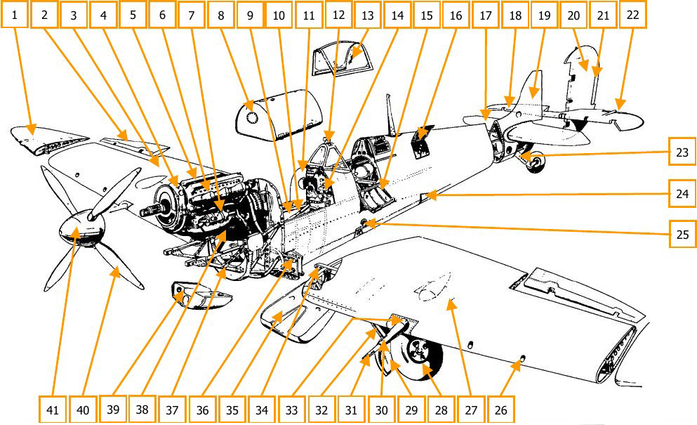
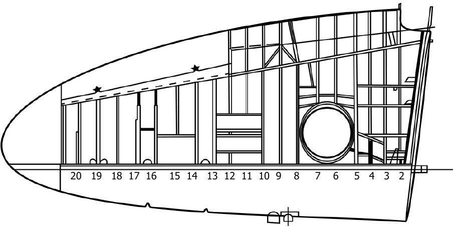
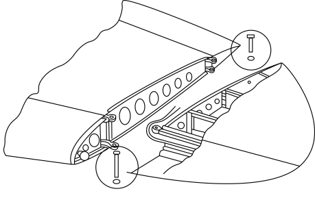
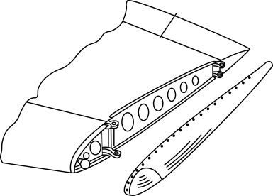
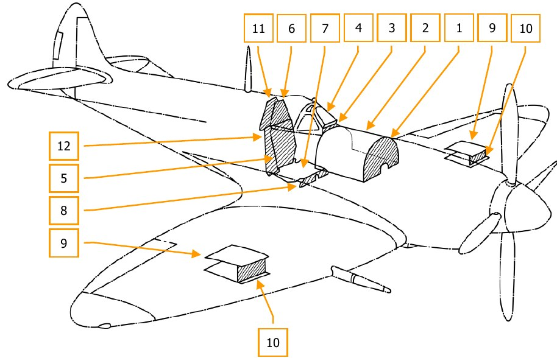

# Конструкция самолета

## Основные элементы конструкции самолета

1. Съемная законцовка крыла
2. Элерон
3. Правая полуплоскость
4. Расширительный бачок системы
      охлаждения двигателя
5. Двигатель "Merlin-66"
6. Выхлопные патрубки
7. Генератор
8. Верхний топливный бак
9. Нижний топливный бак
10. Поперечные стойки
11. Противопожарная перегородка
12. Козырек фонаря
13. Колпак фонаря
14. Приборная доска
15. Дверца кабины
16. Люк доступа в радиоотсек
17. Стабилизатор
18. Руль высоты
19. Киль
20. Руль направления
21. Триммерная пластина руля направления
22. Триммерная пластина руля высоты
23. Хвостовая опора
24. Зализ крыла
25. Узел крепления вспомогательного
              лонжерона крыла
26. Пулеметы "Colt-Browning"
27. Лючок отсека патронного ящика
28. Колесо основной опоры
29. Щиток основной опоры
30. Обтекатель ствола пушки "Hispano"
31. Пушка “Hispano”
32. Основная стойка шасси
33. Кольцо регулировки пушки
34. Основной лонжерон крыла
35. Подвесной топливный бак
36. Узел крепления основного лонжерона
              крыла
37. Моторама
38. Коробка фильтров
39. Маслобак
40. Винт изменяемого шага
41. Кок винта

## Фюзеляж

Цельнометаллической конструкции типа полумонокок, с работающей обшивкой, с отъемной
хвостовой частью. Фюзеляж условно можно разделить на три части: переднюю, основную и
заднюю. В передней части установлены топливные баки, за баками располагается кабина
летчика, которая закрывается сдвижным сбрасываемым фонарем из прозрачного материала. За
кабиной верхняя часть фюзеляжа также имеет прозрачное остекление для улучшения обзора
назад. Козырек фонаря имеет прозрачную броню в центральной части. Для входа в кабину на
левой стороне фюзеляжа выполнена откидная дверца, крепящаяся к основному лонжерону
фюзеляжа. За козырьком в кабине смонтированы наклонные направляющие для затемняющего
стекла прицела, которое предохраняет летчика от ослепления ярким светом при прицеливании.
В нормальной ситуации затемняющее стекло находится в убранном положении в направляющих
под козырьком фонаря.

В обшивке фюзеляжа выполнены лючки для обслуживания агрегатов самолета. Крепления для
оборудования и органов управления выполнены изнутри в разных местах конструкции.
Бронелисты установлены за противопожарными перегородками и креслом летчика.

Фюзеляж состоит из 5 лонжеронов и 15 шпангоутов. Два нижних лонжерона, два основных
лонжерона и один верхний лонжерон. Шпангоуты пронумерованы от 5 до 19. Шпангоуты
передней части фюзеляжа до 11-го незамкнутые, U-образные, далее идут замкнутые. Нижний
лонжерон коробчатый, образован двумя уголковыми профилями с 5 по 10 шпангоут. После 10
шпангоута нижний лонжерон имеет V-образный профиль. Основные лонжероны расположены по
строительной горизонтали фюзеляжа, имеют П-образный профиль. Оба лонжерона усилены
стальными профилями толщиной 1,016 мм. Правый лонжерон усилен с 5-го по 7-й шпангоут,
левый лонжерон усилен с 5-го и на 6 дюймов за 8-й шпангоут. С 14-го по 19-й шпангоут основные
лонжероны имеют Z-образный профиль. Верхний лонжерон V-образный. Основные лонжероны
имеют по бортам кабины реперы для нивелировки. Обшивка из дюралюминиевого сплава,
покрытого алюминием приклепана к шпангоутам и подкреплена Z-образными стрингерами.
Хвостовая часть фюзеляжа выполнена отъемной и состоит из киля и стабилизатора. Хвостовая
часть крепится болтами к фюзеляжу по 19-му шпангоуту.

### Передняя часть

Начинается с 5-го шпангоута, который одновременно является противопожарной перегородкой,
и заканчивается 11 шпангоутом. В передней части размещаются топливные баки и кабина
летчика. 8-й шпангоут образует замкнутый контур, в середине верхней части шпангоута крепятся
два раскоса, которые соединяются в узлах соединения моторамы и основных лонжеронов на 5-
м шпангоуте. Устанавливаются после монтажа нижнего топливного бака.

Противопожарная перегородка крепится к 5 шпангоуту. В нижней части 5-го шпангоута крепятся
четыре профиля, которые формируют узлы навески переднего лонжерона крыла, узел крепления
вспомогательного лонжерона крыла установлен в нижней части 10-го шпангоута. Узлы
крепления лонжеронов выступают за обшивку фюзеляжа.

Противопожарная перегородка состоит из листа асбеста, расположенного между двух листов
металла и подкреплена вертикальными и горизонтальными силовыми элементами. Бронелист
прикручен болтами сзади к верхней части перегородки.
Верхние узлы крепления моторамы крепятся болтами к основным лонжеронам и раскосам.
Нижние узлы крепятся к нижним лонжеронам и к балке, формирующей фюзеляжную часть
основного лонжерона крыла.

Нижние части 6-го и 7-го шпангоутов покрыты слоем пробки и являются опорами для нижнего
бака. Шпангоут 9 подкреплен в нижней части одним поперечным и двумя диагональными
элементами, идущими до 8-го шпангоута и являющимися опорой для педального узла. Между
шпангоутами 8 и 11 установлена окантовка кабины. На 8-м шпангоуте окантовка поддерживается
силовым элементом дугообразной формы, являющийся также опорой для приборной доски. На
левой стороне фюзеляжа между 9 и 10 шпангоутом установлена дверца, крепящаяся нижней
частью к основному лонжерону. На верхней части дверцы установлено два двухпозиционных
замка, удерживающие дверцу как в закрытом, так и в приоткрытом положении. Рукоятка замка
располагается ближе к переднему замку. Поворот рукоятки вперед и вниз открывает замки. На
верхней части дверцы установлена рельса сдвижной части фонаря. В приоткрытом положении
дверцы сдвижная часть фонаря не сможет закрыться и повредить летчика даже в условиях
аварийной посадки.

11 шпангоут замкнутый, овальной формы, имеет поперечный и диагональные подкрепляющие
элементы, к которым крепится кресло летчика. К верхней части шпангоута при помощи четырех
шпилек и гаек с накаткой крепится бронелист.

### Основная часть

Основная часть сформирована с 11 по 19 шпангоут. Шпангоуты замкнутые, овальной формы,
имеют одинаковую конструкцию, отличаются уменьшающимися к хвостовой части размерами.
Между 11 и 12 шпангоутом верхняя часть обшивки выполнена из прозрачного материала для
улучшения обзора назад. Под прозрачной частью по бортам фюзеляжа установлены рельсы для
сдвижной части фонаря. По правому борту кабины рельс установлен на окантовке. Между 12 и
13 шпангоутами, установлены подкрепляющие элементы, пересечение которых является опорой
для мачты антенны радиостанции. Между 17 и 18 шпангоутом размещен балансировочный груз,
компенсирующий возросшую массу двигателя.

### Хвостовая часть

Выполнена заодно с килем и является отъемной частью. Крепится к 19 шпангоуту при помощи
52 болтов, размещенных по шпангоуту и четырех шпилек на нижних лонжеронах. 19 шпангоут
выполнен из углового профиля, тогда как оставшиеся шпангоуты плоские. Лонжерон
стабилизатора крепится болтами к усиленному 20 шпангоуту, являющимся передним
лонжероном киля. Вспомогательный лонжерон стабилизатора крепится к вспомогательному
лонжерону киля, на который навешивается руль направления. Лонжероны киля соединяются
между собой нервюрами. Обшивка киля приклепана с левой стороны, а с правой стороны
крепится шурупами к деревянным элементам, прикрученным к нервюрам. Обшивка
стабилизатора крепится аналогичным образом.

### Остекление кабины

Козырек фонаря выполнен из стальной рамы, крепящейся к окантовке кабины болтами. К
центральной секции козырька бронестекло толщиной 1 ½ дюйма (38,1 мм) крепится при помощи
болтов. Между стеклом и рамой проложен слой резины, обеспечивающий герметичность
козырька. Задняя рама козырька профилирована для плотной посадки сдвижного колпака в
закрытом положении.

Колпак закрывает кабину от козырька до 11 шпангоута, рама колпака перемещается по рельсам,
установленным на окантовке кабины. На передней части рамы колпака установлен замок,
удерживающий колпак как в открытом положении - за защелку на 11 шпангоуте, так и в закрытом — за защелку на раме козырька. Замок открывается при повороте рычажков, соединенных для
удобства тросиком. Поворот рычажков вперед открывает замок и колпак скользит вперед. При
повороте рычажков назад - замок открывается и фонарь скользит назад. При стоянке самолета
и закрытом фонаре, замок открывается при помощи маленькой подпружиненной кнопки в
верхней части козырька. Сдвижная часть фонаря имела систему аварийного сброса. Рядом с
замком на тросике подвешен резиновый мячик, через который при помощи троса вытягивались
шпильки из латунных направляющих.

Кресло летчика литое, из фенолформальдегидной смолы (бакелита), имеет нишу под
спасательный парашют. Установлено на раме с механизмом регулировки по росту на 11
шпангоуте. На правой стороне кресла смонтирован механизм регулировки по росту. Квадрант
механизма имеет 6 вырезов, общий ход кресла по вертикали составляет 4 дюйма (не реализовано
в игре). К спинке кресла сзади на кронштейнах крепится бронелист. На кресле установлены
привязные ремни с системой фиксации через тросовую проводку и пружинный стопор. На правом
борту установлен замок пружинного стопора. При перемещении защелки замка вперед-вниз
привязные ремни снимаются со стопора и позволяют летчику наклоняться, преодолевая
сопротивление пружины. При возврате рукоятки замка в заднее положение, пружина в стопоре
фиксируется, перемещение ремней блокируется.

К верхней части 11 шпангоута над креслом крепится подголовник цилиндрической формы.

## Крыло

Крыло модификации "С" состоит из двух отъемных частей (ОЧК). Части крепятся по бортам
фюзеляжа; нижняя поверхность крыла и фюзеляжа лежат в одной плоскости. Металлические
элероны по типу "FRISE" крепятся к задней части крыла ближе к законцовкам. Двухсекционные
щитки типа "SHRENK" навешены по размаху от элеронов до фюзеляжа. Щитки разделяются на
две части в месте излома крыла, имеют пневматический привод. Законцовки крыла съемные,
имеют место для установки аэронавигационных огней.
Каждая ОЧК лонжеронной конструкции, имеет основной лонжерон, вспомогательный лонжерон
и 21 нервюру. Обшивка несущая, из дюралюминиевых сплавов.
Узлы крепления крыла выполнены в нижней части двух противопожарных перегородок,
проушины для крепления консолей выходят за контур фюзеляжа с обеих сторон.

### Основной лонжерон

Передняя кромка крыла и основной лонжерон выполнены как единый узел, к которому крепится
основная часть крыла. Основной лонжерон состоит из полок квадратного сечения и стенки между
ними.

Полка лонжерона образована стальными профилями квадратного сечения уменьшающихся
размеров, вставленных телескопически. Это облегчало производство и упрощало изменение
размеров полки по размаху. Стенка крепится к задней стороне полок. Форма полки изменяется
от квадратного сечения в тавровое и к законцовке доходит до уголка. У корня крыла лонжерон
имеет две проушины для крепления к узлу навески на 5 шпангоуте. Полки нервюр выполнены
из уголкового профиля с диагональными подкрепляющими элементами швеллерного сечения.
Нервюры прикручиваются болтами к лонжерону. У корня крыла шаг нервюр уменьшен,
установлены усиливающие элементы для крепления узла навески основной стойки. Обшивка
передней кромки выполнена из двух частей, верхней и нижней. Обе части приклепаны к
нервюрам и лонжерону. Между нервюр к обшивке приклепаны Z-образные стрингеры. На нижней
части обшивки и в полке лонжерона выполнены лючки доступа во внутреннюю полость.

### Основная часть крыла

Состоит из вспомогательного лонжерона и нервюр. Полки нервюр выполнены из профиля и
усилены диагональными стойками. Нервюры корневой части ОЧК усиленные. Вспомогательный
лонжерон состоит из полок с угловым профилем и стенки. Лонжерон разделен на три секции
двумя нервюрами, выходящими за лонжерон, для навески элерона. Панель над щитками
подкреплена силовыми элементами уголкового профиля. На 10-м шпангоуте установлен узел
крепления вспомогательного лонжерона к фюзеляжу.

Верхняя часть и большая часть нижней обшивки приклепана к полкам нервюр и лонжеронов,
часть нижней обшивки у законцовки ОЧК крепится шурупами к деревянным элементам,
прикрепленных к нервюрам и лонжеронам.

Снизу ОЧК выполнена ниша для размещения стойки шасси и колеса в убранном положении.
Отсек герметизирован от остальной полости ОЧК. У корня выполнены ниши для крепления
радиаторов, которые закрываются обтекателями, формируя тоннель. На задней части
обтекателя установлена заслонка, управляемая автоматически. Из задней части каждого
тоннеля отбирается теплый воздух для обогрева отсеков пулеметов и пушек для
предотвращения отказа оружия из-за замерзания смазки в механизмах стрельбы. Зазор между
обшивкой крыла и фюзеляжем закрыт зализами.

### Законцовки

Одной из особенностей самолета является наличие сменных законцовок крыла, которые могли
быть заменены в процессе эксплуатации самолета. Всего существует три вида законцовок,
стандартная, удлиненная, укороченная. Стандартная и удлиненная законцовки крепятся к узлам
навески на лонжеронах крыла непосредственно за элероном, укороченная законцовка крепится
при помощи винтов и закладных гаек к обшивке. В случае установки укороченной законцовки,
патрон лампы аэронавигационного огня устанавливается в нервюру. Удлиненные законцовки на
"Spitfire Mk.IX" использовались редко и в основном на модификации F.IX. Укороченные
законцовки устанавливались на часть парка L.F.Mk.IX. Некоторые самолеты с укороченными
законцовками имели дополнительный топливный бак позади кресла, на таких самолетах замена
укороченных законцовок на стандартные была запрещена.

Однако по испытаниям в Боскомб Даун, применение укороченных законцовок преимуществ
практически не давало.

## Бронирование

На самолете установлены бронелисты:

1. Бронелист толщиной 4 мм. перед баком.
2. Капот верхнего топливного бака, из алюминиевого сплава толщиной 10 S.W.G. (3,251
    мм.).
3. Нижняя часть козырька кабины, толщиной 4 мм.
4. Прозрачная броня центральной части козырька толщиной 1 ½ дюйма (38,1 мм).
5. Бронелист за спинкой кресла летчика, толщиной 4 мм.
6. Бронелист за заголовником, толщиной 6 мм.
7. Лист под сидением летчика, из алюминиевого сплава толщиной 8 S.W.G. (4,064 мм.)
8. Дефлекторы, защищающие ноги летчика, толщиной 6 мм.
9. Крышки коробов боеукладки из алюминиевого сплава, верхняя и нижняя толщиной 10
    S.W.G. (3,251 мм.)
10. Передняя стенка коробов боеукладки толщиной 6 мм.
11. Дополнительный бронелист за заголовником, толщиной 6 мм. (На поздних самолетах).
12. Дополнительный бронелист за спинкой кресла, толщиной 7 мм. (На поздних самолетах).

На поздних самолетах было снято бронирование передней стенки коробов боеукладки, но
добавлены дополнительный лист за сидением летчика толщиной 7 мм и дополнительный лист
за заголовником, толщиной 6 мм.
