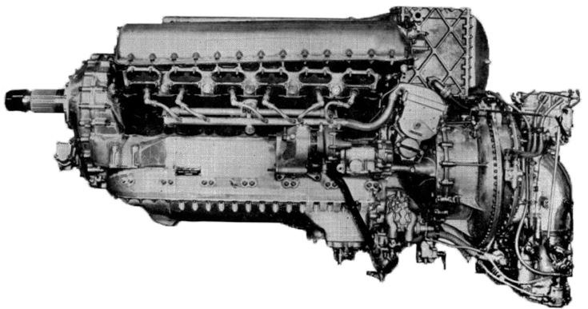
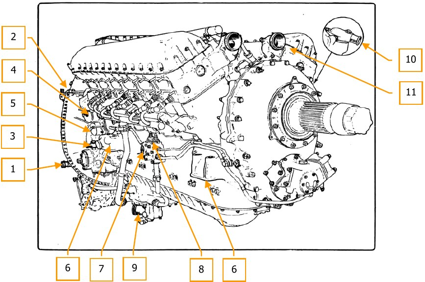
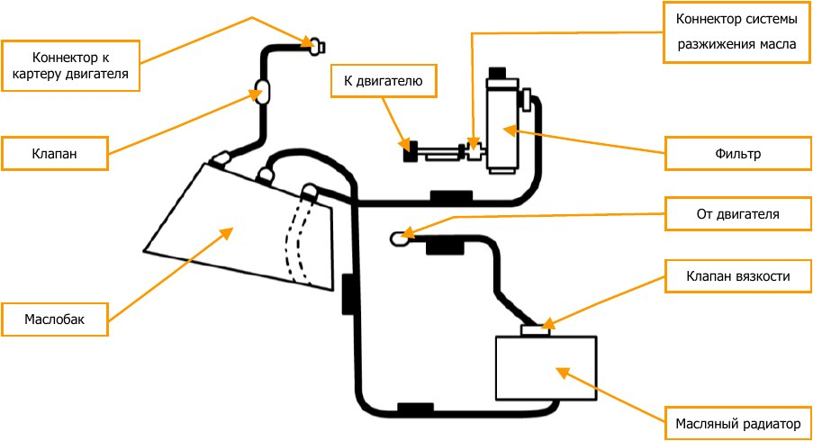
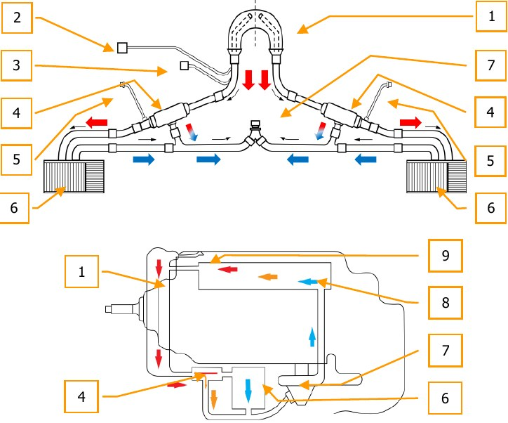
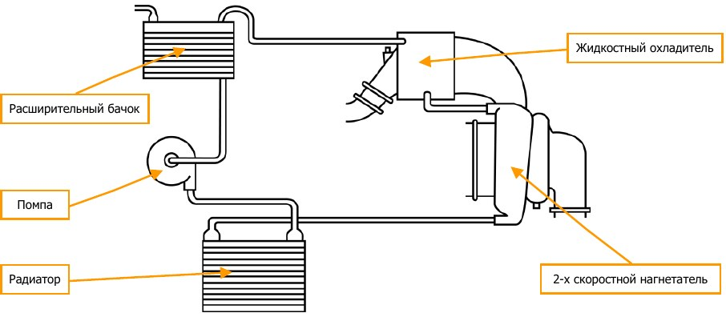
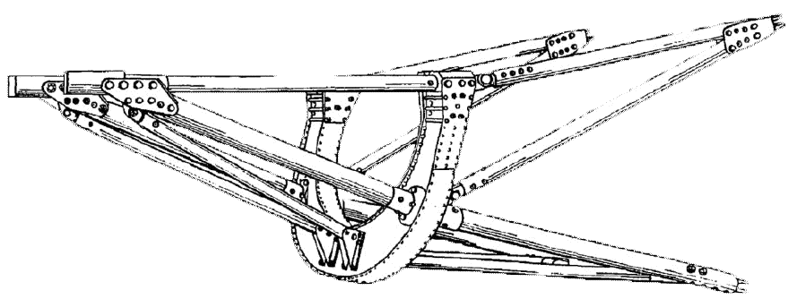
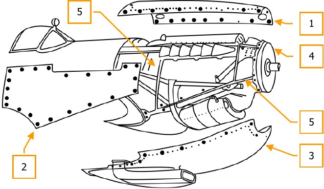

# Силовая установка

## Общее описание

Силовая установка самолета "Spitfire Mk.IX" состоит из авиационного двигателя "Merlin" 60-й
серии фирмы "Rolls-Royce" и воздушного винта R12/4F5/4 с деревянными лопастями фирмы
"Rotol", c гидравлически изменяемым углом установки лопастей.

На самолете установлен 12-цилиндровый V-образный четырехтактный двигатель внутреннего
сгорания, с объемом 27 литров, жидкостного охлаждения "Merlin-66", модель RM 10 SM. Оснащен
карбюратором "Bendix-Stromberg" инжекционного типа, работающий при отрицательных
перегрузках и двухскоростным двухступенчатым приводным центробежным нагнетателем с
промежуточным радиатором.

Двигатель приводит во вращение четырех-лопастной пропеллер изменяемого шага. Угол
установки лопастей винта изменяется при помощи регулятора постоянных оборотов,
установленного в передней части двигателя под редуктором винта.
Винт изменяемого в полете шага фирмы "Rotol" R12/4F5/4 имеет деревянные лопасти,
выполненные по технологии "Jablo" или "Hydulignum" с углом "малого шага" 22° 20’. Диаметр
винта 10 футов 9 дюймов.

Двигатель монтируется на стальную трубчатую моторную раму, прикрепленную к
противопожарному шпангоуту. К мотораме, с помощью хомутов крепятся трубопроводы и
электропроводка.

Передаточные числа редуктора и привода центробежного нагнетателя двигателя "Merlin-66"
выбраны с таким расчетом, чтобы обеспечить максимальную мощность на малых высотах.
Маслобак установлен под картером двигателя, маслорадиатор расположен в туннеле под левой
плоскостью. Расширительный бачок жидкостной системы охлаждения установлен в передней
части двигателя над редуктором винта, два радиатора системы охлаждения расположены в
тоннелях под каждой плоскостью. Радиатор системы охлаждения центробежного
двухступенчатого нагнетателя и охлаждения промежуточного радиатора расположен под правой
плоскостью.

Выхлопные патрубки типа "рыбий хвост", индивидуальные, для каждого цилиндра.
Управление двигателем производится от сектора газа, установленного на левом борту кабины.
На секторе установлен рычаг газа, рычаг установки шага винта, рычаг останова двигателя.

## Двигатель

### История создания

В 1932 сэр Фредерик Генри Ройс (Frederick Henry Royce) задумал создать двигатель, сочетающий
в себе надежность двигателя "Kestrel" и мощность двигателя "R", выигравшего Кубок Шнейдера
в 1931 году, будучи установленным на гидросамолете "Supermarine S6B". Результатом этой идеи
явился двигатель P.V.XII (P.V. - сокращение от Private Venture - частное вложение) - двигатель
объемом 27 литров, с жидкостным охлаждением и одноступенчатым нагнетателем.
Ройс скоропостижно скончался в 1933 году, так и не увидев запуск двигателя, конструкция
которого стала самой массовой. 15 октября 1933, через полгода после его смерти, состоялся
запуск первого P.V.XII.

Прототипы двух других "Частных вложений" - истребители "Hurricane" и "Spitfire" были оснащены
двигателями "Merlin C", развивавшими мощность 890 л.с. (663кВ). Характеристики двигателей
ранней конструкции требовали улучшений, но вместе с этим были достаточными чтобы раскрыть
потенциал этих истребителей. Rolls-Royce вложили 7500 фунтов стерлингов из общей стоимости
15000 фунтов (эквивалентно нынешним 850 000 фунтов стерлингов) в прототип "Spitfire" K5054,
который взлетел 5 марта 1936 года.

К 1937 были внесены значительные изменения в конструкцию головок блока цилиндров, что
позволило двигателю "Merlin II" развить мощность в 1030 л.с. (768 кВ). Все истребители "Spitfire"
и "Hurricane" английских ВВС к началу войны в сентябре 1939 года были оснащены двигателями
"Merlin II", а к началу Битвы за Британию в 1940-м году увеличившееся число истребителей было
оснащено двигателями "Merlin III".

Совершенствование двигателя "Merlin" никогда не останавливалось, что позволяло получить
большую мощность при использовании усовершенствованных нагнетателей и авиационного
бензина повышенной сортности. В 1942 году на "Spitfire Mk.IX" устанавливался двигатель "Merlin
61" с двухскоростным двухступенчатым нагнетателем, что позволило получть мощность в 1280
л.с. (954 кВ). Благодаря этому, значительно увеличилась скорость полета и практический
потолок, что привело к господству в воздухе английской авиации.

Считающийся одним из британских символов, двигатель "Merlin" был одним из наиболее удачных
авиационных двигателей периода Второй Мировой войны. Множество модификаций выпускалось
фирмой Роллс-Ройс на заводах в Дерби, Кру и Глазго, так же, как и подразделением фирмы
"Ford" в Великобритании "Ford of Britain" на их предприятии "Trafford Park factory" около
Манчестера. Под наименованием "Packard V-1650" одна из модификаций "Merlin" выпускалась в
Соединённых Штатах. Этот двигатель, использовался и на других самолетах, таких как "North
American Mustang P-51", что позволило стать ему одним из самых успешных истребителей во
Второй Мировой войне.

Производство было завершено в 1950 г. после выпуска в общей сложности 168 176 двигателей.

### Характеристики двигателя  ROLLS-ROYCE LTD.                  Merlin 66

Наименование | Значение
-------------|--------------
 Тип двигателя                    |V-образный, четырехтактный, жидкостного охлаждения,                             редукторный, оснащенный двухступенчатым                              двухскоростным нагнетателем жидкостного охлаждения и промежуточным радиатором
 Мощность                         |1 290 л.с. (962 кВт) при 3 000 об/мин на взлётном режиме
 Удельная мощность                |35,6 кВт/л (47,8 л.с./л)
 Удельная мощность по весу        |1,58 кВт/кг (2,12 л.с./кг) при максимальной мощности
 Число цилиндров                  |12
 Расположение цилиндров           |Два блока по 6 цилиндров с углом развала 60°
 Поршень, диаметр и ход           |5,4*6 дюймов (137,16*152,4 мм)
 Рабочий объём                    |1648 дюйм3, 27 литров
 Степень сжатия                   |6
 Клапаны                          |Два впускных и два выпускных клапана на цилиндр
 Нагнетатель                      |Двухступенчатый двухскоростной, с промежуточным                        охлаждением между второй ступенью нагнетателя и                                   двигателем
 Передаточное число               |Первая скорость 15,79; вторая скорость 17,06
 Система охлаждения турбонаддува  | независима от системы охлаждения двигателя
 Тип топлива                      |Бензин с октановым числом 100
 Расход топлива                   |177 л/ч - 400 л/ч
 Система смазки                   |Сухой картер с одним масляным насосом
 Система охлаждения               |Жидкостная под давлением, охлаждающая жидкость -  смесь 70% воды и 30% этиленгликоля.
 Размеры                          |
 *Длина*                          | 2 253 мм
 *Ширина*                         | 781 мм
 *Высота*                         | 1 016 мм
 Сухой вес                        | 744 кг

### Описание конструкции.

12-цилиндровый V-образный четырехтактный двигатель внутреннего сгорания, жидкостного
охлаждения "Merlin-66", модель RM 10 SM. Он оснащен карбюратором "Bendix-Stromberg" 8D-
44-1 инжекционного типа, работающим при отрицательных перегрузках, двухскоростным
двухступенчатым приводным центробежным нагнетателем с промежуточным радиатором для
охлаждения топливовоздушной смеси, подаваемой к цилиндрам.

#### Цилиндры

Двенадцать цилиндров состоят из гильз из высокоуглеродистой стали установленных в два блока
цилиндров, состоящих из двух частей, отлитых из алюминиевого сплава "R.R.50" с отдельными
головками и рубашками. Для охлаждения блока цилиндров предусмотрены полости, по которым
циркулирует охлаждающая жидкость. Гильзы "мокрые", то есть охлаждающая жидкость
находится в непосредственном контакте с внешной поверхностью гильз. Нижняя часть гильзы,
входящая в блок со свободной посадкой, уплотнена резиновым кольцом, затянутым гайкой.
Головки цилиндров снабжены стальным корпусом впускного клапана, корпусом выпускного
клапана из бронзы с добавлением фосфора и возобновляемыми сёдлам клапанов из стального
сплава “Silchrome”. В каждой камере сгорания установлены две противоположно расположенных
свечи зажигания.

#### Поршни

Выточены из поковок из сплава “R.R.59”. Полностью плавающий поршневой палец из закалённой
хромоникелевой стали. Три компрессионных и одно маслосъёмное кольцо установлены выше
поршневого пальца, и одно маслосъёмное кольцо установлено ниже.

#### Впускные и выпускные клапаны

На каждый цилиндр устанавливается два впускных и два выпускных клапана из стали "K.E.965".
Рабочие фаски как впускных, так и выпускных клапанов усилены стеллитом. У выпускных
клапанов, кроме того шток заполнен натрием (для охлаждения по принципу теплотрубки), а
головка защищена хромо-никелевым покрытием из сплава "Brightray". Всасывающий клапан
сплошной, натриевого охлаждения не имеет. Каждый клапан удерживается в закрытом
положении парой коаксиальных цилиндрических пружин. В верхней части каждой из головок
цилиндров расположен одиночный распределительный вал на семи подшипниках, управляющий
24 индивидуальными стальными коромыслами; 12 коромысел свободно вращаются на общей оси,
расположенной с внутренней, впускной стороны головки, открывая выпускные клапаны, другие
12 коромысел — на оси, расположенной с внешней, выпускной стороны головки открывают
впускные клапаны.

#### Шатуны

Двутаврового сечения, выточены из поковок из никелевой стали, каждая пара состоит из
плоского и вильчатого шатунов. В нижней головке вильчатого шатуна смонтирован
подшипниковый узел из никелевой стали, который содержит покрытые сталью вкладыши
подшипников из свинцовистой бронзы. Верхняя головка каждого шатуна содержит плавающую
втулку из бронзы с добавлением фосфора.

#### Коленчатый вал

Монолитный, выточен из азотированной поковки из хромоникелевой стали легированной
молибденом. Отбалансирован статически и динамически. Семь коренных и шесть шатунных
шеек.

#### Картер

Состоит из двух литых деталей из алюминиевого сплава с горизонтальной плоскостью разъёма.
На верхней половине смонтированы коробка приводов, нагнетатель, агрегаты, блоки цилиндров,
подшипники коленчатого вала (разъёмные вкладыши из мягкой стали, покрытые свинцовистой
бронзой) и часть корпуса редуктора. Нижняя половина образует маслоотстойник, на ней
смонтированы маслонасосы и маслофильтры.

#### Коробка приводов

Отлита из алюминия, установлена сзади картера. Содержит приводы распределительных валов,
магнето, насоса охлаждающей системы, маслонасоса и нагнетателя. Промежуточная шестерня
приводит во вращение маслонасосы, гидравлический насос, топливный насос и электрический
генератор. Привод для ручной прокрутки и электрического стартера также смонтированы в
коробке.

Двухскоростной двухступенчатый нагнетатель смонтирован на задней части коробки приводов.
К входному фланцу нагнетателя крепится двухкамерный карбюратор, с автоматическими
высотным корректором и регулятором наддува. На правой стороне картера двигателя
расположена центробежная помпа охлаждающей системы нагнетателя и промежуточного
радиатора.

В передней части двигателя расположен редуктор, состоящий из пары цилиндрических
шестерен, одна из них установлена на фланце коленчатого вала, а другая на фланце вала
редуктора. На носке вала редуктора сделаны шлицы для посадки втулки винта с изменяемым в
полете шагом. На редукторе установлены регулятор постоянных оборотов и вакуумная помпа.

1. Штуцер масляной магистрали откачки.
2. Штуцер подвода заливочного топлива.
3. Суфлер коробки приводов.
4. Подсоединение пусковой катушки
   к магнето.
5. Заземление магнето.
6. Узлы навески двигателя.
7. Штуцер манометра масла.
8. Подсоединение термометра масла.
9. Магистраль подачи масла к маслонасосу.
10. Подсоединение суфлера картера.
11. Разъемы подсоединения расширительного
      бачка основной системы охлаждения
      двигателя.

## Нагнетатель

Приводной центробежный нагнетатель, установленный на двигатель "Merlin", имеет
двухступенчатый компрессор, который повышает давление воздуха у входа в цилиндры
двигателя с целью увеличить коэффициент наполнения цилиндров и мощность двигателя, а
также поддержать постоянное давление воздуха у входа в цилиндры по мере подъема на высоту.
Состоит из двух рабочих колес центробежного типа, расположенных на одном валу. Вал
приводится во вращение через три шестерни с центробежными муфтами сцепления. Муфты
поглощают инерционные нагрузки, вызванные большим ускорением при раскрутке. Осевые
нагрузки поглощаются подпружиненным приводным валом. Крутящий момент на нагнетатель
передается при помощи одной шестерни с муфтой при работе на первой скорости, две другие
шестерни включаются в работу при переключении нагнетателя на вторую скорость. Управление
муфтами сцепления, которые определяют через какие шестерни передается крутящий момент,
осуществляется при помощи системы вильчатых рычагов, которые в свою очередь приводятся в
движение гидроцилиндром через промежуточный валик. Гидроцилиндр приводится в действие
давлением масла из линии откачки. Управление золотником гидроцилиндра производится через
рычаг, который перемещается пневмоприводом управления скоростями нагнетателя.

Переключение между первой "M.S." и второй "F.S." скоростями нагнетателя осуществляется в
автоматическом или ручном режиме от двухпозиционного переключателя в кабине. Для
автоматического переключения скоростей нагнетателя переключатель (10) на правой части
приборной доски должен быть в положение "AUTO". В этом случае сигнал на электроклапан
пневмопривода будет поступать от датчика высоты, который на определенной высоте подаст
напряжение на электроклапан подачи сжатого воздуха в привод. Шток привода связан через
рычаг с золотником гидроцилиндра управления муфтами скоростей. Анероид датчика высоты
настроен на срабатывание на высоте 14000 футов (переключение с первой на вторую скорость)
в наборе, и 12500 футов при снижении (переключение со второй на первую скорость).
В пололжении переключателя - "M.S.", цепь датчика высоты размыкается, и нагнетатель
переключается на первую скорость. На приборной доске, установлена лампа-сигнализатор
которая срабатывает при переключении скоростей нагнетателя. Необходимое давление в
пневмосистемы для работы пневмопривода переключения скоростей составляет 150 фунт/дюйм^2^
(10,5 кг/см^2^).

## Промежуточный радиатор

Промежуточный радиатор трубчатого типа жидкостного охлаждения, предназначен для
уменьшения температуры горючей смеси, подаваемой в цилиндры, установлен между выходом
нагнетателя и основным впускным коллектором. Расширительный бачок системы охлаждения
нагнетателя и промежуточного радиатора установлен на противопожарной перегородке.

1. Выходной патрубок отвода
   охлаждающей жидкости в
   расширительный бачок.
2. Входной патрубок подачи охлаждающей
   жидкости из нагнетателя.
3. Штуцер отбора давления для указателя
   наддува.
4. Вход горючей смеси после нагнетателя.
5. Выход охлажденной горючей смеси во
   впускную магистраль.

## Карбюратор

Образование горючей смеси производится двухкамерным воздухозаборником карбюратора
инжекционного типа “Bendix Stromberg”. Карбюратор крепится к входной части нагнетателя.
Необходимое количество топлива определятся по весу воздуха, проходящего через
воздухозаборник карбюратора. Бензин распыляется перед входом в нагнетатель. Карбюратор
работает совместно с автоматическими высотным корректором и регулятором постоянного
давления (наддува) и выполнен конструктивно единым агрегатом.

Регулятор постоянного давления представляет собой автомат, ограничивающий давление за
нагнетателем в определенных пределах.

Воздух в карбюратор попадает через воздухозаборник, расположенный на нижней части
двигателя. Воздухозаборник имеет заслонку, перекрывающую канал, в этом случае воздух
поступает в канал через воздушный фильтр из подкапотного пространства. Заслонка
воздухозаборника управляется из кабины при помощи рукоятки на левом борту кабины. Рукоятка
обозначена "CARB. AIR FILTER CONTROL" и имеет два положения:

- "NORMAL INTAKE" - заслонка открыта.
- "FILTER IN OPERATION" - заслонка закрыта, воздух поступает из подкапотного пространства.

В крайних положениях заслонка удерживается стопором.

Воздухозаборник должен быть закрыт при работе двигателя на земле, опробовании, рулении,
взлете и посадке, а также в полете при условиях загрязненности воздуха пылю и песком.
Перемещение рукоятки должно быть плавным. Рекомендуется перемещать рукоятку при
скорости полета около 200 миль/час по прибору.

## Масляная система

Трение, возникающее в механизмах работающего двигателя, вызывает потерю мощности, а
также нагрев и износ его деталей. Для уменьшения трения трущиеся поверхности деталей
смазываются под давлением маслом, которое, заполняя зазоры, образует масляную подушку,
отделяющую трущиеся поверхности друг от друга в результате чего уменьшаются трение, нагрев
и износ деталей. Кроме того, масло циркулируя в зазорах между деталями выносит с собой
мельчайшие частицы отработанного материала. Вместе с этим маслосистема обеспечивает отвод
тепла от двигателя.

Масляная система двигателя выполнена по схеме сухого картера. Блок масляных насосов
шестеренчатого типа установлен в задней части маслокорыта (нижней части картера двигателя)
снизу. Состоит из одной нагнетающей ступени и двух маслооткачивающих ступеней. Помимо
основной задачи по обеспечению смазки двигателя, маслосистема обеспечивает работу винта
изменяемого шага при помощи магистрали высокого давления и работу гидроцилиндра
переключения скоростей нагнетателя при помощи магистрали низкого давления. Редукционный
клапан понижает давление масла для магистрали низкого давления. Смазка редуктора винта,
кулачковых валиков, траверс клапанов и вспомогательных приводов осуществляется от
магистрали низкого давления.

Маслобак расположен под двигателем и полностью закрывается нижним капотом. Заправочная
горловина расположена с левой стороны маслобака, её положение обеспечивает заправку
необходимого количества масла при стоянке самолета. Объем маслобака 7,5 галлонов (34
литра), объем воздушного пространства 1,6 галлона (7,27 литров).

Масло из бака поступает через фильтр в двигатель, далее масло по трубопроводу поступает в
радиатор, расположенный под левой плоскостью. На радиаторе установлен термостатический
кран, который перепускает холодное масло минуя радиатор, чем ускоряется, прогрев двигателя.
При дальнейшем повышении температуры масло пропускается через радиатор. Охлажденное
масло поступает обратно в маслобак. Воздух, отделяемый от вспененного масла, сбрасывается
из маслобака по вентиляционному трубопроводу в картер двигателя. Таким образом пена,
образующаяся в случае переполнения бака, не выбрасывается в атмосферу, а попадает
непосредственно в картер двигателя. Одновременно такая дренажная система предохраняет
масляную систему от попадания пыли и влаги из воздуха, что уменьшает вспенивание масла. В
дренажную линию встроен клапан двойного действия, поддерживающий в маслобаке
избыточное давление 2,5 фунт/дюйм^2^ (0,17 кг/см^2^). В картере двигателя клапан поддерживает
давление не выше 1 фунт/дюйм^2^ (0,07 кг/см^2^).

Для контроля за работой системой служат термометр масла на выходе из двигателя и манометр,
показывающий давление в главной масляной магистрали.

Показания термометра и манометра полностью характеризуют работу маслосистемы самолета.
Для облегчения запуска двигателя в условиях низких температур, предусмотрена система
разжижения масла бензином. Перед остановкой двигателя в зависимости от наружной
температуры воздуха открывается клапан, подающий бензин во всасывающую магистраль
двигателя. Бензин, перемешиваясь с маслом разжижает его, снижая вязкость. Гибкий шланг от
топливной системы подводит бензин в нагнетающую магистраль после маслофильтра, поэтому
на деталях двигателя остается масло, имеющее меньшую вязкость.

Время включения клапана разжижения масла:

  1. При температуре выше -10° С - 1 минута.
  2. При температуре ниже -10° С - 2 минуты.

## Система охлаждения

### Система охлаждения двигателя

В качестве теплоносителя в системе охлаждения используется смесь 70% воды и 30%
этиленгликоля. Объем системы 13,5 галлонов (61,37 литра). Центробежный насос имеет два
выхода нагнетающих магистралей для каждого блока цилиндров и один выход магистрали
откачки. Насос подает охлаждающую жидкость в блоки цилиндров, где жидкость протекая сквозь
полости в рубашках цилиндров и головок блоков, нагревается, охлаждая тем самым детали
двигателя. Далее подогретая жидкость направляется в расширительный бачок, выполненный в
виде подковы и установленный над редуктором винта. Двойной паровоздушный клапан,
установленный в расширительном бачке, поддерживает необходимое давление в системе - 2,5
фунт/дюйм^2^ (0,17 кг/см^2^).

Клапан выполняет 4 задачи:

- Выпускает воздух из системы при прогреве.
- Предотвращает закипание охлаждающей жидкости вплоть до температуры 125° С,
  поддерживая баланс в системе охлаждения по давлению и температуре.
- Работает как предохранительный клапан в случае превышения давления.
- Работает как обратный клапан, пропуская воздух в расширительный бачок при уменьшении
  температуры в системе.

Заправочная горловина расширительного бачка определяет уровень заправки системы. Входные
трубопроводы в расширительном бачке подают жидкость прямо в выходные магистрали, что
обеспечивает сохранение кинетической энергии жидкости и улучшение её циркуляции внутри
системы. Выходные магистрали подводят жидкость к термостатам, расположенных в передней
кромке крыла и далее в радиаторы, размещенные под каждой полуплоскостью в тоннелях,
образованных обтекателями. В линиях подвода жидкости к радиаторам установлены дренажные
краны для выпуска воздушных пробок, возникающих в системе при заправке.

При температуре охлаждающей жидкости ниже 80° С, термостаты направляют жидкость в обход
радиаторов на вход насоса. Тоннели радиаторов оснащены автоматическими створками, которые
регулируют температуру охлаждающей жидкости и масла. Створки тоннелей открываются по
сигналу термореле при температуре охлаждающей жидкости 115° С. Термореле установлено
между расширительным бачком и термостатическим краном на левой стороне двигателя. Для
контроля работы системы на приборной доске установлен термометр охлаждающей жидкости,
для проверки работоспособности системы управления заслонками радиаторов на левой стороне
кабины установлена кнопка с защитным колпачком (76). При нажатии на кнопку, створки
полностью открываются. Открытие створок тоннелей радиаторов должен контролировать
техник, находящийся у самолета.

1. Расширительный бачок.
2. Термореле (системы управления заслонками
   радиаторов).
3. Термометр.
4. Термостатический кран.
5. Дренажный клапан.
6. Секции радиатора основной системы
   охлаждения.
7. Насос системы охлаждения.
8. Блоки цилиндров.
9. Двойной паровоздушный клапан.

### Система охлаждения промежуточного радиатора и нагнетателя

Для уменьшения температуры топливовоздушной смеси после выхода из нагнетателя применена
отдельная система охлаждения, состоящая из трубчато-пластинчатого промежуточного
радиатора, центробежного насоса, расширительного бачка и радиатора для охлаждения
жидкости, протекающей вокруг нагнетателя и промежуточного радиатора.

Промежуточный радиатор смонтирован между нагнетателем и впускным коллектором.

Охлаждающая жидкость из расширительного бачка подается отдельным центробежным насосом
в радиатор, расположенный в тоннеле под правой полуплоскостью. Далее охлажденная
жидкость омывает корпус нагнетателя и поступает в промежуточный радиатор. После радиатора
жидкость поступает в расширительный бачок. Перепад давления обеспечивается
паровоздушным клапаном встроенном в линию дренажа. Система автономна и не требует
вмешательства летчика в работу. Объем расширительного бачка 5 ¾ пинты, из них 5 пинт
занимает охлаждающая жидкость, объем воздушного пространства ¾ пинты.

На самолетах ранней серии во впускном коллекторе устанавливался термовыключатель, который
переключал нагнетатель на первую передачу в случае роста температуры топливовоздушной
смеси.

Термовыключатель, установленный на корпусе нагнетателя принудительно переключал
нагнетатель на первую скорость если температура охлаждающей жидкости становилась
высокой.

Переключение на первую передачу обозначалось отщелкиванием подпружинненого
переключателя, установленного на приборной доске. Повторное включение второй передачи
нагнетателя возможно после уменьшения температуры горючей смеси (и/или охлаждающей
жидкости) и повторного нажатия на переключатель. Однако если температура не уменьшилась,
например, при отказе системы охлаждения, переключатель будет отщелкиваться и полет следует
продолжить на первой скорости нагнетателя.

## Воздушный винт

На выходной вал редуктора двигателя устанавливается четырехлопастный пропеллер с
изменяемым шагом установки лопастей R12/4F5/4 фирмы "ROTOL". Лопасти изготавливаются из
прессованной древесины с последующей механической обработкой.

Винт автоматический, поддерживающий в полете постоянное заданное летчиком число
оборотов. Лопасти винта могут автоматически устанавливаться в пределах диапазона 35° (от
22° 20’ до 57° 20’) на любой шаг в зависимости от режима работы двигателя. Это позволяет
снимать полную мощность двигателя при любых условия полета, а также устанавливать
наиболее экономичный режим работы двигателя.

Автоматическое сохранение постоянного числа оборотов осуществляется             регулятором
постоянных оборотов, установленного на редукторе винта с левой стороны.
Регулятор в зависимости от оборотов двигателя переключает подачу масла из магистрали
высокого давления в штоковую или бесштоковую полости втулки винта.
Поворот лопастей на большой шаг винта осуществляется силой давления масла на поршень
цилиндра, поворот на малый шаг происходит под действием центробежного момента самих
лопастей. Управление шагом винта состоит из рычага, установленного на внутренней части
сектора газа и троса "Teleflex", идущего к регулятору постоянных оборотов. Перемещение рычага
изменяет обороты двигателя в диапазоне от 3000 до 1800 об/мин.

## Моторама

Трубчатой конструкции с поперечным U-образным шпангоутом. Двигатель устанавливается на
четыре опоры, две на передних трубах и две на шпангоуте. Узлы крепления моторамы, два
верхних соединяются на 5 фюзеляжном шпангоуте кронштейном с основными лонжеронами и
диагональными стойками, два нижних узла соединяются в кронштейне вместе с нижними
лонжеронами фюзеляжа на балке, формирующей фюзеляжную часть основного лонжерона
крыла.

## Капоты

Двигатель закрыт легкосъемными капотами. В зонах горловин заправки систем двигателя
выполнены вырезы или лючки доступа. Порядок демонтажа панелей: верхний, боковые, нижний
капот. Капоты крепятся четверть-оборотными замками к вспомогательным элементам,
образующим форму носовой части. Для контроля закрытия замков, на обшивку нанесены метки,
совпадающие с направлением шлица замка в закрытом положении. При установке сначала
необходимо фиксировать задний край панели, перемещаясь к носу самолета.

1. Верхний капот.
2. Боковой капот.
3. Нижний капот.
4. Передний капот.
5. Каркас.

## Система управления двигателем

Управление авиационным двигателем осуществляется с колонки управления, на которой
смонтированы рычаг регулирования наддува, рычаг управления шагом винта, рычаг стоп-
крана.

1. Рычаг управления газом.
2. Рычаг стоп-крана.
3. Упоры.
4. Тумблер электроцепи выпущенного
   положения шасси.
5. Кнопка сброса бомб.
6. Рычаг управления шагом винта.
7. Фрикцион.
