# Системы самолёта

## Система управления самолетом

Управление самолётом осуществляется двумя командными постами ручного и ножного
управления. Для обеспечения продольного, поперечного и путевого управления на самолёте
имеются две независимые системы - ручное и ножное управление. С помощью ручного
управления осуществляется управление рулем высоты и элеронами, ножного - управление рулем
направления. Элероны, руль высоты и руль направления имеют металлическую конструкцию.

Рули имеют тканевую обшивку, обшивка элеронов и триммерных пластины выполнены из
алюминиевого сплава.

Руль высоты имеет роговую компенсацию, руль направления – весовую.
Глубокая кабина и высокая посадка летчика обусловили отказ от установки ручки управления
"пистолетного" типа. На самолете установлена ручка, с шарнирным креплением верхней части
"штурвального" типа. Ручка наклонена от вертикальной оси в сторону летчика на 11°, угол
отклонения верхней части составляет 41°.

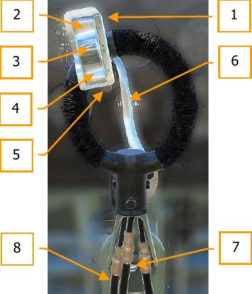

1. Трехпозиционная кнопка открытия огня.
2. Кнопка ведения огня из пулеметов.
3. Кнопка одновременной стрельбы.
4. Кнопка ведения огня из пушек.
5. Предохранитель.
6. Рычаг тормоза.
7. Шарнир верхней части РУС.
8. Пневмошланги системы вооружения.

Педали продольно перемещающиеся, имеют две площадки для ног летчика. Верхние площадки
используются при энергичном маневрировании в бою. На верхних площадках установлены
брезентовые ремни для предотвращения соскальзывания ног с педалей при активном
маневрировании.

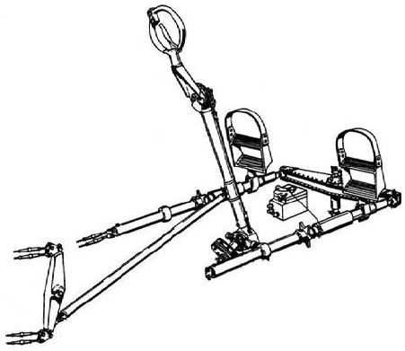

Передача управляющих воздействий от органов управления осуществляется при помощи
тросов, тяг и качалок.

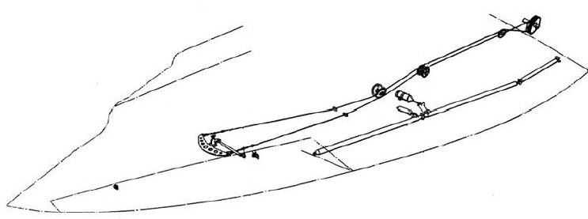

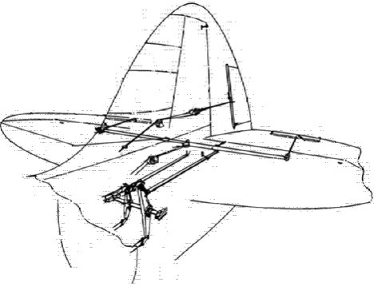

### Элероны

Элероны типа "FRISE", цельнометаллические, со 100% весовой балансировкой. Крепятся к
заднему вспомогательному лонжерону. Регулировка балансировки производится при помощи
свинцовых шайб в трубе носка элерона.

Регулировка поперечной балансировки самолета осуществляется на земле, отгибанием задней
кромки элерона.

Углы отклонения:

- вверх - 26°.
- вниз - 18°.

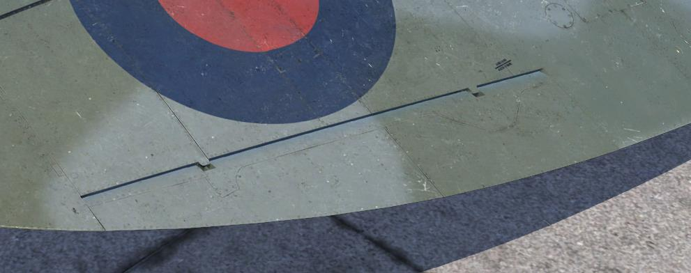

### Руль направления

Крепится к килю на двух узлах навески. Имеет металлическую каркас и полотняную обшивку,
пропитанную лаком. Оснащен весовой балансировкой. На ранние серии устанавливался руль
направления с округлой верхней частью, затем ввели более широкий руль с заостренной
верхней частью.

Углы отклонения:

- Округлый руль - 28°, измеряется по нервюре 6.
- Острый руль - 28,5° измеряется по нервюре 7.

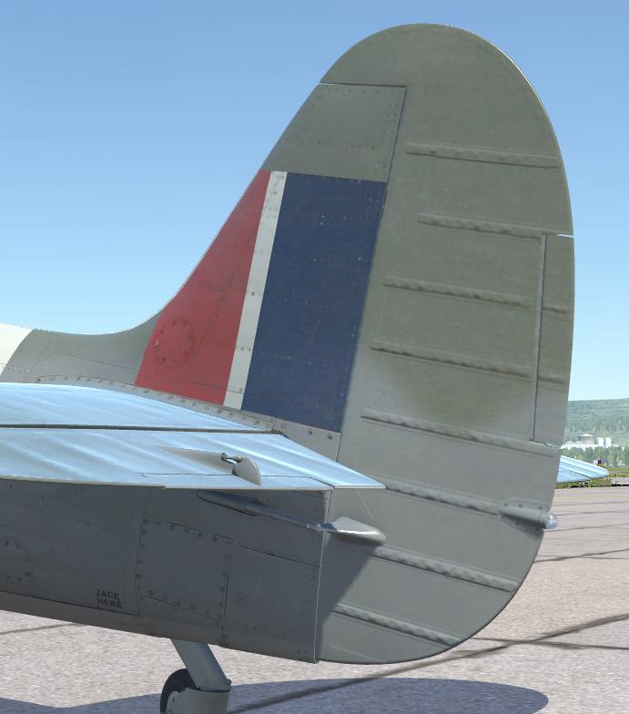

### Руль высоты

Крепится к стабилизатору. Выполнен единой частью. Имеет металлический каркас и
полотняную обшивку, пропитанную лаком. Оснащен роговой компенсацией. На поздние серии
устанавливался руль с увеличенной роговой компенсацией.

Углы отклонения:

- Вверх - 28°.
- Вниз - 23°.

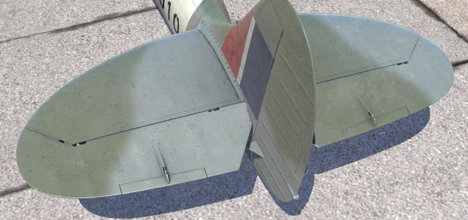

### Триммеры

Для снятия усилий на ручке и педалях, руль высоты и руль направления оснащены
триммерами. Триммеры выполнены из алюминиевых сплавов.

Триммер руля высоты управляется с помощью большого штурвальчика (30) на левом борту
кабины. В левой части приборной доски расположен индикатор (24) положения триммера
относительно руля высоты. Нейтральное положение триммера руля высоты по индикатору
составляет 2 деления от среднего положения в сторону "NOSE UP". Для перемещения триммера
из среднего положения стрелки указателя в крайнее необходимо не меньше двух полных оборота
штурвальчика.

Триммер руля направления управляется с помощью маленького штурвальчика (27) и не имеет
индикацию положения. Самолет имеет тенденцию к кренению вправо при вращении
штурвальчика по часовой стрелке. Триммер руля направления является по конструкции
триммером-флетнером, кинематически отклоняется против хода руля поворота и имеет при этом
возможность ручного управления.

Направление вращения штурвальчиками указано непосредственно на них или рядом на
табличках.

1. Триммер руля высоты.
2. Информационная табличка триммера руля
   высоты.                                                 
3. Триммер руля направления                                          

Углы отклонения триммера руля направления
  (для обоих типов):                                          

- Влево - 18°.
- Вправо - 5°.

Углы отклонения триммера руля высоты:

- Вверх - 20°.
- Вниз - 7°.

### Посадочные щитки

Четырех секционные щитки типа "SHRENK" разделены по размаху каждый на две неравные
части: внешнюю и внутреннюю. Разделение щитка вызвано изломом нижней поверхности крыла
в месте у задней кромки в плоскости стыкового крепления крыла к фюзеляжу. Щитки крепятся
к вспомогательному лонжерону крыла. Размещены от внутреннего края элерона до корня крыла.

Щитки управляются от пневмосистемы при помощи
крана, расположенного в левой верхней части
приборной доски. Для выпуска щитков рукоятку крана
необходимо переместить вниз. В полете закрылки
убираются скоростным напором при перемещении
рукоятки крана в верхнее положение и усилием
пружинного механизма. На земле щитки убираются
только    от    усилия    пружинного    механизма,
установленного рядом с цилиндром выпуска.

В качестве визуальной индикации выпущенного
положения щитков используется      конструктивное
выполнение кронштейна щитков, который при
выпущенном положении выходит за контур обшивки
крыла. Вырез обшивки закрывается подпружинненым
лючком. В выпущенном положении, кронштейн щитка
открывает лючок.

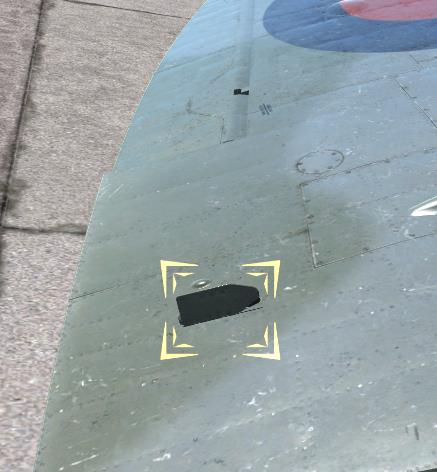

Щитки имеют два положения: убрано - "UP", и полностью
выпущено - "DOWN".

Угол отклонения щитков составляет 80° - 85°.

## Шасси

### Основные технические данные

Характеристика | Значение
---------------|----------------
 **Основные стойки шасси** |
 Тип                                | убирающиеся, консольное
 Колея                              | 5 футов 8 ½ дюйма (1 метр 74 сантиметра)
 **Амортизационные стойки** |
 **Шлиц-шарнирная стойка**          | **Масляно-воздушная "Vickers" №91244/L, №91986**
 Давление воздуха в амортизаторе    | 465 фунт/дюйм2 (32,7 кгс/см2), самолет на   подъемниках
 Колесо                             | "Dunlop" AH.2061
 Покрышка                           | IJ.13 или IJ.17
 Камера                             | IJ.8 или IJ.9
 Давление воздуха в колесах         | 57 фунт/дюйм2 (4 кгс/см2)
 **Стойка без шлиц-шарнира**        | **Масляно-воздушная "Vickers" №91244**
 Давление воздуха в амортизатор     | 380 фунт/дюйм2 (26,7 кгс/см2), самолет на подъемниках
 Колесо                             | "Dunlop" AH.10019
 Покрышка                           | IJ.13 или IJ.17
 Камера                             | IJ.8 или IJ.9
 Давление воздуха в колесах         | 54 фунт/дюйм2 (3,8 кгс/см2)
 Тормоз                             | пневматический, "Dunlop"
 **Хвостовая опора** |
 Тип                                | неубирающиеся, самоориентируещееся
 Амортизатор                        | Масляно-воздушная "Vickers" №90356
 Давление воздуха в амортизаторе    | 242 фунт/дюйм2 (17 кгс/см2), самолет на подъемниках
 Колесо                             | "Dunlop" AH.2184/IX
 Покрышка                           | TA.12 или TA.14
 Камера                             | TA.2 или TA.3
 Давление воздуха в колесах         | 47 фунт/дюйм2 (3,3 кгс/см2)

На самолете установлено трехколесное шасси с масляно-воздушной амортизацией. Шасси
состоит из двух основных стоек консольного типа и неубираемого самоориентирующегося
хвостового колеса. Две основные стойки смонтированы в консолях крыла, крепятся к основному
лонжерону крыла. Хвостовое колесо установлено в задней части фюзеляжа. Основные стойки
убираются по размаху крыла от оси самолета к концам консолей. Убранное шасси закрывается
щитками не полностью. Стойки фиксируются в убранном и выпущенном положении при помощи
механического замка. Система индикации положения шасси световая.

Колеса снабжены пневматическими тормозами. Рычаг управления тормозами смонтирован на
ручке управления самолетом, дифференциал тормозной системы связан с педалями ножного
управления. При обжатии рычага торможения и нейтральном положении педалей, давление
сжатого воздуха подводится к обоим тормозам одинаково. При отклонении педалей от
нейтрального положения, дифференциал, установленный на полу кабины, растормозит колесо,
противоположное стороне разворота.

Малая ширина колеи - 5 футов и 8 ½ дюймов (0,153 размаха крыла) не исключала возможность
поперечных раскачиваний самолета при взлете и посадке и связанной с малой высотой шасси
поломки законцовок крыла, особенно в условиях полевых аэродромов. Малый вынос основных
стоек шасси делали "Spitfire" склонным к капотированию.

### Система уборки - выпуска шасси

Механизм уборки - выпуска шасси гидравлический. Помпа, установленная на двигателе, создает
давление жидкости, передаваемое поршням подъемников шасси для подъема или выпуска.

Управление уборкой-выпуском осуществляется при помощи [крана шасси (58)](03.cockpit.md#cockpit_part_58), установленного на
правом борту кабины.

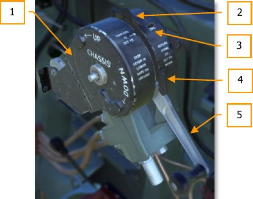

1. Кран уборки-выпуска шасси
2. Упор убранного положения
3. Указатель положения золотника
   крана                                 
4. Упор выпущенного положения
5. Рукоятка крана шасси

### Работа системы уборки-выпуска шасси

[Кран шасси (58)](03.cockpit.md#cockpit_part_58) установлен на правом борту кабины.

Уборка шасси производится в три этапа:

1. Рукоятку переместить вниз до выхода из паза, удерживать рукоятку в заднем положении 2
секунды, при этом давление гидрожидкости в линии выпуска снимает нагрузку с замка
выпущенного положения.
2. Вывести рукоятку из паза и переместить её энергичным движением вперед до упора, при этом
замки выпущенного положения поворачиваются в положение "UP" при помощи тросов и цепей
Галля, гидравлическая жидкость направляется в штоковую полость подъемников.

    !!! warning "ВНИМАНИЕ"
        Движение рукоятки во второй этапе должно производиться без задержек и
        остановок, в противном случае возможно заклинивание системы уборки-выпуска.

3. После того как стойки встанут на замки убранного положения, рукоятка крана автоматически
отщелкнется в передний паз на корпусе крана под действием стопорного штифта.

Для выпуска шасси рукоятку крана необходимо удерживать в переднем положении около 2
секунд, затем энергичным движением без задержки потянуть рукоятку назад до упора. После
того как шасси будет выпущено, рукоятка автоматически отщелкнется в паз выпущенного
положения (задний паз на корпусе крана).

!!! warning "ВНИМАНИЕ"
    Не переводите рукоятку в пазы крана самостоятельно, так как это приведет к
    отсечке гидравлической системы.

## Сигнализация шасси

### Указатель на кране уборки-выпуска

Установленный на корпусе крана уборки-выпуска, механический указатель, отображает в окошке
положение золотника крана с помощью слов "DOWN", "UP" и "IDLE". При выпуске шасси в окошке
указателя должен отображаться сигнал "DOWN", при уборке – соответственно "UP".
“IDLE” отображается при нахождении рукоятки в любом из пазов крана. При неработающем
двигателе указатель может отображать "DOWN", после запуска двигателя сигнал должен
смениться на “IDLE”, если этого не произошло, и указатель показывает "DOWN", это является
признаком возможного отказа гидравлического насоса.

### Световая сигнализация

Табло-сигнализатор, установленное в левой части приборной панели, имеет два полупрозрачных
трафарета со словами "UP" и "DOWN".
В соответствии с положением основных стоек горит один из двух сигнализаторов, "UP" когда
стойки полностью убраны и стоят на замках, "DOWN" когда стойки выпущены и стоят на замках.
Каждый сигнализатор состоит из двух ламп, подключенных в параллель. На корпусе табло
имеется шторка, которая закрывает переднюю часть табло, приглушая свечение при ночных
полетах.

В цепях табло-сигнализатора установлено три концевых выключателя. Первый выключатель
срабатывает, когда стойка находится в убранном положении (цепь "UP"), второй выключатель
срабатывает при выпущенном положении стойки (цепь "DOWN") и третий концевой
выключатель, расположенный в корпусе замка, общий для двух цепей – срабатывает, когда
фиксирующий штифт замка находится в отверстии проушины.

Выключатель цепи сигнализации выпущенного положения [(39)](03.cockpit.md#cockpit_part_39) установлен на секторе газа.
Включается нажимной лапкой, установленной на рычаге газа, при его перемещении вперед. При
этом подается питание в цепь табло "DOWN". Переключатель необходимо вручную переместить
в положение "OFF" после полета. Это предотвратит разряд аккумуляторной батареи при стоянке
самолета.

## Аварийная система выпуска шасси

В случае отказа гидравлической системы, выпуск шасси производится с помощью давления
сжатого углекислого газа, находящегося в баллоне. Баллон крепится хомутами к правой стороне
кабины, возле сидения летчика. Горлышко баллона, содержащего 90 грамм углекислого газа
герметично запаяно мембраной. На горлышке баллона установлен кран с рукояткой аварийного
выпуска. В корпусе крана размещен подпружиненный поршень с иглой, который при повороте
рукоятки пробивает мембрану и выпускает углекислый газ в систему. Рукоятка окрашена в
красный цвет, имеет выгравированную надпись "EMERGENCY ONLY". Для проверки состояния
системы рукоятка законтрена тонкой медной проволокой.

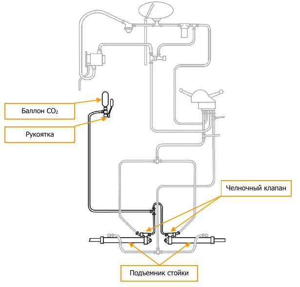

Трубопровод от баллона разделяется через тройник и соединяется с гидравлическими линиями,
через челночные клапана, к бесштоковым полостям гидроподъемника.

Челночный клапан служит для отсечки гидравлической системы при срабатывании системы
аварийного выпуска шасси. Установлен на задней части корпуса гидроподъемника. Клапан
состоит из корпуса, пружины и запорного элемента. Имеет три штуцера для подсоединения.
Один штуцер вкручивается в корпус гидроподъемника, второй штуцер служит для
подсоединения гидравлической магистрали и третий соединяет трубопровод от баллона
аварийной системы. В нормальной ситуации, подпружиненный запорный элемент закрывает
штуцер подвода углекислого газа, позволяя гидрожидкости беспрепятственно циркулировать по
трубопроводам. При применении аварийной системы, давление углекислого газа пересиливает
пружину и перемещает запорный элемент до упора, отсекая тем самым подачу гидрожидкости в
гидроподъемник. Углекислый газ подается в бесштоковую полость подъемника и выдвигает
шток, перемещая стойку в выпущенное положение.

### Работа системы аварийного выпуска шасси

Для аварийного выпуска шасси необходимо убедиться, что рукоятка крана выпуска шасси
находится в положение "DOWN", затем переместить рукоятку аварийного выпуска вперед и вниз.
Угловое перемещение рукоятки составляет примерно 100° для нажатия на пробивной поршень
через профилированный кулачок. После полного хода поршня, возвратная пружина и давление
газа возвращают поршень в исходное положение и углекислый газ направляется в
гидроподъемник.

Если система аварийного выпуска применена при положении крана шасси в положении "UP", то
стойки не выйдут. В этом случае необходимо при помощи ломика разгерметизировать линию
подачи углекислого газа в подъемники стоек шасси.
Запрещено ставить рукоятку на место после применения аварийной системы до замены баллона
на новый.

## Гидравлическая система

Гидравлическая система предназначена для обеспечения работы системы уборки-выпуска
шасси.

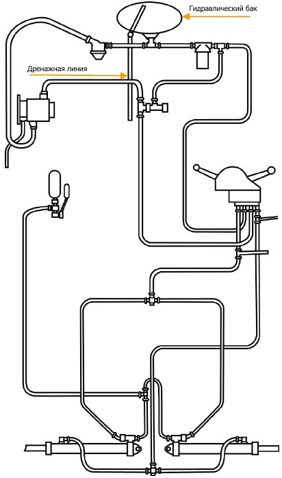

Источником давления является гидравлический насос, установленный на правой стороне
двигателя. Гидравлическая жидкость из бачка поступает к насосу, через фильтр A.G.S. В системе
используется английское масло стандарта D.T.D. 585 либо гидросмесь из 50% глицерина и 50%
этилового спирта, крепостью не менее 78°. Объем гидросистемы 1.06 галлона (4,82 литра). После
насоса, через предохранительный клапан гидрожидкость подается к крану шасси,
установленному на правом борту кабины. От крана трубопроводы подсоединены к обеим
полостям гидроподъемников шасси. Кран шасси направляет гидрожидкость к необходимой
полости гидроподъемника, в зависимости от производимой операции: выпуск или уборка шасси.
Линия слива от крана шасси подает гидрожидкость через фильтр "VOKES", вход которого
соединен трубопроводом с предохранительным клапаном. И далее гидрожидкость поступает
обратно в бачок. Дренажная трубка из бачка проходит по правой стороне шпангоута и выходит
снизу за контур обшивки.

### Гидравлический бачок

Бачок гидравлической системы крепится двумя хомутами к противопожарной перегородке,
сверху справа. Заправочная горловина бачка оснащена фильтром-сеткой и мерной линейкой.
Уровень гидрожидкости в бачке контролируется по мерной линейке.

### Гидравлический насос

Гидравлический насос H Mk. IV размещается на правом блоке цилиндров и приводится во
вращение от кулачкового распределительного вала двигателя.

### Предохранительный клапан

Размещен на передней части противопожарной перегородке, в линии подачи от насоса к крану
шасси. В случае увеличения давления в линии подачи до 1250±50 фунт/дюйм2 (87,88 ± 3,52
кг/см2) клапан срабатывает и жидкость от насоса сбрасывается в гидробачок, минуя кран шасси.

### Кран управления шасси

Кран состоит из квадранта (11) (цифры в круглых скобках по обозначению элементов на рисунке
64) крана и корпуса (4), в котором размещены три цилиндрические выточки. В выточках
размещаются: золотник (3), централизующая пружина (2) и запорный поршень (1). Выточка для
золотника имеет кольцевые проточки для соединения между собой 4-х гидравлических
магистралей: подачи, слива, выпуска и уборки.

Золотник имеет проточки, которые направляют гидрожидкость из магистрали подачи в
магистрали слива, уборки или выпуска, в зависимости от положения золотника в корпусе крана.
Золотник перемещается под действием штока, соединенного с рычагом (5), установленного на
оси механизма рукоятки. Этот рычаг (5) приводится в действие сектором (7), в конце хода
рукоятки крана (9). Сектор (7) соединен с рукояткой (9).

К рычагу (5) также прикреплен подпружиненный централизующий стержень (6), который
обеспечивает нахождение золотника (3) в положении холостого хода, то есть когда магистраль
подачи соединена со сливом. Для пересиливания централизующей пружины (13) при
нахождении золотника положениях в "UP" или "DOWN", используется подпружиненная собачка
(18). Собачка входит в зацепление с одним из двух пазов храпового механизма (16),
установленного на оси рукоятки, когда рукоятка крана перемещается в положение "UP" или
"DOWN". Собачка выводится из зацепления при помощи кулачка (17) установленного на секторе
(7) при перемещении рукоятки крана.

Собачка также выводится из зацепления в конце цикла уборки-выпуска шасси при помощи
запорного поршня. При окончании цикла, давление гидрожидкости в корпусе крана начинает
расти и перемещает запорный поршень в своей проточке. Проточка запорного поршня
сообщается с магистралью подачи. Поршень давит на собачку и выводит её из зацепления с
храповиком. После отцепления собачки, централизующая пружина через стрежень возвращает
золотник в положение холостого хода. Давление гидрожидкости, необходимое для срабатывания
запорного поршня 1150±50 фунт/дюйм2 (80,85 ± 3,52 кг/см2).

К рычагу (5) прикреплен индикатор (10), который вращается на оси рукоятки и показывает через
вырез на корпусе квадранта положение золотника - "IDLE", "UP", "DOWN".

Пружина (14) отщелкивает рукоятку крана в паз, после того как рукоятка пройдет упор (12).
На оси рукоятки смонтирована цепная шестерня, с цепью Галля, переходящей в тросовую
проводку, для управления замками шасси. Для того чтобы замки стоек не открылись при
выведении рукоятки из пазов, между рукояткой и шестерней предусмотрен мертвый ход в 9°.
На секторе (7) установлены кулачок (8), который замыкает контакты (20) в конце хода рукоятки.
Контакты служат переключателем для питания двух цепей, убранного и выпущенного положения
стоек, трафаретов "UP" и "DOWN" табло - сигнализатора соответственно.

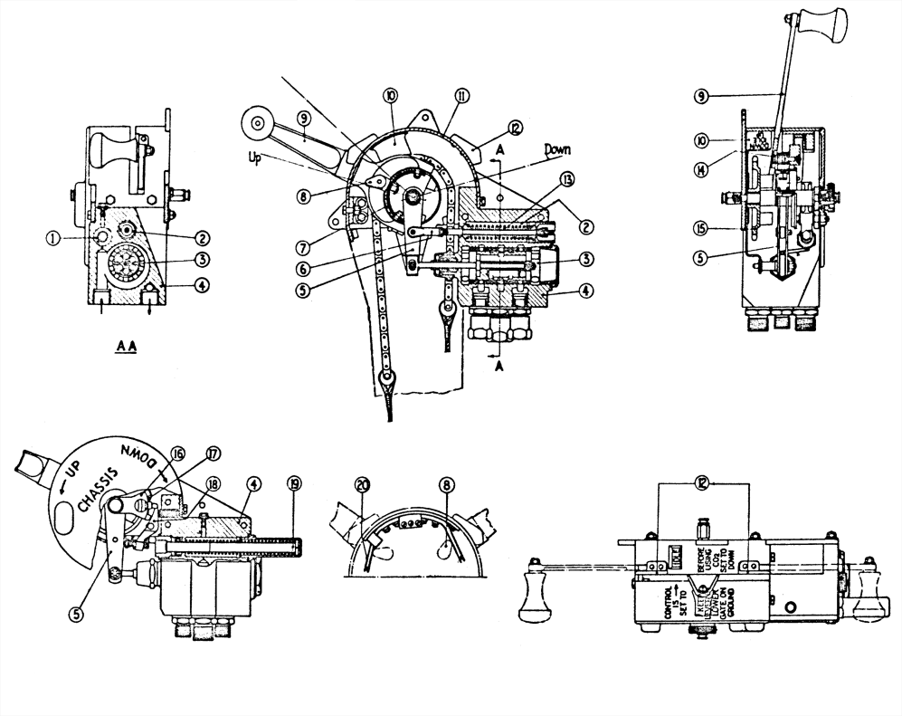

### Работа крана управления шасси

Когда рукоятка крана находится в любом из пазов квадранта, гидрожидкость от насоса по
магистрали подачи поступает в кран и направляется сразу в магистраль слива.
Для уборки шасси, рукоятку необходимо переместить на 9° вниз (по часовой стрелке) – на
выпуск, вывести из паза и затем перевести рукоятку вперед (против часовой стрелки) – на
уборку. Перемещение произвести энергично, за время около 1 секунды. Перемещения золотника
крана при таком движении рукоятки будут следующими:

1. Начальные 9° поворота рукоятки на выпуск:
     Золотник перемещается вдоль выточки и удерживается собачкой, застопоренной
     верхней частью центрального зуба храповика, тем самым перекрывая слив
     гидрожидкости в бачок и направляя её в поршневую полость гидроподъемника.
     Гидрожидкость из штоковой полости гидроподъемника направляется через золотник
     крана шасси в магистраль слива. Так как стойки находятся в выпущенном положении,
     то никакого движения не происходит, однако при этом давление гидрожидкости
     снимает с замков нагрузку от веса стоек. Мертвый ход между рукояткой и шестерней с
     цепью позволяет выполнить это движение без срабатывания замков.
2. Выход рукоятки из паза:
     Замки стоек снимаются с блокировки.
3. Первые 9° поворота рукоятки на уборку:
     Выбирается мертвый ход между рукояткой и тросами замков.
4. Последующий поворот рукоятки на 132° на уборку:
     В первой части поворота, собачка храповика сбрасывается при помощи кулачков,
     золотник под действием централизующей пружины возвращается в положение
     холостого хода. Язычки замков, со снятой с них нагрузкой свободно поворачиваются
     из положения "DOWN", практически в положение "UP".
5. Последние 9° поворота рукоятки на уборку:
     Поворот язычков в положение "UP" выполнен, одновременно с этим золотник
     перемещается в другой конец выточки, и удерживается в этом положении собачкой,
     застопоренной нижней частью центрального зуба храповика. Таким образом слив
     гидрожидкость из магистрали подачи в гидробачок перекрывается и жидкость под
     давлением подается в штоковую полость гидроподъемника. Жидкость из поршневой
     полости через кран шасси сливается в бачок. Давление в магистралях при работе
     уборке - выпуске шасси примерно 200 фунт/дюйм2 (14 кг/см2).
6. Окончание движения на уборку:
     После окончания цикла уборки давление в гидравлической системе возрастает до тех
     пор, пока не станет достаточным для срабатывания запорного поршня. Проточка
     запорного поршня сообщается с магистралью подачи. Давление гидрожидкости
     пересиливает пружину, и выступающая часть поршня давит на упорный винт собачки,
     выводя её из зацепления с храповиком. После отцепления собачки, централизующая
     пружина через стрежень возвращает золотник в положение холостого хода.
7. Последние 9° поворота рукоятки на выпуск:
     С возвратом золотника в режим холостого хода, рукоятка при движении на выпуск
     заходит в паз, стопоря тем самым замки стоек.

Для выпуска шасси последовательность срабатывания крана обратная.

## Пневматическая система

Пневматическая система предназначена для обеспечения работы посадочных щитков, створок
радиаторов, тормозов колес, взведения оружия, стрельбы из оружия и работы
фотокинопулемета.

Воздушный компрессор "Heywood" SH.6/2, смонтированный на задней части правого блока
цилиндров, подает сжатый воздух, через редукционный клапан A.R.300-1, во масло-
влагоотделитель O.W.T./46 и далее воздух поступает в баллоны. Смазка компрессора
осуществляется маслом двигателя.

Масло-влагоотделитель, установленный в системе служит для отделения масла и воды от
воздуха, подаваемого в баллоны. Слив отстоя необходимо производить каждые 10 часов налета.
Баллоны расположены по правой стороне фюзеляжа сразу за кабиной летчика. Соединены
баллоны последовательно, между баллонами установлен обратный клапан, исключающий
перетекание воздуха. Полностью заряженные баллоны имеют давление воздуха 300 фунт/дюйм2
(21 кг/см2). Давление в баллонах контролируется по трёхстрелочному манометру,
установленного слева в нижней части приборной доски.

Из баллонов воздух через фильтр поступает к коллектору, подающему воздух к цилиндрам
створок радиаторов, цилиндру управления скоростями нагнетателя.

Далее основная магистраль, через редукционный клапан AHO 16402, который понижает
давление до 140 фунт/дюйм2 (9,8 кг/см2), подает воздух к коллектору, питающему следующие
агрегаты:

- Механизмы перезарядки пушек "Hispano"
- Пневмоспуски пушек "Hispano"
- Пневмоспуски, пневмовзводы, предохранители пулеметов "Colt-Browning"
- Фотокинопулемёт
- Дифференциал тормозов Mk.II, расположенный на полу кабины за ручкой управления
- Кнопка управления огнем, расположенная на верхней части ручки управления
- Кран щитков, расположенный в верхней левой части приборной доски

Система имеет также штуцер зарядки пневмосистемы, расположенный на левой стороне
двигателя, доступ к которому осуществляется через лючок заправки масляного бака двигателя.

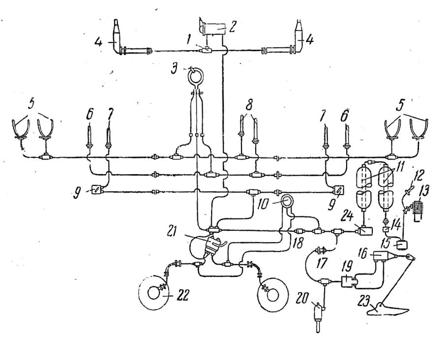

1.    Ограничительный клапан                    
2.    Кран управления щитками                   
3.    Кнопка управления огнем                   
4.    Цилиндр щитков                            
5.    Огонь, предохранитель и перезарядка       
      пулеметов                                 
6.    Огонь пушек                               
7.    Перезарядка пушек                         
8.    Фотокинопулемет                           
9.    Кран управления перезарядкой пушки        
10.   Трехстрелочный манометр                   
11.   Бортовые воздушные баллоны                
12.   Штуцер бортовой зарядки                   
13.   Компрессор “Heywood”
14. Редукционный клапан
15. Масло- и влагоотделитель
16. Цилиндр заслонки радиатора
17. Клапан минимального давления
18. Редукционный клапан
19. Электромагнитный клапан управления
    заслонкой радиатора
20. Цилиндр управления скоростями
    нагнетателя
21. Дифференциал тормозов
22. Колесо основной стойки шасси
23. Заслонка радиатора
24. Воздушный фильтр

### Кран управления щитками

Состоит из корпуса, золотника и двух штуцеров. Корпус крана проходит через приборную доску
и закрывается колпачком с ручкой. В корпусе крана установлен подпружиненный поршень.
Щитки имеют только два положения, убрано - "UP" и полностью выпущено - "DOWN". При
выпуске щитков рукоятку необходимо перевести в положение "DOWN", поршень перемещается
под действием рукоятки и перепускает воздух из пневмосистемы к цилиндрам выпуска щитков.
При уборке щитков, ручка ставится в положение "UP". Поршень перемещается под действием
пружины и перекрывает подачу воздуха в цилиндры щитков, при этом воздух от цилиндров
щитков стравливается в атмосферу.

### Ограничительный клапан

От крана щитков воздух через ограничительный клапан подается в цилиндры выпуска щитков.
В корпусе клапана установлены два диска с отверстиями малого диаметра. Таким образом
предотвращается резкое поступление воздуха в цилиндры и выпуск щитков становится более
плавным.

### Цилиндр щитков

Цилиндр крепится к заднему лонжерону крыла. Шток цилиндра через качалку крепится к
середине щитка. При выпуске щитков, сжатый воздух из пневмосистемы через кран управления
щитками подается в поршневую полость цилиндра. Шток выдвигается и щитки выпускаются. При
уборке щитков рукоятка крана управления стравливает воздух из поршневой полости и щитки,
под действием пружинного механизма и воздушного потока (в полете) убираются.

### Пружинный механизм

Предназначен для уборки щитков. Состоит из пружины сжатия, размещенной в корпусе и
соединенной с качалкой щитка. Крепится рядом с цилиндром выпуска щитков. При стравливании
давления из цилиндра, усилие пружины поднимает щиток.

### Фотокинопулемет

Фотокинопулемет G45, установленный в правой плоскости крыла, включается при нажатии на
гашетку открытия огня, установленную на верхней части ручки управления самолетом. Пока
гашетка нажата, фотокинопулемет работает.

### Пулеметы "Colt-Browning"

Механизмы пневмоспуска и пневмозарядки пулеметов, запитываются от магистрали гашетки
открытия огня. К механизмам пневмоспуска и пневмозарядки пулемета подводятся гибкие
бронированые шланги.

### Пушки "Hispano" Mk.II

Механизмы пневмоспуска и пневмозарядки пушек запитываются от магистрали гашетки
открытия огня. К механизмам пневмоспуска и пневмозарядки пушки подводятся гибкие
бронированые шланги. Перезарядка пулеметно-пушечного вооружения может производиться
только на земле.

### Тормоза колес

Рычаг управления тормозами, установленный на ручке управления, через тросик в боуденовской
оболочке открывает клапан управления тормозами. В зависимости от величины обжатия рычага,
клапан регулирует подачу сжатого воздуха к тормозам. Дифференциал тормозов позволяет
регулировать давление в тормозах, в зависимости от угла отклонения педалей. Давление
воздуха в тормозах контролируется по трёхстрочному манометру, установленного в левой
нижней части приборной доски. Нормальное давление составляет 80-90 фунт/дюйм2 (5,6 - 9,3
кг/см2).

## Топливная система

Топливная система предназначена для хранения на самолете запаса топлива и обеспечения
подачи топлива в двигатель. На самолете используется авиационный бензин с октановым числом
100. Запас горючего содержится в двух топливных баках, расположенных за противопожарной
перегородкой перед кабиной летчика. Нижний бак объемом 37 галлонов (168 л.) расположен
между 6-м и 7-м шпангоутом в нижней части фюзеляжа. Крепится с помощью металлических
лент. Нижний бак протектирован. Над ним размещен верхний бак объемом 48 галлонов ( 218 л.),
крепится четырьмя кронштейнами к верхним лонжеронам фюзеляжа. Верхний бак защищен
листом брони, размещенной позади бака за противопожарной перегородкой. Сверху бак закрыт
съемной панелью, которая формирует фюзеляж. Баки соединены между собой питающим
шлангом. Вентиляция топливных баков осуществляется при помощи двух трубопроводов. Оба
трубопровода установлены в передней верхней части верхнего бака. Один трубопровод
соединяет нижний и верхний баки, второй трубопровод проходит через заднюю стенку верхнего
бака и выводится перед обтекателем правого подкрыльевого радиатора.
Топливо из верхнего бака поступает в нижний бак самотеком. Из нижнего бака бензин при
помощи электрического подкачивающего насоса F.B.7 Mk.II через главный кран, поступает в
фильтр A.G.S., установленный на противопожарной перегородке спереди, и дальше через
воздухоотделитель подается бензонасосом двигателя в регулятор давления и далее в
карбюратор. Воздух из отделителя сбрасывается в верхний бак. При питании бензосистемы от
подвесного бака, магистраль сброса воздуха из воздухоотделителя перекрывается специальным
краном для предотвращения перелива верхнего бака. Специальный кран соединен с краном
подачи бензина из подвесного бака.

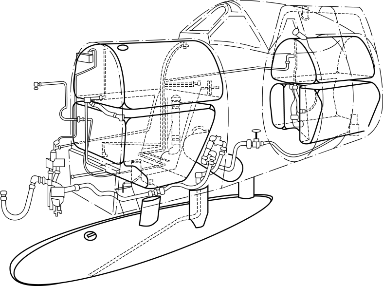

На рисунке 66 изображено расположение агрегатов топливной системы, рисунок отображает
систему с задними топливными баками и подвесным сигарообразным баком на 50 галлонов (227
л.) для самолетов Mk.IX и Mk.XIV.

Для предотвращения вскипания бензина в жаркую погоду на больших высотах, топливная
система оснащена системой наддува топливного бака, включающейся автоматически на высотах
более 20000 футов. Анероидный клапан подает в топливный бак воздух под давлением от
вакуумной помпы. Наддув топливных баков негативно влияет на работу самозатягивающихся
материалов протектированного бака и должен быть включен только при срабатывании
сигнализатора давления топлива. На больших высотах в жаркую погоду возможна неустойчивая
работа двигателя вследствие переобогащения топливо-воздушной смеси при работе системы
наддува баков, в этом случае наддув необходимо выключить.

Нормальное положение крана наддува - "OFF" (Выключено), включение наддува баков
производить только в случае загорания лампы-сигнализатора, срабатывающей при падении
давления бензина ниже 10 фунт/дюйм2 (0,7 кг/см2).

Кран включения наддува [(52)](03.cockpit.md#cockpit_part_52) расположен под приборной доской справа.

Кран аварийного отключения наддува баков, установленный в линии вентиляции баков,
позволяет отключить наддув при повреждении трубопроводов или баков, так как защитные
свойства нижнего бака ухудшаются при наличии избыточного давления. Кран установлен в
правом зализе крыла, ручка управления краном расположена справа-снизу у кресла пилота.
В качестве подкачивающего топливного насоса на самолетах ранней серии, оснащенных
двигателями "Merlin-66", используется ручная помпа (альвейер). Предназначена для заливки
питающего трубопровода самолета, приводного насоса и карбюратора перед запуском
двигателя. Может использоваться в качестве аварийного при отказе приводного насоса. После
выработки бензина из подвесного бака, при переключении на основной бак, необходимо
подкачать бензин в двигатель ручной помпой до устойчивой работы двигателя от другого бака.
Альвейер установлен на правом борту кабины, за коммутатором управления опознавательными
огнями. Помпа подает бензин из нижнего бака в основную магистраль за обратный клапан и до
главного крана. На поздних сериях в нижний бак начали устанавливать электрический
подкачивающий насос. Управление насосом осуществляется от выключателя [(82)](03.cockpit.md#cockpit_part_82),
установленного под штурвальчиком триммера

Пусковой насос [(17)](03.cockpit.md#cockpit_part_17) "Ki - Gass" предназначен для заливки топливом цилиндров двигателя и
топливной магистрали перед запуском. Расположен на правой нижней части приборной доски,
шпангоут № 8. Бензин из нижней части нижнего бака поступает по трубопроводу во
всасывающие патрубки двигателя под давлением, создаваемым пусковым насосом, в обход
основного бензокрана.

Карбюратор "Bendix-Stromberg" инжекторного типа, в отличие от поплавковых, обеспечивает
бесперебойную подачу бензина в двигатель при отрицательных перегрузках и интенсивных
маневрах.

Электрический бензиномер. Датчик уровня бензина один и установлен в нижнем баке. На
приборной панели в правой нижней части установлены указатель бензиномера [(16)](03.cockpit.md#cockpit_part_16) и кнопка
включения [(161)](03.cockpit.md#cockpit_part_161). Измеряет количество бензина в баках только при нажатой кнопке. Указатель
имеет две шкалы, нижняя для измерения бензина в полете, верхняя для измерения на земле в
трехстоечном положении самолета.

Лампа-сигнализатор [(19)](03.cockpit.md#cockpit_part_19), установленная рядом с бензиномером, срабатывает при падении
давления бензина за бензонасосом ниже 10 фунт/дюйм2 (0,17 кг/см2). Лампа запитывается от
цепи выпущенного положения шасси при помощи переключателя [(39)](03.cockpit.md#cockpit_part_39) на секторе газа.
Дополнительно под фюзеляж могут подвешиваться подвесные баки объемом 30, 45, 90 галлонов
(не реализовано). Отдельный кран управляет подачей бензина из подвесного бака. Кран
расположен на правой части шпангоута №9. Рукоятка крана [(60)](03.cockpit.md#cockpit_part_60) расположена на правой стороне
кабины. Сброс подвесного бака осуществляется перемещением вверх рычага сброса [(57)](03.cockpit.md#cockpit_part_57). Рычаг
сброса установлен в правой части кабины сразу за рукояткой крана подвесного бака. Положение
рукоятки крана подвесного бака влияет на работу рычага сброса. Пока кран подвесного бака
открыт, сброс бака невозможен.

1.    Отделитель вакуум системы
2.    Клапан наддува баков
3.    Сепаратор
4.    Сливная пробка
5.    Бензопомпа
6.    Фильтр
7.    Обратный клапан
8.    Кран сепаратора
9.    Соединение кранов
10.   Главный кран
11.   Сливной кран
12.   Кран подвесного бака
13.   Кран дренажной системы
14.   Пусковой насос
15.   Альвейер
16.   Подвесной бак на 30 или 90 галлонов
17.   Верхний бак на 47 галлонов
18.   Нижний бак на 38 галлонов
19.   Подкачивающий электронасос

## Кислородная система

Кислород пилоту подается из одного баллона емкостью 750 литров газообразного кислорода
через экономайзер. Кислород из баллона под высоким давлением 1800 фунт/дюйм2 (126,5 кг/см2)
поступает в регулятор со встроенным фильтром и редукционным клапаном, уменьшающим
давление кислорода примерно до 40 фунт/дюйм2 (2,8 кгс/см2), далее через выходной фильтр
поступает в экономайзер. Подача кислорода в маску пилота осуществляется при помощи
резиновой трубки, идущей от экономайзера под сиденьем и закрепленной на правом борту
кабины.

Баллон устанавливался в задней части фюзеляжа, между 16 и 17 шпангоутами, на правом борту
выше базового лонжерона. Баллон крепится к раме двумя быстроразъемными хомутами. Рама в
свою очередь крепится болтами и заклепками к шпангоутам и обшивке. В случае необходимости
в систему можно установить второй баллон, между 18 и 19 шпангоутами.
Экономайзер установлен расположен на правом борту ниже базового лонжерона между
шпангоутами 12 и 13.

Кислородный регулятор Mk. VIIIС (6D/513) расположен на левой верхней части приборной доски.
Дополнительный кран [(39)](03.cockpit.md#cockpit_part_39) установлен на правом борту кабины. Кран перекрывает линию
высокого давления от баллонов до кислородного прибора, редукционный кран регулирует
давление в магистрали низкого давления.

## Электросистема

На самолете применена 12-вольтовая схема электропитания и двухпроводная неэкранированная
электрическая сеть. Источниками электроэнергии служат параллельно включенные генератор с
приводом от двигателя и кислотная аккумуляторная батарея.

На самолете установлены следующие потребители электроэнергии:

1.      Электрический стартер для запуска двигателя.
2.      Электрический бензиномер.
3.      Световая и звуковая сигнализация шасси.
4.   Связная и специальная радиостанция.
5.   Обогрев трубки Пито.
6.   Ночное осветительное оборудование, состоящее из аэронавигационных огней,
     опознавательных огней, внутрикабинного освещения и освещения прицела.
7.   Электромагнитный клапан разжижения масла.

### Электрооборудование

#### Генератор

Генератор типа "LХ" (5U/187) представляет собой четырехполюсную динамомашину с шунтовым
возбуждением. Привод генератора осуществлен от двигателя при помощи эластичной муфты,
предохраняющей вал генератора от поломок. Генератор закреплен на специальном фланце с
левой стороны двигателя четырьмя болтами. Охлаждение генератора в полете осуществляется
встречным потоком воздуха через два патрубка, выходящих из охлаждающей рубашки, один для
забора воздуха, другой – для его отвода. Защиту генератора от токов короткого замыкания и
резких перегрузок осуществляет плавкий предохранитель на 60А.

Генератор имеет следующие номинальные характеристики:

- Мощность - 750 Вт.
- Напряжение - 13,5В.
- Сила тока - 40А.
- Минимальное число оборотов в минуту - 3500.
- Максимальное число оборотов в минуту - 6000.

#### Регуляторная коробка

Бесконтактная, Type "F" (5U/191), предназначена для регулирования напряжения генератора.
Коробка обеспечивает постоянство напряжения в диапазоне от 13 до 14,5В при изменении
оборотов двигателя и различных нагрузках генератора, в пределах его мощности. Ограничитель
тока предохраняет генератор от перегрузок. Все детали регуляторной коробки крепятся на
опорной плите, которая имеет клеммную колодку. Регулятор установлен за заголовником кресла
на шпангоуте 11.

#### Минимальное реле

Включение генератора в бортовую сеть по достижении им минимального напряжения в 13-14В
и отключение генератора от сети при малых оборотах или остановке двигателя производятся
минимальным реле Type "D" (5С/1616). Представляет собой самостоятельный агрегат и
смонтирован на левом борту фюзеляжа отдельно от регуляторной коробки. Снаружи крышки
реле имеются два гнезда для подключения переносной лампы или контрольного вольтметра.
Минимальное реле служит предохранителем генератора от размагничивания, которое возможно
при параллельной работе генератора с аккумуляторной батареей. В момент запуска двигателя,
а также на режиме малых оборотов, когда из-за малой скорости вращения генератор не дает
полного напряжения. Ток аккумуляторной батареи стремится пройти через генератор и
заставить его вращаться от электромотора. Это явления в шунтовых генераторах
сопровождается переменой полярности при том же направлении вращения, после чего
генератор перестает работать как динамо-машина. В таких случаях минимальное реле
автоматически выключает генератор из общей цепи, и сеть нагрузки питается током
аккумуляторной батареи, а генератор работает вхолостую. Как только напряжение генератора
достигнет нормальной величины, минимальное реле автоматически включит генератор для
питания сети и для зарядки аккумуляторной батареи.

#### Аккумуляторная батарея

Бортовая кислотная аккумуляторная батарея типа "D" (5J/2284) в эбонитовом моноблоке имеет
следующие характеристики:

-  Напряжение - 12В.
-  Емкость 10-часового разряда - 40 А/ч.
-  Емкость 5-часового разряда - 27 А/ч.
-  Емкость часового разряда - 19 А/ч.

Батарея установлена в фюзеляже между шпангоутами 17 и 18 на деревянной подставке без
контейнера и теплоизоляции. Выходные клеммы батарей выполнены в виде трубок с нарезкой,
на которые наворачиваются накидные гайки, надетые на специальные наконечники отводящих
проводов.

#### Вольтметр

На приборной доске справа установлен вольтметр со шкалой 0 - 20В, показывающий напряжение
в сети.

#### Коробка фильтров

Для уменьшения помех радиоприемнику в цепь генератора включена коробка фильтров Type
"W" (5С/1614), состоящая из шести тороидальных дросселей и шести конденсаторов.
Установлена слева на подмоторной раме у генератора и соединена с ним проводами в
экранирующей оплетке. Провода, отходящие от коробки, экранировки не имеют.

#### Аэродромное питание

Для аэродромного питания бортовой сети от наземного источника электроэнергии на самолете
имеются две специальные розетки B.T.H. Type CX 70601. Одна розетка укреплена на
подмоторной раме с правой стороны двигателя. Основное назначение этой розетки - подача
питания стартеру. Вторая розетка расположена на левой части фюзеляжа на шпангоуте 11,
позади рамы сиденья, в зализе крыла. Основное назначение этой розетки - подача питания для
радиооборудования при наземных проверках. Включение вилки аэродромного источника
питания сопровождается поворотом крышки розетки, что дает отключение минуса
аккумуляторной батареи от сети.

#### Электросеть

На самолете применена двухпроводная электрическая сеть. Вся электросеть проложена без
металлических экранов, за исключением участка цепи от генератора до коробки фильтров.
Защита электрических установок осуществлена плавкими предохранителями, расположенными
в трех блоках закрытого типа. В каждом блоке на внутренней стороне крышки размещен
комплект запасных предохранителей. Блоки установлены по левому борту кабины. На крышках
проставлены номера предохранителей (соответственно принципиальной схемы) и наименование
потребителей, защищенных этими предохранителями. Сетевые провода имеют следующую
маркировку: на бирке, наклеенной на провод, поставлен номер предохранителя от которого
питается сеть, а цвет бирки указывает полярность жилы: голубой - минусовая полярность,
красный - плюсовая полярность. На схемах цвет заменен буквами: B - голубой цвет, R - красный.
Если применяемые провода черного цвета, то бирка на них белая. Для проводов принята
цветовая маркировка (или цвет заменяется биркой соответствующего цвета): желтый -
электросеть, красный - радиоустановки, голубой - проводки на двигателе, черный - сеть
индикаторов (например, сеть звуковой сирены, шасси и т.д.). В местах разъемов самолета и
разветвлений электропроводки установлены разветвительные коробки, которые на схемах
обозначаются: T.B.1, T.B.2, T.B.3 и т.д. На внутренней стороне крышки, закрывающей подход к
блокам предохранителей имеется таблица-ключ, при помощи которой производят расшифровку
обозначения проводов.

### Потребители

Потребителями электропитания являются:

- Стартер.
- Сигнализация шасси.
- Коллиматорный прицел.
- Фотокинопулемет.
- Взрыватели бомб и сброс (Не реализовано).
- Аэронавигационные огни.
- Опознавательные огни.
- Освещение.
- Обогрев трубки Пито.
- Электромагнитный клапан разжижения масла.

#### Стартер двигателя

Электрический стартер B.T.H. CA-4750 прямого действия (безынерционный) установлен на
двигателе с правой стороны снизу. Включения стартера в электрическую сеть выполняется при
помощи электромагнитного реле, укрепленного на подмоторной раме. Включение
электромагнитного реле, а, следовательно, и стартера производится кнопкой (23), находящейся
в нижней части приборной доски. Пусковая катушка системы зажигания установлена на
противопожарной перегородке справа. Питание стартера производится от бортового или
аэродромного аккумулятора. Для подключения аэродромного аккумулятора имеется
специальная розетка, расположенная на подмоторной раме справа. Включение вилки
аэродромного источника питания сопровождается поворотом крышки розетки, что дает
отключение минуса бортовой аккумуляторной батареи от сети. Гнезда розетки имеют различный
диаметр: больший - для плюсового проводника, меньший - для минусового. Управление
катушкой зажигания осуществляется при помощи кнопки, расположенной на приборной доске
слева от кнопки стартера. Для предохранения от случайного нажатия, обе кнопки защищены
подпружиненными колпачками. Защита цепи реле и пусковой катушки осуществляется
предохранителем на 10А. Время включения стартера не должно превышать 10 секунд, после
чего необходимо делать перерыв не менее 10 - 15 секунд. Стартер при запуске потребляет ток,
равный 250 - 275А. Запуск двигателя должен, как правило, производиться от аэродромного
аккумулятора.

#### Магнето

На двигателе устанавливаются два магнето B.T.H C6SE12S или Rotax NSE12/4. Магнето
представляет собой агрегат, в котором объединены электрический генератор тока и
трансформатор с распределителем для цепи высокого напряжения. Состоит из ротор-магнита,
якоря, первичной и вторичной обмоток трансформатора, прерывателя, конденсатора, крышки
распределителя и автомата опережения. Ротор магнето - это постоянный магнит, являющийся
источником магнитной энергии. При вращении ротора в сердечнике трансформатора создается
переменный магнитный поток, возбуждающий в обмотках трансформатора электродвижущую
силу. В первичной обмотке трансформатора (низкого напряжения) при замыкании контактов
прерывателя на массу возникает первичный ток низкого напряжения. В тот момент, когда сила
этого тока достигает наибольшего значения, вращающийся кулачок прерывателя поворачивает
рычажок прерывателя вкруг оси и контакты прерывателя очень быстро размыкаются. При этом
происходит разрыв первичного тока и резкое изменение магнитного потока в сердечнике
трансформатора. Конденсатор, включенный параллельно контактам прерывателя, уменьшает
искрение между ними и этим способствует более резкому изменению магнитного потока,
одновременно предотвращая подгорание контактов.

При изменении магнитного потока возникает (индуцируется) ток высокого напряжения во
вторичной обмотке трансформатора. Этот ток подается от центрального контакта
трансформатора через вывод высокого напряжения в крышку распределителя и через уголек на
рабочий электрод бегунка, с которого проходит через рабочие электроды крышки
распределителя по проводам к центральным электродам свечей двигателя. Ток высокого
напряжения идет к свече того цилиндра, в котором к этому времени должна произойти вспышка.
Между центральным и крайними электродами запальной свечи имеется искровой промежуток.
Ток высокого напряжения пробивает этот промежуток, при этом между электродами
проскакивает электрическая искра, воспламеняющая сжатую в камере сгорания рабочую смесь.
Автомат опережения представляет собой нормальный центробежный регулятор.
Ротор рабочего магнето связан шестернями с коленчатым валом и, следовательно, вращается
только во время работы двигателя. Передаточное число привода магнето 1,5:1. При вращении
вала двигателя искры подаются в нужной последовательности к цилиндрам.

#### Пусковая катушка

Для запуска двигателя магнето непригодно, поэтому на двигателе установлена пусковая катушка
зажигания Rotax N.I.К, которая работает от аккумуляторной батареи или наземного источника
электропитания. Пусковая катушка не является источником тока, а представляет собой
трансформатор, который преобразует постоянный электрический ток низкого напряжения в
пульсирующий ток высокого напряжения (15000-18000 В)

## Радиооборудование

### Радиосвязное оборудование

Самолет оснащен коротковолновой (КВ) радиостанцией типа A.R.I 1063. Приемопередатчик
T.R.1143 (10D/369) настроен на четыре определенные частоты для ведения двухсторонней связи
в воздухе между самолетами и наземными службами. Переключение частот производится при
помощи пульта Type 4 (110J/71), установленного на левом борту кабины. Частотный интервал
радиостанции 100 - 156 МГц. Дальность ведения радиосвязи между самолетами и наземными
командными пунктами зависит от высоты полета:

Высота, футов  |    Дальность, миль
---------------|-------------------
     1000      |            30
     3000      |            70
     5000      |            80
     10000     |           120
     15000     |           150
     20000     |           180

Радиостанция T.R.1196А состоит из: передатчика Type 22 (10R/23); приемника Type 25 (10P/11),
исполненных в одном корпусе. Вспомогательные компоненты КВ радиостанции: блок питания
12В Type 104 (10K/238), пульт управления Type 4, проволочная антенна, разъем для гарнитуры
Type 359.

Приемопередатчик установлен на четырех антивибрационных опорах, на выдвижной платформе
между 14-м и 15-м шпангоутами. Блок питания установлен под приемопередатчиком. Для
удобства обслуживания радиостанции на левой стороне фюзеляжа размещен люк доступа. Пульт
управления установлен на кронштейне на левом борту кабины. На пульте размещены кнопки
переключения частот, кнопка выключения, селектор режима работы и фильтр подсвета ламп
выбранной частоты. Разъем гарнитуры размещен на правом борту кабины за 10-м шпангоутом.

#### Пульт управления радиостанцией

Пульт "Type 4" (110J/71) предназначен для переключения каналов радиостанции при ведении
двухсторонней радиосвязи. Радиостанция имеет 4 предварительно настроенных канала для
ведения радиосвязи. Выбор канала осуществляется при помощи кнопок выбора канала,
промаркированных буквами A, B, C и D на лицевой панели пульта. Возле каждой кнопки
расположен светосигнализатор, подсвечивающий выбранный канал. Предусмотрен светофильтр
для сигнализаторов, для ослабления свечения ламп в сумерки и ночью. Выключение
радиостанции производится кнопкой "OFF" в верхней части лицевой панели пульта. В нижней
части панели расположен переключатель режимов работы радиостанции "T-R-REM".

Переключатель задает три режима работы:

- T - на передачу (Transmission)
- R - на прием (Receive),
- REM - на удаленное управление для приемо-передачи (Remote).

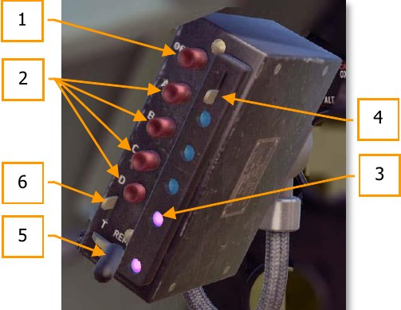

1.   Кнопка выключения радиостанции
2.   Кнопки выбора канала
3.   Светосигнализатор выбранного канала
4.   Рукоятка светофильтра
5.   Переключатель режимов работы
6.   Фиксатор переключателя режимов.

### Система госопознавания

Самолет оснащен ответчиком системы опознавания "свой-чужой" (Identification Friend or Foe)
типа A.R.I.5025. Ответчик состоит из: приемника R.3067, установленного за радиостанцией,
коммутирующих блоков Type 90 и Type 89, пульта управления Type "B", штыревой антенны Type
90. Пульт управления установлен на правом борту кабины перед 10-м шпангоутом. Управление
ответчиком осуществляется переключателем Type "F", отвечающего за включение ответчика
[(46)](03.cockpit.md#cockpit_part_46) и переключателем Type "D" [(162)](03.cockpit.md#cockpit_part_162) - включающего передачу сигнала бедствия, а также двух
нажимных кнопок [(44)](03.cockpit.md#cockpit_part_44), активирующих самоликвидатор. Самоликвидатор необходимо привести в
действие при вынужденной посадки на территории противника, одновременным нажатием на
обе кнопки. Датчик аварии включал самоликвидатор при больших ударных нагрузках. Антенна
ответчика, штыревого типа Type 90, установлена на нижней поверхности правого крыла.

## Навигационное оборудование

Навигационное оборудование самолета состоит из авиационного магнитного компаса P.8.M
(6A/726), установленного посредине нижнего обреза приборной доски и гирополукомпаса Mk.1A
(6A/1298) на панели приборов слепого полета. Основной частью компаса является магнитная
система, носящая название картушки. Картушка компаса, являющаяся чувствительным
элементом, состоит из системы магнитов, усиков-затухателей, топки, шпильки и пустотелого
поплавка, уменьшающего вес картушки в жидкости. Оси магнитов параллельны оси 0°-180°
лимба, называемой осью картушки. Одноименные полюса направлены в одну сторону. Картушка
компаса опирается шпилькой на чашку из твердого камня (сапфир, агат), вделанную в колонку
компаса и называемую топкой. Внутри котелка, который представляет собой алюминиевый сосуд
герметически закрытый стеклянной крышкой, помещается колонка, служащая опорой для
картушки компаса. Под стеклом находится курсовая черта - тонкая проволока, установленная
против лимба и служащая индексом при отсчете курса картушки по компасу. В котелок налита
жидкость для демпфирования колебаний картушки. Котелок соединяется с мембранной камерой,
изготовленной из тонкой гофрированной латуни. Камера служит для компенсации изменения
объема жидкости при изменении температуры. Снизу к котелку крепится девиационный прибор
для компенсации полукруговой девиации (6А/1032) или (6В/1752). Котелок компаса заполнен
лигроином. В середине нижней части приборной доски установлены две девиационные карточки,
левая для показаний компаса при наличии фюзеляжного подвесного бака, правая для показаний
без бака.

Гирополукомпас указывает отклонение от какого-либо курса, установленного кремальерой.

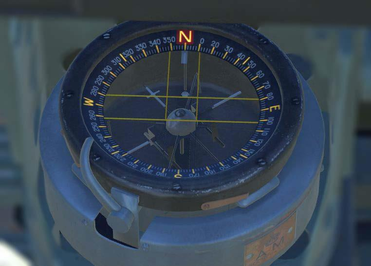

## Светотехническое оборудование

Светотехническое оборудование самолета состоит из аэронавигационных огней, огней
опознавания и освещения кабины.

### Навигационные огни

Схема аэронавигационных огней обычная. Арматуры бортовых огней закрыты стандартными
стеклянными колпачками (фильтрами). В арматурах бортовых огней установлены лампы по 20Вт
каждая, в арматуре хвостового огня - лампа мощностью 10Вт. Управление АНО осуществляется
из кабины при помощи выключателя [(79)](03.cockpit.md#cockpit_part_79), установленного на приборной доске в левом верхнем
углу. Защита цепи АНО осуществлена предохранителем в 5А.

### Опознавательные огни

Нижний опознавательный огонь служит для связи с землей, для связи между самолетами -
верхний огонь.

Управление опознавательными огнями осуществляется специальным коммутатором Type “C”
(5C/372), расположенным на правом борту кабины. Коммутатор состоит из двух переключателей,
левый для нижнего, правый для верхнего огня и ключа Морзе. Каждый переключатель имеет
три фиксированных положения: "STEADY" - включено на постоянную работу, "OFF" - выключено,
"MORSE" - включено для кодировки ключом.

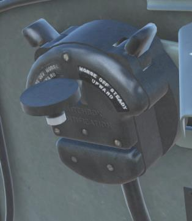

Ход ключа Морзе регулируется поворотом малого кольца в верхнем левом углу коммутатора.
Положение кольца фиксируется специальной защелкой, входящей в соответствующий вырез
кольца. (Не реализовано)

Мощность, потребляемая лампами опознавательных огней: нижний огонь - 35 Вт, верхний огонь
- 16 Вт.

Арматура верхнего огня расположена на кронштейне, укрепленном на верхней части фюзеляжа
с внутренней стороны. В фюзеляже сделана прорезь, которая закрыта колпачком обтекаемой
формы из прозрачного плексигласа.

Нижний огонь имеет рефлектор. Лампа нижнего огня матовая. Для нижнего огня снизу сделана
прорезь, которая закрыта оранжевым плексигласом. При необходимости оранжевый плексиглас
может заменяться на красный или зеленый.

### Освещение кабины

Кабина и приборная доска освещаются двумя кабинными светильниками (5С/793), с лампами
мощностью по 6Вт. Обе лампы закрываются стеклянными колпачками оранжевого цвета, сила
света каждой регулируется отдельным реостатом. Арматуры кабинных ламп установлены на
бортах кабины.
Левый кабинный светильник имеет возможность поворачиваться вверх и вниз, а также
выдвигаться. Правый поворачивается лишь вверх и вниз.

## Вспомогательное оборудование

### Ракетница

Шестизарядная ракетница "Plessey" установлена в задней верхней части фюзеляжа между
шпангоутами 16 и 17. Выстреливает вверх сигнальные ракеты калибром 1,5 дюйма при
вытягивании рукоятки выстрела. После выстрела рукоятка возвращается на место. Селектор
сигнальной ракеты расположен над рукояткой выстрела. Рукоятка и селектор установлены на
левом борту кабины на 10-м шпангоуте. Ракетница снаряжается через лючок на правой стороне
фюзеляжа между 17-м и 18 шпангоутами. Вырез в обшивке под дульный срез ракетницы
заклеивается перкалью перед вылетом. В данный момент в игре не реализована.

### Антиобледенительная система

Для предотвращения обмерзания козырька фонаря, на самолете предусмотрена
антиобледенительная система. Система состоит из бачка с антиобледенительной жидкостью,
крана, ручной помпы и игольчатого клапана. Бачок установлен в нижней части правого борта
кабины. Над бачком установлен кран, обеспечивающий подачу жидкости от помпы в
распылитель. Игольчатый клапан, установленный после помпы, служит для регулировки
количества подаваемой жидкости. В нижней части козырька установлен распылитель,
выполненный в виде трубки с отверстиями. Антиобледенительная жидкость - смесь
дистиллированной воды и этиленгликоля в равных пропорциях. Для работы системы необходимо
кран установить в положение "ON", рукоятку помпы снять с замка, рукоятка помпы под
действием пружины поднимется вверх, нажать на рукоятку помпы, отрегулировать подачу
жидкости игольчатым клапаном, произвести подачу жидкости по необходимости. Для
приведения системы в исходное положение кран закрыть, рукоятку помпы нажать и поставить
на замок.

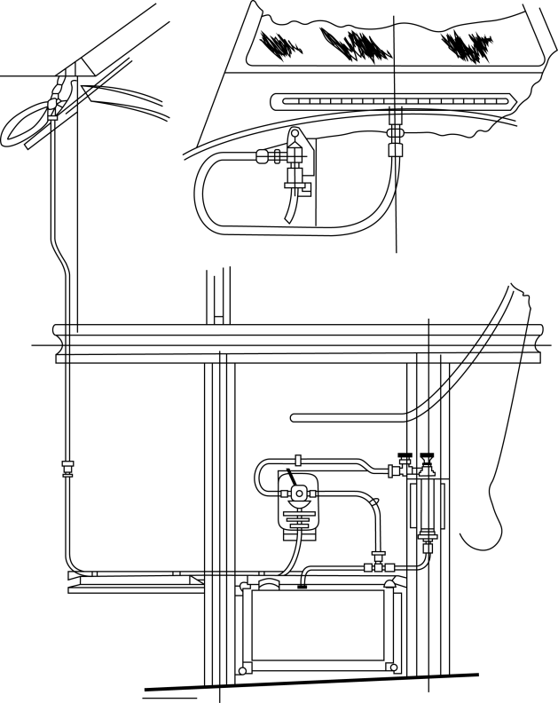

### Обогрев трубки Пито

Для обеспечения работы анероидно-мембранных приборов в кабине летчика на самолете
установлена трубка Пито Mk.VIIIC (6A/730). В целях предотвращения обмерзания приемника
воздушного давления трубки Пито обогревается от электрической сети самолета. Обогрев
потребляет 115Вт. Включение обогрева осуществляется выключателем, расположенным на
левом борту кабины, под штурвалом триммера руля направления, между 9 и 10 шпангоутами.
Цепь защищена предохранителем на 10А. После посадки для предотвращения бесполезной
разрядки аккумулятора и повреждения изоляции нагревательного элемента от перегрева,
обогрев необходимо выключать.

