# Выполнение полёта

## Предполетные процедуры

В кабине пилота проделайте следующие операции:

1. Убедитесь, что рычаг стоп-крана находится заднем положении (закрыт).

    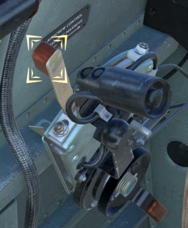

1. Убедитесь в том, что рычаг крана шасси установлен в заднее положение (выпуск).

    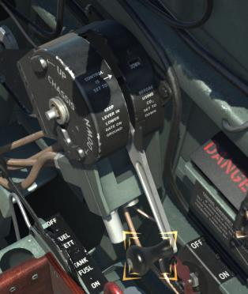

1. Кран подвесного бензобака должен быть установлен в положение OFF (закрыт).

    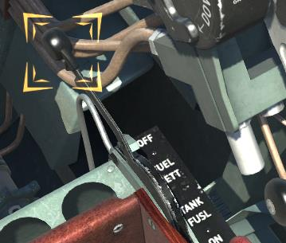

1. Рукоятка бензокрана установлена в положение OFF (закрыт).

    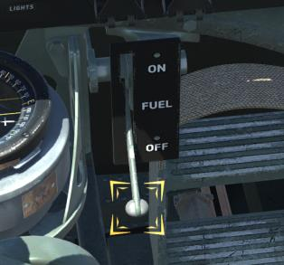

1. Проверьте правильность подключения устройств ввода (джойстика, педалей и т.п.)
    через ход ручки управления самолетом и педалей. Начнем с проверки педалей и
    правильности отклонения руля направления. Посмотрите назад на хвостовое оперение
    и проверьте работу руля направления отклонив левую, а затем правую педаль на
    полный ход. Используйте заданные оси или следующие команды клавиатуры. Нажмите
    клавишу [Num4] или [Num6] для поворота головы назад. Для движения педалей
    используйте клавиши [Z] и [X] или ось руля направления. Проверьте ход руля высоты.
    Передвиньте ручку управления самолетом полностью от себя, а затем на себя.
    Проверьте ход правого элерона. Переведите взгляд на правый элерон и отклоните
    ручку управления самолетом полностью влево и вправо. Проделайте то же самое с
    левым элероном.
1. Убедитесь, что оба выключателя магнето находятся в положении OFF (выключено).

    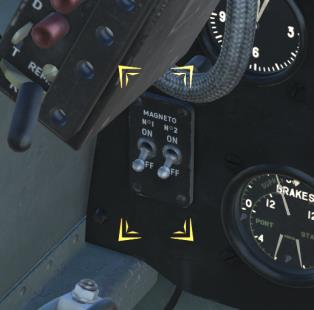

1. Проверьте, что кран наддува бензобаков установлен в положение OFF (выключен).

    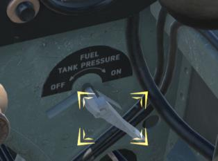

1. Убедитесь, что давление воздуха в пневмосистеме не менее 220 фунт/дюйм^2^. Для этого
    проверьте показания центральной стрелки на трёхстрелочном манометре
    пневмосистемы в левой нижней части приборной доски.

    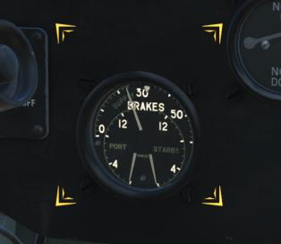

1. Установите высотомер на ноль. Наведите курсор мыши на подсвеченный регулятор и
    вращайте колесо мыши.

    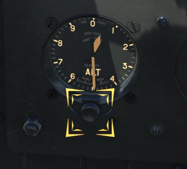

1. Проверьте работу посадочных щитков. Установите рычаг выпуска посадочных щитков
    в положение DOWN (выпущено). Для этого нажмите клавишу [F] или сделайте клик
    мышью по подсвеченному рычагу. Посмотрите налево и направо и убедитесь, что оба
    механических указателя, расположенных на крыле, вышли. Установите рычаг выпуска
    посадочных щитков в положение UP (убрано) и убедитесь, что механические
    индикаторы зашли обратно. Нажмите клавишу [F] или сделайте клик мышью по
    подсвеченному рычагу.

    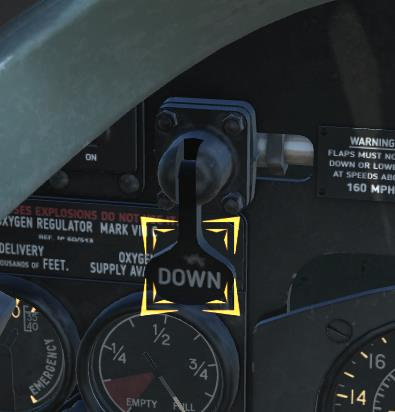

    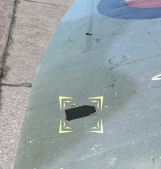

1. Убедитесь в исправности подвижной части фонаря. Для этого закройте и откройте
    фонарь. Нажмите [Left Ctrl+C], чтобы закрыть фонарь и [Left Shift+C], чтобы открыть
    его.

1. Передвиньте рычаг газа вперед до положения, когда сработает выключатель световой
    сигнализации, находящийся на колонке управления мотором. Нажмите клавишу
    [Num+] или передвиньте ось газа.

    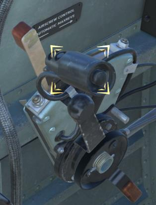

1. Убедитесь, что загорелась сигнальная лампочка шасси в виде зеленой надписи "DOWN"
    (выпуск), а также загорелась сигнальная лампочка давления бензина. После того, как
    работа световой сигнализации проверена, переведите рычаг газа обратно в начальное
    положение. Нажмите клавишу [Num-] или передвиньте ось газа.

    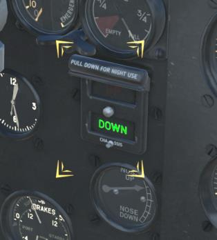

    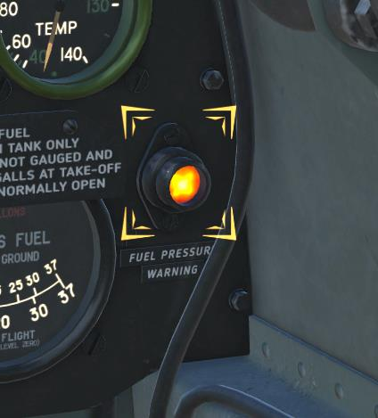

1. Проверьте количество топлива в баках. Нажмите на кнопку бензиномера и проверьте
        отклонение стрелки. Отпустите кнопку после проверки.

    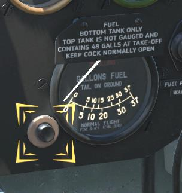

## Запуск мотора.

Для запуска мотора проделайте следующие операции:

1. Примените тормоз, чтобы самолет оставался на месте во время запуска двигателя.
        Наведите курсор мыши на подсвеченный рычаг на ручке управления самолетом и
        вращайте колесо мыши.

    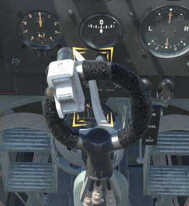

1. Установите рукоятку бензокрана в положение ON (включено). Нажмите клавишу [T]
        или сделайте клик мышью по подсвеченному рычагу.

    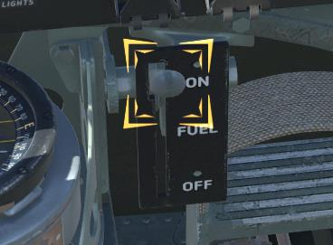

1. Переведите рычаг газа на 10-12 мм вперед, считая от заднего крайнего положения.
    Нажмите клавишу [Num+] или передвиньте ось газа.

    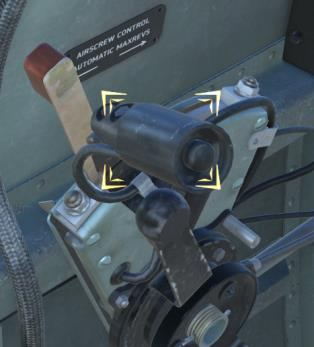

1. Установите рычаг управления шагом винта в крайнее переднее положение. Нажмите
    клавишу [PageUp] или передвиньте ось шага винта.

    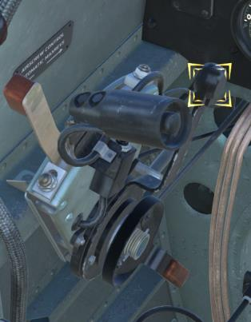

1. Передвиньте рычаг включения пылефильтра в крайнее переднее положение (FILTER
    IN OPERATION). Нажмите клавишу [H] или сделайте клик мышью по подсвеченному
    рычагу.

    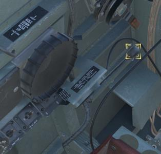

1. Отверните рукоятку заливочного насоса. Наведите курсор мыши на подсвеченный
    элемент кабины и вращайте колесо мыши. Затем сделайте установленное число полных
    ходов поршня насоса для заливки двигателя. Для этого нажимайте и удерживайте
    клавишу [Insert] или проделайте то же самое при помощи кликов мышью по
    подсвеченному элементу кабины. Количество ходов поршня в зависимости от
    температуры наружного воздуха:

    Температура наружного воздуха, °С | Количество полных ходов насоса
    ----------------------------------|-------------------------------
    +30°                              | 2-3
    +20°                              | 4
    +10°                              | 5
    0°                                | 5-6
    От -10° до -20°                   | До 15

    

1. Поднимите давление топлива при помощи ручной помпы до момента, когда погаснет
    сигнальная лампочка давления бензина (приблизительно 9-10 качков). Используйте
    комбинацию клавиш [Left Ctrl+Insert] или проделайте то же самое при помощи кликов
    мышью по подсвеченному элементу кабины.

    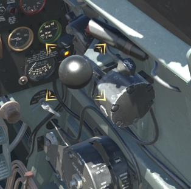

    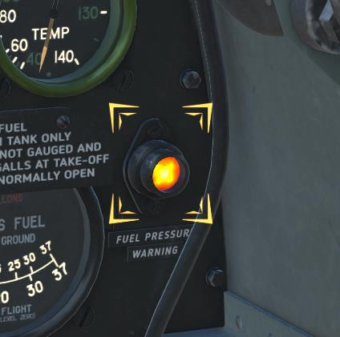

1. Установите выключатель обоих магнето в верхнее положение ON (включено). Нажмите
    комбинации клавиш [Left Shift+End] и [Right Shift+End] или кликните мышью по
    подсвеченным выключателям.

    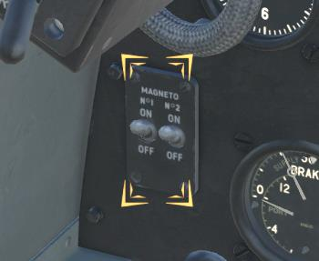

1. Откиньте предохранительные колпачки стартера и пусковой катушки. Кликните мышью
    по подсвеченным элементам.

    

1. Нажмите одновременно кнопку стартера и пусковой катушки. Для этого используйте
    клавиши [Home] и [Delete] на клавиатуре. После первых вспышек в моторе
    передвиньте рычаг управления стоп-краном вперед нажав клавишу [M] или кликнув по
    нему мышью. Отпустите кнопки стартера и пусковой катушки.

    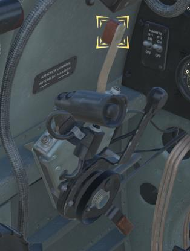

1. Если запуск осуществить не удалось, верните рычаг стоп-крана в заднее положение и
        повторите процедуру начиная с заливки.

## Прогрев мотора

1. После успешного запуска мотора верните рычаг газа в крайнее заднее положение.

    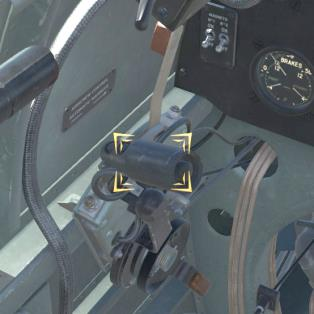

1. Убедитесь, что давление масла находится в пределах 60-120 фунт/дюйм^2^.

    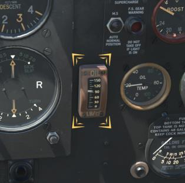

1. Закройте предохранительные колпачки стартера и пусковой катушки. Кликните мышью по
подсвеченным элементам.

    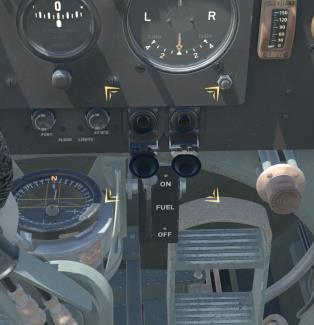

1. Заверните рукоятку заливочного насоса. Наведите курсор мыши на подсвеченный элемент
кабины и вращайте колесо мыши.

    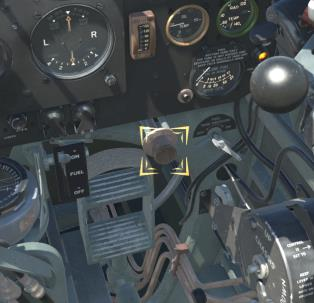

1. Установите рычаг газа в положение, соответствующее 1000-1200 оборотов в минуту по
тахометру.

    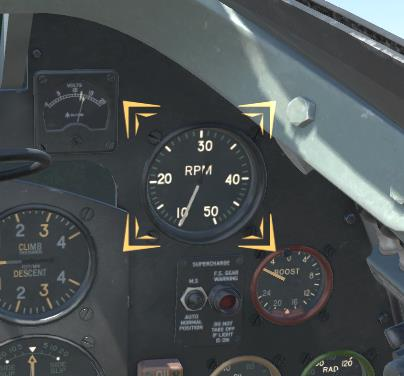

1. Продолжайте прогрев мотора на 1000-1200 оборотах в минуту, пока температура масла не
достигнет 20°C (левый индикатор в указанной области), а температура охлаждающей жидкости
60°C (правый индикатор).

    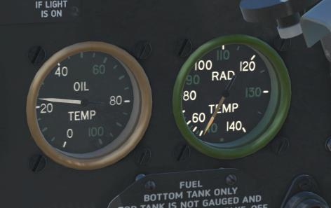

### Опробование двигателя

1. При опробовании двигателя на всех режимах проверить показания контрольных приборов,
   которые должны соответствовать данным в табличке:

    Основные режимы работы двигателя Merlin 66 на топливе с октановым числом 100

    Основные данные | Взлетный режим I ск. (II ск.) | Боевой режим I ск. (II ск.) | Номинальный режим I ск. (II ск.) | Крейсерский режим I ск. (II ск.)
    -------------------------------|-------------------|-----------------|---------------|-----------------
    Мощность, л.с.                                  |           |              |                   |
    *На уровне моря*                                | 1325  (-) |  1680 (1440) | 1310    (1135)    | 985      (865)
    *На расчётной высоте*                           | 1325  (-) |  1750 (1630) | 1410    (1315)    | 1095     (1030)
    Число оборотов, об/мин                          | 3000  (-) |  3000 (3000) | 2850    (2850)    | 2650     (2650)
    Наддув      фунт/дюйм^2^                          | +12   (-) |  +18  (+18)  | +12     (+12)     | +7       (+7)
    Наддув       мм. рт. ст.                        | 1350  (-) |  1690 (1690) | 1380    (1380)    | 1120     (1120)
    Граница высотности, м (без скоростного напора)  | 305   (-) |  1680 (4960) | 2750    (5800)    | 3660     (6330)
    Время непрерывной работы, мин.                  | 5     (-) |    5  (5)    | 60      (60)      | Неогр.   (Неогр.)

2. Установить рычагом газа [(30)](03.cockpit.md#cockpit_part_30) наддув -2 фунт/дюйм^2^ и проверить:

    1. Включение второй скорости нагнетателя, для чего переключатель скоростей нагнетателя
       [(10)](03.cockpit.md#cockpit_part_10) находящийся на приборной доске, установить в положение “AUTO” (автоматическое
       переключение скоростей) и нажать на кнопку проверки включения второй скорости [(77)](03.cockpit.md#cockpit_part_77),
       расположенную с левой стороны сидения пилота.
    Признаком включения второй скорости нагнетателя является загорание сигнальной
    лампочки [(11)](03.cockpit.md#cockpit_part_11) на приборной доске.

        !!! note "Примечание"
            Перед включением второй скорости необходимо убедиться, что давление в
            пневматической системе не менее 150 фунт/дюйм^2^.

    2. Работу регулятора винта, для чего рычаг управления шагом винта [(64)](03.cockpit.md#cockpit_part_64) перевести из
        крайнего переднего положения в заднее положение, при этом обороты двигателя
        должны снизиться на 200 - 300 об/мин. Затем перевести рычаг управления шагом винта
        в крайнее переднее положение - обороты должны полностью восстановиться.
    3. Работу автомата регулирования температур охлаждающей жидкости и масла, для чего
       нажать кнопку проверки исправности заслонок радиаторов [(76)](03.cockpit.md#cockpit_part_76). Открытие заслонок
       тоннелей радиаторов должен контролировать техник, находящийся у самолета.

3. Установить режим 1800 об/мин и поочередным выключением магнето проверить исправность
   работы системы зажигания по падению числа оборотов и на слух. Падение оборотов
   двигателя при работе на одном магнето, по сравнению с работой на двух магнето не должно
   превышать 100 об/мин.
4. Проверить приемистость и работу двигателя на взлётном режиме, для чего рычагом газа
   плавно в течение 2-3 секунд увеличить наддув до 12 фунт/дюйм^2^ при оборотах 3000 об/мин.
5. При опробовании двигателя необходимо:

   - ручку управления самолетом держать полностью на себя.
   - не допускать повышения температуры охлаждающей жидкости больше 120° С и
   температуры масла больше 85° С.
   - обратить внимание, работает ли электрогенератор (по скачку стрелки вольтметра [(5)](03.cockpit.md#cockpit_part_5)), и
   опробовать радиостанцию на двухстороннюю связь.

## Взлет и набор высоты

### Руление

1. Перед выруливанием самолета убедиться в правильности показаний приборов и положений
   рычагов:

    - температура охлаждающей жидкости в диапазоне от 60° С до 120° С [(14)](03.cockpit.md#cockpit_part_14).
    - температура масла в диапазоне от 20° С до 80° С [(18)](03.cockpit.md#cockpit_part_18).
    - рычаг управления шагом винта [(64)](03.cockpit.md#cockpit_part_64) находится в положении, соответствующем взлётным
    оборотам (полностью вперед).
    - бензиновый кран подвесного бака [(60)](03.cockpit.md#cockpit_part_60) установлен в положение “OFF” (закрыт).
    - бензиновый кран основных баков [(22)](03.cockpit.md#cockpit_part_22) установлен в положение “ON” (открыт).
    - рычаг крана шасси [(58)](03.cockpit.md#cockpit_part_58) установлен в положение “DOWN” (выпуск).
    - давление воздуха в пневмосистеме [(29)](03.cockpit.md#cockpit_part_29) не менее 220 фунт/дюйм^2^ (15,5 кг/см^2^).
    - вооружение установлено на предохранитель [(89)](03.cockpit.md#cockpit_part_89).
    - радиостанция включена и настроена на заданную волну.

2. Застопорить привязные ремни [(45)](03.cockpit.md#cockpit_part_45).
3. Подать команду “УБРАТЬ КОЛОДКИ” и, получив сигнал “КОЛОДКИ УБРАНЫ”, начать руление.
4. Проверить действие тормозов при рулении, при полном торможении и ручке, взятой на себя,
   самолет должен удерживаться на месте при работающем двигателе на режимах до 1800
   об/мин.
5. Для лучшего обзора впереди лежащей местности необходимо поднять сиденье, открыть
   фонарь, руление производить змейкой.

    !!! note "Примечание"
        1. Быстрое руление по неровной местности опасно, вследствие узкой колеи шасси самолет,
           при попадании одним колесом на неровность, может зацепить плоскостью о землю.
        2. В жаркую погоду при работе на земле двигатель быстро перегревается, поэтому
           необходимо максимально сокращать руление и работу двигателя на земле.
        3. Вследствие малого противокапотажного угла рулить по мягкому грунту без
           сопровождающего на хвосте самолета не разрешается.
        4. Ручка на рулении должна быть полностью взята на себя.

### Перед взлетом

6. Перед взлетом еще раз убедиться в нормальной работе двигателя по показаниям приборов.
   Рычаги управления установлены в следующие положения:

    - штурвал триммера руля высоты нейтрально, а руля направления на 7-8 мм вправо, для
    парирования разворота самолета влево.
    - бензокран основных баков [(22)](03.cockpit.md#cockpit_part_22) в положении “ON” (открыт).
    - бензокран подвесного бака [(60)](03.cockpit.md#cockpit_part_60) в положении “OFF” (открыт).
    - кран наддува бензобаков [(52)](03.cockpit.md#cockpit_part_52) в положении “OFF” (закрыт).
    - рычаг управления шагом винта отдан полностью вперед.
    - посадочные щитки установлены в положении “UP” [(2)](03.cockpit.md#cockpit_part_2) (убрано).

7. Затормозить самолет и увеличить обороты для прожигания свечей.
8. Проверить, нет ли препятствий на взлетной полосе, и произвести круговой обзор.

#### Карта контрольной проверки перед взлётом

Элемент управления              |  Состояние
--------------------------------|--------------
**T** - триммер                   |  Руль высоты: половина деления по индикатору в сторону "Нос вниз". Руль направления: Полностью вправо.
**Р** - управление пропеллером    |  Полностью вперед.
**F** - топливо                   |  Проверить количество бензина в нижнем баке  Кран сброса подвесного бака - Выкл. Кран наддува бензобака - Выкл. Электрический подкачивающий насос - Выкл.
**F** - закрылки                  |  Убраны
**S** - нагнетатель               |  Переключатель управления нагнетателя в положение "AUTO", сигнализатор работы на второй скорости не горит. Заслонка воздухозаборника закрыта. Рукоятка в положении "CLOSED" или "FILTER IN OPERATION"

### Взлет

9. Плавно дать газ до получения наддува Pk= 8-12 фунт/дюйм^2^ в зависимости от загрузки и
   состояния аэродрома, по мере набора скорости отдавать ручку от себя, поднимая тем самым
   хвост самолета до взлетного положения. Следить за прямолинейностью разбега по капоту
   двигателя и парировать тенденцию самолета к развороту влево небольшим отклонением
   правой педали.

    !!! note "Примечание"
        Пользоваться тормозами на взлете для парирования разворота запрещается.

10. Отрыв самолета происходит на скорости 90 - 95 миль/час (км/ч) по прибору.
11. Во избежание взмывания самолета и потери скорости необходимо после отрыва немного
    отжать ручку от себя и выдерживать самолет над землей до получения скорости 140 миль/час
    по прибору, затем перейти в режим набора высоты и убрать шасси.
12. Для подъема шасси необходимо рычаг крана управления шасси (58) сначала потянуть назад
    и вывести его из паза, затем перевести его в крайнее переднее положение и прижать к борту.
    Оставить рычаг в этом положении и наблюдать по сигнализации за подъемом шасси. Как
    только шасси начнет убираться, зеленая лампочка погаснет, а при полностью убранном
    шасси и запертых замках загорится красная лампочка. Выключение рычага крана шасси при
    этом происходит автоматически, рычаг заскочит в верхний паз и указатель гидравлического
    клапана в квадранте на кране шасси займет положение “IDLE” (нейтрально). Кроме того, при
    уборке шасси летчик услышит характерный звук.

    В случае если шасси не уберется, необходимо дать рычаг крана шасси еще раз на уборку и
    придержать его в переднем положении. Не доведенные и не запертые в верхнем положении
    колеса снижают скорость самолета и вызывают перегрев двигателя.

    !!! note "Примечание"
        После уборки шасси необходимо выключить противопыльный фильтр.

13. При достижении высоты 1000 футов, плавно перевести рукоятку управления заслонкой
    воздухозаборника карбюратора в положение "OPEN".

### Набор высоты

14. Для получения максимальной скороподъемности набор высоты можно производить на
номинальном режиме (Pk=12 фунт/дюйм^2^, n=2850 об/мин). Если есть крайняя необходимость -
на боевом режиме (Pk=18 фунт/дюйм^2^, n=3000 об/мин), но не более 5 минут.
15. Во всех случаях, когда нет необходимости получения максимальной скороподъемности,
    набор высоты можно производить при наддуве 7 фунт/дюйм^2^ и 2650 об/мин. На этом режиме
    работы двигателя уменьшается расход горючего и, следовательно, продолжительность
    полета увеличивается.
16. При наборе высоты выдерживать следующие наивыгоднейшие скорости по прибору,
    согласно таблице:

    Высота, футы                | Скорость, Миль/ч
    ---------------------------|----------
    0 - 12000        | 185
    12000 - 15000     | 180
    15000 - 20000     | 170
    20000 - 25000     | 160
    25000 - 30000     | 150
    30000 - 33000     | 140
    33000 - 37000     | 130
    37000 - 40000     | 120
    свыше 40000      | 110

17. При наборе следить за тем, чтобы температура охлаждающей жидкости не превышала 125°
    С, а температура масла 90° С.
18. Управление заслонками радиаторов осуществляется автоматически, в зависимости от
    температуры охлаждающей жидкости. Заслонки начинают открываться при температуре
    охлаждающей жидкости выше 115° С. В случае отказа автомата можно открыть заслонки
    радиаторов нажатием на кнопку [(76)](03.cockpit.md#cockpit_part_76), расположенную с левой стороны сидения летчика.
19. Переключение нагнетателя на вторую скорость происходит автоматически на высоте 13500—14000 футов при наборе высоты,
    при снижении нагнетатель переключается автоматом на первую скорость на высоте 12500 футов.
20. В случае необходимости производить полет на первой скорости нагнетателя на высотах,
    больше 13500 - 14000 футов, переключатель [(10)](03.cockpit.md#cockpit_part_10) на приборной доске, установить в
    положение “MS” (первая скорость).
21. Кран управления наддувом бензобаков [(52)](03.cockpit.md#cockpit_part_52) должен быть установлен в положение “OFF”
    (закрыт), а в положение “ON” (открыт) только в случае срабатывания красной лампочки [(19)](03.cockpit.md#cockpit_part_19),
    сигнализирующей о падении давления бензина ниже 10 фунт/дюйм 2 (0,7 кг/см^2^)
22. Правила пользования бензобаками следующие:
    Запуск, прогрев двигателя и взлет - выполнять на главных баках. Переключать питание на
    подвесной бак производить только на высотах больше 2000 футов (600 м.). Переключение
    питания с главных баков на подвесной разрешается производить только после того как будет
    включен подвесной бак.
23. Если понадобится сбросить подвесной бак до полной выработки горючего из него, прежде
    всего надо включить главные баки, а затем выключить подвесной бак.
24. Если в подвесном баке нет горючего или он сброшен, необходимо следить чтобы кран
    подвесного бака был полностью закрыт. При неполном закрытии крана подвесного бака
    топливная система может подсасывать воздух, в этом случае возможны перебои в работе
    двигателя.
25. В полете необходимо следить за остатком горючего в баках, для чего периодически
    нажимать кнопку бензиномера [(161)](03.cockpit.md#cockpit_part_161), бензиномер начинает показывать количество бензина
    с момента начала расходования горючего из нижнего бака.

### Подготовка вооружения к стрельбе в полете

26. Снять с предохранителя [(89)](03.cockpit.md#cockpit_part_89) гашетку оружия [(67)](03.cockpit.md#cockpit_part_67), для чего повернуть палец предохранителя
    слева направо. При снятии гашетки с предохранителя на верхней части корпуса выходит
    шпилька, по которой летчик может наощупь убедиться в готовности оружия к стрельбе.
27. Отрегулировать освещение прицела реостатом накала, расположенным под прицелом на
    приборной доске. Реостат имеет три положения, обеспечивающие три уровня яркости
    подсвета: “OFF” - выключено, “NIGHT” - ночь, “DAY” - день.

### Проверка работы радиостанции в полете

28. В полете периодически вызывать наземную радиостанцию с целью проверки радиосвязи.
29. В случае потери двухсторонней связи с наземной радиостанцией вести передачу и прием до
    установления двухсторонней радиосвязи по графику, утвержденному начальником связи
    части.

## Горизонтальный полет

1. Полеты по кругу разрешается производить на скоростях по прибору не менее 150 миль/час
   без подвесного бензобака и не менее 175 миль/час с подвесным баком.
2. Оперативные перелеты, полеты по перебазированию, патрулирование, ожидание в
   намеченной зоне, полеты в запасных полках (кроме высшего пилотажа и отработки
   элементов воздушного боя) производить на экономических режимах.
3. При уменьшении скорости полета изменение режима работы производить в следующем
   порядке:

    - рычагом газа установить требуемую (сниженную) скорость полета.
    - рычагом управления шагом винта установить заданные обороты двигателя.
    - если при этом скорость самолета изменится, то рычагом газа довести ее до требуемой.

4. При увеличении скорости полета изменение режима работы производить в следующем
   порядке:

    - рычагом управления шагом винта установить заданные обороты двигателя.
    - рычагом газа увеличить наддув до требуемой скорости полета, не превышая величины
    наддува, установленной для соответствующего режима работы двигателя.

5. Для достижения максимальной скорости (при встрече с противником, для его догона, при
   ведении воздушного боя, при выходе их боя) необходимо перейти, в зависимости от
   обстоятельств, на номинальный или боевой режим работы двигателя, для чего сначала
   установить обороты, а затем наддув, соответствующий заданному режиму.
   Примечание. На боевом режиме разрешается работать не больше 5 минут, при этом
   необходимо следить чтобы температура охлаждающей жидкости и масла не выходила из
   допустимых пределов.
6. Самолет легко балансируется триммерами на всем диапазоне скоростей горизонтального
   полета. На сбалансированном самолет возможен непродолжительный полет с брошенным
   управлением.
7. Полная потеря устойчивости в горизонтальном полете на самолете с нормальным полетным
   весом и задросселированным двигателем наступает:

    - при убранных шасси и щитках - на скорости 85 миль/час по прибору.
    - при выпущенных шасси и щитках - на скорости 75 миль/час по прибору.

#### Дальность и продолжительность полета на различных режимах (без подвесного бака) Gп=3392 кг, Vгор=392 л.

Режим полета | Высота полета, фут (м) | Скорость по прибору миль/час (км/ч) | Обор/мин | Расход горючего л/км (л/час) | Дальность горизонтальног о полета, км. | Продолжительность горизонтального полета
----------------------------------|--------------|-----------|------|------------|-----|----
Скоростная дальность              | 21600 (6600) | 256 (410) | 2570 | 0,52 (295) | 595 | 1:03
Сравнительная скоростная дальность| 16400 (5000) | 245 (394) | 2360 | 0,475 (237)| 685 | 1:22
Максимальная дальность            | 3280 (1000)  | 187 (300) | 1800 | 0,395 (125)| 880 | 2:46

### Управление пулеметно-пушечным вооружением

8. Управление пулеметно-пушечным вооружением пневматическое от общей пневмосистемы
    при помощи строенной гашетки [(67)](03.cockpit.md#cockpit_part_67), установленной на ручке управления.
9. Стрельбу можно производить раздельно из пушек и пулеметов или одновременно. При
    нажатии на верхнюю часть гашетки производится стрельба из пулеметов, при нажатии на
    нижнюю часть гашетки производится стрельба из пушек, при нажатии на среднюю часть
    гашетки производится стрельба одновременно из всех огневых точек.
10. Перезарядка пулеметно-пушечного вооружения возможна только на земле.
11. Стрельбу вести короткими очередями, 10-15 патронов в очереди для пулеметов и 3-5
    снарядов в очереди для пушек.

## Пилотаж

12. Производить высший пилотаж и штопор разрешается только на самолете без подвесного
    бензобака.
13. Перед выполнением фигур высшего пилотажа сбалансировать самолет триммерами на
    скорости 200 миль/час по прибору.
14. Выполнение фигур высшего пилотажа должно производиться плавными движениями рулей.
    Не разрешаются резкие отклонения и в особенности резкие перемены в направлении
    отклонения рулей и элеронов, так как это может привести к возникновению больших
    перегрузок.
15. Вираж, разгон самолета перед вводом в боевой разворот или петлю, иммельман и
    ранверсман выполняются на номинальном режиме работы двигателя (Pk=12 фунт/дюйм^2^,
    n=2850 об/мин). В исключительных случаях, когда по условиям боевой обстановки требуется
    получить наилучшие маневренные свойства самолета, разрешается применять боевой режим
    работы двигателя (Pk=18 фунт/дюйм^2^, n=3000 об/мин) продолжительностью не более 5
    минут.
    При выполнении вертикальных фигур необходимо иметь ввиду, что указатель скорости дает
    искаженные (заниженные) показания.

### Вираж

16. Наивыгоднейшая скорость виража с креном 65-70° 185 миль/час по прибору при
    номинальном режиме работы двигателя. При этом минимальное время виража на высоте
    3000 футов равно 17-18 секундам.
17. Самолет виражит устойчиво и легко перекладывается из виража в вираж. На левом вираже
    самолет имеет небольшое стремление опустить нос, на правом - поднять.
18. При перетягивании ручки на вираже самолет с небольшим дрожанием начинает скользить
    на крыло. В этом случае следует незначительно отпустить ручку, тогда скольжение
    прекратится и самолет будет продолжать вираж.

### Боевой разворот

19. Для выполнения боевого разворота следует установить номинальный режим работы
    двигателя, увеличить скорость до максимальной (на высотах от земли до 21000 футов - 310
    миль/час по прибору), после чего плавным движением ручки на себя и в сторону боевого
    разворота и одновременным движением ноги в ту же сторону перевести самолет в набор
    высоты по восходящей спирали с креном до 50°.
20. Вывод из боевого разворота производить на скорости 140-150 миль/час по прибору при
    работе двигателя на номинальном режиме. При этом самолет набирает высоту 1900 футов.
21. При выполнении боевого разворота с большим креном и задиром самолет быстро теряет
    скорость и набирает меньшую высоту за боевой разворот.

### Ординарный управляемый переворот

22. Ординарный управляемый переворот выполняется на скорости 150 миль/час по прибору.
    Для его выполнения необходимо плавно в течении 2-3 секунд дать ручку на ¾ её полного
    хода, а ногу на ½ хода в сторону желаемого переворота.
    За 20-30° до перевернутого положения прекратить дальнейшее вращение самолета
    обратным движением рулей, для этого педали и ручку поставить в нейтральное положение.
     Когда вращение прекратится, убрать газ и незначительным подтягиванием ручки на себя
     перевести самолет в пикирование.
     После набора скорости 220-230 миль/час по прибору плавно выводить самолет в
     горизонтальный полет, не допуская чрезмерных перегрузок.
23. В случае если после выполнения управляемого переворота следует другая вертикальная
    фигура, то набор необходимой скорости на пикировании после переворота нужно
    производить на угле не более 40° по отношению к горизонту с последующим плавным
    уменьшением угла.
24. Потеря высоты за переворот составляет 1300-1400 футов.

### Двойной управляемый переворот (бочка)

25. Двойной управляемый переворот (бочка) выполняется на скорости 160-170миль/час по
    прибору. Предварительно необходимо сбалансировать самолет в горизонтальном полете.
    Для выполнения бочки необходимо самолет перевести в кабрирование с углом в 10-15°, а
    затем одновременно дать плавно ногу и ручку на ½ хода в сторону желаемого переворота.
    За 10-20°до горизонтального положения прекратить его вращение, поставив педали и ручку
    в нейтральное положение. При таком действии рулей бочка выполняется плавно в течении
    5-6 секунд.
26. Метод выполнения правых и левых бочек одинаковый, но правая бочка выполняется более
    энергично.
27. Чрезмерная дача ручки в сторону вращения и незначительное выбирание её на себя при
    вводе приводит к значительному увеличению скорости вращения и к дрожанию самолета.

### Петля

28. Петля выполняется на скорости 230-240 миль/час по прибору. Разгон на петлю (и для других
    вертикальных фигур) производить с таким расчетом, чтобы самолет достигал указанной
    скорости в горизонтальном полете перед переводом его в кабрирование. Перевод в
    кабрирование начинается плавным взятием ручки на себя. Ручка в процессе выполнения
    петли до перехода самолета в пикирование все время незначительно подтягивается на себя.
В момент перехода самолета в пикирование убрать газ и незначительно отпустить ручку для
    набора скорости.
При достижении скорости 220-230 миль/час по прибору плавным движением ручки на себя
    вывести самолет из пикирования.
29. Если в процессе выполнения петли ручку не подтягивать, самолет прекратит вращение
    потеряет скорость и свалится на крыло или на спину. При правильном выполнении петли
    самолет набирает высоту 400-500 футов.

### Иммельман

30. Для выполнения иммельмана необходимо разогнать самолет до скорости 250-260 миль/час.
    Первая половина иммельмана выполняется также как и первая половина петли. При подходе
    к верхней точке, когда самолет будет в перевернутом положении и горизонт будет
    проектироваться на середину козырька, дать плавно ногу и ручку в сторону желаемого
    вращения. За 10-15° до горизонтального положения самолета ручку и педали поставить
    нейтрально. Нормальная скорость на выводе не менее 140 миль/час.
    При выполнении иммельмана самолет набирает высоту 1700-1800 футов.

### Скольжение

31. Самолет скользит устойчиво с креном до 40° (с выпущенными шасси и щитками). Скорость
    ввода 130 миль/час. Скорость вывода не менее 120 миль/час.
    Для вывода самолета из скольжения ручкой устранить крен и установить нормальный угол
    планирования, а ногами выдерживать направление полета.

### Штопор

32. Разрешается вводить в штопор с тренировочной целью до двух витков с высоты не ниже
    10000 футов.
    Для вывода самолета из штопора сначала дать ногу до отказа против штопора, а затем ручку
    до отказа на себя.
    Когда самолет прекратит вращение, необходимо поставить педали нейтрально и по
    достижении скорости пикирования 150 миль/час по прибору вывести самолет в
    горизонтальный полет.

### Пикирование

33. Перед вводом в пикирование необходимо сбалансировать самолет триммерами в
    горизонтальном полете на скорости 280 миль/час по прибору.
34. В пикирование самолет можно вводить с любого положения при оборотах двигателя не выше
    2850 об/мин и рычаге газа, открытом не менее чем на 1/3. Число оборотов двигателя и
    наддув при пикировании не должны превышать максимальных для боевого режима.
35. Самолет под любым углом пикирует устойчиво. При наличии бомбы на подфюзеляжном
    пилоне, угол пикирования ограничен 40°, при наличии бомб на подкрыльевых пилонах угол
    пикирования ограничен 60°.
36. Максимально допустимая скорость на пикировании 450 миль/час по прибору, а максимально
    допустимые обороты двигателя 3150 об/мин в течении не более 20 секунд.
37. Вывод из пикирования производить плавным движением ручки на себя, при энергичном
    выводе из пикирования создаются большие перегрузки, которые могут привести в потере
    сознания летчика или даже катастрофе.
38. Общая потеря высоты на пикировании до скорости 450 миль/час по прибору и на вывод из
    пикирования составляют 5000 футов.

## Окончание полета

### Подготовка к посадке

1. Поставить гашетку управления огнем на предохранитель и убедиться в том, что:

   - рычаг управления шагом винта [(64)](03.cockpit.md#cockpit_part_64) установлен на малый шаг (полностью вперед).
   - вторая скорость нагнетателя выключена [(11)](03.cockpit.md#cockpit_part_11) (красная лампа не горит).
   - давление по манометрам [(29)](03.cockpit.md#cockpit_part_29) в воздушной системе 220 фунт/дюйм^2^ и тормозной системе
   80 фунт/дюйм^2^.

2. Открыть фонарь кабины пилота.

#### Карта контрольной проверки "Перед посадкой"

Элемент управления              |  Состояние
--------------------------------|--------------------------
**U** - шасси                   |    Выпущено
**Р** - управление пропеллером  |    Полностью вперед, установить 2650 об/мин.
**S** - нагнетатель             |    Переключатель управления нагнетателя в положение "AUTO". Сигнализатор работы на второй скорости не горит. Рукоятка заслонки воздухозаборника карбюратора "CLOSED" или "FILTER IN OPERATION".
**F** - топливо                 |    Основной кран бензобака - Открыт. Подкачивающий электробензонасос - Вкл.
**F** - закрылки                |    Выпущены

### Нормальный выпуск шасси

3. Выпуск шасси производить на скорости 150-160 миль/час по прибору перед третьим
   разворотом.

    Для выпуска шасси необходимо:

    - Придержать в течении 2-3 секунд рычаг крана шасси в крайнем переднем положении.
       При этом пальцы замков освобождаются от нагрузки.
    - Резко перевести рычаг в заднее положение и оставить его в этом положении, рычаг не
       нужно толкать в паз. Как только шасси встанет на замки выпущенного положения, рычаг
       должен автоматически войти в паз, а указатель гидравлического клапана возвратиться
       в положение “IDLE” (нейтрально).
    - Если рычаг трудно подать в заднее положение, необходимо подать рычаг вновь на
       уборку и повторить выпуск, причем на этот раз перед переводом крана шасси в заднее
       положение подольше (в течении 3-5 секунд) придерживать его в крайнем переднем
       положении. В крайнем случае необходимо помочь освобождению пальцев замков либо
       погашением скорости полета до 120-130 миль/час при задросселированом до 1200-1800
       об/мин двигателе, либо энергичной отдачей ручки от себя сделать клевок самолетом.
    - По горению зеленых сигнальных огней, убедиться в том, что шасси полностью выпущено
       и установлено на замки.

### Планирование

4. Планирование по прямой с убранными шасси и щитками производить на скорости 100-120
   миль/час по прибору, с выпущенными шасси и щитками на скорости 100-110 миль/час по
   прибору.
5. На планировании не допускать переохлаждения двигателя, для чего при длительном
   планировании через каждые 3-4 минуты увеличивать на 5-6 секунд обороты двигателя до
   2400-2500 об/мин.
6. Надежная приемистость двигателя гарантирована при температуре охлаждающей жидкости
   не ниже 60° С и температуре масла не ниже 20° С.
7. Разворот перед заходом на посадку производить на скорости 150 миль/час по прибору с
   расчетом выхода на прямую на высоте не ниже 500 футов.
8. Выпустить щитки (на скорости не выше 160 миль/час), для чего ручку крана щитков
   поставить в нижнее положение “DOWN” (выпуск).
   По механическим указателям убедиться в том, что щитки выпустились полностью.
   Примечание. В случае неисправности пневмосистемы и падения давления ниже 120
   фунт/дюйм^2^ (8,4 кг/см^2^) производить посадку с убранными щитками, оставляя при этом запас
   сжатого воздуха для тормозов.
9. После выпуска щитков плавным выбором ручки на себя довести скорость до 100-110 миль/час
    по прибору, что является нормальной скоростью планирования.
10. Если шасси будет выпущено слишком поздно, при малых оборотах двигателя, давления в
    гидравлической системе может не хватить для автоматического отщелкивания рукоятки
    крана уборки-выпуска шасси. Таким образом цикл выпуска не будет завершен, что может
    привести к складыванию стоек. Желательно шасси выпускать заранее, до входа в глиссаду.

### Уход на второй круг

11. При необходимости уйти на второй круг:

    - плавно дать полный газ.
    - убрать шасси (полет с выпущенным шасси приводит к перегреву охлаждающей жидкости)
    и перейти в набор высоты.
    - на высоте не ниже 300 футов и на скорости 130 миль/час по прибору убрать щитки.

### Посадка

12. При посадке с выпущенными щитками выбирание ручки на себя и уменьшения угла
    планирования начинать на высоте 6-7 метров, а при посадке с убранными щитками несколько
    ниже (5-6 м.) Подводить самолет к земле на высоте 0,25-0,5 м.
13. Посадку осуществлять на скоростях:

    a) При работающем двигателе:

    - щитки выпущены, 90 миль/час
    - щитки убраны - 100 миль/час

    б) Двигатель выключен:

    - щитки выпущены - 100 миль/час
    - щитки убраны - 105 миль/час.

    Для самолетов с укороченными законцовками скорости увеличиваются на 5 миль/час.

14. Приземление на три точки происходит при неполностью выбранной на себя ручке.
15. После приземления самолета начать торможение периодическим нажатием на тормозной
    рычаг [(69)](03.cockpit.md#cockpit_part_69). Необходимо избегать резкого торможения ввиду малого противокапотажного
    угла самолета. Начинать торможение только с того момента, когда ручка полностью добрана
    на себя.
16. По окончании пробега убрать щитки, переведя ручку крана щитков [(2)](03.cockpit.md#cockpit_part_2) в верхнее положение
    “UP” (убрано).
17. Осмотреть посадочную полосу и приступить к заруливанию.

### После заруливания

18. Остудить двигатель, для чего 2-3 минуты проработать на режиме около 1000 об/мин.
19. Остановить двигатель, для чего перевести рычаг стоп-крана [(65)](03.cockpit.md#cockpit_part_65) из крайнего переднего
    положения назад до упора и перевести рычаг газа [(30)](03.cockpit.md#cockpit_part_30) плавно вперед.
20. После остановки двигателя выключить оба магнето [(31)](03.cockpit.md#cockpit_part_31) и перекрыть бензиновый кран [(22)](03.cockpit.md#cockpit_part_22).
21. Выключить все электровыключатели.

### После полета

22. Дать указания механику самолета об устранении обнаруженных в полете дефектов.
