# Вооружение

Самолет вооружен стрелково-пушечным вооружением, а также имеет возможность нести бомбы
на трех точках подвески, под фюзеляжем и под левой и правой плоскостями.

## Стрелково-пушечное вооружение

Состоит из двух 20-мм пушек "Hispano" Mk. II с общим количеством патронов на каждую пушку
120 шт. включая рукава и барабан пушки и четырех пулеметов "Colt Browning" калибра 0,303
дюйма (7,69 мм) с общим количеством патронов 350 на каждый пулемет (включая рукава и
приемники пулеметов).

Пушки и пулеметы установлены в крыле на специальных креплениях - переднем и заднем.
Наводка на цель производится самолетом при помощи прицела, установленного в передней
части фонаря летчика. Управление огнем пушек и пулеметов производится при помощи
пневматического клапана через кнопку установленную на ручке управления самолетом.
Сжатый воздух поступает в пневматическую систему из баллона, который при работающем
двигателе заряжается от компрессора. Управление огнем осуществляется при помощи гашетки:

1. При нажатии на верхнюю часть гашетки стрельба производится из пулеметов.
2. При нажатии на нижнюю часть гашетки стрельба производится из пушек.
3. При нажатии на среднюю часть гашетки стрельба производится одновременно из
         пушек и пулеметов.

Гашетка имеет предохранительный рычажок, который расположен снизу гашетки. При
поворачивании рычажка влево гашетка устанавливается на предохранитель "SAFE", а при
поворачивании рычажка вправо снимается с предохранителя.

Перезарядка выполняется только на земле; у пушек перезарядка пневматическая, у пулеметов
механическая при помощи специального тросика.

Пневматическая перезарядка пушек осуществляется при помощи специального клапана,
установленного в пулеметно-пушечном отсеке. В левой плоскости - справа сзади, а в правой
плоскости - слева сзади.

Для того чтобы перезарядить пушку на правой плоскости, рычажок пневмоклапана нужно нажать
вниз, а на левой - поднять вверх. Система перезарядки воздухом (для пушек) и питание
производятся от специального баллона, заряженного до давления 250-300 фунт/дюйм^2^ (17,6 -
21 кг/см^2^).

Перед вылетом вырезы в обшивке под пулеметы должны быть обязательно заклеены тканевыми
накладками, стволы пушек также закрываются чехлами.

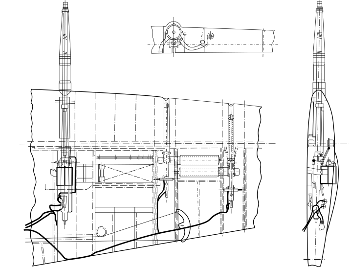

## Пушка “Hispano” Mk. II

### История развития

В преддверии Второй мировой войны в Великобритании была запущена программа разработки
пушечных истребителей и была приобретена лицензия на производство пушек HS.404. Выбор в
пользу разработки французских оружейников был сделан не сразу: первоначально
рассматривалась возможность приобретения лицензии на швейцарские пушки "OERLIKON". В
1936 году в Париже была устроена демонстрация действующего прототипа HS.404, который
показал явное преимущество перед "OERLIKON": при схожих габаритах и массе французская
пушка была несколько мощнее и гораздо скорострельнее. В результате французская пушка была
принята на вооружение Королевских ВВС под обозначением Hispano Mk.I. Тем не менее, немало
времени пришлось потратить, чтобы получить разрешение на покупку лицензии, утрясти все
необходимые формальности, организовать филиал компании "HISPANO" в Gratham (the British
Manufacturing And Research Company - BMARCO), перевести все чертежи из миллиметров в
дюймы, наладить производство, испытать и отладить прототипы пушек, а затем устранить все
трудности, связанные с установкой пушек в качестве крыльевых.

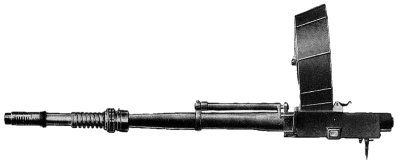

По этой причине пушки "Hispano" не успели сыграть значительной роли в Битве за Британию.
Лишь в 1940 году их начали устанавливать на самолеты - сначала на тяжелые истребители
"Westland Whirlwind", а чуть позже - на тяжелые истребители Bristol Type 156 "Beaufighter" (также
их иногда называли просто "Бо"). Таким образом, в распоряжении Королевских ВВС оказались
самолеты с мощным пушечным вооружением.

Тем временем, в ходе Битвы за Британию стало очевидно, что батарея из 8 пулеметов
винтовочного калибра - традиционное вооружение истребителей того времени - была
совершенно недостаточной, и основным оружием истребителей должны стать автоматические
пушки.

Воздушные бои на самолетах "Beaufighter", которые, в частности, применялись и в качестве
ночных истребителей, лишний раз подчеркнули необходимость разработки механизма
ленточного питания пушек. На этих самолетах перезарядкой пушек занимался оператор РЛС, и
занятие это было не из приятных: в полной темноте, в маневрирующем самолете, нужно было
практически наощупь заменять тяжелые 60-патронные барабанные магазины. Последовали
пробные попытки установки пушек в крыло на истребителях "Hurricane" и "Spitfire", в ходе
которых открылись новые проблемы: при совершении энергичных маневров пушки иногда
заклинивали, да и вообще работали весьма ненадежно. Так, в июне 1940 года в воздушных боях
приняла участие единственная эскадрилья пушечных истребителей "Spitfire Mk.IB" (19-я
эскадрилья), в которой каждый самолет был вооружен парой Hispano Mk.I. Результаты оказались
поистине катастрофическими: пушки давали столь частые отказы, причем иногда после первого
же выстрела, что пилоты потребовали заменить пушечные истребители на обычные, с
пулеметами винтовочного калибра.

Дело в том, что пушки предназначались главным образом для установки на двигатель, то есть
должны были прикрепляться к массивному, прочному и жесткому картеру блока цилиндров. При
крыльевой установке о достижении аналогичной жесткости крепления нельзя было и мечтать.
Кроме того, на "Spitfire" пушки пришлось устанавливать "на боку", чтобы разместить барабанные
магазины внутри крыла - это стало дополнительной причиной сбоев. Потребовалось в течение
длительного времени отлаживать механизмы пушек, чтобы добиться безотказной работы. Из-за
этого у командования ВВС возникли сомнения в пригодности пушек как таковых для вооружения
истребителей, а военное министерство даже выпустило спецификацию, предполагавшую
оснащение новых истребителей батареями из 12 пулеметов винтовочного калибра.

Впрочем, вскоре пушка была доработана и получила механизм ленточной подачи патронов,
разработанный компанией "Martin-Baker". Доработанная пушка стала поступать на вооружение
Королевских ВВС и самолетов морской авиации с 1941 года под обозначением "Hispano" Mk.II.
По 4 таких пушки вместо 8 пулеметов "Colt-Browning" устанавливали на истребители "Hurricane"
и на некоторые модификации истребителей "Spitfire", предназначавшиеся главным образом для
тропического и жаркого климата. На большинстве "Spitfire" устанавливали лишь по 2 пушки и по
4 пулемета винтовочного калибра или по 2 крупнокалиберных пулемета.

Также потребовалось усовершенствовать боеприпасы. Взрыватель стандартных осколочно-
фугасных снарядов оказался слишком чувствительным и часто срабатывал при попадании в
обшивку самолета, а не в силовые элементы конструкции, что было бы лучше. Испытания
показали, что в ряде случаев цельностальные практические снаряды, не имевшие заряда
взрывчатого вещества, наносили самолетам противника более серьезные повреждения. В 1941
году были созданы новые осколочно-фугасные снаряды с взрывателем замедленного действия,
а также осколочно-фугасно-зажигательные снаряды. Одновременно с ОФЗ-снарядами по-
прежнему использовались и практические снаряды - это продолжалось до разработки новых
полубронебойно-зажигательных снарядов. Полубронебойно-зажигательный снаряд представлял
собой корпус осколочно-фугасного снаряда, начиненный зажигательным составом S.R.379
(состав: алюминиево-магниевый сплав - 47 %, нитрат бария - 50 %, парафин - 3 %), а вместо
взрывателя устанавливался твердый стальной наконечник. Начиная с 1942 года стандартная
боеукладка для пушек Hispano состояла поровну из снарядов ОФЗ и ПБЗ, снаряды чередовались
два через два либо один через один.

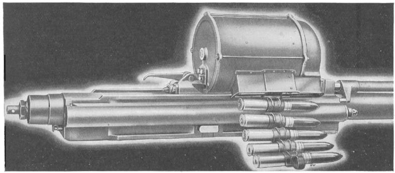

### Описание

Пушка по принципу работы автоматики является системой смешанного типа. Отпирание затвора
после выстрела производится давлением пороховых газов, отводимых через специальное
отверстие в стволе, на поршень штока. Отбрасывание затвора в заднее положение
осуществляется давлением газов на дно гильзы, как у оружия с отдачей затвора. Из-за такого
принципа работы автоматики пушку невозможно оснастить синхронизатором и применять для
стрельбы через диск винта.

### Основные данные пушки

- Калибр .... 20 мм.
- Общая длина … 2565 мм (с ограничителем отдачи), 2413,4 мм (с пламегасителем)
- Длина ствола … 1708 мм.
- Масса пушки с передним узлом крепления … 53,75 кг.
- Боеприпас … 20х110, практические, ОФ, ОФЗ, ПБЗ.
- Вес патрона … 0,255 кг.
- Темп стрельбы … 570 - 620 выстрелов в минуту.
- Начальная скорость снаряда … 853,4 м/сек.
- Число нарезов … 9.

Пушки устанавливаются в отсек крыла между 8 и 9 нервюрами. Передний узел крепления
выполнен на передней кромке крыла и состоит из двух эксцентриков, при помощи которых
регулировалось вертикальное и горизонтальное сведение пушек. Задний узел крепления
позволял занять пушке любое положение, заданное передним узлом при пристрелке. Для
обеспечения неподвижности механизма подачи снарядов при стрельбе из пушки, между
лонжероном и барабаном установлена тяга.

Пушка имеет ленточное питание, подача ленты осуществляется из короба.
Отсеки для снарядов располагаются между 10 и 13 нервюрами, за основным лонжероном. Отсек
вмещает 120 снарядов, нижняя панель и верхняя откидная крышка выполнены из листа
дюралюминия толщиной 10 S.W.G (3,251 мм.). Передняя стенка имеет толщину 6 мм для защиты
боекомплекта. Конструктивно в ОЧК выполнено 2 отсека для снарядов, но используется только
один - передний. Пустые звенья и стрелянные гильзы выбрасываются через прорези в обшивке
нижней поверхности.

### Боеприпасы

Патрон состоит из взрывателя, снаряда, порохового заряда, гильзы и капсюля. Для более
прочного соединения снаряда с гильзой дульце гильзы, после того как вставлен снаряд
закатывается, для чего на поясковой части снаряда имеется проточка. Гильза без закраины,
цельнотянутая с отверстием в донышке под установку капсюля. Капсюль после установки
фиксируется кольцевым кернением. На стык капсюля и донышка гильзы нанесен лак пурпурного
цвета. На корпусе снаряда выполнен ведущий поясок из меди. На все снаряды, кроме
полубронебойного (на головной части устанавливается стальной наконечник) и практического
устанавливаются взрыватели мгновенного действия №253. Модифицированный взрыватель
“OERLIKON” №254 Mark IV допущен к использованию как альтернативный.
В качестве порохового заряда используется пироксилиновый порох, в качестве взрывчатого
вещества в снарядах используется тетрил.

Производились следующие типы снарядов:

- Ball - практический снаряд. Представляет собой пустотелый снаряд, донышко которого
  закрыто диском, для предотвращения проникновения газов в снаряд. Окрашен в черный или
  голубой цвет.
- Tracer - трассирующий снаряд. Корпус снаряда снаряжен горящим составом, который
  поджигается от пороховых газов. Время горения 3,5 секунды. Окрашен в черный цвет и имеет
  маркировку в виде буквы Т красного цвета, либо красную полосу на головной части.
- A.P. - бронебойный, используется против бронированных целей и самолетной брони. Снаряд
  не имеет внутреннего наполнения, его заостренный носик имеет пластиковый колпачок.
  Поздние модификации снаряда без колпачка и имеют инертное снаряжение или бронебойный
  сердечник. Окрашен в черный цвет, носик снаряда в белый.
- A.P./Т (Day/Night) - бронебойный трассирующий дневной/ночной. Выполнен из бронебойной
  стали, без пластикового колпачка и имеет трассирующее наполнение для дневного или
  ночного применения. Окрашен в черный цвет, носик снаряда в белый, над ведущим пояском
  имеется белая или зеленая полоса.
- H.E.I. - снаряд содержит шашку зажигательного вещества и шашку взрывчатого вещества,
  шашки разделены между собой прокладкой из вощенной ткани. При ударе взрыватель
  подрывает взрывчатое вещество и инициируется горение зажигательного состава, что
  обеспечивает очень высокие температуры при подрыве и достаточно эффективно для поджига
  топлива. Нижняя часть снаряда окрашена в красный цвет, верхняя часть в темно-желтый.
  Носик взрывателя окрашен в зеленый цвет.
- S.A.P/I - полубронебойный, зажигательный снаряд. Боеприпас был разработан для поджига
  бронированных топливных баков самолетов. Корпус снаряда аналогичен снаряду H.E.I. с
  шашкой зажигательного вещества или с шашкой взрывчатого вещества и взрывателем, носик
  снаряда стальной. Окрашен в красный цвет, головная часть снаряда окрашена в белый цвет.
  Пробивные характеристики снаряда хуже, чем у бронебойного (A.P.).

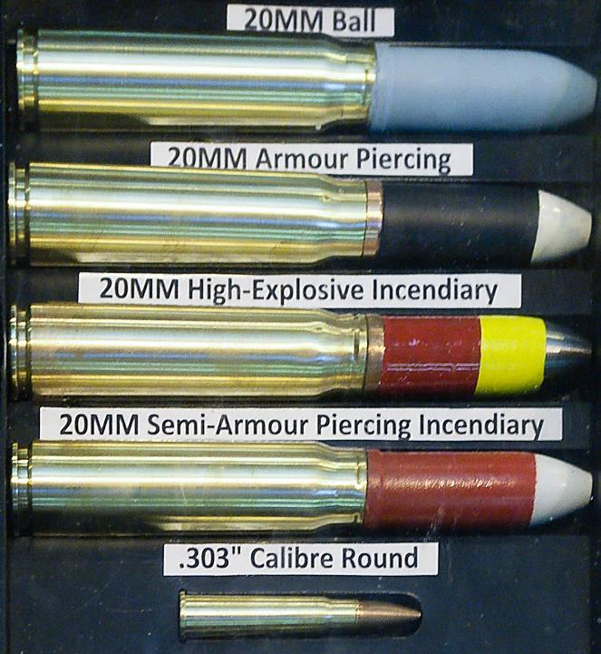

#### Осколочно-Фугасный, зажигательный снаряд (H.E.I)

Предназначен для поражения целей осколками и силой взрывной волны, а также для зажигания
бензина в бензобаках, не защищенных броней. Снаряд снабжен головным взрывателем
мгновенного действия, который обеспечивает разрыв снаряда при ударе в самое незначительное
препятствие (например, в обшивку самолета) и на расстоянии не более 10 см за преградой.
После разрыва снаряд делает рваное отверстие за второй, а иногда и в первой преграде
диаметром до 40 см, площадь поражения осколками достигает большей величины. Кроме своего
сильного осколочного и разрывного действия, снаряд воспламеняет бензин в бензобаках. Снаряд
содержит 7 грамм тетрила и 4.3 грамма зажигательного состава S.R.379.

#### Полубронебойный Зажигательный снаряд (S.A.P/I)

Предназначен для использования против самолетов, легкобронированных и других целей где
необходимо зажигательное действие. Увеличение воздействие снарядов на цель достигается
совместным применением осколочно-фугасно зажигательных снарядов.
Производилось три модификации боеприпасов, Mk.1Z, Mk.2Z и Mk.3Z. Конструкция снарядов
схожая, за исключением детонаторов, инициирующих зажигательный состав.
Вес боеприпасов со снарядами Mk.1Z и Mk.2Z составляет 266 грамм.
Боеприпас Mk.3Z весит примерно 265 грамм, имеет стандартную гильзу и снаряд. Снаряд
представляет собой стальной корпус, в носовой части которого выполнена внутренняя резьба
для накручивания стального наконечника. Перед установкой наконечника на резьбу и
прилегающую поверхность наносится клей R.D.1248 или герметик R.D.1229. Наконечник
фиксируют кернением после сборки снаряда. Донышко снаряда приварено к корпусу. Внутренняя
полость снаряда заполнена зажигательным составом, пластиковым корпусом детонатора. Между
корпусом детонатора и наконечником проложены диск из луженой латуни и текстильный диск.
В корпус детонатора устанавливается детонатор ZY весом приблизительно 0,39 грамм.
Детонатор аналогичен установленному в головном взрывателе D.A. №917 Mk.1.
Зажигательный состав представляет собой три шашки зажигательного состава из S.R.379,
каждая весом примерно 3 грамма, отделенные от детонатора бумажным диском.
Все три модификации пробивали броню толщиной 20 мм с расстояния 200 метров, при угле
встречи 90° и поджигали бензин, находящийся за броней.

## Пулемет “Colt-Browning”

### История развития

К середине 30-х годов руководство ВВС Великобритании внезапно осознало, что в части
авиационного стрелкового вооружения английская авиация безнадежно отстала от остальных
ведущих держав. И, как это обычно бывает, начались панические поиски адекватной замены
огромному пулеметному парку, оставшемуся со времен 10 - 20-х годов. В середине 20-х годов в
Туманный Альбион впервые попал новый американский пулемет Джона Мозеса Браунинга
"Browning М1919". Надо отдать должное американским инженерам фирмы "Colt", в надежде
выйти на английский рынок, они с огромным трудом смогли адаптировать свой пулемет под
английский патрон .303. Дело в том, что штатный бесфланцевый американский боеприпас ".30-
06 Springfield" слишком сильно отличался от английского патрона с фланцем. И для того чтобы
обеспечить надежное удаление пустой гильзы из патронника пришлось капитально переработать
экстрактор. Когда в 1925 году работы в этом направлении были проведены, фирма "Armstrong
Whitworth & Co Ltd" закупила для оценки шесть образцов пулеметов. Неспешные испытания
пулеметов "Browning М1919" проводились в Англии вплоть до 1931 года. Когда из США пришли
вести о появлении улучшенной авиационной версии ".30 Browning М2-AN", было немедленно
закуплено четыре экземпляра для дальнейших исследований.

В 1934 году в Великобритании были проведены конкурсные сравнительные испытания новых
образцов авиационных пулеметов, в которых помимо ".30 Browning М2 AN" и М1919 приняли
участие английский "Vickers-К" ("Vickers GO") и новая английская разработка - "Vickers-J" ("Vickers
Central Action") - последний из семейства пулеметов “Vikkers”, информация о котором весьма
скудна, известно лишь, что его техническая скорострельность достигала 1250 выстр/мин. Кроме
них в конкурсе участвовали французский "Darne", датский "Madsen", и новейший венгерский
пулемет "Gebauer Motorgeppuska 1926/31.Minta GKM". Венгерский "Gebauer", не смотря на
уникальную скорострельность в 2 тыс. выстр/мин, был признан слишком сложным
технологически, французский "Darne" не достаточно надежным. ТТХ новейшего "Vickers-J" не
произвели на заказчика никакого впечатления. Позже и датский "Madsen" также сошел с
дистанции, признанный слишком дорогим.

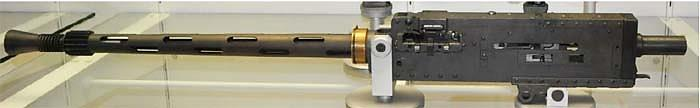

В результате в финал вышли два типа - американский "Browning М2 AN" и "Vickers-К". Легкий
пулемет ".30 caliber Browning М2 AN", был в значительной степени модифицирован по сравнению
с прототипом - пехотным станковым пулеметом М1919. В основе этих изменений лежало не
только изменение калибра ствола с американского стандартного калибра 0,30 (7.62 мм) на
английский 0,303 (7.7-мм), но и изменен был сам принцип автоматики. Дело в том, что в процессе
испытаний англичане выяснили, что отечественные патроны, снаряженные кордитом, попадая в
разогретый патронник, уже после 100 выстрелов непрерывной очередью, имели свойство
самопроизвольно воспламеняться. Это было неприятной особенностью всех автоматических
систем, работавших на основе "закрытого затвора", то есть, когда в перерывах между очередями
очередной патрон уже оказывался досланным в патронник и заперт затвором. Но с
американскими боеприпасами в зарядах которых использовался пироксилиновый порох, менее
чувствительный к нагреву, самопроизвольное воспламенение случалось редко. При
использовании же принципа открытого затвора, патрон попадал в патронник только после
нажатия на спусковой крючок. Ввиду этого в Великобритании, пришлось значительно
переработать конструкцию пулемета, чтобы обеспечить попадание очередного патрона в камору
только после нажатия на спуск. При этом, за счет введения в конструкцию задержки ударного
механизма, удалось сохранить способность пулемета к синхронизации, что всегда было
проблематично с системами, работающими на основе "открытого затвора". Однако, не смотря на
все ухищрения, до кондиции английский "Browning" удалось довести лишь к 1939 году. И тем не
менее, при использовании зажигательных боеприпасов случаи самовоспламенения патронов в
патроннике были делом довольно частым.

### Описание

Работа пулемета основана на принципе использования отдачи с коротким ходом ствола. При
каждой отдаче ствол перемещается назад на некоторое расстояние. Благодаря этому движению
происходит отпирание затвора и отбрасывание его назад. При этом преодолевается усилие
возвратной пружины. При движении назад затвор извлекает стреляную гильзу из патронника и
следующий очередной патрон из ленты, затем пружина возвращает затвор и ствол вперед,
досылая патрон в патронник, запирает ствол и после этого может быть произведен очередной
выстрел.

### Основные данные пулемета

- Калибр .... 0,303 дюйма.
- Общая длина … 3 фута 8,5 дюймов (1130 мм) (с пламегасителем)
- Длина ствола … 2 фута (609,6 мм).
- Масса … 21 фунт 14 унций (9,922 кг).
- Боеприпасы … Все типы патронов Mk. VII S.A.A.
- Масса патрона … от 22,9 до 25,45 грамм.
- Питание … ленточная подача.
- Темп стрельбы … 1150 выстрелов в минуту.
- Начальная скорость снаряда … 743,7 м/сек.
- Число нарезов … 5.
- Боезапас … 350 патронов на пулемет.

Пулеметы устанавливаются в отсек крыла между 13 и 14, 16 и 17 нервюрами соответственно.
Узлы крепления пулемета позволяли осуществить регулировку вертикального и горизонтального
сведения.

Пулеметы имеют ленточное питание, подача лент осуществляется из коробов. Короба
устанавливаются в отсеки между 14 и 16 нервюрами. Передний отсек для короба внутреннего
пулемета, задний для внешнего. Доступ к отсекам осуществляется через легкосъемный люк на
нижней поверхности крыла.

Пустые звенья и стрелянные гильзы выбрасываются через прорези в обшивке нижней
поверхности крыла.

### История патрона калибра 0,303 дюйма

С принятием на вооружение английской армии в 1888 году винтовки “Lee-Metford” началась
история этого известного патрона, который официально был принят на вооружение в 20 февраля
1889 года. Прообразом патрона явился 7,5мм швейцарский патрон “Schmidt-Rubin” с
выступающим фланцем.

Патрон получил большое распространение в Канаде и других частях Британской империи. Хотя
в 1908 году армией планировалась его замена на более совершенный, патрон пробыл на
вооружении Великобритании до 1957 года, когда его сменил 7,62х51мм патрон НАТО.
До 1892 года патрон снаряжался дымным порохом. До 1910 года патрон имел пулю со
сферической вершинкой и с оболочкой из медно-никелевого сплава.

В 1899 году на 1-й Гаагской конференции была принята “Декларация о неупотреблении легко
разворачивающихся и сплющивающихся пуль”. В результате чего которой пули приобрели
остроконечную форму и цельнометаллическую оболочку - так называемая форма “Spitzer”.
В 1910 году сферические пули были окончательно заменены на остроконечные и наряду с
прежним материалом оболочки стала использоваться стальная, покрытая томпаком. Патрон
выпускался многими странами и в настоящее время широко используется как охотничий.
За время Первой Мировой Войны одни только оружейные заводы Великобритании выпустили 7
000 000 000 патронов калибра 0,303 дюйма.

Наряду с цветовой маркировкой пуль, на донце гильзы помещался код (модель) пули. Все пули
мод. с I по VI имевшие сферическую вершинку, встречаются крайне редко и в таблице не
приводятся. Пули мод. II, III, IV, V относятся к экспансивным пулям, разработанным капитаном
английской армии Бертье Клэй (Bertie Clay), служившим в Индии в арсенале Дум-Дум (откуда и
пошло название).

Пуля мод.VII была основной в применении, сравнительно небольшой вес пули при достаточной
длине достигнут благодаря размещенному в носовой части пули сердечнику из алюминия или
бакелита, остальная же часть пули залита свинцом. Такая конструкция лучше стабилизирует
пулю в полете и при попадании в цель увеличивает опрокидывающий момент, нанося более
обширные повреждения. Пуля имела номинальную дульную скорость 2440 футов в секунду
(743,7 м/с) и имела скорость собственного вращения около 175 800 оборотов в минуту. Скорость
полета и вращения значительно уменьшались, но даже после пролета 800 метров, скорость пули
оставалась сверхзвуковой. Пролетающая мимо пуля слышна отчетливо.

На дальностях стрельбы свыше 300 ярдов (274,3 метра) траектория полета трассирующей пули
значительно отличалась от траектории полета тяжелой пули - она быстро теряла высоту.
Поэтому летчики, которые пристреливались по трассерам, получали промахи.
Дефицит специальных боеприпасов приводил к широкому использованию обычных патронов,
при снаряжении пулеметов использовались ленты набитые обычными, бронебойными,
зажигательно-трассирующими и зажигательными патронами. До тех пор, пока производство
специальных патронов не вышло на необходимый темп. К 1942 снаряжение производилось уже
в основном бронебойными и зажигательными (B Mk.VI) патронами. Патроны в ленте как правило
были одного типа. В качестве напоминания летчику что боезапас на исходе, перед крайними 50
патронами вставляли 5 трассирующих патрона.

Секундный залп 4-х пулеметов составлял 900 грамм. При скорострельности 20 выстрелов в
секунду и скорости полета пули примерно 740 м/с. Боекомплекта хватало на 17 секунд
непрерывного огня.

При испытаниях бронебойных патронов калибра 0,303 и немецких 7,92 мм, проводимых ВВС
Великобритании, выяснилось, что оба боеприпаса имеют схожие проблемы пробиваемости.
Стрельба выполнялась по задней части фюзеляжа бомбардировщика "Bleinheim" с расстояния
200 ярдов (183 метра). Броневая защита заднего стрелка представляла собой стальной лист
толщиной 4 мм. Пластина находилась под углом 60° к линии стрельбы. Результаты были
удручающими. Только 33% выпущенных пуль смогли достичь бронепластины, остальные пули
были рассеяны или даже застряли в элементах конструкции. И только 6% пуль пробили броню.
К слову, результаты немецкого боеприпаса были куда хуже, 23% и 1% соответственно.
Характеристики зажигательных боеприпасов также практически не отличались. Сравнительные
отстрелы по протектированным бакам бомбардировщика "Bleinheim" с расстояния 200 ярдов (183
метра) сзади, показали, что поджигающие способности зажигательно-трассирующего патрона B
Mk.IV ("Букингемские") обоих боеприпасов примерно равные. Бак поджигался от одного из 10
попаданий.

Зажигательный патрон B. Mk.VI "De Wilde" (названный в честь бельгийского изобретателя,
однако по факту полностью переработанной майором C. Aubrey Dixon), который содержал 0,5
грамма зажигательного состава S.R.365 (смеси содержащей нитрат бария, который
воспламенялся при ударе о цель) был эффективнее в два раза. Для поджига требовалось 1
попадание из пяти.

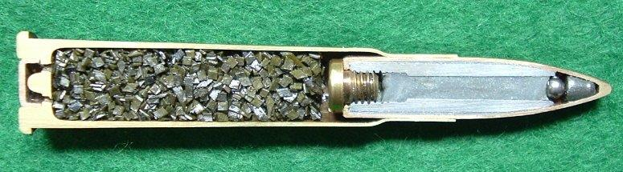

Производство патронов "De Wilde" началось в июне 1940 года и прошли испытания при
прикрытии эвакуации из Дюнкерка. Повышенная эффективность вкупе с визуальным
подтверждением попадания по цели однозначно понравилась летчикам.

0.303 Ball Mk. VII - патрон с тяжелой пулей. Пуля состоит из стальной плакированной
мельхиором оболочки и сердечника (носовая часть сердечника алюминиевая, остальная
свинцовая). Гильза латунная. Капсюль-воспламенитель состоит из томпаковой чашечки,
ударного состава и фольгового покрытия с лакировкой. Закреплен в гильзе круговым кернением.
Заряд - нитроглицериновый трубчатый неграфитованый порох.
Использовался против живой силы и самолетов противника.

0.303 Armor Piercing W Mk. VII - патрон с бронебойной пулей. Пуля состоит из стальной
плакированной мельхиором оболочки и свинцовой рубашки и стального бронебойного
сердечника.
Гильза латунная. Капсюль-воспламенитель с ударным составом на основе гремучей ртути и
бертолетовой соли. Заряд - нитроглицериновый пластинчатый порох.
Используется против легкобронированных целей, бронеавтомобилей, поездов и т.д.

0.303 Tracer G Mk. I - патрон с трассирующей пулей. Пуля состоит из стальной плакированной
мельхиором оболочки, томпакового стаканчика с трассирующим составом белого огня и
свинцового сердечника. Гильза латунная. Капсюль-воспламенитель состоит из томпакового
колпачка, ударного состава, фольгового покрытия, лакированного снаружи. Закреплен в гильзе
круговым кернением. Заряд - нитроглицериновый трубчатый порох (кордит).
Использовался для корректировки стрельбы. В дневное время трассер виден исключительно как
маленькая яркая точка со стороны донышка пули.

0.303 Incendiary B Mk. IV - патрон с зажигательной (фосфорной) пулей. Пуля состоит из
стальной плакированной мельхиором оболочки с отверстием на ведущей части, заполненным
легкоплавким сплавом, мельхиорового цилиндрика со свинцовым сердечником и канавками на
поверхности для прохода фосфора, заполняющего головную часть пули. Гильза латунная.
Капсюль-воспламенитель состоит из томпакового колпачка, ударного состава, фольгового
покрытия, лакированного снаружи. Закреплен в гильзе круговым кернением. Заряд - бездымный
пироксилиновый пластинчатый графитованный порох.
Использовался для поджога легковоспламеняющихся материалов таких как топливные баки и
т.д.

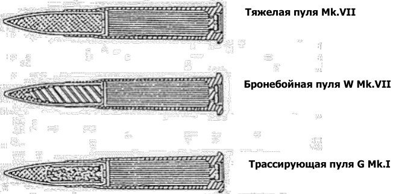

### Общие характеристики патрона

- Общая длина патрона – 76,7мм
- Длина гильзы - 56,1мм
- Диаметр пули - 7,9 мм
- Диаметр гильзы у дульца - 8,54 мм
- Диаметр корпуса у фланца - 11,65 мм
- Диаметр фланца - 13,44 мм
- Масса пули - от 11,13 грамм
- Масса патрона - 22,9 до 25,45 грамм.
- Начальная скорость - около 743,7 м/с

### Цветовая маркировка патронов

  Модель пули | Маркировка  на донце гильзы | Окраска капсюля | Примечание
------------------|------------------|------------|--------------------------------------
  Marк VII (Z)    |  VII             |   Фиолетовая |      С 1910г.
  Mark VIII Z     |  --              |   Фиолетовая |      Для пулеметов
  G Mark I (Z)    |  G               |   Красная    |      Трассер до 500м.
  PG Mark I (Z)   |  PGI             |   --         |      Для учебных стрельб, на гильзе у донца – синяя полоса
  G Mark II       |  G               |   Красная    |      Трассер до 900м.
  G Mark III      |  G               |   Красная    |      Трассер до 750м.- для флота
  G Mark IV (Z)   |  G               |   Красная    |      Дневной трассер до 500м.- для ВВС, носик пули окрашен в белый цвет
  G Mark V (Z)    |  G               |   Красная    |      Ночной трассер до 500м.- для ВВС, носик пули окрашен в серый цвет
  G Mark VI (VII, VIII) (Z) |  G     |  Красная     |    Подобен G Mark II, поступил вместо G Mark IV, трасса до 500м.
  W Mark I (Z)    |  W               |  Зеленая     |    Бронебойная пуля, носик окрашен в зеленый цвет
  B Mark III      |  B               |  Голубая     |    Тупоконечная зажигательная пуля, типа “Букингем”
  B Mark IV(Z)    |  --              |  --          |    Ступенчатая зажигательная пуля – против наблюдательных шаров
  B Mark VI       |  --              |  --          |    Зажигательная пуля, в носике стальной шарик и в донце заглушка на резьбе
  B Mark VII (Z)  |  --              |  --          |    Зажигательная пуля, сужение к донцу и каннелюра
  O Mark I (II)   |  О               |  Черная      |    Целеуказательная пуля, черная окраска носика
  O Mark III      |  О               |  Черная      |    То же, что O Mark I, но составом пуля снаряжалась с донца

Символ “Z” в обозначении патрона означает, что в качестве метательного заряда вместо кордита
применяется бездымный пироксилиновый пластинчатый графитованный порох.

Патроны совершенствовались на протяжении всей войны и имели несколько модификаций.
Крайняя модификация трассирующего патрона G Mk.VIII была принята на вооружение в 1945,
крайняя модификация бронебойного патрона W Mk.1Z в 1945 и крайняя модификация
зажигательного патрона B Mk.VII в 1942.

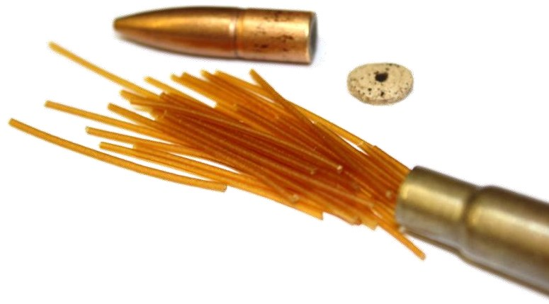

## Система обогрева оружия

Зачастую, на самолетах ранних модификаций, оружие отказывало из-за обмерзания смазки на
подвижных частях. Для обеспечения безотказной работы оружия на самолете применена система
обогрева. Горячий воздух для обогрева отбирается после радиаторов системы охлаждения и по
трубопроводам направляется в пулеметно-пушечные отсеки. Работа системы обогрева не
требует вмешательства летчика.

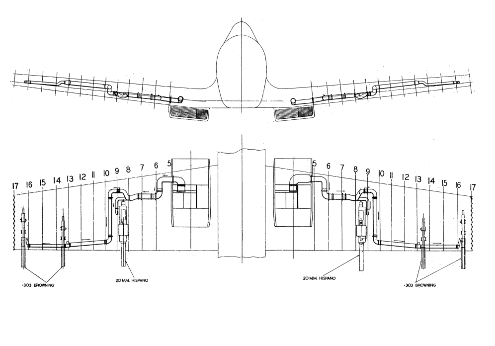

## Бомбовое вооружение

На некоторых самолетах выполнены модификации, позволяющие устанавливать бомбовые
держатели под ОЧК между 8 и 10 нервюрами. Каждый держатель крепился к 9-й нервюре к двум
узлам при помощи быстросъемных пальцев. Передний узел крепления держателя находился за
полкой основного лонжерона, задний узел на расстоянии 9 дюймов от переднего.
На левом борту кабины у 10 шпангоута устанавливался блок управления взрывателями. Сброс
бомбы осуществлялся от кнопки на торце рукоятки РУД. С левой стороны также устанавливался
рычаг механического сброса.

## Прицел

### Общее описание прицела

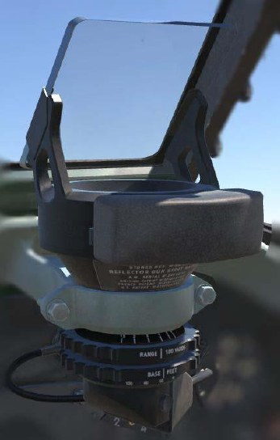

На самолете установлен коллиматорный прицел Mk.II (8B/2361). Он состоит из двух частей:

- оптического визира (коллиматора)
- дальномера

В оптическую схему входят сетка, объектив, отражатель и
светофильтр. Сетка имеет кольцо, центральную точку два
коротких вертикальных и два длинных горизонтальных
штриха. Сетка выцарапана на непрозрачном слое
плосковыгнутой линзы. Снизу сетка подсвечивается
электролампочкой. Лучи проходят через сетку объектива и
попадают на стекло отражателя. последнее установлено
под углом 45° к оптической оси системы. Отражатель
поворачивает лучи от источника света на 90° в сторону
наблюдателя, который видит изображение светящейся
сетки так, как будто она удалена от него в бесконечность.
Дальномер    прицела    состоит    из   двух   кулачков,
горизонтальных линий сетки прицела, двух шкал и двух
маховичков. Работа механизмов дальномера обеспечивает
изменение интервала между видимым изображением
горизонтальных линий сетки прицела. Этот переменный
интервал и является основой для измерения дальности до
цели. Величина интервала между линиями видимого
изображения сетки прицела зависит от угла поворота
маховичка дальности (верхнего) и от маховичка базы
(нижнего). Поворот верхнего маховичка учитывается
верхней шкалой, назваемой шкалой дальности, а нижнего
маховичка - нижней шкалой, называемой шкалой базы (размера цели). Шкала дальности
отградуирована в сотнях ярдов, а шкала базы в футах.

Шкала дальности

    В сотнях ярдов       1      2      3       4      5      6
    Ярды                 100    200    300     400    500    600
    Метры                91,4   182,8  274,2   365,6  457    548,4

Шкала базы

    Футы          40      50        60     70     80      90    100
    Метры         12,2    15,2      18,3   21,3   24,4    27,4   30,5

### Основные данные прицела

1. Угловая величина диаметра кольца сетки:

    - в градусах: 6° 44’
    - в тысячных: 118

2. Угловая величина радиуса кольца сетки:

    - в градусах: 3° 22’
    - в тысячных: 59

3. При стрельбе это кольцо соответствует упреждению для ракурса 2/4 и скорости полета
   цели 322 км/ч.
4. При ракурсе цели 1/4 скорость полета цели равна 644 км/ч.

### Метод прицеливания, принятый в ВВС Англии

В английских ВВС угол упреждения определяется по величине угловой скорости цели по
отношению к самолету, с которого производится стрельба. Эту скорость иногда называют
поперечной скоростью.

Такое решение задачи об упреждении требует от летчика умения определять на глаз
поперечную скорость цели. Пользуясь кольцом сетки прицела как меркой, стрелок может учесть
относительный угол упреждения при любой поперечной скорости цели. При этом надо знать
ракурс цели и направление относительного увеличения цели. Надо помнить, что при учете
упреждения по английскому способу через центр сетки прицела проходит линия относительного
движения цели, а не продолженная продольная ось самолет.

### Метод прицеливания, принятый в ВВС СССР

Прицел Mk.II имеет одно кольцо радиусом 59 тысячных. Прицелы ВВС СССР имеют два кольца:

- большое - с радиусом 105 тысячных
- малое - с радиусом 70 тысячных.

В основу расчета колец принимается ракурс 2/4 и скорость цели:

- для большого кольца - 600 км/час
- для малого кольца - 400 км/час

Большое кольцо используется для стрельбы по истребителям противника, а малое - для стрельбы
по бомбардировщикам.

Из сравнения этих данных следует, что при стрельбе с прицелом Mk.II по бомбардировщикам
противника при ракурсе 2/4 надо брать упреждение на 1/7 часть больше радиуса кольца, а при
стрельбе по истребителю при ракурсе ¼ надо брать упреждение на 1/8 часть меньше радиуса
кольца.

Во всех случаях прицеливания продолженная продольная ось самолета должна проходить через
центр кольца.

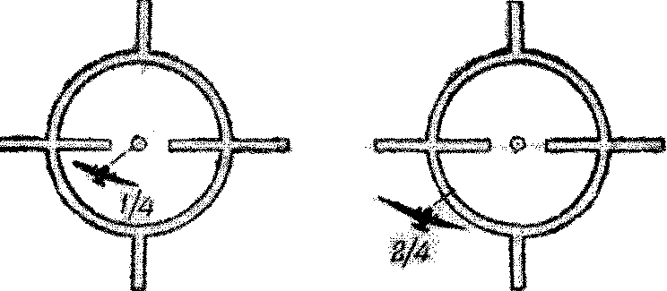

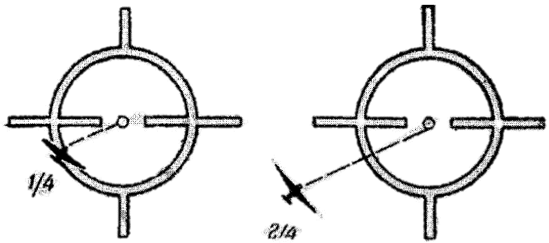

### Определение дальности до цели

Дальномерное устройство авиационных прицелов облегчает летчику определение дальности для
начала открытия стрельбы. В процессе стрельбы дальность не измеряется. Такое применение
дальномерного устройства позволяет ввести поправку в прицел установки на шкале дальности
и на шкале базы (размер цели) до полета или на этапе сближения с целью. В процессе сближения
с целью летчик следит за видимым размером цели. Когда размер цели станет равным раствору
между горизонтальными линиями сетки прицела, дальность до цели будет равна установленной
на шкале дальности. В этот момент следует начинать стрельбу, учтя упреждение согласно
ракурсу цели и типу самолета.
