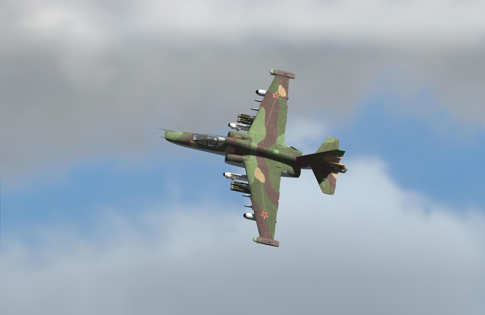
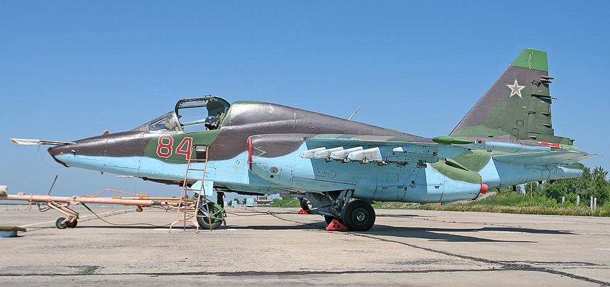

# Вводное описание

После принятия на вооружение самолета Су-25, который имел очень ограниченные возможности по поиску и поражению малоразмерных подвижных бронированных объектов, появилась необходимость в создании специализированного противотанкового самолета. В 1976 году было выпущено постановление ВПК при Совмине СССР, положившее начало работам по всепогодному штурмовику с противотанковым оружием.

В качестве основного противотанкового ракетного комплекса был принят ПТУР "Вихрь" с лазерно-лучевой системой наведения. Основной прицельный комплекс – "Шквал" обеспечивал поиск, автоматическое сопровождение целей и подсветку лазерным дальномером- целеуказателем "Причал".

Для действий в ночное время самолет мог оборудоваться подфюзеляжным контейнером с низкоуровневой телевизионной станцией "Меркурий", которая комплексировалась с оптикоэлектронным прицельным комплексом "Шквал".

Телевизионное изображение с прицельных систем поступает на установленный в правой верхней части приборной доски телевизионный индикатор ИТ-23М. "Шквал" обеспечивает 23- кpатное увеличение изображения цели, "Меркурий" - 5-кратное, позволяет распознавать цели на дальности: дом - 15 км, танк - 8-10 км, вертолет типа AH-64 - 6 км.

Основой информационной системы комплекса РЭБ является станция радиотехнической разведки (СРТР), которая обеспечивает обнаружение и пеленгацию наземных, бортовых и корабельных РЛС в секторе +/- 30 градусов по углу места и круговую по азимуту. Диапазон работы СРТР в 1,2-18 ГГц позволяет выявлять практически все существующие РЛС. Устанавливаемая станция постановки активных помех предназначена для противодействия современным и перспективным радиоэлектронным системам управления оружием симпульсным, непрерывным и квазинепрерывным излучением. Станция устанавливается в контейнерах, подвешиваемых на внешних подкрыльевых точках подвески. Для защиты от УР с ТГС применяются ложные тепловые цели. Устройство их выброса УВ-26 с комплектом 192 помеховых патронов имеется на самолете.

Для защиты от УР с ИК ГСН в хвостовой части фюзеляжа самолета в основании киля установлена станция оптико-электpонных помех "Сухогруз" - мощная цезиевая лампа с энергопотреблением 6 кВт создает амплитудно-модулированные помехи, сбивая работу ГСН УР.

Для борьбы с радарами ПВО противника самолет может быть оборудован подвесным контейнером целеуказания "Вьюга" или "Фантасмагория", который осуществляет целеуказание ГСН противорадарных ракет Х-58 и Х-25МПУ.

Производство самолетов Су-25Т было организовано на ТАГО, и к лету 1990 года на нем был построен первый самолет. В первой половине 1991 года завод выпустил первую установочную партию самолетов. Всего ТАГО успел до развала СССР выпустить опытную партию самолетов Су-25Т в количестве 8 машин. За период 1994-1996 гг. была выпущена серия из 12 машин Су- 25Т, часть самолетов была передана России, а часть - Министерству обороны Грузии. Производство самолетов Су-25 на ТАГО сопряжено со значительными трудностями экономического и политического порядка, что и обусловило целесообразность и необходимость переноса серийного производства самолетов на территорию России.

{!abbr.md!}
